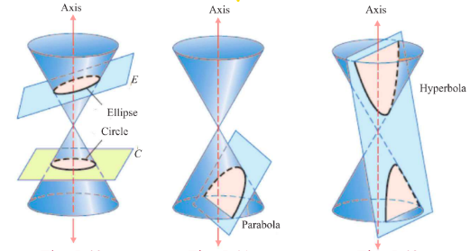
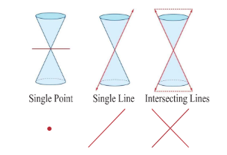

### 5.4 Conic Sections

In addition to the method to determine the curves discussed in Section 5.3, geometric description of a conic section is given here. The graph of a circle, an ellipse, a parabola, or a hyperbola can be obtained by the intersection of a plane and a double napped cone. Hence, these figures are referred to as conic sections or simply conics.

#### 5.4.1 Geometric description of conic section

A plane perpendicular to the axis of the cone (plane $C$ ) intersecting any one nape of the double napped cone yields a circle (Fig. 5.40). The plane $E$ , tilted so that it is not perpendicular to the axis, intersecting any one nape of the double napped cone yields an ellipse (Fig. 5.40). When the plane is parallel to a side of one nape of the double napped cone, the plane intersecting the cone yields a parabola (Fig. 5.41). When the plane is parallel to the plane containing the axis of the double cone, intersecting the double cone yields a hyperbola (Fig. 5.42).

#### 5.4.2 Degenerate Forms

Degenerate forms of various conics (Fig. 5.43) are either a point or a line or a pair of straight lines or two intersecting lines or empty set depending on the angle (nature) of intersection of the plane with the double napped cone and passing through the vertex or when the cones degenerate into a cylinder with the plane parallel to the axis of the cylinder.

If the intersecting plane passes through the vertex of the double napped cone and perpendicular to the axis, then we obtain a point or a point circle. If the intersecting plane passes through a generator then we obtain a line or a pair of parallel lines, a degenerate form of a parabola for which $A = B = C = 0$ in general equation of a conic and if the intersecting plane passes through the axis and passes through the vertex of the double napped cone, then we obtain intersecting lines a degenerate of the hyperbola.

> **Remark**
>
> In the case of an ellipse $(0< e< 1)$ where $e = \sqrt{1 - \frac{b^2}{a^2}}$ . As $e\rightarrow 0$, $\frac{b}{a}\rightarrow 1$ i.e., $b\rightarrow a$ or the lengths of the minor and major axes are close in size. i.e., the ellipse is close to being a circle. As $e\rightarrow 1$, $\frac{b}{a}\rightarrow 0$ and the ellipse degenerates into a line segment i.e., the ellipse is flat.
>
> In the case of a hyperbola $(e > 1)$ where $e = \sqrt{1 + \frac{b^2}{a^2}}$ . As $e\rightarrow 1$, $\frac{b}{a}\rightarrow 0$ i.e., as $e\rightarrow 1$ $b$ is very small related to $a$ and the hyperbola becomes a pointed nose. As $e\rightarrow \infty$, $b$ is very large related to $a$ and the hyperbola becomes flat.

#### 5.4.3 Identifying the conics from the general equation of the conic

$$
Ax^{2} + Bxy + Cy^{2} + Dx + Ey + F = 0.
$$

The graph of the second degree equation is one of a circle, parabola, an ellipse, a hyperbola, a point, an empty set, a single line or a pair of lines. When,

(1) $A = C = 1$, $B = 0$, $D = -2h$, $E = -2k$, $F = h^2 + k^2 - r^2$ the general equation reduces to $(x - h)^2 + (y - k)^2 = r^2$ , which is a circle.

(2) $B = 0$ and either $A$ or $C = 0$ , the general equation yields a parabola under study, at this level.

(3) $A \neq C$ and $A$ and $C$ are of the same sign, the general equation yields an ellipse.

(4) $A \neq C$ and $A$ and $C$ are of opposite signs, the general equation yields a hyperbola

(5) $A = C$ and $B = D = E = F = 0$ , the general equation yields a point $x^{2} + y^{2} = 0$ .

(6) $A = C = F$ and $B = D = E = 0$ , the general equation yields an empty set $x^{2} + y^{2} + 1 = 0$ , as there is no real solution.

(7) $A \neq 0$ or $C \neq 0$ and others are zeros, the general equation yield coordinate axes.

(8) $A = -C$ and rests are zero, the general equation yields a pair of lines $x^{2} - y^{2} = 0$ .

**Example 5.28**

Identify the type of the conic for the following equations:

(1) $16y^{2} = -4x^{2} + 64$ $\qquad$ (2) $x^{2} + y^{2} = -4x - y + 4$

(3) $x^{2} - 2y = x + 3$ $\qquad$ (4) $4x^{2} - 9y^{2} - 16x + 18y - 29 = 0$

**Solution**

| Q.no. | Equation | Condition | Type of the conic |
| :--- | :--- | :--- | :--- |
| 1 | $16y^{2} = -4x^{2} + 64$ | 3 | Ellipse |
| 2 | $x^{2} + y^{2} = -4x - y + 4$ | 1 | Circle |
| 3 | $x^{2} - 2y = x + 3$ | 2 | parabola |
| 4 | $4x^{2} - 9y^{2} - 16x + 18y - 29 = 0$ | 4 | Hyperbola |

**EXERCISE 5.3**

Identify the type of conic section for each of the equations.

1. $2x^{2} - y^{2} = 7$
2. $3x^{2} + 3y^{2} - 4x + 3y + 10 = 0$
3. $3x^{2} + 2y^{2} = 14$
4. $x^{2} + y^{2} + x - y = 0$
5. $11x^{2} - 25y^{2} - 44x + 50y - 256 = 0$
6. $y^{2} + 4x + 3y + 4 = 0$
