## 5.3. Conics

> **Definition 5.2**
>
> A conic is the locus of a point which moves in a plane, so that its distance from a fixed point bears a constant ratio to its distance from a fixed line not containing the fixed point.
>
> The fixed point is called focus, the fixed line is called directrix and the constant ratio is called eccentricity, which is denoted by $e$ .
>
> (i) If this constant $e = 1$ then the conic is called a parabola
> 
> (ii) If this constant $e < 1$ then the conic is called a ellipse
>
> (iii) If this constant $e > 1$ then the conic is called a hyperbola

#### 5.3.1 The general equation of a Conic

Let $S(x_{1},y_{1})$ be the focus, $l$ the directrix, and $e$ be the eccentricity. Let $P(x,y)$ be the moving point.

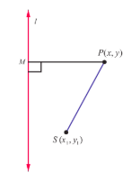

By the definition of conic, we have

$$
\frac{SP}{PM} = \mathrm{constant} = e,
$$

Where $SP = \sqrt{(x - x_{1})^{2} + (y - y_{1})^{2}}$ and $PM =$ perpendicular distance from $P(x,y)$ to the line $lx + my + n = 0$ $= \left|\frac{lx + my + n}{\sqrt{l^{2} + m^{2}}}\right|$.

From (1) we get $SP^{2} = e^{2}PM^{2}$

$$
\Rightarrow (x - x_{1})^{2} + (y - y_{1})^{2} = e^{2}\left[\frac{lx + my + n}{\sqrt{l^{2} + m^{2}}}\right]^{2}.
$$

On simplification the above equation takes the form of general second- degree equation

$$
Ax^{2} + Bxy + Cy^{2} + Dx + Ey + F = 0
$$

$$
A = 1 - \frac{e^{2}l^{2}}{l^{2} + m^{2}}, B = -\frac{2l m e^{2}}{l^{2} + m^{2}}, C = 1 - \frac{e^{2}m^{2}}{l^{2} + m^{2}}
$$

Now,

$$
B^{2} - 4AC = \frac{4l^{2}m^{2}e^{4}}{(l^{2} + m^{2})^{2}} - 4\left(1 - \frac{e^{2}l^{2}}{l^{2} + m^{2}}\right)\left(1 - \frac{e^{2}m^{2}}{l^{2} + m^{2}}\right)
$$

$$
= 4(e^{2} - 1)
$$

yielding the following cases:

(i) $B^{2} - 4AC = 0 \Leftrightarrow e = 1 \Leftrightarrow$ the conic is a parabola,

(ii) $B^{2} - 4AC < 0 \Leftrightarrow 0 < e < 1 \Leftrightarrow$ the conic is an ellipse,

(iii) $B^{2} - 4AC > 0 \Leftrightarrow e > 1 \Leftrightarrow$ the conic is a hyperbola.

#### 5.3.2 Parabola

Since $e = 1$ , for a parabola, we note that the parabola is the locus of points in a plane that are equidistant from both the directrix and the focus.

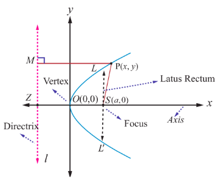

(i) Equation of a parabola in standard form with vertex at $(0,0)$

Let $S$ be the focus and $l$ be the directrix.

Draw $SZ$ perpendicular to the line $l$

Let us assume $SZ$ produced as $x$ - axis and the perpendicular bisector of $SZ$ produced as $y$ - axis. The intersection of this perpendicular bisector with $SZ$ be the origin $O$ .

Let $SZ = 2a$ . Then $S$ is $(a,0)$ and the equation of the directrix is $x + a = 0$ Let $P(x,y)$ be the moving point in the locus that yield a parabola. Draw $PM$ perpendicular to the directrix. By definition, $e = \frac{SP}{PM} = 1$ . So, $SP^{2} = PM^{2}$ Then, $(x - a)^{2} + y^{2} = (x + a)^{2}$ . On simplifying, we get $y^{2} = 4ax$ which is the equation of the parabola in the standard form.

The other standard forms of parabola are $y^{2} = -4ax$, $x^{2} = 4ay$, and $x^{2} = -4ay$

> **Definition 5.3**
>
> * The line perpendicular to the directrix and passing through the focus is known as the Axis of the parabola.
> * The intersection point of the axis with the curve is called vertex of the parabola
> * Any chord of the parabola, through its focus is called focal chord of the parabola
> * The length of the focal chord perpendicular to the axis is called latus rectum of the parabola

**Example 5.14**

Find the length of Latus rectum of the parabola $y^{2} = 4ax$.

**Solution**

Equation of the parabola is $y^{2} = 4ax$

Latus rectum $LL^{\prime}$ passes through the focus $(a,0)$ . Refer (Fig. 5.18)

Hence the point $L$ is $(a,y_{1})$

Therefore $y_{1}^{2} = 4a^{2}$

Hence $y_{1} = \pm 2a$

The end points of latus rectum are $(a,2a)$ and $(a, - 2a)$

Therefore length of the latus rectum $LL^{\prime} = 4a$

> **Note**
>
> The standard form of the parabola $y^{2} = 4ax$ has for its vertex $(0,0)$ , axis as $x$ - axis, focus as $(a,0)$ . The parabola $y^{2} = 4ax$ lies completely on the non- negative side of the $x$ - axis. Replacing $y$ by $- y$ in $y^{2} = 4ax$ , the equation remains the same. So the parabola $y^{2} = 4ax$ is symmetric about $x$ - axis; that is, $x$ - axis is the axis and symmetry of $y^{2} = 4ax$

(ii) Parabolas with vertex at $(h,k)$

When the vertex is $(h,k)$ and the axis of symmetry is parallel to $x$ - axis, the equation of the parabola is either $(y - k)^{2} = 4a(x - h)$ or $(y - k)^{2} = - 4a(x - h)$ (Fig. 5.19, 5.20).

When the vertex is $(h,k)$ and the axis of symmetry is parallel to $y$ - axis, the equation of the parabola is either $(x - h)^{2} = 4a(y - k)$ or $(x - h)^{2} = - 4a(y - k)$ (Fig. 5.21, 5.22).

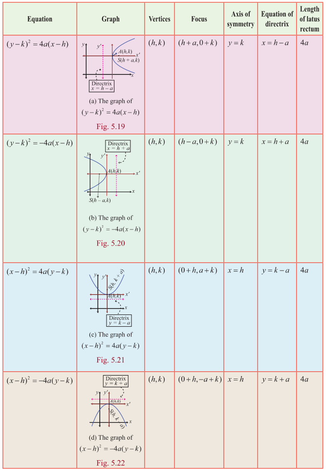

#### 5.3.3 Ellipse

We invoke that an ellipse is the locus of a point which moves such that its distance from a fixed point (focus) bears a constant ratio (eccentricity) less than unity its distance from its directrix bearing a constant ratio $e$ $(0 < e < 1)$.

(i) Equation of an Ellipse in standard form

Let $S$ be a focus, $l$ be a directrix, $e$ be the eccentricity $(0< e< 1)$ and $P(x,y)$ be the moving point. Draw $SZ$ and $PM$ perpendicular to $l$

Let $A$ and $A^{\prime}$ be the points which divide $SZ$ internally and externally in the ratio $e:1$ respectively. Let $AA^{\prime} = 2a$ . Let the point of intersection of the perpendicular bisector with $AA^{\prime}$ be $C$ . Therefore $CA = a$ and $CA^{\prime} = a$

Choose $C$ as origin and $CZ$ produced as $x$ - axis and the perpendicular bisector of $AA^{\prime}$ produced as $y$ - axis.

By definition,

$$
\begin{aligned}
\frac{SA}{AZ} = \frac{e}{1} \quad \text{and} \quad \frac{SA^{\prime}}{A^{\prime}Z} = \frac{e}{1} \\
SA = e AZ \quad \text{and} \quad SA^{\prime} = e A^{\prime}Z \\
CA - CS = e(CZ - CA) \quad \text{and} \quad A^{\prime}C + CS = e(A^{\prime}C + CZ) \\
a - CS = e(CZ - a) \dots (1) \quad \text{and} \quad a + CS = e(a + CZ) \dots (2)
\end{aligned}
$$

(2) + (1) gives $CZ = \frac{a}{e}$ and (2) - (1) gives $CS = ae$

Therefore $M$ is $\left(\frac{a}{e},y\right)$ and $S$ is $(ae,0)$

By the definition of a conic, $\frac{SP}{PM} = e \Rightarrow SP^{2} = e^{2}PM^{2}$

$$
\Rightarrow (x - ae)^{2} + (y - 0)^{2} = e^{2}\left[\left(x - \frac{a}{e}\right)^{2} + 0\right]
$$

which on simplification yields $\frac{x^{2}}{a^{2}} + \frac{y^{2}}{a^{2}(1 - e^{2})} = 1$.

Since $1 - e^{2}$ is a positive quantity, write $b^{2} = a^{2}(1 - e^{2})$

$ae = c$, $b^{2} = a^{2} - c^{2}$.

Hence we obtain the locus of $P$ as $\frac{x^{2}}{a^{2}} + \frac{y^{2}}{b^{2}} = 1$ which is the equation of an ellipse in standard form and note that it is symmetrical about $x$ and $y$ axis.

> **Definition 5.4**
>
> (1) The line segment $AA^{\prime}$ is called the major axis of the ellipse and is of length $2a$
>
> (2) The line segment $BB^{\prime}$ is called the minor axis of the ellipse and is of length $2b$
> 
> (3) The line segment $CA =$ the line segment $CA^{\prime} =$ semi major axis $= a$ and the line segment $CB =$ the line segment $CB^{\prime} =$ semi minor axis $= b$
>
> (4) By symmetry, taking $S^{\prime}(-ae,0)$ as focus and $x = -\frac{a}{e}$ as directrix $l^{\prime}$ gives the same ellipse.
>
> Thus, we see that an ellipse has two foci, $S(ae,0)$ and $S^{\prime}(- ae,0)$ and two vertices $A(a,0)$ and $A^{\prime}(- a,0)$ and also two directrices, $x = \frac{a}{e}$ and $x = -\frac{a}{e}$ .

**Example 5.15**

Find the length of Latus rectum of the ellipse $\frac{x^{2}}{a^{2}} + \frac{y^{2}}{b^{2}} = 1$ .

**Solution**

The Latus rectum $LL^{\prime}$ (Fig. 5.22) of an ellipse $\frac{x^{2}}{a^{2}} + \frac{y^{2}}{b^{2}} = 1$ passes through $S(ae,0)$ .

Hence $L$ is $(ae,y_{1})$ .

Therefore,

$$
\frac{a^{2}e^{2}}{a^{2}} + \frac{y_{1}^{2}}{b^{2}} = 1
$$

$$
\frac{y_{1}^{2}}{b^{2}} = 1 - e^{2}
$$

$$
y_{1}^{2} = b^{2}(1 - e^{2})
$$

$$
= b^{2}\left(\frac{b^{2}}{a^{2}}\right) \quad \left(\text{since } e^{2} = 1 - \frac{b^{2}}{a^{2}}\right)
$$

$$
y_{1} = \pm \frac{b^{2}}{a}.
$$

That is, the end points of Latus rectum $L$ and $L^{\prime}$ are $\left(ae,\frac{b^{2}}{a}\right)$ and $\left(ae, -\frac{b^{2}}{a}\right)$ .

Hence the length of latus rectum $LL^{\prime} = \frac{2b^{2}}{a}$ .

(ii) Types of ellipses with centre at $(h,k)$

(a) Major axis parallel to the $x$ -axis

From Fig. 5.24

$$
\frac{(x - h)^{2}}{a^{2}} + \frac{(y - k)^{2}}{b^{2}} = 1, a > b
$$

The length of the major axis is $2a$ . The length of the minor axis is $2b$ . The coordinates of the vertices are $(h + a,k)$ and $(h - a,k)$ , and the coordinates of the foci are $(h + c,k)$ and $(h - c,k)$ where $c^{2} = a^{2} - b^{2}$ .

(b) Major axis parallel to the $y$ -axis

From Fig. 5.25

$$
\frac{(x - h)^{2}}{b^{2}} + \frac{(y - k)^{2}}{a^{2}} = 1, a > b
$$

The length of the major axis is $2a$ . The length of the minor axis is $2b$ . The coordinates of the vertices are $(h,k + a)$ and $(h,k - a)$ , and the coordinates of the foci are $(h,k + c)$ and $(h,k - c)$ , where $c^{2} = a^{2} - b^{2}$ .

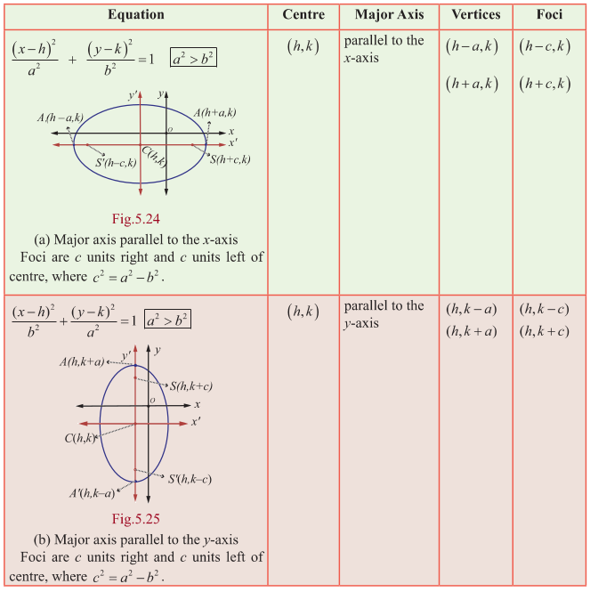

> **Theorem 5.5**
>
> The sum of the focal distances of any point on the ellipse is equal to length of the major axis.
>

**Proof**

Let $P(x, y)$ be a point on the ellipse $\frac{x^2}{a^2} + \frac{y^2}{b^2} = 1$ .

Draw $MM'$ through $P$ , perpendicular to directrices $l$ and $l'$ .

Draw $PN \perp l$ to $x$ -axis.

By definition

$SP = ePM$

$= eNZ$

$= e[CZ - CN]$

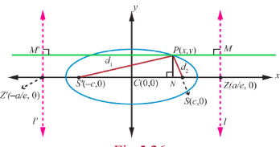

$= e \left[ \frac{a}{e} - x \right] = a - ex$ $\dots$ (1)

and

$$
\begin{aligned}
SP^{\prime} &= ePM^{\prime} \\
&= e[CN + CZ^{\prime}] \\
&= e\left[x + \frac{a}{e}\right] = ex + a
\end{aligned}
$$

Hence, $SP + SP^{\prime} = a - ex + a + ex = 2a$

> **Remark**
>
> When $b = a$ , the equation $\frac{(x - h)^2}{a^2} + \frac{(y - k)^2}{b^2} = 1$ , becomes $(x - h)^2 + (y - k)^2 = a^2$ the equation of circle with centre $(h,k)$ and radius $a$ .
>
> When $b = a$, $e = \sqrt{1 - \frac{a^2}{a^2}} = 0$ . Hence the eccentricity of the circle is zero.
>
> Further, $\frac{SP}{PM} = 0$ implies $PM \to \infty$ . That is, the directrix of the circle is at infinity.
>
> Auxiliary circle or circumcircle is the circle with length of major axis as diameter and Incircle is the circle with length of minor axis as diameter. They are given by $x^2 + y^2 = a^2$ and $x^2 + y^2 = b^2$ respectively.

#### 5.3.4 Hyperbola

We invoke that a hyperbola is the locus of a point which moves such that its distance from a fixed point (focus) bears a constant ratio (eccentricity) greater than unity its distance from its directrix, bearing a constant ratio $e$ ( $e > 1$ ).

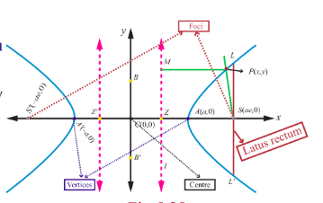

(i) Equation of a Hyperbola in standard form with centre at $(0,0)$

Let $S$ be a focus, $l$ be the directrix line, $e$ be the eccentricity $e > 1$ and $P(x,y)$ be the moving point. Draw $SZ$ and $PM$ perpendicular to $l$ .

Let $A$ and $A'$ be the points which divide $SZ$ internally and externally in the ratio $e:1$ respectively.

Let $AA' = 2a$ . Let the point of intersection of the perpendicular bisector with $AA'$ be $C$ . Then $CA = CA' = a$ Choose $C$ as origin and the line $CZ$ produced as $x$ - axis and the perpendicular bisector of $AA'$ as $y$ - axis.

By definition, $\frac{AS}{AZ} = e$ and $\frac{A'S}{A'Z} = e$ .

$\Rightarrow \quad AS = eAZ \quad A'S = eA'Z$

$\Rightarrow \quad CS - CA = e(CA - CZ) \quad A'C + CS = e(A'C + CZ)$

$\Rightarrow \quad CS - a = e(a - CZ) \dots (1) \quad a + CS = e(a + CZ) \dots (2)$

$(1) + (2)$ gives $CS = ae$ and $(2) - (1)$ gives $CZ = \frac{a}{e}$ .

Hence, the coordinates of $S$ are $(ae, 0)$ . Since $PM = x - \frac{a}{e}$ , the equation of directrix is $x - \frac{a}{e} = 0$ .

Let $P(x, y)$ be any point on the hyperbola.

By the definition of a conic,

$\frac{SP}{PM} = e \implies SP^2 = e^2 PM^2$ .

Then $(x - ae)^2 + (y - 0)^2 = e^2 \left( x - \frac{a}{e} \right)^2$

$\Rightarrow \quad (x - ae)^2 + y^2 = (ex - a)^2$

$\Rightarrow \quad (e^2 - 1)x^2 - y^2 = a^2(e^2 - 1)$

$\Rightarrow \quad \frac{x^2}{a^2} - \frac{y^2}{a^2(e^2 - 1)} = 1$ .

Since $e > 1, a^2(e^2 - 1) > 0$ . Setting $a^2(e^2 - 1) = b^2$ , we obtain the locus of $P$ as

$\frac{x^2}{a^2} - \frac{y^2}{b^2} = 1$ which is the equation of a Hyperbola in standard form and note that it is symmetrical about $x$ and $y$ -axes.

Taking $ae = c$ , we get $b^2 = c^2 - a^2$ .

> **Definition 5.5**
>
> 1. The line segment $AA'$ is the **transverse** axis of length $2a$ .  
> 2. The line segment $BB'$ is the **conjugate** axis of length $2b$ .  
> 3. The line segment $CA =$ the line segment $CA' =$ **semi transverse axis** $= a$ and the line segment $CB =$ the line segment $CB' =$ **semi conjugate axis** $= b$ .  
> 4. By symmetry, taking $S'(-ae, 0)$ as focus and $x = -\frac{a}{e}$ as directrix $l'$ gives the same hyperbola.  
   >Thus we see that a hyperbola has two foci $S(ae, 0)$ and $S'(-ae, 0)$ , two vertices $A(a, 0)$ and $A'(-a, 0)$ and two directrices $x = \frac{a}{e}$ and $x = -\frac{a}{e}$ .

Length of latus rectum of hyperbola is $\frac{2b^2}{a}$ , which can be obtained along lines as that of the ellipse.

> **Asymptotes**
>
> Let $P(x, y)$ be a point on the curve defined by $y = f(x)$ , which moves further and further away from the origin such that the distance between $P$ and some fixed line tends to zero. This fixed line is called an **asymptote**.  
> Note that the hyperbolas admit asymptotes while parabolas and ellipses do not.

(ii) Types of Hyperbola with centre at $(h, k)$
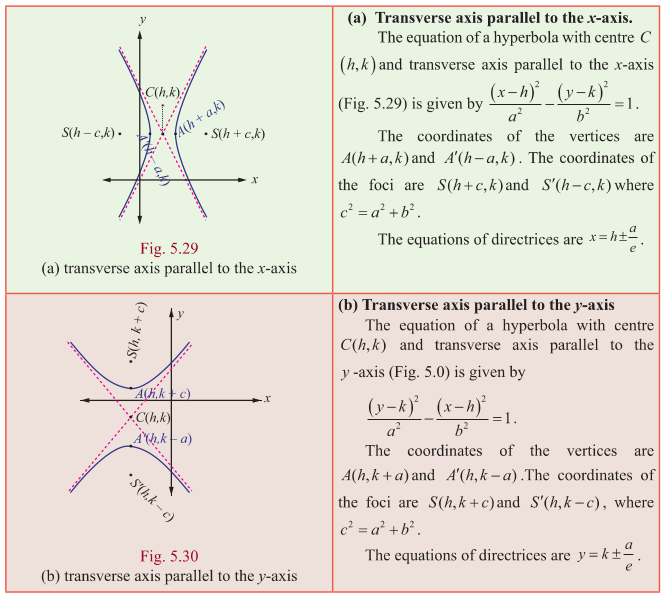

> **Remark**
>
> (1) The circle described on the transverse axis of hyperbola as its diameter is called the auxiliary circle of the hyperbola. Its equation is $x^{2} + y^{2} = a^{2}$ .
>
> (2) The absolute difference of the focal distances of any point on the hyperbola is constant and is equal to length of transverse axis. That is, $|PS - PS'| = 2a$ . (can be proved similar that of ellipse)

> So far we have discussed four standard types of parabolas, two types of ellipses and two types of hyperbolas. There are plenty of parabolas, ellipses and hyperbolas whose equations cannot be classified under the standard types, For instance consider the following parabola, ellipse, and hyperbola.
>
> 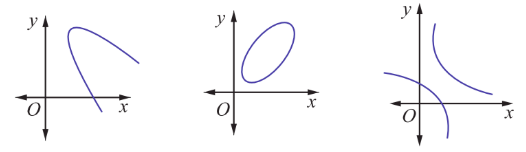
>
> By a suitable transformation of coordinate axes they can be represented by standard equations.

**Example 5.16**

Find the equation of the parabola with focus $\left(-\sqrt{2},0\right)$ and directrix $x = \sqrt{2}$ .

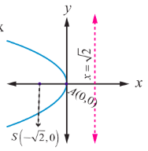

**Solution**

Parabola is open left and axis of symmetry as $x$ - axis and vertex $(0,0)$ .

Then the equation of the required parabola is

$$
(y - 0)^2 = -4\sqrt{2} (x - 0)
$$
$$
\Rightarrow y^2 = -4\sqrt{2} x.
$$

**Example 5.17**

Find the equation of the parabola whose vertex is $(5, - 2)$ and focus $(2, - 2)$ .

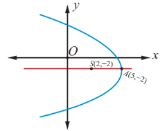

**Solution**

Given vertex $A(5, - 2)$ and focus $S(2, - 2)$ and the focal distance

$AS = a = 3.$

Parabola is open left and symmetric about the line parallel to $x$ - axis.

Then, the equation of the required parabola is

$$
(y + 2)^2 = -4(3)(x - 5)
$$
$$
\Rightarrow y^2 + 4y + 4 = -12x + 60
$$
$$
\Rightarrow y^2 + 4y + 12x - 56 = 0.
$$

**Example 5.18**

Find the equation of the parabola with vertex $(- 1, - 2)$ , axis parallel to $y$ - axis and passing through $(3,6)$ .

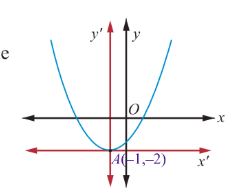

**Solution**

Since axis is parallel to $y$ - axis the required equation of the parabola is

$$
(x + 1)^2 = 4a(y + 2).
$$

Since this passes through $(3,6)$ , we get

$$
(3 + 1)^2 = 4a(6 + 2)
$$

$$
\Rightarrow a = \frac{1}{2}.
$$

Then the equation of parabola is $(x + 1)^2 = 2(y + 2)$ which on simplifying yields,

$$
x^{2} + 2x - 2y - 3 = 0.
$$

**Example 5.19**

Find the vertex, focus, directrix, and length of the latus rectum of the parabola $x^{2} - 4x - 5y - 1 = 0$ .

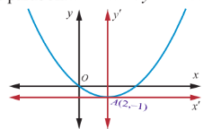

**Solution**

For the parabola,

$$
x^{2} - 4x - 5y - 1 = 0
$$
$$
\Rightarrow x^{2} - 4x = 5y + 1
$$
$$
\Rightarrow x^{2} - 4x + 4 = 5y + 1 + 4.
$$

$(x - 2)^{2} = 5(y + 1)$ which is in standard form. Therefore, $4a = 5$ and the vertex is $(2, - 1)$ , and the focus is $\left(2,\frac{1}{4}\right)$ . Equation of directrix is $y - k + a = 0$ $y + 1 + \frac{5}{4} = 0$ $4y + 9 = 0$ Length of latus rectum 5 units.

**Example 5.20**

Find the equation of the ellipse with foci $(\pm 2,0)$ , vertices $(\pm 3,0)$ .

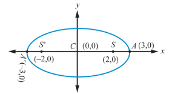

**Solution**

From Fig. 5.36, we get

$SS^{\prime} = 2c$ and $2c = 4$ ; $A^{\prime}A = 2a = 6$

$\Rightarrow c = 2$ and $a = 3$,

$\Rightarrow b^{2} = a^{2} - c^{2} = 9 - 4 = 5.$

Major axis is along $x$ - axis, since $a > b$ .

Centre is $(0,0)$ and Foci are $(\pm 2,0)$ .

Therefore, equation of the ellipse is $\frac{x^{2}}{9} + \frac{y^{2}}{5} = 1$ .

**Example 5.21**

Find the equation of the ellipse whose eccentricity is $\frac{1}{2}$ , one of the foci is $(2,3)$ and a directrix is $x = 7$ . Also find the length of the major and minor axes of the ellipse.

**Solution**

By the definition of a conic, $\frac{SP}{PM} = e$ or $SP^{2} = e^{2}PM^{2}$ .

Then,

$$
(x - 2)^{2} + (y - 3)^{2} = \frac{1}{4}(x - 7)^{2}
$$

$$
\Rightarrow 3x^{2} + 4y^{2} - 2x - 24y + 3 = 0
$$

$$
\Rightarrow 3\left(x - \frac{1}{3}\right)^{2} + 4(y - 3)^{2} = 3\left(\frac{1}{9}\right) + 4 \times 9 - 3 = \frac{100}{3}
$$

$$
\Rightarrow \frac{\left(x - \frac{1}{3}\right)^{2}}{\frac{100}{9}} + \frac{(y - 3)^{2}}{\frac{100}{12}} = 1 \text{ which is in the standard form.}
$$

Therefore, the length of major axis $= 2a = 2\sqrt{\frac{100}{9}} = \frac{20}{3}$ and the length of minor axis $= 2b = 2\sqrt{\frac{100}{12}} = \frac{10}{\sqrt{3}}$ .

**Example 5.22**

Find the foci, vertices and length of major and minor axis of the conic

$$
4x^{2} + 36y^{2} + 40x - 288y + 532 = 0.
$$

**Solution**

Completing the square on $x$ and $y$ of $4x^{2} + 36y^{2} + 40x - 288y + 532 = 0$

$4(x^{2} + 10x + 25 - 25) + 36(y^{2} - 8y + 16 - 16) + 532 = 0$, gives

$4(x^{2} + 10x + 25) + 36(y^{2} - 8y + 16) = -532 + 100 + 576$

$4(x + 5)^{2} + 36(y - 4)^{2} = 144.$

Dividing both sides by 144, the equation reduces to

$$
\frac{(x + 5)^{2}}{36} + \frac{(y - 4)^{2}}{4} = 1.
$$

This is an ellipse with centre $(- 5,4)$ , major axis is parallel to $x$ - axis, length of major axis is 12 and length of minor axis is 4. Vertices are $(1,4)$ and $(- 11,4)$ .

Now, $c^{2} = a^{2} - b^{2} = 36 - 4 = 32$

and $c = \pm 4\sqrt{2}$.

Then the foci are $\left(- 5 - 4\sqrt{2},4\right)$ and $\left(- 5 + 4\sqrt{2},4\right)$

Length of the major axis $= 2a = 12$ units and the length of the minor axis $= 2b = 4$ units.

**Example 5.23**

For the ellipse $4x^{2} + y^{2} + 24x - 2y + 21 = 0$ , find the centre, vertices, and the foci. Also prove that the length of latus rectum is 2.

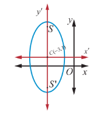

**Solution**

Rearranging the terms, the equation of ellipse is

$$
4x^{2} + 24x + y^{2} - 2y + 21 = 0
$$

$$
4(x + 3)^{2} - 36 + (y - 1)^{2} - 1 + 21 = 0,
$$

$$
4(x + 3)^{2} + (y - 1)^{2} = 16,
$$

$$
\frac{(x + 3)^{2}}{4} + \frac{(y - 1)^{2}}{16} = 1.
$$

Centre is $(- 3,1)$ $a = 4$ $b = 2$ , and the major axis is parallel to $y$ - axis

$c^{2} = 16 - 4 = 12$

$c = \pm 2\sqrt{3}$.

Therefore, the foci are $\left(- 3,2\sqrt{3} + 1\right)$ and $\left(- 3, - 2\sqrt{3} + 1\right)$

Vertices are $(- 3,\pm 4 + 1)$ . That is the vertices are $(- 3,5)$ and $(- 3, - 3)$ , and the length of Latus rectum $= \frac{2b^{2}}{a} = 2$ units. (see Fig. 5.37)

**Example 5.24**

Find the equation of the hyperbola with vertices $(0, \pm 4)$ and foci $(0, \pm 6)$ .

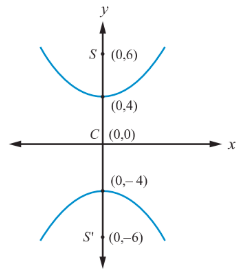

**Solution**

From Fig. 5.38, the midpoint of line joining foci is the centre $C(0,0)$ .

Transverse axis is $y$ - axis

$AA^{\prime} = 2a \Rightarrow 2a = 8$,

$SS^{\prime} = 2c = 12, c = 6$

$a = 4$

$b^{2} = c^{2} - a^{2} = 36 - 16 = 20.$

Hence the equation of the required hyperbola is $\frac{y^{2}}{16} - \frac{x^{2}}{20} = 1$ .

**Example 5.25**

Find the vertices, foci for the hyperbola $9x^{2} - 16y^{2} = 144$ .

**Solution**

Reducing $9x^{2} - 16y^{2} = 144$ to the standard form,

we have, $\frac{x^{2}}{16} - \frac{y^{2}}{9} = 1.$

With the transverse axis is along $x$ - axis vertices are $(- 4,0)$ and $(4,0)$ ;

and $c^{2} = a^{2} + b^{2} = 16 + 9 = 25$, $c = 5.$

Hence the foci are $(- 5,0)$ and $(5,0)$ .

**Example 5.26**

Find the centre, foci, and eccentricity of the hyperbola $11x^{2} - 25y^{2} - 44x + 50y - 256 = 0$

**Solution**

Rearranging terms in the equation of hyperbola to bring it to standard form,

we have, $11(x^{2} - 4x) - 25(y^{2} - 2y) - 256 = 0$

$11(x - 2)^{2} - 25(y - 1)^{2} = 256 + 44 - 25$

$11(x - 2)^{2} - 25(y - 1)^{2} = 275$

$$
\frac{(x - 2)^{2}}{25} - \frac{(y - 1)^{2}}{11} = 1.
$$

Centre $(2,1)$ ,

$a^{2} = 25, b^{2} = 11$

$c^{2} = a^{2} + b^{2}$

$\qquad = 25 + 11 = 36$

Therefore, $c = \pm 6$

and $e = \frac{c}{a} = \frac{6}{5}$ and the coordinates of foci are $(8,1)$ and $(- 4,1)$ from Fig. 5.39.

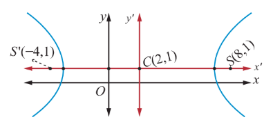

**Example 5.27**

The orbit of Halley's Comet (Fig. 5.51) is an ellipse 36.18 astronomical units long and by 9.12 astronomical units wide. Find its eccentricity.

**Solution**

Given that $2a = 36.18$, $2b = 9.12$ , we get

$$
e = \sqrt{1 - \frac{b^{2}}{a^{2}}} = \frac{\sqrt{a^{2} - b^{2}}}{a} = \frac{\sqrt{\left(\frac{36.18}{2}\right)^{2} - \left(\frac{9.12}{2}\right)^{2}}}{\frac{36.18}{2}} = \frac{\sqrt{(18.09)^{2} - (4.56)^{2}}}{18.09} \approx 0.97.
$$

> **Note**
>
> One astronomical unit (mean distance of Sun and earth) is $1,49,597,870km$ , the semi major axis of the Earth's orbit.

**EXERCISE 5.2**

1. Find the equation of the parabola in each of the cases given below:

    (i) focus $(4,0)$ and directrix $x = -4$

    (ii) passes through $(2, - 3)$ and symmetric about $y$ -axis.

    (iii) vertex $(1, - 2)$ and focus $(4, - 2)$

    (iv) end points of latus rectum $(4, - 8)$ and $(4,8)$

2. Find the equation of the ellipse in each of the cases given below:

    (i) foci $(\pm 3,0), e = \frac{1}{2}$

    (ii) foci $(0,\pm 4)$ and end points of major axis are $(0,\pm 5)$

    (iii) length of latus rectum 8, eccentricity $= \frac{3}{5}$ , centre $(0,0)$ and major axis on $x$ -axis.

    (iv) length of latus rectum 4, distance between foci $4\sqrt{2}$ , centre $(0,0)$ and major axis as $y$ -axis.

3. Find the equation of the hyperbola in each of the cases given below:

    (i) foci $(\pm 2,0)$ , eccentricity $= \frac{3}{2}$

    (ii) Centre $(2,1)$ , one of the foci $(8,1)$ and corresponding directrix $x = 4$

    (iii) passing through $(5, - 2)$ and the transverse axis is along the $x$ axis and of length 8 units.

4. Find the vertex, focus, equation of directrix and length of the latus rectum of the following:

    (i) $y^{2} = 16x$ $\qquad$ (ii) $x^{2} = 24y$ $\qquad$ (iii) $y^{2} = -8x$

    (iv) $x^{2} - 2x + 8y + 17 = 0$ $\qquad$ (v) $y^{2} - 4y - 8x + 12 = 0$

5. Identify the type of conic and find centre, foci, vertices, and directrices of each of the following:

    (i) $\frac{x^{2}}{25} + \frac{y^{2}}{9} = 1$ $\qquad$ (ii) $\frac{x^{2}}{3} + \frac{y^{2}}{10} = 1$ $\qquad$ (iii) $\frac{x^{2}}{25} - \frac{y^{2}}{144} = 1$ $\qquad$ (iv) $\frac{y^{2}}{16} - \frac{x^{2}}{9} = 1$

6. Prove that the length of the latus rectum of the hyperbola $\frac{x^{2}}{a^{2}} - \frac{y^{2}}{b^{2}} = 1$ is $\frac{2b^{2}}{a}$ .

7. Show that the absolute value of difference of the focal distances of any point P on the hyperbola is the length of its transverse axis.

8. Identify the type of conic and find centre, foci, vertices, and directrices of each of the following:

    (i) $\frac{(x - 3)^{2}}{225} + \frac{(y - 4)^{2}}{289} = 1$ $\qquad$ (ii) $\frac{(x + 1)^{2}}{100} + \frac{(y - 2)^{2}}{64} = 1$ $\qquad$ (iii) $\frac{(x + 3)^{2}}{225} - \frac{(y - 4)^{2}}{64} = 1$

    (iv) $\frac{(y - 2)^{2}}{25} - \frac{(x + 1)^{2}}{16} = 1$ $\qquad$ (v) $18x^{2} + 12y^{2} - 144x + 48y + 120 = 0$

    (vi) $9x^{2} - y^{2} - 36x - 6y + 18 = 0$
