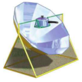
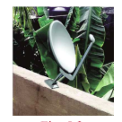
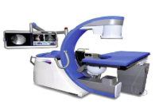

## 5.1 Introduction

**Analytical Geometry** of two dimension is used to describe geometric objects such as **point, line, circle, parabola, ellipse**, and **hyperbola** using **Cartesian coordinate system**. Two thousand years ago ($\approx 2-1$ BC (BCE)), the ancient Greeks studied **conic curves**, because studying them elicited ideas that were exciting, challenging, and interesting. They could not have imagined the applications of these curves in the later centuries.

Solving problems by the method of Analytical Geometry was systematically developed in the first half of the 17th century majorly, by Descartes and also by other great mathematicians like Fermat, Kepler, Newton, Euler, Leibniz, I'Hôpital, Clairaut, Cramer, and the Jacobis.

Analytic Geometry grew out of need for establishing **algebraic techniques** for solving **geometrical problems** and the development in this area has conquered industry, medicine, and scientific research.

The theory of Planetary motions developed by Johannes Kepler, the German mathematician cum physicist stating that all the planets in the solar system including the earth are moving in elliptical orbits with Sun at one of a foci, governed by inverse square law paved way to established work in Euclidean geometry. Euler applied the co-ordinate method in a systematic study of space curves and surfaces, which was further developed by Albert Einstein in his theory of relativity.

Applications in various fields encompassing **gears, vents** in dams, **wheels** and circular geometry leading to trigonometry as application based on properties of circles; arches, dish, **solar cookers, head-lights, suspension bridges**, and **search lights** as application based on properties of parabola; arches, **Lithotripsy** in the field of Medicine, **whispering galleries**, Ne-de-yag lasers and gears as application based on properties of ellipse; and telescopes, cooling towers, **spotting locations** of ships or aircrafts as application based on properties of hyperbola, to name a few.

A driver took the job of delivering a truck of books ordered on line. The truck is of $3m$ wide and $2.7m$ high, while driving he noticed a sign at the semielliptical entrance of a tunnel; Caution! Tunnel is of $3m$ high at the centre peak. Then he saw another sign; Caution! Tunnel is of $12m$ wide. Will his truck pass through the opening of tunnel's archway? We will be able to answer this question at the end of this chapter.

## Learning Objectives

Upon completion of this chapter, students will be able to

* write the equations of circle, parabola, ellipse, hyperbola in standard form,
* find the centre, vertices, foci etc. from the equation of different conics,
* derive the equations of tangent and normal to different conics,
* classify the conics and their degenerate forms,
* form equations of conics in parametric form, and their applications.
* apply conics in various real life situations.
