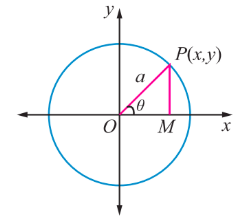
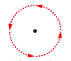
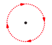
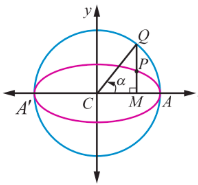

### 5.5 Parametric form of Conics

#### 5.5.1 Parametric equations

Suppose $f(t)$ and $g(t)$ are functions of $t$. Then the equations $x = f(t)$ and $y = g(t)$ together describe a curve in the plane. In general $t$ is simply an arbitrary variable, called in this case a parameter, and this method of specifying a curve is known as parametric equations. One important interpretation of $t$ is time. In this interpretation, the equations $x = f(t)$ and $y = g(t)$ give the position of an object at time $t$.

So a parametric equation simply has a third variable, expressing $x$ and $y$ in terms of that third variable as a parameter. A parameter does not always have to be $t$. Using $t$ is more standard but one can use any other variable.

(i) Parametric form of the circle $x^{2} + y^{2} = a^{2}$

Let $P(x,y)$ be any point on the circle $x^{2} + y^{2} = a^{2}$

Join $OP$ and let it make an angle $\theta$ with $x$ - axis.

Draw $PM$ perpendicular to $x$ - axis. From triangle $OPM$

$x = OM = a\cos \theta$

$y = MP = a\sin \theta$

Thus the coordinates of any point on the given circle are $(a\cos \theta, a\sin \theta)$ and

$x = a\cos \theta$, $y = a\sin \theta$, $0 \leq \theta \leq 2\pi$ are the parametric equations of the circle $x^{2} + y^{2} = a^{2}$ .

Conversely, if $x = a\cos \theta$, $y = a\sin \theta$, $0 \leq \theta \leq 2\pi$, then, $\frac{x}{a} = \cos \theta$, $\frac{y}{a} = \sin \theta$.

Squaring and adding, we get,

$\frac{x^{2}}{a^{2}} + \frac{y^{2}}{a^{2}} = \cos^{2}\theta + \sin^{2}\theta = 1$.

Thus $x^{2} + y^{2} = a^{2}$ yields the equation to circle with centre $(0,0)$ and radius $a$ units.

> **Note**
>
> (1) $x = a\cos t$, $y = a\sin t$, $0 \leq t \leq 2\pi$ also represents the same parametric equations of circle $x^{2} + y^{2} = a^{2}$, $t$ increasing in anticlockwise direction.
>
> 
>
> (2) $x = a\sin t$, $y = a\cos t$, $0 \leq t \leq 2\pi$ also represents the same parametric equations of circle $x^{2} + y^{2} = a^{2}$, $t$ increasing in clockwise direction.
>
> 

(ii) Parametric form of the parabola $y^{2} = 4ax$

Let $P(x_{1},y_{1})$ be a point on the parabola

$$
y_{1}^{2} = 4a x_{1}
$$
$$
(y_{1})(y_{1}) = (2a)(2x_{1})
$$
$$
\frac{y_{1}}{2a} = \frac{2x_{1}}{y_{1}} = t \quad (-\infty < t < \infty) \text{ say}
$$
$$
y_{1} = 2a t, \quad 2x_{1} = y_{1}t
$$
$$
2x_{1} = 2a t(t)
$$
$$
x_{1} = a t^{2}
$$

Parametric form of $y^{2} = 4ax$ is $x = at^{2}, y = 2at, -\infty < t < \infty$

Conversely if $x = at^{2}$ and $y = 2at, -\infty < t < \infty$ , then eliminating $t$ between these equations we get $y^{2} = 4ax$ .

(iii) Parametric form of the Ellipse $\frac{x^{2}}{a^{2}} + \frac{y^{2}}{b^{2}} = 1$

Let $P$ be any point on the ellipse. Let the ordinate $MP$ meet the auxiliary circle at $Q$ .

Let $\angle ACQ = \alpha$ $\therefore CM = a\cos \alpha$, $MQ = a\sin \alpha$ and $Q(a\cos \alpha, a\sin \alpha)$

Now $x$ - coordinate of $P$ is $a\cos \alpha$ . If its $y$ - coordinate is $y^{\prime}$ , then $P(a\cos \alpha, y^{\prime})$ lies on $\frac{x^{2}}{a^{2}} + \frac{y^{2}}{b^{2}} = 1$

$$
\cos^{2}\alpha + \frac{y^{\prime 2}}{b^{2}} = 1
$$

$$
\Rightarrow y^{\prime} = b\sin \alpha .
$$

Hence $P$ is $(a\cos \alpha, b\sin \alpha)$ .

The parameter $\alpha$ is called the eccentric angle of the point $P$ . Note that $\alpha$ is the angle which the line $CQ$ makes with the $x$ - axis and not the angle which the line $CP$ makes with it.

Hence the parametric equation of an ellipse is $x = a\cos \theta$, $y = b\sin \theta$, where $\theta$ is the parameter $0 \leq \theta \leq 2\pi$

(iv) Parametric form of the Hyperbola $\frac{x^{2}}{a^{2}} - \frac{y^{2}}{b^{2}} = 1$

Similarly, parametric equation of a hyperbola can be derived as $x = a\sec \theta$, $y = b\tan \theta$, where $\theta$ is the parameter. $-\pi \leq \theta \leq \pi$ except $\theta = \pm \frac{\pi}{2}$

In nutshell the parametric equations of the circle, parabola, ellipse and hyperbola are given in the following table.

| Conic | Parametric equations | Parameter | Range of parameter | Any point on the conic |
| :--- | :--- | :--- | :--- | :--- |
| Circle | $x = a \cos \theta$   $y = a \sin \theta$ | $\theta$ | $0 \leq \theta \leq 2\pi$ | $\theta$ or $(a \cos \theta, a \sin \theta)$ |
| Parabola | $x = at^2$   $y = 2at$ | $t$ | $-\infty < t < \infty$ | $t$ or $(at^2, 2at)$ |
| Ellipse | $x = a \cos \theta$   $y = b \sin \theta$ | $\theta$ | $0 \leq \theta \leq 2\pi$ | $\theta$ or $(a \cos \theta, b \sin \theta)$ |
| Hyperbola | $x = a \sec \theta$   $y = b \tan \theta$ | $\theta$ | $-\pi \leq \theta \leq \pi$ except $\theta = \pm \frac{\pi}{2}$ | $\theta$ or $(a \sec \theta, b \tan \theta)$ |

> **Remark**
>
> (1) Parametric form represents a family of points on the conic which is the role of a parameter. Further parameter plays the role of a constant and a variable, while cartesian form represents the locus of a point describing the conic. Parameterisation denotes the orientation of the curve.
>
> (2) A parametric representation need not be unique.
>
> (3) Note that using parameterisation reduces the number of variables at least by one.
