### 5.7 Real life Applications of Conics

#### 5.7.1 Parabola

The interesting applications of Parabola involve their use as reflectors and receivers of light or radio waves. For instance, cross sections of car headlights, flashlights are parabolas wherein the gadgets are formed by the paraboloid of revolution about its axis. The bulb in the headlights, flash lights is located at the focus and light from that point is reflected outward parallel to the axis of symmetry (Fig. 5.60) while Satellite dishes and field microphones used at sporting events, incoming radio waves or sound waves parallel to the axis that are reflected into the focus intensifying the same (Fig. 5.59). Similarly, in solar cooking, a parabolic mirror is mounted on a rack with a cooking pot hung in the focal area (Fig. 5.1). Incoming Sun rays parallel to the axis are reflected into the focus producing a temperature high enough for cooking.

Parabolic arches are the best stable structures also considered for their beauty to name a few, the arches on the bridge of river in Godavari, Andhra Pradesh, India, the Eiffel tower in Paris, France.

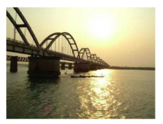

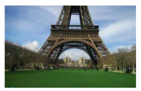

#### 5.7.2 Ellipse

According to Johannes Kepler, all planets in the solar system revolve around Sun in elliptic orbits with Sun at one of the foci. Some comets have elliptic orbits with Sun at one of the foci as well. E.g. Halley's Comet that is visible once every 75 years with $e \approx 0.97$ in elliptic orbit (Fig. 5.51). Our satellite moon travels around the Earth in an elliptical orbit with earth at one of its foci. Satellites of other planets also revolve around their planets in elliptical orbits as well.
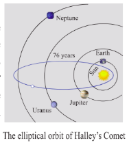

Elliptic arches are often built for its beauty and stability. Steam boilers are believed to have greatest strength when heads are made elliptical with major and minor axes in the ratio 2:1.

The shape of our mother Earth is an oblate spheroid i.e., the solid of revolution of an ellipse about its minor axis, bulged along equatorial region and flat along the polar region.

The property of ellipse, any ray of light or sound released from a focus of the ellipse on touching the ellipse gets reflected to reach the other focus (Fig. 5.62), which could be proved using concepts of incident rays and reflected rays in Physics.

An exciting medical application of an ellipsoidal reflectors is a device called a Lithotripter (Fig. 5.4 and 5.63) that uses electromagnetic technology or ultrasound to generate a shock wave to pulverize kidney stones. The wave originates at one focus of the cross- sectional ellipse and is reflected to the kidney stone, which is positioned at the other focus. Recovery time following the use of this technique is much shorter than the conventional surgery, non- invasive and the mortality rate is lower.

#### 5.7.3 Hyperbola

Some Comets travel in hyperbolic paths with the Sun at one focus, such comets pass by the Sun only one time unlike those in elliptical orbits, which reappear at intervals.

We also see hyperbolas in architecture, such as Mumbai Airport terminal (Fig. 5.53), in cross section of a planetarium, an locating ships (Fig. 5.54), or a cooling tower for a steam or nuclear power plant. (Fig. 5.5)

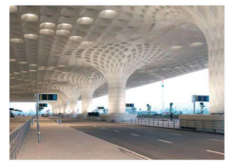

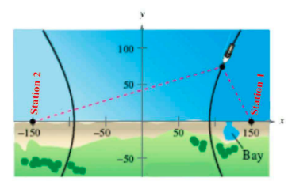

**Example 5.31**

A semielliptical archway over a one- way road has a height of $3m$ and a width of $12m$ . The truck has a width of $3m$ and a height of $2.7m$ . Will the truck clear the opening of the archway? (Fig. 5.6)

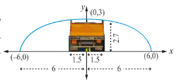

**Solution**

Since the truck's width is $3m$ , to determine the clearance, we must find the height of the archway $1.5m$ from the centre. If this height is $2.7m$ or less the truck will not clear the archway.

From the diagram $a = 6$ and $b = 3$ yielding the equation of ellipse as $\frac{x^2}{6^2} + \frac{y^2}{3^2} = 1$ .

The edge of the $3m$ wide truck corresponds to $x = 1.5m$ from centre We will find the height of the archway $1.5m$ from the centre by substituting $x = 1.5$ and solving for $y$

$$
\frac{\left(\frac{3}{2}\right)^{2}}{36} + \frac{y^{2}}{9} = 1
$$
$$
y^{2} = 9\left(1 - \frac{9}{144}\right)
$$
$$
= \frac{9(135)}{144} = \frac{135}{16}
$$
$$
y = \frac{\sqrt{135}}{4}
$$
$$
= \frac{11.62}{4}
$$
$$
= 2.90
$$

Thus the height of arch way $1.5m$ from the centre is approximately $2.90m$ . Since the truck's height is $2.7m$ , the truck will clear the archway.

**Example 5.32**

The maximum and minimum distances of the Earth from the Sun respectively are $152\times 10^{6} \mathrm{km}$ and $94.5\times 10^{6} \mathrm{km}$ . The Sun is at one focus of the elliptical orbit. Find the distance from the Sun to the other focus.

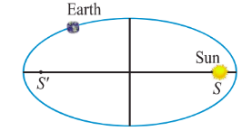

**Solution**

$AS = 94.5\times 10^{6} \mathrm{km}$, $SA^{\prime} = 152\times 10^{6} \mathrm{km}$

$a + c = 152\times 10^{6}$

$a - c = 94.5\times 10^{6}$

Subtracting $2c = 57.5\times 10^{6} = 575\times 10^{5} \mathrm{km}$

Distance of the Sun from the other focus is $SS^{\prime} = 575\times 10^{5} \mathrm{km}$

**Example 5.33**

A concrete bridge is designed as a parabolic arch. The road over bridge is $40m$ long and the maximum height of the arch is $15m$ . Write the equation of the parabolic arch.

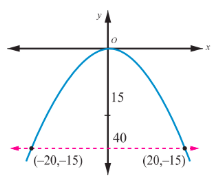

**Solution**

From the graph the vertex is at $(0,0)$ and the parabola is open down

Equation of the parabola is $x^{2} = -4ay$

$(-20, -15)$ and $(20, -15)$ lie on the parabola

$$
20^{2} = -4a(-15)
$$

$$
4a = \frac{400}{15}
$$

$$
x^{2} = \frac{-80}{3} \times y
$$

Therefore equation is $3x^{2} = -80y$

**Example 5.34**

The parabolic communication antenna has a focus at $2m$ distance from the vertex of the antenna. Find the width of the antenna $3m$ from the vertex.

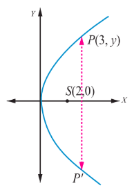

**Solution**

Let the parabola be $y^{2} = 4ax$.

Since focus is $2m$ from the vertex $a = 2$

Equation of the parabola is $y^{2} = 8x$

Let $P$ be a point on the parabola whose $x$ - coordinate is $3m$ from the vertex $P(3,y)$

$$
y^{2} = 8 \times 3
$$
$$
y = \sqrt{8 \times 3} = 2\sqrt{6}
$$

The width of the antenna $3m$ from the vertex is $4\sqrt{6} m$

#### 5.7.4 Reflective property of parabola

The light or sound or radio waves originating at a parabola's focus are reflected parallel to the parabola's axis (Fig. 5.60) and conversely the rays arriving parallel to the axis are directed towards the focus (Fig. 5.59).

**Example 5.35**

The equation $y = \frac{1}{32} x^{2}$ models cross sections of parabolic mirrors that are used for solar energy.

There is a heating tube located at the focus of each parabola; how high is this tube located above the vertex of the parabola?

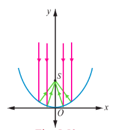
\
**Solution**

Equation of the parabola is

$$
y = \frac{1}{32} x^{2}
$$

That is

$$
x^{2} = 32y; \text{ the vertex is } (0,0)
$$
$$
= 4(8)y
$$
$$
\Rightarrow a = 8
$$

So the heating tube needs to be placed at focus $(0,a)$ . Hence the heating tube needs to be placed 8 units above the vertex of the parabola.

**Example 5.36**

A search light has a parabolic reflector (has a cross section that forms a 'bowl'). The parabolic bowl is $40cm$ wide from rim to rim and $30cm$ deep. The bulb is located at the focus.

(1) What is the equation of the parabola used for reflector?
(2) How far from the vertex is the bulb to be placed so that the maximum distance covered?

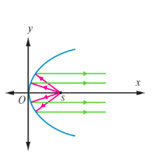

**Solution**

Let the vertex be $(0,0)$ .

The equation of the parabola is

$y^{2} = 4ax$

(1) Since the diameter is $40cm$ and the depth is $30cm$ , the point $(30,20)$ lies on the parabola.

$$
20^{2} = 4a \times 30
$$

$$
4a = \frac{400}{30} = \frac{40}{3}.
$$

Equation is $y^{2} = \frac{40}{3} x$ .

(2) The bulb is at focus $(a,0)$ . Hence the bulb is at a distance of $\frac{10}{3} cm$ from the vertex.

**Example 5.37**

An equation of the elliptical part of an optical lens system is $\frac{x^{2}}{16} + \frac{y^{2}}{9} = 1$ . The parabolic part of the system has a focus in common with the right focus of the ellipse. The vertex of the parabola is at the origin and the parabola opens to the right. Determine the equation of the parabola.

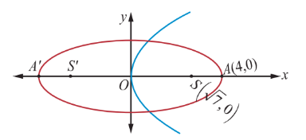

**Solution**

In the given ellipse $a^{2} = 16$, $b^{2} = 9$

Therefore the foci are $F(\sqrt{7},0)$, $F^{\prime}(-\sqrt{7},0)$ . The focus of the parabola is $(\sqrt{7},0) \Rightarrow a = \sqrt{7}$ .

Equation of the parabola is $y^{2} = 4\sqrt{7} x$ .

#### 5.7.5 Reflective Property of an Ellipse

The lines from the foci to a point on an ellipse make equal angles with the tangent line at that point (Fig. 5.62).

The light or sound or radio waves emitted from one focus hits any point $P$ on the ellipse is received at the other focus (Fig. 5.63).

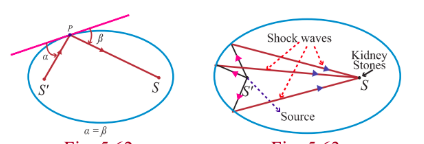

**Example 5.38**

A room $34m$ long is constructed to be a whispering gallery. The room has an elliptical ceiling, as shown in Fig. 5.64. If the maximum height of the ceiling is $8m$ , determine where the foci are located.

**Solution**

The length $a$ of the semi major axis of the elliptical ceiling is $17m$ . The height $b$ of the semi minor axis is $8m$ . Thus

$$
c^{2} = a^{2} - b^{2} = 17^{2} - 8^{2}
$$

$$
c = \sqrt{289 - 64} = \sqrt{225} = 15
$$

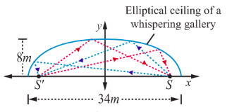

For the elliptical ceiling the foci are located on either side about $15m$ from the centre, along its major axis.

**A non-invasive medical miracle**

In a lithotriper, a high- frequency sound wave is emitted from a source that is located at one of the foci of the ellipse. The patient is placed so that the kidney stone is located at the other focus of the ellipse.

**Example 5.39**

If the equation of the ellipse is $\frac{(x - 11)^2}{484} + \frac{y^2}{64} = 1$ ( $x$ and $y$ are measured in centimeters) where to the nearest centimeter, should the patient's kidney stone be placed so that the reflected sound hits the kidney stone?

**Solution**

The equation of the ellipse is $\frac{(x - 11)^2}{484} + \frac{y^2}{64} = 1$ . The origin of the sound wave and the kidney stone of patient should be at the foci in order to crush the stones.

$a^{2} = 484$ and $b^{2} = 64$

$c^{2} = a^{2} - b^{2} = 484 - 64 = 420$

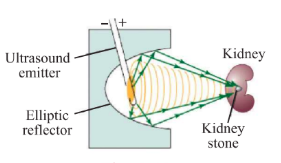

Therefore the patient's kidney stone should be placed $20.5\mathrm{cm}$ from the centre of the ellipse.

#### 5.7.6 Reflective Property of a Hyperbola

The lines from the foci to a point on a hyperbola make equal angles with the tangent line at that point (Fig. 5.66).

The light or sound or radio waves directed from one focus is received at the other focus as in the case ellipse (Fig. 5.54) used in spotting location of ships sailing in deep sea.

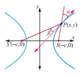

**Example 5.40**

Two coast guard stations are located $600\mathrm{km}$ apart at points $A(0,0)$ and $B(0,600)$ . A distress signal from a ship at $P$ is received at slightly different times by two stations. It is determined that the ship is $200\mathrm{km}$ farther from station $A$ than it is from station $B$ . Determine the equation of hyperbola that passes through the location of the ship.

**Solution**

Since the centre is located at $(0,300)$ , midway between the two foci, which are the coast guard stations, the equation is $\frac{(y - 300)^{2}}{a^{2}} - \frac{(x - 0)^{2}}{b^{2}} = 1$ ... (1)

To determine the values of $a$ and $b$ , select two points known to be on the hyperbola and substitute each point in the above equation.

The point $(0,400)$ lies on the hyperbola, since it is $200\mathrm{km}$ further from Station $A$ than from station $B$ $\frac{(400 - 300)^{2}}{a^{2}} - \frac{0}{b^{2}} = 1$, $\frac{100^{2}}{a^{2}} = 1$, $a^{2} = 10000$ . There is also a point $(x,600)$ on the hyperbola such that $600^{2} + x^{2} = (x + 200)^{2}$

$360000 + x^{2} = x^{2} + 400x + 40000$

$x = 800$

Substituting in (1), we have $\frac{(600 - 300)^{2}}{10000} - \frac{(800 - 0)^{2}}{b^{2}} = 1$

$9 - \frac{640000}{b^{2}} = 1$

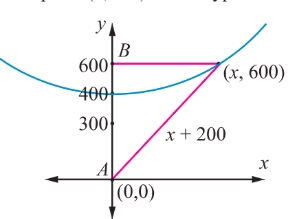

The ship lies somewhere on this hyperbola. The exact location can be determined using data from a third station.

**Example 5.41**

Certain telescopes contain both parabolic mirror and a hyperbolic mirror. In the telescope shown in figure 5.68 the parabola and hyperbola share focus $F_{1}$ which is $14m$ above the vertex of the parabola. The hyperbola's second focus $F_{2}$ is $2m$ above the parabola's vertex. The vertex of the hyperbolic mirror is $1m$ below $F_{1}$ . Position a coordinate system with the origin at the centre of the hyperbola and with the foci on the $y$ - axis. Then find the equation of the hyperbola.

**Solution**

Let $V_{1}$ be the vertex of the parabola and $V_{2}$ be the vertex of the hyperbola.

$\overline{F_{1}F_{2}} = 14 - 2 = 12m$, $2c = 12$, $c = 6$

The distance of centre to the vertex of the hyperbola is $a = 6 - 1 = 5$

$b^{2} = c^{2} - a^{2} = 36 - 25 = 11.$

Therefore the equation of the hyperbola is $\frac{y^{2}}{25} - \frac{x^{2}}{11} = 1$ .

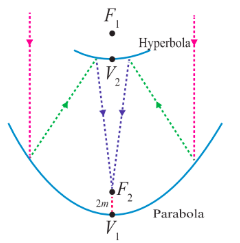

**EXERCISE 5.5**

1. A bridge has a parabolic arch that is $10m$ high in the centre and $30m$ wide at the bottom. Find the height of the arch $6m$ from the centre, on either sides.

2. A tunnel through a mountain for a four lane highway is to have a elliptical opening. The total width of the highway (not the opening) is to be $16m$ , and the height at the edge of the road must be sufficient for a truck $4m$ high to clear if the highest point of the opening is to be $5m$ approximately. How wide must the opening be?

3. At a water fountain, water attains a maximum height of $4m$ at horizontal distance of $0.5m$ from its origin. If the path of water is a parabola, find the height of water at a horizontal distance of $0.75m$ from the point of origin.

4. An engineer designs a satellite dish with a parabolic cross section. The dish is $5m$ wide at the opening, and the focus is placed $1.2m$ from the vertex

    (a) Position a coordinate system with the origin at the vertex and the $x$ -axis on the parabola's axis of symmetry and find an equation of the parabola.
    (b) Find the depth of the satellite dish at the vertex.

5. Parabolic cable of a $60m$ portion of the roadbed of a suspension bridge are positioned as shown below. Vertical Cables are to be spaced every $6m$ along this portion of the roadbed. Calculate the lengths of first two of these vertical cables from the vertex.

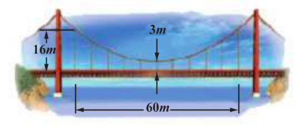

6. Cross section of a Nuclear cooling tower is in the shape of a hyperbola with equation $\frac{x^2}{30^2} - \frac{y^2}{44^2} = 1$ . The tower is $150m$ tall and the distance from the top of the tower to the centre of the hyperbola is half the distance from the base of the tower to the centre of the hyperbola. Find the diameter of the top and base of the tower.

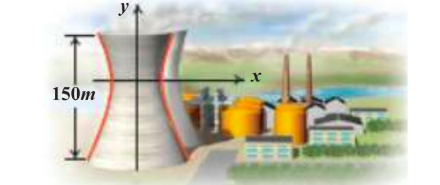

7. A rod of length $1.2m$ moves with its ends always touching the coordinate axes. The locus of a point $P$ on the rod, which is $0.3m$ from the end in contact with $x$ -axis is an ellipse. Find the eccentricity.

8. Assume that water issuing from the end of a horizontal pipe, $7.5m$ above the ground, describes a parabolic path. The vertex of the parabolic path is at the end of the pipe. At a position $2.5m$ below the line of the pipe, the flow of water has curved outward $3m$ beyond the vertical line through the end of the pipe. How far beyond this vertical line will the water strike the ground?

9. On lighting a rocket cracker it gets projected in a parabolic path and reaches a maximum height of $4m$ when it is $6m$ away from the point of projection. Finally it reaches the ground $12m$ away from the starting point. Find the angle of projection.

10. Points $A$ and $B$ are $10km$ apart and it is determined from the sound of an explosion heard at those points at different times that the location of the explosion is $6km$ closer to $A$ than $B$ . Show that the location of the explosion is restricted to a particular curve and find an equation of it.
