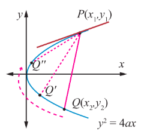

### 5.6 Tangents and Normals to Conics

Tangent to a plane curve is a straight line touching the curve at exactly one point and a straight line perpendicular to the tangent and passing through the point of contact is called the normal at that point.

#### 5.6.1 Equation of tangent and normal to the parabola $y^{2} = 4ax$

(i) Equation of tangent in cartesian form

Let $P(x_{1},y_{1})$ and $Q(x_{2},y_{2})$ be two points on a parabola $y^{2} = 4ax$

Then, $y_{1}^{2} = 4a x_{1}$ and $y_{2}^{2} = 4a x_{2}$ and $y_{1}^{2} - y_{2}^{2} = 4a(x_{1} - x_{2})$ .

Simplifying, $\frac{y_{1} - y_{2}}{x_{1} - x_{2}} = \frac{4a}{y_{1} + y_{2}}$ , the slope of the chord $PQ$ .

Thus $(y - y_{1}) = \frac{4a}{y_{1} + y_{2}}(x - x_{1})$ , represents the equation of the chord $PQ$ .

When $Q \rightarrow P$ , or $y_{2} \rightarrow y_{1}$ the chord becomes tangent at $P$ .

Thus the equation of tangent at $(x_{1},y_{1})$ is

$$
y - y_{1} = \frac{4a}{2y_{1}}(x - x_{1}) \text{ where } \frac{2a}{y_{1}} \text{ is the slope of the tangent } \dots (1)
$$

$$
y y_{1} - y_{1}^{2} = 2a x - 2a x_{1}
$$

$$
y y_{1} - 4a x_{1} = 2a x - 2a x_{1}
$$

$$
\boxed{y y_{1} = 2a(x + x_{1})}
$$

(ii) Equation of tangent in parametric form

Equation of tangent at $(a t^{2}, 2a t)$ on the parabola is

$$
y(2a t) = 2a(x + a t^{2})
$$

$$
\boxed{y t = x + a t^{2}}
$$

(iii) Equation of normal in cartesian form

From (1) the slope of normal is $-\frac{y_{1}}{2a}$

Therefore equation of the normal is

$$
y - y_{1} = -\frac{y_{1}}{2a}(x - x_{1})
$$

$$
2a y - 2a y_{1} = -y_{1}x + y_{1}x_{1}
$$

$$
x y_{1} + 2a y = y_{1}(x_{1} + 2a)
$$

$$
\boxed{x y_{1} + 2a y = x_{1}y_{1} + 2a y_{1}}
$$

(iv) Equation of normal in parametric form

Equation of the normal at $(a t^{2}, 2a t)$ on the parabola is

$$
x 2a t + 2a y = a t^{2}(2a t) + 2a(2a t)
$$

$$
2a(x t + y) = 2a(a t^{3} + 2a t)
$$

$$
\boxed{y + x t = a t^{3} + 2a t}
$$

> **Theorem 5.6**
>
> Three normals can be drawn to a parabola $y^{2} = 4ax$ from a given point, one of which is always real.

**Proof**

$y^{2} = 4ax$ is the given parabola. Let $(\alpha, \beta)$ be the given point.

Equation of the normal in parametric form is

$$
y = -tx + 2at + at^{3} \quad (1)
$$

If $m$ is the slope of the normal then $m = - t$ .

Therefore the equation (1) becomes $y = mx - 2am - am^{3}$ .

Let it passes through $(\alpha, \beta)$ , then

$$
\beta = m\alpha - 2am - am^{3}
$$

$$
am^{3} + (2a - \alpha)m + \beta = 0
$$

which being a cubic equation in $m$ , has three values of $m$ . Consequently three normals, in general, can be drawn from a point to the parabola, since complex roots of real equation, always occur in conjugate pairs and (1) being an odd degree equation, it has at least one real root. Hence at least one normal to the parabola is real.

#### 5.6.2 Equations of tangent and normal to Ellipse and Hyperbola (the proof of the following are left to the reader)

(1) Equation of the tangent to the ellipse $\frac{x^{2}}{a^{2}} + \frac{y^{2}}{b^{2}} = 1$

(i) at $(x_{1},y_{1})$ is $\frac{x x_{1}}{a^{2}} + \frac{y y_{1}}{b^{2}} = 1$ cartesian form

(ii) at $\theta$ is $\frac{x \cos \theta}{a} + \frac{y \sin \theta}{b} = 1$ parametric form

(2) Equation of the normal to the ellipse $\frac{x^{2}}{a^{2}} + \frac{y^{2}}{b^{2}} = 1$

(i) at $(x_{1},y_{1})$ is $\frac{a^{2}x}{x_{1}} - \frac{b^{2}y}{y_{1}} = a^{2} - b^{2}$ cartesian form

(ii) at $\theta$ is $\frac{a x}{\cos \theta} - \frac{b y}{\sin \theta} = a^{2} - b^{2}$ parametric form

(3) Equation of the tangent to the hyperbola $\frac{x^{2}}{a^{2}} - \frac{y^{2}}{b^{2}} = 1$

(i) at $(x_{1},y_{1})$ is $\frac{x x_{1}}{a^{2}} - \frac{y y_{1}}{b^{2}} = 1$ cartesian form

(ii) at $\theta$ is $\frac{x \sec \theta}{a} - \frac{y \tan \theta}{b} = 1$ parametric form

(4) Equation of the normal to the hyperbola $\frac{x^{2}}{a^{2}} - \frac{y^{2}}{b^{2}} = 1$

(i) at $(x_{1},y_{1})$ is $\frac{a^{2}x}{x_{1}} + \frac{b^{2}y}{y_{1}} = a^{2} + b^{2}$ cartesian form

(ii) at $\theta$ is $\frac{a x}{\sec \theta} + \frac{b y}{\tan \theta} = a^{2} + b^{2}$ parametric form.

#### 5.6.3 Condition for the line $y = mx + c$ to be a tangent to the conic sections

(i) parabola $y^{2} = 4ax$

Let $(x_{1},y_{1})$ be the point on the parabola $y^{2} = 4ax$ . Then $y_{1}^{2} = 4ax_{1}$ ... (1)

Let $y = mx + c$ be the tangent to the parabola ... (2)

Equation of tangent at $(x_{1},y_{1})$ to the parabola from 5.6.1 is $y y_{1} = 2a(x + x_{1})$ ... (3)

Since (2) and (3) represent the same line, coefficients are proportional.

$$
\frac{y_{1}}{1} = \frac{2a}{m} = \frac{2a x_{1}}{c}
$$
$$
\Rightarrow y_{1} = \frac{2a}{m}, \quad x_{1} = \frac{c}{m}
$$

Then (1) becomes, $\left(\frac{2a}{m}\right)^{2} = 4a\left(\frac{c}{m}\right)$

$$
\Rightarrow \boxed{c = \frac{a}{m}}
$$

So the point of contact is $\left(\frac{a}{m^{2}}, \frac{2a}{m}\right)$ and the equation of tangent to parabola is $y = mx + \frac{a}{m}$ .

The condition for the line $y = mx + c$ to be tangent to the ellipse or hyperbola can be derived as follows in the same way as in the case of parabola.

(ii) ellipse $\frac{x^{2}}{a^{2}} + \frac{y^{2}}{b^{2}} = 1$

Condition for line $y = mx + c$ to be the tangent to the ellipse $\frac{x^{2}}{a^{2}} + \frac{y^{2}}{b^{2}} = 1$ is $c^{2} = a^{2}m^{2} + b^{2}$ , with the point of contact is $\left(-\frac{a^{2}m}{c}, \frac{b^{2}}{c}\right)$ and the equation of tangent is $y = mx \pm \sqrt{a^{2}m^{2} + b^{2}}$

(iii) Hyperbola $\frac{x^{2}}{a^{2}} - \frac{y^{2}}{b^{2}} = 1$

Condition for line $y = mx + c$ to be the tangent to the hyperbola $\frac{x^{2}}{a^{2}} - \frac{y^{2}}{b^{2}} = 1$ is $c^{2} = a^{2}m^{2} - b^{2}$ , with the point of contact is $\left(-\frac{a^{2}m}{c}, -\frac{b^{2}}{c}\right)$ and the equation of tangent is $y = mx \pm \sqrt{a^{2}m^{2} - b^{2}}$ .

> **Note**
>
> (1) In $y = mx \pm \sqrt{a^{2}m^{2} + b^{2}}$ , either $y = mx + \sqrt{a^{2}m^{2} + b^{2}}$ or $y = mx - \sqrt{a^{2}m^{2} + b^{2}}$ is the equation to the tangent of ellipse but not both.
>
> (2) In $y = mx \pm \sqrt{a^{2}m^{2} - b^{2}}$ , either $y = mx + \sqrt{a^{2}m^{2} - b^{2}}$ or $y = mx - \sqrt{a^{2}m^{2} - b^{2}}$ is the equation to the tangent of hyperbola but not both.

**Result**

(1) Two tangents can be drawn to (i) a parabola (ii) an ellipse and (iii) a hyperbola, from any external point on the plane.

(2) Four normals can be drawn to (i) an ellipse and (ii) a hyperbola from any external point on the plane.

(3) The locus of the point of intersection of perpendicular tangents to

(i) the parabola $y^{2} = 4ax$ is $x = -a$ (the directrix).

(ii) the ellipse $\frac{x^{2}}{a^{2}} + \frac{y^{2}}{b^{2}} = 1$ is $x^{2} + y^{2} = a^{2} + b^{2}$ (called the director circle of ellipse).

(iii) the hyperbola $\frac{x^{2}}{a^{2}} - \frac{y^{2}}{b^{2}} = 1$ is $x^{2} + y^{2} = a^{2} - b^{2}$ (called director circle of hyperbola).

**Example 5.29**

Find the equations of tangent and normal to the parabola $x^{2} + 6x + 4y + 5 = 0$ at $(1, - 3)$ .

**Solution**

Equation of parabola is $x^{2} + 6x + 4y + 5 = 0$ .

$$
x^{2} + 6x + 9 - 9 + 4y + 5 = 0
$$

$$
(x + 3)^{2} = -4(y - 1) \quad (1)
$$

Let $X = x + 3$, $Y = y - 1$

Equation (1) takes the standard form

$X^{2} = -4Y$

Equation of tangent is $XX_{1} = -2(Y + Y_{1})$

At $(1, - 3)$ $X_{1} = 1 + 3 = 4$; $Y_{1} = -3 - 1 = -4$

Therefore, the equation of tangent at $(1, - 3)$ is

$$
(x + 3)4 = -2(y - 1 - 4)
$$

$$
2x + 6 = -y + 5.
$$

$$
2x + y + 1 = 0.
$$

Slope of tangent at $(1, - 3)$ is $-2$ , so slope of normal at $(1, - 3)$ is $\frac{1}{2}$

Therefore, the equation of normal at $(1, - 3)$ is given by

$$
y + 3 = \frac{1}{2}(x - 1)
$$

$$
2y + 6 = x - 1
$$

$$
x - 2y - 7 = 0.
$$

**Example 5.30**

Find the equations of tangent and normal to the ellipse $x^{2} + 4y^{2} = 32$ when $\theta = \frac{\pi}{4}$ .

**Solution**

Equation of ellipse is

$$
x^{2} + 4y^{2} = 32
$$
$$
\frac{x^{2}}{32} + \frac{y^{2}}{8} = 1
$$
$a^{2} = 32$, $b^{2} = 8$

$a = 4\sqrt{2}$, $b = 2\sqrt{2}$

Equation of tangent at $\theta = \frac{\pi}{4}$ is

$$
\frac{x \cos\frac{\pi}{4}}{4\sqrt{2}} + \frac{y \sin\frac{\pi}{4}}{2\sqrt{2}} = 1
$$

$$
\frac{x}{8} + \frac{y}{4} = 1
$$

$$
x + 2y - 8 = 0.
$$

Equation of normal is

$$
\frac{4\sqrt{2}x}{\cos\frac{\pi}{4}} - \frac{2\sqrt{2}y}{\sin\frac{\pi}{4}} = 32 - 8
$$

That is

$8x - 4y = 24$

$2x - y - 6 = 0.$

**Aliter**

At $\theta = \frac{\pi}{4}$,

$(a\cos \theta, b\sin \theta) = \left(4\sqrt{2}\cos \frac{\pi}{4}, 2\sqrt{2}\sin \frac{\pi}{4}\right) = (4,2)$

Equation of tangent at $\theta = \frac{\pi}{4}$ is same at (4,2).

Equation of tangent in cartesian form is $\frac{x x_{1}}{a^{2}} + \frac{y y_{1}}{b^{2}} = 1$

$x + 2y - 8 = 0$

Slope of tangent is $-\frac{1}{2}$

Slope of normal is 2

Equation of normal is

$y - 2 = 2(x - 4)$

$y - 2x + 6 = 0.$

**EXERCISE 5.4**

1. Find the equations of the two tangents that can be drawn from $(5,2)$ to the ellipse $2x^{2} + 7y^{2} = 14$ .

2. Find the equations of tangents to the hyperbola $\frac{x^{2}}{16} - \frac{y^{2}}{64} = 1$ which are parallel to $10x - 3y + 9 = 0$ .

3. Show that the line $x - y + 4 = 0$ is a tangent to the ellipse $x^{2} + 3y^{2} = 12$ . Also find the coordinates of the point of contact.

4. Find the equation of the tangent to the parabola $y^{2} = 16x$ perpendicular to $2x + 2y + 3 = 0$ .

5. Find the equation of the tangent at $t = 2$ to the parabola $y^{2} = 8x$ . (Hint: use parametric form)

6. Find the equations of the tangent and normal to hyperbola $12x^{2} - 9y^{2} = 108$ at $\theta = \frac{\pi}{3}$ . (Hint: use parametric form)

7. Prove that the point of intersection of the tangents at $t_{1}$ and $t_{2}$ on the parabola $y^{2} = 4ax$ is $[a t_{1} t_{2}, a(t_{1} + t_{2})]$ .

8. If the normal at the point $t_{1}$ on the parabola $y^{2} = 4ax$ meets the parabola again at the point $t_{2}$, then prove that $t_{2} = -\left(t_{1} + \frac{2}{t_{1}}\right)$.
