### 7.1 அறிமுகம் (Introduction)

#### 7.1.1 ஆரம்பகால முன்னேற்றங்கள் (Early Developments)

வகை நுண்கணிதத்தின் முக்கிய நோக்கமே சிலவற்றை பல நுண்ணியப்பகுதிகளாகப் பகுத்து அதன் மூலம் அவற்றின் மாறுபாடுகளைத் தீர்மானிப்பதாகும். இத்தகு காரணத்தினால்தான் தற்போதைய வகையிடல் கணிதம் உறுநுண்ணளவு வகை நுண்கணிதம் (infinitesimal calculus) என அழைக்கப்பட்டது. அறிவியலின் ஆரம்பகாலத்திலிருந்தே இயற்பியல் மற்றும் வானியல் கணக்குகளில் வகை நுண்கணிதம் பயன்படுத்தப்பட்டது. 18-ஆம் நூற்றாண்டு வரை மேற்கண்ட பயன்பாடுகளுக்காகவே வகை நுண்கணிதம் பயன்பட்டது.

18-ஆம் நூற்றாண்டின் இறுதியில் லேப்லெஸ் மற்றும் லெக்ராஞ்சி விசைகளின் ஆய்வினை வகைநுண்கணிதத்தின் வரம்பிற்குள் கொண்டுவந்த பிறகு வகைநுண்கணிதம் புதிய பரிமாணத்தை அடைந்தது.

வகையிடல் பயன்பாட்டின் வளர்ச்சிக்கு லெஜூனே ட்ரிச்லெட், ரீமன், வொன் நியூமென், ஹெய்ன், க்ரோனெகர், லிபிட்சு, கிறிஸ்டோபெல், கிர்க்ஹாஃப், பெல்ட்ராமி மற்றும் பல இயற்பியல் அறிஞர்கள் முக்கிய பங்கு வகித்தனர்.

- வடிவியல் மற்றும் இயக்கவியலில் வகை நுண்கணிதம் பயன்படுத்தப்படுகிறது.

- பொருட்களின் மதிப்பு, திறன், பொருட்களின் இருப்பு, இலாபம் போன்றவற்றின் சார்புகளை வகையிட்டு எழுதுவதால் அவற்றின் ஓரியல்புத்தன்மையையும், அறுதி மதிப்புகளையும் தீர்மானிக்கலாம்.

- பொறியியல் மற்றும் அறிவியல் துறைகளில் உள்ள கணித மாதிரிகளில் சார்பின் வகையிடல் குறிப்பிடத்தக்க பங்கு வகிக்கிறது.

- சமூக அறிவியல் மற்றும் மருத்துவத் துறையிலிலும் வகை நுண்கணிதத்தின் பயன்பாடு உள்ளது.

சார்பு $f(x)$ –ன் முதலிரண்டு வகைக் கெழுக்களை மட்டும் பயன்படுத்தி, இந்த அத்தியாயத்தில், $y = f(x)$ என்ற சார்பின் இயல்பு, வளைவரையை வரைதல், மற்றும் $f(x)$ –ன் இடஞ்சார் அறுதி மதிப்பு (பெருமம் அல்லது சிறுமம்) போன்றவை தீர்மானிக்கப்படுகின்றன. மேலும், $f(x)$ –ன் சில உயர் வகைக்கெழுக்களை (அவை இருந்தால் மட்டுமே) பயன்படுத்தி, ஒரு புள்ளியைப் பொறுத்து $f(x)$ –ஐ தொடராக விரிவாக்கம் செய்தல் போன்றவையும் ஆராயப்படுகிறது.

### கற்றலின் நோக்கங்கள்

இந்த அத்தியாயத்தின் முடிவில் மாணவர்கள் பின்வருவனவற்றை அறிந்திருப்பர்.

- வடிவியல் கணக்குகளுக்கு வகையிடலைப் பயன்படுத்துதல்

- நடைமுறை கணக்குகளுக்கு வகையிடலைப் பயன்படுத்துதல்

- வளைவரையின் இயல்புகளான ஓரியல்புத்தன்மை, குழிவுத்தன்மை, மற்றும் குவிவுத்தன்மை போன்றவற்றை இனங்காண பயன்படுகின்றது.

- தினசரி வாழ்க்கையில் அறுதிமதிப்பு காண வகைக்கெழுக்களைப் பயன்படுத்துதல்.

- பல்லுறுப்புக் கோவை மற்றும் பல்லுறுப்புக் கோவை அல்லாத சார்புகளின் வளைவரைகளை வரைதல்.

### 7.2 வகையிடலின் பொருள் (Meaning of Derivatives)

#### 7.2.1 சாய்வினை வகையிடல் மூலம் காணுதல் (Derivative as slope)

ஒரு கோட்டின் சாய்வு அல்லது சரிவு: படத்தில் உள்ளது போல் செங்குத்தற்ற கோடு $l$ என்க. கொடுக்கப்பட்ட $l$ கோட்டில் துவக்கப் புள்ளியாகக் கொண்டு ஏதேனும் முடிவுறு நீளம் கொண்ட கிடைமட்ட கோட்டுத் துண்டும் இக்கிடைமட்ட கோட்டுத் துண்டின் முடிவுப் புள்ளியினை துவக்கப்புள்ளியாகக் கொண்டு கொடுக்கப்பட்ட கோட்டினைத் தொடுமாறு செங்குத்துக் கோடு வரையப்படுகிறது. செங்குத்து நீளமும் கிடைமட்ட நீளமும் விகிதாச்சாரப்படி மாறிலியாக இருப்பதைக் கவனிக்கலாம். இந்த விகிதமே கோடு $l$ இன் **சாய்வு** எனப்படும். இது $m$ எனக் குறிப்பிடப்படுகிறது.

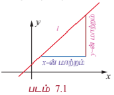

ஒரு கோட்டின் ஏறுதல் அல்லது இறங்குதல் தன்மையை அளவிட சாய்வினைப் பயன்படுத்தலாம். கோடு ஏறுதல் அல்லது இறங்குதல் முறையே $m > 0$ அல்லது $m < 0$ பொறுத்து அமையும். $m = 0$ எனில், $y$ ஆனது மாறுவதில்லை. கோட்டின் சாய்வினை $m$ என்று குறிப்பிட்டால் $XY$ தளத்தில் $y = mx + c$ ஒரு நேர்க்கோட்டைக் குறிக்கிறது எனக் கூறலாம்.

ஒரு வளைவரையின் சாய்வு அல்லது சரிவு: $y = f(x)$ என்பது கொடுக்கப்பட்ட வளைவரை என்க. $(x, f(x))$ மற்றும் $(x + h, f(x + h))$ என்ற இரு வெவ்வேறு புள்ளிகளை இணைக்கும் ஒரு கோட்டின் சாய்வு

$$\frac{f(x + h) - f(x)}{h}$$

(நியூட்டன் ஈவு). ... (1)

$h \rightarrow 0$ எனும்போது எல்லையானது

$$\lim_{h \rightarrow 0} \frac{f(x + h) - f(x)}{h} = f'(x)$$

(நியூட்டனின் ஈவின் எல்லை) ... (2)

என்பது $(x, y)$ அல்லது $(x, f(x))$ என்ற புள்ளியில் வளைவரையின் சாய்வாகும்.

#### குறிப்புரை

$y = f(x)$ என்ற வளைவரையில் $(x, y)$ எனும் புள்ளியைப் பொறுத்து ஏற்படும் வளைவரைக்கான தொடுகோட்டின் தொடுகோணம் $\theta$ எனில் $(x, y)$ புள்ளியில் வளைவரையின் சாய்வு $f'(x) = \tan\theta$ ஆகும். இங்கு $\theta$ ஆனது, $X$ -அச்சிலிருந்து கடிகார திசைக்கு எதிர் திசையில் அளக்கப்படுகிறது. $f'(x)$ என்பதை $\frac{dy}{dx}$ எனவும் குறிக்கலாம். மேலும் $\frac{dy}{dx}$ ஆனது கணநேர மாறுபாட்டு வீதத்தைக் குறிக்கிறது. நியூட்டனின் ஈவானது கொடுக்கப்பட்ட இடைவெளியில் சராசரி மாறுபாட்டு வீதத்தைக் குறிக்கிறது.

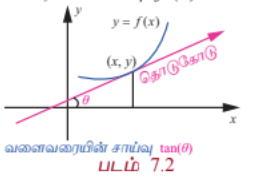

---

### எடுத்துக்காட்டு 7.1

$f(x) = x^2, x \in [0, 2]$ எனும் சார்பிற்கு $[0, 0.5], [0.5, 1], [1, 1.5], [1.5, 2]$ என்ற உள்இடைவெளிகளில் சராசரி மாறுபாட்டு வீதத்தையும் மற்றும் $x = 0.5, 1, 1.5, 2$ புள்ளிகளில் ஏற்படும் கணப்பொழுது மாறுபாட்டு வீதங்களையும் காண்க.

#### தீர்வு

$[a, b]$ என்ற இடைவெளியில் சராசரி மாறுபாட்டு வீதம் $\frac{f(b) - f(a)}{b - a}$ ஆகும். அதேசமயத்தில் கொடுக்கப்பட்ட சார்பு $f(x) = x^2$ -க்கு $x$ புள்ளியில் கணப்பொழுது மாறுபாட்டு வீதம் $f'(x)$ ஆகும். அவைகள் முறையே, $a + b$ மற்றும் $2x$ ஆகும்.

| a | b | சராசரி மாறுபாட்டு வீதம் $\frac{f(b) - f(a)}{b - a} = a + b$ | கணப்பொழுது மாறுபாட்டு வீதம் $f'(x) = 2x$ |
|---|---|---|---|
| 0 | 0.5 | 0.5 | 1 |
| 0.5 | 1 | 1.5 | 2 |
| 1 | 1.5 | 2.5 | 3 |
| 1.5 | 2 | 3.5 | 4 |

அட்டவணை 7.1

---

#### 7.2.2 மாறுபாடு வீதத்தினை வகையிடல் மூலம் காணுதல் (Derivative as rate of change)

சாய்வைத் தீர்மானிக்க எவ்வாறு வகையிடல் பயன்படுகிறது என்பதைக் கண்டோம். ஒரு மாறி மற்றொன்றைப் பொறுத்து மாறும் வீதத்தைக் கணக்கிடவும் வகையிடல் பயன்படுகிறது. மக்கள் தொகை வளர்ச்சி வீதம், பொருட்களின் வளர்ச்சி வீதம், நீரோட்ட வீதம், திசை வேகம், மற்றும் முடுக்கம் ஆகியவை ஒரு சில எடுத்துக்காட்டுகளாகும்.

மாறுபாட்டு வீதத்தின் பொதுவான பயன்பாடு ஒரு நேர்க்கோட்டில் நகரும் ஒரு பொருளின் இயக்கத்தை விவரிப்பதாகும். அத்தகு கணக்குகளில் பொருளின் இயக்கப்பாதைக்காக ஆதிபுள்ளியைக் கொண்ட ஒரு கிடைமட்ட அல்லது செங்குத்துக் கோட்டினைப் பயன்படுத்துவது வழக்கம். இத்தகைய கோடுகளில், முன்னோக்கிய திசையை மிகை திசை எனவும் பின்னோக்கிய திசையை குறை திசை எனவும் பொருள்படும்.

ஒரு பொருளின் நிலையை (ஆதிப்புள்ளியைச் சார்ந்து) நேரச் சார்பாகத் தரும் சார்பு $s$ என்பது **இடச் சார்பு** என அழைக்கப்படுகிறது. அதனை $s = f(t)$ எனக் குறிப்பிடலாம். $t$ நேரத்தில் திசைவேகம் $v(t) = \frac{ds}{dt}$, மற்றும் முடுக்கம் $a(t) = \frac{dv}{dt} = \frac{d^2s}{dt^2}$ ஆகும்.

#### குறிப்புரை

பின்வரும் கருத்துகள் கவனிக்க எளிதானவை:

(1) திசைவேகத்தின் எண்ணளவு வேகம் ஆகும். அதாவது வேகம் திசையைப் பொறுத்து அமைவதில்லை. எனவே,

வேகம் $= |v(t)| = \left|\frac{ds}{dt}\right|$.

(2) - ஒரு துகள் ஓய்வு நிலையில் இருக்கும் பொழுது $v(t) = 0$ ஆகும்.
- ஒரு துகள் முன்னோக்கி நகரும்பொழுது $v(t) > 0$ ஆகும்.
- ஒரு துகள் பின்னோக்கி நகரும்பொழுது $v(t) < 0$ ஆகும்.
- ஒரு துகள் அதன் திசையை மாற்றும்பொழுது $v(t)$ -ன் குறியீடு மாறும்.

(3) $t_1$ மற்றும் $t_2$ -க்கு இடையே உள்ள நேரம் $t_c$-ஐ ($t_1 < t_c < t_2$) துகள் திசை மாறும் நேரமாகக் கொண்டால் $t_1$ மற்றும் $t_2$ -க்கு இடையே உள்ள நேரத்தில் துகள் பயணிக்கும் தொலைவு

$$|s(t_c) - s(t_1)| + |s(t_2) - s(t_c)|$$

எனக் கணிக்கப்படுகிறது.

(4) பூமியின் தரையில் ஒரே மாதிரியான மாறாத முடுக்கத்துடன் அனைத்து பொருட்களும் விழுகின்றன. காற்றின் தடை அறவே இல்லாத சமயத்தில் அல்லது குறிப்பிடத்தக்க அளவு இல்லாத நிலையில் விழுகின்ற பொருளின் மேல் இயங்கும் ஒரே விசை ஈர்ப்பு விசையாகும். இத்தகைய விழுதலைக் **கட்டற்ற விழல்** என்பர்.

$t = 0$ நேரத்தில் $s_0$ உயரத்திலிருந்து துவக்க திசைவேகம் $v_0$ –உடன் எறியப்படும் ஒரு பொருளானது

$$a = -g, \quad v(t) = v_0 - gt, \quad s(t) = s_0 + v_0t - \frac{1}{2}gt^2$$

எனும் சமன்பாடுகளை நிறைவு செய்யும்.

இங்கு, $g = 9.8$ மீ/வி$^2$ அல்லது $32$ அடி/வி$^2$.

எடுத்துக்காட்டுகள் சிலவற்றைக் காண்போம்.

1. கிடைமட்ட நீளத்தைப் பொறுத்து மாறும் செங்குத்து நீளத்தின் வீதம் சாய்வு எனப்படும்.
2. நேரத்தைப் பொறுத்து இடப்பெயர்ச்சியில் ஏற்படும் மாற்றத்தின் வீதம் திசைவேகம் ஆகும்.
3. நேரத்தைப் பொறுத்து திசைவேகத்தில் ஏற்படும் மாற்றத்தின் வீதம் முடுக்கம் ஆகும்.
4. கிடைமட்ட தூரத்தைப் பொறுத்து மலையின் செங்குத்து ஏற்றத்தில் ஏற்படும் வீதம் மலைப்பகுதியின் சாய்வு ஆகும்.

கீழ்க்காணும் இரு சூழ்நிலைகளைக் கருதுவோம்:

- தர்மபுரிக்கு சென்னையிலிருந்து ஒரு நபர் ஒரு மகிழுந்தை தொடர்ந்து ஓட்டிச் செல்கிறார். பயணித்த தூரம் (கிலோமீட்டரால் அளவிடப்படுகிறது) காலத்தின் (மணி நேரத்தில் அளவிடப்படுகிறது) சார்பாக $D(t)$ எனக் குறிக்கப்படுகிறது. $D'(3) = 70$ என்பதன் பொருள் என்ன?

இதன் பொருள், “$t = 3$ எனும் போது தூரத்தின் வீதம் மணிக்கு 70 கி.மீ ஆகும்”.

- ஒரு நீர் ஆதாரம் $t$ காலத்தைப் பொறுத்து வடிகிறது. $t$ நாட்களில் வடிந்த நீரின் அளவினை $V(t)$ எனக் கொண்டால், $y = V(t)$ எனும் வளைவரையின் தொடுகோட்டின் சாய்வு $t = 7$ எனும்போது $-3$ ஆகும் என்பதன் பொருள் என்ன?

“ஏழாம் நாளில் நாளுக்கு 3 அலகுகள் வீதம் நீர் வடிகிறது” என்பதே இதன் பொருளாகும்.

இதேபோன்று நம் அன்றாட வாழ்வியல் கணக்குகளில் மாறுபாட்டு வீதக் கருத்துக்களைப் பயன்படுத்துகிறோம். இன்னும் பல எடுத்துக்காட்டுகளின் வாயிலாக இதனை விளக்குவோம்.

---

### எடுத்துக்காட்டு 7.2

இருமுனைகளிலும் காப்பிடப்பட்ட 10 மீ நீளமுள்ள ஒரு கம்பியின் வெப்பநிலை செல்சியஸில் நீளம் $x$ சார்பாக $T(x) = 10x(5 - x)$ எனத் தரப்படுகிறது. கம்பியின் மையப்புள்ளியில் வெப்பநிலை மாறுபாட்டு வீதம் பூச்சியம் என்பதை நிரூபிக்க.

#### தீர்வு

$T(x) = 50x - 10x^2$ எனக் கொடுக்கப்பட்டுள்ளது. எனவே ஒருமுனையிலிருந்து எந்த அளவு தூரத்திலும் வெப்பநிலை மாறுபாட்டு வீதமானது

$$\frac{dT}{dx} = 50 - 20x$$

ஆகும். கம்பியின் மையப்புள்ளி $x = 5$ –ல் உள்ளது. $x = 5$ எனப்பிரதியிட, $\frac{dT}{dx} = 0$ எனக்கிடைக்கும்.

---

### எடுத்துக்காட்டு 7.3

ஒரு ஆங்கிலத்தேர்விற்கு ஒருவர் 100 சொற்களைக் கற்கிறார். கற்றபின், $t$ நாட்களுக்குப் பிறகு அவர் நினைவிலிருக்கும் சொற்களின் எண்ணிக்கை $W(t) = 100(10 - 10t + t^2)$, $0 \leq t \leq 10$ ஆகும். கற்றபின், 2 நாட்களுக்குப் பிறகு அவர் சொற்களை மறப்பதன் வீதம் என்ன?

#### தீர்வு

$$\frac{d}{dt}W(t) = 100(-10 + 2t)$$

எனவே $t = 2$ எனும்போது $\frac{d}{dt}W(t) = -600$.

அதாவது, கற்றபின்னர் 2 நாட்களுக்குப் பிறகு 600 சொற்கள்/நாள் என்ற வீதத்தில் மறப்பார்.

---

### எடுத்துக்காட்டு 7.4

$s(t) = \frac{t^3}{3} - 3t^2$ எனுமாறு ஒரு துகள் நகரும் தூரம் அமைகின்றது. எந்தெந்த நேரங்களில் அதன் திசைவேகமும் முடுக்கமும் பூச்சிய மதிப்பை அடையும்?

#### தீர்வு

$t$ நேரத்தில் இடப்பெயர்ச்சி $s = \frac{t^3}{3} - 3t^2$ ஆகும்.

$t$ நேரத்தில் திசைவேகம் $v = \frac{ds}{dt} = t^2 - 6t$ ஆகும்.

$t$ நேரத்தில் முடுக்கம் $a = \frac{dv}{dt} = 2t - 6$ ஆகும்.

$t^2 - 6t = 0$ அதாவது, $t = 0, 6$ எனும்போது திசைவேகம் பூச்சிய மதிப்பை அடையும். $2t - 6 = 0$ அதாவது, $t = 3$ எனும்போது முடுக்கம் பூச்சிய மதிப்பை அடையும்.

---

### எடுத்துக்காட்டு 7.5

தரையிலிருந்து மேல்நோக்கி சுடப்படும் ஒரு துகள் $s$ அடி உயரத்தை $t$ வினாடிகளில் சென்று அடைகிறது. இங்கு $s(t) = 128t - 16t^2$.

(i) துகள் அடையும் அதிகபட்ச உயரத்தைக் கணக்கிடுக.
(ii) தரையைத் தொடும்போது அதன் திசைவேகம் என்ன?

#### தீர்வு

(i) அதிகபட்ச உயரத்தை அடையும்போது துகளின் திசைவேகம் $v(t)$-ன் மதிப்பு பூச்சியமாகும். நாம் இப்பொழுது, $t$ நேரத்தில் துகளின் திசைவேகத்தைக் காண்போம்.

$$v(t) = \frac{ds}{dt} = 128 - 32t$$

$v(t) = 0 \Rightarrow 128 - 32t = 0 \Rightarrow t = 4$.

$t = 4$ -ல் துகள் அதிகபட்ச உயரத்தை அடைகின்றது.

$t = 4$ -ல் உயரமானது $s(4) = 128(4) - 16(4)^2 = 512 - 256 = 256$ அடிகள் ஆகும்.

(ii) துகள் தரையைத் தொடும்போது $s = 0$ ஆகும்.

$$s(t) = 0 \Rightarrow 128t - 16t^2 = 0 \Rightarrow 16t(8 - t) = 0$$

$t = 0, 8$ வினாடிகள்.

தரையினை துகள் $t = 8$ வினாடிகளில் தொடுகிறது.

அது தரையைத் தொடும்போது அதன் திசை வேகம் $v(8) = 128 - 32(8) = -128$ அடி/வி ஆகும்.

---

### எடுத்துக்காட்டு 7.6

$t \geq 0$ எனும் எந்நேரத்திலும் ஒரு துகளின் நிலை $s(t) = t^3 - 6t^2 + 9t + 1$ எனும்படி கிடைமட்டக் கோட்டில் ஒரு துகள் நகர்கிறது. இங்கு $s$ என்பது மீட்டரிலும் $t$ வினாடிகளிலும் கணக்கிடப்படுகிறது.

(i) துகள் ஓய்வடையும் போது நேரம் என்ன?
(ii) துகள் திசை மாறும்போது நேரம் என்ன?
(iii) முதல் இரு வினாடிகளில் துகள் பயணிக்கும் மொத்த தூரம் எவ்வளவு?

#### தீர்வு

$s(t) = t^3 - 6t^2 + 9t + 1$-ஐ வகையிட, $v(t) = 3t^2 - 12t + 9$ மற்றும் $a(t) = 6t - 12$ எனக் கிடைக்கிறது.

(i) $v(t) = 0$ எனும்போது துகள் ஓய்வினை அடைகிறது. எனவே, $v(t) = 3(t - 1)(t - 3) = 0$ என்பதன் மூலம், $t = 1$ மற்றும் $t = 3$ எனக்கிடைக்கிறது.

(ii) $v(t)$ யின் குறியினை மாற்றும்போது துகளின் திசை மாறும். இப்பொழுது

$0 < t < 1$ எனில் $(t - 1) < 0$ மற்றும் $(t - 3) < 0$ ஆகையால் $v(t) > 0$ ஆகும்.

$1 < t < 3$ எனில் $(t - 1) > 0$ மற்றும் $(t - 3) < 0$ ஆகையால் $v(t) < 0$ ஆகும்.

$t > 3$ எனில் $(t - 1) > 0$ மற்றும் $(t - 3) > 0$ ஆகையால் $v(t) > 0$ ஆகும்.

எனவே $t = 1$ மற்றும் $t = 3$ எனும்போது துகளின் திசை மாறும்.

(iii) $t = 0$ நேரத்திலிருந்து $t = 2$ வரை துகள் பயணிக்கும் மொத்த தூரம்,

$$|s(1) - s(0)| + |s(2) - s(1)| = |5 - 1| + |3 - 5| = 4 + 2 = 6$$

மீட்டர்கள் ஆகும்.

---

#### 7.2.3 சார்ந்த வீதங்கள் (Related rates)

சார்ந்த வீதக் கணக்குகளில் குறைந்தது இரண்டு அளவுகளாவது மாறத்தக்கதாக அமையும். மேலும் தேவையான அனைத்து அளவைகளும் கொடுக்கப்பட்ட நிலையில் ஏதேனும் ஒன்றின் மாறுபாட்டு வீதத்தினை நாம் கணக்கிட வேண்டும். எடுத்துக்காட்டாக, இரு வேறு திசையில் பயணிக்கும் இரு வாகனங்கள் விலகிப் போகும் வேகத்தினை அவற்றின் நிலை, திசைவேகங்கள் அறிந்திருந்ததால் கணக்கிடலாம்.

---

### எடுத்துக்காட்டு 7.7

கோள வடிவில் உள்ள ஒரு ஊதுபையில் காற்றினை வினாடிக்கு $1000$ செ.மீ$^3$ எனும் வீதத்தில் நாம் ஊதினால் ஆரம் 7 செ.மீ எனும்போது ஊதுபையின் ஆரத்தின் மாறுபாட்டு வீதம் என்ன? மேலும் மேற்பரப்பு மாறுபாட்டு வீதத்தையும் கணக்கிடுக.

#### தீர்வு

$r$ ஆரமுள்ள ஊதுபையின் கன அளவானது $V = \frac{4}{3}\pi r^3$ ஆகும்.

$\frac{dV}{dt} = 1000$ எனக்கொடுக்கப்பட்டுள்ளது.

$\frac{dr}{dt}$ -யினை $r = 7$ எனும்போது காணவேண்டும்.

$$\frac{dV}{dt} = 4\pi r^2 \frac{dr}{dt}$$

$r = 7$ மற்றும் $\frac{dV}{dt} = 1000$ எனப்பிரதியிட, $1000 = 4\pi(49)\frac{dr}{dt}$.

ஆகையால், $\frac{dr}{dt} = \frac{1000}{196\pi} = \frac{250}{49\pi}$.

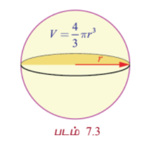

ஊதுபையின் மேற்பரப்பு $S = 4\pi r^2$. எனவே,

$$\frac{dS}{dt} = 8\pi r \frac{dr}{dt}$$

$\frac{dr}{dt} = \frac{250}{49\pi}$ மற்றும் $r = 7$ எனப் பிரதியிட,

$$\frac{dS}{dt} = 8\pi(7)\left(\frac{250}{49\pi}\right) = \frac{2000}{7}$$

எனப் பெறுகிறோம்.

எனவே, ஆரத்தின் மாறுபாட்டு வீதம் $\frac{250}{49\pi}$ செ.மீ/வினாடி வீதம் மற்றும் பரப்பளவின் மாறுபாட்டு வீதம் $\frac{2000}{7}$ செ.மீ$^2$/வினாடி ஆகும்.

---

### எடுத்துக்காட்டு 7.8

ஒரு பொருளின் விலை அதன் சரக்கு இருப்பைக் கொண்டு $P(x) = \frac{234 + 16x}{3 + x}$ எனும் சமன்பாட்டால் குறிக்கப்படுகிறது. இங்கு $P$ என்பது பொருளின் விலை (ரூபாயில்) மற்றும் $x$ என்பது அலகுகளின் எண்ணிக்கையைக் குறிக்கும். 90 அலகுகள் இருப்பு இருக்கும்போது, வாரத்திற்கு 15 அலகுகள் வீதம் சரக்கு அதிகரிக்கிறது எனில் காலத்தைப் பொறுத்து விலையின் மாறுபாட்டு வீதத்தைக் காண்க.

#### தீர்வு

$$P = \frac{234 + 16x}{3 + x}$$

எனவே,

$$\frac{dP}{dt} = \frac{186}{(3 + x)^2}\frac{dx}{dt}$$

$x = 90, \frac{dx}{dt} = 15$ எனப் பிரதியிட,

$$\frac{dP}{dt} = \frac{186}{(93)^2} \times 15 = \frac{10}{31} \approx 0.32$$

ரூபாய்/வாரம் எனக் கிடைக்கிறது. அதாவது விலையில் மாற்றமானது வாரத்திற்கு 0.32 ரூபாய் எனும் வீதத்தில் குறைகிறது.

---

### எடுத்துக்காட்டு 7.9

கொணரிப்பட்டடையிலிருந்து நிமிடத்திற்கு 30 கன மீட்டர் வீதத்தில் கொட்டப்படும் உப்பு வட்ட வடிவ அடிமானம் கொண்ட கூம்பு வடிவம் பெறுகிறது. மேலும் கூம்பின் உயரமும் அடிமானத்தின் விட்டமும் சமமாக உள்ளது. 10 மீட்டர் உயரம் எனும்போது கூம்பின் உயரம் எவ்வேகத்தில் அதிகரிக்கும்?

#### தீர்வு

$h$ மற்றும் $r$ முறையே உயரம் மற்றும் அடிமானத்தின் ஆரம் என்க. எனவே $h = 2r$ ஆகும். $V$ என்பது உப்பு கூம்பின் கன அளவு என்க.

$$V = \frac{1}{3}\pi r^2 h = \frac{1}{12}\pi h^3, \quad \frac{dV}{dt} = 30$$

எனவே,

$$\frac{dV}{dt} = \frac{1}{4}\pi h^2 \frac{dh}{dt}$$

ஆகையால்,

$$\frac{dh}{dt} = \frac{4}{\pi h^2}\frac{dV}{dt}$$

அதாவது,

$$\frac{dh}{dt} = \frac{4(30)}{\pi(100)} = \frac{6}{5\pi}$$

மீ/நிமிடம்.

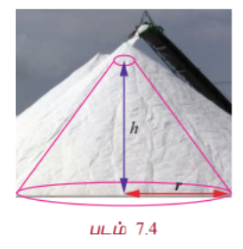

---

### எடுத்துக்காட்டு 7.10 (இருமாறி சார்ந்த வீதக் கணக்கு)

வடக்கிலிருந்து தெற்கே செல்லும் பாதையும் கிழக்கிலிருந்து மேற்கே செல்லும் பாதையும் $P$ எனும் புள்ளியில் வெட்டுகிறது. வடக்கு நோக்கிச் செல்லும் மகிழுந்து $A$ முதல் பாதை வழியாகச் செல்கிறது. கிழக்கு நோக்கிச் செல்லும் மகிழுந்து $B$ இரண்டாவது பாதை வழியாகச் செல்கிறது. குறிப்பிட்ட நேரத்தில் மகிழுந்து $A$ ஆனது $P$ -க்கு வடக்கே 10 கிலோமீட்டர்கள் தொலைவில் மணிக்கு 80 கி.மீ வேகத்தில் செல்கிறது. அதே சமயத்தில் மகிழுந்து $B$ ஆனது $P$ -க்கு கிழக்கே 15 கிலோமீட்டர் தொலைவில் மணிக்கு 100 கி.மீ வேகத்தில் செல்கிறது. இரு மகிழுந்துகளுக்கிடையே உள்ள தூரம் எவ்வேகத்தில் மாறுகிறது?

#### தீர்வு

$t$ நேரத்தில் $P$ -க்கு வடக்கில் மகிழுந்து $A$ இருக்கும் தூரத்தின் அளவு $a(t)$ என்க. மற்றும் $t$ நேரத்தில் $P$ -க்கு கிழக்கில் மகிழுந்து $B$ இருக்கும் தூரத்தின் அளவு $b(t)$ என்க. மேலும் $t$ நேரத்தில் மகிழுந்து $A$ மற்றும் மகிழுந்து $B$ -க்கு இடையே உள்ள தூரத்தின் அளவு $c(t)$ என்க. பிதாகரஸ் தேற்றத்தின்படி, $c(t)^2 = a(t)^2 + b(t)^2$ ஆகும்.

வகையிட, $2c(t)c'(t) = 2a(t)a'(t) + 2b(t)b'(t)$ எனப் பெறுகிறோம்.

எனவே,

$$c' = \frac{aa' + bb'}{c} = \frac{aa' + bb'}{\sqrt{a^2 + b^2}}$$

தேவையான தருணத்தில் நமக்கு தெரிந்த மதிப்புகளைப் பிரதியிட,

$$c' = \frac{10(80) + 15(100)}{\sqrt{10^2 + 15^2}} = \frac{2300}{5\sqrt{13}} = \frac{460}{\sqrt{13}} \approx 127.6$$

கி.மீ/மணி ஆகும்.

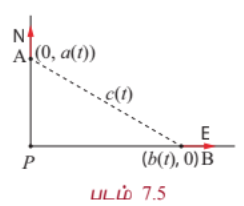

---

### பயிற்சி 7.1

1. ஆதிப்புள்ளியிலிருந்து $t$ வினாடிகளுக்குப் பிறகு ஒரு துகள் உள்ள தூரத்தின் அளவு $s(t) = 3t^2$ மீட்டர் எனும்படி நேர்க்கோட்டில் ஒரு துகள் நகர்கிறது.

   (i) $t = 3$ மற்றும் $t = 6$ வினாடிகளுக்கிடையே உள்ள சராசரி திசைவேகம் என்ன?

   (ii) $t = 3$ மற்றும் $t = 6$ வினாடிகளுக்கிடையே உள்ள கணப்பொழுது திசைவேகம் என்ன?

2. 400 அடி உயர மலை உச்சி முகட்டிலிருந்து தவறுதலாக ஒரு புகைப்படக் கருவி விழுகிறது. $t$ வினாடிகளில் புகைப்படக் கருவி விழும் தூரம் $s(t) = 16t^2$ ஆகும்.

   (i) தரையைத் தொடும் முன்னர் புகைப்படக் கருவி விழ எடுத்துக்கொண்ட நேரம் என்ன?

   (ii) கீழே விழுந்த இறுதி 2 வினாடிகளில் புகைப்படக் கருவியின் சராசரி திசைவேகம் என்ன?

   (iii) தரையைத் தொடும்போது புகைப்படக் கருவியின் கணப்பொழுது திசைவேகம் என்ன?

3. $s(t) = t^3 - 9t^2 + 12t + 4$, இங்கு $t \geq 0$ எனும் விதிப்படி ஒரு கோட்டில் ஒரு துகள் நகர்கிறது.

   (i) எந்நேரங்களில் துகளின் திசை மாறுகின்றது?

   (ii) முதல் 4 வினாடிகளில் துகள் பயணித்த தூரம் என்ன?

   (iii) திசைவேகம் பூச்சிய மதிப்பை அடையும் நேரங்களில் எல்லாம் துகளின் முடுக்கம் காண்க?

4. $x$ பக்க அளவு கொண்ட ஒரு கன சதுரத்தின் கன அளவு $v = x^3$ எனில் $x = 5$ அலகுகள் எனும்போது $x$ -ஐப் பொறுத்து கன அளவு மாறுவீதம் காண்க.

5. $x$ நீளமுள்ள (மீட்டரில்) ஒரு மெல்லிய கோலின் நிறை $m(x)$ (கிலோகிராமில்), $m(x) = 3\sqrt{x}$ எனக் கொடுக்கப்பட்டுள்ளது எனில், $x = 3$ மற்றும் $x = 27$ மீட்டர் எனும்போது நீளத்தைப் பொறுத்து நிறையின் மாறுபாட்டு வீதத்தை காண்க.

6. ஒரு குளத்தில் விழுந்த கல்லினால் பொது மைய வட்டங்களின் வடிவத்தில் சிற்றலைகள் ஏற்படுகின்றது. வெளிப்புற சிற்றலையின் ஆரம் வினாடிக்கு 2 செ.மீ வீதம் அதிகரிக்கிறது. ஆரம் 5 செ.மீ. எனும் போது கலங்கும் நீரின் பரப்பளவு மாறுவீதம் என்ன?

7. கப்பலின் மீதுள்ள சுழலொளி விளக்கு ஒவ்வொரு 10 வினாடிகளுக்கு ஒரு முறை சுற்றுகிறது. கடற்கரையிலிருந்து 5 கி.மீ தூரத்தில் கப்பல் நங்கூரமிடப்பட்டுள்ளது. அவ்விளக்கின் ஒளிக்கற்றை கடற்கரையுடன் $45^\circ$ கோணத்தை ஏற்படுத்தும் போது கடற்கரையில் ஒளிக்கற்றை எவ்வளவு வேகமாக நகரும்?

8. தலைகீழாக வைக்கப்பட்ட ஒரு நேர்வட்ட கூம்பு வடிவம் உள்ள ஒரு நீர்நிலைத் தொட்டியின் ஆழம் 12 மீட்டர் மற்றும் மேலுள்ள வட்டத்தின் ஆரம் 5 மீட்டர் என்க. நிமிடத்திற்கு 10 கன மீட்டர் வேகத்தில் நீர் பாய்ச்சப்படுகிறது எனில், 8 மீட்டர் ஆழத்தில் நீர் இருக்கும்போது நீரின் ஆழம் அதிகரிக்கும் வேகம் என்ன?

9. 17 மீட்டர் நீளமுள்ள ஒரு ஏணி செங்குத்தான சுவரில் சாய்த்து வைக்கப்பட்டுள்ளது. ஏணியின் அடிப்பக்கம் சுவற்றிலிருந்து விலகிச் செல்லும் வீதம் வினாடிக்கு 5 மீட்டர் எனில் ஏணியின் அடிப்பக்கம் சுவற்றிலிருந்து 8 மீட்டர் தொலைவில் இருக்கும்போது,

   (i) அதன் உச்சி என்ன வீதத்தில் கீழ்நோக்கி இறங்கும் என்பதைக் காண்க.

   (ii) எந்த வீதத்தில், ஏணி, சுவர் மற்றும் தரை ஆகியவற்றால் உருவாகும் முக்கோணத்தின் பரப்பளவு மாறுகிறது?

10. வட திசையிலிருந்து ஒரு செங்கோணசந்திப்பை அணுகும் ஒரு காவல்துறை வாகனம் வேகமாகச் சென்று திரும்பி கிழக்கு நோக்கிச் செல்லும் ஒரு மகிழுந்தை துரத்துகிறது. சாலை சந்திப்பின் வடக்கே 0.6 கி.மீ தொலைவில் காவல்துறையின் வாகனமும் கிழக்கே 0.8 கி.மீ தொலைவில் மகிழுந்தும் உள்ள பொழுது, மின்காந்த அலைக் கருவியின் துணைகொண்டு காவல்துறை தங்களது வாகனத்திற்கும் மகிழுந்துக்கும் இடைப்பட்ட தூரம் மணிக்கு 20 கி.மீ வீதத்தில் அதிகரிக்கிறது எனத் தீர்மானிக்கின்றனர். காவல்துறை வாகனம் மணிக்கு 60 கி.மீ வேகத்தில் நகர்கிறது எனில் மகிழுந்தின் வேகம் என்ன?

---

#### 7.2.4 தொடுகோடு மற்றும் செங்கோட்டின் சமன்பாடுகள் (Equations of Tangent and Normal)

லிபினிட்சை பொருத்தவரை, தொடுகோடு என்பது வளைவரையின் மீதுள்ள மிக நெருங்கிய ஒரு ஜோடிப் புள்ளிகள் வழியே செல்லும் நேர்க்கோடு ஆகும்.

#### வரையறை 7.1

ஒரு தளத்தில் உள்ள வளைவரைக்கு கொடுக்கப்பட்ட புள்ளியில் **தொடுகோடு** என்பது வளைவரையில் அப்புள்ளியை தொட்டுக்கொண்டு செல்லும் ஒரு நேர்க்கோடு ஆகும்.

#### வரையறை 7.2

வளைவரை மீதுள்ள புள்ளியில் வளைவரைக்கு **செங்கோடு** என்பது அப்புள்ளியில் வரையப்பட்ட தொடுகோட்டிற்கு அப்புள்ளியில் செங்குத்தாக உள்ள நேர்க்கோடு ஆகும்.

ஒரு வளைவரைக்கு அதன் மீதுள்ள ஒரு புள்ளியில் தொடுகோடு மற்றும் செங்கோடு ஆகியவை எவ்வாறு அமையும் என்பது அருகில் உள்ள படம் 7.6 வாயிலாக விளக்கப்பட்டுள்ளது.

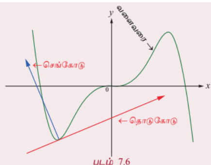

$y = f(x)$ என்ற வளைவரையை கருதுக. வளைவரையின் மீதுள்ள $(a, b)$ என்ற புள்ளியில் தொடுகோட்டின் சமன்பாடு என்பது

$$y - b = \left(\frac{dy}{dx}\right)_{(a,b)} (x - a)$$

அல்லது

$$y - b = f'(a)(x - a)$$

ஆகும்.

செங்கோடு என்பது அப்புள்ளியில் வரையப்பட்ட தொடுகோட்டிற்கு செங்குத்து. எனவே, $(a, b)$ என்ற புள்ளியில் செங்கோட்டின் சாய்வானது, தொடுகோட்டின் சாய்வின் தலைகீழ் எதிர்குறி, அதாவது

$$-\frac{1}{\left(\frac{dy}{dx}\right)_{(a,b)}}$$

மதிப்பாகும்.

ஆகவே, $(a, b)$ என்ற புள்ளியில் செங்கோட்டின் சமன்பாடு,

$$y - b = -\frac{1}{\left(\frac{dy}{dx}\right)_{(a,b)}}(x - a)$$

அல்லது

$$(y - b)\left(\frac{dy}{dx}\right)_{(a,b)} + (x - a) = 0$$

ஆகும்.

#### குறிப்புரை

(i) வளைவரைக்கு ஒரு புள்ளியில் வரையப்படும் தொடுகோடு கிடைமட்டமாக இருந்தால், அப்புள்ளியில் வகைக்கெழு 0 ஆகும். ஆகவே $(x_1, y_1)$ என்ற புள்ளியில் தொடுகோட்டின் சமன்பாடு $y = y_1$ மற்றும் செங்கோட்டின் சமன்பாடு $x = x_1$ ஆகும்.

(ii) வளைவரைக்கு ஒரு புள்ளியில் வரையப்படும் தொடுகோடு நிலைகுத்தாக இருந்தால், அப்புள்ளியில் வகைக்கெழு காணத்தக்கது மற்றும் முடிவிலி $\infty$ ஆகும். ஆகவே, $(x_1, y_1)$ என்ற புள்ளியில் தொடுகோட்டின் சமன்பாடு $x = x_1$ மற்றும் செங்கோட்டின் சமன்பாடு $y = y_1$ ஆகும்.

---

### எடுத்துக்காட்டு 7.11

$y = x^2 - 3x + 2$ என்ற வளைவரைக்கு $(1, 2)$ என்ற புள்ளியில் தொடுகோடு மற்றும் செங்கோட்டின் சமன்பாடுகளைக் காண்க.

#### தீர்வு

$x$-ஐப் பொறுத்து வகையிட, $\frac{dy}{dx} = 2x - 3$. ஆகவே,

$$\left(\frac{dy}{dx}\right)_{(1,2)} = -1$$

எனவே, தேவையான தொடுகோட்டின் சமன்பாடு

$$y - 2 = -1(x - 1) \Rightarrow x + y - 3 = 0$$

ஆகும்.

$(1, 2)$ என்ற புள்ளியில் செங்கோட்டின் சாய்வு $1$.

எனவே, தேவையான செங்கோட்டின் சமன்பாடு

$$y - 2 = 1(x - 1) \Rightarrow x - y + 1 = 0$$

ஆகும்.

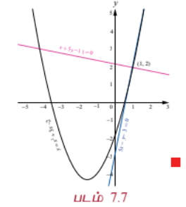

---

### எடுத்துக்காட்டு 7.12

$y = x^3 - 3x^2 - 2x + 3$ என்ற வளைவரைக்கு, எந்தெந்த புள்ளிகளில் வரையப்படும் தொடுகோடு $y = x$ என்ற கோட்டிற்கு இணையாக இருக்கும்?

#### தீர்வு

$y = x$ என்ற நேர்க்கோட்டின் சாய்வு 1 ஆகும். கொடுக்கப்பட்ட வளைவரைக்கு வரையப்படும் தொடுகோடு, $y = x$ என்ற கோட்டிற்கு இணையாக இருக்க வேண்டும் எனில் தொடுகோட்டின் சாய்வும் 1 என இருக்க வேண்டும்.

ஆகவே,

$$\frac{dy}{dx} = 3x^2 - 6x - 2 = 1$$

$$\Rightarrow 3x^2 - 6x - 3 = 0$$

$$\Rightarrow x^2 - 2x - 1 = 0$$

$$\Rightarrow x = 1 \pm \sqrt{2}$$

எனவே, $(1 \pm \sqrt{2}, f(1 \pm \sqrt{2}))$ என்ற புள்ளிகளில் வரையப்படும் தொடுகோடு $y = x$ என்ற கோட்டிற்கு இணையாக இருக்கும்.

---

### எடுத்துக்காட்டு 7.13

$x = 3\cos 2t$ மற்றும் $y = 2\sin 3t$, $t \in \mathbb{R}$ என்ற லிசஜோஸ் வளைவரையின் மீதுள்ள ஏதேனும் ஒரு புள்ளியில் தொடுகோடு மற்றும் செங்கோட்டின் சமன்பாடுகளைக் காண்க.

#### தீர்வு

கொடுக்கப்பட்ட வளைவரையானது வட்டமோ அல்லது நீள்வட்டமோ அல்ல என்பதைக் கவனிக்க. உங்கள் பார்வைக்காக இந்த வளைவரை படம் 7.8-ல் காட்டப்பட்டுள்ளது.

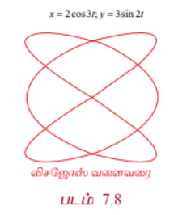

இப்பொழுது,

$$\frac{dy}{dx} = \frac{\frac{dy}{dt}}{\frac{dx}{dt}} = \frac{6\cos 3t}{-6\sin 2t} = -\frac{\cos 3t}{\sin 2t}$$

எனவே, ஏதேனும் ஒரு புள்ளியில் தொடுகோட்டின் சமன்பாடு

$$y - 2\sin 3t = -\frac{\cos 3t}{\sin 2t}(x - 3\cos 2t)$$

அதாவது,

$$x\cos 3t + y\sin 2t = 3\cos 3t\cos 2t + 2\sin 3t\sin 2t$$

செங்கோட்டின் சாய்வு என்பது தொடுகோட்டுச் சாய்வின் எதிர்குறி தலைகீழ் மதிப்பு என்பதால் செங்கோட்டின் சாய்வு

$$\frac{\sin 2t}{\cos 3t}$$

ஆகவே, செங்கோட்டின் சமன்பாடு

$$y - 2\sin 3t = \frac{\sin 2t}{\cos 3t}(x - 3\cos 2t)$$

அதாவது,

$$x\sin 2t - y\cos 3t = 3\sin 2t\cos 2t - 2\sin 3t\cos 3t = \frac{3}{2}\sin 4t - \sin 6t$$

---

#### 7.2.5 இரண்டு வளைவரைகளுக்கு இடைப்பட்ட கோணம் (Angle between two curves)

#### வரையறை 7.3

இரண்டு வளைவரைகள் வெட்டிக் கொள்ளும் புள்ளியில் வரையப்படும் தொடுகோடுகளுக்கு இடைப்பட்ட குறுங்கோணமே, வெட்டும் புள்ளியில் இரண்டு வளைவரைக்கு இடைப்பட்ட கோணமாக வரையறுக்கப்படுகின்றது.

இரண்டு வளைவரைகளுக்கு இடைப்பட்ட கோணத்தினை, வளைவரைகள் வெட்டும்புள்ளியிடத்து வரையப்படும் தொடுகோடுகளின் சாய்வுகளின் மதிப்புகளைக் கொண்டு காணலாம். $y = m_1x + c_1$ மற்றும் $y = m_2x + c_2$ ஆகிய இரு கோடுகளுக்கு இடைப்பட்ட குறுங்கோணம் $\theta$ எனில்,

$$\tan\theta = \left|\frac{m_2 - m_1}{1 + m_1m_2}\right|$$

... (3)

இங்கு $m_1$ மற்றும் $m_2$ ஆகியவை முடிவுற்ற எண்கள்.

#### குறிப்புரை

(i) $(x_1, y_1)$ என்ற புள்ளியில் இரண்டு வளைவரைகள் இணை எனில், $m_1 = m_2$.

(ii) $(x_1, y_1)$ என்ற புள்ளியில் இரண்டு வளைவரைகள் செங்குத்து மற்றும் $m_1$, $m_2$ ஆகியவை காணத்தக்கவை மற்றும் முடிவுற்ற எண்கள் எனில் $m_1m_2 = -1$.

---

### எடுத்துக்காட்டு 7.14

$y = x^2$ மற்றும் $y = (x - 3)^2$ என்ற வளைவரைகளுக்கு இடைப்பட்ட கோணத்தைக் காண்க.

#### தீர்வு

இப்பொழுது நாம் வெட்டும் புள்ளியைக் காண்போம். சமப்படுத்த $x^2 = (x - 3)^2 \Rightarrow x = \frac{3}{2}$ எனப்பெறலாம். எனவே, வெட்டும் புள்ளி $\left(\frac{3}{2}, \frac{9}{4}\right)$ ஆகும். $\theta$ என்பது இவ்விரு வளைவரைகளுக்கு இடைப்பட்ட கோணம் என்க. வெட்டும் புள்ளியிடத்து வளைவரையின் சாய்வுகள் பின்வருமாறு கணக்கிடப்படுகின்றன:

$y = x^2$ என்ற வளைவரைக்கு,

$$\frac{dy}{dx} = 2x \quad \Rightarrow \quad m_1 = \left(\frac{dy}{dx}\right)_{\left(\frac{3}{2}, \frac{9}{4}\right)} = 3$$

$y = (x - 3)^2$ என்ற வளைவரைக்கு,

$$\frac{dy}{dx} = 2(x - 3) \quad \Rightarrow \quad m_2 = \left(\frac{dy}{dx}\right)_{\left(\frac{3}{2}, \frac{9}{4}\right)} = -3$$

(3)-லிருந்து,

$$\tan\theta = \left|\frac{-3 - 3}{1 + (3)(-3)}\right| = \frac{6}{8} = \frac{3}{4}$$

ஆகும்.

ஆகவே, $\theta = \tan^{-1}\left(\frac{3}{4}\right)$.

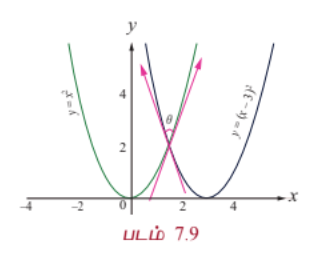

---

### எடுத்துக்காட்டு 7.15

$y = x^2$ மற்றும் $x = y^2$ என்ற வளைவரைகளுக்கு இடைப்பட்ட கோணத்தினை $(0, 0)$ மற்றும் $(1, 1)$ என்ற வெட்டும் புள்ளிகளில் காண்க.

#### தீர்வு

இப்பொழுது நாம் வளைவரைகளின் சாய்வுகளைக் காண்போம்.

$y = x^2$ என்ற வளைவரையின் சாய்வு $m_1$ என்க.

$$m_1 = \frac{dy}{dx} = 2x$$

$x = y^2$ என்ற வளைவரையின் சாய்வு $m_2$ என்க.

$$m_2 = \frac{dy}{dx} = \frac{1}{2y}$$

$(0,0)$ மற்றும் $(1,1)$ என்ற புள்ளிகளிடத்து வளைவரைகளுக்கிடைப்பட்ட கோணங்கள் $\theta_1$ மற்றும் $\theta_2$ என்க.

$(0, 0)$ என்ற புள்ளியில்,

$$\tan\theta_1 = \left|\frac{\frac{1}{2y} - 2x}{1 + 2x\left(\frac{1}{2y}\right)}\right|$$

-ஐ கணக்கிடும்போது பகுதியில் 0 என்ற தேரப்பெறாத வடிவத்தைப் பெறுகிறோம். எனவே, நாம் எல்லை காணும் முறையை பயன்படுத்துவோம்.

$$\tan\theta_1 = \lim_{(x,y) \rightarrow (0,0)} \left|\frac{\frac{1}{2y} - 2x}{1 + \frac{x}{y}}\right| = \lim_{(x,y) \rightarrow (0,0)} \left|\frac{1 - 4xy}{2(y + x)}\right| = \infty$$

$$\Rightarrow \theta_1 = \frac{\pi}{2}$$

$(1, 1)$ என்ற புள்ளியில், $m_1 = 2, m_2 = \frac{1}{2}$,

$$\tan\theta_2 = \left|\frac{\frac{1}{2} - 2}{1 + 2\left(\frac{1}{2}\right)}\right| = \frac{3}{4}$$

$$\Rightarrow \theta_2 = \tan^{-1}\left(\frac{3}{4}\right)$$

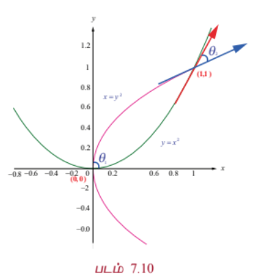

---

### எடுத்துக்காட்டு 7.16

$y = \sin x$ என்ற வளைவரைக்கும் மிகை $x$ -அச்சிற்கும் இடைப்பட்ட கோணம் காண்க.

#### தீர்வு

$y = \sin x$ என்ற வளைவரை மிகை $x$ -அச்சை வெட்டும்போது $y = 0 \Rightarrow x = n\pi, n = 1, 2, 3, \ldots$

இப்பொழுது, $\frac{dy}{dx} = \cos x$. $x = n\pi$ -ல் சாய்வு $m_1 = \cos(n\pi) = (-1)^n$, $x$ -அச்சின் சாய்வு $m_2 = 0$ ஆகும்.

இவைகளுக்கு இடைப்பட்ட கோணம் $\theta$ எனில்,

$$\tan\theta = \left|\frac{0 - (-1)^n}{1 + (-1)^n(0)}\right| = 1, \quad \forall n$$

$$\Rightarrow \theta = \frac{\pi}{4}$$

---

### எடுத்துக்காட்டு 7.17

$ax^2 + by^2 = 1$ மற்றும் $cx^2 + dy^2 = 1$ என்ற வளைவரைகள் ஒன்றை ஒன்று செங்குத்தாக வெட்டிக் கொண்டால் $\frac{1}{a} - \frac{1}{b} = \frac{1}{c} - \frac{1}{d}$ என நிறுவுக.

#### தீர்வு

$(x_0, y_0)$ என்ற புள்ளியில் இரண்டு வளைவரைகளும் வெட்டிக் கொண்டால்

$$(a - c)x_0^2 + (b - d)y_0^2 = 0$$

எனப்பெறலாம்.

வெட்டும் புள்ளி $(x_0, y_0)$ என்ற புள்ளியில் வளைவரையின் சாய்வுகளைக் காண்போம்:

$ax^2 + by^2 = 1$ என்ற வளைவரைக்கு $\frac{dy}{dx} = -\frac{ax}{by}$ மற்றும்

$cx^2 + dy^2 = 1$ என்ற வளைவரைக்கு $\frac{dy}{dx} = -\frac{cx}{dy}$.

$(x_0, y_0)$ என்ற புள்ளியில் இரண்டு வளைவரைகளும் செங்குத்தாக வெட்டிக் கொண்டால் சாய்வுகளின் பெருக்கல் பலன் $-1$ ஆகும். ஆகவே, $(x_0, y_0)$ என்ற புள்ளியில் இரண்டு வளைவரைகளும் செங்குத்தாக வெட்டிக் கொண்டால்

$$\left(-\frac{ax_0}{by_0}\right)\left(-\frac{cx_0}{dy_0}\right) = -1$$

அதாவது, $acx_0^2 + bdy_0^2 = 0$,

மேலும் $(a - c)x_0^2 + (b - d)y_0^2 = 0$ என்பதில் இருந்து,

$$\frac{ac}{a - c} = \frac{bd}{b - d}$$

எனப் பெறலாம்.

எனவே,

$$\frac{1}{c} - \frac{1}{a} = \frac{1}{d} - \frac{1}{b}$$

அதாவது,

$$\frac{1}{a} - \frac{1}{b} = \frac{1}{c} - \frac{1}{d}$$

#### குறிப்புரை

மேற்கண்ட எடுத்துக்காட்டில், அதன் மறுதலையும் உண்மையாகும். அதாவது $\frac{1}{a} - \frac{1}{b} = \frac{1}{c} - \frac{1}{d}$ என்ற கட்டுப்பாட்டைக் கொண்டு, ஒருவர் எளிதில் வளைவரைகள் ஒன்றுக்கொன்று செங்குத்தாக வெட்டிக் கொள்ளும் எனவும் நிறுவலாம்.

---

### எடுத்துக்காட்டு 7.18

$x^2 + 4y^2 = 8$ என்ற நீள்வட்டமும் $x^2 - 2y^2 = 4$ என்ற அதிபரவளையமும் செங்குத்தாக வெட்டிக் கொள்ளும் என நிறுவுக.

#### தீர்வு

கொடுக்கப்பட்ட இரு வளைவரைகளும் வெட்டும் புள்ளியை $(a, b)$ என்க.

ஆகவே, $a^2 + 4b^2 = 8$ மற்றும் $a^2 - 2b^2 = 4$

... (4)

நாம் $(a, b)$ என்ற புள்ளியில் இவ்விரு வளைவரைகளின் சாய்வுகளின் பெருக்கல் பலன் $-1$ என நிறுவ வேண்டும்.

$x^2 + 4y^2 = 8$ -ஐ $x$ -ஐப் பொறுத்து வகையிட

$$2x + 8y\frac{dy}{dx} = 0$$

எனவே,

$$\frac{dy}{dx} = -\frac{x}{4y}, \quad \left(\frac{dy}{dx}\right)_{(a,b)} = m_1 = -\frac{a}{4b}$$

$x^2 - 2y^2 = 4$ -ஐ $x$ -ஐப் பொறுத்து வகையிட

$$2x - 4y\frac{dy}{dx} = 0$$

எனவே,

$$\frac{dy}{dx} = \frac{x}{2y}, \quad \left(\frac{dy}{dx}\right)_{(a,b)} = m_2 = \frac{a}{2b}$$

எனவே, $m_1 \times m_2 = \left(-\frac{a}{4b}\right)\left(\frac{a}{2b}\right) = -\frac{a^2}{8b^2}$

... (5)

(4)-ல் விகிதச் சமக் கொள்கையை பயன்படுத்த,

$$\frac{a^2}{b^2} = \frac{8 - 4}{1} \quad \Rightarrow \quad \frac{a^2}{b^2} = 8$$

எனப் பெறலாம்.

எனவே, $\frac{a^2}{8b^2} = \frac{8}{8} = 1$ ஆகும். இதனை (5)-ல் பிரதியிட, நாம் $m_1m_2 = -1$ எனப் பெறலாம். ஆகவே, இவ்விரு வளைவரைகளும் செங்குத்தாக வெட்டிக் கொள்ளும்.

---

### பயிற்சி 7.2

1. பின்வரும் வளைவரைகளுக்கு கொடுக்கப்பட்ட புள்ளிகளில் தொடுகோட்டின் சாய்வினைக் காண்க.

   (i) $y = x^4 + 2x^2$; $x = 1$

   (ii) $x = a\cos^3 t, y = b\sin^3 t$; $t = \frac{\pi}{2}$.

2. $y = x^2 - 5x + 4$ என்ற வளைவரைக்கு எப்புள்ளிகளில் வரையப்படும் தொடுகோடு $3x + y = 7$ என்ற கோட்டிற்கு இணையாக இருக்கும்?

3. $y = x^3 - 3x^2 + 6x$ என்ற வளைவரைக்கு எப்புள்ளிகளில் வரையப்படும் தொடுகோடு $x + 17y = 9$ என்ற கோட்டிற்கு செங்குத்தாக இருக்கும்?

4. $y^2 = 4x + 5$ என்ற வளைவரைக்கு எப்புள்ளிகளில் வரையப்படும் தொடுகோடு கிடைமட்டமாக இருக்கும்?

5. கீழ்க்கண்ட வளைவரைகளின் மீது கொடுக்கப்பட்ட புள்ளிகளில் தொடுகோடு மற்றும் செங்கோடுகளின் சமன்பாடுகளைக் காண்க.

   (i) $y = x - x^4$; $(1, 0)$

   (ii) $y = e^{4x - 2}$; $(0, 2)$

   (iii) $y = x \sin x$; $\left(\frac{\pi}{2}, \frac{\pi}{2}\right)$

   (iv) $x = \cos t, y = \sin^2 t$; $t = \frac{\pi}{3}$

6. $y = \sqrt[3]{x}$ என்ற வளைவரைக்கு $x + 12y = 12$ என்ற கோட்டிற்கு செங்குத்தாக உள்ள தொடுகோடுகளின் சமன்பாடுகளைக் காண்க.

7. $y = \frac{x}{x + 1}$ என்ற வளைவரைக்கு $x + 2y = 6$ என்ற கோட்டிற்கு இணையாக உள்ள தொடுகோடுகளின் சமன்பாடுகளைக் காண்க.

8. $x = 7\cos t$ மற்றும் $y = 2\sin t$, $t \in \mathbb{R}$ என்ற வளைவரைக்கு ஏதேனும் ஒரு புள்ளியில் வரையப்படும் தொடுகோடு மற்றும் செங்கோட்டின் சமன்பாடுகளைக் காண்க.

9. $xy = 2$ என்ற செவ்வக அதிபரவளையத்திற்கும் $x^2 + y^2 = 40$ என்ற பரவளையத்திற்கும் இடைப்பட்ட கோணத்தினைக் காண்க.

10. $x^2 + y^2 = r^2$ மற்றும் $xy = c^2$ என்ற வளைவரைகள் செங்குத்தாக வெட்டிக் கொள்ளும் எனக்காட்டுக. இங்கு $c, r$ ஆகியவை மாறிலிகள்.

### 7.3 சராசரி மதிப்புத் தேற்றம் (Mean Value Theorem)

ஒரு வளைவரையின் நாணுக்கு இணையாக வரையப்படும் ஒரு தொடுகோட்டின் தொடும் புள்ளி, நாணின் முனைப்புள்ளிகளுக்கு இடையே அமையும் என்பதை சராசரி மதிப்புத் தேற்றம் உறுதி செய்கிறது. நாம் இப்பாடப்பகுதியை இடைநிலை மதிப்புத் தேற்றத்தின் வரையரையிலிருந்து தொடங்கலாம்.

#### தேற்றம் 7.1 (இடைநிலை மதிப்புத் தேற்றம்)

$f(x)$ என்ற சார்பு மூடிய இடைவெளி $[a, b]$-ல் தொடர்ச்சியாக உள்ளது எனவும் $f(a)$ மற்றும் $f(b)$ -க்கு இடையில் ( $f(a)$ மற்றும் $f(b)$ உள்ளடங்கியது) $c$ என்ற ஏதேனும் ஒரு எண் உள்ளது எனில், $[a, b]$ என்ற மூடிய இடைவெளியில் குறைந்தபட்சம் $x$ என்ற ஒரு எண்ணையாவது $f(x) = c$ என்றவாறு காணலாம்.

---

#### 7.3.1 ரோலின் தேற்றம் (Rolle's Theorem)

##### தேற்றம் 7.2 (ரோலின் தேற்றம்)

$f(x)$ என்ற சார்பு மூடிய இடைவெளி $[a, b]$-ல் தொடர்ச்சியானதாகவும், திறந்த இடைவெளி $(a, b)$ -ல் வகையிடத்தக்கதாகவும் இருக்கிறது மேலும் $f(a) = f(b)$ எனில், குறைந்தபட்சம் ஒரு புள்ளி $c \in (a, b)$ ஆனது $f'(c) = 0$ என்றவாறு இருக்கும்.

$x = a$ -யில் இருந்து $x = b$ வரை ஒரு தொடுகோடானது வளைவரை மீது படம் 7.11-ல் உள்ளவாறு நகர்ந்தால் $c \in (a, b)$ என்ற எண்ணினை $c$-யில் வரையப்படும் தொடுகோடு $x$ -அச்சிற்கு இணையாக உள்ளவாறு காணலாம்.

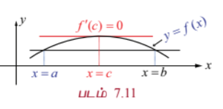

---

### எடுத்துக்காட்டு 7.19

$f(x) = x(x - 1)(x - 2)$, $x \in [0, 1]$ என்ற சார்பிற்கு ரோலின் தேற்றத்தை நிறைவு செய்யும் $c$ -ன் மதிப்பைக் கணக்கிடுக.

#### தீர்வு

$f(x)$ என்பது மூடிய இடைவெளி $[0, 1]$ -ல் தொடர்ச்சியானதாகவும், திறந்த இடைவெளி $(0, 1)$ -ல் வகையிடத்தக்கதாகவும், மேலும் $f(0) = f(1) = 0$ ஆகவும் உள்ளது.

இப்பொழுது, $f'(x) = (x - 1)(x - 2) + x(x - 2) + x(x - 1) = 3x^2 - 6x + 2$.

எனவே, $f'(c) = 0 \Rightarrow 3c^2 - 6c + 2 = 0$

$$\Rightarrow c = \frac{6 \pm \sqrt{36 - 24}}{6} = \frac{6 \pm 2\sqrt{3}}{6} = 1 \pm \frac{\sqrt{3}}{3}$$

$\Rightarrow c = 1 \pm \frac{1}{\sqrt{3}}$

$1 + \frac{1}{\sqrt{3}} \notin (0, 1)$, எனவே $c = 1 - \frac{1}{\sqrt{3}} \in (0, 1)$.

---

### எடுத்துக்காட்டு 7.20

$f(x) = x + \frac{1}{x}$, $x \in \left[\frac{1}{2}, 2\right]$ என்ற சார்பிற்கு $\left[\frac{1}{2}, 2\right]$ என்ற இடைவெளியில் ரோலின் தேற்றத்தை நிறைவுச் செய்யும் மதிப்பை காண்க.

#### தீர்வு

$f(x)$ என்பது மூடிய இடைவெளி $\left[\frac{1}{2}, 2\right]$ -ல் தொடர்ச்சியானதாகவும், திறந்த இடைவெளி $\left(\frac{1}{2}, 2\right)$ -ல் வகையிடத்தக்கதாகவும், மேலும் $f\left(\frac{1}{2}\right) = \frac{5}{2} = f(2)$ ஆகவும் உள்ளது. எனவே ரோலின் தேற்றப்படி $c \in \left(\frac{1}{2}, 2\right)$ என்ற எண்ணினை $f'(c) = 0$ எனுமாறு காணலாம்.

இப்பொழுது,

$$f'(x) = 1 - \frac{1}{x^2}$$

$$f'(c) = 0 \Rightarrow 1 - \frac{1}{c^2} = 0 \Rightarrow c = \pm 1$$

$c = -1 \notin \left(\frac{1}{2}, 2\right)$, $c = 1 \in \left(\frac{1}{2}, 2\right)$ எனவே $c = 1$ என தேர்ந்தெடுக்கலாம்.

---

### எடுத்துக்காட்டு 7.21

$f(x) = \log\left(\frac{x^2 - 6}{5}\right)$ என்ற சார்பிற்கு $[2, 3]$ என்ற இடைவெளியில் ரோலின் தேற்றத்தை நிறைவு செய்யும் $c$ -ன் மதிப்பைக் கணக்கிடுக.

#### தீர்வு

$f(x)$ என்ற சார்பு மூடிய இடைவெளி $[2, 3]$-ல் தொடர்ச்சியானதாகவும், திறந்த இடைவெளி $(2, 3)$ -ல் வகையிடத்தக்கதாகவும், மற்றும் $f(2) = 0 = f(3)$ ஆகவும் உள்ளது.

இப்பொழுது,

$$f'(x) = \frac{2x}{x^2 - 6}$$

எனவே, $f'(c) = 0 \Rightarrow \frac{2c}{c^2 - 6} = 0 \Rightarrow c = 0$

$0 \notin (2, 3)$. எனவே, ரோலின் தேற்றத்தை நிறைவு செய்யும் $c$ -ன் மதிப்பு இல்லை.

---

ரோலின் தேற்றத்தினை ஒரு இயற்கணிதச் சமன்பாட்டிற்கு கொடுக்கப்பட்ட இடைவெளியில் எத்தனை தீர்வுகள் இருக்கும் என்பதனை சமன்பாட்டைத் தீர்க்காமல் காணவும் பயன்படுத்தலாம்.

---

### எடுத்துக்காட்டு 7.22

$x^4 - 3x^2 + 2 = 0$ என்ற சமன்பாட்டைத் தீர்க்காமல் $(0, 1)$ என்ற இடைவெளியில் ஒரே ஒரு தீர்வுதான் இருக்கும் எனக்காட்டு.

#### தீர்வு

$f(x) = x^4 - 3x^2 + 2$ என்க. $f(x)$ ஆனது $[0, 1]$ -ல் தொடர்ச்சியானதாகவும், $(0, 1)$ -ல் வகையிடத்தக்கதாகவும் உள்ளது.

இப்பொழுது $f'(x) = 4x^3 - 6x = 2x(2x^2 - 3)$. $f'(x) = 0$ எனில், $x = 0, \pm \sqrt{\frac{3}{2}}$.

எனவே, $f'(x) < 0, \forall x \in (0, 1)$.

எனவே, ரோலின் தேற்றத்தின்படி $a, b \in (0, 1)$ என்ற எண்களை $f(a) = f(b) = 0$ எனுமாறு காண இயலாது. ஆனால் $f(0) = 2 > 0$ மற்றும் $f(1) = 0$ என்பதில் இருந்து $y = f(x)$ ஆவது இடைநிலை மதிப்பு தேற்றப்படி, 0 மற்றும் 1-க்கு இடையில் ஒரே ஒரு முறை $x$ -அச்சை வெட்டும். எனவே, $x^4 - 3x^2 + 2 = 0$ என்ற சமன்பாட்டிற்கு $(0, 1)$ என்ற இடைவெளியில் ஒரே ஒரு தீர்வுதான் இருக்கும்.

---

ரோலின் தேற்றத்தின் பயன்பாடாக கீழ்க்கண்டதை நாம் பெறலாம்.

---

### எடுத்துக்காட்டு 7.23

ரோலின் தேற்றப்படி $a_nx^n + a_{n-1}x^{n-1} + \cdots + a_0$ என்ற பல்லுறுப்புக் கோவையின் இரு வேறு மெய் பூச்சியமாக்கிகளுக்கு இடையில் $na_nx^{n-1} + (n-1)a_{n-1}x^{n-2} + \cdots + a_1$ என்ற பல்லுறுப்புக் கோவையின் ஒரு பூச்சியமாக்கி அமையும் என நிறுவுக.

#### தீர்வு

$P(x) = a_nx^n + a_{n-1}x^{n-1} + \cdots + a_0$ என்க. $\alpha, \beta$ என்பன $P(x)$ -ன் பூச்சியமாக்கிகள் என்க. எனவே, $P(\alpha) = P(\beta) = 0$. $P(x)$ ஆனது $[\alpha, \beta]$-ல் தொடர்ச்சியாகவும், திறந்த இடைவெளி $(\alpha, \beta)$ -ல் வகையிடத்தக்கதாகவும் இருப்பதால் ரோலின் தேற்றப்படி $c \in (\alpha, \beta)$ ஆனது $P'(c) = 0$ எனுமாறு காணலாம்.

$$P'(x) = na_nx^{n-1} + (n-1)a_{n-1}x^{n-2} + \cdots + a_1$$

என்பதிலிருந்து தேற்றம் நிரூபணமாகிறது.

---

### எடுத்துக்காட்டு 7.24

$x^4 - 6x^3 + 11x^2 - 12x + 42 = 8$ என்ற பல்லுறுப்புக் கோவையின் பூச்சியமாக்கிகள் 2 மற்றும் 7 எனில், $2x^3 - 9x^2 + 11x - 12$ என்ற பல்லுறுப்புக் கோவையின் ஒரு பூச்சியம் $(2, 7)$ என்ற இடைவெளியில் அமையும் என நிறுவுக.

#### தீர்வு

$P(x) = x^4 - 6x^3 + 11x^2 - 12x + 34$ என்ற பல்லுறுப்புக் கோவைக்கு $\alpha = 2, \beta = 7$ எனக்கொண்டு எடுத்துக்காட்டு 7.23-ன் முடிவைப் பயன்படுத்த வேண்டும்.

இப்பொழுது,

$$P'(x) = 4x^3 - 18x^2 + 22x - 12 = 2(2x^3 - 9x^2 + 11x - 6)$$

இதிலிருந்து $2x^3 - 9x^2 + 11x - 6 = 0$ என்ற பல்லுறுப்புக் கோவையின் ஒரு பூச்சியம் $(2, 7)$ என்ற இடைவெளியில் அமையும் என நிறுவலாம்.

$Q(x) = 2x^3 - 9x^2 + 11x - 6$ என்க.

சரிபார்த்தல்,

$Q(2) = 16 - 36 + 22 - 6 = -4 \neq 0$

$Q(7) = 686 - 441 + 77 - 6 = 316 \neq 0$

இதிலிருந்து $Q(x)$ என்ற பல்லுறுப்புக் கோவையின் ஒரு பூச்சியம் $(2, 7)$ என்ற இடைவெளியில் அமையும் என்கிறோம்.

---

#### குறிப்புரை

ரோலின் தேற்றத்தைப் பயன்படுத்த இயலாத சார்புகள்

(1) $f(x) = |x|, x \in [-1, 1]$ என்ற சார்பு $f(-1) = f(1)$ என இருந்த போதிலும் ரோலின் தேற்றத்தைப் பயன்படுத்த இயலாது. ஏன் எனில் $x = 0$ -வில் $f(x)$ வகையிடத்தக்கதல்ல.

(2) $f(x) = \begin{cases} x, & 0 \le x < 1 \\ 0, & x = 1 \end{cases}$ என்ற சார்பு $f(0) = 0 = f(1)$ என இருந்த போதிலும் ரோலின் தேற்றத்தைப் பயன்படுத்த இயலாது. ஏன் எனில் $f(x)$ ஆனது $x = 0$ -வில் தொடர்ச்சியானது இல்லை.

(3) $f(x) = \sin x, x \in \left[0, \frac{\pi}{2}\right]$ என்ற சார்பு, மூடிய இடைவெளி $\left[0, \frac{\pi}{2}\right]$ -ல் தொடர்ச்சியாகவும், திறந்த இடைவெளி $\left(0, \frac{\pi}{2}\right)$ -ல் வகையிடத்தக்கதாக இருந்தாலும் $f(0) \neq f\left(\frac{\pi}{2}\right)$ என்பதால் ரோலின் தேற்றத்தைப் பயன்படுத்த இயலாது.

---

$f(x)$ ஆனது மூடிய இடைவெளி $[a, b]$-ல் தொடர்ச்சியானதாகவும், திறந்த இடைவெளி $(a, b)$ -ல் வகையிடத்தக்கதாகவும் இருந்து $f(a) \neq f(b)$ என இருக்கும் நிலையிலும் ரோலின் தேற்றத்தை கீழ்க்கண்டவாறு பொதுமைப்படுத்தலாம்.

---

#### 7.3.2 லெக்ராஞ்சியின் சராசரி மதிப்புத் தேற்றம் (Lagrange's Mean Value Theorem)

##### தேற்றம் 7.3

$f(x)$ ஆனது மூடிய இடைவெளி $[a, b]$-ல் தொடர்ச்சியானதாகவும், திறந்த இடைவெளி $(a, b)$ -ல் வகையிடத்தக்கதாகவும் ($f(a), f(b)$ ஆகியவை சமமாக இருக்க வேண்டிய அவசியம் இல்லை) உள்ளது என்க. அப்போது குறைந்தபட்சம் ஒரு புள்ளி $c \in (a, b)$ -யினை

$$f'(c) = \frac{f(b) - f(a)}{b - a}$$

... (6)

எனுமாறு காணலாம்.

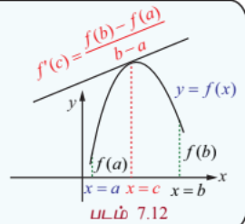

#### குறிப்புரை

$f(a) = f(b)$ எனில் லெக்ராஞ்சியின் சராசரி மதிப்புத் தேற்றம் ரோலின் தேற்றத்தைத் தரும். லெக்ராஞ்சியின் சராசரி மதிப்புத் தேற்றத்தினை **சுழன்ற ரோலின் தேற்றம்** என்கிறோம்.

#### குறிப்புரை

இத்தேற்றத்தின் உள்ளார்ந்த விளக்கமானது $(a, b)$ என்ற இடைவெளியில் $f(x)$ -ன் சராசரி மாறுவீதத்தை $\frac{f(b) - f(a)}{b - a}$ -யும் மற்றும் $c$-யில் கணநேர மாறுவீதத்தை $f'(c)$ யும் குறிக்கிறது.

லெக்ராஞ்சியின் இடைமதிப்புத் தேற்றத்தின் வடிவக் கணித விளக்கமானது ஒரு இடைவெளியில் சராசரி மாறுபாட்டு வீதமானது, அந்த இடைவெளியின் உள்ளிருக்கும் ஒரு புள்ளியில் கணநேர மாறுவீதத்திற்குச் சமமாக இருக்கும். இதனை கீழ்க்கண்ட எடுத்துக்காட்டின் மூலம் உணரலாம்.

ஒரு மகிழுந்தானது 200 மீ தூரத்தை 8 வினாடி காலத்தில் கடக்கிறது எனில் இதன் சராசரி திசைவேகம் $\frac{200}{8} = 25$ மீ/வி ஆகும். இந்த 8 வினாடி கால இடைவெளியினுள் ஏதேனும் ஒரு நேரத்தில் மகிழுந்தின் வேகம் காட்டும் கருவி சரியாக 25 மீ/வி அதாவது 90 கி.மீ/மணியினைக் காட்டும் என்பதை சராசரி மதிப்புத் தேற்றம் உறுதி செய்கின்றது.

---

#### தேற்றம் 7.4

$f(x)$ என்ற சார்பானது மூடிய இடைவெளி $[a, b]$-ல் தொடர்ச்சியானதாகவும், திறந்த இடைவெளி $(a, b)$ -ல் வகையிடத்தக்கதாகவும் மற்றும் $f'(x) > 0, \forall x \in (a, b)$ ஆகவும் இருந்தால், $x_1, x_2 \in [a, b]$ -க்கு, $x_1 < x_2$ எனில் $f(x_1) < f(x_2)$ ஆகும்.

#### நிரூபணம்

சராசரி மதிப்புத் தேற்றப்படி, $c \in (x_1, x_2) \subseteq (a, b)$ ஆனது

$$\frac{f(x_2) - f(x_1)}{x_2 - x_1} = f'(c)$$

என்றவாறு காணலாம்.

$f'(c) > 0$, மற்றும் $x_2 - x_1 > 0$ என்பதால் $f(x_2) - f(x_1) > 0$ ஆகும்.

இதிலிருந்து நாம் $x_1 < x_2$ எனில் $f(x_1) < f(x_2)$ எனப் பெறலாம்.

#### குறிப்புரை

$f'(x) < 0, \forall x \in (a, b)$ மற்றும் $x_1, x_2 \in [a, b]$ -க்கு $x_1 < x_2$ எனில் $f(x_1) > f(x_2)$ ஆகும். இதனையும் மேற்கண்ட முறையிலேயே நிறுவலாம்.

---

### எடுத்துக்காட்டு 7.25

$f(x) = x^2 - 2x$, $1 \le x \le 2$ என்ற சார்பிற்கு $(1, 2)$ என்ற இடைவெளியில் சராசரி மதிப்புத் தேற்றத்தை நிறைவு செய்யும் மதிப்பினைக் காண்க.

#### தீர்வு

$f(x)$ ஆனது கொடுக்கப்பட்ட இடைவெளியில் வரையறுக்கப்பட்டு மற்றும் $1 < x < 2$ என்ற இடைவெளியில் வகையிடத்தக்கதாகவும் உள்ளது. மேலும் $f(1) = -1$ மற்றும் $f(2) = 0$. எனவே, சராசரி மதிப்புத் தேற்றப்படி $c \in (1, 2)$ ஆனது

$$f'(c) = \frac{f(2) - f(1)}{2 - 1} = 1$$

என்று இருக்கும்.

அதாவது, $2c - 2 = 1 \Rightarrow c = \frac{3}{2}$.

---

#### வடிவ கணித விளக்கம்

$y = f(x)$ என்ற வளைவரைக்கு சராசரி மதிப்புத் தேற்றத்தின் வடிவ கணித விளக்கமானது முனைப்புள்ளிகள் $x = a$ மற்றும் $x = b$ வழியே செல்லும் நாணுக்கு இணையாக ஒரு தொடுகோட்டின் தொடும் புள்ளியினை $c \in (a, b)$ என்றவாறு காண இயலும்.

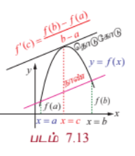

---

### லெக்ராஞ்சியின் சராசரி மதிப்புத் தேற்றத்தின் விளைவுகள்

சராசரி மதிப்புத் தேற்றத்தின் வாயிலாக நாம் கீழ்க்காணும் மூன்று முக்கிய முடிவுகளைப் பெறலாம்.

(1) கொடுக்கப்பட்ட சார்பின் ஓரியல்புத் தன்மையை தீர்மானம் செய்ய பயன்படுகிறது. (தேற்றம் 7.4)

(2) $f'(x) = 0, \forall x \in (a, b)$ எனில், $f$ ஆனது $(a, b)$ -ல் ஒரு மாறிலி ஆகும்.

(3) $f'(x) = g'(x) \forall x$ எனில், $f(x) = g(x) + C$ ஆகும். (இங்கு $C$ ஏதேனும் ஒரு மாறிலி)

---

#### 7.3.3 பயன்பாடுகள் (Applications)

---

### எடுத்துக்காட்டு 7.26

ஒரு சுமை ஊர்தி சுங்கச் சாவடி சாலையில் மணிக்கு 80 கி.மீ வேகத்தில் செல்கிறது. அந்த சுமை ஊர்தி 2 மணி நேரத்தில் 164 கி.மீ பயணத்தை நிறைவு செய்கிறது. சுங்கச் சாவடி சாலை முடிவில் வேகக் கட்டுப்பாட்டை மீறியதற்கான அத்தாட்சி சீட்டு ஓட்டுனருக்கு வழங்கப்படுகின்றது. அவர் வேகக் கட்டுப்பாட்டை மீறியதை சராசரி மதிப்புத் தேற்றத்தின் துணை கொண்டு நியாயப்படுத்துக.

#### தீர்வு

$t$ மணிநேரத்தில் ஓட்டுனர் கடந்த தொலைவு $f(t)$ என்க. $f(t)$ ஆனது $[0, 2]$ -ல் தொடர்ச்சியானது மற்றும் $(0, 2)$ -ல் வகையிடத்தக்கது. மேலும், $f(0) = 0$ மற்றும் $f(2) = 164$. சராசரி மதிப்புத் தேற்றத்தைப் பயன்படுத்த, $c$ என்ற காலத்தை

$$f'(c) = \frac{164 - 0}{2 - 0} = 82 > 80$$

எனுமாறு காணலாம்.

எனவே, அந்த 2 மணி நேரத்தில் ஏதேனும் ஒரு கண நேரத்தில் அந்த ஓட்டுநர் 80 கி.மீ./மணி வேகத்தில் பயணம் செய்திருக்க வேண்டும். ஆகவே, அவருக்கு வேகக் கட்டுப்பாட்டை மீறியதற்கான அத்தாட்சி சீட்டு வழங்கியது நியாயமே.

---

### எடுத்துக்காட்டு 7.27

$f(x)$ என்ற வகையிடத்தக்க சார்பு $f'(x) \le 29$ மற்றும் $f(2) = 17$ என்றவாறு உள்ளது எனில், $f(7)$ -ன் அதிகபட்ச மதிப்பினைக் காண்க.

#### தீர்வு

சராசரி மதிப்புத் தேற்றப்படி $c \in (2, 7)$ -ஐ

$$\frac{f(7) - f(2)}{7 - 2} = f'(c) \le 29$$

எனக் காணலாம்.

ஆகவே, $f(7) \le 5(29) + 17 = 162$

எனவே, $f(7)$ -ன் அதிகபட்ச மதிப்பு 162 ஆகும்.

---

### எடுத்துக்காட்டு 7.28

சராசரி மதிப்புத் தேற்றத்தைப் பயன்படுத்தி,

$$|\sin \alpha - \sin \beta| \le |\alpha - \beta|, \quad \alpha, \beta \in \mathbb{R}$$

என நிறுவுக.

#### தீர்வு

$f(x) = \sin x$ என்பது அனைத்து திறந்த இடைவெளியிலும் வகையிடத்தக்கதாகும். மூடிய இடைவெளி $[\alpha, \beta]$-வை கருதுக. சராசரி மதிப்புத் தேற்றத்தைப் பயன்படுத்த $c \in (\alpha, \beta)$ -ஐ

$$\frac{\sin \beta - \sin \alpha}{\beta - \alpha} = f'(c) = \cos(c)$$

எனக் காணலாம்.

எனவே,

$$\left|\frac{\sin \beta - \sin \alpha}{\beta - \alpha}\right| = |\cos(c)| \le 1$$

ஆகவே, $|\sin \alpha - \sin \beta| \le |\alpha - \beta|$.

#### குறிப்புரை

$\beta = 0$ எனக் கொண்டால், $|\sin \alpha| \le |\alpha|$ என கிடைக்கும்.

---

### எடுத்துக்காட்டு 7.29

ஒரு உறைவிப்பானில் இருந்து ஒரு வெப்ப நிலைமானி எடுக்கப்பட்டு கொதிக்கும் நீரில் வைக்கப்பட்டது. $-10^\circ$ C-லிருந்து $100^\circ$C-க்கு உயர்த்த வெப்பநிலைமானிக்கு 22 வினாடிகள் ஆகிறது. ஏதேனும் ஒருநேரம் $t$-யில் வெப்பநிலை மாறுபாட்டு வீதம் $5^\circ$C / வினாடி ஆக இருக்கும் எனக்காட்டுக.

#### தீர்வு

$t$ என்ற நேரத்தில் வெப்பநிலையை $f(t)$ என்க. சராசரி மதிப்புத் தேற்றத்தின்படி,

$$f'(c) = \frac{f(b) - f(a)}{b - a} = \frac{100 - (-10)}{22} = \frac{110}{22} = 5^\circ\text{C / வினாடி}$$

ஆகவே, ஏதேனும் ஒரு நேரம் $t$-யில் வெப்பநிலை மாறுபாட்டு வீதம் $5^\circ$C/வினாடி ஆகும்.

---

### பயிற்சி 7.3

1. கொடுக்கப்பட்ட சார்புகளுக்கு கொடுக்கப்பட்ட இடைவெளியில் ரோலின் தேற்றம் ஏன் பயன்படுத்த முடியாது என்பதை விளக்குக.

   (i) $f(x) = \frac{1}{x}, x \in [-1, 1]$

   (ii) $f(x) = \tan x, x \in [0, \pi]$

   (iii) $f(x) = \log(2x^2 + 2), x \in [2, 7]$

2. ரோலின் தேற்றத்தைப் பயன்படுத்தி கீழ்க்காணும் சார்புகளுக்கு $x$ -ன் எம்மதிப்புகளில் வரையப்படும் தொடுகோடு $x$ -அச்சிற்கு இணையாக இருக்கும்?

   (i) $f(x) = x^2 - 2x, x \in [0, 1]$

   (ii) $f(x) = \frac{x^2 - 2x - 2}{x - 2}, x \in [1, 3]$

   (iii) $f(x) = \sqrt{x} - \frac{x}{3}, x \in [0, 9]$

3. கொடுக்கப்பட்ட சார்புகளுக்கு கொடுக்கப்பட்ட இடைவெளியில் லெக்ராஞ்சியின் சராசரி மதிப்புத் தேற்றம் ஏன் பயன்படுத்த முடியாது என்பதை விளக்குக.

   (i) $f(x) = \frac{x}{x - 1}, x \in [1, 2]$

   (ii) $f(x) = |3x - 1|, x \in [-1, 3]$

4. லெக்ராஞ்சியின் சராசரி மதிப்புத் தேற்றத்தைப் பயன்படுத்தி கொடுக்கப்பட்ட சார்புகளுக்கு கொடுக்கப்பட்ட இடைவெளியின் முனைப்புள்ளிகள் வழியே செல்லும் நாணுக்கு இணையாக ஒரு தொடுகோட்டின் தொடும் புள்ளியின் $x$ -ன் மதிப்பைக் காண்க.

   (i) $f(x) = x^3 - 3x^2 - 2x, x \in [2, 2]$

   (ii) $f(x) = (x - 2)(x - 7), x \in [3, 11]$

5. (i) $f(x) = \frac{1}{x}$ என்ற சார்பிற்கு $[a, b]$-யை மிகை முழு எண்களாக கொண்ட மூடிய இடைவெளி $[a, b]$-ல் சராசரி மதிப்புத் தேற்றத்தின்படி இறுதி மதிப்பு $\sqrt{ab}$ என நிறுவுக.

   (ii) $f(x) = Ax^2 + Bx + C$ என்ற சார்பிற்கு எந்த ஒரு மூடிய இடைவெளி $[a, b]$-ல் சராசரி மதிப்புத் தேற்றத்தின்படி இறுதி மதிப்பு $\frac{a + b}{2}$ என நிறுவுக.

6. ஒரு பந்தய மகிழுந்து ஓட்டுநர் 20-வது கிலோமீட்டர்கல்லில் இருக்கிறார். அவரது மகிழுந்தின் வேகம் 150 கி.மீ/மணி-யை எப்பொழுதும் தாண்டவில்லை எனில், அடுத்த இரண்டு மணி நேரத்தில் அவர் கடக்கும் அதிகபட்ச கி.மீ கல் என்ன?

7. $f(x)$ என்ற சார்பானது, $f'(x) \le 1, 1 \le x \le 4$ எனில், $f(4) - f(1) \le 3$ எனக்காட்டுக.

8. $f(x)$ என்ற வகையிடத்தக்க சார்பானது $f(0) = 1, f(4) = 2$ மற்றும் $f'(x) \le 2$ $\forall x$ என்றவாறு இருக்க முடியுமா? உனது பதிலுக்கு தகுந்த விளக்கம் தருக.

9. $f(x) = x(x - 3)e^x$, $x \in [-3, 0]$ என்ற வளைவரைக்கு $x$ -அச்சிற்கு இணையாக வரையப்படும் தொடுகோட்டின் தொடும் புள்ளியின் $x$ -மதிப்பு $(-3, 0)$ என்ற இடைவெளியில் அமையும் என நிறுவுக.

10. சராசரி மதிப்புத் தேற்றத்தைப் பயன்படுத்தி $|e^a - e^b| \le e^b|a - b|$, $a > b > 0$ என நிறுவுக.

### 7.4 தொடரின் விரிவுகள் (Series Expansions)

முடிவில்லா எண்ணிக்கையிலான முறை வகையிடத்தக்க சார்புகளின் டெய்லர் மற்றும் மெக்லாரின் விரிவுகள்.

#### தேற்றம் 7.5

(a) **டெய்லரின் தொடர்**

$f(x)$ என்ற சார்பானது $x = a$ -யில் முடிவற்ற எண்ணிக்கையிலான முறை வகையிடத்தக்கது என்க. $(a - \epsilon, a + \epsilon), \epsilon > 0$ எனும் இடைவெளியில் $f(x)$ -ஐ கீழ்க்காணும் வடிவத்தில் விரிவாக்கலாம்:

$$f(x) = \sum_{n=0}^{\infty} \frac{f^{(n)}(a)}{n!}(x - a)^n = f(a) + f'(a)(x - a) + \frac{f''(a)}{2!}(x - a)^2 + \cdots + \frac{f^{(n)}(a)}{n!}(x - a)^n + \cdots$$

(b) **மெக்லாரனின் தொடர்**

$a = 0$ எனில், மேற்கண்ட விரிவின் வடிவம்

$$f(x) = \sum_{n=0}^{\infty} \frac{f^{(n)}(0)}{n!}x^n = f(0) + f'(0)x + \frac{f''(0)}{2!}x^2 + \cdots + \frac{f^{(n)}(0)}{n!}x^n + \cdots$$

#### நிரூபணம்

$f(x)$ -ன் விரிவு, $(x - a)$ -ன் அடுக்குகளில், கீழ்க்காணுமாறு விரிவாக்கலாம்:

$$f(x) = \sum_{n=0}^{\infty} A_n(x - a)^n = A_0 + A_1(x - a) + A_2(x - a)^2 + \cdots + A_n(x - a)^n + \cdots$$

... (7)

$x = a$ எனப்பிரதியிட $A_0 = f(a)$ ஆகும். (7)-ஐ $x$-ஐப் பொருத்து வகையிட,

$$f'(x) = \sum_{n=1}^{\infty} nA_n(x - a)^{n-1} = A_1 + 2A_2(x - a) + 3A_3(x - a)^2 + \cdots$$

... (8)

$x = a$ எனப் பிரதியிட $A_1 = f'(a)$ ஆகும். (8)-ஐ $x$-ஐப் பொருத்து வகையிட,

$$f''(x) = \sum_{n=2}^{\infty} n(n-1)A_n(x - a)^{n-2} = 2A_2 + 3 \cdot 2A_3(x - a) + \cdots$$

... (9)

$x = a$ எனப் பிரதியிட $A_2 = \frac{f''(a)}{2!}$ ஆகும். (9)-ஐப் பொருத்து வகையிட

$$f'''(x) = \sum_{n=3}^{\infty} n(n-1)(n-2)A_n(x - a)^{n-3} = 3 \cdot 2A_3 + \cdots$$

... (10)

(10)-ஐ $x$-ஐப் பொருத்து $(k - 3)$ முறை வகையிட,

$$f^{(k)}(x) = \sum_{n=k}^{\infty} n(n-1)(n-2)\cdots(n-k+1)A_n(x - a)^{n-k}$$

... (11)

$x = a$ எனப் பிரதியிட $A_k = \frac{f^{(k)}(a)}{k!}$ ஆகும். ஆகவே மேற்கண்ட தேற்றம் நிறுவப்பட்டது.

---

ஒரு சார்பை $x = a$ -க்கு அருகில் விரிவாக்கம் செய்வதற்கு, அதாவது $(x - a)$ -ன் அடுக்குகளில் விரிவாக்கம் செய்வதற்கு கொடுக்கப்பட்ட சார்பை தேவையான முறை வகைப்படுத்தி $x = a$ -யில் மதிப்பினைக் காண வேண்டும். இம்மதிப்புகள் $(x - a)$ -ன் அடுக்குகளின் குணகங்களைத் தரும்.

---

### எடுத்துக்காட்டு 7.30

$\log(1+x)$ -ன் மெக்லாரனின் விரிவை $-1 < x \le 1$-ல் நான்கு பூச்சியமற்ற உறுப்புகள் வரை காண்க.

#### தீர்வு

$f(x) = \log(1+x)$ என்க. $f(x)$ -ன் மெக்லாரனின் விரிவு

$$f(x) = \sum_{n=0}^{\infty} a_n x^n$$

இங்கு, $a_n = \frac{f^{(n)}(0)}{n!}$.

$f(x)$ -ன் வகைக்கெழுக்கள் மற்றும் $x = 0$ -ல் இதன் மதிப்புகள் அட்டவணைப்படுத்தப்பட்டுள்ளன.

| சார்பு மற்றும் அதன் வகைக்கெழுக்கள் | $\log(1+x)$ மற்றும் அதன் வகைக்கெழுக்கள் | $x = 0$ -ல் மதிப்பு |
|---|---|---|
| $f(x)$ | $\log(1+x)$ | $0$ |
| $f'(x)$ | $\frac{1}{1+x}$ | $1$ |
| $f''(x)$ | $-\frac{1}{(1+x)^2}$ | $-1$ |
| $f'''(x)$ | $\frac{2}{(1+x)^3}$ | $2$ |
| $f^{(iv)}(x)$ | $-\frac{6}{(1+x)^4}$ | $-6$ |

அட்டவணை 7.2

இம்மதிப்புகளைப் பிரதியிட்டுச் சுருக்க, நமக்குத் தேவையான விரிவினை கீழ்க்காணுமாறு பெறலாம்:

$$\log(1+x) = x - \frac{x^2}{2} + \frac{x^3}{3} - \frac{x^4}{4} + \cdots; \quad -1 < x \le 1$$

---

### எடுத்துக்காட்டு 7.31

$\tan x$ -ன் விரிவை $-\frac{\pi}{2} < x < \frac{\pi}{2}$ -ல் $x$ -ன் அடுக்குகளாக 5ஆவது அடுக்குவரை காண்க.

#### தீர்வு

$f(x) = \tan x$ என்க. $f(x)$ -ன் மெக்லாரனின் விரிவு

$$f(x) = \sum_{n=0}^{\infty} a_n x^n$$

இங்கு, $a_n = \frac{f^{(n)}(0)}{n!}$.

$f(x)$ -ன் வகைக்கெழுக்கள் மற்றும் $x = 0$ -ல் இதன் மதிப்புகள் அட்டவணைப்படுத்தப்பட்டுள்ளன:

இப்பொழுது,

$$f'(x) = \frac{d}{dx}(\tan x) = \sec^2 x$$

$$f''(x) = \frac{d}{dx}(\sec^2 x) = 2\sec^2 x \tan x$$

$$f'''(x) = \frac{d}{dx}(2\sec^2 x \tan x) = 2(2\sec^2 x \tan^2 x + \sec^4 x) = 4\sec^2 x \tan^2 x + 2\sec^4 x$$

$$f^{(iv)}(x) = \frac{d}{dx}(4\sec^2 x \tan^2 x + 2\sec^4 x) = 16\sec^2 x \tan^3 x + 8\sec^4 x \tan x$$

$$f^{(v)}(x) = 16\sec^2 x \tan^4 x + 88\sec^4 x \tan^2 x + 16\sec^6 x$$

| சார்பு மற்றும் அதன் வகைக்கெழுக்கள் | $\tan x$ மற்றும் அதன் வகைக்கெழுக்கள் | $x = 0$ -ல் மதிப்பு |
|---|---|---|
| $f(x)$ | $\tan x$ | $0$ |
| $f'(x)$ | $\sec^2 x$ | $1$ |
| $f''(x)$ | $2\sec^2 x \tan x$ | $0$ |
| $f'''(x)$ | $4\sec^2 x \tan^2 x + 2\sec^4 x$ | $2$ |
| $f^{(iv)}(x)$ | $16\sec^2 x \tan^3 x + 8\sec^4 x \tan x$ | $0$ |
| $f^{(v)}(x)$ | $16\sec^2 x \tan^4 x + 88\sec^4 x \tan^2 x + 16\sec^6 x$ | $16$ |

அட்டவணை 7.3

இம்மதிப்புகளைப் பிரதியிட்டுச் சுருக்க, நமக்குத் தேவையான விரிவை கீழ்க்காணுமாறு பெறலாம்:

$$\tan x = x + \frac{x^3}{3} + \frac{2x^5}{15} + \cdots; \quad -\frac{\pi}{2} < x < \frac{\pi}{2}$$

---

### எடுத்துக்காட்டு 7.32

$\frac{1}{x}$ -ன் டெய்லர் தொடரின் விரிவை $x = 2$ -ல் முதல் மூன்று பூச்சியமற்ற உறுப்புகள் வரை காண்க.

#### தீர்வு

$f(x) = \frac{1}{x}$ என்க. $f(x)$ -ன் டெய்லரின் விரிவு

$$f(x) = \sum_{n=0}^{\infty} a_n (x - 2)^n$$

இங்கு, $a_n = \frac{f^{(n)}(2)}{n!}$.

$f(x)$ -ன் வகைக்கெழுக்கள் மற்றும் $x = 2$ -வில் இதன் மதிப்புகள் அட்டவணைப்படுத்தப்பட்டுள்ளன.

| சார்பு மற்றும் அதன் வகைக்கெழுக்கள் | $\frac{1}{x}$ மற்றும் அதன் வகைக்கெழுக்கள் | $x = 2$ -ல் மதிப்பு |
|---|---|---|
| $f(x)$ | $\frac{1}{x}$ | $\frac{1}{2}$ |
| $f'(x)$ | $-\frac{1}{x^2}$ | $-\frac{1}{4}$ |
| $f''(x)$ | $\frac{2}{x^3}$ | $\frac{1}{4}$ |
| $f'''(x)$ | $-\frac{6}{x^4}$ | $-\frac{3}{8}$ |

அட்டவணை 7.4

இம்மதிப்புகளைப் பிரதியிட்டுச் சுருக்க, நமக்குத் தேவையான விரிவை கீழ்க்காணுமாறு பெறலாம்:

$$\frac{1}{x} = \frac{1}{2} - \frac{1}{4}(x - 2) + \frac{1}{4}\frac{(x - 2)^2}{2!} - \frac{3}{8}\frac{(x - 2)^3}{3!} + \cdots$$

$$\frac{1}{x} = \frac{1}{2} - \frac{(x - 2)}{4} + \frac{(x - 2)^2}{8} - \frac{(x - 2)^3}{16} + \cdots$$

---

### பயிற்சி 7.4

1. கீழ்க்காணும் சார்புகளுக்கு மெக்லாரனின் விரிவைக் காண்க:

   (i) $e^x$

   (ii) $\sin x$

   (iii) $\cos x$

   (iv) $\log(1-x)$; $-1 \le x < 1$

   (v) $\tan^{-1} x$; $-1 \le x \le 1$

   (vi) $\cos^2 x$

2. $\log x$, $x > 0$ என்ற சார்பின் டெய்லர் தொடரின் விரிவை $x = 1$-ஐ பொருத்து முதல் மூன்று பூச்சியமற்ற உறுப்புகள் வரை காண்க.

3. $\sin x$ -ன் விரிவை $x = \frac{\pi}{4}$ -ன் அடுக்குகளாக முதல் மூன்று பூச்சியமற்ற உறுப்புகள் வரை காண்க.

4. $f(x) = x^2 - 3x + 2$ என்ற பல்லுறுப்புக் கோவையின் வரிசை $x - 1$-ன் அடுக்குகளாக காண்க.

### 7.5 தேரப்பெறா வடிவங்கள் (Indeterminate Forms)

இப்பாடப்பகுதியில் எல்லை மதிப்பினை காணும்பொழுது தேரப்பெறா வடிவங்கள் வரும் நிலையில் எவ்வாறு எல்லை மதிப்பினைக் கணக்கிடுவது என்பதைப் பற்றி காண்போம்.

#### 7.5.1 எல்லை காணும் முறை (A Limit Process)

$R(x)$ எனும் ஒரு சார்பிற்கு $\lim_{x \rightarrow a} R(x)$ எனும் எல்லையை காணும்பொழுது நாம்

$$\frac{0}{0}, \frac{\infty}{\infty}, 0 \cdot \infty, \infty - \infty, 0^0, \infty^0, 1^\infty$$

ஆகிய சூழ்நிலைகளை சந்திக்க நேரலாம்.

இம்மாதிரியான வடிவங்களில் உள்ள எண்களை, நாம் சாதாரணமான கூட்டல் மற்றும் பெருக்கலின் விதிகளைக் கொண்டு மதிப்பிட முடியாது. இம்மாதிரியான வடிவங்களை நாம் **தேரப்பெறா வடிவங்கள்** என்கிறோம். இவ்வடிவங்களை ஒரு எண்ணாக கருத முடியாது என்றபோதிலும், இந்த தேரப்பெறா வடிவங்களின் எல்லை மதிப்புகள் ஒரு முக்கிய பங்கினை வகிக்கிறது.

ஜான் பெர்னோலி என்பவர் தொகுதி மற்றும் பகுதி ஆகியவை இரண்டும் பூச்சியத்தையோ அல்லது $\infty$-யையோ நெருங்கும்போது வகைக்கெழுக்களை கொண்டு எவ்வாறு எல்லை மதிப்பை காண்பது எனும் முறையை கண்டுபிடித்தார். இந்த விதியை தற்போது **லோபிதாலின் விதி** என்று அழைக்கிறோம். இவ்விதியானது குய்லூம் டி லோபிதால் என்ற பிரெஞ்சு அறிஞர் எழுதிய வகை நுண்கணிதத்தின் அறிமுகம் (Introductory Differential Calculus) எனும் நூலில்தான் முதன் முதலில் அச்சிடப்பட்டது. அதனாலேயே இவ்விதியை லோபிதாலின் விதி என்று அழைக்கிறோம்.

---

#### 7.5.2 லோபிதாலின் விதி (The l'Hôpital's Rule)

$f(x)$ மற்றும் $g(x)$ ஆகியவை வகையிடத்தக்க சார்புகள் மற்றும் $g'(x) \neq 0$ மேலும்

$\lim_{x \rightarrow a} f(x) = 0$ மற்றும் $\lim_{x \rightarrow a} g(x) = 0$ எனில்

$$\lim_{x \rightarrow a} \frac{f(x)}{g(x)} = \lim_{x \rightarrow a} \frac{f'(x)}{g'(x)}$$

ஆகும்.

$\lim_{x \rightarrow a} f(x) = \infty$ மற்றும் $\lim_{x \rightarrow a} g(x) = \infty$ எனில்

$$\lim_{x \rightarrow a} \frac{f(x)}{g(x)} = \lim_{x \rightarrow a} \frac{f'(x)}{g'(x)}$$

ஆகும்.

---

#### 7.5.3 தேரப்பெறா வடிவங்கள் (Indeterminate forms) $\frac{0}{0}, \frac{\infty}{\infty}, 0 \cdot \infty, \infty - \infty$

---

### எடுத்துக்காட்டு 7.33

கணக்கிடுக: $\lim_{x \rightarrow 1} \frac{x^2 - 3x + 2}{x^2 - 4x + 3}$.

#### தீர்வு

$x = 1$ என நேரடியாக பிரதியிடும்போது நாம் $\frac{0}{0}$ என்ற தேரப்பெறா வடிவத்தைப் பெறுகிறோம். தொகுதி மற்றும் பகுதி ஆகியவை வரிசை 2 உள்ள பல்லுறுப்புக் கோவை. ஆகவே எனவே வகையிடத்தக்கவை. ஆகவே, லோபிதாலின் தேற்றத்தைப் பயன்படுத்த,

$$\lim_{x \rightarrow 1} \frac{x^2 - 3x + 2}{x^2 - 4x + 3} = \lim_{x \rightarrow 1} \frac{2x - 3}{2x - 4} = \frac{1}{2}$$

எல்லை மதிப்பை

$$\frac{x^2 - 3x + 2}{x^2 - 4x + 3} = \frac{(x - 1)(x - 2)}{(x - 1)(x - 3)}$$

என காரணிப்படுத்தல் முறையிலும் காணலாம்.

---

### எடுத்துக்காட்டு 7.34

கணக்கிடுக: $\lim_{x \rightarrow a} \frac{x^n - a^n}{x - a}$.

#### தீர்வு

$x = a$ என நேரடியாக பிரதியிடும்போது நாம் $\frac{0}{0}$ என்ற தேரப்பெறா வடிவத்தைப் பெறுகிறோம். தொகுதி மற்றும் பகுதி ஆகியவை பல்லுறுப்புக் கோவைகள். ஆதலால் வகையிடத்தக்கவை. எனவே, லோபிதாலின் தேற்றத்தைப் பயன்படுத்த,

$$\lim_{x \rightarrow a} \frac{x^n - a^n}{x - a} = \lim_{x \rightarrow a} \frac{nx^{n-1}}{1} = na^{n-1}$$

---

### எடுத்துக்காட்டு 7.35

மதிப்பு காண்க: $\lim_{x \rightarrow 0} \frac{\sin mx}{x}$.

#### தீர்வு

$x = 0$ என நேரடியாக பிரதியிடும்போது நாம் $\frac{0}{0}$ என்ற தேரப்பெறா வடிவத்தைப் பெறுகிறோம்.

ஆகவே, லோபிதாலின் தேற்றத்தைப் பயன்படுத்த,

$$\lim_{x \rightarrow 0} \frac{\sin mx}{x} = \lim_{x \rightarrow 0} \frac{m\cos mx}{1} = m$$

---

அடுத்த எடுத்துக்காட்டில் எல்லை இல்லாத் தன்மையை அறியலாம்.

---

### எடுத்துக்காட்டு 7.36

மதிப்பு காண்க: $\lim_{x \rightarrow 0} \frac{\sin x}{|x|}$.

#### தீர்வு

$x = 0$ என நேரடியாக பிரதியிடும்போது நாம் $\frac{0}{0}$ என்ற தேரப்பெறா வடிவத்தைப் பெறுகிறோம்.

ஆகவே, லோபிதாலின் தேற்றத்தைப் பயன்படுத்த,

$$\lim_{x \rightarrow 0} \frac{\sin x}{|x|} = \lim_{x \rightarrow 0} \frac{\cos x}{\frac{x}{|x|}}$$

$$\lim_{x \rightarrow 0^+} \frac{\sin x}{x} = 1, \quad \lim_{x \rightarrow 0^-} \frac{\sin x}{-x} = -1$$

இடது மற்றும் வலது எல்லைகள் சமமில்லை ஆதலால் எல்லை இல்லை.

#### குறிப்புரை

$\lim_{x \rightarrow 0} \frac{\cos x}{x}$ -க்கு ஒருவர் மீண்டும் லோபிதாலின் விதியைப் பயன்படுத்தி

$$\lim_{x \rightarrow 0} \frac{\cos x}{x} = \lim_{x \rightarrow 0} \frac{-\sin x}{1} = 0$$

எனக் காண்பது சரியானது அல்ல. ஏன் எனில் $\lim_{x \rightarrow 0} \frac{\cos x}{x}$ என்பது தேரப்பெறா வடிவத்தில் இல்லை.

---

### எடுத்துக்காட்டு 7.37

$\lim_{\theta \rightarrow 0} \frac{1 - \cos m\theta}{1 - \cos n\theta} = \frac{m^2}{n^2}$ எனில், $m = \pm n$ என நிறுவுக.

#### தீர்வு

இது $\frac{0}{0}$ என்ற தேரப்பெறா வடிவத்தில் உள்ளதால், லோபிதாலின் விதியை பயன்படுத்த,

$$\lim_{\theta \rightarrow 0} \frac{1 - \cos m\theta}{1 - \cos n\theta} = \lim_{\theta \rightarrow 0} \frac{m\sin m\theta}{n\sin n\theta}$$

எடுத்துக்காட்டு 7.35-ஐ பயன்படுத்த,

$$\lim_{\theta \rightarrow 0} \frac{m\sin m\theta}{n\sin n\theta} = \frac{m^2}{n^2}$$

ஆகவே, $m^2 = n^2$ அதாவது, $m = \pm n$.

---

### எடுத்துக்காட்டு 7.38

மதிப்பிடுக: $\lim_{x \rightarrow 1} \frac{\log x}{\cot(\pi x)}$.

#### தீர்வு

இது $\frac{\infty}{\infty}$ எனும் தேரப்பெறா வடிவில் உள்ளது. எனவே, எல்லை மதிப்பை காண லோபிதாலின் விதியை நாம் பயன்படுத்தலாம்.

$$\lim_{x \rightarrow 1} \frac{\log x}{\cot(\pi x)} = \lim_{x \rightarrow 1} \frac{\frac{1}{x}}{-\pi \cosec^2(\pi x)}$$

இதனைச் சுருக்க,

$$= \lim_{x \rightarrow 1} \frac{\sin^2(\pi x)}{\pi x} \quad \left(\frac{0}{0} \text{ form}\right)$$

மீண்டும் லோபிதாலின் விதியை பயன்படுத்த,

$$= \lim_{x \rightarrow 1} \frac{2\pi \sin(\pi x)\cos(\pi x)}{\pi}$$

$$= 2\lim_{x \rightarrow 1} \sin(\pi x)\cos(\pi x) = 0$$

---

### எடுத்துக்காட்டு 7.39

மதிப்பிடுக: $\lim_{x \rightarrow 0} \left(\frac{1}{1 - e^x} - \frac{1}{x}\right)$.

#### தீர்வு

இது $\infty - \infty$ எனும் தேரப்பெறா வடிவில் உள்ளது. எல்லையை மதிப்பிட இதனை $\frac{0}{0}$ வடிவத்திற்கு மாற்றி, லோபிதாலின் விதியை பயன்படுத்த வேண்டும்.

ஆகவே,

$$\lim_{x \rightarrow 0} \left(\frac{1}{1 - e^x} - \frac{1}{x}\right) = \lim_{x \rightarrow 0} \frac{x - 1 + e^x}{x(1 - e^x)} \quad \left(\frac{0}{0} \text{ form}\right)$$

இப்பொழுது,

$$\lim_{x \rightarrow 0} \frac{x - 1 + e^x}{x(1 - e^x)} = \lim_{x \rightarrow 0} \frac{1 + e^x}{1 - e^x - xe^x} \quad \left(\frac{0}{0} \text{ form}\right)$$

$$= \lim_{x \rightarrow 0} \frac{e^x}{-e^x - e^x - xe^x} = \lim_{x \rightarrow 0} \frac{e^x}{-2e^x - xe^x} = -\frac{1}{2}$$

---

### எடுத்துக்காட்டு 7.40

மதிப்பிடுக: $\lim_{x \rightarrow 0^+} x\log x$.

#### தீர்வு

இது $0 \cdot \infty$ எனும் தேரப்பெறா வடிவில் உள்ளது. எல்லையை மதிப்பிட நாம் இதனை $\frac{\infty}{\infty}$ எனும் தேரப்பெறா வடிவத்திற்கு மாற்ற வேண்டும். அதன் பிறகு லோபிதாலின் விதியை பயன்படுத்த வேண்டும்.

ஆகவே,

$$\lim_{x \rightarrow 0^+} x\log x = \lim_{x \rightarrow 0^+} \frac{\log x}{\frac{1}{x}} \quad \left(\frac{\infty}{\infty} \text{ form}\right)$$

$$= \lim_{x \rightarrow 0^+} \frac{\frac{1}{x}}{-\frac{1}{x^2}} = \lim_{x \rightarrow 0^+} (-x) = 0$$

---

### எடுத்துக்காட்டு 7.41

மதிப்பிடுக: $\lim_{x \rightarrow \infty} \frac{2x^2 - 1}{x^4 + 7x^2 + 9}$.

#### தீர்வு

இது $\frac{\infty}{\infty}$ எனும் தேரப்பெறா வடிவில் உள்ளது. இந்த எல்லையைக் காண லோபிதாலின் விதியை நாம் பயன்படுத்தலாம்.

ஆகவே,

$$\lim_{x \rightarrow \infty} \frac{2x^2 - 1}{x^4 + 7x^2 + 9} = \lim_{x \rightarrow \infty} \frac{4x}{4x^3 + 14x} = \lim_{x \rightarrow \infty} \frac{4}{12x^2 + 14} = 0$$

---

### எடுத்துக்காட்டு 7.42

மதிப்பிடுக: $\lim_{x \rightarrow \infty} \frac{e^x}{x^m}$, $m \in \mathbb{N}$.

#### தீர்வு

இது $\frac{\infty}{\infty}$ எனும் தேரப்பெறா வடிவில் உள்ளது. ஆகவே $m$ முறை லோபிதாலின் விதியை பயன்படுத்த வேண்டும்.

ஆகவே,

$$\lim_{x \rightarrow \infty} \frac{e^x}{x^m} = \lim_{x \rightarrow \infty} \frac{e^x}{m!} = \infty$$

---

#### 7.5.4 தேரப்பெறா வடிவங்கள் (Indeterminate forms) $0^0, \infty^0, 1^\infty$

இவ்வாறான தேரப்பெறா வடிவங்களை மதிப்பிட, நாம் முதலில் எல்லை மதிப்பிற்கான சேர்ப்பு சார்பு தேற்றத்தை வரையறுப்போம்.

#### தேற்றம் 7.6

$\lim_{x \rightarrow a} g(x)$ காணத்தக்கது மற்றும் இதன் மதிப்பு $L$ என்க. மேலும் $f(x)$ ஆனது $x = L$ -ல் தொடர்ச்சியானது என்க. ஆகவே,

$$\lim_{x \rightarrow a} f(g(x)) = f\left(\lim_{x \rightarrow a} g(x)\right)$$

---

### எல்லையை மதிப்பிடும் முறை

(1) $A = \lim_{x \rightarrow a} f(x)^{g(x)}$ மடக்கைச் சார்பின் தொடர்ச்சித் தன்மைக்காக $A > 0$ எனக்கொண்டு, இருபுறமும் மடக்கை எடுக்க

$$\log A = \lim_{x \rightarrow a} \log(f(x)^{g(x)}) = \lim_{x \rightarrow a} g(x)\log f(x)$$

எனப்பெறலாம். எனவே $f(x) = \log x$ -க்கு மேற்கண்ட தேற்றத்தைப் பயன்படுத்த,

$$\log\left(\lim_{x \rightarrow a} f(x)^{g(x)}\right) = \lim_{x \rightarrow a} \log(f(x)^{g(x)})$$

ஆகும்.

(2) நாம் லோபிதாலின் விதியை பயன்படுத்த, $\lim_{x \rightarrow a} g(x)\log f(x)$ ஆனது $\frac{0}{0}$ அல்லது $\frac{\infty}{\infty}$ வடிவத்தில் இருக்க வேண்டும்.

(3) மதிப்பிடப்பட்ட எல்லை $\alpha$ எனக்கொண்டால் தேவையான எல்லை $e^\alpha$ ஆகும்.

---

### எடுத்துக்காட்டு 7.43

லோபிதாலின் விதியை பயன்படுத்தி, $\lim_{x \rightarrow 0} (1 + x)^{\frac{1}{x}} = e$ என நிறுவுக.

#### தீர்வு

இது $1^\infty$ எனும் தேரப்பெறா வடிவில் உள்ளது. $g(x) = (1 + x)^{\frac{1}{x}}$ என்க. மடக்கை எடுக்க,

$$\log(g(x)) = \frac{\log(1 + x)}{x}$$

$$\lim_{x \rightarrow 0} \log(g(x)) = \lim_{x \rightarrow 0} \frac{\log(1 + x)}{x} \quad \left(\frac{0}{0} \text{ form}\right)$$

$$= \lim_{x \rightarrow 0} \frac{\frac{1}{1+x}}{1} = 1$$

(லோபிதாலின் விதியின்படி)

ஆனால்,

$$\lim_{x \rightarrow 0} \log(g(x)) = \log\left(\lim_{x \rightarrow 0} g(x)\right)$$

எனவே,

$$\log\left(\lim_{x \rightarrow 0} g(x)\right) = 1$$

ஆகவே அடுக்குப்படுத்த,

$$\lim_{x \rightarrow 0} g(x) = e$$

---

### எடுத்துக்காட்டு 7.44

மதிப்பிடுக: $\lim_{x \rightarrow \infty} (1 + 2x)^{\frac{1}{\log x}}$.

#### தீர்வு

இது $\infty^0$ எனும் தேரப்பெறா வடிவில் உள்ளது.

$g(x) = (1 + 2x)^{\frac{1}{\log x}}$ என்க.

மடக்கை எடுக்க,

$$\log(g(x)) = \frac{\log(1 + 2x)}{\log x}$$

$$\lim_{x \rightarrow \infty} \log(g(x)) = \lim_{x \rightarrow \infty} \frac{\log(1 + 2x)}{\log x} \quad \left(\frac{\infty}{\infty} \text{ form}\right)$$

$$= \lim_{x \rightarrow \infty} \frac{\frac{2}{1 + 2x}}{\frac{1}{x}} \quad (\text{லோபிதாலின் விதிப்படி})$$

$$= \lim_{x \rightarrow \infty} \frac{2x}{1 + 2x} \quad \left(\frac{\infty}{\infty} \text{ form}\right)$$

$$= \lim_{x \rightarrow \infty} \frac{2}{2} = 1$$

ஆனால்,

$$\lim_{x \rightarrow \infty} \log(g(x)) = \log\left(\lim_{x \rightarrow \infty} g(x)\right)$$

ஆகவே அடுக்குப்படுத்த, நமக்குத் தேவையான எல்லையினை $e$ எனப் பெறலாம்.

---

### எடுத்துக்காட்டு 7.45

மதிப்பிடுக: $\lim_{x \rightarrow 1} x^{\frac{1}{1 - x}}$.

#### தீர்வு

$x \rightarrow 1$ எனில் $1^\infty$ எனும் தேரப்பெறாத வடிவில் உள்ளது. $g(x) = x^{\frac{1}{1 - x}}$ என்க. மடக்கை எடுக்க

$$\log(g(x)) = \frac{\log x}{1 - x}$$

எனவே,

$$\lim_{x \rightarrow 1} \log(g(x)) = \lim_{x \rightarrow 1} \frac{\log x}{1 - x} \quad \left(\frac{0}{0} \text{ form}\right)$$

லோபிதாலின் விதியை பயன்படுத்த,

$$\lim_{x \rightarrow 1} \frac{\log x}{1 - x} = \lim_{x \rightarrow 1} \frac{\frac{1}{x}}{-1} = -1$$

ஆனால்,

$$\lim_{x \rightarrow 1} \log(g(x)) = \log\left(\lim_{x \rightarrow 1} g(x)\right)$$

ஆகவே, அடுக்குப்படுத்த நாம் பெறுவது,

$$\lim_{x \rightarrow 1} x^{\frac{1}{1 - x}} = e^{-1} = \frac{1}{e}$$

---

### பயிற்சி 7.5

கீழ்க்காணும் எல்லைகளை, தேவைப்படும் இடங்களில் லோபிதாலின் விதியை பயன்படுத்தி காண்க:

1. $\lim_{x \rightarrow 0} \frac{1 - \cos x}{2x^2}$

2. $\lim_{x \rightarrow 2} \frac{x^2 - 3x + 2}{x^2 - 5x + 6}$

3. $\lim_{x \rightarrow 0} \frac{\log x}{\cot x}$

4. $\lim_{x \rightarrow \frac{\pi}{2}} \frac{\sec x}{\tan x}$

5. $\lim_{x \rightarrow 0} \frac{e^x - x - 1}{x^2}$

6. $\lim_{x \rightarrow 0} \frac{1 - \sin x}{x}$

7. $\lim_{x \rightarrow 1} \left(\frac{1}{x - 1} - \frac{2}{x^2 - 1}\right)$

8. $\lim_{x \rightarrow 0} x^x$

9. $\lim_{x \rightarrow \infty} \left(1 + \frac{1}{x}\right)^x$

10. $\lim_{x \rightarrow \frac{\pi}{2}} (\sin x)^{\tan x}$

11. $\lim_{x \rightarrow 0} (\cos x)^{\frac{1}{x^2}}$

12. $A_0$ எனும் ஆரம்பத் தொகையானது, ஒரு வருடத்திற்கு $n$ முறை $r$ என்ற வட்டி வீதத்தில் கூட்டு வட்டி முறையில் முதலீடு செய்யப்படுகிறது எனில், முதலீடு செய்யப்பட்டு $t$ வருடத்தில் அந்தத் தொகையின் மதிப்பு $A = A_0\left(1 + \frac{r}{n}\right)^{nt}$. வட்டியானது தொடர்ச்சியான வட்டி முறையில் (அதாவது $n \rightarrow \infty$) கணக்கிடப்பட்டால், $t$ காலத்திற்குப் பின்னர் அந்தத் தொகையின் மதிப்பு $A = A_0e^{rt}$ எனக் காட்டுக.

### 7.6 முதலாம் வகைக்கெழுவின் பயன்பாடுகள் (Applications of First Derivative)

முதலாம் வகைக் கெழுவினைப் பயன்படுத்தி ஒரு வளைவரை $f(x)$ -ன் ஓரியல்புத் (ஏறும் அல்லது இறங்கும்) தன்மையையும், சார்பகத்தில் ஒரு குறிப்பிட்ட புள்ளியில் இடம் சார்ந்த அறுதி (பெறும அல்லது சிறும) மதிப்புகளைக் காண்க.

---

#### 7.6.1 சார்புகளின் ஓரியல்புத் தன்மை (Monotonicity of functions)

சார்புகளின் ஓரியல்புத்தன்மை என்பது அவ்வளைவரையின் ஏறும் அல்லது இறங்கும் தன்மையை பற்றி கூறுவதாகும்.

#### வரையறை 7.4

$f(x)$ என்ற சார்பு $I$ என்ற இடைவெளியில் $a < b \Rightarrow f(a) < f(b)$, $\forall a, b \in I$ என இருந்தால் அச்சார்பு $I$ என்ற இடைவெளியில் **ஏறும்**.

#### வரையறை 7.5

$f(x)$ என்ற சார்பு, $I$ என்ற இடைவெளியில் $a < b \Rightarrow f(a) > f(b)$, $\forall a, b \in I$ என இருந்தால், அச்சார்பு $I$ என்ற இடைவெளியில் **இறங்கும்**.

$f(x) = x$ என்ற சார்பானது மெய் எண் நேர்க்கோடு முழுமையிலும் ஏறுகிறது, ஆனால் $f(x) = -x$ என்ற சார்பானது மெய் எண் நேர்க்கோடு முழுமையிலும் இறங்குகிறது. பொதுவாக, ஒரு சார்பானது ஒரு குறிப்பிட்ட இடைவெளியில் ஏறும் மற்றும் வேறொரு இடைவெளியில் இறங்கும். உதாரணமாக $f(x) = |x|$ என்ற சார்பு $(-\infty, 0]$ என்ற இடைவெளியில் இறங்கும் மற்றும் $[0, \infty)$ என்ற இடைவெளியில் ஏறும். இச்சார்புகளின் ஓரியல்புத் தன்மையினை உணர்வது எளிது. ஆனால் ஏதேனும் ஒரு கொடுக்கப்பட்ட சார்பிற்கு எவ்வாறு ஓரியல்புத்தன்மையினை மெய் எண் நேர்க்கோட்டில் தீர்மானிப்பது? இதனை கீழ்க்கண்ட தேற்றத்தைப் (நிரூபணம் இல்லாமல்) பயன்படுத்தி செய்யலாம்.

#### தேற்றம் 7.7

$f(x)$ என்ற சார்பு $(a, b)$ என்ற திறந்த இடைவெளியில் வகையிடத்தக்கது என்க.

(1) $\frac{d}{dx}(f(x)) \ge 0, \forall x \in (a, b)$

... (1)

எனில், $(a, b)$ என்ற இடைவெளியில் ஏறும்.

(2) $\frac{d}{dx}(f(x)) > 0, \forall x \in (a, b)$

... (2)

எனில், $(a, b)$ என்ற இடைவெளியில் $f(x)$ **திட்டமாக ஏறும்**.

இதன் நிரூபணத்தை தேற்றம் 7.3-ல் காணலாம்.

(3) $\frac{d}{dx}(f(x)) \le 0, \forall x \in (a, b)$

... (3)

எனில், $(a, b)$ என்ற இடைவெளியில் $f(x)$ இறங்கும்.

(4) $\frac{d}{dx}(f(x)) < 0, \forall x \in (a, b)$

... (4)

எனில், $(a, b)$ என்ற இடைவெளியில் $f(x)$ **திட்டமாக இறங்கும்**.

#### குறிப்புரை

இதில் மிக முக்கியமாக கவனிக்க வேண்டிய உண்மை என்னவென்றால், $f(x)$ என்ற சார்பு $I$ என்ற இடைவெளியில் வகையிடத்தக்கதாக இருந்து திட்டமாக ஏறுகிறது எனில் $f'(x) > 0$, $\forall x \in I$ எனக் கூறுவது தவறானதாகும். உதாரணமாக, $y = x^3$, $x \in (-\infty, \infty)$ என்ற சார்பை கருதுக. இது $(-\infty, \infty)$ -ல் திட்டமாக ஏறுகிறது. இதனை நிறுவ, $a > b$ எனக்கொண்டு நாம் $f(a) > f(b)$ என நிறுவ வேண்டும். இதற்காக நாம் $a^3 - b^3 > 0$ என நிறுவ வேண்டும். இப்பொழுது,

$$a^3 - b^3 = (a - b)(a^2 + ab + b^2)$$

$$= (a - b)\left[\left(a + \frac{b}{2}\right)^2 + \frac{3b^2}{4}\right] > 0$$

ஏன் எனில் $a - b > 0$ மற்றும் அடைப்புக் குறிக்குள் உள்ள உறுப்புகள் $> 0$.

ஆகவே இந்த இருபடி விரிவு எப்போதும் மிகை (இதன் மதிப்பு $a = b = 0$ என்றால் மட்டுமே பூச்சியமாகும். இது $a > b$ உடன் முரண்படுகிற). எனவே $y = x^3$ என்ற சார்பு $(-\infty, \infty)$ -ல் திட்டமாக ஏறும். ஆனால் $f'(x) = 3x^2$ -ன் மதிப்பு $x = 0$ -ல் பூச்சியம் ஆகும்.

#### வரையறை 7.6

$f(x)$ என்ற வகையிடத்தக்க சார்பிற்கு $(x_0, f(x_0))$ ஒரு **தேக்கநிலைப்புள்ளி** எனில் $f'(x_0) = 0$ ஆகும்.

#### வரையறை 7.7

$f(x)$ என்ற சார்பிற்கு $(x_0, f(x_0))$ ஒரு **நிலைப்புள்ளி** எனில் $f'(x_0) = 0$ அல்லது $f'(x_0)$ காணத்தக்கது அல்ல.

#### குறிப்புரை

$f(x)$ என்ற சார்பின் சார்பகத்தில் உள்ள $x$-க்கு, $(x,y)$ ஒரு தேக்க நிலைப்புள்ளி அல்லது நிலைப்புள்ளி எனில் $x$–ஐ தேக்க நிலை எண் அல்லது நிலை எண் என்கிறோம்.

எல்லா தேக்க நிலைப்புள்ளிகளும் நிலைப்புள்ளிகளாகும். ஆனால் எல்லா நிலைப் புள்ளிகளும் தேக்க நிலைப்புள்ளிகள் ஆகாது. எடுத்துக்காட்டாக $f(x) = |x - 17|$ என்ற சார்பிற்கு $(17, 0)$ ஒரு நிலைப்புள்ளி. ஆனால் $(17, 0)$ தேக்க நிலைப்புள்ளியல்ல. ஏன் எனில் $x = 17$ -ல் சார்பு வகையிடத்தக்கதல்ல.

---

### எடுத்துக்காட்டு 7.46

$f(x) = x^2 - 2$ என்ற சார்பு $(2, 7)$ என்ற இடைவெளியில் திட்டமாக ஏறும் எனவும், $(-2, 0)$ என்ற இடைவெளியில் திட்டமாக இறங்கும் எனவும் கொள்க.

#### தீர்வு

$$f'(x) = 2x > 0, \forall x \in (2, 7)$$

மற்றும்

$$f'(x) = 2x < 0, \forall x \in (-2, 0)$$

இதிலிருந்து தேவையான முடிவைப் பெறலாம்.

---

### எடுத்துக்காட்டு 7.47

$f(x) = x^2 - 2x + 3$ என்ற சார்பு $(1, \infty)$ என்ற இடைவெளியில் திட்டமாக ஏறும் என நிறுவுக.

#### தீர்வு

$$f(x) = x^2 - 2x + 3, \quad f'(x) = 2x - 2 > 0, \forall x \in (1, \infty)$$

என்பதால் $f(x)$ ஆனது $(1, \infty)$ என்ற இடைவெளியில் திட்டமாக ஏறும்.

---

#### 7.6.2 மீப்பெரு பெருமம் மற்றும் மீச்சிறு சிறுமம் (Absolute maxima and minima)

மீப்பெரு பெருமம் மற்றும் மீச்சிறு சிறுமம் ஆகியவை கொடுக்கப்பட்ட இடைவெளியில் சார்பின் மிகப்பெரிய மற்றும் மிகச்சிறிய மதிப்பை குறிப்பிடுவன ஆகும்.

#### வரையறை 7.8

$f(x)$ என்ற சார்பின் சார்பகம் $D$ -யில் உள்ள புள்ளி $x_0$ என்க. $f(x_0) \ge f(x), \forall x \in D$ எனில் $f(x_0)$ என்பது $D$-யில் **மீப்பெரு பெருமம்** மற்றும் $f(x_0) \le f(x), \forall x \in D$ எனில் $f(x_0)$ என்பது $D$ -யில் **மீச்சிறு சிறுமம்** ஆகும்.

பொதுவாக ஒரு சார்பிற்கு கொடுக்கப்பட்ட இடைவெளியில் மீப்பெரு பெருமம் அல்லது மீச்சிறு சிறுமம் இருக்க வேண்டிய அவசியமில்லை. கீழ்க்காணும் படங்கள் தொடர்ச்சியான வளைவரைகளுக்கு முடிவற்ற அல்லது முடிவுற்ற இடைவெளிகளில் மீப்பெரு பெருமம் அல்லது மீச்சிறு சிறுமம் இருக்கலாம் அல்லது இல்லாமலும் இருக்கலாம் என்பதைக் காட்டுகிறது.

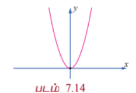
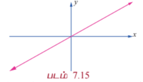
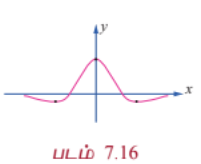
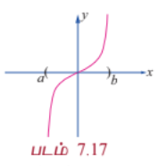
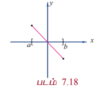

| $(-\infty, \infty)$ என்ற இடைவெளியில் $f(x)$ -க்கு மீப்பெரு மற்றும் மீச்சிறு அறுதி மதிப்புகள் இல்லை | $(-\infty, \infty)$ என்ற இடைவெளியில் $f(x)$ -க்கு மீப்பெரு பெருமம் மற்றும் மீச்சிறு சிறும மதிப்புகள் உள்ளது | $[a, b]$ என்ற இடைவெளியில் $f(x)$ -க்கு மீப்பெரு அல்லது மீச்சிறு அறுதி மதிப்புகள் இல்லை |

| படம் 7.17 | படம் 7.18 |
|---|---|
| $[a, b]$ என்ற இடைவெளியில் $f(x)$ -க்கு மீப்பெரு பெருமம் அல்லது மீச்சிறு சிறும மதிப்புகள் உள்ளது | $(-\infty, \infty)$ என்ற இடைவெளியில் $f(x)$ -க்கு மீச்சிறு சிறுமம் உள்ளது. ஆனால் மீப்பெரு பெருமம் இல்லை |

---

கீழ்க்காணும் தேற்றமானது ஒரு தொடர்ச்சியான சார்பிற்கு எல்லா மூடிய இடைவெளிகளிலும் மீப்பெரு பெருமம் மற்றும் மீச்சிறு சிறும மதிப்புகள் இருக்கும் என்பதை கூறுகிறது.

#### தேற்றம் 7.8 (அறுதி மதிப்பு தேற்றம்)

$f$ என்ற சார்பானது மூடிய இடைவெளி $[a, b]$-ல் தொடர்ச்சியாக இருந்தால், $f$ ஆனது $[a, b]$-ல் ஒரு மீப்பெரு பெரும மதிப்பையும் மற்றும் ஒரு மீச்சிறு சிறும மதிப்பையும் பெறும்.

$f$ -ன் மீப்பெரு அல்லது மீச்சிறு அறுதி மதிப்புகள் மூடிய இடைவெளி $[a, b]$ -ன் முனைப்புள்ளிகளிலோ அல்லது $[a, b]$ என்ற இடைவெளியின் உட்புறத்திலோ அமையும். மீப்பெரு அல்லது மீச்சிறு அறுதி மதிப்புகள் உட்புறத்தில் அமைந்தால் அது நிலைப்புள்ளிகளில் தான் அமையும். ஆகவே, கீழ்க்கண்ட முறையை பயன்படுத்தி மீப்பெரு பெருமம் மற்றும் மீச்சிறு சிறும மதிப்புகளை மூடிய இடைவெளி $[a, b]$ -ல் காணலாம்.

#### மூடிய இடைவெளி $[a, b]$ -ல் தொடர்ச்சியான, சார்பு $f$ -க்கு மீப்பெரு மற்றும் மீச்சிறு அறுதி மதிப்புகளை காணும் முறை

**படி 1 :** $f'$ -க்கு $(a, b)$ -ல் நிலை எண்களைக் காண்க.

**படி 2 :** $f$ -ன் மதிப்புகளை அனைத்து நிலை எண்கள் மற்றும் முனைப்புள்ளிகள் $a$ மற்றும் $b$ -ல் காண்க.

**படி 3 :** படி 2-ல் காணப்பட்ட மதிப்புகளில் மிகப்பெரிய எண் மீப்பெரு பெருமம் மற்றும் மிகச்சிறிய எண் மீச்சிறு சிறுமம் ஆகும்.

---

### எடுத்துக்காட்டு 7.48

$f(x) = 2x^3 - 3x^2 - 12x$ என்ற சார்பிற்கு $[-3, 2]$ என்ற இடைவெளியில் மீப்பெரு பெரும மற்றும் மீச்சிறு சிறும மதிப்புகளைக் காண்க.

#### தீர்வு

கொடுக்கப்பட்ட சார்பை வகைப்படுத்த,

$$f'(x) = 6x^2 - 6x - 12$$

$$= 6(x^2 - x - 2)$$

$$f'(x) = 6(x - 2)(x + 1)$$

ஆகவே, $f'(x) = 0 \Rightarrow x = 2, -1$.

எனவே, $x = -1, 2$ ஆகியவை நிலைப்புள்ளிகள். $f$ -ன் மதிப்புகளை முனைப்புள்ளிகள் $x = -3, 2$ மற்றும் நிலை எண்கள் $x = -1, 2$ -ல் காண, நாம்

$$f(-3) = -9, \quad f(-1) = 7, \quad f(2) = -20$$

எனப் பெறுகிறோம்.

இம்மதிப்புகளில் இருந்து, $x = -1$ -ல் மீப்பெரு பெருமம் $7$ மற்றும் $x = 2$ -ல் மீச்சிறு சிறுமம் $-20$ ஆகும்.

---

### எடுத்துக்காட்டு 7.49

$f(x) = 3\cos x$ என்ற சார்பிற்கு $[0, 2\pi]$ என்ற இடைவெளியில் மீப்பெரு பெரும மற்றும் மீச்சிறு சிறும மதிப்புகளைக் காண்க.

#### தீர்வு

கொடுக்கப்பட்ட சார்பை வகைப்படுத்த,

$$f'(x) = -3\sin x$$

ஆகவே, $f'(x) = 0 \Rightarrow \sin x = 0, x \in [0, 2\pi] \Rightarrow x = 0, \pi, 2\pi$.

$f$ -ன் மதிப்புகளை முனைப்புள்ளிகள் $x = 0, 2\pi$ மற்றும் நிலை எண் $x = \pi$ -ல் காண, நாம்

$$f(0) = 3, \quad f(\pi) = -3, \quad f(2\pi) = 3$$

எனப் பெறுகிறோம்.

இம்மதிப்புகளில் இருந்து, $x = 0, 2\pi$ ஆகிய இடங்களில் மீப்பெரு பெருமம் $3$ மற்றும் $x = \pi$ -ல் மீச்சிறு சிறுமம் $-3$ ஆகும்.

---

#### 7.6.3 ஒரு இடைவெளியில் இடம்சார்ந்த அறுதிகள் (Relative Extrema on an Interval)

$f(x)$ என்ற சார்பில், $x_0$ -ஐ கொண்டிருக்கும் ஒரு சிறிய திறந்த இடைவெளியில் $f(x_0)$ தான் மிகப்பெரிய மதிப்பு எனில் $x_0$ -ல் $f(x)$ என்ற சார்பு **இடம் சார்ந்த பெருமத்தை** அடையும். இதுபோலவே $x_0$ -ஐ கொண்டிருக்கும் ஒரு சிறிய திறந்த இடைவெளியில் $f(x_0)$ தான் மிகச்சிறிய மதிப்பு எனில் $x_0$ -ல் $f(x)$ என்ற சார்பு **இடம் சார்ந்த சிறுமத்தை** அடையும்.

முழு சார்பகத்தில் ஒரு இடம் சார்ந்த பெருமம் மீப்பெரு பெருமமாக இருக்க வேண்டியதல்ல, இதுபோலவே ஒரு இடம்சார்ந்த சிறுமம் மீச்சிறு சிறுமமாக இருக்க வேண்டியதல்ல. ஆகவே, ஒரு சார்பிற்கு அதன் முழு சார்பகத்தில் ஒன்றிற்கு மேலான இடம் சார்ந்த பெருமங்களோ அல்லது இடம் சார்ந்த சிறுமங்களோ இருக்கலாம்.

ஒரு சார்பிற்கு இடம் சார்ந்த அறுதி மதிப்புகள் (பெருமம் அல்லது சிறுமம்) என்பது $f(x), x \in I \subseteq D$ -ன் மதிப்புகளில் அறுதி மதிப்புகள் ஆகும். இங்கு $I$ என்பது திறந்த இடைவெளியாகவோ அல்லது மூடிய இடைவெளியாகவோ இருக்கலாம். இடம் சார்ந்த அறுதி மதிப்புகள் அதன் நிலைப் புள்ளிகளில் அமையும். மேலும் ஒரு சார்பிற்கு ஒரு நிலைப்புள்ளி $x = c$ -ல் இடம் சார்ந்த அறுதி மதிப்புகள் அமையாமலும் இருக்கலாம். உதாரணமாக $y = x^3$ மற்றும் $y = x^{\frac{1}{3}}$ ஆகிய சார்புகளுக்கு ஆதி ஒரு நிலைப்புள்ளி, ஆனால் ஆதியில் இடம்சார்ந்த அறுதி மதிப்புகள் அமைவது இல்லை.

#### தேற்றம் 7.9 (ஃபெர்மார்ட்)

$f(x)$ -க்கு $x = c$ -ல் இடம் சார்ந்த அறுதி உள்ளது எனில் $c$ ஒரு நிலை எண் ஆகும். இந்த நிலை எண்ணினை $f'(x) = 0$ என்ற சமன்பாட்டைத் தீர்ப்பதன்மூலமாகவும், $f'(x)$ காணத்தக்கதாக உள்ள $x$-ன் மதிப்புகளை காண்பதன் மூலமாகவும் பெறலாம்.

---

#### 7.6.4 முதல் வகைக்கெழு சோதனையை பயன்படுத்தி அறுதிகள் (Extrema using First Derivative Test)

ஒரு சார்பிற்கு ஏறும் அல்லது இறங்கும் இடைவெளிகளை கணக்கிட்ட பின் அச்சார்பின் இடம் சார்ந்த அறுதி மதிப்புகளை அறிவது அவ்வளவு கடினமானதல்ல. $y = f(x)$ -ன் வரைபடத்தினைக் கொண்டு அதன் இடஞ்சார்ந்த அகட்டு மதிப்புகளை அறியலாம். எனினும் மிகச்சரியாக எவ்விடத்தில் எப்புள்ளியில் சார்பிற்கு இடஞ்சார்ந்த அறுதிகள் அமைகிறது என்பதை அறிய சில சோதனை செய்யப்படுகிறது. இத்தகைய சோதனைகளில் ஒன்று **முதலாம் வகைக்கெழு சோதனை** ஆகும். இது பின்வரும் தேற்றத்தில் கூறப்பட்டுள்ளது.

#### தேற்றம் 7.10 (முதல் வகைக்கெழு சோதனை)

$f(x)$ என்ற தொடர்ச்சியான சார்பிற்கு $c$ -ஐ உள்ளடக்கிய திறந்த இடைவெளி $I$ -யில் $(c, f(c))$ என்பது நிலைப்புள்ளி என்க. $f(x)$ ஆனது $c$ -ஐத் தவிர்த்த இடைவெளியில் வகையிடத்தக்கது எனில் $f(c)$ -ஐ கீழ்க்காணுமாறு வகைப்படுத்தலாம்: ($x$ ஆனது $I$ என்ற இடைவெளியில் இடமிருந்து வலமாக நகரும்போது)

(i) $f'(x)$ ஆனது $c$ -ல் குறையிலிருந்து மிகைக்கு மாறினால், $f(x)$ -க்கு $f(c)$ என்பது **இடம் சார்ந்த சிறுமம்** ஆகும்.

(ii) $f'(x)$ ஆனது $c$ -ன் மிகையிலிருந்து குறைக்கு மாறினால், $f(x)$ -க்கு $f(c)$ என்பது **இடம் சார்ந்த பெருமம்** ஆகும்.

(iii) $f'(x)$ -ன் குறியானது $c$ -ன் இருபுறமும் மிகையாகவோ அல்லது $c$ -ன் இருபுறமும் குறையாகவோ இருந்தால், $f(c)$ என்பது இடம் சார்ந்த சிறுமமும் இல்லை இடம் சார்ந்த பெருமமும் இல்லை எனலாம்.

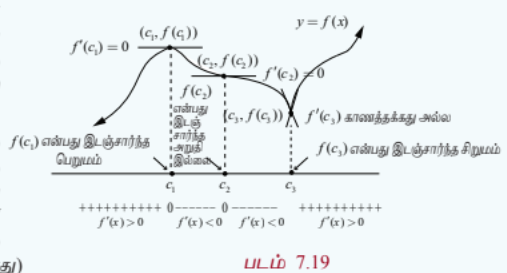

---

### எடுத்துக்காட்டு 7.50

$f(x) = x^2 - 4x + 4$ என்ற சார்பிற்கு ஓரியல்பு இடைவெளிகளைக் கணக்கிட்டு அதிலிருந்து இடம் சார்ந்த அறுதி மதிப்புகளைக் காண்க.

#### தீர்வு

$$f(x) = (x - 2)^2$$

$$f'(x) = 2(x - 2) = 0 \Rightarrow x = 2$$

ஓரியல்பு இடைவெளிகள் $(-\infty, 2)$ மற்றும் $(2, \infty)$ ஆகும். $f'(x) < 0, \forall x \in (-\infty, 2)$ என்பதால் $(-\infty, 2)$ -ல் $f(x)$ திட்டமாக இறங்கும். இதுபோலவே $f'(x) > 0, \forall x \in (2, \infty)$ என்பதால் $(2, \infty)$ -ல் $f(x)$ திட்டமாக ஏறும். $f'(x)$ -ன் குறி $x = 2$ -ஐ கடக்கும்போது (இடமிருந்து வலமாக) குறையிலிருந்து மிகையாக மாறுவதால், $x = 2$ -ல் $f(x)$ -க்கு இடம் சார்ந்த சிறுமம் உள்ளது. இந்த இடம் சார்ந்த சிறும மதிப்பு $f(2) = 0$ ஆகும்.

---

### எடுத்துக்காட்டு 7.51

$f(x) = x^{\frac{2}{3}}$ என்ற சார்பிற்கு ஓரியல்பு இடைவெளிகளைக் கணக்கிட்டு அதிலிருந்து இடம் சார்ந்த அறுதி மதிப்புகளைக் காண்க.

#### தீர்வு

$$f(x) = x^{\frac{2}{3}}, \quad f'(x) = \frac{2}{3}x^{-\frac{1}{3}} = \frac{2}{3\sqrt[3]{x}}$$

$f'(x) \neq 0, \forall x \in \mathbb{R}$ மற்றும் $f'$ ஆனது $x = 0$ -வில் காணத்தக்கது அல்ல. எனவே, இச்சார்பிற்கு தேக்கநிலைப் புள்ளிகள் இல்லை. ஆனால் $x = 0$ -வில் நிலைப்புள்ளி உள்ளது.

| இடைவெளி | $(-\infty, 0)$ | $(0, \infty)$ |
|---|---|---|
| $f'(x)$-ன் குறி | $-$ | $+$ |
| ஓரியல்புத் தன்மை | திட்டமாக இறங்கும் | திட்டமாக ஏறும் |

அட்டவணை 7.5

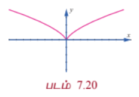

$f'(x)$ -ன் குறி $x = 0$ -ஐ கடக்கும் போது குறையிலிருந்து மிகையாக மாறுவதால், $x = 0$ -ல் $f$ -க்கு இடம் சார்ந்த சிறுமம் உள்ளது. இந்த இடம் சார்ந்த சிறும மதிப்பு $f(0) = 0$ ஆகும். இந்த இடம் சார்ந்த சிறுமம் நிலைப்புள்ளியில் அமைகிறது. ஆனால் இது தேக்கநிலைப் புள்ளி அல்ல என்பது கவனிக்கத்தக்கது.

---

### எடுத்துக்காட்டு 7.52

$f(x) = x + \sin x$ என்ற சார்பு மெய் எண் கோட்டில் ஏறும் என நிறுவுக. மேலும் அதன் இடஞ்சார்ந்த அறுதி மதிப்புகளை ஆராய்க.

#### தீர்வு

$$f'(x) = 1 + \cos x \ge 0$$

மேலும் $x = (2n + 1)\pi, n \in \mathbb{Z}$ -ல் $f'(x)$ பூச்சியம் என்பவைகளில் இருந்து $f(x)$ என்ற சார்பு மெய் எண் கோட்டில் ஏறுகிறது.

$x = (2n + 1)\pi, n \in \mathbb{Z}$ -ஐ கடக்கும்போது $f'(x)$ -ன் குறியில் மாற்றம் இல்லாத காரணத்தால் முதலாம் வகைக்கெழு சோதனையின்படி இங்கு இடஞ்சார்ந்த அறுதி மதிப்புகள் இல்லை.

---

### எடுத்துக்காட்டு 7.53

$f(x) = \log(1 + x) - \frac{x}{1 + x}$, $x > -1$ என்ற சார்பின் ஓரியல்புத் தன்மை மற்றும் இடஞ்சார்ந்த அறுதி மதிப்புகளை காண்க.

#### தீர்வு

$$f(x) = \log(1 + x) - \frac{x}{1 + x}$$

எனவே,

$$f'(x) = \frac{1}{1 + x} - \frac{1}{(1 + x)^2} = \frac{x}{(1 + x)^2}$$

ஆகவே,

$$f'(x) \begin{cases} < 0, & -1 < x < 0 \\ = 0, & x = 0 \\ > 0, & x > 0 \end{cases}$$

எனவே $x > 0$ எனில் $f(x)$ ஆனது திட்டமாக ஏறும், $-1 < x < 0$ எனில் $f(x)$ ஆனது திட்டமாக இறங்கும். $f'(x)$ -ன் குறி $x = 0$ -வை கடக்கும்போது குறையிலிருந்து மிகையாக மாறுவதால், முதலாம் வகைக்கெழு சோதனையின்படி $x = 0$ -ல் இடஞ்சார்ந்த சிறும மதிப்பு $f(0) = 0$ ஆகும்.

---

### எடுத்துக்காட்டு 7.54

$f(x) = x\log x - 3x$ என்ற சார்பிற்கு ஓரியல்பு இடைவெளிகள் மற்றும் அதிலிருந்து இடஞ்சார்ந்த அறுதி மதிப்புகளைக் காண்க.

#### தீர்வு

கொடுக்கப்பட்ட சார்பு $x \in (0, \infty)$ -ல் வரையறுக்கப்பட்டு வகையிடத்தக்கதாக உள்ளது.

$$f(x) = x\log x - 3x$$

எனவே,

$$f'(x) = \log x + 1 - 3 = \log x - 2$$

தேக்கநிலை எண்களைக் காண $\log x - 2 = 0$ -ஐ தீர்க்க நமக்குக் கிடைப்பது $x = e^2$ ஆகும்.

ஆகவே, சார்பு $f(x)$ -ன் ஓரியல்பு இடைவெளிகள் $(0, e^2)$ மற்றும் $(e^2, \infty)$ ஆகும்.

$x = e \in (0, e^2)$ -ல் $f'(e) = \log e - 2 = -1 < 0$ மேலும் இதிலிருந்து $(0, e^2)$ -ல் $f(x)$ திட்டமாக இறங்கும்.

$x = e^3 \in (e^2, \infty)$ -ல் $f'(e^3) = \log e^3 - 2 = 1 > 0$ மேலும் இதிலிருந்து $(e^2, \infty)$ -ல் $f(x)$ திட்டமாக ஏறும்.

$f'(x)$ -ன் குறி $x = e^2$ -ஐ கடக்கும்போது குறையிலிருந்து மிகைக்கு மாறுவதால், முதலாம் வகைக்கெழு சோதனையின்படி $x = e^2$ -ல் இடஞ்சார்ந்த சிறும மதிப்பு $f(e^2) = e^2\log e^2 - 3e^2 = -e^2$ ஆகும்.

---

### எடுத்துக்காட்டு 7.55

$f(x) = \frac{1}{1 + x^2}$ என்ற சார்பிற்கு ஓரியல்பு இடைவெளிகளைக் கணக்கிட்டு இதிலிருந்து இடஞ்சார்ந்த அறுதி மதிப்புகளைக் காண்க.

#### தீர்வு

கொடுக்கப்பட்ட சார்பு $x \in (-\infty, \infty)$ -ல் வரையறுக்கப்பட்டு வகையிடத்தக்கதாக உள்ளது.

$$f(x) = \frac{1}{1 + x^2}$$

இதிலிருந்து

$$f'(x) = -\frac{2x}{(1 + x^2)^2}$$

எனப்பெறலாம்.

தேக்க நிலை எண்களைக் காண $-\frac{2x}{(1 + x^2)^2} = 0$ -ஐ தீர்க்க நமக்குக் கிடைப்பது $x = 0$ ஆகும்.

ஆகவே சார்பு $f(x)$ -ன் ஓரியல்பு இடைவெளிகள் $(-\infty, 0)$ மற்றும் $(0, \infty)$ ஆகும்.

$f'(x) < 0, \forall x \in (0, \infty)$ என்பதால் $f(x)$ ஆனது $(0, \infty)$ இடைவெளியில் திட்டமாக இறங்கும். மேலும் $f'(x) > 0, \forall x \in (-\infty, 0)$ என்பதால் $f(x)$ ஆனது $(-\infty, 0)$ இடைவெளியில் திட்டமாக ஏறும். $f'(x)$ -ன் குறி $x = 0$ -ஐ கடக்கும்போது மிகையிலிருந்து குறைக்கு மாறுவதால், முதலாம் வகைக்கெழு சோதனையின்படி, $x = 0$ -வில் இடஞ்சார்ந்த பெரும மதிப்பு $f(0) = 1$ ஆகும்.

---

### எடுத்துக்காட்டு 7.56

$f(x) = \frac{x}{1 + x^2}$ என்ற சார்பிற்கு ஓரியல்பு இடைவெளிகளைக் கணக்கிட்டு இதிலிருந்து இடஞ்சார்ந்த அறுதி மதிப்புகளைக் காண்க.

#### தீர்வு

கொடுக்கப்பட்ட சார்பு $x \in (-\infty, \infty)$ -ல் வரையறுக்கப்பட்டு வகையிடத்தக்கதாக உள்ளது.

$$f(x) = \frac{x}{1 + x^2}$$

$$f'(x) = \frac{1 - x^2}{(1 + x^2)^2}$$

தேக்க நிலை எண்களைக் காண $1 - x^2 = 0$ -ஐ தீர்க்க $x = \pm 1$ என நமக்கு கிடைக்கிறது.

ஆகவே ஓரியல்பு இடைவெளிகள் $(-\infty, -1), (-1, 1)$ மற்றும் $(1, \infty)$ ஆகும்.

| இடைவெளி | $(-\infty, -1)$ | $(-1, 1)$ | $(1, \infty)$ |
|---|---|---|---|
| $f'(x)$-ன் குறி | $-$ | $+$ | $-$ |
| ஓரியல்புத் தன்மை | திட்டமாக இறங்கும் | திட்டமாக ஏறும் | திட்டமாக இறங்கும் |

அட்டவணை 7.6

எனவே, $(-\infty, -1)$ மற்றும் $(1, \infty)$ இடைவெளிகளில் $f(x)$ திட்டமாக இறங்கும், $(-1, 1)$ என்ற இடைவெளியில் $f(x)$ திட்டமாக ஏறும்.

$f'(x)$ -ன் குறி $x = -1$ -ஐ கடக்கும்போது குறையிலிருந்து மிகைக்கு மாறுவதால், முதலாம் வகைக்கெழு சோதனையின்படி $x = -1$ -ல் இடஞ்சார்ந்த சிறுமத்தை அடையும். இந்த இடஞ்சார்ந்த சிறும மதிப்பு $f(-1) = -\frac{1}{2}$ ஆகும். இதுபோலவே, $f'(x)$ -ன் குறி $x = 1$ -ஐ கடக்கும்போது மிகையிலிருந்து குறைக்கு மாறுவதால், முதலாம் வகைக்கெழு சோதனையின்படி $x = 1$ -ல் இடஞ்சார்ந்த பெரும மதிப்பு $f(1) = \frac{1}{2}$ ஆகும்.

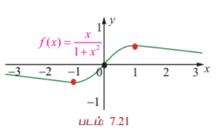

---

### பயிற்சி 7.6

1. கீழ்க்காணும் சார்புகளுக்கு கொடுக்கப்பட்ட இடைவெளிகளில் மீப்பெரு மற்றும் மீச்சிறு அறுதி மதிப்புகளை காண்க.

   (i) $f(x) = -x^2 + 12x - 10$; $[1, 7]$

   (ii) $f(x) = 3x^4 - 4x^3$; $[-1, 2]$

   (iii) $f(x) = 6x^{\frac{4}{3}} - x^{\frac{1}{3}}$; $[-1, 1]$

   (iv) $f(x) = 2\cos x + \sin 2x$; $\left[0, \frac{\pi}{2}\right]$

2. கீழ்க்காணும் சார்புகளுக்கு ஓரியல்பு இடைவெளிகளைக் கணக்கிட்டு அதிலிருந்து இடஞ்சார்ந்த அறுதி மதிப்புகளைக் காண்க:

   (i) $f(x) = 2x^3 - 3x^2 - 12x$

   (ii) $f(x) = x - \frac{5}{x}$

   (iii) $f(x) = \frac{e^x}{1 + e^x}$

   (iv) $f(x) = x^3\log x$

   (v) $f(x) = \sin x + \cos x$, $0 < x < 2\pi$

### 7.7 இரண்டாம் வகைக்கெழுவின் பயன்பாடுகள் (Applications of Second Derivative)

இரண்டாம் வகைக் கெழுவானது ஒரு சார்பின் குழிவு, குவிவு, வளைவு மாற்றப் புள்ளி மற்றும் இடம் சார்ந்த அறுதி மதிப்புகளை தீர்மானிக்க பயன்படுகின்றது.

---

#### 7.7.1 குழிவு, குவிவு மற்றும் வளைவு மாற்றப் புள்ளி (Concavity, Convexity, and Points of Inflection)

ஒரு வளைவரைக்கு ஒரு புள்ளியில் வரையப்படும் தொடுகோடு வளைவரைக்கு மேற்புறமாக அமைந்தால் அப்புள்ளியில் வளைவரை **கீழ்நோக்கி குழிவு** (மேல்நோக்கி குவிவு) என்கிறோம். வளைவரைக்கு ஒரு புள்ளியில் வரையப்படும் தொடுகோடு வளைவரைக்கு கீழ்புறமாக அமைந்தால் அப்புள்ளியில் வளைவரை **மேல்நோக்கி குழிவு** (கீழ்நோக்கி குவிவு) என்கிறோம். இதனை அருகில் உள்ள வரைபடத்தின் வாயிலாக எளிதில் அறியலாம்.

#### வரையறை 7.8

$f(x)$ என்ற சார்பிற்கு $I = (a, b)$ என்ற திறந்த இடைவெளியில் இரண்டாம் வகைக்கெழு காணத்தக்கது என்க. அப்பொழுது $f(x)$ ஆனது கீழ்க்கண்டவாறு வகைப்படுத்தப்படுகிறது.

(i) $f'(x)$ ஆனது திறந்த இடைவெளி $I$-ல் திட்டமாக ஏறும் எனில், $f(x)$ ஆனது $I$ -ல் **மேல்நோக்கி குழிவு** ஆகும்.

(ii) $f'(x)$ ஆனது திறந்த இடைவெளி $I$ -ல் திட்டமாக இறங்கும் எனில், $f(x)$ ஆனது $I$-ல் **கீழ்நோக்கி குழிவு** ஆகும்.

பகுப்பாய்வின்படி, $y = f(x)$ என்ற வகையிடத்தக்க வளைவரையின் குழிவுத் தன்மை கீழ்க்காணும் முடிவில் விளக்கப்பட்டுள்ளது.

#### தேற்றம் 7.11 (குழிவுத் தன்மை சோதனை)

(i) திறந்த இடைவெளி $I$ -ல் $f''(x) > 0$ எனில், $I$ -ல் $f(x)$ **மேல்நோக்கி குழிவு** ஆகும்.

(ii) திறந்த இடைவெளி $I$ -ல் $f''(x) < 0$ எனில், $I$ -ல் $f(x)$ **கீழ்நோக்கி குழிவு** ஆகும்.

#### குறிப்புரை

(1) $[a, b]$-ல் மேல்நோக்கி குவிவு வளைவரையின் எந்த ஒரு இடஞ்சார்ந்த பெருமமும் மீப்பெரு பெருமம் ஆகும்.

(2) $[a, b]$-ல் கீழ்நோக்கி குவிவு வளைவரையின் எந்த ஒரு இடஞ்சார்ந்த சிறுமமும் மீச்சிறு சிறுமம் ஆகும்.

(3) எந்த ஒரு வளைவரைக்கும் ஒரே ஒரு மீப்பெரு பெருமம் (மற்றும் ஒரே ஒரு மீச்சிறு சிறுமம்) மட்டுமே உண்டு. ஆனால் ஒன்றிற்கு மேற்பட்ட இடஞ்சார்ந்த பெருமம் அல்லது இடஞ்சார்ந்த சிறுமம் இருக்கலாம்.

---

### வளைவு மாற்றப்புள்ளி

#### வரையறை 7.9

ஒரு சார்பின் வளைவரையானது எப்புள்ளிகளில் “மேல்நோக்கி குழிவில் இருந்து கீழ்நோக்கி குழிவாகவோ” அல்லது “கீழ்நோக்கி குழிவில் இருந்து மேல்நோக்கி குழிவாகவோ” மாறுகிறதோ அப்புள்ளிகளை $f(x)$ -ன் **வளைவு மாற்றப் புள்ளிகள்** என அழைக்கிறோம்.

#### தேற்றம் 7.12 (வளைவு மாற்றப்புள்ளி சோதனை)

(i) $f''(c)$ காணத்தக்கது மற்றும் $f''(c)$ -ன் குறி ஆனது $x = c$ -ஐ கடக்கும்போது மாறுகிறது, எனில் $(c, f(c))$ ஆனது $f$ -ன் **வளைவு மாற்றப் புள்ளி** ஆகும்.

(ii) வளைவு மாற்றப்புள்ளி $c$-யில் $f''(c)$ காணத்தக்கது எனில், $f''(c) = 0$ ஆகும்.

#### குறிப்புரை

$y = f(x)$ என்ற வளைவரையின் வளைவு மாற்றப் புள்ளிகளை காண்பதற்கு $f''(x)$ ஆனது எப்புள்ளிகளில் அதன் குறியை மாற்றுகிறது என்பதை அறிவது அவசியமானதாகும். 'வழவழப்பான' வளைவரைகளில் (கூர்முனைகள் அற்ற) கீழ்க்காணும் ஏதேனும் ஒன்று நடக்க வாய்ப்பு உள்ளது :

(i) $f''(x) = 0$ அல்லது

(ii) $f''(x)$ அப்புள்ளியில் காணத்தக்கது அல்ல.

#### குறிப்புரை

(1) $f''(c)$ காணத்தக்கதாக இல்லாத நிலையிலும், $(c, f(c))$ வளைவு மாற்றப் புள்ளியாக இருக்க வாய்ப்புள்ளது. உதாரணமாக, $f(x) = x^{\frac{1}{3}}$ எனும் வளைவரையில் $c = 0$.

(2) $f''(c) = 0$ எனும் நிலையில் $(c, f(c))$ ஒரு வளைவு மாற்றப் புள்ளியாக இல்லாமலும் இருக்க வாய்ப்புள்ளது. உதாரணமாக, $f(x) = x^4$ எனும் வளைவரையில் $c = 0$.

(3) ஒரு வளைவு மாற்றப் புள்ளி தேக்க நிலைப் புள்ளியாக இருக்க வேண்டிய அவசியம் இல்லை. உதாரணமாக $f(x) = \sin x$ எனில், $f'(x) = \cos x$ மற்றும் $f''(x) = -\sin x$ மேலும் இதிலிருந்து $(\pi, 0)$ ஆனது ஒரு வளைவு மாற்றப் புள்ளி. ஆனால் அது $f(x)$ -ன் தேக்க நிலைப்புள்ளி அல்ல.

---

### எடுத்துக்காட்டு 7.57

$f(x) = (x - 1)^3(x - 3)$, $x \in \mathbb{R}$ என்ற வளைவரையின் குழிவு இடைவெளிகளைக் காண்க மேலும் ஏதேனும் வளைவு மாற்றப்புள்ளிகள் இருப்பின் அவற்றைக் காண்க.

#### தீர்வு

கொடுக்கப்பட்ட சார்பு 4-ஆம் வரிசை பல்லுறுப்புக் கோவை ஆகும். இப்பொழுது

$$f'(x) = (x - 1)^2(x - 3)(4x - 4) = 4(x - 1)^3(x - 2)$$

$$f''(x) = 4[3(x - 1)^2(x - 2) + (x - 1)^3] = 12(x - 1)^2(x - 2)$$

இப்பொழுது,

$$f''(x) = 0 \Rightarrow x = 1, 2$$

குழிவு இடைவெளிகள் அட்டவணை 7.7-ல் அட்டவணைப்படுத்தப்பட்டுள்ளது.

| இடைவெளி | $(-\infty, 1)$ | $(1, 2)$ | $(2, \infty)$ |
|---|---|---|---|
| $f''(x)$ -ன் குறி | $-$ | $-$ | $+$ |
| குழிவுத் தன்மை | கீழ்நோக்கி குழிவு | கீழ்நோக்கி குழிவு | மேல்நோக்கி குழிவு |

அட்டவணை 7.7

$(-\infty, 1)$ மற்றும் $(1, 2)$ ஆகிய இடைவெளிகளில் வளைவரை கீழ்நோக்கி குழிவு ஆகும். $(2, \infty)$ என்ற இடைவெளியில் வளைவரை மேல்நோக்கி குழிவு ஆகும்.

$f''(x)$ -ன் குறியானது $x = 2$ -ஐ கடக்கும்போது மாறுகிறது. எனவே, $(2, f(2)) = (2, -1)$ ஆனது $y = f(x)$ என்ற வளைவரையின் வளைவு மாற்றப் புள்ளியாகும். $x = 1$ -ல் $f''(x)$ -ன் குறி மாறாததால் $(1, f(1)) = (1, 0)$ வளைவு மாற்றப் புள்ளி அல்ல. குறி மாற்றத்தை அருகில் உள்ள $f''(x)$ -ன் வரைபடத்தின்மூலம் அறியலாம்.

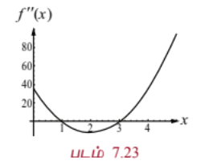

---

### எடுத்துக்காட்டு 7.58

$y = 3\sin x$ என்ற வளைவரையின் குழிவு இடைவெளிகளைக் காண்க.

#### தீர்வு

கொடுக்கப்பட்ட சார்பானது $2\pi$ பிரிவு இடைவெளி உள்ள சார்பு ஆகும். எனவே இந்த ஒவ்வொரு பிரிவு இடைவெளிகளிலும் தேக்க நிலைப் புள்ளிகள் மற்றும் வளைவு மாற்றப் புள்ளிகள் இருக்கும்.

$y = 3\sin x$ என்பதில் இருந்து

$$\frac{dy}{dx} = 3\cos x \quad \text{மற்றும்} \quad \frac{d^2y}{dx^2} = -3\sin x$$

இப்பொழுது, $\frac{d^2y}{dx^2} = 0 \Rightarrow \sin x = 0 \Rightarrow x = n\pi$.

$(-\pi, \pi)$ என்ற இடைவெளியினை $(-\pi, 0)$ மற்றும் $(0, \pi)$ எனும் உள் இடைவெளிகளாக பிரிக்கலாம்.

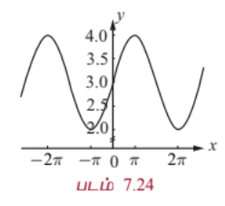

$(-\pi, 0)$ எனும் இடைவெளியில், $\frac{d^2y}{dx^2} > 0$. மேலும் இதிலிருந்து $(-\pi, 0)$ -ல் சார்பு மேல்நோக்கி குழிவு. $(0, \pi)$ எனும் இடைவெளியில் $\frac{d^2y}{dx^2} < 0$, மேலும் இதிலிருந்து $(0, \pi)$ -ல் சார்பு கீழ்நோக்கி குழிவு. ஆகவே, $(0, 0)$ என்பது வளைவு மாற்றப்புள்ளி ஆகும் (படம் 7.24ஐ பார்க்க). $(n\pi, (n+1)\pi)$ என்ற பொதுவான இடைவெளிகளைக் கருதும்போது ($n$ ஒரு முழு எண்), இவ்விடைவெளிகளில் குழிவுத்தன்மையை ஆராய வேண்டும். இதனை மேற்கூறியவாறே ஆராய நாம் $(n\pi, 0)$ ஆகியவை வளைவு மாற்றப்புள்ளிகள் என அறியலாம்.

---

#### 7.7.2 இரண்டாம் வகைக்கெழு சோதனையை பயன்படுத்தி அறுதி மதிப்புகள் (Extrema using Second Derivative Test)

இரண்டாம் வகைக்கெழு சோதனை: இரண்டாம் வகைக்கெழு சோதனையானது நிலைப்புள்ளிகள், அறுதி மதிப்புகள் மற்றும் குழிவுத்தன்மை போன்ற கருத்துகளை தொடர்புபடுத்துவது ஆகும். மேலும் இது நிலைப்புள்ளிகளில் சார்பின் இடஞ்சார்ந்த பெரும அல்லது சிறும மதிப்புகளை ஆராய சிறந்த கருவியாக பயன்படுகிறது.

#### தேற்றம் 7.13 (இரண்டாம் வகைக்கெழு சோதனை)

$c$ எனும் நிலைப்புள்ளியில் $f'(c) = 0$ எனவும், $c$ -ன் அண்மையில் $f'(x)$ காணத்தக்கது எனவும், மேலும் $f''(c)$ காணத்தக்கது எனவும் கொண்டால், $f''(c) < 0$ எனில் $c$ -யில் $f$ ஆனது **இடஞ்சார்ந்த பெருமத்தை** அடையும், $f''(c) > 0$ எனில் $c$ -யில் $f$ ஆனது **இடஞ்சார்ந்த சிறுமத்தை** அடையும். $f''(c) = 0$ எனில், இந்த சோதனையில் இடஞ்சார்ந்த அறுதி மதிப்புகளைப் பற்றிய தகவல் இல்லை என்கிறோம்.

---

### எடுத்துக்காட்டு 7.59

$f(x) = x^4 + 32x$ என்ற சார்பின் இடஞ்சார்ந்த அறுதி மதிப்புகளைக் காண்க.

#### தீர்வு

$$f'(x) = 4x^3 + 32 = 0 \Rightarrow x^3 = -8 \Rightarrow x = -2$$

மேலும்

$$f''(x) = 12x^2$$

$$f''(-2) = 48 > 0$$

என்பதால் $x = -2$ -ல் சார்பு இடஞ்சார்ந்த சிறும மதிப்பை அடையும். இந்த இடஞ்சார்ந்த சிறும மதிப்பு $f(-2) = 16 - 64 = -48$ ஆகும். எனவே, அறுதிப் புள்ளி $(-2, -48)$.

---

### எடுத்துக்காட்டு 7.60

$f(x) = 6x^4 - 4x^6$ என்ற சார்பின் இடஞ்சார்ந்த அறுதி மதிப்புகளைக் காண்க.

#### தீர்வு

$x$-ஐப் பொருத்து வகையிட,

$$f'(x) = 24x^3 - 24x^5 = 24x^3(1 - x^2) = 24x^3(1 - x)(1 + x)$$

$$f'(x) = 0 \Rightarrow x = -1, 0, 1$$

ஆகவே நிலை எண்கள் $x = -1, 0, 1$ ஆகும்.

இப்பொழுது,

$$f''(x) = 72x^2 - 120x^4 = 24x^2(3 - 5x^2)$$

$$\Rightarrow f''(-1) = 24(1)(3 - 5) = -48, \quad f''(0) = 0, \quad f''(1) = -48$$

$f''(-1)$ மற்றும் $f''(1)$ ஆகியவை குறை. ஆகவே இரண்டாம் வகைக்கெழு சோதனையின்படி, $x = -1, 1$ -ல் இடஞ்சார்ந்த பெரும மதிப்புகள் இருக்கும். ஆனால், $x = 0$ எனில், $f''(0) = 0$. $x = 0$ -ல் இரண்டாம் வகைக்கெழுச் சோதனையானது இடஞ்சார்ந்த அறுதி மதிப்புகளைப் பற்றி எந்த தகவலையும் தருவதில்லை. எனவே, நாம் முதலாம் வகைக்கெழு சோதனையை பயன்படுத்த வேண்டும். ஓரியல்புத் தன்மை இடைவெளிகள் அட்டவணை 7.8-ல் அட்டவணைப்படுத்தப்பட்டுள்ளது.

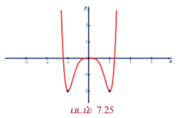

| இடைவெளி | $(-\infty, -1)$ | $(-1, 0)$ | $(0, 1)$ | $(1, \infty)$ |
|---|---|---|---|---|
| $f'(x)$ -ன் குறி | $+$ | $-$ | $+$ | $-$ |
| ஓரியல்புத் தன்மை | திட்டமாக ஏறும் | திட்டமாக இறங்கும் | திட்டமாக ஏறும் | திட்டமாக இறங்கும் |

அட்டவணை 7.8

முதலாம் வகைக்கெழு சோதனையின்படி, $x = -1$ -ல் $f(x)$ ஆனது இடஞ்சார்ந்த பெருமத்தை அடையும், அந்த இடஞ்சார்ந்த பெருமம் $2$ ஆகும். $x = 0$ -ல் $f(x)$ ஆனது இடஞ்சார்ந்த சிறுமத்தை அடையும். அந்த இடஞ்சார்ந்த சிறுமம் $0$ ஆகும். $x = 1$ -ல் $f(x)$ ஆனது இடஞ்சார்ந்த பெரும மதிப்பினை அடையும். அந்த இடஞ்சார்ந்த பெருமம் $2$ ஆகும்.

#### குறிப்புரை

இரண்டாம் வகைக்கெழு மறையும் போது, நாம் இடஞ்சார்ந்த அறுதி மதிப்புகளைப் பற்றிய தகவலைப் பெற முடியாது. ஆகவே நாம் இச்சூழல்களில் முதலாம் வகைக்கெழு சோதனையை பயன்படுத்தலாம்!

---

### எடுத்துக்காட்டு 7.61

$x^2y^2$ -ன் இடஞ்சார்ந்த பெரும மற்றும் சிறும மதிப்புகளை $x + y = 10$ என்ற கோட்டின் மீது காண்க.

#### தீர்வு

கொடுக்கப்பட்ட சார்பை நாம் $f(x) = x^2(10 - x)^2$ என எழுதலாம்.

இப்பொழுது,

$$f(x) = x^2(100 - 20x + x^2) = 100x^2 - 20x^3 + x^4$$

எனவே,

$$f'(x) = 200x - 60x^2 + 4x^3 = 4x(x^2 - 15x + 50) = 4x(x - 5)(x - 10)$$

$$f'(x) = 0 \Rightarrow x = 0, 5, 10$$

மேலும்,

$$f''(x) = 200 - 120x + 12x^2$$

$f(x)$ -ன் தேக்க நிலை எண்கள் $x = 0, 5, 10$ ஆகும். இவ்வெண்களில் $f''(x)$ -ன் மதிப்புகள் முறையே $200, -100$ மற்றும் $200$ ஆகும். $x = 0$ -ல், இடஞ்சார்ந்த சிறும மதிப்பு $f(0) = 0$ ஆகும். $x = 5$-ல், இடஞ்சார்ந்த பெரும மதிப்பு $f(5) = 625$ ஆகும். $x = 10$ -ல், இடஞ்சார்ந்த சிறும மதிப்பு $f(10) = 0$ ஆகும்.

| படம் 7.25 |
|---|

---

### பயிற்சி 7.7

1. கீழ்க்காணும் சார்புகளுக்கு குழிவு இடைவெளிகள் மற்றும் வளைவு மாற்றப் புள்ளிகளைக் காண்க:

   (i) $f(x) = x(x - 4)^3$

   (ii) $f(x) = \sin x + \cos x$, $0 < x < 2\pi$

   (iii) $f(x) = (e^x - e^{-x})^2$

2. இரண்டாம் வகைக்கெழு சோதனையை பயன்படுத்தி இடஞ்சார்ந்த அறுதி மதிப்புகளைக் காண்க.

   (i) $f(x) = 3x^5 - 5x^3$

   (ii) $f(x) = x\log x$

   (iii) $f(x) = x^2e^{-2x}$

3. $f(x) = 4x^3 - 6x^2 + x - 1$ என்ற சார்பிற்கு ஓரியல்பு இடைவெளிகள், இடஞ்சார்ந்த அறுதி மதிப்புகள், குழிவு இடைவெளிகள் மற்றும் வளைவு மாற்றப் புள்ளிகளைக் காண்க.

### 7.8 உகமக் கணக்குகளில் பயன்பாடுகள் (Applications in Optimization)

உகமக் கணக்குகள் என்பது அறுதி மதிப்புகளை (பெருமம் அல்லது சிறுமம்) குறிப்பிட்ட கட்டுப்பாடுகளுடன் காண்பது ஆகும்.

#### அறுதி மதிப்பு அல்லது உகமக் கணக்குகளை தீர்க்கும் முறை

**படி 1 :** தேவையான அளவுகளுடன் கூடிய படத்தை வரைக.

**படி 2 :** எந்த அளவையை பெருமமாக்க அல்லது சிறுமமாக்க வேண்டுமோ அதற்கான சமன்பாட்டினைக் காண்க.

**படி 3 :** கொடுக்கப்பட்ட கட்டுப்பாடுகளுடன் தேவையான அளவை பெருமமாக அல்லது சிறுமமாக்க வேண்டும்.

**படி 4 :** கணக்கில் கொடுக்கப்பட்ட கட்டுப்பாடுகளுக்கு ஏற்றவாறு மாறியின் ஏற்கத்தக்க இடைவெளிகளை காணவேண்டும்.

**படி 5 :** அறுதி மதிப்புகளை காணும் முறையினை கொண்டு (மீப்பெரு அல்லது மீச்சிறு அறுதிகள், முதல் வகைக்கெழு சோதனை அல்லது இரண்டாம் வகைக்கெழு சோதனை) பெருமம் அல்லது சிறுமம் காணவேண்டும்.

---

### எடுத்துக்காட்டு 7.62

நம்மிடம் 12 அலகு பக்க அளவுடைய மெல்லிய சதுர தகடு உள்ளது மற்றும் வெளிப்புறத்தின் மூலைகளிலிருந்து சிறிய சதுரங்களை வெட்டி பக்கங்களை மடிப்பதன் மூலம் திறந்த பெட்டியை உருவாக்க விரும்புகிறோம். கேள்வி என்னவென்றால், எந்த வெட்டு அதிகபட்ச கன அளவை உருவாக்கும்?

#### தீர்வு

$x$ = வெட்டி எடுக்கப்படும் ஒவ்வொரு சிறிய சதுரங்களின் நீளம் என்க.

$V$ = மடிப்பதன் மூலம் பெறப்படும் பெட்டியின் கன அளவு என்க.

நீளத்தின் இரு மூலைகளிலும் $x$ நீளமுள்ள சதுரத்தை வெட்டிய பின் நீளம் $12 - 2x$. மடித்த பின்பு பெட்டியின் ஆழம் $x$. எனவே, கன அளவு $V(x) = x(12 - 2x)^2$ ஆகும். $x = 0$ அல்லது 6 -ல் கன அளவு பூச்சியமாவதைக் கவனிக்க. எனவே, $x = 0$ அல்லது 6 எனில் பெட்டி கிடைக்காது. எனவே, $V(x) = x(12 - 2x)^2$, $0 < x < 6$ -ஐ பெருமப்படுத்த வேண்டும்.

இப்பொழுது,

$$\frac{dV}{dx} = (12 - 2x)^2 + x(2)(12 - 2x)(-2)$$

$$= (12 - 2x)(12 - 2x - 4x) = (12 - 2x)(12 - 6x)$$

$$\frac{dV}{dx} = 0 \Rightarrow x = 6, 2$$

$6 \notin (0, 6)$ என்பதால் $x = 2 \in (0, 6)$ என்பது மட்டுமே தேக்க நிலை எண். மேலும் $\frac{dV}{dx}$ -ன் குறி $x = 2$ -ஐ கடக்கும்போது மிகையிலிருந்து குறைக்கு மாறுகிறது. எனவே $x = 2$ -ல் $V$ ஆனது இடஞ்சார்ந்த பெரும மதிப்பினை அடையும். இந்த இடஞ்சார்ந்த பெரும கன அளவு $V = 128$ அலகுகள்.

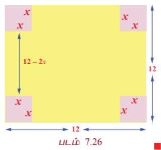

எனவே பெரும கன அளவிற்கு 2 அலகுகள் வெட்ட வேண்டும்.

---

### எடுத்துக்காட்டு 7.63

$(1, 1)$ என்ற புள்ளியில் இருந்து, ஓரலகு வட்டம் $x^2 + y^2 = 1$-ன் மீதுள்ள எப்புள்ளி மிக அருகாமையிலும், எப்புள்ளி மிக அதிக தொலைவிலும் இருக்கும்?

#### தீர்வு

$(1, 1)$ என்ற புள்ளியில் இருந்து எந்த ஒரு புள்ளி $(x, y)$ -க்கு உள்ள தூரம் $d = \sqrt{(x - 1)^2 + (y - 1)^2}$.

$d$ -ல் கணக்கிடுவதற்குப் பதில், நம் வசதிக்காக $D = d^2 = (x - 1)^2 + (y - 1)^2$ -ல் கணக்கிடுவோம். இங்கு கட்டுப்பாடானது $x^2 + y^2 = 1$ ஆகும். இப்பொழுது,

$$\frac{dD}{dx} = 2(x - 1) + 2(y - 1)\frac{dy}{dx}$$

இங்கு $\frac{dy}{dx}$ -யினை $x^2 + y^2 = 1$-ஐ வகையிட்டு கணக்கிடலாம். எனவே, $2x + 2y\frac{dy}{dx} = 0 \Rightarrow \frac{dy}{dx} = -\frac{x}{y}$.

இதனைப் பிரதியிட, நாம் பெறுவது

$$\frac{dD}{dx} = 2(x - 1) + 2(y - 1)\left(-\frac{x}{y}\right)$$

$$= 2\left[\frac{(x - 1)y - x(y - 1)}{y}\right]$$

$$= 2\left(\frac{xy - y - xy + x}{y}\right) = \frac{2(x - y)}{y}$$

எனவே,

$$\frac{dD}{dx} = 0 \Rightarrow x = y$$

$(x, y)$ ஆனது $x^2 + y^2 = 1$ என்ற வட்டத்தின் மீது அமைவதால்

$$2x^2 = 1 \Rightarrow x = \pm \frac{1}{\sqrt{2}}$$

ஆகவே அறுதி தூரங்கள் $\left(\frac{1}{\sqrt{2}}, \frac{1}{\sqrt{2}}\right)$ மற்றும் $\left(-\frac{1}{\sqrt{2}}, -\frac{1}{\sqrt{2}}\right)$ என்ற புள்ளிகளில் கிடைக்கும்.

இப்பொழுது,

$$\frac{d^2D}{dx^2} = \frac{2(x^2 + y^2)}{y^3} = \frac{2}{y^3}$$

மேலும்

$$\left(\frac{d^2D}{dx^2}\right)_{\left(\frac{1}{\sqrt{2}}, \frac{1}{\sqrt{2}}\right)} > 0, \quad \left(\frac{d^2D}{dx^2}\right)_{\left(-\frac{1}{\sqrt{2}}, -\frac{1}{\sqrt{2}}\right)} < 0$$

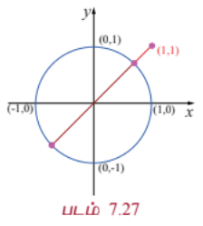

இரண்டாம் வகைக்கெழு சோதனையின்படி மிக அருகாமையில் மற்றும் மிக தொலைவில் உள்ள புள்ளிகள் முறையே $\left(\frac{1}{\sqrt{2}}, \frac{1}{\sqrt{2}}\right)$ மற்றும் $\left(-\frac{1}{\sqrt{2}}, -\frac{1}{\sqrt{2}}\right)$ ஆகும்.

எனவே, மிகக்குறைந்த மற்றும் மிக அதிக தூரங்கள் முறையே $\sqrt{2} - 1$ மற்றும் $\sqrt{2} + 1$ ஆகும்.

---

### எடுத்துக்காட்டு 7.64

ஒரு எஃகு ஆலை ஒரு நாளைக்கு குறைந்த தர எஃகு $x$ டன்னும் மற்றும் உயர்தர எஃகு $y$ டன்னும் உற்பத்தி செய்யும் திறன் கொண்டது. இங்கு $y = \frac{40 - 5x}{10 - x}$. குறைந்த தர எஃகின் சந்தை விலை உயர்தர எஃகின் சந்தை விலையில் பாதி என்றால், அதிக பண வரவைப் பெறுவதற்கு குறைந்த தர எஃகு மற்றும் உயர்தர எஃகு ஆகியவற்றின் உகந்த உற்பத்திகள் என்னவாக இருக்க வேண்டும்?

#### தீர்வு

ஒரு டன் குறைந்த தர எஃகின் விலை `$p$` என்க. எனவே ஒரு டன் உயர்ந்த தர எஃகின் விலை `$2p$` ஆகும்.

நாள் ஒன்றிற்கு பணவரவை

$$R = px + 2py = p\left(x + 2\frac{40 - 5x}{10 - x}\right)$$

ஆகவே நாம் $R$ -ஐ பெருமமாக்க வேண்டும். $R$ -ஐ $x$ -ஐப் பொருத்து வகையிட,

$$R = p\left(x + \frac{80 - 10x}{10 - x}\right)$$

$$\frac{dR}{dx} = p\left(1 + \frac{-10(10 - x) - (80 - 10x)(-1)}{(10 - x)^2}\right)$$

$$= p\left(1 - \frac{20}{(10 - x)^2}\right) = p\left(\frac{(10 - x)^2 - 20}{(10 - x)^2}\right)$$

$$\frac{dR}{dx} = 0 \Rightarrow (10 - x)^2 = 20 \Rightarrow 10 - x = \pm 2\sqrt{5}$$

மேலும் இதிலிருந்து $x = 10 \pm 2\sqrt{5}$ எனப் பெறலாம்.

$$x = 10 - 2\sqrt{5} \text{ -ல் } \frac{d^2R}{dx^2} < 0$$

மேலும் இதிலிருந்து $R$ பெரும மதிப்பை $x = 10 - 2\sqrt{5}$ -ல் அடையும்.

$x = 10 - 2\sqrt{5}$ எனில் $y = \frac{40 - 5(10 - 2\sqrt{5})}{10 - (10 - 2\sqrt{5})} = \frac{40 - 50 + 10\sqrt{5}}{2\sqrt{5}} = \frac{-10 + 10\sqrt{5}}{2\sqrt{5}} = \frac{5(\sqrt{5} - 1)}{\sqrt{5}} = 5 - \sqrt{5}$ ஆகும்.

எனவே, தரம் குறைந்த மற்றும் தரம் உயர்ந்த எஃகுகளை நாள் ஒன்றிற்கு முறையே $10 - 2\sqrt{5}$ மற்றும் $5 - \sqrt{5}$ டன்கள் உற்பத்தி செய்ய வேண்டும்.

---

### எடுத்துக்காட்டு 7.65

கொடுக்கப்பட்ட பரப்புடைய செவ்வகங்களுள் சதுரம் மட்டுமே குறைந்த சுற்றளவைக் கொண்டு இருக்கும் என நிறுவுக.

#### தீர்வு

செவ்வகத்தின் பக்க நீளங்கள் $x, y$ என்க. எனவே, செவ்வகத்தின் பரப்பு $xy = k$ (கொடுக்கப்பட்டது). செவ்வகத்தின் சுற்றளவு $2(x + y)$. நாம் $2(x + y)$ -ஐ $xy = k$ என்ற கட்டுப்பாட்டைக் கொண்டு சிறுமப்படுத்த வேண்டும்.

$$P(x) = 2\left(x + \frac{k}{x}\right)$$

என்க.

$$P'(x) = 2\left(1 - \frac{k}{x^2}\right)$$

$$P'(x) = 0 \Rightarrow x = \sqrt{k}$$

$x, y$ ஆகியவை செவ்வகத்தின் பக்க நீளங்கள் என்பதால் $x = \sqrt{k}$ என்பது ஒரு நிலை எண் ஆகும்.

இப்பொழுது,

$$P''(x) = \frac{4k}{x^3} \quad \text{மற்றும்} \quad P''(\sqrt{k}) > 0$$

$x = \sqrt{k}$ -வில் $P(x)$ சிறும மதிப்பை அடையும்.

$x = \sqrt{k}$ என $xy = k$ -ல் பிரதியிட $y = \sqrt{k}$ எனப் பெறலாம். எனவே, கொடுக்கப்பட்ட பரப்புடைய செவ்வகங்களுள் சதுரம் மட்டுமே சிறும சுற்றளவினைப் பெற்றிருக்கும்.

---

### பயிற்சி 7.8

1. இரண்டு மிகை எண்களின் கூட்டுத் தொகை 12, மேலும் அதன் பெருக்குத் தொகை பெருமம் எனில் அந்த எண்களைக் காண்க.

2. இரண்டு மிகை எண்களின் பெருக்குத்தொகை 20, மேலும் அதன் கூடுதல் சிறுமம் எனில் அந்த எண்களைக் காண்க.

3. $x^2 + y^2$ -ன் குறைந்த மதிப்பினை $x + y = 10$ எனக் கொண்டு காண்க.

4. ஒரு தோட்டம் செவ்வக வடிவில் அமைக்கப்பட்டு கம்பி வேலி மூலம் பாதுகாக்கப்பட வேண்டும். 40 மீட்டர் வேலிக் கம்பி மூலம் பாதுகாக்கப்படும் தோட்டத்தின் பெரும பரப்பினைக் காண்க.

5. ஒரு செவ்வக வடிவிலான பக்கத்தில் $24 \text{ செ.மீ}^2$ அளவிற்கு அச்சிடப்பட்டுள்ளது. மேற்புற மற்றும் கீழ்ப்புற ஓரங்கள் 1.5 செ.மீ அளவிலும் மற்ற பக்கங்களின் ஓரங்கள் 1 செ.மீ அளவிலும் இடைவெளி விடப்பட்டுள்ளது. காகித பக்கத்தின் குறைந்த பரப்பளவிற்கு அதன் நீள, அகலங்கள் என்னவாக இருக்க வேண்டும்?

6. ஒரு விவசாயி ஒரு நதியை ஒட்டிய செவ்வக மேய்ச்சல் நிலத்திற்கு வேலி அமைக்க திட்டமிட்டுள்ளார். மந்தைகளுக்கு போதுமான புல் வழங்க மேய்ச்சல் நிலம் 1,80,000 சதுர மீட்டர் பரப்பளவு இருக்க வேண்டும். ஆற்றின் குறுக்கே வேலி அமைக்கத் தேவையில்லை. வேலி அமைக்க தேவையான குறைந்தபட்ச வேலிக் கம்பியின் நீளம் என்ன?

7. 10 செ.மீ ஆரமுள்ள வட்டத்தினுள் அமைக்கப்படும் செவ்வகங்களுள் மீப்பெரு பரப்புடைய செவ்வகத்தின் பரிமாணங்களைக் காண்க.

8. கொடுக்கப்பட்ட சுற்றளவுள்ள செவ்வகங்களுள், சதுரம் மட்டுமே பெரும பரப்பைக் கொண்டிருக்கும் என நிறுவுக.

9. $r$ செ.மீ ஆரமுள்ள அரை வட்டத்தினுள் அமைக்கப்படும் செவ்வகங்களுள் மீப்பெரு செவ்வகத்தின் பரிமாணங்களைக் காண்க.

10. ஒரு உற்பத்தியாளர் ஒரு சதுர அடித் தளத்தையும் 108 சதுர செ.மீ வெளிப்புறப் பரப்பையும் கொண்ட திறந்த பெட்டியை வடிவமைக்க விரும்புகிறார். அதிகபட்ச கன அளவிற்கான பெட்டியின் பரிமாணங்களைக் காண்க.

11. ஒரு உருளையின் கன அளவு $V = \pi r^2 h$. மேலும் $r + h = 6$ எனில் கன அளவின் மீப்பெரு மற்றும் மீச்சிறு மதிப்புகளைக் காண்க.

12. ஆரம் $a$ செ.மீ மற்றும் உயரம் $b$ செ.மீ கொண்ட ஒரு வெற்றுக் கூம்பு ஒரு மேசையின் மீது வைக்கப்படுகிறது. இதன் அடியில் மறைத்து வைக்கக் கூடிய மிகப்பெரிய உருளையின் கன அளவு கூம்பின் கன அளவைப் போல் $\frac{4}{9}$ மடங்கு என்பதைக் காட்டுக.

### 7.9 சமச்சீர் தன்மை மற்றும் தொலைத் தொடுகோடுகள்
### (Symmetry and Asymptotes)

#### 7.9.1 சமச்சீர் தன்மை (Symmetry)

கீழ்க்காணும் வளைவரைகள் ஒவ்வொன்றும் ஒரு சிறப்புப் பண்பை அதாவது சமச்சீர் பண்பை ஒரு புள்ளியைப் பொருத்தோ அல்லது ஒரு கோட்டை பொருத்தோ பெற்றிருப்பதைக் கவனிக்க.

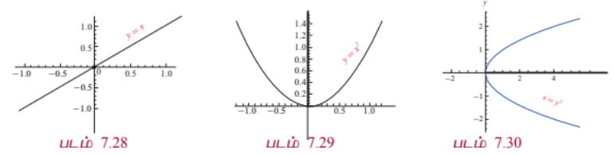

நாம் இப்பொழுது முறையாக சமச்சீர் தன்மையை கீழ்க்காணுமாறு வரையறுப்போம்:

ஒரு படம் அல்லது ஒரு வளைவரை ஒரு கோட்டைப் பொறுத்து மற்றொரு படத்தின் பிரதிபலிப்பாக இருந்தால், அந்தக் கோட்டைப் பொருத்து படம் அல்லது வளைவரை **சமச்சீர்** தன்மையை பெற்றுள்ளது என்கிறோம்.

ஒரு வளைவரை ஒரு புள்ளியைப் பொருத்து $\theta$ கோணச் சுழற்சியால் வளைவரை மாறாமல் இருந்தால் அந்த வளைவரை அப்புள்ளியைப் பொருத்து $\theta$ கோணச் சமச்சீர் கொண்டது என்கிறோம்.

ஒரு வளைவரை பல கோடுகளைப் பொருத்து சமச்சீர் கொண்டதாக இருக்கலாம். குறிப்பாக, நாம் ஆய அச்சுகளுடன் சமச்சீர் தன்மை மற்றும் ஆதியைப் பொருத்து சமச்சீர் தன்மை ஆகியவற்றை கருதுவோம். கணிதத்தின் வாயிலாக, ஒரு வளைவரை $f(x, y) = 0$ ஆனது

- $y$-அச்சைப் பொருத்து சமச்சீர்: $f(x, y) = f(-x, y)$ $\forall x, y$ எனில் வளைவரை $y$-அச்சைப் பொருத்து சமச்சீர் ஆகும் அல்லது $(x, y)$ ஆனது வளைவரையின் மீதுள்ள புள்ளி எனில் $(-x, y)$ -யும் வளைவரை மீது இருந்தால் வளைவரை $y$-அச்சைப் பொருத்து சமச்சீர் ஆகும். நாம் $y$-அச்சில் ஒரு கண்ணாடியை வைத்தால், கண்ணாடியின் ஒரு பக்கத்தில் உள்ள வளைவரையின் பகுதியும் கண்ணாடியின் மறுபக்கத்தில் உள்ள வளைவரையின் பகுதியும் ஒன்றைப் போலவே இருக்கும்.

- $x$-அச்சைப் பொருத்து சமச்சீர்: $f(x, y) = f(x, -y)$ $\forall x, y$ எனில் வளைவரை $x$ -அச்சைப் பொருத்து சமச்சீர் ஆகும் அல்லது $(x, y)$ ஆனது வளைவரையின் மீதுள்ள புள்ளி எனில் $(x, -y)$-யும் வளைவரை மீது இருந்தால் வளைவரை $x$ -அச்சைப் பொருத்து சமச்சீர் ஆகும். நாம் $x$ -அச்சில் ஒரு கண்ணாடியை வைத்தால், கண்ணாடியின் ஒரு பக்கத்தில் உள்ள வளைவரையின் பகுதியும் கண்ணாடியின் மறுபக்கத்தில் உள்ள வளைவரையின் பகுதியும் ஒன்றைப் போலவே இருக்கும்.

- ஆதியைப் பொருத்து சமச்சீர்: $f(x, y) = f(-x, -y)$ $\forall x, y$ எனில் வளைவரை ஆதியைப் பொருத்து சமச்சீர் ஆகும் அல்லது $(x, y)$ ஆனது வளைவரையின் மீதுள்ள புள்ளி எனில் $(-x, -y)$ -யும் வளைவரை மீது இருந்தால் வளைவரை ஆதியைப் பொருத்து சமச்சீர் ஆகும். அதாவது ஆதியைப் பொருத்து $180^\circ$ சுழற்றும்போது வளைவரை மாறாது.

உதாரணமாக, மேற்கண்ட வளைவரைகள் $xy = 1$, $y = x^2$, மற்றும் $y = x^3$ ஆகியவை முறையே $x$-அச்சு, $y$-அச்சு, மற்றும் ஆதியைப் பொருத்து சமச்சீர் தன்மை கொண்டவை ஆகும்.

---

#### 7.9.2 தொலைத் தொடுகோடுகள் (Asymptotes)

$y = f(x)$ என்ற வளைவரையை $\infty$-யில் தொடும் தொடுகோடு, **தொலைத் தொடுகோடு** ஆகும். அதாவது வளைவரை மீதுள்ள புள்ளி கந்தழியை நெருங்கும்போது வளைவரைக்கும் கோட்டிற்கும் இடைப்பட்ட தூரம் பூச்சியத்தை நெருங்கும் வகையில் உள்ள கோடு தொலைத் தொடுகோடு ஆகும்.

தொலைத் தொடுகோடுகள் மூன்று வகைப்படும். அவையாவன

1. **கிடைமட்டத் தொலைத் தொடுகோடு**, என்பது $x$ -அச்சிற்கு இணையானதாகும். $y = f(x)$ என்ற வளைவரைக்கு $\lim_{x \to \infty} f(x) = L$ அல்லது $\lim_{x \to -\infty} f(x) = L$ எனில் $y = L$ என்ற கோடு கிடைமட்டத் தொலைத் தொடுகோடு ஆகும்.

2. **நிலைக்குத்து தொலைத் தொடுகோடு**, என்பது $y$ -அச்சிற்கு இணையானதாகும். $y = f(x)$ என்ற வளைவரைக்கு $\lim_{x \to a^-} f(x) = \pm\infty$ அல்லது $\lim_{x \to a^+} f(x) = \pm\infty$ எனில் $x = a$ என்ற கோடு நிலைக்குத்து தொலைத் தொடுகோடு ஆகும்.

3. **சாய்ந்த தொலைத் தொடுகோடு**, ஒரு சாய்ந்த தொலைத் தொடுகோடு தொகுதியில் உள்ள பல்லுறுப்புக் கோவையின் வரிசைப் பகுதியில் உள்ள பல்லுறுப்புக் கோவையின் வரிசையை விட அதிகமாக இருந்தால் வரும்.

சாய்ந்த தொலைத் தொடுகோட்டினைப் பெற நாம் தொகுதியை பகுதியால் வகுத்துப் பெறலாம்.

---

### எடுத்துக்காட்டு 7.66

$f(x) = \frac{1}{x}$ என்ற சார்பின் தொலைத் தொடுகோடுகளைக் காண்க.

#### தீர்வு

$\lim_{x \to 0^+} \frac{1}{x} = \infty$ மற்றும் $\lim_{x \to 0^-} \frac{1}{x} = -\infty$. எனவே, தேவையான நிலைக்குத்து தொலைத் தொடுகோடு $x = 0$ அல்லது $y$ -அச்சு ஆகும்.

இவ்வளைவரையானது இரு ஆய அச்சுகளைப் பொருத்தும் சமச்சீர் தன்மை வாய்ந்தது என்பதால், $y = 0$ அல்லது $x$ -அச்சும் ஒரு தொலைத் தொடுகோடு ஆகும். ஆகவே இவ்வளைவரைக்கு (செவ்வக அதிபரவளையம்) கிடைமட்ட மற்றும் நிலைக்குத்து தொலைத் தொடுகோடுகள் உண்டு.

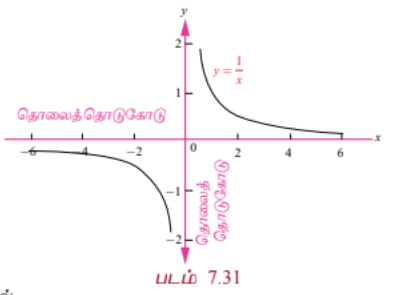

---

### எடுத்துக்காட்டு 7.67

$f(x) = \frac{x^2 - 6x + 7}{x - 5}$ என்ற சார்பிற்கு சாய்ந்த தொலைத் தொடுகோட்டினைக் காண்க.

#### தீர்வு

தொகுதியில் உள்ள பல்லுறுப்புக் கோவையின் வரிசையானது (வரிசை 2) பகுதியில் உள்ள பல்லுறுப்புக் கோவையின் வரிசையைவிட (வரிசை 1) அதிகம் என்பதால் இதற்கு சாய்ந்த தொலைத் தொடுகோடு உண்டு. இதனைக் காண தொகுதியை பகுதியைக் கொண்டு வகுக்க வேண்டும்.

$$
\begin{array}{r|rrrr}
 & x & -1 \\
\hline
x-5 & x^2 & -6x & +7 \\
 & x^2 & -5x & \\
\hline
 & & -x & +7 \\
 & & -x & +5 \\
\hline
 & & & 2
\end{array}
$$

நாம் இங்கு மீதியைப் பற்றி கவலைப்பட வேண்டியதில்லை. நமக்கு நேர்க்கோட்டினை உருவாக்கும் உறுப்புகள் மட்டுமே அவசியம். எனவே, சாய்ந்த தொலைத் தொடுகோடு $y = x - 1$ ஆகும்.

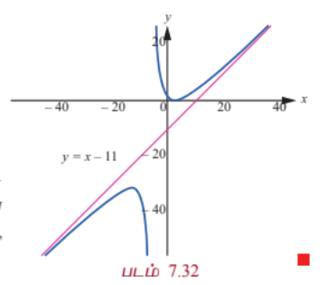

இந்த வளைவரையின் படத்திலிருந்து, வளைவரையும் சாய்ந்த தொலைத் தொடுகோடு $y = x - 1$-ம் ஒன்றை ஒன்று நெருங்குகிறது. ஆனால் வெட்டுவதில்லை என்பதை கவனிக்க.

---

### எடுத்துக்காட்டு 7.68

$f(x) = \frac{x^2 - 28}{x^2 - 16}$ என்ற வளைவரையின் தொலைத் தொடுகோடுகளைக் காண்க.

#### தீர்வு

$$\lim_{x \to -4^+} \frac{x^2 - 28}{x^2 - 16} = -\infty$$

மற்றும்

$$\lim_{x \to 4^+} \frac{x^2 - 28}{x^2 - 16} = -\infty$$

எனவே, $x = -4$ மற்றும் $x = 4$ ஆகியவை செங்குத்துத் தொலைத் தொடுகோடுகள் ஆகும்.

$$\lim_{x \to \infty} \frac{x^2 - 28}{x^2 - 16} = \lim_{x \to \infty} \frac{1 - \frac{28}{x^2}}{1 - \frac{16}{x^2}} = 1$$

மற்றும்

$$\lim_{x \to -\infty} \frac{x^2 - 28}{x^2 - 16} = \lim_{x \to -\infty} \frac{1 - \frac{28}{x^2}}{1 - \frac{16}{x^2}} = 1$$

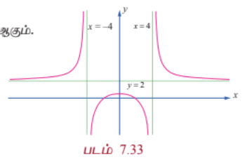

என்பதில் இருந்து $y = 1$ என்பது ஒரு கிடைமட்டத் தொலைத் தொடுகோடு ஆகும். நாம் இதனை தொகுதியை பகுதியை கொண்டு வகுத்தும் பெறலாம்.

### 7.10 வளைவரை வரைதல் (Sketching of Curves)

ஒரு சார்பின் வளைவரையை கையின் துணையுடனோ அல்லது வளைவரையை வரையும் மென்பொருள் துணையுடனோ வரையும்போது நாம் வளைவரை முழுமையையும் காட்ட முடியாது. வளைவரையின் ஒரு பகுதியை மட்டுமே வரைய முடியும். எந்தப் பகுதியை வரைய வேண்டும் மற்றும் அப்பகுதியை எவ்வாறு முடிவு செய்வது என்பது முக்கியமான கேள்வியாகும். நாம் வளைவரையினை சிறந்த முறையில் காணத் தேவைப்படும் செவ்வகத்தை முடிவு செய்ய சில வழிகாட்டுதல்களை கீழே எண்ணிடப்பட்டுள்ளன. அவையாவன :

(i) சார்பின் சார்பகம் மற்றும் வீச்சகம்

(ii) வளைவரையின் வெட்டுத்துண்டுகள் (இருந்தால்)

(iii) சார்பின் நிலைப்புள்ளிகள்

(iv) இடஞ்சார்ந்த அறுதி மதிப்புகள்

(v) குழிவு இடைவெளிகள்

(vi) வளைவு மாற்றப் புள்ளிகள் (இருந்தால்)

(vii) வளைவரையின் தொலைத் தொடுகோடுகள் (இருந்தால்)

---

### எடுத்துக்காட்டு 7.69

$y = f(x) = x^2 - x - 6$ என்ற வளைவரையை வரைக.

#### தீர்வு

கொடுக்கப்பட்ட சார்பை காரணிப்படுத்த நமக்குக் கிடைப்பது

$$y = f(x) = (x - 3)(x + 2)$$

(1) சார்பு $f(x)$ -ன் சார்பகம் முழு மெய் எண் கோடாகும்.

(2) $y = 0$ எனப் பிரதியிட, $x = -2, 3$ எனப் பெறலாம். எனவே, $x$ -வெட்டுத்துண்டுகள் $(-2, 0)$ மற்றும் $(3, 0)$. $x = 0$ எனப் பிரதியிட $y = -6$ எனப் பெறலாம். எனவே, $y$ -வெட்டுத்துண்டு $(0, -6)$.

(3) $f'(x) = 2x - 1$ மேலும் இதிலிருந்து $x = \frac{1}{2}$ -ல் வளைவரையின் நிலைப்புள்ளி அமையும்.

(4) $f''(x) = 2 > 0, \forall x$. எனவே, $x = \frac{1}{2}$ -ல் வளைவரை இடஞ்சார்ந்த சிறும மதிப்பை அடையும். இதன் மதிப்பு $f\left(\frac{1}{2}\right) = -\frac{25}{4}$.

(5) சார்பின் வீச்சகம் $y \ge -\frac{25}{4}$.

(6) $f''(x) = 2 > 0$ என்பதால் இந்த சார்பு மெய் எண் நேர்க்கோடு முழுமையிலும் மேல்நோக்கி குழிவு ஆகும்.

(7) $f''(x) = 2 \neq 0$ எனவே வளைவரைக்கு வளைவு மாற்றப் புள்ளிகள் இல்லை.

(8) வளைவரைக்கு தொலைத் தொடுகோடுகள் இல்லை.

இவ்வளைவரையின் தோராய வரைபடம் வலது பக்கம் காட்டப்பட்டுள்ளது.

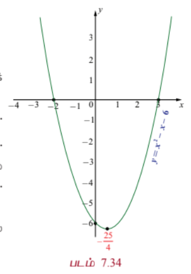

---

### எடுத்துக்காட்டு 7.70

$y = f(x) = x^3 - 3x - 9$ என்ற வளைவரையை வரைக.

#### தீர்வு

கொடுக்கப்பட்ட சார்பை காரணிப்படுத்த,

$$y = f(x) = (x - 3)(x^2 + 3x + 3)$$

ஆகும்.

(1) சார்பு $f(x)$ -ன் சார்பகம் மற்றும் வீச்சகங்கள் முழு மெய் எண் நேர்க்கோடாகும்.

(2) $y = 0$ எனப் பிரதியிட $x = 3$. மற்ற இரண்டு மூலங்களும் கற்பனை. எனவே, $x$ -வெட்டுத்துண்டு $(3, 0)$ ஆகும். $x = 0$ எனப்பிரதியிட $y = -9$ ஆகும். எனவே $y$-ன் வெட்டுத்துண்டு $(0, -9)$ ஆகும்.

(3) $f'(x) = 3x^2 - 3 = 3(x - 1)(x + 1)$ மேலும் இதிலிருந்து நிலை எண்கள் $x = \pm 1$ ஆகும்.

(4) $f''(x) = 6x$. மேலும் $x = 1$ -ல் $f''(1) = 6 > 0$. எனவே $x = 1$ -ல் வளைவரை இடஞ்சார்ந்த சிறும மதிப்பு $f(1) = -11$ அடையும். இதுபோலவே $x = -1$ -ல் $f''(-1) = -6 < 0$. எனவே $x = -1$ -ல் வளைவரை இடஞ்சார்ந்த பெரும மதிப்பு $f(-1) = -7$ -ஐ அடையும்.

(5) $f''(x) = 6x > 0, x > 0$ என்பதால் வளைவரையானது மிகை மெய் எண் நேர்க்கோட்டில் மேல்நோக்கி குழிவானது. $f''(x) = 6x < 0, x < 0$ என்பதால் வளைவரையானது கீழ்நோக்கி குழிவானது.

(6) $x = 0$ -வில் $f''(0) = 0$ மற்றும் $f''(x)$ -ன் குறி $x = 0$ -ஐ கடக்கும்போது மாறுகிறது. எனவே வளைவு மாற்றப் புள்ளி $(0, f(0)) = (0, -9)$.

(7) இவ்வளைவரைக்கு தொலைத் தொடுகோடுகள் இல்லை.

இவ்வளைவரையின் தோராய வரைபடம் வலது பக்கம் காட்டப்பட்டுள்ளது.

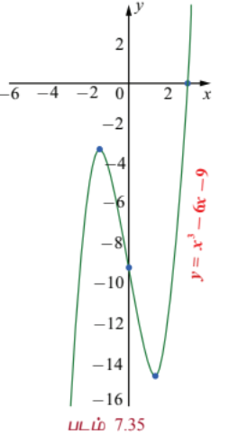

---

### எடுத்துக்காட்டு 7.71

$y = \frac{x^2 - 3x}{x - 1}$ என்ற வளைவரையை வரைக.

#### தீர்வு

கொடுக்கப்பட்ட சார்பை காரணிப்படுத்த,

$$y = f(x) = \frac{x(x - 3)}{x - 1}$$

ஆகும்.

(1) $f(x)$ என்ற சார்பின் சார்பகம் $\mathbb{R} \setminus \{1\}$ மற்றும் வீச்சகம் முழு மெய் எண் நேர்க்கோடு ஆகும்.

(2) $y = 0$ எனப் பிரதியிட $x = 0, 3$. எனவே $x$ -வெட்டுத்துண்டு $(0, 0)$ மற்றும் $(3, 0)$. $x = 0$ எனப் பிரதியிட, $y = 0$. எனவே வளைவரை ஆதி வழியாகச் செல்லும்.

(3) $f'(x) = \frac{x^2 - 2x + 3}{(x - 1)^2}$ மேலும் இதிலிருந்து $f'(1)$ காணத்தக்கதல்ல என்பதால் $x = 1$-ல் நிலைப்புள்ளி உள்ளது. $x^2 - 2x + 3 = 0$ -விற்கு மெய் தீர்வுகள் இல்லை. ஆகவே, $x = 1$ மட்டுமே நிலை எண் ஆகும்.

(4) $x = 1$ என்பது $f(x)$ -ன் சார்பகத்தில் இல்லை. மேலும் $f'(x) \neq 0$ $\forall x \in \mathbb{R} \setminus \{1\}$ எனவே இதற்கு இடஞ்சார்ந்த பெருமமோ அல்லது இடஞ்சார்ந்த சிறுமமோ இல்லை.

(5) $f''(x) = \frac{4}{(x - 1)^3}$ $\forall x \in \mathbb{R} \setminus \{1\}$. எனவே $x < 1$ எனில் $f''(x) < 0$ ஆகவே $(-\infty, 1)$ -ல் வளைவரை கீழ்நோக்கி குழிவானது. மேலும் $x > 1$ எனில் $f''(x) > 0$. ஆகவே $(1, \infty)$ -ல் வளைவரை மேல்நோக்கி குழிவானது. $x = 1$ சார்பகத்தில் இல்லை என்பதால் $f''(x)$ -க்கு வளைவு மாற்றப் புள்ளிகள் இல்லை.

(6) $\lim_{x \to 1^-} \frac{x^2 - 3x}{x - 1} = \infty$ மற்றும் $\lim_{x \to 1^+} \frac{x^2 - 3x}{x - 1} = -\infty$ என்பதால், $x = 1$ என்பது நிலைக்குத்து தொலைத் தொடுகோடு ஆகும்.

வளைவரையின் தோராய வரைபடம் வலப்பக்கம் காட்டப்பட்டுள்ளது.

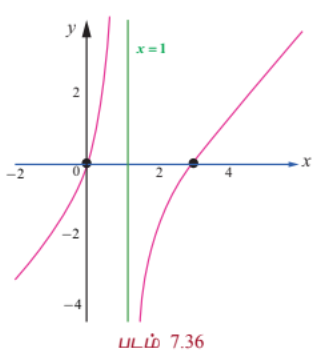
---

### எடுத்துக்காட்டு 7.72

$y = \frac{x^3}{1 - x^2}$ என்ற வளைவரையை வரைக.

#### தீர்வு

(1) $f(x)$ -ன் சார்பகம் $\mathbb{R} \setminus \{-1, 1\}$.

(2) $f(-x) = -f(x)$ என்பதால் வளைவரை ஆதியை பொருத்து சமச்சீரானது.

(3) $y = 0$ எனப் பிரதியிட $x = 0$ ஆகும். எனவே $x$ -வெட்டுத்துண்டு $(0, 0)$ ஆகும்.

(4) $x = 0$ எனப் பிரதியிட, $y = 0$ ஆகும். எனவே $y$ -வெட்டுத்துண்டு $(0, 0)$ ஆகும்.

(5) ஓரியல்புத் தன்மையை ஆராய, நாம் முதலாம் வகைக்கெழுவை காண்போம்.

$$f'(x) = \frac{3x^2(1 - x^2) - x^3(-2x)}{(1 - x^2)^2} = \frac{x^2(3 - x^2)}{(1 - x^2)^2}$$

ஆகவே, $x = \pm 1$ -ல் $f'(x)$ காணத்தக்கது அல்ல. எனவே, $x = \pm 1$ ஆகியவை நிலை எண்களாகும். ஓரியல்பு இடைவெளிகளை அட்டவணை 7.9-ல் அட்டவணைப்படுத்தப்பட்டு உள்ளது.

| இடைவெளி | $(-\infty, -1)$ | $(-1, 1)$ | $(1, \infty)$ |
|---|---|---|---|
| $f'(x)$ -ன் குறி | $-$ | $+$ | $-$ |
| ஓரியல்புத் தன்மை | திட்டமாக இறங்கும் | திட்டமாக ஏறும் | திட்டமாக இறங்கும் |

அட்டவணை 7.9

(6) நிலை எண்களின் வழியே செல்லும்போது $f'(x)$ -ன் குறியில் மாற்றம் இல்லை. எனவே, இடஞ்சார்ந்த அறுதிகள் இல்லை.

(7) குழிவுத் தன்மையை ஆராய நாம் இரண்டாம் வகைக்கெழுவினை காண வேண்டும்.

$$f''(x) = \frac{6x(1 - x^2)^2 - x^2(3 - x^2) \cdot 2(1 - x^2)(-2x)}{(1 - x^2)^4}$$

$$= \frac{6x(1 - x^2) + 4x^3(3 - x^2)}{(1 - x^2)^3} = \frac{6x(1 + x^2)}{(1 - x^2)^3}$$

$f''(x) = 0 \Rightarrow x = 0$ மற்றும் $f''$ ஆனது $x = \pm 1$ -ல் காணத்தக்கது அல்ல.

குழிவு இடைவெளிகள் அட்டவணை 7.10-ல் அட்டவணைப்படுத்தப்பட்டுள்ளது.

| இடைவெளி | $(-\infty, -1)$ | $(-1, 0)$ | $(0, 1)$ | $(1, \infty)$ |
|---|---|---|---|---|
| $f''(x)$ -ன் குறி | $-$ | $+$ | $-$ | $+$ |
| குழிவுத் தன்மை | கீழ்நோக்கி குழிவு | மேல்நோக்கி குழிவு | கீழ்நோக்கி குழிவு | மேல்நோக்கி குழிவு |

அட்டவணை 7.10

(8) $x = \pm 1$ ஆகியவை $f(x)$ -ன் சார்பகத்தில் இல்லை மற்றும் $x = 0$ -வில் இரண்டாம் வகைக்கெழு பூச்சியம் மற்றும் $f''(x)$ -ன் குறி பூச்சியத்தின் வழியே செல்லும்போது மாறுகிறது. எனவே, வளைவு மாற்றப்புள்ளி $(0, f(0)) = (0, 0)$ ஆகும்.

(9) $\lim_{x \to \pm\infty} f(x) = \lim_{x \to \pm\infty} \frac{x^3}{1 - x^2} = \lim_{x \to \pm\infty} \frac{x}{x^{-2} - 1} = \mp\infty$ எனவே கிடைமட்டத் தொலைத் தொடுகோடு இல்லை.

பகுதி $x = \pm 1$ எனும்போது பூச்சியம் என்பதால்,

$$\lim_{x \to 1^-} \frac{x^3}{1 - x^2} = \infty, \quad \lim_{x \to 1^+} \frac{x^3}{1 - x^2} = -\infty,$$

$$\lim_{x \to -1^-} \frac{x^3}{1 - x^2} = \infty, \quad \lim_{x \to -1^+} \frac{x^3}{1 - x^2} = -\infty$$

எனவே $x = -1$ மற்றும் $x = 1$ ஆகியவை நிலைக்குத்து தொலைத் தொடுகோடுகளாகும்.

(10) சாய்ந்த தொலைத் தொடுகோடு: $f(x) = \frac{x^3}{1 - x^2} = -x + \frac{x}{1 - x^2}$. எனவே $y = -x$ என்பது சாய்ந்த தொலைத் தொடுகோடு ஆகும்.

வளைவரையின் தோராய படம் வலப்பக்கம் காட்டப்பட்டுள்ளது.

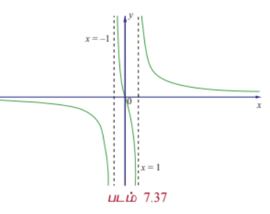

---

### பயிற்சி 7.9

1. கீழ்க்காணும் வளைவரைகளுக்கு தொலைத்தொடுகோடுகளைக் காண்க :

   (i) $f(x) = \frac{x^2}{x^2 - 1}$

   (ii) $f(x) = \frac{x^2}{x + 1}$

   (iii) $f(x) = \frac{x}{x^2 + 2}$

   (iv) $f(x) = \frac{x^2 - 6x + 1}{x - 3}$

   (v) $f(x) = \frac{x^2 - 6x + 4}{x^2 - 36}$

2. கீழ்க்காணும் சார்புகளை வரைக:

   (i) $y = \frac{1}{3}(x^3 - 3x + 2)$

   (ii) $y = x\sqrt{4 - x}$

   (iii) $y = \frac{2x^2}{x^2 - 4}$

   (iv) $y = \frac{1}{e^x}$
