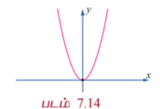
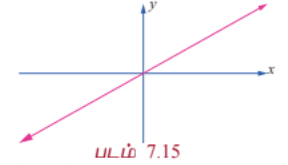
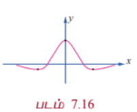
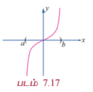
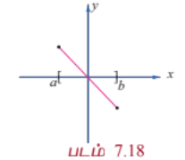
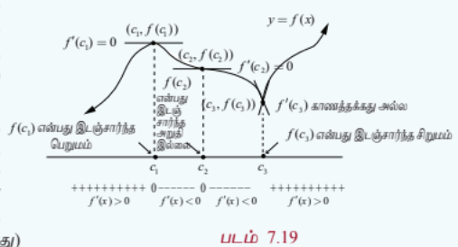
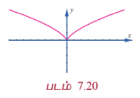
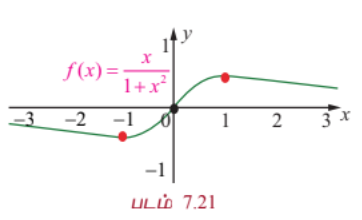

### 7.6 முதலாம் வகைக்கெழுவின் பயன்பாடுகள் (Applications of First Derivative)

முதலாம் வகைக் கெழுவினைப் பயன்படுத்தி ஒரு வளைவரை $f(x)$ -ன் ஓரியல்புத் (ஏறும் அல்லது இறங்கும்) தன்மையையும், சார்பகத்தில் ஒரு குறிப்பிட்ட புள்ளியில் இடம் சார்ந்த அறுதி (பெறும அல்லது சிறும) மதிப்புகளைக் காண்க.

---

#### 7.6.1 சார்புகளின் ஓரியல்புத் தன்மை (Monotonicity of functions)

சார்புகளின் ஓரியல்புத்தன்மை என்பது அவ்வளைவரையின் ஏறும் அல்லது இறங்கும் தன்மையை பற்றி கூறுவதாகும்.

#### வரையறை 7.4

$f(x)$ என்ற சார்பு $I$ என்ற இடைவெளியில் $a < b \Rightarrow f(a) < f(b)$, $\forall a, b \in I$ என இருந்தால் அச்சார்பு $I$ என்ற இடைவெளியில் **ஏறும்**.

#### வரையறை 7.5

$f(x)$ என்ற சார்பு, $I$ என்ற இடைவெளியில் $a < b \Rightarrow f(a) > f(b)$, $\forall a, b \in I$ என இருந்தால், அச்சார்பு $I$ என்ற இடைவெளியில் **இறங்கும்**.

$f(x) = x$ என்ற சார்பானது மெய் எண் நேர்க்கோடு முழுமையிலும் ஏறுகிறது, ஆனால் $f(x) = -x$ என்ற சார்பானது மெய் எண் நேர்க்கோடு முழுமையிலும் இறங்குகிறது. பொதுவாக, ஒரு சார்பானது ஒரு குறிப்பிட்ட இடைவெளியில் ஏறும் மற்றும் வேறொரு இடைவெளியில் இறங்கும். உதாரணமாக $f(x) = |x|$ என்ற சார்பு $(-\infty, 0]$ என்ற இடைவெளியில் இறங்கும் மற்றும் $[0, \infty)$ என்ற இடைவெளியில் ஏறும். இச்சார்புகளின் ஓரியல்புத் தன்மையினை உணர்வது எளிது. ஆனால் ஏதேனும் ஒரு கொடுக்கப்பட்ட சார்பிற்கு எவ்வாறு ஓரியல்புத்தன்மையினை மெய் எண் நேர்க்கோட்டில் தீர்மானிப்பது? இதனை கீழ்க்கண்ட தேற்றத்தைப் (நிரூபணம் இல்லாமல்) பயன்படுத்தி செய்யலாம்.

#### தேற்றம் 7.7

$f(x)$ என்ற சார்பு $(a, b)$ என்ற திறந்த இடைவெளியில் வகையிடத்தக்கது என்க.

(1) $\frac{d}{dx}(f(x)) \ge 0, \forall x \in (a, b)$

... (1)

எனில், $(a, b)$ என்ற இடைவெளியில் ஏறும்.

(2) $\frac{d}{dx}(f(x)) > 0, \forall x \in (a, b)$

... (2)

எனில், $(a, b)$ என்ற இடைவெளியில் $f(x)$ **திட்டமாக ஏறும்**.

இதன் நிரூபணத்தை தேற்றம் 7.3-ல் காணலாம்.

(3) $\frac{d}{dx}(f(x)) \le 0, \forall x \in (a, b)$

... (3)

எனில், $(a, b)$ என்ற இடைவெளியில் $f(x)$ இறங்கும்.

(4) $\frac{d}{dx}(f(x)) < 0, \forall x \in (a, b)$

... (4)

எனில், $(a, b)$ என்ற இடைவெளியில் $f(x)$ **திட்டமாக இறங்கும்**.

#### குறிப்புரை

இதில் மிக முக்கியமாக கவனிக்க வேண்டிய உண்மை என்னவென்றால், $f(x)$ என்ற சார்பு $I$ என்ற இடைவெளியில் வகையிடத்தக்கதாக இருந்து திட்டமாக ஏறுகிறது எனில் $f'(x) > 0$, $\forall x \in I$ எனக் கூறுவது தவறானதாகும். உதாரணமாக, $y = x^3$, $x \in (-\infty, \infty)$ என்ற சார்பை கருதுக. இது $(-\infty, \infty)$ -ல் திட்டமாக ஏறுகிறது. இதனை நிறுவ, $a > b$ எனக்கொண்டு நாம் $f(a) > f(b)$ என நிறுவ வேண்டும். இதற்காக நாம் $a^3 - b^3 > 0$ என நிறுவ வேண்டும். இப்பொழுது,

$$a^3 - b^3 = (a - b)(a^2 + ab + b^2)$$

$$= (a - b)\left[\left(a + \frac{b}{2}\right)^2 + \frac{3b^2}{4}\right] > 0$$

ஏன் எனில் $a - b > 0$ மற்றும் அடைப்புக் குறிக்குள் உள்ள உறுப்புகள் $> 0$.

ஆகவே இந்த இருபடி விரிவு எப்போதும் மிகை (இதன் மதிப்பு $a = b = 0$ என்றால் மட்டுமே பூச்சியமாகும். இது $a > b$ உடன் முரண்படுகிற). எனவே $y = x^3$ என்ற சார்பு $(-\infty, \infty)$ -ல் திட்டமாக ஏறும். ஆனால் $f'(x) = 3x^2$ -ன் மதிப்பு $x = 0$ -ல் பூச்சியம் ஆகும்.

#### வரையறை 7.6

$f(x)$ என்ற வகையிடத்தக்க சார்பிற்கு $(x_0, f(x_0))$ ஒரு **தேக்கநிலைப்புள்ளி** எனில் $f'(x_0) = 0$ ஆகும்.

#### வரையறை 7.7

$f(x)$ என்ற சார்பிற்கு $(x_0, f(x_0))$ ஒரு **நிலைப்புள்ளி** எனில் $f'(x_0) = 0$ அல்லது $f'(x_0)$ காணத்தக்கது அல்ல.

#### குறிப்புரை

$f(x)$ என்ற சார்பின் சார்பகத்தில் உள்ள $x$-க்கு, $(x,y)$ ஒரு தேக்க நிலைப்புள்ளி அல்லது நிலைப்புள்ளி எனில் $x$–ஐ தேக்க நிலை எண் அல்லது நிலை எண் என்கிறோம்.

எல்லா தேக்க நிலைப்புள்ளிகளும் நிலைப்புள்ளிகளாகும். ஆனால் எல்லா நிலைப் புள்ளிகளும் தேக்க நிலைப்புள்ளிகள் ஆகாது. எடுத்துக்காட்டாக $f(x) = |x - 17|$ என்ற சார்பிற்கு $(17, 0)$ ஒரு நிலைப்புள்ளி. ஆனால் $(17, 0)$ தேக்க நிலைப்புள்ளியல்ல. ஏன் எனில் $x = 17$ -ல் சார்பு வகையிடத்தக்கதல்ல.

---

### எடுத்துக்காட்டு 7.46

$f(x) = x^2 - 2$ என்ற சார்பு $(2, 7)$ என்ற இடைவெளியில் திட்டமாக ஏறும் எனவும், $(-2, 0)$ என்ற இடைவெளியில் திட்டமாக இறங்கும் எனவும் கொள்க.

#### தீர்வு

$$f'(x) = 2x > 0, \forall x \in (2, 7)$$

மற்றும்

$$f'(x) = 2x < 0, \forall x \in (-2, 0)$$

இதிலிருந்து தேவையான முடிவைப் பெறலாம்.

---

### எடுத்துக்காட்டு 7.47

$f(x) = x^2 - 2x + 3$ என்ற சார்பு $(1, \infty)$ என்ற இடைவெளியில் திட்டமாக ஏறும் என நிறுவுக.

#### தீர்வு

$$f(x) = x^2 - 2x + 3, \quad f'(x) = 2x - 2 > 0, \forall x \in (1, \infty)$$

என்பதால் $f(x)$ ஆனது $(1, \infty)$ என்ற இடைவெளியில் திட்டமாக ஏறும்.

---

#### 7.6.2 மீப்பெரு பெருமம் மற்றும் மீச்சிறு சிறுமம் (Absolute maxima and minima)

மீப்பெரு பெருமம் மற்றும் மீச்சிறு சிறுமம் ஆகியவை கொடுக்கப்பட்ட இடைவெளியில் சார்பின் மிகப்பெரிய மற்றும் மிகச்சிறிய மதிப்பை குறிப்பிடுவன ஆகும்.

#### வரையறை 7.8

$f(x)$ என்ற சார்பின் சார்பகம் $D$ -யில் உள்ள புள்ளி $x_0$ என்க. $f(x_0) \ge f(x), \forall x \in D$ எனில் $f(x_0)$ என்பது $D$-யில் **மீப்பெரு பெருமம்** மற்றும் $f(x_0) \le f(x), \forall x \in D$ எனில் $f(x_0)$ என்பது $D$ -யில் **மீச்சிறு சிறுமம்** ஆகும்.

பொதுவாக ஒரு சார்பிற்கு கொடுக்கப்பட்ட இடைவெளியில் மீப்பெரு பெருமம் அல்லது மீச்சிறு சிறுமம் இருக்க வேண்டிய அவசியமில்லை. கீழ்க்காணும் படங்கள் தொடர்ச்சியான வளைவரைகளுக்கு முடிவற்ற அல்லது முடிவுற்ற இடைவெளிகளில் மீப்பெரு பெருமம் அல்லது மீச்சிறு சிறுமம் இருக்கலாம் அல்லது இல்லாமலும் இருக்கலாம் என்பதைக் காட்டுகிறது.

| $(-\infty, \infty)$ என்ற இடைவெளியில் $f(x)$ -க்கு மீப்பெரு மற்றும் மீச்சிறு அறுதி மதிப்புகள் இல்லை | $(-\infty, \infty)$ என்ற இடைவெளியில் $f(x)$ -க்கு மீப்பெரு பெருமம் மற்றும் மீச்சிறு சிறும மதிப்புகள் உள்ளது | $[a, b]$ என்ற இடைவெளியில் $f(x)$ -க்கு மீப்பெரு அல்லது மீச்சிறு அறுதி மதிப்புகள் இல்லை |

| படம் 7.17 | படம் 7.18 |
|---|---|
| $[a, b]$ என்ற இடைவெளியில் $f(x)$ -க்கு மீப்பெரு பெருமம் அல்லது மீச்சிறு சிறும மதிப்புகள் உள்ளது | $(-\infty, \infty)$ என்ற இடைவெளியில் $f(x)$ -க்கு மீச்சிறு சிறுமம் உள்ளது. ஆனால் மீப்பெரு பெருமம் இல்லை |

---

கீழ்க்காணும் தேற்றமானது ஒரு தொடர்ச்சியான சார்பிற்கு எல்லா மூடிய இடைவெளிகளிலும் மீப்பெரு பெருமம் மற்றும் மீச்சிறு சிறும மதிப்புகள் இருக்கும் என்பதை கூறுகிறது.

#### தேற்றம் 7.8 (அறுதி மதிப்பு தேற்றம்)

$f$ என்ற சார்பானது மூடிய இடைவெளி $[a, b]$-ல் தொடர்ச்சியாக இருந்தால், $f$ ஆனது $[a, b]$-ல் ஒரு மீப்பெரு பெரும மதிப்பையும் மற்றும் ஒரு மீச்சிறு சிறும மதிப்பையும் பெறும்.

$f$ -ன் மீப்பெரு அல்லது மீச்சிறு அறுதி மதிப்புகள் மூடிய இடைவெளி $[a, b]$ -ன் முனைப்புள்ளிகளிலோ அல்லது $[a, b]$ என்ற இடைவெளியின் உட்புறத்திலோ அமையும். மீப்பெரு அல்லது மீச்சிறு அறுதி மதிப்புகள் உட்புறத்தில் அமைந்தால் அது நிலைப்புள்ளிகளில் தான் அமையும். ஆகவே, கீழ்க்கண்ட முறையை பயன்படுத்தி மீப்பெரு பெருமம் மற்றும் மீச்சிறு சிறும மதிப்புகளை மூடிய இடைவெளி $[a, b]$ -ல் காணலாம்.

#### மூடிய இடைவெளி $[a, b]$ -ல் தொடர்ச்சியான, சார்பு $f$ -க்கு மீப்பெரு மற்றும் மீச்சிறு அறுதி மதிப்புகளை காணும் முறை

**படி 1 :** $f'$ -க்கு $(a, b)$ -ல் நிலை எண்களைக் காண்க.

**படி 2 :** $f$ -ன் மதிப்புகளை அனைத்து நிலை எண்கள் மற்றும் முனைப்புள்ளிகள் $a$ மற்றும் $b$ -ல் காண்க.

**படி 3 :** படி 2-ல் காணப்பட்ட மதிப்புகளில் மிகப்பெரிய எண் மீப்பெரு பெருமம் மற்றும் மிகச்சிறிய எண் மீச்சிறு சிறுமம் ஆகும்.

---

### எடுத்துக்காட்டு 7.48

$f(x) = 2x^3 - 3x^2 - 12x$ என்ற சார்பிற்கு $[-3, 2]$ என்ற இடைவெளியில் மீப்பெரு பெரும மற்றும் மீச்சிறு சிறும மதிப்புகளைக் காண்க.

#### தீர்வு

கொடுக்கப்பட்ட சார்பை வகைப்படுத்த,

$$f'(x) = 6x^2 - 6x - 12$$

$$= 6(x^2 - x - 2)$$

$$f'(x) = 6(x - 2)(x + 1)$$

ஆகவே, $f'(x) = 0 \Rightarrow x = 2, -1$.

எனவே, $x = -1, 2$ ஆகியவை நிலைப்புள்ளிகள். $f$ -ன் மதிப்புகளை முனைப்புள்ளிகள் $x = -3, 2$ மற்றும் நிலை எண்கள் $x = -1, 2$ -ல் காண, நாம்

$$f(-3) = -9, \quad f(-1) = 7, \quad f(2) = -20$$

எனப் பெறுகிறோம்.

இம்மதிப்புகளில் இருந்து, $x = -1$ -ல் மீப்பெரு பெருமம் $7$ மற்றும் $x = 2$ -ல் மீச்சிறு சிறுமம் $-20$ ஆகும்.

---

### எடுத்துக்காட்டு 7.49

$f(x) = 3\cos x$ என்ற சார்பிற்கு $[0, 2\pi]$ என்ற இடைவெளியில் மீப்பெரு பெரும மற்றும் மீச்சிறு சிறும மதிப்புகளைக் காண்க.

#### தீர்வு

கொடுக்கப்பட்ட சார்பை வகைப்படுத்த,

$$f'(x) = -3\sin x$$

ஆகவே, $f'(x) = 0 \Rightarrow \sin x = 0, x \in [0, 2\pi] \Rightarrow x = 0, \pi, 2\pi$.

$f$ -ன் மதிப்புகளை முனைப்புள்ளிகள் $x = 0, 2\pi$ மற்றும் நிலை எண் $x = \pi$ -ல் காண, நாம்

$$f(0) = 3, \quad f(\pi) = -3, \quad f(2\pi) = 3$$

எனப் பெறுகிறோம்.

இம்மதிப்புகளில் இருந்து, $x = 0, 2\pi$ ஆகிய இடங்களில் மீப்பெரு பெருமம் $3$ மற்றும் $x = \pi$ -ல் மீச்சிறு சிறுமம் $-3$ ஆகும்.

---

#### 7.6.3 ஒரு இடைவெளியில் இடம்சார்ந்த அறுதிகள் (Relative Extrema on an Interval)

$f(x)$ என்ற சார்பில், $x_0$ -ஐ கொண்டிருக்கும் ஒரு சிறிய திறந்த இடைவெளியில் $f(x_0)$ தான் மிகப்பெரிய மதிப்பு எனில் $x_0$ -ல் $f(x)$ என்ற சார்பு **இடம் சார்ந்த பெருமத்தை** அடையும். இதுபோலவே $x_0$ -ஐ கொண்டிருக்கும் ஒரு சிறிய திறந்த இடைவெளியில் $f(x_0)$ தான் மிகச்சிறிய மதிப்பு எனில் $x_0$ -ல் $f(x)$ என்ற சார்பு **இடம் சார்ந்த சிறுமத்தை** அடையும்.

முழு சார்பகத்தில் ஒரு இடம் சார்ந்த பெருமம் மீப்பெரு பெருமமாக இருக்க வேண்டியதல்ல, இதுபோலவே ஒரு இடம்சார்ந்த சிறுமம் மீச்சிறு சிறுமமாக இருக்க வேண்டியதல்ல. ஆகவே, ஒரு சார்பிற்கு அதன் முழு சார்பகத்தில் ஒன்றிற்கு மேலான இடம் சார்ந்த பெருமங்களோ அல்லது இடம் சார்ந்த சிறுமங்களோ இருக்கலாம்.

ஒரு சார்பிற்கு இடம் சார்ந்த அறுதி மதிப்புகள் (பெருமம் அல்லது சிறுமம்) என்பது $f(x), x \in I \subseteq D$ -ன் மதிப்புகளில் அறுதி மதிப்புகள் ஆகும். இங்கு $I$ என்பது திறந்த இடைவெளியாகவோ அல்லது மூடிய இடைவெளியாகவோ இருக்கலாம். இடம் சார்ந்த அறுதி மதிப்புகள் அதன் நிலைப் புள்ளிகளில் அமையும். மேலும் ஒரு சார்பிற்கு ஒரு நிலைப்புள்ளி $x = c$ -ல் இடம் சார்ந்த அறுதி மதிப்புகள் அமையாமலும் இருக்கலாம். உதாரணமாக $y = x^3$ மற்றும் $y = x^{\frac{1}{3}}$ ஆகிய சார்புகளுக்கு ஆதி ஒரு நிலைப்புள்ளி, ஆனால் ஆதியில் இடம்சார்ந்த அறுதி மதிப்புகள் அமைவது இல்லை.

#### தேற்றம் 7.9 (ஃபெர்மார்ட்)

$f(x)$ -க்கு $x = c$ -ல் இடம் சார்ந்த அறுதி உள்ளது எனில் $c$ ஒரு நிலை எண் ஆகும். இந்த நிலை எண்ணினை $f'(x) = 0$ என்ற சமன்பாட்டைத் தீர்ப்பதன்மூலமாகவும், $f'(x)$ காணத்தக்கதாக உள்ள $x$-ன் மதிப்புகளை காண்பதன் மூலமாகவும் பெறலாம்.

---

#### 7.6.4 முதல் வகைக்கெழு சோதனையை பயன்படுத்தி அறுதிகள் (Extrema using First Derivative Test)

ஒரு சார்பிற்கு ஏறும் அல்லது இறங்கும் இடைவெளிகளை கணக்கிட்ட பின் அச்சார்பின் இடம் சார்ந்த அறுதி மதிப்புகளை அறிவது அவ்வளவு கடினமானதல்ல. $y = f(x)$ -ன் வரைபடத்தினைக் கொண்டு அதன் இடஞ்சார்ந்த அகட்டு மதிப்புகளை அறியலாம். எனினும் மிகச்சரியாக எவ்விடத்தில் எப்புள்ளியில் சார்பிற்கு இடஞ்சார்ந்த அறுதிகள் அமைகிறது என்பதை அறிய சில சோதனை செய்யப்படுகிறது. இத்தகைய சோதனைகளில் ஒன்று **முதலாம் வகைக்கெழு சோதனை** ஆகும். இது பின்வரும் தேற்றத்தில் கூறப்பட்டுள்ளது.

#### தேற்றம் 7.10 (முதல் வகைக்கெழு சோதனை)

$f(x)$ என்ற தொடர்ச்சியான சார்பிற்கு $c$ -ஐ உள்ளடக்கிய திறந்த இடைவெளி $I$ -யில் $(c, f(c))$ என்பது நிலைப்புள்ளி என்க. $f(x)$ ஆனது $c$ -ஐத் தவிர்த்த இடைவெளியில் வகையிடத்தக்கது எனில் $f(c)$ -ஐ கீழ்க்காணுமாறு வகைப்படுத்தலாம்: ($x$ ஆனது $I$ என்ற இடைவெளியில் இடமிருந்து வலமாக நகரும்போது)

(i) $f'(x)$ ஆனது $c$ -ல் குறையிலிருந்து மிகைக்கு மாறினால், $f(x)$ -க்கு $f(c)$ என்பது **இடம் சார்ந்த சிறுமம்** ஆகும்.

(ii) $f'(x)$ ஆனது $c$ -ன் மிகையிலிருந்து குறைக்கு மாறினால், $f(x)$ -க்கு $f(c)$ என்பது **இடம் சார்ந்த பெருமம்** ஆகும்.

(iii) $f'(x)$ -ன் குறியானது $c$ -ன் இருபுறமும் மிகையாகவோ அல்லது $c$ -ன் இருபுறமும் குறையாகவோ இருந்தால், $f(c)$ என்பது இடம் சார்ந்த சிறுமமும் இல்லை இடம் சார்ந்த பெருமமும் இல்லை எனலாம்.

---

### எடுத்துக்காட்டு 7.50

$f(x) = x^2 - 4x + 4$ என்ற சார்பிற்கு ஓரியல்பு இடைவெளிகளைக் கணக்கிட்டு அதிலிருந்து இடம் சார்ந்த அறுதி மதிப்புகளைக் காண்க.

#### தீர்வு

$$f(x) = (x - 2)^2$$

$$f'(x) = 2(x - 2) = 0 \Rightarrow x = 2$$

ஓரியல்பு இடைவெளிகள் $(-\infty, 2)$ மற்றும் $(2, \infty)$ ஆகும். $f'(x) < 0, \forall x \in (-\infty, 2)$ என்பதால் $(-\infty, 2)$ -ல் $f(x)$ திட்டமாக இறங்கும். இதுபோலவே $f'(x) > 0, \forall x \in (2, \infty)$ என்பதால் $(2, \infty)$ -ல் $f(x)$ திட்டமாக ஏறும். $f'(x)$ -ன் குறி $x = 2$ -ஐ கடக்கும்போது (இடமிருந்து வலமாக) குறையிலிருந்து மிகையாக மாறுவதால், $x = 2$ -ல் $f(x)$ -க்கு இடம் சார்ந்த சிறுமம் உள்ளது. இந்த இடம் சார்ந்த சிறும மதிப்பு $f(2) = 0$ ஆகும்.

---

### எடுத்துக்காட்டு 7.51

$f(x) = x^{\frac{2}{3}}$ என்ற சார்பிற்கு ஓரியல்பு இடைவெளிகளைக் கணக்கிட்டு அதிலிருந்து இடம் சார்ந்த அறுதி மதிப்புகளைக் காண்க.

#### தீர்வு

$$f(x) = x^{\frac{2}{3}}, \quad f'(x) = \frac{2}{3}x^{-\frac{1}{3}} = \frac{2}{3\sqrt[3]{x}}$$

$f'(x) \neq 0, \forall x \in \mathbb{R}$ மற்றும் $f'$ ஆனது $x = 0$ -வில் காணத்தக்கது அல்ல. எனவே, இச்சார்பிற்கு தேக்கநிலைப் புள்ளிகள் இல்லை. ஆனால் $x = 0$ -வில் நிலைப்புள்ளி உள்ளது.

| இடைவெளி | $(-\infty, 0)$ | $(0, \infty)$ |
|---|---|---|
| $f'(x)$-ன் குறி | $-$ | $+$ |
| ஓரியல்புத் தன்மை | திட்டமாக இறங்கும் | திட்டமாக ஏறும் |

அட்டவணை 7.5

$f'(x)$ -ன் குறி $x = 0$ -ஐ கடக்கும் போது குறையிலிருந்து மிகையாக மாறுவதால், $x = 0$ -ல் $f$ -க்கு இடம் சார்ந்த சிறுமம் உள்ளது. இந்த இடம் சார்ந்த சிறும மதிப்பு $f(0) = 0$ ஆகும். இந்த இடம் சார்ந்த சிறுமம் நிலைப்புள்ளியில் அமைகிறது. ஆனால் இது தேக்கநிலைப் புள்ளி அல்ல என்பது கவனிக்கத்தக்கது.

---

### எடுத்துக்காட்டு 7.52

$f(x) = x + \sin x$ என்ற சார்பு மெய் எண் கோட்டில் ஏறும் என நிறுவுக. மேலும் அதன் இடஞ்சார்ந்த அறுதி மதிப்புகளை ஆராய்க.

#### தீர்வு

$$f'(x) = 1 + \cos x \ge 0$$

மேலும் $x = (2n + 1)\pi, n \in \mathbb{Z}$ -ல் $f'(x)$ பூச்சியம் என்பவைகளில் இருந்து $f(x)$ என்ற சார்பு மெய் எண் கோட்டில் ஏறுகிறது.

$x = (2n + 1)\pi, n \in \mathbb{Z}$ -ஐ கடக்கும்போது $f'(x)$ -ன் குறியில் மாற்றம் இல்லாத காரணத்தால் முதலாம் வகைக்கெழு சோதனையின்படி இங்கு இடஞ்சார்ந்த அறுதி மதிப்புகள் இல்லை.

---

### எடுத்துக்காட்டு 7.53

$f(x) = \log(1 + x) - \frac{x}{1 + x}$, $x > -1$ என்ற சார்பின் ஓரியல்புத் தன்மை மற்றும் இடஞ்சார்ந்த அறுதி மதிப்புகளை காண்க.

#### தீர்வு

$$f(x) = \log(1 + x) - \frac{x}{1 + x}$$

எனவே,

$$f'(x) = \frac{1}{1 + x} - \frac{1}{(1 + x)^2} = \frac{x}{(1 + x)^2}$$

ஆகவே,

$$f'(x) \begin{cases} < 0, & -1 < x < 0 \\ = 0, & x = 0 \\ > 0, & x > 0 \end{cases}$$

எனவே $x > 0$ எனில் $f(x)$ ஆனது திட்டமாக ஏறும், $-1 < x < 0$ எனில் $f(x)$ ஆனது திட்டமாக இறங்கும். $f'(x)$ -ன் குறி $x = 0$ -வை கடக்கும்போது குறையிலிருந்து மிகையாக மாறுவதால், முதலாம் வகைக்கெழு சோதனையின்படி $x = 0$ -ல் இடஞ்சார்ந்த சிறும மதிப்பு $f(0) = 0$ ஆகும்.

---

### எடுத்துக்காட்டு 7.54

$f(x) = x\log x - 3x$ என்ற சார்பிற்கு ஓரியல்பு இடைவெளிகள் மற்றும் அதிலிருந்து இடஞ்சார்ந்த அறுதி மதிப்புகளைக் காண்க.

#### தீர்வு

கொடுக்கப்பட்ட சார்பு $x \in (0, \infty)$ -ல் வரையறுக்கப்பட்டு வகையிடத்தக்கதாக உள்ளது.

$$f(x) = x\log x - 3x$$

எனவே,

$$f'(x) = \log x + 1 - 3 = \log x - 2$$

தேக்கநிலை எண்களைக் காண $\log x - 2 = 0$ -ஐ தீர்க்க நமக்குக் கிடைப்பது $x = e^2$ ஆகும்.

ஆகவே, சார்பு $f(x)$ -ன் ஓரியல்பு இடைவெளிகள் $(0, e^2)$ மற்றும் $(e^2, \infty)$ ஆகும்.

$x = e \in (0, e^2)$ -ல் $f'(e) = \log e - 2 = -1 < 0$ மேலும் இதிலிருந்து $(0, e^2)$ -ல் $f(x)$ திட்டமாக இறங்கும்.

$x = e^3 \in (e^2, \infty)$ -ல் $f'(e^3) = \log e^3 - 2 = 1 > 0$ மேலும் இதிலிருந்து $(e^2, \infty)$ -ல் $f(x)$ திட்டமாக ஏறும்.

$f'(x)$ -ன் குறி $x = e^2$ -ஐ கடக்கும்போது குறையிலிருந்து மிகைக்கு மாறுவதால், முதலாம் வகைக்கெழு சோதனையின்படி $x = e^2$ -ல் இடஞ்சார்ந்த சிறும மதிப்பு $f(e^2) = e^2\log e^2 - 3e^2 = -e^2$ ஆகும்.

---

### எடுத்துக்காட்டு 7.55

$f(x) = \frac{1}{1 + x^2}$ என்ற சார்பிற்கு ஓரியல்பு இடைவெளிகளைக் கணக்கிட்டு இதிலிருந்து இடஞ்சார்ந்த அறுதி மதிப்புகளைக் காண்க.

#### தீர்வு

கொடுக்கப்பட்ட சார்பு $x \in (-\infty, \infty)$ -ல் வரையறுக்கப்பட்டு வகையிடத்தக்கதாக உள்ளது.

$$f(x) = \frac{1}{1 + x^2}$$

இதிலிருந்து

$$f'(x) = -\frac{2x}{(1 + x^2)^2}$$

எனப்பெறலாம்.

தேக்க நிலை எண்களைக் காண $-\frac{2x}{(1 + x^2)^2} = 0$ -ஐ தீர்க்க நமக்குக் கிடைப்பது $x = 0$ ஆகும்.

ஆகவே சார்பு $f(x)$ -ன் ஓரியல்பு இடைவெளிகள் $(-\infty, 0)$ மற்றும் $(0, \infty)$ ஆகும்.

$f'(x) < 0, \forall x \in (0, \infty)$ என்பதால் $f(x)$ ஆனது $(0, \infty)$ இடைவெளியில் திட்டமாக இறங்கும். மேலும் $f'(x) > 0, \forall x \in (-\infty, 0)$ என்பதால் $f(x)$ ஆனது $(-\infty, 0)$ இடைவெளியில் திட்டமாக ஏறும். $f'(x)$ -ன் குறி $x = 0$ -ஐ கடக்கும்போது மிகையிலிருந்து குறைக்கு மாறுவதால், முதலாம் வகைக்கெழு சோதனையின்படி, $x = 0$ -வில் இடஞ்சார்ந்த பெரும மதிப்பு $f(0) = 1$ ஆகும்.

---

### எடுத்துக்காட்டு 7.56

$f(x) = \frac{x}{1 + x^2}$ என்ற சார்பிற்கு ஓரியல்பு இடைவெளிகளைக் கணக்கிட்டு இதிலிருந்து இடஞ்சார்ந்த அறுதி மதிப்புகளைக் காண்க.

#### தீர்வு

கொடுக்கப்பட்ட சார்பு $x \in (-\infty, \infty)$ -ல் வரையறுக்கப்பட்டு வகையிடத்தக்கதாக உள்ளது.

$$f(x) = \frac{x}{1 + x^2}$$

$$f'(x) = \frac{1 - x^2}{(1 + x^2)^2}$$

தேக்க நிலை எண்களைக் காண $1 - x^2 = 0$ -ஐ தீர்க்க $x = \pm 1$ என நமக்கு கிடைக்கிறது.

ஆகவே ஓரியல்பு இடைவெளிகள் $(-\infty, -1), (-1, 1)$ மற்றும் $(1, \infty)$ ஆகும்.

| இடைவெளி | $(-\infty, -1)$ | $(-1, 1)$ | $(1, \infty)$ |
|---|---|---|---|
| $f'(x)$-ன் குறி | $-$ | $+$ | $-$ |
| ஓரியல்புத் தன்மை | திட்டமாக இறங்கும் | திட்டமாக ஏறும் | திட்டமாக இறங்கும் |

அட்டவணை 7.6

எனவே, $(-\infty, -1)$ மற்றும் $(1, \infty)$ இடைவெளிகளில் $f(x)$ திட்டமாக இறங்கும், $(-1, 1)$ என்ற இடைவெளியில் $f(x)$ திட்டமாக ஏறும்.

$f'(x)$ -ன் குறி $x = -1$ -ஐ கடக்கும்போது குறையிலிருந்து மிகைக்கு மாறுவதால், முதலாம் வகைக்கெழு சோதனையின்படி $x = -1$ -ல் இடஞ்சார்ந்த சிறுமத்தை அடையும். இந்த இடஞ்சார்ந்த சிறும மதிப்பு $f(-1) = -\frac{1}{2}$ ஆகும். இதுபோலவே, $f'(x)$ -ன் குறி $x = 1$ -ஐ கடக்கும்போது மிகையிலிருந்து குறைக்கு மாறுவதால், முதலாம் வகைக்கெழு சோதனையின்படி $x = 1$ -ல் இடஞ்சார்ந்த பெரும மதிப்பு $f(1) = \frac{1}{2}$ ஆகும்.

---

### பயிற்சி 7.6

1. கீழ்க்காணும் சார்புகளுக்கு கொடுக்கப்பட்ட இடைவெளிகளில் மீப்பெரு மற்றும் மீச்சிறு அறுதி மதிப்புகளை காண்க.

   (i) $f(x) = -x^2 + 12x - 10$; $[1, 7]$

   (ii) $f(x) = 3x^4 - 4x^3$; $[-1, 2]$

   (iii) $f(x) = 6x^{\frac{4}{3}} - x^{\frac{1}{3}}$; $[-1, 1]$

   (iv) $f(x) = 2\cos x + \sin 2x$; $\left[0, \frac{\pi}{2}\right]$

2. கீழ்க்காணும் சார்புகளுக்கு ஓரியல்பு இடைவெளிகளைக் கணக்கிட்டு அதிலிருந்து இடஞ்சார்ந்த அறுதி மதிப்புகளைக் காண்க:

   (i) $f(x) = 2x^3 - 3x^2 - 12x$

   (ii) $f(x) = x - \frac{5}{x}$

   (iii) $f(x) = \frac{e^x}{1 + e^x}$

   (iv) $f(x) = x^3\log x$

   (v) $f(x) = \sin x + \cos x$, $0 < x < 2\pi$