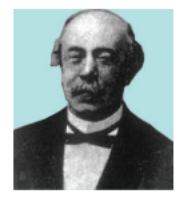

### 7.1 அறிமுகம் (Introduction)

#### 7.1.1 ஆரம்பகால முன்னேற்றங்கள் (Early Developments)

வகை நுண்கணிதத்தின் முக்கிய நோக்கமே சிலவற்றை பல நுண்ணியப்பகுதிகளாகப் பகுத்து அதன் மூலம் அவற்றின் மாறுபாடுகளைத் தீர்மானிப்பதாகும். இத்தகு காரணத்தினால்தான் தற்போதைய வகையிடல் கணிதம் உறுநுண்ணளவு வகை நுண்கணிதம் (infinitesimal calculus) என அழைக்கப்பட்டது. அறிவியலின் ஆரம்பகாலத்திலிருந்தே இயற்பியல் மற்றும் வானியல் கணக்குகளில் வகை நுண்கணிதம் பயன்படுத்தப்பட்டது. 18-ஆம் நூற்றாண்டு வரை மேற்கண்ட பயன்பாடுகளுக்காகவே வகை நுண்கணிதம் பயன்பட்டது.

18-ஆம் நூற்றாண்டின் இறுதியில் லேப்லெஸ் மற்றும் லெக்ராஞ்சி விசைகளின் ஆய்வினை வகைநுண்கணிதத்தின் வரம்பிற்குள் கொண்டுவந்த பிறகு வகைநுண்கணிதம் புதிய பரிமாணத்தை அடைந்தது.

வகையிடல் பயன்பாட்டின் வளர்ச்சிக்கு லெஜூனே ட்ரிச்லெட், ரீமன், வொன் நியூமென், ஹெய்ன், க்ரோனெகர், லிபிட்சு, கிறிஸ்டோபெல், கிர்க்ஹாஃப், பெல்ட்ராமி மற்றும் பல இயற்பியல் அறிஞர்கள் முக்கிய பங்கு வகித்தனர்.

- வடிவியல் மற்றும் இயக்கவியலில் வகை நுண்கணிதம் பயன்படுத்தப்படுகிறது.

- பொருட்களின் மதிப்பு, திறன், பொருட்களின் இருப்பு, இலாபம் போன்றவற்றின் சார்புகளை வகையிட்டு எழுதுவதால் அவற்றின் ஓரியல்புத்தன்மையையும், அறுதி மதிப்புகளையும் தீர்மானிக்கலாம்.

- பொறியியல் மற்றும் அறிவியல் துறைகளில் உள்ள கணித மாதிரிகளில் சார்பின் வகையிடல் குறிப்பிடத்தக்க பங்கு வகிக்கிறது.

- சமூக அறிவியல் மற்றும் மருத்துவத் துறையிலிலும் வகை நுண்கணிதத்தின் பயன்பாடு உள்ளது.

சார்பு $f(x)$ –ன் முதலிரண்டு வகைக் கெழுக்களை மட்டும் பயன்படுத்தி, இந்த அத்தியாயத்தில், $y = f(x)$ என்ற சார்பின் இயல்பு, வளைவரையை வரைதல், மற்றும் $f(x)$ –ன் இடஞ்சார் அறுதி மதிப்பு (பெருமம் அல்லது சிறுமம்) போன்றவை தீர்மானிக்கப்படுகின்றன. மேலும், $f(x)$ –ன் சில உயர் வகைக்கெழுக்களை (அவை இருந்தால் மட்டுமே) பயன்படுத்தி, ஒரு புள்ளியைப் பொறுத்து $f(x)$ –ஐ தொடராக விரிவாக்கம் செய்தல் போன்றவையும் ஆராயப்படுகிறது.

### கற்றலின் நோக்கங்கள்

இந்த அத்தியாயத்தின் முடிவில் மாணவர்கள் பின்வருவனவற்றை அறிந்திருப்பர்.

- வடிவியல் கணக்குகளுக்கு வகையிடலைப் பயன்படுத்துதல்

- நடைமுறை கணக்குகளுக்கு வகையிடலைப் பயன்படுத்துதல்

- வளைவரையின் இயல்புகளான ஓரியல்புத்தன்மை, குழிவுத்தன்மை, மற்றும் குவிவுத்தன்மை போன்றவற்றை இனங்காண பயன்படுகின்றது.

- தினசரி வாழ்க்கையில் அறுதிமதிப்பு காண வகைக்கெழுக்களைப் பயன்படுத்துதல்.

- பல்லுறுப்புக் கோவை மற்றும் பல்லுறுப்புக் கோவை அல்லாத சார்புகளின் வளைவரைகளை வரைதல்.