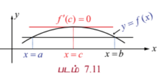
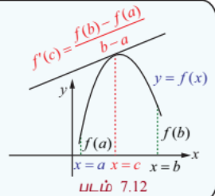
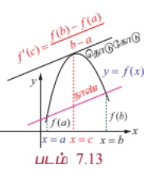

### 7.3 சராசரி மதிப்புத் தேற்றம் (Mean Value Theorem)

ஒரு வளைவரையின் நாணுக்கு இணையாக வரையப்படும் ஒரு தொடுகோட்டின் தொடும் புள்ளி, நாணின் முனைப்புள்ளிகளுக்கு இடையே அமையும் என்பதை சராசரி மதிப்புத் தேற்றம் உறுதி செய்கிறது. நாம் இப்பாடப்பகுதியை இடைநிலை மதிப்புத் தேற்றத்தின் வரையரையிலிருந்து தொடங்கலாம்.

#### தேற்றம் 7.1 (இடைநிலை மதிப்புத் தேற்றம்)

$f(x)$ என்ற சார்பு மூடிய இடைவெளி $[a, b]$-ல் தொடர்ச்சியாக உள்ளது எனவும் $f(a)$ மற்றும் $f(b)$ -க்கு இடையில் ( $f(a)$ மற்றும் $f(b)$ உள்ளடங்கியது) $c$ என்ற ஏதேனும் ஒரு எண் உள்ளது எனில், $[a, b]$ என்ற மூடிய இடைவெளியில் குறைந்தபட்சம் $x$ என்ற ஒரு எண்ணையாவது $f(x) = c$ என்றவாறு காணலாம்.

---

#### 7.3.1 ரோலின் தேற்றம் (Rolle's Theorem)

##### தேற்றம் 7.2 (ரோலின் தேற்றம்)

$f(x)$ என்ற சார்பு மூடிய இடைவெளி $[a, b]$-ல் தொடர்ச்சியானதாகவும், திறந்த இடைவெளி $(a, b)$ -ல் வகையிடத்தக்கதாகவும் இருக்கிறது மேலும் $f(a) = f(b)$ எனில், குறைந்தபட்சம் ஒரு புள்ளி $c \in (a, b)$ ஆனது $f'(c) = 0$ என்றவாறு இருக்கும்.

$x = a$ -யில் இருந்து $x = b$ வரை ஒரு தொடுகோடானது வளைவரை மீது படம் 7.11-ல் உள்ளவாறு நகர்ந்தால் $c \in (a, b)$ என்ற எண்ணினை $c$-யில் வரையப்படும் தொடுகோடு $x$ -அச்சிற்கு இணையாக உள்ளவாறு காணலாம்.

---

### எடுத்துக்காட்டு 7.19

$f(x) = x(x - 1)(x - 2)$, $x \in [0, 1]$ என்ற சார்பிற்கு ரோலின் தேற்றத்தை நிறைவு செய்யும் $c$ -ன் மதிப்பைக் கணக்கிடுக.

#### தீர்வு

$f(x)$ என்பது மூடிய இடைவெளி $[0, 1]$ -ல் தொடர்ச்சியானதாகவும், திறந்த இடைவெளி $(0, 1)$ -ல் வகையிடத்தக்கதாகவும், மேலும் $f(0) = f(1) = 0$ ஆகவும் உள்ளது.

இப்பொழுது, $f'(x) = (x - 1)(x - 2) + x(x - 2) + x(x - 1) = 3x^2 - 6x + 2$.

எனவே, $f'(c) = 0 \Rightarrow 3c^2 - 6c + 2 = 0$

$$\Rightarrow c = \frac{6 \pm \sqrt{36 - 24}}{6} = \frac{6 \pm 2\sqrt{3}}{6} = 1 \pm \frac{\sqrt{3}}{3}$$

$\Rightarrow c = 1 \pm \frac{1}{\sqrt{3}}$

$1 + \frac{1}{\sqrt{3}} \notin (0, 1)$, எனவே $c = 1 - \frac{1}{\sqrt{3}} \in (0, 1)$.

---

### எடுத்துக்காட்டு 7.20

$f(x) = x + \frac{1}{x}$, $x \in \left[\frac{1}{2}, 2\right]$ என்ற சார்பிற்கு $\left[\frac{1}{2}, 2\right]$ என்ற இடைவெளியில் ரோலின் தேற்றத்தை நிறைவுச் செய்யும் மதிப்பை காண்க.

#### தீர்வு

$f(x)$ என்பது மூடிய இடைவெளி $\left[\frac{1}{2}, 2\right]$ -ல் தொடர்ச்சியானதாகவும், திறந்த இடைவெளி $\left(\frac{1}{2}, 2\right)$ -ல் வகையிடத்தக்கதாகவும், மேலும் $f\left(\frac{1}{2}\right) = \frac{5}{2} = f(2)$ ஆகவும் உள்ளது. எனவே ரோலின் தேற்றப்படி $c \in \left(\frac{1}{2}, 2\right)$ என்ற எண்ணினை $f'(c) = 0$ எனுமாறு காணலாம்.

இப்பொழுது,

$$f'(x) = 1 - \frac{1}{x^2}$$

$$f'(c) = 0 \Rightarrow 1 - \frac{1}{c^2} = 0 \Rightarrow c = \pm 1$$

$c = -1 \notin \left(\frac{1}{2}, 2\right)$, $c = 1 \in \left(\frac{1}{2}, 2\right)$ எனவே $c = 1$ என தேர்ந்தெடுக்கலாம்.

---

### எடுத்துக்காட்டு 7.21

$f(x) = \log\left(\frac{x^2 - 6}{5}\right)$ என்ற சார்பிற்கு $[2, 3]$ என்ற இடைவெளியில் ரோலின் தேற்றத்தை நிறைவு செய்யும் $c$ -ன் மதிப்பைக் கணக்கிடுக.

#### தீர்வு

$f(x)$ என்ற சார்பு மூடிய இடைவெளி $[2, 3]$-ல் தொடர்ச்சியானதாகவும், திறந்த இடைவெளி $(2, 3)$ -ல் வகையிடத்தக்கதாகவும், மற்றும் $f(2) = 0 = f(3)$ ஆகவும் உள்ளது.

இப்பொழுது,

$$f'(x) = \frac{2x}{x^2 - 6}$$

எனவே, $f'(c) = 0 \Rightarrow \frac{2c}{c^2 - 6} = 0 \Rightarrow c = 0$

$0 \notin (2, 3)$. எனவே, ரோலின் தேற்றத்தை நிறைவு செய்யும் $c$ -ன் மதிப்பு இல்லை.

---

ரோலின் தேற்றத்தினை ஒரு இயற்கணிதச் சமன்பாட்டிற்கு கொடுக்கப்பட்ட இடைவெளியில் எத்தனை தீர்வுகள் இருக்கும் என்பதனை சமன்பாட்டைத் தீர்க்காமல் காணவும் பயன்படுத்தலாம்.

---

### எடுத்துக்காட்டு 7.22

$x^4 - 3x^2 + 2 = 0$ என்ற சமன்பாட்டைத் தீர்க்காமல் $(0, 1)$ என்ற இடைவெளியில் ஒரே ஒரு தீர்வுதான் இருக்கும் எனக்காட்டு.

#### தீர்வு

$f(x) = x^4 - 3x^2 + 2$ என்க. $f(x)$ ஆனது $[0, 1]$ -ல் தொடர்ச்சியானதாகவும், $(0, 1)$ -ல் வகையிடத்தக்கதாகவும் உள்ளது.

இப்பொழுது $f'(x) = 4x^3 - 6x = 2x(2x^2 - 3)$. $f'(x) = 0$ எனில், $x = 0, \pm \sqrt{\frac{3}{2}}$.

எனவே, $f'(x) < 0, \forall x \in (0, 1)$.

எனவே, ரோலின் தேற்றத்தின்படி $a, b \in (0, 1)$ என்ற எண்களை $f(a) = f(b) = 0$ எனுமாறு காண இயலாது. ஆனால் $f(0) = 2 > 0$ மற்றும் $f(1) = 0$ என்பதில் இருந்து $y = f(x)$ ஆவது இடைநிலை மதிப்பு தேற்றப்படி, 0 மற்றும் 1-க்கு இடையில் ஒரே ஒரு முறை $x$ -அச்சை வெட்டும். எனவே, $x^4 - 3x^2 + 2 = 0$ என்ற சமன்பாட்டிற்கு $(0, 1)$ என்ற இடைவெளியில் ஒரே ஒரு தீர்வுதான் இருக்கும்.

---

ரோலின் தேற்றத்தின் பயன்பாடாக கீழ்க்கண்டதை நாம் பெறலாம்.

---

### எடுத்துக்காட்டு 7.23

ரோலின் தேற்றப்படி $a_nx^n + a_{n-1}x^{n-1} + \cdots + a_0$ என்ற பல்லுறுப்புக் கோவையின் இரு வேறு மெய் பூச்சியமாக்கிகளுக்கு இடையில் $na_nx^{n-1} + (n-1)a_{n-1}x^{n-2} + \cdots + a_1$ என்ற பல்லுறுப்புக் கோவையின் ஒரு பூச்சியமாக்கி அமையும் என நிறுவுக.

#### தீர்வு

$P(x) = a_nx^n + a_{n-1}x^{n-1} + \cdots + a_0$ என்க. $\alpha, \beta$ என்பன $P(x)$ -ன் பூச்சியமாக்கிகள் என்க. எனவே, $P(\alpha) = P(\beta) = 0$. $P(x)$ ஆனது $[\alpha, \beta]$-ல் தொடர்ச்சியாகவும், திறந்த இடைவெளி $(\alpha, \beta)$ -ல் வகையிடத்தக்கதாகவும் இருப்பதால் ரோலின் தேற்றப்படி $c \in (\alpha, \beta)$ ஆனது $P'(c) = 0$ எனுமாறு காணலாம்.

$$P'(x) = na_nx^{n-1} + (n-1)a_{n-1}x^{n-2} + \cdots + a_1$$

என்பதிலிருந்து தேற்றம் நிரூபணமாகிறது.

---

### எடுத்துக்காட்டு 7.24

$x^4 - 6x^3 + 11x^2 - 12x + 42 = 8$ என்ற பல்லுறுப்புக் கோவையின் பூச்சியமாக்கிகள் 2 மற்றும் 7 எனில், $2x^3 - 9x^2 + 11x - 12$ என்ற பல்லுறுப்புக் கோவையின் ஒரு பூச்சியம் $(2, 7)$ என்ற இடைவெளியில் அமையும் என நிறுவுக.

#### தீர்வு

$P(x) = x^4 - 6x^3 + 11x^2 - 12x + 34$ என்ற பல்லுறுப்புக் கோவைக்கு $\alpha = 2, \beta = 7$ எனக்கொண்டு எடுத்துக்காட்டு 7.23-ன் முடிவைப் பயன்படுத்த வேண்டும்.

இப்பொழுது,

$$P'(x) = 4x^3 - 18x^2 + 22x - 12 = 2(2x^3 - 9x^2 + 11x - 6)$$

இதிலிருந்து $2x^3 - 9x^2 + 11x - 6 = 0$ என்ற பல்லுறுப்புக் கோவையின் ஒரு பூச்சியம் $(2, 7)$ என்ற இடைவெளியில் அமையும் என நிறுவலாம்.

$Q(x) = 2x^3 - 9x^2 + 11x - 6$ என்க.

சரிபார்த்தல்,

$Q(2) = 16 - 36 + 22 - 6 = -4 \neq 0$

$Q(7) = 686 - 441 + 77 - 6 = 316 \neq 0$

இதிலிருந்து $Q(x)$ என்ற பல்லுறுப்புக் கோவையின் ஒரு பூச்சியம் $(2, 7)$ என்ற இடைவெளியில் அமையும் என்கிறோம்.

---

#### குறிப்புரை

ரோலின் தேற்றத்தைப் பயன்படுத்த இயலாத சார்புகள்

(1) $f(x) = |x|, x \in [-1, 1]$ என்ற சார்பு $f(-1) = f(1)$ என இருந்த போதிலும் ரோலின் தேற்றத்தைப் பயன்படுத்த இயலாது. ஏன் எனில் $x = 0$ -வில் $f(x)$ வகையிடத்தக்கதல்ல.

(2) $f(x) = \begin{cases} x, & 0 \le x < 1 \\ 0, & x = 1 \end{cases}$ என்ற சார்பு $f(0) = 0 = f(1)$ என இருந்த போதிலும் ரோலின் தேற்றத்தைப் பயன்படுத்த இயலாது. ஏன் எனில் $f(x)$ ஆனது $x = 0$ -வில் தொடர்ச்சியானது இல்லை.

(3) $f(x) = \sin x, x \in \left[0, \frac{\pi}{2}\right]$ என்ற சார்பு, மூடிய இடைவெளி $\left[0, \frac{\pi}{2}\right]$ -ல் தொடர்ச்சியாகவும், திறந்த இடைவெளி $\left(0, \frac{\pi}{2}\right)$ -ல் வகையிடத்தக்கதாக இருந்தாலும் $f(0) \neq f\left(\frac{\pi}{2}\right)$ என்பதால் ரோலின் தேற்றத்தைப் பயன்படுத்த இயலாது.

---

$f(x)$ ஆனது மூடிய இடைவெளி $[a, b]$-ல் தொடர்ச்சியானதாகவும், திறந்த இடைவெளி $(a, b)$ -ல் வகையிடத்தக்கதாகவும் இருந்து $f(a) \neq f(b)$ என இருக்கும் நிலையிலும் ரோலின் தேற்றத்தை கீழ்க்கண்டவாறு பொதுமைப்படுத்தலாம்.

---

#### 7.3.2 லெக்ராஞ்சியின் சராசரி மதிப்புத் தேற்றம் (Lagrange's Mean Value Theorem)

##### தேற்றம் 7.3

$f(x)$ ஆனது மூடிய இடைவெளி $[a, b]$-ல் தொடர்ச்சியானதாகவும், திறந்த இடைவெளி $(a, b)$ -ல் வகையிடத்தக்கதாகவும் ($f(a), f(b)$ ஆகியவை சமமாக இருக்க வேண்டிய அவசியம் இல்லை) உள்ளது என்க. அப்போது குறைந்தபட்சம் ஒரு புள்ளி $c \in (a, b)$ -யினை

$$f'(c) = \frac{f(b) - f(a)}{b - a}$$

... (6)

எனுமாறு காணலாம்.

#### குறிப்புரை

$f(a) = f(b)$ எனில் லெக்ராஞ்சியின் சராசரி மதிப்புத் தேற்றம் ரோலின் தேற்றத்தைத் தரும். லெக்ராஞ்சியின் சராசரி மதிப்புத் தேற்றத்தினை **சுழன்ற ரோலின் தேற்றம்** என்கிறோம்.

#### குறிப்புரை

இத்தேற்றத்தின் உள்ளார்ந்த விளக்கமானது $(a, b)$ என்ற இடைவெளியில் $f(x)$ -ன் சராசரி மாறுவீதத்தை $\frac{f(b) - f(a)}{b - a}$ -யும் மற்றும் $c$-யில் கணநேர மாறுவீதத்தை $f'(c)$ யும் குறிக்கிறது.

லெக்ராஞ்சியின் இடைமதிப்புத் தேற்றத்தின் வடிவக் கணித விளக்கமானது ஒரு இடைவெளியில் சராசரி மாறுபாட்டு வீதமானது, அந்த இடைவெளியின் உள்ளிருக்கும் ஒரு புள்ளியில் கணநேர மாறுவீதத்திற்குச் சமமாக இருக்கும். இதனை கீழ்க்கண்ட எடுத்துக்காட்டின் மூலம் உணரலாம்.

ஒரு மகிழுந்தானது 200 மீ தூரத்தை 8 வினாடி காலத்தில் கடக்கிறது எனில் இதன் சராசரி திசைவேகம் $\frac{200}{8} = 25$ மீ/வி ஆகும். இந்த 8 வினாடி கால இடைவெளியினுள் ஏதேனும் ஒரு நேரத்தில் மகிழுந்தின் வேகம் காட்டும் கருவி சரியாக 25 மீ/வி அதாவது 90 கி.மீ/மணியினைக் காட்டும் என்பதை சராசரி மதிப்புத் தேற்றம் உறுதி செய்கின்றது.

---

#### தேற்றம் 7.4

$f(x)$ என்ற சார்பானது மூடிய இடைவெளி $[a, b]$-ல் தொடர்ச்சியானதாகவும், திறந்த இடைவெளி $(a, b)$ -ல் வகையிடத்தக்கதாகவும் மற்றும் $f'(x) > 0, \forall x \in (a, b)$ ஆகவும் இருந்தால், $x_1, x_2 \in [a, b]$ -க்கு, $x_1 < x_2$ எனில் $f(x_1) < f(x_2)$ ஆகும்.

#### நிரூபணம்

சராசரி மதிப்புத் தேற்றப்படி, $c \in (x_1, x_2) \subseteq (a, b)$ ஆனது

$$\frac{f(x_2) - f(x_1)}{x_2 - x_1} = f'(c)$$

என்றவாறு காணலாம்.

$f'(c) > 0$, மற்றும் $x_2 - x_1 > 0$ என்பதால் $f(x_2) - f(x_1) > 0$ ஆகும்.

இதிலிருந்து நாம் $x_1 < x_2$ எனில் $f(x_1) < f(x_2)$ எனப் பெறலாம்.

#### குறிப்புரை

$f'(x) < 0, \forall x \in (a, b)$ மற்றும் $x_1, x_2 \in [a, b]$ -க்கு $x_1 < x_2$ எனில் $f(x_1) > f(x_2)$ ஆகும். இதனையும் மேற்கண்ட முறையிலேயே நிறுவலாம்.

---

### எடுத்துக்காட்டு 7.25

$f(x) = x^2 - 2x$, $1 \le x \le 2$ என்ற சார்பிற்கு $(1, 2)$ என்ற இடைவெளியில் சராசரி மதிப்புத் தேற்றத்தை நிறைவு செய்யும் மதிப்பினைக் காண்க.

#### தீர்வு

$f(x)$ ஆனது கொடுக்கப்பட்ட இடைவெளியில் வரையறுக்கப்பட்டு மற்றும் $1 < x < 2$ என்ற இடைவெளியில் வகையிடத்தக்கதாகவும் உள்ளது. மேலும் $f(1) = -1$ மற்றும் $f(2) = 0$. எனவே, சராசரி மதிப்புத் தேற்றப்படி $c \in (1, 2)$ ஆனது

$$f'(c) = \frac{f(2) - f(1)}{2 - 1} = 1$$

என்று இருக்கும்.

அதாவது, $2c - 2 = 1 \Rightarrow c = \frac{3}{2}$.

---

#### வடிவ கணித விளக்கம்

$y = f(x)$ என்ற வளைவரைக்கு சராசரி மதிப்புத் தேற்றத்தின் வடிவ கணித விளக்கமானது முனைப்புள்ளிகள் $x = a$ மற்றும் $x = b$ வழியே செல்லும் நாணுக்கு இணையாக ஒரு தொடுகோட்டின் தொடும் புள்ளியினை $c \in (a, b)$ என்றவாறு காண இயலும்.

---

### லெக்ராஞ்சியின் சராசரி மதிப்புத் தேற்றத்தின் விளைவுகள்

சராசரி மதிப்புத் தேற்றத்தின் வாயிலாக நாம் கீழ்க்காணும் மூன்று முக்கிய முடிவுகளைப் பெறலாம்.

(1) கொடுக்கப்பட்ட சார்பின் ஓரியல்புத் தன்மையை தீர்மானம் செய்ய பயன்படுகிறது. (தேற்றம் 7.4)

(2) $f'(x) = 0, \forall x \in (a, b)$ எனில், $f$ ஆனது $(a, b)$ -ல் ஒரு மாறிலி ஆகும்.

(3) $f'(x) = g'(x) \forall x$ எனில், $f(x) = g(x) + C$ ஆகும். (இங்கு $C$ ஏதேனும் ஒரு மாறிலி)

---

#### 7.3.3 பயன்பாடுகள் (Applications)

---

### எடுத்துக்காட்டு 7.26

ஒரு சுமை ஊர்தி சுங்கச் சாவடி சாலையில் மணிக்கு 80 கி.மீ வேகத்தில் செல்கிறது. அந்த சுமை ஊர்தி 2 மணி நேரத்தில் 164 கி.மீ பயணத்தை நிறைவு செய்கிறது. சுங்கச் சாவடி சாலை முடிவில் வேகக் கட்டுப்பாட்டை மீறியதற்கான அத்தாட்சி சீட்டு ஓட்டுனருக்கு வழங்கப்படுகின்றது. அவர் வேகக் கட்டுப்பாட்டை மீறியதை சராசரி மதிப்புத் தேற்றத்தின் துணை கொண்டு நியாயப்படுத்துக.

#### தீர்வு

$t$ மணிநேரத்தில் ஓட்டுனர் கடந்த தொலைவு $f(t)$ என்க. $f(t)$ ஆனது $[0, 2]$ -ல் தொடர்ச்சியானது மற்றும் $(0, 2)$ -ல் வகையிடத்தக்கது. மேலும், $f(0) = 0$ மற்றும் $f(2) = 164$. சராசரி மதிப்புத் தேற்றத்தைப் பயன்படுத்த, $c$ என்ற காலத்தை

$$f'(c) = \frac{164 - 0}{2 - 0} = 82 > 80$$

எனுமாறு காணலாம்.

எனவே, அந்த 2 மணி நேரத்தில் ஏதேனும் ஒரு கண நேரத்தில் அந்த ஓட்டுநர் 80 கி.மீ./மணி வேகத்தில் பயணம் செய்திருக்க வேண்டும். ஆகவே, அவருக்கு வேகக் கட்டுப்பாட்டை மீறியதற்கான அத்தாட்சி சீட்டு வழங்கியது நியாயமே.

---

### எடுத்துக்காட்டு 7.27

$f(x)$ என்ற வகையிடத்தக்க சார்பு $f'(x) \le 29$ மற்றும் $f(2) = 17$ என்றவாறு உள்ளது எனில், $f(7)$ -ன் அதிகபட்ச மதிப்பினைக் காண்க.

#### தீர்வு

சராசரி மதிப்புத் தேற்றப்படி $c \in (2, 7)$ -ஐ

$$\frac{f(7) - f(2)}{7 - 2} = f'(c) \le 29$$

எனக் காணலாம்.

ஆகவே, $f(7) \le 5(29) + 17 = 162$

எனவே, $f(7)$ -ன் அதிகபட்ச மதிப்பு 162 ஆகும்.

---

### எடுத்துக்காட்டு 7.28

சராசரி மதிப்புத் தேற்றத்தைப் பயன்படுத்தி,

$$|\sin \alpha - \sin \beta| \le |\alpha - \beta|, \quad \alpha, \beta \in \mathbb{R}$$

என நிறுவுக.

#### தீர்வு

$f(x) = \sin x$ என்பது அனைத்து திறந்த இடைவெளியிலும் வகையிடத்தக்கதாகும். மூடிய இடைவெளி $[\alpha, \beta]$-வை கருதுக. சராசரி மதிப்புத் தேற்றத்தைப் பயன்படுத்த $c \in (\alpha, \beta)$ -ஐ

$$\frac{\sin \beta - \sin \alpha}{\beta - \alpha} = f'(c) = \cos(c)$$

எனக் காணலாம்.

எனவே,

$$\left|\frac{\sin \beta - \sin \alpha}{\beta - \alpha}\right| = |\cos(c)| \le 1$$

ஆகவே, $|\sin \alpha - \sin \beta| \le |\alpha - \beta|$.

#### குறிப்புரை

$\beta = 0$ எனக் கொண்டால், $|\sin \alpha| \le |\alpha|$ என கிடைக்கும்.

---

### எடுத்துக்காட்டு 7.29

ஒரு உறைவிப்பானில் இருந்து ஒரு வெப்ப நிலைமானி எடுக்கப்பட்டு கொதிக்கும் நீரில் வைக்கப்பட்டது. $-10^\circ$ C-லிருந்து $100^\circ$C-க்கு உயர்த்த வெப்பநிலைமானிக்கு 22 வினாடிகள் ஆகிறது. ஏதேனும் ஒருநேரம் $t$-யில் வெப்பநிலை மாறுபாட்டு வீதம் $5^\circ$C / வினாடி ஆக இருக்கும் எனக்காட்டுக.

#### தீர்வு

$t$ என்ற நேரத்தில் வெப்பநிலையை $f(t)$ என்க. சராசரி மதிப்புத் தேற்றத்தின்படி,

$$f'(c) = \frac{f(b) - f(a)}{b - a} = \frac{100 - (-10)}{22} = \frac{110}{22} = 5^\circ\text{C / வினாடி}$$

ஆகவே, ஏதேனும் ஒரு நேரம் $t$-யில் வெப்பநிலை மாறுபாட்டு வீதம் $5^\circ$C/வினாடி ஆகும்.

---

### பயிற்சி 7.3

1. கொடுக்கப்பட்ட சார்புகளுக்கு கொடுக்கப்பட்ட இடைவெளியில் ரோலின் தேற்றம் ஏன் பயன்படுத்த முடியாது என்பதை விளக்குக.

   (i) $f(x) = \frac{1}{x}, x \in [-1, 1]$

   (ii) $f(x) = \tan x, x \in [0, \pi]$

   (iii) $f(x) = \log(2x^2 + 2), x \in [2, 7]$

2. ரோலின் தேற்றத்தைப் பயன்படுத்தி கீழ்க்காணும் சார்புகளுக்கு $x$ -ன் எம்மதிப்புகளில் வரையப்படும் தொடுகோடு $x$ -அச்சிற்கு இணையாக இருக்கும்?

   (i) $f(x) = x^2 - 2x, x \in [0, 1]$

   (ii) $f(x) = \frac{x^2 - 2x - 2}{x - 2}, x \in [1, 3]$

   (iii) $f(x) = \sqrt{x} - \frac{x}{3}, x \in [0, 9]$

3. கொடுக்கப்பட்ட சார்புகளுக்கு கொடுக்கப்பட்ட இடைவெளியில் லெக்ராஞ்சியின் சராசரி மதிப்புத் தேற்றம் ஏன் பயன்படுத்த முடியாது என்பதை விளக்குக.

   (i) $f(x) = \frac{x}{x - 1}, x \in [1, 2]$

   (ii) $f(x) = |3x - 1|, x \in [-1, 3]$

4. லெக்ராஞ்சியின் சராசரி மதிப்புத் தேற்றத்தைப் பயன்படுத்தி கொடுக்கப்பட்ட சார்புகளுக்கு கொடுக்கப்பட்ட இடைவெளியின் முனைப்புள்ளிகள் வழியே செல்லும் நாணுக்கு இணையாக ஒரு தொடுகோட்டின் தொடும் புள்ளியின் $x$ -ன் மதிப்பைக் காண்க.

   (i) $f(x) = x^3 - 3x^2 - 2x, x \in [2, 2]$

   (ii) $f(x) = (x - 2)(x - 7), x \in [3, 11]$

5. (i) $f(x) = \frac{1}{x}$ என்ற சார்பிற்கு $[a, b]$-யை மிகை முழு எண்களாக கொண்ட மூடிய இடைவெளி $[a, b]$-ல் சராசரி மதிப்புத் தேற்றத்தின்படி இறுதி மதிப்பு $\sqrt{ab}$ என நிறுவுக.

   (ii) $f(x) = Ax^2 + Bx + C$ என்ற சார்பிற்கு எந்த ஒரு மூடிய இடைவெளி $[a, b]$-ல் சராசரி மதிப்புத் தேற்றத்தின்படி இறுதி மதிப்பு $\frac{a + b}{2}$ என நிறுவுக.

6. ஒரு பந்தய மகிழுந்து ஓட்டுநர் 20-வது கிலோமீட்டர்கல்லில் இருக்கிறார். அவரது மகிழுந்தின் வேகம் 150 கி.மீ/மணி-யை எப்பொழுதும் தாண்டவில்லை எனில், அடுத்த இரண்டு மணி நேரத்தில் அவர் கடக்கும் அதிகபட்ச கி.மீ கல் என்ன?

7. $f(x)$ என்ற சார்பானது, $f'(x) \le 1, 1 \le x \le 4$ எனில், $f(4) - f(1) \le 3$ எனக்காட்டுக.

8. $f(x)$ என்ற வகையிடத்தக்க சார்பானது $f(0) = 1, f(4) = 2$ மற்றும் $f'(x) \le 2$ $\forall x$ என்றவாறு இருக்க முடியுமா? உனது பதிலுக்கு தகுந்த விளக்கம் தருக.

9. $f(x) = x(x - 3)e^x$, $x \in [-3, 0]$ என்ற வளைவரைக்கு $x$ -அச்சிற்கு இணையாக வரையப்படும் தொடுகோட்டின் தொடும் புள்ளியின் $x$ -மதிப்பு $(-3, 0)$ என்ற இடைவெளியில் அமையும் என நிறுவுக.

10. சராசரி மதிப்புத் தேற்றத்தைப் பயன்படுத்தி $|e^a - e^b| \le e^b|a - b|$, $a > b > 0$ என நிறுவுக.