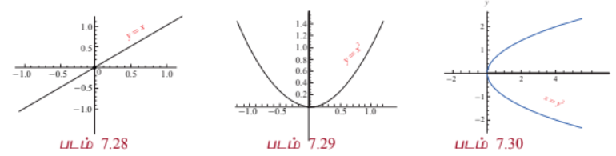
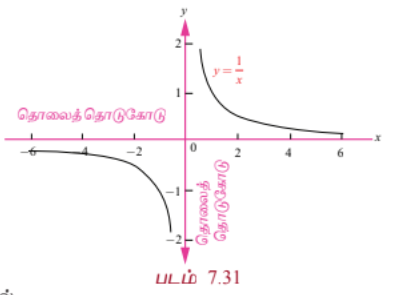
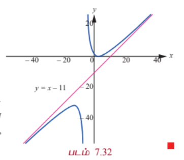
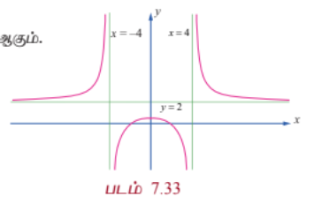

### 7.9 சமச்சீர் தன்மை மற்றும் தொலைத் தொடுகோடுகள்
### (Symmetry and Asymptotes)

#### 7.9.1 சமச்சீர் தன்மை (Symmetry)

கீழ்க்காணும் வளைவரைகள் ஒவ்வொன்றும் ஒரு சிறப்புப் பண்பை அதாவது சமச்சீர் பண்பை ஒரு புள்ளியைப் பொருத்தோ அல்லது ஒரு கோட்டை பொருத்தோ பெற்றிருப்பதைக் கவனிக்க.

நாம் இப்பொழுது முறையாக சமச்சீர் தன்மையை கீழ்க்காணுமாறு வரையறுப்போம்:

ஒரு படம் அல்லது ஒரு வளைவரை ஒரு கோட்டைப் பொறுத்து மற்றொரு படத்தின் பிரதிபலிப்பாக இருந்தால், அந்தக் கோட்டைப் பொருத்து படம் அல்லது வளைவரை **சமச்சீர்** தன்மையை பெற்றுள்ளது என்கிறோம்.

ஒரு வளைவரை ஒரு புள்ளியைப் பொருத்து $\theta$ கோணச் சுழற்சியால் வளைவரை மாறாமல் இருந்தால் அந்த வளைவரை அப்புள்ளியைப் பொருத்து $\theta$ கோணச் சமச்சீர் கொண்டது என்கிறோம்.

ஒரு வளைவரை பல கோடுகளைப் பொருத்து சமச்சீர் கொண்டதாக இருக்கலாம். குறிப்பாக, நாம் ஆய அச்சுகளுடன் சமச்சீர் தன்மை மற்றும் ஆதியைப் பொருத்து சமச்சீர் தன்மை ஆகியவற்றை கருதுவோம். கணிதத்தின் வாயிலாக, ஒரு வளைவரை $f(x, y) = 0$ ஆனது

- $y$-அச்சைப் பொருத்து சமச்சீர்: $f(x, y) = f(-x, y)$ $\forall x, y$ எனில் வளைவரை $y$-அச்சைப் பொருத்து சமச்சீர் ஆகும் அல்லது $(x, y)$ ஆனது வளைவரையின் மீதுள்ள புள்ளி எனில் $(-x, y)$ -யும் வளைவரை மீது இருந்தால் வளைவரை $y$-அச்சைப் பொருத்து சமச்சீர் ஆகும். நாம் $y$-அச்சில் ஒரு கண்ணாடியை வைத்தால், கண்ணாடியின் ஒரு பக்கத்தில் உள்ள வளைவரையின் பகுதியும் கண்ணாடியின் மறுபக்கத்தில் உள்ள வளைவரையின் பகுதியும் ஒன்றைப் போலவே இருக்கும்.

- $x$-அச்சைப் பொருத்து சமச்சீர்: $f(x, y) = f(x, -y)$ $\forall x, y$ எனில் வளைவரை $x$ -அச்சைப் பொருத்து சமச்சீர் ஆகும் அல்லது $(x, y)$ ஆனது வளைவரையின் மீதுள்ள புள்ளி எனில் $(x, -y)$-யும் வளைவரை மீது இருந்தால் வளைவரை $x$ -அச்சைப் பொருத்து சமச்சீர் ஆகும். நாம் $x$ -அச்சில் ஒரு கண்ணாடியை வைத்தால், கண்ணாடியின் ஒரு பக்கத்தில் உள்ள வளைவரையின் பகுதியும் கண்ணாடியின் மறுபக்கத்தில் உள்ள வளைவரையின் பகுதியும் ஒன்றைப் போலவே இருக்கும்.

- ஆதியைப் பொருத்து சமச்சீர்: $f(x, y) = f(-x, -y)$ $\forall x, y$ எனில் வளைவரை ஆதியைப் பொருத்து சமச்சீர் ஆகும் அல்லது $(x, y)$ ஆனது வளைவரையின் மீதுள்ள புள்ளி எனில் $(-x, -y)$ -யும் வளைவரை மீது இருந்தால் வளைவரை ஆதியைப் பொருத்து சமச்சீர் ஆகும். அதாவது ஆதியைப் பொருத்து $180^\circ$ சுழற்றும்போது வளைவரை மாறாது.

உதாரணமாக, மேற்கண்ட வளைவரைகள் $xy = 1$, $y = x^2$, மற்றும் $y = x^3$ ஆகியவை முறையே $x$-அச்சு, $y$-அச்சு, மற்றும் ஆதியைப் பொருத்து சமச்சீர் தன்மை கொண்டவை ஆகும்.

---

#### 7.9.2 தொலைத் தொடுகோடுகள் (Asymptotes)

$y = f(x)$ என்ற வளைவரையை $\infty$-யில் தொடும் தொடுகோடு, **தொலைத் தொடுகோடு** ஆகும். அதாவது வளைவரை மீதுள்ள புள்ளி கந்தழியை நெருங்கும்போது வளைவரைக்கும் கோட்டிற்கும் இடைப்பட்ட தூரம் பூச்சியத்தை நெருங்கும் வகையில் உள்ள கோடு தொலைத் தொடுகோடு ஆகும்.

தொலைத் தொடுகோடுகள் மூன்று வகைப்படும். அவையாவன

1. **கிடைமட்டத் தொலைத் தொடுகோடு**, என்பது $x$ -அச்சிற்கு இணையானதாகும். $y = f(x)$ என்ற வளைவரைக்கு $\lim_{x \to \infty} f(x) = L$ அல்லது $\lim_{x \to -\infty} f(x) = L$ எனில் $y = L$ என்ற கோடு கிடைமட்டத் தொலைத் தொடுகோடு ஆகும்.

2. **நிலைக்குத்து தொலைத் தொடுகோடு**, என்பது $y$ -அச்சிற்கு இணையானதாகும். $y = f(x)$ என்ற வளைவரைக்கு $\lim_{x \to a^-} f(x) = \pm\infty$ அல்லது $\lim_{x \to a^+} f(x) = \pm\infty$ எனில் $x = a$ என்ற கோடு நிலைக்குத்து தொலைத் தொடுகோடு ஆகும்.

3. **சாய்ந்த தொலைத் தொடுகோடு**, ஒரு சாய்ந்த தொலைத் தொடுகோடு தொகுதியில் உள்ள பல்லுறுப்புக் கோவையின் வரிசைப் பகுதியில் உள்ள பல்லுறுப்புக் கோவையின் வரிசையை விட அதிகமாக இருந்தால் வரும்.

சாய்ந்த தொலைத் தொடுகோட்டினைப் பெற நாம் தொகுதியை பகுதியால் வகுத்துப் பெறலாம்.

---

### எடுத்துக்காட்டு 7.66

$f(x) = \frac{1}{x}$ என்ற சார்பின் தொலைத் தொடுகோடுகளைக் காண்க.

#### தீர்வு

$\lim_{x \to 0^+} \frac{1}{x} = \infty$ மற்றும் $\lim_{x \to 0^-} \frac{1}{x} = -\infty$. எனவே, தேவையான நிலைக்குத்து தொலைத் தொடுகோடு $x = 0$ அல்லது $y$ -அச்சு ஆகும்.

இவ்வளைவரையானது இரு ஆய அச்சுகளைப் பொருத்தும் சமச்சீர் தன்மை வாய்ந்தது என்பதால், $y = 0$ அல்லது $x$ -அச்சும் ஒரு தொலைத் தொடுகோடு ஆகும். ஆகவே இவ்வளைவரைக்கு (செவ்வக அதிபரவளையம்) கிடைமட்ட மற்றும் நிலைக்குத்து தொலைத் தொடுகோடுகள் உண்டு.

---

### எடுத்துக்காட்டு 7.67

$f(x) = \frac{x^2 - 6x + 7}{x - 5}$ என்ற சார்பிற்கு சாய்ந்த தொலைத் தொடுகோட்டினைக் காண்க.

#### தீர்வு

தொகுதியில் உள்ள பல்லுறுப்புக் கோவையின் வரிசையானது (வரிசை 2) பகுதியில் உள்ள பல்லுறுப்புக் கோவையின் வரிசையைவிட (வரிசை 1) அதிகம் என்பதால் இதற்கு சாய்ந்த தொலைத் தொடுகோடு உண்டு. இதனைக் காண தொகுதியை பகுதியைக் கொண்டு வகுக்க வேண்டும்.

$$
\begin{array}{r|rrrr}
 & x & -1 \\
\hline
x-5 & x^2 & -6x & +7 \\
 & x^2 & -5x & \\
\hline
 & & -x & +7 \\
 & & -x & +5 \\
\hline
 & & & 2
\end{array}
$$

நாம் இங்கு மீதியைப் பற்றி கவலைப்பட வேண்டியதில்லை. நமக்கு நேர்க்கோட்டினை உருவாக்கும் உறுப்புகள் மட்டுமே அவசியம். எனவே, சாய்ந்த தொலைத் தொடுகோடு $y = x - 1$ ஆகும்.

இந்த வளைவரையின் படத்திலிருந்து, வளைவரையும் சாய்ந்த தொலைத் தொடுகோடு $y = x - 1$-ம் ஒன்றை ஒன்று நெருங்குகிறது. ஆனால் வெட்டுவதில்லை என்பதை கவனிக்க.

---

### எடுத்துக்காட்டு 7.68

$f(x) = \frac{x^2 - 28}{x^2 - 16}$ என்ற வளைவரையின் தொலைத் தொடுகோடுகளைக் காண்க.

#### தீர்வு

$$\lim_{x \to -4^+} \frac{x^2 - 28}{x^2 - 16} = -\infty$$

மற்றும்

$$\lim_{x \to 4^+} \frac{x^2 - 28}{x^2 - 16} = -\infty$$

எனவே, $x = -4$ மற்றும் $x = 4$ ஆகியவை செங்குத்துத் தொலைத் தொடுகோடுகள் ஆகும்.

$$\lim_{x \to \infty} \frac{x^2 - 28}{x^2 - 16} = \lim_{x \to \infty} \frac{1 - \frac{28}{x^2}}{1 - \frac{16}{x^2}} = 1$$

மற்றும்

$$\lim_{x \to -\infty} \frac{x^2 - 28}{x^2 - 16} = \lim_{x \to -\infty} \frac{1 - \frac{28}{x^2}}{1 - \frac{16}{x^2}} = 1$$

என்பதில் இருந்து $y = 1$ என்பது ஒரு கிடைமட்டத் தொலைத் தொடுகோடு ஆகும். நாம் இதனை தொகுதியை பகுதியை கொண்டு வகுத்தும் பெறலாம்.