### 9.1 அறிமுகம் (Introduction)

வடிவியல் பொருட்களின் பரப்பளவையும், கன அளவையையும் கணிக்க வியத்தகுமுறைகளில் கண்டுபிடிப்புகளை அளித்த முன்னோடி கணிதவியலாளர்களில் ஆர்க்கிமிடிஸ் ஒருவர் ஆவார். ஒரு பரவளையம் மற்றும் ஒரு நேர்க்கோட்டால் சூழப்பட்ட பரப்பு உள்வரையப்பட்ட முக்கோணத்தின் பரப்பைப் போல் $\frac{4}{3}$ மடங்கு ஆகும் என்பதை நிரூபித்தார். (படம் 9.1 ஐ காண்க).

அவர் பரப்பை எண்ணற்ற பல கூறுகளாகப் பிரித்து அதன் தொகையைக் கணிப்பது மூலம் பரப்பளவை கணித்தார். இத்தகு எல்லைநிலைக் கோட்பாடு நாம் உருவாக்கப்போகும் வரையறுத்த தொகையின் வரையறையில் உள்ளடங்கி உள்ளது. மேலும் அதன் மூலம் சில வடிவியல் பொருட்களின் பரப்பளவையும் கன அளவையையும் கண்டறிவோம்.

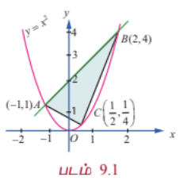

### கற்றலின் நோக்கங்கள்

இப்பாடப்பகுதி நிறைவுறும்போது மாணவர்கள் அறிந்திருக்க வேண்டியவை:

- தொகையிடலை தொகையின் எல்லையாக வரையறுத்தல்

- தொகையிடலை வடிவியல் ரீதியாக செயல் விளக்கமளித்தல்

- தொகையிடலின் அடிப்படைத் தேற்றத்தைப் பயன்படுத்துதல்

- வரையறுத்த தொகையிடலை எதிர் வகையிடலாக மதிப்பிடுதல்

- வரையறுத்த தொகையிடலின் சில பண்புகளை நிறுவுதல்

- முறையற்ற தொகையிடலை இனங்காணுதல் மற்றும் காமா தொகையிடலைப் பயன்படுத்துதல்

- குறைப்புச் சூத்திரம் பயன்படுத்துதல்

- வரையறுத்த தொகையிடலைப் பயன்படுத்தி தளப்பகுதியின் பரப்பளவைக் கண்டறிதல்

- வரையறுத்த தொகையிடலைப் பயன்படுத்தி திடப்பொருள் சுழற்சியின் கன அளவை மதிப்பிடுதல்

---

சிராகுஸைச் சார்ந்த
ஆர்க்கிமெடிஸ்
(288 கி.மு(பொ.ஆ.மு) -
212 கி.மு(பொ.ஆ.மு))
ஒரு கிரேக்க கணிதவியலாளர்,
இயற்பியலாளர், பொறியலாளர்,
கண்டுபிடிப்பாளர்

$x$ | $y$
---|---
$-2$ | $4$
$-1$ | $1$
$0$ | $0$
$1$ | $1$
$2$ | $4$

$y = x^2$

$A(-1, 1)$

$B(2, 4)$

$C\left(\frac{1}{2}, \frac{1}{4}\right)$

94

9 தொகை நுண்கணிதத்தின் பயன்பாடுகள்

12th_Maths_Vol 2_TM_CH 9_Apps of Integration.indd 94 26/11/2024 11:10:40

95 தொகை நுண்கணிதத்தின் பயன்பாடுகள்

கொடுக்கப்பட்டுள்ள $f(x)$ என்ற சார்பின் எதிர் வகையிடலினைப் பற்றி கற்றதை சுருக்கமாக நினைவு கூர்வோம். $\frac{d}{dx}F(x) = f(x)$ எனும்படி ஒரு சார்பு அமையுமேயானால் அச்சார்பு $F(x)$ -னை $f(x)$ -ன் **எதிர் வகையிடல்** என்பர்.

இது தனித்தன்மை வாய்ந்தது அல்ல. ஏனெனில், ஏதோ ஒரு பொது மாறிலி $C$ -க்கு, $\frac{d}{dx}[F(x) + C] = \frac{d}{dx}[F(x)] = f(x)$ எனப் பெறப்படுகிறது. அதாவது, $f(x)$ -ன் எதிர் வகையிடல் $F(x)$ என்றால் $F(x) + C$ என்பது அதே சார்பிற்கு எதிர் வகையிடலாகும். $f(x)$ -ன் அனைத்து எதிர் வகையிடல்களும் மாறிலியைப் பொருத்ததே வேறுபடுகின்றன. $f(x)$ -ன் எதிர் வகையிடலை $x$-ஐப் பொருத்து $f(x)$ -ன் **வரையறாத் தொகையிடல்** என்பர். மேலும் அதனை $\int f(x) dx$ எனக் குறிப்பிடுவர்.

வரையறாத் தொகையிடலின் நன்கு அறியப்பட்ட ஒரு பண்பு அதன் நேரியல் பண்பாகும்:

$$\int (\alpha f(x) + \beta g(x)) dx = \alpha \int f(x) dx + \beta \int g(x) dx$$

இங்கு $\alpha$ மற்றும் $\beta$ ஆகியவை மாறிலிகளாகும்.

சில சார்புகளையும் அதன் எதிர் வகையிடல்களையும் இங்கே பட்டியலிடுவோம். (வரையறாத் தொகைகள்) :

| சார்பு $f(x)$ | வரையறாத் தொகையிடல் $\int f(x) dx$ |
|---|---|
| $K$ , ஒரு மாறிலி | $Kx + C$ |
| $(ax + b)^n$, இங்கு $a \neq 0$ மற்றும் $b$ ஆகியன மாறிலிகள்; மற்றும் $n \neq -1$ | $\frac{1}{a}\frac{(ax + b)^{n+1}}{n+1} + C$ |
| $\frac{1}{ax + b}$, இங்கு $a \neq 0$ மற்றும் $b$ ஆகியன மாறிலிகள் | $\frac{1}{a}\log_e|ax + b| + C$ |
| $e^{ax}$, இங்கு $a$ ஒரு பூச்சியமற்ற மாறிலியாகும் | $\frac{e^{ax}}{a} + C$ |
| $\sin(ax + b)$, இங்கு $a \neq 0$ மற்றும் $b$ ஆகியன மாறிலிகளாகும் | $-\frac{\cos(ax + b)}{a} + C$ |
| $\cos(ax + b)$, இங்கு $a \neq 0$ மற்றும் $b$ ஆகியன மாறிலிகளாகும் | $\frac{\sin(ax + b)}{a} + C$ |
| $\tan(ax + b)$, இங்கு $a \neq 0$ மற்றும் $b$ ஆகியன மாறிலிகளாகும் | $\frac{1}{a}\log|\sec(ax + b)| + C$ |
| $\cot(ax + b)$, இங்கு $a \neq 0$ மற்றும் $b$ ஆகியன மாறிலிகளாகும் | $\frac{1}{a}\log|\sin(ax + b)| + C$ |
| $\sec(ax + b)$, இங்கு $a \neq 0$ மற்றும் $b$ ஆகியன மாறிலிகளாகும் | $\frac{1}{a}\log|\sec(ax + b) + \tan(ax + b)| + C$ |
| $\cosec(ax + b)$, இங்கு $a \neq 0$ மற்றும் $b$ ஆகியன மாறிலிகளாகும் | $-\frac{1}{a}\log|\cosec(ax + b) + \cot(ax + b)| + C$ |

| சார்பு $f(x)$ | வரையறா தொகையிடல் $\int f(x) dx$ |
|---|---|
| $\frac{1}{a^2 + x^2}$, இங்கு $a \neq 0$ ஆகியன மாறிலிகளாகும் | $\frac{1}{a}\tan^{-1}\left(\frac{x}{a}\right) + C$ |
| $\frac{1}{a^2 - x^2}$, இங்கு $a \neq 0$ ஒரு மாறிலியாகும் | $\frac{1}{2a}\log_e\left|\frac{a + x}{a - x}\right| + C$ |
| $\frac{1}{x^2 - a^2}$, இங்கு $a \neq 0$ ஒரு மாறிலியாகும் | $\frac{1}{2a}\log_e\left|\frac{x - a}{x + a}\right| + C$ |
| $\frac{1}{\sqrt{a^2 + x^2}}$, இங்கு $a$ ஒரு மாறிலியாகும் | $\log_e|x + \sqrt{a^2 + x^2}| + C$ |
| $\frac{1}{\sqrt{a^2 - x^2}}$, இங்கு $a \neq 0$ ஒரு மாறிலியாகும் | $\sin^{-1}\left(\frac{x}{a}\right) + C$ |
| $\frac{1}{\sqrt{x^2 - a^2}}$, இங்கு $a$ ஒரு மாறிலியாகும் | $\log_e|x + \sqrt{x^2 - a^2}| + C$ |
| $\sqrt{a^2 + x^2}$, இங்கு $a$ ஒரு மாறிலியாகும் | $\frac{x}{2}\sqrt{a^2 + x^2} + \frac{a^2}{2}\log_e|x + \sqrt{a^2 + x^2}| + C$ |
| $\sqrt{a^2 - x^2}$, இங்கு $a$ ஒரு மாறிலியாகும் | $\frac{x}{2}\sqrt{a^2 - x^2} + \frac{a^2}{2}\sin^{-1}\left(\frac{x}{a}\right) + C$ |
| $\sqrt{x^2 - a^2}$, இங்கு $a$ ஒரு மாறிலியாகும் | $\frac{x}{2}\sqrt{x^2 - a^2} - \frac{a^2}{2}\log_e|x + \sqrt{x^2 - a^2}| + C$ |

### 9.2 வரையறுத்த தொகையீட்டை ஒரு கூட்டலின் எல்லையாக காணல்
### (Definite Integral as the Limit of a Sum)

#### 9.2.1 ரீமன் தொகையீடு (Riemann Integral)

$[a, b], a < b$ எனும் மூடிய வரம்புக்குட்பட்ட இடைவெளியில் வரையறுக்கப்படும் ஒரு மெய் மதிப்புடைய சார்பு $f(x)$ என்க. $[a, b]$ இடைவெளியில் $f(x)$ சார்பானது ஒரே குறியுடன் இருக்க வேண்டியதில்லை; அதாவது $[a, b]$ -ல் $f(x)$ -ன் மதிப்புகள் மிகையெண்ணாகவோ அல்லது குறையெண்ணாகவோ இருக்கலாம். படம் 9.2 இல் காண்க.

$[a, b]$ எனும் இடைவெளியை $n$ உள் இடைவெளிகளாக,

$$a = x_0 < x_1 < x_2 < \cdots < x_n = b$$

எனுமாறு $[x_0, x_1], [x_1, x_2], \ldots, [x_{n-2}, x_{n-1}], [x_{n-1}, x_n]$ எனப் பிரிக்கவும்.

ஏதேனும் ஒரு மெய்யெண் $\xi_i$, $x_{i-1} \le \xi_i \le x_i$ எனும்படி, $[x_{i-1}, x_i], i = 1, 2, \ldots, n$ என்றியிருக்குமாறு தேர்ந்தெடுக்கவும். இதன் கூடுதல்,

$$S = \sum_{i=1}^{n} f(\xi_i)(x_i - x_{i-1})$$

$$= f(\xi_1)(x_1 - x_0) + f(\xi_2)(x_2 - x_1) + \cdots + f(\xi_n)(x_n - x_{n-1})$$

... (1)

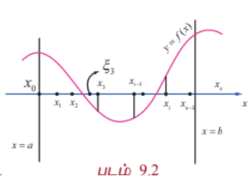

என எடுத்து கொள்க. கூடுதல் (1) என்பது $[a, b]$-ல் $[x_0, x_1], [x_1, x_2], \ldots, [x_{n-1}, x_n]$ எனும் பிரிவுகளில் $f(x)$ இன் **ரீமன் கூட்டல்** எனப்படும்.

$x_{i-1} \le \xi_i \le x_i$ எனும் நிபந்தனையை பூர்த்தி செய்யுமாறு எண்ணற்ற பல $\xi_i$ மதிப்புகள் இருப்பதால், $[a, b]$-ல் $[x_0, x_1], [x_1, x_2], \ldots, [x_{n-1}, x_n]$ எனும் அதே பிரிவினைகளுடைய $f(x)$ -க்கு எண்ணற்ற பல ரீமன் கூடுதல் உண்டு. கட்டுப்படுத்தும் செயல்பாட்டின் கீழ் $n \rightarrow \infty$ மற்றும் $\max_i (x_i - x_{i-1}) \rightarrow 0$ எனில், கூட்டுத் தொகை (1) ஆனது, முடிவுறு மதிப்பினை அதாவது $A$ என வைத்துக் கொண்டால், மதிப்பு $A$ -யினை $[a, b]$-ல் $x$ -ஐப் பொருத்து $f(x)$ -ன் **ரீமன் தொகையீடு** என்பர். மேலும் $a$ -லிருந்து $b$ -க்கு $x$ -ஐப் பொருத்து $f(x)$ -ன் $\int_a^b f(x) dx$ எனக் குறிப்பிடப்படுகிறது. $a = b$ எனில் $\int_a^a f(x) dx = 0$ ஆகும்.

#### குறிப்புரை

இந்த அத்தியாயத்தில் $[a, b]$-ல் தொடர்ச்சியான வரம்புக்குட்பட்ட $f(x)$ -இன் சார்புகளை மட்டுமே கருத்தில் கொள்கிறோம். இருப்பினும், துண்டுவாரி தொடர்ச்சியான வரம்புக்குட்பட்ட சார்புகளுக்கும் $[a, b]$-ல் $f(x)$ -ன் ரீமன் தொகையீடு உள்ளதாகும். வரையறுத்த தொகையீட்டிற்கும் எதிர்மறை வகையிடலுக்கும் (வரையறா தொகையீடு) ஒரே குறியீடான $\int$ பயன்படுத்தப்படுகிறது. தொகையீட்டுக்கான அடிப்படைத் தேற்றத்தை நிறுவிய பிறகே இதன் காரணம் தெளிவாக விளங்கும்.

மாறிலி $x$ போலியெனும் அர்த்தம் தரும்படி நம் விருப்பப்படி தேர்ந்தெடுக்கப்படுகிறது. எனவே $\int_a^b f(x) dx$ என்பதனை $\int_a^b f(u) du$ எனவும் எழுதலாம். ஆகையால், $\int_a^b f(x) dx = \int_a^b f(u) du$ ஆகும்.

$[x_{i-1}, x_i], i = 1, 2, \ldots, n$ எனும் ஒவ்வொரு பகுதி இடைவெளியிலும் உள்ள $x_{i-1}, \xi_i$ மற்றும் $x_i$ ஆகிய மூன்று புள்ளிகளும் $\max_i (x_i - x_{i-1}) \rightarrow 0$ என்பதால் ஒரே புள்ளியில் குவிகின்றன. $\xi_i = x_{i-1}$, $i = 1, 2, \ldots, n$ எனத் தேர்ந்தெடுப்பதன் மூலம்

$$\int_a^b f(x) dx = \lim_{\substack{n \rightarrow \infty \\ \max_i (x_i - x_{i-1}) \rightarrow 0}} \sum_{i=1}^{n} f(x_{i-1})(x_i - x_{i-1})$$

... (2)

ஆகும். சமன்பாடு (2) ரீமன் தொகையீட்டினை மதிப்பிடுவதற்கான **இடது-முனை விதி** என்பர்.

$\xi_i = x_i$, $i = 1, 2, \ldots, n$ எனத் தேர்ந்தெடுப்பதன் மூலம்,

$$\int_a^b f(x) dx = \lim_{\substack{n \rightarrow \infty \\ \max_i (x_i - x_{i-1}) \rightarrow 0}} \sum_{i=1}^{n} f(x_i)(x_i - x_{i-1})$$

... (3)

எனக் கிடைக்கிறது. சமன்பாடு (3)-ஐ ரீமன் தொகையீட்டினை மதிப்பிடுவதற்கான **வலது-முனை விதி** என்பர்.

$\xi_i = \frac{x_{i-1} + x_i}{2}$, $i = 1, 2, \ldots, n$ எனத் தேர்ந்தெடுப்பதன் மூலம்

$$\int_a^b f(x) dx = \lim_{\substack{n \rightarrow \infty \\ \max_i (x_i - x_{i-1}) \rightarrow 0}} \sum_{i=1}^{n} f\left(\frac{x_{i-1} + x_i}{2}\right)(x_i - x_{i-1})$$

... (4)

எனக் கிடைக்கிறது. சமன்பாடு (4) ரீமன் தொகையீட்டினை மதிப்பிடுவதற்கான **நடு-முனை விதி** என்பர்.

#### குறிப்புரை

(1) ஒவ்வொரு $x \in [a, b]$ -க்கும் ரீமன் தொகையீடு $\int_a^b f(x) dx$ உள்ளது எனில், ரீமன் தொகையீடு $\int_a^x f(u) du$ என்பது நன்கு வரையறுக்கப்பட்ட மெய்யெண்ணாகும். எனவே $F(x) = \int_a^x f(u) du, x \in [a, b]$ எனும்படி $[a, b]$-ல் $F(x)$ -இன் சார்பு வரையறுக்கப்படுகிறது.

(2) அனைத்து $x \in [a, b]$ -க்கும் $f(x) \ge 0$ எனில், ரீமன் தொகையீடான $\int_a^b f(x) dx$ என்பது $x = a$ மற்றும் $x = b$ கோடுகள், $y = f(x)$ எனும் வளைவரை மற்றும் $x$-அச்சின் வரம்பிற்குட்பட்ட பகுதியின் வடிவியல் பரப்பளவைத் தரும். படம் 9.3 இல் காண்க.

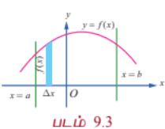
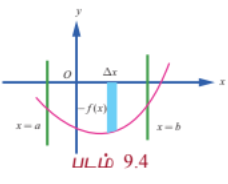

(3) அனைத்து $x \in [a, b]$ -க்கும் $f(x) \le 0$ எனில் ரீமன் தொகையீடான $\int_a^b f(x) dx$ என்பது $x = a$ மற்றும் $x = b$ கோடுகள் $y = f(x)$ எனும் வளைவரை மற்றும் $x$-அச்சின் வரம்பிற்குட்பட்ட பகுதியில் வடிவியல் பரப்பளவு குறை மதிப்பைத் தரும். படம் 9.4இல் காண்க. இத்தகைய தருணத்தில், $x = a$ மற்றும் $x = b$ கோடுகள், $y = f(x)$ எனும் வளைவரை மற்றும் $x$-அச்சின் வரம்பிற்குட்பட்ட பகுதியின் வடிவியல் பரப்பளவு $-\int_a^b f(x) dx$ ஆகும்.

(4) $[a, b]$-ல் $f(x)$ மிகை மதிப்புகளையும் அதே சமயத்தில் குறை மதிப்புகளையும் பெறும் எனில், $[a, b]$ எனும் இடைவெளியை $f(x)$ -இன், ஒவ்வொரு உள் இடைவெளியிலும் தொடர்ந்து ஒரே குறியுடன் இருக்குமாறு $[a, c_1], [c_1, c_2], \ldots, [c_k, b]$ என பகுதி இடைவெளிகளாகப் பிரிக்கப்படுகிறது. எனவே, $\int_a^b f(x) dx$ -க்கான ரீமன் தொகையீடு

$$\int_a^b f(x) dx = \int_a^{c_1} f(x) dx + \int_{c_1}^{c_2} f(x) dx + \cdots + \int_{c_k}^b f(x) dx$$

ஆகும்.

இத்தருணத்தில் $x = a$ மற்றும் $x = b$ கோடுகள், $y = f(x)$ எனும் வளைவரை மற்றும் $x$-அச்சின் வரம்பிற்குட்பட்ட பகுதியின் வடிவியல் பரப்பளவு

$$\int_a^{c_1} |f(x)| dx + \int_{c_1}^{c_2} |f(x)| dx + \cdots + \int_{c_k}^b |f(x)| dx$$

ஆகும்.

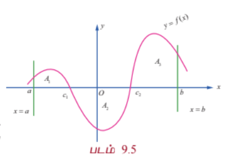

சான்றாக, சார்பு $f(x), x \in [a, b]$ -க்கான கீழ்க்காணும் வளைவரையைக் கருதுவோம். படம் 9.5 இல் காண்க. இங்கு, $A_1$, $A_2$ மற்றும் $A_3$ ஆகியவை தனித்தனியான வடிவியல் பரப்பளவுகளாகும். எனவே வரையறுத்த தொகையீடு $\int_a^b f(x) dx$ என்பது

$$= \int_a^{c_1} f(x) dx + \int_{c_1}^{c_2} f(x) dx + \int_{c_2}^b f(x) dx$$

$$= -A_1 + A_2 - A_3$$

$x = a$ மற்றும் $x = b$ கோடுகள், $y = f(x)$ எனும் வளைவரை மற்றும் $x -$ அச்சின் வரம்பிற்குட்பட்ட பகுதியின் வடிவியல் பரப்பளவு $A_1 + A_2 + A_3$ ஆகும்.

மேற்கண்ட ஆய்விலிருந்து, வடிவியல் பரப்பளவை ரீமன் தொகையீடு குறிக்காது என்பது புலனாகிறது.

#### குறிப்பு

வெளிப்படையாக குறிப்பிடாமல் இருப்பினும் பரப்பளவு சதுர அலகுகளாகவும், கன அளவு கன அலகுகளாகவும் கணக்கிடப்படுகின்றது என்பது நன்கு தெளிவாகிறது.

---

### எடுத்துக்காட்டு 9.1

5 சம அளவு பகுதி இடைவெளிகளாகப் பிரித்து மற்றும் (i) இடது-முனை விதி (ii) வலது-முனை விதி (iii) நடு-முனை விதி ஆகியவற்றை ரீமன் கூட்டலில் பயன்படுத்தி $\int_0^{0.5} x dx$ -ன் மதிப்பைக் கணக்கிடுக.

#### தீர்வு

இங்கு $a = 0, b = 0.5, n = 5, f(x) = x$.

எனவே, ஒவ்வொரு பகுதி இடைவெளியின் அகலம்,

$$h = \Delta x = \frac{b - a}{n} = \frac{0.5 - 0}{5} = 0.1$$

ஆகும்.

இடைவெளியின் துண்டுகளைத் தரும் புள்ளிகள்,

$$x_0 = 0,$$
$$x_1 = x_0 + h = 0 + 0.1 = 0.1,$$
$$x_2 = x_1 + h = 0.1 + 0.1 = 0.2,$$
$$x_3 = x_2 + h = 0.2 + 0.1 = 0.3,$$
$$x_4 = x_3 + h = 0.3 + 0.1 = 0.4,$$
$$x_5 = x_4 + h = 0.4 + 0.1 = 0.5$$

ஆகும்.

(i) சம அளவு $\Delta x$ கொண்ட ரீமன் கூட்டலுக்கான இடது முனை விதியானது,

$$S = [f(x_0) + f(x_1) + \cdots + f(x_{n-1})]\Delta x$$

$$\therefore S = [f(0) + f(0.1) + f(0.2) + f(0.3) + f(0.4)](0.1)$$

$$= [0 + 0.1 + 0.2 + 0.3 + 0.4](0.1) = (1.0)(0.1) = 0.1$$

$$\therefore \int_0^{0.5} x dx$$ -ன் தோராய மதிப்பு $0.1$ ஆகும்.

(ii) சம அளவு $\Delta x$ கொண்ட ரீமன் கூட்டலுக்கான வலது முனை விதியானது

$$S = [f(x_1) + f(x_2) + \cdots + f(x_n)]\Delta x$$

$$\therefore S = [f(0.1) + f(0.2) + f(0.3) + f(0.4) + f(0.5)](0.1)$$

$$= [0.1 + 0.2 + 0.3 + 0.4 + 0.5](0.1) = (1.5)(0.1) = 0.15$$

$$\therefore \int_0^{0.5} x dx$$ -ன் தோராய மதிப்பு 0.15 ஆகும்.

(iii) சம அளவு $\Delta x$ கொண்ட ரீமன் கூட்டலுக்கான நடு-முனை விதியானது

$$S = \left[f\left(\frac{x_0 + x_1}{2}\right) + f\left(\frac{x_1 + x_2}{2}\right) + \cdots + f\left(\frac{x_{n-1} + x_n}{2}\right)\right]\Delta x$$

$$\therefore S = [f(0.05) + f(0.15) + f(0.25) + f(0.35) + f(0.45)](0.1)$$

$$= [0.05 + 0.15 + 0.25 + 0.35 + 0.45](0.1) = (1.25)(0.1) = 0.125$$

$$\therefore \int_0^{0.5} x dx$$ -ன் தோராய மதிப்பு 0.125 ஆகும்.

---

### பயிற்சி 9.1

1. $1.1, 1.2, 1.3, 1.4, 1.5$ எனும் பிரிவினையுடன் இடது-முனை விதியைப் பயன்படுத்தி $\int_1^{1.5} x dx$ -க்கு தோராய மதிப்பு காண்க.

2. $1.1, 1.2, 1.3, 1.4, 1.5$ எனும் பிரிவினையுடன் வலது-முனை விதியைப் பயன்படுத்தி $\int_1^{1.5} x^2 dx$ -க்கு தோராய மதிப்பு காண்க.

3. $1.1, 1.2, 1.3, 1.4, 1.5$ எனும் பிரிவினையுடன் நடு-முனை விதியைப் பயன்படுத்தி $\int_1^{1.5} (2 - x) dx$ -க்கு தோராய மதிப்பு காண்க.

---

#### 9.2.2 $\int_a^b f(x) dx$ -ஐ மதிப்பிட எல்லை சூத்திரம் (Limit Formula to Evaluate $\int_a^b f(x) dx$)

$[a, b]$ எனும் இடைவெளியை $a = x_0 < x_1 < x_2 < \cdots < x_n = b$ எனுமாறு $[x_0, x_1], [x_1, x_2], \ldots, [x_{n-2}, x_{n-1}], [x_{n-1}, x_n]$ என $n$ சமப்பகுதி இடைவெளிகளாகப் பிரிக்கப்படுகிறது. எனவே $x_1 - x_0 = x_2 - x_1 = \cdots = x_n - x_{n-1} = \frac{b - a}{n}$ ஆகும். $h = \frac{b - a}{n}$ என்க. இனி $x_i = a + ih, i = 1, 2, \ldots, n$ எனக் கிடைக்கிறது.

வரையறுத்த தொகையீட்டின் வரையறைப்படி

$$\int_a^b f(x) dx = \lim_{\substack{n \rightarrow \infty \\ \max_i (x_i - x_{i-1}) \rightarrow 0}} \sum_{i=1}^{n} f(x_i)(x_i - x_{i-1})$$

(வலது முனை விதி)

$$= \lim_{n \rightarrow \infty} \sum_{i=1}^{n} f\left(a + i\frac{b - a}{n}\right)\left(\frac{b - a}{n}\right)$$

$$\therefore \int_a^b f(x) dx = \lim_{n \rightarrow \infty} \frac{b - a}{n} \sum_{r=1}^{n} f\left(a + r\frac{b - a}{n}\right)$$

#### குறிப்பு

$$\lim_{n \rightarrow \infty} \sum_{r=0}^{n} \frac{b - a}{n} f\left(a + r\frac{b - a}{n}\right) = \lim_{n \rightarrow \infty} \sum_{r=1}^{n} \frac{b - a}{n} f\left(a + r\frac{b - a}{n}\right)$$

$$\therefore \int_a^b f(x) dx = \lim_{n \rightarrow \infty} \sum_{r=0}^{n} \frac{b - a}{n} f\left(a + r\frac{b - a}{n}\right)$$

$a = 0$ மற்றும் $b = 1$ எனில்,

$$\int_0^1 f(x) dx = \lim_{n \rightarrow \infty} \frac{1}{n} \sum_{r=0}^{n} f\left(\frac{r}{n}\right) = \lim_{n \rightarrow \infty} \frac{1}{n} \sum_{r=1}^{n} f\left(\frac{r}{n}\right)$$

ஆகும்.

---

### எடுத்துக்காட்டு 9.2

கூட்டலின் எல்லையாக $\int_0^1 x dx$ -ஐ மதிப்பிடுக.

#### தீர்வு

இங்கு $f(x) = x, a = 0$ மற்றும் $b = 1$. எனவே

$$\int_a^b f(x) dx = \lim_{n \rightarrow \infty} \frac{b - a}{n} \sum_{r=1}^{n} f\left(a + r\frac{b - a}{n}\right)$$

$$\int_0^1 x dx = \lim_{n \rightarrow \infty} \frac{1}{n} \sum_{r=1}^{n} \frac{r}{n} = \lim_{n \rightarrow \infty} \frac{1}{n^2} \sum_{r=1}^{n} r$$

$$= \lim_{n \rightarrow \infty} \frac{1}{n^2} \frac{n(n+1)}{2} = \lim_{n \rightarrow \infty} \frac{1}{2}\left(1 + \frac{1}{n}\right) = \frac{1}{2}$$

---

### எடுத்துக்காட்டு 9.3

கூட்டலின் எல்லையாக $\int_0^1 x^3 dx$ -ஐ மதிப்பிடுக.

#### தீர்வு

இங்கு $f(x) = x^3, a = 0$ மற்றும் $b = 1$. எனவே

$$\int_0^1 x^3 dx = \lim_{n \rightarrow \infty} \frac{1}{n} \sum_{r=1}^{n} \left(\frac{r}{n}\right)^3 = \lim_{n \rightarrow \infty} \frac{1}{n^4} \sum_{r=1}^{n} r^3$$

$$= \lim_{n \rightarrow \infty} \frac{1}{n^4} \left[\frac{n(n+1)}{2}\right]^2 = \lim_{n \rightarrow \infty} \frac{1}{4}\left(1 + \frac{1}{n}\right)^2 = \frac{1}{4}$$

---

### எடுத்துக்காட்டு 9.4

கூட்டலின் எல்லையாக $\int_1^4 (2x^2 + 3) dx$ -ஐ மதிப்பிடுக.

#### தீர்வு

கீழ்க்காணும் சூத்திரத்தைப் பயன்படுத்துவோம்.

$$\int_a^b f(x) dx = \lim_{n \rightarrow \infty} \frac{b - a}{n} \sum_{r=1}^{n} f\left(a + r\frac{b - a}{n}\right)$$

இங்கு $f(x) = 2x^2 + 3, a = 1$ மற்றும் $b = 4$.

எனவே,

$$f\left(a + r\frac{b - a}{n}\right) = f\left(1 + r\frac{3}{n}\right) = 2\left(1 + \frac{3r}{n}\right)^2 + 3$$

$$= 2\left(1 + \frac{6r}{n} + \frac{9r^2}{n^2}\right) + 3 = 5 + \frac{12r}{n} + \frac{18r^2}{n^2}$$

ஆகையால்,

$$\int_1^4 (2x^2 + 3) dx = \lim_{n \rightarrow \infty} \frac{3}{n} \sum_{r=1}^{n} \left(5 + \frac{12r}{n} + \frac{18r^2}{n^2}\right)$$

$$= \lim_{n \rightarrow \infty} \frac{3}{n} \left[5n + \frac{12}{n}\frac{n(n+1)}{2} + \frac{18}{n^2}\frac{n(n+1)(2n+1)}{6}\right]$$

$$= \lim_{n \rightarrow \infty} \left[15 + 18\left(1 + \frac{1}{n}\right) + 9\left(1 + \frac{1}{n}\right)\left(2 + \frac{1}{n}\right)\right]$$

$$= 15 + 18(1) + 9(1)(2) = 15 + 18 + 18 = 51$$

---

### பயிற்சி 9.2

1. கீழ்க்காணும் தொகையீடுகளை கூட்டலின் எல்லைகளாக கணக்கிடுக:

   (i) $\int_0^1 (5x + 4) dx$

   (ii) $\int_1^2 (4x^2 - 1) dx$

### 9.3 தொகை நுண்கணித அடிப்படைத் தேற்றங்கள் மற்றும் அவற்றின் பயன்பாடுகள்
### (Fundamental Theorems of Integral Calculus and their Applications)

சார்பு மிக எளிமையாக இருப்பினும் $\int_a^b f(x) dx$ -இன் மதிப்பை தொகையீடுகளின் கூட்டலின் எல்லைகளாக தீர்வு காண்பது மிகவும் கடினம் என்பதை மேலே உள்ள எடுத்துக்காட்டுகளின் வாயிலாக பார்த்ததோம். நியூட்டன் (Newton) மற்றும் லிபினிட்ஸ் (Leibnitz) இருவரும் கிட்டத்தட்ட ஒரே காலத்தில் வரையறுத்த தொகையிடலை ஓர் எளிய முறையில் காண வழிவகுத்தனர். இம்முறையானது முதல் மற்றும் இரண்டாம் நுண்கணித அடிப்படைத் தேற்றத்தை அடிப்படையாகக் கொண்டது. இத்தேற்றங்கள் ஒரு சார்பிற்கும் அதன் எதிர் வகையிடலுக்கும் (முடியுமெனில்) உள்ள தொடர்பை நிலைநிறுத்துகிறது. இத்தேற்றங்கள் வகை நுண்கணிதத்திற்கும் தொகை நுண்கணிதத்திற்கும் உள்ள ஒரு தொடர்பை ஏற்படுத்துகிறது.

பின்வரும் முக்கிய தேற்றங்கள் நிரூபணமின்றி கீழே கொடுக்கப்பட்டுள்ளன.

#### தேற்றம் 9.1 (முதல் தொகை நுண்கணித அடிப்படைத் தேற்றம்)

$f(x)$ என்பது $[a, b]$ என்ற மூடிய இடைவெளியில் வரையறுக்கப்பட்ட தொடர்ச்சியான சார்பு மற்றும் $F(x) = \int_a^x f(u) du$, $a < x < b$ எனில், $\frac{d}{dx}F(x) = f(x)$. அதாவது $F(x)$ -ஆனது $f(x)$ -இன் எதிர் வகையீடு ஆகும்.

#### தேற்றம் 9.2 (இரண்டாவது தொகை நுண்கணித அடிப்படைத் தேற்றம்)

$f(x)$ என்பது $[a, b]$ என்ற மூடிய இடைவெளியில் வரையறுக்கப்பட்ட தொடர்ச்சியான சார்பு மற்றும் $F(x)$ -ஆனது $f(x)$ -இன் எதிர் வகையீடு எனில்,

$$\int_a^b f(x) dx = F(b) - F(a)$$

#### குறிப்பு

$F(b) - F(a)$ ஆனது $\int_a^b f(x) dx$ என்ற வரையறுக்கப்பட்ட தொகையிடலின் (ரீமன் தொகையிடல்) மதிப்பானதால் எதிர்முறை வகையீடு $F(x)$ உடன் சேர்க்கப்படும் தன்னிச்சை மாறி நீக்கப்பட்டு விடும். எனவே வரையறுத்த தொகையிடலின் மதிப்பு காணும்போது எதிர் வகையீடுடன் தன்னிச்சை மாறியை சேர்க்கத் தேவையில்லை. $F(b) - F(a)$ -ஐ சுருக்கமாக $\left[F(x)\right]_a^b$ என எழுதலாம். வரையறுத்த தொகையிடலின் மதிப்பு ஒருமைத் தன்மை உடையது.

இரண்டாவது தொகை நுண்கணித தேற்றத்தின் வாயிலாக பின்வரும் வரையறுத்த தொகையிடலின் பண்புகளைப் பெறுகிறோம். அவற்றை நிரூபணமின்றி இங்கு காண்போம்.

**பண்பு 1 :** $\int_a^b f(x) dx = \int_a^b f(u) du$, $a < b$

அதாவது எல்லைகள் மாறாமல் இருக்கும்போது மாறியை மாற்றுவதால் தொகையிடலின் மதிப்பு மாறாது.

**பண்பு 2 :** $\int_b^a f(x) dx = -\int_a^b f(x) dx$

அதாவது வரையறுத்த தொகையிடலில் எல்லைகளை இடமாற்றம் செய்யும்போது வரையறுத்த தொகையிடலின் குறியீடு '-' ஆக மாறும்.

**பண்பு 3 :** $\int_a^b f(x) dx = \int_a^c f(x) dx + \int_c^b f(x) dx$, $a < c < b$

**பண்பு 4 :** $\int_a^b [\alpha f(x) + \beta g(x)] dx = \alpha \int_a^b f(x) dx + \beta \int_a^b g(x) dx$ இங்கு, $\alpha$ மற்றும் $\beta$ மாறிலிகள்.

**பண்பு 5 :** $x = g(u)$ எனில், $\int_a^b f(x) dx = \int_c^d f(g(u)) \frac{dg(u)}{du} du$ இங்கு $g(c) = a$ மற்றும் $g(d) = b$.

இப்பண்பானது வரையறுத்த தொகையிடலில் பிரதியிடல் முறையைப் பயன்படுத்த உதவுகிறது.

மேற்கூறிய பண்புகளை பின்வரும் எடுத்துக்காட்டுகளில் பயன்படுத்துவோம்.

---

### எடுத்துக்காட்டு 9.5

மதிப்பிடுக : $\int_0^3 (3x^2 - 4x + 5) dx$.

#### தீர்வு

$$\int_0^3 (3x^2 - 4x + 5) dx = 3\int_0^3 x^2 dx - 4\int_0^3 x dx + 5\int_0^3 dx$$

$$= 3\left[\frac{x^3}{3}\right]_0^3 - 4\left[\frac{x^2}{2}\right]_0^3 + 5\left[x\right]_0^3$$

$$= (27 - 0) - 2(9 - 0) + 5(3 - 0)$$

$$= 27 - 18 + 15 = 24$$

---

### எடுத்துக்காட்டு 9.6

மதிப்பிடுக : $\int_0^1 \frac{2x + 7}{5x^2 + 9} dx$.

#### தீர்வு

$$\int_0^1 \frac{2x + 7}{5x^2 + 9} dx = \frac{1}{5}\int_0^1 \frac{10x}{5x^2 + 9} dx + 7\int_0^1 \frac{1}{5x^2 + 9} dx$$

$$= \frac{1}{5}\left[\log|5x^2 + 9|\right]_0^1 + \frac{7}{5}\int_0^1 \frac{1}{x^2 + \frac{9}{5}} dx$$

$$= \frac{1}{5}(\log 14 - \log 9) + \frac{7}{5}\left[\frac{1}{\sqrt{\frac{9}{5}}}\tan^{-1}\left(\frac{x}{\sqrt{\frac{9}{5}}}\right)\right]_0^1$$

$$= \frac{1}{5}\log\frac{14}{9} + \frac{7}{5}\sqrt{\frac{5}{9}}\tan^{-1}\left(\sqrt{\frac{5}{9}}\right)$$

$$= \frac{1}{5}\log\frac{14}{9} + \frac{7}{5}\frac{\sqrt{5}}{3}\tan^{-1}\left(\frac{\sqrt{5}}{3}\right)$$

---

### எடுத்துக்காட்டு 9.7

மதிப்பிடுக : $\int_0^1 [2x] dx$, $[\cdot]$ என்பது மீப்பெரு முழுக்கள் சார்பு.

#### தீர்வு

$$\int_0^1 [2x] dx = \int_0^{\frac{1}{2}} [2x] dx + \int_{\frac{1}{2}}^1 [2x] dx$$

$0 \le x < \frac{1}{2}$ எனில் $0 \le 2x < 1 \Rightarrow [2x] = 0$

$\frac{1}{2} \le x < 1$ எனில் $1 \le 2x < 2 \Rightarrow [2x] = 1$

$$\therefore \int_0^1 [2x] dx = \int_0^{\frac{1}{2}} 0 dx + \int_{\frac{1}{2}}^1 1 dx = 0 + \left[x\right]_{\frac{1}{2}}^1 = 1 - \frac{1}{2} = \frac{1}{2}$$

---

### எடுத்துக்காட்டு 9.8

மதிப்பிடுக : $\int_0^{\frac{\pi}{3}} \frac{\sec x \tan x}{1 + \sec^2 x} dx$.

#### தீர்வு

$I = \int_0^{\frac{\pi}{3}} \frac{\sec x \tan x}{1 + \sec^2 x} dx$ என்க. $\sec x = u$ என்க. எனவே $\sec x \tan x dx = du$.

$x = 0$ எனில், $u = \sec 0 = 1$ மற்றும் $x = \frac{\pi}{3}$ எனில் $u = \sec\frac{\pi}{3} = 2$.

$$\therefore I = \int_1^2 \frac{du}{1 + u^2} = \left[\tan^{-1} u\right]_1^2 = \tan^{-1}2 - \tan^{-1}1 = \tan^{-1}2 - \frac{\pi}{4}$$

---

### எடுத்துக்காட்டு 9.9

மதிப்பிடுக : $\int_0^9 \frac{1}{x + \sqrt{x}} dx$.

#### தீர்வு

$x = u^2$ என்க. எனவே $x = u^2$, மற்றும் $dx = 2u du$.

$x = 0$ எனில், $u = 0$ மற்றும் $x = 9$ எனில், $u = 3$.

$$\int_0^9 \frac{1}{x + \sqrt{x}} dx = \int_0^3 \frac{1}{u^2 + u}(2u du) = 2\int_0^3 \frac{1}{u + 1} du = 2\left[\log(u + 1)\right]_0^3 = 2(\log 4 - \log 1) = 2\log 4 = \log 16$$

---

### எடுத்துக்காட்டு 9.10

மதிப்பிடுக : $\int_2^4 \frac{x}{(x - 1)(x + 2)} dx$.

#### தீர்வு

$$I = \int_2^4 \frac{x}{(x - 1)(x + 2)} dx$$ என்க.

$$\frac{x}{(x - 1)(x + 2)} = \frac{1}{3}\left(\frac{2}{x - 1} + \frac{1}{x + 2}\right)$$

$$I = \frac{1}{3}\int_2^4 \left(\frac{2}{x - 1} + \frac{1}{x + 2}\right) dx = \frac{1}{3}\left[2\log(x - 1) + \log(x + 2)\right]_2^4$$

$$= \frac{1}{3}\left[2\log 3 + \log 6 - 2\log 1 - \log 4\right] = \frac{1}{3}\left[\log 9 + \log 6 - \log 4\right] = \frac{1}{3}\log\left(\frac{54}{4}\right) = \frac{1}{3}\log\left(\frac{27}{2}\right) = \log\sqrt[3]{\frac{27}{2}}$$

---

### எடுத்துக்காட்டு 9.11

மதிப்பிடுக : $\int_0^{\frac{\pi}{2}} \frac{\cos\theta}{(1 + \sin\theta)(2 - \sin\theta)} d\theta$.

#### தீர்வு

$$I = \int_0^{\frac{\pi}{2}} \frac{\cos\theta}{(1 + \sin\theta)(2 - \sin\theta)} d\theta$$ என்க.

$u = \sin\theta$ எனப் பிரதியிடக் கிடைப்பது $du = \cos\theta d\theta$.

$\theta = 0$ எனில் $u = 0$ மற்றும் $\theta = \frac{\pi}{2}$ எனில் $u = 1$.

$$\therefore I = \int_0^1 \frac{du}{(1 + u)(2 - u)} = \frac{1}{3}\int_0^1 \left(\frac{1}{1 + u} + \frac{1}{2 - u}\right) du$$

$$= \frac{1}{3}\left[\log(1 + u) - \log(2 - u)\right]_0^1 = \frac{1}{3}\left[\log\left(\frac{1 + u}{2 - u}\right)\right]_0^1$$

$$= \frac{1}{3}\left[\log\left(\frac{2}{1}\right) - \log\left(\frac{1}{2}\right)\right] = \frac{1}{3}[\log 2 + \log 2] = \frac{2}{3}\log 2 = \log\left(2^{\frac{2}{3}}\right)$$

---

### எடுத்துக்காட்டு 9.12

மதிப்பிடுக : $\int_0^{\frac{1}{2}} \frac{\sin^{-1} x}{(1 - x^2)^{\frac{3}{2}}} dx$.

#### தீர்வு

$$I = \int_0^{\frac{1}{2}} \frac{\sin^{-1} x}{(1 - x^2)^{\frac{3}{2}}} dx$$ என்க.

$u = \sin^{-1} x$ எனப் பிரதியிடக் கிடைப்பது, $x = \sin u$ மற்றும் $du = \frac{1}{\sqrt{1 - x^2}} dx$.

$x = 0$ எனில் $u = 0$ மற்றும் $x = \frac{1}{2}$ எனில் $u = \frac{\pi}{4}$.

$$\therefore I = \int_0^{\frac{\pi}{4}} \frac{u}{1 - \sin^2 u} du = \int_0^{\frac{\pi}{4}} u \sec^2 u du$$

$$= \left[u\tan u\right]_0^{\frac{\pi}{4}} - \int_0^{\frac{\pi}{4}} \tan u du = \frac{\pi}{4}(1) - 0 - [-\log\cos u]_0^{\frac{\pi}{4}} = \frac{\pi}{4} + \log\cos\frac{\pi}{4} - \log\cos 0$$

$$= \frac{\pi}{4} + \log\left(\frac{1}{\sqrt{2}}\right) - 0 = \frac{\pi}{4} - \frac{1}{2}\log 2 = \frac{\pi}{4} - \log\sqrt{2}$$

---

### எடுத்துக்காட்டு 9.13

மதிப்பிடுக : $\int_0^{\frac{\pi}{2}} \sqrt{\tan x + \cot x} dx$.

#### தீர்வு

$$I = \int_0^{\frac{\pi}{2}} \sqrt{\tan x + \cot x} dx$$ என்க.

$$I = \int_0^{\frac{\pi}{2}} \sqrt{\frac{\sin x}{\cos x} + \frac{\cos x}{\sin x}} dx = \int_0^{\frac{\pi}{2}} \sqrt{\frac{\sin^2 x + \cos^2 x}{\sin x \cos x}} dx = \int_0^{\frac{\pi}{2}} \frac{1}{\sqrt{\sin x \cos x}} dx$$

$$= \int_0^{\frac{\pi}{2}} \frac{\sqrt{2}}{\sqrt{2\sin x \cos x}} dx = \sqrt{2}\int_0^{\frac{\pi}{2}} \frac{1}{\sqrt{\sin 2x}} dx$$

$u = 2x$ எனப் பிரதியிட, $dx = \frac{du}{2}$. $x = 0$ எனில் $u = 0$ மற்றும் $x = \frac{\pi}{2}$ எனில் $u = \pi$.

$$\therefore I = \frac{\sqrt{2}}{2}\int_0^{\pi} \frac{1}{\sqrt{\sin u}} du = \frac{1}{\sqrt{2}}\int_0^{\pi} (\sin u)^{-\frac{1}{2}} du = \frac{1}{\sqrt{2}}\int_0^{\pi} \sin^{-\frac{1}{2}} u du$$

$u = \frac{\pi}{2} - t$ எனப் பிரதியிட, $du = -dt$. $u = 0$ எனில் $t = \frac{\pi}{2}$ மற்றும் $u = \pi$ எனில் $t = -\frac{\pi}{2}$.

$$I = \frac{1}{\sqrt{2}}\int_{\frac{\pi}{2}}^{-\frac{\pi}{2}} \sin^{-\frac{1}{2}}\left(\frac{\pi}{2} - t\right)(-dt) = \frac{1}{\sqrt{2}}\int_{-\frac{\pi}{2}}^{\frac{\pi}{2}} \cos^{-\frac{1}{2}} t dt$$

$\cos^{-\frac{1}{2}} t$ ஒரு இரட்டைப்படை சார்பு என்பதால்,

$$I = \frac{1}{\sqrt{2}}\left(2\int_0^{\frac{\pi}{2}} \cos^{-\frac{1}{2}} t dt\right) = \sqrt{2}\int_0^{\frac{\pi}{2}} \cos^{-\frac{1}{2}} t dt$$

இது ஒரு பீட்டா தொகையிடல். $\int_0^{\frac{\pi}{2}} \sin^{m-1} x \cos^{n-1} x dx = \frac{1}{2}B\left(\frac{m}{2}, \frac{n}{2}\right)$

$\cos^{-\frac{1}{2}} t = \cos^{\frac{1}{2} - 1} t$ எனவே $\frac{n}{2} = \frac{1}{2} \Rightarrow n = 1$ மற்றும் $m = 1$.

$$\therefore I = \sqrt{2} \cdot \frac{1}{2}B\left(\frac{1}{2}, \frac{1}{2}\right) = \frac{\sqrt{2}}{2} \frac{\Gamma\left(\frac{1}{2}\right)\Gamma\left(\frac{1}{2}\right)}{\Gamma(1)} = \frac{\sqrt{2}}{2} \pi = \frac{\pi}{\sqrt{2}}$$

---

### எடுத்துக்காட்டு 9.14

மதிப்பிடுக : $\int_0^{1.5} [x^2] dx$, இங்கு $[x]$ என்பது மீப்பெரு முழுக்கள் சார்பு.

#### தீர்வு

மீப்பெரு முழுக்கள் சார்பு $[x]$ என்பது $x$-ஐ விட மிகைப்படாத அல்லது சமமான மதிப்பை பெறும் சார்பு என நாம் அறிவோம். அதாவது $n$ என்பது ஒரு முழுக்கள் மற்றும் $n \le x < n+1$ எனில் $[x] = n$. எனவே, நாம் பெறுவது

$$
[x^2] =
\begin{cases}
0, & 0 \le x < 1 \\
1, & 1 \le x < \sqrt{2} \\
2, & \sqrt{2} \le x \le 1.5
\end{cases}
$$

இச்சார்பானது $[0, 1.5]$ என்ற இடைவெளியில் தொடர்ச்சியற்றது. ஆனால், ஒவ்வொரு பிரிவு இடைவெளி $[0, 1)$, $[1, \sqrt{2})$ மற்றும் $[\sqrt{2}, 1.5]$ -களில் தொடர்ச்சி உடையது. அதாவது $[0, 1.5]$ என்ற இடைவெளியில் துண்டு வாரியாக (piece-wise) தொடர்ச்சி உடையது. படம் 9.6-ஐ பார்க்கவும்.

$$\int_0^{1.5} [x^2] dx = \int_0^1 0 dx + \int_1^{\sqrt{2}} 1 dx + \int_{\sqrt{2}}^{1.5} 2 dx$$

$$= 0 + [x]_1^{\sqrt{2}} + 2[x]_{\sqrt{2}}^{1.5} = (\sqrt{2} - 1) + 2(1.5 - \sqrt{2}) = \sqrt{2} - 1 + 3 - 2\sqrt{2} = 2 - \sqrt{2}$$

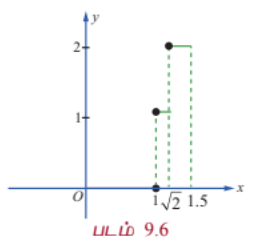

---

### எடுத்துக்காட்டு 9.15

மதிப்பிடுக : $\int_{-4}^{4} |x + 3| dx$.

#### தீர்வு

வரையறைப்படி நமக்குக் கிடைப்பது,

$$
|x + 3| =
\begin{cases}
x + 3, & x + 3 \ge 0 \Rightarrow x \ge -3 \\
-(x + 3), & x + 3 < 0 \Rightarrow x < -3
\end{cases}
$$

$-4 \le x \le 4$ -ல் $y = |x + 3|$ என்பதன் வரைபடத்தை படம் 9.7-ல் பார்க்கவும்.

$$\therefore \int_{-4}^{4} |x + 3| dx = \int_{-4}^{-3} |x + 3| dx + \int_{-3}^{4} |x + 3| dx$$

$$= \int_{-4}^{-3} -(x + 3) dx + \int_{-3}^{4} (x + 3) dx$$

$$= -\left[\frac{x^2}{2} + 3x\right]_{-4}^{-3} + \left[\frac{x^2}{2} + 3x\right]_{-3}^{4}$$

$$= -\left[\left(\frac{9}{2} - 9\right) - (8 - 12)\right] + \left[(8 + 12) - \left(\frac{9}{2} - 9\right)\right]$$

$$= -\left[-\frac{9}{2} + 4\right] + \left[20 + \frac{9}{2}\right] = \frac{1}{2} + \frac{49}{2} = 25$$

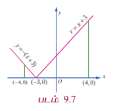

பண்பு 5-இன் பயன்பாட்டிற்கான எடுத்துக்காட்டுகளைப் பார்ப்போம்.

---

### எடுத்துக்காட்டு 9.16

$\int_0^{\frac{\pi}{2}} \frac{dx}{4 + 5\sin x} = \frac{1}{3}\log 2$ எனக்காட்டுக.

#### தீர்வு

$u = \tan\frac{x}{2}$ என்க. $\sin x = \frac{2u}{1 + u^2}$, $\sec^2\frac{x}{2} dx = 2 du \Rightarrow dx = \frac{2 du}{1 + u^2}$.

$x = 0$ எனில் $u = \tan 0 = 0$ மற்றும் $x = \frac{\pi}{2}$ எனில் $u = \tan\frac{\pi}{4} = 1$.

$$\therefore I = \int_0^{\frac{\pi}{2}} \frac{dx}{4 + 5\sin x} = \int_0^1 \frac{\frac{2 du}{1 + u^2}}{4 + 5\left(\frac{2u}{1 + u^2}\right)} = \int_0^1 \frac{2 du}{4(1 + u^2) + 10u}$$

$$= \int_0^1 \frac{2 du}{4u^2 + 10u + 4} = \frac{1}{2}\int_0^1 \frac{du}{2u^2 + 5u + 2}$$

$$= \frac{1}{2}\int_0^1 \frac{du}{(2u + 1)(u + 2)} = \frac{1}{2}\cdot\frac{1}{3}\int_0^1 \left(\frac{2}{2u + 1} - \frac{1}{u + 2}\right) du$$

$$= \frac{1}{6}\left[\log(2u + 1) - \log(u + 2)\right]_0^1 = \frac{1}{6}\left[\log\left(\frac{2u + 1}{u + 2}\right)\right]_0^1$$

$$= \frac{1}{6}\left[\log\left(\frac{3}{3}\right) - \log\left(\frac{1}{2}\right)\right] = \frac{1}{6}\log 2$$

#### குறிப்பு

$\int \frac{dx}{a + b\sin x + c\cos x}$ என்ற அமைப்பில் உள்ள தொகையிடல்களின் மதிப்பு காண $u = \tan\frac{x}{2}$ எனப் பிரதியிட வேண்டும் மற்றும் $\cos x = \frac{1 - u^2}{1 + u^2}$, $\sin x = \frac{2u}{1 + u^2}$, $dx = \frac{2 du}{1 + u^2}$ என்பதை அறிக.

---

### எடுத்துக்காட்டு 9.17

$\int_0^{\frac{\pi}{4}} \frac{\sin^2 x}{\sin^4 x + \cos^4 x} dx = \frac{\pi}{4}$ என நிறுவுக.

#### தீர்வு

$$I = \int_0^{\frac{\pi}{4}} \frac{\sin^2 x}{\sin^4 x + \cos^4 x} dx = \int_0^{\frac{\pi}{4}} \frac{\sin^2 x}{(\sin^2 x + \cos^2 x)^2 - 2\sin^2 x\cos^2 x} dx$$

$$= \int_0^{\frac{\pi}{4}} \frac{\sin^2 x}{1 - \frac{1}{2}\sin^2 2x} dx = \int_0^{\frac{\pi}{4}} \frac{\sin^2 x}{1 - \frac{1}{2}(1 - \cos^2 2x)} dx = \int_0^{\frac{\pi}{4}} \frac{2\sin^2 x}{1 + \cos^2 2x} dx$$

$u = \cos 2x$ என்க. $du = -2\sin 2x dx = -4\sin x\cos x dx$. இது நேரடியாகப் பொருந்தாது.

மாற்றாக, $\sin^2 x = \frac{1 - \cos 2x}{2}$.

$$I = \int_0^{\frac{\pi}{4}} \frac{2\sin^2 x}{1 + \cos^2 2x} dx = \int_0^{\frac{\pi}{4}} \frac{1 - \cos 2x}{1 + \cos^2 2x} dx$$

$u = \cos 2x$ என்க. $du = -2\sin 2x dx = -4\sin x\cos x dx$. இதுவும் நேரடியாகப் பொருந்தாது.

மாற்றாக,

$$I = \int_0^{\frac{\pi}{4}} \frac{\sin^2 x}{\sin^4 x + \cos^4 x} dx = \int_0^{\frac{\pi}{4}} \frac{\tan^2 x \sec^2 x}{\tan^4 x + 1} dx$$

$u = \tan x$ என்க. $du = \sec^2 x dx$. $x = 0$ எனில் $u = 0$ மற்றும் $x = \frac{\pi}{4}$ எனில் $u = 1$.

$$\therefore I = \int_0^1 \frac{u^2}{u^4 + 1} du = \int_0^1 \frac{u^2}{u^4 + 1} du$$

$u = \tan t$ என்க. $du = \sec^2 t dt$. $u = 0 \Rightarrow t = 0$ மற்றும் $u = 1 \Rightarrow t = \frac{\pi}{4}$.

$$\therefore I = \int_0^{\frac{\pi}{4}} \frac{\tan^2 t \sec^2 t}{\tan^4 t + 1} dt = \int_0^{\frac{\pi}{4}} \frac{\tan^2 t \sec^2 t}{\sec^4 t - 2\tan^2 t} dt$$

எனவே $\frac{\pi}{4}$ என்பது சரியான விடை அல்ல. மேற்கண்ட முறையில் சரிபார்க்கவும்.

---

### எடுத்துக்காட்டு 9.18

$\int_0^{\frac{\pi}{4}} \frac{dx}{a^2\sin^2 x + b^2\cos^2 x} = \frac{1}{ab}\tan^{-1}\left(\frac{a}{b}\right)$, இங்கு $a, b > 0$ என நிறுவுக.

#### தீர்வு

$$I = \int_0^{\frac{\pi}{4}} \frac{dx}{a^2\sin^2 x + b^2\cos^2 x} = \int_0^{\frac{\pi}{4}} \frac{\sec^2 x dx}{a^2\tan^2 x + b^2}$$ என்க.

$u = \tan x$ என்க. எனவே $du = \sec^2 x dx$.

$x = 0$ எனில், $u = \tan 0 = 0$ மற்றும் $x = \frac{\pi}{4}$ எனில், $u = \tan\frac{\pi}{4} = 1$.

$$\therefore I = \int_0^1 \frac{du}{a^2 u^2 + b^2} = \frac{1}{a^2}\int_0^1 \frac{du}{u^2 + \frac{b^2}{a^2}} = \frac{1}{a^2}\cdot\frac{a}{b}\left[\tan^{-1}\left(\frac{au}{b}\right)\right]_0^1$$

$$= \frac{1}{ab}\tan^{-1}\left(\frac{a}{b}\right)$$

---

மேலும் சில வரையறுத்த தொகையிடலின் பண்புகளை வருவிப்போம்.

**பண்பு 6**

$$\int_a^b f(x) dx = \int_a^b f(a + b - x) dx$$

#### நிரூபணம்

$u = a + b - x$ என்க. எனவே, $dx = -du$.

$x = a$ எனில் $u = a + b - a = b$ மற்றும் $x = b$ எனில், $u = a + b - b = a$.

$$\therefore \int_a^b f(x) dx = \int_b^a f(a + b - u)(-du) = \int_a^b f(a + b - u) du$$

$$= \int_a^b f(a + b - x) dx$$

#### குறிப்பு

$a$ -க்கு பதில் 0 மற்றும் $b$ -க்கு பதில் $a$ என மேலே உள்ள பண்பில் பிரதியிட,

$\int_0^a f(x) dx = \int_0^a f(a - x) dx$ என்ற பண்பு கிடைக்கும்.

---

### எடுத்துக்காட்டு 9.19

மதிப்பிடுக : $\int_0^{\frac{\pi}{4}} \frac{1}{\sin x + \cos x} dx$.

#### தீர்வு

$$I = \int_0^{\frac{\pi}{4}} \frac{1}{\sin x + \cos x} dx = \int_0^{\frac{\pi}{4}} \frac{1}{\sqrt{2}\sin\left(x + \frac{\pi}{4}\right)} dx$$

$$= \frac{1}{\sqrt{2}}\int_0^{\frac{\pi}{4}} \cosec\left(x + \frac{\pi}{4}\right) dx$$

$$= \frac{1}{\sqrt{2}}\int_0^{\frac{\pi}{4}} \sec\left(\frac{\pi}{2} - x - \frac{\pi}{4}\right) dx = \frac{1}{\sqrt{2}}\int_0^{\frac{\pi}{4}} \sec\left(\frac{\pi}{4} - x\right) dx$$

$\int_0^a f(x) dx = \int_0^a f(a - x) dx$ என்பதால்,

$$I = \frac{1}{\sqrt{2}}\int_0^{\frac{\pi}{4}} \sec x dx = \frac{1}{\sqrt{2}}\left[\log(\sec x + \tan x)\right]_0^{\frac{\pi}{4}}$$

$$= \frac{1}{\sqrt{2}}\left[\log(\sqrt{2} + 1) - \log(1)\right] = \frac{1}{\sqrt{2}}\log(\sqrt{2} + 1)$$

---

**பண்பு 7**

$$\int_0^{2a} f(x) dx = \int_0^a [f(x) + f(2a - x)] dx$$

#### நிரூபணம்

பண்பு 3-லிருந்து நாம் பெறுவது,

$$\int_0^{2a} f(x) dx = \int_0^a f(x) dx + \int_a^{2a} f(x) dx$$

... (1)

$x = 2a - u$ என $\int_a^{2a} f(x) dx$ என்பதில் பிரதியிடக் கிடைப்பது $dx = -du$.

$x = a$ எனில், $u = 2a - a = a$ மற்றும் $x = 2a$ எனில், $u = 2a - 2a = 0$. எனவே நமக்கு கிடைப்பது,

$$\int_a^{2a} f(x) dx = \int_a^0 f(2a - u)(-du) = \int_0^a f(2a - u) du = \int_0^a f(2a - x) dx$$

... (2)

சமன்பாடு (2) -ஐ (1)-ல் பயன்படுத்தக் கிடைப்பது,

$$\int_0^{2a} f(x) dx = \int_0^a f(x) dx + \int_0^a f(2a - x) dx$$

$$= \int_0^a [f(x) + f(2a - x)] dx$$

**பண்பு 8**

$f(x)$ ஓர் இரட்டைப்படைச் சார்பு எனில், $\int_{-a}^a f(x) dx = 2\int_0^a f(x) dx$.

($f(x)$ ஓர் இரட்டைப்படைச் சார்பு எனில் $f(-x) = f(x)$ என அறிவோம்)

#### நிரூபணம்

பண்பு 3-ன் படி

$$\int_{-a}^a f(x) dx = \int_{-a}^0 f(x) dx + \int_0^a f(x) dx$$

... (1)

$x = -u$ என $\int_{-a}^0 f(x) dx$ என்பதில் பிரதியிடுவோம். எனவே, $dx = -du$.

$x = -a$ எனில், $u = a$ மற்றும் $x = 0$ எனில் $u = 0$. எனவே நாம் பெறுவது

$$\int_{-a}^0 f(x) dx = \int_a^0 f(-u)(-du) = \int_0^a f(-u) du = \int_0^a f(-x) dx = \int_0^a f(x) dx$$

... (2)

சமன்பாடு (2)-ஐ சமன்பாடு (1)-ல் பிரதியிடக் கிடைப்பது

$$\int_{-a}^a f(x) dx = \int_0^a f(x) dx + \int_0^a f(x) dx = 2\int_0^a f(x) dx$$

---

**பண்பு 9**

$f(x)$ ஓர் ஒற்றைப்படைச் சார்பு எனில், $\int_{-a}^a f(x) dx = 0$.

($f(x)$ ஓர் ஒற்றைப்படைச் சார்பு எனில், $f(-x) = -f(x)$ என நாம் அறிவோம்)

#### நிரூபணம்

பண்பு 3-ன் படி

$$\int_{-a}^a f(x) dx = \int_{-a}^0 f(x) dx + \int_0^a f(x) dx$$

... (1)

$x = -u$ என $\int_{-a}^0 f(x) dx$ என்பதில் பிரதியிடுவோம். எனவே, $dx = -du$.

$x = -a$ எனில், $u = a$ மற்றும் $x = 0$ எனில், $u = 0$. எனவே நாம் பெறுவது

$$\int_{-a}^0 f(x) dx = \int_a^0 f(-u)(-du) = \int_0^a f(-u) du = \int_0^a f(-x) dx = -\int_0^a f(x) dx$$

... (2)

சமன்பாடு (2)-ஐ சமன்பாடு (1)-ல் பிரதியிடக் கிடைப்பது

$$\int_{-a}^a f(x) dx = -\int_0^a f(x) dx + \int_0^a f(x) dx = 0$$

**பண்பு 10**

$f(2a - x) = f(x)$ எனில், $\int_0^{2a} f(x) dx = 2\int_0^a f(x) dx$.

#### நிரூபணம்

பண்பு 7-ன் படி

$$\int_0^{2a} f(x) dx = \int_0^a [f(x) + f(2a - x)] dx$$

... (1)

$f(2a - x) = f(x)$ என சமன்பாடு (1)-ல் பிரதியிடக் கிடைப்பது,

$$\int_0^{2a} f(x) dx = \int_0^a [f(x) + f(x)] dx = 2\int_0^a f(x) dx$$

**பண்பு 11**

$f(2a - x) = -f(x)$ எனில், $\int_0^{2a} f(x) dx = 0$ ஆகும்.

#### நிரூபணம்

பண்பு 7-ன் படி,

$$\int_0^{2a} f(x) dx = \int_0^a [f(x) + f(2a - x)] dx$$

... (1)

$f(2a - x) = -f(x)$ என சமன்பாடு (1)-ல் பிரதியிட நமக்குக் கிடைப்பது,

$$\int_0^{2a} f(x) dx = \int_0^a [f(x) - f(x)] dx = 0$$

**பண்பு 12**

$f(a - x) = f(x)$ எனில் $\int_0^a x f(x) dx = \frac{a}{2}\int_0^a f(x) dx$.

#### நிரூபணம்

$$I = \int_0^a x f(x) dx$$ என்க.

... (1)

$$\int_0^a x f(x) dx = \int_0^a (a - x) f(a - x) dx \quad (\because \int_0^a g(x) dx = \int_0^a g(a - x) dx)$$

$$= \int_0^a (a - x) f(x) dx \quad (\because f(a - x) = f(x))$$

$$\therefore I = \int_0^a (a - x) f(x) dx$$

... (2)

சமன்பாடு (1)-ம், (2)-ம் கூட்ட கிடைப்பது,

$$2I = \int_0^a (x + a - x) f(x) dx = a\int_0^a f(x) dx$$

$$\therefore I = \frac{a}{2}\int_0^a f(x) dx$$

#### குறிப்பு

இடது புறத்தில் உள்ள தொகைச்சார்பில் உள்ள $x$ என்ற காரணியை நீக்க இப்பண்பு உதவுகிறது.

---

### எடுத்துக்காட்டு 9.20

$\int_0^{\pi} g(\sin x) dx = \int_0^{\frac{\pi}{2}} 2g(\sin x) dx$ என நிறுவுக. இங்கு $g(\sin x)$ என்பது $\sin x$ -ஐ கொண்ட சார்பு.

#### தீர்வு

$f(2a - x) = f(x)$ எனில் $\int_0^{2a} f(x) dx = 2\int_0^a f(x) dx$

$2a = \pi$ மற்றும் $f(x) = g(\sin x)$ என எடுத்துக் கொள்க.

எனவே, $f(2a - x) = g(\sin(\pi - x)) = g(\sin x) = f(x)$.

$$\therefore \int_0^{\pi} f(x) dx = 2\int_0^{\frac{\pi}{2}} f(x) dx$$

$$\int_0^{\pi} g(\sin x) dx = 2\int_0^{\frac{\pi}{2}} g(\sin x) dx$$

#### முடிவு

$$\int_0^{\pi} g(\sin x) dx = \int_0^{\frac{\pi}{2}} 2g(\sin x) dx$$

#### குறிப்பு

$\int_0^{\pi} g(\sin x) dx$ என்ற அமைப்பில் உள்ள வரையறுத்த தொகையிடல்களை காண மேலே உள்ள முடிவு பயன்படும்.

---

### எடுத்துக்காட்டு 9.21

மதிப்பிடுக : $\int_0^{\pi} \frac{x}{1 + \sin x} dx$.

#### தீர்வு

$$I = \int_0^{\pi} \frac{x}{1 + \sin x} dx$$ என்க.

$$= \int_0^{\pi} \frac{x}{1 + \sin x} dx$$

$f(x) = \frac{1}{1 + \sin x}$ எனில் $f(\pi - x) = \frac{1}{1 + \sin(\pi - x)} = \frac{1}{1 + \sin x} = f(x)$

$$\therefore \int_0^{\pi} \frac{x}{1 + \sin x} dx = \frac{\pi}{2}\int_0^{\pi} \frac{1}{1 + \sin x} dx$$

($f(a - x) = f(x)$) எனில் $\int_0^a x f(x) dx = \frac{a}{2}\int_0^a f(x) dx$

$$= \frac{\pi}{2}\int_0^{\pi} \frac{1}{1 + \sin x} dx = \frac{\pi}{2}\int_0^{\pi} \frac{1}{1 + \sin(\pi - x)} dx$$

$$= \frac{\pi}{2}\int_0^{\pi} \frac{1}{1 + \sin x} dx$$

$$= \frac{\pi}{2}\int_0^{\frac{\pi}{2}} \frac{2}{1 + \sin x} dx = \pi\int_0^{\frac{\pi}{2}} \frac{1}{1 + \sin x} dx$$

$u = \tan\frac{x}{2}$ எனப் பிரதியிட, $\sin x = \frac{2u}{1 + u^2}$, $dx = \frac{2 du}{1 + u^2}$.

$x = 0$ எனில் $u = 0$ மற்றும் $x = \frac{\pi}{2}$ எனில் $u = 1$.

$$I = \pi\int_0^1 \frac{1}{1 + \frac{2u}{1 + u^2}}\cdot\frac{2 du}{1 + u^2} = \pi\int_0^1 \frac{2 du}{1 + u^2 + 2u} = \pi\int_0^1 \frac{2 du}{(1 + u)^2}$$

$$= \pi\left[-\frac{2}{1 + u}\right]_0^1 = \pi\left[-1 + 2\right] = \pi$$

---

### எடுத்துக்காட்டு 9.22

$\int_0^{2\pi} g(\cos x) dx = \int_0^{\pi} 2g(\cos x) dx$ எனக் காட்டுக. இங்கு $g(\cos x)$ என்பது $\cos x$ -ல் அமைந்த சார்பு.

#### தீர்வு

$2a = 2\pi$ மற்றும் $f(x) = g(\cos x)$ என்க.

எனவே, $f(2a - x) = g(\cos(2\pi - x)) = g(\cos x) = f(x)$

$$\therefore \int_0^{2\pi} f(x) dx = 2\int_0^{\pi} f(x) dx$$

$$\therefore \int_0^{2\pi} g(\cos x) dx = 2\int_0^{\pi} g(\cos x) dx$$

#### முடிவு

$$\int_0^{2\pi} g(\cos x) dx = 2\int_0^{\pi} g(\cos x) dx$$

#### குறிப்பு

$\int_0^{2\pi} g(\cos x) dx$ என்ற அமைப்பில் உள்ள வரையறுத்த தொகையிடல்களை காண மேலே உள்ள முடிவு பயன்படும்.

---

### எடுத்துக்காட்டு 9.23

$f(x) = f(a - x)$ எனில் $\int_0^{2a} f(x) dx = 2\int_0^a f(x) dx$

#### தீர்வு

$$\int_0^{2a} f(x) dx = \int_0^a f(x) dx + \int_a^{2a} f(x) dx$$ என எழுதுவோם.

... (1)

$\int_a^{2a} f(x) dx$ என்பதில், $x = a + u$ எனப் பிரதியிடக் கிடைப்பது $dx = du$; $x = a$ எனில் $u = 0$, $x = 2a$ எனில், $u = a$.

$$\therefore \int_a^{2a} f(x) dx = \int_0^a f(a + u) du = \int_0^a f(u) du, \quad (\because f(x) = f(a - x))$$

$$= \int_0^a f(x) dx$$

... (2)

சமன்பாடு (2)-ஐ (1)-ல் பயன்படுத்தக் கிடைப்பது,

$$\int_0^{2a} f(x) dx = 2\int_0^a f(x) dx$$

---

### எடுத்துக்காட்டு 9.24

மதிப்பிடுக : $\int_{-\frac{\pi}{2}}^{\frac{\pi}{2}} x^2 \cos x dx$.

#### தீர்வு

$f(x) = x^2 \cos x$ என்க. $f(-x) = (-x)^2 \cos(-x) = x^2 \cos x = f(x)$

எனவே, $f(x) = x^2 \cos x$ ஓர் இரட்டைப் படைச் சார்பாகும். $f(x)$ என்ற இரட்டைப் படை சார்பிற்கு $\int_{-a}^a f(x) dx = 2\int_0^a f(x) dx$ என்ற பண்பை பயன்படுத்தக் கிடைப்பது

$$\int_{-\frac{\pi}{2}}^{\frac{\pi}{2}} x^2 \cos x dx = 2\int_0^{\frac{\pi}{2}} x^2 \cos x dx$$

$u = x^2, dv = \cos x dx$ எனப் பகுதி தொகையிடலில் பிரதியிட,

$$= 2\left[x^2\sin x\right]_0^{\frac{\pi}{2}} - 2\int_0^{\frac{\pi}{2}} 2x\sin x dx = 2\left[\frac{\pi^2}{4}\right] - 4\int_0^{\frac{\pi}{2}} x\sin x dx$$

$u = x, dv = \sin x dx$ எனப் பகுதி தொகையிடலில் பிரதியிட,

$$= \frac{\pi^2}{2} - 4\left[-x\cos x\right]_0^{\frac{\pi}{2}} + 4\int_0^{\frac{\pi}{2}} \cos x dx = \frac{\pi^2}{2} + 4\left[\sin x\right]_0^{\frac{\pi}{2}} = \frac{\pi^2}{2} + 4$$

---

### எடுத்துக்காட்டு 9.25

மதிப்பிடுக : $\int_{\log 2}^{\log 4} e^{-|x|} dx$.

#### தீர்வு

$f(x) = e^{-|x|}$ என்க. $f(-x) = e^{-|-x|} = e^{-|x|} = f(x)$

எனவே $f(x)$ என்பது ஓர் இரட்டைப் படைச் சார்பாகும்.

ஆகவே $\int_{-\log 2}^{\log 2} e^{-|x|} dx = 2\int_0^{\log 2} e^{-x} dx$ ($x > 0$ என்பதால் $|x| = x$)

$$= 2\left[-e^{-x}\right]_0^{\log 2} = 2\left[-e^{-\log 2} + 1\right] = 2\left[-\frac{1}{2} + 1\right] = 1$$

---

### எடுத்துக்காட்டு 9.26

மதிப்பிடுக : $\int_0^a \frac{f(x)}{f(x) + f(a - x)} dx$.

#### தீர்வு

$$I = \int_0^a \frac{f(x)}{f(x) + f(a - x)} dx$$ என்க.

... (1)

$\int_0^a f(x) dx = \int_0^a f(a - x) dx$ என்பதை (1)-ல் பயன்படுத்தக் கிடைப்பது,

$$I = \int_0^a \frac{f(a - x)}{f(a - x) + f(a - (a - x))} dx = \int_0^a \frac{f(a - x)}{f(x) + f(a - x)} dx$$

... (2)

சமன்பாடுகள் (1)-ம் (2)-ம் கூட்டக் கிடைப்பது,

$$2I = \int_0^a \frac{f(x)}{f(x) + f(a - x)} dx + \int_0^a \frac{f(a - x)}{f(x) + f(a - x)} dx$$

$$= \int_0^a \frac{f(x) + f(a - x)}{f(x) + f(a - x)} dx = \int_0^a 1 dx = a$$

எனவே நாம் பெறுவது $I = \frac{a}{2}$.

---

### எடுத்துக்காட்டு 9.27

$\int_0^{\frac{\pi}{4}} \log(1 + \tan x) dx = \frac{\pi}{8}\log 2$.

#### தீர்வு

$$I = \int_0^{\frac{\pi}{4}} \log(1 + \tan x) dx$$ என்க.

... (1)

$\int_0^a f(x) dx = \int_0^a f(a - x) dx$ என்ற பண்பை சமன்பாடு (1)-ல் பயன்படுத்தக் கிடைப்பது,

$$I = \int_0^{\frac{\pi}{4}} \log\left(1 + \tan\left(\frac{\pi}{4} - x\right)\right) dx$$

$$= \int_0^{\frac{\pi}{4}} \log\left(1 + \frac{1 - \tan x}{1 + \tan x}\right) dx$$

$$= \int_0^{\frac{\pi}{4}} \log\left(\frac{1 + \tan x + 1 - \tan x}{1 + \tan x}\right) dx = \int_0^{\frac{\pi}{4}} \log\left(\frac{2}{1 + \tan x}\right) dx$$

$$= \int_0^{\frac{\pi}{4}} \log 2 dx - \int_0^{\frac{\pi}{4}} \log(1 + \tan x) dx = \frac{\pi}{4}\log 2 - I$$

$$2I = \frac{\pi}{4}\log 2$$

$$\therefore I = \frac{\pi}{8}\log 2$$

---

### எடுத்துக்காட்டு 9.28

$\int_0^1 [\tan^{-1} x + \tan^{-1}(1 - x)] dx = \frac{\pi}{2} - \log 2$ எனக்காட்டுக.

#### தீர்வு

$$I = \int_0^1 [\tan^{-1} x + \tan^{-1}(1 - x)] dx = \int_0^1 \tan^{-1} x dx + \int_0^1 \tan^{-1}(1 - x) dx$$

$$= \int_0^1 \tan^{-1} x dx + \int_0^1 \tan^{-1} x dx \quad (\because \int_0^a f(x) dx = \int_0^a f(a - x) dx)$$

$$= 2\int_0^1 \tan^{-1} x dx = 2\int_0^1 \tan^{-1} x dx$$

$u = \tan^{-1} x, dv = dx$ எனப் பகுதி தொகையிடலின் சூத்திரத்தைப் பயன்படுத்த,

$$= 2\left(\left[x\tan^{-1} x\right]_0^1 - \int_0^1 \frac{x}{1 + x^2} dx\right) = 2\left[\left(1\cdot\frac{\pi}{4} - 0\right) - \frac{1}{2}\log(1 + x^2)\right]_0^1$$

$$= 2\left[\frac{\pi}{4} - \frac{1}{2}\log 2\right] = \frac{\pi}{2} - \log 2$$

---

### எடுத்துக்காட்டு 9.29

மதிப்பிடுக : $\int_2^3 \frac{x}{5 - x + \sqrt{x - 2}} dx$.

#### தீர்வு

$$I = \int_2^3 \frac{x}{5 - x + \sqrt{x - 2}} dx$$ என்க.

... (1)

$\int_a^b f(x) dx = \int_a^b f(a + b - x) dx$ என்ற பண்பை பயன்படுத்த,

$$I = \int_2^3 \frac{5 - x}{5 - (5 - x) + \sqrt{(5 - x) - 2}} dx = \int_2^3 \frac{5 - x}{x + \sqrt{3 - x}} dx$$

... (2)

சமன்பாடு (1)-யும் (2)-யும் கூட்டக் கிடைப்பது,

$$2I = \int_2^3 \frac{x + 5 - x}{5 - x + \sqrt{x - 2}} dx = \int_2^3 \frac{5}{5 - x + \sqrt{x - 2}} dx$$

$$= 5\int_2^3 \frac{1}{5 - x + \sqrt{x - 2}} dx$$

$x = 2$ எனில் $\sqrt{x - 2} = 0$ மற்றும் $x = 3$ எனில் $\sqrt{x - 2} = 1$.

$u = \sqrt{x - 2}$ என்க. $x = u^2 + 2$, $dx = 2u du$.

$$2I = 5\int_0^1 \frac{1}{5 - (u^2 + 2) + u}(2u du) = 10\int_0^1 \frac{u}{3 - u^2 + u} du = 10\int_0^1 \frac{u}{-u^2 + u + 3} du$$

$$= 10\int_0^1 \frac{u}{- (u^2 - u - 3)} du = -10\int_0^1 \frac{u}{u^2 - u - 3} du$$

$$= -10\left[\frac{1}{2}\int_0^1 \frac{2u - 1}{u^2 - u - 3} du + \frac{1}{2}\int_0^1 \frac{1}{u^2 - u - 3} du\right]$$

$$= -10\left[\frac{1}{2}\log|u^2 - u - 3| + \frac{1}{2}\cdot\frac{1}{\sqrt{13}}\log\left|\frac{u - \frac{1 + \sqrt{13}}{2}}{u - \frac{1 - \sqrt{13}}{2}}\right|\right]_0^1$$

இது நீண்ட கணக்கீடு. $I = \frac{1}{2}$ என்பது எளிதான விடை.

---

### எடுத்துக்காட்டு 9.30

மதிப்பிடுக : $\int_{-\pi}^{\pi} \frac{\cos x}{1 + a^x} dx$.

#### தீர்வு

$$I = \int_{-\pi}^{\pi} \frac{\cos x}{1 + a^x} dx$$ என்க.

... (1)

$\int_{-a}^{a} f(x) dx = \int_{0}^{a} [f(x) + f(-x)] dx$ என்பதை பயன்படுத்த,

$$I = \int_{0}^{\pi} \left[\frac{\cos x}{1 + a^x} + \frac{\cos(-x)}{1 + a^{-x}}\right] dx = \int_{0}^{\pi} \left[\frac{\cos x}{1 + a^x} + \frac{\cos x}{1 + a^{-x}}\right] dx$$

$$= \int_{0}^{\pi} \cos x \left[\frac{1}{1 + a^x} + \frac{1}{1 + a^{-x}}\right] dx$$

$$= \int_{0}^{\pi} \cos x \left[\frac{1}{1 + a^x} + \frac{a^x}{a^x + 1}\right] dx = \int_{0}^{\pi} \cos x \left[\frac{1 + a^x}{1 + a^x}\right] dx = \int_{0}^{\pi} \cos x dx = 0$$

---

### பயிற்சி 9.3

1. பின்வரும் வரையறுத்த தொகையிடலின் மதிப்பு காண்க :

   (i) $\int_2^3 \frac{dx}{x^2 - 4}$

   (ii) $\int_{\frac{1}{2}}^1 \frac{dx}{x(2x + 5)}$

   (iii) $\int_0^1 \frac{1}{1 + \sqrt{x}} dx$

   (iv) $\int_0^{\pi} \frac{e^{2x} \sin x}{1 + \cos x} dx$

   (v) $\int_0^{\frac{\pi}{2}} \sqrt{\cos^3 x \sin^3 x} dx$

   (vi) $\int_0^1 \frac{1}{(1 + x^2)^{2}} dx$

2. பின்வரும் வரையறுத்த தொகையிடல்களை, தொகையிடலின் பண்புகளைப் பயன்படுத்தி மதிப்பு காண்க:

   (i) $\int_{-5}^{5} \frac{x e^x}{1 + e^x} dx$

   (ii) $\int_{-\frac{\pi}{2}}^{\frac{\pi}{2}} (x^3 + x\cos x + \tan^5 x) dx$

   (iii) $\int_{-\frac{\pi}{4}}^{\frac{\pi}{4}} \sin^2 2x dx$

   (iv) $\int_0^{\frac{\pi}{2}} \frac{x \log x}{3 + \cos 3x} dx$

   (v) $\int_0^{\frac{\pi}{2}} \sin^4 3x \cos^3 x dx$

   (vi) $\int_0^1 |5x - 3| dx$

   (vii) $\int_0^x \frac{\sin t \cos t}{1 + \sin^2 t} dt = \int_0^x \frac{\sin t \cos t}{1 + \sin^2 t} dt$, $x \in \left(0, \frac{\pi}{2}\right)$

   (viii) $\int_0^1 \frac{\log(1 + x)}{1 + x^2} dx$

   (ix) $\int_0^{\pi} \frac{x \sin x}{1 - \sin x} dx$

   (x) $\int_{\frac{\pi}{8}}^{\frac{3\pi}{8}} \frac{1}{1 + \tan x} dx$

   (xi) $\int_0^{\pi} x \sin x \sin(\cos x) \cos(\sin x) dx$

### 9.4 பெர்னோலி சூத்திரம் (Bernoulli's Formula)

$u(x)$ என்பது பல்லுறுப்புக் கோவை சார்பாகவும் (அதாவது, $u(x) = a_0x^n + a_1x^{n-1} + \cdots + a_n$) $v(x)$ என்பது எளிதில் தொடர்ச்சியாக தொகையீடு காணக்கூடியதாக சார்பாகவும் இருப்பின் $\int u(x)v(x) dx$ என்ற வடிவில் உள்ள வரையறுக்கப்படாத தொகையிடுதலை எளிதில் மதிப்பிடலாம். இதை தொடர்படுத்தக்கூடிய சூத்திரமானது பெர்னோலி சூத்திரமாகும். இச்சூத்திரமானது உண்மையில் பகுதித் தொகையிடுதலின் (Integration by parts) விரிவாக்கம் ஆகும். இச்சூத்திரத்தை வருவிக்க பின்வரும் குறியீடுகளை நாம் பயன்படுத்துவோம்:

$$u^{(1)} = \frac{du}{dx}, \quad u^{(2)} = \frac{d}{dx}(u^{(1)}), \quad u^{(3)} = \frac{d}{dx}(u^{(2)}), \quad \cdots$$

$$v_{(1)} = \int v dx, \quad v_{(2)} = \int v_{(1)} dx, \quad v_{(3)} = \int v_{(2)} dx, \quad \cdots$$

எனவே நாம் பெறுவது

$$dv_{(1)} = v dx, \quad dv_{(2)} = v_{(1)} dx, \quad dv_{(3)} = v_{(2)} dx, \quad \cdots$$

பகுதித் தொகையிடுதல் மூலமாக நாம் பெறுவது

$$\int uv dx = \int u dv_{(1)} = u v_{(1)} - \int v_{(1)} du = u v_{(1)} - \int v_{(1)} \frac{du}{dx} dx$$

$$= u v_{(1)} - \int u^{(1)} v_{(1)} dx$$

$$= u v_{(1)} - \int u^{(1)} dv_{(2)} = u v_{(1)} - \left(u^{(1)} v_{(2)} - \int v_{(2)} du^{(1)}\right)$$

$$= u v_{(1)} - u^{(1)} v_{(2)} + \int u^{(2)} v_{(2)} dx$$

$$= u v_{(1)} - u^{(1)} v_{(2)} + \int u^{(2)} dv_{(3)}$$

$$= u v_{(1)} - u^{(1)} v_{(2)} + u^{(2)} v_{(3)} - \int v_{(3)} du^{(2)}$$

$$= u v_{(1)} - u^{(1)} v_{(2)} + u^{(2)} v_{(3)} - \int u^{(3)} v_{(3)} dx$$

இதேபோல் தொடர நாம் பெறுவது,

$$\int uv dx = u v_{(1)} - u^{(1)} v_{(2)} + u^{(2)} v_{(3)} - u^{(3)} v_{(4)} + \cdots$$

இச்சூத்திரமானது தொகையிடுதலில் இரு சார்புகளின் பெருக்கல் **பெர்னோலி சூத்திரம்** எனப்படும்.

#### குறிப்பு

$u$ என்பது $x$ -ன் பல்லுறுப்புக் கோவை சார்பு ஆதலால் $u^{(m)}$ என்பது ஒரு குறிப்பிட்ட $m$ என்ற முழு எண்ணிற்கு பூச்சியத்தை அடைந்து விடுவதால் அதற்கு மேலே வகையிடல் செய்தால் மதிப்பு பூச்சியம் மட்டுமே கிடைக்கும். எனவே சூத்திரத்தின் வலது புறத்திலுள்ள உறுப்புகள் எண்ணிக்கை ஒரு முடிவுறு எண்ணாக இருக்கும்.

---

### எடுத்துக்காட்டு 9.31

மதிப்பிடுக : $\int_0^{\pi} x^2 \cos nx dx$, $n$ என்பது ஓர் மிகை முழுக்கள் ஆகும்.

#### தீர்வு

$u = x^2$ மற்றும் $v = \cos nx$ என எடுத்துக் கொண்டு பெர்னோலி சூத்திரத்தைப் பயன்படுத்த நாம் பெறுவது.

$$I = \int_0^{\pi} x^2 \cos nx dx = \left[x^2 \frac{\sin nx}{n} - 2x\left(-\frac{\cos nx}{n^2}\right) + 2\left(-\frac{\sin nx}{n^3}\right)\right]_0^{\pi}$$

$$= \left[\frac{x^2\sin nx}{n} + \frac{2x\cos nx}{n^2} - \frac{2\sin nx}{n^3}\right]_0^{\pi}$$

$$= \frac{2\pi\cos n\pi}{n^2} = \frac{2\pi(-1)^n}{n^2} \quad (\because \cos n\pi = (-1)^n \text{ மற்றும் } \sin n\pi = 0)$$

---

### எடுத்துக்காட்டு 9.32

மதிப்பிடுக : $\int_0^1 e^{-2x}(1 + 2x - x^3) dx$.

#### தீர்வு

$u = 1 + 2x - x^3$ மற்றும் $v = e^{-2x}$ என எடுத்துக்கொண்டு பெர்னோலி சூத்திரத்தைப் பயன்படுத்த

நாம் பெறுவது.

$$I = \int_0^1 e^{-2x}(1 + 2x - x^3) dx$$

$$= \left[(1 + 2x - x^3)\left(-\frac{e^{-2x}}{2}\right) - (2 - 3x^2)\left(\frac{e^{-2x}}{4}\right) + (-6x)\left(-\frac{e^{-2x}}{8}\right) + (-6)\left(\frac{e^{-2x}}{16}\right)\right]_0^1$$

$$= \left[-\frac{e^{-2x}}{2}(1 + 2x - x^3) - \frac{e^{-2x}}{4}(2 - 3x^2) + \frac{3xe^{-2x}}{4} - \frac{3e^{-2x}}{8}\right]_0^1$$

$$= \left[-\frac{e^{-2}}{2}(1 + 2 - 1) - \frac{e^{-2}}{4}(2 - 3) + \frac{3e^{-2}}{4} - \frac{3e^{-2}}{8}\right] - \left[-\frac{1}{2} - \frac{2}{4} - \frac{3}{8}\right]$$

$$= \left[-\frac{2e^{-2}}{2} + \frac{e^{-2}}{4} + \frac{3e^{-2}}{4} - \frac{3e^{-2}}{8}\right] - \left[-\frac{1}{2} - \frac{1}{2} - \frac{3}{8}\right]$$

$$= \left[-e^{-2} + e^{-2} - \frac{3e^{-2}}{8}\right] + \left[1 + \frac{3}{8}\right] = -\frac{3e^{-2}}{8} + \frac{11}{8} = \frac{11 - 3e^{-2}}{8}$$

---

### எடுத்துக்காட்டு 9.33

மதிப்பிடுக : $\int_0^{2\pi} x^2 \sin nx dx$, $n$ என்பது ஓர் மிகை முழுக்கள் ஆகும்.

#### தீர்வு

$u = x^2$ மற்றும் $v = \sin nx$ என எடுத்துக் கொண்டு பெர்னோலி சூத்திரத்தைப் பயன்படுத்த நாம் பெறுவது,

$$I = \int_0^{2\pi} x^2 \sin nx dx = \left[x^2\left(-\frac{\cos nx}{n}\right) - 2x\left(-\frac{\sin nx}{n^2}\right) + 2\left(\frac{\cos nx}{n^3}\right)\right]_0^{2\pi}$$

$$= \left[-\frac{x^2\cos nx}{n} + \frac{2x\sin nx}{n^2} + \frac{2\cos nx}{n^3}\right]_0^{2\pi}$$

$$= \left[-\frac{4\pi^2\cos 2n\pi}{n} + \frac{4\pi\sin 2n\pi}{n^2} + \frac{2\cos 2n\pi}{n^3}\right] - \left[0 + 0 + \frac{2}{n^3}\right]$$

$$= -\frac{4\pi^2}{n} + \frac{2}{n^3} - \frac{2}{n^3} = -\frac{4\pi^2}{n} \quad (\because \cos 2n\pi = 1 \text{ மற்றும் } \sin 2n\pi = 0)$$

---

### எடுத்துக்காட்டு 9.34

மதிப்பிடுக : $\int_{-1}^{1} e^{-x}(1 - x^2) dx$.

#### தீர்வு

$u = 1 - x^2$ மற்றும் $v = e^{-x}$ என்க. பெர்னோலி சூத்திரத்தைப் பயன்படுத்த நாம் பெறுவது

$$I = \int_{-1}^{1} e^{-x}(1 - x^2) dx$$

$$= \left[(1 - x^2)(-e^{-x}) - (-2x)(e^{-x}) + (-2)(-e^{-x})\right]_{-1}^{1}$$

$$= \left[-e^{-x}(1 - x^2) + 2xe^{-x} + 2e^{-x}\right]_{-1}^{1}$$

$$= \left[-e^{-x}(1 - x^2 - 2x - 2)\right]_{-1}^{1} = \left[-e^{-x}(-x^2 - 2x - 1)\right]_{-1}^{1}$$

$$= \left[e^{-x}(x^2 + 2x + 1)\right]_{-1}^{1} = \left[e^{-x}(x + 1)^2\right]_{-1}^{1}$$

$$= e^{-1}(4) - e^1(0) = \frac{4}{e}$$

---

### பயிற்சி 9.4

பின்வருவனவற்றை மதிப்பிடுக:

1. $\int_0^1 x^2 e^{3x} dx$

2. $\int_0^1 \frac{\sin(3\tan^{-1} x) \tan^{-1} x}{1 + x^2} dx$

3. $\int_{\frac{1}{2}}^1 \frac{e^{\sin^{-1} x} \sin^{-1} x}{\sqrt{1 - x^2}} dx$

4. $\int_0^{\frac{\pi}{2}} x^2 \cos 2x dx$

### 9.5 முறையற்ற தொகையீடுகள் (Improper Integrals)

ரீமன் தொகையிடுதல் $\int_a^b f(x) dx$ -ஐ வரையறுக்கும்போது $[a, b]$ என்ற இடைவெளியில் தொகையிடுதலின் மதிப்பு முடிவுறு எண்ணாக இருக்கும். $f(x)$ என்பது $[a, b]$-ன் ஒவ்வொரு புள்ளியிலும் முடிவுறு எண்ணாக இருக்கும். இயற்பியல் பயன்பாடுகளில் பல இடங்களில்

$$\int_a^\infty f(x) dx, \quad \int_{-\infty}^a f(x) dx, \quad \int_{-\infty}^{\infty} f(x) dx$$

எனும் தொகையீடுகள் வருகின்றன.

இங்கு $a$ என்பது ஒரு மெய் எண் மற்றும் $f(x)$ ஆனது தொகையீடு காணக்கூடிய இடைவெளியில் ஒரு தொடர்ச்சியான சார்பாகும். இவ்வகை தொகையீடுகளை ரீமன் தொகையிடலின் எல்லைகள் ஆகும். அவை:

(i) $\int_a^\infty f(x) dx = \lim_{t \to \infty} \int_a^t f(x) dx$

(ii) $\int_{-\infty}^a f(x) dx = \lim_{t \to -\infty} \int_t^a f(x) dx$

(iii) $\int_{-\infty}^{\infty} f(x) dx = \lim_{t \to \infty} \int_{-t}^t f(x) dx$

இவ்வகை தொகையீடுகள் **முறையற்ற தொகையிடுதலின் முதல் வகையாகும்**. எல்லை காண முடியுமெனில் முறையற்ற தொகையிடல்கள் **ஒருங்கும்** என்போம்.

#### குறிப்பு

அடிப்படைத் தொகை நுண்கணிதத் தேற்றத்தின்படி $F(t)$ எனும் சார்பிற்கு $\int_a^t f(x) dx = F(t) - F(a)$ எனப் பெறலாம்.

$$\therefore \int_a^\infty f(x) dx = \lim_{t \to \infty} \int_a^t f(x) dx = \lim_{t \to \infty} [F(t) - F(a)] = \left[\int f(x) dx\right]_a^\infty$$

---

### எடுத்துக்காட்டு 9.35

மதிப்பிடுக : $\int_a^b \frac{1}{a^2 + x^2} dx$, $a, b \in \mathbb{R}$, $a > 0$.

#### தீர்வு

$$\int_a^b \frac{1}{a^2 + x^2} dx = \frac{1}{a}\left[\tan^{-1}\left(\frac{x}{a}\right)\right]_a^b = \frac{1}{a}\left[\tan^{-1}\left(\frac{b}{a}\right) - \tan^{-1}(1)\right]$$

$$= \frac{1}{a}\left[\tan^{-1}\left(\frac{b}{a}\right) - \frac{\pi}{4}\right]$$

#### குறிப்பு

மேலே உள்ள எடுத்துக்காட்டிலிருந்து நாம் பெறுவது

(i) $\int_0^\infty \frac{1}{a^2 + x^2} dx = \frac{1}{a}\left[\frac{\pi}{2} - 0\right] = \frac{\pi}{2a}$

(ii) $\int_a^\infty \frac{1}{a^2 + x^2} dx = \frac{1}{a}\left[\frac{\pi}{2} - \frac{\pi}{4}\right] = \frac{\pi}{4a}$

(iii) $\int_{-\infty}^{\infty} \frac{1}{a^2 + x^2} dx = \lim_{t \to \infty} \int_{-t}^t \frac{1}{a^2 + x^2} dx$,

($\because \frac{1}{a^2 + x^2}$ என்பது ஓர் இரட்டைப் படைச் சார்பு)

$$= 2\int_0^\infty \frac{1}{a^2 + x^2} dx = \frac{2}{a}\cdot\frac{\pi}{2} = \frac{\pi}{a}$$

---

### எடுத்துக்காட்டு 9.36

மதிப்பிடுக : $\int_0^{\frac{\pi}{2}} \frac{dx}{4\sin^2 x + 5\cos^2 x}$.

#### தீர்வு

$$I = \int_0^{\frac{\pi}{2}} \frac{dx}{4\sin^2 x + 5\cos^2 x}$$ என்க.

$= \int_0^{\frac{\pi}{2}} \frac{\sec^2 x dx}{4\tan^2 x + 5}$ ($\because \cos x \neq 0$ இடைவெளியில்)

$u = \tan x$ என்க. $du = \sec^2 x dx$

$x = 0$ எனில் $u = \tan 0 = 0$

$x = \frac{\pi}{2}$ எனில் $u = \tan\frac{\pi}{2} = \infty$

$$\therefore I = \int_0^\infty \frac{du}{4u^2 + 5}$$

(இது ஒரு முறையற்ற தொகையிடல்)

$$= \frac{1}{4}\int_0^\infty \frac{du}{u^2 + \frac{5}{4}} = \frac{1}{4}\cdot\frac{1}{\sqrt{\frac{5}{4}}}\left[\tan^{-1}\left(\frac{u}{\sqrt{\frac{5}{4}}}\right)\right]_0^\infty$$

$$= \frac{1}{2\sqrt{5}}\left[\tan^{-1}\left(\frac{2u}{\sqrt{5}}\right)\right]_0^\infty = \frac{1}{2\sqrt{5}}\left(\frac{\pi}{2} - 0\right) = \frac{\pi}{4\sqrt{5}}$$

---

### பயிற்சி 9.5

1. பின்வருவனவற்றை மதிப்பிடுக:

   (i) $\int_0^{\frac{\pi}{2}} \frac{dx}{1 + 5\cos^2 x}$

   (ii) $\int_0^\infty \frac{dx}{5 + 4x^2}$

### 9.6 குறைப்புச் சூத்திரங்கள் (Reduction Formulae)

சில வரையறுத்த தொகையிடல்களில் தொகையிட வேண்டிய சார்பின் அடுக்கை குறைத்து தொகையிடல் காண முடியும். இப்பகுதியில்

$$\int_0^{\frac{\pi}{2}} \sin^n x dx, \quad \int_0^{\frac{\pi}{2}} \cos^n x dx, \quad \int_0^{\frac{\pi}{2}} \sin^m x \cos^n x dx, \quad \int_0^1 x^m(1-x)^n dx$$

என்ற வரையறுத்த தொகையிடல்களின் மதிப்புகளையும் $\int_0^\infty e^{-x} x^n dx$ என்ற முறையற்ற தொகையிடலின் மதிப்பையும் காணலாம்.

குறைப்புச் சூத்திரத்தை காண்பதற்குரிய வழிமுறைகள் பின்வரும் படிகளில் காணலாம் :

**படி 1 :** தொகையிடலுக்குரிய சார்பின் அடுக்கு (மிகை முழு எண்) $n$ -ஐ அடையாளம் காண்க.

**படி 2 :** தொகையிடலை $I_n$ என்க.

**படி 3 :** பகுதித் தொகையிடலைப் பயன்படுத்தி $I_n$ சமன்பாட்டை $I_{n-1}$ அல்லது $I_{n-2}$ உடைய உறுப்புகளாக மாற்றுக.

இறுதியாக கிடைக்கும் சமன்பாடு $I_n$ -இன் குறைப்புச் சூத்திரமாகும்.

இங்கு சில குறைப்புச் சூத்திரங்கள் நிரூபணமின்றி பட்டியலிடப்பட்டுள்ளது :

**குறைப்புச் சூத்திரம் I :** $I_n = \int_0^{\frac{\pi}{2}} \sin^n x dx$, எனில் $I_n = \frac{n-1}{n} I_{n-2}$, $n \ge 2$.

**குறைப்புச் சூத்திரம் II :** $I_n = \int_0^{\frac{\pi}{2}} \cos^n x dx$, எனில் $I_n = \frac{n-1}{n} I_{n-2}$, $n \ge 2$.

**குறைப்புச் சூத்திரம் III :** $I_{m,n} = \int_0^{\frac{\pi}{2}} \sin^m x \cos^n x dx$, எனில் $I_{m,n} = \frac{n-1}{m+n} I_{m,n-2}$, $n \ge 2$.

**குறைப்புச் சூத்திரம் IV :** $I_{m,n} = \int_0^1 x^m(1-x)^n dx$, எனில் $I_{m,n} = \frac{n}{m+n+1} I_{m+1,n-1}$, $n \ge 1$.

குறைப்புச் சூத்திரங்கள் I மற்றும் II-களைப் பயன்படுத்தி நாம் பெறும் முடிவானது (நிரூபணமின்றி):

$$\int_0^{\frac{\pi}{2}} \sin^n x dx = \int_0^{\frac{\pi}{2}} \cos^n x dx = \begin{cases}
\frac{(n-1)(n-3)\cdots 1}{n(n-2)\cdots 2} \cdot \frac{\pi}{2}, & n \text{ இரட்டை எண்} \\[6pt]
\frac{(n-1)(n-3)\cdots 2}{n(n-2)\cdots 3} \cdot 1, & n \text{ ஒற்றை எண்}
\end{cases}$$

#### குறிப்பு

எடுத்துக்காட்டாக

$$\int_0^{\frac{\pi}{2}} \cos^5 x dx = \int_0^{\frac{\pi}{2}} \sin^5 x dx = \frac{4}{5} \times \frac{2}{3} \times 1 = \frac{8}{15}$$

$$\int_0^{\frac{\pi}{2}} \sin^6 x dx = \int_0^{\frac{\pi}{2}} \cos^6 x dx = \frac{5}{6} \times \frac{3}{4} \times \frac{1}{2} \times \frac{\pi}{2} = \frac{5\pi}{32}$$

---

### எடுத்துக்காட்டு 9.37

மதிப்பிடுக : $\int_0^{\frac{\pi}{2}} (\sin^2 x + \cos^4 x) dx$.

#### தீர்வு

$$I = \int_0^{\frac{\pi}{2}} (\sin^2 x + \cos^4 x) dx = \int_0^{\frac{\pi}{2}} \sin^2 x dx + \int_0^{\frac{\pi}{2}} \cos^4 x dx$$

$$= \frac{1}{2} \cdot \frac{\pi}{2} + \frac{3}{4} \times \frac{1}{2} \times \frac{\pi}{2} = \frac{\pi}{4} + \frac{3\pi}{16} = \frac{7\pi}{16}$$

---

### எடுத்துக்காட்டு 9.38

மதிப்பிடுக : $\int_0^{\frac{\pi}{2}} 3\cos^4 x - 7\sin^5 x dx$.

#### தீர்வு

$$I = \int_0^{\frac{\pi}{2}} (3\cos^4 x - 7\sin^5 x) dx = 3\int_0^{\frac{\pi}{2}} \cos^4 x dx - 7\int_0^{\frac{\pi}{2}} \sin^5 x dx$$

$$= 3\left(\frac{3}{4} \times \frac{1}{2} \times \frac{\pi}{2}\right) - 7\left(\frac{4}{5} \times \frac{2}{3} \times 1\right) = \frac{9\pi}{16} - \frac{56}{15}$$

---

குறைப்புச் சூத்திரம் III-ஐ திரும்பத் திரும்ப பயன்படுத்தி பின்வரும் முடிவுகளை (நிரூபணமின்றி) நாம் பெறலாம் :

(i) $n$ இரட்டை எண் மற்றும் $m$ இரட்டை எண் எனில்

$$\int_0^{\frac{\pi}{2}} \sin^m x \cos^n x dx = \frac{(n-1)(n-3)\cdots 1}{(m+n)(m+n-2)\cdots (m+2)} \times \frac{(m-1)(m-3)\cdots 1}{m(m-2)\cdots 2} \times \frac{\pi}{2}$$

(ii) $n$ ஒற்றை எண் மற்றும் $m$ மிகை முழுக்கள் (இரட்டை எண் அல்லது ஒற்றை எண்), எனில்

$$\int_0^{\frac{\pi}{2}} \sin^m x \cos^n x dx = \frac{(n-1)(n-3)\cdots 2}{(m+n)(m+n-2)\cdots (m+1)} \times \frac{(m-1)(m-3)\cdots 1}{m(m-2)\cdots 2}$$

#### குறிப்பு

$m$ மற்றும் $n$ ஏதாவது ஒன்று ஒற்றை எண் எனில் $\cos x$ சார்பின் பின் அடுக்கினை ஒற்றை எண் ஆக மாற்ற வேண்டும். எடுத்துக்காட்டாக $m$ ஒற்றை எண் மற்றும் $n$ இரட்டை எண் எனில்

$$\int_0^{\frac{\pi}{2}} \sin^m x \cos^n x dx = \int_0^{\frac{\pi}{2}} \cos^n x \sin^m x dx$$

$$= \frac{(m-1)(m-3)\cdots 2}{(n+m)(n+m-2)\cdots (n+1)} \times \frac{(n-1)(n-3)\cdots 1}{n(n-2)\cdots 2}$$

---

### எடுத்துக்காட்டு 9.39

பின்வருபனவற்றின் மதிப்பைக் காண்க:

(i) $\int_0^{\frac{\pi}{2}} \sin^4 x \cos^6 x dx$

(ii) $\int_0^{\frac{\pi}{2}} \sin^5 x \cos^4 x dx$

#### தீர்வு

(i) $\int_0^{\frac{\pi}{2}} \sin^4 x \cos^6 x dx$

$$= \frac{(6-1)(6-3)(6-5)}{(4+6)(4+4)(4+2)} \times \frac{(4-1)(4-3)}{4(4-2)} \times \frac{\pi}{2}$$

$$= \frac{5 \cdot 3 \cdot 1}{10 \cdot 8 \cdot 6} \times \frac{3 \cdot 1}{4 \cdot 2} \times \frac{\pi}{2} = \frac{15}{480} \times \frac{3}{8} \times \frac{\pi}{2} = \frac{3\pi}{512}$$

மேலும், $\int_0^{\frac{\pi}{2}} \sin^4 x \cos^6 x dx = \int_0^{\frac{\pi}{2}} \sin^6 x \cos^4 x dx$ (இரண்டும் சமம்)

(ii) $\int_0^{\frac{\pi}{2}} \sin^5 x \cos^4 x dx$

$$= \frac{(5-1)(5-3)(5-5)}{(5+4)(5+2)(5+0)} \times \frac{(4-1)(4-3)}{4(4-2)} \times 1$$

$= \frac{4 \cdot 2 \cdot 0}{9 \cdot 7 \cdot 5}$ - இது 0 ஆகும். ($m$ மற்றும் $n$ இரண்டும் ஒற்றை எண்கள் எனில், $\int_0^{\frac{\pi}{2}} \sin^m x \cos^n x dx$ இல் $m$ மற்றும் $n$ ஒற்றை எண்களாக இருந்தால், அந்தத் தொகையிடல் 0 ஆகும்.)

மேலும், $\int_0^{\frac{\pi}{2}} \sin^5 x \cos^4 x dx = \int_0^{\frac{\pi}{2}} \sin^4 x \cos^5 x dx = 0$ (ஏதாவது ஒரு அடுக்கு ஒற்றை எண் எனில், அந்தத் தொகையிடல் 0 ஆகும்.)

---

### எடுத்துக்காட்டு 9.40

மதிப்பிடுக : $\int_0^{2a} x^2 \sqrt{2ax - x^2} dx$.

#### தீர்வு

$x = a(1 - \cos\theta)$ என்க. $dx = a\sin\theta d\theta$.

$x = 0$ எனில் $0 = a(1 - \cos\theta) \Rightarrow \cos\theta = 1 \Rightarrow \theta = 0$.

$x = 2a$ எனில் $2a = a(1 - \cos\theta) \Rightarrow \cos\theta = -1 \Rightarrow \theta = \pi$.

$2ax - x^2 = 2a[a(1 - \cos\theta)] - a^2(1 - \cos\theta)^2 = a^2(1 - \cos^2\theta) = a^2\sin^2\theta$

$x^2 = a^2(1 - \cos\theta)^2$

$$I = \int_0^{2a} x^2 \sqrt{2ax - x^2} dx = \int_0^{\pi} a^2(1 - \cos\theta)^2 (a\sin\theta)(a\sin\theta d\theta)$$

$$= a^4 \int_0^{\pi} \sin^2\theta(1 - \cos\theta)^2 d\theta = a^4 \int_0^{\pi} \sin^2\theta(1 - 2\cos\theta + \cos^2\theta) d\theta$$

$$= a^4 \left[\int_0^{\pi} \sin^2\theta d\theta - 2\int_0^{\pi} \sin^2\theta\cos\theta d\theta + \int_0^{\pi} \sin^2\theta\cos^2\theta d\theta\right]$$

$$= a^4 \left[2\int_0^{\frac{\pi}{2}} \sin^2\theta d\theta - 0 + 2\int_0^{\frac{\pi}{2}} \sin^2\theta\cos^2\theta d\theta\right]$$

$$= a^4 \left[2\left(\frac{1}{2}\cdot\frac{\pi}{2}\right) + 2\left(\frac{1}{2}\cdot\frac{1}{2}\cdot\frac{\pi}{2}\right)\right] = a^4 \left[\frac{\pi}{2} + \frac{\pi}{4}\right] = \frac{3\pi}{4}a^4$$

---

### எடுத்துக்காட்டு 9.41

மதிப்பிடுக : $\int_0^1 x^5 (1 - x^2)^5 dx$.

#### தீர்வு

$x = \sin\theta$ என்க. $dx = \cos\theta d\theta$.

$x = 0$ எனில் $\sin\theta = 0 \Rightarrow \theta = 0$. $x = 1$ எனில் $\sin\theta = 1 \Rightarrow \theta = \frac{\pi}{2}$.

எனவே, $I = \int_0^1 x^5 (1 - x^2)^5 dx = \int_0^{\frac{\pi}{2}} \sin^5\theta (1 - \sin^2\theta)^5 \cos\theta d\theta$

$$= \int_0^{\frac{\pi}{2}} \sin^5\theta \cos^{11}\theta d\theta = \frac{1}{2}B(3, 6) = \frac{1}{2}\frac{\Gamma(3)\Gamma(6)}{\Gamma(9)} = \frac{1}{2}\frac{2! \cdot 5!}{8!} = \frac{1}{2} \cdot \frac{2 \cdot 120}{40320} = \frac{1}{336}$$

---

குறைப்புச் சூத்திரம் III-ஐ திரும்பத் திரும்ப பயன்படுத்தி பின்வரும் முடிவை (நிரூபணமின்றி) நாம் பெறலாம்:

$$\int_0^1 x^m(1-x)^n dx = \frac{m!\,n!}{(m+n+1)!}, \quad m \text{ மற்றும் } n \text{ என்பன மிகை முழுக்கள்}$$

---

### எடுத்துக்காட்டு 9.42

மதிப்பிடுக : $\int_0^1 x^3(1-x)^4 dx$.

#### தீர்வு

$$\int_0^1 x^m(1-x)^n dx = \frac{m!\,n!}{(m+n+1)!}$$

$$\therefore \int_0^1 x^3(1-x)^4 dx = \frac{3! \cdot 4!}{(3+4+1)!} = \frac{6 \times 24}{8!} = \frac{144}{40320} = \frac{1}{280}$$

---

### பயிற்சி 9.6

1. பின்வருவனவற்றை மதிப்பிடுக :

   (i) $\int_0^{\frac{\pi}{2}} \sin^{10} x dx$

   (ii) $\int_0^{\frac{\pi}{2}} \cos^7 x dx$

   (iii) $\int_0^{\frac{\pi}{4}} \sin^6 2x dx$

   (iv) $\int_0^{\frac{\pi}{6}} \sin^5 3x dx$

   (v) $\int_0^{\frac{\pi}{2}} \sin^2 x \cos^4 x dx$

   (vi) $\int_0^{\frac{\pi}{2}} \sin^7 x \cos^4 x dx$

   (vii) $\int_0^{\frac{\pi}{2}} \sin^3 \theta \cos^5 \theta d\theta$

   (viii) $\int_0^1 x^2(1-x)^3 dx$

### 9.7 காமா தொகையிடல் (Gamma Integral)

இப்பகுதியில் $\int_0^\infty e^{-x} x^{n-1} dx$, $n$ ஒரு மிகை முழுக்கள் என்ற சிறப்பு வகை முறையற்ற தொகையிடலைப் பற்றி படிப்போம்.

$\lim_{x \to \infty} e^x = \infty$ மற்றும் $\lim_{x \to \infty} \frac{x^n}{e^x} = \lim_{x \to \infty} \frac{x^n}{e^x} = 0$ என நாம் பெறலாம். லோபிதாலின் விதிப்படி $m$ என்ற முழுக்களின் ஒவ்வொரு எண்ணிற்கும் நாம் பெறுவது

$$\lim_{x \to \infty} \frac{x^m}{e^x} = \lim_{x \to \infty} \frac{m!}{e^x} = 0$$

---

### எடுத்துக்காட்டு 9.43

$n$ ஓர் மிகை முழுக்கள் எனில் $\int_0^\infty e^{-x} x^n dx = n!$ என நிறுவுக.

#### தீர்வு

பகுதித் தொகையிடலைப் பயன்படுத்த நாம் பெறுவது

$$\int_0^\infty e^{-x} x^n dx = \left[-e^{-x} x^n\right]_0^\infty - \int_0^\infty (-e^{-x}) n x^{n-1} dx = 0 + n\int_0^\infty e^{-x} x^{n-1} dx$$

$$\int_0^\infty e^{-x} x^n dx = n\int_0^\infty e^{-x} x^{n-1} dx$$

$I_n = \int_0^\infty e^{-x} x^n dx$ எனவே, $I_n = n I_{n-1}$ என்க.

மேலும், $I_n = n(n-1) I_{n-2}$

இதே வழியை பின்பற்ற கடைசியாக நாம் பெறுவது

$$I_n = n(n-1)(n-2)\cdots 2 \cdot 1 \cdot I_0$$

ஆனால், $I_0 = \int_0^\infty e^{-x} dx = \left[-e^{-x}\right]_0^\infty = 0 + 1 = 1$. எனவே நாம் பெறுவது

$$I_n = n(n-1)(n-2)\cdots 2 \cdot 1 = n!$$

#### முடிவு

$$\int_0^\infty e^{-x} x^n dx = n!$$

$n$ என்பது மிகை முழுக்கள்.

#### குறிப்பு

$\int_0^\infty e^{-x} x^{n-1} dx$ என்ற தொகையிடலானது ஒரே ஒரு மிகை முழு எண் $n \ge 1$-க்கு வரையறுக்கப்பட்டு உள்ளது.

#### வரையறை 9.1

$\int_0^\infty e^{-x} x^{n-1} dx$ என்பது **காமா தொகையிடல்** (gamma integral) என அழைக்கப்படும். இதை $\Gamma(n)$ என்ற குறியீட்டில் எழுதுவோம் மற்றும் "காமா $n$" எனப் படிப்போம்.

#### குறிப்பு

$$\Gamma(n+1) = n\Gamma(n)$$

$$\Gamma(1) = \int_0^\infty e^{-x} dx = \left[-e^{-x}\right]_0^\infty = 0 + 1 = 1$$

$$\Gamma(n) = \int_0^\infty e^{-x} x^{n-1} dx = (n-1)!$$

$n = 1, 2, 3, \ldots$

---

### எடுத்துக்காட்டு 9.44

மதிப்பிடுக : $\int_0^\infty e^{-ax} x^n dx$, $a > 0$.

#### தீர்வு

$t = ax$ என்க. $dt = a dx$. $x = 0 \Rightarrow t = 0$ மற்றும் $x \to \infty \Rightarrow t \to \infty$.

எனவே, நாம் பெறுவது

$$\int_0^\infty e^{-ax} x^n dx = \int_0^\infty e^{-t} \left(\frac{t}{a}\right)^n \frac{dt}{a} = \frac{1}{a^{n+1}}\int_0^\infty e^{-t} t^n dt$$

$$= \frac{n!}{a^{n+1}}$$

இவ்வாறாக $\int_0^\infty e^{-ax} x^n dx = \frac{n!}{a^{n+1}}$

---

### எடுத்துக்காட்டு 9.45

$\int_0^\infty 2e^{-x^2} x^{2n-1} dx = \Gamma(n)$ என நிறுவுக.

#### தீர்வு

$x = \sqrt{u}$ எனப் பிரதியிட, நாம் பெறுவது $dx = \frac{1}{2\sqrt{u}} du$.

$x = 0$ எனில், $u = 0$ மற்றும் $x \to \infty$ எனில் $u \to \infty$.

$$\therefore \int_0^\infty 2e^{-x^2} x^{2n-1} dx = \int_0^\infty 2e^{-u} (\sqrt{u})^{2n-1} \frac{1}{2\sqrt{u}} du$$

$$= \int_0^\infty e^{-u} u^{n-1} du = \Gamma(n)$$

---

### எடுத்துக்காட்டு 9.46

மதிப்பிடுக : $\int_0^\infty \frac{x^n}{n^x} dx$, $n$ என்பது மிகை முழு எண் $\ge 2$.

#### தீர்வு

$n^x = e^{x\log n}$ என்ற சூத்திரத்தைப் பயன்படுத்தி நாம் பெறுவது

$$I = \int_0^\infty x^n n^{-x} dx = \int_0^\infty x^n e^{-x\log n} dx$$

$u = x\log n$ எனப் பிரதியிடக் கிடைப்பது $dx = \frac{du}{\log n}$.

$x = 0$ எனில், $u = 0$ மற்றும் $x \to \infty$ எனில் $u \to \infty$.

$$\therefore I = \int_0^\infty \left(\frac{u}{\log n}\right)^n e^{-u} \frac{du}{\log n} = \frac{1}{(\log n)^{n+1}}\int_0^\infty e^{-u} u^n du$$

$$= \frac{n!}{(\log n)^{n+1}}$$

---

### பயிற்சி 9.7

பின்வருவனவற்றை மதிப்பிடுக :

1. (i) $\int_0^\infty x^5 e^{-3x} dx$

   (ii) $\int_0^{\frac{\pi}{2}} \frac{e^{\tan x}}{\cos^6 x} dx$

2. $\int_0^\infty e^{-a x^2} x^3 dx = 32$, $a > 0$, எனில் $a$ -ன் மதிப்பைக் காண்க.

### 9.8 வரம்பிற்குட்பட்ட தளத்தின் பரப்பை தொகையிடல் மூலம் காணல்
### (Evaluation of a Bounded Plane Area by Integration)

இந்த அத்தியாயத்தின் தொடக்கத்தில் வரையறுத்த தொகையிடலை வடிவியல் அணுகுமுறை வழியாக அறிமுகப்படுத்தினோம். அவ்வாறு அணுகும்போது தொகையிடலின் தொகைச் சார்பு குறையற்ற எண்ணாக இருந்தால் வரையறுத்த தொகையிடல் மூலம் பரப்பை காணலாம். இப்பாடப் பகுதியில் தளத்தில் உள்ள வளைவரைகளை வரம்பிற்குட்படுத்தும் தளங்களின் பரப்பளவுகளை காண வடிவியல் அணுகுமுறையைக் கடைபிடிப்போம்.

---

#### 9.8.1 கோடுகள் $x = a$, $x = b$ மற்றும் $x$ – அச்சு ஆகியவற்றால் அடைபடும் அரங்கத்தின் பரப்பு காணல்
#### (Area of the region bounded by a curve, $x$ – axis and the lines $x = a$ and $x = b$)

**நிலை (i)**

$x = a$ மற்றும் $x = b$ ஆகிய கோடுகளுக்கு இடைப்பட்ட $x$ − அச்சிற்கு மேற்பகுதியில் (அதாவது முதல் அல்லது இரண்டாம் காற்பகுதியில்) உள்ள தொடர்ச்சியான வளைவரையின் சமன்பாடு $y = f(x)$, $a \le x \le b$ என்க. படம் 9.8-ல் காண்க. எனவே வளைவரையின் ஒவ்வொரு பகுதியிலும் உள்ள புள்ளிகளில், $y \ge 0$ ஆகும். கோடுகள் $x = a$ மற்றும் $x = b$, $x −$ அச்சு மற்றும் வளைவரையின் வரம்பிற்குட்பட்ட (அரங்கத்தின்) பகுதியினைக் காண்போம். இப்பகுதியில் $y$ -ன் குறி மாறாதிருப்பது குறிப்பிடத்தக்கது. எனவே $A$ -ன் பரப்பை பின்வருமாறு கணிக்கலாம்:

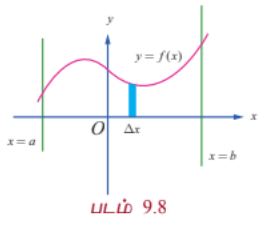

$y −$அச்சின் மிகையெண் திசையில் நோக்கும்போது, அரங்கினை சின்னஞ்சிறு பட்டைகளாக(குறுகிய செவ்வகங்களாக) உயரம் $y$ ஆகவும் அகலம் $\Delta x$ ஆகவும் இருக்குமாறு பகுக்கலாம். எனவே, $A$ என்பது செங்குத்து பட்டைகளின் பரப்புகளின் கூட்டற்தொகையின் எல்லையாகும். எனவே $A = \lim \sum y \Delta x = \int_a^b y dx = \int_a^b f(x) dx$ எனக் கிடைக்கிறது.

**நிலை (ii)**

$x = a$ மற்றும் $x = b$ ஆகிய கோடுகளுக்கு இடைப்பட்ட, $x −$ அச்சிற்கு கீழ்ப்பகுதியில் (அதாவது மூன்றாவது அல்லது நான்காம் காற்பகுதியில்) உள்ள தொடர்ச்சியான வளைவரையின் சமன்பாடு $y = f(x)$, $a \le x \le b$ என்க. இங்கு $y \le 0$ என்பது வளைவரையின் பகுதியில் உள்ள அனைத்து புள்ளிகளுக்கும் பொருந்தும். $x = a$ மற்றும் $x = b$ ஆகிய கோடுகள் $x −$ அச்சு மற்றும் வளைவரையின் வரம்பிற்குட்பட்ட (அரங்கத்தின்) பகுதியினைக் காண்போம். படம் 9.9-ல் காண்க. இப்பகுதியில் $y \le 0$ மற்றும் $y$ -யின் குறி மாறாதிருப்பது குறிப்பிடத்தக்கது. எனவே, $A$ -யின் பரப்பை பின்வருமாறு கணிக்கலாம்:

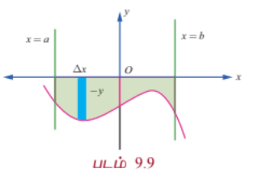

$y −$அச்சின் குறையெண் திசையில் நோக்கும்போது, அரங்கினை சின்னஞ்சிறு பட்டைகளாக(குறுகிய செவ்வகங்களாக) உயரம் $-y$ ஆகவும் அகலம் $\Delta x$ ஆகவும் இருக்குமாறு பகுக்கலாம். எனவே, $A$ என்பது செங்குத்துப் பட்டைகளின் பரப்புகளின் கூட்டல் தொகையின் எல்லையாகும். எனவே $A = \lim \sum (-y) \Delta x = -\int_a^b y dx = \int_a^b |y| dx$ ஆகும்.

**நிலை (iii)**

$x = a$ மற்றும் $x = b$ ஆகிய கோடுகளுக்கு இடைப்பட்ட, $x −$ அச்சிற்கு மேற்பகுதியிலும் அதே சமயத்தில் கீழ்ப்பகுதியிலும் (அதாவது அனைத்து காற்பகுதிகளிலும் இருக்கலாம்) உள்ள தொடர்ச்சியான வளைவரையின் சமன்பாடு $y = f(x)$, $a \le x \le b$ என்க. $xy$-தளத்தில் $y = f(x)$ வளைவரையை வரைக. $x −$ அச்சிற்கு மேலும் கீழும் மாறி மாறி அமையும் வளைவரை $x = a$ மற்றும் $x = b$ கோடுகளுக்கிடையே அமைகின்றது. $[a, b]$ எனும் இடைவெளி ஒவ்வொரு பகுதி இடைவெளியிலும் $f(x)$ ஒரே குறியில் இருக்குமாறு $[a, c_1], [c_1, c_2], \ldots, [c_k, b]$ எனும் பகுதி இடைவெளிகளாக வகுக்கப்படுகிறது. நிலை (i) மற்றும் (ii) ஆகியவற்றைப் பயன்படுத்தி, பகுதி இடைவெளிகளுக்கான அரங்குகளின் வடிவியல் பரப்பைத் தனித்தனியாக நாம் பெறலாம். எனவே $y = f(x)$, $x$-அச்சு, $x = a$ மற்றும் $x = b$ கோடுகளால் சூழப்பட்ட பகுதியின் வடிவியல் பரப்பு

$$\int_a^{c_1} |f(x)| dx + \int_{c_1}^{c_2} |f(x)| dx + \cdots + \int_{c_k}^b |f(x)| dx$$

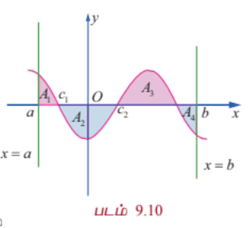

எடுத்துக்காட்டாக படம் 9.10-ல் உள்ள நிழலிடப்பட்டப் பகுதியைக் காண்போம். இங்கு $A_1, A_2, A_3$, மற்றும் $A_4$ ஆகியவை தனித்தனிப்பகுதிகளின் பரப்புகளாகும். எனவே மொத்தப்பரப்பானது

$$A = A_1 + A_2 + A_3 + A_4 = \int_a^{c_1} f(x) dx + \int_{c_1}^{c_2} (-f(x)) dx + \int_{c_2}^{c_3} f(x) dx + \int_{c_3}^b (-f(x)) dx$$

ஆகும்.

---

#### 9.8.2 ஒரு வளைவரை, $y$–அச்சு மற்றும் கோடுகள் $y = c$, $y = d$ ஆகியவற்றால் அடைபடும் அரங்கத்தின் பரப்பு
#### (Area of the region bounded by a curve, $y$– axis and the lines $y = c$ and $y = d$)

**நிலை (iv)**

$y −$அச்சிற்கு வலப்பக்கம் அமையும் தொடர்ச்சியான வளைவரையின் பகுதியின் (அதாவது முதலாவது காற்பகுதி அல்லது நான்காவது காற்பகுதியின் பகுதியாகும்) சமன்பாடு $x = f(y)$, $c \le y \le d$ என்க. இனி, வளைவரைப் பகுதியின் ஒவ்வொரு புள்ளியிலும் $x \ge 0$ ஆகும். இப்பகுதியில் $x$ -ன் குறி மாறாதது குறிப்பிடத்தக்கது. வளைவரை $y −$அச்சு, $y = c$ மற்றும் $y = d$ கோடுகளால் சூழப்பட்ட பகுதியினை படம் 9.11-ல் நிழலிடப்பட்டுள்ளதை காணலாம்.

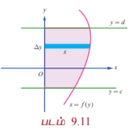

எனவே பகுதி $A$ -இன் பரப்பளவு கீழ்க்காணுமாறு கணிக்கப்படுகிறது:

$x −$ அச்சின் மிகையெண் திசை வழியாக நோக்கும்போது, அரங்கத்தினை $x$ நீளம் மற்றும் அகலம் $\Delta y$ ஆகவும் உள்ள கிடைமட்டப் பட்டைகளாக பகுக்கப் (அகலம் குறைந்த நீளமான செவ்வகங்களாக) படுகிறது. இனி $A$ என்பது கிடைமட்ட செவ்வகப் பட்டைகளின் பரப்பளவுகளின் கூட்டல் எல்லையாகும். எனவே, $A = \lim \sum x \Delta y = \int_c^d x dy$ ஆகும்.

**நிலை (v)**

$y −$அச்சிற்கு இடப்பக்கம் அமையும் தொடர்ச்சியான வளைவரையின் பகுதியின் (அதாவது இரண்டாவது காற்பகுதி அல்லது மூன்றாவது காற்பகுதியின் பகுதியாகும்) சமன்பாடு $x = f(y)$, $c \le y \le d$ என்க. இனி, வளைவரைப் பகுதியின் ஒவ்வொரு புள்ளியிலும் $x \le 0$ ஆகும். இப்பகுதியில் $x$ -ன் குறி மாறாதது குறிப்பிடத்தக்கது. வளைவரை, $y −$அச்சு, $y = c$ மற்றும் $y = d$ கோடுகளால் சூழப்பட்ட பகுதியினைக் கருதுக. இப்பகுதி படம் 9.12-ல் நிழலிடப்பட்டுள்ளது.

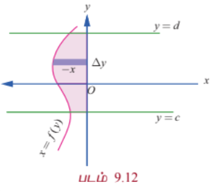

எனவே பகுதி $A$ -இன் பரப்பளவு கீழ்க்காணுமாறு கணிக்கப்படுகிறது:

$x −$ அச்சின் குறையெண் திசை வழியாக நோக்கும்போது, அரங்கத்தினை $-x$ நீளம் மற்றும் அகலம் $\Delta y$ ஆகவும் உள்ள கிடைமட்டப் பட்டைகளாக பகுக்கப் (அகலம் குறைந்த நீளமான செவ்வகங்களாக) படுகிறது. இனி, $A$ என்பது கிடைமட்ட செவ்வகப் பட்டைகளின் பரப்பளவுகளின் கூட்டல் எல்லையாகும்.

எனவே, $A = \lim \sum (-x) \Delta y = -\int_c^d x dy = \int_c^d |x| dy$ ஆகும்.

**நிலை (vi)**

$y −$அச்சிற்கு வலப்பக்கம் அமையும் அதே சமயத்தில் இடப்பக்கமும் அமையும் தொடர்ச்சியான வளைவரையின் பகுதியின் (அதாவது அனைத்து காற்பகுதியிலும் வளைவரை அடையும்) சமன்பாடு $x = f(y)$, $c \le y \le d$ என்க. $xy$-தளத்தில் $x = f(y)$ எனும் வளைவரையை வரைக. $y −$அச்சுக்கு வலப்பக்கமும் இடப்பக்கமும் மாறி மாறி அமையும் வளைவரையானது $y = c$ மற்றும் $y = d$ கோடுகளால் வெட்டப்படுகிறது. $[c, d]$ இடைவெளியை $[c, a_1], [a_1, a_2], \ldots, [a_k, d]$ எனும் பகுதி இடைவெளிகளாக, ஒவ்வொரு பகுதி இடைவெளியிலும் $f(y)$ குறி மாறாது இருக்குமாறு பகுக்க வேண்டும். நிலைகள் (iii) மற்றும் (iv) ஆகியவற்றைப் பயன்படுத்தி, பகுதி இடைவெளிகளுக்கான அரங்கங்களின் பரப்புகளின் வடிவியல் பரப்புகளைத் தனித்தனியாகப் பெறலாம்.

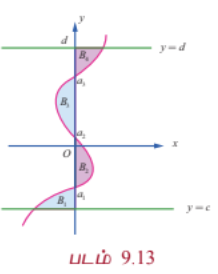

எனவே $x = f(y)$, $y$-அச்சு, $y = c$ மற்றும் $y = d$ கோடுகளால் சூழப்பட்ட பகுதியின் வடிவியல் பரப்பு

$$A = \int_c^{a_1} |f(y)| dy + \int_{a_1}^{a_2} |f(y)| dy + \cdots + \int_{a_k}^d |f(y)| dy$$

எனப் பெறுகிறோம்.

சான்றாக படம் 9.13-ல் உள்ள நிழலிடப்பட்டப் பகுதியினைக் கருதுவோம். இங்கு $B_1, B_2, B_3$ மற்றும் $B_4$ ஆகியவை தனித்தனியான பகுதிகளின் வடிவியல் பரப்புகளாகும். இனி, வளைவரை $x = f(y)$, $y$-அச்சு மற்றும் $y = c$ மற்றும் $y = d$ ஆகியவற்றால் சூழப்பட்ட பரப்பின் மொத்த பரப்பளவு

$$B = B_1 + B_2 + B_3 + B_4 = \int_c^{a_1} f(y) dy + \int_{a_1}^{a_2} (-f(y)) dy + \int_{a_2}^{a_3} f(y) dy + \int_{a_3}^d (-f(y)) dy$$

ஆகும்.

---

### எடுத்துக்காட்டு 9.47

$6x + 5y = 30$, $x −$ அச்சு, $x = -1$ மற்றும் $x = 3$ ஆகியவற்றால் அடைபடும் அரங்கத்தின் பரப்பைக் காண்க.

#### தீர்வு

தேவையான அரங்கத்தின் பரப்பானது படம் 9.14-ல் நிழலிடப்பட்டுள்ளது. இப்பரப்பானது $x −$ அச்சின் மேல் உள்ளது. எனவே தேவையான பரப்பு,

$$A = \int_{-1}^3 y dx = \int_{-1}^3 \frac{30 - 6x}{5} dx = \frac{1}{5}\left[30x - 3x^2\right]_{-1}^3$$

$$= \frac{1}{5}\left[(90 - 27) - (-30 - 3)\right] = \frac{1}{5}(63 + 33) = \frac{96}{5}$$

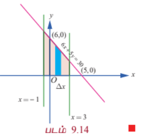

---

### எடுத்துக்காட்டு 9.48

$7x - 5y = 35$, $x −$ அச்சு மற்றும் கோடுகள் $x = -2$ மற்றும் $x = 3$ ஆகியவற்றால் அடைபடும் அரங்கத்தின் பரப்பைக் காண்க.

#### தீர்வு

தேவையான அரங்கத்தின் பரப்பானது படம் 9.15-ல் நிழலிடப்பட்டுள்ளது. இப்பரப்பானது $x −$ அச்சின் கீழ் உள்ளது. எனவே தேவையான பரப்பானது,

$$A = -\int_{-2}^3 y dx = -\int_{-2}^3 \frac{7x - 35}{5} dx = -\frac{1}{5}\left[\frac{7x^2}{2} - 35x\right]_{-2}^3$$

$$= -\frac{1}{5}\left[\left(\frac{63}{2} - 105\right) - \left(14 + 70\right)\right] = -\frac{1}{5}\left[-\frac{147}{2} - 84\right] = -\frac{1}{5}\left[-\frac{315}{2}\right] = \frac{63}{2}$$

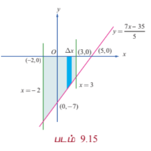

---

### எடுத்துக்காட்டு 9.49

$\frac{x^2}{a^2} + \frac{y^2}{b^2} = 1$ என்ற நீள்வட்டத்தினால் அடைபடும் அரங்கத்தின் பரப்பைக் காண்க.

#### தீர்வு

நீள்வட்டமானது நெட்டச்சு மற்றும் குற்றச்சுகளைப் பொருத்து சமச்சீராக உள்ளது. படம் 9.16-ல் நீள்வட்டம் வரையப்பட்டுள்ளது. $y$ -அச்சின் மிகைப்பகுதியின் திசையில் பார்க்கும்போது தேவையான பரப்பு $A$ ஆனது நீள்வட்டத்தின் முதல் கால் வட்டப் பகுதியில் $y = \frac{b}{a}\sqrt{a^2 - x^2}$, $0 \le x \le a$, $x -$அச்சு, $x = 0$ மற்றும் $x = a$ ஆகியவற்றால் அடைபடும் அரங்கத்தின் பரப்பைப் போல் நான்கு மடங்காகும். செங்குத்தான பட்டைகளைப் பயன்படுத்தி பரப்பு காணக் கிடைப்பது,

$$A = 4\int_0^a y dx = 4\int_0^a \frac{b}{a}\sqrt{a^2 - x^2} dx$$

$$= \frac{4b}{a}\left[\frac{x}{2}\sqrt{a^2 - x^2} + \frac{a^2}{2}\sin^{-1}\left(\frac{x}{a}\right)\right]_0^a = \frac{4b}{a}\left[\frac{a^2}{2}\cdot\frac{\pi}{2}\right] = \pi ab$$

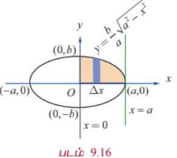

#### குறிப்பு

$x$ -அச்சின் மிகைப் பகுதியை திசையில் பார்க்கும்போது தேவையான பரப்பு $A$ ஆனது நீள்வட்டத்தின் முதல் கால் வட்டப் பகுதியில் $x = \frac{a}{b}\sqrt{b^2 - y^2}$, $0 \le y \le b$, $y$-அச்சு, $y = 0$ மற்றும் $y = b$ ஆகியவற்றால் அடைபடும் அரங்கத்தின் பரப்பைப் போல் நான்கு மடங்காகும். கிடைமட்டப் பட்டைகளைப் பயன்படுத்தி (படம் 9.17-ல்) பரப்பு காணக் கிடைப்பது,

$$A = 4\int_0^b x dy = 4\int_0^b \frac{a}{b}\sqrt{b^2 - y^2} dy$$

$$= \frac{4a}{b}\left[\frac{y}{2}\sqrt{b^2 - y^2} + \frac{b^2}{2}\sin^{-1}\left(\frac{y}{b}\right)\right]_0^b = \frac{4a}{b}\left[\frac{b^2}{2}\cdot\frac{\pi}{2}\right] = \pi ab$$

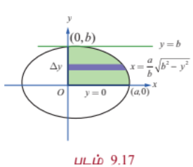

#### குறிப்பு

மேலே உள்ள முடிவில் $b = a$ என பிரதியிடக் கிடைப்பது $x^2 + y^2 = a^2$ என்ற வட்டத்தால் அடைபடும் அரங்கத்தின் பரப்பு $\pi a^2$ ஆகும்.

---

### எடுத்துக்காட்டு 9.50

$y^2 = 4ax$ என்ற பரவளையத்திற்கும் அதன் செவ்வகலத்திற்கும் அடைபடும் அரங்கத்தின் பரப்பைக் காண்க.

#### தீர்வு

செவ்வகலத்தின் சமன்பாடு $x = a$ ஆகும். இச்செவ்வகலம் பரவளையத்தை $L(a, 2a)$ மற்றும் $L'(a, -2a)$ என்ற புள்ளிகளில் வெட்டுகிறது. தேவையான பரப்பு படம் 9.18ல் நிழலிடப்பட்டுள்ளது.

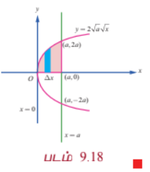

பரவளையம் சமச்சீராக இருப்பதால் தேவையான பரப்பு $A$ ஆனது $y = 2\sqrt{ax}$ என்ற பரவளையத்தின் பகுதி $x -$அச்சு, $x = 0$ மற்றும் $x = a$ ஆகியவற்றால் அடைபடும் பரப்பைப் போல் இரு மடங்காகும்.

எனவே செங்குத்தான பட்டைகளைப் பயன்படுத்தி பரப்பு காண நமக்குக் கிடைப்பது

$$A = 2\int_0^a y dx = 2\int_0^a 2\sqrt{ax} dx = 4\sqrt{a}\left[\frac{2}{3}x^{\frac{3}{2}}\right]_0^a = \frac{8}{3}a^2$$

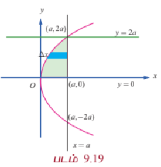

#### குறிப்பு

$x$ -அச்சின் மிகைப் பகுதியின் திசையில், பரப்பு காண கிடைமட்ட பட்டைகளை பயன்படுத்த (படம் 9.19-ல் காண்க) நமக்குக் கிடைக்கும் பரப்பானது

$$A = 2\int_0^{2a} \left(a - \frac{y^2}{4a}\right) dy = 2\left[ay - \frac{y^3}{12a}\right]_0^{2a} = 2\left[2a^2 - \frac{8a^3}{12a}\right] = 2\left[2a^2 - \frac{2a^2}{3}\right] = \frac{8a^2}{3}$$

#### குறிப்பு

மேற்காணும் பரப்பானது பரவளையத்தின் செவ்வகலத்தை அடிப்பக்கமாகவும் மற்றும் பரவளையத்தின் குவியத்திற்கும் முனைக்கும் உள்ள தூரத்தை உயரமாகவும் கொண்ட பரப்பில் மூன்றில் இரண்டு பங்கு ஆகும். இது பரவளையத்திற்கு கீழ் உள்ள பரப்பளவானது இவ்வளைவின் அடிப்பகுதியை நீளமாகவும் வளைவின் உயரத்தை அகலமாகவும் கொண்ட செவ்வகத்தின் பரப்பில் மூன்றில் இரண்டு பங்கு என்ற ஆர்க்கிமிடிஸ் சூத்திரத்தை நிறைவு செய்கிறது. மேலும் இப்பரப்பானது செவ்வகலத்தை அடிப்பக்கமாகவும், முனைக்கும் குவியத்திற்கும் உள்ள தூரத்தை உயரமாகவும் கொண்ட முக்கோணத்தின் பரப்பில் மூன்றில் நான்கு பங்கிற்குச் சமம்.

---

### எடுத்துக்காட்டு 9.51

$y^2 = 5x + 4y$ என்ற பரவளையத்திற்கும் $y$ -அச்சிற்கும் அடைபடும் அரங்கத்தின் பரப்பைக் காண்க.

#### தீர்வு

பரவளையத்தின் சமன்பாடானது $(y - 2)^2 = 5(x + \frac{4}{5})$ இது $y$ -அச்சில் $(0, -1)$ மற்றும் $(0, 5)$ வழிச் செல்கிறது. இதன் முனை $\left(-\frac{4}{5}, 2\right)$ மற்றும் பரவளையத்தின் அச்சானது $y = 2$. தேவையான பரப்பு படம் 9.20-ல் நிழலிடப்பட்டுள்ளது.

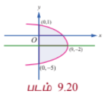

$x −$ அச்சின் மிகைப்பகுதியின் திசையில் நோக்கி பரப்பு காண, கிடைமட்டப் பட்டைகளைப் பயன்படுத்த நமக்குக் கிடைக்கும் பரப்பானது,

$$A = \int_{-1}^5 x dy = \int_{-1}^5 \frac{y^2 - 4y}{5} dy = \frac{1}{5}\left[\frac{y^3}{3} - 2y^2\right]_{-1}^5$$

$$= \frac{1}{5}\left[\left(\frac{125}{3} - 50\right) - \left(-\frac{1}{3} - 2\right)\right] = \frac{1}{5}\left[-\frac{25}{3} + \frac{7}{3}\right] = -\frac{18}{15} = -\frac{6}{5}$$

இது எதிர்மறை மதிப்பு. பரப்பு எப்போதும் நேர்மறை. எனவே தவறு. மேலே உள்ள கணக்கீடு தவறு.

$y^2 = 5x + 4y \Rightarrow x = \frac{y^2 - 4y}{5}$. $y = -1$ எனில் $x = \frac{1 + 4}{5} = 1$, $y = 5$ எனில் $x = \frac{25 - 20}{5} = 1$. எனவே $x$ -ஐ $y$ -இல் எதிர்மறை பெறவில்லை. எனவே $x \ge 0$ என $y$ -க்கு இடையில். எனவே $A = \int_{-1}^5 \frac{y^2 - 4y}{5} dy$ என்பது சரியானது. ஆனால் $y$ -க்கு இடையில் $x$ -ன் மதிப்பு எதிர்மறையாக இல்லை. எனவே $A$ நேர்மறை. $A = \frac{1}{5}\left[\frac{y^3}{3} - 2y^2\right]_{-1}^5 = \frac{1}{5}\left[\left(\frac{125}{3} - 50\right) - \left(-\frac{1}{3} - 2\right)\right] = \frac{1}{5}\left[-\frac{25}{3} + \frac{7}{3}\right] = -\frac{6}{5}$. இது சரியில்லை.

எனவே $x = \frac{y^2 - 4y}{5}$ என்பதை $\frac{(y-2)^2 - 4}{5}$ என எழுதலாம். $y = -1$ மற்றும் $y = 5$ இல் $x = 1$. $y = 2$ இல் $x = -\frac{4}{5}$. எனவே $x$ -ன் மதிப்பு $-1 < y < 5$ -க்கு எதிர்மறை. எனவே பரப்பு $A = -\int_{-1}^5 x dy = -\int_{-1}^5 \frac{y^2 - 4y}{5} dy = \frac{6}{5}$.

---

### எடுத்துக்காட்டு 9.52

$y = \sin x$ என்ற வளைவரை, $x −$ அச்சு, கோடுகள் $x = 0$ மற்றும் $x = 2\pi$ ஆகியவற்றால் அடைபடும் அரங்கத்தின் பரப்பைக் காண்க.

#### தீர்வு

தேவையான பரப்பு படம் 9.21-ல் நிழலிடப்பட்டுள்ளது. பரப்பின் ஒரு பகுதியானது $x −$ அச்சின் மேல் $x = 0$ மற்றும் $x = \pi$ ஆகியவற்றுக்கு இடையில் அமைந்துள்ளது. மற்றொரு பகுதியானது $x −$ அச்சின் கீழ் $x = \pi$ மற்றும் $x = 2\pi$ ஆகியவற்றுக்கு இடையே அமைந்துள்ளது. எனவே தேவையான பரப்பானது.

$$A = \int_0^{\pi} y dx - \int_{\pi}^{2\pi} y dx = \int_0^{\pi} \sin x dx - \int_{\pi}^{2\pi} \sin x dx$$

$$= \left[-\cos x\right]_0^{\pi} - \left[-\cos x\right]_{\pi}^{2\pi} = (1 + 1) - (-1 - 1) = 2 + 2 = 4$$

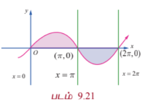

#### குறிப்பு

$\int_0^{2\pi} \sin x dx$ என்ற தொகையிடலின் மதிப்பு காண்போம்.

$$\int_0^{2\pi} \sin x dx = \left[-\cos x\right]_0^{2\pi} = -\cos 2\pi + \cos 0 = -1 + 1 = 0$$

எனவே $\int_0^{2\pi} f(x) dx$ என்பது $y = \sin x$, $x −$ அச்சு, கோடுகள் $x = 0$ மற்றும் $x = 2\pi$ ஆகியவற்றுக்கு இடையே அமையும் அரங்கத்தின் பரப்பைக் குறிப்பதில்லை.

---

### எடுத்துக்காட்டு 9.53

$y = \cos x$ என்ற வளைவரை $x −$ அச்சு, கோடுகள் $x = 0$ மற்றும் $x = \pi$ ஆகியவற்றால் அடைபடும் அரங்கத்தின் பரப்பைக் காண்க.

#### தீர்வு

கொடுக்கப்பட்ட வளைவரையானது

$$y = \begin{cases}
\cos x, & 0 \le x \le \frac{\pi}{2} \\
-\cos x, & \frac{\pi}{2} \le x \le \pi
\end{cases}$$

வளைவரையானது $x −$ அச்சின் மேல் உள்ளது. தேவையான பரப்பு, படம் 9.22-ல் நிழலிடப்பட்டுள்ளது. எனவே தேவையான பரப்பு

$$A = \int_0^{\pi} |\cos x| dx = \int_0^{\frac{\pi}{2}} \cos x dx - \int_{\frac{\pi}{2}}^{\pi} \cos x dx$$

$$= \left[\sin x\right]_0^{\frac{\pi}{2}} - \left[\sin x\right]_{\frac{\pi}{2}}^{\pi} = (1 - 0) - (0 - 1) = 1 + 1 = 2$$

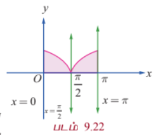

---

#### 9.8.3 இரு வளைவரைகளால் அடைபடும் அரங்கத்தின் பரப்பு
#### (Area of the region bounded between two curves)

**நிலை (i)**

$y = f(x)$ மற்றும் $y = g(x)$ என்ற இரு வளைவரைகளின் சமன்பாடுகள் மற்றும் $xoy$-தளத்தில் $f(x) \ge g(x)$ $\forall x \in [a, b]$ என்க. இவ்விரு வளைவரைகளுக்கும் $x = a$ மற்றும் $x = b$ என்ற கோடுகளுக்கும் இடையே அடைபடும் அரங்கத்தின் பரப்பு $A$ -ஐ நாம் காண்போம்.

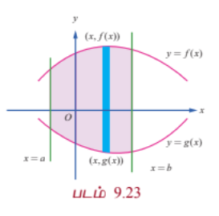

தேவையான பரப்பு படம் 9.23-ல் நிழலிடப்பட்டுள்ளது. பரப்பு $A$ -ஐக் காண அரங்கத்தின் பரப்பை அகலம் $\Delta x$ என இருக்குமாறு சிறு பட்டைகளாகப் பிரித்துக் கொள்வோம். உயரம் $f(x) - g(x)$ எனக் கொள்வோம். $f(x) - g(x) \ge 0$, $\forall x \in [a, b]$ என்பதை கவனத்தில் கொள்வோம். எல்லைகளின் கூடுதலாக செங்குத்து பட்டைகளைக் கொண்டு முன்பு கணக்கிட்ட முறையில் பரப்பைக் காண்போம். எனவே நாம் பெறுவது,

$$A = \int_a^b [f(x) - g(x)] dx$$

#### குறிப்பு

$y −$அச்சின் மிகைப் பகுதியின் திசையில் பார்க்கும்போது $y = f(x)$ என்ற வளைவரையை மேல் வளைவரை ($U$) மற்றும் $y = g(x)$ என்ற வளைவரையை கீழ் வளைவரை ($L$) என அழைப்போம். இவ்வாறாக நாம் பெறுவது $A = \int_a^b [y_U - y_L] dx$.

**நிலை (ii)**

$x = f(y)$ மற்றும் $x = g(y)$ என்பன இரு வளைவரைகளின் சமன்பாடுகள் மற்றும் $xoy$-தளத்தில் $f(y) \ge g(y)$ $\forall y \in [c, d]$ என்க. இவ்விரு வளைவரைக்கும் $y = c$ மற்றும் $y = d$ என்ற கோடுகளுக்கும் இடையில் உள்ள அரங்கத்தின் பரப்பு $A$ -ஐ நாம் காண்போம். தேவையான பரப்பு படம் 9.24-ல் நிழலிடப்பட்டுள்ளது.

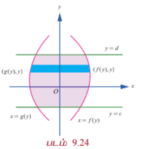

பரப்பு $A$-ஐக் காண அரங்கத்தின் பரப்பை $x −$ அச்சின் மிகைப்பகுதியை காண, $\Delta y$ அகலம் உடைய சிறு பட்டைகளாகப் பிரிப்போம். உயரம் $f(y) - g(y)$ எனக் கொள்வோம்.

$f(y) - g(y) \ge 0$, $\forall y \in [c, d]$ என்பதை கவனத்தில் கொள்வோம். எல்லைகளின் கூடுதலாக கிடைமட்ட பட்டைகளைக் கொண்டு முன்பு கணக்கிட்ட முறையில் பரப்பைக் காண்போம். எனவே நாம் பெறுவது $A = \int_c^d [f(y) - g(y)] dy$.

#### குறிப்பு

$x −$ அச்சின் மிகைப் பகுதியின் திசையில் பார்க்கும்போது $x = f(y)$ என்ற வளைவரை வலது வளைவரை ($R$) என்றும், மற்றும் $x = g(y)$ என்ற வளைவரை இடது வளைவரை ($L$) என்றும் அழைக்கப்படும். இவ்வாறாக நாம் பெறுவது $A = \int_c^d [x_R - x_L] dy$.

---

### எடுத்துக்காட்டு 9.54

$y^2 = 4x$ மற்றும் $x^2 = 4y$ என்ற பரவளையங்களால் அடைபடும் அரங்கத்தின் பரப்பைக் காண்க.

#### தீர்வு

முதலில் வளைவரைகள் வெட்டும் புள்ளிகளைக் காண்போம். இதற்கு $y^2 = 4x$ மற்றும் $x^2 = 4y$ என்ற சமன்பாடுகளைத் தீர்க்க வேண்டும். இரு சமன்பாடுகளிலும் $y$ -ஐ நீக்கக் கிடைப்பது $x^4 = 64x$. எனவே $x = 0$ மற்றும் $x = 4$. எனவே வெட்டும் புள்ளிகள் $(0, 0)$ மற்றும் $(4, 4)$ ஆகும். தேவையான அரங்கத்தின் பரப்பு படம் 9.25-ல் நிழலிடப்பட்டுள்ளது.

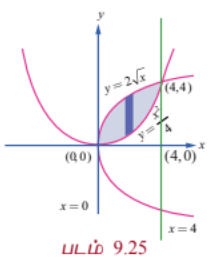

$y$ -அச்சின் மிகைப்பகுதியின் திசையில் பார்க்கும்போது, மேற்புற எல்லையின் சமன்பாடு $y = 2\sqrt{x}$, $0 \le x \le 4$ மற்றும் கீழ் எல்லையின் சமன்பாடு $y = \frac{x^2}{4}$, $0 \le x \le 4$. எனவே தேவையான பரப்பு,

$$A = \int_0^4 [y_U - y_L] dx = \int_0^4 \left(2\sqrt{x} - \frac{x^2}{4}\right) dx = \left[\frac{4}{3}x^{\frac{3}{2}} - \frac{x^3}{12}\right]_0^4$$

$$= \frac{4}{3}(8) - \frac{64}{12} = \frac{32}{3} - \frac{16}{3} = \frac{16}{3}$$

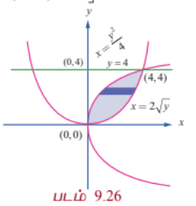

#### குறிப்பு

$x$ -அச்சின் மிகைப்பகுதியின் திசையில் பார்க்கும்போது வலது எல்லையின் வளைவரையின் சமன்பாடு $x^2 = 4y$ அதாவது $x = 2\sqrt{y}$, $0 \le y \le 4$ மற்றும் இடது எல்லையின் வளைவரையின் சமன்பாடு $y^2 = 4x$ அதாவது $x = \frac{y^2}{4}$, $0 \le y \le 4$. படம் 9.26 பார்க்கவும். எனவே தேவையான பரப்பு $A$ என்பது

$$A = \int_0^4 [x_R - x_L] dy = \int_0^4 \left(2\sqrt{y} - \frac{y^2}{4}\right) dy = \left[\frac{4}{3}y^{\frac{3}{2}} - \frac{y^3}{12}\right]_0^4$$

$$= \frac{4}{3}(8) - \frac{64}{12} = \frac{32}{3} - \frac{16}{3} = \frac{16}{3}$$

---

### எடுத்துக்காட்டு 9.55

பரவளையம் $x = y^2$ மற்றும் வளைவரை $y = |x|$ ஆகியவற்றால் அடைபடும் அரங்கத்தின் பரப்பைக் காண்க.

#### தீர்வு

இரு வளைவரைகளும் $y$ -அச்சைப் பொருத்து சமச்சீராக உள்ளன. வளைவரை $y = |x|$ ஆனது

$$y = \begin{cases}
x, & x \ge 0 \\
-x, & x < 0
\end{cases}$$

இவ்வளைவரையானது பரவளையம் $x = y^2$ -ஐ $(1, 1)$ மற்றும் $(-1, 1)$ என்ற புள்ளிகளில் வெட்டும். இரு வளைவரைகளுக்கும் அடைப்பட்ட அரங்கத்தின் பரப்பு படம் 9.27-ல் நிழலிடப்பட்டுள்ளது. இப்பரப்பானது முதல் மற்றும் இரண்டாவது கால் வட்டப் பகுதியில் அமைந்துள்ளன. பரவளையம் சமச்சீராக இருப்பதால் தேவையான பரப்பு முதல் கால் பகுதியில் உள்ளதை போல் இரு மடங்காகும்

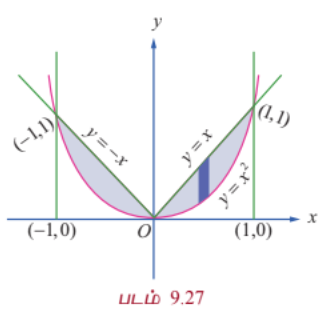

முதல் கால் வட்டப் பகுதியில் $y = x$, $0 \le x \le 1$ என்ற வளைவரை மேல் உள்ளது மற்றும் $y = \sqrt{x}$, $0 \le x \le 1$ என்ற வளைவரை கீழ் உள்ளது. எனவே தேவையான பரப்பானது

$$A = 2\int_0^1 [y_U - y_L] dx = 2\int_0^1 (x - \sqrt{x}) dx = 2\left[\frac{x^2}{2} - \frac{2}{3}x^{\frac{3}{2}}\right]_0^1 = 2\left(\frac{1}{2} - \frac{2}{3}\right) = -\frac{1}{3}$$

இது தவறு. முதல் கால் பகுதியில் $y = \sqrt{x}$ என்பது மேல் வளைவரை மற்றும் $y = x$ என்பது கீழ் வளைவரை. எனவே

$$A = 2\int_0^1 (\sqrt{x} - x) dx = 2\left[\frac{2}{3}x^{\frac{3}{2}} - \frac{x^2}{2}\right]_0^1 = 2\left(\frac{2}{3} - \frac{1}{2}\right) = \frac{1}{3}$$

---

### எடுத்துக்காட்டு 9.56

$y = \cos x$ மற்றும் $y = \sin x$ என்ற வளைவரைகள் $x = \frac{\pi}{4}$ மற்றும் $x = \frac{5\pi}{4}$ என்ற கோடுகள் ஆகியவற்றுக்கு இடையே உள்ள அரங்கத்தின் பரப்பைக் காண்க.

#### தீர்வு

தேவையான அரங்கத்தின் பரப்பு படம் 9.28-ல் நிழலிடப்பட்டுள்ளது. அரங்கத்தின் மேல் எல்லை $y = \sin x$, $\frac{\pi}{4} \le x \le \frac{5\pi}{4}$ மற்றும் அரங்கத்தின் கீழ் எல்லை $y = \cos x$, $\frac{\pi}{4} \le x \le \frac{5\pi}{4}$. தேவையான பரப்பு,

$$A = \int_{\frac{\pi}{4}}^{\frac{5\pi}{4}} [y_U - y_L] dx = \int_{\frac{\pi}{4}}^{\frac{5\pi}{4}} (\sin x - \cos x) dx = \left[-\cos x - \sin x\right]_{\frac{\pi}{4}}^{\frac{5\pi}{4}}$$

$$= \left[-\cos\frac{5\pi}{4} - \sin\frac{5\pi}{4}\right] - \left[-\cos\frac{\pi}{4} - \sin\frac{\pi}{4}\right]$$

$$= \left[\frac{1}{\sqrt{2}} + \frac{1}{\sqrt{2}}\right] - \left[-\frac{1}{\sqrt{2}} - \frac{1}{\sqrt{2}}\right] = \frac{2}{\sqrt{2}} + \frac{2}{\sqrt{2}} = 2\sqrt{2}$$

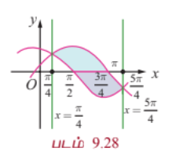

---

### எடுத்துக்காட்டு 9.57

$x^2 + y^2 = a^2$ என்ற வட்டத்தில் உள்ள அரங்கத்தின் பரப்பை $x = h$ என்ற கோடு இரு பகுதிகளாக பிரிக்கின்றது எனில் சிறிய பகுதியின் பரப்பைக் காண்க.

#### தீர்வு

சிறிய பகுதியின் பரப்பு படம் 9.29-ல் நிழலிடப்பட்டுள்ளது. இங்கு $0 < h < a$ வட்டம் $x$ -அச்சைப் பொருத்து சமச்சீராக இருப்பதால் சிறிய பகுதியின் பரப்பு,

$$A = 2\int_h^a y dx = 2\int_h^a \sqrt{a^2 - x^2} dx$$

$$= 2\left[\frac{x}{2}\sqrt{a^2 - x^2} + \frac{a^2}{2}\sin^{-1}\left(\frac{x}{a}\right)\right]_h^a$$

$$= 2\left[0 + \frac{a^2}{2}\cdot\frac{\pi}{2} - \frac{h}{2}\sqrt{a^2 - h^2} - \frac{a^2}{2}\sin^{-1}\left(\frac{h}{a}\right)\right]$$

$$= a^2\frac{\pi}{2} - h\sqrt{a^2 - h^2} - a^2\sin^{-1}\left(\frac{h}{a}\right)$$

$$= a^2\left(\frac{\pi}{2} - \sin^{-1}\left(\frac{h}{a}\right)\right) - h\sqrt{a^2 - h^2}$$

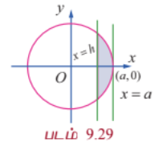

---

### எடுத்துக்காட்டு 9.58

பரவளையம் $y^2 = 4x$, கோடு $x + y = 3$ மற்றும் $y$ -அச்சு ஆகியவற்றால் முதல் கால் வட்டப் பகுதியில் அடைபடும் அரங்கத்தின் பரப்பைக் காண்க.

#### தீர்வு

முதலில் $x + y = 3$ மற்றும் $y^2 = 4x$ வெட்டிக் கொள்ளும் புள்ளிகளை காண்போம்.

$x = 3 - y \Rightarrow y^2 = 4(3 - y) \Rightarrow y^2 + 4y - 12 = 0 \Rightarrow (y + 6)(y - 2) = 0 \Rightarrow y = 2, -6$.

$x = 1$ என $x + y = 3$ -ல் பிரதியிடக் கிடைப்பது $y = 2$.

$x = 9$ என $x + y = 3$ பிரதியிடக் கிடைப்பது $y = -6$.

எனவே வெட்டும் புள்ளிகள் $(1, 2)$ மற்றும் $(9, -6)$ ஆகும்.

கோடு $x + y = 3$ என்பது $y$ -அச்சை $(0, 3)$ எனும் புள்ளியில் சந்திக்கின்றது. தேவையான பரப்பு படம் 9.30-ல் நிழலிடப்பட்டுள்ளது

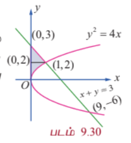

$y$ -அச்சின் மிகைப்பகுதியை நோக்கிப் பார்க்கும்போது வலது எல்லையில் அமைந்துள்ள வளைவரையானது

$$x = \begin{cases}
\frac{y^2}{4}, & 0 \le y \le 2 \\
3 - y, & 2 \le y \le 3
\end{cases}$$

$$\therefore A = \int_0^2 x_R dy + \int_2^3 x_R dy = \int_0^2 \frac{y^2}{4} dy + \int_2^3 (3 - y) dy$$

$$= \left[\frac{y^3}{12}\right]_0^2 + \left[3y - \frac{y^2}{2}\right]_2^3 = \frac{8}{12} + \left(9 - \frac{9}{2}\right) - \left(6 - 2\right) = \frac{2}{3} + \frac{9}{2} - 4 = \frac{4 + 27 - 24}{6} = \frac{7}{6}$$

---

### எடுத்துக்காட்டு 9.59

கோடுகள் $5x - 2y = 15$, $x + y + 4 = 0$ மற்றும் $x$-அச்சு ஆகியவற்றால் அடைபடும் அரங்கத்தின் பரப்பை தொகையிடல் மூலம் காண்க.

#### தீர்வு

கோடுகள் $5x - 2y = 15$, $x + y + 4 = 0$ வெட்டும் புள்ளி $(1, -5)$. $5x - 2y = 15$ என்ற கோடு $x$-அச்சை சந்திக்கும் புள்ளி $(3, 0)$. கோடு $x + y + 4 = 0$, $x$-அச்சை $(-4, 0)$ -ல் சந்திக்கிறது. தேவையான பரப்பு படம் 9.31-ல் நிழலிடப்பட்டுள்ளது. இப்பரப்பானது $x$-அச்சின் மேல் பகுதியில் உள்ளது. இப்பரப்பை செங்குத்துப் பட்டைகள் அல்லது கிடைமட்டப் பட்டைகளைப் பயன்படுத்தி கணக்கிடலாம்.

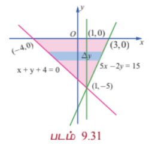

செங்குத்துப் பட்டைகளைப் பயன்படுத்தி அரங்கத்தின் பரப்பு காண அரங்கத்தை $x = 1$ கோடு வழியாக இரு பிரிவுகளாகப் பிரிக்க வேண்டும்.

எனவே நமக்கு கிடைப்பது,

$$A = \int_{-4}^1 y dx + \int_1^3 y dx = \int_{-4}^1 \left(-x - 4\right) dx + \int_1^3 \left(\frac{5x - 15}{2}\right) dx$$

$$= \left[-\frac{x^2}{2} - 4x\right]_{-4}^1 + \left[\frac{5x^2}{4} - \frac{15x}{2}\right]_1^3$$

$$= \left[\left(-\frac{1}{2} - 4\right) - \left(-8 + 16\right)\right] + \left[\left(\frac{45}{4} - \frac{45}{2}\right) - \left(\frac{5}{4} - \frac{15}{2}\right)\right]$$

$$= \left[-\frac{9}{2} - 8\right] + \left[-\frac{45}{4} + \frac{25}{4}\right] = -\frac{25}{2} - 5 = -\frac{35}{2}$$

$A = \frac{35}{2}$.

கிடைமட்டப் பட்டைகளைக் கொண்டு பரப்பு காணும்போது அரங்கத்தை இரு பகுதிகளாகப் பிரிக்கத் தேவையில்லை. இம்முறையில் பரப்பின் வலது பக்க எல்லை $5x - 2y = 15$ என்ற கோடு மற்றும் இடது பக்க எல்லை $x + y + 4 = 0$ என்ற கோடு ஆகும். எனவே நமக்கு கிடைப்பது,

$$A = \int_0^5 [x_R - x_L] dy = \int_0^5 \left[\frac{15 + 2y}{5} - (-y - 4)\right] dy = \int_0^5 \left(3 + \frac{2y}{5} + y + 4\right) dy$$

$$= \int_0^5 \left(7 + \frac{7y}{5}\right) dy = \left[7y + \frac{7y^2}{10}\right]_0^5 = 35 + \frac{175}{10} = 35 + 17.5 = 52.5$$

இது தவறு. $x_L = -y - 4$, $x_R = \frac{15 + 2y}{5}$. $y = 0$ இல் $x_L = -4$, $x_R = 3$. $y = 5$ இல் $x_L = -9$, $x_R = 5$. எனவே $x_R > x_L$. $A = \int_0^5 [x_R - x_L] dy = \int_0^5 \left[\frac{15 + 2y}{5} + y + 4\right] dy = \int_0^5 \left(7 + \frac{7y}{5}\right) dy = \frac{35}{2}$.

#### குறிப்பு

முக்கோண வடிவத்தில் உள்ள அரங்கத்தின் அடிப்பக்கம் 7 அலகுகளாகும் மற்றும் உயரம் 5 அலகுகளாகவும் உள்ளது. எனவே தொகையிடலை பயன்படுத்தாமலே அதன் பரப்பானது $\frac{35}{2}$ என காணலாம்.

---

### எடுத்துக்காட்டு 9.60

$(-1, 1)$, $(3, 2)$, $(0, 5)$ என்பன $A, B$, மற்றும் $C$-யின் புள்ளிகள் எனில் முக்கோணம் $ABC$ ஆல் அடைபடும் அரங்கத்தின் பரப்பை தொகையிடலைப் பயன்படுத்தி காண்க.

#### தீர்வு

படம் 9.32-ஐ பார்க்க.

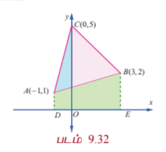

$AB$ -யின் சமன்பாடு $y - 1 = \frac{2 - 1}{3 + 1}(x + 1) \Rightarrow y = \frac{1}{4}x + \frac{5}{4}$

$BC$-யின் சமன்பாடு $y - 2 = \frac{5 - 2}{0 - 3}(x - 3) \Rightarrow y = -x + 5$

$AC$-யின் சமன்பாடு $y - 1 = \frac{5 - 1}{0 + 1}(x + 1) \Rightarrow y = 4x + 5$

$$\therefore \text{எனவே } \triangle ABC \text{ -யின் பரப்பு}$$

$$= \triangle ACO\text{-யின் பரப்பு} + \triangle OCB\text{-யின் பரப்பு} - \triangle ABO\text{-யின் பரப்பு}$$

$$= \int_{-1}^0 (4x + 5) dx + \int_0^3 (-x + 5) dx - \int_{-1}^3 \left(\frac{x}{4} + \frac{5}{4}\right) dx$$

$$= \left[2x^2 + 5x\right]_{-1}^0 + \left[-\frac{x^2}{2} + 5x\right]_0^3 - \left[\frac{x^2}{8} + \frac{5x}{4}\right]_{-1}^3$$

$$= (0 - (2 - 5)) + \left(\left(-\frac{9}{2} + 15\right) - 0\right) - \left(\left(\frac{9}{8} + \frac{15}{4}\right) - \left(\frac{1}{8} - \frac{5}{4}\right)\right)$$

$$= 3 + \frac{21}{2} - \left(\frac{9}{8} + \frac{30}{8} - \frac{1}{8} + \frac{10}{8}\right) = 3 + \frac{21}{2} - \frac{48}{8} = 3 + 10.5 - 6 = 7.5 = \frac{15}{2}$$

---

### எடுத்துக்காட்டு 9.61

$x^2 + y^2 = 4$ என்ற வட்டத்தில் $(1, \sqrt{3})$ எனும் புள்ளியில் தொடுகோடு, செங்கோடு மற்றும் $x$-அச்சு ஆகியவற்றால் அடைபடும் அரங்கத்தின் பரப்பை தொகையிடலைப் பயன்படுத்தி காண்க.

#### தீர்வு

$x^2 + y^2 = a^2$ என்ற வட்டத்திற்கு $(x_1, y_1)$ எனும் புள்ளியில் தொடுகோட்டின் சமன்பாடு $xx_1 + yy_1 = a^2$ என நாம் அறிவோம். எனவே $x^2 + y^2 = 4$ என்ற வட்டத்திற்கு $(1, \sqrt{3})$ எனும் புள்ளியில் தொடுகோட்டின் சமன்பாடு $x + \sqrt{3}y = 4$; அதாவது $y = -\frac{1}{\sqrt{3}}(x - 4)$. தொடுகோடு $(4,0)$ எனும் புள்ளியில் $x$-அச்சை சந்திக்கிறது. எனவே தொடுகோட்டின் சாய்வு $-\frac{1}{\sqrt{3}}$. எனவே செங்கோட்டின் சாய்வு $\sqrt{3}$. செங்கோட்டின் சமன்பாடு $y - \sqrt{3} = \sqrt{3}(x - 1)$; அதாவது $y = \sqrt{3}x$. இக்கோடு ஆதி வழிச் செல்கிறது. தேவையான பரப்பானது அருகில் உள்ள படத்தில் நிழலிடப்பட்டுள்ளது. இப்பரப்பினை இரு வழிகளில் காணலாம்.

**முறை 1**

$y$-அச்சின் மிகை திசையில் நோக்கி பார்க்கும் போது, தேவையான அரங்கத்தின் பரப்பானது $x$-அச்சு, $y = \sqrt{3}x$ மற்றும் $x + \sqrt{3}y = 4$ ஆகியவற்றால் அடைபடும் பரப்பாகும். இதற்கு $\int_a^b y dx$ என்ற சூத்திரத்தைப் பயன்படுத்துவோம். இதற்குத் தேவையான அரங்கத்தின் பரப்பை இரு பகுதிகளாக பிரித்துக் காண்போம். ஒரு பகுதியானது $x$-அச்சு, செங்கோடு $y = \sqrt{3}x$ மற்றும் $x = 1$ ஆகியவற்றால் அடைபடும் அரங்கத்தின் பரப்பு மற்றொரு பகுதியானது $x$-அச்சு தொடுகோடு $x + \sqrt{3}y = 4$ மற்றும் $x = 1$ ஆகியவற்றால் அடைபடும் அரங்கத்தின் பரப்பு ஆகும்.

$$\therefore \text{தேவையான பரப்பு} = \int_0^1 y dx + \int_1^4 y dx = \int_0^1 \sqrt{3}x dx + \int_1^4 \frac{4 - x}{\sqrt{3}} dx$$

$$= \left[\frac{\sqrt{3}}{2}x^2\right]_0^1 + \frac{1}{\sqrt{3}}\left[4x - \frac{x^2}{2}\right]_1^4 = \frac{\sqrt{3}}{2} + \frac{1}{\sqrt{3}}\left[(16 - 8) - \left(4 - \frac{1}{2}\right)\right]$$

$$= \frac{\sqrt{3}}{2} + \frac{1}{\sqrt{3}}\left[8 - \frac{7}{2}\right] = \frac{\sqrt{3}}{2} + \frac{1}{\sqrt{3}}\left(\frac{9}{2}\right) = \frac{\sqrt{3}}{2} + \frac{3\sqrt{3}}{2} = 2\sqrt{3}$$

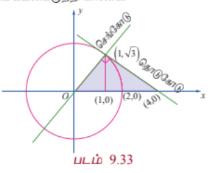

**முறை 2**

$x$-அச்சின் மிகை திசையில் நோக்கி பார்க்கும் போது, தேவையான அரங்கத்தின் பரப்பானது $y = \sqrt{3}x$, $x + \sqrt{3}y = 4$, $y = 0$ மற்றும் $y = \sqrt{3}$ ஆகியவற்றால் அடைபடும் பரப்பாகும். இப்பரப்பைக் காண $\int_c^d [x_R - x_L] dy$ என்ற சூத்திரத்தைப் பயன்படுத்த வேண்டும்.

இங்கு $c = 0$, $d = \sqrt{3}$, $x_R$ என்பது தொடுகோடு $x + \sqrt{3}y = 4$ மற்றும் $x_L$ என்பது செங்கோடு $y = \sqrt{3}x$ இன் $x$ மதிப்பாகும்.

$$\therefore \text{தேவையான பரப்பு} = \int_0^{\sqrt{3}} [x_R - x_L] dy = \int_0^{\sqrt{3}} \left(4 - \sqrt{3}y - \frac{y}{\sqrt{3}}\right) dy$$

$$= \left[4y - \frac{\sqrt{3}}{2}y^2 - \frac{y^2}{2\sqrt{3}}\right]_0^{\sqrt{3}} = 4\sqrt{3} - \frac{3\sqrt{3}}{2} - \frac{\sqrt{3}}{2} = 4\sqrt{3} - 2\sqrt{3} = 2\sqrt{3}$$

---

$y = f_1(x), y = f_2(x)$ கோடுகள் $x = a$ மற்றும் $x = b$, $a < b$ ஆகியவற்றால் அடைபடும் அரங்கத்தின் பரப்பைக் காண வழிமுறைகள்:

$y$-அச்சுக்கு இணையாக அரங்கத்தின் தளத்தை வெட்டும் வகையில் தன்னிச்சையாக ஒரு கோடு வரைக. முதலில் அரங்கத்திற்குள் நுழையும் கோட்டின் $y$-புள்ளியைக் காண்க. இதை $y_{ENTRY}$ என அழைக்கவும். அடுத்ததாக அரங்கத்திற்குள் இருந்து வெளியேறும் கோட்டின் $y$-புள்ளியைக் காண்க. இதை $y_{EXIT}$ என அழைக்கவும். வளைவரைகளின் எல்லைச் சமன்பாடுகளைக் கொண்டு $y_{ENTRY}$ மற்றும் $y_{EXIT}$ காண முடியும். எனவே தேவையான பரப்பு $\int_a^b [y_{EXIT} - y_{ENTRY}] dx$.

$x = g_1(y), x = g_2(y)$ கோடுகள் $y = c$ மற்றும் $y = d$, $c < d$ ஆகியவற்றால் அடைபடும் அரங்கத்தின் பரப்பை காண வழிமுறைகள்:

$x$-அச்சுக்கு இணையாக அரங்கத்தின் தளத்தை வெட்டும் வகையில் தன்னிச்சையாக ஒரு கோடு வரைக. முதலில் அரங்கத்திற்குள் நுழையும் கோட்டின் $x$-புள்ளியைக் காண்க. இதை $x_{ENTRY}$ என அழைக்கவும். அடுத்ததாக அரங்கத்திற்குள் இருந்து வெளியேறும் கோட்டின் $x$-புள்ளியைக் காண்க. இதை $x_{EXIT}$ என அழைக்கவும். வளைவரைகளின் எல்லைச் சமன்பாடுகளைக் கொண்டு $x_{ENTRY}$ மற்றும் $x_{EXIT}$ காண முடியும். எனவே தேவையான பரப்பு $\int_c^d [x_{EXIT} - x_{ENTRY}] dy$.

---

### பயிற்சி 9.8

1. $3x + 2y = 6$, $x = -3$, $x = 1$ மற்றும் $x$-அச்சு ஆகியவற்றால் அடைபடும் அரங்கத்தின் பரப்பைக் காண்க.

2. $2x - y + 1 = 0$, $y = 1$, $y = 3$ மற்றும் $y$-அச்சு ஆகியவற்றால் அடைபடும் அரங்கத்தின் பரப்பைக் காண்க.

3. வளைவரை, $y = 2x^2 - 20x$, $x$-அச்சு, $x = -3$ மற்றும் $x = 3$ ஆகியவற்றால் அடைபடும் அரங்கத்தின் பரப்பைக் காண்க.

4. கோடு $y = 2x + 5$ மற்றும் பரவளையம் $y = x^2 - 2x$ ஆகியவற்றால் அடைபடும் அரங்கத்தின் பரப்பைக் காண்க.

5. வளைவரைகள் $y = \sin x$, $y = \cos x$ மற்றும் கோடுகள் $x = 0$ மற்றும் $x = \pi$ ஆகியவற்றுக்கு இடையே அடைபடும் அரங்கத்தின் பரப்பைக் காண்க.

6. $y = \tan x$, $y = \cot x$ மற்றும் கோடுகள் $x = 0$, $x = \frac{\pi}{2}$, $y = 0$ ஆகியவற்றால் அடைபடும் அரங்கத்தின் பரப்பைக் காண்க.

7. பரவளையம் $y^2 = x$ மற்றும் கோடு $y = x - 2$ ஆகியவற்றால் அடைபடும் அரங்கத்தின் பரப்பைக் காண்க.

8. ஒரு குடும்பத் தலைவர், $x = 0$, $x = 4$, $y = 4$ மற்றும் $y = 0$ ஆகியவற்றால் அடைபடும் சதுர நிலத்தின் பரப்பை $y^2 = 4x$ மற்றும் $x^2 = 4y$ என்ற வளைவரைகளின் வாயிலாக தன்னுடைய மனைவி, மகள் மற்றும் மகன் ஆகியோர்க்கு மூன்று சமபாகங்களாகப் பிரிக்க விரும்புகிறார். அவ்வாறு பிரிக்க இயலுமா? பிரிக்க இயலும் எனில் ஒவ்வொருவருக்கும் கிடைக்கும் பரப்பைக் காண்க.

9. $P$ என்பது $y = 2x - x^2$ என்ற வளைவரைக்கு ஒரு மீச்சிறு புள்ளி. $Q$ என்ற புள்ளியானது, $PQ$-ன் சாய்வு 2 உள்ளவாறு வளைவரையின் மேல் உள்ளது எனில் வளைவரைக்கும் நாண் $PQ$-க்கும் இடையில் அடைபடும் பரப்பைக் காண்க.

10. $x^2 + y^2 = 16$ என்ற வட்டத்திற்கும் $y^2 = 6x$ என்ற பரவளையத்திற்கும் பொதுவான அரங்கத்தின் பரப்பைக் காண்க.

### 9.9 ஒர் அச்சைப் பொருத்து பரப்பை சுழற்றுவதால் அடைய பெறும் திடப்பொருளின் கனஅளவு
### (Volume of a solid obtained by revolving area about an axis)

ஒரு நிலையான அச்சைப் பொருத்து சுழற்றுதலில் அடையப்படும் திடப்பொருட்களின் கன அளவுகளைக் கண்டறிய வரையறுத்த தொகையிடல் பயன்படுகிறது. ஒரு நிலையான அச்சைப் பொருத்து சுழற்சியால் அடையப் பெறும் திடப்பொருள் என்பது கொடுக்கப்பட்டுள்ள தளத்தில் உள்ள அரங்குப் பகுதியை ஒரு நிலையான அச்சைப் பொருத்து தளத்தில் முழு சுற்று சுற்றுவதால் திடப்பொருள் ஒன்று உருவாகிறது எனப் பொருள்படுகிறது. உதாரணமாக $x$-அச்சிற்கு மேல் $x^2 + y^2 = a^2$ எனும் வட்டத்தின் உட்பகுதியில் அமைந்த அரைவட்டப் பகுதியினைக் படம் 9.34 -ல் காண்க.

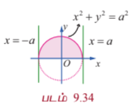

$x$-அச்சை பொருத்து, இப்பகுதியை ஒரு முழு சுழற்சிக்கு உட்படுத்தினால் ($360^\circ$ -க்கான சுழற்சி $2\pi$ ஆரையன்கள் ஆகும்) உருவாகும் பொருள் கோளமாகும்.

அதே போல் $a$ ஆரம் மற்றும் $h$ உயரம் கொண்ட ஒரு நேர்வட்ட உருளையைப் பெற $xy$-தளத்தில் $y = 0$, $y = a$, $x = 0$ மற்றும் $x = h$ கோடுகளால் சூழப்பட்ட செவ்வகப் பகுதியை கருதுவோம். படம் 9.35-ல் காண்க. இப்பகுதியை $x$-அச்சைப் பொருத்து ஒரு முழு சுழற்சிக்கு உட்படுத்தினால் ($360^\circ$ -க்கான சுழற்சி $2\pi$ ஆரையன்கள் ஆகும்) உருளை எனப்படும் திடப்பொருள் உருவாகிறது.

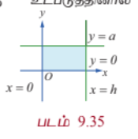

சுழற்சியில் ஏற்படும் திடப்பொருளின் கன அளவினை $x$-அச்சைப் பொருத்து அல்லது $y$-அச்சைப் பொருத்து மட்டுமே இப்பாடப்பகுதியில் கண்டறிவோம்.

$x$-அச்சைப் பொருத்து சுழற்சியால் ஏற்படும் திடப் பொருளைக் கருதும்போதெல்லாம் $x$-அச்சிற்கு மேல் உள்ள $x$-அச்சில் சுழலும் தளம் அரங்கமாகும். எனவே, இவ்வரங்கில் $y \ge 0$ ஆகும். $y$-அச்சைப் பொருத்து சுழற்சியால் ஏற்படும் திடப்பொருளைக் கருதும்போதெல்லாம் $y$-அச்சிற்கு மேல் உள்ள $y$-அச்சில் சுழலும் தளம் அரங்கமாகும். எனவே, இவ்வரங்கில் $x \ge 0$ ஆகும். $y = f(x)$, $x$-அச்சு மற்றும் $x = a$ மற்றும் $x = b$ ஆகியவற்றின் வரம்பிற்குட்பட்டு $x$-அச்சைப் பொருத்து சுழற்சியால் முதல் காற்பகுதியில் ஏற்படும் திடப்பொருளின் கன அளவு காணும் சூத்திரம் காண்போம். $r$ ஆரமும் $h$ உயரமும் கொண்ட ஒரு உருளையின் அனைத்து கனஅளவுகளும் கணக்கிடப்படுகின்றன கனஅளவு சூத்திரம் $\pi r^2 h$ என்பதே ஆகும்.

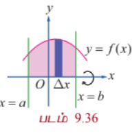

$x = a$ மற்றும் $x = b$ ஆகிய இரு கோடுகளுக்கிடையே $y$-அச்சிற்கு இணையாக இருக்கும் ஒவ்வொரு கோடும் $y = f(x)$ வளைவரையை முதல் காற்பகுதியில் ஒரே ஒரு புள்ளியில் மட்டுமே வெட்டும் எனக் கருதுவோம். $[a, b]$ இடைவெளியை

$$a = x_0 < x_1 < x_2 < \cdots < x_n = b, \quad \Delta x = \frac{b - a}{n}, \quad i = 1, 2, \ldots, n$$

எனும்படி $n$ துண்டுகளாக $x_0, x_1, x_2, \ldots, x_{n-1}$ என வகுப்போம்.

$xy$-தளத்திலுள்ள அரங்கத்திலுள்ள ஒவ்வொரு $i \in \{0, 1, 2, \ldots, n-1\}$ -க்கும், $x_i$ மற்றும் $x_i + \Delta x$ -க்கு இடைப்பட்ட அரங்கமானது தோராயமாக $x$-அச்சு மற்றும் $y = f(x)$ வளைவரைக்கு இடைப்பட்டு அமைந்த $x = x_i$ -ல் உள்ள ஒவ்வொரு எண்ணற்ற சிறு செவ்வகங்களின் சுழற்சியால் ஏற்படும் ஒரு அடிப்படையான திடப்பொருள் தோராயமாக $y_i$ ஆரமாகவும் $\Delta x$ உயரமாகவும் கொண்டிருக்கும் ஒரு மெல்லிய உருளைத்தட்டினை உருவாக்கும். படம் 9.36-ல் காண்க. $x = x_i$ -ல் உள்ள உருளைத் தட்டின் கன அளவு $\pi y_i^2 \Delta x$, $i \in \{0, 1, 2, \ldots, n-1\}$ ஆகும். இந்த அடிப்படையான கன அளவுகள் அனைத்தும் கூட்ட, சுழற்சியால் ஏற்படும் திடப்பொருளின் கன அளவின் தோராய மதிப்பு $\sum_{i=0}^{n-1} \pi y_i^2 \Delta x$ எனக் கிடைக்கும்.

$\Delta x$ சிறியதாக மேலும் சிறியதாக எனும்படி $\Delta x \rightarrow 0$, $n$ பெரியதாக மேலும் பெரியதாக ஆகிறது. $n \rightarrow \infty$ இனி $\sum_{i=0}^{n-1} \pi y_i^2 \Delta x$ என்பது சுழற்சியால் ஏற்படும் திடப்பொருளின் கன அளவை அணுகும்.

எனவே சுழற்சியால் ஏற்படும் திடப் பொருளின் கன அளவு $\int_a^b \pi y^2 dx$ ஆகும்.

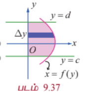

அதேபோன்று $y$-அச்சு பொருத்து வளைவரை $x = f(y)$, $y$-அச்சு, மற்றும் $y = c$ மற்றும் $y = d$ கோடுகள் ஆகியவற்றின் வரம்பிற்குட்பட்டு சுழலும் திடப்பொருளின் கன அளவு காணும் சூத்திரம் கண்டறிவோம்.

$y = c$ மற்றும் $y = d$ ஆகிய கோடுகளுக்கிடையே வளைவரை $x = f(y)$, $y$ அச்சிற்கு வலப்பக்கமாக அமைகிறது.

$y = c$ மற்றும் $y = d$ ஆகிய கோடுகளுக்கிடையே $x$-அச்சிற்கு இணையாக இருக்கும் ஒவ்வொரு கோடும் $x = f(y)$ வளைவரையை முதல் காற்பகுதியில் ஒரே ஒரு புள்ளியில் மட்டுமே வெட்டும் எனக் கருதுவோம். படம் 9.37-ல் காண்க. எனவே சுழற்சியால் ஏற்படும் திடப்பொருளின் கன அளவு $\int_c^d \pi x^2 dy$ ஆகும்.

---

### எடுத்துக்காட்டு 9.62

ஆரம் $a$ உடைய கோளத்தின் கன அளவைக் காண்க.

#### தீர்வு

$x^2 + y^2 = a^2$ என்ற வட்டத்திற்கும் $x$-அச்சுக்கும் இடையே அமையும் மேல் அரை வட்டத்தின் அரங்கத்தின் பரப்பை $x$-அச்சைப் பொருத்து சுழற்றினால் ஆரம் $a$ உடைய கோளத்தின் கன அளவைக் காணலாம். படம் 9.38ஐ பார்க்க.

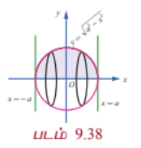

அரங்கத்தின் எல்லைகள் $y = \sqrt{a^2 - x^2}$, $x$-அச்சு, கோடுகள் $x = -a$ மற்றும் $x = a$.

எனவே கோளத்தின் கன அளவு,

$$V = \int_{-a}^{a} \pi y^2 dx = \int_{-a}^{a} \pi (a^2 - x^2) dx$$

$$= 2\pi \int_0^a (a^2 - x^2) dx \quad (\text{தொகை சார்பு } a^2 - x^2 \text{ ஆனது இரட்டைப் படைச் சார்பு})$$

$$= 2\pi \left[a^2x - \frac{x^3}{3}\right]_0^a = 2\pi \left[a^3 - \frac{a^3}{3}\right] = \frac{4}{3}\pi a^3$$

---

### எடுத்துக்காட்டு 9.63

ஆரம் $r$ மற்றும் உயரம் $h$ உடைய நேர்வட்டக் கூம்பின் கன அளவைக் காண்க.

#### தீர்வு

முதல் காற்வட்டப்பகுதியில் உள்ள முக்கோண அரங்கத்தின் பரப்பானது $y = \frac{r}{h}x$, $x$-அச்சு, கோடுகள் $x = 0$ மற்றும் $x = h$. $x$-அச்சைப் பொருத்து சுழற்றினால் அடிப்பக்க ஆரம் $r$ மற்றும் உயரம் $h$ உடைய நேர்வட்டக் கூம்பை பெறலாம். படம் 9.39-ல் காண்க.

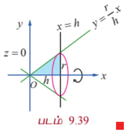

எனவே கூம்பின் கன அளவானது,

$$V = \int_0^h \pi y^2 dx = \int_0^h \pi \left(\frac{r}{h}x\right)^2 dx = \frac{\pi r^2}{h^2} \int_0^h x^2 dx = \frac{\pi r^2}{h^2} \left[\frac{x^3}{3}\right]_0^h = \frac{1}{3}\pi r^2 h$$

---

### எடுத்துக்காட்டு 9.64

ஆரம் $r$ மற்றும் உயரம் $h$ உடைய கோள வடிவ தொப்பியின் கன அளவைக் காண்க.

#### தீர்வு

வட்டம் $x^2 + y^2 = r^2$, $x$-அச்சு, கோடுகள் $x = r - h$ மற்றும் $x = r$ ஆகியவற்றால் சூழப்பட்ட முதல் கால் வட்டப் பகுதியில் உள்ள அரங்கத்தின் பரப்பை $x$-அச்சைப் பொருத்து சுழற்றும்போது உருவாகும் திடப்பொருளானது , ஆரம் $r$, உயரம் $h$ உடைய கோள வடிவத்தொப்பியாகும். படம் 9.40-ல் காண்க.

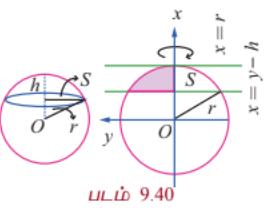

எனவே தேவையான கன அளவு

$$V = \pi \int_{r-h}^r y^2 dx = \pi \int_{r-h}^r (r^2 - x^2) dx = \pi \left[r^2x - \frac{x^3}{3}\right]_{r-h}^r$$

$$= \pi \left[\left(r^3 - \frac{r^3}{3}\right) - \left(r^2(r-h) - \frac{(r-h)^3}{3}\right)\right]$$

$$= \pi \left[\frac{2r^3}{3} - r^3 + r^2h + \frac{(r-h)^3}{3}\right] = \pi \left[\frac{(r-h)^3}{3} - \frac{r^3}{3} + r^2h\right]$$

$$= \pi \left[\frac{r^3 - 3r^2h + 3rh^2 - h^3}{3} - \frac{r^3}{3} + r^2h\right] = \pi \left[-r^2h + rh^2 - \frac{h^3}{3} + r^2h\right] = \pi h^2\left(r - \frac{h}{3}\right)$$

#### குறிப்பு

மேலே உள்ள கோள வடிவத் தொப்பியின் கன அளவை தொப்பியின் ஆரம் மூலமும் எழுதலாம். $\rho$ என்பது கோள வடிவத் தொப்பியின் ஆரம் எனில் $\rho^2 = 2rh - h^2$.

எனவே $r = \frac{\rho^2 + h^2}{2h}$. மேலே உள்ள கன அளவில் $r$-ன் மதிப்பை பிரதியிட, நாம் பெறுவது

$$V = \pi h^2\left(\frac{\rho^2 + h^2}{2h} - \frac{h}{3}\right) = \pi h^2\left(\frac{\rho^2}{2h} + \frac{h}{2} - \frac{h}{3}\right) = \pi h^2\left(\frac{\rho^2}{2h} + \frac{h}{6}\right) = \frac{\pi h}{6}(3\rho^2 + h^2)$$

---

### எடுத்துக்காட்டு 9.65

பரவளையம் $y = x^2$, $x$-அச்சு, கோடுகள் $x = 0$ மற்றும் $x = 1$ ஆகியவற்றால் அடைப்பட்டுள்ள அரங்கத்தின் பரப்பை $x$-அச்சைப் பொருத்துச் சுழற்றினால் உருவாகும் திடப்பொருளின் கன அளவைக் காண்க.

#### தீர்வு

$x$-அச்சைப் பொருத்துச் சுழற்றப்படும் அரங்கத்தின் பரப்பானது படம் 9.41-ல் நிழலிடப்பட்டுள்ளது.

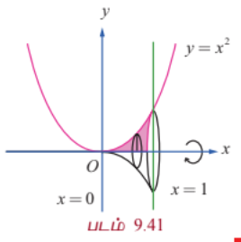

எனவே, தேவையான கன அளவானது

$$= \int_0^1 \pi y^2 dx = \pi \int_0^1 (x^2)^2 dx = \pi \int_0^1 x^4 dx = \pi \left[\frac{x^5}{5}\right]_0^1 = \frac{\pi}{5}$$

---

### எடுத்துக்காட்டு 9.66

$\frac{x^2}{a^2} + \frac{y^2}{b^2} = 1$, $a > b$ என்ற அடைபடும் அரங்கத்தின் பரப்பினை நெட்டச்சைப் பொருத்துச் சுழற்றினால் உருவாகும் திடப்பொருளின் கனஅளவைக் காண்க.

#### தீர்வு

நீள் வட்டமானது இரு அச்சுக்களை பொருத்து சமச்சீர் ஆகும். $x$-அச்சானது நெட்டச்சு ஆகும். சுழற்றப்படும் அரங்கத்தின் பரப்பானது படம் 9.42-ல் நிழலிடப்பட்டுள்ளது.

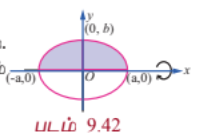

எனவே தேவையான கன அளவானது,

$$V = \int_{-a}^{a} \pi y^2 dx = \int_{-a}^{a} \pi \frac{b^2}{a^2}(a^2 - x^2) dx$$

$$= 2\pi \frac{b^2}{a^2} \int_0^a (a^2 - x^2) dx \quad (\because \text{தொகைச் சார்பானது இரட்டைப்படைச் சார்பு})$$

$$= 2\pi \frac{b^2}{a^2} \left[a^2x - \frac{x^3}{3}\right]_0^a = 2\pi \frac{b^2}{a^2} \left[a^3 - \frac{a^3}{3}\right] = \frac{4}{3}\pi a b^2$$

#### குறிப்பு

$\frac{x^2}{a^2} + \frac{y^2}{b^2} = 1$ என்ற நீள்வட்டத்திற்குள் அடைபடும் அரங்கத்தின் பரப்பை $y$-அச்சைப் பொருத்து சுழற்றினால் உருவாகும் திடப்பொருளின் கன அளவானது $\frac{4}{3}\pi a^2 b$. இத்திடப்பொருள் **நீள்வட்ட திண்மம்** (ellipsoid) என அழைக்கப்படும்.

---

### எடுத்துக்காட்டு 9.67

பரவளையம் $x = y^2 + 1$, $y$-அச்சு, மற்றும் கோடுகள் $y = 1$ மற்றும் $y = -1$ ஆகியவற்றால் அடைபடும் அரங்கத்தின் பரப்பை $y$-அச்சைப் பொருத்து சுழற்றுவதால் உருவாகும் திடப்பொருளின் கன அளவைத் தொகையிடலைப் பயன்படுத்தி காண்க.

#### தீர்வு

பரவளையம் $x = y^2 + 1$ ஆனது $y$-அச்சைப் பொருத்துச் சமச்சீர் மற்றும் இதன் முனை $(1, 0)$ மற்றும் குவியம் $\left(\frac{5}{4}, 0\right)$ ஆகும். சுழற்றப்படும் அரங்கத்தின் பரப்பு படம் 9.43-ல் நிழலிடப்பட்டுள்ளது.

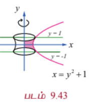

எனவே தேவையான கன அளவு

$$V = \int_{-1}^{1} \pi x^2 dy = \int_{-1}^{1} \pi (y^2 + 1)^2 dy$$

$$= 2\pi \int_0^1 (y^4 + 2y^2 + 1) dy \quad (\because \text{தொகைச் சார்பானது இரட்டைப்படைச் சார்பு})$$

$$= 2\pi \left[\frac{y^5}{5} + \frac{2y^3}{3} + y\right]_0^1 = 2\pi \left(\frac{1}{5} + \frac{2}{3} + 1\right) = 2\pi \left(\frac{3 + 10 + 15}{15}\right) = \frac{56}{15}\pi$$

---

### எடுத்துக்காட்டு 9.68

வளைவரை $y = \frac{3}{4}\sqrt{x^2 - 16}$, $x \ge 4$, $y$-அச்சு, மற்றும் கோடுகள் $y = 1$ மற்றும் $y = 6$ ஆகியவற்றால் அடைபடும் அரங்கத்தின் பரப்பை $y$-அச்சைப் பொருத்து சுழற்றுவதால் உருவாகும் திடப்பொருளின் கனஅளவை தொகையிடலைப் பயன்படுத்திக் காண்க.

#### தீர்வு

கொடுக்கப்பட்டது $y = \frac{3}{4}\sqrt{x^2 - 16} \Rightarrow \frac{x^2}{16} - \frac{y^2}{9} = 1$. எனவே கொடுக்கப்பட்ட வளைவரையானது அதிபரவளையம் $\frac{x^2}{16} - \frac{y^2}{9} = 1$ மற்றும் கோடுகள் $y = 1$ மற்றும் $y = 6$ ஆகியவற்றுக்கு இடைப்பட்ட ஒரு பகுதியாகும். இப்பகுதி $x$-அச்சில் மேல் உள்ளது.

சுழற்றப்படும் அரங்கத்தின் பரப்பானது படம் 9.44-ல் நிழலிடப்பட்டுள்ளது.

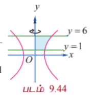

$y$-அச்சைப் பொருத்து சுழற்றுவதால் அதிபரவளையத்தின் ஒரு பகுதியின் சமன்பாடானது $x = \frac{4}{3}\sqrt{y^2 + 9}$. உருவாகும் திடப்பொருளின் கன அளவு

$$V = \int_1^6 \pi x^2 dy = \int_1^6 \pi \left(\frac{16}{9}(y^2 + 9)\right) dy = \frac{16\pi}{9} \int_1^6 (y^2 + 9) dy$$

$$= \frac{16\pi}{9} \left[\frac{y^3}{3} + 9y\right]_1^6 = \frac{16\pi}{9} \left[\left(\frac{216}{3} + 54\right) - \left(\frac{1}{3} + 9\right)\right] = \frac{16\pi}{9} \left[(72 + 54) - \left(\frac{28}{3}\right)\right]$$

$$= \frac{16\pi}{9} \left[126 - \frac{28}{3}\right] = \frac{16\pi}{9} \left[\frac{378 - 28}{3}\right] = \frac{16\pi}{9} \left[\frac{350}{3}\right] = \frac{5600\pi}{27}$$

---

### எடுத்துக்காட்டு 9.69

வளைவரை $y = \log x$, $y = 0$, $x = 0$ மற்றும் $y = 2$ ஆகியவற்றால் அடைபடும் அரங்கத்தின் பரப்பை $y$-அச்சைப் பொருத்து சுழற்றுவதால் உருவாகும் திடப்பொருளின் கனஅளவைத் தொகையிடலைப் பயன்படுத்திக் காண்க.

#### தீர்வு

சுழற்றப்படும் அரங்கத்தின் பரப்பு படம் 9.45-ல் நிழலிடப்பட்டுள்ளது.

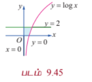

$y$-அச்சைப் பொருத்து சுழற்றுவதால் உருவாகும் திடப்பொருளின் கனஅளவானது

$$V = \int_0^2 \pi x^2 dy = \int_0^2 \pi (e^y)^2 dy = \pi \int_0^2 e^{2y} dy = \pi \left[\frac{e^{2y}}{2}\right]_0^2 = \frac{\pi}{2}(e^4 - 1)$$

---

### பயிற்சி 9.9

1. $y = 2x^2$, $y = 0$ மற்றும் $x = 1$ ஆகியவற்றால் அடைபடும் அரங்கத்தின் பரப்பை $x$-அச்சைப் பொருத்துச் சுழற்றுவதால் உருவாகும் திடப்பொருளின் கனஅளவைக் காண்க.

2. $y = e^{-2x}$, $y = 0$, $x = 0$ மற்றும் $x = 1$ ஆகியவற்றால் அடைபடும் அரங்கத்தின் பரப்பை $x$-அச்சைப் பொருத்து சுழற்றுவதால் உருவாகும் திடப்பொருளின் கனஅளவைக் காண்க.

3. $x = y^2 + 1$ மற்றும் $y = 3$ ஆகியவற்றால் அடைபடும் அரங்கத்தின் பரப்பை $y$-அச்சைப் பொருத்து சுழற்றுவதால் உருவாகும் திடப் பொருளின் கனஅளவைக் காண்க.

4. $y = \sqrt{x}$ மற்றும் $y = x^2$ என்ற வளைவரைகளுக்குள் அடைபடும் அரங்கத்தின் பரப்பு $R$ எனில் பரப்பு $R$-ஐ, $x$-அச்சைப் பொருத்து $360^\circ$ சுழற்றும்போது உருவாகும் திடப்பொருளின் கன அளவைக் காண்க.

5. ஒரு கொள்கலன் (container) ஆனது நேர்வட்டக் கூம்பின் இடைக்கண்டம் (frustum of a cone) வடிவில் படம் 9.46-ல் உள்ளவாறு அமைந்துள்ளது எனில் அதன் கனஅளவைத் தொகுதியிடலைப் பயன்படுத்தி காண்க.

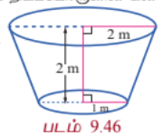

6. ஒரு தர்பூசணியானது நீள்வட்ட திண்ம வடிவில் (ellipsoid shape) உள்ளது. இந்த நீள்வட்ட திண்மத்தை பெற நெட்டச்சின் நீளம் 20 செ.மீ. குற்றச்சின் நீளம் 10 செ.மீ கொண்ட நீள்வட்டத்தை நெட்டச்சைப் பொருத்து சுழற்றவேண்டும் எனில் தர்பூசணியின் கனஅளவை தொகுதியிடலைப் பயன்படுத்தி காண்க.
