### 9.8 வரம்பிற்குட்பட்ட தளத்தின் பரப்பை தொகையிடல் மூலம் காணல்
### (Evaluation of a Bounded Plane Area by Integration)

இந்த அத்தியாயத்தின் தொடக்கத்தில் வரையறுத்த தொகையிடலை வடிவியல் அணுகுமுறை வழியாக அறிமுகப்படுத்தினோம். அவ்வாறு அணுகும்போது தொகையிடலின் தொகைச் சார்பு குறையற்ற எண்ணாக இருந்தால் வரையறுத்த தொகையிடல் மூலம் பரப்பை காணலாம். இப்பாடப் பகுதியில் தளத்தில் உள்ள வளைவரைகளை வரம்பிற்குட்படுத்தும் தளங்களின் பரப்பளவுகளை காண வடிவியல் அணுகுமுறையைக் கடைபிடிப்போம்.

---

#### 9.8.1 கோடுகள் $x = a$, $x = b$ மற்றும் $x$ – அச்சு ஆகியவற்றால் அடைபடும் அரங்கத்தின் பரப்பு காணல்
#### (Area of the region bounded by a curve, $x$ – axis and the lines $x = a$ and $x = b$)

**நிலை (i)**

$x = a$ மற்றும் $x = b$ ஆகிய கோடுகளுக்கு இடைப்பட்ட $x$ − அச்சிற்கு மேற்பகுதியில் (அதாவது முதல் அல்லது இரண்டாம் காற்பகுதியில்) உள்ள தொடர்ச்சியான வளைவரையின் சமன்பாடு $y = f(x)$, $a \le x \le b$ என்க. படம் 9.8-ல் காண்க. எனவே வளைவரையின் ஒவ்வொரு பகுதியிலும் உள்ள புள்ளிகளில், $y \ge 0$ ஆகும். கோடுகள் $x = a$ மற்றும் $x = b$, $x −$ அச்சு மற்றும் வளைவரையின் வரம்பிற்குட்பட்ட (அரங்கத்தின்) பகுதியினைக் காண்போம். இப்பகுதியில் $y$ -ன் குறி மாறாதிருப்பது குறிப்பிடத்தக்கது. எனவே $A$ -ன் பரப்பை பின்வருமாறு கணிக்கலாம்:

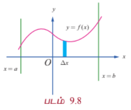

$y −$அச்சின் மிகையெண் திசையில் நோக்கும்போது, அரங்கினை சின்னஞ்சிறு பட்டைகளாக(குறுகிய செவ்வகங்களாக) உயரம் $y$ ஆகவும் அகலம் $\Delta x$ ஆகவும் இருக்குமாறு பகுக்கலாம். எனவே, $A$ என்பது செங்குத்து பட்டைகளின் பரப்புகளின் கூட்டற்தொகையின் எல்லையாகும். எனவே $A = \lim \sum y \Delta x = \int_a^b y dx = \int_a^b f(x) dx$ எனக் கிடைக்கிறது.

**நிலை (ii)**

$x = a$ மற்றும் $x = b$ ஆகிய கோடுகளுக்கு இடைப்பட்ட, $x −$ அச்சிற்கு கீழ்ப்பகுதியில் (அதாவது மூன்றாவது அல்லது நான்காம் காற்பகுதியில்) உள்ள தொடர்ச்சியான வளைவரையின் சமன்பாடு $y = f(x)$, $a \le x \le b$ என்க. இங்கு $y \le 0$ என்பது வளைவரையின் பகுதியில் உள்ள அனைத்து புள்ளிகளுக்கும் பொருந்தும். $x = a$ மற்றும் $x = b$ ஆகிய கோடுகள் $x −$ அச்சு மற்றும் வளைவரையின் வரம்பிற்குட்பட்ட (அரங்கத்தின்) பகுதியினைக் காண்போம். படம் 9.9-ல் காண்க. இப்பகுதியில் $y \le 0$ மற்றும் $y$ -யின் குறி மாறாதிருப்பது குறிப்பிடத்தக்கது. எனவே, $A$ -யின் பரப்பை பின்வருமாறு கணிக்கலாம்:

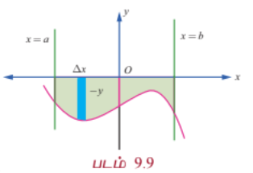

$y −$அச்சின் குறையெண் திசையில் நோக்கும்போது, அரங்கினை சின்னஞ்சிறு பட்டைகளாக(குறுகிய செவ்வகங்களாக) உயரம் $-y$ ஆகவும் அகலம் $\Delta x$ ஆகவும் இருக்குமாறு பகுக்கலாம். எனவே, $A$ என்பது செங்குத்துப் பட்டைகளின் பரப்புகளின் கூட்டல் தொகையின் எல்லையாகும். எனவே $A = \lim \sum (-y) \Delta x = -\int_a^b y dx = \int_a^b |y| dx$ ஆகும்.

**நிலை (iii)**

$x = a$ மற்றும் $x = b$ ஆகிய கோடுகளுக்கு இடைப்பட்ட, $x −$ அச்சிற்கு மேற்பகுதியிலும் அதே சமயத்தில் கீழ்ப்பகுதியிலும் (அதாவது அனைத்து காற்பகுதிகளிலும் இருக்கலாம்) உள்ள தொடர்ச்சியான வளைவரையின் சமன்பாடு $y = f(x)$, $a \le x \le b$ என்க. $xy$-தளத்தில் $y = f(x)$ வளைவரையை வரைக. $x −$ அச்சிற்கு மேலும் கீழும் மாறி மாறி அமையும் வளைவரை $x = a$ மற்றும் $x = b$ கோடுகளுக்கிடையே அமைகின்றது. $[a, b]$ எனும் இடைவெளி ஒவ்வொரு பகுதி இடைவெளியிலும் $f(x)$ ஒரே குறியில் இருக்குமாறு $[a, c_1], [c_1, c_2], \ldots, [c_k, b]$ எனும் பகுதி இடைவெளிகளாக வகுக்கப்படுகிறது. நிலை (i) மற்றும் (ii) ஆகியவற்றைப் பயன்படுத்தி, பகுதி இடைவெளிகளுக்கான அரங்குகளின் வடிவியல் பரப்பைத் தனித்தனியாக நாம் பெறலாம். எனவே $y = f(x)$, $x$-அச்சு, $x = a$ மற்றும் $x = b$ கோடுகளால் சூழப்பட்ட பகுதியின் வடிவியல் பரப்பு

$$\int_a^{c_1} |f(x)| dx + \int_{c_1}^{c_2} |f(x)| dx + \cdots + \int_{c_k}^b |f(x)| dx$$

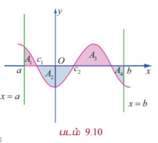

எடுத்துக்காட்டாக படம் 9.10-ல் உள்ள நிழலிடப்பட்டப் பகுதியைக் காண்போம். இங்கு $A_1, A_2, A_3$, மற்றும் $A_4$ ஆகியவை தனித்தனிப்பகுதிகளின் பரப்புகளாகும். எனவே மொத்தப்பரப்பானது

$$A = A_1 + A_2 + A_3 + A_4 = \int_a^{c_1} f(x) dx + \int_{c_1}^{c_2} (-f(x)) dx + \int_{c_2}^{c_3} f(x) dx + \int_{c_3}^b (-f(x)) dx$$

ஆகும்.

---

#### 9.8.2 ஒரு வளைவரை, $y$–அச்சு மற்றும் கோடுகள் $y = c$, $y = d$ ஆகியவற்றால் அடைபடும் அரங்கத்தின் பரப்பு
#### (Area of the region bounded by a curve, $y$– axis and the lines $y = c$ and $y = d$)

**நிலை (iv)**

$y −$அச்சிற்கு வலப்பக்கம் அமையும் தொடர்ச்சியான வளைவரையின் பகுதியின் (அதாவது முதலாவது காற்பகுதி அல்லது நான்காவது காற்பகுதியின் பகுதியாகும்) சமன்பாடு $x = f(y)$, $c \le y \le d$ என்க. இனி, வளைவரைப் பகுதியின் ஒவ்வொரு புள்ளியிலும் $x \ge 0$ ஆகும். இப்பகுதியில் $x$ -ன் குறி மாறாதது குறிப்பிடத்தக்கது. வளைவரை $y −$அச்சு, $y = c$ மற்றும் $y = d$ கோடுகளால் சூழப்பட்ட பகுதியினை படம் 9.11-ல் நிழலிடப்பட்டுள்ளதை காணலாம்.

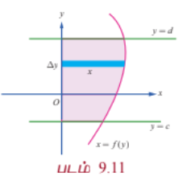

எனவே பகுதி $A$ -இன் பரப்பளவு கீழ்க்காணுமாறு கணிக்கப்படுகிறது:

$x −$ அச்சின் மிகையெண் திசை வழியாக நோக்கும்போது, அரங்கத்தினை $x$ நீளம் மற்றும் அகலம் $\Delta y$ ஆகவும் உள்ள கிடைமட்டப் பட்டைகளாக பகுக்கப் (அகலம் குறைந்த நீளமான செவ்வகங்களாக) படுகிறது. இனி $A$ என்பது கிடைமட்ட செவ்வகப் பட்டைகளின் பரப்பளவுகளின் கூட்டல் எல்லையாகும். எனவே, $A = \lim \sum x \Delta y = \int_c^d x dy$ ஆகும்.

**நிலை (v)**

$y −$அச்சிற்கு இடப்பக்கம் அமையும் தொடர்ச்சியான வளைவரையின் பகுதியின் (அதாவது இரண்டாவது காற்பகுதி அல்லது மூன்றாவது காற்பகுதியின் பகுதியாகும்) சமன்பாடு $x = f(y)$, $c \le y \le d$ என்க. இனி, வளைவரைப் பகுதியின் ஒவ்வொரு புள்ளியிலும் $x \le 0$ ஆகும். இப்பகுதியில் $x$ -ன் குறி மாறாதது குறிப்பிடத்தக்கது. வளைவரை, $y −$அச்சு, $y = c$ மற்றும் $y = d$ கோடுகளால் சூழப்பட்ட பகுதியினைக் கருதுக. இப்பகுதி படம் 9.12-ல் நிழலிடப்பட்டுள்ளது.

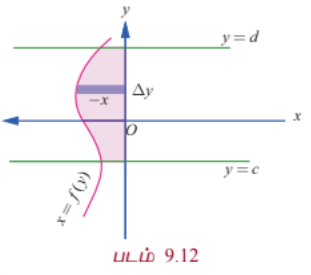

எனவே பகுதி $A$ -இன் பரப்பளவு கீழ்க்காணுமாறு கணிக்கப்படுகிறது:

$x −$ அச்சின் குறையெண் திசை வழியாக நோக்கும்போது, அரங்கத்தினை $-x$ நீளம் மற்றும் அகலம் $\Delta y$ ஆகவும் உள்ள கிடைமட்டப் பட்டைகளாக பகுக்கப் (அகலம் குறைந்த நீளமான செவ்வகங்களாக) படுகிறது. இனி, $A$ என்பது கிடைமட்ட செவ்வகப் பட்டைகளின் பரப்பளவுகளின் கூட்டல் எல்லையாகும்.

எனவே, $A = \lim \sum (-x) \Delta y = -\int_c^d x dy = \int_c^d |x| dy$ ஆகும்.

**நிலை (vi)**

$y −$அச்சிற்கு வலப்பக்கம் அமையும் அதே சமயத்தில் இடப்பக்கமும் அமையும் தொடர்ச்சியான வளைவரையின் பகுதியின் (அதாவது அனைத்து காற்பகுதியிலும் வளைவரை அடையும்) சமன்பாடு $x = f(y)$, $c \le y \le d$ என்க. $xy$-தளத்தில் $x = f(y)$ எனும் வளைவரையை வரைக. $y −$அச்சுக்கு வலப்பக்கமும் இடப்பக்கமும் மாறி மாறி அமையும் வளைவரையானது $y = c$ மற்றும் $y = d$ கோடுகளால் வெட்டப்படுகிறது. $[c, d]$ இடைவெளியை $[c, a_1], [a_1, a_2], \ldots, [a_k, d]$ எனும் பகுதி இடைவெளிகளாக, ஒவ்வொரு பகுதி இடைவெளியிலும் $f(y)$ குறி மாறாது இருக்குமாறு பகுக்க வேண்டும். நிலைகள் (iii) மற்றும் (iv) ஆகியவற்றைப் பயன்படுத்தி, பகுதி இடைவெளிகளுக்கான அரங்கங்களின் பரப்புகளின் வடிவியல் பரப்புகளைத் தனித்தனியாகப் பெறலாம்.

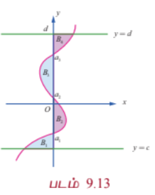

எனவே $x = f(y)$, $y$-அச்சு, $y = c$ மற்றும் $y = d$ கோடுகளால் சூழப்பட்ட பகுதியின் வடிவியல் பரப்பு

$$A = \int_c^{a_1} |f(y)| dy + \int_{a_1}^{a_2} |f(y)| dy + \cdots + \int_{a_k}^d |f(y)| dy$$

எனப் பெறுகிறோம்.

சான்றாக படம் 9.13-ல் உள்ள நிழலிடப்பட்டப் பகுதியினைக் கருதுவோம். இங்கு $B_1, B_2, B_3$ மற்றும் $B_4$ ஆகியவை தனித்தனியான பகுதிகளின் வடிவியல் பரப்புகளாகும். இனி, வளைவரை $x = f(y)$, $y$-அச்சு மற்றும் $y = c$ மற்றும் $y = d$ ஆகியவற்றால் சூழப்பட்ட பரப்பின் மொத்த பரப்பளவு

$$B = B_1 + B_2 + B_3 + B_4 = \int_c^{a_1} f(y) dy + \int_{a_1}^{a_2} (-f(y)) dy + \int_{a_2}^{a_3} f(y) dy + \int_{a_3}^d (-f(y)) dy$$

ஆகும்.

---

### எடுத்துக்காட்டு 9.47

$6x + 5y = 30$, $x −$ அச்சு, $x = -1$ மற்றும் $x = 3$ ஆகியவற்றால் அடைபடும் அரங்கத்தின் பரப்பைக் காண்க.

#### தீர்வு

தேவையான அரங்கத்தின் பரப்பானது படம் 9.14-ல் நிழலிடப்பட்டுள்ளது. இப்பரப்பானது $x −$ அச்சின் மேல் உள்ளது. எனவே தேவையான பரப்பு,

$$A = \int_{-1}^3 y dx = \int_{-1}^3 \frac{30 - 6x}{5} dx = \frac{1}{5}\left[30x - 3x^2\right]_{-1}^3$$

$$= \frac{1}{5}\left[(90 - 27) - (-30 - 3)\right] = \frac{1}{5}(63 + 33) = \frac{96}{5}$$

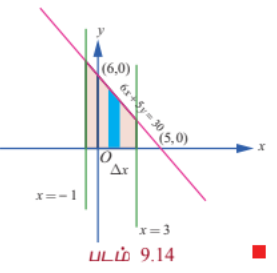

---

### எடுத்துக்காட்டு 9.48

$7x - 5y = 35$, $x −$ அச்சு மற்றும் கோடுகள் $x = -2$ மற்றும் $x = 3$ ஆகியவற்றால் அடைபடும் அரங்கத்தின் பரப்பைக் காண்க.

#### தீர்வு

தேவையான அரங்கத்தின் பரப்பானது படம் 9.15-ல் நிழலிடப்பட்டுள்ளது. இப்பரப்பானது $x −$ அச்சின் கீழ் உள்ளது. எனவே தேவையான பரப்பானது,

$$A = -\int_{-2}^3 y dx = -\int_{-2}^3 \frac{7x - 35}{5} dx = -\frac{1}{5}\left[\frac{7x^2}{2} - 35x\right]_{-2}^3$$

$$= -\frac{1}{5}\left[\left(\frac{63}{2} - 105\right) - \left(14 + 70\right)\right] = -\frac{1}{5}\left[-\frac{147}{2} - 84\right] = -\frac{1}{5}\left[-\frac{315}{2}\right] = \frac{63}{2}$$

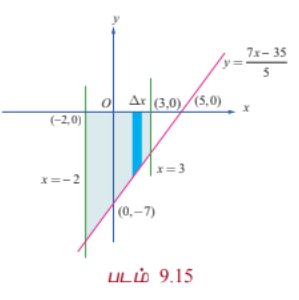

---

### எடுத்துக்காட்டு 9.49

$\frac{x^2}{a^2} + \frac{y^2}{b^2} = 1$ என்ற நீள்வட்டத்தினால் அடைபடும் அரங்கத்தின் பரப்பைக் காண்க.

#### தீர்வு

நீள்வட்டமானது நெட்டச்சு மற்றும் குற்றச்சுகளைப் பொருத்து சமச்சீராக உள்ளது. படம் 9.16-ல் நீள்வட்டம் வரையப்பட்டுள்ளது. $y$ -அச்சின் மிகைப்பகுதியின் திசையில் பார்க்கும்போது தேவையான பரப்பு $A$ ஆனது நீள்வட்டத்தின் முதல் கால் வட்டப் பகுதியில் $y = \frac{b}{a}\sqrt{a^2 - x^2}$, $0 \le x \le a$, $x -$அச்சு, $x = 0$ மற்றும் $x = a$ ஆகியவற்றால் அடைபடும் அரங்கத்தின் பரப்பைப் போல் நான்கு மடங்காகும். செங்குத்தான பட்டைகளைப் பயன்படுத்தி பரப்பு காணக் கிடைப்பது,

$$A = 4\int_0^a y dx = 4\int_0^a \frac{b}{a}\sqrt{a^2 - x^2} dx$$

$$= \frac{4b}{a}\left[\frac{x}{2}\sqrt{a^2 - x^2} + \frac{a^2}{2}\sin^{-1}\left(\frac{x}{a}\right)\right]_0^a = \frac{4b}{a}\left[\frac{a^2}{2}\cdot\frac{\pi}{2}\right] = \pi ab$$

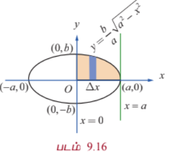

#### குறிப்பு

$x$ -அச்சின் மிகைப் பகுதியை திசையில் பார்க்கும்போது தேவையான பரப்பு $A$ ஆனது நீள்வட்டத்தின் முதல் கால் வட்டப் பகுதியில் $x = \frac{a}{b}\sqrt{b^2 - y^2}$, $0 \le y \le b$, $y$-அச்சு, $y = 0$ மற்றும் $y = b$ ஆகியவற்றால் அடைபடும் அரங்கத்தின் பரப்பைப் போல் நான்கு மடங்காகும். கிடைமட்டப் பட்டைகளைப் பயன்படுத்தி (படம் 9.17-ல்) பரப்பு காணக் கிடைப்பது,

$$A = 4\int_0^b x dy = 4\int_0^b \frac{a}{b}\sqrt{b^2 - y^2} dy$$

$$= \frac{4a}{b}\left[\frac{y}{2}\sqrt{b^2 - y^2} + \frac{b^2}{2}\sin^{-1}\left(\frac{y}{b}\right)\right]_0^b = \frac{4a}{b}\left[\frac{b^2}{2}\cdot\frac{\pi}{2}\right] = \pi ab$$

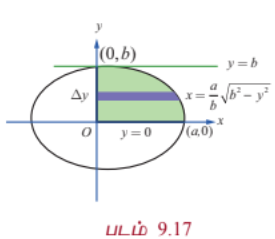

#### குறிப்பு

மேலே உள்ள முடிவில் $b = a$ என பிரதியிடக் கிடைப்பது $x^2 + y^2 = a^2$ என்ற வட்டத்தால் அடைபடும் அரங்கத்தின் பரப்பு $\pi a^2$ ஆகும்.

---

### எடுத்துக்காட்டு 9.50

$y^2 = 4ax$ என்ற பரவளையத்திற்கும் அதன் செவ்வகலத்திற்கும் அடைபடும் அரங்கத்தின் பரப்பைக் காண்க.

#### தீர்வு

செவ்வகலத்தின் சமன்பாடு $x = a$ ஆகும். இச்செவ்வகலம் பரவளையத்தை $L(a, 2a)$ மற்றும் $L'(a, -2a)$ என்ற புள்ளிகளில் வெட்டுகிறது. தேவையான பரப்பு படம் 9.18ல் நிழலிடப்பட்டுள்ளது.

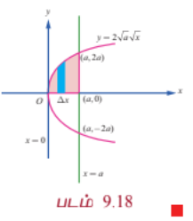

பரவளையம் சமச்சீராக இருப்பதால் தேவையான பரப்பு $A$ ஆனது $y = 2\sqrt{ax}$ என்ற பரவளையத்தின் பகுதி $x -$அச்சு, $x = 0$ மற்றும் $x = a$ ஆகியவற்றால் அடைபடும் பரப்பைப் போல் இரு மடங்காகும்.

எனவே செங்குத்தான பட்டைகளைப் பயன்படுத்தி பரப்பு காண நமக்குக் கிடைப்பது

$$A = 2\int_0^a y dx = 2\int_0^a 2\sqrt{ax} dx = 4\sqrt{a}\left[\frac{2}{3}x^{\frac{3}{2}}\right]_0^a = \frac{8}{3}a^2$$

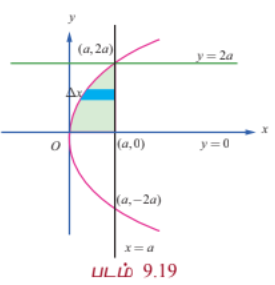

#### குறிப்பு

$x$ -அச்சின் மிகைப் பகுதியின் திசையில், பரப்பு காண கிடைமட்ட பட்டைகளை பயன்படுத்த (படம் 9.19-ல் காண்க) நமக்குக் கிடைக்கும் பரப்பானது

$$A = 2\int_0^{2a} \left(a - \frac{y^2}{4a}\right) dy = 2\left[ay - \frac{y^3}{12a}\right]_0^{2a} = 2\left[2a^2 - \frac{8a^3}{12a}\right] = 2\left[2a^2 - \frac{2a^2}{3}\right] = \frac{8a^2}{3}$$

#### குறிப்பு

மேற்காணும் பரப்பானது பரவளையத்தின் செவ்வகலத்தை அடிப்பக்கமாகவும் மற்றும் பரவளையத்தின் குவியத்திற்கும் முனைக்கும் உள்ள தூரத்தை உயரமாகவும் கொண்ட பரப்பில் மூன்றில் இரண்டு பங்கு ஆகும். இது பரவளையத்திற்கு கீழ் உள்ள பரப்பளவானது இவ்வளைவின் அடிப்பகுதியை நீளமாகவும் வளைவின் உயரத்தை அகலமாகவும் கொண்ட செவ்வகத்தின் பரப்பில் மூன்றில் இரண்டு பங்கு என்ற ஆர்க்கிமிடிஸ் சூத்திரத்தை நிறைவு செய்கிறது. மேலும் இப்பரப்பானது செவ்வகலத்தை அடிப்பக்கமாகவும், முனைக்கும் குவியத்திற்கும் உள்ள தூரத்தை உயரமாகவும் கொண்ட முக்கோணத்தின் பரப்பில் மூன்றில் நான்கு பங்கிற்குச் சமம்.

---

### எடுத்துக்காட்டு 9.51

$y^2 = 5x + 4y$ என்ற பரவளையத்திற்கும் $y$ -அச்சிற்கும் அடைபடும் அரங்கத்தின் பரப்பைக் காண்க.

#### தீர்வு

பரவளையத்தின் சமன்பாடானது $(y - 2)^2 = 5(x + \frac{4}{5})$ இது $y$ -அச்சில் $(0, -1)$ மற்றும் $(0, 5)$ வழிச் செல்கிறது. இதன் முனை $\left(-\frac{4}{5}, 2\right)$ மற்றும் பரவளையத்தின் அச்சானது $y = 2$. தேவையான பரப்பு படம் 9.20-ல் நிழலிடப்பட்டுள்ளது.

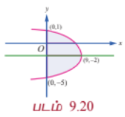

$x −$ அச்சின் மிகைப்பகுதியின் திசையில் நோக்கி பரப்பு காண, கிடைமட்டப் பட்டைகளைப் பயன்படுத்த நமக்குக் கிடைக்கும் பரப்பானது,

$$A = \int_{-1}^5 x dy = \int_{-1}^5 \frac{y^2 - 4y}{5} dy = \frac{1}{5}\left[\frac{y^3}{3} - 2y^2\right]_{-1}^5$$

$$= \frac{1}{5}\left[\left(\frac{125}{3} - 50\right) - \left(-\frac{1}{3} - 2\right)\right] = \frac{1}{5}\left[-\frac{25}{3} + \frac{7}{3}\right] = -\frac{18}{15} = -\frac{6}{5}$$

இது எதிர்மறை மதிப்பு. பரப்பு எப்போதும் நேர்மறை. எனவே தவறு. மேலே உள்ள கணக்கீடு தவறு.

$y^2 = 5x + 4y \Rightarrow x = \frac{y^2 - 4y}{5}$. $y = -1$ எனில் $x = \frac{1 + 4}{5} = 1$, $y = 5$ எனில் $x = \frac{25 - 20}{5} = 1$. எனவே $x$ -ஐ $y$ -இல் எதிர்மறை பெறவில்லை. எனவே $x \ge 0$ என $y$ -க்கு இடையில். எனவே $A = \int_{-1}^5 \frac{y^2 - 4y}{5} dy$ என்பது சரியானது. ஆனால் $y$ -க்கு இடையில் $x$ -ன் மதிப்பு எதிர்மறையாக இல்லை. எனவே $A$ நேர்மறை. $A = \frac{1}{5}\left[\frac{y^3}{3} - 2y^2\right]_{-1}^5 = \frac{1}{5}\left[\left(\frac{125}{3} - 50\right) - \left(-\frac{1}{3} - 2\right)\right] = \frac{1}{5}\left[-\frac{25}{3} + \frac{7}{3}\right] = -\frac{6}{5}$. இது சரியில்லை.

எனவே $x = \frac{y^2 - 4y}{5}$ என்பதை $\frac{(y-2)^2 - 4}{5}$ என எழுதலாம். $y = -1$ மற்றும் $y = 5$ இல் $x = 1$. $y = 2$ இல் $x = -\frac{4}{5}$. எனவே $x$ -ன் மதிப்பு $-1 < y < 5$ -க்கு எதிர்மறை. எனவே பரப்பு $A = -\int_{-1}^5 x dy = -\int_{-1}^5 \frac{y^2 - 4y}{5} dy = \frac{6}{5}$.

---

### எடுத்துக்காட்டு 9.52

$y = \sin x$ என்ற வளைவரை, $x −$ அச்சு, கோடுகள் $x = 0$ மற்றும் $x = 2\pi$ ஆகியவற்றால் அடைபடும் அரங்கத்தின் பரப்பைக் காண்க.

#### தீர்வு

தேவையான பரப்பு படம் 9.21-ல் நிழலிடப்பட்டுள்ளது. பரப்பின் ஒரு பகுதியானது $x −$ அச்சின் மேல் $x = 0$ மற்றும் $x = \pi$ ஆகியவற்றுக்கு இடையில் அமைந்துள்ளது. மற்றொரு பகுதியானது $x −$ அச்சின் கீழ் $x = \pi$ மற்றும் $x = 2\pi$ ஆகியவற்றுக்கு இடையே அமைந்துள்ளது. எனவே தேவையான பரப்பானது.

$$A = \int_0^{\pi} y dx - \int_{\pi}^{2\pi} y dx = \int_0^{\pi} \sin x dx - \int_{\pi}^{2\pi} \sin x dx$$

$$= \left[-\cos x\right]_0^{\pi} - \left[-\cos x\right]_{\pi}^{2\pi} = (1 + 1) - (-1 - 1) = 2 + 2 = 4$$

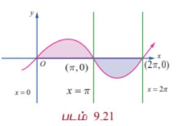

#### குறிப்பு

$\int_0^{2\pi} \sin x dx$ என்ற தொகையிடலின் மதிப்பு காண்போம்.

$$\int_0^{2\pi} \sin x dx = \left[-\cos x\right]_0^{2\pi} = -\cos 2\pi + \cos 0 = -1 + 1 = 0$$

எனவே $\int_0^{2\pi} f(x) dx$ என்பது $y = \sin x$, $x −$ அச்சு, கோடுகள் $x = 0$ மற்றும் $x = 2\pi$ ஆகியவற்றுக்கு இடையே அமையும் அரங்கத்தின் பரப்பைக் குறிப்பதில்லை.

---

### எடுத்துக்காட்டு 9.53

$y = \cos x$ என்ற வளைவரை $x −$ அச்சு, கோடுகள் $x = 0$ மற்றும் $x = \pi$ ஆகியவற்றால் அடைபடும் அரங்கத்தின் பரப்பைக் காண்க.

#### தீர்வு

கொடுக்கப்பட்ட வளைவரையானது

$$y = \begin{cases}
\cos x, & 0 \le x \le \frac{\pi}{2} \\
-\cos x, & \frac{\pi}{2} \le x \le \pi
\end{cases}$$

வளைவரையானது $x −$ அச்சின் மேல் உள்ளது. தேவையான பரப்பு, படம் 9.22-ல் நிழலிடப்பட்டுள்ளது. எனவே தேவையான பரப்பு

$$A = \int_0^{\pi} |\cos x| dx = \int_0^{\frac{\pi}{2}} \cos x dx - \int_{\frac{\pi}{2}}^{\pi} \cos x dx$$

$$= \left[\sin x\right]_0^{\frac{\pi}{2}} - \left[\sin x\right]_{\frac{\pi}{2}}^{\pi} = (1 - 0) - (0 - 1) = 1 + 1 = 2$$

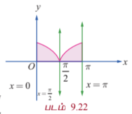

---

#### 9.8.3 இரு வளைவரைகளால் அடைபடும் அரங்கத்தின் பரப்பு
#### (Area of the region bounded between two curves)

**நிலை (i)**

$y = f(x)$ மற்றும் $y = g(x)$ என்ற இரு வளைவரைகளின் சமன்பாடுகள் மற்றும் $xoy$-தளத்தில் $f(x) \ge g(x)$ $\forall x \in [a, b]$ என்க. இவ்விரு வளைவரைகளுக்கும் $x = a$ மற்றும் $x = b$ என்ற கோடுகளுக்கும் இடையே அடைபடும் அரங்கத்தின் பரப்பு $A$ -ஐ நாம் காண்போம்.

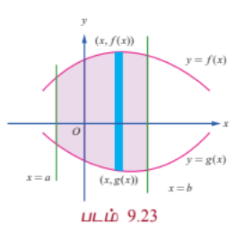

தேவையான பரப்பு படம் 9.23-ல் நிழலிடப்பட்டுள்ளது. பரப்பு $A$ -ஐக் காண அரங்கத்தின் பரப்பை அகலம் $\Delta x$ என இருக்குமாறு சிறு பட்டைகளாகப் பிரித்துக் கொள்வோம். உயரம் $f(x) - g(x)$ எனக் கொள்வோம். $f(x) - g(x) \ge 0$, $\forall x \in [a, b]$ என்பதை கவனத்தில் கொள்வோம். எல்லைகளின் கூடுதலாக செங்குத்து பட்டைகளைக் கொண்டு முன்பு கணக்கிட்ட முறையில் பரப்பைக் காண்போம். எனவே நாம் பெறுவது,

$$A = \int_a^b [f(x) - g(x)] dx$$

#### குறிப்பு

$y −$அச்சின் மிகைப் பகுதியின் திசையில் பார்க்கும்போது $y = f(x)$ என்ற வளைவரையை மேல் வளைவரை ($U$) மற்றும் $y = g(x)$ என்ற வளைவரையை கீழ் வளைவரை ($L$) என அழைப்போம். இவ்வாறாக நாம் பெறுவது $A = \int_a^b [y_U - y_L] dx$.

**நிலை (ii)**

$x = f(y)$ மற்றும் $x = g(y)$ என்பன இரு வளைவரைகளின் சமன்பாடுகள் மற்றும் $xoy$-தளத்தில் $f(y) \ge g(y)$ $\forall y \in [c, d]$ என்க. இவ்விரு வளைவரைக்கும் $y = c$ மற்றும் $y = d$ என்ற கோடுகளுக்கும் இடையில் உள்ள அரங்கத்தின் பரப்பு $A$ -ஐ நாம் காண்போம். தேவையான பரப்பு படம் 9.24-ல் நிழலிடப்பட்டுள்ளது.

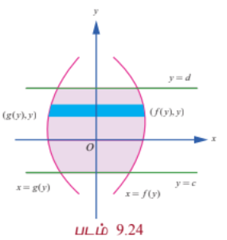

பரப்பு $A$-ஐக் காண அரங்கத்தின் பரப்பை $x −$ அச்சின் மிகைப்பகுதியை காண, $\Delta y$ அகலம் உடைய சிறு பட்டைகளாகப் பிரிப்போம். உயரம் $f(y) - g(y)$ எனக் கொள்வோம்.

$f(y) - g(y) \ge 0$, $\forall y \in [c, d]$ என்பதை கவனத்தில் கொள்வோம். எல்லைகளின் கூடுதலாக கிடைமட்ட பட்டைகளைக் கொண்டு முன்பு கணக்கிட்ட முறையில் பரப்பைக் காண்போம். எனவே நாம் பெறுவது $A = \int_c^d [f(y) - g(y)] dy$.

#### குறிப்பு

$x −$ அச்சின் மிகைப் பகுதியின் திசையில் பார்க்கும்போது $x = f(y)$ என்ற வளைவரை வலது வளைவரை ($R$) என்றும், மற்றும் $x = g(y)$ என்ற வளைவரை இடது வளைவரை ($L$) என்றும் அழைக்கப்படும். இவ்வாறாக நாம் பெறுவது $A = \int_c^d [x_R - x_L] dy$.

---

### எடுத்துக்காட்டு 9.54

$y^2 = 4x$ மற்றும் $x^2 = 4y$ என்ற பரவளையங்களால் அடைபடும் அரங்கத்தின் பரப்பைக் காண்க.

#### தீர்வு

முதலில் வளைவரைகள் வெட்டும் புள்ளிகளைக் காண்போம். இதற்கு $y^2 = 4x$ மற்றும் $x^2 = 4y$ என்ற சமன்பாடுகளைத் தீர்க்க வேண்டும். இரு சமன்பாடுகளிலும் $y$ -ஐ நீக்கக் கிடைப்பது $x^4 = 64x$. எனவே $x = 0$ மற்றும் $x = 4$. எனவே வெட்டும் புள்ளிகள் $(0, 0)$ மற்றும் $(4, 4)$ ஆகும். தேவையான அரங்கத்தின் பரப்பு படம் 9.25-ல் நிழலிடப்பட்டுள்ளது.

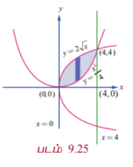

$y$ -அச்சின் மிகைப்பகுதியின் திசையில் பார்க்கும்போது, மேற்புற எல்லையின் சமன்பாடு $y = 2\sqrt{x}$, $0 \le x \le 4$ மற்றும் கீழ் எல்லையின் சமன்பாடு $y = \frac{x^2}{4}$, $0 \le x \le 4$. எனவே தேவையான பரப்பு,

$$A = \int_0^4 [y_U - y_L] dx = \int_0^4 \left(2\sqrt{x} - \frac{x^2}{4}\right) dx = \left[\frac{4}{3}x^{\frac{3}{2}} - \frac{x^3}{12}\right]_0^4$$

$$= \frac{4}{3}(8) - \frac{64}{12} = \frac{32}{3} - \frac{16}{3} = \frac{16}{3}$$

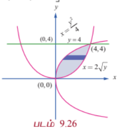

#### குறிப்பு

$x$ -அச்சின் மிகைப்பகுதியின் திசையில் பார்க்கும்போது வலது எல்லையின் வளைவரையின் சமன்பாடு $x^2 = 4y$ அதாவது $x = 2\sqrt{y}$, $0 \le y \le 4$ மற்றும் இடது எல்லையின் வளைவரையின் சமன்பாடு $y^2 = 4x$ அதாவது $x = \frac{y^2}{4}$, $0 \le y \le 4$. படம் 9.26 பார்க்கவும். எனவே தேவையான பரப்பு $A$ என்பது

$$A = \int_0^4 [x_R - x_L] dy = \int_0^4 \left(2\sqrt{y} - \frac{y^2}{4}\right) dy = \left[\frac{4}{3}y^{\frac{3}{2}} - \frac{y^3}{12}\right]_0^4$$

$$= \frac{4}{3}(8) - \frac{64}{12} = \frac{32}{3} - \frac{16}{3} = \frac{16}{3}$$

---

### எடுத்துக்காட்டு 9.55

பரவளையம் $x = y^2$ மற்றும் வளைவரை $y = |x|$ ஆகியவற்றால் அடைபடும் அரங்கத்தின் பரப்பைக் காண்க.

#### தீர்வு

இரு வளைவரைகளும் $y$ -அச்சைப் பொருத்து சமச்சீராக உள்ளன. வளைவரை $y = |x|$ ஆனது

$$y = \begin{cases}
x, & x \ge 0 \\
-x, & x < 0
\end{cases}$$

இவ்வளைவரையானது பரவளையம் $x = y^2$ -ஐ $(1, 1)$ மற்றும் $(-1, 1)$ என்ற புள்ளிகளில் வெட்டும். இரு வளைவரைகளுக்கும் அடைப்பட்ட அரங்கத்தின் பரப்பு படம் 9.27-ல் நிழலிடப்பட்டுள்ளது. இப்பரப்பானது முதல் மற்றும் இரண்டாவது கால் வட்டப் பகுதியில் அமைந்துள்ளன. பரவளையம் சமச்சீராக இருப்பதால் தேவையான பரப்பு முதல் கால் பகுதியில் உள்ளதை போல் இரு மடங்காகும்

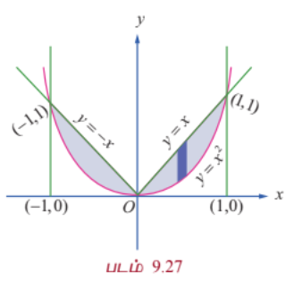

முதல் கால் வட்டப் பகுதியில் $y = x$, $0 \le x \le 1$ என்ற வளைவரை மேல் உள்ளது மற்றும் $y = \sqrt{x}$, $0 \le x \le 1$ என்ற வளைவரை கீழ் உள்ளது. எனவே தேவையான பரப்பானது

$$A = 2\int_0^1 [y_U - y_L] dx = 2\int_0^1 (x - \sqrt{x}) dx = 2\left[\frac{x^2}{2} - \frac{2}{3}x^{\frac{3}{2}}\right]_0^1 = 2\left(\frac{1}{2} - \frac{2}{3}\right) = -\frac{1}{3}$$

இது தவறு. முதல் கால் பகுதியில் $y = \sqrt{x}$ என்பது மேல் வளைவரை மற்றும் $y = x$ என்பது கீழ் வளைவரை. எனவே

$$A = 2\int_0^1 (\sqrt{x} - x) dx = 2\left[\frac{2}{3}x^{\frac{3}{2}} - \frac{x^2}{2}\right]_0^1 = 2\left(\frac{2}{3} - \frac{1}{2}\right) = \frac{1}{3}$$

---

### எடுத்துக்காட்டு 9.56

$y = \cos x$ மற்றும் $y = \sin x$ என்ற வளைவரைகள் $x = \frac{\pi}{4}$ மற்றும் $x = \frac{5\pi}{4}$ என்ற கோடுகள் ஆகியவற்றுக்கு இடையே உள்ள அரங்கத்தின் பரப்பைக் காண்க.

#### தீர்வு

தேவையான அரங்கத்தின் பரப்பு படம் 9.28-ல் நிழலிடப்பட்டுள்ளது. அரங்கத்தின் மேல் எல்லை $y = \sin x$, $\frac{\pi}{4} \le x \le \frac{5\pi}{4}$ மற்றும் அரங்கத்தின் கீழ் எல்லை $y = \cos x$, $\frac{\pi}{4} \le x \le \frac{5\pi}{4}$. தேவையான பரப்பு,

$$A = \int_{\frac{\pi}{4}}^{\frac{5\pi}{4}} [y_U - y_L] dx = \int_{\frac{\pi}{4}}^{\frac{5\pi}{4}} (\sin x - \cos x) dx = \left[-\cos x - \sin x\right]_{\frac{\pi}{4}}^{\frac{5\pi}{4}}$$

$$= \left[-\cos\frac{5\pi}{4} - \sin\frac{5\pi}{4}\right] - \left[-\cos\frac{\pi}{4} - \sin\frac{\pi}{4}\right]$$

$$= \left[\frac{1}{\sqrt{2}} + \frac{1}{\sqrt{2}}\right] - \left[-\frac{1}{\sqrt{2}} - \frac{1}{\sqrt{2}}\right] = \frac{2}{\sqrt{2}} + \frac{2}{\sqrt{2}} = 2\sqrt{2}$$

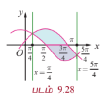

---

### எடுத்துக்காட்டு 9.57

$x^2 + y^2 = a^2$ என்ற வட்டத்தில் உள்ள அரங்கத்தின் பரப்பை $x = h$ என்ற கோடு இரு பகுதிகளாக பிரிக்கின்றது எனில் சிறிய பகுதியின் பரப்பைக் காண்க.

#### தீர்வு

சிறிய பகுதியின் பரப்பு படம் 9.29-ல் நிழலிடப்பட்டுள்ளது. இங்கு $0 < h < a$ வட்டம் $x$ -அச்சைப் பொருத்து சமச்சீராக இருப்பதால் சிறிய பகுதியின் பரப்பு,

$$A = 2\int_h^a y dx = 2\int_h^a \sqrt{a^2 - x^2} dx$$

$$= 2\left[\frac{x}{2}\sqrt{a^2 - x^2} + \frac{a^2}{2}\sin^{-1}\left(\frac{x}{a}\right)\right]_h^a$$

$$= 2\left[0 + \frac{a^2}{2}\cdot\frac{\pi}{2} - \frac{h}{2}\sqrt{a^2 - h^2} - \frac{a^2}{2}\sin^{-1}\left(\frac{h}{a}\right)\right]$$

$$= a^2\frac{\pi}{2} - h\sqrt{a^2 - h^2} - a^2\sin^{-1}\left(\frac{h}{a}\right)$$

$$= a^2\left(\frac{\pi}{2} - \sin^{-1}\left(\frac{h}{a}\right)\right) - h\sqrt{a^2 - h^2}$$

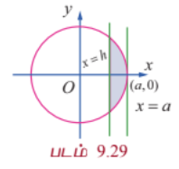

---

### எடுத்துக்காட்டு 9.58

பரவளையம் $y^2 = 4x$, கோடு $x + y = 3$ மற்றும் $y$ -அச்சு ஆகியவற்றால் முதல் கால் வட்டப் பகுதியில் அடைபடும் அரங்கத்தின் பரப்பைக் காண்க.

#### தீர்வு

முதலில் $x + y = 3$ மற்றும் $y^2 = 4x$ வெட்டிக் கொள்ளும் புள்ளிகளை காண்போம்.

$x = 3 - y \Rightarrow y^2 = 4(3 - y) \Rightarrow y^2 + 4y - 12 = 0 \Rightarrow (y + 6)(y - 2) = 0 \Rightarrow y = 2, -6$.

$x = 1$ என $x + y = 3$ -ல் பிரதியிடக் கிடைப்பது $y = 2$.

$x = 9$ என $x + y = 3$ பிரதியிடக் கிடைப்பது $y = -6$.

எனவே வெட்டும் புள்ளிகள் $(1, 2)$ மற்றும் $(9, -6)$ ஆகும்.

கோடு $x + y = 3$ என்பது $y$ -அச்சை $(0, 3)$ எனும் புள்ளியில் சந்திக்கின்றது. தேவையான பரப்பு படம் 9.30-ல் நிழலிடப்பட்டுள்ளது

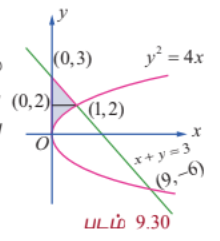

$y$ -அச்சின் மிகைப்பகுதியை நோக்கிப் பார்க்கும்போது வலது எல்லையில் அமைந்துள்ள வளைவரையானது

$$x = \begin{cases}
\frac{y^2}{4}, & 0 \le y \le 2 \\
3 - y, & 2 \le y \le 3
\end{cases}$$

$$\therefore A = \int_0^2 x_R dy + \int_2^3 x_R dy = \int_0^2 \frac{y^2}{4} dy + \int_2^3 (3 - y) dy$$

$$= \left[\frac{y^3}{12}\right]_0^2 + \left[3y - \frac{y^2}{2}\right]_2^3 = \frac{8}{12} + \left(9 - \frac{9}{2}\right) - \left(6 - 2\right) = \frac{2}{3} + \frac{9}{2} - 4 = \frac{4 + 27 - 24}{6} = \frac{7}{6}$$

---

### எடுத்துக்காட்டு 9.59

கோடுகள் $5x - 2y = 15$, $x + y + 4 = 0$ மற்றும் $x$-அச்சு ஆகியவற்றால் அடைபடும் அரங்கத்தின் பரப்பை தொகையிடல் மூலம் காண்க.

#### தீர்வு

கோடுகள் $5x - 2y = 15$, $x + y + 4 = 0$ வெட்டும் புள்ளி $(1, -5)$. $5x - 2y = 15$ என்ற கோடு $x$-அச்சை சந்திக்கும் புள்ளி $(3, 0)$. கோடு $x + y + 4 = 0$, $x$-அச்சை $(-4, 0)$ -ல் சந்திக்கிறது. தேவையான பரப்பு படம் 9.31-ல் நிழலிடப்பட்டுள்ளது. இப்பரப்பானது $x$-அச்சின் மேல் பகுதியில் உள்ளது. இப்பரப்பை செங்குத்துப் பட்டைகள் அல்லது கிடைமட்டப் பட்டைகளைப் பயன்படுத்தி கணக்கிடலாம்.

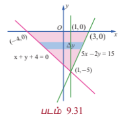

செங்குத்துப் பட்டைகளைப் பயன்படுத்தி அரங்கத்தின் பரப்பு காண அரங்கத்தை $x = 1$ கோடு வழியாக இரு பிரிவுகளாகப் பிரிக்க வேண்டும்.

எனவே நமக்கு கிடைப்பது,

$$A = \int_{-4}^1 y dx + \int_1^3 y dx = \int_{-4}^1 \left(-x - 4\right) dx + \int_1^3 \left(\frac{5x - 15}{2}\right) dx$$

$$= \left[-\frac{x^2}{2} - 4x\right]_{-4}^1 + \left[\frac{5x^2}{4} - \frac{15x}{2}\right]_1^3$$

$$= \left[\left(-\frac{1}{2} - 4\right) - \left(-8 + 16\right)\right] + \left[\left(\frac{45}{4} - \frac{45}{2}\right) - \left(\frac{5}{4} - \frac{15}{2}\right)\right]$$

$$= \left[-\frac{9}{2} - 8\right] + \left[-\frac{45}{4} + \frac{25}{4}\right] = -\frac{25}{2} - 5 = -\frac{35}{2}$$

$A = \frac{35}{2}$.

கிடைமட்டப் பட்டைகளைக் கொண்டு பரப்பு காணும்போது அரங்கத்தை இரு பகுதிகளாகப் பிரிக்கத் தேவையில்லை. இம்முறையில் பரப்பின் வலது பக்க எல்லை $5x - 2y = 15$ என்ற கோடு மற்றும் இடது பக்க எல்லை $x + y + 4 = 0$ என்ற கோடு ஆகும். எனவே நமக்கு கிடைப்பது,

$$A = \int_0^5 [x_R - x_L] dy = \int_0^5 \left[\frac{15 + 2y}{5} - (-y - 4)\right] dy = \int_0^5 \left(3 + \frac{2y}{5} + y + 4\right) dy$$

$$= \int_0^5 \left(7 + \frac{7y}{5}\right) dy = \left[7y + \frac{7y^2}{10}\right]_0^5 = 35 + \frac{175}{10} = 35 + 17.5 = 52.5$$

இது தவறு. $x_L = -y - 4$, $x_R = \frac{15 + 2y}{5}$. $y = 0$ இல் $x_L = -4$, $x_R = 3$. $y = 5$ இல் $x_L = -9$, $x_R = 5$. எனவே $x_R > x_L$. $A = \int_0^5 [x_R - x_L] dy = \int_0^5 \left[\frac{15 + 2y}{5} + y + 4\right] dy = \int_0^5 \left(7 + \frac{7y}{5}\right) dy = \frac{35}{2}$.

#### குறிப்பு

முக்கோண வடிவத்தில் உள்ள அரங்கத்தின் அடிப்பக்கம் 7 அலகுகளாகும் மற்றும் உயரம் 5 அலகுகளாகவும் உள்ளது. எனவே தொகையிடலை பயன்படுத்தாமலே அதன் பரப்பானது $\frac{35}{2}$ என காணலாம்.

---

### எடுத்துக்காட்டு 9.60

$(-1, 1)$, $(3, 2)$, $(0, 5)$ என்பன $A, B$, மற்றும் $C$-யின் புள்ளிகள் எனில் முக்கோணம் $ABC$ ஆல் அடைபடும் அரங்கத்தின் பரப்பை தொகையிடலைப் பயன்படுத்தி காண்க.

#### தீர்வு

படம் 9.32-ஐ பார்க்க.

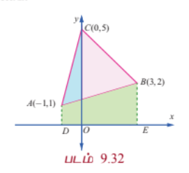

$AB$ -யின் சமன்பாடு $y - 1 = \frac{2 - 1}{3 + 1}(x + 1) \Rightarrow y = \frac{1}{4}x + \frac{5}{4}$

$BC$-யின் சமன்பாடு $y - 2 = \frac{5 - 2}{0 - 3}(x - 3) \Rightarrow y = -x + 5$

$AC$-யின் சமன்பாடு $y - 1 = \frac{5 - 1}{0 + 1}(x + 1) \Rightarrow y = 4x + 5$

$$\therefore \text{எனவே } \triangle ABC \text{ -யின் பரப்பு}$$

$$= \triangle ACO\text{-யின் பரப்பு} + \triangle OCB\text{-யின் பரப்பு} - \triangle ABO\text{-யின் பரப்பு}$$

$$= \int_{-1}^0 (4x + 5) dx + \int_0^3 (-x + 5) dx - \int_{-1}^3 \left(\frac{x}{4} + \frac{5}{4}\right) dx$$

$$= \left[2x^2 + 5x\right]_{-1}^0 + \left[-\frac{x^2}{2} + 5x\right]_0^3 - \left[\frac{x^2}{8} + \frac{5x}{4}\right]_{-1}^3$$

$$= (0 - (2 - 5)) + \left(\left(-\frac{9}{2} + 15\right) - 0\right) - \left(\left(\frac{9}{8} + \frac{15}{4}\right) - \left(\frac{1}{8} - \frac{5}{4}\right)\right)$$

$$= 3 + \frac{21}{2} - \left(\frac{9}{8} + \frac{30}{8} - \frac{1}{8} + \frac{10}{8}\right) = 3 + \frac{21}{2} - \frac{48}{8} = 3 + 10.5 - 6 = 7.5 = \frac{15}{2}$$

---

### எடுத்துக்காட்டு 9.61

$x^2 + y^2 = 4$ என்ற வட்டத்தில் $(1, \sqrt{3})$ எனும் புள்ளியில் தொடுகோடு, செங்கோடு மற்றும் $x$-அச்சு ஆகியவற்றால் அடைபடும் அரங்கத்தின் பரப்பை தொகையிடலைப் பயன்படுத்தி காண்க.

#### தீர்வு

$x^2 + y^2 = a^2$ என்ற வட்டத்திற்கு $(x_1, y_1)$ எனும் புள்ளியில் தொடுகோட்டின் சமன்பாடு $xx_1 + yy_1 = a^2$ என நாம் அறிவோம். எனவே $x^2 + y^2 = 4$ என்ற வட்டத்திற்கு $(1, \sqrt{3})$ எனும் புள்ளியில் தொடுகோட்டின் சமன்பாடு $x + \sqrt{3}y = 4$; அதாவது $y = -\frac{1}{\sqrt{3}}(x - 4)$. தொடுகோடு $(4,0)$ எனும் புள்ளியில் $x$-அச்சை சந்திக்கிறது. எனவே தொடுகோட்டின் சாய்வு $-\frac{1}{\sqrt{3}}$. எனவே செங்கோட்டின் சாய்வு $\sqrt{3}$. செங்கோட்டின் சமன்பாடு $y - \sqrt{3} = \sqrt{3}(x - 1)$; அதாவது $y = \sqrt{3}x$. இக்கோடு ஆதி வழிச் செல்கிறது. தேவையான பரப்பானது அருகில் உள்ள படத்தில் நிழலிடப்பட்டுள்ளது. இப்பரப்பினை இரு வழிகளில் காணலாம்.

**முறை 1**

$y$-அச்சின் மிகை திசையில் நோக்கி பார்க்கும் போது, தேவையான அரங்கத்தின் பரப்பானது $x$-அச்சு, $y = \sqrt{3}x$ மற்றும் $x + \sqrt{3}y = 4$ ஆகியவற்றால் அடைபடும் பரப்பாகும். இதற்கு $\int_a^b y dx$ என்ற சூத்திரத்தைப் பயன்படுத்துவோம். இதற்குத் தேவையான அரங்கத்தின் பரப்பை இரு பகுதிகளாக பிரித்துக் காண்போம். ஒரு பகுதியானது $x$-அச்சு, செங்கோடு $y = \sqrt{3}x$ மற்றும் $x = 1$ ஆகியவற்றால் அடைபடும் அரங்கத்தின் பரப்பு மற்றொரு பகுதியானது $x$-அச்சு தொடுகோடு $x + \sqrt{3}y = 4$ மற்றும் $x = 1$ ஆகியவற்றால் அடைபடும் அரங்கத்தின் பரப்பு ஆகும்.

$$\therefore \text{தேவையான பரப்பு} = \int_0^1 y dx + \int_1^4 y dx = \int_0^1 \sqrt{3}x dx + \int_1^4 \frac{4 - x}{\sqrt{3}} dx$$

$$= \left[\frac{\sqrt{3}}{2}x^2\right]_0^1 + \frac{1}{\sqrt{3}}\left[4x - \frac{x^2}{2}\right]_1^4 = \frac{\sqrt{3}}{2} + \frac{1}{\sqrt{3}}\left[(16 - 8) - \left(4 - \frac{1}{2}\right)\right]$$

$$= \frac{\sqrt{3}}{2} + \frac{1}{\sqrt{3}}\left[8 - \frac{7}{2}\right] = \frac{\sqrt{3}}{2} + \frac{1}{\sqrt{3}}\left(\frac{9}{2}\right) = \frac{\sqrt{3}}{2} + \frac{3\sqrt{3}}{2} = 2\sqrt{3}$$

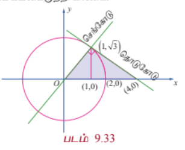

**முறை 2**

$x$-அச்சின் மிகை திசையில் நோக்கி பார்க்கும் போது, தேவையான அரங்கத்தின் பரப்பானது $y = \sqrt{3}x$, $x + \sqrt{3}y = 4$, $y = 0$ மற்றும் $y = \sqrt{3}$ ஆகியவற்றால் அடைபடும் பரப்பாகும். இப்பரப்பைக் காண $\int_c^d [x_R - x_L] dy$ என்ற சூத்திரத்தைப் பயன்படுத்த வேண்டும்.

இங்கு $c = 0$, $d = \sqrt{3}$, $x_R$ என்பது தொடுகோடு $x + \sqrt{3}y = 4$ மற்றும் $x_L$ என்பது செங்கோடு $y = \sqrt{3}x$ இன் $x$ மதிப்பாகும்.

$$\therefore \text{தேவையான பரப்பு} = \int_0^{\sqrt{3}} [x_R - x_L] dy = \int_0^{\sqrt{3}} \left(4 - \sqrt{3}y - \frac{y}{\sqrt{3}}\right) dy$$

$$= \left[4y - \frac{\sqrt{3}}{2}y^2 - \frac{y^2}{2\sqrt{3}}\right]_0^{\sqrt{3}} = 4\sqrt{3} - \frac{3\sqrt{3}}{2} - \frac{\sqrt{3}}{2} = 4\sqrt{3} - 2\sqrt{3} = 2\sqrt{3}$$

---

$y = f_1(x), y = f_2(x)$ கோடுகள் $x = a$ மற்றும் $x = b$, $a < b$ ஆகியவற்றால் அடைபடும் அரங்கத்தின் பரப்பைக் காண வழிமுறைகள்:

$y$-அச்சுக்கு இணையாக அரங்கத்தின் தளத்தை வெட்டும் வகையில் தன்னிச்சையாக ஒரு கோடு வரைக. முதலில் அரங்கத்திற்குள் நுழையும் கோட்டின் $y$-புள்ளியைக் காண்க. இதை $y_{ENTRY}$ என அழைக்கவும். அடுத்ததாக அரங்கத்திற்குள் இருந்து வெளியேறும் கோட்டின் $y$-புள்ளியைக் காண்க. இதை $y_{EXIT}$ என அழைக்கவும். வளைவரைகளின் எல்லைச் சமன்பாடுகளைக் கொண்டு $y_{ENTRY}$ மற்றும் $y_{EXIT}$ காண முடியும். எனவே தேவையான பரப்பு $\int_a^b [y_{EXIT} - y_{ENTRY}] dx$.

$x = g_1(y), x = g_2(y)$ கோடுகள் $y = c$ மற்றும் $y = d$, $c < d$ ஆகியவற்றால் அடைபடும் அரங்கத்தின் பரப்பை காண வழிமுறைகள்:

$x$-அச்சுக்கு இணையாக அரங்கத்தின் தளத்தை வெட்டும் வகையில் தன்னிச்சையாக ஒரு கோடு வரைக. முதலில் அரங்கத்திற்குள் நுழையும் கோட்டின் $x$-புள்ளியைக் காண்க. இதை $x_{ENTRY}$ என அழைக்கவும். அடுத்ததாக அரங்கத்திற்குள் இருந்து வெளியேறும் கோட்டின் $x$-புள்ளியைக் காண்க. இதை $x_{EXIT}$ என அழைக்கவும். வளைவரைகளின் எல்லைச் சமன்பாடுகளைக் கொண்டு $x_{ENTRY}$ மற்றும் $x_{EXIT}$ காண முடியும். எனவே தேவையான பரப்பு $\int_c^d [x_{EXIT} - x_{ENTRY}] dy$.

---

### பயிற்சி 9.8

1. $3x + 2y = 6$, $x = -3$, $x = 1$ மற்றும் $x$-அச்சு ஆகியவற்றால் அடைபடும் அரங்கத்தின் பரப்பைக் காண்க.

2. $2x - y + 1 = 0$, $y = 1$, $y = 3$ மற்றும் $y$-அச்சு ஆகியவற்றால் அடைபடும் அரங்கத்தின் பரப்பைக் காண்க.

3. வளைவரை, $y = 2x^2 - 20x$, $x$-அச்சு, $x = -3$ மற்றும் $x = 3$ ஆகியவற்றால் அடைபடும் அரங்கத்தின் பரப்பைக் காண்க.

4. கோடு $y = 2x + 5$ மற்றும் பரவளையம் $y = x^2 - 2x$ ஆகியவற்றால் அடைபடும் அரங்கத்தின் பரப்பைக் காண்க.

5. வளைவரைகள் $y = \sin x$, $y = \cos x$ மற்றும் கோடுகள் $x = 0$ மற்றும் $x = \pi$ ஆகியவற்றுக்கு இடையே அடைபடும் அரங்கத்தின் பரப்பைக் காண்க.

6. $y = \tan x$, $y = \cot x$ மற்றும் கோடுகள் $x = 0$, $x = \frac{\pi}{2}$, $y = 0$ ஆகியவற்றால் அடைபடும் அரங்கத்தின் பரப்பைக் காண்க.

7. பரவளையம் $y^2 = x$ மற்றும் கோடு $y = x - 2$ ஆகியவற்றால் அடைபடும் அரங்கத்தின் பரப்பைக் காண்க.

8. ஒரு குடும்பத் தலைவர், $x = 0$, $x = 4$, $y = 4$ மற்றும் $y = 0$ ஆகியவற்றால் அடைபடும் சதுர நிலத்தின் பரப்பை $y^2 = 4x$ மற்றும் $x^2 = 4y$ என்ற வளைவரைகளின் வாயிலாக தன்னுடைய மனைவி, மகள் மற்றும் மகன் ஆகியோர்க்கு மூன்று சமபாகங்களாகப் பிரிக்க விரும்புகிறார். அவ்வாறு பிரிக்க இயலுமா? பிரிக்க இயலும் எனில் ஒவ்வொருவருக்கும் கிடைக்கும் பரப்பைக் காண்க.

9. $P$ என்பது $y = 2x - x^2$ என்ற வளைவரைக்கு ஒரு மீச்சிறு புள்ளி. $Q$ என்ற புள்ளியானது, $PQ$-ன் சாய்வு 2 உள்ளவாறு வளைவரையின் மேல் உள்ளது எனில் வளைவரைக்கும் நாண் $PQ$-க்கும் இடையில் அடைபடும் பரப்பைக் காண்க.

10. $x^2 + y^2 = 16$ என்ற வட்டத்திற்கும் $y^2 = 6x$ என்ற பரவளையத்திற்கும் பொதுவான அரங்கத்தின் பரப்பைக் காண்க.