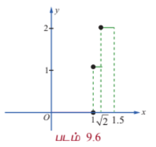
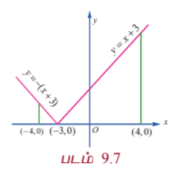

### 9.3 தொகை நுண்கணித அடிப்படைத் தேற்றங்கள் மற்றும் அவற்றின் பயன்பாடுகள்
### (Fundamental Theorems of Integral Calculus and their Applications)

சார்பு மிக எளிமையாக இருப்பினும் $\int_a^b f(x) dx$ -இன் மதிப்பை தொகையீடுகளின் கூட்டலின் எல்லைகளாக தீர்வு காண்பது மிகவும் கடினம் என்பதை மேலே உள்ள எடுத்துக்காட்டுகளின் வாயிலாக பார்த்ததோம். நியூட்டன் (Newton) மற்றும் லிபினிட்ஸ் (Leibnitz) இருவரும் கிட்டத்தட்ட ஒரே காலத்தில் வரையறுத்த தொகையிடலை ஓர் எளிய முறையில் காண வழிவகுத்தனர். இம்முறையானது முதல் மற்றும் இரண்டாம் நுண்கணித அடிப்படைத் தேற்றத்தை அடிப்படையாகக் கொண்டது. இத்தேற்றங்கள் ஒரு சார்பிற்கும் அதன் எதிர் வகையிடலுக்கும் (முடியுமெனில்) உள்ள தொடர்பை நிலைநிறுத்துகிறது. இத்தேற்றங்கள் வகை நுண்கணிதத்திற்கும் தொகை நுண்கணிதத்திற்கும் உள்ள ஒரு தொடர்பை ஏற்படுத்துகிறது.

பின்வரும் முக்கிய தேற்றங்கள் நிரூபணமின்றி கீழே கொடுக்கப்பட்டுள்ளன.

#### தேற்றம் 9.1 (முதல் தொகை நுண்கணித அடிப்படைத் தேற்றம்)

$f(x)$ என்பது $[a, b]$ என்ற மூடிய இடைவெளியில் வரையறுக்கப்பட்ட தொடர்ச்சியான சார்பு மற்றும் $F(x) = \int_a^x f(u) du$, $a < x < b$ எனில், $\frac{d}{dx}F(x) = f(x)$. அதாவது $F(x)$ -ஆனது $f(x)$ -இன் எதிர் வகையீடு ஆகும்.

#### தேற்றம் 9.2 (இரண்டாவது தொகை நுண்கணித அடிப்படைத் தேற்றம்)

$f(x)$ என்பது $[a, b]$ என்ற மூடிய இடைவெளியில் வரையறுக்கப்பட்ட தொடர்ச்சியான சார்பு மற்றும் $F(x)$ -ஆனது $f(x)$ -இன் எதிர் வகையீடு எனில்,

$$\int_a^b f(x) dx = F(b) - F(a)$$

#### குறிப்பு

$F(b) - F(a)$ ஆனது $\int_a^b f(x) dx$ என்ற வரையறுக்கப்பட்ட தொகையிடலின் (ரீமன் தொகையிடல்) மதிப்பானதால் எதிர்முறை வகையீடு $F(x)$ உடன் சேர்க்கப்படும் தன்னிச்சை மாறி நீக்கப்பட்டு விடும். எனவே வரையறுத்த தொகையிடலின் மதிப்பு காணும்போது எதிர் வகையீடுடன் தன்னிச்சை மாறியை சேர்க்கத் தேவையில்லை. $F(b) - F(a)$ -ஐ சுருக்கமாக $\left[F(x)\right]_a^b$ என எழுதலாம். வரையறுத்த தொகையிடலின் மதிப்பு ஒருமைத் தன்மை உடையது.

இரண்டாவது தொகை நுண்கணித தேற்றத்தின் வாயிலாக பின்வரும் வரையறுத்த தொகையிடலின் பண்புகளைப் பெறுகிறோம். அவற்றை நிரூபணமின்றி இங்கு காண்போம்.

**பண்பு 1 :** $\int_a^b f(x) dx = \int_a^b f(u) du$, $a < b$

அதாவது எல்லைகள் மாறாமல் இருக்கும்போது மாறியை மாற்றுவதால் தொகையிடலின் மதிப்பு மாறாது.

**பண்பு 2 :** $\int_b^a f(x) dx = -\int_a^b f(x) dx$

அதாவது வரையறுத்த தொகையிடலில் எல்லைகளை இடமாற்றம் செய்யும்போது வரையறுத்த தொகையிடலின் குறியீடு '-' ஆக மாறும்.

**பண்பு 3 :** $\int_a^b f(x) dx = \int_a^c f(x) dx + \int_c^b f(x) dx$, $a < c < b$

**பண்பு 4 :** $\int_a^b [\alpha f(x) + \beta g(x)] dx = \alpha \int_a^b f(x) dx + \beta \int_a^b g(x) dx$ இங்கு, $\alpha$ மற்றும் $\beta$ மாறிலிகள்.

**பண்பு 5 :** $x = g(u)$ எனில், $\int_a^b f(x) dx = \int_c^d f(g(u)) \frac{dg(u)}{du} du$ இங்கு $g(c) = a$ மற்றும் $g(d) = b$.

இப்பண்பானது வரையறுத்த தொகையிடலில் பிரதியிடல் முறையைப் பயன்படுத்த உதவுகிறது.

மேற்கூறிய பண்புகளை பின்வரும் எடுத்துக்காட்டுகளில் பயன்படுத்துவோம்.

---

### எடுத்துக்காட்டு 9.5

மதிப்பிடுக : $\int_0^3 (3x^2 - 4x + 5) dx$.

#### தீர்வு

$$\int_0^3 (3x^2 - 4x + 5) dx = 3\int_0^3 x^2 dx - 4\int_0^3 x dx + 5\int_0^3 dx$$

$$= 3\left[\frac{x^3}{3}\right]_0^3 - 4\left[\frac{x^2}{2}\right]_0^3 + 5\left[x\right]_0^3$$

$$= (27 - 0) - 2(9 - 0) + 5(3 - 0)$$

$$= 27 - 18 + 15 = 24$$

---

### எடுத்துக்காட்டு 9.6

மதிப்பிடுக : $\int_0^1 \frac{2x + 7}{5x^2 + 9} dx$.

#### தீர்வு

$$\int_0^1 \frac{2x + 7}{5x^2 + 9} dx = \frac{1}{5}\int_0^1 \frac{10x}{5x^2 + 9} dx + 7\int_0^1 \frac{1}{5x^2 + 9} dx$$

$$= \frac{1}{5}\left[\log|5x^2 + 9|\right]_0^1 + \frac{7}{5}\int_0^1 \frac{1}{x^2 + \frac{9}{5}} dx$$

$$= \frac{1}{5}(\log 14 - \log 9) + \frac{7}{5}\left[\frac{1}{\sqrt{\frac{9}{5}}}\tan^{-1}\left(\frac{x}{\sqrt{\frac{9}{5}}}\right)\right]_0^1$$

$$= \frac{1}{5}\log\frac{14}{9} + \frac{7}{5}\sqrt{\frac{5}{9}}\tan^{-1}\left(\sqrt{\frac{5}{9}}\right)$$

$$= \frac{1}{5}\log\frac{14}{9} + \frac{7}{5}\frac{\sqrt{5}}{3}\tan^{-1}\left(\frac{\sqrt{5}}{3}\right)$$

---

### எடுத்துக்காட்டு 9.7

மதிப்பிடுக : $\int_0^1 [2x] dx$, $[\cdot]$ என்பது மீப்பெரு முழுக்கள் சார்பு.

#### தீர்வு

$$\int_0^1 [2x] dx = \int_0^{\frac{1}{2}} [2x] dx + \int_{\frac{1}{2}}^1 [2x] dx$$

$0 \le x < \frac{1}{2}$ எனில் $0 \le 2x < 1 \Rightarrow [2x] = 0$

$\frac{1}{2} \le x < 1$ எனில் $1 \le 2x < 2 \Rightarrow [2x] = 1$

$$\therefore \int_0^1 [2x] dx = \int_0^{\frac{1}{2}} 0 dx + \int_{\frac{1}{2}}^1 1 dx = 0 + \left[x\right]_{\frac{1}{2}}^1 = 1 - \frac{1}{2} = \frac{1}{2}$$

---

### எடுத்துக்காட்டு 9.8

மதிப்பிடுக : $\int_0^{\frac{\pi}{3}} \frac{\sec x \tan x}{1 + \sec^2 x} dx$.

#### தீர்வு

$I = \int_0^{\frac{\pi}{3}} \frac{\sec x \tan x}{1 + \sec^2 x} dx$ என்க. $\sec x = u$ என்க. எனவே $\sec x \tan x dx = du$.

$x = 0$ எனில், $u = \sec 0 = 1$ மற்றும் $x = \frac{\pi}{3}$ எனில் $u = \sec\frac{\pi}{3} = 2$.

$$\therefore I = \int_1^2 \frac{du}{1 + u^2} = \left[\tan^{-1} u\right]_1^2 = \tan^{-1}2 - \tan^{-1}1 = \tan^{-1}2 - \frac{\pi}{4}$$

---

### எடுத்துக்காட்டு 9.9

மதிப்பிடுக : $\int_0^9 \frac{1}{x + \sqrt{x}} dx$.

#### தீர்வு

$x = u^2$ என்க. எனவே $x = u^2$, மற்றும் $dx = 2u du$.

$x = 0$ எனில், $u = 0$ மற்றும் $x = 9$ எனில், $u = 3$.

$$\int_0^9 \frac{1}{x + \sqrt{x}} dx = \int_0^3 \frac{1}{u^2 + u}(2u du) = 2\int_0^3 \frac{1}{u + 1} du = 2\left[\log(u + 1)\right]_0^3 = 2(\log 4 - \log 1) = 2\log 4 = \log 16$$

---

### எடுத்துக்காட்டு 9.10

மதிப்பிடுக : $\int_2^4 \frac{x}{(x - 1)(x + 2)} dx$.

#### தீர்வு

$$I = \int_2^4 \frac{x}{(x - 1)(x + 2)} dx$$ என்க.

$$\frac{x}{(x - 1)(x + 2)} = \frac{1}{3}\left(\frac{2}{x - 1} + \frac{1}{x + 2}\right)$$

$$I = \frac{1}{3}\int_2^4 \left(\frac{2}{x - 1} + \frac{1}{x + 2}\right) dx = \frac{1}{3}\left[2\log(x - 1) + \log(x + 2)\right]_2^4$$

$$= \frac{1}{3}\left[2\log 3 + \log 6 - 2\log 1 - \log 4\right] = \frac{1}{3}\left[\log 9 + \log 6 - \log 4\right] = \frac{1}{3}\log\left(\frac{54}{4}\right) = \frac{1}{3}\log\left(\frac{27}{2}\right) = \log\sqrt[3]{\frac{27}{2}}$$

---

### எடுத்துக்காட்டு 9.11

மதிப்பிடுக : $\int_0^{\frac{\pi}{2}} \frac{\cos\theta}{(1 + \sin\theta)(2 - \sin\theta)} d\theta$.

#### தீர்வு

$$I = \int_0^{\frac{\pi}{2}} \frac{\cos\theta}{(1 + \sin\theta)(2 - \sin\theta)} d\theta$$ என்க.

$u = \sin\theta$ எனப் பிரதியிடக் கிடைப்பது $du = \cos\theta d\theta$.

$\theta = 0$ எனில் $u = 0$ மற்றும் $\theta = \frac{\pi}{2}$ எனில் $u = 1$.

$$\therefore I = \int_0^1 \frac{du}{(1 + u)(2 - u)} = \frac{1}{3}\int_0^1 \left(\frac{1}{1 + u} + \frac{1}{2 - u}\right) du$$

$$= \frac{1}{3}\left[\log(1 + u) - \log(2 - u)\right]_0^1 = \frac{1}{3}\left[\log\left(\frac{1 + u}{2 - u}\right)\right]_0^1$$

$$= \frac{1}{3}\left[\log\left(\frac{2}{1}\right) - \log\left(\frac{1}{2}\right)\right] = \frac{1}{3}[\log 2 + \log 2] = \frac{2}{3}\log 2 = \log\left(2^{\frac{2}{3}}\right)$$

---

### எடுத்துக்காட்டு 9.12

மதிப்பிடுக : $\int_0^{\frac{1}{2}} \frac{\sin^{-1} x}{(1 - x^2)^{\frac{3}{2}}} dx$.

#### தீர்வு

$$I = \int_0^{\frac{1}{2}} \frac{\sin^{-1} x}{(1 - x^2)^{\frac{3}{2}}} dx$$ என்க.

$u = \sin^{-1} x$ எனப் பிரதியிடக் கிடைப்பது, $x = \sin u$ மற்றும் $du = \frac{1}{\sqrt{1 - x^2}} dx$.

$x = 0$ எனில் $u = 0$ மற்றும் $x = \frac{1}{2}$ எனில் $u = \frac{\pi}{4}$.

$$\therefore I = \int_0^{\frac{\pi}{4}} \frac{u}{1 - \sin^2 u} du = \int_0^{\frac{\pi}{4}} u \sec^2 u du$$

$$= \left[u\tan u\right]_0^{\frac{\pi}{4}} - \int_0^{\frac{\pi}{4}} \tan u du = \frac{\pi}{4}(1) - 0 - [-\log\cos u]_0^{\frac{\pi}{4}} = \frac{\pi}{4} + \log\cos\frac{\pi}{4} - \log\cos 0$$

$$= \frac{\pi}{4} + \log\left(\frac{1}{\sqrt{2}}\right) - 0 = \frac{\pi}{4} - \frac{1}{2}\log 2 = \frac{\pi}{4} - \log\sqrt{2}$$

---

### எடுத்துக்காட்டு 9.13

மதிப்பிடுக : $\int_0^{\frac{\pi}{2}} \sqrt{\tan x + \cot x} dx$.

#### தீர்வு

$$I = \int_0^{\frac{\pi}{2}} \sqrt{\tan x + \cot x} dx$$ என்க.

$$I = \int_0^{\frac{\pi}{2}} \sqrt{\frac{\sin x}{\cos x} + \frac{\cos x}{\sin x}} dx = \int_0^{\frac{\pi}{2}} \sqrt{\frac{\sin^2 x + \cos^2 x}{\sin x \cos x}} dx = \int_0^{\frac{\pi}{2}} \frac{1}{\sqrt{\sin x \cos x}} dx$$

$$= \int_0^{\frac{\pi}{2}} \frac{\sqrt{2}}{\sqrt{2\sin x \cos x}} dx = \sqrt{2}\int_0^{\frac{\pi}{2}} \frac{1}{\sqrt{\sin 2x}} dx$$

$u = 2x$ எனப் பிரதியிட, $dx = \frac{du}{2}$. $x = 0$ எனில் $u = 0$ மற்றும் $x = \frac{\pi}{2}$ எனில் $u = \pi$.

$$\therefore I = \frac{\sqrt{2}}{2}\int_0^{\pi} \frac{1}{\sqrt{\sin u}} du = \frac{1}{\sqrt{2}}\int_0^{\pi} (\sin u)^{-\frac{1}{2}} du = \frac{1}{\sqrt{2}}\int_0^{\pi} \sin^{-\frac{1}{2}} u du$$

$u = \frac{\pi}{2} - t$ எனப் பிரதியிட, $du = -dt$. $u = 0$ எனில் $t = \frac{\pi}{2}$ மற்றும் $u = \pi$ எனில் $t = -\frac{\pi}{2}$.

$$I = \frac{1}{\sqrt{2}}\int_{\frac{\pi}{2}}^{-\frac{\pi}{2}} \sin^{-\frac{1}{2}}\left(\frac{\pi}{2} - t\right)(-dt) = \frac{1}{\sqrt{2}}\int_{-\frac{\pi}{2}}^{\frac{\pi}{2}} \cos^{-\frac{1}{2}} t dt$$

$\cos^{-\frac{1}{2}} t$ ஒரு இரட்டைப்படை சார்பு என்பதால்,

$$I = \frac{1}{\sqrt{2}}\left(2\int_0^{\frac{\pi}{2}} \cos^{-\frac{1}{2}} t dt\right) = \sqrt{2}\int_0^{\frac{\pi}{2}} \cos^{-\frac{1}{2}} t dt$$

இது ஒரு பீட்டா தொகையிடல். $\int_0^{\frac{\pi}{2}} \sin^{m-1} x \cos^{n-1} x dx = \frac{1}{2}B\left(\frac{m}{2}, \frac{n}{2}\right)$

$\cos^{-\frac{1}{2}} t = \cos^{\frac{1}{2} - 1} t$ எனவே $\frac{n}{2} = \frac{1}{2} \Rightarrow n = 1$ மற்றும் $m = 1$.

$$\therefore I = \sqrt{2} \cdot \frac{1}{2}B\left(\frac{1}{2}, \frac{1}{2}\right) = \frac{\sqrt{2}}{2} \frac{\Gamma\left(\frac{1}{2}\right)\Gamma\left(\frac{1}{2}\right)}{\Gamma(1)} = \frac{\sqrt{2}}{2} \pi = \frac{\pi}{\sqrt{2}}$$

---

### எடுத்துக்காட்டு 9.14

மதிப்பிடுக : $\int_0^{1.5} [x^2] dx$, இங்கு $[x]$ என்பது மீப்பெரு முழுக்கள் சார்பு.

#### தீர்வு

மீப்பெரு முழுக்கள் சார்பு $[x]$ என்பது $x$-ஐ விட மிகைப்படாத அல்லது சமமான மதிப்பை பெறும் சார்பு என நாம் அறிவோம். அதாவது $n$ என்பது ஒரு முழுக்கள் மற்றும் $n \le x < n+1$ எனில் $[x] = n$. எனவே, நாம் பெறுவது

$$
[x^2] =
\begin{cases}
0, & 0 \le x < 1 \\
1, & 1 \le x < \sqrt{2} \\
2, & \sqrt{2} \le x \le 1.5
\end{cases}
$$

இச்சார்பானது $[0, 1.5]$ என்ற இடைவெளியில் தொடர்ச்சியற்றது. ஆனால், ஒவ்வொரு பிரிவு இடைவெளி $[0, 1)$, $[1, \sqrt{2})$ மற்றும் $[\sqrt{2}, 1.5]$ -களில் தொடர்ச்சி உடையது. அதாவது $[0, 1.5]$ என்ற இடைவெளியில் துண்டு வாரியாக (piece-wise) தொடர்ச்சி உடையது. படம் 9.6-ஐ பார்க்கவும்.

$$\int_0^{1.5} [x^2] dx = \int_0^1 0 dx + \int_1^{\sqrt{2}} 1 dx + \int_{\sqrt{2}}^{1.5} 2 dx$$

$$= 0 + [x]_1^{\sqrt{2}} + 2[x]_{\sqrt{2}}^{1.5} = (\sqrt{2} - 1) + 2(1.5 - \sqrt{2}) = \sqrt{2} - 1 + 3 - 2\sqrt{2} = 2 - \sqrt{2}$$

---

### எடுத்துக்காட்டு 9.15

மதிப்பிடுக : $\int_{-4}^{4} |x + 3| dx$.

#### தீர்வு

வரையறைப்படி நமக்குக் கிடைப்பது,

$$
|x + 3| =
\begin{cases}
x + 3, & x + 3 \ge 0 \Rightarrow x \ge -3 \\
-(x + 3), & x + 3 < 0 \Rightarrow x < -3
\end{cases}
$$

$-4 \le x \le 4$ -ல் $y = |x + 3|$ என்பதன் வரைபடத்தை படம் 9.7-ல் பார்க்கவும்.

$$\therefore \int_{-4}^{4} |x + 3| dx = \int_{-4}^{-3} |x + 3| dx + \int_{-3}^{4} |x + 3| dx$$

$$= \int_{-4}^{-3} -(x + 3) dx + \int_{-3}^{4} (x + 3) dx$$

$$= -\left[\frac{x^2}{2} + 3x\right]_{-4}^{-3} + \left[\frac{x^2}{2} + 3x\right]_{-3}^{4}$$

$$= -\left[\left(\frac{9}{2} - 9\right) - (8 - 12)\right] + \left[(8 + 12) - \left(\frac{9}{2} - 9\right)\right]$$

$$= -\left[-\frac{9}{2} + 4\right] + \left[20 + \frac{9}{2}\right] = \frac{1}{2} + \frac{49}{2} = 25$$

பண்பு 5-இன் பயன்பாட்டிற்கான எடுத்துக்காட்டுகளைப் பார்ப்போம்.

---

### எடுத்துக்காட்டு 9.16

$\int_0^{\frac{\pi}{2}} \frac{dx}{4 + 5\sin x} = \frac{1}{3}\log 2$ எனக்காட்டுக.

#### தீர்வு

$u = \tan\frac{x}{2}$ என்க. $\sin x = \frac{2u}{1 + u^2}$, $\sec^2\frac{x}{2} dx = 2 du \Rightarrow dx = \frac{2 du}{1 + u^2}$.

$x = 0$ எனில் $u = \tan 0 = 0$ மற்றும் $x = \frac{\pi}{2}$ எனில் $u = \tan\frac{\pi}{4} = 1$.

$$\therefore I = \int_0^{\frac{\pi}{2}} \frac{dx}{4 + 5\sin x} = \int_0^1 \frac{\frac{2 du}{1 + u^2}}{4 + 5\left(\frac{2u}{1 + u^2}\right)} = \int_0^1 \frac{2 du}{4(1 + u^2) + 10u}$$

$$= \int_0^1 \frac{2 du}{4u^2 + 10u + 4} = \frac{1}{2}\int_0^1 \frac{du}{2u^2 + 5u + 2}$$

$$= \frac{1}{2}\int_0^1 \frac{du}{(2u + 1)(u + 2)} = \frac{1}{2}\cdot\frac{1}{3}\int_0^1 \left(\frac{2}{2u + 1} - \frac{1}{u + 2}\right) du$$

$$= \frac{1}{6}\left[\log(2u + 1) - \log(u + 2)\right]_0^1 = \frac{1}{6}\left[\log\left(\frac{2u + 1}{u + 2}\right)\right]_0^1$$

$$= \frac{1}{6}\left[\log\left(\frac{3}{3}\right) - \log\left(\frac{1}{2}\right)\right] = \frac{1}{6}\log 2$$

#### குறிப்பு

$\int \frac{dx}{a + b\sin x + c\cos x}$ என்ற அமைப்பில் உள்ள தொகையிடல்களின் மதிப்பு காண $u = \tan\frac{x}{2}$ எனப் பிரதியிட வேண்டும் மற்றும் $\cos x = \frac{1 - u^2}{1 + u^2}$, $\sin x = \frac{2u}{1 + u^2}$, $dx = \frac{2 du}{1 + u^2}$ என்பதை அறிக.

---

### எடுத்துக்காட்டு 9.17

$\int_0^{\frac{\pi}{4}} \frac{\sin^2 x}{\sin^4 x + \cos^4 x} dx = \frac{\pi}{4}$ என நிறுவுக.

#### தீர்வு

$$I = \int_0^{\frac{\pi}{4}} \frac{\sin^2 x}{\sin^4 x + \cos^4 x} dx = \int_0^{\frac{\pi}{4}} \frac{\sin^2 x}{(\sin^2 x + \cos^2 x)^2 - 2\sin^2 x\cos^2 x} dx$$

$$= \int_0^{\frac{\pi}{4}} \frac{\sin^2 x}{1 - \frac{1}{2}\sin^2 2x} dx = \int_0^{\frac{\pi}{4}} \frac{\sin^2 x}{1 - \frac{1}{2}(1 - \cos^2 2x)} dx = \int_0^{\frac{\pi}{4}} \frac{2\sin^2 x}{1 + \cos^2 2x} dx$$

$u = \cos 2x$ என்க. $du = -2\sin 2x dx = -4\sin x\cos x dx$. இது நேரடியாகப் பொருந்தாது.

மாற்றாக, $\sin^2 x = \frac{1 - \cos 2x}{2}$.

$$I = \int_0^{\frac{\pi}{4}} \frac{2\sin^2 x}{1 + \cos^2 2x} dx = \int_0^{\frac{\pi}{4}} \frac{1 - \cos 2x}{1 + \cos^2 2x} dx$$

$u = \cos 2x$ என்க. $du = -2\sin 2x dx = -4\sin x\cos x dx$. இதுவும் நேரடியாகப் பொருந்தாது.

மாற்றாக,

$$I = \int_0^{\frac{\pi}{4}} \frac{\sin^2 x}{\sin^4 x + \cos^4 x} dx = \int_0^{\frac{\pi}{4}} \frac{\tan^2 x \sec^2 x}{\tan^4 x + 1} dx$$

$u = \tan x$ என்க. $du = \sec^2 x dx$. $x = 0$ எனில் $u = 0$ மற்றும் $x = \frac{\pi}{4}$ எனில் $u = 1$.

$$\therefore I = \int_0^1 \frac{u^2}{u^4 + 1} du = \int_0^1 \frac{u^2}{u^4 + 1} du$$

$u = \tan t$ என்க. $du = \sec^2 t dt$. $u = 0 \Rightarrow t = 0$ மற்றும் $u = 1 \Rightarrow t = \frac{\pi}{4}$.

$$\therefore I = \int_0^{\frac{\pi}{4}} \frac{\tan^2 t \sec^2 t}{\tan^4 t + 1} dt = \int_0^{\frac{\pi}{4}} \frac{\tan^2 t \sec^2 t}{\sec^4 t - 2\tan^2 t} dt$$

எனவே $\frac{\pi}{4}$ என்பது சரியான விடை அல்ல. மேற்கண்ட முறையில் சரிபார்க்கவும்.

---

### எடுத்துக்காட்டு 9.18

$\int_0^{\frac{\pi}{4}} \frac{dx}{a^2\sin^2 x + b^2\cos^2 x} = \frac{1}{ab}\tan^{-1}\left(\frac{a}{b}\right)$, இங்கு $a, b > 0$ என நிறுவுக.

#### தீர்வு

$$I = \int_0^{\frac{\pi}{4}} \frac{dx}{a^2\sin^2 x + b^2\cos^2 x} = \int_0^{\frac{\pi}{4}} \frac{\sec^2 x dx}{a^2\tan^2 x + b^2}$$ என்க.

$u = \tan x$ என்க. எனவே $du = \sec^2 x dx$.

$x = 0$ எனில், $u = \tan 0 = 0$ மற்றும் $x = \frac{\pi}{4}$ எனில், $u = \tan\frac{\pi}{4} = 1$.

$$\therefore I = \int_0^1 \frac{du}{a^2 u^2 + b^2} = \frac{1}{a^2}\int_0^1 \frac{du}{u^2 + \frac{b^2}{a^2}} = \frac{1}{a^2}\cdot\frac{a}{b}\left[\tan^{-1}\left(\frac{au}{b}\right)\right]_0^1$$

$$= \frac{1}{ab}\tan^{-1}\left(\frac{a}{b}\right)$$

---

மேலும் சில வரையறுத்த தொகையிடலின் பண்புகளை வருவிப்போம்.

**பண்பு 6**

$$\int_a^b f(x) dx = \int_a^b f(a + b - x) dx$$

#### நிரூபணம்

$u = a + b - x$ என்க. எனவே, $dx = -du$.

$x = a$ எனில் $u = a + b - a = b$ மற்றும் $x = b$ எனில், $u = a + b - b = a$.

$$\therefore \int_a^b f(x) dx = \int_b^a f(a + b - u)(-du) = \int_a^b f(a + b - u) du$$

$$= \int_a^b f(a + b - x) dx$$

#### குறிப்பு

$a$ -க்கு பதில் 0 மற்றும் $b$ -க்கு பதில் $a$ என மேலே உள்ள பண்பில் பிரதியிட,

$\int_0^a f(x) dx = \int_0^a f(a - x) dx$ என்ற பண்பு கிடைக்கும்.

---

### எடுத்துக்காட்டு 9.19

மதிப்பிடுக : $\int_0^{\frac{\pi}{4}} \frac{1}{\sin x + \cos x} dx$.

#### தீர்வு

$$I = \int_0^{\frac{\pi}{4}} \frac{1}{\sin x + \cos x} dx = \int_0^{\frac{\pi}{4}} \frac{1}{\sqrt{2}\sin\left(x + \frac{\pi}{4}\right)} dx$$

$$= \frac{1}{\sqrt{2}}\int_0^{\frac{\pi}{4}} \cosec\left(x + \frac{\pi}{4}\right) dx$$

$$= \frac{1}{\sqrt{2}}\int_0^{\frac{\pi}{4}} \sec\left(\frac{\pi}{2} - x - \frac{\pi}{4}\right) dx = \frac{1}{\sqrt{2}}\int_0^{\frac{\pi}{4}} \sec\left(\frac{\pi}{4} - x\right) dx$$

$\int_0^a f(x) dx = \int_0^a f(a - x) dx$ என்பதால்,

$$I = \frac{1}{\sqrt{2}}\int_0^{\frac{\pi}{4}} \sec x dx = \frac{1}{\sqrt{2}}\left[\log(\sec x + \tan x)\right]_0^{\frac{\pi}{4}}$$

$$= \frac{1}{\sqrt{2}}\left[\log(\sqrt{2} + 1) - \log(1)\right] = \frac{1}{\sqrt{2}}\log(\sqrt{2} + 1)$$

---

**பண்பு 7**

$$\int_0^{2a} f(x) dx = \int_0^a [f(x) + f(2a - x)] dx$$

#### நிரூபணம்

பண்பு 3-லிருந்து நாம் பெறுவது,

$$\int_0^{2a} f(x) dx = \int_0^a f(x) dx + \int_a^{2a} f(x) dx$$

... (1)

$x = 2a - u$ என $\int_a^{2a} f(x) dx$ என்பதில் பிரதியிடக் கிடைப்பது $dx = -du$.

$x = a$ எனில், $u = 2a - a = a$ மற்றும் $x = 2a$ எனில், $u = 2a - 2a = 0$. எனவே நமக்கு கிடைப்பது,

$$\int_a^{2a} f(x) dx = \int_a^0 f(2a - u)(-du) = \int_0^a f(2a - u) du = \int_0^a f(2a - x) dx$$

... (2)

சமன்பாடு (2) -ஐ (1)-ல் பயன்படுத்தக் கிடைப்பது,

$$\int_0^{2a} f(x) dx = \int_0^a f(x) dx + \int_0^a f(2a - x) dx$$

$$= \int_0^a [f(x) + f(2a - x)] dx$$

**பண்பு 8**

$f(x)$ ஓர் இரட்டைப்படைச் சார்பு எனில், $\int_{-a}^a f(x) dx = 2\int_0^a f(x) dx$.

($f(x)$ ஓர் இரட்டைப்படைச் சார்பு எனில் $f(-x) = f(x)$ என அறிவோம்)

#### நிரூபணம்

பண்பு 3-ன் படி

$$\int_{-a}^a f(x) dx = \int_{-a}^0 f(x) dx + \int_0^a f(x) dx$$

... (1)

$x = -u$ என $\int_{-a}^0 f(x) dx$ என்பதில் பிரதியிடுவோம். எனவே, $dx = -du$.

$x = -a$ எனில், $u = a$ மற்றும் $x = 0$ எனில் $u = 0$. எனவே நாம் பெறுவது

$$\int_{-a}^0 f(x) dx = \int_a^0 f(-u)(-du) = \int_0^a f(-u) du = \int_0^a f(-x) dx = \int_0^a f(x) dx$$

... (2)

சமன்பாடு (2)-ஐ சமன்பாடு (1)-ல் பிரதியிடக் கிடைப்பது

$$\int_{-a}^a f(x) dx = \int_0^a f(x) dx + \int_0^a f(x) dx = 2\int_0^a f(x) dx$$

---

**பண்பு 9**

$f(x)$ ஓர் ஒற்றைப்படைச் சார்பு எனில், $\int_{-a}^a f(x) dx = 0$.

($f(x)$ ஓர் ஒற்றைப்படைச் சார்பு எனில், $f(-x) = -f(x)$ என நாம் அறிவோம்)

#### நிரூபணம்

பண்பு 3-ன் படி

$$\int_{-a}^a f(x) dx = \int_{-a}^0 f(x) dx + \int_0^a f(x) dx$$

... (1)

$x = -u$ என $\int_{-a}^0 f(x) dx$ என்பதில் பிரதியிடுவோம். எனவே, $dx = -du$.

$x = -a$ எனில், $u = a$ மற்றும் $x = 0$ எனில், $u = 0$. எனவே நாம் பெறுவது

$$\int_{-a}^0 f(x) dx = \int_a^0 f(-u)(-du) = \int_0^a f(-u) du = \int_0^a f(-x) dx = -\int_0^a f(x) dx$$

... (2)

சமன்பாடு (2)-ஐ சமன்பாடு (1)-ல் பிரதியிடக் கிடைப்பது

$$\int_{-a}^a f(x) dx = -\int_0^a f(x) dx + \int_0^a f(x) dx = 0$$

**பண்பு 10**

$f(2a - x) = f(x)$ எனில், $\int_0^{2a} f(x) dx = 2\int_0^a f(x) dx$.

#### நிரூபணம்

பண்பு 7-ன் படி

$$\int_0^{2a} f(x) dx = \int_0^a [f(x) + f(2a - x)] dx$$

... (1)

$f(2a - x) = f(x)$ என சமன்பாடு (1)-ல் பிரதியிடக் கிடைப்பது,

$$\int_0^{2a} f(x) dx = \int_0^a [f(x) + f(x)] dx = 2\int_0^a f(x) dx$$

**பண்பு 11**

$f(2a - x) = -f(x)$ எனில், $\int_0^{2a} f(x) dx = 0$ ஆகும்.

#### நிரூபணம்

பண்பு 7-ன் படி,

$$\int_0^{2a} f(x) dx = \int_0^a [f(x) + f(2a - x)] dx$$

... (1)

$f(2a - x) = -f(x)$ என சமன்பாடு (1)-ல் பிரதியிட நமக்குக் கிடைப்பது,

$$\int_0^{2a} f(x) dx = \int_0^a [f(x) - f(x)] dx = 0$$

**பண்பு 12**

$f(a - x) = f(x)$ எனில் $\int_0^a x f(x) dx = \frac{a}{2}\int_0^a f(x) dx$.

#### நிரூபணம்

$$I = \int_0^a x f(x) dx$$ என்க.

... (1)

$$\int_0^a x f(x) dx = \int_0^a (a - x) f(a - x) dx \quad (\because \int_0^a g(x) dx = \int_0^a g(a - x) dx)$$

$$= \int_0^a (a - x) f(x) dx \quad (\because f(a - x) = f(x))$$

$$\therefore I = \int_0^a (a - x) f(x) dx$$

... (2)

சமன்பாடு (1)-ம், (2)-ம் கூட்ட கிடைப்பது,

$$2I = \int_0^a (x + a - x) f(x) dx = a\int_0^a f(x) dx$$

$$\therefore I = \frac{a}{2}\int_0^a f(x) dx$$

#### குறிப்பு

இடது புறத்தில் உள்ள தொகைச்சார்பில் உள்ள $x$ என்ற காரணியை நீக்க இப்பண்பு உதவுகிறது.

---

### எடுத்துக்காட்டு 9.20

$\int_0^{\pi} g(\sin x) dx = \int_0^{\frac{\pi}{2}} 2g(\sin x) dx$ என நிறுவுக. இங்கு $g(\sin x)$ என்பது $\sin x$ -ஐ கொண்ட சார்பு.

#### தீர்வு

$f(2a - x) = f(x)$ எனில் $\int_0^{2a} f(x) dx = 2\int_0^a f(x) dx$

$2a = \pi$ மற்றும் $f(x) = g(\sin x)$ என எடுத்துக் கொள்க.

எனவே, $f(2a - x) = g(\sin(\pi - x)) = g(\sin x) = f(x)$.

$$\therefore \int_0^{\pi} f(x) dx = 2\int_0^{\frac{\pi}{2}} f(x) dx$$

$$\int_0^{\pi} g(\sin x) dx = 2\int_0^{\frac{\pi}{2}} g(\sin x) dx$$

#### முடிவு

$$\int_0^{\pi} g(\sin x) dx = \int_0^{\frac{\pi}{2}} 2g(\sin x) dx$$

#### குறிப்பு

$\int_0^{\pi} g(\sin x) dx$ என்ற அமைப்பில் உள்ள வரையறுத்த தொகையிடல்களை காண மேலே உள்ள முடிவு பயன்படும்.

---

### எடுத்துக்காட்டு 9.21

மதிப்பிடுக : $\int_0^{\pi} \frac{x}{1 + \sin x} dx$.

#### தீர்வு

$$I = \int_0^{\pi} \frac{x}{1 + \sin x} dx$$ என்க.

$$= \int_0^{\pi} \frac{x}{1 + \sin x} dx$$

$f(x) = \frac{1}{1 + \sin x}$ எனில் $f(\pi - x) = \frac{1}{1 + \sin(\pi - x)} = \frac{1}{1 + \sin x} = f(x)$

$$\therefore \int_0^{\pi} \frac{x}{1 + \sin x} dx = \frac{\pi}{2}\int_0^{\pi} \frac{1}{1 + \sin x} dx$$

($f(a - x) = f(x)$) எனில் $\int_0^a x f(x) dx = \frac{a}{2}\int_0^a f(x) dx$

$$= \frac{\pi}{2}\int_0^{\pi} \frac{1}{1 + \sin x} dx = \frac{\pi}{2}\int_0^{\pi} \frac{1}{1 + \sin(\pi - x)} dx$$

$$= \frac{\pi}{2}\int_0^{\pi} \frac{1}{1 + \sin x} dx$$

$$= \frac{\pi}{2}\int_0^{\frac{\pi}{2}} \frac{2}{1 + \sin x} dx = \pi\int_0^{\frac{\pi}{2}} \frac{1}{1 + \sin x} dx$$

$u = \tan\frac{x}{2}$ எனப் பிரதியிட, $\sin x = \frac{2u}{1 + u^2}$, $dx = \frac{2 du}{1 + u^2}$.

$x = 0$ எனில் $u = 0$ மற்றும் $x = \frac{\pi}{2}$ எனில் $u = 1$.

$$I = \pi\int_0^1 \frac{1}{1 + \frac{2u}{1 + u^2}}\cdot\frac{2 du}{1 + u^2} = \pi\int_0^1 \frac{2 du}{1 + u^2 + 2u} = \pi\int_0^1 \frac{2 du}{(1 + u)^2}$$

$$= \pi\left[-\frac{2}{1 + u}\right]_0^1 = \pi\left[-1 + 2\right] = \pi$$

---

### எடுத்துக்காட்டு 9.22

$\int_0^{2\pi} g(\cos x) dx = \int_0^{\pi} 2g(\cos x) dx$ எனக் காட்டுக. இங்கு $g(\cos x)$ என்பது $\cos x$ -ல் அமைந்த சார்பு.

#### தீர்வு

$2a = 2\pi$ மற்றும் $f(x) = g(\cos x)$ என்க.

எனவே, $f(2a - x) = g(\cos(2\pi - x)) = g(\cos x) = f(x)$

$$\therefore \int_0^{2\pi} f(x) dx = 2\int_0^{\pi} f(x) dx$$

$$\therefore \int_0^{2\pi} g(\cos x) dx = 2\int_0^{\pi} g(\cos x) dx$$

#### முடிவு

$$\int_0^{2\pi} g(\cos x) dx = 2\int_0^{\pi} g(\cos x) dx$$

#### குறிப்பு

$\int_0^{2\pi} g(\cos x) dx$ என்ற அமைப்பில் உள்ள வரையறுத்த தொகையிடல்களை காண மேலே உள்ள முடிவு பயன்படும்.

---

### எடுத்துக்காட்டு 9.23

$f(x) = f(a - x)$ எனில் $\int_0^{2a} f(x) dx = 2\int_0^a f(x) dx$

#### தீர்வு

$$\int_0^{2a} f(x) dx = \int_0^a f(x) dx + \int_a^{2a} f(x) dx$$ என எழுதுவோם.

... (1)

$\int_a^{2a} f(x) dx$ என்பதில், $x = a + u$ எனப் பிரதியிடக் கிடைப்பது $dx = du$; $x = a$ எனில் $u = 0$, $x = 2a$ எனில், $u = a$.

$$\therefore \int_a^{2a} f(x) dx = \int_0^a f(a + u) du = \int_0^a f(u) du, \quad (\because f(x) = f(a - x))$$

$$= \int_0^a f(x) dx$$

... (2)

சமன்பாடு (2)-ஐ (1)-ல் பயன்படுத்தக் கிடைப்பது,

$$\int_0^{2a} f(x) dx = 2\int_0^a f(x) dx$$

---

### எடுத்துக்காட்டு 9.24

மதிப்பிடுக : $\int_{-\frac{\pi}{2}}^{\frac{\pi}{2}} x^2 \cos x dx$.

#### தீர்வு

$f(x) = x^2 \cos x$ என்க. $f(-x) = (-x)^2 \cos(-x) = x^2 \cos x = f(x)$

எனவே, $f(x) = x^2 \cos x$ ஓர் இரட்டைப் படைச் சார்பாகும். $f(x)$ என்ற இரட்டைப் படை சார்பிற்கு $\int_{-a}^a f(x) dx = 2\int_0^a f(x) dx$ என்ற பண்பை பயன்படுத்தக் கிடைப்பது

$$\int_{-\frac{\pi}{2}}^{\frac{\pi}{2}} x^2 \cos x dx = 2\int_0^{\frac{\pi}{2}} x^2 \cos x dx$$

$u = x^2, dv = \cos x dx$ எனப் பகுதி தொகையிடலில் பிரதியிட,

$$= 2\left[x^2\sin x\right]_0^{\frac{\pi}{2}} - 2\int_0^{\frac{\pi}{2}} 2x\sin x dx = 2\left[\frac{\pi^2}{4}\right] - 4\int_0^{\frac{\pi}{2}} x\sin x dx$$

$u = x, dv = \sin x dx$ எனப் பகுதி தொகையிடலில் பிரதியிட,

$$= \frac{\pi^2}{2} - 4\left[-x\cos x\right]_0^{\frac{\pi}{2}} + 4\int_0^{\frac{\pi}{2}} \cos x dx = \frac{\pi^2}{2} + 4\left[\sin x\right]_0^{\frac{\pi}{2}} = \frac{\pi^2}{2} + 4$$

---

### எடுத்துக்காட்டு 9.25

மதிப்பிடுக : $\int_{\log 2}^{\log 4} e^{-|x|} dx$.

#### தீர்வு

$f(x) = e^{-|x|}$ என்க. $f(-x) = e^{-|-x|} = e^{-|x|} = f(x)$

எனவே $f(x)$ என்பது ஓர் இரட்டைப் படைச் சார்பாகும்.

ஆகவே $\int_{-\log 2}^{\log 2} e^{-|x|} dx = 2\int_0^{\log 2} e^{-x} dx$ ($x > 0$ என்பதால் $|x| = x$)

$$= 2\left[-e^{-x}\right]_0^{\log 2} = 2\left[-e^{-\log 2} + 1\right] = 2\left[-\frac{1}{2} + 1\right] = 1$$

---

### எடுத்துக்காட்டு 9.26

மதிப்பிடுக : $\int_0^a \frac{f(x)}{f(x) + f(a - x)} dx$.

#### தீர்வு

$$I = \int_0^a \frac{f(x)}{f(x) + f(a - x)} dx$$ என்க.

... (1)

$\int_0^a f(x) dx = \int_0^a f(a - x) dx$ என்பதை (1)-ல் பயன்படுத்தக் கிடைப்பது,

$$I = \int_0^a \frac{f(a - x)}{f(a - x) + f(a - (a - x))} dx = \int_0^a \frac{f(a - x)}{f(x) + f(a - x)} dx$$

... (2)

சமன்பாடுகள் (1)-ம் (2)-ம் கூட்டக் கிடைப்பது,

$$2I = \int_0^a \frac{f(x)}{f(x) + f(a - x)} dx + \int_0^a \frac{f(a - x)}{f(x) + f(a - x)} dx$$

$$= \int_0^a \frac{f(x) + f(a - x)}{f(x) + f(a - x)} dx = \int_0^a 1 dx = a$$

எனவே நாம் பெறுவது $I = \frac{a}{2}$.

---

### எடுத்துக்காட்டு 9.27

$\int_0^{\frac{\pi}{4}} \log(1 + \tan x) dx = \frac{\pi}{8}\log 2$.

#### தீர்வு

$$I = \int_0^{\frac{\pi}{4}} \log(1 + \tan x) dx$$ என்க.

... (1)

$\int_0^a f(x) dx = \int_0^a f(a - x) dx$ என்ற பண்பை சமன்பாடு (1)-ல் பயன்படுத்தக் கிடைப்பது,

$$I = \int_0^{\frac{\pi}{4}} \log\left(1 + \tan\left(\frac{\pi}{4} - x\right)\right) dx$$

$$= \int_0^{\frac{\pi}{4}} \log\left(1 + \frac{1 - \tan x}{1 + \tan x}\right) dx$$

$$= \int_0^{\frac{\pi}{4}} \log\left(\frac{1 + \tan x + 1 - \tan x}{1 + \tan x}\right) dx = \int_0^{\frac{\pi}{4}} \log\left(\frac{2}{1 + \tan x}\right) dx$$

$$= \int_0^{\frac{\pi}{4}} \log 2 dx - \int_0^{\frac{\pi}{4}} \log(1 + \tan x) dx = \frac{\pi}{4}\log 2 - I$$

$$2I = \frac{\pi}{4}\log 2$$

$$\therefore I = \frac{\pi}{8}\log 2$$

---

### எடுத்துக்காட்டு 9.28

$\int_0^1 [\tan^{-1} x + \tan^{-1}(1 - x)] dx = \frac{\pi}{2} - \log 2$ எனக்காட்டுக.

#### தீர்வு

$$I = \int_0^1 [\tan^{-1} x + \tan^{-1}(1 - x)] dx = \int_0^1 \tan^{-1} x dx + \int_0^1 \tan^{-1}(1 - x) dx$$

$$= \int_0^1 \tan^{-1} x dx + \int_0^1 \tan^{-1} x dx \quad (\because \int_0^a f(x) dx = \int_0^a f(a - x) dx)$$

$$= 2\int_0^1 \tan^{-1} x dx = 2\int_0^1 \tan^{-1} x dx$$

$u = \tan^{-1} x, dv = dx$ எனப் பகுதி தொகையிடலின் சூத்திரத்தைப் பயன்படுத்த,

$$= 2\left(\left[x\tan^{-1} x\right]_0^1 - \int_0^1 \frac{x}{1 + x^2} dx\right) = 2\left[\left(1\cdot\frac{\pi}{4} - 0\right) - \frac{1}{2}\log(1 + x^2)\right]_0^1$$

$$= 2\left[\frac{\pi}{4} - \frac{1}{2}\log 2\right] = \frac{\pi}{2} - \log 2$$

---

### எடுத்துக்காட்டு 9.29

மதிப்பிடுக : $\int_2^3 \frac{x}{5 - x + \sqrt{x - 2}} dx$.

#### தீர்வு

$$I = \int_2^3 \frac{x}{5 - x + \sqrt{x - 2}} dx$$ என்க.

... (1)

$\int_a^b f(x) dx = \int_a^b f(a + b - x) dx$ என்ற பண்பை பயன்படுத்த,

$$I = \int_2^3 \frac{5 - x}{5 - (5 - x) + \sqrt{(5 - x) - 2}} dx = \int_2^3 \frac{5 - x}{x + \sqrt{3 - x}} dx$$

... (2)

சமன்பாடு (1)-யும் (2)-யும் கூட்டக் கிடைப்பது,

$$2I = \int_2^3 \frac{x + 5 - x}{5 - x + \sqrt{x - 2}} dx = \int_2^3 \frac{5}{5 - x + \sqrt{x - 2}} dx$$

$$= 5\int_2^3 \frac{1}{5 - x + \sqrt{x - 2}} dx$$

$x = 2$ எனில் $\sqrt{x - 2} = 0$ மற்றும் $x = 3$ எனில் $\sqrt{x - 2} = 1$.

$u = \sqrt{x - 2}$ என்க. $x = u^2 + 2$, $dx = 2u du$.

$$2I = 5\int_0^1 \frac{1}{5 - (u^2 + 2) + u}(2u du) = 10\int_0^1 \frac{u}{3 - u^2 + u} du = 10\int_0^1 \frac{u}{-u^2 + u + 3} du$$

$$= 10\int_0^1 \frac{u}{- (u^2 - u - 3)} du = -10\int_0^1 \frac{u}{u^2 - u - 3} du$$

$$= -10\left[\frac{1}{2}\int_0^1 \frac{2u - 1}{u^2 - u - 3} du + \frac{1}{2}\int_0^1 \frac{1}{u^2 - u - 3} du\right]$$

$$= -10\left[\frac{1}{2}\log|u^2 - u - 3| + \frac{1}{2}\cdot\frac{1}{\sqrt{13}}\log\left|\frac{u - \frac{1 + \sqrt{13}}{2}}{u - \frac{1 - \sqrt{13}}{2}}\right|\right]_0^1$$

இது நீண்ட கணக்கீடு. $I = \frac{1}{2}$ என்பது எளிதான விடை.

---

### எடுத்துக்காட்டு 9.30

மதிப்பிடுக : $\int_{-\pi}^{\pi} \frac{\cos x}{1 + a^x} dx$.

#### தீர்வு

$$I = \int_{-\pi}^{\pi} \frac{\cos x}{1 + a^x} dx$$ என்க.

... (1)

$\int_{-a}^{a} f(x) dx = \int_{0}^{a} [f(x) + f(-x)] dx$ என்பதை பயன்படுத்த,

$$I = \int_{0}^{\pi} \left[\frac{\cos x}{1 + a^x} + \frac{\cos(-x)}{1 + a^{-x}}\right] dx = \int_{0}^{\pi} \left[\frac{\cos x}{1 + a^x} + \frac{\cos x}{1 + a^{-x}}\right] dx$$

$$= \int_{0}^{\pi} \cos x \left[\frac{1}{1 + a^x} + \frac{1}{1 + a^{-x}}\right] dx$$

$$= \int_{0}^{\pi} \cos x \left[\frac{1}{1 + a^x} + \frac{a^x}{a^x + 1}\right] dx = \int_{0}^{\pi} \cos x \left[\frac{1 + a^x}{1 + a^x}\right] dx = \int_{0}^{\pi} \cos x dx = 0$$

---

### பயிற்சி 9.3

1. பின்வரும் வரையறுத்த தொகையிடலின் மதிப்பு காண்க :

   (i) $\int_2^3 \frac{dx}{x^2 - 4}$

   (ii) $\int_{\frac{1}{2}}^1 \frac{dx}{x(2x + 5)}$

   (iii) $\int_0^1 \frac{1}{1 + \sqrt{x}} dx$

   (iv) $\int_0^{\pi} \frac{e^{2x} \sin x}{1 + \cos x} dx$

   (v) $\int_0^{\frac{\pi}{2}} \sqrt{\cos^3 x \sin^3 x} dx$

   (vi) $\int_0^1 \frac{1}{(1 + x^2)^{2}} dx$

2. பின்வரும் வரையறுத்த தொகையிடல்களை, தொகையிடலின் பண்புகளைப் பயன்படுத்தி மதிப்பு காண்க:

   (i) $\int_{-5}^{5} \frac{x e^x}{1 + e^x} dx$

   (ii) $\int_{-\frac{\pi}{2}}^{\frac{\pi}{2}} (x^3 + x\cos x + \tan^5 x) dx$

   (iii) $\int_{-\frac{\pi}{4}}^{\frac{\pi}{4}} \sin^2 2x dx$

   (iv) $\int_0^{\frac{\pi}{2}} \frac{x \log x}{3 + \cos 3x} dx$

   (v) $\int_0^{\frac{\pi}{2}} \sin^4 3x \cos^3 x dx$

   (vi) $\int_0^1 |5x - 3| dx$

   (vii) $\int_0^x \frac{\sin t \cos t}{1 + \sin^2 t} dt = \int_0^x \frac{\sin t \cos t}{1 + \sin^2 t} dt$, $x \in \left(0, \frac{\pi}{2}\right)$

   (viii) $\int_0^1 \frac{\log(1 + x)}{1 + x^2} dx$

   (ix) $\int_0^{\pi} \frac{x \sin x}{1 - \sin x} dx$

   (x) $\int_{\frac{\pi}{8}}^{\frac{3\pi}{8}} \frac{1}{1 + \tan x} dx$

   (xi) $\int_0^{\pi} x \sin x \sin(\cos x) \cos(\sin x) dx$