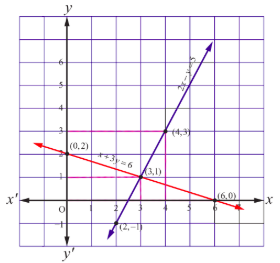
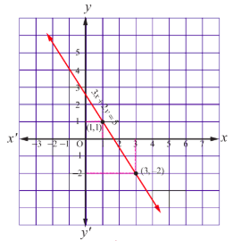
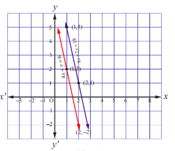

## 1.1 அறிமுகம் (Introduction)

அன்றாட உலகியல் பிரச்சனைகளின் கணிதவியல் மாதிரிகள், நேரியல் சமன்பாடுகளின் தொகுப்புகளாக உருவாகின்றன. இவற்றைத் தீர்ப்பதற்கு அணிகள் இன்றியமையாததாகவும் தவிர்க்க முடியாதவைகளாகவும் அமைகின்றன. கணித மேதைகள் காஸ், ஜோர்டன், கேய்லி மற்றும் ஹாமில்டன் போன்றவர்கள் நேரியல் சமன்பாட்டுத் தொகுப்பிற்கான தீர்வுகளை ஆய்வு செய்வதற்காக அணிக்கோவைகளை உருவாக்கினார்கள்.

இப்பாடப்பகுதியில் அணிகள் மற்றும் அணிக்கோவைகளைப் பயன்படுத்தி நேரியல் சமன்பாட்டுத் தொகுப்பிற்கான தீர்வுகளைக் காண சில முறைகளில் குறிப்பாக (i) நேர்மாறு அணி காணல் முறை, (ii) கிரேமரின் விதி, (iii) காஸ்ஸியன் நீக்கல் முறை (iv) தர முறை ஆகிய நான்கு முறைகளைப் பற்றி பயில இருக்கிறோம். இம்முறைகளை அறிந்து கொள்வதற்கு முன் பின்வருவனவற்றை அறிமுகப்படுத்த உள்ளோம் : (i) பூச்சியமற்ற கோவை அணியின் நேர்மாறு, (ii) ஓர் அணியின் தரம், (iii) அணியின் நிரை மற்றும் நிரலுக்குரிய தொடக்கநிலை உருமாற்றங்கள் மற்றும் (iv) நேரிய சமன்பாட்டுத் தொகுப்பிற்குரிய ஒருங்கமைவுத்தன்மை பற்றியும் அறிந்து கொள்ள உள்ளோம்.

கார்ல் பிரீட்ரிச் காஸ் (1777-1855) ஜெர்மானிய, கணித மற்றும் இயற்பியல் மேதை

## கற்றலின் நோக்கங்கள்

இப்பாடப்பகுதியை நிறைவாக கற்றின் பின்வருவனவற்றை மாணவர்கள் அறிந்திருப்பர்

● நேரியச் சமன்பாடுகளைத் தீர்ப்பதற்குரிய வழிமுறை செய்து காட்டுதல்

- ஒரு சதுர அணியின் சேர்ப்பு

- பூச்சியமற்ற கோவை அணியின் நேர்மாறு

- தொடக்கநிலை நிரை மற்றும் நிரல் செயலிகள்

- ஏற்படி வடிவம்

- ஒர் அணியின் தரம்

● நிரை செயலிகள் மூலம் ஒரு பூச்சியமற்ற கோவை அணிக்கு நேர்மாறு அணி காணுதல்

● நேரியச் சமன்பாட்டுத் தொகுப்புகளை தீர்ப்பதற்கான நுட்பங்களை எடுத்துக்காட்டுதல்

- நேர்மாறு அணி காணல் முறை

- கிராமரின் விதி

- காஸ்ஸியன் நீக்கல் முறை

● நேரிய சமன்பாட்டுத் தொகுப்பின் ஒருங்கமைவு தன்மையை ஆராய்தல்

● சமபடித்தான நேரியச் சமன்பாட்டுத் தொகுப்பின் வெளிப்படையற்ற தீர்வுகளை ஆராய்தல்

## 1.2 பூச்சியமற்ற கோவை அணியின் நேர்மாறு (Inverse of a Non-Singular Square Matrix)

ஒரு சதுர அணியின் அணிக்கோவை மதிப்பு பூச்சியமெனில் அவ்வணியை பூச்சிய கோவை அணி என்றும் மற்றும் ஒரு சதுர அணிக்கோவையின் மதிப்பு பூச்சியமற்றெனில், அவ்வணியை பூச்சியமற்ற கோவை அணி என்றும் அழைப்போம் என்பதை நினைவுகூறுவோம். அணிகளின் திசையில் பெருக்கம், ஏர் அணியை மற்றொரு அணியால் பெருக்குதல் மற்றும் அணிகளின் கூடுதல் பற்றி முன்பே படித்துள்ளோம். ஆனால் ஏர் அணியை மற்றொரு அணியால் வகுப்பதற்கான விதியை உருவாக்க இயலாது. ஏனெனில் அணியானது எண்களால் உருவான ஓர் அமைப்பு மற்றும் அணிக்கு எண் மதிப்பு கிடையாது. A என்ற அணியின் வரிசை n எனில் அவ்வணியானது n நிரைகளும் மற்றும் n நிரல்களும் உடைய அணியாகக் கருதுவோம்.

x = 0 என்ற மெய்யெண்ணிற்கு y = 1 என்ற ஒரு மெய்யெண்ணை xy = yx = 1 என்றவாறு காணலாம். y ஆனது x -ன் நேர்மாறு (அல்லது x -ன் தலைகீழி) என அழைக்கப்படும். இதேபோன்று A என்ற ஓர் அணிக்கு B என்ற அணி AB = BA = I, எனுமாறு B காண விழைகிறோம். இங்கு I என்பது அலகு அணியாகும். இப்பகுதியில் பூச்சியமற்ற கோவை உடைய சதுர அணிக்கு நேர்மாறு வரையறுத்து அப்பூச்சியமற்ற அணிக்கோவை அணிக்கு ஒரே ஒரு நேர்மாறு தான் உண்டு என நிரூபிக்க உள்ளோம். மேலும் நேர்மாறு அணிகளின் பண்புகள் பற்றியும் பயில உள்ளோம். இவற்றைப் படிப்பதற்கு ஒரு சதுர அணியின் சேர்ப்பு அணி தேவைப்படுகிறது.

### 1.2.1 ஒரு சதுர அணியின் சேர்ப்பு அணி (Adjoint of a Square Matrix)

ஒரு சதுர அணியின் சேர்ப்பு அணி வரையறுப்பதற்கு முன் ஒரு சதுர அணியில் உள்ள உறுப்புகளுக்கும் அதன் இணைக்காரணி உறுப்புகளுக்கும் உள்ள பண்பை நினைவு கூறுவோம். A என்ற சதுர அணியின் வரிசை n என்க. இவ்வணியின் அணிக்கோவையை |A| அல்லது det(A) என்று குறிப்பிடுவோம். A - இல் i-ஆவது நிரையும் j-ஆவது நிரலும் சந்திக்கும் இடத்தில் உள்ள உறுப்பு aij என்க. i-ஆவது நிரையும் j-ஆவது நிரலும் நீக்கக் கிடைப்பது (n-1) வரிசையுடைய ஒரு உப அணியாகும். இந்த உபஅணியின் அணிக்கோவை மதிப்பானது aij -ன் சிற்றணிக்கோவையாகும். இதை Mij எனக் குறிப்பிடுவோம். Mij மற்றும் (-1)i+j -ன் பெருக்கற்பலன் aij -ன் இணைக்காரணியாகும். இதை Aij என்ற குறிப்பிடுவோம். இவ்வாறாக aij -ன் இணைக்காரணி Aij = (-1)i+j Mij. ஒரு சதுர அணியிலுள்ள உறுப்புகளையும் அவற்றின் இணைகாரணி உறுப்புகளையும் இணைக்கும் ஒரு முக்கிய பண்பானது, அவ்வணியின் அணிக்கோவையில் ஏதேனும் ஒரு நிரையின் உறுப்புகள் மற்றும் அவற்றின் ஒத்த இணைக் காரணிகள் பெருக்கற்பலனின் கூடுதலானது அவ்வணிக்கோவையின் மதிப்பிற்குச் சமமாகும். மேலும் ஏதேனும் ஒரு நிரையின் உறுப்புகள் மற்றும் வேறேதனும் நிரை உறுப்புகளின் ஒத்த இணைக்காரணிகளின் பெருக்கற்பலனின் கூடுதல் பூச்சியமாகும். அதாவது,

$$
a_{i1}A_{j1} + a_{i2}A_{j2} + \cdots + a_{in}A_{jn} = \begin{cases} |A|, & i = j \\ 0, & i \neq j \end{cases}
$$

இங்கு |A| என்பது ஒரு சதுர அணியின் அணிக்கோவை மதிப்பாகும். இதை A -ன் அணிக்கோவை என அழைப்போம். |A| என்பது ஒரு மெய்யெண். இது குறைமதிப்பாகவும் இருக்கலாம்.

எடுத்துக்காட்டாக,

$$
\left| \begin{array}{lll} 2 & 1 & 1 \\ 1 & 1 & 1 \\ 2 & 2 & 1 \end{array} \right| = 2(1-2)-1(1-2)+1(2-2) = -2+1+0 = -1.
$$

**Definition 1.1**

A என்பது n வரிசையுடைய ஒரு சதுர அணி என்க. A -ல் உள்ள ஒவ்வொரு aij யையும் அதற்கொத்த இணைக்காரணி Aij ஆல் மாற்றக் கிடைப்பது A -ன் இணைக்காரணி அணி என வரையறுக்கப்படுகிறது. A -ன் இணைக்காரணி அணியின் நிரை நிரல் மாற்று அணி A-ன் சேர்ப்பு அணி என வரையறுக்கப்படுகிறது. இதை adj A எனக் குறிப்பிடுவோம்.

> **Note**
>
> இங்கு adj \( A \) என்பது \( n \) வரிசையுடைய ஒரு சதுர அணி மற்றும் adj \( A = \left[ A_{ij} \right]^T = \left[ (-1)^{i+j} M_{ij} \right]^T \).
>
>மூன்று வரிசை உடைய ஒரு சதுர அணி \( A \) மின் சேர்ப்பு அணியானது,
>
>adj \( A = \begin{bmatrix} +M_{11} & -M_{12} & +M_{13} \\ -M_{21} & +M_{22} & -M_{23} \\ +M_{31} & -M_{32} & +M_{33} \end{bmatrix} = \begin{bmatrix} A_{11} & A_{12} & A_{13} \\ A_{21} & A_{22} & A_{23} \\ A_{31} & A_{32} & A_{33} \end{bmatrix} = \begin{bmatrix} A_{11} & A_{21} & A_{31} \\ A_{12} & A_{22} & A_{32} \\ A_{13} & A_{23} & A_{33} \end{bmatrix} \).

**Theorem 1.1**

ஒவ்வொரு n வரிசையுடைய சதுர அணி A -விற்கும்,

$$
A(\mathrm{adj} A) = (\mathrm{adj} A)A = |A| I_n
$$

**Proof**

$$
A = \left[ \begin{array}{lll} a_{11} & a_{12} & a_{13} \\ a_{21} & a_{22} & a_{23} \\ a_{31} & a_{32} & a_{33} \end{array} \right]
$$

என எடுத்துக்கொள்வோம். இத்தேற்றத்தை ஒரு 3 × 3 சதுர அணியைக் கொண்டு நிரூபிப்போம். இணைக்காரணிகளின் பண்பின்படி,

$$
\begin{aligned}
& a_{11}A_{11} + a_{12}A_{12} + a_{13}A_{13} = |A|, \\
& a_{11}A_{21} + a_{12}A_{22} + a_{13}A_{23} = 0, \\
& a_{11}A_{31} + a_{12}A_{32} + a_{13}A_{33} = 0, \\
& a_{21}A_{11} + a_{22}A_{12} + a_{23}A_{13} = 0, \\
& a_{21}A_{21} + a_{22}A_{22} + a_{23}A_{23} = |A|, \\
& a_{21}A_{31} + a_{22}A_{32} + a_{23}A_{33} = 0, \\
& a_{31}A_{11} + a_{32}A_{12} + a_{33}A_{13} = 0, \\
& a_{31}A_{21} + a_{32}A_{22} + a_{33}A_{23} = 0, \\
& a_{31}A_{31} + a_{32}A_{32} + a_{33}A_{33} = |A|.
\end{aligned}
$$

மேலே உள்ள சமன்பாடுகளைப் பயன்படுத்தக் கிடைப்பது

$$
A(\mathrm{adj} A) = \left[ \begin{array}{lll} a_{11} & a_{12} & a_{13} \\ a_{21} & a_{22} & a_{23} \\ a_{31} & a_{32} & a_{33} \end{array} \right] \left[ \begin{array}{lll} A_{11} & A_{21} & A_{31} \\ A_{12} & A_{22} & A_{32} \\ A_{13} & A_{23} & A_{33} \end{array} \right]
= \left[ \begin{array}{lll} |A| & 0 & 0 \\ 0 & |A| & 0 \\ 0 & 0 & |A| \end{array} \right]
= |A| \left[ \begin{array}{lll} 1 & 0 & 0 \\ 0 & 1 & 0 \\ 0 & 0 & 1 \end{array} \right]
= |A| I_3
$$

… (1)

$$
(\mathrm{adj} A)A = \left[ \begin{array}{lll} A_{11} & A_{21} & A_{31} \\ A_{12} & A_{22} & A_{32} \\ A_{13} & A_{23} & A_{33} \end{array} \right] \left[ \begin{array}{lll} a_{11} & a_{12} & a_{13} \\ a_{21} & a_{22} & a_{23} \\ a_{31} & a_{32} & a_{33} \end{array} \right]
= \left[ \begin{array}{lll} |A| & 0 & 0 \\ 0 & |A| & 0 \\ 0 & 0 & |A| \end{array} \right]
= |A| \left[ \begin{array}{lll} 1 & 0 & 0 \\ 0 & 1 & 0 \\ 0 & 0 & 1 \end{array} \right]
= |A| I_3
$$

… (2)

இங்கு I3 என்பது 3 வரிசையுடைய ஒரு அலகு அணி ஆகும்.

சமன்பாடு (1) மற்றும் (2)-லிருந்து கிடைப்பது,

$$
A(\mathrm{adj} A) = (\mathrm{adj} A)A = |A| I_3
$$

> **Note**
>
> A என்பது n வரிசையுடைய பூச்சியக்கோவை அணி எனில் |A| = 0. எனவே
>
> $$ A(\mathrm{adj} A) = (\mathrm{adj} A)A = O_n $$
>
> இங்கு On என்பது n வரிசையுடைய பூச்சிய அணி ஆகும்.

**Example 1.1**

$$
A = \left[ \begin{array}{rrr} 8 & -6 & 2 \\ -6 & 7 & -4 \\ 2 & -4 & 3 \end{array} \right] \text{ எனில் } A(\mathrm{adj} A) = (\mathrm{adj} A)A = |A| I_3 \text{ என்பதைச் சரிபார்க்க}.
$$

**Solution**

$$
|A| = \left| \begin{array}{rrr} 8 & -6 & 2 \\ -6 & 7 & -4 \\ 2 & -4 & 3 \end{array} \right| = 8(21-16) + 6(-18+8) + 2(24-14) = 40 - 60 + 20 = 0.
$$

சேர்ப்பு அணியின் வரையறைப்படி கிடைப்பது

$$
\mathrm{adj} A = \left[ \begin{array}{lll} (21-16) & -(18+8) & (24-14) \\ -(18+8) & (24-4) & -(32+12) \\ (24-14) & -(32+12) & (56-36) \end{array} \right] = \left[ \begin{array}{rrr} 5 & 10 & 10 \\ 10 & 20 & 20 \\ 10 & 20 & 20 \end{array} \right].
$$

எனவே,

$$
\begin{aligned}
A(\mathrm{adj} A) &= \left[ \begin{array}{rrr} 8 & -6 & 2 \\ -6 & 7 & -4 \\ 2 & -4 & 3 \end{array} \right] \left[ \begin{array}{rrr} 5 & 10 & 10 \\ 10 & 20 & 20 \\ 10 & 20 & 20 \end{array} \right] \\
&= \left[ \begin{array}{rrr} 40-60+20 & 80-120+40 & 80-120+40 \\ -30+70-40 & -60+140-80 & -60+140-80 \\ 10-40+30 & 20-80+60 & 20-80+60 \end{array} \right] = \left[ \begin{array}{rrr} 0 & 0 & 0 \\ 0 & 0 & 0 \\ 0 & 0 & 0 \end{array} \right] = 0I_3 = |A|I_3,
\end{aligned}
$$

இதேபோல், நமக்குக் கிடைப்பது

$$
\begin{aligned}
(\mathrm{adj} A)A &= \left[ \begin{array}{rrr} 5 & 10 & 10 \\ 10 & 20 & 20 \\ 10 & 20 & 20 \end{array} \right] \left[ \begin{array}{rrr} 8 & -6 & 2 \\ -6 & 7 & -4 \\ 2 & -4 & 3 \end{array} \right] \\
&= \left[ \begin{array}{rrr} 40-60+20 & -30+70-40 & 10-40+30 \\ 80-120+40 & -60+140-80 & 20-80+60 \\ 80-120+40 & -60+140-80 & 20-80+60 \end{array} \right] = \left[ \begin{array}{rrr} 0 & 0 & 0 \\ 0 & 0 & 0 \\ 0 & 0 & 0 \end{array} \right] = 0I_3 = |A|I_3.
\end{aligned}
$$

எனவே, $A(\mathrm{adj} A) = (\mathrm{adj} A)A = |A|I_3$ என்பது சரிபார்க்கப்பட்டது.

### 1.2.2 ஒரு சதுர அணியின் நேர்மாறு அணி (Definition of inverse matrix of a square matrix)

ஒரு சதுர அணியின் நேர்மாறு அணியை வரையறுப்போம்.

**Definition 1.2**

A என்பது ஒரு n வரிசையுடைய சதுர அணி என்க. AB = BA = In எனுமாறு B என்ற ஒரு சதுர அணி இருப்பின், B ஆனது A -இன் நேர்மாறு அணி எனப்படும்.

**Theorem 1.2**

ஒரு சதுர அணிக்கு நேர்மாறு இருப்பின் அது ஒருமைத்தன்மை வாய்ந்ததாகும்.

**Proof**

A என்பது நேர்மாறு காணத்தக்க n வரிசையுடைய ஓர் அணி என்க. முடியுமானால் B மற்றும் C என்ற இரு அணிகள் A -இன் நேர்மாறு எனக்கொள்வோம். வரையறைப்படி AB = BA = In மற்றும் AC = CA = In ஆகும்.

இச்சமன்பாடுகளைப் பயன்படுத்துவதன் மூலம் கிடைப்பது

$$
C = CI_n = C(AB) = (CA)B = I_nB = B.
$$

எனவே நேர்மாறு ஒருமைத்தன்மை வாய்ந்ததாகும்.

குறியீடு: A -இன் நேர்மாறு A-1 எனக் குறிப்பிடப்படுகின்றது.

> குறிப்பு
> \[ AA^{-1} = A^{-1}A = I_n. \] 

**Theorem 1.3**

A என்பது n வரிசையுடைய சதுர அணி என்க. A-1 காண்பதற்குத் தேவையான மற்றும் போதுமான நிபந்தனையானது, A பூச்சியமற்ற கோவை அணியாக இருக்க வேண்டும்.

**Proof**

A என்ற அணிக்கு A-1 காண முடியும் என்க. எனவே AA-1 = A-1A = In.

அணிக்கோவைகளின் பெருக்கல் விதியைப் பயன்படுத்தக் கிடைப்பது,

$$
\det(AA^{-1}) = \det(A)\det(A^{-1}) = \det(A^{-1})\det(A) = \det(I_n) = 1.
$$

எனவே, $|A| = \det(A) \neq 0$.

எனவே A ஆனது பூச்சியமற்றக் கோவை அணியாக இருக்கும்.

மறுதலையாக, A என்பது பூச்சியமற்றக் கோவை அணி என்க. எனவே |A| ≠ 0.

தேற்றம் 1.1 மூலம் கிடைப்பது

$$
A(\mathrm{adj} A) = (\mathrm{adj} A)A = |A|I_n.
$$

இச்சமன்பாட்டை |A| ஆல் வகுக்கக் கிடைப்பது,

$$
A\left(\frac{1}{|A|} \mathrm{adj} A\right) = \left(\frac{1}{|A|} \mathrm{adj} A\right) A = I_n.
$$

இதன் மூலம், $AB = BA = I_n$ எனுமாறு $B = \frac{1}{|A|} \mathrm{adj} A$ என்ற அணி காண முடிகிறது.

எனவே, A - இன் நேர்மாறு

$$
A^{-1} = \frac{1}{|A|} \mathrm{adj} A
$$

ஆகும்.

தற்போது

பூச்சியக்கோவை அணியின் அணிக்கோவை மதிப்பு 0. எனவே பூச்சியக் கோவை அணிக்கு நேர்மாறு காண இயலாது.

**Example 1.2**

$$
A = \left[ \begin{array}{ll} a & b \\ c & d \end{array} \right] \text{ என்ற பூச்சியமற்றக் கோவை அணிக்கு } A^{-1} \text{ காண்க.}
$$

**Solution**

முதலில் சேர்ப்பு அணி காண்போம்.

வரையறைப்படி,

$$
\mathrm{adj} A = \left[ \begin{array}{ll} +M_{11} & -M_{12} \\ -M_{21} & +M_{22} \end{array} \right]^{T} = \left[ \begin{array}{ll} d & -c \\ -b & a \end{array} \right]^{T} = \left[ \begin{array}{ll} d & -b \\ -c & a \end{array} \right].
$$

A ஆனது பூச்சியமற்றக் கோவை அணி, எனவே |A| = ad − bc ≠ 0.

$$
A^{-1} = \frac{1}{|A|} \mathrm{adj} A, \text{ என்பதால் } A^{-1} = \frac{1}{ad - bc} \left[ \begin{array}{ll} d & -b \\ -c & a \end{array} \right].
$$

**Example 1.3**

$$
\left[ \begin{array}{rrr} 2 & -1 & 3 \\ -5 & 3 & 1 \\ -3 & 2 & 3 \end{array} \right] \text{ என்ற அணியின் நேர்மாறு காண்க.}
$$

**Solution**

$$
A = \left[ \begin{array}{rrr} 2 & -1 & 3 \\ -5 & 3 & 1 \\ -3 & 2 & 3 \end{array} \right] \text{ என்க. } |A| = \left| \begin{array}{rrr} 2 & -1 & 3 \\ -5 & 3 & 1 \\ -3 & 2 & 3 \end{array} \right| = 2(9-2) - (-1)(-15+3) + 3(-10+9) = 14 - 12 - 3 = -1 \neq 0.
$$

எனவே, A-1 காண இயலும்.

$$
\mathrm{adj} A = \left[ \begin{array}{lll} +(9-2) & -(-15+3) & +( -10+9) \\ -(-3-2) & +(6+9) & -(4-3) \\ +(-3-6) & - (2-15) & +(6-5) \end{array} \right] = \left[ \begin{array}{rrr} 7 & 12 & -1 \\ 5 & 15 & -1 \\ -9 & -17 & 1 \end{array} \right]^{T} = \left[ \begin{array}{rrr} 7 & 5 & -9 \\ 12 & 15 & -17 \\ -1 & -1 & 1 \end{array} \right]
$$

எனவே,

$$
A^{-1} = \frac{1}{|A|} (\mathrm{adj} A) = \frac{1}{(-1)} \left[ \begin{array}{rrr} 7 & 5 & -9 \\ 12 & 15 & -17 \\ -1 & -1 & 1 \end{array} \right] = \left[ \begin{array}{rrr} -7 & -5 & 9 \\ -12 & -15 & 17 \\ 1 & 1 & -1 \end{array} \right]
$$

### 1.2.3 நேர்மாறு அணிகளின் பண்புகள் (Properties of inverses of matrices)

நேர்மாறு காணத்தக்க அணிகளின் பண்புகள் சிலவற்றையும் அதில் ஒரு சில பண்புகளையும் நிரூபிக்க உள்ளோம்.

**Theorem 1.4**

A என்பது பூச்சியமற்றக் கோவை அணி எனில்

$$
(i) \left| A^{-1} \right| = \frac{1}{|A|} \quad (ii) \left( A^T \right)^{-1} = \left( A^{-1} \right)^T \quad (iii) \left( \lambda A \right)^{-1} = \frac{1}{\lambda} A^{-1}, \text{ இங்கு } \lambda \text{ என்பது பூச்சியமற்ற திசையிலி.}
$$

**Proof**

A என்பது பூச்சியமற்றக் கோவை அணி என்க. எனவே |A|≠0 மற்றும் A-1 காண இயலும். வரையறைப்படி,

$$
AA^{-1} = A^{-1}A = I_n. \qquad \dots(1)
$$

(i) சமன்பாடு (1) மூலம் கிடைப்பது

$$
|AA^{-1}| = |A^{-1}| = |I_n|.
$$

அணிக்கோவையின் பெருக்கல் விதியைப் பயன்படுத்த

$$
|A||A^{-1}| = |I_n| = 1.
$$

எனவே,

$$
|A^{-1}| = \frac{1}{|A|}
$$

(ii) சமன்பாடு (1)-இலிருந்து,

$$
(AA^{-1})^T = (A^{-1}A)^T = (I_n)^T.
$$

நிரை நிரல் அணியின் வரிசையாற்று விதிப்படி,

$$
(A^{-1})^T A^T = A^T (A^{-1})^T = I_n.
$$

எனவே,

$$
(A^T)^{-1} = (A^{-1})^T.
$$

(iii) λ என்பது பூச்சியமற்ற திசையிலி ஆதலால் சமன்பாடு (1)-இலிருந்து,

$$
(\lambda A) \left( \frac{1}{\lambda} A^{-1} \right) = \left( \frac{1}{\lambda} A^{-1} \right) (\lambda A) = I_n.
$$

எனவே,

$$
(\lambda A)^{-1} = \frac{1}{\lambda} A^{-1}.
$$

**Theorem 1.5 (இடது நீக்கல் விதி)**

A, B மற்றும் C என்பன n வரிசையுடைய சதுர அணிகள் என்க. A என்பது பூச்சியமற்றக் கோவை அணி மற்றும் AB = AC எனில், B = C.

**Proof**

A ஆனது பூச்சியமற்றக் கோவை அணி. எனவே A-1 காண இயலும் மற்றும் AA-1 = A-1A = In. AB = AC -இன் இருபுறமும் முன்புறமாக A-1 -ஆல் பெருக்கக் கிடைப்பது

$$
A^{-1}(AB) = A^{-1}(AC).
$$

அணிப்பெருக்கலின் சேர்ப்பு மற்றும் அணியின் நேர்மாறு பண்பைப் பயன்படுத்த நமக்குக் கிடைப்பது

$$
B = C.
$$

**Theorem 1.6 (வலது நீக்கல் விதி)**

A, B மற்றும் C என்பன n வரிசையுடைய சதுர அணிகள் என்க. A என்பது பூச்சியமற்ற கோவை அணி மற்றும் BA = CA எனில், B = C.

**Proof**

A ஆனது பூச்சியமற்ற கோவை அணி. எனவே A-1 காண இயலும் மற்றும் AA-1 = A-1A = In. BA = CA -யின் இருபுறமும் பின்புறமாக A-1 -ஆல் பெருக்கக் கிடைப்பது

$$
(BA)A^{-1} = (CA)A^{-1}.
$$

அணிப்பெருக்கலின் சேர்ப்பு மற்றும் அணியின் நேர்மாறு பண்பைப் பயன்படுத்த நமக்குக் கிடைப்பது

$$
B = C.
$$

> **Note**
>
> A ஆனது பூச்சியக்கோவை அணி மற்றும் AB = AC அல்லது BA = CA, எனில் B -யும் C -யும் சமமாக இருக்க வேண்டியது இல்லை. எடுத்துக்காட்டாக,
>
> $$ 
A = \left[ \begin{array}{ll} 1 & 1 \\ 2 & 2 \end{array} \right], B = \left[ \begin{array}{rr} 1 & -1 \\ 0 & 1 \end{array} \right] \text{ மற்றும் } C = \left[ \begin{array}{rr} 0 & -1 \\ 1 & 1 \end{array} \right] \text{ எனக்கொள்க.}
$$
>
> இங்கு |A| = 0 மற்றும் AB = AC ஆனால் B ≠ C என்பது குறிப்பிடத்தக்கது.

**Theorem 1.7 (எதிர்முறைகளின் வரிசை மாற்ற விதி)**

A மற்றும் B என்பன ஒரே வரிசையுடைய பூச்சியமற்ற கோவை அணிகள் எனில் அவற்றின் பெருக்கற்பலன் AB -யும் பூச்சியமற்ற கோவை அணியாகும் மற்றும் (AB)-1 = B-1A-1.

**Proof**

A மற்றும் B என்பன n வரிசையுடைய பூச்சியமற்ற கோவை அணிகள் என்க. எனவே |A|≠ 0, |B|≠ 0, எனவே A-1 மற்றும் B-1 காணமுடியும் மற்றும் அவைகள் n வரிசையுடையனவாக இருக்கும். மேலும் AB மற்றும் B-1A-1 -களின் பெருக்கற்பலன்கள் n வரிசையுடையனவாக இருக்கும். அணிக்கோவைகளின் பெருக்கற்பலன் விதிப்படி கிடைப்பது

$$
|AB| = |A||B| \neq 0.
$$

எனவே AB -யும் பூச்சியமற்ற கோவை அணியாகும் மற்றும்

$$
(AB)(B^{-1}A^{-1}) = A(BB^{-1})A^{-1} = (AI_n)A^{-1} = AA^{-1} = I_n;
$$

$$
(B^{-1}A^{-1})(AB) = B^{-1}(A^{-1}A)B = (B^{-1}I_n)B = B^{-1}B = I_n.
$$

எனவே

$$
(AB)^{-1} = B^{-1}A^{-1}.
$$

**Theorem 1.8 (இரட்டிப்பு நேர்மை விதி)**

A என்பது பூச்சியமற்றக் கோவை அணி எனில் A-1-யும் பூச்சியமற்ற கோவை அணி மற்றும் (A-1)-1 = A.

**Proof**

A என்பது பூச்சியமற்றக் கோவை அணி என்க. எனவே |A| ≠ 0 மற்றும் A-1 காண இயலும்.

$$
|A^{-1}| = \frac{1}{|A|} \neq 0 \implies A^{-1} \text{ ஆனது பூச்சியமற்ற கோவை அணியாகும் மற்றும் } AA^{-1} = A^{-1}A = I.
$$

$$
AA^{-1} = I \implies (AA^{-1})^{-1} = I \implies (A^{-1})^{-1}A^{-1} = I. \tag{1}
$$

(1)-ன் இருபுறமும் A -ஆல் பின்புறமாக பெருக்கக் கிடைப்பது

$$
(A^{-1})^{-1} = A.
$$

**Theorem 1.9**

A என்பது n வரிசையுடைய பூச்சியமற்றக் கோவை அணி எனில்

$$
(i) \quad (\mathrm{adj} A)^{-1} = \mathrm{adj}(A^{-1}) = \frac{1}{|A|} A \quad (ii) \quad |\mathrm{adj} A| = |A|^{n-1}
$$

$$
(iii) \quad \mathrm{adj}(\mathrm{adj} A) = |A|^{n-2} A \qquad (iv) \quad \mathrm{adj}(\lambda A) = \lambda^{n-1} \mathrm{adj}(A) \quad \lambda \text{ என்பது பூச்சியமற்ற திசையிலி}
$$

$$
(v) \quad |\mathrm{adj}(\mathrm{adj} A)| = |A|^{(n-1)^2} \quad (vi) \quad (\mathrm{adj} A)^T = \mathrm{adj}(A^T)
$$

**Proof**

A என்பது பூச்சியமற்றக் கோவை அணி ஆதலால் |A| ≠ 0. எனவே

(i) $\displaystyle A^{-1} = \frac{1}{|A|} (\mathrm{adj} A) \Rightarrow \mathrm{adj} A = |A| A^{-1} \Rightarrow (\mathrm{adj} A)^{-1} = (|A| A^{-1})^{-1} = \frac{1}{|A|} (A^{-1})^{-1} = \frac{1}{|A|} A.$

$A$ -விற்கு பதில் $A^{-1}$ -ஐ $\mathrm{adj} A = |A| A^{-1}$ -ல் பிரதியிட,

$$
\mathrm{adj}(A^{-1}) = |A^{-1}| (A^{-1})^{-1} = \frac{1}{|A|} A.
$$

எனவே கிடைப்பது

$$
(\mathrm{adj} A)^{-1} = \mathrm{adj}(A^{-1}) = \frac{1}{|A|} A.
$$

(ii) $\displaystyle A(\mathrm{adj} A) = (\mathrm{adj} A)A = |A| I_n \Rightarrow \det(A(\mathrm{adj} A)) = \det((\mathrm{adj} A)A) = \det(|A| I_n)$

$$
\Rightarrow |A||\mathrm{adj} A| = |A|^n \Rightarrow |\mathrm{adj} A| = |A|^{n-1}.
$$

(iii) B என்பது n வரிசையுடைய பூச்சியமற்றக் கோவை அணி எனில்

$$
B(\mathrm{adj} B) = (\mathrm{adj} B)B = |B| I_n.
$$

$B = \mathrm{adj} A$ எனப் பிரதியிடக் கிடைப்பது,

$$
(\mathrm{adj} A)(\mathrm{adj}(\mathrm{adj} A)) = |\mathrm{adj} A| I_n.
$$

$|\mathrm{adj} A| = |A|^{n-1}$ ஆதலால்,

$$
(\mathrm{adj} A)(\mathrm{adj}(\mathrm{adj} A)) = |A|^{n-1} I_n.
$$

இருபுறமும் A ஆல் முன்புறமாக பெருக்கக் கிடைப்பது

$$
A((\mathrm{adj} A)(\mathrm{adj}(\mathrm{adj} A))) = A(|A|^{n-1} I_n).
$$

அணிப்பெருக்கலின் சேர்ப்பு விதியைப் பயன்படுத்தக் கிடைப்பது,

$$
(A(\mathrm{adj} A))(\mathrm{adj}(\mathrm{adj} A)) = |A|^{n-1} A.
$$

எனவே

$$
(|A| I_n)(\mathrm{adj}(\mathrm{adj} A)) = |A|^{n-1} A.
$$

அதாவது

$$
\mathrm{adj}(\mathrm{adj} A) = |A|^{n-2} A.
$$

(iv) A-விற்கு λA என $\mathrm{adj}(A) = |A|A^{-1}$ என்பதில் பிரதியிடக் கிடைப்பது

$$
\mathrm{adj}(\lambda A) = |\lambda A| (\lambda A)^{-1} = \lambda^n |A| \frac{1}{\lambda} A^{-1} = \lambda^{n-1} |A| A^{-1} = \lambda^{n-1} \mathrm{adj}(A).
$$

(v) (iii)-ன்படி $\mathrm{adj}(\mathrm{adj} A) = |A|^{n-2} A$. இருபுறமும் அணிக்கோவை காணக் கிடைப்பது

$$
|\mathrm{adj}(\mathrm{adj} A)| = \left| |A|^{n-2} A \right| = (|A|^{n-2})^n |A| = |A|^{n(n-2)+1} = |A|^{n^2-2n+1} = |A|^{(n-1)^2}.
$$

(vi) $A$ -விற்கு பதில் $A^T$ என $A^{-1} = \frac{1}{|A|} \mathrm{adj} A$ என்பதில் பிரதியிடக் கிடைப்பது,

$$
\left( A^T \right)^{-1} = \frac{1}{|A^T|} \mathrm{adj} (A^T).
$$

எனவே

$$
\mathrm{adj} (A^T) = |A^T| \left( A^T \right)^{-1} = |A| \left( A^{-1} \right)^T = \left( |A| A^{-1} \right)^T = \left( |A| \frac{1}{|A|} \mathrm{adj} A \right)^T = (\mathrm{adj} A)^T.
$$

> **Note**
>
> A என்பது 3 வரிசையுடைய பூச்சியமற்றக் கோவை அணி எனில் |A| ≠ 0. தேற்றம் 1.9 (ii) படி கிடைப்பது $|\mathrm{adj} A| = |A|^2$ மற்றும் |adj A| ஆனது மிகை. எனவே $|A| = \pm \sqrt{|\mathrm{adj} A|}$.
>
> எனவே
>
> $$
 A^{-1} = \pm \frac{1}{\sqrt{|\mathrm{adj} A|}} \mathrm{adj} A.
 $$
>
> மேலும் தேற்றம் 1.9 (iii) இன் படி கிடைப்பது,
>
> $$
 A = \frac{1}{|A|} \mathrm{adj}(\mathrm{adj} A).
 $$
>
> எனவே, A ஆனது 3 படி வரிசையுடைய பூச்சியமற்றக் கோவை எனில்,
>
> $$
 A = \pm \frac{1}{\sqrt{|\mathrm{adj} A|}} \mathrm{adj}(\mathrm{adj} A).
 $$

**Example 1.4**

A என்பது ஒற்றை வரிசையுடைய பூச்சியமற்றக் கோவை அணி எனில் |adj A| என்பது மிகை என நிறுவுக.

**Solution**

A என்பது 2m + 1 வரிசையுடைய பூச்சியமற்றக் கோவை அணி என்க. இங்கு m = 0,1,2,... எனவே |A| ≠ 0 மற்றும் தேற்றம் 1.9 (ii) இன் படி கிடைப்பது

$$
|\mathrm{adj} A| = |A|^{(2m+1)-1} = |A|^{2m}.
$$

$|A|^{2m}$ என்பது எப்பொழுதும் மிகை, எனவே |adj A| ஆனது மிகை.

**Example 1.5**

$$
\mathrm{adj}(A) = \left[ \begin{array}{rrr} 7 & 7 & -7 \\ -1 & 11 & 7 \\ 11 & 5 & 7 \end{array} \right] \text{ எனில், } A \text{ -ஐக் காண்க.}
$$

**Solution**

$$
|\mathrm{adj} A| = \left| \begin{array}{rrr} 7 & 7 & -7 \\ -1 & 11 & 7 \\ 11 & 5 & 7 \end{array} \right| = 7(77 - 35) - 7(-7 - 77) - 7(-5 - 121) = 1764 > 0.
$$

எனவே

$$
A = \pm \frac{1}{\sqrt{|\mathrm{adj} A|}} \mathrm{adj}(\mathrm{adj} A) = \pm \frac{1}{\sqrt{1764}} \left[ \begin{array}{rrr} +(77 - 35) & -(7 - 77) & +(5 - 121) \\ -(49 + 35) & +(49 + 77) & -(35 - 77) \\ +(49 + 77) & -(49 - 7) & +(77 + 7) \end{array} \right]
$$

$$
= \pm \frac{1}{42} \left[ \begin{array}{rrr} 42 & 84 & -126 \\ -84 & 126 & 42 \\ 126 & -42 & 84 \end{array} \right] = \pm \left[ \begin{array}{rrr} 1 & 2 & -3 \\ -2 & 3 & 1 \\ 3 & -1 & 2 \end{array} \right].
$$

**Example 1.6**

$$
\mathrm{adj} A = \left[ \begin{array}{rrr} -1 & 2 & 2 \\ 1 & 1 & 2 \\ 2 & 2 & 1 \end{array} \right] \text{எனில் } A^{-1} \text{ -ஐக் காண்க.}
$$

**Solution**

$$
|\mathrm{adj} A| = \left| \begin{array}{rrr} -1 & 2 & 2 \\ 1 & 1 & 2 \\ 2 & 2 & 1 \end{array} \right| = 9.
$$

எனவே

$$
A^{-1} = \pm \frac{1}{\sqrt{|\mathrm{adj} A|}} \mathrm{adj}(\mathrm{adj} A) = \pm \frac{1}{\sqrt{9}} \left[ \begin{array}{rrr} -1 & 2 & 2 \\ 1 & 1 & 2 \\ 2 & 2 & 1 \end{array} \right] = \pm \frac{1}{3} \left[ \begin{array}{rrr} -1 & 2 & 2 \\ 1 & 1 & 2 \\ 2 & 2 & 1 \end{array} \right].
$$

**Example 1.7**

A என்பது சமச்சீர் அணி எனில் adj A சமச்சீர் அணி என நிறுவுக.

**Solution**

A என்பது சமச்சீர் அணி என்க. எனவே AT = A மற்றும் தேற்றம் 1.9 (vi) இன் படி கிடைப்பது

$$
\mathrm{adj}(A^T) = (\mathrm{adj} A)^T \Rightarrow \mathrm{adj} A = (\mathrm{adj} A)^T \Rightarrow \mathrm{adj} A \text{ ஆனது சமச்சீராகும்.}
$$

**Theorem 1.10**

A மற்றும் B என்பன n வரிசையுடைய பூச்சியமற்ற கோவை அணிகள் எனில்

$$
\mathrm{adj}(AB) = (\mathrm{adj} B)(\mathrm{adj} A).
$$

**Proof**

A-விற்கு பதில் AB என $\mathrm{adj}(A) = |A| A^{-1}$ -ல் பிரதியிட

$$
\mathrm{adj}(AB) = |AB| (AB)^{-1} = (|B| B^{-1})(|A| A^{-1}) = \mathrm{adj}(B) \mathrm{adj}(A).
$$

**Example 1.8**

$$
A = \left[ \begin{array}{ll} 2 & 9 \\ 1 & 7 \end{array} \right] \text{ எனில் } (A^T)^{-1} = (A^{-1})^T \text{ என்பதை சரிபார்க்க.}
$$

**Solution**

$$
|A| = (2)(7) - (9)(1) = 14 - 9 = 5.
$$

எனவே,

$$
A^{-1} = \frac{1}{5} \left[ \begin{array}{rr} 7 & -9 \\ -1 & 2 \end{array} \right] = \left[ \begin{array}{rr} \frac{7}{5} & -\frac{9}{5} \\ -\frac{1}{5} & \frac{2}{5} \end{array} \right].
$$

எனவே,

$$
(A^{-1})^T = \left[ \begin{array}{rr} \frac{7}{5} & -\frac{1}{5} \\ -\frac{9}{5} & \frac{2}{5} \end{array} \right] = \frac{1}{5} \left[ \begin{array}{rr} 7 & -1 \\ -9 & 2 \end{array} \right]. \quad \dots \quad (1)
$$

$$
A^T = \left[ \begin{array}{ll} 2 & 1 \\ 9 & 7 \end{array} \right]. \text{எனவே } |A^T| = (2)(7) - (1)(9) = 5.
$$

$$
(A^T)^{-1} = \frac{1}{5} \left[ \begin{array}{rr} 7 & -1 \\ -9 & 2 \end{array} \right]. \quad \dots \quad (2)
$$

(1) மற்றும் (2)-விருந்து கிடைப்பது, $(A^{-1})^T = (A^T)^{-1}$. எனவே கொடுத்துள்ள பண்பு சரிபார்க்கப்பட்டது.

**Example 1.9**

$$
A = \left[ \begin{array}{rr} 0 & 3 \\ 1 & 4 \end{array} \right], B = \left[ \begin{array}{rr} -2 & 3 \\ 0 & -1 \end{array} \right] \text{ எனக்கொண்டு } (AB)^{-1} = B^{-1}A^{-1} \text{ என்பதைச் சரிபார்க்க.}
$$

**Solution**

$$
AB = \left[ \begin{array}{rr} 0 & 3 \\ 1 & 4 \end{array} \right] \left[ \begin{array}{rr} -2 & 3 \\ 0 & -1 \end{array} \right] = \left[ \begin{array}{rr} 0+0 & 0-3 \\ -2+0 & 3-4 \end{array} \right] = \left[ \begin{array}{rr} 0 & -3 \\ -2 & -1 \end{array} \right]
$$

$$
(AB)^{-1} = \frac{1}{0-(-6)} \left[ \begin{array}{rr} -1 & 3 \\ 2 & 0 \end{array} \right] = \frac{1}{6} \left[ \begin{array}{rr} -1 & 3 \\ 2 & 0 \end{array} \right] = \left[ \begin{array}{rr} -\frac{1}{6} & \frac{1}{2} \\ \frac{1}{3} & 0 \end{array} \right] \quad \dots \quad (1)
$$

$$
A^{-1} = \frac{1}{0-3} \left[ \begin{array}{rr} 4 & -3 \\ -1 & 0 \end{array} \right] = -\frac{1}{3} \left[ \begin{array}{rr} 4 & -3 \\ -1 & 0 \end{array} \right] = \left[ \begin{array}{rr} -\frac{4}{3} & 1 \\ \frac{1}{3} & 0 \end{array} \right]
$$

$$
B^{-1} = \frac{1}{2-0} \left[ \begin{array}{rr} -1 & -3 \\ 0 & -2 \end{array} \right] = \frac{1}{2} \left[ \begin{array}{rr} -1 & -3 \\ 0 & -2 \end{array} \right] = \left[ \begin{array}{rr} -\frac{1}{2} & -\frac{3}{2} \\ 0 & -1 \end{array} \right]
$$

$$
B^{-1}A^{-1} = \left[ \begin{array}{rr} -\frac{1}{2} & -\frac{3}{2} \\ 0 & -1 \end{array} \right] \left[ \begin{array}{rr} -\frac{4}{3} & 1 \\ \frac{1}{3} & 0 \end{array} \right] = \left[ \begin{array}{rr} \frac{2}{3} - \frac{1}{2} & -\frac{1}{2} + 0 \\ -\frac{1}{3} & 0 \end{array} \right] = \left[ \begin{array}{rr} \frac{1}{6} & -\frac{1}{2} \\ -\frac{1}{3} & 0 \end{array} \right] \quad \dots \quad (2)
$$

அணிகள் (1) மற்றும் (2) சமம். எனவே $(AB)^{-1} = B^{-1}A^{-1}$ என்பது சரிபார்க்கப்பட்டது.

**Example 1.10**

$$
A = \left[ \begin{array}{ll} 4 & 3 \\ 2 & 5 \end{array} \right] \text{ எனில், } A^2 + xA + yI_2 = O_2 \text{ எனுமாறு } x \text{ மற்றும் } y \text{ -ஐ காண்க. இதிலிருந்து } A^{-1} \text{ காண்க.}
$$

**Solution**

$$
A^2 = \left[ \begin{array}{ll} 4 & 3 \\ 2 & 5 \end{array} \right] \left[ \begin{array}{ll} 4 & 3 \\ 2 & 5 \end{array} \right] = \left[ \begin{array}{ll} 16+6 & 12+15 \\ 8+10 & 6+25 \end{array} \right] = \left[ \begin{array}{ll} 22 & 27 \\ 18 & 31 \end{array} \right],
$$

$$
A^2 + xA + yI_2 = O_2 \Rightarrow \left[ \begin{array}{ll} 22 & 27 \\ 18 & 31 \end{array} \right] + x \left[ \begin{array}{ll} 4 & 3 \\ 2 & 5 \end{array} \right] + y \left[ \begin{array}{ll} 1 & 0 \\ 0 & 1 \end{array} \right] = \left[ \begin{array}{ll} 0 & 0 \\ 0 & 0 \end{array} \right]
$$

$$
\Rightarrow \left[ \begin{array}{ll} 22+4x+y & 27+3x \\ 18+2x & 31+5x+y \end{array} \right] = \left[ \begin{array}{ll} 0 & 0 \\ 0 & 0 \end{array} \right].
$$

இதிலிருந்து நமக்குக் கிடைப்பவை

$$
22+4x+y = 0, \quad 31+5x+y = 0, \quad 27+3x = 0, \quad 18+2x = 0.
$$

எனவே $x = -9$ மற்றும் $y = 14$. பின்பு நமக்குக் கிடைப்பது

$$
A^2 - 9A + 14I_2 = O_2.
$$

இச்சமன்பாட்டின் இருபுறமும் $A^{-1}$-ஆல் பெருக்கக் கிடைப்பது

$$
A - 9I_2 + 14A^{-1} = O_2.
$$

இதிலிருந்து கிடைப்பது

$$
A^{-1} = \frac{1}{14} (9I_2 - A) = \frac{1}{14} \left( \left[ \begin{array}{ll} 9 & 0 \\ 0 & 9 \end{array} \right] - \left[ \begin{array}{ll} 4 & 3 \\ 2 & 5 \end{array} \right] \right) = \frac{1}{14} \left[ \begin{array}{rr} 5 & -3 \\ -2 & 4 \end{array} \right].
$$

### 1.2.4 வடிவக் கணிதத்தில் அணிகளின் பயன்பாடுகள் (Application of matrices to Geometry)

வடிவக் கணிதத்தில், அணிகளின் பயன்பாடுகளில் ஒரு சிறப்பு வகையான பூச்சியமற்றக் கோவை அணிகள் பரவலாக பயன்படுத்தப்படுகிறது. எளிமையைக் கருத்தில் கொண்டு, நாம் இரு பரிமாண பகுமுறை வடிவக் கணிதத்தை மட்டும் இங்கு கருதுவோம்.

ஆதியை O எனவும் xOx' மற்றும் yOy' என்பவற்றை முறையே x -அச்சாகவும் y -அச்சாகவும் கொள்வோம். ஆய தளத்தில் P என்பது (x, y) ஆயத்தொலைவுகளாகக் கொண்ட புள்ளி என்க. x -அச்சையும் y -அச்சையும் ஆதியைப் பொருத்து θ கோணத்திற்கு படத்தில் உள்ளவாறு சுழற்றப்படுகிறது என்க. XOX' மற்றும் YOY' என்பன முறையே புதிய X -அச்சு மற்றும் Y -அச்சு என்க. (X, Y) என்பது புதிய அச்சில் P -ன் ஆயத்தொலைவுகள் என்க. படம் 1.1-லிருந்து நாம் பெறுவது,

$$
x = OL = ON - LN = X\cos\theta - QT = X\cos\theta - Y\sin\theta,
$$

$$
y = PL = PT + TL = QN + PT = X\sin\theta + Y\cos\theta.
$$

இச்சமன்பாடுகள் ஓர் ஆய அச்சுத் தொலைவு முறையினை மற்றொரு ஆய அச்சுத் தொலைவு முறையாக மாற்ற வழி வகுக்கின்றன. மேற்காணும் இரு சமன்பாடுகளை பின்வரும் அணி வடிவமைப்பில் எழுதலாம்.

$$
\left[ \begin{array}{l} x \\ y \end{array} \right] = \left[ \begin{array}{rr} \cos\theta & -\sin\theta \\ \sin\theta & \cos\theta \end{array} \right] \left[ \begin{array}{l} X \\ Y \end{array} \right].
$$

$W = \left[ \begin{array}{rr} \cos\theta & -\sin\theta \\ \sin\theta & \cos\theta \end{array} \right]$ என்க. பின்பு $\displaystyle \left[ \begin{array}{l} x \\ y \end{array} \right] = W \left[ \begin{array}{l} X \\ Y \end{array} \right]$ மற்றும் $|W| = \cos^2\theta + \sin^2\theta = 1$ ஆகும்.

எனவே, W -க்கு நேர்மாறு அணி உள்ளது மற்றும் $\displaystyle W^{-1} = \left[ \begin{array}{rr} \cos\theta & \sin\theta \\ -\sin\theta & \cos\theta \end{array} \right]$. இங்கு $W^{-1} = W^T$ என்றிருப்பதைக் கவனிக்கவும். நேரெதிர் உருமாற்றத்தினைப் பின்வருமாறு பெறலாம்.

$$
\left[ \begin{array}{l} X \\ Y \end{array} \right] = W^{-1} \left[ \begin{array}{l} x \\ y \end{array} \right] = \left[ \begin{array}{rr} \cos\theta & \sin\theta \\ -\sin\theta & \cos\theta \end{array} \right] \left[ \begin{array}{l} x \\ y \end{array} \right] = \left[ \begin{array}{l} x\cos\theta + y\sin\theta \\ -x\sin\theta + y\cos\theta \end{array} \right].
$$

இவ்வாறாக

$$
X = x\cos\theta + y\sin\theta, \quad Y = -x\sin\theta + y\cos\theta
$$

என்ற உருமாற்றத்தினைப் பெறுகிறோம். இந்த உருமாற்றம் கணினி வரைபட நுட்பத்தில் பயன்படுத்தப்படுகிறது. இப்பயன்பாட்டினை $W = \left[ \begin{array}{rr} \cos\theta & -\sin\theta \\ \sin\theta & \cos\theta \end{array} \right]$ என்ற அணி நிர்ணயிக்கின்றது. அணி W ஆனது $W^{-1} = W^T$; அதாவது $WW^T = W^TW = I$ என்ற சிறப்புப் பண்பினைப் பெற்றுள்ளதை அறிக.

**Definition 1.3**

ஒரு சதுர அணி A -க்கு $AA^T = A^TA = I$ எனில், A ஆனது செங்குத்து அணி எனப்படும்.

> **Note**
>
> ஒரு அணி A என்பது செங்குத்து அணியாக இருப்பதற்குத் தேவையான மற்றும் போதுமான நிபந்தனையாதெனில் A பூச்சியமற்ற கோவை அணியாகவும் மற்றும் $A^{-1} = A^T$ எனவும் இருக்க வேண்டும்.

**Example 1.11**

$\displaystyle \left[ \begin{array}{rr} \cos\theta & -\sin\theta \\ \sin\theta & \cos\theta \end{array} \right]$ என்பது செங்குத்து அணி என நிறுவுக.

**Solution**

$A = \left[ \begin{array}{rr} \cos\theta & -\sin\theta \\ \sin\theta & \cos\theta \end{array} \right]$ என்க. பின்பு,

$$
A^T = \left[ \begin{array}{rr} \cos\theta & \sin\theta \\ -\sin\theta & \cos\theta \end{array} \right].
$$

எனவே

$$
\begin{aligned}
AA^T &= \left[ \begin{array}{rr} \cos\theta & -\sin\theta \\ \sin\theta & \cos\theta \end{array} \right] \left[ \begin{array}{rr} \cos\theta & \sin\theta \\ -\sin\theta & \cos\theta \end{array} \right] \\
&= \left[ \begin{array}{ll} \cos^2\theta + \sin^2\theta & \cos\theta\sin\theta - \sin\theta\cos\theta \\ \sin\theta\cos\theta - \cos\theta\sin\theta & \sin^2\theta + \cos^2\theta \end{array} \right] = \left[ \begin{array}{ll} 1 & 0 \\ 0 & 1 \end{array} \right] = I_2.
\end{aligned}
$$

இதேபோல் $A^TA = I_2$. எனவே $AA^T = A^TA = I_2 \Rightarrow A$ ஆனது செங்குத்து அணியாகும்.

**Example 1.12**

$\displaystyle A = \frac{1}{7} \left[ \begin{array}{rrr} 6 & -3 & a \\ b & -2 & 6 \\ 2 & c & 3 \end{array} \right]$ என்பது செங்குத்து அணி எனில் $a, b$ மற்றும் $c$ களின் மதிப்பைக் காண்க. இதிலிருந்து $A^{-1}$ -ஐக் காண்க.

**Solution**

A என்பது செங்குத்து அணி. எனவே, $AA^T = A^TA = I_3$. எனவே நாம் பெறுவது

$$
AA^T = I_3 \Rightarrow \frac{1}{49} \left[ \begin{array}{rrr} 6 & -3 & a \\ b & -2 & 6 \\ 2 & c & 3 \end{array} \right] \left[ \begin{array}{rrr} 6 & b & 2 \\ -3 & -2 & c \\ a & 6 & 3 \end{array} \right] = \left[ \begin{array}{lll} 1 & 0 & 0 \\ 0 & 1 & 0 \\ 0 & 0 & 1 \end{array} \right]
$$

$$
\Rightarrow \left[ \begin{array}{lll} 45 + a^2 & 6b + 6 + 6a & 12 - 3c + 3a \\ 6b + 6 + 6a & b^2 + 40 & 2b - 2c + 18 \\ 12 - 3c + 3a & 2b - 2c + 18 & c^2 + 13 \end{array} \right] = \left[ \begin{array}{lll} 49 & 0 & 0 \\ 0 & 49 & 0 \\ 0 & 0 & 49 \end{array} \right]
$$

$$
\Rightarrow \begin{cases} 45 + a^2 = 49 \\ b^2 + 40 = 49 \\ c^2 + 13 = 49 \\ 6b + 6 + 6a = 0 \\ 12 - 3c + 3a = 0 \\ 2b - 2c + 18 = 0 \end{cases} \Rightarrow \begin{cases} a^2 = 4, \\ b^2 = 9, \\ c^2 = 36, \\ a + b = -1, \\ a - c = -4, \\ b - c = -9 \end{cases} \Rightarrow a = 2, b = -3, c = 6.
$$

எனவே நமக்குக் கிடைப்பது,

$$
A = \frac{1}{7} \left[ \begin{array}{rrr} 6 & -3 & 2 \\ -3 & -2 & 6 \\ 2 & 6 & 3 \end{array} \right] \text{ மற்றும் } A^{-1} = A^T = \frac{1}{7} \left[ \begin{array}{rrr} 6 & -3 & 2 \\ -3 & -2 & 6 \\ 2 & 6 & 3 \end{array} \right].
$$

### 1.2.5 சங்கேத மொழியியலில் அணிகளின் பயன்பாடுகள் (Application of matrices to Cryptography)

பூச்சியமற்ற அணிகளின் ஒரு முக்கியமான பயன்பாடு சங்கேத மொழியியல் (Cryptography) உள்ளது. சங்கேத மொழியியல் என்பது இரு நூர்களிடையே மற்றவர்களுக்குப் புரியாத வண்ணம் நடைபெறும் தகவல் பரிமாற்றமாகும். சங்கேத மொழியாக்கமும் மொழி மாற்றும் என இரு காரணிகளை அடிப்படையாகக் கொண்டது. சங்கேத மொழியாக்கம் (Encryption) என்பது அனைவருக்கும் புரியும் மொழியில் உள்ள தகவலை எளிதில் புரியாத வண்ணம் (சங்கேத மொழி) ஆக்குதலாகும். மாறாக, சங்கேத மொழியாக்கப்பட்ட தகவலை மீண்டும் அனைவருக்கும் புரியும் மொழியில் மாற்றுவது மொழிமாற்றம் (Decryption) ஆகும். சங்கேத மொழியாக்கமும் மற்றும் மொழி மாற்றும் தகவலை அனுப்புவருக்கும் பெறுவருக்கும் இடையே ஒரு இரசிய முறை தேவைப்படுகிறது. இந்த இரசிய முறை சங்கேத விளக்கக் குறிப்பு எனப்படும்.

இந்த இரசியத்தை சாவி என்பார்கள். தகவலை அனுப்புவர் சங்கேத மொழியாக்கம் செய்ய பூச்சியமற்ற அணியைப் பயன்படுத்துவது ஒரு முறையாகும். தகவலைப் பெறுபவர் தகவலை மொழிமாற்றம் செய்ய நேர்மாறு அணியைப் பயன்படுத்துகிறார். சங்கேத மொழியாக்கத்திற்குப் பயன்படுத்தப்படும் அணி சங்கேத மொழியாக்க அணி (Encoding matrix) எனவும் மொழிமாற்றம் செய்யப் பயன்படும் அணி சங்கேத மொழிமாற்ற அணி (Decoding matrix) எனவும் அழைக்கப்படுகிறது.

சங்கேத மொழியாக்கத்தையும் சங்கேத மொழிமாற்றத்தையும் விளக்க எடுத்துக்காட்டு ஒன்றினைக் காண்போம். அனுப்புவரும் பெறுபவரும் மூலத் தகவல்களுக்கு ஆங்கில எழுத்துகள் A to Z மட்டும் பயன்படுத்துவதாகக் கொள்வோம்.

ஆங்கில எழுத்துகளை முறையே 1-26 என்களுக்கு ஒதுக்கிடுவதாகவும், வெற்றிடத்தைக் குறிக்க 0 பயன்படுத்துவதாகவும் கொள்க. அனுப்புவர் தனது சுயவிருப்பத்தின் அடிப்படையில் ஒரு மூவரிசை பூச்சியமற்ற கோவை அணியை பிந்தைய பெருக்கலுக்காக ஒரு சங்கேத மொழி சாவியாக பயன்படுத்துகிறார். அனுப்பியவர் பயன்படுத்திய அவ்வணியின் நேர்மாற்ற அணியின் பிந்தையப் பெருக்கலாகப் பெறுபவர் பயன்படுத்துகிறார்.

சங்கேத மொழியாக்குதலுக்காகப் பயன்படுத்தப்படும் அணி

$$
A = \left[ \begin{array}{lll} 1 & -1 & 1 \\ 2 & -1 & 0 \\ 1 & 0 & 0 \end{array} \right] \text{ எனக்.}
$$

அனுப்பப்படும் செய்தி "WELCOME" என்க. மூவரிசை கொண்ட பூச்சியமற்ற சதுர அணியைப் பிந்தையப் பெருக்கலுக்காகப் பயன்படுத்தப்படுவதால் அனுப்பப்படும் செய்தி 3 அளவுள்ள துண்டுகளாக (WEL), (COM), (E), என பிரிக்கப்பட்டு 1×3 வரிசையுள்ள நிரையணிகளாக,

[23 5 12], [3 15 13], [5 0 0] என மாற்றப்படுகின்றது.

இறுதியாகப் பெறப்பட்ட நிரையணியில் இரு பூச்சியங்களை நாம் சேர்த்துள்ளதைக் கவனிக்கவும். 5 -ஐ முதல் உறுப்பாகக் கொண்ட ஒரு நிரையணிப் பெறவேண்டும் என்பதே இதன் காரணமாகும்.

ஒவ்வொரு நிரையணியுடன் சங்கேத மொழியாக்கு அணியால் பிந்தையப் பெருக்கல் செய்ய செய்தியினைப் பின்வருமாறு சங்கேத நிரையணிகளாக குறிமாற்றம் நிகழ்கிறது:

| சங்கேத மொழியாக்கப்படும் நிரையணி | சங்கேத மொழியாக்கும் அணி | சங்கேத மொழியாக்கப்பட்ட நிரையணி |
|---|---|---|
| $[23 \ 5 \ 12]$ | $\left[ \begin{array}{lll} 1 & -1 & 1 \\ 2 & -1 & 0 \\ 1 & 0 & 0 \end{array} \right]$ | $= [45 \ -28 \ 23]$ |
| $[3 \ 15 \ 13]$ | $\left[ \begin{array}{lll} 1 & -1 & 1 \\ 2 & -1 & 0 \\ 1 & 0 & 0 \end{array} \right]$ | $= [46 \ -18 \ 3]$ |
| $[5 \ 0 \ 0]$ | $\left[ \begin{array}{lll} 1 & -1 & 1 \\ 2 & -1 & 0 \\ 1 & 0 & 0 \end{array} \right]$ | $= [5 \ -5 \ 5]$ |

எனவே சங்கேத மொழியாக்கப்பட்ட செய்தி [45 – 28 23] [46 –18 3] [5 – 5 5] ஆகும். பெறுபவர் நேர்மாறு சாவியால் (A–ன் நேர்மாறின் பிந்தையப் பெருக்கலால்) சங்கேத மொழிமாற்றம் செய்கின்றார். சங்கேத மொழிமாற்றத்திற்கான அணி

$$
A^{-1} = \frac{1}{|A|} \operatorname{adj} A = \left[ \begin{array}{lll} 0 & 0 & 1 \\ 0 & -1 & 2 \\ 1 & -1 & 1 \end{array} \right]
$$

பெறுபவர் சங்கேத மொழியாக்கப்பட்டச் செய்தியினைப் பின்வருமாறு சங்கேத மொழிமாற்றம் செய்கிறார்:

| சங்கேத மொழியாக்கப்பட்ட நிரையணி | மொழி மாற்றத்தின் அணி | சங்கேத மொழி மாற்றம் செய்யப்பட்ட நிரையணி |
|---|---|---|
| $[45 \ -28 \ 23]$ | $\left[ \begin{array}{lll} 0 & 0 & 1 \\ 0 & -1 & 2 \\ 1 & -1 & 1 \end{array} \right]$ | $= [23 \ 5 \ 12]$ |
| $[46 \ -18 \ 3]$ | $\left[ \begin{array}{lll} 0 & 0 & 1 \\ 0 & -1 & 2 \\ 1 & -1 & 1 \end{array} \right]$ | $= [3 \ 15 \ 13]$ |
| $[5 \ -5 \ 5]$ | $\left[ \begin{array}{lll} 0 & 0 & 1 \\ 0 & -1 & 2 \\ 1 & -1 & 1 \end{array} \right]$ | $= [5 \ 0 \ 0]$ |

சங்கேத மொழி மாற்றம் செய்யப்பட்ட நிரை அணிகளின் வரிசை பின்வருமாறு

[23 5 12], [3 15 13], [5 0 0].

எனவே, 1 - 26 க்குச் சரியான ஆங்கில எழுத்துகளால் பொருத்த, பெறுபவர் தாம் பெற்ற சங்கேத செய்தியினை "WELCOME" எனப் படிக்கிறார்.

**பயிற்சி 1.1**

1. பின்வரும் அணிகளுக்குச் சேர்ப்பு அணி காண்க:

$$
(i) \left[ \begin{array}{rr} -3 & 4 \\ 6 & 2 \end{array} \right] \quad (ii) \left[ \begin{array}{rrr} 2 & 3 & 1 \\ 3 & 4 & 1 \\ 3 & 7 & 2 \end{array} \right] \quad (iii) \left[ \begin{array}{rrr} 2 & 2 & 1 \\ -2 & 1 & 2 \\ 1 & -2 & 2 \end{array} \right]
$$

2. பின்வரும் அணிகளுக்கு நேர்மாறு (காண முடியுமெனில்) நேர்மாறு காண்க:

$$
(i) \left[ \begin{array}{rr} -2 & 4 \\ 1 & -3 \end{array} \right] \quad (ii) \left[ \begin{array}{rrr} 5 & 1 & 1 \\ 1 & 5 & 1 \\ 1 & 1 & 5 \end{array} \right] \quad (iii) \left[ \begin{array}{rrr} 2 & 3 & 1 \\ 3 & 4 & 1 \\ 3 & 7 & 2 \end{array} \right]
$$

3. $\displaystyle F(\alpha) = \left[ \begin{array}{rrr} \cos\alpha & 0 & \sin\alpha \\ 0 & 1 & 0 \\ -\sin\alpha & 0 & \cos\alpha \end{array} \right]$ எனில், $[F(\alpha)]^{-1} = F(-\alpha)$ எனக்காட்டுக.

4. $\displaystyle A = \left[ \begin{array}{rr} 5 & 3 \\ -1 & -2 \end{array} \right]$ எனில், $A^2 - 3A - 7I_2 = O_2$ எனக்காட்டுக. இதன் மூலம் $A^{-1}$ காண்க.

5. $\displaystyle A = \frac{1}{9} \left[ \begin{array}{rrr} -8 & 1 & 4 \\ 4 & 4 & 7 \\ 1 & -8 & 4 \end{array} \right]$ எனில், $A^{-1} = A^T$ என நிறுவுக.

6. $\displaystyle A = \left[ \begin{array}{rr} 8 & -4 \\ -5 & 3 \end{array} \right]$ எனில் $A(\mathrm{adj} A) = (\mathrm{adj} A)A = |A|I_2$ என்பதைச் சரிபார்க்க.

7. $\displaystyle A = \left[ \begin{array}{ll} 3 & 2 \\ 7 & 5 \end{array} \right]$ மற்றும் $\displaystyle B = \left[ \begin{array}{rr} -1 & -3 \\ 5 & 2 \end{array} \right]$ எனில் $(AB)^{-1} = B^{-1}A^{-1}$ என்பதைச் சரிபார்க்க.

8. $\displaystyle \mathrm{adj}(A) = \left[ \begin{array}{rrr} 2 & -4 & 2 \\ -3 & 12 & -7 \\ -2 & 0 & 2 \end{array} \right]$ எனில் $A$ -ஐ காண்க.

9. $\displaystyle \mathrm{adj}(A) = \left[ \begin{array}{rrr} 0 & -2 & 0 \\ 6 & 2 & -6 \\ -3 & 0 & 6 \end{array} \right]$ எனில் $A^{-1}$ -ஐ காண்க.

10. $\displaystyle \mathrm{adj} A = \left[ \begin{array}{rrr} 1 & 0 & 1 \\ 0 & 2 & 0 \\ -1 & 0 & 1 \end{array} \right]$ எனில் $\mathrm{adj}(\mathrm{adj}(A))$ -ஐ காண்க.

11. $\displaystyle A = \left[ \begin{array}{rr} 1 & \tan x \\ -\tan x & 1 \end{array} \right]$ எனில் $\displaystyle A^T A^{-1} = \left[ \begin{array}{rr} \cos 2x & -\sin 2x \\ \sin 2x & \cos 2x \end{array} \right]$ எனக்காட்டுக.

12. $\displaystyle A = \left[ \begin{array}{ll} 5 & 3 \\ -1 & -2 \end{array} \right] = \left[ \begin{array}{ll} 14 & 7 \\ 7 & 7 \end{array} \right]$ எனில் $A$ -ஐ காண்க. (Note: This equation seems incorrect as given in the source, preserving as is.)

### 1.3 ஒர் அணியின் மீதான தொடக்கநிலை உருமாற்றங்கள் (Elementary Transformations of a Matrix)

தொடக்கநிலை நிரை செயலிகள் மற்றும் தொடக்கநிலை நிரல் செயலிகள் எனப்படும் சில செயலிகள் (operations) மேற்கொள்வதன் மூலம் ஓர் அணியை வேறோர் அணியாக மாற்றலாம்.

#### 1.3.1 தொடக்கநிலை நிரை மற்றும் நிரல் செயலிகள் (Elementary row and column operations)

ஓர் அணியில் தொடக்கநிலை நிரை (நிரல்) செயலிகளாவன:

(i) அவ்வணியின் இரு நிரைகளை (நிரல்களை) பரிமாற்றம் செய்தல்.

(ii) ஓர் அணியில் உள்ள ஒரு நிரையில் (நிரலில்) உள்ள ஒவ்வொரு உறுப்பையும் ஒரு பூச்சியமற்ற திசையிலியால் பெருக்கி அதே நிரையில் (நிரலில்) திரும்பப் பிரதியிடல்.

(iii) ஓர் அணியில் உள்ள ஒரு நிரையில் (நிரலில்) உள்ள ஒவ்வொரு உறுப்பையும் ஒரு பூச்சியமற்ற திசையிலியால் பெருக்கும் பலனை அந்நிரையுடன் (நிரலுடன்) கூட்டுதல்.

ஒரு அணியின் தொடக்கநிலை நிரை செயலிகள் மற்றும் நிரல் செயலிகளை தொடக்கநிலை உருமாற்றம் என்பர்.

பின்வருவன ஓர் அணியில் நாம் பயன்படுத்தும் தொடக்கநிலை நிரை உருமாற்றங்களின் குறியீடுகள் ஆகும்.

(i) \(i\) ஆவது மற்றும் \(j\) ஆவது நிரைகளை பரிமாற்றம் செய்யப்படுவதை \(R_i \leftrightarrow R_j\) எனக் குறிக்கிறது.

(ii) \(i\) ஆவது நிரையில் உள்ள ஒவ்வொரு உறுப்பையும் \(\lambda\) என்ற பூச்சியமற்ற மாறிலியால் பெருக்கப்படுவதை \(R_i \rightarrow \lambda R_i\) என குறிக்கின்றது.

(iii) \(i\) ஆவது நிரையுடன் \(j\) ஆவது நிரையின் \(\lambda\) (\(\lambda \neq 0\)) மடங்கினை கூட்டுவதை \(R_i \rightarrow R_i + \lambda R_j\) எனக் குறிக்கின்றது.

இதேபோன்ற குறியீடுகளைத் தொடக்கநிலை நிரல் உருமாற்றங்களுக்கும் பயன்படுத்துகிறோம்.

**வரையறை 1.4**

\(A, B\) என்ற இரு ஒரே வரிசையுடைய அணிகளில் ஒரு அணியை தொடக்கநிலை உருமாற்றங்கள் மூலம் மற்றோர் அணியைப் பெற முடியுமெனில், \(A\) மற்றும் \(B\) சமான அணிகள் (equivalent matrices) எனப்படும். \(A\) ஆனது \(B\) க்குச் சமானம் என்பது \(A \sim B\) என்ற குறியீட்டில் எழுதுவோம்.

எடுத்துக்காட்டாக,

$$
A = \left[ \begin{array}{lll} 1 & -2 & 2 \\ -1 & 1 & 3 \\ 1 & -1 & -4 \end{array} \right]
$$

என்ற அணியை எடுத்துக்கொள்வோம்.

\(A\) என்ற அணியில் \(R_2 \rightarrow R_2 + R_1\) என்ற தொடக்கநிலை நிரை செயலி மூலம் கிடைக்கும் அணியை \(B\) என்க. \(B\) -ன் இரண்டாவது நிரையானது \(A\) -ன் இரண்டாவது மற்றும் முதல் நிரைகளின் கூடுதலாகும்.

எனவே

$$
A \sim B = \left[ \begin{array}{lll} 1 & -2 & 2 \\ 0 & -1 & 5 \\ 1 & -1 & -4 \end{array} \right].
$$

மேலே உள்ள தொடக்கநிலை நிரை உருமாற்றத்தை பின்வருமாறு எழுதலாம்:

$$
\left[ \begin{array}{lll} 1 & -2 & 2 \\ -1 & 1 & 3 \\ 1 & -1 & -4 \end{array} \right] \xrightarrow{R_2 \rightarrow R_2 + R_1} \left[ \begin{array}{lll} 1 & -2 & 2 \\ 0 & -1 & 5 \\ 1 & -1 & -4 \end{array} \right].
$$

> **குறிப்பு:**
> 
> கொடுத்துள்ள அணியை தொடக்கநிலை உருமாற்றம் செய்து பெறும் அணியானது கொடுத்துள்ள அணிக்குச் சமமாக இருக்க வேண்டியதில்லை.

### 1.3.2 நிரை-ஏறுபடி வடிவம் (Row-Echelon form)

தொடக்கநிலை நிரை உருமாற்றங்களைப் பயன்படுத்தி கொடுக்கப்பட்ட அணியினை நிரை-ஏறுபடி வடிவம் எனும் எளிதான வடிவில் மாற்றம் செய்ய முடியும். இவ்வடிவத்தில் அனைத்து உறுப்புகளும் பூச்சியங்களாகப் பெற்ற நிரைகள் இருக்கலாம். அவ்வாறு அனைத்து உறுப்புகளும் பூச்சியமாக உள்ள நிரையினை பூச்சிய நிரை என்கிறோம். ஒரு நிரையில் ஏதேனும் ஓர் உறுப்பு பூச்சியமற்றதெனில், அந்நிரையினை அபூச்சிய நிரை (non-zero row) என்கிறோம்.

எடுத்துக்காட்டாக

$$
\left[ \begin{array}{rrr} 6 & 0 & -1 \\ 0 & 0 & 1 \\ 0 & 0 & 0 \end{array} \right] \text{ என்ற அணியில் } R_1 \text{ மற்றும் } R_2 \text{ அபூச்சிய நிரைகளாகும். } R_3
$$

ஆனது பூச்சிய நிரையாகும்.

**Definition 1.5**

E என்ற பூச்சியமற்ற அணியானது ஏறுபடி வடிவில் இருக்க வேண்டுமெனில்,

(i) E –ன் பூச்சிய நிரைகள் அனைத்தும் E –ன் அடிப்பகுதி நிரைகளுக்கு கீழ் இருக்க வேண்டும்.

(ii) E –ல் ஏதேனும் i ஆவது நிரையில் முதல் பூச்சியமற்ற உறுப்பானது j ஆவது நிரலில் அமைந்தால் i ஆவது நிரையில் உள்ள முதல் பூச்சியமற்ற உறுப்பிற்குக் கீழ் வரும் j ஆவது நிரலில் உள்ள அனைத்து உறுப்புகளும் பூச்சியங்களாக இருக்க வேண்டும்.

(iii) i ஆவது நிரையில் உள்ள முதல் பூச்சியமற்ற உறுப்பானது (i + 1) ஆவது நிரையில் உள்ள முதல் பூச்சியமற்ற உறுப்பிற்கு இடதுபுறத்தில் அமைய வேண்டும்.

> **Note**
>
> ஒர் அணியில் அனைத்து பூச்சிய நிரைகளும் அணியின் அடிப்பகுதி நிரைகளாக அமைந்து, எந்தவொரு கீழ்வரிசை-நிரையின் முதல் பூச்சியமற்ற உறுப்பானது அந்நிரைக்கு மேலாக அமைந்த நிரைகள் ஒவ்வொன்றின் முதல் பூச்சியமற்ற உறுப்பிற்கு வலதுபுறமாக அமைந்தால் அவ்வணியானது நிரை-ஏறுபடி வடிவில் இருக்கும்.

பின்வரும் அணிகள் நிரை-ஏறுபடி வடிவத்தில் உள்ளன :

(i) 
$$
\left[ \begin{array}{rrr} 0 & 1 & 1 \\ 0 & 0 & 3 \\ 0 & 0 & 0 \end{array} \right]
$$

(ii) 
$$
\left[ \begin{array}{rrrr} 1 & -1 & 0 & 2 \\ 0 & 0 & 2 & 8 \\ 0 & 0 & 0 & 6 \end{array} \right]
$$

அணி (i)-ஐ கருத்தில் கொள்வோம். கடைசி நிரையிலிருந்து ஒவ்வொரு நிரையாக மேல் நிரைக்குச் செல்வோம். மூன்றாவது நிரையானது அபூச்சிய நிரையாகும். இரண்டாவது நிரையில் முதல் பூச்சியமற்ற உறுப்பானது மூன்றாவது நிரலில் அமைந்துள்ளது. மேலும் இந்த உறுப்பானது, முதல் நிரையில் இரண்டாவது நிரலிலுள்ள முதல் பூச்சியமற்ற உறுப்பிற்கு வலதுபுறத்தில் உள்ளது. எனவே இவ்வணியானது ஏறுபடி வடிவத்தில் உள்ளது.

அணி (ii)-ஐ கருத்தில் கொள்வோம். கடைசி நிரையிலிருந்து ஒவ்வொரு நிரையாக மேல் நிரைக்குச் செல்வோம். எல்லா நிரைகளும் அபூச்சிய நிரைகளாகும். மூன்றாவது நிரையில் முதல் பூச்சியமற்ற உறுப்பானது நான்காவது நிரலில் உள்ளது. இப்பூச்சியமற்ற உறுப்பானது இரண்டாவது நிரையில் மூன்றாவது நிரலில் உள்ள முதல் பூச்சியமற்ற உறுப்பிற்கு வலதுபுறத்தில் உள்ளது. இரண்டாவது நிரையில் உள்ள முதல் பூச்சிய உறுப்பானது மூன்றாவது நிரலில் உள்ளது. இப்பூச்சியமற்ற உறுப்பானது முதல் நிரையில் மற்றும் முதல் நிரலில் உள்ள முதல் பூச்சியமற்ற உறுப்பிற்கு வலதுபுறத்தில் உள்ளது. எனவே இது ஏறுபடி வடிவத்தில் உள்ளது.

பின்வரும் அணிகள் நிரை-ஏறுபடி வடிவத்தில் இல்லை :

(i) 
$$
\left[ \begin{array}{rrr} 1 & 2 & -5 \\ 0 & 0 & 1 \\ 0 & 0 & 0 \end{array} \right]
$$

(ii) 
$$
\left[ \begin{array}{rrrr} 0 & 3 & 2 & 5 \\ 0 & 0 & 3 & 2 \\ 0 & -2 & 0 & 0 \end{array} \right]
$$

அணி (i)-ஐ கருதுவோம். மூன்றாவது நிரையில் முதல் பூச்சியமற்ற உறுப்பானது இரண்டாவது நிரலில் உள்ளது மற்றும் இப்பூச்சியமற்ற உறுப்பானது இரண்டாவது நிரையில் மூன்றாவது நிரலில் உள்ள முதல் பூச்சியமற்ற உறுப்பிற்கு இடதுபுறத்தில் உள்ளது. எனவே இந்த அணி ஏறுபடி வடிவத்தில் இல்லை.

அணி (ii)-ஐ கருதுவோம். இரண்டாவது நிரையில் முதல் நிரலில் உள்ள பூச்சியமற்ற உறுப்பானது முதல் நிரையில் இரண்டாவது நிரலில் உள்ள பூச்சியமற்ற உறுப்பிற்கு இடதுபுறத்தில் உள்ளது. எனவே இந்த அணி ஏறுபடி வடிவத்தில் இல்லை.

$\left[ a_{ij} \right]_{m \times n}$ என்ற அணியை ஏறுபடிவ அணியாக சுருக்கும் முறை

Method to reduce a matrix $\left[ a_{ij} \right]_{m \times n}$ to a row-echelon form

**படி 1**

முதல் நிரையினை ஆய்வு செய்க. முதல் நிரையானது பூச்சிய நிரை எனில் முதல் நிரையை கீழ் உள்ள அபூச்சிய நிரையுடன் இடமாற்ற வேண்டும். $a_{11} \neq 0$ எனில் படி 2-க்குச் செல்ல வேண்டும். அப்படி இல்லையெனில் முதல் நிரையை முதல் நிரலில் பூச்சியமற்ற உறுப்பாக உள்ள கீழ் நிரையுடன் இடமாற்ற வேண்டும். முதல் நிரைக்கு கீழே உள்ள நிரையில், முதல் நிரலில் பூச்சியமற்ற உறுப்பு இல்லை எனில் $a_{12}$ பூச்சியமற்ற உறுப்பா என ஆராய வேண்டும். $a_{12}$ ஆனது பூச்சியமற்ற உறுப்பு எனில் படி 2 -ஐ பயன்படுத்த வேண்டும். அப்படி இல்லையெனில் முதல் நிரையை அதற்கு கீழே உள்ள ஏதேனும் ஒரு நிரலில் உள்ள இரண்டாவது நிரலில் பூச்சியமற்ற உறுப்பாக உள்ள நிரையுடன் இடமாற்ற வேண்டும். முதல் நிரைக்கு கீழே வரும் எந்த ஒரு நிரையிலும் இரண்டாவது நிரலில் பூச்சியமற்ற உறுப்பு இல்லை எனில் $a_{13}$ பூச்சியமற்றதா என ஆராய வேண்டும். இதே முறையைப் பின்பற்றி முதல் நிரையில் பூச்சியமற்ற உறுப்பு கிடைக்கும் வரை தொடர வேண்டும். இம்முறையினை சுழுமுனையாக்கல் (pivoting) என்போம். முதல் நிரையில் உள்ள முதல் பூச்சியமற்ற உறுப்பு முதல் நிரையின் சுழுமுனை (pivot) எனப்படும்.

**படி 2**

முதல் நிரையிலுள்ள சுழுமுனைக்குக் கீழ்வரும் அனைத்து உறுப்புகளையும் தொடக்கநிலை உருமாற்றங்கள் கொண்டு பூச்சியமாக்க வேண்டும்.

**படி 3**

அடுத்த நிரையினை முதல் நிரையாகக் கொண்டு படி: 1 மற்றும் படி: 2 இவற்றை அதன் கீழ் உள்ள நிரைகளைக் கொண்டு செயற்படுத்தவும். அனைத்து நிரைகளும் முடியும் வரை இச்செயல்முறை மீண்டும் மீண்டும் செயற்படுத்த வேண்டும்.

**எடுத்துக்காட்டு 1.13**

$$
\begin{bmatrix}
3 & -1 & 2 \\
-6 & 2 & 4 \\
-3 & 1 & 2
\end{bmatrix}
$$

என்ற அணியை நிரை ஏறுபடி வடிவத்திற்கு மாற்றுக.

**தீர்வு**

$$
\begin{bmatrix}
3 & -1 & 2 \\
-6 & 2 & 4 \\
-3 & 1 & 2
\end{bmatrix}
\xrightarrow{R_2 \rightarrow R_2 + 2R_1, \ R_3 \rightarrow R_3 + R_1}
\begin{bmatrix}
3 & -1 & 2 \\
0 & 0 & 8 \\
0 & 0 & 4
\end{bmatrix}
\xrightarrow{R_3 \rightarrow R_3 - \frac{1}{2}R_2}
\begin{bmatrix}
3 & -1 & 2 \\
0 & 0 & 8 \\
0 & 0 & 0
\end{bmatrix}.
$$

> **குறிப்பு**
>
> $$
\begin{bmatrix}
3 & -1 & 2 \\
0 & 0 & 8 \\
0 & 0 & 0
\end{bmatrix}
\xrightarrow{R_2 \rightarrow R_2 / 8}
\begin{bmatrix}
3 & -1 & 2 \\
0 & 0 & 1 \\
0 & 0 & 0
\end{bmatrix}
$$
>
> இதுவும் கொடுத்துள்ள அணிக்கு நிரை ஏறுபடி வடிவமாகும். எனவே நிரை ஏறுபடி வடிவமானது ஒருமைத்தன்மையற்றது.

**Example 1.14**

$$
\begin{bmatrix}
0 & 3 & 1 & 6 \\
-1 & 0 & 2 & 5 \\
4 & 2 & 0 & 0
\end{bmatrix}
$$

என்ற அணியை நிரை-ஏறுபடி வடிவத்திற்கு மாற்றுக.

**தீர்வு**

$$
\begin{bmatrix}
0 & 3 & 1 & 6 \\
-1 & 0 & 2 & 5 \\
4 & 2 & 0 & 0
\end{bmatrix}
\xrightarrow{R_1 \leftrightarrow R_3}
\begin{bmatrix}
-1 & 0 & 2 & 5 \\
0 & 3 & 1 & 6 \\
4 & 2 & 0 & 0
\end{bmatrix}
\xrightarrow{R_3 \rightarrow R_3 + 4R_1}
\begin{bmatrix}
-1 & 0 & 2 & 5 \\
0 & 3 & 1 & 6 \\
0 & 2 & 8 & 20
\end{bmatrix}
\xrightarrow{R_3 \rightarrow R_3 - \frac{2}{3}R_2}
\begin{bmatrix}
-1 & 0 & 2 & 5 \\
0 & 3 & 1 & 6 \\
0 & 0 & \frac{22}{3} & 16
\end{bmatrix}
\xrightarrow{R_3 \rightarrow 3R_3}
\begin{bmatrix}
-1 & 0 & 2 & 5 \\
0 & 3 & 1 & 6 \\
0 & 0 & 22 & 48
\end{bmatrix}
$$

இதுவே தேவையான நிரை-ஏறுபடி வடிவமாகும்.

### 1.3.3 ஓர் அணியின் தரம் (Rank of a Matrix)

ஒர் அணியின் அணித்தரத்தை வரையறுக்க உபஅணி மற்றும் சிற்றணிக்கோவை பற்றி தெரிந்திருந்தல் அவசியமாகும்.

A என்பது ஏதேனும் ஓர் அணி என்க. இதிலிருந்து சில நிரைகளையும், நிரல்களையும் நீக்குவதால் கிடைக்கும் அணி A -இன் ஓர் உபஅணியாகும். ஓர் அணியே தனக்குத்தானே உபஅணியாகும். ஏனெனில் அவ்வணியிலிருந்து பூச்சிய எண்ணிக்கை நிரைகளையும் மற்றும் பூச்சிய எண்ணிக்கை நிரல்களையும் நீக்குவதால் கிடைக்கப் பெறுவதாகும். ஒரு சதுர உபஅணியின் அணிக்கோவை மதிப்பு சிற்றணிக்கோவையாகும்.

**Definition 1.6**

ஒர் அணி A -இன் தரம் என்பது அதன் பூச்சியமற்ற சிற்றணிக் கோவைகளின் உச்ச வரிசையாகும். A -இன் தரத்தை ρ(A) எனக் குறிப்பிடுவர். ஒரு பூச்சிய அணியின் தரம் ஆனது பூச்சியம் என வரையறுக்கப்படும்.

> **Note**
>
> (i) ஒர் அணியில் குறைந்தது ஒரு பூச்சியமற்ற உறுப்பு இருப்பின் ρ(A) ≥ 1.
>
> (ii) அலகு அணி In -ன் தரம் n ஆகும்.
>
> (iii) A என்ற அணியின் தரம் r எனில் A -ல் குறைந்தபட்சம் ஒரு r வரிசையுடைய பூச்சியமற்ற சிற்றணிக்கோவையாவது இடம்பெற்றிருந்தல் வேண்டும் மற்றும் A -ன் ஒவ்வொரு r + 1 வரிசை மற்றும் அதைவிட அதிகமான வரிசை கொண்ட சிற்றணிக் கோவைகளின் மதிப்புகள் பூச்சியங்களாகியிருந்தல் வேண்டும்.
>
> (iv) A –ன் வரிசை m×n எனில் ρ(A) ≤ min{m,n} = m, n களில் குறைந்த எண்.
>
> (v) n வரிசையுடைய ஒரு சதுர அணிக்கு நேர்மாறு காணத் தேவையான மற்றும் போதுமான நிபந்தனை ρ(A) = n.

**Example 1.15**

பின்வரும் அணிகளுக்கு அணித்தரம் காண்க : 

(i) 
$$
\left[ \begin{array}{rrr} 3 & 2 & 5 \\ 1 & 1 & 2 \\ 3 & 3 & 6 \end{array} \right]
$$

(ii) 
$$
\left[ \begin{array}{rrrr} 4 & 3 & 1 & -2 \\ 3 & -1 & -2 & 4 \\ 6 & 7 & -1 & 2 \end{array} \right]
$$

**Solution**

(i) A = 
$$
\left[ \begin{array}{rrr} 3 & 2 & 5 \\ 1 & 1 & 2 \\ 3 & 3 & 6 \end{array} \right]
$$
என்க. A ஆனது 3×3 வரிசையுடைய அணி. எனவே ρ(A) ≤ min{3,3} = 3.

உச்ச சிற்றணிக்கோவையின் வரிசை 3. A -விற்கு ஒரே ஒரு 3 வரிசையுடைய சிற்றணிக்கோவைதான் உண்டு. அதன் மதிப்பு

$$
\left| \begin{array}{rrr} 3 & 2 & 5 \\ 1 & 1 & 2 \\ 3 & 3 & 6 \end{array} \right| = 3(6-6)-2(6-6)+5(3-3)=0.
$$

எனவே, ρ(A) < 3.

அடுத்து 2 வரிசையுடைய சிற்றணிக்கோவை தேர்வு செய்வோம். அதில் ஒரு 2 வரிசையுடைய சிற்றணிக்கோவை

$$
\left| \begin{array}{rr} 3 & 2 \\ 1 & 1 \end{array} \right| = 3 - 2 = 1 \neq 0.
$$

எனவே ρ(A) = 2.

(ii) A = 
$$
\left[ \begin{array}{rrrr} 4 & 3 & 1 & -2 \\ 3 & -1 & -2 & 4 \\ 6 & 7 & -1 & 2 \end{array} \right]
$$
என்க. A ஆனது 3×4 வரிசையுடைய அணி. எனவே ρ(A) ≤ min{3,4} = 3.

உச்ச சிற்றணிக்கோவையின் வரிசை 3. அவை

$$
\left| \begin{array}{rrr} 4 & 3 & 1 \\ 3 & -1 & -2 \\ 6 & 7 & -1 \end{array} \right| = 0;
$$

$$
\left| \begin{array}{rrr} 4 & 3 & -2 \\ 3 & -1 & 4 \\ 6 & 7 & 2 \end{array} \right| = 0;
$$

$$
\left| \begin{array}{rrr} 4 & 1 & -2 \\ 3 & -2 & 4 \\ 6 & -1 & 2 \end{array} \right| = 0;
$$

$$
\left| \begin{array}{rrr} 3 & 1 & -2 \\ -1 & -2 & 4 \\ 7 & -1 & 2 \end{array} \right| = 0.
$$

எனவே, ρ(A) < 3. அடுத்து 2-ஆம் வரிசையின் பூச்சியமற்ற சிற்றணிக்கோவை ஏதேனும் ஒன்று A உள்ளதா எனப் பார்ப்போம். இது சாத்தியமாகும்,

ஏனெனில்

$$
\left| \begin{array}{rr} 4 & 3 \\ 3 & -1 \end{array} \right| = -4 - 9 = -13 \neq 0.
$$

எனவே, ρ(A) = 2.

> **Notes**
>
> ஓர் அணியின் வரிசை அதிகமாக இருக்கும் பட்சத்தில், பூச்சியமற்ற சிற்றணிக்கோவைகளின் உச்ச வரிசை தேடி அணியின் தரம் காண்பது எளிதல்ல. அணித்தரம் காண்பதற்கு வேறு ஒரு எளிமையான முறை உள்ளது. இம்முறையில் அணியின் வரிசை அதிகமாக இருந்தாலும் அணித்தரம் காண்பது எளியது. இம்முறையானது ஒரு அணியின் நிரை-ஏறுபடி வடிவத்திற்கு சமமான அணியின் அணித்தரம் காண்பதாகும். ஓர் அணியானது நிரை-ஏறுபடி வடிவில் இருப்பின் அதன் முதன்மை மூலைவிட்ட உறுப்புகளுக்கு கீழ் உள்ள அனைத்து உறுப்புகளும் பூச்சியங்களாகும். (இது $a_{11}, a_{22}, \dots$ என்ற நிலைகளில் உள்ள மூலைவிட்ட உறுப்புக்களை சேர்க்கும் கோடாகும்).
>
> எனவே ஒரு சிற்றணிக்கோவையின் மதிப்பு பூச்சியம் அல்லது பூச்சியம் இல்லை எனக் காண்பது எளியது. இதன் மூலம் அணித்தரம் காண்பது எளியது.

**Example 1.16**

பின்வரும் ஏறுபடி வடிவத்திலுள்ள அணிகளுக்கு அணித்தரம் காண்க :

(i) 
$$
\left[ \begin{array}{rrr} 2 & -3 & 1 \\ 0 & 7 & 0 \\ 0 & 0 & 1 \end{array} \right]
$$

(ii) 
$$
\left[ \begin{array}{rrr} -2 & -2 & 1 \\ 0 & 5 & 1 \\ 0 & 0 & 0 \end{array} \right]
$$

(iii) 
$$
\left[ \begin{array}{rrrr} 6 & 0 & 0 & 9 \\ 0 & 2 & 0 & 0 \\ 0 & 0 & 0 & 0 \\ 0 & 0 & 0 & -2 \end{array} \right]
$$

**Solution**

(i) A = 
$$
\left[ \begin{array}{rrr} 2 & -3 & 1 \\ 0 & 7 & 0 \\ 0 & 0 & 1 \end{array} \right]
$$
என்க. A -ஆனது 3×3 வரிசையுடைய அணி மற்றும் ρ(A) ≤ 3.

மூன்றாம் வரிசையுடைய சிற்றணிக்கோவை |A| = 2(7)(1) = 14 ≠ 0.

எனவே, ρ(A) = 3.

எனவே இங்கு மூன்று அபூச்சிய நிரைகள் உள்ளன என்பதைக் கூர்ந்து நோக்குக.

(ii) A = 
$$
\left[ \begin{array}{rrr} -2 & -2 & 1 \\ 0 & 5 & 1 \\ 0 & 0 & 0 \end{array} \right]
$$
என்க. A ஆனது 3×3 வரிசையுடைய அணி எனவே ρ(A) ≤ 3.

மூன்றாம் வரிசையுடைய சிற்றணிக்கோவை |A| = (-2)(5)(0) = 0.

எனவே ρ(A) ≤ 2.

பல இரண்டாம் வரிசையுடைய சிற்றணிக்கோவைகள் உள்ளன. அவற்றுள் ஒன்று

$$
\left| \begin{array}{rr} -2 & -2 \\ 0 & 5 \end{array} \right| = -10 \neq 0.
$$

எனவே, ρ(A) = 2.

இங்கு இரண்டு அபூச்சிய நிரைகள் உள்ளன என்பதை நோக்குக. மூன்றாவது நிரை பூச்சிய நிரையாகும்.

(iii) A = 
$$
\left[ \begin{array}{rrrr} 6 & 0 & 0 & 9 \\ 0 & 2 & 0 & 0 \\ 0 & 0 & 0 & 0 \\ 0 & 0 & 0 & -2 \end{array} \right]
$$
என்க. A ஆனது 4×4 வரிசையுடைய அணியாகும் மற்றும் ρ(A) ≤ 4.

அனைத்து 3 ஆம் வரிசையுடைய சிற்றணிக்கோவைகளின் மதிப்பு 0 ஆகும். எனவே ρ(A) < 3.

கடைசி இரண்டு நிரைகள் பூச்சிய நிரைகளாகும். நிறைய இரண்டாம் வரிசையுடைய சிற்றணிக்கோவைகள் உள்ளன. அவற்றுள் ஒன்று

$$
\left| \begin{array}{rr} 6 & 0 \\ 0 & 2 \end{array} \right| = 12 \neq 0.
$$

எனவே, ρ(A) = 2.

இரண்டு அபூச்சிய நிரைகள் உள்ளன என்பதை நோக்குக. மூன்றாவது மற்றும் நான்காவது நிரைகள் பூச்சிய நிரைகளாகும்.

மேல் உள்ள எடுத்துக்காட்டுகளிலிருந்து, ஏறுபடி வடிவிலுள்ள ஓர் அணியின் அணித்தரமானது அபூச்சிய நிரைகளின் எண்ணிக்கைக்குச் சமம் எனக் காண்கிறோம். இதனைப் பின்வரும் தேற்றமாக நிரூபணமில்லாமல் கூறுவோம்.

**Theorem 1.11**

நிரை ஏறுபடி வடிவிலுள்ள ஓர் அணியின் அணித்தரம் அபூச்சிய நிரைகளின் எண்ணிக்கையாகும்.

இதனைப் பின்வரும் தேற்றமாக நிரூபணமில்லாமல் கூறுவோம்.

**Theorem 1.12**

அபூச்சிய அணியின் தரமானது அதன் ஏறுபடி வடிவத்தில் உள்ள அபூச்சிய நிரைகளின் எண்ணிக்கைக்குச் சமம்.

**Example 1.17**

$$
\left[ \begin{array}{rrr} 1 & 2 & 3 \\ 2 & 1 & 4 \\ 3 & 0 & 5 \end{array} \right]
$$
என்ற அணியை ஏறுபடி வடிவத்திற்கு மாற்றி அணித்தரம் காண்க.

**Solution**

A = 
$$
\left[ \begin{array}{rrr} 1 & 2 & 3 \\ 2 & 1 & 4 \\ 3 & 0 & 5 \end{array} \right]
$$
என்க. தொடக்க நிலை நிரை செயலிகள் பயன்படுத்தக் கிடைப்பது

$$
A = \left[ \begin{array}{rrr} 1 & 2 & 3 \\ 2 & 1 & 4 \\ 3 & 0 & 5 \end{array} \right] \xrightarrow{R_2 \to R_2 - 2R_1} \left[ \begin{array}{rrr} 1 & 2 & 3 \\ 0 & -3 & -2 \\ 3 & 0 & 5 \end{array} \right] \xrightarrow{R_3 \to R_3 - 3R_1} \left[ \begin{array}{rrr} 1 & 2 & 3 \\ 0 & -3 & -2 \\ 0 & -6 & -4 \end{array} \right] \xrightarrow{R_3 \to R_3 - 2R_2} \left[ \begin{array}{rrr} 1 & 2 & 3 \\ 0 & -3 & -2 \\ 0 & 0 & 0 \end{array} \right]
$$

கடைசி சமான அணி ஏறுபடி வடிவத்தில் உள்ளது மற்றும் இரண்டு அபூச்சிய நிரைகளைப் பெற்றுள்ளது. எனவே ρ(A) = 2.

**Example 1.18**

$$
\left[ \begin{array}{rrrr} 2 & -2 & 4 & 3 \\ 3 & 4 & -2 & -1 \\ 6 & 2 & -1 & 7 \end{array} \right]
$$
என்ற அணியை ஏறுபடி வடிவில் மாற்றி அணித்தரம் காண்க.

**Solution**

கொடுத்துள்ள அணியை A என்க. தொடக்க நிலை நிரைச் செயலிகளைப் பயன்படுத்தக் கிடைப்பது

$$
A = \left[ \begin{array}{rrrr} 2 & -2 & 4 & 3 \\ 3 & 4 & -2 & -1 \\ 6 & 2 & -1 & 7 \end{array} \right] \xrightarrow{R_2 \to 2R_2} \left[ \begin{array}{rrrr} 2 & -2 & 4 & 3 \\ 6 & 8 & -4 & -2 \\ 6 & 2 & -1 & 7 \end{array} \right] \xrightarrow{R_3 \to R_3 - R_2} \left[ \begin{array}{rrrr} 2 & -2 & 4 & 3 \\ 6 & 8 & -4 & -2 \\ 0 & -6 & 3 & 9 \end{array} \right]
$$

$$
\xrightarrow{R_2 \to R_2 - 3R_1} \left[ \begin{array}{rrrr} 2 & -2 & 4 & 3 \\ 0 & 14 & -16 & -11 \\ 0 & -6 & 3 & 9 \end{array} \right] \xrightarrow{R_2 \to \frac{1}{2}R_2} \left[ \begin{array}{rrrr} 2 & -2 & 4 & 3 \\ 0 & 7 & -8 & -\frac{11}{2} \\ 0 & -6 & 3 & 9 \end{array} \right]
$$

$$
\xrightarrow{R_3 \to R_3 + \frac{6}{7}R_2} \left[ \begin{array}{rrrr} 2 & -2 & 4 & 3 \\ 0 & 7 & -8 & -\frac{11}{2} \\ 0 & 0 & \frac{3}{7} & \frac{12}{7} \end{array} \right] \xrightarrow{R_3 \to \frac{7}{3}R_3} \left[ \begin{array}{rrrr} 2 & -2 & 4 & 3 \\ 0 & 7 & -8 & -\frac{11}{2} \\ 0 & 0 & 1 & 4 \end{array} \right]
$$

கடைசி சமான அணியானது நிரை-ஏறுபடி வடிவில் உள்ளது மற்றும் மூன்று அபூச்சிய நிரைகளை உடையது. எனவே, ρ(A) = 3.

தொடக்க நிலை நிரைச் செயலிகள் ஒர் அணியின் மீது செயல்படுத்துவது என்பது அந்த அணியை முன்புறமாக ஒரு சிறப்பு வகை (special class) அணிகளால் பெருக்குவதாகும். அந்த அணிகள் தொடக்க நிலை அணிகள் (Elementary matrices) எனப்படும்.

**Definition 1.7**

ஒர் அலகு அணியில் ஒரே ஒரு தொடக்க நிலை உருமாற்றத்தினால் கிடைக்கும் அணியை தொடக்க நிலை அணி என வரையறுக்கப்படுகிறது.

> **Note**
>
> மூன்று வரிசையுடைய அணிகளுக்கான தொடக்க நிலை அணிகள் எல்லாம் 3 வரிசையுடைய சதுர அணிகளாகும். அவ்வணிகள் ஏர் அலகு அணி I3-இல் ஒரே ஒரு தொடக்க நிலை நிரை செயலிகளை செயல்படுத்துவதால் கிடைப்பதாகும். கொடுத்துள்ள அணி A-இல் செயல்படுத்தப்படும் ஒவ்வொரு தொடக்க நிலை நிரை செயலிகளும் A-இன் முன்புறமாக தொடக்க நிலை அணியால் பெருக்கக் கிடைப்பதாகும். இதேபோல் A-இல் செயல்படுத்தப்படும் ஒவ்வொரு தொடக்க நிலை நிரை செயலிகளும் A-இன் பின்புறமாக தொடக்க நிலை அணியால் பெருக்கக் கிடைப்பதாகும். இந்த அத்தியாயத்தில் தொடக்க நிலை நிரைச் செயலிகள் மட்டுமே நாம் பயன்படுத்துவோம்.

எடுத்துக்காட்டாக

$$
A = \left[ \begin{array}{rrr} a_{11} & a_{12} & a_{13} \\ a_{21} & a_{22} & a_{23} \\ a_{31} & a_{32} & a_{33} \end{array} \right] \text{ எனக் கருதுக.}
$$

A -ன் மீது R2 → R2 + λR3 என்ற நிரை உருமாற்றத்தினைச் செயல்படுத்துவோம் என்க. இங்கு λ ≠ 0 என்பது ஒரு மாறிலி. பின்பு கிடைப்பது,

$$
A \xrightarrow{R_2 \to R_2 + \lambda R_3} \left[ \begin{array}{rrr} a_{11} & a_{12} & a_{13} \\ a_{21} + \lambda a_{31} & a_{22} + \lambda a_{32} & a_{23} + \lambda a_{33} \\ a_{31} & a_{32} & a_{33} \end{array} \right]. \qquad \dots(1)
$$

இம்மாற்றத்தினைப் பின்வருமாறு தொடக்கநிலை அணியினைக் கொண்டும் பெறலாம்.

$$
\left[ \begin{array}{rrr} 1 & 0 & 0 \\ 0 & 1 & \lambda \\ 0 & 0 & 1 \end{array} \right] \text{ என்பது தொடக்க நிலை அணி. ஏனெனில், } \left[ \begin{array}{rrr} 1 & 0 & 0 \\ 0 & 1 & 0 \\ 0 & 0 & 1 \end{array} \right] \xrightarrow{R_2 \to R_2 + \lambda R_3} \left[ \begin{array}{rrr} 1 & 0 & 0 \\ 0 & 1 & \lambda \\ 0 & 0 & 1 \end{array} \right]
$$

A -யின் முன்புறமாக 
$$
\left[ \begin{array}{rrr} 1 & 0 & 0 \\ 0 & 1 & \lambda \\ 0 & 0 & 1 \end{array} \right]
$$
-ஆல் பெருக்க, நமக்குக் கிடைப்பது,

$$
\left[ \begin{array}{rrr} 1 & 0 & 0 \\ 0 & 1 & \lambda \\ 0 & 0 & 1 \end{array} \right] \left[ \begin{array}{rrr} a_{11} & a_{12} & a_{13} \\ a_{21} & a_{22} & a_{23} \\ a_{31} & a_{32} & a_{33} \end{array} \right] = \left[ \begin{array}{rrr} a_{11} & a_{12} & a_{13} \\ a_{21} + \lambda a_{31} & a_{22} + \lambda a_{32} & a_{23} + \lambda a_{33} \\ a_{31} & a_{32} & a_{33} \end{array} \right]. \qquad \dots(2)
$$

(1) மற்றும் (2) இவற்றால்

$$
A \xrightarrow{R_2 \to R_2 + \lambda R_3} \left[ \begin{array}{rrr} 1 & 0 & 0 \\ 0 & 1 & \lambda \\ 0 & 0 & 1 \end{array} \right] A
$$

என அறிகிறோம்.

எனவே, A -ன் மீது R2 → R2 + λR3 என்ற தொடக்கநிலை உருமாற்றத்தால் ஏற்படும் விளைவானது

$$
\left[ \begin{array}{rrr} 1 & 0 & 0 \\ 0 & 1 & \lambda \\ 0 & 0 & 1 \end{array} \right] \text{ என்ற தொடக்க நிலை அணியால் முன்புறமாகப் பெருக்குவதால் கிடைக்கும் அணியாகும்.}
$$

இவ்வாறே, பின்வருவனவற்றைக் காட்ட முடியும்:

(i) R2 ↔ R3 என்ற தொடக்க நிலை உருமாற்றம் செயற்படுத்துவதால் ஏற்படும் விளைவானது

$$
\left[ \begin{array}{rrr} 1 & 0 & 0 \\ 0 & 0 & 1 \\ 0 & 1 & 0 \end{array} \right] \text{ என்ற தொடக்க நிலை அணியால் முன்புறமாகப் பெருக்குவதால் கிடைக்கும் அணியாகும்.}
$$

(ii) A -ன் மீது R2 → λR2 என்ற தொடக்க நிலை உருமாற்றத்தால் ஏற்படும் விளைவானது

$$
\left[ \begin{array}{rrr} 1 & 0 & 0 \\ 0 & \lambda & 0 \\ 0 & 0 & 1 \end{array} \right] \text{ என்ற தொடக்க நிலை அணியால் முன்புறமாகப் பெருக்குவதால் கிடைக்கும் அணியாகும்.}
$$

நிரூபணமின்றி பின்வரும் முடிவைக் கூறுவோம்:

**Theorem 1.13**

ஒரு வரிசைக்கிரமமான தொடக்கநிலைச் செயலிகளைக் கொண்டு ஒவ்வொரு பூச்சியமற்ற கோவை அணியினை ஓர் அலகு அணியாக உருமாற்றம் செய்யலாம்.

மேற்காணும் தேற்றத்தினை விளக்க A = 
$$
\left[ \begin{array}{rr} 2 & -1 \\ 3 & 4 \end{array} \right]
$$
என்ற அணியினைக் கருதுக.

இங்கு |A| = 8 + 3 = 11 ≠ 0. எனவே A ஆனது பூச்சியமற்ற அணிக்கோவை அணியாகும். A -ஐ I2 -ஆக ஒரு வரிசைக்கிரமமான தொடக்கநிலை நிரை செயலிகளால் மாற்றுவோம்.

முதற்படியாக, A –ன் a11 ஐ 1 என மாற்றுவதற்கான நிரை மாற்றிகளைத் தேடுவோம்.

இதற்குத் தேவையான தொடக்கநிலை உருமாற்றம் R1 → (1/2)R1 ஆகும். இதற்கொத்த தொடக்கநிலை அணி E1 = 
$$
\left[ \begin{array}{rr} \frac{1}{2} & 0 \\ 0 & 1 \end{array} \right]
$$
ஆகும்.

பின்பு, நமக்குக் கிடைப்பது,

$$
E_1A = \left[ \begin{array}{rr} \frac{1}{2} & 0 \\ 0 & 1 \end{array} \right] \left[ \begin{array}{rr} 2 & -1 \\ 3 & 4 \end{array} \right] = \left[ \begin{array}{rr} 1 & -\frac{1}{2} \\ 3 & 4 \end{array} \right].
$$

அடுத்தாக E1A என்ற அணியின் a11 -ற்குக் கீழுள்ள அனைத்து உறுப்புகளைப் பூச்சியமாக்குவோம். இந்த விளக்க எடுத்துக்காட்டில் a21 என்ற உறுப்பு மட்டுமே உள்ளது. இதற்குத் தேவையான தொடக்க நிலை உருமாற்றம் R2 → R2 + (−3)R1 ஆகும்.

இதற்கொத்த தொடக்க நிலை அணி E2 = 
$$
\left[ \begin{array}{rr} 1 & 0 \\ -3 & 1 \end{array} \right]
$$
ஆகும்.

பின்பு, நமக்குக் கிடைப்பது

$$
E_2(E_1A) = \left[ \begin{array}{rr} 1 & 0 \\ -3 & 1 \end{array} \right] \left[ \begin{array}{rr} 1 & -\frac{1}{2} \\ 3 & 4 \end{array} \right] = \left[ \begin{array}{rr} 1 & -\frac{1}{2} \\ 0 & \frac{11}{2} \end{array} \right].
$$

அடுத்தாக, E2(E1A)-இல் உள்ள a22 -ஐ 1-ஆக மாற்ற வேண்டும். இதற்குத் தேவையான தொடக்க நிலை உருமாற்றம் R2 → (2/11)R2 ஆகும்.

இதற்கொத்த தொடக்க நிலை அணியானது E3 = 
$$
\left[ \begin{array}{rr} 1 & 0 \\ 0 & \frac{2}{11} \end{array} \right]
$$
ஆகும்.

பின்பு நமக்குக் கிடைப்பது

$$
E_3(E_2(E_1A)) = \left[ \begin{array}{rr} 1 & 0 \\ 0 & \frac{2}{11} \end{array} \right] \left[ \begin{array}{rr} 1 & -\frac{1}{2} \\ 0 & \frac{11}{2} \end{array} \right] = \left[ \begin{array}{rr} 1 & -\frac{1}{2} \\ 0 & 1 \end{array} \right].
$$

முடிவாக, E3(E2(E1A)) -ன் a12 -ஐ பூச்சியமாக்குவோம். இதற்குத் தேவையான தொடக்கநிலை நிரை மாற்றம் R1 → R1 + (1/2)R2 ஆகும். இதற்கொத்த தொடக்கநிலை அணி E4 = 
$$
\left[ \begin{array}{rr} 1 & \frac{1}{2} \\ 0 & 1 \end{array} \right]
$$
ஆகும்.

பின்பு, நமக்குக் கிடைப்பது,

$$
E_4(E_3(E_2(E_1A))) = \left[ \begin{array}{rr} 1 & \frac{1}{2} \\ 0 & 1 \end{array} \right] \left[ \begin{array}{rr} 1 & -\frac{1}{2} \\ 0 & 1 \end{array} \right] = \left[ \begin{array}{rr} 1 & 0 \\ 0 & 1 \end{array} \right] = I_2.
$$

மேல் உள்ள தொடர்ச்சியாக உள்ள தொடக்க நிலை உருமாற்றங்களை பின்வருமாறு எழுதுவோம்.

$$
A \xrightarrow{R_1 \to \frac{1}{2}R_1} \left[ \begin{array}{rr} 1 & -\frac{1}{2} \\ 3 & 4 \end{array} \right] \xrightarrow{R_2 \to R_2 - 3R_1} \left[ \begin{array}{rr} 1 & -\frac{1}{2} \\ 0 & \frac{11}{2} \end{array} \right] \xrightarrow{R_2 \to \frac{2}{11}R_2} \left[ \begin{array}{rr} 1 & -\frac{1}{2} \\ 0 & 1 \end{array} \right] \xrightarrow{R_1 \to R_1 + \frac{1}{2}R_2} \left[ \begin{array}{rr} 1 & 0 \\ 0 & 1 \end{array} \right]
$$

**Example 1.19**

$$
\left[ \begin{array}{rrr} 3 & 1 & 4 \\ 2 & 0 & 1 \\ 5 & 2 & 1 \end{array} \right]
$$
என்பது பூச்சியமற்ற அணிக்கோவை அணி எனக்காட்டுக மற்றும் இவ்வணியை தொடக்க நிலை உருமாற்றங்கள் மூலம் அலகு அணியாக மாற்றுக.

**Solution**

A = 
$$
\left[ \begin{array}{rrr} 3 & 1 & 4 \\ 2 & 0 & 1 \\ 5 & 2 & 1 \end{array} \right]
$$
என்க.

$$
|A| = 3(0-2) - 1(2-5) + 4(4-0) = -6 + 3 + 16 = 13 \neq 0.
$$

எனவே, A ஆனது பூச்சியமற்ற அணிக்கோவை அணியாகும்.

$$
\left[ \begin{array}{rrr} 3 & 1 & 4 \\ 2 & 0 & 1 \\ 5 & 2 & 1 \end{array} \right] \xrightarrow{R_1 \to \frac{1}{3}R_1} \left[ \begin{array}{rrr} 1 & \frac{1}{3} & \frac{4}{3} \\ 2 & 0 & 1 \\ 5 & 2 & 1 \end{array} \right] \xrightarrow{R_2 \to R_2 - 2R_1} \left[ \begin{array}{rrr} 1 & \frac{1}{3} & \frac{4}{3} \\ 0 & -\frac{2}{3} & -\frac{5}{3} \\ 5 & 2 & 1 \end{array} \right]
$$

$$
\xrightarrow{R_3 \to R_3 - 5R_1} \left[ \begin{array}{rrr} 1 & \frac{1}{3} & \frac{4}{3} \\ 0 & -\frac{2}{3} & -\frac{5}{3} \\ 0 & \frac{1}{3} & -\frac{17}{3} \end{array} \right] \xrightarrow{R_2 \to -\frac{3}{2}R_2} \left[ \begin{array}{rrr} 1 & \frac{1}{3} & \frac{4}{3} \\ 0 & 1 & \frac{5}{2} \\ 0 & \frac{1}{3} & -\frac{17}{3} \end{array} \right]
$$

$$
\xrightarrow{R_1 \to R_1 - \frac{1}{3}R_2} \left[ \begin{array}{rrr} 1 & 0 & \frac{1}{2} \\ 0 & 1 & \frac{5}{2} \\ 0 & \frac{1}{3} & -\frac{17}{3} \end{array} \right] \xrightarrow{R_3 \to R_3 - \frac{1}{3}R_2} \left[ \begin{array}{rrr} 1 & 0 & \frac{1}{2} \\ 0 & 1 & \frac{5}{2} \\ 0 & 0 & -\frac{13}{2} \end{array} \right]
$$

$$
\xrightarrow{R_3 \to -\frac{2}{13}R_3} \left[ \begin{array}{rrr} 1 & 0 & \frac{1}{2} \\ 0 & 1 & \frac{5}{2} \\ 0 & 0 & 1 \end{array} \right] \xrightarrow{R_2 \to R_2 - \frac{5}{2}R_3} \left[ \begin{array}{rrr} 1 & 0 & \frac{1}{2} \\ 0 & 1 & 0 \\ 0 & 0 & 1 \end{array} \right] \xrightarrow{R_1 \to R_1 - \frac{1}{2}R_3} \left[ \begin{array}{rrr} 1 & 0 & 0 \\ 0 & 1 & 0 \\ 0 & 0 & 1 \end{array} \right]
$$

### 1.3.4 காஸ் - ஜோர்டன் முறை (Gauss-Jordan Method)

A என்பது பூச்சியமற்றக் கோவையுடைய மற்றும் n வரிசையுடைய சதுர அணி என்க. B என்பது A -இன் நேர்மாறு என்க. எனவே AB = BA = In. அலகு அணி In, -இன் பண்பின்படி A = InA = AIn.

A = InA என்பதைக் கருதுவோம் …(1)

A ஆனது பூச்சியமற்ற கோவை அணி. ஆதலால் சமன்பாடு (1)-இன் இருபுறமும் முன்புறமாக தொடக்க நிலை அணிகளின் ஒழுங்கு வரிசையினைக் கொண்டு (நிரை செயலிகள்) இருபுறமும் முன்புறமாகப் பெருக்கினால் சமன்பாடு (1)-இன் இடதுபுறம் உள்ள A ஆனது அலகு அணி In ஆக உருமாறும் மற்றும் அதே தொடக்க நிலை அணிகளின் ஒழுங்கு வரிசை (நிரைச் செயலிகள்) சமன்பாடு (1)-இல் வலதுபுறமுள்ள In -ஐ B என்ற அணியாக உருமாற்றும். எனவே சமன்பாடு (1) ஆனது In = BA என உருமாறும். எனவே A -இன் நேர்மாறு B ஆகும். அதாவது A-1 = B.

> **Note**
>
> E1, E2, …, Ek என்ற தொடக்க நிலை அணிகள் (நிரைச் செயலிகள்) ஒழுங்கு வரிசை
>
> Ek … E2E1A = In
>
> என்றவாறு இருப்பின், A-1 = Ek … E2E1 ஆகும்.

தொடக்க நிலைச் செயலிகள் மூலம் A என்ற பூச்சியமற்றக் கோவை அணியை In வடிவத்திற்கு உருமாற்றுவது காஸ்-ஜோர்டன் முறையாகும். காஸ்-ஜோர்டன் முறை மூலம் A-1 காண படிகள் கீழே கொடுக்கப்பட்டுள்ளன:

**படி 1**

அணி A -இன் வலதுபுறம் அலகு அணி In -ஐ சேர்த்து [A | In] என்ற விரிவுபடுத்தப்பட்ட அணியை உருவாக்க வேண்டும்.

**படி 2**

E1, E2, …, Ek என்ற தொடக்க நிலை அணிகள் (நிரைச் செயலிகள்) Ek … E2E1A = In என்றவாறு காண்க.

E1, E2, …, Ek என்பனவற்றை வரிசை மாறாமல் [A | In] மீது செயல்படுத்துக. பின்பு, [Ek … E2E1A | Ek … E2E1In] எனக் கிடைக்கிறது. அதாவது, [In | A-1].

**Example 1.20**

A = 
$$
\left[ \begin{array}{rr} 0 & 5 \\ -1 & 6 \end{array} \right]
$$
என்ற பூச்சியமற்றக் கோவை அணிக்கு காஸ்-ஜோர்டன் நீக்கல் முறை மூலம் நேர்மாறு காண்க.

**Solution**

விரிவுபடுத்தப்பட்ட அணியின் மீது காஸ்-ஜோர்டான் முறையினைப் பயன்படுத்த,

$$
[A|I_2] = \left[ \begin{array}{rr|rr} 0 & 5 & 1 & 0 \\ -1 & 6 & 0 & 1 \end{array} \right] \xrightarrow{R_1 \leftrightarrow R_2} \left[ \begin{array}{rr|rr} -1 & 6 & 0 & 1 \\ 0 & 5 & 1 & 0 \end{array} \right]
$$

$$
\xrightarrow{R_1 \to -R_1} \left[ \begin{array}{rr|rr} 1 & -6 & 0 & -1 \\ 0 & 5 & 1 & 0 \end{array} \right] \xrightarrow{R_2 \to \frac{1}{5}R_2} \left[ \begin{array}{rr|rr} 1 & -6 & 0 & -1 \\ 0 & 1 & \frac{1}{5} & 0 \end{array} \right]
$$

$$
\xrightarrow{R_1 \to R_1 + 6R_2} \left[ \begin{array}{rr|rr} 1 & 0 & \frac{6}{5} & -1 \\ 0 & 1 & \frac{1}{5} & 0 \end{array} \right]
$$

எனவே

$$
A^{-1} = \left[ \begin{array}{rr} \frac{6}{5} & -1 \\ \frac{1}{5} & 0 \end{array} \right] = \frac{1}{5} \left[ \begin{array}{rr} 6 & -5 \\ 1 & 0 \end{array} \right].
$$

**Example 1.21**

A = 
$$
\left[ \begin{array}{rrr} 2 & 3 & 2 \\ 1 & 2 & 1 \\ 1 & 1 & 2 \end{array} \right]
$$
என்ற அணிக்கு காஸ்-ஜோர்டன் நீக்கல் முறையை பயன்படுத்தி நேர்மாறு காண்க.

**Solution**

விரிவுபடுத்தப்பட்ட அணியின் மீது காஸ்-ஜோர்டான் முறையைப் பயன்படுத்த, நமக்குக் கிடைப்பது,

$$
[A|I_3] = \left[ \begin{array}{rrr|rrr} 2 & 3 & 2 & 1 & 0 & 0 \\ 1 & 2 & 1 & 0 & 1 & 0 \\ 1 & 1 & 2 & 0 & 0 & 1 \end{array} \right] \xrightarrow{R_1 \to \frac{1}{2}R_1} \left[ \begin{array}{rrr|rrr} 1 & \frac{3}{2} & 1 & \frac{1}{2} & 0 & 0 \\ 1 & 2 & 1 & 0 & 1 & 0 \\ 1 & 1 & 2 & 0 & 0 & 1 \end{array} \right]
$$

$$
\xrightarrow{R_2 \to R_2 - R_1} \left[ \begin{array}{rrr|rrr} 1 & \frac{3}{2} & 1 & \frac{1}{2} & 0 & 0 \\ 0 & \frac{1}{2} & 0 & -\frac{1}{2} & 1 & 0 \\ 1 & 1 & 2 & 0 & 0 & 1 \end{array} \right]
$$

$$
\xrightarrow{R_3 \to R_3 - R_1} \left[ \begin{array}{rrr|rrr} 1 & \frac{3}{2} & 1 & \frac{1}{2} & 0 & 0 \\ 0 & \frac{1}{2} & 0 & -\frac{1}{2} & 1 & 0 \\ 0 & -\frac{1}{2} & 1 & -\frac{1}{2} & 0 & 1 \end{array} \right] \xrightarrow{R_2 \to 2R_2} \left[ \begin{array}{rrr|rrr} 1 & \frac{3}{2} & 1 & \frac{1}{2} & 0 & 0 \\ 0 & 1 & 0 & -1 & 2 & 0 \\ 0 & -\frac{1}{2} & 1 & -\frac{1}{2} & 0 & 1 \end{array} \right]
$$

$$
\xrightarrow{R_1 \to R_1 - \frac{3}{2}R_2} \left[ \begin{array}{rrr|rrr} 1 & 0 & 1 & 2 & -3 & 0 \\ 0 & 1 & 0 & -1 & 2 & 0 \\ 0 & -\frac{1}{2} & 1 & -\frac{1}{2} & 0 & 1 \end{array} \right] \xrightarrow{R_3 \to R_3 + \frac{1}{2}R_2} \left[ \begin{array}{rrr|rrr} 1 & 0 & 1 & 2 & -3 & 0 \\ 0 & 1 & 0 & -1 & 2 & 0 \\ 0 & 0 & 1 & -1 & 1 & 1 \end{array} \right]
$$

$$
\xrightarrow{R_1 \to R_1 - R_3} \left[ \begin{array}{rrr|rrr} 1 & 0 & 0 & 3 & -4 & -1 \\ 0 & 1 & 0 & -1 & 2 & 0 \\ 0 & 0 & 1 & -1 & 1 & 1 \end{array} \right]
$$

எனவே,

$$
A^{-1} = \left[ \begin{array}{rrr} 3 & -4 & -1 \\ -1 & 2 & 0 \\ -1 & 1 & 1 \end{array} \right].
$$

**பயிற்சி 1.2*

1. பின்வரும் அணிகளுக்கு சிற்றணிக்கோவையை பயன்படுத்தி அணித்தரம் காண்க:

(i) 
$$
\left[ \begin{array}{rr} 2 & -4 \\ -1 & 2 \end{array} \right]
$$

(ii) 
$$
\left[ \begin{array}{rrr} 1 & -3 & 7 \\ 4 & -3 & 4 \end{array} \right]
$$

(iii) 
$$
\left[ \begin{array}{rr} 1 & -3 \\ 2 & 6 \\ 1 & -3 \\ 0 & 1 \end{array} \right]
$$

(iv) 
$$
\left[ \begin{array}{rrr} 1 & 2 & 3 \\ 2 & 4 & 6 \\ 5 & -1 & 1 \end{array} \right]
$$

(v) 
$$
\left[ \begin{array}{rrrr} 0 & 1 & 2 & 1 \\ 2 & 0 & 4 & 3 \\ 8 & 1 & 0 & 2 \end{array} \right]
$$

2. பின்வரும் அணிகளுக்கு ஏறுபடி வடிவத்தைப் பயன்படுத்தி அணித்தரம் காண்க :

(i) 
$$
\left[ \begin{array}{rrrr} 1 & -1 & 2 & 5 \\ 1 & 1 & -1 & 3 \\ 3 & 1 & 7 & 11 \end{array} \right]
$$

(ii) 
$$
\left[ \begin{array}{rrrr} 1 & -1 & 2 & -1 \\ 2 & 1 & 1 & -2 \\ 3 & -2 & 1 & -1 \\ 1 & 2 & -3 & 1 \end{array} \right]
$$

(iii) 
$$
\left[ \begin{array}{rrrr} 3 & -8 & 5 & 2 \\ 2 & -5 & 1 & 4 \\ 1 & -2 & 3 & -2 \end{array} \right]
$$

3. பின்வரும் அணிகளுக்கு காஸ்-ஜோர்டன் நீக்கல் முறையைப் பயன்படுத்தி நேர்மாறு காண்க:

(i) 
$$
\left[ \begin{array}{rr} 2 & -1 \\ -5 & 2 \end{array} \right]
$$

(ii) 
$$
\left[ \begin{array}{rrr} 1 & -1 & 0 \\ -1 & 0 & 1 \\ 6 & 2 & 3 \end{array} \right]
$$

(iii) 
$$
\left[ \begin{array}{rrr} 1 & 2 & 3 \\ 2 & 5 & 3 \\ 1 & 0 & 8 \end{array} \right]
$$

## 1.4 அணிகளின் பயன்பாடுகள் : நேரியச் சமன்பாடுகளின் தொகுப்பிற்கான தீர்வு காணுதல் (Applications of Matrices: Solving System of Linear Equations)

அணிகள் மற்றும் அணிக்கோவைகளின் ஒரு முக்கியமான பயன்பாடு யாதெனில் நேரியச் சமன்பாடுகளின் தொகுப்பிற்கு தீர்வு காண்பதாகும். உயிரியல், வேதியியல், வணிகவியல், பொருளாதாரம், இயற்பியல் மற்றும் பொறியியல் ஆகியவற்றில் நிகழும் பல நிகழ்வுகள் மாதிரியில் நேரியச் சமன்பாட்டுத் தொகுப்புகள் உருவாகின்றன. எடுத்துக்காட்டாக, சுற்றுக் கோட்பாட்டின் (circuit theory) பகுப்பாய்வு உள்ளீடு-வெளியீடு மாதிரிகளின் பகுப்பாய்வு மற்றும் வேதியியல் எதிர்வினைகள் ஆய்வு செய்வதற்கு நேரியச் சமன்பாட்டுத் தொகுப்பின் தீர்வுகள் தேவைப்படுகின்றன.

### 1.4.1 நேரியச் சமன்பாடுகளின் தொகுப்பை அமைத்தல் (Formation of a System of Linear Equations)

ஒரு எளிய நடைமுறைக்களத்தின் கணிதமாதிரியை உருவாக்குவதன் மூலம் நேரியல் சமன்பாட்டுத் தொகுப்பின் பொருளை புரிந்து கொள்ளலாம்.

A, B, C என்ற மூன்று நபர்கள் ஒரு சிறப்பங்காடிக்கு ஒரே வணிகச் சின்னம் (brand) உள்ள அரிசி மற்றும் சர்க்கரை வாங்கச் செல்கின்றனர். நபர் A, 5 கிலோகிராம் அரிசி மற்றும் 3 கிலோகிராம் சர்க்கரை வாங்கி ₹ 440 செலுத்துகின்றார். நபர் B, 6 கிலோகிராம் அரிசி மற்றும் 2 கிலோகிராம் சர்க்கரை வாங்கி ₹ 400 செலுத்துகின்றார். நபர் C, 8 கிலோகிராம் அரிசி மற்றும் 5 கிலோகிராம் சர்க்கரை வாங்கி ₹ 720 செலுத்துகின்றார். ஒரு கிலோகிராம் அரிசியின் விலை, ஒரு கிலோகிராம் சர்க்கரையின் விலையைக் கணக்கிடுவதற்கான கணித மாதிரியை உருவாக்குவோம். ஒரு கிலோகிராம் அரிசியின் விலை ₹ x என்க. ஒரு கிலோகிராம் சர்க்கரையின் விலை ₹ y என்க. நபர் A, 5 கிலோகிராம் அரிசி மற்றும் 3 கிலோகிராம் சர்க்கரை வாங்கி ₹ 440 செலுத்தியதால் நமக்குக் 5x + 3y = 440 என்ற சமன்பாடு கிடைக்கிறது. இவ்வாறே நபர் B மற்றும் C இவர்களைக் கொண்டு முறையே 6x + 2y = 400 மற்றும் 8x + 5y = 720 என்ற சமன்பாடுகள் கிடைக்கின்றன. எனவே x மற்றும் y இவற்றைக் காண்பதற்கான கணிதவியல் மாதிரி

$$
5x + 3y = 440, \quad 6x + 2y = 400, \quad 8x + 5y = 720.
$$

> **Note**
>
> மேலே உள்ள எடுத்துக்காட்டில், ஒரு சமன்பாட்டை நிறைவு செய்யும் x மற்றும் y -இன் மதிப்புகள் மற்ற இரு சமன்பாடுகளையும் நிறைவு செய்ய வேண்டும். வேறு வகையில் கூறுவோமாயின் x மற்றும் y -இன் மதிப்புகள் ஒரே சமயத்தில் அனைத்துச் சமன்பாடுகளையும் நிறைவு செய்ய வேண்டும். இந்த x மற்றும் y -இன் மதிப்புகள் நேரியச் சமன்பாட்டுத் தொகுப்பின் தீர்வுகளாகும். இச்சமன்பாடுகள் x மற்றும் y -இல் அமைந்த ஒருமடிச் சமன்பாடுகளாகும். எனவே இச்சமன்பாடுகள் மதிப்பிட வேண்டிய மாறிகள் x மற்றும் y -ல் அமைந்த நேரியச் சமன்பாட்டுத் தொகுப்பு என அழைக்கப்படும். இவை ஒரே சமயத்தில் (simultaneous) அமைந்த நேரியச் சமன்பாடுகளாகும். தொகுப்பானது மூன்று நேரியச் சமன்பாடுகளையும் x மற்றும் y என்ற இரு மதிப்பிட வேண்டிய மாறிகளைக் கொண்டதாகும். இச்சமன்பாடுகள் இரு பரிமாண பகுமுறை வடிவியலில் நேர்க்கோடுகளைக் குறிக்கின்றன. இப்பகுதியில் அணிகளைக் கொண்டு நேரியச் சமன்பாட்டுத் தொகுப்புகளுக்கு தீர்வு காணும் முறையை உருவாக்குவோம்.

### 1.4.2 நேரியச் சமன்பாட்டுத் தொகுப்பின் அணி வடிவம் (System of Linear Equations in Matrix Form)

m சமன்பாடுகள் மற்றும் n மாறிகளால் அமைந்த நேரியச் சமன்பாடுகளின் தொகுப்பின் வடிவமானது:

$$
\begin{aligned}
a_{11}x_1 + a_{12}x_2 + a_{13}x_3 + \cdots + a_{1n}x_n &= b_1, \\
a_{21}x_1 + a_{22}x_2 + a_{23}x_3 + \cdots + a_{2n}x_n &= b_2, \\
\cdots \quad \cdots \quad \cdots \quad \cdots \quad \cdots \quad \cdots \\
a_{m1}x_1 + a_{m2}x_2 + a_{m3}x_3 + \cdots + a_{mn}x_n &= b_m,
\end{aligned}
\tag{1}
$$

இங்கு $a_{ij}, i=1,2,\cdots,m; j=1,2,\cdots,n$ என்பவை கெழுக்கள் மற்றும் $b_k, k=1,2,\cdots,m$ என்பவை மாறிலிகள். எல்லா $b_k$ -களும் பூச்சியம் எனில் மேல் உள்ள தொகுப்பானது சமபடித்தான, நேரியச் சமன்பாடுகளின் தொகுப்பு (homogenous system of linear equations) எனப்படும். அவ்வாறு இல்லாமல் ஏதேனும் ஒரு $b_k$ -ஆனது பூச்சியம் இல்லை எனில் தொகுப்பானது அசமபடித்தான நேரியச் சமன்பாடுகளின் தொகுப்பு (non-homogenous system of linear equations) எனப்படும். $\alpha_1, \alpha_2, \cdots, \alpha_n$ முறையே $x_1, x_2, \cdots, x_n$ இவற்றின் மதிப்புகளாக சமன்பாட்டுத் தொகுப்பு (1)-ல் உள்ள ஒவ்வொரு சமன்பாட்டையும் நிறைவு செய்தால், $(\alpha_1, \alpha_2, \cdots, \alpha_n)$ என்ற $n$ -வரிசையானது (1)-இன் தீர்வு எனப்படும். இச்சமன்பாட்டுத் தொகுப்பு (1)-ஐ பின்வருமாறு அணிவடிவில் எழுதலாம்.

$x_1, x_2, x_3, \dots, x_n$ -ன் கெழுக்களால்

$$
A = \left[ \begin{array}{lllll} a_{11} & a_{12} & a_{13} & \cdots & a_{1n} \\ a_{21} & a_{22} & a_{23} & \cdots & a_{2n} \\ \vdots & \vdots & \vdots & \ddots & \vdots \\ a_{m1} & a_{m2} & a_{m3} & \cdots & a_{mn} \end{array} \right] \text{ என்ற } m \times n \text{ அணியை }
$$

உருவாக்குவோம். A –ன் முதல் நிரையானது சமன்பாட்டுத் தொகுப்பில் உள்ள முதல் சமன்பாட்டின் $x_1, x_2, x_3, \dots, x_n$ என்ற கெழுக்களால் அமைந்தவை. இதேபோல் மற்ற நிரைகளும் அமைந்துள்ளன. முதல் நிரலில் உள்ள உறுப்புகள் அனைத்து $m$ சமன்பாடுகளின் வரிசைப்படி $x_1$ கெழுக்களாக அமைத்துள்ளன.

$$
X = \left[ \begin{array}{l} x_1 \\ x_2 \\ \vdots \\ x_n \end{array} \right] \text{ மற்றும் } B = \left[ \begin{array}{l} b_1 \\ b_2 \\ \vdots \\ b_m \end{array} \right] \text{ என்பவை } x_1, x_2, x_3, \dots, x_n \text{ என்ற மாறிகளால் உருவான } n \times 1
$$

மற்றும் $b_1, b_2, b_3, \dots, b_m$ என்ற மாறிலிகளால் உருவாக்கப்பட்ட $m \times 1$ நிரல் அணிகள் என்க.

$$
AX = \left[ \begin{array}{lllll} a_{11} & a_{12} & a_{13} & \cdots & a_{1n} \\ a_{21} & a_{22} & a_{23} & \cdots & a_{2n} \\ \vdots & \vdots & \vdots & \ddots & \vdots \\ a_{m1} & a_{m2} & a_{m3} & \cdots & a_{mn} \end{array} \right] \left[ \begin{array}{l} x_1 \\ x_2 \\ \vdots \\ x_n \end{array} \right] = \left[ \begin{array}{l} a_{11}x_1 + a_{12}x_2 + a_{13}x_3 + \cdots + a_{1n}x_n \\ a_{21}x_1 + a_{22}x_2 + a_{23}x_3 + \cdots + a_{2n}x_n \\ \vdots \\ a_{m1}x_1 + a_{m2}x_2 + a_{m3}x_3 + \cdots + a_{mn}x_n \end{array} \right] = \left[ \begin{array}{l} b_1 \\ b_2 \\ \vdots \\ b_m \end{array} \right] = B.
$$

AX = B என்பது அணிகளைக் கொண்ட அணிச்சமன்பாடாகும் மற்றும் இதை நேரிய சமன்பாட்டுத் தொகுப்பு (1)-இன் அணி வடிவம் என அழைக்கப்படும். அணி A என்பது தொகுப்பின் கெழு அணி எனப்படும். மற்றும்

$$
\left[ \begin{array}{lllll} a_{11} & a_{12} & a_{13} & \cdots & a_{1n} \\ a_{21} & a_{22} & a_{23} & \cdots & a_{2n} \\ \vdots & \vdots & \vdots & \ddots & \vdots \\ a_{m1} & a_{m2} & a_{m3} & \cdots & a_{mn} \end{array} \right] \left[ \begin{array}{l} b_1 \\ b_2 \\ \vdots \\ b_m \end{array} \right] \text{ என்பது தொகுப்பின் விரிவுபடுத்தப்பட்ட (augmented matrix) அணி எனப்படும். இந்த விரிவுபடுத்தப்பட்ட அணியை } [A|B] \text{ எனக் குறிப்பிடுவோம்.}
$$

**Example 1.25**

2x+3y-5z+7=0, 7y+2z-3x=17, 6x-3y-8z+24=0 என்ற நேரியச் சமன்பாட்டுத் தொகுப்பின் அணி வடிவமானது

$$
\left[ \begin{array}{rrr} 2 & 3 & -5 \\ -3 & 7 & 2 \\ 6 & -3 & -8 \end{array} \right] \left[ \begin{array}{l} x \\ y \\ z \end{array} \right] = \left[ \begin{array}{r} -7 \\ 17 \\ -24 \end{array} \right]
$$

### 1.4.3 நேரியச் சமன்பாட்டுத் தொகுப்பின் தீர்வுகள் (Solution to a System of Linear equations)

நேரியச் சமன்பாட்டுத் தொகுப்பின் தீர்வின் இயல்பை பின்வரும் நிலைகளின் மூலம் அறிந்து கொள்ளலாம்:

**நிலை (i)**

பின்வரும் நேரியச் சமன்பாட்டுத் தொகுப்பைக் கருத்தில் கொள்வோம்.

$$
\left[
\begin{array}{ll}
2x - y = 5, & \dots \quad (1) \\
x + 3y = 6. & \dots \quad (2)
\end{array}
\right]
$$

இந்த இரு சமன்பாடுகள் இருபரிமான பகுமுறை வடிவியலில் இரட்டைக் கோடுகளைக் குறிக்கின்றன. (படம் 1.2-ஐ பார்க்க). (1)-விருந்து நாம் பெறுவது

$$
x = \frac{5+y}{2}. \quad \dots (3)
$$

(3)-ஐ (2)-ல் பிரதியிட்டுச் சுருக்கக் கிடைப்பது y = 1.

y = 1 என (1)-ல் பிரதியிட்டுச் சுருக்கக் கிடைப்பது

படம் 1.2

x = 3.

x = 3 மற்றும் y = 1 சமன்பாடுகள் (1) மற்றும் (2) நிறைவு செய்கின்றன.

அதாவது (1)-ன் தீர்வானது (2)-க்கும் தீர்வாகிறது.

எனவே இத்தொகுப்பை ஒருங்கமைவு உடையது மற்றும் தொகுப்பிற்கு ஒரே ஒரு தீர்வு (3,1) எனக் கூறுகிறோம்.

புள்ளி (3,1) என்பது கோடுகள் 2x – y = 5 மற்றும் x + 3y = 6 வெட்டிக்கொள்ளும் புள்ளியாகும்.

**நிலை (ii)**

பின்வரும் நேரியச் சமன்பாட்டுத் தொகுப்பை கருத்தில் கொள்வோம்.

$$
3x + 2y = 5, \qquad \dots (1)
$$

$$
$$
6x + 4y = 10 \qquad \dots (2)

சமன்பாடு (1)-விருந்து கிடைப்பது

$$
x = \frac{5 - 2y}{3} \qquad \dots (3)
$$

(3)-ஐ (2)-ல் பிரதியிட்டுச் சுருக்கினால் நாம் பெறுவது 0 = 0.

படம் 1.3

இதிலிருந்து நாம் அறிவது சமன்பாடு (2) ஆனது சமன்பாடு (1) -ன் தொடக்கநிலை உருமாற்றமாகும். சமன்பாடு (2)-ஐ 2 -ஆல் வகுக்கக் கிடைப்பது சமன்பாடு (1) ஆகும். எனவே ஒரே ஒரு சமன்பாடு (1)-ஐ வைத்துக்கொண்டு x மற்றும் y -க்கு ஒரே ஒரு தீர்வு காண இயலாது.

எனவே y = t என்ற மதிப்பை நாம் எடுத்துக்கொள்ள வேண்டிய நிர்ப்பந்தத்திற்கு உள்ளாகிறோம். பின்பு $\displaystyle x = \frac{5-2t}{3}$. இங்கு t என்பது ஒரு மெய் எண். சமன்பாடுகள் (1) மற்றும் (2) ஒரே ஒரு கோட்டை (ஒன்றின் மீது ஒன்று அமையும் கோடுகள்) இரு பரிமான பகுமுறை வடிவியலில் குறிக்கின்றன. (படம் 1.3-ஐ பார்க்க). எனவே தொகுப்பானது ஒருங்கமைவு உடையது மற்றும் (1)-ன் தீர்வுகள் (2)-க்கு தீர்வுகளாகும். மற்றும் t எந்த ஒரு மெய்யெண் மதிப்பைப் பெறுவதால் தொகுப்பிற்கு எண்ணற்ற தீர்வுகள் உண்டு.

**நிலை (iii)**

பின்வரும் நேரியச் சமன்பாட்டுத் தொகுப்பை கருத்தில் கொள்வோம்.

$$
4x + y = 6, \qquad \dots (1)
$$

$$
8x + 2y = 18. \qquad \dots (2)
$$

சமன்பாடு (1)-லிருந்து நாம் பெறுவது

$$
x = \frac{6 - y}{4} \qquad \dots (3)
$$

(3)-ஐ (2)-ல் பிரதியிட்டுச் சுருக்கக் கிடைப்பது 12 = 18.

படம் 1.4

இது ஒரு முரண்பாடான முடிவு ஆகும். இதிலிருந்து நாம் அறிவது யாதெனில் சமன்பாடு (2) ஆனது சமன்பாடு (1) உடன் ஒருங்கமைவற்றது. எனவே (1)-ன் தீர்வுகள் (2)-க்கு தீர்வாகாது.

எனவே தொகுப்பானது ஒருங்கமைவு அற்றது. மற்றும் தொகுப்பிற்கு தீர்வு கிடையாது. இச்சமன்பாடுகள் இருபரிமான பகுமுறை வடிவியலில் இரு இணை நேர்க்கோடுகளை (ஒன்றின் மீது ஒன்று அமையாத) குறிக்கின்றன. (பார்க்க படம் 1.4). ஒன்றின் மீது ஒன்று அமையாத இரு இணைக்கோடுகள் எப்பொழுதும் மெய் புள்ளியில் சந்திப்பது இல்லை என நாம் அறிவோம்.

> **Note**
>
> (1) தொகுப்பில் உள்ள ஏதேனும் இரு சமன்பாடுகளை இடம் மாற்றினால் தொகுப்பிற்கான தீர்வுகளில் மாற்றம் ஏற்படாது.
>
> (2) ஒரு பூச்சியமற்ற மாறிலியால் தொகுப்பில் உள்ள ஒரு சமன்பாட்டைப் பெருக்கி மாற்றி அமைத்தால் தொகுப்பிற்கான தீர்வுகளில் மாற்றம் ஏற்படாது.
>
> (3) நேரியச் சமன்பாடுகளின் தொகுப்பின் எந்தவொரு சமன்பாட்டினை, அச்சமன்பாட்டுடனும், அத்தொகுப்பின் பிறிதொரு சமன்பாட்டின் பூச்சியமில்லா எண்ணின் பெருக்கற்பலனைக் கூட்டிப் பிரதியிடல் அத்தொகுப்பின் தீர்வினை மாற்றாது.

**Definition 1.8**

ஒரு நேரியச் சமன்பாட்டுத் தொகுப்பானது குறைந்தது ஒரு தீர்வு பெற்றிருந்தால், தொகுப்பானது ஒருங்கமைவுடையது எனப்படும். ஒரு தீர்வு கூட பெறவில்லையெனில் தொகுப்பானது ஒருங்கமைவற்றது எனப்படும்.

> **Remark**
>
> நேரியச் சமன்பாட்டுத் தொகுப்பில் உள்ள சமன்பாடுகளின் எண்ணிக்கைக்கு மதிப்பிட வேண்டிய மாறிகளின் எண்ணிக்கைக்குச் சமம் எனில் கெழுக்களின் அணி A ஆனது சதுர அணியாக இருக்கும். மேலும் A ஆனது பூச்சியமற்ற கோவை அணியாகவுமிருப்பின் நேரியச் சமன்பாட்டுத் தொகுப்பிற்குப் பின்வரும் முறைகளில் ஏதேனும் ஒரு முறையில் தீர்வு காணலாம். (i) நேர்மாறு அணி காணல் முறை, (ii) கிராமரின் விதி, (iii) காஸ்ஸியன் நீக்கல் முறை

#### 1.4.3 (i) நேர்மாறு அணி காணல் முறை (Matrix Inversion Method)

நேரியச் சமன்பாட்டுத் தொகுப்பில் உள்ள கெழுக்களின் அணியானது சதுர அணியாகவும் மற்றும் பூச்சியமற்றக் கோவை அணியாகவும் இருப்பின் இம்முறையை பயன்படுத்த இயலும்.

$$
AX = B, \qquad \dots (1)
$$

என்ற சமன்பாட்டைக் கருதுவோம். இங்கு A என்பது சதுர மற்றும் பூச்சியமற்றக் கோவை அணியாகும். A என்பது பூச்சியமற்றக் கோவை அணி ஆதலால் A-1 காண இயலும் மற்றும் AA-1 = A-1A = I. (1)-இன் இருபுறமும் முன்புறமாக A-1 ஆல் பெருக்கக் கிடைப்பது A-1(AX) = A-1B. அதாவது (A-1A)X = A-1B.

எனவே நாம் பெறுவது X = A-1B.

**Example 1.22**

பின்வரும் நேரியச் சமன்பாட்டுத் தொகுப்பை நேர்மாறு அணி காணல் முறையை பயன்படுத்தி தீர்க்க:

$$
5x + 2y = 3, \quad 3x + 2y = 5.
$$

**Solution**

தொகுப்பின் அணி வடிவம் AX = B, இங்கு

$$
A = \left[ \begin{array}{ll} 5 & 2 \\ 3 & 2 \end{array} \right], \quad X = \left[ \begin{array}{l} x \\ y \end{array} \right], \quad B = \left[ \begin{array}{l} 3 \\ 5 \end{array} \right].
$$

$$
|A| = \left| \begin{array}{ll} 5 & 2 \\ 3 & 2 \end{array} \right| = 10 - 6 = 4 \neq 0.
$$

எனவே A-1 காண இயலும். மற்றும்

$$
A^{-1} = \frac{1}{4} \left[ \begin{array}{rr} 2 & -2 \\ -3 & 5 \end{array} \right].
$$

X = A-1B என்ற சூத்திரத்தைப் பயன்படுத்தக் கிடைப்பது

$$
\left[ \begin{array}{l} x \\ y \end{array} \right] = \frac{1}{4} \left[ \begin{array}{rr} 2 & -2 \\ -3 & 5 \end{array} \right] \left[ \begin{array}{l} 3 \\ 5 \end{array} \right] = \frac{1}{4} \left[ \begin{array}{r} 6 - 10 \\ -9 + 25 \end{array} \right] = \frac{1}{4} \left[ \begin{array}{r} -4 \\ 16 \end{array} \right] = \left[ \begin{array}{r} -1 \\ 4 \end{array} \right].
$$

எனவே தீர்வானது x = -1, y = 4.

**Example 1.23**

பின்வரும் நேரியச் சமன்பாட்டுத் தொகுப்பை நேர்மாறு அணி காணல் முறையை பயன்படுத்தி தீர்க்க:

$$
2x_1 + 3x_2 + 3x_3 = 5, \quad x_1 - 2x_2 + x_3 = -4, \quad 3x_1 - x_2 - 2x_3 = 3.
$$

**Solution**

தொகுப்பின் அணி வடிவம் AX = B.

$$
\text{இங்கு } A = \left[ \begin{array}{rrr} 2 & 3 & 3 \\ 1 & -2 & 1 \\ 3 & -1 & -2 \end{array} \right], \quad X = \left[ \begin{array}{l} x_1 \\ x_2 \\ x_3 \end{array} \right], \quad B = \left[ \begin{array}{r} 5 \\ -4 \\ 3 \end{array} \right].
$$

$$
|A| = \left| \begin{array}{rrr} 2 & 3 & 3 \\ 1 & -2 & 1 \\ 3 & -1 & -2 \end{array} \right| = 2(4+1) - 3(-2-3) + 3(-1+6) = 10 + 15 + 15 = 40 \neq 0.
$$

எனவே A-1 காண இயலும் மற்றும்

$$
A^{-1} = \frac{1}{|A|} (\text{adj } A) = \frac{1}{40} \left[ \begin{array}{rrr} +(4+1) & -(2-3) & +(1+6) \\ -(6+3) & +(4-9) & -(2-9) \\ +(3+6) & -(2-3) & +(4-3) \end{array} \right]^T = \frac{1}{40} \left[ \begin{array}{rrr} 5 & 3 & 9 \\ 5 & -13 & 1 \\ 5 & 11 & -7 \end{array} \right].
$$

X = A-1B என்ற சூத்திரத்தைப் பயன்படுத்தக் கிடைப்பது

$$
\left[ \begin{array}{l} x_1 \\ x_2 \\ x_3 \end{array} \right] = \frac{1}{40} \left[ \begin{array}{rrr} 5 & 3 & 9 \\ 5 & -13 & 1 \\ 5 & 11 & -7 \end{array} \right] \left[ \begin{array}{r} 5 \\ -4 \\ 3 \end{array} \right] = \frac{1}{40} \left[ \begin{array}{r} 25 - 12 + 27 \\ 25 + 52 + 3 \\ 25 - 44 - 21 \end{array} \right] = \frac{1}{40} \left[ \begin{array}{r} 40 \\ 80 \\ -40 \end{array} \right] = \left[ \begin{array}{r} 1 \\ 2 \\ -1 \end{array} \right].
$$

எனவே தீர்வானது (x1 = 1, x2 = 2, x3 = -1).

**Example 1.24**

$$
A = \left[ \begin{array}{rrr} -4 & 4 & 4 \\ -7 & 1 & 3 \\ 5 & -3 & -1 \end{array} \right] \text{ மற்றும் } B = \left[ \begin{array}{rrr} 1 & -1 & 1 \\ 1 & -2 & -2 \\ 2 & 1 & 3 \end{array} \right] \text{ எனில் பெருக்கப்படும் AB மற்றும் BA காண்க.}
$$

இதன் மூலம் x - y + z = 4, x - 2y - 2z = 9, 2x + y + 3z = 1 என்ற நேரியச் சமன்பாட்டுத் தொகுப்பைத் தீர்க்கவும்.

**Solution**

$$
AB = \left[ \begin{array}{rrr} -4 & 4 & 4 \\ -7 & 1 & 3 \\ 5 & -3 & -1 \end{array} \right] \left[ \begin{array}{rrr} 1 & -1 & 1 \\ 1 & -2 & -2 \\ 2 & 1 & 3 \end{array} \right] = \left[ \begin{array}{rrr} -4+4+8 & 4-8+4 & -4-8+12 \\ -7+1+6 & 7-2+3 & -7-2+9 \\ 5-3-2 & -5+6-1 & 5+6-3 \end{array} \right] = \left[ \begin{array}{rrr} 8 & 0 & 0 \\ 0 & 8 & 0 \\ 0 & 0 & 8 \end{array} \right] = 8I_3
$$

மற்றும்

$$
BA = \left[ \begin{array}{rrr} 1 & -1 & 1 \\ 1 & -2 & -2 \\ 2 & 1 & 3 \end{array} \right] \left[ \begin{array}{rrr} -4 & 4 & 4 \\ -7 & 1 & 3 \\ 5 & -3 & -1 \end{array} \right] = \left[ \begin{array}{rrr} -4+7+5 & 4-1-3 & 4-3-1 \\ -4+14-10 & 4-2+6 & 4-6+2 \\ -8-7+15 & 8+1-9 & 8+3-3 \end{array} \right] = \left[ \begin{array}{rrr} 8 & 0 & 0 \\ 0 & 8 & 0 \\ 0 & 0 & 8 \end{array} \right] = 8I_3.
$$

எனவே நாம் பெறுவது AB = BA = 8I, அதாவது, (1/8 A) B = B(1/8 A) = I3. எனவே, B-1 = 1/8 A.

கொடுத்துள்ள நேரியச் சமன்பாட்டுத் தொகுப்பை அணி வடிவில் எழுதக் கிடைப்பது

$$
\left[ \begin{array}{rrr} 1 & -1 & 1 \\ 1 & -2 & -2 \\ 2 & 1 & 3 \end{array} \right] \left[ \begin{array}{l} x \\ y \\ z \end{array} \right] = \left[ \begin{array}{r} 4 \\ 9 \\ 1 \end{array} \right] \text{ . அதாவது, } B \left[ \begin{array}{l} x \\ y \\ z \end{array} \right] = \left[ \begin{array}{r} 4 \\ 9 \\ 1 \end{array} \right].
$$

எனவே,

$$
\left[ \begin{array}{l} x \\ y \\ z \end{array} \right] = B^{-1} \left[ \begin{array}{r} 4 \\ 9 \\ 1 \end{array} \right] = \frac{1}{8} \left[ \begin{array}{rrr} -4 & 4 & 4 \\ -7 & 1 & 3 \\ 5 & -3 & -1 \end{array} \right] \left[ \begin{array}{r} 4 \\ 9 \\ 1 \end{array} \right] = \frac{1}{8} \left[ \begin{array}{r} -16+36+4 \\ -28+9+3 \\ 20-27-1 \end{array} \right] = \frac{1}{8} \left[ \begin{array}{r} 24 \\ -16 \\ -8 \end{array} \right] = \left[ \begin{array}{r} 3 \\ -2 \\ -1 \end{array} \right].
$$

எனவே தீர்வானது (x = 3, y = -2, z = -1).

**பயிற்சி 1.3**

1. பின்வரும் நேரியச் சமன்பாட்டுத் தொகுப்புகளை நேர்மாறு அணி காணல் முறையில் தீர்க்க:

$$
(i) \quad 2x + 5y = -2, \quad x + 2y = -3 \qquad (ii) \quad 2x - y = 8, \quad 3x + 2y = -2
$$

$$
(iii) \quad 2x + 3y - z = 9, \quad x + y + z = 9, \quad 3x - y - z = -1
$$

$$
(iv) \quad x + y + z - 2 = 0, \quad 6x - 4y + 5z - 31 = 0, \quad 5x + 2y + 2z = 13
$$

2. 
$$
A = \left[ \begin{array}{rrr} -5 & 1 & 3 \\ 7 & 1 & -5 \\ 1 & -1 & 1 \end{array} \right] \quad \text{மற்றும் } \quad B = \left[ \begin{array}{rrr} 1 & 1 & 2 \\ 3 & 2 & 1 \\ 2 & 1 & 3 \end{array} \right] \quad \text{எனில் பெருக்கப்படும் AB மற்றும் BA காண்க.}
$$

இதன் மூலம் x + y + 2z = 1, 3x + 2y + z = 7, 2x + y + 3z = 2 என்ற நேரியச் சமன்பாட்டுத் தொகுப்பைத் தீர்க்கவும்.

3. ஒருவர் ஒரு குறிப்பிட்ட மாத ஊதியத்தில் ஒரு பணியில் அமர்த்தப்படுகிறார். ஒவ்வொரு ஆண்டும் ஒரு நிலையான ஊதிய உயர்வு அவருக்கு வழங்கப்படுகிறது. 3 ஆண்டுகளுக்குப் பிறகு அவர் பெறும் ஊதியம் ₹ 19,800 மற்றும் 9 ஆண்டுகளுக்குப் பிறகு அவர் பெறும் ஊதியம் ₹ 23,400 எனில் அவருடைய ஆரம்ப ஊதியம் மற்றும் ஆண்டு உயர்வு எவ்வளவு என்பதைக் காண்க. (நேர்மாறு அணி காணல் முறையில் இக்கணக்கைத் தீர்க்க.)

4. 4 ஆண்களும் 4 பெண்களும் சேர்ந்து ஒரு குறிப்பிட்ட வேலையை 3 நாட்களில் செய்து முடிப்பார்கள். அதே வேலையை 2 ஆண்களும் 5 பெண்களும் சேர்ந்து 4 நாட்களில் முடிப்பார்கள் எனில் அவ்வேலையை ஒர் ஆண் மற்றும் ஒரு பெண் தனித்தனியாக செய்து முடிப்பதற்கு எத்தனை நாட்களாகும்?

5. A, B மற்றும் C என்ற பொருட்களின் விலை ஒர் அலகிற்கு முறையே ₹ x, y மற்றும் z ஆகும். P என்பவர் B -ல் 4 அலகுகள் வாங்கி, A -ல் 2 அலகையும் C -ல் 5 அலகையும் விற்கிறார். Q என்பவர் C -ல் 2 அலகுகள் வாங்கி A -ல் 3 அலகுகள் மற்றும் B -ல் 1 அலகையும் விற்கிறார். R என்பவர் A -ல் 1 அலகை வாங்கி, B -ல் 3 அலகையும் C -ல் ஒரு அலகையும் விற்கிறார். இவ்வணிகத்தில் P, Q மற்றும் R முறையே ₹ 15,000, ₹ 1,000 மற்றும் ₹ 4,000 வருமானம் ஈட்டுகின்றனர் எனில் A, B மற்றும் C பொருட்களின் ஒரலகு விலை எவ்வளவு என்பதைக் காண்க. (நேர்மாறு அணி காணல் முறையில் இக்கணக்கைத் தீர்க்க.)

#### 1.4.3 (ii) கிராமரின் விதி (Cramer's Rule)

நேரியல் சமன்பாட்டுத் தொகுப்பில் உள்ள கெழுக்கள் அணியானது சதுர அணியாகவும் பூச்சியமற்ற அணிக்கோவை அணியாகவும் இருந்தால் மட்டுமே இம்முறையை பயன்படுத்த இயலும். இம்முறையை பின்வரும் சமன்பாட்டுத் தொகுப்பின் மூலம் விவரிப்போம்.

$$
a_{11}x_1 + a_{12}x_2 + a_{13}x_3 = b_1,
$$

$$
a_{21}x_1 + a_{22}x_2 + a_{23}x_3 = b_2,
$$

$$
a_{31}x_1 + a_{32}x_2 + a_{33}x_3 = b_3,
$$

இங்கு கெழுக்கள் அணியானது,

$$
\left[ \begin{array}{ccc} a_{11} & a_{12} & a_{13} \\ a_{21} & a_{22} & a_{23} \\ a_{31} & a_{32} & a_{33} \end{array} \right] \text{ பூச்சியமற்ற கோவை அணி. எனவே}
$$

$$
\left| \begin{array}{ccc} a_{11} & a_{12} & a_{13} \\ a_{21} & a_{22} & a_{23} \\ a_{31} & a_{32} & a_{33} \end{array} \right| \neq 0.
$$

$$
\Delta = \left| \begin{array}{ccc} a_{11} & a_{12} & a_{13} \\ a_{21} & a_{22} & a_{23} \\ a_{31} & a_{32} & a_{33} \end{array} \right| \text{ என்க.}
$$

$$
x_1 \Delta = x_1 \left| \begin{array}{ccc} a_{11} & a_{12} & a_{13} \\ a_{21} & a_{22} & a_{23} \\ a_{31} & a_{32} & a_{33} \end{array} \right| = \left| \begin{array}{ccc} a_{11}x_1 & a_{12} & a_{13} \\ a_{21}x_1 & a_{22} & a_{23} \\ a_{31}x_1 & a_{32} & a_{33} \end{array} \right|
$$

$$
= \left| \begin{array}{ccc} a_{11}x_1 + a_{12}x_2 + a_{13}x_3 & a_{12} & a_{13} \\ a_{21}x_1 + a_{22}x_2 + a_{23}x_3 & a_{22} & a_{23} \\ a_{31}x_1 + a_{32}x_2 + a_{33}x_3 & a_{32} & a_{33} \end{array} \right| = \left| \begin{array}{ccc} b_1 & a_{12} & a_{13} \\ b_2 & a_{22} & a_{23} \\ b_3 & a_{32} & a_{33} \end{array} \right| = \Delta_1
$$

$\Delta \neq 0$ ஆதலால், நாம் பெறுவது

$$
x_1 = \frac{\Delta_1}{\Delta}.
$$

இதேபோல், நாம் பெறுவது

$$
x_2 = \frac{\Delta_2}{\Delta}, \quad x_3 = \frac{\Delta_3}{\Delta},
$$

இங்கு

$$
\Delta_2 = \left| \begin{array}{ccc} a_{11} & b_1 & a_{13} \\ a_{21} & b_2 & a_{23} \\ a_{31} & b_3 & a_{33} \end{array} \right|, \quad \Delta_3 = \left| \begin{array}{ccc} a_{11} & a_{12} & b_1 \\ a_{21} & a_{22} & b_2 \\ a_{31} & a_{32} & b_3 \end{array} \right|.
$$

இவ்வாறாக, கிராமரின் விதியானது

$$
x_1 = \frac{\Delta_1}{\Delta}, \quad x_2 = \frac{\Delta_2}{\Delta}, \quad x_3 = \frac{\Delta_3}{\Delta},
$$

இங்கு

$$
\Delta = \left| \begin{array}{ccc} a_{11} & a_{12} & a_{13} \\ a_{21} & a_{22} & a_{23} \\ a_{31} & a_{32} & a_{33} \end{array} \right|, \quad \Delta_1 = \left| \begin{array}{ccc} b_1 & a_{12} & a_{13} \\ b_2 & a_{22} & a_{23} \\ b_3 & a_{32} & a_{33} \end{array} \right|,
$$

$$
\Delta_2 = \left| \begin{array}{ccc} a_{11} & b_1 & a_{13} \\ a_{21} & b_2 & a_{23} \\ a_{31} & b_3 & a_{33} \end{array} \right|, \quad \Delta_3 = \left| \begin{array}{ccc} a_{11} & a_{12} & b_1 \\ a_{21} & a_{22} & b_2 \\ a_{31} & a_{32} & b_3 \end{array} \right|.
$$

> **Note**
>
> $\Delta$-ல் உள்ள முதல் நிரலில் உள்ள உறுப்புகளான $a_{11}, a_{21}, a_{31}$ களுக்குப் பதில் முறையே $b_1, b_2, b_3$ களைப் பிரதியிடக் கிடைப்பது $\Delta_1$.
>
> $\Delta$-ல் உள்ள இரண்டாவது நிரலில் உள்ள உறுப்புகளான $a_{12}, a_{22}, a_{32}$ களுக்குப் பதில் முறையே $b_1, b_2, b_3$ களைப் பிரதியிடக் கிடைப்பது $\Delta_2$ ஆகும்.
>
> $\Delta$-ல் உள்ள மூன்றாவது நிரலில் உள்ள உறுப்புகளான $a_{13}, a_{23}, a_{33}$ களுக்குப் பதில் முறையே $b_1, b_2, b_3$ களைப் பிரதியிடக் கிடைப்பது $\Delta_3$ ஆகும்.
>
> $\Delta = 0$ எனில் கிராமரின் விதியை பயன்படுத்த இயலாது.

**Example 1.25**

$x_1 - x_2 = 3, 2x_1 + 3x_2 + 4x_3 = 17, x_2 + 2x_3 = 7$ என்ற நேரியச் சமன்பாடுகளின் தொகுப்பைத் தீர்க்கவும்.

**Solution**

பின்வரும் அணிக்கோவைகளின் மதிப்பை முதலில் காண்போம்.

$$
\Delta = \left| \begin{array}{ccc} 1 & -1 & 0 \\ 2 & 3 & 4 \\ 0 & 1 & 2 \end{array} \right| = 1(6-4) - (-1)(4-0) + 0 = 2 + 4 = 6 \neq 0,
$$

$$
\Delta_1 = \left| \begin{array}{ccc} 3 & -1 & 0 \\ 17 & 3 & 4 \\ 7 & 1 & 2 \end{array} \right| = 3(6-4) - (-1)(34-28) + 0 = 6 + 6 = 12,
$$

$$
\Delta_2 = \left| \begin{array}{ccc} 1 & 3 & 0 \\ 2 & 17 & 4 \\ 0 & 7 & 2 \end{array} \right| = 1(34-28) - 3(4-0) + 0 = 6 - 12 = -6,
$$

$$
\Delta_3 = \left| \begin{array}{ccc} 1 & -1 & 3 \\ 2 & 3 & 17 \\ 0 & 1 & 7 \end{array} \right| = 1(21-17) - (-1)(14-0) + 3(2-0) = 4 + 14 + 6 = 24.
$$

கிராமரின் விதிப்படி

$$
x_1 = \frac{\Delta_1}{\Delta} = \frac{12}{6} = 2, \quad x_2 = \frac{\Delta_2}{\Delta} = \frac{-6}{6} = -1, \quad x_3 = \frac{24}{6} = 4.
$$

எனவே தீர்வானது (x₁ = 2, x₂ = -1, x₃ = 4).

**Example 1.26**

T20 ஆட்டமொன்றில் கடைசி ஓவரில் 1 பந்து மட்டும் வீசப்பட வேண்டிய நிலையில் ஓர் அணியானது 6 ரன்கள் (ஓட்டங்கள்) பெற்றால் மட்டுமே வெற்றி பெறும் நிலையில் இருந்தது. கடைசி பந்து மட்டையாளருக்கு வீசப்பட்டது. அவர் அதனை மிக உயரம் செல்லுமாறு அடிக்கிறார். பந்தானது செங்குத்து தளத்தில் சென்ற பாதை அத்தளத்தில் $y = ax^2 + bx + c$ என்ற சமன்பாட்டின்படி உள்ளது. பந்தானது (10,8), (20,16), (40,22) என்ற புள்ளிகள் வழியாகச் செல்கிறது எனில் அவ்வணியானது ஆட்டத்தை வென்றதா என்பதை முடிவு செய்யலாம்? உனது விடையினை கிராமர் விதியைக் கொண்டு நியாயப்படுத்துக. (எல்லா தொலைவுகளும் மீட்டர் அளவில் உள்ளன. பந்து சென்ற பாதையின் தளமானது மிகத்தொலைவில் உள்ள எல்லைக் கோட்டினை (70,0) என்ற புள்ளியில் சந்திக்கும்)

**Solution**

$y = ax^2 + bx + c$ என்ற பாதையானது (10,8), (20,16), (40,22) என்ற புள்ளிகள் வழிச் செல்கிறது.

ஆதலால் $100a + 10b + c = 8, 400a + 20b + c = 16, 1600a + 40b + c = 22$ என்ற சமன்பாடுகள் கிடைக்கின்றன. கிராமரின் விதியை பயன்படுத்த பின்வருவனவற்றைக் காண்போம்.

$$
\Delta = \left| \begin{array}{ccc} 100 & 10 & 1 \\ 400 & 20 & 1 \\ 1600 & 40 & 1 \end{array} \right| = 1000 \left| \begin{array}{ccc} 1 & 1 & 1 \\ 4 & 2 & 1 \\ 16 & 4 & 1 \end{array} \right| = 1000[-2+12-16] = -6000,
$$

$$
\Delta_1 = \left| \begin{array}{ccc} 8 & 10 & 1 \\ 16 & 20 & 1 \\ 22 & 40 & 1 \end{array} \right| = 20 \left| \begin{array}{ccc} 4 & 1 & 1 \\ 8 & 2 & 1 \\ 11 & 4 & 1 \end{array} \right| = 20[-8+3+10] = 100,
$$

$$
\Delta_2 = \left| \begin{array}{ccc} 100 & 8 & 1 \\ 400 & 16 & 1 \\ 1600 & 22 & 1 \end{array} \right| = 200 \left| \begin{array}{ccc} 4 & 8 & 1 \\ 16 & 11 & 1 \end{array} \right| = 200[-3+48-84] = -7800,
$$

$$
\Delta_3 = \left| \begin{array}{ccc} 100 & 10 & 8 \\ 400 & 20 & 16 \\ 1600 & 40 & 22 \end{array} \right| = 2000 \left| \begin{array}{ccc} 1 & 1 & 4 \\ 4 & 2 & 8 \\ 16 & 4 & 11 \end{array} \right| = 2000[-10+84-64] = 20000.
$$

கிராமரின் விதிப்படி,

$$
a = \frac{\Delta_1}{\Delta} = -\frac{1}{60}, \quad b = \frac{\Delta_2}{\Delta} = \frac{7800}{6000} = \frac{78}{60} = \frac{13}{10}, \quad c = \frac{\Delta_3}{\Delta} = -\frac{20000}{6000} = -\frac{10}{3}.
$$

எனவே பாதையின் சமன்பாடு

$$
y = -\frac{1}{60}x^2 + \frac{13}{10}x - \frac{10}{3}.
$$

$x = 70$ எனில் $y = 6$ எனக் கிடைக்கிறது. எனவே பந்தானது எல்லைக்கோட்டிற்கு நேர் மேலாக 6 மீ உயரத்தில் செல்கிறது மற்றும் எல்லைக் கோட்டின் அருகில் உள்ள ஆட்டக்காரர் எகிறிக் குதித்துப் பிடிக்க முயன்றாலும் அவரால் அப்பந்தினைப் பிடிக்க இயலாது. எனவே அப்பந்து மிகப்பெரிய 6 ஆகச் சென்றது மற்றும் அவ்வணி ஆட்டத்தினை வென்றது.

**பயிற்சி 1.4**

1. பின்வரும் நேரியச் சமன்பாடுகளின் தொகுப்பை கிராமரின் விதிப்படி தீர்க்க:

$$
(i) \quad 5x - 2y + 16 = 0, \quad x + 3y - 7 = 0
$$

$$
(ii) \quad \frac{3}{x} + 2y = 12, \quad \frac{2}{x} + 3y = 13
$$

$$
(iii) \quad 3x + 3y - z = 11, \quad 2x - y + 2z = 9, \quad 4x + 3y + 2z = 25
$$

$$
(iv) \quad \frac{3}{x} - \frac{4}{y} - \frac{2}{z} - 1 = 0, \quad \frac{1}{x} + \frac{2}{y} + \frac{1}{z} - 2 = 0, \quad \frac{2}{x} - \frac{5}{y} - \frac{4}{z} + 1 = 0
$$

2. ஒரு போட்டித் தேர்வில் ஒவ்வொரு சரியான விடைக்கும் ஒரு மதிப்பெண் வழங்கப்படுகிறது. ஒவ்வொரு தவறான விடைக்கும் $\frac{1}{4}$ மதிப்பெண் குறைக்கப்படுகிறது. ஒரு மாணவர் 100 கேள்விகளுக்குப் பதிலளித்து 80 மதிப்பெண்கள் பெறுகிறார் எனில் அவர் எத்தனை கேள்விகளுக்குச் சரியாக பதில் அளித்திருப்பார்? (கிராமரின் விதியைப் பயன்படுத்தி இக்கணக்கைத் தீர்க்கவும்).

3. வேதியாளர் ஒருவரிடம் 50% அமிலத்தன்மை கொண்ட ஒரு கரைசலும் மற்றும் 25% அமிலத்தன்மை கொண்ட மற்றொரு கரைசலும் உள்ளது. அவர் 10 லிட்டர் கரைசலில் 40% அமிலத்தன்மை உள்ளவாறு ஒரு கரைசலை உருவாக்க இருவகைக் கரைசல்கள் ஒவ்வொன்றிலிருந்தும் எத்தனை லிட்டர் சேர்க்க வேண்டும்? (இக்கணக்கை கிராமரின் விதியைப் பயன்படுத்தித் தீர்க்க).

4. ஒரு மீன் தொட்டியை பம்பு A மற்றும் பம்பு B என்பன ஒன்றாகச் சேர்ந்து 10 நிமிடங்களில் நீரை நிரப்பும். பம்பு B ஆனது நீரை உள்ளே அல்லது வெளியே ஒரே வேகத்தில் அனுப்ப இயலும். எதிர்பாராதவிதமாக பம்பு B ஆனது நீரை வெளியே அனுப்பினால் தொட்டி நிரம்ப 30 நிமிடங்கள் ஆகும் எனில் ஒவ்வொரு பம்பும் தொட்டியை தனித்தனியாக நிரப்ப எவ்வளவு காலம் எடுத்துக் கொள்ளும்? (கிராமரின் விதியைப் பயன்படுத்தி தீர்க்கவும்).

5. ஒரு குடும்பத்திலுள்ள மூன்று நபர்கள் இரவு உணவு சாப்பிட ஓர் உணவகத்திற்குச் சென்றனர். இரு தோசைகள், மூன்று இட்லிகள் மற்றும் இரு வடைகளின் விலை ₹ 150. இரு தோசைகள், இரு இட்லிகள் மற்றும் நான்கு வடைகளின் விலை ₹ 200. ஐந்து தோசைகள், நான்கு இட்லிகள் மற்றும் இரண்டு வடைகளின் விலை ₹ 250. அக்குடும்பத்தினரிடம் ₹ 350 இருந்தது மற்றும் அவர்கள் மூன்று தோசைகள், ஆறு இட்லிகள் மற்றும் ஆறு வடைகள் சாப்பிட்டனர். அக்குடும்பத்தினர் சாப்பிட்ட செலவிற்கான தொகையை அவர்களிடமிருந்த பணத்தைக் கொண்டு செலுத்த முடியுமா? (உமது விடையை கிராமரின் விதிக்கொண்டு நிரூபி)

#### 1.4.3 (iii) காஸ்ஸியன் நீக்கல் முறை (Gaussian Elimination Method)

நேரியச் சமன்பாடுகளின் தொகுப்பில் உள்ள கெழுக்களின் அணியானது சதுர அணியாக இல்லாவிட்டாலும் இம்முறையைப் பயன்படுத்தித் தீர்வு காணலாம். இது நாம் ஏற்கனவே அறிந்துள்ள பிரதியிடல் முறையில் தீர்க்கும் முறையேயாகும். இம்முறையில், நேரியச் சமன்பாடுகளின் தொகுப்பின் விரிவுபடுத்தப்பட்ட அணியை ஏறுபடி வடிவத்திற்கு உருமாற்றி பின்பு பின்னோக்கிப் பிரதியிடல் முறையில் தீர்வு காண்பதாகும்.

**Example 1.27**

பின்வரும் நேரியச் சமன்பாட்டுத் தொகுப்பை காஸ்ஸியன் நீக்கல் முறையில் தீர்க்க:

$$
4x + 3y + 6z = 25, \quad x + 5y + 7z = 13, \quad 2x + 9y + z = 1.
$$

**Solution**

விரிவுபடுத்தப்பட்ட அணியை ஏறுபடி வடிவத்திற்கு உருமாற்றங்கள் செய்யக் கிடைப்பது,

$$
[A|B] = \left[ \begin{array}{rrrr} 4 & 3 & 6 & 25 \\ 1 & 5 & 7 & 13 \\ 2 & 9 & 1 & 1 \end{array} \right] \xrightarrow{R_1 \leftrightarrow R_2} \left[ \begin{array}{rrrr} 1 & 5 & 7 & 13 \\ 4 & 3 & 6 & 25 \\ 2 & 9 & 1 & 1 \end{array} \right]
$$

$$
\xrightarrow{R_2 \to R_2 - 4R_1} \left[ \begin{array}{rrrr} 1 & 5 & 7 & 13 \\ 0 & -17 & -22 & -27 \\ 2 & 9 & 1 & 1 \end{array} \right] \xrightarrow{R_3 \to R_3 - 2R_1} \left[ \begin{array}{rrrr} 1 & 5 & 7 & 13 \\ 0 & -17 & -22 & -27 \\ 0 & -1 & -13 & -25 \end{array} \right]
$$

$$
\xrightarrow{R_2 \to -\frac{1}{17}R_2} \left[ \begin{array}{rrrr} 1 & 5 & 7 & 13 \\ 0 & 1 & \frac{22}{17} & \frac{27}{17} \\ 0 & -1 & -13 & -25 \end{array} \right] \xrightarrow{R_3 \to R_3 + R_2} \left[ \begin{array}{rrrr} 1 & 5 & 7 & 13 \\ 0 & 1 & \frac{22}{17} & \frac{27}{17} \\ 0 & 0 & -\frac{199}{17} & -\frac{398}{17} \end{array} \right]
$$

$$
\xrightarrow{R_3 \to -\frac{17}{199}R_3} \left[ \begin{array}{rrrr} 1 & 5 & 7 & 13 \\ 0 & 1 & \frac{22}{17} & \frac{27}{17} \\ 0 & 0 & 1 & 2 \end{array} \right].
$$

ஏறுபடி வடிவத்திலிருந்து கிடைக்கும் சமமான சமன்பாடுகளின் தொகுப்பானது

$$
x + 5y + 7z = 13, \qquad \dots (1)
$$

$$
y + \frac{22}{17}z = \frac{27}{17}, \qquad \dots (2)
$$

$$
z = 2. \qquad \dots (3)
$$

(3)-லிருந்து நாம் பெறுவது $z = 2$.

$z = 2$ என (2) -ல் பிரதியிடக் கிடைப்பது

$$
y + \frac{22}{17}(2) = \frac{27}{17} \Rightarrow y = \frac{27 - 44}{17} = -1.
$$

$z = 2$ மற்றும் $y = -1$ என (1)-ல் பிரதியிடக் கிடைப்பது

$$
x + 5(-1) + 7(2) = 13 \Rightarrow x - 5 + 14 = 13 \Rightarrow x = 4.
$$

எனவே தீர்வானது $(x = 4, y = -1, z = 2)$.

> **Note**: கடைசி சமன்பாட்டிலிருந்து முதல் சமன்பாட்டிற்கு மேலே உள்ள முறையானது பின்னோக்கி பிரதியிடல் முறை என அழைக்கப்படுகிறது.

**Example 1.28**

$t$ நேரத்தில் ஒரு ராக்கெட்டின் மேல் நோக்கிய வேகம் $v(t) = at^2 + bt + c$ ஆனது, தோராயமாக $v(t) = at^2 + bt + c$ என கொடுக்கப்பட்டுள்ளது. இங்கு $0 \leq t \leq 100$ மற்றும் $a, b, c$ என்பன மாறிலிகள். ராக்கெட்டின் வேகம் $t = 3, t = 6$, மற்றும் $t = 9$ வினாடிகளில் முறையே 64, 133, மற்றும் 208 மைல்கள்/வினாடி எனில் $t = 15$ வினாடியில் அதன் வேகத்தைக் காண்க. (காஸ்ஸியன் நீக்கல் முறையை பயன்படுத்துக).

**Solution**

$v(3) = 64$, $v(6) = 133$ மற்றும் $v(9) = 208$. ஆதலால் பின்வரும் நேரிய சமன்பாட்டுத் தொகுப்பைப் பெறுகிறோம்.

$$
9a + 3b + c = 64,
$$

$$
36a + 6b + c = 133,
$$

$$
81a + 9b + c = 208.
$$

மேல் உள்ள நேரியச் சமன்பாட்டுத் தொகுப்பை காஸ்ஸியன் நீக்கல் முறையில் தீர்க்க உள்ளோம். விரிவுபடுத்தப்பட்ட அணியை நிரை-ஏறுபடி வடிவத்திற்கு தொடக்கநிலை நிரை உருமாற்றங்கள் செயல்படுவதன் மூலம் நாம் பெறுவது,

$$
[A|B] = \left[ \begin{array}{rrrr} 9 & 3 & 1 & 64 \\ 36 & 6 & 1 & 133 \\ 81 & 9 & 1 & 208 \end{array} \right] \xrightarrow{R_2 \to R_2 - 4R_1} \left[ \begin{array}{rrrr} 9 & 3 & 1 & 64 \\ 0 & -6 & -3 & -123 \\ 81 & 9 & 1 & 208 \end{array} \right]
$$

$$
\xrightarrow{R_3 \to R_3 - 9R_1} \left[ \begin{array}{rrrr} 9 & 3 & 1 & 64 \\ 0 & -6 & -3 & -123 \\ 0 & -18 & -8 & -368 \end{array} \right] \xrightarrow{R_2 \to -\frac{1}{3}R_2} \left[ \begin{array}{rrrr} 9 & 3 & 1 & 64 \\ 0 & 2 & 1 & 41 \\ 0 & -18 & -8 & -368 \end{array} \right]
$$

$$
\xrightarrow{R_3 \to R_3 + 9R_2} \left[ \begin{array}{rrrr} 9 & 3 & 1 & 64 \\ 0 & 2 & 1 & 41 \\ 0 & 0 & 1 & 1 \end{array} \right].
$$

ஏறுபடி வடிவத்திலிருந்து கிடைக்கும் சமான சமன்பாடுகள்

$$
9a + 3b + c = 64, \quad 2b + c = 41, \quad c = 1.
$$

பின்னோக்கிப் பிரதியிடல் மூலம் நமக்குக் கிடைப்பது

$$
c = 1,
$$

$$
2b + 1 = 41 \Rightarrow b = 20,
$$

$$
9a + 3(20) + 1 = 64 \Rightarrow 9a + 61 = 64 \Rightarrow a = \frac{1}{3}.
$$

ஆதலால்

$$
v(t) = \frac{1}{3}t^2 + 20t + 1.
$$

எனவே,

$$
v(15) = \frac{1}{3}(225) + 20(15) + 1 = 75 + 300 + 1 = 376 \text{ மைல்கள்/வினாடி}.
$$

**பயிற்சி 1.5**

1. பின்வரும் நேரியச் சமன்பாடுகளின் தொகுப்பை காஸ்ஸியன் நீக்கல் முறையில் தீர்க்கவும்:

(i) $2x - 2y + 3z = 2, \quad x + 2y - z = 3, \quad 3x - y + 2z = 1$

(ii) $2x + 4y + 6z = 22, \quad 3x + 8y + 5z = 27, \quad -x + y + 2z = 2$

2. $ax^2 + bx + c$ -ஐ $x + 3, x - 5$, மற்றும் $x - 1$ -ஆல் வகுக்கும்போது மீதியானது முறையே 21, 61, மற்றும் 9 எனில் $a, b$ மற்றும் $c$ -ஐக் காண்க. (காஸ்ஸியன் நீக்கல் முறையை உபயோகிக்கவும்)

3. ஒரு தொகை ₹ 65,000 ஆண்டிற்கு முறையே 6%, 8% மற்றும் 9% என்ற வட்டி வீதத்தில் மூன்று பத்திரங்களில் முதலீடு செய்யப்படுகிறது. மொத்த ஆண்டு வருமானம் ₹ 4,800. மூன்றாவது பத்திரத்தில் கிடைக்கும் வருமானமானது இரண்டாவது பத்திரத்தில் கிடைக்கும் வருமானத்தை விட ₹ 600 அதிகம் எனில் ஒவ்வொரு பத்திரத்திலும் முதலீடு செய்யப்பட்ட தொகையைக் காண்க. (காஸ் நீக்கல் முறையை பயன்படுத்துக).

4. ஒரு சிறுவன் $y = ax^2 + bx + c$ என்ற பாதையில் (-6,8), (-2, -12), மற்றும் (3,8) எனும் புள்ளிகள் வழியாக செல்கிறான். P(7,60) என்ற புள்ளியில் உள்ள அவனுடைய நண்பனை சந்திக்க விரும்புகிறான். அவன் அவனுடைய நண்பனை சந்திப்பானா? (காஸ் நீக்கல் முறையை பயன்படுத்துக).

## 1.5 அணிகளின் பயன்பாடுகள்: நேரியச் சமன்பாடுகளின் தொகுப்பிற்குரிய ஒருங்கமைவுத் தன்மையைத் தரம் மூலம் காணல் (Applications of Matrices: Consistency of System of Linear Equations by Rank Method)

பகுதி 1.4.3 இல் நாம் நேரியச் சமன்பாட்டுத் தொகுதிகளின் ஒருங்கமைவுத் தன்மையைப் பற்றி வரையறுத்துள்ளோம். இப்பாடப்பகுதியில் இதை அணித்தரம் மூலம் ஆராய உள்ளோம். பின்வரும் தேற்றத்தை நிரூபணமின்றி பயிலுவோம்:

**Theorem 1.14 (ரூச்சி-கபெல்லி தேற்றம்) (Rouché - Capelli Theorem)**

AX = B என்ற அணி வடிவத்திலுள்ள நேரியச் சமன்பாடுகளின் தொகுப்பானது ஒருங்கமைவு உடையதற்குப் போதுமான மற்றும் தேவையான நிபந்தனையாதெனில் கெழுக்கள் அணியின் தரமும் மற்றும் விரிவுபடுத்தப்பட்ட அணியின் தரமும் சமமாக இருக்க வேண்டும். அதாவது

$$
\rho(A) = \rho([A | B]).
$$

மேற்காணும் தேற்றத்தினைப் பின்வரும் எடுத்துக்காட்டுகளில் பயன்படுத்துவோம்.

### 1.5.1 அசமபடித்தான நேரியச் சமன்பாடுகள் (Non-homogeneous Linear Equations)

**Example 1.29**

பின்வரும் நேரியச் சமன்பாடுகளின் தொகுப்பானது ஒருங்கமைவு உடையதா என ஆராய்க. ஒருங்கமைவு உடையதாயின் அவற்றைத் தீர்க்க:

$$
x + 2y - z = 3, \quad 3x - y + 2z = 1, \quad x - 2y + 3z = 3, \quad x - y + z + 1 = 0.
$$

**Solution**

இங்கு மதிப்பிட வேண்டிய மாறிகளின் எண்ணிக்கை 3.

தொகுப்பின் அணி வடிவம் AX = B, இங்கு

$$
A = \left[ \begin{array}{rrr} 1 & 2 & -1 \\ 3 & -1 & 2 \\ 1 & -2 & 3 \\ 1 & -1 & 1 \end{array} \right], \quad X = \left[ \begin{array}{l} x \\ y \\ z \end{array} \right], \quad B = \left[ \begin{array}{r} 3 \\ 1 \\ 3 \\ -1 \end{array} \right].
$$

விரிவுபடுத்தப்பட்ட அணியானது

$$
[A|B] = \left[ \begin{array}{rrrr} 1 & 2 & -1 & 3 \\ 3 & -1 & 2 & 1 \\ 1 & -2 & 3 & 3 \\ 1 & -1 & 1 & -1 \end{array} \right].
$$

$[A|B]$ -ல் காஸ்ஸியன் நீக்கல் முறையை பயன்படுத்தக் கிடைப்பது

$$
[A|B] \xrightarrow{R_2 \to R_2 - 3R_1} \left[ \begin{array}{rrrr} 1 & 2 & -1 & 3 \\ 0 & -7 & 5 & -8 \\ 1 & -2 & 3 & 3 \\ 1 & -1 & 1 & -1 \end{array} \right] \xrightarrow{R_3 \to R_3 - R_1} \left[ \begin{array}{rrrr} 1 & 2 & -1 & 3 \\ 0 & -7 & 5 & -8 \\ 0 & -4 & 4 & 0 \\ 1 & -1 & 1 & -1 \end{array} \right]
$$

$$
\xrightarrow{R_4 \to R_4 - R_1} \left[ \begin{array}{rrrr} 1 & 2 & -1 & 3 \\ 0 & -7 & 5 & -8 \\ 0 & -4 & 4 & 0 \\ 0 & -3 & 2 & -4 \end{array} \right] \xrightarrow{R_2 \to -R_2} \left[ \begin{array}{rrrr} 1 & 2 & -1 & 3 \\ 0 & 7 & -5 & 8 \\ 0 & -4 & 4 & 0 \\ 0 & -3 & 2 & -4 \end{array} \right]
$$

$$
\xrightarrow{R_3 \to -R_3} \left[ \begin{array}{rrrr} 1 & 2 & -1 & 3 \\ 0 & 7 & -5 & 8 \\ 0 & 4 & -4 & 0 \\ 0 & -3 & 2 & -4 \end{array} \right] \xrightarrow{R_2 \leftrightarrow R_3} \left[ \begin{array}{rrrr} 1 & 2 & -1 & 3 \\ 0 & 4 & -4 & 0 \\ 0 & 7 & -5 & 8 \\ 0 & -3 & 2 & -4 \end{array} \right]
$$

$$
\xrightarrow{R_3 \to R_3 - \frac{7}{4}R_2} \left[ \begin{array}{rrrr} 1 & 2 & -1 & 3 \\ 0 & 4 & -4 & 0 \\ 0 & 0 & 2 & 8 \\ 0 & -3 & 2 & -4 \end{array} \right] \xrightarrow{R_4 \to R_4 + \frac{3}{4}R_2} \left[ \begin{array}{rrrr} 1 & 2 & -1 & 3 \\ 0 & 4 & -4 & 0 \\ 0 & 0 & 2 & 8 \\ 0 & 0 & -1 & -4 \end{array} \right]
$$

$$
\xrightarrow{R_4 \to R_4 + \frac{1}{2}R_3} \left[ \begin{array}{rrrr} 1 & 2 & -1 & 3 \\ 0 & 4 & -4 & 0 \\ 0 & 0 & 2 & 8 \\ 0 & 0 & 0 & 0 \end{array} \right]
$$

விரிவுபடுத்தப்பட்ட அணி $[A|B]$ -ல் மூன்று அபூச்சிய நிரைகள் உள்ளன. எனவே, $\rho([A|B]) = 3$.

A -யின் நிரை-ஏறுபடி வடிவமானது

$$
\left[ \begin{array}{rrr} 1 & 2 & -1 \\ 0 & 4 & -4 \\ 0 & 0 & 2 \\ 0 & 0 & 0 \end{array} \right].
$$

இதில் மூன்று அபூச்சிய நிரைகள் உள்ளன. எனவே, $\rho(A) = 3$.

எனவே, $\rho(A) = \rho([A|B]) = 3$.

ஏறுபடி வடிவத்திலுள்ள அணியிலிருந்து கிடைக்கும் சமான சமன்பாடுகளின் தொகுப்பானது

$$
x + 2y - z = 3, \quad 4y - 4z = 0, \quad 2z = 8, \quad 0 = 0.
$$

கடைசி சமன்பாடு $0 = 0$ என்பது அர்த்தமுள்ளது. பின்னோக்கிப் பிரதியிடல் முறையில் நமக்குக் கிடைப்பது

$$
z = 4,
$$

$$
4y - 4(4) = 0 \Rightarrow y = 4,
$$

$$
x + 2(4) - 4 = 3 \Rightarrow x = -1.
$$

எனவே தீர்வானது $(x = -1, y = 4, z = 4)$ (இங்கு A -ஆனது சதுர அணியல்ல என்பது குறிப்பிடத்தக்கது)

இங்கு தொகுப்பானது ஒருங்கமைவு உடையது. ஒரே ஒரு தீர்வைப் பெற்றுள்ளது.

**Example 1.30**

பின்வரும் நேரியச் சமன்பாடுகளின் தொகுப்பானது ஒருங்கமைவு உடையதா என ஆராய்க. ஒருங்கமைவு உடையதாயின் அவற்றைத் தீர்க்க:

$$
4x - 2y + 6z = 8, \quad x + 3y - z = -1, \quad 15x - 3y + 9z = 21.
$$

**Solution**

மதிப்பிட வேண்டிய மாறிகளின் எண்ணிக்கை 3.

தொகுப்பின் அணி வடிவம் AX = B.

இங்கு

$$
A = \left[ \begin{array}{rrr} 4 & -2 & 6 \\ 1 & 3 & -1 \\ 15 & -3 & 9 \end{array} \right], \quad X = \left[ \begin{array}{l} x \\ y \\ z \end{array} \right], \quad B = \left[ \begin{array}{r} 8 \\ -1 \\ 21 \end{array} \right].
$$

$[A|B]$ என்ற விரிவுபடுத்தப்பட்ட அணியில் தொடக்கநிலை நிரை செயலிகள் பயன்படுத்தக் கிடைப்பது

$$
[A|B] = \left[ \begin{array}{rrrr} 4 & -2 & 6 & 8 \\ 1 & 3 & -1 & -1 \\ 15 & -3 & 9 & 21 \end{array} \right] \xrightarrow{R_1 \leftrightarrow R_2} \left[ \begin{array}{rrrr} 1 & 3 & -1 & -1 \\ 4 & -2 & 6 & 8 \\ 15 & -3 & 9 & 21 \end{array} \right]
$$

$$
\xrightarrow{R_2 \to R_2 - 4R_1} \left[ \begin{array}{rrrr} 1 & 3 & -1 & -1 \\ 0 & -14 & 10 & 12 \\ 15 & -3 & 9 & 21 \end{array} \right] \xrightarrow{R_3 \to R_3 - 15R_1} \left[ \begin{array}{rrrr} 1 & 3 & -1 & -1 \\ 0 & -14 & 10 & 12 \\ 0 & -48 & 24 & 36 \end{array} \right]
$$

$$
\xrightarrow{R_2 \to \frac{1}{-14}R_2} \left[ \begin{array}{rrrr} 1 & 3 & -1 & -1 \\ 0 & 1 & -\frac{5}{7} & -\frac{6}{7} \\ 0 & -48 & 24 & 36 \end{array} \right] \xrightarrow{R_3 \to R_3 + 48R_2} \left[ \begin{array}{rrrr} 1 & 3 & -1 & -1 \\ 0 & 1 & -\frac{5}{7} & -\frac{6}{7} \\ 0 & 0 & \frac{24}{7} & \frac{36}{7} \end{array} \right]
$$

$$
\xrightarrow{R_3 \to \frac{7}{24}R_3} \left[ \begin{array}{rrrr} 1 & 3 & -1 & -1 \\ 0 & 1 & -\frac{5}{7} & -\frac{6}{7} \\ 0 & 0 & 1 & \frac{3}{2} \end{array} \right]
$$

எனவே

$$
\rho(A) = \rho([A|B]) = 3.
$$

ஏறுபடி வடிவத்திலுள்ள அணியிலிருந்து கிடைக்கும் சமான சமன்பாடுகளின் தொகுப்பானது

$$
x + 3y - z = -1, \quad y - \frac{5}{7}z = -\frac{6}{7}, \quad z = \frac{3}{2}.
$$

இதில் கடைசி சமன்பாடு பொருந்தமுடையது. மேலும் மூன்று வெளிப்படையற்ற சமன்பாடுகள் உள்ளன. தொகுப்பில் மூன்று மாறிகள் உள்ளன. எனவே தொகுப்பிற்கு ஒரே ஒரு தீர்வு உண்டு.

இப்பொழுது $z = \frac{3}{2}$ என $y - \frac{5}{7}(\frac{3}{2}) = -\frac{6}{7}$ இல் பிரதியிட,

$$
y - \frac{15}{14} = -\frac{6}{7} \Rightarrow y = -\frac{6}{7} + \frac{15}{14} = \frac{3}{14}.
$$

மேலும், $z = \frac{3}{2}$ மற்றும் $y = \frac{3}{14}$ என $x + 3y - z = -1$ இல் பிரதியிட,

$$
x + 3\left(\frac{3}{14}\right) - \frac{3}{2} = -1 \Rightarrow x + \frac{9}{14} - \frac{21}{14} = -1 \Rightarrow x - \frac{12}{14} = -1 \Rightarrow x = -1 + \frac{6}{7} = -\frac{1}{7}.
$$

எனவே தீர்வானது $\left(x = -\frac{1}{7}, y = \frac{3}{14}, z = \frac{3}{2}\right)$.

**Example 1.31**

பின்வரும் நேரியச் சமன்பாடுகளின் தொகுதியின் ஒருங்கமைவினைச் சோதிக்கவும், மற்றும் இயலுமாயின் தீர்க்கவும்.

$$
x - y + z = -9, \quad 2x - 2y + 2z = -18, \quad 3x - 3y + 3z + 27 = 0.
$$

**Solution**

இங்கு மதிப்பிடப்பட வேண்டிய மாறிகளின் எண்ணிக்கை 3.

தொகுப்பின் அணி வடிவம் AX = B, இங்கு

$$
A = \left[ \begin{array}{rrr} 1 & -1 & 1 \\ 2 & -2 & 2 \\ 3 & -3 & 3 \end{array} \right], \quad X = \left[ \begin{array}{l} x \\ y \\ z \end{array} \right] \quad \text{மற்றும் } \quad B = \left[ \begin{array}{r} -9 \\ -18 \\ -27 \end{array} \right].
$$

$[A|B]$ என்ற விரிவுபடுத்தப்பட்ட அணியில் தொடக்கநிலை நிரைச் செயலிகளைப் பயன்படுத்தக் கிடைப்பது

$$
[A|B] = \left[ \begin{array}{rrrr} 1 & -1 & 1 & -9 \\ 2 & -2 & 2 & -18 \\ 3 & -3 & 3 & -27 \end{array} \right] \xrightarrow{R_2 \to R_2 - 2R_1} \left[ \begin{array}{rrrr} 1 & -1 & 1 & -9 \\ 0 & 0 & 0 & 0 \\ 3 & -3 & 3 & -27 \end{array} \right] \xrightarrow{R_3 \to R_3 - 3R_1} \left[ \begin{array}{rrrr} 1 & -1 & 1 & -9 \\ 0 & 0 & 0 & 0 \\ 0 & 0 & 0 & 0 \end{array} \right].
$$

எனவே $\rho(A) = \rho([A|B]) = 1 < 3$.

ஏறுபடி வடிவத்திலுள்ள அணியிலிருந்து கிடைக்கும் சமான சமன்பாடுகளின் தொகுப்பானது

$$
x - y + z = -9, \quad 0 = 0, \quad 0 = 0.
$$

முரண்பாடான முடிவுகள் கிடைக்கப் பெறாமையினால், தரப்பட்ட தொகுப்பு பொருத்தமுடையது. இங்கு ஒரு வெளிப்படையற்ற சமன்பாடு மட்டுமே உள்ளது மற்றும் தொகுப்பிற்கு 3 மாறிகள் உள்ளன.

$y = s, z = t$ என தன்னிச்சையாக எடுத்துக்கொள்ள நமக்குக் கிடைப்பது $x - s + t = -9$; அல்லது $x = -9 + s - t$.

எனவே தீர்வானது $(x = -9 + s - t, y = s, z = t)$, இங்கு $s$ மற்றும் $t$ என்பன மெய்யெண் சாராமாறிகள் (parameters)

மேல் உள்ள தீர்வுக்கணம் இரு சாராமாறிக் குடும்பத் தீர்வுகளாக அமைகின்றன. இங்கு தொகுப்பானது ஒருங்கமைவு உடையது மற்றும் எண்ணற்ற தீர்வுகளைப் பெற்றுள்ளது. இத்தீர்வுகள், இரு சாராமாறிக் குடும்பத் தீர்வுகளாக இருக்கின்றன.

**Example 1.32**

பின்வரும் நேரியச் சமன்பாட்டுத் தொகுப்பானது ஒருங்கமைவு உடையதா என ஆராய்க.

$$
x - y + z = -9, \quad 2x - y + z = 4, \quad 3x - y + z = 6, \quad 4x - y + 2z = 7.
$$

**Solution**

இங்கு மதிப்பிடப்படவேண்டிய மாறிகளின் எண்ணிக்கை 3.

தொகுப்பின் அணி வடிவம் AX = B, இங்கு

$$
A = \left[ \begin{array}{rrr} 1 & -1 & 1 \\ 2 & -1 & 1 \\ 3 & -1 & 1 \\ 4 & -1 & 2 \end{array} \right], \quad X = \left[ \begin{array}{l} x \\ y \\ z \end{array} \right], \quad B = \left[ \begin{array}{r} -9 \\ 4 \\ 6 \\ 7 \end{array} \right].
$$

$[A|B]$ என்ற விரிவுபடுத்தப்பட்ட அணியில் தொடக்கநிலை நிரைச் செயலிகள் பயன்படுத்தக் கிடைப்பது,

$$
[A|B] = \left[ \begin{array}{rrrr} 1 & -1 & 1 & -9 \\ 2 & -1 & 1 & 4 \\ 3 & -1 & 1 & 6 \\ 4 & -1 & 2 & 7 \end{array} \right] \xrightarrow{R_2 \to R_2 - 2R_1} \left[ \begin{array}{rrrr} 1 & -1 & 1 & -9 \\ 0 & 1 & -1 & 22 \\ 3 & -1 & 1 & 6 \\ 4 & -1 & 2 & 7 \end{array} \right]
$$

$$
\xrightarrow{R_3 \to R_3 - 3R_1} \left[ \begin{array}{rrrr} 1 & -1 & 1 & -9 \\ 0 & 1 & -1 & 22 \\ 0 & 2 & -2 & 33 \\ 4 & -1 & 2 & 7 \end{array} \right] \xrightarrow{R_4 \to R_4 - 4R_1} \left[ \begin{array}{rrrr} 1 & -1 & 1 & -9 \\ 0 & 1 & -1 & 22 \\ 0 & 2 & -2 & 33 \\ 0 & 3 & -2 & 43 \end{array} \right]
$$

$$
\xrightarrow{R_3 \to R_3 - 2R_2} \left[ \begin{array}{rrrr} 1 & -1 & 1 & -9 \\ 0 & 1 & -1 & 22 \\ 0 & 0 & 0 & -11 \\ 0 & 3 & -2 & 43 \end{array} \right] \xrightarrow{R_4 \to R_4 - 3R_2} \left[ \begin{array}{rrrr} 1 & -1 & 1 & -9 \\ 0 & 1 & -1 & 22 \\ 0 & 0 & 0 & -11 \\ 0 & 0 & 1 & -23 \end{array} \right]
$$

$$
\xrightarrow{R_3 \leftrightarrow R_4} \left[ \begin{array}{rrrr} 1 & -1 & 1 & -9 \\ 0 & 1 & -1 & 22 \\ 0 & 0 & 1 & -23 \\ 0 & 0 & 0 & -11 \end{array} \right]
$$

எனவே $\rho(A) = 3$ மற்றும் $\rho([A|B]) = 4$. எனவே $\rho(A) \neq \rho([A|B])$.

ஏறுபடி வடிவத்திலுள்ள அணியிலிருந்து கிடைக்கும் சமான சமன்பாடுகளின் தொகுப்பானது

$$
x - y + z = -9, \quad y - z = 22, \quad z = -23, \quad 0 = -11.
$$

கடைசி சமன்பாடானது முரண்பாடாக உள்ளது. எனவே கொடுக்கப்பட்ட சமன்பாடுகளின் தொகுப்பானது ஒருங்கமைவற்றது மற்றும் தொகுப்பிற்கு தீர்வு கிடையாது.

ரூச்சி-கபெல்லி (Rouché - Capelli) தேற்றத்தினால் பின்வரும் விதியைப் பெறுகிறோம்:

•  தொகுப்பில் உள்ள சமன்பாடுகளில் மதிப்பிட வேண்டிய மாறிகளின் எண்ணிக்கை $n$ மற்றும் $\rho(A) = \rho([A|B]) = n$, எனில் $AX = B$ என்ற தொகுப்பானது ஒருங்கமைவு உடையது மற்றும் தொகுப்பிற்கு ஒரே ஒரு தீர்வுதான் உண்டு.

•  $AX = B$ என்ற தொகுப்பில் மதிப்பிட வேண்டிய மாறிகளின் எண்ணிக்கை $n$ மற்றும் $\rho(A) = \rho([A|B]) = n - k, k \neq 0$ எனில் தொகுப்பானது ஒருங்கமைவு உடையது மற்றும் எண்ணற்ற தீர்வுகளைப் பெற்றிருக்கும். இத்தீர்வுகள் $k -$ சாராமாறிக் குடும்பமாக ($k-$parameter family) இருக்கும். எடுத்துக்காட்டாக தொகுப்பில் உள்ள சமன்பாடுகளில் 3 மதிப்பிட வேண்டிய மாறிகள் மற்றும் $\rho(A) = \rho([A|B]) = 2$, எனில் தொகுப்பானது எண்ணற்ற தீர்வுகள் பெற்றிருக்கும் மற்றும் இத்தீர்வுகள் ஒரு சாராமாறிக் குடும்பமாக (one parameter family) இருக்கும். இதேபோல் தொகுப்பில் உள்ள சமன்பாடுகளில் மதிப்பிட வேண்டிய மாறிகளின் எண்ணிக்கை 3 ஆகவும் மற்றும் $\rho(A) = \rho([A|B]) = 1$, எனில் தொகுப்பானது ஒருங்கமைவு உடையது மற்றும் எண்ணற்ற தீர்வுகளைப் பெற்றிருக்கும். இத்தீர்வுகள் இரு சாராமாறிக் குடும்பமாக (two parameter family) இருக்கும்.

• $\rho(A) \neq \rho([A|B])$, எனில் $AX = B$ என்ற தொகுப்பானது ஒருங்கமைவற்றது மற்றும் தொகுப்பிற்குத் தீர்வு கிடையாது.

**Example 1.33**

$$
x + y + z = a, \quad 3x + 2y + 3z = b, \quad 5x + 3y + 7z = c
$$

என்ற நேரியச் சமன்பாடுகளின் தொகுப்பின் தீர்வுகள் ஒரு சாராமாறிக் குடும்பமாக இருப்பதற்கு $a, b$ மற்றும் $c$ -ல் உருவாகும் நிபந்தனையைக் காண்க.

**Solution**

இங்கு மதிப்பிட வேண்டிய மாறிகளின் எண்ணிக்கை 3.

தொகுப்பின் அணி வடிவம் AX = B, இங்கு

$$
A = \left[ \begin{array}{rrr} 1 & 1 & 1 \\ 3 & 2 & 3 \\ 5 & 3 & 7 \end{array} \right], \quad X = \left[ \begin{array}{l} x \\ y \\ z \end{array} \right], \quad B = \left[ \begin{array}{l} a \\ b \\ c \end{array} \right].
$$

$[A|B]$ என்ற விரிவுபடுத்தப்பட்ட அணியில் தொடக்கநிலை நிரைச் செயலிகள் பயன்படுத்தக் கிடைப்பது,

$$
[A|B] = \left[ \begin{array}{rrrr} 1 & 1 & 1 & a \\ 3 & 2 & 3 & b \\ 5 & 3 & 7 & c \end{array} \right] \xrightarrow{R_2 \to R_2 - 3R_1} \left[ \begin{array}{rrrr} 1 & 1 & 1 & a \\ 0 & -1 & 0 & b-3a \\ 5 & 3 & 7 & c \end{array} \right] \xrightarrow{R_3 \to R_3 - 5R_1} \left[ \begin{array}{rrrr} 1 & 1 & 1 & a \\ 0 & -1 & 0 & b-3a \\ 0 & -2 & 2 & c-5a \end{array} \right]
$$

$$
\xrightarrow{R_2 \to -R_2} \left[ \begin{array}{rrrr} 1 & 1 & 1 & a \\ 0 & 1 & 0 & 3a-b \\ 0 & -2 & 2 & c-5a \end{array} \right] \xrightarrow{R_3 \to R_3 + 2R_2} \left[ \begin{array}{rrrr} 1 & 1 & 1 & a \\ 0 & 1 & 0 & 3a-b \\ 0 & 0 & 2 & c-5a+6a-2b \end{array} \right]
$$

$$
= \left[ \begin{array}{rrrr} 1 & 1 & 1 & a \\ 0 & 1 & 0 & 3a-b \\ 0 & 0 & 2 & c+a-2b \end{array} \right].
$$

தொகுப்பின் தீர்வுகள் ஒரு சாராமாறிக் குடும்பமாக இருக்க வேண்டுமாயின்,

$$
\rho(A) = \rho([A|B]) = 2.
$$

எனவே ஏறுபடி வடிவத்திலுள்ள மூன்றாவது நிரையானது பூச்சிய நிரையாக இருக்க வேண்டும். அதாவது, மூன்றாவது நிரையில் உள்ள உறுப்புகள் அனைத்தும் பூச்சியமாக இருக்க வேண்டும். எனவே

$$
c + a - 2b = 0 \Rightarrow c = 2b - a.
$$

**Example 1.34**

$\lambda, \mu$-இன் எம்மதிப்புகளுக்கு

$$
x + 2y + z = 7, \quad x + y + \lambda z = \mu, \quad x + 3y - 5z = 5
$$

என்ற சமன்பாடுகள் (i) யாதொரு தீர்வும் பெற்றிராது (ii) ஒரே ஒரு தீர்வைப் பெற்றிருக்கும் (iii) எண்ணிக்கையற்ற தீர்வுகளைப் பெற்றிருக்கும் என்பதனை ஆராய்க.

**Solution**

மதிப்பிட வேண்டிய மாறிகளின் எண்ணிக்கை 3.

தொகுப்பின் அணி வடிவமானது AX = B, இங்கு

$$
A = \left[ \begin{array}{rrr} 1 & 2 & 1 \\ 1 & 1 & \lambda \\ 1 & 3 & -5 \end{array} \right], \quad X = \left[ \begin{array}{l} x \\ y \\ z \end{array} \right], \quad B = \left[ \begin{array}{r} 7 \\ \mu \\ 5 \end{array} \right].
$$

$[A|B]$ என்ற விரிவுபடுத்தப்பட்ட அணியில் தொடக்கநிலை நிரைச் செயலிகள் பயன்படுத்தக் கிடைப்பது

$$
[A|B] = \left[ \begin{array}{rrrr} 1 & 2 & 1 & 7 \\ 1 & 1 & \lambda & \mu \\ 1 & 3 & -5 & 5 \end{array} \right] \xrightarrow{R_1 \leftrightarrow R_3} \left[ \begin{array}{rrrr} 1 & 3 & -5 & 5 \\ 1 & 1 & \lambda & \mu \\ 1 & 2 & 1 & 7 \end{array} \right]
$$

$$
\xrightarrow{R_2 \to R_2 - R_1} \left[ \begin{array}{rrrr} 1 & 3 & -5 & 5 \\ 0 & -2 & \lambda+5 & \mu-5 \\ 1 & 2 & 1 & 7 \end{array} \right] \xrightarrow{R_3 \to R_3 - R_1} \left[ \begin{array}{rrrr} 1 & 3 & -5 & 5 \\ 0 & -2 & \lambda+5 & \mu-5 \\ 0 & -1 & 6 & 2 \end{array} \right]
$$

$$
\xrightarrow{R_2 \leftrightarrow R_3} \left[ \begin{array}{rrrr} 1 & 3 & -5 & 5 \\ 0 & -1 & 6 & 2 \\ 0 & -2 & \lambda+5 & \mu-5 \end{array} \right] \xrightarrow{R_2 \to -R_2} \left[ \begin{array}{rrrr} 1 & 3 & -5 & 5 \\ 0 & 1 & -6 & -2 \\ 0 & -2 & \lambda+5 & \mu-5 \end{array} \right]
$$

$$
\xrightarrow{R_3 \to R_3 + 2R_2} \left[ \begin{array}{rrrr} 1 & 3 & -5 & 5 \\ 0 & 1 & -6 & -2 \\ 0 & 0 & \lambda-7 & \mu-9 \end{array} \right].
$$

(i) $\lambda = 7$ மற்றும் $\mu \neq 9$, எனில் $\rho(A) = 2$ மற்றும் $\rho([A|B]) = 3$ எனவே $\rho(A) \neq \rho([A|B])$. தொகுப்பானது ஒருங்கமைவற்றது. மேலும் தொகுப்பிற்கு தீர்வு கிடையாது.

(ii) $\lambda \neq 7$ மற்றும் $\mu$ ஆனது ஏதாவது ஒரு மெய்யெண் எனில் $\rho(A) = 3$ மற்றும் $\rho([A|B]) = 3$ எனவே $\rho(A) = \rho([A|B]) = 3 = $ மதிப்பிட வேண்டிய மாறிகளின் எண்ணிக்கை.

எனவே கொடுத்துள்ள தொகுப்பானது ஒருங்கமைவுடையது மற்றும் ஒரே ஒரு தீர்வினைப் பெற்றிருக்கும்.

(iii) $\lambda = 7$ மற்றும் $\mu = 9$, எனில் $\rho(A) = 2$ மற்றும் $\rho([A|B]) = 2$

எனவே $\rho(A) = \rho([A|B]) = 2 < $ மதிப்பிட வேண்டிய மாறிகளின் எண்ணிக்கை 3.

எனவே தொகுப்பானது ஒருங்கமைவுடையது மற்றும் எண்ணிக்கையற்ற தீர்வுகளைப் பெற்றிருக்கும்.

**பயிற்சி 1.6**

1. பின்வரும் சமன்பாடுகளின் தொகுப்பு ஒருங்கமைவு உடையதா என்பதை ஆராய்க. ஒருங்கமைவு உடையதாயின் அவற்றைத் தீர்க்க.

$$
(i) \quad x - y + 2z = 2, \quad 2x + y + 4z = 7, \quad 4x - y + z = 4
$$

$$
(ii) \quad 3x + y + z = 2, \quad x - 3y + 2z = 1, \quad 7x - y + 4z = 5
$$

$$
(iii) \quad 2x + 2y + z = 5, \quad x - y + z = 1, \quad 3x + y + 2z = 4
$$

$$
(iv) \quad 2x - y + z = 2, \quad 6x - 3y + 3z = 6, \quad 4x - 2y + 2z = 4
$$

2. $k$ -ன் எம்மதிப்புகளுக்கு பின்வரும் சமன்பாட்டுத் தொகுப்பு

$$
kx - 2y + z = 1, \quad x - 2ky + z = -2, \quad x - 2y + kz = 1
$$

(i) யாதொரு தீர்வும் பெற்றிராது (ii) ஒரே ஒரு தீர்வைப் பெற்றிருக்கும்

(iii) எண்ணிக்கையற்ற தீர்வுகளைப் பெற்றிருக்கும் என்பதனை ஆராய்க.

3. $\lambda, \mu$ -இன் எம்மதிப்புகளுக்கு $2x + 3y + 5z = 9, 7x + 3y - 5z = 8, 2x + 3y + \lambda z = \mu$, என்ற சமன்பாடுகளின் தொகுப்பானது

(i) யாதொரு தீர்வும் பெற்றிராது (ii) ஒரே ஒரு தீர்வைப் பெற்றிருக்கும் (iii) எண்ணிக்கையற்ற தீர்வுகளைப் பெற்றிருக்கும் என்பதனை ஆராய்க.

### 1.5.2 சமபடித்தான நேரியச் சமன்பாடுகளின் தொகுப்பு (Homogeneous system of linear equations)

ஒரு நேரியச் சமன்பாட்டுத் தொகுப்பானது

$$
a_{11}x_1 + a_{12}x_2 + a_{13}x_3 + \cdots + a_{1n}x_n = 0,
$$

$$
a_{21}x_1 + a_{22}x_2 + a_{23}x_3 + \cdots + a_{2n}x_n = 0,
$$

$$
\cdots \quad \cdots \quad \cdots \quad \cdots \quad \cdots \quad \cdots
$$

$$
a_{m1}x_1 + a_{m2}x_2 + a_{m3}x_3 + \cdots + a_{mn}x_n = 0,
$$

... (1)

என்பதாகும் என்பதை நினைவுகூர்வோம்.

இங்கு $a_{ij}, i = 1, 2, \dots, m; j = 1, 2, \dots, n$ என்பவை மாறிலிகள். இத்தொகுப்பில் உள்ள சமன்பாடுகள் $x_1 = 0, x_2 = 0, \dots, x_n = 0$ என்ற மதிப்புகளுக்கு நிறைவடைகின்றன. இத்தீர்வை வெளிப்படைத் தீர்வு என்கிறோம். இத்தொகுப்பானது எப்பொழுதும் ஒருங்கமைவு உடையதாகும்.

மேல் உள்ள தொகுப்பை $AX = O_{m \times 1}$ என்ற அணிவடிவில் எழுதலாம். இங்கு

$$
A = \left[ \begin{array}{lllll} a_{11} & a_{12} & a_{13} & \cdots & a_{1n} \\ a_{21} & a_{22} & a_{23} & \cdots & a_{2n} \\ \cdots & \cdots & \cdots & \cdots & \cdots \\ a_{m1} & a_{m2} & a_{m3} & \cdots & a_{mn} \end{array} \right], \quad X = \left[ \begin{array}{l} x_1 \\ x_2 \\ \vdots \\ x_n \end{array} \right], \quad O_{m \times 1} = \left[ \begin{array}{l} 0 \\ 0 \\ \vdots \\ 0 \end{array} \right].
$$

$O_{m \times 1}$ -ஐ $O$ என்ற ஆங்கில எழுத்தால் குறிப்பிடுகின்றோம். $O$ என்பது பூச்சிய நிரல் அணி என்பதால் $\rho(A) = \rho([A|O]) \leq m$ என்பது எப்பொழுதும் மெய்யாக இருக்கும். எனவே சமபடித்தான நேரியச் சமன்பாட்டுத் தொகுப்பானது எப்பொழுதும் ஒருங்கமைவு உடையதாகும். $m < n$, எனில் மதிப்பிட வேண்டிய மாறிகளின் எண்ணிக்கை சமன்பாடுகளின் எண்ணிக்கைக்கு அதிகமாக இருக்கும். எனவே $\rho(A) = \rho([A|O]) < n$. தொகுப்பு (1) ஆனது வெளிப்படையற்ற (non-trivial) தீர்வைப் பெற்றிருக்கும்.

$m = n$, எனில் மதிப்பிடவேண்டிய மாறிகளின் எண்ணிக்கையானது சமன்பாடுகளின் எண்ணிக்கைக்குச் சமம். எனவே, தொகுப்பானது

$$
a_{11}x_1 + a_{12}x_2 + a_{13}x_3 + \cdots + a_{1n}x_n = 0,
$$

$$
a_{21}x_1 + a_{22}x_2 + a_{23}x_3 + \cdots + a_{2n}x_n = 0,
$$

$$
\cdots \quad \cdots \quad \cdots \quad \cdots \quad \cdots \quad \cdots
$$

$$
a_{n1}x_1 + a_{n2}x_2 + a_{n3}x_3 + \cdots + a_{nn}x_n = 0
$$

... (2)

என அமையும். இதில் இரு வகைகள் உள்ளன.

**வகை (i)**

$\rho(A) = \rho([A|O]) = n$, எனில் தொகுப்பு (2) ஆனது ஒரே ஒரு தீர்வைப் பெற்றிருக்கும். அத்தீர்வு வெளிப்படைத் (trivial) தீர்வாகும். இங்கு $\rho(A) = n$ என்பதால், $|A| \neq 0$. எனவே வெளிப்படைத் தீர்விற்கு $|A| \neq 0$.

**வகை (ii)**

$\rho(A) = \rho([A|O]) < n$, எனில் தொகுப்பு (2) ஆனது வெளிப்படையற்ற (non-trivial) தீர்வைப் பெற்றிருக்கும். இங்கு $\rho(A) < n$ என்பதால், $|A| = 0$. எனவே சமபடித்தான நேரியச் சமன்பாட்டுத் தொகுப்பானது வெளிப்படையற்ற தீர்வு பெற்றிருந்தால், மற்றும் பெற்றிருந்தால் மட்டுமே அணியின் அணிக்கோவை மதிப்பு பூச்சியமாக இருக்கும்.

$m > n$, எனில் மதிப்பிட வேண்டிய மாறிகளின் எண்ணிக்கையை விட சமன்பாடுகளின் எண்ணிக்கை அதிகமாக இருக்கும். இந்நிலையில் தொடக்கநிலை உருமாற்றங்கள் மூலம் $\rho(A) = \rho([A|O]) \leq n$ எனப்படும்.

**Example 1.35**

பின்வரும் சமன்பாட்டுத் தொகுப்பைத் தீர்க்கவும்:

$$
x + 2y + 3z = 0, \quad 3x + 4y + 4z = 0, \quad 7x + 10y + 12z = 0.
$$

**Solution**

இங்கு சமன்பாடுகளின் எண்ணிக்கையும், மதிப்பிட வேண்டிய மாறிகளின் எண்ணிக்கையும் சமம். விரிவுபடுத்தப்பட்ட அணியை ஏறுபடி வடிவத்திற்கு மாற்ற (காஸ்ஸியன் நீக்கல் முறை) கிடைப்பது

$$
[ A|O ] = \left[ \begin{array}{rrrr} 1 & 2 & 3 & 0 \\ 3 & 4 & 4 & 0 \\ 7 & 10 & 12 & 0 \end{array} \right] \xrightarrow{R_2 \to R_2 - 3R_1} \left[ \begin{array}{rrrr} 1 & 2 & 3 & 0 \\ 0 & -2 & -5 & 0 \\ 7 & 10 & 12 & 0 \end{array} \right]
$$

$$
\xrightarrow{R_3 \to R_3 - 7R_1} \left[ \begin{array}{rrrr} 1 & 2 & 3 & 0 \\ 0 & -2 & -5 & 0 \\ 0 & -4 & -9 & 0 \end{array} \right] \xrightarrow{R_2 \to -\frac{1}{2}R_2} \left[ \begin{array}{rrrr} 1 & 2 & 3 & 0 \\ 0 & 1 & \frac{5}{2} & 0 \\ 0 & -4 & -9 & 0 \end{array} \right] \xrightarrow{R_3 \to R_3 + 4R_2} \left[ \begin{array}{rrrr} 1 & 2 & 3 & 0 \\ 0 & 1 & \frac{5}{2} & 0 \\ 0 & 0 & 1 & 0 \end{array} \right]
$$

$$
\rho(A) = \rho([A|O]) = 3 = \text{மதிப்பிட வேண்டிய மாறிகளின் எண்ணிக்கை.}
$$

எனவே தொகுப்பிற்கு $x = 0, y = 0, z = 0$ என்ற ஒரே ஒரு வெளிப்படைத் தீர்வு மட்டும்தான் உண்டு.

> **Note**
>
> மேல் உள்ள எடுத்துக்காட்டில்
>
> $$
> |A| = \left| \begin{array}{rrr} 1 & 2 & 3 \\ 3 & 4 & 4 \\ 7 & 10 & 12 \end{array} \right| = 1(48 - 40) - 2(36 - 28) + 3(30 - 28) = 8 - 16 + 6 = -2 \neq 0
> $$
>
> என்பதை நாம் காணலாம்.

**Example 1.36**

$x + 3y - 2z = 0, 2x - y + 4z = 0, x - 11y + 14z = 0$ என்ற சமன்பாட்டுத் தொகுப்பைத் தீர்க்கவும்.

**Solution**

மதிப்பிட வேண்டிய மாறிகளின் எண்ணிக்கை 3.

விரிவுபடுத்தப்பட்ட அணியை ஏறுபடி வடிவத்திற்கு மாற்ற (காஸ்ஸியன் நீக்கல் முறை) கிடைப்பது

$$
[A|O] = \left[ \begin{array}{rrrr} 1 & 3 & -2 & 0 \\ 2 & -1 & 4 & 0 \\ 1 & -11 & 14 & 0 \end{array} \right] \xrightarrow{R_2 \to R_2 - 2R_1} \left[ \begin{array}{rrrr} 1 & 3 & -2 & 0 \\ 0 & -7 & 8 & 0 \\ 1 & -11 & 14 & 0 \end{array} \right]
$$

$$
\xrightarrow{R_3 \to R_3 - R_1} \left[ \begin{array}{rrrr} 1 & 3 & -2 & 0 \\ 0 & -7 & 8 & 0 \\ 0 & -14 & 16 & 0 \end{array} \right] \xrightarrow{R_2 \to -\frac{1}{7}R_2} \left[ \begin{array}{rrrr} 1 & 3 & -2 & 0 \\ 0 & 1 & -\frac{8}{7} & 0 \\ 0 & -14 & 16 & 0 \end{array} \right]
$$

$$
\xrightarrow{R_3 \to R_3 + 14R_2} \left[ \begin{array}{rrrr} 1 & 3 & -2 & 0 \\ 0 & 1 & -\frac{8}{7} & 0 \\ 0 & 0 & 0 & 0 \end{array} \right].
$$

$$
\rho(A) = \rho([A|O]) = 2 < 3 = \text{மதிப்பிட வேண்டிய மாறிகளின் எண்ணிக்கை.}
$$

தொகுப்பானது ஒரு சாராமாறிக் குடும்பத் தீர்வுகள் பெற்றிருக்கும்.

ஏறுபடி வடிவத்திலிருந்து நமக்குக் கிடைக்கும் சமன்பாடுகளாவன

$$
x + 3y - 2z = 0, \quad y - \frac{8}{7}z = 0, \quad 0 = 0.
$$

$z = t$ என்க. இங்கு $t$ என்பது மெய் எண் உடைய தன்னிச்சை மாறி. பின்னோக்கிப் பிரதியிடல் முறையில் கிடைப்பது

$$
z = t,
$$

$$
y - \frac{8}{7}t = 0 \Rightarrow y = \frac{8}{7}t,
$$

$$
x + 3\left(\frac{8}{7}t\right) - 2t = 0 \Rightarrow x + \frac{24t - 14t}{7} = 0 \Rightarrow x = -\frac{10}{7}t.
$$

எனவே தீர்வானது $\left(x = -\frac{10}{7}t, y = \frac{8}{7}t, z = t\right)$. இங்கு $t$ என்பது ஒரு மெய்யெண்.

**Example 1.37**

பின்வரும் தொகுப்பைத் தீர்க்கவும்:

$$
x + y - 2z = 0, \quad 2x - 3y + z = 0, \quad 3x - 7y + 10z = 0, \quad 6x - 9y + 10z = 0.
$$

**Solution**

இங்கு சமன்பாடுகளின் எண்ணிக்கை 4 மற்றும் மதிப்பிட வேண்டிய மாறிகளின் எண்ணிக்கை 3. விரிவுபடுத்தப்பட்ட அணியை ஏறுபடி வடிவிற்கு மாற்றக் கிடைப்பது

$$
[A|O] = \left[ \begin{array}{rrrr} 1 & 1 & -2 & 0 \\ 2 & -3 & 1 & 0 \\ 3 & -7 & 10 & 0 \\ 6 & -9 & 10 & 0 \end{array} \right] \xrightarrow{R_2 \to R_2 - 2R_1} \left[ \begin{array}{rrrr} 1 & 1 & -2 & 0 \\ 0 & -5 & 5 & 0 \\ 3 & -7 & 10 & 0 \\ 6 & -9 & 10 & 0 \end{array} \right]
$$

$$
\xrightarrow{R_3 \to R_3 - 3R_1} \left[ \begin{array}{rrrr} 1 & 1 & -2 & 0 \\ 0 & -5 & 5 & 0 \\ 0 & -10 & 16 & 0 \\ 6 & -9 & 10 & 0 \end{array} \right] \xrightarrow{R_4 \to R_4 - 6R_1} \left[ \begin{array}{rrrr} 1 & 1 & -2 & 0 \\ 0 & -5 & 5 & 0 \\ 0 & -10 & 16 & 0 \\ 0 & -15 & 22 & 0 \end{array} \right]
$$

$$
\xrightarrow{R_2 \to -\frac{1}{5}R_2} \left[ \begin{array}{rrrr} 1 & 1 & -2 & 0 \\ 0 & 1 & -1 & 0 \\ 0 & -10 & 16 & 0 \\ 0 & -15 & 22 & 0 \end{array} \right] \xrightarrow{R_3 \to R_3 + 10R_2} \left[ \begin{array}{rrrr} 1 & 1 & -2 & 0 \\ 0 & 1 & -1 & 0 \\ 0 & 0 & 6 & 0 \\ 0 & -15 & 22 & 0 \end{array} \right]
$$

$$
\xrightarrow{R_4 \to R_4 + 15R_2} \left[ \begin{array}{rrrr} 1 & 1 & -2 & 0 \\ 0 & 1 & -1 & 0 \\ 0 & 0 & 6 & 0 \\ 0 & 0 & 7 & 0 \end{array} \right] \xrightarrow{R_3 \to \frac{1}{6}R_3} \left[ \begin{array}{rrrr} 1 & 1 & -2 & 0 \\ 0 & 1 & -1 & 0 \\ 0 & 0 & 1 & 0 \\ 0 & 0 & 7 & 0 \end{array} \right]
$$

$$
\xrightarrow{R_4 \to R_4 - 7R_3} \left[ \begin{array}{rrrr} 1 & 1 & -2 & 0 \\ 0 & 1 & -1 & 0 \\ 0 & 0 & 1 & 0 \\ 0 & 0 & 0 & 0 \end{array} \right].
$$

எனவே $\rho(A) = \rho([A|O]) = 3$, மதிப்பிட வேண்டிய மாறிகளின் எண்ணிக்கை. ஆதலால், தொகுப்பிற்கு வெளிப்படைத் தீர்வு $x = 0, y = 0, z = 0$ மட்டும்தான் உண்டு.

**Example 1.38**

பின்வரும் தொகுப்பானது வெளிப்படையற்ற தீர்வு பெற்றிருக்குமாயின் $\lambda$ -ன் மதிப்பு காண்க.

$$
(3\lambda - 8)x + 3y + 3z = 0, \quad 3x + (3\lambda - 8)y + 3z = 0, \quad 3x + 3y + (3\lambda - 8)z = 0
$$

**Solution**

தொகுப்பானது வெளிப்படையற்றத் தீர்வு பெற்றிருப்பதால் கெழுக்களின் அணியின் அணிக்கோவை மதிப்பு பூச்சியமாகும்.

ஆதலால் நமக்குக் கிடைப்பது

$$
\left| \begin{array}{rrr} 3\lambda - 8 & 3 & 3 \\ 3 & 3\lambda - 8 & 3 \\ 3 & 3 & 3\lambda - 8 \end{array} \right| = 0
$$

அல்லது

$$
\left| \begin{array}{rrr} 3\lambda - 2 & 3\lambda - 2 & 3\lambda - 2 \\ 3 & 3\lambda - 8 & 3 \\ 3 & 3 & 3\lambda - 8 \end{array} \right| = 0
$$

$(R_1 \to R_1 + R_2 + R_3$ பயன்படுத்த) அல்லது

$$
(3\lambda - 2) \left| \begin{array}{rrr} 1 & 1 & 1 \\ 3 & 3\lambda - 8 & 3 \\ 3 & 3 & 3\lambda - 8 \end{array} \right| = 0
$$

$((3\lambda - 2)$ -ஐ பொதுக் காரணியாக R1-லிருந்து வெளியே எடுக்க) அல்லது

$$
(3\lambda - 2) \left| \begin{array}{rrr} 1 & 0 & 0 \\ 3 & 3\lambda - 11 & 0 \\ 3 & 0 & 3\lambda - 11 \end{array} \right| = 0
$$

$(R_2 \to R_2 - 3R_1$ மற்றும் $R_3 \to R_3 - 3R_1$ பயன்படுத்த)

அல்லது

$$
(3\lambda - 2)(3\lambda - 11)^2 = 0.
$$

எனவே $\lambda = \frac{2}{3}$ மற்றும் $\lambda = \frac{11}{3}$.

இப்பொழுது நாம் நேரியச் சமபடித்தான சமன்பாட்டுத் தொகுப்பை வேதியியலில் பயன்படுத்த உள்ளோம். வேதியியல் சமன்பாட்டின் இருபக்கங்களிலும் உள்ள அணுக்களின் எண்ணிக்கையை ஆய்வு செய்வதன் மூலம் வேதியியல் எதிர்வினைச் சமன்பாடுகளைச் சமநிலைப்படுத்துவது பற்றி ஏற்கனவே அறிந்துள்ளோம். இதற்கான ஒரு நேரடி முறையை பின்வரும் எடுத்துக்காட்டு மூலம் விளக்குவோம்.

**Example 1.39**

காஸ்ஸியன் நீக்கல் முறையைப் பயன்படுத்தி பின்வரும் வேதியியல் எதிர்வினைச் சமன்பாட்டை சமநிலைப்படுத்துக:

$$
C_5H_8 + O_2 \rightarrow CO_2 + H_2O.
$$

(மேற்காணும் எதிர்வினையானது, ஐசோபிரீன் (Isoprene) என்ற கரிம வேதியியல் கூட்டுப் பொருளை எரிப்பதால் நிகழ்வதாகும்).

**Solution**

நாம் $x_1, x_2, x_3$ மற்றும் $x_4$ என்ற மிகை முழுக்களை

$$
x_1 C_5H_8 + x_2 O_2 \rightarrow x_3 CO_2 + x_4 H_2O
$$

என அமையுமாறு காண விழைகிறோம். .. (1)

(1)-ன் இடதுபுறத்திலுள்ள கார்பன் அணுக்களின் எண்ணிக்கை (1)-ன் வலதுபுறத்திலுள்ள கார்பன் அணுக்களின் எண்ணிக்கைக்குச் சமமாக இருக்க வேண்டும். எனவே,

$$
5x_1 = x_3 \Rightarrow 5x_1 - x_3 = 0
$$

... (2)

என்ற நேரியச் சமபடித்தான சமன்பாட்டைப் பெறுகிறோம். இதேபோல் ஹைட்ரஜன் மற்றும் ஆக்ஸிஜன் அணுக்கள் எண்ணிக்கைகளை ஒப்பிடக் கிடைப்பது,

$$
8x_1 = 2x_4 \Rightarrow 4x_1 - x_4 = 0,
$$

... (3)

$$
2x_2 = 2x_3 + x_4 \Rightarrow 2x_2 - 2x_3 - x_4 = 0.
$$

... (4)

சமன்பாடுகள் (2), (3), மற்றும் (4) என்பன 4 மாறிகளில் ஒரு நேரியச் சமபடித்தான தொகுப்பை ஏற்படுத்துகின்றன.

விரிவுபடுத்தப்பட்ட அணியானது,

$$
[A|B] = \left[ \begin{array}{rrrrr} 5 & 0 & -1 & 0 & 0 \\ 4 & 0 & 0 & -1 & 0 \\ 0 & 2 & -2 & -1 & 0 \end{array} \right].
$$

காஸ்ஸியன் நீக்கல் முறையை பயன்படுத்த,

$$
[A|B] \xrightarrow{R_1 \leftrightarrow R_2} \left[ \begin{array}{rrrrr} 4 & 0 & 0 & -1 & 0 \\ 5 & 0 & -1 & 0 & 0 \\ 0 & 2 & -2 & -1 & 0 \end{array} \right] \xrightarrow{R_1 \leftrightarrow R_3} \left[ \begin{array}{rrrrr} 4 & 0 & 0 & -1 & 0 \\ 0 & 2 & -2 & -1 & 0 \\ 5 & 0 & -1 & 0 & 0 \end{array} \right]
$$

$$
\xrightarrow{R_3 \to 4R_3 - 5R_1} \left[ \begin{array}{rrrrr} 4 & 0 & 0 & -1 & 0 \\ 0 & 2 & -2 & -1 & 0 \\ 0 & 0 & -4 & 5 & 0 \end{array} \right].
$$

எனவே, $\rho(A) = \rho([A|B]) = 3 < 4 = $ மதிப்பிட வேண்டிய மாறிகளின் எண்ணிக்கை. தொகுப்பானது ஒருங்கமைவு உடையது மற்றும் எண்ணற்ற தீர்வுகளைப் பெற்றிருக்கும். ஏறுபடி வடிவத்தில் நமக்குக் கிடைக்கும் சமான சமன்பாடுகள்

$$
4x_1 - x_4 = 0, \quad 2x_2 - 2x_3 - x_4 = 0, \quad -4x_3 + 5x_4 = 0.
$$

எனவே ஒரு மாறியை பூச்சியமற்ற மெய் எண் பெறும் தன்னிச்சை மாறியாக எடுத்துக் கொள்ள வேண்டும்.

$x_4 = t, t \neq 0$ என்க. பின்னோக்கிப் பிரதியிடல் முறையில் $x_3 = \frac{5}{4}t, x_2 = \frac{7}{4}t, x_1 = \frac{1}{4}t$ எனப் பெறுகிறோம்.

$x_1, x_2, x_3$ மற்றும் $x_4$ என்பன மிகை முழுக்கள். எனவே $t = 4$ எனத் தேர்வு செய்கிறோம். எனவே, $x_1 = 1, x_2 = 7, x_3 = 5$ மற்றும் $x_4 = 4$ எனக் கிடைக்கிறது. எனவே சமனாக்கப்பட்ட சமன்பாடு,

$$
C_5H_8 + 7O_2 \rightarrow 5CO_2 + 4H_2O
$$

ஆகும்.

**Example 1.40**

$px + by + cz = 0, ax + qy + cz = 0, ax + by + rz = 0$ என்ற சமன்பாடுகளின் தொகுப்பு வெளிப்படையற்றத் தீர்வு பெற்றுள்ளது மற்றும் $p \neq a, q \neq b, r \neq c$, எனில்

$$
\frac{p}{p-a} + \frac{q}{q-b} + \frac{r}{r-c} = 2
$$

என நிறுவுக.

**Solution**

$px + by + cz = 0, ax + qy + cz = 0, ax + by + rz = 0$ என்ற தொகுப்பின் சமன்பாடுகள் வெளிப்படையற்றத் தீர்வு பெற்றுள்ளது என்க.

எனவே

$$
\left| \begin{array}{ccc} p & b & c \\ a & q & c \\ a & b & r \end{array} \right| = 0.
$$

$R_2 \to R_2 - R_1$ மற்றும் $R_3 \to R_3 - R_1$ என மேல் உள்ள சமன்பாட்டில் பயன்படுத்தக் கிடைப்பது

$$
\left| \begin{array}{ccc} p & b & c \\ a-p & q-b & 0 \\ a-p & 0 & r-c \end{array} \right| = 0.
$$

அதாவது,

$$
\left| \begin{array}{ccc} p & b & c \\ -(p-a) & q-b & 0 \\ -(p-a) & 0 & r-c \end{array} \right| = 0.
$$

$p \neq a, q \neq b, r \neq c$, ஆதலால் நாம் பெறுவது,

$$
(p-a)(q-b)(r-c) \left| \begin{array}{ccc} \frac{p}{p-a} & \frac{b}{q-b} & \frac{c}{r-c} \\ -1 & 1 & 0 \\ -1 & 0 & 1 \end{array} \right| = 0.
$$

எனவே

$$
\left| \begin{array}{ccc} \frac{p}{p-a} & \frac{b}{q-b} & \frac{c}{r-c} \\ -1 & 1 & 0 \\ -1 & 0 & 1 \end{array} \right| = 0.
$$

அணிக்கோவையை விரிவுபடுத்தக் கிடைப்பது,

$$
\frac{p}{p-a} + \frac{b}{q-b} + \frac{c}{r-c} = 0.
$$

அதாவது,
$$
\frac{p}{p-a} + \frac{q-(q-b)}{q-b} + \frac{r-(r-c)}{r-c} = 0 \Rightarrow \frac{p}{p-a} + \frac{q}{q-b} + \frac{r}{r-c} = 2.
$$

**பயிற்சி 1.7**

1. பின்வரும் சமபடித்தான நேரியச் சமன்பாட்டுத் தொகுப்பைத் தீர்க்கவும்.

$$
(i) \quad 3x + 2y + 7z = 0, \quad 4x - 3y - 2z = 0, \quad 5x + 9y + 23z = 0
$$

$$
(ii) \quad 2x + 3y - z = 0, \quad x - y - 2z = 0, \quad 3x + y + 3z = 0
$$

2. $\lambda$-வின் எம்மதிப்பிற்கு

$$
x + y + 3z = 0, \quad 4x + 3y + \lambda z = 0, \quad 2x + y + 2z = 0
$$

என்ற தொகுப்பிற்கு

(i) வெளிப்படைத்தீர்வு (ii) வெளிப்படையற்றதீர்வு கிடைக்கும்

3. காஸ்ஸீயன் நீக்கல் முறையைப் பயன்படுத்தி

$$
C_2H_6 + O_2 \rightarrow H_2O + CO_2
$$

என்ற வேதியியல் எதிர்வினைச் சமன்பாட்டை சமநிலைப்படுத்துக.

**பயிற்சி 1.8**

கொடுக்கப்பட்ட நான்கு விடைகளிலிருந்து சரியான அல்லது மிகப் பொருத்தமான விடையைத் தேர்ந்தெடுக்க.

1. $|\mathrm{adj}(\mathrm{adj} A)| = |A|^9$ எனில், சதுர அணி A -யின் வரிசையானது

(1) 3 (2) 4 (3) 2 (4) 5

2. A என்ற $3 \times 3$ பூச்சியமற்றக் கோவை அணிக்கு $AA^T = A^TA$ மற்றும் $B = A^{-1}A^T$ என்றவாறு இருப்பின், $BB^T =$

(1) $A$ (2) $B$ (3) $I_3$ (4) $B^T$

3. $A = \left[ \begin{array}{ll} 3 & 5 \\ 1 & 2 \end{array} \right]$, $B = \mathrm{adj} A$ மற்றும் $C = 3A$ எனில், $\frac{|\mathrm{adj} B|}{|C|} =$

(1) $\frac{1}{3}$ (2) $\frac{1}{9}$ (3) $\frac{1}{4}$ (4) 1

4. $A \left[ \begin{array}{rr} 1 & -2 \\ 1 & 4 \end{array} \right] = \left[ \begin{array}{rr} 6 & 0 \\ 0 & 6 \end{array} \right]$ எனில், $A =$

(1) $\left[ \begin{array}{rr} 1 & -2 \\ 1 & 4 \end{array} \right]$ (2) $\left[ \begin{array}{rr} 1 & 2 \\ -1 & 4 \end{array} \right]$ (3) $\left[ \begin{array}{rr} 4 & 2 \\ -1 & 1 \end{array} \right]$ (4) $\left[ \begin{array}{rr} 4 & -1 \\ 2 & 1 \end{array} \right]$

5. $A = \left[ \begin{array}{ll} 7 & 3 \\ 4 & 2 \end{array} \right]$ எனில், $9I_2 - A =$

(1) $A^{-1}$ (2) $\frac{A^{-1}}{2}$ (3) $3A^{-1}$ (4) $2A^{-1}$

6. $A = \left[ \begin{array}{ll} 2 & 0 \\ 1 & 5 \end{array} \right]$ மற்றும் $B = \left[ \begin{array}{ll} 1 & 4 \\ 2 & 0 \end{array} \right]$ எனில், $|\mathrm{adj}(AB)| =$

(1) -40 (2) -80 (3) -60 (4) -20

7. $P = \left[ \begin{array}{rrr} 1 & x & 0 \\ 1 & 3 & 0 \\ 2 & 4 & -2 \end{array} \right]$ என்பது $3 \times 3$ வரிசையுடைய அணி $A$ -ன் சேர்ப்பு அணி மற்றும் $|A| = 4$ எனில், $x$ ஆனது

(1) 15 (2) 12 (3) 14 (4) 11

8. $A = \left[ \begin{array}{rrr} 3 & 1 & -1 \\ 2 & -2 & 0 \\ 1 & 2 & -1 \end{array} \right]$ மற்றும் $A^{-1} = \left[ \begin{array}{rrr} a_{11} & a_{12} & a_{13} \\ a_{21} & a_{22} & a_{23} \\ a_{31} & a_{32} & a_{33} \end{array} \right]$ எனில், $a_{23}$ -ன் மதிப்பானது

(1) 0 (2) -2 (3) -3 (4) -1

9. A, B மற்றும் C என்பன நேர்மாறு காணத்தக்கவாறு ஏதேனுமொரு வரிசையில் இருப்பின் பின்வருவனவற்றில் எது உண்மையல்ல?

(1) $\mathrm{adj} A = |A| A^{-1}$ (2) $\mathrm{adj}(AB) = (\mathrm{adj} A)(\mathrm{adj} B)$

(3) $\det A^{-1} = (\det A)^{-1}$ (4) $(ABC)^{-1} = C^{-1}B^{-1}A^{-1}$

10. $(AB)^{-1} = \left[ \begin{array}{rr} 12 & -17 \\ -19 & 27 \end{array} \right]$ மற்றும் $A^{-1} = \left[ \begin{array}{rr} 1 & -1 \\ -2 & 3 \end{array} \right]$ எனில், $B^{-1} =$

(1) $\left[ \begin{array}{rr} 2 & -5 \\ -3 & 8 \end{array} \right]$ (2) $\left[ \begin{array}{ll} 8 & 5 \\ 3 & 2 \end{array} \right]$ (3) $\left[ \begin{array}{ll} 3 & 1 \\ 2 & 1 \end{array} \right]$ (4) $\left[ \begin{array}{rr} 8 & -5 \\ -3 & 2 \end{array} \right]$

11. $A^T A^{-1}$ ஆனது சமச்சீர் எனில், $A^2 =$

(1) $A^{-1}$ (2) $(A^T)^2$ (3) $A^T$ (4) $(A^{-1})^2$

12. A என்பது பூச்சியமற்றக் கோவை அணி மற்றும் $A^{-1} = \left[ \begin{array}{rr} 5 & 3 \\ -2 & -1 \end{array} \right]$ எனில், $(A^T)^{-1} =$

(1) $\left[ \begin{array}{rr} -5 & 3 \\ 2 & 1 \end{array} \right]$ (2) $\left[ \begin{array}{rr} 5 & 3 \\ -2 & -1 \end{array} \right]$ (3) $\left[ \begin{array}{rr} -1 & -3 \\ 2 & 5 \end{array} \right]$ (4) $\left[ \begin{array}{rr} 5 & -2 \\ 3 & -1 \end{array} \right]$

13. $A = \left[ \begin{array}{ll} \frac{3}{5} & \frac{4}{5} \\ x & \frac{3}{5} \end{array} \right]$ மற்றும் $A^T = A^{-1}$ எனில், $x$ -ன் மதிப்பு

(1) $\frac{4}{5}$ (2) $-\frac{4}{5}$ (3) $\frac{3}{5}$ (4) $-\frac{3}{5}$

14. $A = \left[ \begin{array}{rr} 1 & \tan \frac{\theta}{2} \\ -\tan \frac{\theta}{2} & 1 \end{array} \right]$ மற்றும் $AB = I_2$ எனில், $B =$

(1) $\left( \cos^2 \frac{\theta}{2} \right) A$ (2) $\left( \cos^2 \frac{\theta}{2} \right) A^T$ (3) $(\cos^2 \theta) I$ (4) $\left( \sin^2 \frac{\theta}{2} \right) A$

15. $A = \left[ \begin{array}{rr} \cos \theta & \sin \theta \\ -\sin \theta & \cos \theta \end{array} \right]$ மற்றும் $A(\mathrm{adj} A) = \left[ \begin{array}{ll} k & 0 \\ 0 & k \end{array} \right]$ எனில், $k =$

(1) 0 (2) $\sin \theta$ (3) $\cos \theta$ (4) 1

16. $A = \left[ \begin{array}{rr} 2 & 3 \\ 5 & -2 \end{array} \right]$ மற்றும் $\lambda A^{-1} = A$ எனில், $\lambda$ -ன் மதிப்பு

(1) 17 (2) 14 (3) 19 (4) 21

17. $\mathrm{adj} A = \left[ \begin{array}{rr} 2 & 3 \\ 4 & -1 \end{array} \right]$ மற்றும் $\mathrm{adj} B = \left[ \begin{array}{rr} 1 & -2 \\ -3 & 1 \end{array} \right]$ எனில், $\mathrm{adj}(AB)$ -ஆனது

(1) $\left[ \begin{array}{rr} -7 & -1 \\ 7 & -9 \end{array} \right]$ (2) $\left[ \begin{array}{rr} -6 & 5 \\ -2 & -10 \end{array} \right]$ (3) $\left[ \begin{array}{rr} -7 & 7 \\ -1 & -9 \end{array} \right]$ (4) $\left[ \begin{array}{rr} -6 & -2 \\ 5 & -10 \end{array} \right]$

18. $\left[ \begin{array}{rrrr} 1 & 2 & 3 & 4 \\ 2 & 4 & 6 & 8 \\ -1 & -2 & -3 & -4 \end{array} \right]$ என்ற அணித்தரம்

(1) 1 (2) 2 (3) 4 (4) 3

19. $x^a y^b = e^m, x^c y^d = e^n, \Delta_1 = \left| \begin{array}{ll} m & b \\ n & d \end{array} \right|, \Delta_2 = \left| \begin{array}{ll} a & m \\ c & n \end{array} \right|, \Delta_3 = \left| \begin{array}{ll} a & b \\ c & d \end{array} \right|$ எனில், $x$ மற்றும் $y$ -ன் மதிப்புகள் முறையே,

(1) $e^{(\Delta_2 / \Delta_1)}, e^{(\Delta_3 / \Delta_1)}$ (2) $\log(\Delta_1 / \Delta_3), \log(\Delta_2 / \Delta_3)$

(3) $\log(\Delta_2 / \Delta_1), \log(\Delta_3 / \Delta_1)$ (4) $e^{(\Delta_1 / \Delta_3)}, e^{(\Delta_2 / \Delta_3)}$

20. பின்வருவனவற்றுள் எவை/எவைகள் உண்மையானவை?

(i) ஒரு சமச்சீர் அணியின் சேர்ப்பு அணி சமச்சீராக இருக்கும்.

(ii) ஒரு மூலைவிட்ட அணியின் சேர்ப்பு அணி மூலைவிட்ட அணியாக இருக்கும்.

(iii) A என்பது $n$ வரிசையுடைய ஒரு சதுர அணி மற்றும் $\lambda$ என்பது ஒரு திசையிலி எனில் $\mathrm{adj}(\lambda A) = \lambda^n \mathrm{adj}(A)$.

(iv) $A(\mathrm{adj} A) = (\mathrm{adj} A)A = |A|I$

(1) (i) மட்டும் (2) (ii) மற்றும் (iii) (3) (iii) மற்றும் (iv) (4) (i), (ii) மற்றும் (iv)

21. $\rho(A) = \rho([A|B])$ எனில், $AX = B$ என்ற நேரியச் சமன்பாடுகளின் தொகுப்பானது

(1) ஒருங்கமைவுடையது மற்றும் ஒரே ஒரு தீர்வு பெற்றிருக்கும்

(2) ஒருங்கமைவுடையது

(3) ஒருங்கமைவுடையது மற்றும் எண்ணற்ற தீர்வுகள் பெற்றிருக்கும்

(4) ஒருங்கமைவற்றது

22. $0 \leq \theta \leq \pi$ மற்றும்

$$
x + y - z = 0, \quad (\sin \theta)x - (\cos \theta)y + z = 0, \quad (\cos \theta)x + (\sin \theta)y - z = 0
$$

மற்றும் தொகுப்பானது வெளிப்படையற்றத் தீர்வு பெற்றிருப்பின், $\theta$ -ன் மதிப்பு

(1) $\frac{2\pi}{3}$ (2) $\frac{3\pi}{4}$ (3) $\frac{5\pi}{6}$ (4) $\frac{\pi}{4}$

23. ஒரு நேரியச் சமன்பாட்டுத் தொகுப்பின் விரிவுபடுத்தப்பட்ட அணியானது

$$
\left[ \begin{array}{rrrr} 1 & -2 & 7 & 3 \\ 0 & 1 & 4 & 6 \\ 0 & 0 & \lambda + 7 & \mu - 5 \end{array} \right]
$$

மற்றும் தொகுப்பானது எண்ணற்ற தீர்வுகள் பெற்றிருக்கும் எனில்,

(1) $\lambda = 7, \mu \neq -5$ (2) $\lambda = -7, \mu = 5$ (3) $\lambda \neq 7, \mu \neq -5$ (4) $\lambda = 7, \mu = -5$

24. $A = \left[ \begin{array}{rrr} -2 & 1 & 1 \\ 1 & -2 & 1 \\ 1 & 1 & -2 \end{array} \right]$ மற்றும் $4B = \left[ \begin{array}{rrr} -3 & 1 & 1 \\ 1 & -3 & 1 \\ 1 & 1 & -3 \end{array} \right] x$ என்க. A -ன் நேர்மாறு B எனில், $x$ -ன் மதிப்பு

(1) 2 (2) 4 (3) 3 (4) 1

25. $A = \left[ \begin{array}{rrr} 3 & -3 & 4 \\ 2 & -3 & 4 \\ 0 & -1 & 1 \end{array} \right]$, எனில் $\mathrm{adj}(\mathrm{adj} A)$ -ன் மதிப்பு

(1) $\left[ \begin{array}{rrr} 3 & -3 & 4 \\ 2 & -3 & 4 \\ 0 & -1 & 1 \end{array} \right]$ (2) $\left[ \begin{array}{rrr} -6 & 6 & -8 \\ -4 & 6 & -8 \\ 0 & 2 & -2 \end{array} \right]$

(3) $\left[ \begin{array}{rrr} -3 & 3 & -4 \\ -2 & 3 & -4 \\ 0 & 1 & -1 \end{array} \right]$ (4) $\left[ \begin{array}{rrr} 3 & -3 & 4 \\ 0 & -1 & 1 \\ 2 & -3 & 4 \end{array} \right]$
