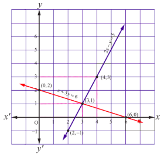
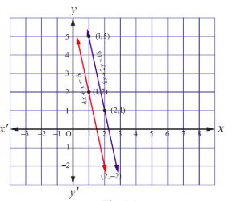

## 1.4 அணிகளின் பயன்பாடுகள் : நேரியச் சமன்பாடுகளின் தொகுப்பிற்கான தீர்வு காணுதல் (Applications of Matrices: Solving System of Linear Equations)

அணிகள் மற்றும் அணிக்கோவைகளின் ஒரு முக்கியமான பயன்பாடு யாதெனில் நேரியச் சமன்பாடுகளின் தொகுப்பிற்கு தீர்வு காண்பதாகும். உயிரியல், வேதியியல், வணிகவியல், பொருளாதாரம், இயற்பியல் மற்றும் பொறியியல் ஆகியவற்றில் நிகழும் பல நிகழ்வுகள் மாதிரியில் நேரியச் சமன்பாட்டுத் தொகுப்புகள் உருவாகின்றன. எடுத்துக்காட்டாக, சுற்றுக் கோட்பாட்டின் (circuit theory) பகுப்பாய்வு உள்ளீடு-வெளியீடு மாதிரிகளின் பகுப்பாய்வு மற்றும் வேதியியல் எதிர்வினைகள் ஆய்வு செய்வதற்கு நேரியச் சமன்பாட்டுத் தொகுப்பின் தீர்வுகள் தேவைப்படுகின்றன.

### 1.4.1 நேரியச் சமன்பாடுகளின் தொகுப்பை அமைத்தல் (Formation of a System of Linear Equations)

ஒரு எளிய நடைமுறைக்களத்தின் கணிதமாதிரியை உருவாக்குவதன் மூலம் நேரியல் சமன்பாட்டுத் தொகுப்பின் பொருளை புரிந்து கொள்ளலாம்.

A, B, C என்ற மூன்று நபர்கள் ஒரு சிறப்பங்காடிக்கு ஒரே வணிகச் சின்னம் (brand) உள்ள அரிசி மற்றும் சர்க்கரை வாங்கச் செல்கின்றனர். நபர் A, 5 கிலோகிராம் அரிசி மற்றும் 3 கிலோகிராம் சர்க்கரை வாங்கி ₹ 440 செலுத்துகின்றார். நபர் B, 6 கிலோகிராம் அரிசி மற்றும் 2 கிலோகிராம் சர்க்கரை வாங்கி ₹ 400 செலுத்துகின்றார். நபர் C, 8 கிலோகிராம் அரிசி மற்றும் 5 கிலோகிராம் சர்க்கரை வாங்கி ₹ 720 செலுத்துகின்றார். ஒரு கிலோகிராம் அரிசியின் விலை, ஒரு கிலோகிராம் சர்க்கரையின் விலையைக் கணக்கிடுவதற்கான கணித மாதிரியை உருவாக்குவோம். ஒரு கிலோகிராம் அரிசியின் விலை ₹ x என்க. ஒரு கிலோகிராம் சர்க்கரையின் விலை ₹ y என்க. நபர் A, 5 கிலோகிராம் அரிசி மற்றும் 3 கிலோகிராம் சர்க்கரை வாங்கி ₹ 440 செலுத்தியதால் நமக்குக் 5x + 3y = 440 என்ற சமன்பாடு கிடைக்கிறது. இவ்வாறே நபர் B மற்றும் C இவர்களைக் கொண்டு முறையே 6x + 2y = 400 மற்றும் 8x + 5y = 720 என்ற சமன்பாடுகள் கிடைக்கின்றன. எனவே x மற்றும் y இவற்றைக் காண்பதற்கான கணிதவியல் மாதிரி

$$
5x + 3y = 440, \quad 6x + 2y = 400, \quad 8x + 5y = 720.
$$

> **Note**
>
> மேலே உள்ள எடுத்துக்காட்டில், ஒரு சமன்பாட்டை நிறைவு செய்யும் x மற்றும் y -இன் மதிப்புகள் மற்ற இரு சமன்பாடுகளையும் நிறைவு செய்ய வேண்டும். வேறு வகையில் கூறுவோமாயின் x மற்றும் y -இன் மதிப்புகள் ஒரே சமயத்தில் அனைத்துச் சமன்பாடுகளையும் நிறைவு செய்ய வேண்டும். இந்த x மற்றும் y -இன் மதிப்புகள் நேரியச் சமன்பாட்டுத் தொகுப்பின் தீர்வுகளாகும். இச்சமன்பாடுகள் x மற்றும் y -இல் அமைந்த ஒருமடிச் சமன்பாடுகளாகும். எனவே இச்சமன்பாடுகள் மதிப்பிட வேண்டிய மாறிகள் x மற்றும் y -ல் அமைந்த நேரியச் சமன்பாட்டுத் தொகுப்பு என அழைக்கப்படும். இவை ஒரே சமயத்தில் (simultaneous) அமைந்த நேரியச் சமன்பாடுகளாகும். தொகுப்பானது மூன்று நேரியச் சமன்பாடுகளையும் x மற்றும் y என்ற இரு மதிப்பிட வேண்டிய மாறிகளைக் கொண்டதாகும். இச்சமன்பாடுகள் இரு பரிமாண பகுமுறை வடிவியலில் நேர்க்கோடுகளைக் குறிக்கின்றன. இப்பகுதியில் அணிகளைக் கொண்டு நேரியச் சமன்பாட்டுத் தொகுப்புகளுக்கு தீர்வு காணும் முறையை உருவாக்குவோம்.

### 1.4.2 நேரியச் சமன்பாட்டுத் தொகுப்பின் அணி வடிவம் (System of Linear Equations in Matrix Form)

m சமன்பாடுகள் மற்றும் n மாறிகளால் அமைந்த நேரியச் சமன்பாடுகளின் தொகுப்பின் வடிவமானது:

$$
\begin{aligned}
a_{11}x_1 + a_{12}x_2 + a_{13}x_3 + \cdots + a_{1n}x_n &= b_1, \\
a_{21}x_1 + a_{22}x_2 + a_{23}x_3 + \cdots + a_{2n}x_n &= b_2, \\
\cdots \quad \cdots \quad \cdots \quad \cdots \quad \cdots \quad \cdots \\
a_{m1}x_1 + a_{m2}x_2 + a_{m3}x_3 + \cdots + a_{mn}x_n &= b_m,
\end{aligned}
\tag{1}
$$

இங்கு $a_{ij}, i=1,2,\cdots,m; j=1,2,\cdots,n$ என்பவை கெழுக்கள் மற்றும் $b_k, k=1,2,\cdots,m$ என்பவை மாறிலிகள். எல்லா $b_k$ -களும் பூச்சியம் எனில் மேல் உள்ள தொகுப்பானது சமபடித்தான, நேரியச் சமன்பாடுகளின் தொகுப்பு (homogenous system of linear equations) எனப்படும். அவ்வாறு இல்லாமல் ஏதேனும் ஒரு $b_k$ -ஆனது பூச்சியம் இல்லை எனில் தொகுப்பானது அசமபடித்தான நேரியச் சமன்பாடுகளின் தொகுப்பு (non-homogenous system of linear equations) எனப்படும். $\alpha_1, \alpha_2, \cdots, \alpha_n$ முறையே $x_1, x_2, \cdots, x_n$ இவற்றின் மதிப்புகளாக சமன்பாட்டுத் தொகுப்பு (1)-ல் உள்ள ஒவ்வொரு சமன்பாட்டையும் நிறைவு செய்தால், $(\alpha_1, \alpha_2, \cdots, \alpha_n)$ என்ற $n$ -வரிசையானது (1)-இன் தீர்வு எனப்படும். இச்சமன்பாட்டுத் தொகுப்பு (1)-ஐ பின்வருமாறு அணிவடிவில் எழுதலாம்.

$x_1, x_2, x_3, \dots, x_n$ -ன் கெழுக்களால்

$$
A = \left[ \begin{array}{lllll} a_{11} & a_{12} & a_{13} & \cdots & a_{1n} \\ a_{21} & a_{22} & a_{23} & \cdots & a_{2n} \\ \vdots & \vdots & \vdots & \ddots & \vdots \\ a_{m1} & a_{m2} & a_{m3} & \cdots & a_{mn} \end{array} \right] \text{ என்ற } m \times n \text{ அணியை }
$$

உருவாக்குவோம். A –ன் முதல் நிரையானது சமன்பாட்டுத் தொகுப்பில் உள்ள முதல் சமன்பாட்டின் $x_1, x_2, x_3, \dots, x_n$ என்ற கெழுக்களால் அமைந்தவை. இதேபோல் மற்ற நிரைகளும் அமைந்துள்ளன. முதல் நிரலில் உள்ள உறுப்புகள் அனைத்து $m$ சமன்பாடுகளின் வரிசைப்படி $x_1$ கெழுக்களாக அமைத்துள்ளன.

$$
X = \left[ \begin{array}{l} x_1 \\ x_2 \\ \vdots \\ x_n \end{array} \right] \text{ மற்றும் } B = \left[ \begin{array}{l} b_1 \\ b_2 \\ \vdots \\ b_m \end{array} \right] \text{ என்பவை } x_1, x_2, x_3, \dots, x_n \text{ என்ற மாறிகளால் உருவான } n \times 1
$$

மற்றும் $b_1, b_2, b_3, \dots, b_m$ என்ற மாறிலிகளால் உருவாக்கப்பட்ட $m \times 1$ நிரல் அணிகள் என்க.

$$
AX = \left[ \begin{array}{lllll} a_{11} & a_{12} & a_{13} & \cdots & a_{1n} \\ a_{21} & a_{22} & a_{23} & \cdots & a_{2n} \\ \vdots & \vdots & \vdots & \ddots & \vdots \\ a_{m1} & a_{m2} & a_{m3} & \cdots & a_{mn} \end{array} \right] \left[ \begin{array}{l} x_1 \\ x_2 \\ \vdots \\ x_n \end{array} \right] = \left[ \begin{array}{l} a_{11}x_1 + a_{12}x_2 + a_{13}x_3 + \cdots + a_{1n}x_n \\ a_{21}x_1 + a_{22}x_2 + a_{23}x_3 + \cdots + a_{2n}x_n \\ \vdots \\ a_{m1}x_1 + a_{m2}x_2 + a_{m3}x_3 + \cdots + a_{mn}x_n \end{array} \right] = \left[ \begin{array}{l} b_1 \\ b_2 \\ \vdots \\ b_m \end{array} \right] = B.
$$

AX = B என்பது அணிகளைக் கொண்ட அணிச்சமன்பாடாகும் மற்றும் இதை நேரிய சமன்பாட்டுத் தொகுப்பு (1)-இன் அணி வடிவம் என அழைக்கப்படும். அணி A என்பது தொகுப்பின் கெழு அணி எனப்படும். மற்றும்

$$
\left[ \begin{array}{lllll} a_{11} & a_{12} & a_{13} & \cdots & a_{1n} \\ a_{21} & a_{22} & a_{23} & \cdots & a_{2n} \\ \vdots & \vdots & \vdots & \ddots & \vdots \\ a_{m1} & a_{m2} & a_{m3} & \cdots & a_{mn} \end{array} \right] \left[ \begin{array}{l} b_1 \\ b_2 \\ \vdots \\ b_m \end{array} \right] \text{ என்பது தொகுப்பின் விரிவுபடுத்தப்பட்ட (augmented matrix) அணி எனப்படும். இந்த விரிவுபடுத்தப்பட்ட அணியை } [A|B] \text{ எனக் குறிப்பிடுவோம்.}
$$

**Example 1.25**

2x+3y-5z+7=0, 7y+2z-3x=17, 6x-3y-8z+24=0 என்ற நேரியச் சமன்பாட்டுத் தொகுப்பின் அணி வடிவமானது

$$
\left[ \begin{array}{rrr} 2 & 3 & -5 \\ -3 & 7 & 2 \\ 6 & -3 & -8 \end{array} \right] \left[ \begin{array}{l} x \\ y \\ z \end{array} \right] = \left[ \begin{array}{r} -7 \\ 17 \\ -24 \end{array} \right]
$$

### 1.4.3 நேரியச் சமன்பாட்டுத் தொகுப்பின் தீர்வுகள் (Solution to a System of Linear equations)

நேரியச் சமன்பாட்டுத் தொகுப்பின் தீர்வின் இயல்பை பின்வரும் நிலைகளின் மூலம் அறிந்து கொள்ளலாம்:

**நிலை (i)**

பின்வரும் நேரியச் சமன்பாட்டுத் தொகுப்பைக் கருத்தில் கொள்வோம்.

$$
\left[
\begin{array}{ll}
2x - y = 5, & \dots \quad (1) \\
x + 3y = 6. & \dots \quad (2)
\end{array}
\right]
$$

இந்த இரு சமன்பாடுகள் இருபரிமான பகுமுறை வடிவியலில் இரட்டைக் கோடுகளைக் குறிக்கின்றன. (படம் 1.2-ஐ பார்க்க). (1)-விருந்து நாம் பெறுவது

$$
x = \frac{5+y}{2}. \quad \dots (3)
$$

(3)-ஐ (2)-ல் பிரதியிட்டுச் சுருக்கக் கிடைப்பது y = 1.

y = 1 என (1)-ல் பிரதியிட்டுச் சுருக்கக் கிடைப்பது

படம் 1.2

x = 3.

x = 3 மற்றும் y = 1 சமன்பாடுகள் (1) மற்றும் (2) நிறைவு செய்கின்றன.

அதாவது (1)-ன் தீர்வானது (2)-க்கும் தீர்வாகிறது.

எனவே இத்தொகுப்பை ஒருங்கமைவு உடையது மற்றும் தொகுப்பிற்கு ஒரே ஒரு தீர்வு (3,1) எனக் கூறுகிறோம்.

புள்ளி (3,1) என்பது கோடுகள் 2x – y = 5 மற்றும் x + 3y = 6 வெட்டிக்கொள்ளும் புள்ளியாகும்.

**நிலை (ii)**

பின்வரும் நேரியச் சமன்பாட்டுத் தொகுப்பை கருத்தில் கொள்வோம்.

$$
3x + 2y = 5, \qquad \dots (1)
$$

$$
$$
6x + 4y = 10 \qquad \dots (2)

சமன்பாடு (1)-விருந்து கிடைப்பது

$$
x = \frac{5 - 2y}{3} \qquad \dots (3)
$$

(3)-ஐ (2)-ல் பிரதியிட்டுச் சுருக்கினால் நாம் பெறுவது 0 = 0.

படம் 1.3

இதிலிருந்து நாம் அறிவது சமன்பாடு (2) ஆனது சமன்பாடு (1) -ன் தொடக்கநிலை உருமாற்றமாகும். சமன்பாடு (2)-ஐ 2 -ஆல் வகுக்கக் கிடைப்பது சமன்பாடு (1) ஆகும். எனவே ஒரே ஒரு சமன்பாடு (1)-ஐ வைத்துக்கொண்டு x மற்றும் y -க்கு ஒரே ஒரு தீர்வு காண இயலாது.

எனவே y = t என்ற மதிப்பை நாம் எடுத்துக்கொள்ள வேண்டிய நிர்ப்பந்தத்திற்கு உள்ளாகிறோம். பின்பு $\displaystyle x = \frac{5-2t}{3}$. இங்கு t என்பது ஒரு மெய் எண். சமன்பாடுகள் (1) மற்றும் (2) ஒரே ஒரு கோட்டை (ஒன்றின் மீது ஒன்று அமையும் கோடுகள்) இரு பரிமான பகுமுறை வடிவியலில் குறிக்கின்றன. (படம் 1.3-ஐ பார்க்க). எனவே தொகுப்பானது ஒருங்கமைவு உடையது மற்றும் (1)-ன் தீர்வுகள் (2)-க்கு தீர்வுகளாகும். மற்றும் t எந்த ஒரு மெய்யெண் மதிப்பைப் பெறுவதால் தொகுப்பிற்கு எண்ணற்ற தீர்வுகள் உண்டு.

**நிலை (iii)**

பின்வரும் நேரியச் சமன்பாட்டுத் தொகுப்பை கருத்தில் கொள்வோம்.

$$
4x + y = 6, \qquad \dots (1)
$$

$$
8x + 2y = 18. \qquad \dots (2)
$$

சமன்பாடு (1)-லிருந்து நாம் பெறுவது

$$
x = \frac{6 - y}{4} \qquad \dots (3)
$$

(3)-ஐ (2)-ல் பிரதியிட்டுச் சுருக்கக் கிடைப்பது 12 = 18.

படம் 1.4

இது ஒரு முரண்பாடான முடிவு ஆகும். இதிலிருந்து நாம் அறிவது யாதெனில் சமன்பாடு (2) ஆனது சமன்பாடு (1) உடன் ஒருங்கமைவற்றது. எனவே (1)-ன் தீர்வுகள் (2)-க்கு தீர்வாகாது.

எனவே தொகுப்பானது ஒருங்கமைவு அற்றது. மற்றும் தொகுப்பிற்கு தீர்வு கிடையாது. இச்சமன்பாடுகள் இருபரிமான பகுமுறை வடிவியலில் இரு இணை நேர்க்கோடுகளை (ஒன்றின் மீது ஒன்று அமையாத) குறிக்கின்றன. (பார்க்க படம் 1.4). ஒன்றின் மீது ஒன்று அமையாத இரு இணைக்கோடுகள் எப்பொழுதும் மெய் புள்ளியில் சந்திப்பது இல்லை என நாம் அறிவோம்.

> **Note**
>
> (1) தொகுப்பில் உள்ள ஏதேனும் இரு சமன்பாடுகளை இடம் மாற்றினால் தொகுப்பிற்கான தீர்வுகளில் மாற்றம் ஏற்படாது.
>
> (2) ஒரு பூச்சியமற்ற மாறிலியால் தொகுப்பில் உள்ள ஒரு சமன்பாட்டைப் பெருக்கி மாற்றி அமைத்தால் தொகுப்பிற்கான தீர்வுகளில் மாற்றம் ஏற்படாது.
>
> (3) நேரியச் சமன்பாடுகளின் தொகுப்பின் எந்தவொரு சமன்பாட்டினை, அச்சமன்பாட்டுடனும், அத்தொகுப்பின் பிறிதொரு சமன்பாட்டின் பூச்சியமில்லா எண்ணின் பெருக்கற்பலனைக் கூட்டிப் பிரதியிடல் அத்தொகுப்பின் தீர்வினை மாற்றாது.

**Definition 1.8**

ஒரு நேரியச் சமன்பாட்டுத் தொகுப்பானது குறைந்தது ஒரு தீர்வு பெற்றிருந்தால், தொகுப்பானது ஒருங்கமைவுடையது எனப்படும். ஒரு தீர்வு கூட பெறவில்லையெனில் தொகுப்பானது ஒருங்கமைவற்றது எனப்படும்.

> **Remark**
>
> நேரியச் சமன்பாட்டுத் தொகுப்பில் உள்ள சமன்பாடுகளின் எண்ணிக்கைக்கு மதிப்பிட வேண்டிய மாறிகளின் எண்ணிக்கைக்குச் சமம் எனில் கெழுக்களின் அணி A ஆனது சதுர அணியாக இருக்கும். மேலும் A ஆனது பூச்சியமற்ற கோவை அணியாகவுமிருப்பின் நேரியச் சமன்பாட்டுத் தொகுப்பிற்குப் பின்வரும் முறைகளில் ஏதேனும் ஒரு முறையில் தீர்வு காணலாம். (i) நேர்மாறு அணி காணல் முறை, (ii) கிராமரின் விதி, (iii) காஸ்ஸியன் நீக்கல் முறை

#### 1.4.3 (i) நேர்மாறு அணி காணல் முறை (Matrix Inversion Method)

நேரியச் சமன்பாட்டுத் தொகுப்பில் உள்ள கெழுக்களின் அணியானது சதுர அணியாகவும் மற்றும் பூச்சியமற்றக் கோவை அணியாகவும் இருப்பின் இம்முறையை பயன்படுத்த இயலும்.

$$
AX = B, \qquad \dots (1)
$$

என்ற சமன்பாட்டைக் கருதுவோம். இங்கு A என்பது சதுர மற்றும் பூச்சியமற்றக் கோவை அணியாகும். A என்பது பூச்சியமற்றக் கோவை அணி ஆதலால் A-1 காண இயலும் மற்றும் AA-1 = A-1A = I. (1)-இன் இருபுறமும் முன்புறமாக A-1 ஆல் பெருக்கக் கிடைப்பது A-1(AX) = A-1B. அதாவது (A-1A)X = A-1B.

எனவே நாம் பெறுவது X = A-1B.

**Example 1.22**

பின்வரும் நேரியச் சமன்பாட்டுத் தொகுப்பை நேர்மாறு அணி காணல் முறையை பயன்படுத்தி தீர்க்க:

$$
5x + 2y = 3, \quad 3x + 2y = 5.
$$

**Solution**

தொகுப்பின் அணி வடிவம் AX = B, இங்கு

$$
A = \left[ \begin{array}{ll} 5 & 2 \\ 3 & 2 \end{array} \right], \quad X = \left[ \begin{array}{l} x \\ y \end{array} \right], \quad B = \left[ \begin{array}{l} 3 \\ 5 \end{array} \right].
$$

$$
|A| = \left| \begin{array}{ll} 5 & 2 \\ 3 & 2 \end{array} \right| = 10 - 6 = 4 \neq 0.
$$

எனவே A-1 காண இயலும். மற்றும்

$$
A^{-1} = \frac{1}{4} \left[ \begin{array}{rr} 2 & -2 \\ -3 & 5 \end{array} \right].
$$

X = A-1B என்ற சூத்திரத்தைப் பயன்படுத்தக் கிடைப்பது

$$
\left[ \begin{array}{l} x \\ y \end{array} \right] = \frac{1}{4} \left[ \begin{array}{rr} 2 & -2 \\ -3 & 5 \end{array} \right] \left[ \begin{array}{l} 3 \\ 5 \end{array} \right] = \frac{1}{4} \left[ \begin{array}{r} 6 - 10 \\ -9 + 25 \end{array} \right] = \frac{1}{4} \left[ \begin{array}{r} -4 \\ 16 \end{array} \right] = \left[ \begin{array}{r} -1 \\ 4 \end{array} \right].
$$

எனவே தீர்வானது x = -1, y = 4.

**Example 1.23**

பின்வரும் நேரியச் சமன்பாட்டுத் தொகுப்பை நேர்மாறு அணி காணல் முறையை பயன்படுத்தி தீர்க்க:

$$
2x_1 + 3x_2 + 3x_3 = 5, \quad x_1 - 2x_2 + x_3 = -4, \quad 3x_1 - x_2 - 2x_3 = 3.
$$

**Solution**

தொகுப்பின் அணி வடிவம் AX = B.

$$
\text{இங்கு } A = \left[ \begin{array}{rrr} 2 & 3 & 3 \\ 1 & -2 & 1 \\ 3 & -1 & -2 \end{array} \right], \quad X = \left[ \begin{array}{l} x_1 \\ x_2 \\ x_3 \end{array} \right], \quad B = \left[ \begin{array}{r} 5 \\ -4 \\ 3 \end{array} \right].
$$

$$
|A| = \left| \begin{array}{rrr} 2 & 3 & 3 \\ 1 & -2 & 1 \\ 3 & -1 & -2 \end{array} \right| = 2(4+1) - 3(-2-3) + 3(-1+6) = 10 + 15 + 15 = 40 \neq 0.
$$

எனவே A-1 காண இயலும் மற்றும்

$$
A^{-1} = \frac{1}{|A|} (\text{adj } A) = \frac{1}{40} \left[ \begin{array}{rrr} +(4+1) & -(2-3) & +(1+6) \\ -(6+3) & +(4-9) & -(2-9) \\ +(3+6) & -(2-3) & +(4-3) \end{array} \right]^T = \frac{1}{40} \left[ \begin{array}{rrr} 5 & 3 & 9 \\ 5 & -13 & 1 \\ 5 & 11 & -7 \end{array} \right].
$$

X = A-1B என்ற சூத்திரத்தைப் பயன்படுத்தக் கிடைப்பது

$$
\left[ \begin{array}{l} x_1 \\ x_2 \\ x_3 \end{array} \right] = \frac{1}{40} \left[ \begin{array}{rrr} 5 & 3 & 9 \\ 5 & -13 & 1 \\ 5 & 11 & -7 \end{array} \right] \left[ \begin{array}{r} 5 \\ -4 \\ 3 \end{array} \right] = \frac{1}{40} \left[ \begin{array}{r} 25 - 12 + 27 \\ 25 + 52 + 3 \\ 25 - 44 - 21 \end{array} \right] = \frac{1}{40} \left[ \begin{array}{r} 40 \\ 80 \\ -40 \end{array} \right] = \left[ \begin{array}{r} 1 \\ 2 \\ -1 \end{array} \right].
$$

எனவே தீர்வானது (x1 = 1, x2 = 2, x3 = -1).

**Example 1.24**

$$
A = \left[ \begin{array}{rrr} -4 & 4 & 4 \\ -7 & 1 & 3 \\ 5 & -3 & -1 \end{array} \right] \text{ மற்றும் } B = \left[ \begin{array}{rrr} 1 & -1 & 1 \\ 1 & -2 & -2 \\ 2 & 1 & 3 \end{array} \right] \text{ எனில் பெருக்கப்படும் AB மற்றும் BA காண்க.}
$$

இதன் மூலம் x - y + z = 4, x - 2y - 2z = 9, 2x + y + 3z = 1 என்ற நேரியச் சமன்பாட்டுத் தொகுப்பைத் தீர்க்கவும்.

**Solution**

$$
AB = \left[ \begin{array}{rrr} -4 & 4 & 4 \\ -7 & 1 & 3 \\ 5 & -3 & -1 \end{array} \right] \left[ \begin{array}{rrr} 1 & -1 & 1 \\ 1 & -2 & -2 \\ 2 & 1 & 3 \end{array} \right] = \left[ \begin{array}{rrr} -4+4+8 & 4-8+4 & -4-8+12 \\ -7+1+6 & 7-2+3 & -7-2+9 \\ 5-3-2 & -5+6-1 & 5+6-3 \end{array} \right] = \left[ \begin{array}{rrr} 8 & 0 & 0 \\ 0 & 8 & 0 \\ 0 & 0 & 8 \end{array} \right] = 8I_3
$$

மற்றும்

$$
BA = \left[ \begin{array}{rrr} 1 & -1 & 1 \\ 1 & -2 & -2 \\ 2 & 1 & 3 \end{array} \right] \left[ \begin{array}{rrr} -4 & 4 & 4 \\ -7 & 1 & 3 \\ 5 & -3 & -1 \end{array} \right] = \left[ \begin{array}{rrr} -4+7+5 & 4-1-3 & 4-3-1 \\ -4+14-10 & 4-2+6 & 4-6+2 \\ -8-7+15 & 8+1-9 & 8+3-3 \end{array} \right] = \left[ \begin{array}{rrr} 8 & 0 & 0 \\ 0 & 8 & 0 \\ 0 & 0 & 8 \end{array} \right] = 8I_3.
$$

எனவே நாம் பெறுவது AB = BA = 8I, அதாவது, (1/8 A) B = B(1/8 A) = I3. எனவே, B-1 = 1/8 A.

கொடுத்துள்ள நேரியச் சமன்பாட்டுத் தொகுப்பை அணி வடிவில் எழுதக் கிடைப்பது

$$
\left[ \begin{array}{rrr} 1 & -1 & 1 \\ 1 & -2 & -2 \\ 2 & 1 & 3 \end{array} \right] \left[ \begin{array}{l} x \\ y \\ z \end{array} \right] = \left[ \begin{array}{r} 4 \\ 9 \\ 1 \end{array} \right] \text{ . அதாவது, } B \left[ \begin{array}{l} x \\ y \\ z \end{array} \right] = \left[ \begin{array}{r} 4 \\ 9 \\ 1 \end{array} \right].
$$

எனவே,

$$
\left[ \begin{array}{l} x \\ y \\ z \end{array} \right] = B^{-1} \left[ \begin{array}{r} 4 \\ 9 \\ 1 \end{array} \right] = \frac{1}{8} \left[ \begin{array}{rrr} -4 & 4 & 4 \\ -7 & 1 & 3 \\ 5 & -3 & -1 \end{array} \right] \left[ \begin{array}{r} 4 \\ 9 \\ 1 \end{array} \right] = \frac{1}{8} \left[ \begin{array}{r} -16+36+4 \\ -28+9+3 \\ 20-27-1 \end{array} \right] = \frac{1}{8} \left[ \begin{array}{r} 24 \\ -16 \\ -8 \end{array} \right] = \left[ \begin{array}{r} 3 \\ -2 \\ -1 \end{array} \right].
$$

எனவே தீர்வானது (x = 3, y = -2, z = -1).

**பயிற்சி 1.3**

1. பின்வரும் நேரியச் சமன்பாட்டுத் தொகுப்புகளை நேர்மாறு அணி காணல் முறையில் தீர்க்க:

$$
(i) \quad 2x + 5y = -2, \quad x + 2y = -3 \qquad (ii) \quad 2x - y = 8, \quad 3x + 2y = -2
$$

$$
(iii) \quad 2x + 3y - z = 9, \quad x + y + z = 9, \quad 3x - y - z = -1
$$

$$
(iv) \quad x + y + z - 2 = 0, \quad 6x - 4y + 5z - 31 = 0, \quad 5x + 2y + 2z = 13
$$

2. 
$$
A = \left[ \begin{array}{rrr} -5 & 1 & 3 \\ 7 & 1 & -5 \\ 1 & -1 & 1 \end{array} \right] \quad \text{மற்றும் } \quad B = \left[ \begin{array}{rrr} 1 & 1 & 2 \\ 3 & 2 & 1 \\ 2 & 1 & 3 \end{array} \right] \quad \text{எனில் பெருக்கப்படும் AB மற்றும் BA காண்க.}
$$

இதன் மூலம் x + y + 2z = 1, 3x + 2y + z = 7, 2x + y + 3z = 2 என்ற நேரியச் சமன்பாட்டுத் தொகுப்பைத் தீர்க்கவும்.

3. ஒருவர் ஒரு குறிப்பிட்ட மாத ஊதியத்தில் ஒரு பணியில் அமர்த்தப்படுகிறார். ஒவ்வொரு ஆண்டும் ஒரு நிலையான ஊதிய உயர்வு அவருக்கு வழங்கப்படுகிறது. 3 ஆண்டுகளுக்குப் பிறகு அவர் பெறும் ஊதியம் ₹ 19,800 மற்றும் 9 ஆண்டுகளுக்குப் பிறகு அவர் பெறும் ஊதியம் ₹ 23,400 எனில் அவருடைய ஆரம்ப ஊதியம் மற்றும் ஆண்டு உயர்வு எவ்வளவு என்பதைக் காண்க. (நேர்மாறு அணி காணல் முறையில் இக்கணக்கைத் தீர்க்க.)

4. 4 ஆண்களும் 4 பெண்களும் சேர்ந்து ஒரு குறிப்பிட்ட வேலையை 3 நாட்களில் செய்து முடிப்பார்கள். அதே வேலையை 2 ஆண்களும் 5 பெண்களும் சேர்ந்து 4 நாட்களில் முடிப்பார்கள் எனில் அவ்வேலையை ஒர் ஆண் மற்றும் ஒரு பெண் தனித்தனியாக செய்து முடிப்பதற்கு எத்தனை நாட்களாகும்?

5. A, B மற்றும் C என்ற பொருட்களின் விலை ஒர் அலகிற்கு முறையே ₹ x, y மற்றும் z ஆகும். P என்பவர் B -ல் 4 அலகுகள் வாங்கி, A -ல் 2 அலகையும் C -ல் 5 அலகையும் விற்கிறார். Q என்பவர் C -ல் 2 அலகுகள் வாங்கி A -ல் 3 அலகுகள் மற்றும் B -ல் 1 அலகையும் விற்கிறார். R என்பவர் A -ல் 1 அலகை வாங்கி, B -ல் 3 அலகையும் C -ல் ஒரு அலகையும் விற்கிறார். இவ்வணிகத்தில் P, Q மற்றும் R முறையே ₹ 15,000, ₹ 1,000 மற்றும் ₹ 4,000 வருமானம் ஈட்டுகின்றனர் எனில் A, B மற்றும் C பொருட்களின் ஒரலகு விலை எவ்வளவு என்பதைக் காண்க. (நேர்மாறு அணி காணல் முறையில் இக்கணக்கைத் தீர்க்க.)

#### 1.4.3 (ii) கிராமரின் விதி (Cramer's Rule)

நேரியல் சமன்பாட்டுத் தொகுப்பில் உள்ள கெழுக்கள் அணியானது சதுர அணியாகவும் பூச்சியமற்ற அணிக்கோவை அணியாகவும் இருந்தால் மட்டுமே இம்முறையை பயன்படுத்த இயலும். இம்முறையை பின்வரும் சமன்பாட்டுத் தொகுப்பின் மூலம் விவரிப்போம்.

$$
a_{11}x_1 + a_{12}x_2 + a_{13}x_3 = b_1,
$$

$$
a_{21}x_1 + a_{22}x_2 + a_{23}x_3 = b_2,
$$

$$
a_{31}x_1 + a_{32}x_2 + a_{33}x_3 = b_3,
$$

இங்கு கெழுக்கள் அணியானது,

$$
\left[ \begin{array}{ccc} a_{11} & a_{12} & a_{13} \\ a_{21} & a_{22} & a_{23} \\ a_{31} & a_{32} & a_{33} \end{array} \right] \text{ பூச்சியமற்ற கோவை அணி. எனவே}
$$

$$
\left| \begin{array}{ccc} a_{11} & a_{12} & a_{13} \\ a_{21} & a_{22} & a_{23} \\ a_{31} & a_{32} & a_{33} \end{array} \right| \neq 0.
$$

$$
\Delta = \left| \begin{array}{ccc} a_{11} & a_{12} & a_{13} \\ a_{21} & a_{22} & a_{23} \\ a_{31} & a_{32} & a_{33} \end{array} \right| \text{ என்க.}
$$

$$
x_1 \Delta = x_1 \left| \begin{array}{ccc} a_{11} & a_{12} & a_{13} \\ a_{21} & a_{22} & a_{23} \\ a_{31} & a_{32} & a_{33} \end{array} \right| = \left| \begin{array}{ccc} a_{11}x_1 & a_{12} & a_{13} \\ a_{21}x_1 & a_{22} & a_{23} \\ a_{31}x_1 & a_{32} & a_{33} \end{array} \right|
$$

$$
= \left| \begin{array}{ccc} a_{11}x_1 + a_{12}x_2 + a_{13}x_3 & a_{12} & a_{13} \\ a_{21}x_1 + a_{22}x_2 + a_{23}x_3 & a_{22} & a_{23} \\ a_{31}x_1 + a_{32}x_2 + a_{33}x_3 & a_{32} & a_{33} \end{array} \right| = \left| \begin{array}{ccc} b_1 & a_{12} & a_{13} \\ b_2 & a_{22} & a_{23} \\ b_3 & a_{32} & a_{33} \end{array} \right| = \Delta_1
$$

$\Delta \neq 0$ ஆதலால், நாம் பெறுவது

$$
x_1 = \frac{\Delta_1}{\Delta}.
$$

இதேபோல், நாம் பெறுவது

$$
x_2 = \frac{\Delta_2}{\Delta}, \quad x_3 = \frac{\Delta_3}{\Delta},
$$

இங்கு

$$
\Delta_2 = \left| \begin{array}{ccc} a_{11} & b_1 & a_{13} \\ a_{21} & b_2 & a_{23} \\ a_{31} & b_3 & a_{33} \end{array} \right|, \quad \Delta_3 = \left| \begin{array}{ccc} a_{11} & a_{12} & b_1 \\ a_{21} & a_{22} & b_2 \\ a_{31} & a_{32} & b_3 \end{array} \right|.
$$

இவ்வாறாக, கிராமரின் விதியானது

$$
x_1 = \frac{\Delta_1}{\Delta}, \quad x_2 = \frac{\Delta_2}{\Delta}, \quad x_3 = \frac{\Delta_3}{\Delta},
$$

இங்கு

$$
\Delta = \left| \begin{array}{ccc} a_{11} & a_{12} & a_{13} \\ a_{21} & a_{22} & a_{23} \\ a_{31} & a_{32} & a_{33} \end{array} \right|, \quad \Delta_1 = \left| \begin{array}{ccc} b_1 & a_{12} & a_{13} \\ b_2 & a_{22} & a_{23} \\ b_3 & a_{32} & a_{33} \end{array} \right|,
$$

$$
\Delta_2 = \left| \begin{array}{ccc} a_{11} & b_1 & a_{13} \\ a_{21} & b_2 & a_{23} \\ a_{31} & b_3 & a_{33} \end{array} \right|, \quad \Delta_3 = \left| \begin{array}{ccc} a_{11} & a_{12} & b_1 \\ a_{21} & a_{22} & b_2 \\ a_{31} & a_{32} & b_3 \end{array} \right|.
$$

> **Note**
>
> $\Delta$-ல் உள்ள முதல் நிரலில் உள்ள உறுப்புகளான $a_{11}, a_{21}, a_{31}$ களுக்குப் பதில் முறையே $b_1, b_2, b_3$ களைப் பிரதியிடக் கிடைப்பது $\Delta_1$.
>
> $\Delta$-ல் உள்ள இரண்டாவது நிரலில் உள்ள உறுப்புகளான $a_{12}, a_{22}, a_{32}$ களுக்குப் பதில் முறையே $b_1, b_2, b_3$ களைப் பிரதியிடக் கிடைப்பது $\Delta_2$ ஆகும்.
>
> $\Delta$-ல் உள்ள மூன்றாவது நிரலில் உள்ள உறுப்புகளான $a_{13}, a_{23}, a_{33}$ களுக்குப் பதில் முறையே $b_1, b_2, b_3$ களைப் பிரதியிடக் கிடைப்பது $\Delta_3$ ஆகும்.
>
> $\Delta = 0$ எனில் கிராமரின் விதியை பயன்படுத்த இயலாது.

**Example 1.25**

$x_1 - x_2 = 3, 2x_1 + 3x_2 + 4x_3 = 17, x_2 + 2x_3 = 7$ என்ற நேரியச் சமன்பாடுகளின் தொகுப்பைத் தீர்க்கவும்.

**Solution**

பின்வரும் அணிக்கோவைகளின் மதிப்பை முதலில் காண்போம்.

$$
\Delta = \left| \begin{array}{ccc} 1 & -1 & 0 \\ 2 & 3 & 4 \\ 0 & 1 & 2 \end{array} \right| = 1(6-4) - (-1)(4-0) + 0 = 2 + 4 = 6 \neq 0,
$$

$$
\Delta_1 = \left| \begin{array}{ccc} 3 & -1 & 0 \\ 17 & 3 & 4 \\ 7 & 1 & 2 \end{array} \right| = 3(6-4) - (-1)(34-28) + 0 = 6 + 6 = 12,
$$

$$
\Delta_2 = \left| \begin{array}{ccc} 1 & 3 & 0 \\ 2 & 17 & 4 \\ 0 & 7 & 2 \end{array} \right| = 1(34-28) - 3(4-0) + 0 = 6 - 12 = -6,
$$

$$
\Delta_3 = \left| \begin{array}{ccc} 1 & -1 & 3 \\ 2 & 3 & 17 \\ 0 & 1 & 7 \end{array} \right| = 1(21-17) - (-1)(14-0) + 3(2-0) = 4 + 14 + 6 = 24.
$$

கிராமரின் விதிப்படி

$$
x_1 = \frac{\Delta_1}{\Delta} = \frac{12}{6} = 2, \quad x_2 = \frac{\Delta_2}{\Delta} = \frac{-6}{6} = -1, \quad x_3 = \frac{24}{6} = 4.
$$

எனவே தீர்வானது (x₁ = 2, x₂ = -1, x₃ = 4).

**Example 1.26**

T20 ஆட்டமொன்றில் கடைசி ஓவரில் 1 பந்து மட்டும் வீசப்பட வேண்டிய நிலையில் ஓர் அணியானது 6 ரன்கள் (ஓட்டங்கள்) பெற்றால் மட்டுமே வெற்றி பெறும் நிலையில் இருந்தது. கடைசி பந்து மட்டையாளருக்கு வீசப்பட்டது. அவர் அதனை மிக உயரம் செல்லுமாறு அடிக்கிறார். பந்தானது செங்குத்து தளத்தில் சென்ற பாதை அத்தளத்தில் $y = ax^2 + bx + c$ என்ற சமன்பாட்டின்படி உள்ளது. பந்தானது (10,8), (20,16), (40,22) என்ற புள்ளிகள் வழியாகச் செல்கிறது எனில் அவ்வணியானது ஆட்டத்தை வென்றதா என்பதை முடிவு செய்யலாம்? உனது விடையினை கிராமர் விதியைக் கொண்டு நியாயப்படுத்துக. (எல்லா தொலைவுகளும் மீட்டர் அளவில் உள்ளன. பந்து சென்ற பாதையின் தளமானது மிகத்தொலைவில் உள்ள எல்லைக் கோட்டினை (70,0) என்ற புள்ளியில் சந்திக்கும்)

**Solution**

$y = ax^2 + bx + c$ என்ற பாதையானது (10,8), (20,16), (40,22) என்ற புள்ளிகள் வழிச் செல்கிறது.

ஆதலால் $100a + 10b + c = 8, 400a + 20b + c = 16, 1600a + 40b + c = 22$ என்ற சமன்பாடுகள் கிடைக்கின்றன. கிராமரின் விதியை பயன்படுத்த பின்வருவனவற்றைக் காண்போம்.

$$
\Delta = \left| \begin{array}{ccc} 100 & 10 & 1 \\ 400 & 20 & 1 \\ 1600 & 40 & 1 \end{array} \right| = 1000 \left| \begin{array}{ccc} 1 & 1 & 1 \\ 4 & 2 & 1 \\ 16 & 4 & 1 \end{array} \right| = 1000[-2+12-16] = -6000,
$$

$$
\Delta_1 = \left| \begin{array}{ccc} 8 & 10 & 1 \\ 16 & 20 & 1 \\ 22 & 40 & 1 \end{array} \right| = 20 \left| \begin{array}{ccc} 4 & 1 & 1 \\ 8 & 2 & 1 \\ 11 & 4 & 1 \end{array} \right| = 20[-8+3+10] = 100,
$$

$$
\Delta_2 = \left| \begin{array}{ccc} 100 & 8 & 1 \\ 400 & 16 & 1 \\ 1600 & 22 & 1 \end{array} \right| = 200 \left| \begin{array}{ccc} 4 & 8 & 1 \\ 16 & 11 & 1 \end{array} \right| = 200[-3+48-84] = -7800,
$$

$$
\Delta_3 = \left| \begin{array}{ccc} 100 & 10 & 8 \\ 400 & 20 & 16 \\ 1600 & 40 & 22 \end{array} \right| = 2000 \left| \begin{array}{ccc} 1 & 1 & 4 \\ 4 & 2 & 8 \\ 16 & 4 & 11 \end{array} \right| = 2000[-10+84-64] = 20000.
$$

கிராமரின் விதிப்படி,

$$
a = \frac{\Delta_1}{\Delta} = -\frac{1}{60}, \quad b = \frac{\Delta_2}{\Delta} = \frac{7800}{6000} = \frac{78}{60} = \frac{13}{10}, \quad c = \frac{\Delta_3}{\Delta} = -\frac{20000}{6000} = -\frac{10}{3}.
$$

எனவே பாதையின் சமன்பாடு

$$
y = -\frac{1}{60}x^2 + \frac{13}{10}x - \frac{10}{3}.
$$

$x = 70$ எனில் $y = 6$ எனக் கிடைக்கிறது. எனவே பந்தானது எல்லைக்கோட்டிற்கு நேர் மேலாக 6 மீ உயரத்தில் செல்கிறது மற்றும் எல்லைக் கோட்டின் அருகில் உள்ள ஆட்டக்காரர் எகிறிக் குதித்துப் பிடிக்க முயன்றாலும் அவரால் அப்பந்தினைப் பிடிக்க இயலாது. எனவே அப்பந்து மிகப்பெரிய 6 ஆகச் சென்றது மற்றும் அவ்வணி ஆட்டத்தினை வென்றது.

**பயிற்சி 1.4**

1. பின்வரும் நேரியச் சமன்பாடுகளின் தொகுப்பை கிராமரின் விதிப்படி தீர்க்க:

$$
(i) \quad 5x - 2y + 16 = 0, \quad x + 3y - 7 = 0
$$

$$
(ii) \quad \frac{3}{x} + 2y = 12, \quad \frac{2}{x} + 3y = 13
$$

$$
(iii) \quad 3x + 3y - z = 11, \quad 2x - y + 2z = 9, \quad 4x + 3y + 2z = 25
$$

$$
(iv) \quad \frac{3}{x} - \frac{4}{y} - \frac{2}{z} - 1 = 0, \quad \frac{1}{x} + \frac{2}{y} + \frac{1}{z} - 2 = 0, \quad \frac{2}{x} - \frac{5}{y} - \frac{4}{z} + 1 = 0
$$

2. ஒரு போட்டித் தேர்வில் ஒவ்வொரு சரியான விடைக்கும் ஒரு மதிப்பெண் வழங்கப்படுகிறது. ஒவ்வொரு தவறான விடைக்கும் $\frac{1}{4}$ மதிப்பெண் குறைக்கப்படுகிறது. ஒரு மாணவர் 100 கேள்விகளுக்குப் பதிலளித்து 80 மதிப்பெண்கள் பெறுகிறார் எனில் அவர் எத்தனை கேள்விகளுக்குச் சரியாக பதில் அளித்திருப்பார்? (கிராமரின் விதியைப் பயன்படுத்தி இக்கணக்கைத் தீர்க்கவும்).

3. வேதியாளர் ஒருவரிடம் 50% அமிலத்தன்மை கொண்ட ஒரு கரைசலும் மற்றும் 25% அமிலத்தன்மை கொண்ட மற்றொரு கரைசலும் உள்ளது. அவர் 10 லிட்டர் கரைசலில் 40% அமிலத்தன்மை உள்ளவாறு ஒரு கரைசலை உருவாக்க இருவகைக் கரைசல்கள் ஒவ்வொன்றிலிருந்தும் எத்தனை லிட்டர் சேர்க்க வேண்டும்? (இக்கணக்கை கிராமரின் விதியைப் பயன்படுத்தித் தீர்க்க).

4. ஒரு மீன் தொட்டியை பம்பு A மற்றும் பம்பு B என்பன ஒன்றாகச் சேர்ந்து 10 நிமிடங்களில் நீரை நிரப்பும். பம்பு B ஆனது நீரை உள்ளே அல்லது வெளியே ஒரே வேகத்தில் அனுப்ப இயலும். எதிர்பாராதவிதமாக பம்பு B ஆனது நீரை வெளியே அனுப்பினால் தொட்டி நிரம்ப 30 நிமிடங்கள் ஆகும் எனில் ஒவ்வொரு பம்பும் தொட்டியை தனித்தனியாக நிரப்ப எவ்வளவு காலம் எடுத்துக் கொள்ளும்? (கிராமரின் விதியைப் பயன்படுத்தி தீர்க்கவும்).

5. ஒரு குடும்பத்திலுள்ள மூன்று நபர்கள் இரவு உணவு சாப்பிட ஓர் உணவகத்திற்குச் சென்றனர். இரு தோசைகள், மூன்று இட்லிகள் மற்றும் இரு வடைகளின் விலை ₹ 150. இரு தோசைகள், இரு இட்லிகள் மற்றும் நான்கு வடைகளின் விலை ₹ 200. ஐந்து தோசைகள், நான்கு இட்லிகள் மற்றும் இரண்டு வடைகளின் விலை ₹ 250. அக்குடும்பத்தினரிடம் ₹ 350 இருந்தது மற்றும் அவர்கள் மூன்று தோசைகள், ஆறு இட்லிகள் மற்றும் ஆறு வடைகள் சாப்பிட்டனர். அக்குடும்பத்தினர் சாப்பிட்ட செலவிற்கான தொகையை அவர்களிடமிருந்த பணத்தைக் கொண்டு செலுத்த முடியுமா? (உமது விடையை கிராமரின் விதிக்கொண்டு நிரூபி)

#### 1.4.3 (iii) காஸ்ஸியன் நீக்கல் முறை (Gaussian Elimination Method)

நேரியச் சமன்பாடுகளின் தொகுப்பில் உள்ள கெழுக்களின் அணியானது சதுர அணியாக இல்லாவிட்டாலும் இம்முறையைப் பயன்படுத்தித் தீர்வு காணலாம். இது நாம் ஏற்கனவே அறிந்துள்ள பிரதியிடல் முறையில் தீர்க்கும் முறையேயாகும். இம்முறையில், நேரியச் சமன்பாடுகளின் தொகுப்பின் விரிவுபடுத்தப்பட்ட அணியை ஏறுபடி வடிவத்திற்கு உருமாற்றி பின்பு பின்னோக்கிப் பிரதியிடல் முறையில் தீர்வு காண்பதாகும்.

**Example 1.27**

பின்வரும் நேரியச் சமன்பாட்டுத் தொகுப்பை காஸ்ஸியன் நீக்கல் முறையில் தீர்க்க:

$$
4x + 3y + 6z = 25, \quad x + 5y + 7z = 13, \quad 2x + 9y + z = 1.
$$

**Solution**

விரிவுபடுத்தப்பட்ட அணியை ஏறுபடி வடிவத்திற்கு உருமாற்றங்கள் செய்யக் கிடைப்பது,

$$
[A|B] = \left[ \begin{array}{rrrr} 4 & 3 & 6 & 25 \\ 1 & 5 & 7 & 13 \\ 2 & 9 & 1 & 1 \end{array} \right] \xrightarrow{R_1 \leftrightarrow R_2} \left[ \begin{array}{rrrr} 1 & 5 & 7 & 13 \\ 4 & 3 & 6 & 25 \\ 2 & 9 & 1 & 1 \end{array} \right]
$$

$$
\xrightarrow{R_2 \to R_2 - 4R_1} \left[ \begin{array}{rrrr} 1 & 5 & 7 & 13 \\ 0 & -17 & -22 & -27 \\ 2 & 9 & 1 & 1 \end{array} \right] \xrightarrow{R_3 \to R_3 - 2R_1} \left[ \begin{array}{rrrr} 1 & 5 & 7 & 13 \\ 0 & -17 & -22 & -27 \\ 0 & -1 & -13 & -25 \end{array} \right]
$$

$$
\xrightarrow{R_2 \to -\frac{1}{17}R_2} \left[ \begin{array}{rrrr} 1 & 5 & 7 & 13 \\ 0 & 1 & \frac{22}{17} & \frac{27}{17} \\ 0 & -1 & -13 & -25 \end{array} \right] \xrightarrow{R_3 \to R_3 + R_2} \left[ \begin{array}{rrrr} 1 & 5 & 7 & 13 \\ 0 & 1 & \frac{22}{17} & \frac{27}{17} \\ 0 & 0 & -\frac{199}{17} & -\frac{398}{17} \end{array} \right]
$$

$$
\xrightarrow{R_3 \to -\frac{17}{199}R_3} \left[ \begin{array}{rrrr} 1 & 5 & 7 & 13 \\ 0 & 1 & \frac{22}{17} & \frac{27}{17} \\ 0 & 0 & 1 & 2 \end{array} \right].
$$

ஏறுபடி வடிவத்திலிருந்து கிடைக்கும் சமமான சமன்பாடுகளின் தொகுப்பானது

$$
x + 5y + 7z = 13, \qquad \dots (1)
$$

$$
y + \frac{22}{17}z = \frac{27}{17}, \qquad \dots (2)
$$

$$
z = 2. \qquad \dots (3)
$$

(3)-லிருந்து நாம் பெறுவது $z = 2$.

$z = 2$ என (2) -ல் பிரதியிடக் கிடைப்பது

$$
y + \frac{22}{17}(2) = \frac{27}{17} \Rightarrow y = \frac{27 - 44}{17} = -1.
$$

$z = 2$ மற்றும் $y = -1$ என (1)-ல் பிரதியிடக் கிடைப்பது

$$
x + 5(-1) + 7(2) = 13 \Rightarrow x - 5 + 14 = 13 \Rightarrow x = 4.
$$

எனவே தீர்வானது $(x = 4, y = -1, z = 2)$.

> **Note**: கடைசி சமன்பாட்டிலிருந்து முதல் சமன்பாட்டிற்கு மேலே உள்ள முறையானது பின்னோக்கி பிரதியிடல் முறை என அழைக்கப்படுகிறது.

**Example 1.28**

$t$ நேரத்தில் ஒரு ராக்கெட்டின் மேல் நோக்கிய வேகம் $v(t) = at^2 + bt + c$ ஆனது, தோராயமாக $v(t) = at^2 + bt + c$ என கொடுக்கப்பட்டுள்ளது. இங்கு $0 \leq t \leq 100$ மற்றும் $a, b, c$ என்பன மாறிலிகள். ராக்கெட்டின் வேகம் $t = 3, t = 6$, மற்றும் $t = 9$ வினாடிகளில் முறையே 64, 133, மற்றும் 208 மைல்கள்/வினாடி எனில் $t = 15$ வினாடியில் அதன் வேகத்தைக் காண்க. (காஸ்ஸியன் நீக்கல் முறையை பயன்படுத்துக).

**Solution**

$v(3) = 64$, $v(6) = 133$ மற்றும் $v(9) = 208$. ஆதலால் பின்வரும் நேரிய சமன்பாட்டுத் தொகுப்பைப் பெறுகிறோம்.

$$
9a + 3b + c = 64,
$$

$$
36a + 6b + c = 133,
$$

$$
81a + 9b + c = 208.
$$

மேல் உள்ள நேரியச் சமன்பாட்டுத் தொகுப்பை காஸ்ஸியன் நீக்கல் முறையில் தீர்க்க உள்ளோம். விரிவுபடுத்தப்பட்ட அணியை நிரை-ஏறுபடி வடிவத்திற்கு தொடக்கநிலை நிரை உருமாற்றங்கள் செயல்படுவதன் மூலம் நாம் பெறுவது,

$$
[A|B] = \left[ \begin{array}{rrrr} 9 & 3 & 1 & 64 \\ 36 & 6 & 1 & 133 \\ 81 & 9 & 1 & 208 \end{array} \right] \xrightarrow{R_2 \to R_2 - 4R_1} \left[ \begin{array}{rrrr} 9 & 3 & 1 & 64 \\ 0 & -6 & -3 & -123 \\ 81 & 9 & 1 & 208 \end{array} \right]
$$

$$
\xrightarrow{R_3 \to R_3 - 9R_1} \left[ \begin{array}{rrrr} 9 & 3 & 1 & 64 \\ 0 & -6 & -3 & -123 \\ 0 & -18 & -8 & -368 \end{array} \right] \xrightarrow{R_2 \to -\frac{1}{3}R_2} \left[ \begin{array}{rrrr} 9 & 3 & 1 & 64 \\ 0 & 2 & 1 & 41 \\ 0 & -18 & -8 & -368 \end{array} \right]
$$

$$
\xrightarrow{R_3 \to R_3 + 9R_2} \left[ \begin{array}{rrrr} 9 & 3 & 1 & 64 \\ 0 & 2 & 1 & 41 \\ 0 & 0 & 1 & 1 \end{array} \right].
$$

ஏறுபடி வடிவத்திலிருந்து கிடைக்கும் சமான சமன்பாடுகள்

$$
9a + 3b + c = 64, \quad 2b + c = 41, \quad c = 1.
$$

பின்னோக்கிப் பிரதியிடல் மூலம் நமக்குக் கிடைப்பது

$$
c = 1,
$$

$$
2b + 1 = 41 \Rightarrow b = 20,
$$

$$
9a + 3(20) + 1 = 64 \Rightarrow 9a + 61 = 64 \Rightarrow a = \frac{1}{3}.
$$

ஆதலால்

$$
v(t) = \frac{1}{3}t^2 + 20t + 1.
$$

எனவே,

$$
v(15) = \frac{1}{3}(225) + 20(15) + 1 = 75 + 300 + 1 = 376 \text{ மைல்கள்/வினாடி}.
$$

**பயிற்சி 1.5**

1. பின்வரும் நேரியச் சமன்பாடுகளின் தொகுப்பை காஸ்ஸியன் நீக்கல் முறையில் தீர்க்கவும்:

(i) $2x - 2y + 3z = 2, \quad x + 2y - z = 3, \quad 3x - y + 2z = 1$

(ii) $2x + 4y + 6z = 22, \quad 3x + 8y + 5z = 27, \quad -x + y + 2z = 2$

2. $ax^2 + bx + c$ -ஐ $x + 3, x - 5$, மற்றும் $x - 1$ -ஆல் வகுக்கும்போது மீதியானது முறையே 21, 61, மற்றும் 9 எனில் $a, b$ மற்றும் $c$ -ஐக் காண்க. (காஸ்ஸியன் நீக்கல் முறையை உபயோகிக்கவும்)

3. ஒரு தொகை ₹ 65,000 ஆண்டிற்கு முறையே 6%, 8% மற்றும் 9% என்ற வட்டி வீதத்தில் மூன்று பத்திரங்களில் முதலீடு செய்யப்படுகிறது. மொத்த ஆண்டு வருமானம் ₹ 4,800. மூன்றாவது பத்திரத்தில் கிடைக்கும் வருமானமானது இரண்டாவது பத்திரத்தில் கிடைக்கும் வருமானத்தை விட ₹ 600 அதிகம் எனில் ஒவ்வொரு பத்திரத்திலும் முதலீடு செய்யப்பட்ட தொகையைக் காண்க. (காஸ் நீக்கல் முறையை பயன்படுத்துக).

4. ஒரு சிறுவன் $y = ax^2 + bx + c$ என்ற பாதையில் (-6,8), (-2, -12), மற்றும் (3,8) எனும் புள்ளிகள் வழியாக செல்கிறான். P(7,60) என்ற புள்ளியில் உள்ள அவனுடைய நண்பனை சந்திக்க விரும்புகிறான். அவன் அவனுடைய நண்பனை சந்திப்பானா? (காஸ் நீக்கல் முறையை பயன்படுத்துக).