### 6.1 அறிமுகம் (Introduction)

வெக்டர்கள் மற்றும் வெக்டர்களின் மீதான செயல்பாடுகள் பற்றிய கருத்தாக்கத்தை முந்தைய வகுப்புகளில் கற்றுள்ளோம். வெக்டர்கள் பற்றிய நவீன கருத்தாக்கம் வெஸல் (1745-1818) மற்றும் ஆர்கண்ட் (1768-1822) ஆகியோரால் வடிவக்கணித முறையில் கலப்பெண்களை ஆய அச்சு தளத்தில் திசையிட்ட நேர்க்கோட்டுத் துண்டாக விவரிக்க முற்படும் போது தோன்றியது எனலாம். எண்ணளவு மற்றும் திசையைப் பெற்றுள்ள கணியம் **வெக்டர்** எனவும், தொடக்கப்புள்ளிகளின் நிலைகளை கருத்தில் கொள்ளாமல், சம எண்ணளவையும் ஒரே திசையையும் கொண்டுள்ள இரு வெக்டர்கள் எப்பொழுதும் சமமானவை எனவும் கற்றுள்ளோம்.

மேலும், $\vec{a}$ அல்லது $a_1\hat{i} + a_2\hat{j} + a_3\hat{k}$ என எடுத்துக்கொண்டு இரு வெக்டர்களின் கூடுதல், வெக்டர்களின் திசையிலி பெருக்கல், புள்ளிப் பெருக்கல் மற்றும் வெக்டர் பெருக்கல் ஆகியவற்றை கற்றறிந்துள்ளோம். நேர்க்கோடுகளின் சமன்பாடுகள் மற்றும் தளங்கள் பற்றி விவாதிக்கவும் கொடுக்கப்பட்ட ஒரு வெக்டரின் எண்ணளவு, திசை மற்றும் வெக்டர் பற்றிய கருத்தாக்கங்களை மேலும் தெளிவாக அறிந்துகொள்ளவும், வெக்டர்களின் வடிவக்கணித அறிமுகத்தை நினைவு கூர்வோம். புகழ் பெற்ற கணிதவியலாளர்கள் கிராஸ்மன், ஹாமில்டன், கிளிஃபர்ட் மற்றும் கிப்ஸ் ஆகியோர் புள்ளிப் பெருக்கல் மற்றும் வெக்டர் பெருக்கல் ஆகியவற்றை அறிமுகப்படுத்திய முன்னோடிகள் ஆவர்.

இயற்பியலில் நேரிடையாகவும், பொறியியல் மற்றும் மருத்துவம் சார்ந்த படிப்புகளில் நுண்கணிதத்துடனும் அதிக அளவில் வெக்டர் இயற்கணிதம் பயன்படுகிறது. அவற்றில் ஒருசிலவற்றை காண்போம்.

- இணைகரத்திண்மத்தின் கன அளவு, திசையிலி முப்பெருக்கல் ஆகியவற்றைக் கணக்கிடப் வெக்டர் இயற்கணிதம் பயன்படுகிறது.

- இயந்திரவியலில், விசை மற்றும் திருப்புத்திறன் காண திசையிலி பெருக்கல் மற்றும் வெக்டர் பெருக்கல் ஆகியவை பயன்படுகின்றன.

- வெக்டர்களின் சுழல் மற்றும் பாய்வு ஆகியவற்றை அறிமுகப்படுத்த நுண்கணிதத்துடன் வெக்டர் இயற்கணிதம் பயன்படுத்தப்படுகிறது. மின்காந்தவியல், நீரியக்கவியல், இரத்த ஓட்டம், ராக்கெட் ஏவுதல் மற்றும் செயற்கைக்கோளின் பாதை ஆகியவற்றை கற்றறிய சுழல் மற்றும் பாய்வு மிகவும் பயன்படுகிறது.

- விண்வெளியில் இரண்டு விமானங்களுக்கு இடைப்பட்ட தொலைவு காணவும் அவற்றின் பாதைகளுக்கு இடையேயுள்ள கோணம் காணவும் புள்ளிப் பெருக்கல் மற்றும் வெக்டர் பெருக்கல் பயன்படுகிறது.

- சூரிய சக்தியை கூடுதலாக பெறுவதற்கு சோலார் பேனல்களின் சாய்வை சூரியனின் திசையில் பொருத்தமாக நிறுவ, வெக்டர்களின் புள்ளிப் பெருக்கலின் எளிய பயன்பாடு பயன்படுகிறது.

- செயற்கைக்கோள்களில் பேனல்களுக்கு இடையில் உள்ள கோணங்கள் மற்றும் தொலைவுகளை அளக்க, பல்வேறு துறைகளில் குழாய்களை கட்டமைக்க, கட்டுமான துறையில் கட்டமைப்புகளுக்கு இடையேயான தூரம் மற்றும் கோணங்களை கணக்கிட வெக்டர் இயற்கணிதம் பயன்படுகிறது.

### கற்றலின் நோக்கங்கள்

இப்பாடப்பகுதி நிறைவுறும் போது மாணவர்கள் அறிந்திருக்க வேண்டியவை :

- இரண்டு மற்றும் மூன்று வெக்டர்களின் திசையிலி மற்றும் வெக்டர் பெருக்கல்களை பயன்படுத்துதல்

- வடிவியல், முக்கோணவியல் மற்றும் இயற்பியல் கணக்குகளின் தீர்வு காணல்

- கோட்டின் துணை அலகு, துணை அலகு அல்லாத மற்றும் கார்டீசியன் வடிவ சமன்பாடுகளைக் காணல்

- தளத்தின் துணை அலகு, துணை அலகு அல்லாத மற்றும் கார்டீசியன் வடிவ சமன்பாடுகளைக் காணல்

- கோடுகளுக்கு இடைப்பட்ட கோணம் மற்றும் ஒரு தள அமையாக் கோடுகளுக்கு இடைப்பட்ட தூரம் காணல்

- ஒரு புள்ளியின் பிம்பப் புள்ளியின் அச்சுத்தூரங்களைக் காணல்

### 6.2 வெக்டர்களின் வடிவக்கணித அறிமுகம் (Geometric introduction to vectors)

முப்பரிமாண வெளி $\mathbb{R}^3$ -ல் $\vec{v}$ என்ற வெக்டர், $A = (a_1, a_2, a_3) \in \mathbb{R}^3$ என்ற புள்ளியை ஒரு தொடக்கப் புள்ளியாகவும் $B = (b_1, b_2, b_3) \in \mathbb{R}^3$ என்ற முடிவுப் புள்ளியாகவும் கொண்ட ஒரு திசையிடப்பட்ட கோட்டுத்துண்டால் குறிப்பிடப்படுகிறது. இதனை $\overrightarrow{AB}$ எனக் குறிக்கிறோம்.

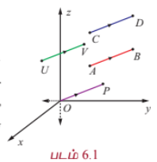

$\overrightarrow{AB}$ என்ற கோட்டுத்துண்டின் நீளம் $\vec{v}$ என்ற வெக்டரின் எண்ணளவாகும், மற்றும் $A$ -இல் இருந்து $B$ -ன் திசையானது $\vec{v}$ என்ற வெக்டரின் திசையாகும். எனவே, ஒரு வெக்டரை $\vec{v}$ அல்லது $\overrightarrow{AB}$ எனக் குறிப்பிடலாம். $\mathbb{R}^3$ -ல் $\overrightarrow{AB}$ -ன் நீளம் $\overrightarrow{CD}$ -ன் நீளத்திற்குச் சமமாகவும், $A$ -இல் இருந்து $B$ -ன் திசையும் $C$ -இல் இருந்து $D$ -இன் திசையும் ஒரே திசையாகவும் இருந்தால், இருந்தால் மட்டுமே $\overrightarrow{AB}$ மற்றும் $\overrightarrow{CD}$ என்ற இரு வெக்டர்கள் சமவெக்டர்கள் எனப்படும். இதனை $\overrightarrow{AB} = \overrightarrow{CD}$ என எழுதுவோம். இங்கு $\overrightarrow{CD}$ என்பது $\overrightarrow{AB}$ -ன் நகர்வு எனப்படும்.

$\mathbb{R}^3$ -ல் உள்ள எந்தவொரு வெக்டர் $\overrightarrow{AB}$ -யையும் $\mathbb{R}^3$ -ல் எங்கு வேண்டுமானாலும் நகர்த்தி, $U \in \mathbb{R}^3$ என்ற புள்ளியை தொடக்கப்புள்ளியாகவும் $V \in \mathbb{R}^3$ என்ற புள்ளியை முடிவுப் புள்ளியாகவும் கொண்ட ஒரு வெக்டருக்குச் சமமாக $\overrightarrow{AB} = \overrightarrow{UV}$ எனுமாறு எழுத முடியும் எனக் காண்கிறோம்.

குறிப்பாக, $\mathbb{R}^3$ -ன் ஆதிப்புள்ளி $O$ எனில், $P \in \mathbb{R}^3$ என்ற புள்ளியை $\overrightarrow{AB} = \overrightarrow{OP}$ எனுமாறு காணலாம். $\overrightarrow{OP}$ என்ற வெக்டர் $P$ என்ற புள்ளியின் **நிலை வெக்டர்** எனப்படும். மேலும், கொடுக்கப்பட்ட ஏதேனுமொரு வெக்டர் $\vec{v}$ -க்கு, $P \in \mathbb{R}^3$ என்ற தனித்த புள்ளியை $\overrightarrow{OP} = \vec{v}$ எனுமாறு காணலாம். $\overrightarrow{AB}$ என்ற வெக்டரின் தொடக்கப்புள்ளி $A$ -யும் முடிவுப்புள்ளி $B$ -யும் ஒன்றாக அமைந்தால், அவ்வெக்டர் **பூச்சிய வெக்டர்** எனப்படும். $(1,0,0), (0,1,0), (0,0,1)$, மற்றும் $(0,0,0)$ என்ற புள்ளிகளின் நிலை வெக்டர்களை முறையே $\hat{i}, \hat{j}, \hat{k}$ மற்றும் $\vec{0}$ ஆகிய வழக்கமான குறியீடுகளால் குறிப்பிடுகிறோம்.

கொடுக்கப்பட்ட ஒரு புள்ளி $(a_1, a_2, a_3) \in \mathbb{R}^3$ -ன் நிலைவெக்டர் $a_1\hat{i} + a_2\hat{j} + a_3\hat{k}$ எனப்படும். இது $(0,0,0)$ என்ற புள்ளியை தொடக்கப்புள்ளியாகவும், $(a_1, a_2, a_3)$ என்ற புள்ளியை முடிவுப்புள்ளியாகவும் கொண்ட கோட்டுத்துண்டாகும். அனைத்து மெய்யெண்களும் **திசையிலிகள்** எனப்படும்.

$A$ என்பது $(a_1, a_2, a_3)$ மற்றும் $B$ என்பது $(b_1, b_2, b_3)$ எனில் $\overrightarrow{AB}$ வெக்டரின் நீளம்

$$|\overrightarrow{AB}| = \sqrt{(b_1 - a_1)^2 + (b_2 - a_2)^2 + (b_3 - a_3)^2}$$

ஆகும். குறிப்பாக $(b_1, b_2, b_3)$ -ன் நிலைவெக்டர் $\vec{b}$ எனில், இதன் நீளம் $\sqrt{b_1^2 + b_2^2 + b_3^2}$ ஆகும். நீளம் 1 உடைய வெக்டரை **அலகு வெக்டர்** என்கிறோம். அலகு வெக்டரைக் குறிப்பிட்ட $\hat{u}$ என்ற குறியீட்டைப் பயன்படுத்துகிறோம். $\hat{i}, \hat{j}$, மற்றும் $\hat{k}$ ஆகியவை அலகு வெக்டர்கள் என்பதையும், நீளம் 0 கொண்ட ஒரேயொரு வெக்டர் $\vec{0}$ என்பதையும் நினைவில் கொள்க.

$\vec{a} = a_1\hat{i} + a_2\hat{j} + a_3\hat{k} \in \mathbb{R}^3$, $\vec{b} = b_1\hat{i} + b_2\hat{j} + b_3\hat{k} \in \mathbb{R}^3$ மற்றும் $\alpha \in \mathbb{R}$ எனில், முப்பரிமாண வெளியில் வெக்டர்களின் கூட்டல் மற்றும் திசையிலிப் பெருக்கல் ஆகியவற்றை பின்வருமாறு வரையறுக்கிறோம்.

$$\vec{a} + \vec{b} = (a_1 + b_1)\hat{i} + (a_2 + b_2)\hat{j} + (a_3 + b_3)\hat{k}$$

$$\alpha\vec{a} = (\alpha a_1)\hat{i} + (\alpha a_2)\hat{j} + (\alpha a_3)\hat{k}$$

$\vec{a} + \vec{b}$ -ன் வடிவக்கணித விளக்கம் காண, $A(a_1, a_2, a_3)$ மற்றும் $B(b_1, b_2, b_3)$ என்ற புள்ளிகளின் நிலைவெக்டர்கள் முறையே $\vec{a}$, $\vec{b}$ என்க. $A$ என்ற புள்ளியை தொடக்கப் புள்ளியாகவும், பொருத்தமான ஒரு புள்ளி $(c_1, c_2, c_3) \in \mathbb{R}^3$ யை முடிவுப்புள்ளியாகவும் கொண்ட வெக்டருக்கு நிலைவெக்டர் $\vec{b}$ யை நகர்த்தினால் படம் (6.2), $(c_1, c_2, c_3)$ புள்ளியின் நிலைவெக்டர் $\vec{c}$ ஆனது $\vec{a} + \vec{b}$ யைக் குறிக்கும்.

$\alpha\vec{a}$ எனும் வெக்டர் $\vec{a}$ எனும் வெக்டருக்கு இணையாக உள்ள வெக்டராகும். $|\alpha| > 1$ எனில் $\vec{a}$ -ன் நீளம் $|\alpha|$ மடங்கு பெரிதாக்கப்படுகிறது. $0 < |\alpha| < 1$ எனில் $\vec{a}$ -ன் நீளம் $|\alpha|$ மடங்கு குறுக்கப்படுகிறது. $\alpha < 0$ எனில் $\alpha\vec{a}$ -ன் எண்ணளவு $\vec{a}$ -ன் எண்ணளவைப் போல் $|\alpha|$ மடங்காகவும் $\alpha\vec{a}$ -ன் திசை $\vec{a}$ -ன் திசைக்கு எதிர்த்திசையிலும் இருக்கும். குறிப்பாக $\alpha = -1$ எனில் $\alpha\vec{a} = -\vec{a}$ என்ற வெக்டரின் நீளமானது $\vec{a}$ -ன் நீளத்திற்குச் சமமாகவும் $\vec{a}$ -ன் திசைக்கு எதிர்திசையிலும் அமையும். படம். 6.3

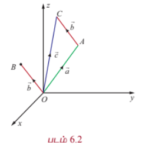
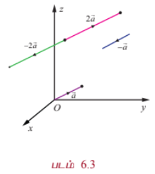

### 6.3 திசையிலிப் பெருக்கல் மற்றும் வெக்டர் பெருக்கல்
### (Scalar Product and Vector Product)

முன் வகுப்பில் கற்ற திசையிலிப் பெருக்கல் மற்றும் வெக்டர் பெருக்கல் ஆகியவற்றை நினைவு கூர்வோம்.

#### வரையறை 6.1

$\vec{a} = a_1\hat{i} + a_2\hat{j} + a_3\hat{k}$, $\vec{b} = b_1\hat{i} + b_2\hat{j} + b_3\hat{k}$ என்ற இரு வெக்டர்களின் **திசையிலிப் பெருக்கல்** (அல்லது **புள்ளிப் பெருக்கல்**)

$$\vec{a} \cdot \vec{b} = a_1b_1 + a_2b_2 + a_3b_3$$

என வரையறுக்கப்படுகிறது.

மேலும், $\vec{a} = a_1\hat{i} + a_2\hat{j} + a_3\hat{k}$, $\vec{b} = b_1\hat{i} + b_2\hat{j} + b_3\hat{k}$ என்ற இரு வெக்டர்களின் **வெக்டர் பெருக்கல்** அல்லது **குறுக்குப் பெருக்கல்**

$$\vec{a} \times \vec{b} = \begin{vmatrix}
\hat{i} & \hat{j} & \hat{k} \\
a_1 & a_2 & a_3 \\
b_1 & b_2 & b_3
\end{vmatrix}$$

என வரையறுக்கப்படுகிறது.

**குறிப்பு** $\vec{a} \cdot \vec{b}$ ஒரு திசையிலியாகும், மற்றும் $\vec{a} \times \vec{b}$ ஒரு வெக்டராகும்.

---

### 6.3.1 வடிவக்கணித விளக்கம் (Geometrical interpretation)

$\vec{a}$ என்பது ஏதேனுமொரு வெக்டர் மற்றும் $\hat{n}$ ஒரு அலகு வெக்டர் எனில் $\hat{n}$ -ன் மீதான $\vec{a}$ -ன் வீழல் $\vec{a} \cdot \hat{n}$ ஆகும். $\vec{a}$ மற்றும் $\hat{n}$ ஆகியவற்றுக்கு இடைப்பட்ட கோணம் குறுங்கோணம் (படம் 6.4) எனில், $\vec{a} \cdot \hat{n}$ -ன் மதிப்பு மிகை மதிப்பாகும். $\vec{a}$ மற்றும் $\hat{n}$ ஆகியவற்றுக்கு இடைப்பட்ட கோணம் விரிகோணம் எனில், $\vec{a} \cdot \hat{n}$ -ன் மதிப்பு குறை மதிப்பாகும். (படம் 6.5).

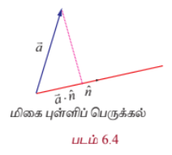
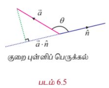

$\vec{a}$, $\vec{b}$ என்பன ஏதேனுமிரு பூச்சியமற்ற வெக்டர்கள் எனில்,

$$\vec{a} \cdot \vec{b} = |\vec{a}| \left( |\vec{b}| \cos\theta \right) = |\vec{b}| \left( |\vec{a}| \cos\theta \right)$$

என எழுதலாம். எனவே, $\vec{a} \cdot \vec{b}$ என்பது $\vec{b}$ –ன் திசையில் $\vec{a}$ –ன் வீழலைக் காணும் போது கிடைக்கும் கோட்டுத்துண்டின் நீளம் அல்லது $\vec{a}$ –ன் திசையில் $\vec{b}$ –ன் வீழலைக் காணும் போது கிடைக்கும் கோட்டுத்துண்டின் நீளம் ஆகும். மேலும்,

$$\vec{a} \cdot \vec{b} = |\vec{a}||\vec{b}|\cos\theta$$

இங்கு $\theta$ என்பது $\vec{a}$, $\vec{b}$ எனும் வெக்டர்களுக்கு இடைப்பட்ட கோணம் ஆகும்.

$\vec{a} \times \vec{b}$ என்பது, $\vec{0}$ ஆகவோ அல்லது $\vec{a}$, $\vec{b}$ என்ற வெக்டர்களுக்கு இணையாக உள்ள தளத்திற்குச் செங்குத்தாகவும், $\vec{a}$, $\vec{b}$ என்ற வெக்டர்களை ஒரு புள்ளியில் சந்திக்கும் அடுத்தடுத்த பக்கங்களாகக் கொண்ட இணைகரத்தின் பரப்பளவினை எண்ணளவாகவும் கொண்ட வெக்டராகும். $\vec{a}$, $\vec{b}$ எனும் பூச்சியமற்ற வெக்டர்களுக்கு இடைப்பட்ட கோணம் $\theta$ எனில், $\vec{a} \times \vec{b}$ -ன் எண்ணளவினை

$$|\vec{a} \times \vec{b}| = |\vec{a}||\vec{b}||\sin\theta|$$

எனும் சூத்திரத்தைப் பயன்படுத்திக் காணலாம்.

ஒரே தொடக்கப்புள்ளியைப் பெற்றுள்ள இரண்டு வெக்டர்கள் ஒரே தொடக்கப்புள்ளி வெக்டர்கள் அல்லது ஒரு முனையில் சந்திக்கும் வெக்டர்கள் எனப்படும்.

---

### குறிப்புரை

(1) $\vec{a}$, $\vec{b}$ எனும் இரண்டு பூச்சியமற்ற வெக்டர்களுக்கு இடைப்பட்ட கோணம்

$$\theta = \cos^{-1}\left(\frac{\vec{a} \cdot \vec{b}}{|\vec{a}||\vec{b}|}\right)$$

(2) $\vec{a}$, $\vec{b}$ எனும் இரண்டு வெக்டர்களுக்கு இடைப்பட்ட கோணம் $0$ அல்லது $\pi$ எனில், அவ்வெக்டர்கள் இணையானவை.

(3) $\vec{a}$, $\vec{b}$ எனும் இரண்டு வெக்டர்களுக்கு இடைப்பட்ட கோணம் $\frac{\pi}{2}$ அல்லது $\frac{3\pi}{2}$ எனில், அவ்வெக்டர்கள் செங்குத்தானவை.

### பண்பு

(1) $\vec{a}$, $\vec{b}$ என்பன ஏதேனுமிரு வெக்டர்கள் என்க. பின்னர்,

- $\vec{a} \cdot \vec{b} = 0$ என இருந்தால், இருந்தால் மட்டுமே $\vec{a}$, $\vec{b}$ என்பவை ஒன்றுக்கொன்று **செங்குத்தானவை** ஆகும்.

- $\vec{a} \times \vec{b} = \vec{0}$ என இருந்தால், இருந்தால் மட்டுமே $\vec{a}$, $\vec{b}$ என்பவை ஒன்றுக்கொன்று **இணையானவை** ஆகும்.

(2) $\vec{a}, \vec{b}, \vec{c}$ என்பன ஏதேனும் மூன்று வெக்டர்கள் மற்றும் $\alpha$ ஒரு திசையிலி எனில்,

$$\vec{a} \cdot \vec{b} = \vec{b} \cdot \vec{a}, \quad \vec{a} \cdot (\vec{b} + \vec{c}) = \vec{a} \cdot \vec{b} + \vec{a} \cdot \vec{c}, \quad (\alpha\vec{a}) \cdot \vec{b} = \alpha(\vec{a} \cdot \vec{b}) = \vec{a} \cdot (\alpha\vec{b})$$

$$\vec{a} \times \vec{b} = -\vec{b} \times \vec{a}, \quad \vec{a} \times (\vec{b} + \vec{c}) = \vec{a} \times \vec{b} + \vec{a} \times \vec{c}, \quad (\alpha\vec{a}) \times \vec{b} = \alpha(\vec{a} \times \vec{b}) = \vec{a} \times (\alpha\vec{b})$$

---

### 6.3.2 முக்கோணவியலில் புள்ளி மற்றும் குறுக்குப் பெருக்கல்களின் பயன்பாடு
### (Application of dot and cross products in plane Trigonometry)

#### எடுத்துக்காட்டு 6.1 (கொசைன் சூத்திரம்) (Cosine formulae)

வழக்கமான குறியீடுகளுடன், முக்கோணம் $ABC$-ல், வெக்டர்களைப் பயன்படுத்தி பின்வருவனவற்றை நிறுவுக.

(i) $a^2 = b^2 + c^2 - 2bc\cos A$

(ii) $b^2 = c^2 + a^2 - 2ca\cos B$

(iii) $c^2 = a^2 + b^2 - 2ab\cos C$

#### தீர்வு

வழக்கமான குறியீடுகளுடன் முக்கோணம் $ABC$-ல் $\overrightarrow{BC} = \vec{a}$, $\overrightarrow{CA} = \vec{b}$ மற்றும் $\overrightarrow{AB} = \vec{c}$ என்க.

எனவே, $|\overrightarrow{BC}| = a$, $|\overrightarrow{CA}| = b$, $|\overrightarrow{AB}| = c$ மற்றும் $\overrightarrow{BC} + \overrightarrow{CA} + \overrightarrow{AB} = \vec{0}$.

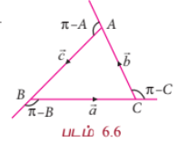

எனவே, $\overrightarrow{BC} = -\overrightarrow{CA} - \overrightarrow{AB}$.

$\overrightarrow{BC} \cdot \overrightarrow{BC} = (-\overrightarrow{CA} - \overrightarrow{AB}) \cdot (-\overrightarrow{CA} - \overrightarrow{AB})$

$$\Rightarrow |\overrightarrow{BC}|^2 = |\overrightarrow{CA}|^2 + |\overrightarrow{AB}|^2 + 2\overrightarrow{CA} \cdot \overrightarrow{AB}$$

$$\Rightarrow a^2 = b^2 + c^2 + 2bc\cos(\pi - A)$$

$$\Rightarrow a^2 = b^2 + c^2 - 2bc\cos A.$$

முடிவுகள் (ii) மற்றும் (iii) ஆகியவற்றை இதேபோல் நிறுவலாம்.

---

#### எடுத்துக்காட்டு 6.2

வழக்கமான குறியீடுகளுடன், முக்கோணம் $ABC$-ல், வெக்டர்களைப் பயன்படுத்தி பின்வருவனவற்றை நிறுவுக.

(i) $a = b\cos C + c\cos B$

(ii) $b = c\cos A + a\cos C$

(iii) $c = a\cos B + b\cos A$

#### தீர்வு

வழக்கமான குறியீடுகளுடன் முக்கோணம் $ABC$-ல், $\overrightarrow{BC} = \vec{a}$, $\overrightarrow{CA} = \vec{b}$, மற்றும் $\overrightarrow{AB} = \vec{c}$ என்க.

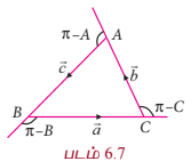

எனவே, $|\overrightarrow{BC}| = a$, $|\overrightarrow{CA}| = b$, $|\overrightarrow{AB}| = c$ மற்றும் $\overrightarrow{BC} + \overrightarrow{CA} + \overrightarrow{AB} = \vec{0}$.

எனவே, $\overrightarrow{BC} = -\overrightarrow{CA} - \overrightarrow{AB}$.

$\overrightarrow{BC}$ -ஆல் இருபுறமும் புள்ளிப்பெருக்கல் காண. நாம் பெறுவது

$$\overrightarrow{BC} \cdot \overrightarrow{BC} = -\overrightarrow{BC} \cdot \overrightarrow{CA} - \overrightarrow{BC} \cdot \overrightarrow{AB}$$

$$\Rightarrow |\overrightarrow{BC}|^2 = -|\overrightarrow{BC}||\overrightarrow{CA}|\cos(\pi - C) - |\overrightarrow{BC}||\overrightarrow{AB}|\cos(\pi - B)$$

$$\Rightarrow a^2 = ab\cos C + ac\cos B$$

எனவே $a = b\cos C + c\cos B$. முடிவுகள் (ii) மற்றும் (iii) ஆகியவற்றை இதேபோல் நிறுவலாம்.

---

#### எடுத்துக்காட்டு 6.3

வெக்டர் முறையில், $\cos(\alpha + \beta) = \cos\alpha\cos\beta - \sin\alpha\sin\beta$ என நிறுவுக.

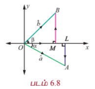

#### தீர்வு

$\vec{a} = \overrightarrow{OA}$ மற்றும் $\vec{b} = \overrightarrow{OB}$ என்ற அலகு வெக்டர்கள் $x$ -அச்சின் மிகை திசையுடன் முறையே $\alpha$, $\beta$ என்ற கோணங்களை ஏற்படுத்துகிறது என்க. இங்கு $A, B$ என்பன படம் 6.8-ல் காட்டப்பட்டுள்ளன.

$AL$ மற்றும் $BM$ என்பவற்றை $x$ -அச்சுக்கு செங்குத்தாக வரைக.

ஆகவே, $|OL| = |OA|\cos\alpha = \cos\alpha$, $|LA| = |OA|\sin\alpha = \sin\alpha$.

$\overrightarrow{OL} = |OL|\hat{i} = \cos\alpha\hat{i}$, $\overrightarrow{LA} = -\sin\alpha\hat{j}$.

எனவே, $\hat{a} = \overrightarrow{OA} = \overrightarrow{OL} + \overrightarrow{LA} = \cos\alpha\hat{i} - \sin\alpha\hat{j}$. ... (1)

இதேபோல், $\hat{b} = \cos\beta\hat{i} + \sin\beta\hat{j}$ ... (2)

$\hat{a}$, $\hat{b}$ வெக்டர்களுக்கு இடைப்பட்டக் கோணம் $\alpha + \beta$ என்பதால்,

$$\hat{a} \cdot \hat{b} = |\hat{a}||\hat{b}|\cos(\alpha + \beta) = \cos(\alpha + \beta)$$

... (3)

மாறாக, சமன்பாடுகள் (1) மற்றும் (2)-லிருந்து

$$\hat{a} \cdot \hat{b} = (\cos\alpha\hat{i} - \sin\alpha\hat{j}) \cdot (\cos\beta\hat{i} + \sin\beta\hat{j}) = \cos\alpha\cos\beta - \sin\alpha\sin\beta$$

... (4)

சமன்பாடுகள் (3) மற்றும் (4)லிருந்து, $\cos(\alpha + \beta) = \cos\alpha\cos\beta - \sin\alpha\sin\beta$.

---

#### எடுத்துக்காட்டு 6.4

வழக்கமான குறியீடுகளுடன், முக்கோணம் $ABC$-ல் வெக்டர்களைப் பயன்படுத்தி

$$\frac{a}{\sin A} = \frac{b}{\sin B} = \frac{c}{\sin C}$$

என நிறுவுக.

#### தீர்வு

வழக்கமான குறியீடுகளுடன், முக்கோணம் $ABC$ -ல், $\overrightarrow{BC} = \vec{a}$, $\overrightarrow{CA} = \vec{b}$, மற்றும் $\overrightarrow{AB} = \vec{c}$ என்க.

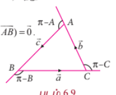

$|\overrightarrow{BC}| = a$, $|\overrightarrow{CA}| = b$, மற்றும் $|\overrightarrow{AB}| = c$ என்க.

எனவே, $\triangle ABC$ -ல், $\overrightarrow{BC} + \overrightarrow{CA} + \overrightarrow{AB} = \vec{0}$ என்பதால்

$$\overrightarrow{BC} \times (\overrightarrow{BC} + \overrightarrow{CA} + \overrightarrow{AB}) = \vec{0}$$

$$\overrightarrow{BC} \times \overrightarrow{CA} = \overrightarrow{AB} \times \overrightarrow{BC}$$

... (1)

இதேபோல் $\overrightarrow{BC} + \overrightarrow{CA} + \overrightarrow{AB} = \vec{0}$ என்பதால்,

$$\overrightarrow{CA} \times (\overrightarrow{BC} + \overrightarrow{CA} + \overrightarrow{AB}) = \vec{0}$$

$$\overrightarrow{BC} \times \overrightarrow{CA} = \overrightarrow{CA} \times \overrightarrow{AB}$$

... (2)

சமன்பாடுகள் (1) மற்றும் (2)-லிருந்து

$$\overrightarrow{AB} \times \overrightarrow{BC} = \overrightarrow{CA} \times \overrightarrow{AB} = \overrightarrow{BC} \times \overrightarrow{CA}$$

ஆகவே,

$$|\overrightarrow{AB} \times \overrightarrow{BC}| = |\overrightarrow{CA} \times \overrightarrow{AB}| = |\overrightarrow{BC} \times \overrightarrow{CA}|$$

$$ca\sin(\pi - B) = bc\sin(\pi - A) = ab\sin(\pi - C)$$

அதாவது, $ca\sin B = bc\sin A = ab\sin C$. இதனை $abc$ -ஆல் வகுத்தால்,

$$\frac{\sin A}{a} = \frac{\sin B}{b} = \frac{\sin C}{c}$$

அல்லது

$$\frac{a}{\sin A} = \frac{b}{\sin B} = \frac{c}{\sin C}$$

எனக் கிடைக்கிறது.

---

#### எடுத்துக்காட்டு 6.5

வெக்டர் முறையில் $\sin(\alpha - \beta) = \sin\alpha\cos\beta - \cos\alpha\sin\beta$ என நிறுவுக.

#### தீர்வு

$x$ -அச்சின் மிகை திசையுடன் $\hat{a} = \overrightarrow{OA}$, $\hat{b} = \overrightarrow{OB}$ என்ற அலகு வெக்டர்கள் முறையே $\alpha$, $\beta$ என்ற கோணங்களை ஏற்படுத்துகிறது என்க. இங்கு $A$, $B$ என்பன படம் 6.10-ல் காட்டப்பட்டுள்ளன. ஆகவே $\hat{a} = \cos\alpha\hat{i} + \sin\alpha\hat{j}$ மற்றும் $\hat{b} = \cos\beta\hat{i} + \sin\beta\hat{j}$.

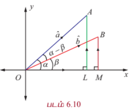

$\hat{a}$, $\hat{b}$ வெக்டர்களுக்கு இடைப்பட்டக் கோணம் $\alpha - \beta$ மற்றும் $\hat{a}, \hat{b}, \hat{k}$ என்ற வெக்டர்கள் வலக்கை முறையில் அமைந்துள்ளதால்,

$$\hat{b} \times \hat{a} = |\hat{b}||\hat{a}|\sin(\alpha - \beta)\hat{k} = \sin(\alpha - \beta)\hat{k}$$

... (1)

மாறாக,

$$\hat{b} \times \hat{a} = \begin{vmatrix}
\hat{i} & \hat{j} & \hat{k} \\
\cos\beta & \sin\beta & 0 \\
\cos\alpha & \sin\alpha & 0
\end{vmatrix} = (\sin\alpha\cos\beta - \cos\alpha\sin\beta)\hat{k}$$

... (2)

ஆகவே, சமன்பாடுகள் (1) மற்றும் (2)-லிருந்து

$$\sin(\alpha - \beta) = \sin\alpha\cos\beta - \cos\alpha\sin\beta$$

---

### 6.3.3 வடிவக் கணிதத்தில் புள்ளி மற்றும் குறுக்குப் பெருக்கல்களின் பயன்பாடு
### (Application of dot and cross products in Geometry)

#### எடுத்துக்காட்டு 6.6 (அபோலோனியஸ் தேற்றம்) (Apollonius's theorem)

முக்கோணம் $ABC$-ல், $BC$ என்ற பக்கத்தின் நடுப்புள்ளி $D$ எனில்,

$$|\overrightarrow{AB}|^2 + |\overrightarrow{AC}|^2 = 2(|\overrightarrow{AD}|^2 + |\overrightarrow{BD}|^2)$$

என வெக்டர் முறையில் நிரூபிக்க.

#### தீர்வு

ஆதிப்புள்ளி $A$ என்க. $B$ -யின் நிலைவெக்டர் $\vec{b}$ மற்றும் $C$ -ன் நிலைவெக்டர் $\vec{c}$ என்க. $BC$ -ன் நடுப்புள்ளி $D$ என்பதால் $D$ -ன் நிலை வெக்டர் $\frac{\vec{b} + \vec{c}}{2}$ ஆகும். எனவே, $\overrightarrow{AD} = \frac{\vec{b} + \vec{c}}{2}$ ஆகும்.

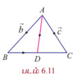

இப்பொழுது,

$$|\overrightarrow{AD}|^2 = \overrightarrow{AD} \cdot \overrightarrow{AD} = \frac{1}{4}(\vec{b} + \vec{c}) \cdot (\vec{b} + \vec{c}) = \frac{1}{4}(|\vec{b}|^2 + |\vec{c}|^2 + 2\vec{b} \cdot \vec{c})$$

... (1)

மேலும்,

$$\overrightarrow{BD} = \overrightarrow{AD} - \overrightarrow{AB} = \frac{\vec{b} + \vec{c}}{2} - \vec{b} = \frac{\vec{c} - \vec{b}}{2}$$

எனவே,

$$|\overrightarrow{BD}|^2 = \overrightarrow{BD} \cdot \overrightarrow{BD} = \frac{1}{4}(\vec{c} - \vec{b}) \cdot (\vec{c} - \vec{b}) = \frac{1}{4}(|\vec{b}|^2 + |\vec{c}|^2 - 2\vec{b} \cdot \vec{c})$$

... (2)

சமன்பாடுகள் (1) மற்றும் (2) ஆகியவற்றின் கூடுதல் காண, நாம் பெறுவது,

$$|\overrightarrow{AD}|^2 + |\overrightarrow{BD}|^2 = \frac{1}{2}(|\vec{b}|^2 + |\vec{c}|^2)$$

$$\Rightarrow |\overrightarrow{AB}|^2 + |\overrightarrow{AC}|^2 = 2(|\overrightarrow{AD}|^2 + |\overrightarrow{BD}|^2)$$

---

#### எடுத்துக்காட்டு 6.7

ஒரு முக்கோணத்தின் உச்சிகளிலிருந்து அவற்றிற்கு எதிரேயுள்ள பக்கங்களுக்கு வரையப்படும் செங்குத்துக் கோடுகள் ஒரு புள்ளியில் சந்திக்கும் என நிறுவுக.

#### தீர்வு

முக்கோணம் $ABC$-ல், $AD, BE$ என்ற செங்குத்துக்கோடுகள் வெட்டும் புள்ளி $O$ என்க. $AB$-ஐ $F$-ல் சந்திக்குமாறு $CO$வை நீட்டுக. ஆதிப்புள்ளி $O$ என்க. $\overrightarrow{OA} = \vec{a}$, $\overrightarrow{OB} = \vec{b}$ மற்றும் $\overrightarrow{OC} = \vec{c}$ என்க.

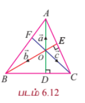

$\overrightarrow{AD}$ என்பது $\overrightarrow{BC}$ க்குச் செங்குத்து என்பதால், $\overrightarrow{OA}$ என்பது $\overrightarrow{BC}$ -க்குச் செங்குத்தாகும். எனவே, $\overrightarrow{OA} \cdot \overrightarrow{BC} = 0$.

அதாவது, $\vec{a} \cdot (\vec{c} - \vec{b}) = 0$,

$$\Rightarrow \vec{a} \cdot \vec{c} - \vec{a} \cdot \vec{b} = 0$$

... (1)

இதேபோன்று, $\overrightarrow{BE}$ என்பது $\overrightarrow{CA}$ -க்குச் செங்குத்து என்பதால், $\overrightarrow{OB}$ என்பது $\overrightarrow{CA}$ க்குச் செங்குத்தாகும். எனவே, $\overrightarrow{OB} \cdot \overrightarrow{CA} = 0$.

அதாவது, $\vec{b} \cdot (\vec{a} - \vec{c}) = 0$,

$$\Rightarrow \vec{a} \cdot \vec{b} - \vec{b} \cdot \vec{c} = 0$$

... (2)

சமன்பாடுகள் (1) மற்றும் (2) ஆகியவற்றின் கூடுதல் காண, நாம் பெறுவது

$$\vec{a} \cdot \vec{c} - \vec{b} \cdot \vec{c} = 0$$

$$\Rightarrow \vec{c} \cdot (\vec{a} - \vec{b}) = 0$$

அதாவது, $\overrightarrow{OC} \cdot \overrightarrow{BA} = 0$. ஆகவே, $\overrightarrow{OC}$ என்பது $\overrightarrow{BA}$ -க்குச் செங்குத்து என்பதால், $\overrightarrow{CF}$ என்பது $\overrightarrow{AB}$ க்குச் செங்குத்தாகும். அதாவது, $C$ -யிலிருந்து பக்கம் $AB$ -க்கு வரையப்படும் செங்குத்துக் கோடு $O$ வழியாகச் செல்கிறது. எனவே, ஒரு முக்கோணத்தின் குத்துக்கோடுகள் ஒரு புள்ளி வழிச் செல்லும் கோடுகளாகும்.

---

#### எடுத்துக்காட்டு 6.8

முக்கோணம் $ABC$ -ல், $BC, CA$, மற்றும் $AB$ என்ற பக்கங்களின் மையப்புள்ளிகள் முறையே $D, E, F$ எனில், $\triangle DEF$ -ன் பரப்பு $= \frac{1}{4}(\triangle ABC$ -ன் பரப்பு) என வெக்டர் முறையில் நிறுவுக.

#### தீர்வு

முக்கோணம் $ABC$ -ல் ஆதிப்புள்ளி $A$ என்க. எனவே, $D, E, F$ என்ற புள்ளிகளின் நிலைவெக்டர்கள் முறையே $\frac{\overrightarrow{AB}}{2}$, $\frac{\overrightarrow{AC}}{2}$, $\frac{\overrightarrow{AB} + \overrightarrow{AC}}{2}$ ஆகும். $\overrightarrow{AB}, \overrightarrow{AC}$ என்ற வெக்டர்களை அடுத்தடுத்த பக்கங்களாகக் கொண்ட இணைகரத்தின் பரப்பு $|\overrightarrow{AB} \times \overrightarrow{AC}|$ என்பதால், முக்கோணம் $\triangle ABC$ -ன் பரப்பு $\frac{1}{2}|\overrightarrow{AB} \times \overrightarrow{AC}|$ ஆகும்.

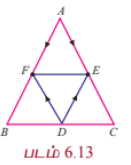

இதேபோன்று, $\triangle DEF$ -ஐக் கருதுக.

$\triangle DEF$ -ன் பரப்பு $= \frac{1}{2}|\overrightarrow{DE} \times \overrightarrow{DF}|$

$= \frac{1}{2}|(\overrightarrow{AE} - \overrightarrow{AD}) \times (\overrightarrow{AF} - \overrightarrow{AD})|$

$= \frac{1}{2}\left|\left(\frac{\overrightarrow{AC}}{2} - \frac{\overrightarrow{AB}}{2}\right) \times \left(\frac{\overrightarrow{AB} + \overrightarrow{AC}}{2} - \frac{\overrightarrow{AB}}{2}\right)\right|$

$= \frac{1}{2}\left|\left(\frac{\overrightarrow{AC} - \overrightarrow{AB}}{2}\right) \times \left(\frac{\overrightarrow{AC}}{2}\right)\right|$

$= \frac{1}{4}\left(\frac{1}{2}|\overrightarrow{AB} \times \overrightarrow{AC}|\right)$

$= \frac{1}{4}(\triangle ABC$ -ன் பரப்பு).

---

### 6.3.4 இயற்பியலில் புள்ளி மற்றும் குறுக்குப் பெருக்கல்களின் பயன்பாடு
### (Application of dot and cross product in Physics)

#### வரையறை 6.2

விசை $\vec{F}$ -ன் செயல்பாட்டினால் ஒரு துகளானது ஒரு புள்ளியிலிருந்து மற்றொரு புள்ளிக்கு நகரும்போது அதன் இடப்பெயர்ச்சி வெக்டர் $\vec{d}$ எனில், அவ்விசை செய்த **வேலை** $w = \vec{F} \cdot \vec{d}$ ஆகும்.

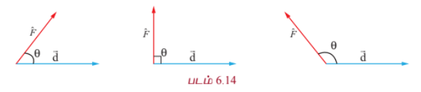

ஒரு விசை ஏற்படுத்தும் கோணம் குறுங்கோணம், செங்கோணம் மற்றும் விரிகோணம் எனில், அவ்விசை செய்யும் வேலை முறையே மிகை, பூச்சியம், மற்றும் குறை ஆகும்.

---

#### எடுத்துக்காட்டு 6.9

ஒரு துகள் $(4, -3, 2)$ என்ற புள்ளியிலிருந்து $(6, 1, -3)$ என்ற புள்ளிக்கு $2\hat{i} + 5\hat{j} + 6\hat{k}$ மற்றும் $-\hat{i} - \hat{j} - 2\hat{k}$ என்ற மாறாத விசைகளின் செயல்பாட்டினால் நகர்த்தப்பட்டால், அவ்விசைகள் செய்த மொத்த வேலையைக் காண்க.

#### தீர்வு

கொடுக்கப்பட்ட விசைகளின் விளைவு விசை

$$\vec{F} = (2\hat{i} + 5\hat{j} + 6\hat{k}) + (-\hat{i} - \hat{j} - 2\hat{k}) = \hat{i} + 4\hat{j} + 4\hat{k}$$

$A$, $B$ என்பவை குறிக்கும் புள்ளிகள் முறையே $(4, -3, 2)$, $(6, 1, -3)$ என்க. துகளின் இடப்பெயர்ச்சி வெக்டர்

$$\vec{d} = \overrightarrow{AB} = \overrightarrow{OB} - \overrightarrow{OA} = (6\hat{i} + \hat{j} - 3\hat{k}) - (4\hat{i} - 3\hat{j} + 2\hat{k}) = 2\hat{i} + 4\hat{j} - 5\hat{k}$$

எனவே, விசைகள் செய்த மொத்த வேலை

$$w = \vec{F} \cdot \vec{d} = (\hat{i} + 4\hat{j} + 4\hat{k}) \cdot (2\hat{i} + 4\hat{j} - 5\hat{k}) = 2 + 16 - 20 = -2$$

அலகுகள்.

---

#### எடுத்துக்காட்டு 6.10

ஒரு துகள் $(1, 3, -1)$ என்ற புள்ளியிலிருந்து $(4, -1, \lambda)$ என்ற புள்ளிக்கு $3\hat{i} - 2\hat{j} + 2\hat{k}$ மற்றும் $2\hat{i} + \hat{j} - \hat{k}$ என்ற விசைகளின் செயல்பாட்டினால் நகர்த்தப்படுகிறது. அவ்விசைகள் செய்த வேலை 16 அலகுகள் எனில், $\lambda$ -ன் மதிப்பைக் காண்க.

#### தீர்வு

கொடுக்கப்பட்ட விசைகளின் விளைவு விசை

$$\vec{F} = (3\hat{i} - 2\hat{j} + 2\hat{k}) + (2\hat{i} + \hat{j} - \hat{k}) = 5\hat{i} - \hat{j} + \hat{k}$$

துகளின் இடப்பெயர்ச்சி வெக்டர்

$$\vec{d} = (4\hat{i} - \hat{j} + \lambda\hat{k}) - (\hat{i} + 3\hat{j} - \hat{k}) = 3\hat{i} - 4\hat{j} + (\lambda + 1)\hat{k}$$

அவ்விசைகள் செய்த வேலை 16 அலகுகள் என்பதால், $\vec{F} \cdot \vec{d} = 16$.

அதாவது, $(5\hat{i} - \hat{j} + \hat{k}) \cdot (3\hat{i} - 4\hat{j} + (\lambda + 1)\hat{k}) = 16 \Rightarrow 15 + 4 + \lambda + 1 = 16$

எனவே, $\lambda = -4$ எனப் பெறுகிறோம்.

---

#### வரையறை 6.3

$\vec{F}$ என்ற விசையை, $\vec{r}$ -ஐ நிலைவெக்டராகக் கொண்ட புள்ளியில் உள்ள துகளின் மீது செயல்படுத்துவதால், அத்துகளின் மீதான **முறுக்குத்திறன்** அல்லது **திருப்புத்திறன்**

$$\vec{t} = \vec{r} \times \vec{F}$$

ஆகும். திருப்புவிசை என்பது சுழல் விசை எனவும் அழைக்கப்படும்.

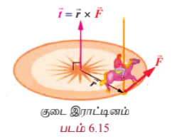

---

#### எடுத்துக்காட்டு 6.11

$2\hat{i} + \hat{j} - \hat{k}$ என்னும் விசை ஆதிப்புள்ளி வழியாகச் செயல்படுகிறது எனில், $(2,0,-1)$ என்ற புள்ளியைப் பொறுத்து அவ்விசையின் திருப்புவிசையின் எண்ணளவு மற்றும் திசைக் கொசைன்களைக் காண்க.

#### தீர்வு

$(2,0,-1)$ என்ற புள்ளியின் நிலை வெக்டர் $\overrightarrow{OA} = 2\hat{i} - \hat{k}$ எனில்,

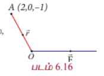

$$\vec{r} = \overrightarrow{AO} = -2\hat{i} + \hat{k}$$

கொடுக்கப்பட்ட விசை $\vec{F} = 2\hat{i} + \hat{j} - \hat{k}$. எனவே, திருப்புவிசை

$$\vec{t} = \vec{r} \times \vec{F} = \begin{vmatrix}
\hat{i} & \hat{j} & \hat{k} \\
-2 & 0 & 1 \\
2 & 1 & -1
\end{vmatrix} = -\hat{i} - 2\hat{k}$$

ஆகவே, திருப்புவிசையின் எண்ணளவு $|-\hat{i} - 2\hat{k}| = \sqrt{5}$ மற்றும் திசைக்கொசைன்கள் $\left(-\frac{1}{\sqrt{5}}, 0, -\frac{2}{\sqrt{5}}\right)$ ஆகும்.

---

### பயிற்சி 6.1

1. ஒரு வட்டத்தின் மையத்திலிருந்து அவ்வட்டத்தின் ஒரு நாணின் மையப்புள்ளிக்கு வரையப்படும் கோடு அந்நாணிற்கு செங்குத்தாகும் என வெக்டர் முறையில் நிறுவுக.

2. ஓர் இருசமப்பக்க முக்கோணத்தின் அடிப்பக்கத்திற்கு வரையப்படும் நடுக்கோடு, அப்பக்கத்திற்கு செங்குத்தாகும் என வெக்டர் முறையில் நிறுவுக.

3. வெக்டர் முறையில், ஓர் அரைவட்டத்தில் அமையும் கோணம் ஒரு செங்கோணம் என நிறுவுக.

4. ஒரு சாய்சதுரத்தின் மூலை விட்டங்கள் ஒன்றையொன்று செங்குத்தாக இருசமக்கூறிடும் என வெக்டர் முறையில் நிறுவுக.

5. ஓர் இணைகரத்தின் மூலை விட்டங்கள் சமம் எனில், அந்த இணைகரம் ஒரு செவ்வகமாகும் என வெக்டர் முறையில் நிறுவுக.

6. வெக்டர் முறையில், $AC$ மற்றும் $BD$ ஆகியவற்றை மூலைவிட்டங்களாகக் கொண்ட நாற்கரம் $ABCD$-ன் பரப்பு $\frac{1}{2}|\overrightarrow{AC} \times \overrightarrow{BD}|$ என நிறுவுக.

7. ஒரே அடிப்பக்கத்தின் மீதமைந்த இரு இணைகோடுகளுக்கு இடைப்பட்ட இணைகரங்களின் பரப்பளவுகள் சமமானவை என வெக்டர் முறையில் நிறுவுக.

8. $\triangle ABC$ -ன் நடுக்கோட்டு மையம் $G$ எனில், வெக்டர் முறையில்,

   $(\triangle GAB$ -ன் பரப்பு) $= (\triangle GBC$ -ன் பரப்பு) $= (\triangle GCA$ -ன் பரப்பு) $= \frac{1}{3}(\triangle ABC$ -ன் பரப்பு)$

   என நிறுவுக.

9. வெக்டர் முறையில் $\cos(\alpha - \beta) = \cos\alpha\cos\beta + \sin\alpha\sin\beta$ என நிறுவுக.

10. $\sin(\alpha + \beta) = \sin\alpha\cos\beta + \cos\alpha\sin\beta$ என வெக்டர் முறையில் நிறுவுக.

11. ஒரு துகள் $(1, 2, 3)$ எனும் புள்ளியிலிருந்து $(5, 4, 1)$ எனும் புள்ளிக்கு $8\hat{i} + 2\hat{j} - 6\hat{k}$ மற்றும் $6\hat{i} + 2\hat{j} - 2\hat{k}$ என்ற மாறாத விசைகளின் செயல்பாட்டினால் நகர்த்தப்பட்டால், அவ்விசைகள் செய்த மொத்த வேலையைக் காண்க.

12. முறையே $5\sqrt{2}$ மற்றும் $10\sqrt{2}$ அலகுகள் எண்ணளவு கொண்ட $3\hat{i} + 4\hat{j} + 5\hat{k}$ மற்றும் $10\hat{i} + 6\hat{j} - 8\hat{k}$ என்ற வெக்டர்களின் திசைகளில் அமைந்த விசைகள், ஒரு துகளை $4\hat{i} - 3\hat{j} - 2\hat{k}$ என்ற வெக்டரை நிலைவெக்டராகக் கொண்ட புள்ளியிலிருந்து $6\hat{i} + \hat{j} - 3\hat{k}$ என்ற வெக்டரை நிலைவெக்டராகக் கொண்ட புள்ளிக்கு நகர்த்துகிறது எனில், அவ்விசைகள் செய்த வேலையைக் காண்க.

13. $3\hat{i} + 4\hat{j} - 5\hat{k}$ என்னும் விசை $4\hat{i} + 2\hat{j} - 3\hat{k}$ என்ற வெக்டரை நிலைவெக்டராகக் கொண்ட புள்ளி வழியாகச் செயல்படுகிறது எனில், $2\hat{i} - 3\hat{j} + 4\hat{k}$ என்ற வெக்டரை நிலைவெக்டராகக் கொண்ட புள்ளியைப் பொறுத்து அவ்விசையின் திருப்புவிசையின் எண்ணளவு மற்றும் திசைக்கொசைன்களைக் காண்க.

14. $8\hat{i} - 6\hat{j} - 4\hat{k}$ என்ற வெக்டரை நிலை வெக்டராகக் கொண்ட புள்ளியில் செயல்படும் $-3\hat{i} + 6\hat{j} - 3\hat{k}$, $4\hat{i} - 10\hat{j} + 12\hat{k}$ மற்றும் $4\hat{i} + 7\hat{j}$ விசைகளின் திருப்புத்திறனை $18\hat{i} + 3\hat{j} + 9\hat{k}$ என்ற வெக்டரை நிலை வெக்டராகக் கொண்ட புள்ளியைப் பொறுத்துக் காண்க.

### 6.4 திசையிலி முப்பெருக்கல் (Scalar triple product)

#### வரையறை 6.4

$\vec{a}, \vec{b}, \vec{c}$ என்பன கொடுக்கப்பட்ட மூன்று வெக்டர்கள் எனில், $(\vec{a} \times \vec{b}) \cdot \vec{c}$ என்பது அவ்வெக்டர்களின் **திசையிலி முப்பெருக்கல்** எனப்படும். $(\vec{a} \times \vec{b}) \cdot \vec{c}$ ஒரு திசையிலியாகும்.

#### குறிப்புரை

(1) $\vec{a} \cdot \vec{b}$ என்பது ஒரு திசையிலியாதலால் $(\vec{a} \cdot \vec{b}) \times \vec{c}$ ஆனது பொருளற்றது.

(2) $\vec{a}, \vec{b}, \vec{c}$ என்பன கொடுக்கப்பட்ட மூன்று வெக்டர்கள் எனில், பின்வருவன அவற்றின் திசையிலி முப்பெருக்கல்கள் ஆகும்:

$(\vec{a} \times \vec{b}) \cdot \vec{c}, (\vec{b} \times \vec{c}) \cdot \vec{a}, (\vec{c} \times \vec{a}) \cdot \vec{b}, \vec{a} \cdot (\vec{b} \times \vec{c}), \vec{b} \cdot (\vec{c} \times \vec{a}), \vec{c} \cdot (\vec{a} \times \vec{b}),$

$(\vec{b} \times \vec{a}) \cdot \vec{c}, (\vec{c} \times \vec{b}) \cdot \vec{a}, (\vec{a} \times \vec{c}) \cdot \vec{b}, \vec{b} \cdot (\vec{a} \times \vec{c}), \vec{c} \cdot (\vec{b} \times \vec{a}), \vec{a} \cdot (\vec{c} \times \vec{b})$

---

### திசையிலி முப்பெருக்கலின் வடிவக்கணித விளக்கம்

### (Geometrical interpretation of scalar triple product)

$(\vec{a} \times \vec{b}) \cdot \vec{c}$ என்ற திசையிலி முப்பெருக்கலானது, $\vec{a}, \vec{b}$, மற்றும் $\vec{c}$ எனும் மூன்று வெக்டர்களை ஒரே புள்ளியில் சந்திக்கும் விளிம்புகளாகக் கொண்டு உருவாக்கப்படும் இணைகரத் திண்மத்தின் **கன அளவின் எண்ணளவாகும்**.

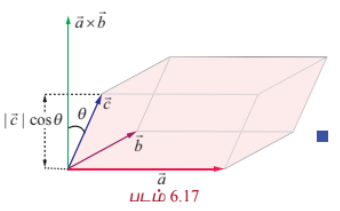

$(\vec{a} \times \vec{b})$ என்பது $\vec{a}, \vec{b}$ என்ற வெக்டர்களால் உருவாக்கப்படும் இணைகரத்தின் பரப்பளவின் எண்ணளவாகும். மேலும், $(\vec{a} \times \vec{b})$ என்ற வெக்டரின் திசையானது $\vec{a}$ மற்றும் $\vec{b}$ என்ற வெக்டர்களுக்கு இணையாக அமைந்துள்ள தளத்திற்குச் செங்குத்தானதாகும்.

எனவே, $|(\vec{a} \times \vec{b}) \cdot \vec{c}| = |\vec{a} \times \vec{b}| |\vec{c}| |\cos\theta|$ ஆகும். இங்கு, $\theta$ என்பது $\vec{a} \times \vec{b}$ மற்றும் $\vec{c}$ ஆகியவற்றுக்கு இடைப்பட்ட கோணம் ஆகும். படம் 6.17-ல் இருந்து, $\vec{a}, \vec{b}$ மற்றும் $\vec{c}$ எனும் மூன்று வெக்டர்களை ஒரே புள்ளியில் சந்திக்கும் விளிம்புகளாகக் கொண்டு அமைக்கப்படும் இணைகரத்திண்மத்தின் உயரம் $|\vec{c}| |\cos\theta|$ எனக்காண்கிறோம். ஆகவே, $|(\vec{a} \times \vec{b}) \cdot \vec{c}|$ என்பது இணைகரத்திண்மத்தின் கன அளவாகும்.

| படம் 6.17 |
|---|

திசையிலி முப்பெருக்கல்களைக் காண்பதற்கு பின்வரும் தேற்றம் பயன்படுகிறது.

---

### தேற்றம் 6.1

$\vec{a} = a_1\hat{i} + a_2\hat{j} + a_3\hat{k}$, $\vec{b} = b_1\hat{i} + b_2\hat{j} + b_3\hat{k}$ மற்றும் $\vec{c} = c_1\hat{i} + c_2\hat{j} + c_3\hat{k}$, எனில்

$$(\vec{a} \times \vec{b}) \cdot \vec{c} = \begin{vmatrix}
a_1 & a_2 & a_3 \\
b_1 & b_2 & b_3 \\
c_1 & c_2 & c_3
\end{vmatrix}$$

#### நிரூபணம்

திசையிலி முப்பெருக்கலின் வரையறைப்படி

$$(\vec{a} \times \vec{b}) \cdot \vec{c} = \left( \begin{vmatrix}
\hat{i} & \hat{j} & \hat{k} \\
a_1 & a_2 & a_3 \\
b_1 & b_2 & b_3
\end{vmatrix} \right) \cdot \vec{c}$$

$$= \left[ (a_2b_3 - a_3b_2)\hat{i} - (a_1b_3 - a_3b_1)\hat{j} + (a_1b_2 - a_2b_1)\hat{k} \right] \cdot (c_1\hat{i} + c_2\hat{j} + c_3\hat{k})$$

$$= (a_2b_3 - a_3b_2)c_1 + (a_3b_1 - a_1b_3)c_2 + (a_1b_2 - a_2b_1)c_3$$

$$= \begin{vmatrix}
a_1 & a_2 & a_3 \\
b_1 & b_2 & b_3 \\
c_1 & c_2 & c_3
\end{vmatrix}$$

எனவே, தேற்றம் நிரூபிக்கப்பட்டது.

---

### 6.4.1 திசையிலி முப்பெருக்கலின் பண்புகள் (Properties of the scalar triple product)

#### தேற்றம் 6.2

$\vec{a}, \vec{b}$, மற்றும் $\vec{c}$ என்பன ஏதேனும் மூன்று வெக்டர்கள் எனில்,

$$(\vec{a} \times \vec{b}) \cdot \vec{c} = \vec{a} \cdot (\vec{b} \times \vec{c})$$

#### நிரூபணம்

$\vec{a} = a_1\hat{i} + a_2\hat{j} + a_3\hat{k}$, $\vec{b} = b_1\hat{i} + b_2\hat{j} + b_3\hat{k}$, மற்றும் $\vec{c} = c_1\hat{i} + c_2\hat{j} + c_3\hat{k}$ என்க.

எனவே,

$$\vec{a} \cdot (\vec{b} \times \vec{c}) = \begin{vmatrix}
b_1 & b_2 & b_3 \\
c_1 & c_2 & c_3 \\
a_1 & a_2 & a_3
\end{vmatrix} = - \begin{vmatrix}
a_1 & a_2 & a_3 \\
c_1 & c_2 & c_3 \\
b_1 & b_2 & b_3
\end{vmatrix} \quad (\text{R}_1 \leftrightarrow \text{R}_3)$$

$$= \begin{vmatrix}
a_1 & a_2 & a_3 \\
b_1 & b_2 & b_3 \\
c_1 & c_2 & c_3
\end{vmatrix} \quad (\text{R}_2 \leftrightarrow \text{R}_3)$$

$$= (\vec{a} \times \vec{b}) \cdot \vec{c}$$

எனவே, தேற்றம் நிரூபிக்கப்பட்டது.

---

### குறிப்பு

தேற்றம் 6.2-ல் இருந்து, திசையிலிப் பெருக்கலில் வெக்டர் மற்றும் புள்ளிப் பெருக்கல் குறிகளை அடைப்புக் குறிகளுக்குள் உள்ள வெக்டர்களுக்கு இடையில் வெக்டர் பெருக்கல் குறியும் அடைப்புக் குறிக்கு வெளியே புள்ளிப் பெருக்கல் குறியும் இருக்குமாறு வெக்டர்கள் அமைந்துள்ள வரிசையை மாற்றாமல் இடமாற்றம் செய்யலாம். எடுத்துக்காட்டாக,

$$(\vec{a} \times \vec{b}) \cdot \vec{c} = \vec{a} \cdot (\vec{b} \times \vec{c})$$

ஏனெனில் '.' மற்றும் '×' குறிகளை இடமாற்றம் செய்யலாம்

$$= (\vec{b} \times \vec{c}) \cdot \vec{a}$$

திசையிலி பெருக்கலின் பரிமாற்றுப் பண்பு

$$= \vec{b} \cdot (\vec{c} \times \vec{a})$$

ஏனெனில் '.' மற்றும் '×' குறிகளை இடமாற்றம் செய்யலாம்

$$= (\vec{c} \times \vec{a}) \cdot \vec{b}$$

திசையிலி பெருக்கலின் பரிமாற்றுப் பண்பு

$$= \vec{c} \cdot (\vec{a} \times \vec{b})$$

ஏனெனில் '.' மற்றும் '×' குறிகளை இடமாற்றம் செய்யலாம்

---

### குறியீடு

$\vec{a}, \vec{b}, \vec{c}$ என்பன ஏதேனும் மூன்று வெக்டர்கள் எனில், திசையிலி முப்பெருக்கல் $(\vec{a} \times \vec{b}) \cdot \vec{c}$ என்பதை $[\vec{a}, \vec{b}, \vec{c}]$ எனக்குறிக்கிறோம்.

$[\vec{a}, \vec{b}, \vec{c}]$ என்பதை **பெட்டி** $\vec{a}, \vec{b}, \vec{c}$ எனப்படிக்கிறோம். திசையிலி முப்பெருக்கல் மதிப்பின் எண்ணளவு ஒரு பெட்டியின் (செவ்வக வடிவ இணைகரத்திண்மம்) கன அளவைக் குறிப்பதால், இப்பெருக்கல் **பெட்டிப் பெருக்கல்** எனவும் அழைக்கப்படுகிறது.

---

### குறிப்பு

(1) $[\vec{a}, \vec{b}, \vec{c}] = (\vec{a} \times \vec{b}) \cdot \vec{c} = \vec{a} \cdot (\vec{b} \times \vec{c}) = (\vec{b} \times \vec{c}) \cdot \vec{a} = \vec{b} \cdot (\vec{c} \times \vec{a}) = (\vec{c} \times \vec{a}) \cdot \vec{b} = \vec{c} \cdot (\vec{a} \times \vec{b}) = [\vec{b}, \vec{c}, \vec{a}]$

$[\vec{b}, \vec{c}, \vec{a}] = (\vec{b} \times \vec{c}) \cdot \vec{a} = \vec{b} \cdot (\vec{c} \times \vec{a}) = (\vec{c} \times \vec{a}) \cdot \vec{b} = \vec{c} \cdot (\vec{a} \times \vec{b}) = (\vec{a} \times \vec{b}) \cdot \vec{c} = \vec{a} \cdot (\vec{b} \times \vec{c}) = [\vec{c}, \vec{a}, \vec{b}]$

அதாவது, திசையிலி முப்பெருக்கலில் உள்ள வெக்டர்களை அதே வரிசையில் வட்டச் சுழற்சி முறையில் மாற்றம் செய்வதால், திசையிலி முப்பெருக்கலின் மதிப்பு மாறாது.

ஆகவே $[\vec{a}, \vec{b}, \vec{c}] = [\vec{b}, \vec{c}, \vec{a}] = [\vec{c}, \vec{a}, \vec{b}]$;

(2) திசையிலி முப்பெருக்கலில் உள்ள ஏதேனும் இரு வெக்டர்களை இடமாற்றம் செய்வதால், திசையிலி பெருக்கலின் மதிப்பானது $(-1)$ -ஆல் பெருக்கப்படும். அதாவது,

$[\vec{a}, \vec{b}, \vec{c}] = [\vec{b}, \vec{a}, \vec{c}] = [\vec{c}, \vec{b}, \vec{a}] = [\vec{a}, \vec{c}, \vec{b}] = -[\vec{b}, \vec{c}, \vec{a}] = -[\vec{c}, \vec{a}, \vec{b}]$

(3) (i) ஏதேனும் இரு வெக்டர்கள் சமம் எனில், திசையிலி முப்பெருக்கம் பூச்சியம் ஆகும். அதாவது, $[\vec{a}, \vec{a}, \vec{b}] = 0$ அல்லது $\vec{a} \cdot (\vec{a} \times \vec{b}) = 0$ ஆகும்.

(ii) ஏதேனும் இரு வெக்டர்கள் இணை எனில், திசையிலி முப்பெருக்கம் பூச்சியம் ஆகும்.

---

### தேற்றம் 6.3

திசையிலி முப்பெருக்கல், வெக்டர் கூட்டல் மற்றும் திசையிலிப் பெருக்கல் ஆகியவற்றின் பண்புகளை நிறைவு செய்கிறது. அதாவது,

$[(\vec{a} + \vec{b}), \vec{c}, \vec{d}] = [\vec{a}, \vec{c}, \vec{d}] + [\vec{b}, \vec{c}, \vec{d}]$;

$[\lambda\vec{a}, \vec{b}, \vec{c}] = \lambda[\vec{a}, \vec{b}, \vec{c}], \quad \forall \lambda \in \mathbb{R}$;

$[\vec{a}, (\vec{b} + \vec{c}), \vec{d}] = [\vec{a}, \vec{b}, \vec{d}] + [\vec{a}, \vec{c}, \vec{d}]$;

$[\vec{a}, \lambda\vec{b}, \vec{c}] = \lambda[\vec{a}, \vec{b}, \vec{c}], \quad \forall \lambda \in \mathbb{R}$;

$[\vec{a}, \vec{b}, (\vec{c} + \vec{d})] = [\vec{a}, \vec{b}, \vec{c}] + [\vec{a}, \vec{b}, \vec{d}]$;

$[\vec{a}, \vec{b}, \lambda\vec{c}] = \lambda[\vec{a}, \vec{b}, \vec{c}], \quad \forall \lambda \in \mathbb{R}$.

#### நிரூபணம்

திசையிலிப் பெருக்கல் மற்றும் வெக்டர் பெருக்கல் பண்புகளைப் பயன்படுத்த,

$[(\vec{a} + \vec{b}), \vec{c}, \vec{d}] = ((\vec{a} + \vec{b}) \times \vec{c}) \cdot \vec{d}$

$= (\vec{a} \times \vec{c} + \vec{b} \times \vec{c}) \cdot \vec{d}$

$= (\vec{a} \times \vec{c}) \cdot \vec{d} + (\vec{b} \times \vec{c}) \cdot \vec{d}$

$= [\vec{a}, \vec{c}, \vec{d}] + [\vec{b}, \vec{c}, \vec{d}]$

$[\lambda\vec{a}, \vec{b}, \vec{c}] = ((\lambda\vec{a}) \times \vec{b}) \cdot \vec{c} = \lambda(\vec{a} \times \vec{b}) \cdot \vec{c} = \lambda[\vec{a}, \vec{b}, \vec{c}]$.

இத்தேற்றத்தின் முதல் முடிவினைப் பயன்படுத்தி, பின்வரும் முடிவுகளைப் பெறுகிறோம்

$[\vec{a}, (\vec{b} + \vec{c}), \vec{d}] = [(\vec{b} + \vec{c}), \vec{d}, \vec{a}] = [\vec{b}, \vec{d}, \vec{a}] + [\vec{c}, \vec{d}, \vec{a}] = [\vec{a}, \vec{b}, \vec{d}] + [\vec{a}, \vec{c}, \vec{d}]$

$[\vec{a}, \lambda\vec{b}, \vec{c}] = [\lambda\vec{b}, \vec{c}, \vec{a}] = \lambda[\vec{b}, \vec{c}, \vec{a}] = \lambda[\vec{a}, \vec{b}, \vec{c}]$.

இதேபோல், மற்ற சமன்பாடுகளையும் நிரூபிக்கலாம்.

---

பூச்சியமற்ற மூன்று வெக்டர்கள் ஒரு **தள வெக்டர்கள்** எனில், அவற்றில் ஏதேனும் ஒரு வெக்டரை மற்ற இரண்டு வெக்டர்களின் நேரியல் சேர்வாக எழுத முடியும் என பதினோராம் வகுப்பில் கற்றுள்ளோம். இப்பொழுது, ஒரு தள வெக்டர்களின் பண்புகளை திசையிலி முப்பெருக்கலைப் பயன்படுத்திக் காணலாம்.

---

### தேற்றம் 6.4

பூச்சியமற்ற மூன்று வெக்டர்களின் திசையிலி முப்பெருக்கல் பூச்சியம் என இருந்தால், மற்றும் இருந்தால் மட்டுமே அம்மூன்று வெக்டர்களும் ஒரு தள வெக்டர்களாகும்.

#### நிரூபணம்

$\vec{a}, \vec{b}, \vec{c}$ என்பன பூச்சியமற்ற மூன்று வெக்டர்கள் என்க.

$(\vec{a} \times \vec{b}) \cdot \vec{c} = 0$

$\iff \vec{c}$ ஆனது $\vec{a} \times \vec{b}$ -க்கு செங்குத்தாக இருக்கும்

$\iff \vec{a}$ மற்றும் $\vec{b}$ ஆகிய இரண்டு வெக்டர்களுக்கும் இணையாக உள்ள தளத்தில் $\vec{c}$ இருக்கும்.

$\iff \vec{a}, \vec{b}, \vec{c}$ ஒரு தள வெக்டர்களாகும்.

---

### தேற்றம் 6.5

$\vec{a}, \vec{b}, \vec{c}$ என்ற மூன்று வெக்டர்கள் ஒரு தள வெக்டர்களாக இருக்கத் தேவையானதும் மற்றும் போதுமானதுமான நிபந்தனை குறைந்தபட்சம் ஒன்றாவது பூச்சியமற்றதாகவும் மற்றும் $r\vec{a} + s\vec{b} + t\vec{c} = \vec{0}$ என்றிருக்குமாறு $r, s, t \in \mathbb{R}$ என்ற திசையிலிகளைக் காணமுடியும் என்பதாகும்.

#### நிரூபணம்

$\vec{a} = a_1\hat{i} + a_2\hat{j} + a_3\hat{k}, \vec{b} = b_1\hat{i} + b_2\hat{j} + b_3\hat{k}, \vec{c} = c_1\hat{i} + c_2\hat{j} + c_3\hat{k}$ என்க.

$\vec{a}, \vec{b}, \vec{c}$ என்ற வெக்டர்கள் ஒரு தள வெக்டர்கள் $\iff [\vec{a}, \vec{b}, \vec{c}] = 0 \iff \begin{vmatrix}
a_1 & a_2 & a_3 \\
b_1 & b_2 & b_3 \\
c_1 & c_2 & c_3
\end{vmatrix} = 0$

$\iff a_1r + b_1s + c_1t = 0, a_2r + b_2s + c_2t = 0, a_3r + b_3s + c_3t = 0$ என்றிருக்குமாறு குறைந்தபட்சம் ஒன்றாவது பூச்சியமற்றதாக உள்ள $r, s, t \in \mathbb{R}$ என்ற திசையிலிகளைக் காண முடியும்.

$\iff r\vec{a} + s\vec{b} + t\vec{c} = \vec{0}$ என்றிருக்குமாறு குறைந்தபட்சம் ஒன்றாவது பூச்சியமற்றதாக உள்ள $r, s, t \in \mathbb{R}$ என்ற திசையிலிகளை காணலாம்.

---

### தேற்றம் 6.6

$\vec{a}, \vec{b}, \vec{c}$ மற்றும் $\vec{p}, \vec{q}, \vec{r}$ என்பன மூன்று வெக்டர்களைக் கொண்ட ஏதேனும் இரண்டு தொகுப்புகள் மற்றும்

$\vec{p} = x_1\vec{a} + y_1\vec{b} + z_1\vec{c}$,
$\vec{q} = x_2\vec{a} + y_2\vec{b} + z_2\vec{c}$,
$\vec{r} = x_3\vec{a} + y_3\vec{b} + z_3\vec{c}$, எனில்

$$[\vec{p}, \vec{q}, \vec{r}] = \begin{vmatrix}
x_1 & y_1 & z_1 \\
x_2 & y_2 & z_2 \\
x_3 & y_3 & z_3
\end{vmatrix} [\vec{a}, \vec{b}, \vec{c}]$$

ஆகும்.

#### குறிப்பு

தேற்றம் 6.6ன்படி, $\vec{a}, \vec{b}, \vec{c}$ என்பன ஒரு தளம் அமையா வெக்டர்கள் மற்றும்

$$\begin{vmatrix}
x_1 & y_1 & z_1 \\
x_2 & y_2 & z_2 \\
x_3 & y_3 & z_3
\end{vmatrix} \neq 0$$

எனில், $\vec{p} = x_1\vec{a} + y_1\vec{b} + z_1\vec{c}$, $\vec{q} = x_2\vec{a} + y_2\vec{b} + z_2\vec{c}$ மற்றும் $\vec{r} = x_3\vec{a} + y_3\vec{b} + z_3\vec{c}$ எனும் மூன்று வெக்டர்களும் ஒரு தளம் அமையா வெக்டர்களாகும்.

---

### எடுத்துக்காட்டு 6.12

$\vec{a} = 3\hat{i} - \hat{j} - 5\hat{k}, \vec{b} = \hat{i} - 2\hat{j} + \hat{k}, \vec{c} = 4\hat{i} - 5\hat{j} - \hat{k}$ எனில், $\vec{a} \cdot (\vec{b} \times \vec{c}) -ஐக் காண்க.

#### தீர்வு

மூன்று வெக்டர்களின் திசையிலி முப்பெருக்கலின் வரையறைப்படி,

$$\vec{a} \cdot (\vec{b} \times \vec{c}) = \begin{vmatrix}
3 & -1 & -5 \\
1 & -2 & 1 \\
4 & -5 & -1
\end{vmatrix} = -3$$

---

### எடுத்துக்காட்டு 6.13

$2\hat{i} - 3\hat{j} + 4\hat{k}, \hat{i} + 2\hat{j} - \hat{k}$ மற்றும் $3\hat{i} - \hat{j} + 2\hat{k}$ என்ற வெக்டர்களை ஒரு முனையில் சந்திக்கும் விளிம்புகளாகக் கொண்ட இணைகரத் திண்மத்தின் கன அளவினைக் காண்க.

#### தீர்வு

$\vec{a}, \vec{b}, \vec{c}$ என்ற வெக்டர்களை ஒரு புள்ளியில் சந்திக்கும் விளிம்புகளாகக் கொண்ட இணைகரத் திண்மத்தின் கன அளவு $|[\vec{a}, \vec{b}, \vec{c}]|$ ஆகும். இங்கு, $\vec{a} = 2\hat{i} - 3\hat{j} + 4\hat{k}, \vec{b} = \hat{i} + 2\hat{j} - \hat{k}, \vec{c} = 3\hat{i} - \hat{j} + 2\hat{k}$.

$$[\vec{a}, \vec{b}, \vec{c}] = \begin{vmatrix}
2 & -3 & 4 \\
1 & 2 & -1 \\
3 & -1 & 2
\end{vmatrix} = -7$$

என்பதால், இணைகரத் திண்மத்தின் கன அளவு $|-7| = 7$ கன அலகுகளாகும்.

---

### எடுத்துக்காட்டு 6.14

$\hat{i} + \hat{j} - \hat{k}, 2\hat{i} - \hat{j} + 2\hat{k}$ மற்றும் $3\hat{i} + \hat{j} - \hat{k}$ ஆகிய வெக்டர்கள் ஒரு தள வெக்டர்களாகும் என நிரூபிக்க.

#### தீர்வு

இங்கு, $\vec{a} = \hat{i} + \hat{j} - \hat{k}, \vec{b} = 2\hat{i} - \hat{j} + 2\hat{k}, \vec{c} = 3\hat{i} + \hat{j} - \hat{k}$

$\vec{a}, \vec{b}, \vec{c}$ என்ற வெக்டர்கள் ஒரு தள வெக்டர்களாகத் தேவையானதும் மற்றும் போதுமானதுமான நிபந்தனை $[\vec{a}, \vec{b}, \vec{c}] = 0$ ஆகும். இங்கு,

$$[\vec{a}, \vec{b}, \vec{c}] = \begin{vmatrix}
1 & 1 & -1 \\
2 & -1 & 2 \\
3 & 1 & -1
\end{vmatrix} = 0$$

எனவே, கொடுக்கப்பட்ட மூன்று வெக்டர்களும் ஒரு தள வெக்டர்களாகும்.

---

### எடுத்துக்காட்டு 6.15

$2\hat{i} - \hat{j} + 3\hat{k}, 3\hat{i} + 2\hat{j} + \hat{k}, 4\hat{i} + m\hat{j} + \hat{k}$ என்ற வெக்டர்கள் ஒரு தள வெக்டர்கள் எனில், $m$ -ன் மதிப்புக் காண்க.

#### தீர்வு

கொடுக்கப்பட்ட வெக்டர்கள் ஒரு தள வெக்டர்கள் என்பதால்,

$$\begin{vmatrix}
2 & -1 & 3 \\
3 & 2 & 1 \\
4 & m & 1
\end{vmatrix} = 0 \Rightarrow m = -3$$

---

### எடுத்துக்காட்டு 6.16

$(6, -7, 0), (16, -19, -4), (0, 3, -6), (2, -5, 10)$ என்ற நான்கு புள்ளிகளும் ஒரே தளத்தில் அமையும் என நிறுவுக.

#### தீர்வு

$A(6, -7, 0), B(16, -19, -4), C(0, 3, -6), D(2, -5, 10)$ என்க. $A, B, C, D$ என்ற நான்கு புள்ளிகளும் ஒரே தளத்தில் அமையும் என நிரூபிக்க, $\overrightarrow{AB}, \overrightarrow{AC}, \overrightarrow{AD}$ என்ற மூன்று வெக்டர்கள் ஒரு தள வெக்டர்களாகும் என நிரூபிக்க வேண்டும்.

$$\overrightarrow{AB} = \overrightarrow{OB} - \overrightarrow{OA} = (16\hat{i} - 19\hat{j} - 4\hat{k}) - (6\hat{i} - 7\hat{j}) = 10\hat{i} - 12\hat{j} - 4\hat{k}$$

$$\overrightarrow{AC} = \overrightarrow{OC} - \overrightarrow{OA} = -6\hat{i} + 10\hat{j} - 6\hat{k}$$

மற்றும்

$$\overrightarrow{AD} = \overrightarrow{OD} - \overrightarrow{OA} = -4\hat{i} + 2\hat{j} + 10\hat{k}$$

$$[\overrightarrow{AB}, \overrightarrow{AC}, \overrightarrow{AD}] = \begin{vmatrix}
10 & -12 & -4 \\
-6 & 10 & -6 \\
-4 & 2 & 10
\end{vmatrix} = 0$$

எனவே, $\overrightarrow{AB}, \overrightarrow{AC}, \overrightarrow{AD}$ என்ற வெக்டர்கள் ஒரு தள வெக்டர்களாகும். ஆகவே, $A, B, C,$ மற்றும் $D$ என்ற நான்கு புள்ளிகளும் ஒரே தளத்தில் அமைகின்றன.

---

### எடுத்துக்காட்டு 6.17

$\vec{a}, \vec{b}, \vec{c}$ என்ற வெக்டர்கள் ஒரு தள வெக்டர்கள் எனில், $\vec{a} + \vec{b}, \vec{b} + \vec{c}, \vec{c} + \vec{a}$ என்ற வெக்டர்களும் ஒரு தள வெக்டர்களாகும் என நிறுவுக.

#### தீர்வு

$\vec{a}, \vec{b}, \vec{c}$ என்ற வெக்டர்கள் ஒரு தள வெக்டர்கள் $\Rightarrow [\vec{a}, \vec{b}, \vec{c}] = 0$. திசையிலி முப்பெருக்கலின் பண்புகளைப் பயன்படுத்த,

$[\vec{a} + \vec{b}, \vec{b} + \vec{c}, \vec{c} + \vec{a}] = [\vec{a}, \vec{b}, \vec{c}] + [\vec{a}, \vec{b}, \vec{a}] + [\vec{a}, \vec{c}, \vec{c}] + [\vec{a}, \vec{c}, \vec{a}] + [\vec{b}, \vec{b}, \vec{c}] + [\vec{b}, \vec{b}, \vec{a}] + [\vec{b}, \vec{c}, \vec{c}] + [\vec{b}, \vec{c}, \vec{a}]$

$= [\vec{a}, \vec{b}, \vec{c}] + 0 + 0 + 0 + 0 + 0 + 0 + [\vec{a}, \vec{b}, \vec{c}] = 2[\vec{a}, \vec{b}, \vec{c}] = 0$

எனவே, $\vec{a} + \vec{b}, \vec{b} + \vec{c}, \vec{c} + \vec{a}$ என்ற வெக்டர்கள் ஒரு தள வெக்டர்களாகும்.

---

### எடுத்துக்காட்டு 6.18

$\vec{a}, \vec{b}, \vec{c}$ என்பன மூன்று வெக்டர்கள் எனில் $[\vec{a} + \vec{c}, \vec{a} + \vec{b}, \vec{a} + \vec{b} + \vec{c}] = [\vec{a}, \vec{b}, \vec{c}]$ என நிரூபிக்க.

#### தீர்வு

தேற்றம் 6.6-ஐ பயன்படுத்தி இக்கணக்கினை நிரூபிக்கலாம்.

$$[\vec{a} + \vec{c}, \vec{a} + \vec{b}, \vec{a} + \vec{b} + \vec{c}] = \begin{vmatrix}
1 & 0 & 1 \\
1 & 1 & 0 \\
1 & 1 & 1
\end{vmatrix} [\vec{a}, \vec{b}, \vec{c}] = [\vec{a}, \vec{b}, \vec{c}]$$

---

### பயிற்சி 6.2

1. $\vec{a} = 2\hat{i} - \hat{j} + 3\hat{k}, \vec{b} = \hat{i} + 2\hat{j} - 2\hat{k}, \vec{c} = 3\hat{i} + 2\hat{j} + \hat{k}$ எனில், $\vec{a} \cdot (\vec{b} \times \vec{c})$ காண்க.

2. $-6\hat{i} + 14\hat{j} + 10\hat{k}, 14\hat{i} - 10\hat{j} - 6\hat{k}$ மற்றும் $2\hat{i} + 4\hat{j} - 2\hat{k}$ என்ற வெக்டர்களால் குறிப்பிடப்படும் ஒரு புள்ளியில் சந்திக்கும் விளிம்புகளைக் கொண்ட இணைகரத் திண்மத்தின் கன அளவைக் காண்க.

3. $7\hat{i} + \hat{j} - 3\hat{k}, 2\hat{i} + \hat{j} - \lambda\hat{k}, -3\hat{i} + 7\hat{j} + 5\hat{k}$ என்ற வெக்டர்களை ஒரு புள்ளியில் சந்திக்கும் விளிம்புகளாகக் கொண்ட இணைகரத் திண்மத்தின் கன அளவு 90 கன அலகுகள் எனில், $\lambda$ -ன் மதிப்பைக் காண்க.

4. $\vec{a}, \vec{b}, \vec{c}$ என்ற ஒரு தளம் அமையா மூன்று வெக்டர்களை ஒரு புள்ளியில் சந்திக்கும் விளிம்புகளாகக் கொண்ட இணைகரத்திண்மத்தின் கன அளவு 4 கன அலகுகள் எனில் $(\vec{a} + \vec{b}) \cdot (\vec{b} \times \vec{c}) + (\vec{b} + \vec{c}) \cdot (\vec{c} \times \vec{a}) + (\vec{c} + \vec{a}) \cdot (\vec{a} \times \vec{b})$ -ன் மதிப்பைக் காண்க.

5. $\vec{b}, \vec{c}$ என்ற வெக்டர்களால் உருவாக்கப்படும் இணைகரத்தை அடிப்பக்கமாக எடுத்துக்கொண்டு $\vec{a} = 2\hat{i} - 5\hat{j} + 3\hat{k}, \vec{b} = 3\hat{i} + \hat{j} - 2\hat{k}$ மற்றும் $\vec{c} = -\hat{i} + 3\hat{j} + 4\hat{k}$ என்ற வெக்டர்களால் உருவாக்கப்படும் இணைகரத் திண்மத்தின் உயரத்தைக் காண்க.

6. $2\hat{i} + 3\hat{j} + \hat{k}, \hat{i} - 2\hat{j} + 2\hat{k}$ மற்றும் $3\hat{i} + \hat{j} + 3\hat{k}$ என்ற மூன்று வெக்டர்கள் ஒரு தள வெக்டர்களாகுமா எனக் காண்க.

7. $\vec{a} = \hat{i} + \hat{j} + \hat{k}, \vec{b} = \hat{i}$, மற்றும் $\vec{c} = c_1\hat{i} + c_2\hat{j} + c_3\hat{k}$ என்க. $c_1 = 1$ மற்றும் $c_2 = 2$ எனில், $\vec{a}, \vec{b}, \vec{c}$ என்ற வெக்டர்கள் ஒரு தள வெக்டர்களாக இருக்குமாறு $c_3$ -ன் மதிப்பினைக் காண்க.

8. $\vec{a} = \hat{i} - \hat{k}, \vec{b} = x\hat{i} + \hat{j} + (1 - x)\hat{k}, \vec{c} = y\hat{i} + x\hat{j} + (1 + x - y)\hat{k}$ எனில், $[\vec{a}, \vec{b}, \vec{c}]$ என்பது $x$ -யையும் $y$ -யையும் பொறுத்து அமையாது என நிரூபிக்க.

9. $\hat{i} + a\hat{j} + c\hat{k}, \hat{i} + \hat{k}$ மற்றும் $c\hat{i} + c\hat{j} + b\hat{k}$ என்ற வெக்டர்கள் ஒரு தள வெக்டர்கள் எனில், $a$ மற்றும் $b$ ஆகியவற்றின் பெருக்குச் சராசரி $c$ ஆகும் என நிரூபிக்க.

10. $\vec{a}, \vec{b}, \vec{c}$ என்ற பூச்சியமற்ற மூன்று வெக்டர்களில் $\vec{c}$ என்பது $\vec{a}, \vec{b}$ என்ற வெக்டர்களுக்கு செங்குத்தான அலகு வெக்டர் என்க. $\vec{a}, \vec{b}$ என்ற வெக்டர்களுக்கு இடைப்பட்ட கோணம் $\frac{\pi}{6}$ எனில்,

$$[\vec{a}, \vec{b}, \vec{c}]^2 = \frac{1}{4}|\vec{a}|^2|\vec{b}|^2$$

என நிறுவுக.

### 6.5 வெக்டர் முப்பெருக்கல் (Vector triple product)

#### வரையறை 6.5

$\vec{a}, \vec{b}, \vec{c}$ என்பன ஏதேனும் மூன்று வெக்டர்கள் எனில், $\vec{a} \times (\vec{b} \times \vec{c})$ என்பது இம்மூன்று வெக்டர்களின் **வெக்டர் முப்பெருக்கல்** என அழைக்கப்படுகிறது.

#### குறிப்பு

$\vec{a}, \vec{b}, \vec{c}$ என்பன ஏதேனும் மூன்று வெக்டர்கள் எனில்,

$(\vec{a} \times \vec{b}) \times \vec{c}, (\vec{b} \times \vec{c}) \times \vec{a}, (\vec{c} \times \vec{a}) \times \vec{b}, \vec{a} \times (\vec{b} \times \vec{c}), \vec{b} \times (\vec{c} \times \vec{a}), \vec{c} \times (\vec{a} \times \vec{b})$

என்பனவும் வெக்டர் முப்பெருக்கல்கள் ஆகும்.

வெக்டர் பெருக்கலில் நன்கறியப்பட்ட பண்புகளின் விளைவாக பின்வரும் தேற்றத்தைப் பெறுகிறோம்.

---

### தேற்றம் 6.7

வெக்டர் முப்பெருக்கல் பின்வரும் பண்புகளை நிறைவு செய்கிறது.

(1) $(\vec{a}_1 + \vec{a}_2) \times (\vec{b} \times \vec{c}) = \vec{a}_1 \times (\vec{b} \times \vec{c}) + \vec{a}_2 \times (\vec{b} \times \vec{c}), \quad (\lambda\vec{a}) \times (\vec{b} \times \vec{c}) = \lambda(\vec{a} \times (\vec{b} \times \vec{c})), \quad \lambda \in \mathbb{R}$

(2) $\vec{a} \times ((\vec{b}_1 + \vec{b}_2) \times \vec{c}) = \vec{a} \times (\vec{b}_1 \times \vec{c}) + \vec{a} \times (\vec{b}_2 \times \vec{c}), \quad \vec{a} \times ((\lambda\vec{b}) \times \vec{c}) = \lambda(\vec{a} \times (\vec{b} \times \vec{c})), \quad \lambda \in \mathbb{R}$

(3) $\vec{a} \times (\vec{b} \times (\vec{c}_1 + \vec{c}_2)) = \vec{a} \times (\vec{b} \times \vec{c}_1) + \vec{a} \times (\vec{b} \times \vec{c}_2), \quad \vec{a} \times (\vec{b} \times (\lambda\vec{c})) = \lambda(\vec{a} \times (\vec{b} \times \vec{c})), \quad \lambda \in \mathbb{R}$

---

#### குறிப்புரை

வெக்டர் பெருக்கல் சேர்ப்புப் பண்பை நிறைவு செய்யாது. அதாவது $\vec{a}, \vec{b}, \vec{c}$ என்ற வெக்டர்களுக்கு

$$(\vec{a} \times \vec{b}) \times \vec{c} \neq \vec{a} \times (\vec{b} \times \vec{c})$$

#### நியாயப்படுத்துதல்

$\vec{a} = \hat{i}, \vec{b} = \hat{i}, \vec{c} = \hat{j}$ என்க. $\vec{a} \times (\vec{b} \times \vec{c}) = \hat{i} \times (\hat{i} \times \hat{j}) = \hat{i} \times \hat{k} = -\hat{j}$. ஆனால், $(\vec{a} \times \vec{b}) \times \vec{c} = (\hat{i} \times \hat{i}) \times \hat{j} = \vec{0} \times \hat{j} = \vec{0}$.

எனவே, $\vec{a} \times (\vec{b} \times \vec{c}) \neq (\vec{a} \times \vec{b}) \times \vec{c}$.

---

வெக்டர் முப்பெருக்கலை, திசையிலிப் பெருக்கல் வாயிலாக விளக்க ஒரு எளிய சூத்திரத்தை பின்வரும் தேற்றம் வழங்குகிறது.

---

### தேற்றம் 6.8 (வெக்டர் முப்பெருக்கல் விரிவாக்கம்) (Vector Triple product expansion)

$\vec{a}, \vec{b}, \vec{c}$ என்பன ஏதேனும் மூன்று வெக்டர்கள் எனில்,

$$\vec{a} \times (\vec{b} \times \vec{c}) = (\vec{a} \cdot \vec{c})\vec{b} - (\vec{a} \cdot \vec{b})\vec{c}$$

ஆகும்.

#### நிரூபணம்

ஆய அச்சுகளை பின்வருமாறு தேர்வு செய்வோம்:

$\vec{a}$ செயல்படும் நேர்க்கோட்டுத் திசையில் $x$ -அச்சையும், $\vec{a}$ வழியாக செல்வதும் $\vec{b}$ வெக்டருக்கு இணையானதுமான தளத்தில் உள்ளவாறு $y$ -அச்சையும், மற்றும் $\vec{a}, \vec{b}$ ஆகியவற்றை உள்ளடக்கிய தளத்திற்கு செங்குத்தாக $z$ -அச்சையும் தேர்வு செய்க.

$$\vec{a} = a_1\hat{i}$$

$$\vec{b} = b_1\hat{i} + b_2\hat{j}$$

$$\vec{c} = c_1\hat{i} + c_2\hat{j} + c_3\hat{k}$$

சமன்பாடுகள் (1) மற்றும் (2) ஆகியவற்றில் இருந்து

$$\vec{a} \times (\vec{b} \times \vec{c}) = (\vec{a} \cdot \vec{c})\vec{b} - (\vec{a} \cdot \vec{b})\vec{c}$$

எனக்கிடைக்கிறது.

---

#### குறிப்பு

(1) $\vec{a} \times (\vec{b} \times \vec{c}) = \alpha\vec{b} + \beta\vec{c}$, இங்கு $\alpha = \vec{a} \cdot \vec{c}$ மற்றும் $\beta = -(\vec{a} \cdot \vec{b})$ ஆகும். ஆகவே, $\vec{a} \times (\vec{b} \times \vec{c})$ என்பது $\vec{b}$ மற்றும் $\vec{c}$ என்ற வெக்டர்களுக்கு இணையான தளத்தில் இருக்கும்.

(2) மேலும்,

$$(\vec{a} \times \vec{b}) \times \vec{c} = -\{\vec{c} \times (\vec{a} \times \vec{b})\}$$

$$= -[(\vec{c} \cdot \vec{b})\vec{a} - (\vec{c} \cdot \vec{a})\vec{b}]$$

$$= (\vec{c} \cdot \vec{a})\vec{b} - (\vec{c} \cdot \vec{b})\vec{a}$$

எனவே, $(\vec{a} \times \vec{b}) \times \vec{c}$ என்பது $\vec{a}$ மற்றும் $\vec{b}$ என்ற வெக்டர்களுக்கு இணையாக உள்ள தளத்தில் இருக்கும்.

(3) $\vec{a} \times (\vec{b} \times \vec{c})$ என்ற வெக்டரில், அடைப்புக் குறிக்குள் உள்ள $\vec{b}$ என்ற வெக்டரை **நடுவில் உள்ள வெக்டர்** எனவும், $\vec{a}$ என்ற வெக்டரை **நடுவில் இல்லாத வெக்டர்** எனவும் கருதுக.

இதேபோல், $\vec{a} \times (\vec{b} \times \vec{c})$ -ல் $\vec{b}$ என்று வெக்டரை நடுவில் உள்ள வெக்டராகவும் $\vec{c}$ என்ற வெக்டரை நடுவில் இல்லாத வெக்டராகவும் கருதுக. இப்பொழுது, இவ்வெக்டர்களின் வெக்டர் முப்பெருக்கல்

$$\lambda (\text{நடுவில் உள்ள வெக்டர்}) - \mu (\text{நடுவில் இல்லாத வெக்டர்})$$

என்றமைவதைக் காணலாம். இங்கு $\lambda$ என்பது நடுவில் இல்லாத வெக்டர்களின் புள்ளிப் பெருக்கலாகும் மற்றும் $\mu$ என்பது நடுவில் இல்லாத வெக்டரைத் தவிர மற்ற வெக்டர்களின் புள்ளிப் பெருக்கலாகும் என்பதை அறிக.

### 6.6 ஜக்கோபியின் முற்றொருமை மற்றும் லாக்ராஞ்சியின் முற்றொருமை
### (Jacobi's Identity and Lagrange's Identity)

#### தேற்றம் 6.9 (ஜக்கோபியின் முற்றொருமை) (Jacobi's identity)

$\vec{a}, \vec{b}, \vec{c}$ என்பன ஏதேனும் மூன்று வெக்டர்கள் எனில்,

$$\vec{a} \times (\vec{b} \times \vec{c}) + \vec{b} \times (\vec{c} \times \vec{a}) + \vec{c} \times (\vec{a} \times \vec{b}) = \vec{0}$$

ஆகும்.

#### நிரூபணம்

வெக்டர் முப்பெருக்கலின் விரிவாக்கத்தைப் பயன்படுத்தி பின்வருவனவற்றைப் பெறுகிறோம்.

$$\vec{a} \times (\vec{b} \times \vec{c}) = (\vec{a} \cdot \vec{c})\vec{b} - (\vec{a} \cdot \vec{b})\vec{c}$$

$$\vec{b} \times (\vec{c} \times \vec{a}) = (\vec{b} \cdot \vec{a})\vec{c} - (\vec{b} \cdot \vec{c})\vec{a}$$

$$\vec{c} \times (\vec{a} \times \vec{b}) = (\vec{c} \cdot \vec{b})\vec{a} - (\vec{c} \cdot \vec{a})\vec{b}$$

இச்சமன்பாடுகளின் கூடுதலைக் கண்டுபிடித்து இரு வெக்டர்களுக்கான திசையிலிப் பெருக்கலின் பரிமாற்று விதியைப் பயன்படுத்தினால்,

$$\vec{a} \times (\vec{b} \times \vec{c}) + \vec{b} \times (\vec{c} \times \vec{a}) + \vec{c} \times (\vec{a} \times \vec{b}) = \vec{0}$$

எனப் பெறுகிறோம்.

---

#### தேற்றம் 6.10 (லாக்ராஞ்சியின் முற்றொருமை) (Lagrange's identity)

$\vec{a}, \vec{b}, \vec{c}, \vec{d}$ என்பன ஏதேனும் நான்கு வெக்டர்கள் எனில்,

$$(\vec{a} \times \vec{b}) \cdot (\vec{c} \times \vec{d}) = \begin{vmatrix}
\vec{a} \cdot \vec{c} & \vec{a} \cdot \vec{d} \\
\vec{b} \cdot \vec{c} & \vec{b} \cdot \vec{d}
\end{vmatrix}$$

#### நிரூபணம்

திசையிலி முப்பெருக்கலில் புள்ளி மற்றும் வெக்டர் குறிகளை இடமாற்றம் செய்யலாம் என்பதால்,

$$(\vec{a} \times \vec{b}) \cdot (\vec{c} \times \vec{d}) = \vec{a} \cdot (\vec{b} \times (\vec{c} \times \vec{d}))$$

$$= \vec{a} \cdot ((\vec{b} \cdot \vec{d})\vec{c} - (\vec{b} \cdot \vec{c})\vec{d}) \quad (\because \text{வெக்டர் முப்பெருக்கலின் விரிவாக்கம்})$$

$$= (\vec{a} \cdot \vec{c})(\vec{b} \cdot \vec{d}) - (\vec{a} \cdot \vec{d})(\vec{b} \cdot \vec{c})$$

$$= \begin{vmatrix}
\vec{a} \cdot \vec{c} & \vec{a} \cdot \vec{d} \\
\vec{b} \cdot \vec{c} & \vec{b} \cdot \vec{d}
\end{vmatrix}$$

---

### எடுத்துக்காட்டு 6.19

$2[\vec{a}, \vec{b}, \vec{c}]^2 = [\vec{a} \times \vec{b}, \vec{b} \times \vec{c}, \vec{c} \times \vec{a}]$ என நிறுவுக.

#### தீர்வு

திசையிலி முப்பெருக்கலின் வரையறையைப் பயன்படுத்தி நாம் பெறுவது

$$[\vec{a} \times \vec{b}, \vec{b} \times \vec{c}, \vec{c} \times \vec{a}] = (\vec{a} \times \vec{b}) \cdot \{(\vec{b} \times \vec{c}) \times (\vec{c} \times \vec{a})\}.$$

... (1)

$(\vec{b} \times \vec{c})$ -ஐ வெக்டர் முப்பெருக்கலின் முதல் வெக்டராக எடுத்துக்கொண்டு $(\vec{b} \times \vec{c}) \times (\vec{c} \times \vec{a})$ -ன் விரிவாக்கம் காண்போம். எனவே,

$$(\vec{b} \times \vec{c}) \times (\vec{c} \times \vec{a}) = ((\vec{b} \times \vec{c}) \cdot \vec{a})\vec{c} - ((\vec{b} \times \vec{c}) \cdot \vec{c})\vec{a} = [\vec{a}, \vec{b}, \vec{c}]\vec{c}$$

இம்மதிப்பினை (1)-ல் பிரதியிட, நாம் பெறுவது,

$$[\vec{a} \times \vec{b}, \vec{b} \times \vec{c}, \vec{c} \times \vec{a}] = (\vec{a} \times \vec{b}) \cdot ([\vec{a}, \vec{b}, \vec{c}]\vec{c}) = [\vec{a}, \vec{b}, \vec{c}](\vec{a} \times \vec{b} \cdot \vec{c}) = [\vec{a}, \vec{b}, \vec{c}]^2$$

---

### எடுத்துக்காட்டு 6.20

$(\vec{a} \cdot \vec{b}) \vec{c} = (\vec{a} \times \vec{b}) \times (\vec{a} \times \vec{c})$ என நிறுவுக.

#### தீர்வு

கொடுக்கப்பட்ட சமன்பாட்டின் வலதுபுறம் உள்ள வெக்டரில் $(\vec{a} \times \vec{b})$ -ஐ வெக்டர் முப்பெருக்கலின் முதல் வெக்டராக எடுத்துக்கொண்டு $(\vec{a} \times \vec{b}) \times (\vec{a} \times \vec{c})$ -ன் விரிவாக்கம் காண்போம். எனவே,

$$(\vec{a} \times \vec{b}) \times (\vec{a} \times \vec{c}) = ((\vec{a} \times \vec{b}) \cdot \vec{c})\vec{a} - ((\vec{a} \times \vec{b}) \cdot \vec{a})\vec{c} = (\vec{a} \cdot (\vec{b} \times \vec{c}))\vec{a}$$

---

### எடுத்துக்காட்டு 6.21

$\vec{a}, \vec{b}, \vec{c}, \vec{d}$ என்பன ஏதேனும் நான்கு வெக்டர்கள் எனில்,

$$(\vec{a} \times \vec{b}) \times (\vec{c} \times \vec{d}) = [\vec{a}, \vec{b}, \vec{d}]\vec{c} - [\vec{a}, \vec{b}, \vec{c}]\vec{d} = [\vec{a}, \vec{c}, \vec{d}]\vec{b} - [\vec{b}, \vec{c}, \vec{d}]\vec{a}$$

#### தீர்வு

$\vec{p} = \vec{a} \times \vec{b}$ என எடுத்துக்கொண்டு $(\vec{a} \times \vec{b}) \times (\vec{c} \times \vec{d})$ -ன் விரிவாக்கம் காண்போம்.

$$(\vec{a} \times \vec{b}) \times (\vec{c} \times \vec{d}) = \vec{p} \times (\vec{c} \times \vec{d})$$

$$= (\vec{p} \cdot \vec{d})\vec{c} - (\vec{p} \cdot \vec{c})\vec{d}$$

$$= ((\vec{a} \times \vec{b}) \cdot \vec{d})\vec{c} - ((\vec{a} \times \vec{b}) \cdot \vec{c})\vec{d}$$

$$= [\vec{a}, \vec{b}, \vec{d}]\vec{c} - [\vec{a}, \vec{b}, \vec{c}]\vec{d}$$

இவ்வாறே, $\vec{q} = \vec{c} \times \vec{d}$ என எடுத்துக்கொண்டால்,

$$(\vec{a} \times \vec{b}) \times (\vec{c} \times \vec{d}) = (\vec{a} \times \vec{b}) \times \vec{q}$$

$$= ((\vec{a} \times \vec{b}) \cdot \vec{d})\vec{c} - ((\vec{a} \times \vec{b}) \cdot \vec{c})\vec{d}$$

$$= [\vec{a}, \vec{c}, \vec{d}]\vec{b} - [\vec{b}, \vec{c}, \vec{d}]\vec{a}$$

---

### எடுத்துக்காட்டு 6.22

$\vec{a} = 2\hat{i} - 3\hat{j} - 2\hat{k}, \vec{b} = 3\hat{i} - \hat{j} + 3\hat{k}, \vec{c} = 2\hat{i} - 5\hat{j} + \hat{k}$ எனில், $(\vec{a} \times \vec{b}) \times \vec{c}$ மற்றும் $\vec{a} \times (\vec{b} \times \vec{c})$ ஆகியவற்றைக் காண்க. மேலும், அவை சமமாகுமா எனக் காண்க.

#### தீர்வு

வரையறைப்படி,

$$\vec{a} \times \vec{b} = \begin{vmatrix}
\hat{i} & \hat{j} & \hat{k} \\
2 & -3 & -2 \\
3 & -1 & 3
\end{vmatrix} = -7\hat{i} - 7\hat{k}$$

$$(\vec{a} \times \vec{b}) \times \vec{c} = \begin{vmatrix}
\hat{i} & \hat{j} & \hat{k} \\
-7 & 0 & -7 \\
2 & -5 & 1
\end{vmatrix} = -35\hat{i} - 21\hat{j} - 35\hat{k}$$

... (1)

$$\vec{b} \times \vec{c} = \begin{vmatrix}
\hat{i} & \hat{j} & \hat{k} \\
3 & -1 & 3 \\
2 & -5 & 1
\end{vmatrix} = 14\hat{i} + 3\hat{j} - 13\hat{k}$$

$$\vec{a} \times (\vec{b} \times \vec{c}) = \begin{vmatrix}
\hat{i} & \hat{j} & \hat{k} \\
2 & -3 & -2 \\
14 & 3 & -13
\end{vmatrix} = 33\hat{i} - 54\hat{j} - 48\hat{k}$$

... (2)

எனவே, சமன்பாடுகள் (1) மற்றும் (2) ஆகியவற்றிலிருந்து

$$(\vec{a} \times \vec{b}) \times \vec{c} \neq \vec{a} \times (\vec{b} \times \vec{c})$$

எனக் காண்கிறோம்.

---

### எடுத்துக்காட்டு 6.23

$\vec{a} = \hat{i} - \hat{j}, \vec{b} = -\hat{i} - \hat{j} - 4\hat{k}, \vec{c} = \hat{j} - 3\hat{k}$ மற்றும் $\vec{d} = \hat{i} + 2\hat{j} + 5\hat{k}$ எனில்

(i) $(\vec{a} \times \vec{b}) \times (\vec{c} \times \vec{d}) = [\vec{a}, \vec{b}, \vec{d}]\vec{c} - [\vec{a}, \vec{b}, \vec{c}]\vec{d}$

(ii) $(\vec{a} \times \vec{b}) \times (\vec{c} \times \vec{d}) = [\vec{a}, \vec{c}, \vec{d}]\vec{b} - [\vec{b}, \vec{c}, \vec{d}]\vec{a}$

#### தீர்வு (i)

வரையறைப்படி,

$$\vec{a} \times \vec{b} = \begin{vmatrix}
\hat{i} & \hat{j} & \hat{k} \\
1 & -1 & 0 \\
-1 & -1 & -4
\end{vmatrix} = 4\hat{i} + 4\hat{j} - 2\hat{k}$$

$$\vec{c} \times \vec{d} = \begin{vmatrix}
\hat{i} & \hat{j} & \hat{k} \\
0 & 1 & -3 \\
1 & 2 & 5
\end{vmatrix} = 11\hat{i} - 3\hat{j} - \hat{k}$$

பின்னர்,

$$(\vec{a} \times \vec{b}) \times (\vec{c} \times \vec{d}) = \begin{vmatrix}
\hat{i} & \hat{j} & \hat{k} \\
4 & 4 & -2 \\
11 & -3 & -1
\end{vmatrix} = -10\hat{i} - 18\hat{j} - 56\hat{k}$$

... (1)

இப்பொழுது,

$$[\vec{a}, \vec{b}, \vec{d}]\vec{c} - [\vec{a}, \vec{b}, \vec{c}]\vec{d} = 28(\hat{j} - 3\hat{k}) - 12(\hat{i} + 2\hat{j} + 5\hat{k}) = -12\hat{i} + 4\hat{j} - 144\hat{k}$$

... (2)

சமன்பாடுகள் (1) மற்றும் (2) ஆகியவற்றிலிருந்து, முற்றொருமை (i) நிறுவப்பட்டது.

முற்றொருமை (ii)-ன் சரிபார்த்தல் மாணவர்களின் பயிற்சிக்காக விடப்பட்டுள்ளது.

---

### பயிற்சி 6.3

1. $\vec{a} = 2\hat{i} - \hat{j} + 3\hat{k}, \vec{b} = \hat{i} + 2\hat{j} - 2\hat{k}, \vec{c} = 3\hat{i} + 2\hat{j} + \hat{k}$ எனில் (i) $(\vec{a} \times \vec{b}) \times \vec{c}$ (ii) $\vec{a} \times (\vec{b} \times \vec{c})$ ஆகியவற்றைக் காண்க.

2. ஏதேனும் ஒரு வெக்டர் $\vec{a}$ -க்கு, $\hat{i} \times (\hat{i} \times \vec{a}) + \hat{j} \times (\hat{j} \times \vec{a}) + \hat{k} \times (\hat{k} \times \vec{a}) = -2\vec{a}$ என நிறுவுக.

3. $[\vec{a} - \vec{b}, \vec{b} - \vec{c}, \vec{c} - \vec{a}] = 0$ என நிறுவுக.

4. $\vec{a} = 2\hat{i} + 3\hat{j} - \hat{k}, \vec{b} = 3\hat{i} + 5\hat{j} + 2\hat{k}, \vec{c} = -\hat{i} - 2\hat{j} + 3\hat{k}$ எனில்

   (i) $(\vec{a} \times \vec{b}) \times \vec{c} = (\vec{a} \cdot \vec{c})\vec{b} - (\vec{b} \cdot \vec{c})\vec{a}$

   (ii) $\vec{a} \times (\vec{b} \times \vec{c}) = (\vec{a} \cdot \vec{c})\vec{b} - (\vec{a} \cdot \vec{b})\vec{c}$

   என்பவற்றைச் சரிபார்க்க.

5. $\vec{a} = 2\hat{i} + 3\hat{j} - \hat{k}, \vec{b} = \hat{i} - 2\hat{j} + 4\hat{k}, \vec{c} = \hat{i} + \hat{j} + \hat{k}$ எனில் $(\vec{a} \times \vec{b}) \cdot (\vec{a} \times \vec{c})$ -ன் மதிப்புக் காண்க.

6. $\vec{a}, \vec{b}, \vec{c}, \vec{d}$ என்பன ஒரு தள வெக்டர்கள் எனில், $(\vec{a} \times \vec{b}) \times (\vec{c} \times \vec{d}) = \vec{0}$ என நிரூபிக்க.

7. $\vec{a} = 2\hat{i} + 3\hat{j} + \hat{k}, \vec{b} = \hat{i} - 2\hat{j} + \hat{k}, \vec{c} = -3\hat{i} + 2\hat{j} + \hat{k}$ மற்றும் $\vec{a} \times (\vec{b} \times \vec{c}) = l\vec{a} + m\vec{b} + n\vec{c}$ எனில், $l, m, n$ -ன் மதிப்புகளைக் காண்க.

8. $\hat{a}, \hat{b}, \hat{c}$ என்ற மூன்று அலகு வெக்டர்களில் $\hat{b}, \hat{c}$ என்பன இணை அல்லாத வெக்டர்கள் மற்றும் $\hat{a} \times (\hat{b} \times \hat{c}) = \frac{1}{2}\hat{b}$ எனில், $\hat{a}$ மற்றும் $\hat{c}$ என்ற வெக்டர்களுக்கு இடைப்பட்ட கோணம் காண்க.

### 6.7 முப்பரிமாண வடிவக் கணிதத்தில் வெக்டர்களின் பயன்பாடு
### (Application of Vectors to 3-Dimensional Geometry)

முப்பரிமாண வெளியில் நேர்க்கோடுகள் மற்றும் தளங்களைப் பற்றி கற்றறிவதில் வெக்டர்கள் ஒரு நேர்த்தியான அணுகுமுறையை வழங்குகின்றன. எல்லா நேர்க்கோடுகளும் தளங்களும் $\mathbb{R}^3$ -ன் உட்கணங்களாகும். ஒரு நேர்க்கோட்டினை சுருக்கமாகக் கோடு என்றே அழைக்கிறோம்.

$\mathbb{R}^3$ -ல் உள்ள புள்ளிகளின் தொகுப்பு $P$ -ல் உள்ள ஒரே கோட்டிலமையாத $A, B, C$ எனும் ஏதேனும் மூன்று புள்ளிகளில், எவையேனும் இரு புள்ளிகளின் வழியாகச் செல்லும் கோடு $P$-ன் உட்கணமாக அமையுமாறு உள்ள புள்ளிகள் அமைந்துள்ள பரப்பு ஒரு **தளமாகும்**.

குறைந்தது ஒரு பொதுப்புள்ளியையும் மற்றும் ஒரு தளத்தில் உள்ள ஒரு புள்ளி மற்றொரு தளத்தின் மீது அமையாது என்றவாறு குறைந்தபட்சம் ஒரு புள்ளியையாவதுப் பெற்றுள்ள இரு தளங்கள் **வெட்டிக் கொள்ளும் தளங்கள்** எனப்படும். மிகச்சரியாக அதே புள்ளிகளைப் பெற்றுள்ள இரு தளங்கள் **ஒன்றிணைந்த (ஒன்றிய) தளங்கள்** எனப்படும். பொதுவான புள்ளியைப் பெறாத இரு தளங்கள் **இணையான தளங்களாகும்**. ஆனால், அவை ஒன்றிணைந்த தளங்களாக இருக்காது.

இதேபோல், வெட்டிக்கொள்ளும் இரண்டு தளங்களின் பொதுப் புள்ளிகளின் தொகுப்பு ஒரு நேர்க்கோடாகும் என அறியப்படுகிறது. இப்பாடப்பகுதியில். வெக்டர்களைப் பயன்படுத்தி நேர்க்கோடு மற்றும் தளங்களின் வெக்டர் மற்றும் கார்டீசியன் சமன்பாடுகளைக் காணலாம்.

ஒரு வடிவியல் உருவின் சமன்பாட்டை அவ்வுருவின் மீதுள்ள ஒவ்வொரு புள்ளியின் நிலை வெக்டரும் நிறைவு செய்யுமானால், அச்சமன்பாடு அவ்வடிவியல் உருவின் **வெக்டர் சமன்பாடு** எனப்படும். ஒரு சமன்பாடு வெக்டர் சமன்பாடாகவோ அல்லது கார்டீசியன் சமன்பாடாகவோ இருக்கலாம்.

---

### 6.7.1 ஒரு நேர்க்கோட்டின் பல்வேறு வடிவச் சமன்பாடுகள்
### (Different forms of equation of a straight line)

ஒரு நேர்க்கோட்டின் சமன்பாட்டைத் தனித்ததாக பின்வரும் இரு முறைகளில் காணலாம்.

- கோட்டின் மீதுள்ள ஒரு புள்ளியும், நேர்க்கோட்டின் திசையும் கொடுக்கப்படும்போது
- கோட்டின் மீதுள்ள இரு புள்ளிகள் கொடுக்கப்படும்போது

ஒரு கோட்டின் சமன்பாட்டை வெக்டர் மற்றும் கார்டீசியன் வடிவங்களில் காணலாம். ஒரு கோட்டின் மீது $\vec{r}$ என்ற நிலைவெக்டரைக் கொண்ட ஏதேனும் ஒரு புள்ளி $P$ ஆனது எடுத்துக்கொடுக்கப்பட்ட நிபந்தனைகளை $\vec{r}$ என்ற வெக்டர் நிறைவு செய்யுமாறு ஒரு தொடர்பானது பெறப்படுகிறது. இத்தகைய தொடர்பானது கோட்டின் **வெக்டர் சமன்பாடு** எனப்படுகிறது. ஒரு நேர்க்கோட்டின் வெக்டர் சமன்பாட்டில் துணை அலகுகள் இருக்கலாம் அல்லது இல்லாமலும் இருக்கலாம். ஒரு வெக்டர் சமன்பாடு, துணை அலகுகளைப் பெற்றிருந்தால், **துணை அலகு வடிவ** அல்லது **துணை அலகு வெக்டர் சமன்பாடு** எனவும் துணை அலகுகள் இல்லையென்றால் **துணை அலகு அல்லாத வடிவ** அல்லது **துணை அலகு அல்லாத வெக்டர் சமன்பாடு** எனவும் அழைக்கப்படுகிறது.

---

### 6.7.2 நேர்க்கோட்டின் மீதுள்ள ஒரு புள்ளி மற்றும் நேர்க்கோட்டின் திசை கொடுக்கப்படும்போது கோட்டின் சமன்பாடு
### (A point on the straight line and the direction of the straight line are given)

#### (a) துணை அலகு வடிவ வெக்டர் சமன்பாடு (Parametric form of vector equation)

##### தேற்றம் 6.11

நிலை வெக்டர் $\vec{a}$ எனக்கொண்ட நிலையான புள்ளி வழியாகச் செல்வதும், கொடுக்கப்பட்ட $\vec{b}$ -க்கு இணையாகவும் உள்ள நேர்க்கோட்டின் வெக்டர் சமன்பாடு

$$\vec{r} = \vec{a} + t\vec{b}, \quad \text{இங்கு } t \in \mathbb{R}$$

#### நிரூபணம்

கொடுக்கப்பட்ட நிலைவெக்டர் $\vec{a}$ எனக் கொண்ட புள்ளி $A$ மற்றும் $\vec{r}$ என்பது கோட்டின் மீதுள்ள ஏதேனும் ஒரு புள்ளி $P$ -ன் நிலைவெக்டர் எனில்,

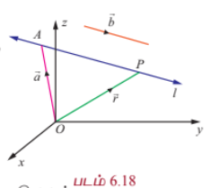

$$\overrightarrow{AP} = \vec{r} - \vec{a}$$

$\overrightarrow{AP}$ ஆனது $\vec{b}$ -க்கு இணை என்பதால்,

$$\vec{r} - \vec{a} = t\vec{b}, \quad t \in \mathbb{R}$$

... (1)

அல்லது

$$\vec{r} = \vec{a} + t\vec{b}, \quad t \in \mathbb{R}$$

... (2)

இது கொடுக்கப்பட்ட கோட்டின் **துணை அலகு வடிவ வெக்டர் சமன்பாடு** ஆகும்.

#### குறிப்புரை

இக்கோட்டின் மீதுள்ள ஏதேனும் ஒரு புள்ளியின் நிலைவெக்டர் $\vec{a} + t\vec{b}$ ஆகும்.

---

#### (b) துணை அலகு அல்லாத வெக்டர் சமன்பாடு (Non-parametric form of vector equation)

$\overrightarrow{AP}$ என்பது $\vec{b}$ -க்கு இணை என்பதால்,

$$\overrightarrow{AP} \times \vec{b} = \vec{0}$$

ஆகும்.

அதாவது,

$$(\vec{r} - \vec{a}) \times \vec{b} = \vec{0}$$

இது கோட்டின் **துணை அலகு அல்லாத வடிவ வெக்டர் சமன்பாடு** எனப்படும்.

---

#### (c) கார்டீசியன் சமன்பாடு (Cartesian equation)

$A$ என்ற புள்ளியின் அச்சுத்தூரங்கள் $(x_1, y_1, z_1)$, $P$ என்ற புள்ளியின் அச்சுத்தூரங்கள் $(x, y, z)$ மற்றும் $\vec{b} = b_1\hat{i} + b_2\hat{j} + b_3\hat{k}$ என்க. பின்னர், $\vec{r} = x\hat{i} + y\hat{j} + z\hat{k}$, $\vec{a} = x_1\hat{i} + y_1\hat{j} + z_1\hat{k}$ மற்றும் $\vec{b} = b_1\hat{i} + b_2\hat{j} + b_3\hat{k}$ எனச் சமன்பாடு (1)-ல் பிரதியிட்டு, $\hat{i}, \hat{j}, \hat{k}$ ஆகியவற்றின் கெழுக்களை ஒப்பிட, நாம் பெறுவது

$$x - x_1 = tb_1, \quad y - y_1 = tb_2, \quad z - z_1 = tb_3$$

... (4)

சமன்பாடு (4)-ஐ, வழக்கமாக

$$\frac{x - x_1}{b_1} = \frac{y - y_1}{b_2} = \frac{z - z_1}{b_3}$$

... (5)

என எழுதுவோம்.

இச்சமன்பாடுகள் $(x_1, y_1, z_1)$ என்ற புள்ளி வழியாகச் செல்வதும் $b_1, b_2, b_3$ என்ற திசை விகிதங்களைக் கொண்ட வெக்டருக்கு இணையானதுமான கோட்டின் **கார்டீசியன் சமன்பாடுகள்** அல்லது **சமச்சீர் சமன்பாடுகள்** என அழைக்கப்படுகின்றன.

#### குறிப்புரை

(i) நேர்க்கோடு (5)-ன் மீது உள்ள எந்தவொரு புள்ளியும் $(x_1 + tb_1, y_1 + tb_2, z_1 + tb_3)$ என்ற வடிவில் இருக்கும். இங்கு $t \in \mathbb{R}$

(ii) ஒரு கோட்டின் திசைக் கொசைன்கள் அக்கோட்டின் திசை விகிதங்களின் விகிதச் சமமாகும் என்பதால், கோட்டின் திசைக் கொசைன்கள் $l, m, n$ எனில், நேர்க்கோட்டின் கார்டீசியன் சமன்பாடுகள்

$$\frac{x - x_1}{l} = \frac{y - y_1}{m} = \frac{z - z_1}{n}$$

ஆகும்.

(iii) சமன்பாடு (5)-ல், $b_1, b_2, b_3$ இவற்றில் ஒன்று அல்லது இரண்டின் மதிப்புகள் பூச்சியமாக இருந்தால், சமன்பாடுகளை நாம் பூச்சியத்தால் வகுப்பதாக பொருள்படாது (அர்த்தமாகாது). மாறாக, பகுதியில் பூச்சியத்தைக் கொண்டுள்ள சமன்பாட்டின் தொகுதியின் மதிப்பு பூச்சியத்திற்குச் சமமாகும் எனப் பொருள்படும். உதாரணமாக, $b_1 \neq 0, b_2 \neq 0$ மற்றும் $b_3 = 0$ எனில்,

$$\frac{x - x_1}{b_1} = \frac{y - y_1}{b_2} = \frac{z - z_1}{0}$$

என்பதை

$$\frac{x - x_1}{b_1} = \frac{y - y_1}{b_2}, \quad z - z_1 = 0$$

என எழுதலாம்.

(iv) $x$ - அச்சின் திசைக் கொசைன்கள் $1, 0, 0$ ஆகும். எனவே, $x$ -அச்சின் சமன்பாடுகள்

$$\frac{x - 0}{1} = \frac{y - 0}{0} = \frac{z - 0}{0}$$

அல்லது $x = t, y = 0, z = 0$ , இங்கு $t \in \mathbb{R}$ ஆகும். இதேபோன்று, $y$ -அச்சு மற்றும் $z$ -அச்சின் சமன்பாடுகள் முறையே

$$\frac{x - 0}{0} = \frac{y - 0}{1} = \frac{z - 0}{0}$$

மற்றும்

$$\frac{x - 0}{0} = \frac{y - 0}{0} = \frac{z - 0}{1}$$

ஆகும்.

---

### 6.7.3 கொடுக்கப்பட்ட இரண்டு புள்ளிகள் வழியாகச் செல்லும் நேர்க்கோட்டின் சமன்பாடு
### (Straight Line passing through two given points)

#### (a) துணை அலகு வெக்டர் சமன்பாடு (Parametric form of vector equation)

##### தேற்றம் 6.12

கொடுக்கப்பட்ட நிலைவெக்டர்கள் $\vec{a}$ மற்றும் $\vec{b}$ கொண்ட இரு புள்ளிகள் வழியாகச் செல்லும் நேர்க்கோட்டின் துணை அலகு வடிவ வெக்டர் சமன்பாடு

$$\vec{r} = \vec{a} + t(\vec{b} - \vec{a}), \quad t \in \mathbb{R}$$

---

#### (b) துணை அலகு அல்லாத வெக்டர் சமன்பாடு (Non-parametric form of vector equation)

மேற்கண்ட சமன்பாட்டினை துணை அலகு அல்லாத வடிவ வெக்டர் சமன்பாடாக

$$(\vec{r} - \vec{a}) \times (\vec{b} - \vec{a}) = \vec{0}$$

என எழுதலாம்.

---

#### (c) கார்டீசியன் சமன்பாடு (Cartesian form of equation)

$A$, $B$ என்ற புள்ளிகளின் அச்சுத்தூரங்கள் முறையே $(x_1, y_1, z_1)$ மற்றும் $(x_2, y_2, z_2)$ என்க. $P$ -ன் அச்சுத்தூரங்கள் $(x, y, z)$ என்க. பின்னர் $\vec{r} = x\hat{i} + y\hat{j} + z\hat{k}$, $\vec{a} = x_1\hat{i} + y_1\hat{j} + z_1\hat{k}$ மற்றும் $\vec{b} = x_2\hat{i} + y_2\hat{j} + z_2\hat{k}$ எனத் தேற்றம் 6.12-ல் உள்ள சமன்பாட்டில் பிரதியிட்டு, $\hat{i}, \hat{j}, \hat{k}$ ஆகியவற்றின் கெழுக்களை ஒப்பிட,

$$x - x_1 = t(x_2 - x_1), \quad y - y_1 = t(y_2 - y_1), \quad z - z_1 = t(z_2 - z_1)$$

எனப் பெறுகிறோம். ஆகவே, $(x_1, y_1, z_1)$ மற்றும் $(x_2, y_2, z_2)$ என்ற இருபுள்ளிகள் வழியாகச் செல்லும் நேர்க்கோட்டின் கார்டீசியன் சமன்பாடு

$$\frac{x - x_1}{x_2 - x_1} = \frac{y - y_1}{y_2 - y_1} = \frac{z - z_1}{z_2 - z_1}$$

எனக் கிடைக்கிறது.

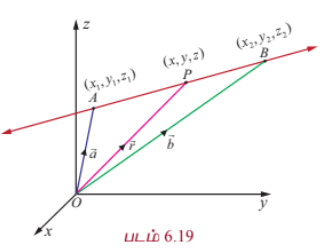

இச்சமன்பாட்டிலிருந்து $(x_1, y_1, z_1)$ மற்றும் $(x_2, y_2, z_2)$ என்ற புள்ளிகள் வழியாகச் செல்லும் நேர்க்கோட்டின் திசை விகிதங்கள் $x_2 - x_1, y_2 - y_1, z_2 - z_1$ ஆகும் எனக் காண்கிறோம். மேலும் இவற்றுக்கு விகிதச் சமமமாக உள்ள ஏதேனும் மூன்று எண்கள், குறிப்பாக $x_2 - x_1, y_2 - y_1, z_2 - z_1$ என்பவை இக்கோட்டின் திசை விகிதங்களாக அமைவதைக் காணலாம்.

---

### எடுத்துக்காட்டு 6.24

ஒரு நேர்க்கோடு $(1, 2, -3)$ என்ற புள்ளி வழியாகச் செல்கிறது மற்றும் $4\hat{i} + 5\hat{j} - 7\hat{k}$ என்ற வெக்டருக்கு இணையாக உள்ளது எனில், அக்கோட்டின் (i) துணை அலகு வெக்டர் சமன்பாடு (ii) துணை அலகு அல்லாத வெக்டர் சமன்பாடு (iii) கார்டீசியன் சமன்பாடுகளைக் காண்க.

#### தீர்வு

தேவையான கோடு $(1, 2, -3)$ என்ற புள்ளி வழியாகச் செல்கிறது. ஆகவே, இப்புள்ளியின் நிலை வெக்டர் $\hat{i} + 2\hat{j} - 3\hat{k}$ ஆகும்.

$\vec{a} = \hat{i} + 2\hat{j} - 3\hat{k}$, $\vec{b} = 4\hat{i} + 5\hat{j} - 7\hat{k}$ என்க. பின்னர்

(i) தேவையான கோட்டின் துணை அலகு வெக்டர் சமன்பாடு $\vec{r} = \vec{a} + t\vec{b}$, இங்கு $t \in \mathbb{R}$ ஆகும்.

எனவே, $\vec{r} = (\hat{i} + 2\hat{j} - 3\hat{k}) + t(4\hat{i} + 5\hat{j} - 7\hat{k}), \quad t \in \mathbb{R}$.

(ii) தேவையான கோட்டின் துணை அலகு அல்லாத வெக்டர் சமன்பாடு $(\vec{r} - \vec{a}) \times \vec{b} = \vec{0}$ ஆகும்.

எனவே, $(\vec{r} - (\hat{i} + 2\hat{j} - 3\hat{k})) \times (4\hat{i} + 5\hat{j} - 7\hat{k}) = \vec{0}$.

(iii) தேவையான கோட்டின் கார்டீசியன் சமன்பாடுகள்

$$\frac{x - x_1}{b_1} = \frac{y - y_1}{b_2} = \frac{z - z_1}{b_3}$$

இங்கு, $(x_1, y_1, z_1) = (1, 2, -3)$ மற்றும் தேவையான கோட்டின் திசை விகிதங்கள் $4, 5, -7$ என்பவற்றுக்கு விகிதச் சமமானவையாகும். எனவே, தேவையான நேர்க்கோட்டின் கார்டீசியன் சமன்பாடுகள்

$$\frac{x - 1}{4} = \frac{y - 2}{5} = \frac{z + 3}{-7}$$

---

### எடுத்துக்காட்டு 6.25

ஒரு நேர்க்கோட்டின் துணை அலகு வெக்டர் சமன்பாடு $\vec{r} = (3\hat{i} - 2\hat{j} + 6\hat{k}) + t(2\hat{i} - \hat{j} + 3\hat{k})$ எனில், அக்கோட்டின் (i) திசைக்கொசைன்கள் (ii) துணை அலகு அல்லாத வெக்டர் சமன்பாடு (iii) கார்டீசியன் சமன்பாடுகள் ஆகியவற்றைக் காண்க.

#### தீர்வு

கொடுக்கப்பட்ட வெக்டர் சமன்பாட்டையும் $\vec{r} = \vec{a} + t\vec{b}$ என்ற கோட்டின் சமன்பாட்டையும் ஒப்பிட நமக்குக் கிடைப்பது $\vec{a} = 3\hat{i} - 2\hat{j} + 6\hat{k}$ மற்றும் $\vec{b} = 2\hat{i} - \hat{j} + 3\hat{k}$. எனவே,

(i) $\vec{b} = b_1\hat{i} + b_2\hat{j} + b_3\hat{k}$ எனில், கோட்டின் திசை விகிதங்கள் $b_1, b_2, b_3$ ஆகும். எனவே, கொடுக்கப்பட்ட கோட்டின் திசை விகிதங்கள் $2, -1, 3$ என்பவற்றுக்கு விகிதச் சமமானவையாகும். ஆகவே, கொடுக்கப்பட்ட கோட்டின் திசைக் கொசைன்கள்

$$\frac{2}{\sqrt{14}}, \frac{-1}{\sqrt{14}}, \frac{3}{\sqrt{14}}$$

ஆகும்.

(ii) கோட்டின் துணை அலகு அல்லாத வடிவ வெக்டர் சமன்பாடு $(\vec{r} - \vec{a}) \times \vec{b} = \vec{0}$.

எனவே, $(\vec{r} - (3\hat{i} - 2\hat{j} + 6\hat{k})) \times (2\hat{i} - \hat{j} + 3\hat{k}) = \vec{0}$.

(iii) இங்கு $(x_1, y_1, z_1) = (3, -2, 6)$ மற்றும் கோட்டின் திசை விகிதங்கள் $2, -1, 3$ என்பவற்றுக்கு விகிதச் சமமானவை.

எனவே, கோட்டின் கார்டீசியன் சமன்பாடுகள்

$$\frac{x - 3}{2} = \frac{y + 2}{-1} = \frac{z - 6}{3}$$

ஆகும்.

---

### எடுத்துக்காட்டு 6.26

$(-4, 2, -3)$ என்ற புள்ளி வழிச் செல்வதும்

$$\frac{2x - 3}{4} = \frac{2 - y}{-3} = \frac{z + 6}{2}$$

என்ற கோட்டிற்கு இணையானதுமான கோட்டின் துணை அலகு வடிவ வெக்டர் சமன்பாடு மற்றும் கார்டீசியன் சமன்பாடுகளைக் காண்க.

#### தீர்வு

கொடுக்கப்பட்ட சமன்பாடுகளை

$$\frac{x - \frac{3}{2}}{4} = \frac{y - 2}{3} = \frac{z + 6}{2}$$

என எழுதி,

$$\frac{x - x_1}{b_1} = \frac{y - y_1}{b_2} = \frac{z - z_1}{b_3}$$

உடன் ஒப்பிடக் கிடைப்பது, $\vec{b} = b_1\hat{i} + b_2\hat{j} + b_3\hat{k} = 4\hat{i} + 3\hat{j} + 2\hat{k}$. இதிலிருந்து $\vec{b}$ ஆனது $8\hat{i} + 6\hat{j} + 4\hat{k}$ என்ற வெக்டருக்கு இணையானது எனத் தெளிவாகக் காணலாம்.

எனவே, தேவையான நேர்க்கோடு $(-4, 2, -3)$ என்ற புள்ளி வழிச் செல்வதுடன் $8\hat{i} + 6\hat{j} + 4\hat{k}$ என்ற வெக்டருக்கு இணையாகவும் உள்ளது. ஆதலால், தேவையான கோட்டின் துணை அலகு வெக்டர் சமன்பாடு

$$\vec{r} = (-4\hat{i} + 2\hat{j} - 3\hat{k}) + t(8\hat{i} + 6\hat{j} + 4\hat{k}), \quad t \in \mathbb{R}$$

மேலும், தேவையான கோட்டின் கார்டீசியன் சமன்பாடுகள்

$$\frac{x + 4}{8} = \frac{y - 2}{6} = \frac{z + 3}{4}$$

ஆகும்.

---

### எடுத்துக்காட்டு 6.27

$(-5, 7, -4)$ மற்றும் $(13, -5, 2)$ என்ற புள்ளிகள் வழியாகச் செல்லும் நேர்க்கோட்டின் துணை அலகு வெக்டர் சமன்பாடு மற்றும் கார்டீசியன் சமன்பாடுகளைக் காண்க. மேலும், இந்த நேர்க்கோடு $xy$ -தளத்தை வெட்டும் புள்ளியைக் காண்க.

#### தீர்வு

தேவையான நேர்க்கோடு $(-5, 7, -4)$ மற்றும் $(13, -5, 2)$ என்ற புள்ளிகள் வழியாகச் செல்கிறது. எனவே, இப்புள்ளிகளை இணைக்கும் கோட்டின் திசை விகிதங்கள் $18, -12, 6$ ஆகும். அதாவது $3, -2, 1$ ஆகும்.

ஆதலால், தேவையான நேர்க்கோடு $3\hat{i} - 2\hat{j} + \hat{k}$ என்ற வெக்டருக்கு இணையாக இருக்கும். எனவே,

- தேவையான நேர்க்கோட்டின் துணை அலகு வடிவ வெக்டர் சமன்பாடு

$$\vec{r} = (-5\hat{i} + 7\hat{j} - 4\hat{k}) + t(3\hat{i} - 2\hat{j} + \hat{k})$$

அல்லது

$$\vec{r} = (13\hat{i} - 5\hat{j} + 2\hat{k}) + s(3\hat{i} - 2\hat{j} + \hat{k})$$

இங்கு $s, t \in \mathbb{R}$ ஆகும்.

- தேவையான கோட்டின் கார்டீசியன் சமன்பாடுகள்

$$\frac{x + 5}{3} = \frac{y - 7}{-2} = \frac{z + 4}{1}$$

அல்லது

$$\frac{x - 13}{3} = \frac{y + 5}{-2} = \frac{z - 2}{1}$$

ஆகும்.

- இந்த நேர்க்கோட்டில் உள்ள ஏதேனும் ஒரு புள்ளியின் அமைப்பு

$$(3t - 5, -2t + 7, t - 4)$$

அல்லது

$$(3s + 13, -2s - 5, s + 2)$$

நேர்க்கோடு $xy$ -தளத்தை சந்திப்பதால், வெட்டும் புள்ளியின் $z$ -அச்சுத் தொலைவு பூச்சியமாகும். எனவே, $t - 4 = 0$, அதாவது, $t = 4$ ஆகும். ஆகையால், நேர்க்கோடு $xy$ -தளத்தை வெட்டும் புள்ளி $(7, -1, 0)$ ஆகும்.

---

### எடுத்துக்காட்டு 6.28

$$\frac{x + 3}{2} = \frac{y - 1}{2} = -z$$

என்ற நேர்க்கோடு ஆய அச்சுகளுடன் ஏற்படுத்தும் கோணங்களைக் காண்க.

#### தீர்வு

கொடுக்கப்பட்ட நேர்க்கோட்டுக்கு இணையாக உள்ள ஓரலகு வெக்டர் $\hat{b}$ என்க. பின்னர்,

$$\hat{b} = \frac{2\hat{i} + 2\hat{j} - \hat{k}}{|2\hat{i} + 2\hat{j} - \hat{k}|} = \frac{2\hat{i} + 2\hat{j} - \hat{k}}{3}$$

ஆகவே, $\hat{b}$ -ன் திசைக் கொசைன்களின் வரையறைப்படி, நாம் பெறுவது

$$\cos\alpha = \frac{2}{3}, \quad \cos\beta = \frac{2}{3}, \quad \cos\gamma = -\frac{1}{3}$$

இங்கு $\alpha, \beta, \gamma$ என்பன முறையே மிகை $x$ -அச்சு, மிகை $y$ -அச்சு மற்றும் மிகை $z$ -அச்சுகளுடன் $\hat{b}$ ஏற்படுத்தும் கோணங்கள் ஆகும். கொடுக்கப்பட்ட நேர்க்கோடு ஆய அச்சுகளுடன் ஏற்படுத்தும் கோணங்களும், $\hat{b}$ முறையே ஆய அச்சுகளுடன் ஏற்படுத்தும் கோணங்களும் சமம் என்பதால்

$$\alpha = \cos^{-1}\left(\frac{2}{3}\right), \quad \beta = \cos^{-1}\left(\frac{2}{3}\right), \quad \gamma = \cos^{-1}\left(-\frac{1}{3}\right)$$

எனப் பெறுகிறோம்.

---

### 6.7.4 இரண்டு நேர்க்கோடுகளுக்கு இடைப்பட்ட கோணம்
### (Angle between two straight lines)

#### (a) வெக்டர் வடிவம் (Vector form)

$\vec{r} = \vec{a} + s\vec{b}$ மற்றும் $\vec{r} = \vec{c} + t\vec{d}$ என்ற இரு நேர்க்கோடுகளுக்கு இடைப்பட்ட குறுங்கோணமும் $\vec{b}$ மற்றும் $\vec{d}$ என்ற வெக்டர்களுக்கு இடைப்பட்ட கோணமும் ஒன்றறேயாகும். ஆகையால்,

$$\cos\theta = \frac{|\vec{b} \cdot \vec{d}|}{|\vec{b}||\vec{d}|}$$

அல்லது

$$\theta = \cos^{-1}\left(\frac{|\vec{b} \cdot \vec{d}|}{|\vec{b}||\vec{d}|}\right)$$

#### குறிப்புரை

(i) $\vec{r} = \vec{a} + s\vec{b}$ மற்றும் $\vec{r} = \vec{c} + t\vec{d}$ என்ற இரு கோடுகளும் இணை

$\iff \theta = 0 \iff \cos\theta = 1 \iff |\vec{b} \cdot \vec{d}| = |\vec{b}||\vec{d}|$

(ii) கொடுக்கப்பட்ட $\vec{r} = \vec{a} + s\vec{b}$ மற்றும் $\vec{r} = \vec{c} + t\vec{d}$ என்ற இரு கோடுகளும் இணையாக இருக்கத் தேவையானதும், மற்றும் போதுமானதுமான நிபந்தனை $\vec{b} = \lambda\vec{d}$, $\lambda$ ஒரு திசையிலி என்பதாகும்.

(iii) கொடுக்கப்பட்ட $\vec{r} = \vec{a} + s\vec{b}$ மற்றும் $\vec{r} = \vec{c} + t\vec{d}$ என்ற இரு கோடுகளும் ஒன்றுக்கொன்று செங்குத்தானவையாக இருக்கத் தேவையானதும், மற்றும் போதுமானதுமான நிபந்தனை $\vec{b} \cdot \vec{d} = 0$ என்பதாகும்.

#### (b) கார்டீசியன் வடிவம் (Cartesian form)

இரு நேர்க்கோடுகளின் கார்டீசியன் வடிவச் சமன்பாடுகள்

$$\frac{x - x_1}{b_1} = \frac{y - y_1}{b_2} = \frac{z - z_1}{b_3}$$

மற்றும்

$$\frac{x - x_2}{d_1} = \frac{y - y_2}{d_2} = \frac{z - z_2}{d_3}$$

எனில், இவ்விரு கோடுகளுக்கும் இடைப்பட்ட குறுங்கோணம் $\theta$ என்பது

$$\theta = \cos^{-1}\left(\frac{|b_1d_1 + b_2d_2 + b_3d_3|}{\sqrt{b_1^2 + b_2^2 + b_3^2}\sqrt{d_1^2 + d_2^2 + d_3^2}}\right)$$

ஆகும்.

#### குறிப்புரை

(i) $b_1, b_2, b_3$ மற்றும் $d_1, d_2, d_3$ என்ற திசை விகிதங்களைக் கொண்ட கொடுக்கப்பட்ட இரு கோடுகள் இணையாக இருக்கத் தேவையானதும், மற்றும் போதுமானதுமான நிபந்தனை

$$\frac{b_1}{d_1} = \frac{b_2}{d_2} = \frac{b_3}{d_3}$$

என்பதாகும்.

(ii) $b_1, b_2, b_3$ மற்றும் $d_1, d_2, d_3$ என்ற திசை விகிதங்களைக் கொண்ட கொடுக்கப்பட்ட இரு நேர்க்கோடுகள் ஒன்றுக்கொன்று செங்குத்தாக இருக்கத் தேவையானதும் மற்றும், போதுமானதுமான நிபந்தனை $b_1d_1 + b_2d_2 + b_3d_3 = 0$ என்பதாகும்.

(iii) கொடுக்கப்பட்ட இரு நேர்க்கோடுகளின் திசைக்கொசைன்கள் $l_1, m_1, n_1$ மற்றும் $l_2, m_2, n_2$ எனில், கொடுக்கப்பட்ட கோடுகளுக்கு இடைப்பட்ட கோணம்

$$\cos\theta = |l_1l_2 + m_1m_2 + n_1n_2|$$

ஆகும்.

---

### எடுத்துக்காட்டு 6.29

$\vec{r} = (\hat{i} + 2\hat{j} + 4\hat{k}) + t(2\hat{i} + 2\hat{j} + \hat{k})$ என்ற கோட்டிற்கும் $(5, 1, 4)$ மற்றும் $(9, 2, 12)$ என்ற புள்ளிகளை இணைக்கும் கோட்டிற்கும் இடைப்பட்ட கோணம் காண்க.

#### தீர்வு

$\vec{r} = (\hat{i} + 2\hat{j} + 4\hat{k}) + t(2\hat{i} + 2\hat{j} + \hat{k})$ என்ற கோடு $2\hat{i} + 2\hat{j} + \hat{k}$ என்ற வெக்டருக்கு இணையாக இருக்கும்.

$(5, 1, 4)$ மற்றும் $(9, 2, 12)$ என்ற புள்ளிகளை இணைக்கும் நேர்க்கோட்டின் திசை விகிதங்கள் $4, 1, 8$ என்பதால், இக்கோடு $4\hat{i} + \hat{j} + 8\hat{k}$ என்ற வெக்டருக்கு இணையாக இருக்கும்.

எனவே, கொடுக்கப்பட்ட இவ்விரு கோடுகளுக்கும் இடைப்பட்ட குறுங்கோணம்

$$\theta = \cos^{-1}\left(\frac{|\vec{b} \cdot \vec{d}|}{|\vec{b}||\vec{d}|}\right)$$

இங்கு $\vec{b} = 2\hat{i} + 2\hat{j} + \hat{k}$ மற்றும் $\vec{d} = 4\hat{i} + \hat{j} + 8\hat{k}$.

எனவே,

$$\theta = \cos^{-1}\left(\frac{|(2\hat{i} + 2\hat{j} + \hat{k}) \cdot (4\hat{i} + \hat{j} + 8\hat{k})|}{|2\hat{i} + 2\hat{j} + \hat{k}||4\hat{i} + \hat{j} + 8\hat{k}|}\right) = \cos^{-1}\left(\frac{2}{3}\right)$$

---

### எடுத்துக்காட்டு 6.30

$$\frac{x - 4}{2} = \frac{y + 1}{1} = \frac{z - 1}{-2}$$

மற்றும்

$$\frac{x - 1}{4} = \frac{y - 1}{-4} = \frac{z - 2}{-2}$$

என்ற இரு நேர்க்கோடுகளுக்கு இடைப்பட்ட குறுங்கோணம் காண்க. இவ்விரு கோடுகளும் இணையானவையா அல்லது செங்குத்தானவையா எனக்காண்க.

#### தீர்வு

கொடுக்கப்பட்ட நேர்க்கோடுகளின் சமன்பாடுகளை

$$\frac{x - x_1}{b_1} = \frac{y - y_1}{b_2} = \frac{z - z_1}{b_3}$$

மற்றும்

$$\frac{x - x_2}{d_1} = \frac{y - y_2}{d_2} = \frac{z - z_2}{d_3}$$

ஆகியவற்றுடன் ஒப்பிட, நாம் பெறுவது

$(b_1, b_2, b_3) = (2, 1, -2)$ மற்றும் $(d_1, d_2, d_3) = (4, -4, -2)$.

எனவே, கொடுக்கப்பட்ட இரு கோடுகளுக்கும் இடைப்பட்ட குறுங்கோணம்

$$\theta = \cos^{-1}\left(\frac{|2(4) + 1(-4) + (-2)(-2)|}{\sqrt{2^2 + 1^2 + (-2)^2}\sqrt{4^2 + (-4)^2 + (-2)^2}}\right)$$

$$= \cos^{-1}\left(\frac{|8 - 4 + 4|}{3 \times 6}\right) = \cos^{-1}\left(\frac{8}{18}\right) = \cos^{-1}\left(\frac{4}{9}\right)$$

இவ்விரு கோடுகளும் இணையானவையா அல்லது செங்குத்தானவையா என்பதை தீர்மானிக்க,

$b_1d_1 + b_2d_2 + b_3d_3 = 2(4) + 1(-4) + (-2)(-2) = 8 - 4 + 4 = 8 \neq 0$

எனவே, கொடுக்கப்பட்ட இரு நேர்க்கோடுகளும் செங்குத்தானவை அல்ல.

மேலும்,

$$\frac{b_1}{d_1} = \frac{2}{4} = \frac{1}{2}, \quad \frac{b_2}{d_2} = \frac{1}{-4}, \quad \frac{b_3}{d_3} = \frac{-2}{-2} = 1$$

இவை சமமாக இல்லை. எனவே, கொடுக்கப்பட்ட இரு நேர்க்கோடுகளும் இணையானவை அல்ல.

---

### எடுத்துக்காட்டு 6.31

$A(6,7,5)$ மற்றும் $B(8,10,6)$ என்ற புள்ளிகள் வழியாகச் செல்லும் நேர்க்கோடானது $C(10, -2, 5)$ மற்றும் $D(8, 3, -4)$ என்ற புள்ளிகள் வழியாகச் செல்லும் நேர்க்கோட்டிற்குச் செங்குத்தானது என நிறுவுக.

#### தீர்வு

$A(6,7,5)$ மற்றும் $B(8,10,6)$ என்ற புள்ளிகள் வழியாகச் செல்லும் நேர்க்கோடு

$$\vec{b} = \overrightarrow{AB} = \overrightarrow{OB} - \overrightarrow{OA} = 2\hat{i} + 3\hat{j} + \hat{k}$$

என்ற வெக்டருக்கு இணையாக அமையும். மேலும் $C(10, -2, 5)$ மற்றும் $D(8, 3, -4)$ என்ற புள்ளிகள் வழியாகச் செல்லும் நேர்க்கோடு

$$\vec{d} = \overrightarrow{CD} = -2\hat{i} + 5\hat{j} - 9\hat{k}$$

என்ற வெக்டருக்கு இணையாக இருக்கும். எனவே, இவ்விரு கோடுகளுக்கு இடைப்பட்ட கோணமானது $\vec{b}$ மற்றும் $\vec{d}$ ஆகியவற்றுக்கு இடைப்பட்ட கோணத்திற்குச் சமமாகும்.

$$\vec{b} \cdot \vec{d} = (2\hat{i} + 3\hat{j} + \hat{k}) \cdot (-2\hat{i} + 5\hat{j} - 9\hat{k}) = -4 + 15 - 9 = 2 \neq 0$$

என்பதால், $\vec{b}, \vec{d}$ என்ற வெக்டர்கள் செங்குத்தானவையாகும். எனவே, இரு நேர்க்கோடுகளும் செங்குத்தானவையாகும்.

---

### எடுத்துக்காட்டு 6.32

$$\frac{x - 1}{2} = \frac{y - 2}{-6} = \frac{z - 4}{12}$$

மற்றும்

$$\frac{x - 3}{-2} = \frac{y - 3}{6} = \frac{z - 5}{-6}$$

என்ற கோடுகள் இணையானவை என நிறுவுக.

#### தீர்வு

$$\frac{x - 1}{2} = \frac{y - 2}{-6} = \frac{z - 4}{12}$$

என்ற கோடு $2\hat{i} - 6\hat{j} + 12\hat{k}$ என்ற வெக்டருக்கு இணையாக இருக்கும் மற்றும்

$$\frac{x - 3}{-2} = \frac{y - 3}{6} = \frac{z - 5}{-6}$$

என்ற கோடு $-2\hat{i} + 6\hat{j} - 6\hat{k}$ என்ற வெக்டருக்கு இணையாக இருக்கும்.

$$2\hat{i} - 6\hat{j} + 12\hat{k} = -(-2\hat{i} + 6\hat{j} - 12\hat{k}) = -(-2\hat{i} + 6\hat{j} - 6\hat{k}) \times 2$$

என்பதால், இரு வெக்டர்களும் இணையாகும். எனவே, கொடுக்கப்பட்ட இரு நேர்க்கோடுகளும் இணையாகும்.

---

### பயிற்சி 6.4

1. $4\hat{i} + 3\hat{j} - 7\hat{k}$ என்ற வெக்டரை நிலை வெக்டராகக் கொண்ட புள்ளி வழிச் செல்வதும் $2\hat{i} - 6\hat{j} + 7\hat{k}$ என்ற வெக்டருக்கு இணையானதுமான நேர்க்கோட்டின் துணை அலகு அல்லாத வெக்டர் சமன்பாடு, மற்றும் கார்டீசியன் சமன்பாடுகளைக் காண்க.

2. $(-2, 3, 4)$ என்ற புள்ளி வழியாகச் செல்வதும்

$$\frac{x - 1}{4} = \frac{y + 3}{-5} = \frac{z - 8}{6}$$

என்ற கோட்டிற்கு இணையானதுமான நேர்க்கோட்டின் துணை அலகு வெக்டர் சமன்பாடு மற்றும் கார்டீசியன் சமன்பாடுகளைக் காண்க.

3. $(6, 7, -4)$ மற்றும் $(8, -4, 9)$ என்ற புள்ளிகள் வழியாகச் செல்லும் நேர்க்கோடு $xz$ மற்றும் $yz$ தளங்களை வெட்டும் புள்ளிகளைக் காண்க.

4. $(5, 6, 7)$ மற்றும் $(7, 9, 13)$ என்ற புள்ளிகள் வழியாகச் செல்லும் நேர்க்கோட்டின் திசைக் கொசைன்களைக் காண்க. மேலும், கொடுக்கப்பட்ட இவ்விரு புள்ளிகள் வழியாகச் செல்லும் நேர்க்கோட்டின் துணை அலகு வெக்டர் சமன்பாடு, மற்றும் கார்டீசியன் சமன்பாடுகளைக் காண்க.

5. பின்வரும் கோடுகளுக்கு இடைப்பட்ட குறுங்கோணம் காண்க.

   (i) $\vec{r} = (4\hat{i} - \hat{j}) + t(\hat{i} - 2\hat{j} + 2\hat{k})$, $\vec{r} = (-2\hat{i} + 4\hat{j}) + s(-2\hat{i} + 2\hat{j} - \hat{k})$

   (ii) $\frac{x - 4}{7} = \frac{y - 5}{3} = \frac{z + 4}{5}$, $\vec{r} = 4\hat{k} + t(2\hat{i} + \hat{j} + \hat{k})$

   (iii) $2x = 3y = -z$ மற்றும் $6x = -y = -4z$

6. $A(7, -2, 1), B(6, 0, 3)$, மற்றும் $C(4, 2, 4)$ என்பன $\triangle ABC$ -ன் உச்சிகள் எனில், $\angle ABC$ -ஐக் காண்க.

7. $(2, 1, -4)$ மற்றும் $(-1, 4, -1)$ என்ற புள்ளிகளை இணைக்கும் நேர்க்கோடு $(0, -2, 1)$ மற்றும் $(5, 3, -2)$ என்ற புள்ளிகளை இணைக்கும் நேர்க்கோட்டுக்கு இணை எனில், $a$ மற்றும் $b$ -ன் மதிப்புகளைக் காண்க.

8. $$\frac{x - 5}{m} = \frac{y - 2}{-5} = \frac{z + 1}{-1}$$

மற்றும்

$$x = 2 + \frac{y}{4} = \frac{z - 1}{3}$$

என்ற நேர்க்கோடுகள் ஒன்றுக்கொன்று செங்குத்தானவை எனில், $m$ -ன் மதிப்பைக் காண்க.

9. $(2, 3, 4),(-1, 4, 5)$ மற்றும் $(8, 1, 2)$ என்ற புள்ளிகள் ஒரு கோடமைப் புள்ளிகள் எனக் காட்டுக.

---

### 6.7.5 இரு நேர்க்கோடுகள் வெட்டும் புள்ளி
### (Point of intersection of two straight lines)

$$\frac{x - x_1}{a_1} = \frac{y - y_1}{a_2} = \frac{z - z_1}{a_3}$$

மற்றும்

$$\frac{x - x_2}{b_1} = \frac{y - y_2}{b_2} = \frac{z - z_2}{b_3}$$

என்பன இரு நேர்க்கோடுகள் எனில், இக்கோடுகளின் மீது உள்ள புள்ளிகளின் அமைப்பு முறையே

$$(x_1 + sa_1, y_1 + sa_2, z_1 + sa_3)$$

மற்றும்

$$(x_2 + tb_1, y_2 + tb_2, z_2 + tb_3)$$

ஆகும். கொடுக்கப்பட்ட கோடுகள் வெட்டிக் கொள்ளுமானால், ஒரு பொதுவான புள்ளி இருக்க வேண்டும். ஆகையால், கோடுகள் வெட்டிக் கொள்ளும் புள்ளியில், ஒரு சில $s, t$ மதிப்புகளுக்கு,

$$(x_1 + sa_1, y_1 + sa_2, z_1 + sa_3) = (x_2 + tb_1, y_2 + tb_2, z_2 + tb_3)$$

எனவே,

$$x_1 + sa_1 = x_2 + tb_1, \quad y_1 + sa_2 = y_2 + tb_2, \quad z_1 + sa_3 = z_2 + tb_3$$

இம்மூன்று சமன்பாடுகளில் ஏதேனும் இரு சமன்பாடுகளின் தீர்வு காண்பதால் பெறப்படும் $s$ மற்றும் $t$ -ன் மதிப்புகள் மீதமுள்ள சமன்பாட்டை நிறைவு செய்யுமானால், கொடுக்கப்பட்ட கோடுகள் வெட்டும் கோடுகளாகும். அவ்வாறு இல்லையெனில், அவை வெட்டாக் கோடுகளாகும். $s$ -ன் மதிப்பை, (அல்லது $t$ -ன் மதிப்பை) பிரதியிட, இரு கோடுகளும் வெட்டிக் கொள்ளும் புள்ளி கிடைக்கும்.

நேர்க்கோடுகளின் சமன்பாடுகள் வெக்டர் சமன்பாடுகளாக கொடுக்கப்பட்டால், அச்சமன்பாடுகளை கார்டீசியன் சமன்பாடுகளாக மாற்றி எழுதி மேற்கண்ட முறையில் வெட்டும் புள்ளியைக் காணலாம்.

---

### எடுத்துக்காட்டு 6.33

$$\frac{x - 1}{2} = \frac{y - 2}{3} = \frac{z - 3}{4}$$

மற்றும்

$$\frac{x - 4}{5} = \frac{y - 1}{2} = z$$

என்ற கோடுகள் வெட்டும் புள்ளியைக் காண்க.

#### தீர்வு

$$\frac{x - 1}{2} = \frac{y - 2}{3} = \frac{z - 3}{4} = s$$

(என்க). இக்கோட்டில் உள்ள ஏதேனும் ஒரு புள்ளியின் வடிவம்

$$(2s + 1, 3s + 2, 4s + 3)$$

ஆகும்.

$$\frac{x - 4}{5} = \frac{y - 1}{2} = z = t$$

(என்க). இக்கோட்டில் உள்ள ஏதேனும் புள்ளியின் வடிவம்

$$(5t + 4, 2t + 1, t)$$

ஆகும்.

கொடுக்கப்பட்ட கோடுகள் வெட்டிக் கொள்ளுமானால், வெட்டும் புள்ளியில், ஒரு சில $s, t$ -ன் மதிப்புகளுக்கு,

$$(2s + 1, 3s + 2, 4s + 3) = (5t + 4, 2t + 1, t)$$

எனவே, $2s - 5t = 3$, $3s - 2t = -1$ மற்றும் $4s - t = -3$. இம்மூன்று சமன்பாடுகளில், முதல் இரண்டு சமன்பாடுகளின் தீர்வு காண $t = -1, s = -1$ எனக் கிடைக்கிறது. $s$ மற்றும் $t$ -ன் இம்மதிப்புகள் மூன்றாவது சமன்பாட்டை நிறைவு செய்கின்றன. எனவே, கொடுக்கப்பட்ட கோடுகள் வெட்டும் கோடுகளாகும். $t$ அல்லது $s$ -ன் மதிப்பினை உரிய புள்ளிகளில் பிரதியிட, கோடுகள் வெட்டும் புள்ளி $(-1, -1, -1)$ எனக் கிடைக்கிறது.

---

### 6.7.6 இரு நேர்க்கோடுகளுக்கு இடைப்பட்ட மீச்சிறு தூரம்
### (Shortest distance between two straight lines)

இரு நேர்க்கோடுகளின் வெட்டும் புள்ளியை எவ்வாறு காண்பது எனவும் மற்றும் இரு கோடுகள் இணையானவையா இல்லையா என்பதை எவ்வாறு தீர்மானிப்பது எனவும் கற்றறிந்துள்ளோம்.

#### வரையறை 6.6

இரு நேர்க்கோடுகள் ஒரே தளத்தில் அமைந்தால், அவை **ஒரு தளம் அமையும் கோடுகள்** எனப்படும்.

#### குறிப்பு

இரு நேர்க்கோடுகள் இணைகோடுகளாகவோ அல்லது வெட்டும் கோடுகளாகவோ இருப்பின், அவை ஒரு தளம் அமையும் கோடுகளாகும்.

#### வரையறை 6.7

புறவெளியில் இணையாக இல்லாமலும் ஒன்றையொன்று வெட்டிக் கொள்ளாமலும் உள்ள இரு கோடுகளை **ஒரு தளம் அமையாக் கோடுகள்** என அழைக்கிறோம்.

#### குறிப்பு

இரு நேர்க்கோடுகள் ஒரு தளம் அமையாக் கோடுகள் எனில், அக்கோடுகள் ஒரே தளத்தில் இருக்காது.

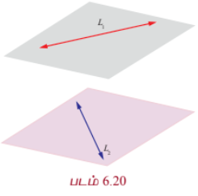

இணையாக இல்லாத இரண்டு நேர்க்கோடுகள் ஒன்றையொன்று வெட்டிக் கொண்டால், அக்கோடுகளுக்கு இடைப்பட்ட தூரம் பூச்சியம் ஆகும். ஒன்றையொன்று வெட்டாமலும் இணையாகவும் உள்ள இரண்டு நேர்க்கோடுகளுக்கு இடைப்பட்ட மீச்சிறு தூரமானது, இவ்விரு இணைக்கோடுகளுக்கும் செங்குத்தாக உள்ள கோட்டுத்துண்டின் நீளமாகும். இதேபோன்று, ஒரு தளம் அமையாக் கோடுகளுக்கு இடைப்பட்ட மீச்சிறு தூரமானது, ஒரு தளம் அமையாத இரு கோடுகளுக்கும் செங்குத்தான கோட்டுத்துண்டின் நீளம் என வரையறுக்கப்படுகிறது. இரண்டு நேர்க்கோடுகள் இணைக்கோடுகளாகவோ அல்லது ஒரு தளம் அமையாக் கோடுகளாகவோ இருக்கும்.

---

### தேற்றம் 6.13

$\vec{r} = \vec{a} + s\vec{b}$ மற்றும் $\vec{r} = \vec{c} + t\vec{b}$ என்ற இரண்டு இணைகோடுகளுக்கு இடைப்பட்ட மீச்சிறு தூரம்

$$d = \frac{|(\vec{c} - \vec{a}) \times \vec{b}|}{|\vec{b}|}, \quad \text{இங்கு } |\vec{b}| \neq 0$$

#### நிரூபணம்

கொடுக்கப்பட்ட $\vec{r} = \vec{a} + s\vec{b}$ மற்றும் $\vec{r} = \vec{c} + t\vec{b}$ என்ற இரண்டு இணைக்கோடுகளை முறையே $L_1$ மற்றும் $L_2$ எனக்குறிப்போம். $L_1$ மற்றும் $L_2$ -களின் மீதுள்ள $A$ மற்றும் $B$ என்ற இரு புள்ளிகளின் நிலைவெக்டர்கள் முறையே $\vec{a}$ மற்றும் $\vec{c}$ என்க. கொடுக்கப்பட்ட இரு கோடுகளும் $\vec{b}$ -க்கு இணையானவை.

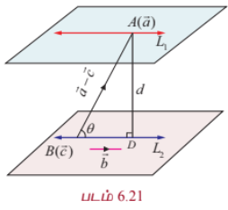

$AD$ என்பது கொடுக்கப்பட்ட இரு கோடுகளுக்கும் செங்குத்து என்க. $\overrightarrow{AB}$ மற்றும் $\vec{b}$ என்ற வெக்டர்களுக்கு இடைப்பட்ட குறுங்கோணம் $\theta$ எனில்,

$$\sin\theta = \frac{|\overrightarrow{AB} \times \vec{b}|}{|\overrightarrow{AB}||\vec{b}|} = \frac{|(\vec{c} - \vec{a}) \times \vec{b}|}{|\vec{c} - \vec{a}||\vec{b}|}$$

... (1)

ஆனால், செங்கோண முக்கோணம் $ABD$ -ல் இருந்து,

$$\sin\theta = \frac{d}{|\overrightarrow{AB}|} = \frac{d}{|\vec{c} - \vec{a}|}$$

... (2)

சமன்பாடுகள் (1) மற்றும் (2)-லிருந்து, நாம் பெறுவது

$$d = \frac{|(\vec{c} - \vec{a}) \times \vec{b}|}{|\vec{b}|}, \quad \text{இங்கு } |\vec{b}| \neq 0$$

---

### தேற்றம் 6.14

$\vec{r} = \vec{a} + s\vec{b}$ மற்றும் $\vec{r} = \vec{c} + t\vec{d}$ என்ற ஒரு தளம் அமையாக் கோடுகளுக்கு இடைப்பட்ட மீச்சிறு தூரம்

$$\delta = \frac{|(\vec{c} - \vec{a}) \cdot (\vec{b} \times \vec{d})|}{|\vec{b} \times \vec{d}|}, \quad \text{இங்கு } |\vec{b} \times \vec{d}| \neq 0$$

#### நிரூபணம்

கொடுக்கப்பட்ட $\vec{r} = \vec{a} + s\vec{b}$ மற்றும் $\vec{r} = \vec{c} + t\vec{d}$ என்ற ஒரு தளம் அமையாக் கோடுகளை முறையே $L_1$ மற்றும் $L_2$ எனக் குறிப்போம். $L_1$ மற்றும் $L_2$ என்ற கோடுகளின் மீதுள்ள $A$ மற்றும் $C$ என்ற இரு புள்ளிகளின் நிலை வெக்டர்கள் முறையே $\vec{a}$ மற்றும் $\vec{c}$ என்க. கொடுக்கப்பட்ட இரண்டு ஒரு தளம் அமையாக் கோடுகளின் சமன்பாடுகளிலிருந்து, $L_1$ என்ற கோடு $\vec{b}$ -க்கு இணையாகவும், $L_2$ என்ற கோடு $\vec{d}$ -க்கு இணையாகவும் இருப்பதைக் காண்கிறோம்.

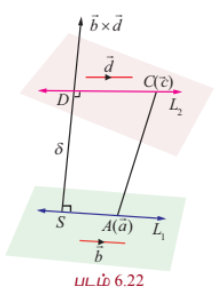

ஆகையால், $\vec{b} \times \vec{d}$ என்பது $L_1$ மற்றும் $L_2$ என்ற இரண்டு கோடுகளுக்கும் செங்குத்தாகும்.

$SD$ என்பது $L_1$ மற்றும் $L_2$ என்ற இரண்டு கோடுகளுக்கும் செங்குத்தாக உள்ள கோட்டுத்துண்டு என்க. ஆகவே $\overrightarrow{SD}$ ஆனது $\vec{b}$ மற்றும் $\vec{d}$ என்ற இரு வெக்டர்களுக்கும் செங்குத்தான வெக்டராகும்.

ஆதலால், $\overrightarrow{SD}$ ஆனது $\vec{b} \times \vec{d}$ -க்கு இணையான வெக்டராகும்.

எனவே, $\frac{\vec{b} \times \vec{d}}{|\vec{b} \times \vec{d}|}$ என்பது $\overrightarrow{SD}$ -ன் திசையில் உள்ள அலகு வெக்டராகும். மேலும், மீச்சிறு தூரம் $|\overrightarrow{SD}|$ என்பது, $\overrightarrow{SD}$ -ன் மீதான $\overrightarrow{AC}$ -ன் வீழலின் எண்ணளவாகும். அதாவது,

$$\delta = |\overrightarrow{AC} \cdot (\overrightarrow{SD} \text{ -ன் திசையில் உள்ள அலகு வெக்டர்})|$$

$$= \left|(\vec{c} - \vec{a}) \cdot \frac{\vec{b} \times \vec{d}}{|\vec{b} \times \vec{d}|}\right|$$

$$\delta = \frac{|(\vec{c} - \vec{a}) \cdot (\vec{b} \times \vec{d})|}{|\vec{b} \times \vec{d}|}, \quad \text{இங்கு } |\vec{b} \times \vec{d}| \neq 0$$

---

#### குறிப்புரை

(i) தேற்றம் 6.14-லிருந்து, $\vec{r} = \vec{a} + s\vec{b}$ மற்றும் $\vec{r} = \vec{c} + t\vec{d}$ என்பன ஒன்றையொன்று வெட்டும் கோடுகள் (அதாவது, ஒரு தளம் அமையும் கோடுகள்) எனில், $(\vec{c} - \vec{a}) \cdot (\vec{b} \times \vec{d}) = 0$ ஆகும் எனக் காண்கிறோம்.

(2)

$$\frac{x - x_1}{b_1} = \frac{y - y_1}{b_2} = \frac{z - z_1}{b_3}$$

மற்றும்

$$\frac{x - x_2}{d_1} = \frac{y - y_2}{d_2} = \frac{z - z_2}{d_3}$$

என்ற கோடுகள் ஒன்றையொன்று வெட்டும் (அதாவது, ஒரு தளம் அமையும் கோடுகள்) எனில்,

$$\begin{vmatrix}
x_2 - x_1 & y_2 - y_1 & z_2 - z_1 \\
b_1 & b_2 & b_3 \\
d_1 & d_2 & d_3
\end{vmatrix} = 0$$

---

### எடுத்துக்காட்டு 6.34

$\vec{r} = (\hat{i} + 3\hat{j} - \hat{k}) + t(2\hat{i} + 3\hat{j} + 2\hat{k})$ மற்றும்

$$\frac{x - 2}{4} = \frac{y - 3}{2} = \frac{z + 4}{1}$$

என்ற கோடுகள் வெட்டிக்கொள்ளும் புள்ளி வழியாகச் செல்வதும், மற்றும் இவ்விரு கோடுகளுக்கும் செங்குத்தானதுமான நேர்க்கோட்டின் துணை அலகு வெக்டர் சமன்பாட்டைக் காண்க.

#### தீர்வு

$\vec{r} = (\hat{i} + 3\hat{j} - \hat{k}) + t(2\hat{i} + 3\hat{j} + 2\hat{k})$ என்ற கோட்டின் கார்டீசியன் சமன்பாடு

$$\frac{x - 1}{2} = \frac{y - 3}{3} = \frac{z + 1}{2} = s$$

(என்க)

இக்கோட்டின் மீதுள்ள ஏதேனுமொரு புள்ளியின் அமைப்பு

$$(2s + 1, 3s + 3, 2s - 1)$$

... (1)

இரண்டாவது கோட்டின் கார்டீசியன் சமன்பாடு

$$\frac{x - 2}{4} = \frac{y - 3}{2} = \frac{z + 4}{1} = t$$

(என்க)

இக்கோட்டின் மீதுள்ள ஏதேனுமொரு புள்ளியின் அமைப்பு

$$(4t + 2, 2t + 3, t - 4)$$

... (2)

கொடுக்கப்பட்ட கோடுகள் வெட்டிக் கொள்ளுமானால், ஒரு பொதுவான புள்ளி இருக்க வேண்டும். எனவே, ஒரு சில $s, t \in \mathbb{R}$ களுக்கு,

$$(2s + 1, 3s + 3, 2s - 1) = (4t + 2, 2t + 3, t - 4)$$

$x, y$ மற்றும் $z$ -ன் அச்சுத்தூரங்களை சமப்படுத்த, நாம் பெறுவது

$$2s - 4t = 1, \quad 3s - 2t = 0 \quad \text{மற்றும்} \quad 2s - t = -3$$

இம்மூன்று சமன்பாடுகளில் முதல் இரண்டு சமன்பாடுகளின் தீர்வு காண்பதால் $s = -1$ மற்றும் $t = -1$ எனக்கிடைக்கிறது. $s$ மற்றும் $t$ -ன் இம்மதிப்புகள் மூன்றாவது சமன்பாட்டை நிறைவு செய்கின்றன. எனவே, கொடுக்கப்பட்ட கோடுகள் வெட்டும் கோடுகளாகும். இப்பொழுது, $s$ -ன் மதிப்பை சமன்பாடு (1)-ல் அல்லது $t$ -ன் மதிப்பை சமன்பாடு (2)-ல் பிரதியிட, இவ்விரு கோடுகளின் வெட்டும் புள்ளி $(-1, 0, -3)$ எனக் கிடைக்கிறது.

$\vec{b} = 2\hat{i} + 3\hat{j} + 2\hat{k}$ மற்றும் $\vec{d} = 4\hat{i} + 2\hat{j} + \hat{k}$ என எடுத்துக் கொண்டால்,

$$\vec{b} \times \vec{d} = \begin{vmatrix}
\hat{i} & \hat{j} & \hat{k} \\
2 & 3 & 2 \\
4 & 2 & 1
\end{vmatrix} = -8\hat{i} + 6\hat{j} - 8\hat{k}$$

எனக் கிடைக்கிறது.

இவ்வெக்டர் கொடுக்கப்பட்ட இரு கோடுகளுக்கும் செங்குத்தான வெக்டராகும்.

எனவே, தேவையான நேர்க்கோடு $(-1, 0, -3)$ என்ற புள்ளி வழியாகச் செல்வதுடன் இரு நேர்க்கோடுகளுக்கும் செங்குத்தானதும் ஆகும். ஆகவே, தேவையான நேர்க்கோடு $(-1, 0, -3)$ என்ற புள்ளி வழியாகச் செல்வதுடன் $-8\hat{i} + 6\hat{j} - 8\hat{k}$ என்ற வெக்டருக்கு இணையாகவும் இருக்கும். எனவே, தேவையான நேர்க்கோட்டின் வெக்டர் சமன்பாடு

$$\vec{r} = (-\hat{i} - 3\hat{k}) + m(-8\hat{i} + 6\hat{j} - 8\hat{k}), \quad m \in \mathbb{R}$$

---

### எடுத்துக்காட்டு 6.35

$\vec{r} = (2\hat{i} + 6\hat{j} + 3\hat{k}) + t(2\hat{i} + 3\hat{j} + 4\hat{k})$,

$\vec{r} = (2\hat{j} - 3\hat{k}) + s(\hat{i} + 2\hat{j} + 3\hat{k})$

என்ற ஒரு ஜோடி நேர்க்கோடுகள் இணைக்கோடுகளாகுமா எனக் காண்க. மேலும், அக்கோடுகளுக்கு இடைப்பட்ட மீச்சிறு தூரம் காண்க.

#### தீர்வு

கொடுக்கப்பட்ட இரு சமன்பாடுகளையும் $\vec{r} = \vec{a} + s\vec{b}$ மற்றும் $\vec{r} = \vec{c} + t\vec{d}$ உடன் ஒப்பிட்டு, நாம் பெறுவது

$\vec{a} = 2\hat{i} + 6\hat{j} + 3\hat{k}, \quad \vec{b} = 2\hat{i} + 3\hat{j} + 4\hat{k}, \quad \vec{c} = 2\hat{j} - 3\hat{k}, \quad \vec{d} = \hat{i} + 2\hat{j} + 3\hat{k}$ ஆகும்.

$\vec{b}$ -ஐ $\vec{d}$ -ன் திசையிலிப் பெருக்கலாக எழுத முடியாது என்பதை தெளிவாகக் காண்கிறோம். ஆகவே, இவ்விரு வெக்டர்கள் இணையான வெக்டர்கள் அல்ல. ஆதலால், இரு கோடுகளும் இணையான கோடுகள் அல்ல.

இரு கோடுகளுக்கு இடைப்பட்ட மீச்சிறு தூரம்

$$\delta = \frac{|(\vec{c} - \vec{a}) \cdot (\vec{b} \times \vec{d})|}{|\vec{b} \times \vec{d}|}$$

இப்பொழுது,

$$\vec{b} \times \vec{d} = \begin{vmatrix}
\hat{i} & \hat{j} & \hat{k} \\
2 & 3 & 4 \\
1 & 2 & 3
\end{vmatrix} = \hat{i} - 2\hat{j} + \hat{k}$$

மேலும்,

$$(\vec{c} - \vec{a}) \cdot (\vec{b} \times \vec{d}) = (-2\hat{i} - 4\hat{j} - 6\hat{k}) \cdot (\hat{i} - 2\hat{j} + \hat{k}) = -2 + 8 - 6 = 0$$

எனவே, இரு கோடுகளுக்கு இடைப்பட்ட மீச்சிறு தூரம் பூச்சியம் ஆகும். ஆகவே, கொடுக்கப்பட்ட கோடுகள் ஒன்றையொன்று வெட்டும் கோடுகளாகும்.

---

### எடுத்துக்காட்டு 6.36

$\vec{r} = (2\hat{i} + 3\hat{j} + 4\hat{k}) + t(-\hat{i} + 2\hat{j} - 2\hat{k})$ மற்றும்

$$\frac{x - 3}{2} = \frac{y + 2}{-2} = \frac{z}{-1}$$

என்ற கோடுகளுக்கு இடைப்பட்ட மீச்சிறு தூரம் காண்க.

#### தீர்வு

கொடுக்கப்பட்ட இரு கோடுகளின் துணை அலகு வடிவ வெக்டர் சமன்பாடுகள் முறையே

$$\vec{r} = (2\hat{i} + 3\hat{j} + 4\hat{k}) + t(-\hat{i} + 2\hat{j} - 2\hat{k})$$

மற்றும்

$$\vec{r} = (3\hat{i} - 2\hat{k}) + s(2\hat{i} - 2\hat{j} - \hat{k})$$

ஆகும்.

இச்சமன்பாடுகளை $\vec{r} = \vec{a} + t\vec{b}$, $\vec{r} = \vec{c} + s\vec{d}$ உடன் ஒப்பிட்டு, நாம் பெறுவது

$\vec{a} = 2\hat{i} + 3\hat{j} + 4\hat{k}, \quad \vec{b} = -\hat{i} + 2\hat{j} - 2\hat{k}, \quad \vec{c} = 3\hat{i} - 2\hat{k}, \quad \vec{d} = 2\hat{i} - 2\hat{j} - \hat{k}$ ஆகும்.

இங்கு $\vec{b}$ என்பது $\vec{d}$ -ன் திசையிலிப் பெருக்கலாக அமைந்துள்ளதைக் காண்கிறோம். ஆகவே, இவ்விரு கோடுகளும் இணையான கோடுகளாகும். இரண்டு இணையான நேர்க்கோடுகளுக்கு இடைப்பட்ட மீச்சிறு தூரம்

$$d = \frac{|(\vec{c} - \vec{a}) \times \vec{b}|}{|\vec{b}|}$$

$$(\vec{c} - \vec{a}) \times \vec{b} = \begin{vmatrix}
\hat{i} & \hat{j} & \hat{k} \\
1 & -3 & -6 \\
-1 & 2 & -2
\end{vmatrix} = 12\hat{i} + 14\hat{j} - 5\hat{k}$$

எனவே,

$$d = \frac{|12\hat{i} + 14\hat{j} - 5\hat{k}|}{|-\hat{i} + 2\hat{j} - 2\hat{k}|} = \frac{\sqrt{365}}{3}$$

---

### எடுத்துக்காட்டு 6.37

$(-1, 2, 3)$ என்ற புள்ளியிலிருந்து $\vec{r} = (-4\hat{i} + 3\hat{j}) + t(2\hat{i} + 3\hat{j} + \hat{k})$ என்ற நேர்க்கோட்டிற்கு வரையப்படும் செங்குத்தின் அடியின் அச்சுத்தூரங்களைக் காண்க. மேலும், கொடுக்கப்பட்ட புள்ளியிலிருந்து நேர்க்கோட்டிற்கு உள்ள மீச்சிறு தூரத்தைக் காண்க.

#### தீர்வு

$\vec{r} = (-4\hat{i} + 3\hat{j}) + t(2\hat{i} + 3\hat{j} + \hat{k})$ என்ற சமன்பாட்டை $\vec{r} = \vec{a} + t\vec{b}$ உடன் ஒப்பிட்டு நாம் பெறுவது $\vec{a} = -4\hat{i} + 3\hat{j}$, மற்றும் $\vec{b} = 2\hat{i} + 3\hat{j} + \hat{k}$ ஆகும்.

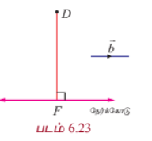

கொடுக்கப்பட்ட $(-1, 2, 3)$ என்ற புள்ளியை $D$ எனவும், கோட்டின் மீதுள்ள $(-4, 3, 0)$ என்ற புள்ளியை $F$ எனவும் குறிக்கலாம். $F$ என்பது $D$ -யிலிருந்து கொடுக்கப்பட்ட நேர்க்கோட்டிற்கு வரையப்படும் செங்குத்துக் கோட்டின் அடி எனில், $F$ என்ற புள்ளியின் அமைப்பு $(2t - 4, 3t + 3, t)$ ஆகும். மேலும்,

$$\overrightarrow{DF} = \overrightarrow{OF} - \overrightarrow{OD} = (2t - 3)\hat{i} + (3t + 1)\hat{j} + (t - 3)\hat{k}$$

$\vec{b}$ என்ற வெக்டர் $\overrightarrow{DF}$ -க்கு செங்குத்து என்பதால்,

$$\vec{b} \cdot \overrightarrow{DF} = 0 \Rightarrow 2(2t - 3) + 3(3t + 1) + 1(t - 3) = 0 \Rightarrow 14t - 6 = 0 \Rightarrow t = \frac{3}{7}$$

எனவே, $F$-ன் அச்சுத்தூரம் $\left(-\frac{22}{7}, \frac{30}{7}, \frac{3}{7}\right)$ ஆகும்.

கொடுக்கப்பட்ட புள்ளியிலிருந்து கொடுக்கப்பட்ட கோட்டிற்கு உள்ள செங்குத்துத் தூரம் (மீச்சிறு தூரம்)

$$|\overrightarrow{DF}| = \sqrt{(2t - 3)^2 + (3t + 1)^2 + (t - 3)^2}$$

$t = \frac{3}{7}$ என பிரதியிட,

$$|\overrightarrow{DF}| = \sqrt{\left(-\frac{15}{7}\right)^2 + \left(\frac{16}{7}\right)^2 + \left(-\frac{18}{7}\right)^2} = \frac{\sqrt{565}}{7}$$

அலகுகள்.

---

### பயிற்சி 6.5

1. $(5, -2, 8)$ என்ற புள்ளி வழிச் செல்வதும் $\vec{r} = (\hat{i} + \hat{j} - \hat{k}) + s(2\hat{i} - 2\hat{j} + \hat{k})$ மற்றும் $\vec{r} = (2\hat{i} - 3\hat{j} - \hat{k}) + t(\hat{i} + 2\hat{j} - 2\hat{k})$ ஆகிய கோடுகளுக்குச் செங்குத்தானதுமான நேர்க்கோட்டின் துணை அலகு வெக்டர் சமன்பாடு மற்றும் கார்டீசியன் சமன்பாடுகளைக் காண்க.

2. $\vec{r} = (6\hat{i} + 2\hat{j} + \hat{k}) + s(\hat{i} - 2\hat{j} + 3\hat{k})$ மற்றும் $\vec{r} = (3\hat{i} + 2\hat{j} - 2\hat{k}) + t(2\hat{i} + 4\hat{j} - 5\hat{k})$ என்பன ஒரு தளம் அமையாக் கோடுகள் எனக் காட்டுக. மேலும், அக்கோடுகளுக்கு இடைப்பட்ட மீச்சிறு தூரத்தைக் காண்க.

3. $$\frac{x - 1}{2} = \frac{y + 1}{3} = \frac{z - 1}{4}$$

மற்றும்

$$\frac{x - 3}{1} = \frac{y - m}{2} = z$$

என்ற கோடுகள் ஒரு புள்ளியில் வெட்டிக் கொள்ளும் எனில், $m$ -ன் மதிப்பைக் காண்க.

4. $x - 3 = \frac{y - 3}{-1} = z - 10$ மற்றும் $x - 6 = \frac{y - 2}{-3} = z - 20$ என்ற கோடுகள் வெட்டிக் கொள்ளும் எனக் காட்டுக. மேலும், அவை வெட்டும் புள்ளியைக் காண்க.

5. $x + 1 = 2y - 2 = -z$ மற்றும் $x = y + 6 = -2z - 6$ என்ற கோடுகள் ஒரு தளம் அமையாக் கோடுகள் எனக் காட்டி, அவற்றிற்கு இடைப்பட்ட மீச்சிறு தூரத்தையும் காண்க.

6. $(-1, 2, 1)$ என்ற புள்ளி வழிச் செல்வதும் $\vec{r} = (2\hat{i} + 3\hat{j} - \hat{k}) + t(-\hat{i} + 2\hat{j} + \hat{k})$ என்ற நேர்க்கோட்டிற்கு இணையானதுமான நேர்க்கோட்டின் துணை அலகு வெக்டர் சமன்பாட்டைக் காண்க. மேலும், இக்கோடுகளுக்கு இடைப்பட்ட மீச்சிறு தூரத்தையும் காண்க.

7. $(5, -4, 2)$ என்ற புள்ளியிலிருந்து

$$\frac{x + 1}{2} = \frac{y - 3}{-1} = \frac{z - 1}{3}$$

என்ற நேர்க்கோட்டிற்கு வரையப்படும் செங்குத்துக் கோட்டின் அடியைக் காண்க. மேலும், இச்செங்குத்துக் கோட்டின் சமன்பாட்டைக் காண்க.

### 6.8 ஒரு தளத்தின் பல்வேறு வகைச் சமன்பாடுகள்
### (Different forms of Equation of a plane)

தளம் என்பதன் கருத்தாக்கத்தை நாம் ஏற்கனவே கற்றறிந்துள்ளோம்.

#### வரையறை 6.8

ஒரு தளத்திற்குச் செங்குத்தாக உள்ள வெக்டர் அத்தளத்தின் **செங்குத்து** அல்லது **செங்கோடு** என்கிறோம்.

#### குறிப்பு

ஒரு தளத்தின் செங்கோடானது, அத்தளத்தில் உள்ள ஒவ்வொரு நேர்க்கோட்டிற்கும் செங்குத்தாகும்.

பின்வருவனவற்றில் ஏதேனும் ஒன்று கொடுக்கப்பட்டால், ஒரு தளத்தை தனித்ததாக தீர்மானிக்கலாம்:

- தளத்திற்குச் செங்குத்தான ஓரலகு வெக்டர் மற்றும் ஆதிப்புள்ளியில் இருந்து அத்தளத்திற்கு உள்ள தூரம்.
- தளத்தின் மீதான ஒரு புள்ளி மற்றும் தளத்தின் ஒரு செங்கோடு.
- ஒரே கோட்டிலமையாத மூன்று புள்ளிகள்.
- தளத்தின் மீதுள்ள ஒரு புள்ளி மற்றும் தளத்திற்கு இணையாக உள்ள இரண்டு இணை அல்லாத கோடுகள் அல்லது வெக்டர்கள்.
- தளத்தின் மீதுள்ள இரு தனித்த புள்ளிகள் மற்றும் தளத்திற்கு இணையாக உள்ள ஆனால் இவ்விரு புள்ளிகளைச் சேர்க்கும் கோட்டிற்கு இணையாக இல்லாத ஒரு நேர்க்கோடு அல்லது ஒரு பூச்சியமற்ற வெக்டர்.

தளங்களின் வெக்டர் மற்றும் கார்டீசியன் சமன்பாடுகளை மேற்கண்ட நிலைகளைப் பயன்படுத்திக் காண்போம்.

---

### 6.8.1 தளத்தின் ஒரு செங்கோடு மற்றும் ஆதிப்புள்ளியிலிருந்து தளத்திற்கு உள்ள தூரம் கொடுக்கப்பட்டால் தளத்தின் சமன்பாடு
### (Equation of a plane when a normal to the plane and the distance of the plane from the origin are given)

#### (a) செங்கோட்டு வடிவ வெக்டர் சமன்பாடு (Vector equation of a plane in normal form)

##### தேற்றம் 6.15

ஆதிப்புள்ளியிலிருந்து தளத்திற்கு உள்ள தூரம் $p$ மற்றும் தளத்திற்குச் செங்குத்தான ஓரலகு வெக்டர் $\hat{d}$ எனில், தளத்தின் சமன்பாடு $\vec{r} \cdot \hat{d} = p$ ஆகும்.

#### நிரூபணம்

ஆதிப்புள்ளியிலிருந்து $p$ தொலைவில் உள்ள தளத்தினை கருதுக. ஆதிப்புள்ளி $O$ -விலிருந்து தளத்திற்கு வரையப்படும் செங்கோட்டின் அடி $A$ என்க.

$\overrightarrow{OA}$ -ன் திசையில் உள்ள ஓரலகு செங்குத்து வெக்டர் $\hat{d}$ என்க.

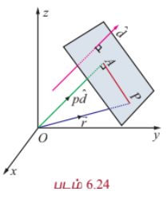

பின்னர், $\overrightarrow{OA} = p\hat{d}$ ஆகும்.

$\vec{r}$ என்பது தளத்தில் உள்ள ஏதேனும் ஒரு புள்ளி $P$-ன் நிலைவெக்டர் எனில், $\overrightarrow{AP}$ என்பது $\overrightarrow{OA}$ வுக்குச் செங்குத்தாகும்.

எனவே, $\overrightarrow{AP} \cdot \overrightarrow{OA} = 0 \Rightarrow (\vec{r} - p\hat{d}) \cdot p\hat{d} = 0$

$$\Rightarrow (\vec{r} - p\hat{d}) \cdot \hat{d} = 0$$

$$\vec{r} \cdot \hat{d} = p$$

... (1)

இச்சமன்பாடு, தளத்தின் **செங்கோட்டு வடிவ வெக்டர் சமன்பாடு** எனப்படும்.

---

#### (b) செங்கோட்டு வடிவ கார்டீசியன் சமன்பாடு (Cartesian equation of a plane in normal form)

$\hat{d}$ -ன் திசைக்கொசைன்கள் $l, m, n$ என்க. எனவே, $\hat{d} = l\hat{i} + m\hat{j} + n\hat{k}$ ஆகும்.

இதனைச் சமன்பாடு (1)-ல் பிரதியிட,

$$\vec{r} \cdot (l\hat{i} + m\hat{j} + n\hat{k}) = p$$

$P$ என்பது $(x, y, z)$ எனில், $\vec{r} = x\hat{i} + y\hat{j} + z\hat{k}$ ஆகும்.

எனவே, $(x\hat{i} + y\hat{j} + z\hat{k}) \cdot (l\hat{i} + m\hat{j} + n\hat{k}) = p$ அல்லது $lx + my + nz = p$

... (2)

சமன்பாடு (2) ஆனது தளத்தின் **செங்கோட்டு வடிவ கார்டீசியன் சமன்பாடு** எனப்படும்.

#### குறிப்புரை

(i) ஆதிப்புள்ளி வழியாக தளம் செல்லுமெனில், $p = 0$ ஆகும். எனவே, தளத்தின் சமன்பாடு $lx + my + nz = 0$.

(ii) $\vec{d}$ என்பது தளத்திற்கு செங்குத்தான வெக்டர் எனில், $\hat{d} = \frac{\vec{d}}{|\vec{d}|}$ என்பது தளத்திற்குச் செங்குத்தான ஓரலகு வெக்டராகும். எனவே, தளத்தின் சமன்பாடு $\vec{r} \cdot \frac{\vec{d}}{|\vec{d}|} = p$ அல்லது $\vec{r} \cdot \vec{d} = q$, இங்கு $q = p|\vec{d}|$ என்றாகும். $\vec{r} \cdot \vec{d} = q$ என்ற சமன்பாடு தளத்தின் **திட்ட வடிவ வெக்டர் சமன்பாடு** எனப்படும்.

#### குறிப்பு

$\vec{r} \cdot \vec{d} = q$ என்ற திட்ட வடிவச் சமன்பாட்டில், $\vec{d}$ என்பது ஓரலகு செங்குத்து வெக்டராகவோ, $q$ என்பது செங்குத்துத் தொலைவாகவோ இருக்கத் தேவையில்லை.

---

### 6.8.2 ஒரு வெக்டருக்கு செங்குத்தாக கொடுக்கப்பட்ட ஒரு புள்ளி வழியாகச் செல்லும் தளத்தின் சமன்பாடு
### (Equation of a plane perpendicular to a vector and passing through a given point)

#### (a) வெக்டர் சமன்பாடு (Vector form of equation)

$\vec{a}$ என்ற வெக்டரை நிலை வெக்டராகக் கொண்ட புள்ளி $A$ வழியாகச் செல்வதும் $\vec{n}$ -க்கு செங்குத்தானதுமான தளத்தைக் கருதுக. தளத்தின் மீதுள்ள ஏதேனும் ஒரு புள்ளி $P$-ன் நிலை வெக்டர் $\vec{r}$ என்க.

எனவே $\overrightarrow{AP}$ என்பது $\vec{n}$ -க்கு செங்குத்தாகும்.

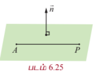

$$\Rightarrow \overrightarrow{AP} \cdot \vec{n} = 0 \Rightarrow (\vec{r} - \vec{a}) \cdot \vec{n} = 0$$

... (1)

இச்சமன்பாடு $\vec{a}$ என்ற வெக்டரை நிலைவெக்டராகக் கொண்ட புள்ளி வழியாகச் செல்வதும் $\vec{n}$ -க்கு செங்குத்தானதுமான தளத்தின் வெக்டர் சமன்பாடாகும்.

#### குறிப்பு

$$(\vec{r} - \vec{a}) \cdot \vec{n} = 0 \Rightarrow \vec{r} \cdot \vec{n} = \vec{a} \cdot \vec{n} \Rightarrow \vec{r} \cdot \vec{n} = q, \text{ இங்கு } q = \vec{a} \cdot \vec{n}$$

---

#### (b) கார்டீசியன் சமன்பாடு (Cartesian form of equation)

$a, b, c$ என்பன $\vec{n}$ -ன் திசை விகிதங்கள் எனில், $\vec{n} = a\hat{i} + b\hat{j} + c\hat{k}$ ஆகும். $A$-ன் அச்சுத்தூரங்கள் $(x_1, y_1, z_1)$ என்க. எனவே, சமன்பாடு (1)லிருந்து,

$$((x - x_1)\hat{i} + (y - y_1)\hat{j} + (z - z_1)\hat{k}) \cdot (a\hat{i} + b\hat{j} + c\hat{k}) = 0$$

$$\Rightarrow a(x - x_1) + b(y - y_1) + c(z - z_1) = 0$$

இது $(x_1, y_1, z_1)$ என்ற புள்ளி வழியாகச் செல்வதும் $a, b, c$ என்பவற்றை திசை விகிதங்களாகக் கொண்ட வெக்டருக்கு செங்குத்தானதுமான தளத்தின் கார்டீசியன் சமன்பாடாகும்.

---

### 6.8.3 தளத்தின் வெட்டுத்துண்டு வடிவச் சமன்பாடு
### (Intercept form of the equation of a plane)

$\vec{r} \cdot \vec{n} = q$ என்ற தளம் $OA = a, OB = b, OC = c$ என்ற வெட்டுத் துண்டுகளை ஏற்படுத்துமாறு ஆய அச்சுக்களை $A, B, C$ என்ற புள்ளிகளில் சந்திக்கிறது என்க. எனவே, $A$ -ன் நிலை வெக்டர் $a\hat{i}$ ஆகும்.

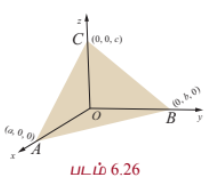

$A$ என்ற இப்புள்ளி கொடுக்கப்பட்ட தளத்தின் மீது உள்ளதால், $(a\hat{i}) \cdot \vec{n} = q$ ஆகும். இதிலிருந்து $\hat{i} \cdot \vec{n} = \frac{q}{a}$ ஆகும்.

இவ்வாறே, $b\hat{j}$ மற்றும் $c\hat{k}$ என்ற வெக்டர்களும் கொடுக்கப்பட்ட தளத்தில் உள்ளதால், $\hat{j} \cdot \vec{n} = \frac{q}{b}$ மற்றும் $\hat{k} \cdot \vec{n} = \frac{q}{c}$ எனக்கிடைக்கிறது.

$\vec{r} = x\hat{i} + y\hat{j} + z\hat{k}$ என $\vec{r} \cdot \vec{n} = q$ -ல் பிரதியிட, நாம் பெறுவது

$$x(\hat{i} \cdot \vec{n}) + y(\hat{j} \cdot \vec{n}) + z(\hat{k} \cdot \vec{n}) = q$$

எனவே, $\frac{qx}{a} + \frac{qy}{b} + \frac{qz}{c} = q$

$$\Rightarrow \frac{x}{a} + \frac{y}{b} + \frac{z}{c} = 1$$

இது $a, b, c$ என்ற வெட்டுத் துண்டுகளை முறையே $x, y, z$ அச்சுக்களில் ஏற்படுத்தும் தளத்தின் **வெட்டுத் துண்டு வடிவச் சமன்பாடாகும்**.

---

### தேற்றம் 6.16

$x, y, z$ -ல் உள்ள $ax + by + cz + d = 0$ என்ற நேரியச் சமன்பாடு ஒரு தளத்தைக் குறிக்கும்.

#### நிரூபணம்

$ax + by + cz + d = 0$ என்ற சமன்பாட்டை வெக்டர் சமன்பாடாக

$$(x\hat{i} + y\hat{j} + z\hat{k}) \cdot (a\hat{i} + b\hat{j} + c\hat{k}) = -d$$

அல்லது $\vec{r} \cdot \vec{n} = -d$ என எழுதலாம்.

இச்சமன்பாடு ஒரு தளத்தின் திட்ட வடிவ வெக்டர் சமன்பாடாகும். எனவே, கொடுக்கப்பட்ட சமன்பாடு $ax + by + cz + d = 0$ என்பது ஒரு தளத்தைக் குறிக்கிறது. இங்கு $\vec{n} = a\hat{i} + b\hat{j} + c\hat{k}$ என்ற வெக்டர் தளத்திற்குச் செங்குத்தான வெக்டராகும்.

#### குறிப்பு

ஒரு தளத்தின் பொது வடிவச் சமன்பாடு $ax + by + cz + d = 0$ -ல் உள்ள $a, b, c$ என்பன தளத்தின் செங்குத்தின் அல்லது செங்கோட்டின் திசை விகிதங்கள் ஆகும்.

---

### எடுத்துக்காட்டு 6.38

ஆதியில் இருந்து 12 அலகுகள் தூரத்தில் இருப்பதும் $6\hat{i} + 2\hat{j} - 3\hat{k}$ என்ற வெக்டருக்குச் செங்குத்தானதாகவும் உள்ள தளத்தின் வெக்டர் மற்றும் கார்டீசியன் சமன்பாடுகளைக் காண்க.

#### தீர்வு

இங்கு, $\vec{d} = 6\hat{i} + 2\hat{j} - 3\hat{k}$ மற்றும் $p = 12$ என்க.

$6\hat{i} + 2\hat{j} - 3\hat{k}$ என்ற வெக்டரின் திசையில் உள்ள ஓரலகு வெக்டர் $\hat{d}$ எனில்,

$$\hat{d} = \frac{\vec{d}}{|\vec{d}|} = \frac{1}{7}(6\hat{i} + 2\hat{j} - 3\hat{k})$$

$\vec{r}$ என்பது தளத்தில் உள்ள ஏதேனுமொரு புள்ளி $(x, y, z)$ -ன் நிலைவெக்டர் எனில், தளத்தின் செங்கோட்டு வடிவ வெக்டர் சமன்பாடு $\vec{r} \cdot \hat{d} = p$ -ஐப் பயன்படுத்தி நாம் பெறுவது,

$$\frac{1}{7}\vec{r} \cdot (6\hat{i} + 2\hat{j} - 3\hat{k}) = 12$$

$\vec{r} = x\hat{i} + y\hat{j} + z\hat{k}$ என இச்சமன்பாட்டில் பிரதியிடக் கிடைப்பது

$$\frac{1}{7}(x\hat{i} + y\hat{j} + z\hat{k}) \cdot (6\hat{i} + 2\hat{j} - 3\hat{k}) = 12$$

புள்ளிப் பெருக்கலைப் பயன்படுத்திச் சுருக்கினால் கிடைக்கும் $6x + 2y - 3z = 84$ என்ற சமன்பாடு தேவையான தளத்தின் கார்டீசியன் சமன்பாடாகும்.

---

### எடுத்துக்காட்டு 6.39

ஒரு தளத்தின் கார்டீசியன் சமன்பாடு $3x - 4y + 3z = -8$ எனில், தளத்தின் வெக்டர் சமன்பாட்டை திட்ட வடிவில் காண்க.

#### தீர்வு

$\vec{r} = x\hat{i} + y\hat{j} + z\hat{k}$ என்பது தளத்தில் உள்ள ஏதேனுமொரு புள்ளி $(x, y, z)$ -ன் நிலைவெக்டர் என்க.

கொடுக்கப்பட்ட சமன்பாட்டை $(x\hat{i} + y\hat{j} + z\hat{k}) \cdot (3\hat{i} - 4\hat{j} + 3\hat{k}) = -8$ அல்லது $\vec{r} \cdot (3\hat{i} - 4\hat{j} + 3\hat{k}) = -8$ என எழுதலாம்.

இது கொடுக்கப்பட்ட தளத்தின் திட்ட வடிவ வெக்டர் சமன்பாடாகும்.

---

### எடுத்துக்காட்டு 6.40

$\vec{r} \cdot (3\hat{i} - 4\hat{j} + 12\hat{k}) = 5$ என்ற தளத்தின் செங்குத்தின் திசைக் கொசைன்கள் மற்றும் ஆதியிலிருந்து தளத்திற்கு வரையப்படும் செங்குத்தின் நீளம் ஆகியவற்றைக் காண்க.

#### தீர்வு

$\vec{d} = 3\hat{i} - 4\hat{j} + 12\hat{k}$ மற்றும் $q = 5$ என்க.

$3\hat{i} - 4\hat{j} + 12\hat{k}$ -ன் திசையில் உள்ள ஓரலகு வெக்டர் $\hat{d}$ எனில்

$$\hat{d} = \frac{1}{13}(3\hat{i} - 4\hat{j} + 12\hat{k})$$

ஆகும்.

கொடுக்கப்பட்ட சமன்பாட்டை 13 -ஆல் வகுக்க, நாம் பெறுவது

$$\vec{r} \cdot \left(\frac{3}{13}\hat{i} - \frac{4}{13}\hat{j} + \frac{12}{13}\hat{k}\right) = \frac{5}{13}$$

இது $\vec{r} \cdot \hat{d} = p$ எனும் தளத்தின் செங்கோட்டு வடிவச் சமன்பாடாகும்.

இச்சமன்பாட்டிலிருந்து $\hat{d} = \frac{1}{13}(3\hat{i} - 4\hat{j} + 12\hat{k})$ என்பது ஆதியிலிருந்து தளத்திற்கு வரையப்பட்ட ஓரலகு செங்குத்து வெக்டராகும் என அறிகிறோம். எனவே, $\hat{d}$ -ன் திசைக்கொசைன்கள் $\frac{3}{13}, -\frac{4}{13}, \frac{12}{13}$ மற்றும் ஆதியில் இருந்து தளத்திற்கு வரையப்படும் செங்குத்தின் நீளம் $\frac{5}{13}$ ஆகும்.

---

### எடுத்துக்காட்டு 6.41

$4\hat{i} + 2\hat{j} - 3\hat{k}$ என்ற வெக்டரை நிலைவெக்டராகக் கொண்ட புள்ளி வழிச் செல்வதும் $2\hat{i} - \hat{j} + \hat{k}$ என்ற வெக்டருக்குச் செங்குத்தானதுமான தளத்தின் வெக்டர் மற்றும் கார்டீசியன் சமன்பாடுகளைக் காண்க.

#### தீர்வு

கொடுக்கப்பட்ட புள்ளியின் நிலை வெக்டர் $\vec{a} = 4\hat{i} + 2\hat{j} - 3\hat{k}$ மற்றும் $\vec{n} = 2\hat{i} - \hat{j} + \hat{k}$ என்க.

கொடுக்கப்பட்ட புள்ளி வழியாகச் செல்வதும், தளத்திற்குச் செங்குத்தான வெக்டரைக் கொண்டதுமான தளத்தின் வெக்டர் சமன்பாடு $(\vec{r} - \vec{a}) \cdot \vec{n} = 0$ அல்லது $\vec{r} \cdot \vec{n} = \vec{a} \cdot \vec{n}$.

எனவே, தேவையான தளத்தின் வெக்டர் சமன்பாடு காண இச்சமன்பாட்டில் $\vec{a} = 4\hat{i} + 2\hat{j} - 3\hat{k}$ மற்றும் $\vec{n} = 2\hat{i} - \hat{j} + \hat{k}$ எனப்பிரதியிட, நாம் பெறுவது

$$\vec{r} \cdot (2\hat{i} - \hat{j} + \hat{k}) = (4\hat{i} + 2\hat{j} - 3\hat{k}) \cdot (2\hat{i} - \hat{j} + \hat{k})$$

$$\Rightarrow \vec{r} \cdot (2\hat{i} - \hat{j} + \hat{k}) = 3$$

$\vec{r} = x\hat{i} + y\hat{j} + z\hat{k}$ எனப்பிரதியிடக் கிடைப்பது $2x - y + z = 3$ ஆகும். இதுவே தேவையான தளத்தின் கார்டீசியன் சமன்பாடாகும்.

---

### எடுத்துக்காட்டு 6.42

ஒரு நகரும் தளம் ஆய அச்சுக்களில் ஏற்படுத்தும் வெட்டுத் துண்டுகளின் தலைகீழிகளின் கூடுதல் ஒரு மாறிலியாக இருக்குமாறு நகர்கிறது எனில், அத்தளமானது ஒரு நிலைத்த புள்ளி வழியாகச் செல்கிறது எனக்காட்டுக.

#### தீர்வு

$x, y, z$ அச்சுகளில் முறையே $a, b, c$ என்ற வெட்டுத் துண்டுகளை ஏற்படுத்தும் தளத்தின் சமன்பாடு $\frac{x}{a} + \frac{y}{b} + \frac{z}{c} = 1$ ஆகும். ஆய அச்சுகளில் ஏற்படுத்தும் வெட்டுத்துண்டுகளின் தலைகீழிகளின் கூடுதல் ஒரு மாறிலி என்பதால் $\frac{1}{a} + \frac{1}{b} + \frac{1}{c} = k$ ஆகும். இங்கு, $k$ ஒரு மாறிலி. இதனை

$$\frac{x}{a} + \frac{y}{b} + \frac{z}{c} = 1$$

$$k\left(\frac{x}{a} + \frac{y}{b} + \frac{z}{c}\right) = k$$

$$\frac{x}{1/k} + \frac{y}{1/k} + \frac{z}{1/k} = 1$$

$$x + y + z = \frac{1}{k}$$

என எழுதலாம்.

இச்சமன்பாடு, $\frac{x}{a} + \frac{y}{b} + \frac{z}{c} = 1$ என்ற தளமானது $\left(\frac{1}{k}, \frac{1}{k}, \frac{1}{k}\right)$ என்ற நிலையான புள்ளி வழியாகச் செல்கிறது எனக் காட்டுகிறது.

---

### பயிற்சி 6.6

1. ஆதிப்புள்ளியில் இருந்து 7 அலகுகள் தொலைவில் உள்ளதும், செங்குத்தின் திசை விகிதங்கள் $3, -4, 5$ கொண்டதுமான தளத்தின் வெக்டர் சமன்பாடு காண்க.

2. $12x + 3y - 4z = 65$ என்ற தளத்தின் செங்குத்தின் திசைக்கொசைன்களைக் காண்க. மேலும், தளத்தின் துணை அலகு அல்லாத வெக்டர் சமன்பாடு மற்றும் ஆதியில் இருந்து தளத்திற்கு வரையப்படும் செங்குத்தின் நீளம் காண்க.

3. $2\hat{i} + 6\hat{j} + 3\hat{k}$ என்ற நிலை வெக்டரை கொண்ட புள்ளி வழியாகச் செல்வதும் $\hat{i} + 3\hat{j} + 5\hat{k}$ என்ற வெக்டருக்குச் செங்குத்தானதுமான தளத்தின் வெக்டர் மற்றும் கார்டீசியன் சமன்பாடுகளைக் காண்க.

4. $(-1, 1, 2)$ என்ற புள்ளி வழியாகச் செல்வதும் ஆய அச்சுகளுடன் சமகோணத்தை ஏற்படுத்தும் எண்ணளவு $3\sqrt{3}$ கொண்ட செங்கோட்டைக் கொண்டதுமான தளத்தின் வெக்டர் மற்றும் கார்டீசியன் சமன்பாடுகளைக் காண்க.

5. $\vec{r} \cdot (6\hat{i} + 4\hat{j} - 3\hat{k}) = 12$ என்ற தளம் ஆய அச்சுகளுடன் ஏற்படுத்தும் வெட்டுத்துண்டுகளைக் காண்க.

6. ஒரு தளம் ஆய அச்சுகளை முறையே $A, B, C$ என்ற புள்ளிகளில் வெட்டுவதால் உருவாகும் முக்கோணம் $ABC$ -ன் மையக்கோட்டுச் சந்தி $(u, v, w)$ எனில், தளத்தின் சமன்பாட்டைக் காண்க.

---

### 6.8.4 கொடுக்கப்பட்ட ஒரே கோட்டிலமையாத மூன்று புள்ளிகள் வழியாகச் செல்லும் தளத்தின் சமன்பாடு
### (Equation of a plane passing through three given non-collinear points)

#### (a) துணை அலகு வெக்டர் சமன்பாடு (Parametric form of vector equation)

##### தேற்றம் 6.17

$\vec{a}, \vec{b}, \vec{c}$ என்பன ஒரே கோட்டிலமையாத மூன்று புள்ளிகளின் நிலை வெக்டர்கள் எனில், கொடுக்கப்பட்ட இம்மூன்று புள்ளிகள் வழியாகச் செல்லும் தளத்தின் துணை அலகு வெக்டர் சமன்பாடு

$$\vec{r} = \vec{a} + s(\vec{b} - \vec{a}) + t(\vec{c} - \vec{a}), \text{ இங்கு } \vec{b} \neq 0, \vec{c} \neq 0 \text{ மற்றும் } s, t \in \mathbb{R} \text{ ஆகும்}$$

#### நிரூபணம்

ஒரே கோட்டிலமையாத முறையே $\vec{a}, \vec{b}, \vec{c}$ என்ற வெக்டர்களை நிலை வெக்டர்களாகக் கொண்ட $A, B, C$ என்ற புள்ளிகள் வழியாக தேவையான தளம் செல்கிறது என்க. ஆகவே, இவற்றில் குறைந்தது இரு வெக்டர்கள் பூச்சியமற்ற வெக்டர்களாக இருக்கும். நாம் $\vec{b} \neq 0$ மற்றும் $\vec{c} \neq 0$ எனக் கொள்வோம். தளத்தின் மீதுள்ள ஏதேனும் ஒரு புள்ளி $P$ -ன் நிலைவெக்டர் $\vec{r}$ என்க. $\overrightarrow{AD}$ என்பது $\overrightarrow{AB}$ -க்கு இணையாக இருக்குமாறும் மற்றும் $\overrightarrow{DP}$ என்பது $\overrightarrow{AC}$ -க்கு இணையாக இருக்குமாறும் $AB$ -ஐ நீட்டித்து அதன் மேல் $D$ என்ற புள்ளியை எடுத்துக் கொள்க. எனவே,

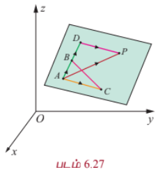

$$\overrightarrow{AD} = s(\vec{b} - \vec{a}), \quad \overrightarrow{DP} = t(\vec{c} - \vec{a})$$

முக்கோணம் $ADP$ -ல்,

$$\overrightarrow{AP} = \overrightarrow{AD} + \overrightarrow{DP}$$

அல்லது

$$\vec{r} - \vec{a} = s(\vec{b} - \vec{a}) + t(\vec{c} - \vec{a}),$$

இங்கு $\vec{b} \neq 0, \vec{c} \neq 0$ மற்றும் $s, t \in \mathbb{R}$.

அதாவது,

$$\vec{r} = \vec{a} + s(\vec{b} - \vec{a}) + t(\vec{c} - \vec{a})$$

இது கொடுக்கப்பட்ட ஒரே கோட்டிலமையாத மூன்று புள்ளிகள் வழியாகச் செல்லும் தளத்தின் துணை அலகு வெக்டர் சமன்பாடாகும்.

---

#### (b) துணை அலகு அல்லாத வெக்டர் சமன்பாடு (Non-parametric form of vector equation)

ஒரே கோட்டிலமையாத முறையே $\vec{a}, \vec{b}, \vec{c}$ என்ற வெக்டர்களை நிலைவெக்டர்களாகக் கொண்ட $A, B, C$ என்ற புள்ளிகள் வழியாகத் தேவையான தளம் செல்கிறது என்க. ஆகவே இவற்றில் குறைந்தது இரு வெக்டர்களாவது பூச்சியமற்றதாக இருக்கும். நாம் $\vec{b} \neq 0$ மற்றும் $\vec{c} \neq 0$ எனக் கொள்வோம்.

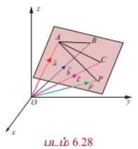

எனவே, $\overrightarrow{AB} = \vec{b} - \vec{a}$ மற்றும் $\overrightarrow{AC} = \vec{c} - \vec{a}$ ஆகும். $(\vec{b} - \vec{a})$ மற்றும் $(\vec{c} - \vec{a})$ என்ற வெக்டர்கள் தேவையான தளத்தில் உள்ளன. மேலும், $\vec{a}, \vec{b}, \vec{c}$ என்பன ஒரே கோட்டிலமையாத வெக்டர்கள் என்பதால், $\overrightarrow{AB}$ என்பது $\overrightarrow{AC}$ -க்கு இணையாக இருக்காது. எனவே, $(\vec{b} - \vec{a}) \times (\vec{c} - \vec{a})$ என்பது தளத்திற்கு செங்குத்தாகும்.

தளத்தில் உள்ள ஏதேனும் ஒரு புள்ளி $P(x, y, z)$ -ன் நிலை வெக்டர் $\vec{r}$ எனில், $\vec{a}$ என்ற வெக்டரை நிலை வெக்டராகக் கொண்ட புள்ளி $A$ வழியாகச் செல்வதும் $(\vec{b} - \vec{a}) \times (\vec{c} - \vec{a})$ என்ற வெக்டருக்கு செங்குத்தானதுமான தளத்தின் சமன்பாடு

$$(\vec{r} - \vec{a}) \cdot ((\vec{b} - \vec{a}) \times (\vec{c} - \vec{a})) = 0$$

அல்லது

$$[\vec{r} - \vec{a}, \vec{b} - \vec{a}, \vec{c} - \vec{a}] = 0$$

இது ஒரே கோட்டிலமையாத மூன்று புள்ளிகள் வழிச் செல்லும் தளத்தின் துணை அலகு அல்லாத வெக்டர் சமன்பாடாகும்.

---

#### (c) கார்டீசியன் சமன்பாடு (Cartesian form of equation)

$\vec{a}, \vec{b}, \vec{c}$ என்ற நிலைவெக்டர்களைக் கொண்ட ஒரே கோட்டிலமையாத மூன்று புள்ளிகள் $A, B, C$ என்பவற்றின் அச்சுத்தூரங்கள் முறையே $(x_1, y_1, z_1), (x_2, y_2, z_2), (x_3, y_3, z_3)$ மற்றும் $\vec{r}$ என்ற வெக்டரை நிலை வெக்டராகக் கொண்ட $P$ என்ற புள்ளியின் அச்சுத்தூரங்கள் $(x, y, z)$ எனில்,

$$\vec{a} = x_1\hat{i} + y_1\hat{j} + z_1\hat{k}, \quad \vec{b} = x_2\hat{i} + y_2\hat{j} + z_2\hat{k}, \quad \vec{c} = x_3\hat{i} + y_3\hat{j} + z_3\hat{k}$$

மற்றும்

$$\vec{r} = x\hat{i} + y\hat{j} + z\hat{k}$$

இவ்வெக்டர்களைப் பயன்படுத்தி, ஒரே கோட்டிலமையாத கொடுக்கப்பட்ட மூன்று புள்ளிகள் வழிச் செல்லும் தளத்தின் துணை அலகு அல்லாத வெக்டர் சமன்பாட்டினை பின்வருமாறு எழுதலாம்.

$$\begin{vmatrix}
x - x_1 & y - y_1 & z - z_1 \\
x_2 - x_1 & y_2 - y_1 & z_2 - z_1 \\
x_3 - x_1 & y_3 - y_1 & z_3 - z_1
\end{vmatrix} = 0$$

இதுவே ஒரே கோட்டிலமையாத மூன்று புள்ளிகள் வழிச் செல்லும் தளத்தின் கார்டீசியன் சமன்பாடாகும்.

---

### 6.8.5 கொடுக்கப்பட்ட ஒரு புள்ளி வழிச் செல்வதும் இணை அல்லாத இரண்டு வெக்டர்களுக்கு இணையாகவும் உள்ள தளத்தின் சமன்பாடு
### (Equation of a plane passing through a given point and parallel to two given non-parallel vectors)

#### (a) துணை அலகு வெக்டர் சமன்பாடு (Parametric form of vector equation)

$\vec{a}$ என்ற நிலை வெக்டரைக் கொண்ட கொடுக்கப்பட்ட புள்ளி $A$ வழிச் செல்வதும் கொடுக்கப்பட்ட இணை அல்லாத $\vec{b}, \vec{c}$ என்ற இரு வெக்டர்களுக்கு இணையாகவும் ஒரு தளம் உள்ளது என்க.

தளத்தின் மீதுள்ள ஏதேனும் ஒரு புள்ளி $P$ -ன் நிலை வெக்டர் $\vec{r}$ எனில், $(\vec{r} - \vec{a}), \vec{b}$ மற்றும் $\vec{c}$ என்பன ஒரு தள வெக்டர்களாகும்.

எனவே, $(\vec{r} - \vec{a})$ என்ற வெக்டர் $\vec{b}$ மற்றும் $\vec{c}$ என்ற வெக்டர்கள் அமைக்கும் தளத்தில் இருக்கும்.

ஆகவே, $\vec{r} - \vec{a} = s\vec{b} + t\vec{c}$ எனுமாறு $s, t \in \mathbb{R}$ என்ற திசையிலிகளைக் காணமுடியும். இதிலிருந்து

$$\vec{r} = \vec{a} + s\vec{b} + t\vec{c}, \text{ இங்கு } s, t \in \mathbb{R}$$

... (1)

எனப் பெறலாம்.

இது கொடுக்கப்பட்ட ஒரு புள்ளி வழிச் செல்வதும் இணை அல்லாத இரு வெக்டர்களுக்கு இணையானதுமான தளத்தின் **துணை அலகு வடிவ வெக்டர் சமன்பாடாகும்**.

---

#### (b) துணை அலகு அல்லாத வெக்டர் சமன்பாடு (Non-parametric form of vector equation)

சமன்பாடு (1)-ஐ பின்வருமாறு எழுதலாம்.

$$(\vec{r} - \vec{a}) \cdot (\vec{b} \times \vec{c}) = 0$$

... (2)

இது கொடுக்கப்பட்ட ஒரு புள்ளி வழிச் செல்வதும் கொடுக்கப்பட்ட இணை அல்லாத இரு வெக்டர்களுக்கு இணையானதுமான தளத்தின் **துணை அலகு அல்லாத வெக்டர் சமன்பாடாகும்**.

---

#### (c) கார்டீசியன் சமன்பாடு (Cartesian form of equation)

$\vec{a} = x_1\hat{i} + y_1\hat{j} + z_1\hat{k}, \quad \vec{b} = b_1\hat{i} + b_2\hat{j} + b_3\hat{k}, \quad \vec{c} = c_1\hat{i} + c_2\hat{j} + c_3\hat{k}$ மற்றும் $\vec{r} = x\hat{i} + y\hat{j} + z\hat{k}$ எனில், சமன்பாடு (2)-ஐ பின்வருமாறு எழுதலாம்.

$$\begin{vmatrix}
x - x_1 & y - y_1 & z - z_1 \\
b_1 & b_2 & b_3 \\
c_1 & c_2 & c_3
\end{vmatrix} = 0$$

இது கொடுக்கப்பட்ட ஒரு புள்ளி வழிச் செல்வதும் கொடுக்கப்பட்ட இணை அல்லாத இரு வெக்டர்களுக்கு இணையானதுமான தளத்தின் **கார்டீசியன் சமன்பாடாகும்**.

---

### 6.8.6 கொடுக்கப்பட்ட இரண்டு தனித்த புள்ளிகள் வழியாகச் செல்வதும் ஒரு பூச்சியமற்ற வெக்டருக்கு இணையாகவும் உள்ள தளத்தின் சமன்பாடு
### (Equation of a plane passing through two given distinct points and is parallel to a non-zero vector)

#### (a) துணை அலகு வெக்டர் சமன்பாடு (Parametric form of vector equation)

$\vec{a}, \vec{b}$ என்ற நிலை வெக்டர்களைக் கொண்ட இரு தனித்த புள்ளிகள் $A$ மற்றும் $B$ வழியாகச் செல்வதும் $\vec{c}$ என்ற பூச்சியமற்ற வெக்டருக்கு இணையானதுமான தளத்தின் துணை அலகு வடிவ வெக்டர் சமன்பாடு

$$\vec{r} = \vec{a} + s(\vec{b} - \vec{a}) + t\vec{c}$$

அல்லது

$$\vec{r} = (1 - s)\vec{a} + s\vec{b} + t\vec{c}$$

... (1)

இங்கு $s, t \in \mathbb{R}$, $(\vec{b} - \vec{a})$ மற்றும் $\vec{c}$ என்பன இணையான வெக்டர்கள் அல்ல.

---

#### (b) துணை அலகு அல்லாத வெக்டர் சமன்பாடு (Non-parametric form of vector equation)

சமன்பாடு (1)-ஐ துணை அலகு அல்லாத வெக்டர் சமன்பாடாக பின்வருமாறு எழுதலாம்

$$(\vec{r} - \vec{a}) \cdot ((\vec{b} - \vec{a}) \times \vec{c}) = 0$$

... (2)

இங்கு, $(\vec{b} - \vec{a})$ மற்றும் $\vec{c}$ என்பன இணை வெக்டர்கள் அல்ல.

---

#### (c) கார்டீசியன் சமன்பாடு (Cartesian form of equation)

$\vec{a} = x_1\hat{i} + y_1\hat{j} + z_1\hat{k}, \quad \vec{b} = x_2\hat{i} + y_2\hat{j} + z_2\hat{k}, \quad \vec{c} = c_1\hat{i} + c_2\hat{j} + c_3\hat{k} \neq 0$ மற்றும் $\vec{r} = x\hat{i} + y\hat{j} + z\hat{k}$ எனில் சமன்பாடு (2) -ஐ பின்வருமாறு எழுதலாம்.

$$\begin{vmatrix}
x - x_1 & y - y_1 & z - z_1 \\
x_2 - x_1 & y_2 - y_1 & z_2 - z_1 \\
c_1 & c_2 & c_3
\end{vmatrix} = 0$$

இதுவே, தேவையான தளத்தின் கார்டீசியன் சமன்பாடாகும்.

---

### எடுத்துக்காட்டு 6.43

$(0, 1, -5)$ என்ற புள்ளி வழிச் செல்லும் $\vec{r} = (2\hat{i} - \hat{j} + 4\hat{k}) + s(2\hat{i} + 3\hat{j} + 6\hat{k})$ மற்றும் $\vec{r} = (-3\hat{i} + \hat{j} + 5\hat{k}) + t(\hat{i} - \hat{j} + \hat{k})$ என்ற கோடுகளுக்கு இணையாக உள்ளதுமான தளத்தின் துணை அலகு அல்லாத வெக்டர் சமன்பாடு மற்றும் கார்டீசியன் சமன்பாடுகளைக் காண்க.

#### தீர்வு

தேவையான தளம் $\vec{b} = 2\hat{i} + 3\hat{j} + 6\hat{k}, \vec{c} = \hat{i} - \hat{j} + \hat{k}$ என்ற வெக்டர்களுக்கு இணையாகவும், $\vec{a}$ -ஐ நிலை வெக்டராகக் கொண்ட $(0, 1, -5)$ என்ற புள்ளி வழியாகவும் செல்வதைக் காண்கிறோம். மேலும், $\vec{b}$ மற்றும் $\vec{c}$ என்பன இணை வெக்டர்கள் அல்ல எனவும் காண்கிறோம்.

தேவையான தளத்தின் துணை அலகு அல்லாத வெக்டர் சமன்பாடு $(\vec{r} - \vec{a}) \cdot (\vec{b} \times \vec{c}) = 0$

... (1)

இப்பொழுது $\vec{a} = \hat{j} - 5\hat{k}$ மற்றும்

$$\vec{b} \times \vec{c} = \begin{vmatrix}
\hat{i} & \hat{j} & \hat{k} \\
2 & 3 & 6 \\
1 & -1 & 1
\end{vmatrix} = 9\hat{i} + 4\hat{j} - 5\hat{k}$$

என சமன்பாடு (1)-ல் பிரதியிட, நாம் பெறுவது

$$(\vec{r} - (\hat{j} - 5\hat{k})) \cdot (9\hat{i} + 4\hat{j} - 5\hat{k}) = 0$$

$$\Rightarrow \vec{r} \cdot (9\hat{i} + 4\hat{j} - 5\hat{k}) = 13$$

$\vec{r} = x\hat{i} + y\hat{j} + z\hat{k}$ என்பது தளத்தின் மீதுள்ள ஏதேனும் ஒரு புள்ளியின் நிலைவெக்டர் எனில், மேற்கண்ட சமன்பாட்டிலிருந்து தளத்தின் கார்டீசியன் சமன்பாட்டை $9x + 4y - 5z = 13$ எனப் பெறுகிறோம்.

---

### எடுத்துக்காட்டு 6.44

$(-1, 2, 0), (2, 2, -1)$ என்ற புள்ளிகள் வழியாகச் செல்வதும்

$$\frac{x - 1}{2} = \frac{y + 1}{1} = \frac{z - 1}{-1}$$

என்ற கோட்டிற்கு இணையாகவும் உள்ள தளத்தின் துணை அலகு வெக்டர் சமன்பாடு, துணை அலகு அல்லாத வெக்டர் சமன்பாடு மற்றும் கார்டீசியன் சமன்பாடுகளைக் காண்க.

#### தீர்வு

தேவையான தளம் கொடுக்கப்பட்ட கோட்டிற்கு இணை என்பதால், அத்தளம் $\vec{c} = \hat{i} + \hat{j} - \hat{k}$ என்ற வெக்டருக்கு இணையாகும் மற்றும் $\vec{a} = -\hat{i} + 2\hat{j}$, $\vec{b} = 2\hat{i} + 2\hat{j} - \hat{k}$ என்ற புள்ளிகள் வழியாகச் செல்லும்.

- தளத்தின் துணை அலகு வடிவ வெக்டர் சமன்பாடு $\vec{r} = \vec{a} + s(\vec{b} - \vec{a}) + t\vec{c}$, இங்கு $s, t \in \mathbb{R}$

$$\Rightarrow \vec{r} = (-\hat{i} + 2\hat{j}) + s(3\hat{i} - \hat{k}) + t(\hat{i} + \hat{j} - \hat{k}), \text{ இங்கு } s, t \in \mathbb{R}$$

- தளத்தின் துணை அலகு அல்லாத வெக்டர் சமன்பாடு $(\vec{r} - \vec{a}) \cdot ((\vec{b} - \vec{a}) \times \vec{c}) = 0$

இங்கு,

$$(\vec{b} - \vec{a}) \times \vec{c} = \begin{vmatrix}
\hat{i} & \hat{j} & \hat{k} \\
3 & 0 & -1 \\
1 & 1 & -1
\end{vmatrix} = 2\hat{i} + 2\hat{j} + 3\hat{k}$$

எனவே, $(\vec{r} - (-\hat{i} + 2\hat{j})) \cdot (2\hat{i} + 2\hat{j} + 3\hat{k}) = 0$

$$\Rightarrow \vec{r} \cdot (2\hat{i} + 2\hat{j} + 3\hat{k}) = 3$$

- $\vec{r} = x\hat{i} + y\hat{j} + z\hat{k}$ என்பது தளத்தில் உள்ள ஏதேனுமொரு புள்ளியின் நிலைவெக்டர் எனில், மேற்கண்ட சமன்பாட்டிலிருந்து தளத்தின் கார்டீசியன் சமன்பாட்டை $2x + 2y + 3z = 3$ எனப் பெறுகிறோம்.

---

### பயிற்சி 6.7

1. $(2, 3, 6)$ என்ற புள்ளி வழிச் செல்வதும்

$$\frac{x - 1}{2} = \frac{y - 1}{3} = \frac{z - 3}{1}$$

மற்றும்

$$\frac{x - 3}{2} = \frac{y + 3}{-5} = \frac{z - 1}{-3}$$

என்ற கோடுகளுக்கு இணையானதுமான தளத்தின் துணை அலகு அல்லாத வெக்டர் சமன்பாடு மற்றும் கார்டீசியன் சமன்பாடுகளைக் காண்க.

2. $(2, 2, 1), (9, 3, 6)$ ஆகிய புள்ளிகள் வழிச் செல்லக்கூடியதும் $2x + 6y + 6z = 9$ என்ற தளத்திற்குச் செங்குத்தாக அமைவதுமான தளத்தின் துணை அலகு அல்லாத வெக்டர் சமன்பாடு மற்றும் கார்டீசியன் சமன்பாடுகளைக் காண்க.

3. $(2, -2, 1), (1, -2, 3)$ என்ற புள்ளிகள் வழிச் செல்வதும் $(2, 1, -3)$ மற்றும் $(-1, 5, -8)$ என்ற புள்ளிகள் வழிச் செல்லும் நேர்க்கோட்டிற்கு இணையாகவும் அமையும் தளத்தின் துணை அலகு வெக்டர் சமன்பாடு, மற்றும் கார்டீசியன் சமன்பாடுகளைக் காண்க.

4. $(1, -2, 4)$ என்ற புள்ளி வழிச் செல்வதும் $x + 2y - 3z = 11$ என்ற தளத்திற்கு செங்குத்தாகவும்

$$\frac{x + 7}{3} = \frac{y}{-1} = \frac{z - 1}{1}$$

என்ற கோட்டிற்கு இணையாகவும் அமையும் தளத்தின் துணை அலகு அல்லாத வெக்டர் சமன்பாடு மற்றும் கார்டீசியன் சமன்பாடுகளைக் காண்க.

5. $\vec{r} = (-\hat{i} + \hat{j} - 3\hat{k}) + t(2\hat{i} - 4\hat{j} + \hat{k})$ என்ற கோட்டை உள்ளடக்கியதும் $\vec{r} \cdot (\hat{i} + 2\hat{j} + \hat{k}) = 8$ என்ற தளத்திற்குச் செங்குத்தானதுமான தளத்தின் துணை அலகு வடிவ வெக்டர், மற்றும் கார்டீசியன் சமன்பாடுகளைக் காண்க.

6. $(3, 6, -2), (-1, -2, 6)$, மற்றும் $(6, 4, -2)$ ஆகிய ஒரே கோட்டிலமையாத மூன்று புள்ளிகள் வழிச் செல்லும் தளத்தின் துணை அலகு, துணை அலகு அல்லாத வெக்டர், மற்றும் கார்டீசியன் சமன்பாடுகளைக் காண்க.

7. $\vec{r} = (6\hat{i} - 2\hat{j} + \hat{k}) + s(5\hat{i} - 4\hat{j} + \hat{k}) + t(-\hat{i} - \hat{j} - \hat{k})$ என்ற தளத்தின் துணை அலகு அல்லாத வெக்டர், மற்றும் கார்டீசியன் சமன்பாடுகளைக் காண்க.

---

### 6.8.7 ஒரு கோடு ஒரு தளத்தின் மீது அமைவதற்கான கட்டுப்பாடு
### (Condition for a line to lie in a plane)

கொடுக்கப்பட்ட ஒரு கோட்டின் மீதுள்ள ஒவ்வொரு புள்ளியும், தளத்தின் மீது இருக்கும் எனவும், தளத்தின் செங்கோடு கொடுக்கப்பட்ட நேர்க்கோட்டிற்கு செங்குத்தாக அமையும் எனவும் இருப்பின், அந்த நேர்க்கோடு தளத்தின் மீது அமையும். அதாவது,

(i) $\vec{r} = \vec{a} + t\vec{b}$ என்ற கோடு $\vec{r} \cdot \vec{n} = d$ என்ற தளத்தின் மீது இருந்தால் $\vec{a} \cdot \vec{n} = d$ மற்றும் $\vec{b} \cdot \vec{n} = 0$ ஆகும்.

(ii) $\frac{x - x_1}{a} = \frac{y - y_1}{b} = \frac{z - z_1}{c}$ என்ற கோடு $Ax + By + Cz + D = 0$ என்ற தளத்தின் மீது இருந்தால், $Ax_1 + By_1 + Cz_1 + D = 0$ மற்றும் $aA + bB + cC = 0$ ஆகும்.

---

### எடுத்துக்காட்டு 6.45

$$\frac{x - 3}{-4} = \frac{y - 4}{-7} = \frac{z + 3}{12}$$

என்ற கோடு $5x - y + z = 8$ என்ற தளத்தில் அமையுமா எனச் சரிபார்க்க.

#### தீர்வு

இங்கு, $(x_1, y_1, z_1) = (3, 4, -3)$ மற்றும் கோட்டின் திசை விகிதங்கள் $(a, b, c) = (-4, -7, 12)$ ஆகும். தளத்தின் செங்கோட்டின் திசை விகிதங்கள் $(A, B, C) = (5, -1, 1)$ ஆகும்.

கொடுக்கப்பட்ட புள்ளி $(x_1, y_1, z_1) = (3, 4, -3)$ ஆனது $5x - y + z = 8$ என்ற தளத்தை நிறைவு செய்வதைக் காண்கிறோம். ஆனால், $aA + bB + cC = (-4)(5) + (-7)(-1) + (12)(1) = -20 + 7 + 12 = -1 \neq 0$ என்பதால் தளத்தின் செங்கோடு கொடுக்கப்பட்ட கோட்டிற்கு செங்குத்தானது அல்ல. எனவே, கொடுக்கப்பட்ட கோடானது கொடுக்கப்பட்ட தளத்தின் மீது அமையாது.

---

### 6.8.8 இரண்டு கோடுகள் ஒரே தளத்தில் அமைவதற்கான நிபந்தனை
### (Condition for coplanarity of two lines)

#### (a) வெக்டர் வடிவக் கட்டுப்பாடு (Condition in vector form)

$\vec{r} = \vec{a} + s\vec{b}$ மற்றும் $\vec{r} = \vec{c} + t\vec{d}$ என்பன கொடுக்கப்பட்ட இரண்டு இணை அல்லாத ஒரு தளம் அமையும் கோடுகள் என்க.

ஆகவே, அவை ஒரே தளத்தில் இருக்கும். $\vec{a}$ மற்றும் $\vec{c}$ ஆகியவற்றை நிலைவெக்டர்களாகக் கொண்ட இரு புள்ளிகள் $A$ மற்றும் $C$ என்க. எனவே, $A$ மற்றும் $C$ என்ற இவ்விரு புள்ளிகளும் தளத்தின் மீது அமையும். $\vec{b}$ மற்றும் $\vec{d}$ என்ற வெக்டர்கள் தளத்திற்கு இணையாக உள்ள வெக்டர்கள் என்பதால், $\vec{b} \times \vec{d}$ என்பது தளத்திற்கு செங்குத்தாக அமையும். எனவே, $\overrightarrow{AC}$ என்பது $\vec{b} \times \vec{d}$ -க்கு செங்குத்தாகும். அதாவது,

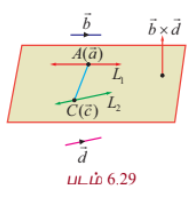

$$(\vec{c} - \vec{a}) \cdot (\vec{b} \times \vec{d}) = 0$$

இதுவே இரண்டு நேர்க்கோடுகள் ஒரே தளத்தில் அமைவதற்குத் தேவையான நிபந்தனையாகும்.

---

#### (b) கார்டீசியன் வடிவக் கட்டுப்பாடு (Condition in Cartesian form)

$$\frac{x - x_1}{b_1} = \frac{y - y_1}{b_2} = \frac{z - z_1}{b_3}$$

மற்றும்

$$\frac{x - x_2}{d_1} = \frac{y - y_2}{d_2} = \frac{z - z_2}{d_3}$$

என்ற கோடுகள் ஒரே தளத்தில் அமையும் எனில்,

$$\begin{vmatrix}
x_2 - x_1 & y_2 - y_1 & z_2 - z_1 \\
b_1 & b_2 & b_3 \\
d_1 & d_2 & d_3
\end{vmatrix} = 0$$

இதுவே, கொடுக்கப்பட்ட இரண்டு கோடுகள் ஒரே தளத்தில் அமைவதற்கான கார்டீசியன் வடிவக் கட்டுப்பாடு ஆகும்.

---

### 6.8.9 ஒரே தளத்தில் அமையும் இணை அல்லாத இரண்டு கோடுகளைக் கொண்டுள்ள தளத்தின் சமன்பாடு
### (Equation of plane containing two non-parallel coplanar lines)

#### (a) துணை அலகு வெக்டர் சமன்பாடு (Parametric form of vector equation)

$\vec{r} = \vec{a} + s\vec{b}$ மற்றும் $\vec{r} = \vec{c} + t\vec{d}$ என்பன ஒரே தளத்தில் அமையும் இணை அல்லாத இரண்டு கோடுகள் என்க. எனவே, $\vec{b} \times \vec{d} \neq 0$ ஆகும். $\vec{r}_0$ என்ற வெக்டரை நிலைவெக்டராகக் கொண்ட தளத்தில் உள்ள ஏதேனுமொரு புள்ளி $P$ என்க. ஆகவே, $\vec{r}_0 - \vec{a}, \vec{b}, \vec{d}$ மற்றும் $\vec{r}_0 - \vec{c}, \vec{b}, \vec{d}$ என்பன ஒரு தள வெக்டர்களாகும். ஆகையால், $\vec{r}_0 - \vec{a} = t\vec{b} + s\vec{d}$ அல்லது $\vec{r}_0 - \vec{c} = t\vec{b} + s\vec{d}$ ஆகும். எனவே, தேவையான தளத்தின் துணை அலகு வெக்டர் சமன்பாடு $\vec{r} = \vec{a} + t\vec{b} + s\vec{d}$ அல்லது $\vec{r} = \vec{c} + t\vec{b} + s\vec{d}$ ஆகும்.

---

#### (b) துணை அலகு அல்லாத வெக்டர் சமன்பாடு (Non-parametric form of vector equation)

$\vec{r} = \vec{a} + s\vec{b}$ மற்றும் $\vec{r} = \vec{c} + t\vec{d}$ என்பன ஒரே தளத்தில் அமையும் இணை அல்லாத இரண்டு கோடுகள் என்க. எனவே, $\vec{b} \times \vec{d} \neq 0$ ஆகும். $\vec{r}_0$ என்ற வெக்டரை நிலை வெக்டராகக் கொண்ட தளத்தில் உள்ள ஏதேனுமொரு புள்ளி $P$ என்க. ஆகவே, $\vec{r}_0 - \vec{a}, \vec{b}, \vec{d}$ மற்றும் $\vec{r}_0 - \vec{c}, \vec{b}, \vec{d}$ என்பன ஒரு தள வெக்டர்களாகும். ஆகையால், $(\vec{r}_0 - \vec{a}) \cdot (\vec{b} \times \vec{d}) = 0$ அல்லது $(\vec{r}_0 - \vec{c}) \cdot (\vec{b} \times \vec{d}) = 0$ ஆகும்.

எனவே, $(\vec{r} - \vec{a}) \cdot (\vec{b} \times \vec{d}) = 0$ அல்லது $(\vec{r} - \vec{c}) \cdot (\vec{b} \times \vec{d}) = 0$ என்பது தேவையான தளத்தின் துணை அலகு அல்லாத வெக்டர் சமன்பாடாகும்.

---

#### (c) கார்டீசியன் வடிவச் சமன்பாடு (Cartesian form of equation of plane)

$$\frac{x - x_1}{b_1} = \frac{y - y_1}{b_2} = \frac{z - z_1}{b_3}$$

மற்றும்

$$\frac{x - x_2}{d_1} = \frac{y - y_2}{d_2} = \frac{z - z_2}{d_3}$$

ஆகிய ஒரே தளத்தில் அமையும் இரண்டு கோடுகளைக் கொண்டுள்ள தளத்தின் கார்டீசியன் வடிவச் சமன்பாடு

$$\begin{vmatrix}
x - x_1 & y - y_1 & z - z_1 \\
b_1 & b_2 & b_3 \\
d_1 & d_2 & d_3
\end{vmatrix} = 0$$

அல்லது

$$\begin{vmatrix}
x - x_2 & y - y_2 & z - z_2 \\
b_1 & b_2 & b_3 \\
d_1 & d_2 & d_3
\end{vmatrix} = 0$$

---

### எடுத்துக்காட்டு 6.46

$\vec{r} = (-3\hat{i} - 5\hat{j} + \hat{k}) + s(3\hat{i} + 5\hat{j} + 7\hat{k})$ மற்றும் $\vec{r} = (2\hat{i} + 4\hat{j} + 6\hat{k}) + t(\hat{i} + 4\hat{j} + 7\hat{k})$ ஆகிய கோடுகள் ஒரே தளத்தில் அமையும் எனக் காட்டுக. மேலும், இக்கோடுகளைத் தன்னகத்தே கொண்டுள்ள தளத்தின் துணை அலகு அல்லாத வெக்டர் சமன்பாட்டைக் காண்க.

#### தீர்வு

கொடுக்கப்பட்ட இரண்டு கோடுகளின் சமன்பாட்டை $\vec{r} = \vec{a} + t\vec{b}$ மற்றும் $\vec{r} = \vec{c} + s\vec{d}$ உடன் ஒப்பிட நமக்குக் கிடைப்பது

$\vec{a} = -3\hat{i} - 5\hat{j} + \hat{k}, \quad \vec{b} = 3\hat{i} + 5\hat{j} + 7\hat{k}, \quad \vec{c} = 2\hat{i} + 4\hat{j} + 6\hat{k}$ மற்றும் $\vec{d} = \hat{i} + 4\hat{j} + 7\hat{k}$ ஆகும்.

இரண்டு கோடுகள் ஒரே தளம் அமையும் கோடுகளாக இருக்கக் கட்டுப்பாடு $(\vec{c} - \vec{a}) \cdot (\vec{b} \times \vec{d}) = 0$

இங்கு,

$$\vec{b} \times \vec{d} = \begin{vmatrix}
\hat{i} & \hat{j} & \hat{k} \\
3 & 5 & 7 \\
1 & 4 & 7
\end{vmatrix} = 7\hat{i} - 14\hat{j} + 7\hat{k}$$

மற்றும்

$$\vec{c} - \vec{a} = 5\hat{i} + 9\hat{j} + 5\hat{k}$$

இப்பொழுது

$$(\vec{c} - \vec{a}) \cdot (\vec{b} \times \vec{d}) = (5\hat{i} + 9\hat{j} + 5\hat{k}) \cdot (7\hat{i} - 14\hat{j} + 7\hat{k}) = 35 - 126 + 35 = -56 \neq 0$$

எனவே, கொடுக்கப்பட்ட இரண்டு கோடுகளும் ஒரே தளத்தில் அமையும். இப்பொழுது, இவ்விரு கோடுகளும் அமையும் தளத்தின் துணை அலகு அல்லாத வெக்டர் சமன்பாட்டைக் காண்போம். ஒரே தளத்தில் அமையும் இரண்டு கோடுகளைக் கொண்ட தளத்தின் வெக்டர் சமன்பாடு $(\vec{r} - \vec{a}) \cdot (\vec{b} \times \vec{d}) = 0$ ஆகும் என நாமறிவோம்.

இச்சமன்பாட்டில் $\vec{a} = -3\hat{i} - 5\hat{j} + \hat{k}$ மற்றும் $\vec{b} \times \vec{d} = 7\hat{i} - 14\hat{j} + 7\hat{k}$ எனப்பிரதியிட, நாம் பெறுவது

$$(\vec{r} - (-3\hat{i} - 5\hat{j} + \hat{k})) \cdot (7\hat{i} - 14\hat{j} + 7\hat{k}) = 0$$

என்ற சமன்பாடாகும். அதாவது, $\vec{r} \cdot (\hat{i} - 2\hat{j} + \hat{k}) = 2$ ஆகும். இதுவே, தேவையான தளத்தின் துணை அலகு அல்லாத வெக்டர் சமன்பாடாகும்.

---

### பயிற்சி 6.8

1. $\vec{r} = (5\hat{i} + 7\hat{j} - 3\hat{k}) + s(4\hat{i} + 4\hat{j} - 5\hat{k})$ மற்றும் $\vec{r} = (8\hat{i} + 4\hat{j} + 5\hat{k}) + t(7\hat{i} + 3\hat{j} + \hat{k})$ ஆகிய கோடுகள் ஒரே தளத்தில் அமையும் எனக் காண்பிக்க. மேலும், இக்கோடுகள் அமையும் தளத்தின் துணை அலகு அல்லாத வெக்டர் சமன்பாட்டைக் காண்க.

2. $$\frac{x - 2}{3} = \frac{y - 3}{4} = \frac{z - 1}{1}$$

மற்றும்

$$\frac{x - 1}{3} = \frac{y - 4}{2} = \frac{z - 5}{-1}$$

என்ற கோடுகள் ஒரு தளத்தில் அமையும் எனக்காட்டுக. மேலும், இக்கோடுகள் அமையும் தளத்தினைக் காண்க.

3. $$\frac{x - 1}{2} = \frac{y - 2}{3} = \frac{z - 1}{m}$$

மற்றும்

$$\frac{x - 3}{1} = \frac{y - 2}{-m} = \frac{z}{2}$$

ஆகிய கோடுகள் ஒரே தளத்தில் அமைகின்றன எனில், $m$-ன் வேறுபட்ட மெய்மதிப்புகளைக் காண்க.

4. $$\frac{x - 1}{\lambda} = \frac{y + 1}{2} = \frac{z - 1}{2}$$

மற்றும்

$$\frac{x + 1}{5} = \frac{y + 1}{\lambda} = \frac{z}{2}$$

ஆகிய கோடுகள் ஒரே தளத்தில் அமைகின்றன எனில், $\lambda$ -ன் மதிப்பைக் காண்க. மேலும், இவ்விரு கோடுகளைக் கொண்ட தளங்களின் சமன்பாடுகளைக் காண்க.

---

### 6.8.10 இரண்டு தளங்களுக்கு இடைப்பட்ட கோணம் (Angle between two planes)

இரு தளங்களுக்கு இடைப்பட்ட கோணமானது அத்தளங்களின் செங்கோடுகளுக்கு இடைப்பட்ட கோணத்திற்குச் சமமாகும்.

#### தேற்றம் 6.18

$\vec{r} \cdot \vec{n}_1 = p_1$ மற்றும் $\vec{r} \cdot \vec{n}_2 = p_2$ ஆகிய இரு தளங்களுக்கு இடைப்பட்ட குறுங்கோணம் $\theta$ எனில்

$$\theta = \cos^{-1}\left(\frac{\vec{n}_1 \cdot \vec{n}_2}{|\vec{n}_1||\vec{n}_2|}\right)$$

#### நிரூபணம்

$\vec{r} \cdot \vec{n}_1 = p_1$ மற்றும் $\vec{r} \cdot \vec{n}_2 = p_2$ ஆகிய இரு தளங்களுக்கு இடைப்பட்ட குறுங்கோணம் $\theta$ என்பது அத்தளங்களின் செங்குத்து வெக்டர்கள் $\vec{n}_1$ மற்றும் $\vec{n}_2$ ஆகியவற்றுக்கு இடைப்பட்ட கோணமாகும். எனவே,

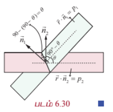

$$\cos\theta = \frac{\vec{n}_1 \cdot \vec{n}_2}{|\vec{n}_1||\vec{n}_2|} \Rightarrow \theta = \cos^{-1}\left(\frac{\vec{n}_1 \cdot \vec{n}_2}{|\vec{n}_1||\vec{n}_2|}\right)$$

... (1)

#### குறிப்புரை

(i) $\vec{r} \cdot \vec{n}_1 = p_1$ மற்றும் $\vec{r} \cdot \vec{n}_2 = p_2$ ஆகிய இரு தளங்கள் ஒன்றுக்கொன்று செங்குத்தானவை எனில், $\vec{n}_1 \cdot \vec{n}_2 = 0$ ஆகும்.

(ii) $\vec{r} \cdot \vec{n}_1 = p_1$ மற்றும் $\vec{r} \cdot \vec{n}_2 = p_2$ ஆகிய இரு தளங்கள் இணை எனில், $\vec{n}_1 = \lambda \vec{n}_2$, இங்கு $\lambda$ ஒரு திசையிலி ஆகும்.

(iii) $\vec{r} \cdot \vec{n} = p$ என்ற தளத்திற்கு இணையாக உள்ள தளத்தின் சமன்பாடு $\vec{r} \cdot \vec{n} = k, k \in \mathbb{R}$ ஆகும்.

---

#### தேற்றம் 6.19

$a_1x + b_1y + c_1z + d_1 = 0$ மற்றும் $a_2x + b_2y + c_2z + d_2 = 0$ ஆகிய தளங்களுக்கு இடைப்பட்ட குறுங்கோணம் $\theta$ எனில்,

$$\theta = \cos^{-1}\left(\frac{a_1a_2 + b_1b_2 + c_1c_2}{\sqrt{a_1^2 + b_1^2 + c_1^2}\sqrt{a_2^2 + b_2^2 + c_2^2}}\right)$$

#### நிரூபணம்

$a_1x + b_1y + c_1z + d_1 = 0$ மற்றும் $a_2x + b_2y + c_2z + d_2 = 0$ ஆகிய தளங்களின் செங்கோட்டு வெக்டர்கள் முறையே $\vec{n}_1$ மற்றும் $\vec{n}_2$ என்க. பின்னர், $\vec{n}_1 = a_1\hat{i} + b_1\hat{j} + c_1\hat{k}$ மற்றும் $\vec{n}_2 = a_2\hat{i} + b_2\hat{j} + c_2\hat{k}$ ஆகும்.

எனவே தேற்றம் 6.18-ன் சமன்பாடு (1)-ஐப் பயன்படுத்தி, தளங்களுக்கு இடைப்பட்ட குறுங்கோணம் $\theta$ எனில்,

$$\theta = \cos^{-1}\left(\frac{a_1a_2 + b_1b_2 + c_1c_2}{\sqrt{a_1^2 + b_1^2 + c_1^2}\sqrt{a_2^2 + b_2^2 + c_2^2}}\right)$$

எனப் பெறுகிறோம்.

#### குறிப்புரை

(i) $a_1x + b_1y + c_1z + d_1 = 0$ மற்றும் $a_2x + b_2y + c_2z + d_2 = 0$ என்ற தளங்கள் ஒன்றுக்கொன்று செங்குத்து எனில், $a_1a_2 + b_1b_2 + c_1c_2 = 0$ ஆகும்.

(ii) $a_1x + b_1y + c_1z + d_1 = 0$ மற்றும் $a_2x + b_2y + c_2z + d_2 = 0$ என்ற தளங்கள் இணையானவை எனில், $\frac{a_1}{a_2} = \frac{b_1}{b_2} = \frac{c_1}{c_2}$ ஆகும்.

(iii) $ax + by + cz = p$ என்ற தளத்திற்கு இணையான தளத்தின் சமன்பாடு $ax + by + cz = k$, $k \in \mathbb{R}$ ஆகும்.

---

### எடுத்துக்காட்டு 6.47

$\vec{r} \cdot (2\hat{i} + 2\hat{j} + 2\hat{k}) = 11$ மற்றும் $4x - 2y + 2z = 15$ ஆகிய தளங்களுக்கு இடைப்பட்ட குறுங்கோணத்தைக் காண்க.

#### தீர்வு

$\vec{r} \cdot (2\hat{i} + 2\hat{j} + 2\hat{k}) = 11$ மற்றும் $4x - 2y + 2z = 15$ ஆகிய தளங்களின் செங்கோட்டு வெக்டர்கள் முறையே $\vec{n}_1 = 2\hat{i} + 2\hat{j} + 2\hat{k}$ மற்றும் $\vec{n}_2 = 4\hat{i} - 2\hat{j} + 2\hat{k}$ ஆகும்.

கொடுக்கப்பட்ட தளங்களுக்கு இடைப்பட்ட குறுங்கோணம் $\theta$ எனில்,

$$\theta = \cos^{-1}\left(\frac{(2\hat{i} + 2\hat{j} + 2\hat{k}) \cdot (4\hat{i} - 2\hat{j} + 2\hat{k})}{|2\hat{i} + 2\hat{j} + 2\hat{k}||4\hat{i} - 2\hat{j} + 2\hat{k}|}\right) = \cos^{-1}\left(\frac{2}{3}\right)$$

---

### 6.8.11 ஒரு கோட்டிற்கும் மற்றும் ஒரு தளத்திற்கும் இடைப்பட்ட கோணம்
### (Angle between a line and a plane)

ஒரு கோட்டிற்கும் மற்றும் ஒரு தளத்திற்கும் இடைப்பட்ட கோணமானது, தளத்தின் செங்கோட்டிற்கும் கொடுக்கப்பட்ட கோட்டிற்கும் இடைப்பட்ட கோணத்தின் நிரப்புக் கோணமாகும்.

$\vec{r} = \vec{a} + t\vec{b}$ என்பது கோட்டின் சமன்பாடு மற்றும் $\vec{r} \cdot \vec{n} = p$ என்பது தளத்தின் சமன்பாடு என்க.

எனவே, $\vec{b}$ ஆனது கொடுக்கப்பட்ட கோட்டிற்கு இணையாகவும் $\vec{n}$ என்பது கொடுக்கப்பட்ட தளத்திற்குச் செங்குத்தாகவும் இருக்கும்.

கொடுக்கப்பட்ட கோட்டிற்கும் மற்றும் தளத்திற்கும் இடைப்பட்ட குறுங்கோணம் $\theta$ எனில், $\vec{n}$ -க்கும் $\vec{b}$ -க்கும் இடைப்பட்ட குறுங்கோணம் $\frac{\pi}{2} - \theta$ ஆகும். எனவே,

$$\cos\left(\frac{\pi}{2} - \theta\right) = \frac{|\vec{b} \cdot \vec{n}|}{|\vec{b}||\vec{n}|} = \sin\theta$$

ஆகவே, கோட்டிற்கும் தளத்திற்கும் இடைப்பட்ட குறுங்கோணம்

$$\theta = \sin^{-1}\left(\frac{|\vec{b} \cdot \vec{n}|}{|\vec{b}||\vec{n}|}\right)$$

... (1)

$$\frac{x - x_1}{a_1} = \frac{y - y_1}{b_1} = \frac{z - z_1}{c_1}$$

மற்றும்

$$ax + by + cz = p$$

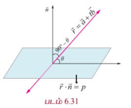

ஆகியன முறையே கோடு மற்றும் தளத்தின் சமன்பாடுகள் எனில், $\vec{b} = a_1\hat{i} + b_1\hat{j} + c_1\hat{k}$ மற்றும் $\vec{n} = a\hat{i} + b\hat{j} + c\hat{k}$ ஆகும். இம்மதிப்புகளை சமன்பாடு (1)-ல் பிரதியிட, கொடுக்கப்பட்ட கோட்டிற்கும் தளத்திற்கும் இடைப்பட்ட குறுங்கோணம் $\theta$ கிடைக்கிறது. எனவே,

$$\theta = \sin^{-1}\left(\frac{|a_1a + b_1b + c_1c|}{\sqrt{a_1^2 + b_1^2 + c_1^2}\sqrt{a^2 + b^2 + c^2}}\right)$$

#### குறிப்புரை

(i) நேர்க்கோடு தளத்திற்குச் செங்குத்து எனில், இந்நேர்க்கோடு தளத்தின் செங்கோட்டிற்கு இணையாகும். ஆகவே, $\vec{b}$ ஆனது $\vec{n}$ -க்கு இணையாகும். எனவே, $\vec{b} = \lambda\vec{n}$ இங்கு, $\lambda \in \mathbb{R}$ ஆகும். இதிலிருந்து $\frac{a_1}{a} = \frac{b_1}{b} = \frac{c_1}{c}$ எனப் பெறுகிறோம்.

(ii) ஒரு நேர்க்கோடு, தளத்திற்கு இணை எனில், இந்நேர்க்கோடு தளத்தின் செங்கோட்டிற்கு செங்குத்தாகும். எனவே, $\vec{b} \cdot \vec{n} = 0 \Rightarrow a_1a + b_1b + c_1c = 0$ ஆகும்.

---

### எடுத்துக்காட்டு 6.48

$\vec{r} = (\hat{i} + \hat{j} + \hat{k}) + t(2\hat{i} - \hat{j} + \hat{k})$ என்ற கோட்டிற்கும் $x - 2y + z = 5$ என்ற தளத்திற்கும் இடைப்பட்ட கோணம் காண்க.

#### தீர்வு

$\vec{r} = \vec{a} + t\vec{b}$ என்ற கோட்டிற்கும், செங்கோட்டு வெக்டர் $\vec{n}$ கொண்ட தளத்திற்கும் இடைப்பட்ட கோணம்

$$\theta = \sin^{-1}\left(\frac{|\vec{b} \cdot \vec{n}|}{|\vec{b}||\vec{n}|}\right)$$

ஆகும்.

இங்கு, $\vec{b} = 2\hat{i} - \hat{j} + \hat{k}$ மற்றும் $\vec{n} = \hat{i} - 2\hat{j} + \hat{k}$ ஆகும்.

ஆகவே,

$$\theta = \sin^{-1}\left(\frac{|(2\hat{i} - \hat{j} + \hat{k}) \cdot (\hat{i} - 2\hat{j} + \hat{k})|}{|2\hat{i} - \hat{j} + \hat{k}||\hat{i} - 2\hat{j} + \hat{k}|}\right) = \sin^{-1}\left(\frac{2}{\sqrt{6}\sqrt{6}}\right) = \sin^{-1}\left(\frac{1}{3}\right)$$

---

### 6.8.12 ஒரு புள்ளியிலிருந்து தளத்திற்குள்ள தொலைவு
### (Distance of a point from a plane)

#### (a) தளத்தின் வெக்டர் சமன்பாடு (Vector form of equation)

##### தேற்றம் 6.20

$\vec{u}$ என்ற நிலைவெக்டர் கொண்ட புள்ளியிலிருந்து $\vec{r} \cdot \vec{n} = p$ என்ற தளத்திற்கு உள்ள செங்குத்துத் தொலைவு

$$\delta = \frac{|\vec{u} \cdot \vec{n} - p|}{|\vec{n}|}$$

#### நிரூபணம்

$A$ என்ற புள்ளியின் நிலை வெக்டர் $\vec{u}$ என்க.

$\vec{r} \cdot \vec{n} = p$ என்ற தளத்திற்கு $A$ என்ற புள்ளியிலிருந்து வரையப்பட்ட செங்குத்தின் அடி $F$ என்க. $F$ மற்றும் $A$ ஆகியவற்றை இணைக்கும் கோடானது தளத்தின் செங்கோடு $\vec{n}$ -க்கு இணையாகும். எனவே, $FA$-ன் சமன்பாடு $\vec{r} = \vec{u} + t\vec{n}$ ஆகும்.

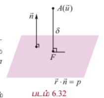

ஆனால், $F$ என்பது $\vec{r} = \vec{u} + t\vec{n}$ என்ற கோடும் $\vec{r} \cdot \vec{n} = p$ என்ற தளமும் வெட்டிக்கொள்ளும் புள்ளியாகும். $\vec{r}_1$ என்பது $F$-ன் நிலைவெக்டர் எனில், $\vec{r}_1 = \vec{u} + t_1\vec{n}$, $t_1 \in \mathbb{R}$, மற்றும் $\vec{r}_1 \cdot \vec{n} = p$ ஆகும். இச்சமன்பாடுகளிலிருந்து $\vec{r}_1$ -ஐ நீக்க, நாம் பெறுவது

$$(\vec{u} + t_1\vec{n}) \cdot \vec{n} = p$$

$$\Rightarrow t_1 = \frac{p - \vec{u} \cdot \vec{n}}{|\vec{n}|^2}$$

இப்பொழுது,

$$\overrightarrow{FA} = \vec{u} - (\vec{u} + t_1\vec{n}) = -t_1\vec{n}$$

$$= -\left(\frac{p - \vec{u} \cdot \vec{n}}{|\vec{n}|^2}\right)\vec{n} = \frac{(\vec{u} \cdot \vec{n} - p)}{|\vec{n}|^2}\vec{n}$$

எனவே, $A$ என்ற புள்ளியிலிருந்து கொடுக்கப்பட்ட தளத்திற்குள்ள செங்குத்துத் தொலைவு

$$\delta = |\overrightarrow{FA}| = \frac{|\vec{u} \cdot \vec{n} - p|}{|\vec{n}|}$$

$AF$ என்ற செங்குத்தின் அடி $F$ -ன் நிலைவெக்டர்

$$\vec{r}_1 = \vec{u} + t_1\vec{n}$$

அல்லது

$$\vec{r}_1 = \vec{u} + \left(\frac{p - \vec{u} \cdot \vec{n}}{|\vec{n}|^2}\right)\vec{n}$$

---

#### (b) தளத்தின் கார்டீசியன் சமன்பாடு (Cartesian form of equation)

$\vec{u}$ என்ற கொடுக்கப்பட்ட நிலைவெக்டரைக் கொண்ட புள்ளி $A(x_1, y_1, z_1)$ மற்றும் கொடுக்கப்பட்ட தளத்தின் கார்டீசியன் சமன்பாடு $ax + by + cz = p$ எனில், $\vec{u} = x_1\hat{i} + y_1\hat{j} + z_1\hat{k}$ மற்றும் $\vec{n} = a\hat{i} + b\hat{j} + c\hat{k}$ ஆகும்.

இவ்வெக்டர்களை $\delta = \frac{|\vec{u} \cdot \vec{n} - p|}{|\vec{n}|}$ -ல் பிரதியிட, கொடுக்கப்பட்ட தளத்திற்குள்ள செங்குத்துத் தொலைவு

$$\delta = \frac{|ax_1 + by_1 + cz_1 - p|}{\sqrt{a^2 + b^2 + c^2}}$$

எனப் பெறுகிறோம்.

#### குறிப்புரை

ஆதிப்புள்ளியிலிருந்து $ax + by + cz + d = 0$ என்ற தளத்திற்குள்ள செங்குத்துத் தொலைவு

$$\delta = \frac{|d|}{\sqrt{a^2 + b^2 + c^2}}$$

---

### எடுத்துக்காட்டு 6.49

$(2, 5, -3)$ என்ற புள்ளியிலிருந்து $\vec{r} \cdot (6\hat{i} - 3\hat{j} + 2\hat{k}) = 5$ என்ற தளத்திற்குள்ள தொலைவு காண்க.

#### தீர்வு

கொடுக்கப்பட்ட சமன்பாட்டை $\vec{r} \cdot \vec{n} = p$ உடன் ஒப்பிடும்போது நமக்கு $\vec{n} = 6\hat{i} - 3\hat{j} + 2\hat{k}$ எனக் கிடைக்கிறது.

$\vec{u}$ என்ற நிலை வெக்டரைக் கொண்ட புள்ளியிலிருந்து $\vec{r} \cdot \vec{n} = p$ என்ற தளத்திற்குள்ள செங்குத்துத் தொலைவு

$$\delta = \frac{|\vec{u} \cdot \vec{n} - p|}{|\vec{n}|}$$

ஆகும். எனவே, $\vec{u} = 2\hat{i} + 5\hat{j} - 3\hat{k}$ மற்றும் $\vec{n} = 6\hat{i} - 3\hat{j} + 2\hat{k}$ என $\delta$ -ல் பிரதியிட, நாம் பெறுவது

$$\delta = \frac{|(2\hat{i} + 5\hat{j} - 3\hat{k}) \cdot (6\hat{i} - 3\hat{j} + 2\hat{k}) - 5|}{|6\hat{i} - 3\hat{j} + 2\hat{k}|} = \frac{|12 - 15 - 6 - 5|}{7} = \frac{14}{7} = 2$$

அலகுகள்.

---

### எடுத்துக்காட்டு 6.50

$A(4, 1, 2)$ மற்றும் $B(7, 5, 4)$ ஆகிய புள்ளிகள் வழியாகச் செல்லும் நேர்க்கோடும் $x - y + z = 5$ என்ற தளமும் வெட்டிக் கொள்ளும் புள்ளிக்கும் $(5, -5, -10)$ என்ற புள்ளிக்கும் உள்ள தொலைவைக் காண்க.

#### தீர்வு

$A(4, 1, 2)$ மற்றும் $B(7, 5, 4)$ ஆகிய புள்ளிகளை இணைக்கும் கோட்டின் சமன்பாடு

$$\frac{x - 4}{3} = \frac{y - 1}{4} = \frac{z - 2}{2} = t$$

(என்க).

இக்கோட்டின் மீதுள்ள ஏதேனும் ஒரு புள்ளி $(3t + 4, 4t + 1, 2t + 2)$ ஆகும். கோடும் தளமும் வெட்டிக் கொள்ளும் புள்ளியைக் காண, $x = 3t + 4, y = 4t + 1, z = 2t + 2$ என $x - y + z = 5$ -ல் பிரதியிட்டு $t = 0$ எனப் பெறுகிறோம். எனவே, நேர்க்கோடும் தளமும் வெட்டிக்கொள்ளும் புள்ளி $(4, 1, 2)$ ஆகும். ஆகவே, $(4, 1, 2)$ மற்றும் $(5, -5, -10)$ ஆகிய புள்ளிகளுக்கு இடைப்பட்ட தொலைவு

$$\sqrt{(4-5)^2 + (1+5)^2 + (2+10)^2} = \sqrt{1 + 36 + 144} = \sqrt{181}$$

அலகுகள்.

---

### 6.8.13 இணையான இரு தளங்களுக்கு இடைப்பட்ட தொலைவு
### (Distance between two parallel planes)

#### தேற்றம் 6.21

$a_1x + b_1y + c_1z + d_1 = 0$ மற்றும் $a_2x + b_2y + c_2z + d_2 = 0$ ஆகிய இரு இணையான தளங்களுக்கு இடைப்பட்ட தொலைவு

$$\frac{|d_1 - d_2|}{\sqrt{a^2 + b^2 + c^2}}$$

#### நிரூபணம்

$a_2x + b_2y + c_2z + d_2 = 0$ என்ற தளத்தின் மீதுள்ள ஏதேனும் ஒரு புள்ளி $A(x_1, y_1, z_1)$ என்க. பின்னர்,

$$a_1x_1 + b_1y_1 + c_1z_1 + d_1 = 0 \Rightarrow a_1x_1 + b_1y_1 + c_1z_1 = -d_1$$

$A(x_1, y_1, z_1)$ என்ற புள்ளியிலிருந்து $a_1x + b_1y + c_1z + d_1 = 0$ என்ற தளத்திற்குள்ள தொலைவு

$$\delta = \frac{|a_1x_1 + b_1y_1 + c_1z_1 + d_1|}{\sqrt{a_1^2 + b_1^2 + c_1^2}} = \frac{|-d_1 + d_2|}{\sqrt{a_1^2 + b_1^2 + c_1^2}}$$

எனவே, $a_1x + b_1y + c_1z + d_1 = 0$ மற்றும் $a_2x + b_2y + c_2z + d_2 = 0$ என்ற இணையான இரு தளங்களுக்கு இடைப்பட்ட தொலைவு

$$\delta = \frac{|d_1 - d_2|}{\sqrt{a^2 + b^2 + c^2}}$$

---

### எடுத்துக்காட்டு 6.51

$x + 2y - 2z + 1 = 0$ மற்றும் $2x + 4y - 4z + 5 = 0$ ஆகிய இரண்டு இணையான தளங்களுக்கு இடைப்பட்ட தொலைவு காண்க.

#### தீர்வு

$a_1x + b_1y + c_1z + d_1 = 0$ மற்றும் $a_2x + b_2y + c_2z + d_2 = 0$ என்ற இரு இணையான தளங்களுக்கு இடைப்பட்ட தொலைவு

$$\delta = \frac{|d_1 - d_2|}{\sqrt{a^2 + b^2 + c^2}}$$

இரண்டாவது சமன்பாட்டை $\frac{5}{2}$ -ஆல் வகுத்து $x + 2y - 2z + \frac{5}{2} = 0$ என எழுத,

$$a = 1, b = 2, c = -2, d_1 = 1, d_2 = \frac{5}{2}$$

எனப் பெறலாம். இம்மதிப்புகளை சூத்திரத்தில் பிரதியிட,

$$\delta = \frac{|1 - \frac{5}{2}|}{\sqrt{1^2 + 2^2 + (-2)^2}} = \frac{\frac{3}{2}}{3} = \frac{1}{2}$$

அலகுகள் எனத் தேவையான தொலைவு கிடைக்கிறது.

---

### எடுத்துக்காட்டு 6.52

$\vec{r} \cdot (2\hat{i} - 2\hat{j} - \hat{k}) = 6$ மற்றும் $\vec{r} \cdot (6\hat{i} - 6\hat{j} - 3\hat{k}) = 27$ என்ற தளங்களுக்கு இடைப்பட்ட தொலைவு காண்க.

#### தீர்வு

$\vec{r} \cdot (2\hat{i} - 2\hat{j} - \hat{k}) = 6$ என்ற தளத்தின் மீதுள்ள ஏதேனும் ஒரு புள்ளியின் நிலைவெக்டர் $\vec{u}$ என்க. பின்னர்,

$$\vec{u} \cdot (2\hat{i} - 2\hat{j} - \hat{k}) = 6$$

... (1)

கொடுக்கப்பட்ட இரண்டு தளங்களுக்கு இடைப்பட்ட தொலைவு $\delta$ எனில், $\delta$ என்பது $\vec{u}$ என்ற புள்ளியிலிருந்து $\vec{r} \cdot (6\hat{i} - 6\hat{j} - 3\hat{k}) = 27$ என்ற தளத்திற்குள்ள செங்குத்துத் தொலைவாகும்.

எனவே,

$$\delta = \frac{|\vec{u} \cdot (6\hat{i} - 6\hat{j} - 3\hat{k}) - 27|}{|6\hat{i} - 6\hat{j} - 3\hat{k}|} = \frac{|3(\vec{u} \cdot (2\hat{i} - 2\hat{j} - \hat{k})) - 27|}{\sqrt{6^2 + (-6)^2 + (-3)^2}} = \frac{|3(6) - 27|}{9} = \frac{9}{9} = 1$$

அலகு.

---

### 6.8.14 இரு தளங்களின் வெட்டுக்கோட்டின் சமன்பாடு
### (Equation of line of intersection of two planes)

$\vec{r} \cdot \vec{n} = p$ மற்றும் $\vec{r} \cdot \vec{m} = q$ என்பன இணை அல்லாத இரு தளங்கள் என்க. $\vec{n}$ மற்றும் $\vec{m}$ ஆகிய வெக்டர்கள் முறையே கொடுக்கப்பட்ட தளங்களுக்குச் செங்குத்தாகும். மேலும், இத்தளங்களின் வெட்டுக்கோடானது $\vec{n}$ மற்றும் $\vec{m}$ என்ற இரு வெக்டர்களுக்கும் செங்குத்தாகும் என்பதால், $\vec{n} \times \vec{m}$ என்ற வெக்டருக்கு இணையாகும். $\vec{n} \times \vec{m} = l_1\hat{i} + l_2\hat{j} + l_3\hat{k}$ என்க.

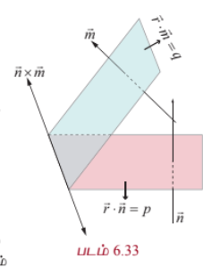

$a_1x + b_1y + c_1z = p$ மற்றும் $a_2x + b_2y + c_2z = q$ என்ற இரு தளங்களின் சமன்பாடுகளை எடுத்துக்கொள்வோம்.

கொடுக்கப்பட்ட இவ்விரு தளங்களின் வெட்டுக்கோடு குறைந்தபட்சம் ஒரு ஆய அச்சுத் தளத்தையாவது சந்திக்கும். நம் வசதிக்காக வெட்டுக்கோடு சந்திக்கும் ஆய அச்சுத் தளத்தை $z = 0$ எனக்கொள்வோம். $z = 0$ எனக்கொடுக்கப்பட்ட தளங்களின் சமன்பாடுகளில் பிரதியிட்டு $a_1x + b_1y - p = 0$ மற்றும் $a_2x + b_2y - q = 0$ என்ற இரு சமன்பாடுகளைப் பெறலாம். இவ்விரு சமன்பாடுகளின் தீர்வு காண்பதால், $x$ மற்றும் $y$-ன் மதிப்புகளை முறையே $x_1$ மற்றும் $y_1$ எனப்பெறலாம். எனவே, $l_1\hat{i} + l_2\hat{j} + l_3\hat{k}$ வெக்டருக்கு இணையாக உள்ள கோட்டின் மீதுள்ள ஒரு புள்ளி $(x_1, y_1, 0)$ ஆகும். ஆகவே, வெட்டுக்கோட்டின் சமன்பாடு

$$\frac{x - x_1}{l_1} = \frac{y - y_1}{l_2} = \frac{z - 0}{l_3}$$

ஆகும்.

---

### 6.8.15 இரு தளங்களின் வெட்டுக்கோடு வழியாகச் செல்லும் தளத்தின் சமன்பாடு
### (Equation of a plane passing through the line of intersection of two given planes)

#### தேற்றம் 6.22

$\vec{r} \cdot \vec{n}_1 = d_1$ மற்றும் $\vec{r} \cdot \vec{n}_2 = d_2$ என்ற தளங்களின் வெட்டுக்கோடு வழியாகச் செல்லும் தளத்தின் வெக்டர் சமன்பாடு

$$(\vec{r} \cdot \vec{n}_1 - d_1) + \lambda(\vec{r} \cdot \vec{n}_2 - d_2) = 0$$

ஆகும். இங்கு $\lambda \in \mathbb{R}$.

#### நிரூபணம்

பின்வரும் சமன்பாட்டை எடுத்துக் கொள்வோம்.

$$(\vec{r} \cdot \vec{n}_1 - d_1) + \lambda(\vec{r} \cdot \vec{n}_2 - d_2) = 0$$

... (1)

இச்சமன்பாட்டினை

$$\vec{r} \cdot (\vec{n}_1 + \lambda\vec{n}_2) - (d_1 + \lambda d_2) = 0$$

... (2)

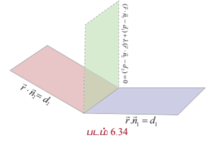

என எழுதலாம்.

$\vec{n} = \vec{n}_1 + \lambda\vec{n}_2$ மற்றும் $d = d_1 + \lambda d_2$ என்க.

எனவே, சமன்பாடு (2) ஆனது

$$\vec{r} \cdot \vec{n} = d$$

... (3)

என்றாகும். சமன்பாடு (3) ஆனது ஒரு தளத்தைக் குறிக்கிறது. எனவே, சமன்பாடு (1)-ம் ஒரு தளத்தைக் குறிக்கும்.

கொடுக்கப்பட்ட தளங்களின் வெட்டுக்கோட்டின் மீதுள்ள ஏதேனும் ஒரு புள்ளியின் நிலைவெக்டர் $\vec{r}_1$ என்க. பின்னர், $\vec{r}_1$ ஆனது $\vec{r} \cdot \vec{n}_1 = d_1$ மற்றும் $\vec{r} \cdot \vec{n}_2 = d_2$ என்ற இரு தளங்களின் சமன்பாடுகளையும் நிறைவு செய்யும். எனவே,

$$\vec{r}_1 \cdot \vec{n}_1 = d_1$$

... (4)

மற்றும்

$$\vec{r}_1 \cdot \vec{n}_2 = d_2$$

... (5)

சமன்பாடுகள் (4) மற்றும் (5)களிலிருந்து, $\vec{r}_1$ என்பது சமன்பாடு (1)-ஐ நிறைவு செய்வதைக் காணலாம். ஆகவே, கொடுக்கப்பட்ட தளங்களின் வெட்டுக்கோட்டின் மீதுள்ள எந்தவொரு புள்ளியும் தளம் (1)-ன் மீது அமையும் எனக் காண்கிறோம். எனவே, தளம் (1) ஆனது கொடுக்கப்பட்ட தளங்களின் வெட்டுக்கோடு வழியாகச் செல்லும் என்பது நிரூபணமாகிறம்.

$a_1x + b_1y + c_1z + d_1 = 0$ மற்றும் $a_2x + b_2y + c_2z + d_2 = 0$ ஆகிய இரு தளங்களின் வழியாகச் செல்லும் தளத்தின் கார்டீசியன் சமன்பாடு

$$(a_1x + b_1y + c_1z + d_1) + \lambda(a_2x + b_2y + c_2z + d_2) = 0$$

ஆகும்.

---

### எடுத்துக்காட்டு 6.53

$\vec{r} \cdot (\hat{i} + \hat{j} + \hat{k}) + 1 = 0$ மற்றும் $\vec{r} \cdot (2\hat{i} - 3\hat{j} + 5\hat{k}) = -2$ என்ற தளங்களின் வெட்டுக்கோடு வழியாகவும் $(-1, 2, 1)$ என்ற புள்ளி வழியாகவும் செல்லும் தளத்தின் சமன்பாடு காண்க.

#### தீர்வு

$\vec{r} \cdot \vec{n}_1 = d_1$ மற்றும் $\vec{r} \cdot \vec{n}_2 = d_2$ என்ற தளங்களின் வெட்டுக்கோடு வழியாகச் செல்லும் தளத்தின் சமன்பாடு

$$(\vec{r} \cdot \vec{n}_1 - d_1) + \lambda(\vec{r} \cdot \vec{n}_2 - d_2) = 0$$

ஆகும்.

இச்சமன்பாட்டில், $\vec{r} = x\hat{i} + y\hat{j} + z\hat{k}$, $\vec{n}_1 = \hat{i} + \hat{j} + \hat{k}$, $\vec{n}_2 = 2\hat{i} - 3\hat{j} + 5\hat{k}$, $d_1 = -1$ மற்றும் $d_2 = -2$ எனப்பிரதியிட, கொடுக்கப்பட்ட தளங்களின் வெட்டுக்கோடு வழியாகச் செல்லும்.

$$(x + y + z + 1) + \lambda(2x - 3y + 5z + 2) = 0$$

என்ற தளத்தின் சமன்பாடு கிடைக்கிறது.

இத்தளம் $(-1, 2, 1)$ என்ற புள்ளி வழிச் செல்வதால், $\lambda = \frac{3}{5}$ எனப் பெறுகிறோம். எனவே, தேவையான தளத்தின் சமன்பாடு $11x - 4y + 20z + 1 = 0$ ஆகும்.

---

### எடுத்துக்காட்டு 6.54

$2x + y - 3z + 7 = 0$ மற்றும் $x + 2y - z + 5 = 0$ என்ற தளங்களின் வெட்டுக்கோடு வழிச்செல்வதும் $x + y - 3z - 5 = 0$ என்ற தளத்திற்குச் செங்குத்தானதுமான தளத்தின் சமன்பாட்டைக் காண்க.

#### தீர்வு

$2x + y - 3z + 7 = 0$ மற்றும் $x + 2y - z + 5 = 0$ ஆகிய தளங்களின் வெட்டுக்கோடு வழிச்செல்லும் தளத்தின் சமன்பாடு

$$(2x + y - 3z + 7) + \lambda(x + 2y - z + 5) = 0$$

அல்லது

$$(2 + \lambda)x + (1 + 2\lambda)y + (-3 - \lambda)z + (7 + 5\lambda) = 0$$

இத்தளம், கொடுக்கப்பட்ட $x + y - 3z - 5 = 0$ தளத்திற்குச் செங்குத்தானது என்பதால், இவ்விரு தளங்களின் செங்கோடுகள் ஒன்றுக்கொன்று செங்குத்தாகும். எனவே,

$$(2 + \lambda)(1) + (1 + 2\lambda)(1) + (-3 - \lambda)(-3) = 0$$

$$\Rightarrow 2 + \lambda + 1 + 2\lambda + 9 + 3\lambda = 0 \Rightarrow 6\lambda + 12 = 0$$

$$\Rightarrow \lambda = -2$$

எனவே, தேவையான தளத்தின் சமன்பாடு

$$(2x + y - 3z + 7) - 2(x + 2y - z + 5) = 0$$

$$\Rightarrow 2x + y - 3z + 7 - 2x - 4y + 2z - 10 = 0$$

$$\Rightarrow -3y - z - 3 = 0$$

அல்லது

$$3y + z + 3 = 0$$

### 6.9 தளத்தில் ஒரு புள்ளியின் பிம்பம் (Image of a Point in a Plane)

கொடுக்கப்பட்ட புள்ளி $A$-ன் நிலை வெக்டர் $\vec{u}$ என்க. தளத்தின் சமன்பாடு $\vec{r} \cdot \vec{n} = p$ என்க. ஒரு தளத்தில் பிம்பம் காணவேண்டிய $A$ என்ற புள்ளியின் பிம்பப்புள்ளி $A'$-ன் நிலைவெக்டர் $\vec{v}$ என்க.

பின்னர், $\overrightarrow{AA'}$ என்பது தளத்திற்குச் செங்குத்தாகும். எனவே, $\overrightarrow{AA'}$ என்பது $\vec{n}$ -க்கு இணையாகும். பின்னர்

$$\overrightarrow{AA'} = \lambda \vec{n} \quad \text{அல்லது} \quad \vec{v} - \vec{u} = \lambda \vec{n} \Rightarrow \vec{v} = \vec{u} + \lambda \vec{n}$$

... (1)

$AA'$ -ன் மையப்புள்ளி $M$ என்க. ஆகவே, $M$ -ன் நிலைவெக்டர் $\frac{\vec{u} + \vec{v}}{2}$ ஆகும். ஆனால், $M$ ஆனது தளத்தின் மீது அமைந்துள்ளது.

எனவே,

$$\left(\frac{\vec{u} + \vec{v}}{2}\right) \cdot \vec{n} = p$$

... (2)
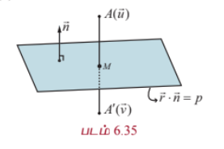

சமன்பாடு (1)-ஐ (2)-ல் பிரதியிட,

$$\left(\frac{\vec{u} + \vec{u} + \lambda\vec{n}}{2}\right) \cdot \vec{n} = p$$

$$\Rightarrow \lambda = \frac{2[p - \vec{u} \cdot \vec{n}]}{|\vec{n}|^2}$$

எனவே $A'$ ன் நிலைவெக்டர்

$$\vec{v} = \vec{u} + \frac{2[p - \vec{u} \cdot \vec{n}]}{|\vec{n}|^2}\vec{n}$$

#### குறிப்பு

$AA'$ -ன் மையப்புள்ளி $M$ ஆனது $A$ என்ற புள்ளியிலிருந்து $\vec{r} \cdot \vec{n} = p$ என்ற தளத்திற்கு வரையப்படும் செங்குத்தின் அடியாகும். ஆகவே, செங்குத்தின் அடி $M$-ன் நிலைவெக்டர்

$$\vec{m} = \frac{\vec{u} + \vec{v}}{2} = \vec{u} + \frac{1}{2}\left(\frac{2[p - \vec{u} \cdot \vec{n}]}{|\vec{n}|^2}\right)\vec{n} = \vec{u} + \frac{[p - \vec{u} \cdot \vec{n}]}{|\vec{n}|^2}\vec{n}$$

---

### 6.9.1 தளத்தில் ஒரு புள்ளியின் பிம்பப் புள்ளியின் அச்சுத் தூரங்கள்
### (The coordinates of the image of a point in a plane)

தளத்தில் பிம்பம் காண வேண்டிய புள்ளி $(a_1, a_2, a_3)$ -ன் நிலைவெக்டர் $\vec{u}$ என்க. பின்னர்,

$$\vec{u} = a_1\hat{i} + a_2\hat{j} + a_3\hat{k}$$

ஆகும்.

கொடுக்கப்பட்ட தளத்தின் சமன்பாடு $ax + by + cz = p$ என்க. இச்சமன்பாட்டை வெக்டர் சமன்பாடாக $\vec{r} \cdot \vec{n} = p$ என எழுதலாம். இங்கு $\vec{n} = a\hat{i} + b\hat{j} + c\hat{k}$ ஆகும். ஆகவே, பிம்பப் புள்ளியின் நிலைவெக்டர்

$$\vec{v} = \vec{u} + \frac{2[p - \vec{u} \cdot \vec{n}]}{|\vec{n}|^2}\vec{n}$$

$\vec{v} = v_1\hat{i} + v_2\hat{j} + v_3\hat{k}$ எனில், $v_1 = a_1 + 2\alpha a$, $v_2 = a_2 + 2\alpha b$, $v_3 = a_3 + 2\alpha c$ ஆகும்.

இங்கு,

$$\alpha = \frac{p - (a a_1 + b a_2 + c a_3)}{a^2 + b^2 + c^2}$$

ஆகும்.

---

### எடுத்துக்காட்டு 6.55

$\hat{i} + 2\hat{j} + 3\hat{k}$ என்ற நிலை வெக்டரைக் கொண்ட புள்ளியின் பிம்பப் புள்ளியை $\vec{r} \cdot (2\hat{i} + 4\hat{j} + \hat{k}) = 38$ என்ற தளத்தில் காண்க.

#### தீர்வு

இங்கு, $\vec{u} = \hat{i} + 2\hat{j} + 3\hat{k}$, $\vec{n} = 2\hat{i} + 4\hat{j} + \hat{k}$, $p = 38$ ஆகும். $\vec{u} = \hat{i} + 2\hat{j} + 3\hat{k}$ என்ற புள்ளியின் பிம்பப் புள்ளி $\vec{v}$ -ன் நிலைவெக்டர்

$$\vec{v} = \vec{u} + \frac{2[p - \vec{u} \cdot \vec{n}]}{|\vec{n}|^2}\vec{n}$$

ஆகும்.

$$\vec{v} = \hat{i} + 2\hat{j} + 3\hat{k} + \frac{2[38 - (\hat{i} + 2\hat{j} + 3\hat{k}) \cdot (2\hat{i} + 4\hat{j} + \hat{k})]}{(2\hat{i} + 4\hat{j} + \hat{k}) \cdot (2\hat{i} + 4\hat{j} + \hat{k})}(2\hat{i} + 4\hat{j} + \hat{k})$$

அதாவது,

$$\vec{v} = \hat{i} + 2\hat{j} + 3\hat{k} + \frac{2(38 - 13)}{21}(2\hat{i} + 4\hat{j} + \hat{k}) = \hat{i} + 2\hat{j} + 3\hat{k} + 2(2\hat{i} + 4\hat{j} + \hat{k})$$

$$= 5\hat{i} + 10\hat{j} + 5\hat{k}$$

எனவே, $\hat{i} + 2\hat{j} + 3\hat{k}$ என்ற நிலை வெக்டர் கொண்ட புள்ளியின் பிம்பப் புள்ளியின் நிலைவெக்டர் $5\hat{i} + 10\hat{j} + 5\hat{k}$ ஆகும்.

#### குறிப்பு

$\hat{i} + 2\hat{j} + 3\hat{k}$ என்ற நிலைவெக்டரைக் கொண்ட புள்ளியிலிருந்து கொடுக்கப்பட்ட தளத்திற்கு வரையப்படும் செங்குத்தின் அடியின் நிலைவெக்டர்

$$\frac{\hat{i} + 2\hat{j} + 3\hat{k} + 5\hat{i} + 10\hat{j} + 5\hat{k}}{2} = 3\hat{i} + 6\hat{j} + 4\hat{k}$$

### 6.10 ஒரு கோடும் ஒரு தளமும் சந்திக்கும் புள்ளி
### (Meeting Point of a Line and a Plane)

#### தேற்றம் 6.23

$\vec{r} = \vec{a} + t\vec{b}$ என்ற கோடும் $\vec{r} \cdot \vec{n} = p$ என்ற தளமும் சந்திக்கும் புள்ளியின் நிலைவெக்டர்

$$\vec{u} = \vec{a} + \left(\frac{p - \vec{a} \cdot \vec{n}}{\vec{b} \cdot \vec{n}}\right)\vec{b}, \quad \text{இங்கு } \vec{b} \cdot \vec{n} \neq 0$$

#### நிரூபணம்

கொடுக்கப்பட்ட $\vec{r} \cdot \vec{n} = p$ என்ற தளத்திற்கு இணையாக இல்லாத கொடுக்கப்பட்ட கோட்டின் சமன்பாடு $\vec{r} = \vec{a} + t\vec{b}$ என்க. ஆகவே, $\vec{b} \cdot \vec{n} \neq 0$.

தளத்தை நேர்க்கோடு சந்திக்கும் புள்ளியின் நிலைவெக்டர் $\vec{u}$ என்க. எனவே, $t$ -ன் ஒரு சில மதிப்புகளுக்கு, அதாவது $t_1$ என்ற மதிப்புக்கு $\vec{u}$ ஆனது $\vec{r} = \vec{a} + t\vec{b}$ என்ற கோட்டின் சமன்பாடு மற்றும் $\vec{r} \cdot \vec{n} = p$ என்ற தளத்தின் சமன்பாடு இரண்டையும் நிறைவு செய்யும். ஆதலால்,

$$\vec{u} = \vec{a} + t_1\vec{b}$$

... (1)

$$\vec{u} \cdot \vec{n} = p$$

... (2)

சமன்பாடு (1)-ஐ (2)-ல் பிரதியிட, நாம் பெறுவது

$$(\vec{a} + t_1\vec{b}) \cdot \vec{n} = p$$

அல்லது

$$\vec{a} \cdot \vec{n} + t_1(\vec{b} \cdot \vec{n}) = p$$

அல்லது

$$t_1 = \frac{p - \vec{a} \cdot \vec{n}}{\vec{b} \cdot \vec{n}}$$

... (3)

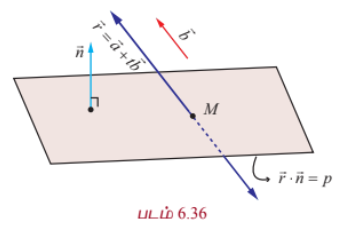

சமன்பாடு (3)-ஐ (1)-ல் பிரதியிட, நாம் பெறுவது

$$\vec{u} = \vec{a} + \left(\frac{p - \vec{a} \cdot \vec{n}}{\vec{b} \cdot \vec{n}}\right)\vec{b}, \quad \vec{b} \cdot \vec{n} \neq 0$$

---

### எடுத்துக்காட்டு 6.56

$\vec{r} = (2\hat{i} - \hat{j} + 2\hat{k}) + t(3\hat{i} + 4\hat{j} + 2\hat{k})$ என்ற கோடு $x - y + z - 5 = 0$ என்ற தளத்தை சந்திக்கும் புள்ளியின் ஆய அச்சுத் தூரங்களைக் காண்க.

#### தீர்வு

இங்கு, $\vec{a} = 2\hat{i} - \hat{j} + 2\hat{k}$, $\vec{b} = 3\hat{i} + 4\hat{j} + 2\hat{k}$.

கொடுக்கப்பட்ட தளத்தின் வெக்டர் சமன்பாடு $\vec{r} \cdot (\hat{i} - \hat{j} + \hat{k}) = 5$. எனவே, $\vec{n} = \hat{i} - \hat{j} + \hat{k}$ மற்றும் $p = 5$ ஆகும்.

$\vec{r} = \vec{a} + t\vec{b}$ என்ற கோடும் $\vec{r} \cdot \vec{n} = p$ என்ற தளமும் சந்திக்கும் புள்ளியின் நிலை வெக்டர்

$$\vec{u} = \vec{a} + \left(\frac{p - \vec{a} \cdot \vec{n}}{\vec{b} \cdot \vec{n}}\right)\vec{b}, \quad \text{இங்கு } \vec{b} \cdot \vec{n} \neq 0$$

மேலும் $\vec{b} \cdot \vec{n} \neq 0$ என்பதை நாம் தெளிவாகக் காணலாம்.

இப்பொழுது,

$$\frac{p - \vec{a} \cdot \vec{n}}{\vec{b} \cdot \vec{n}} = \frac{5 - (2\hat{i} - \hat{j} + 2\hat{k}) \cdot (\hat{i} - \hat{j} + \hat{k})}{(3\hat{i} + 4\hat{j} + 2\hat{k}) \cdot (\hat{i} - \hat{j} + \hat{k})} = \frac{5 - 5}{3 - 4 + 2} = 0$$

எனவே, கொடுக்கப்பட்ட கோடும் தளமும் சந்திக்கும் புள்ளியின் நிலை வெக்டர்

$$\vec{r} = (2\hat{i} - \hat{j} + 2\hat{k}) + 0(3\hat{i} + 4\hat{j} + 2\hat{k}) = 2\hat{i} - \hat{j} + 2\hat{k}$$

அதாவது, கொடுக்கப்பட்ட நேர்க்கோடு தளத்தை சந்திக்கும் புள்ளி $(2, -1, 2)$ ஆகும்.

#### மாற்று முறை

கொடுக்கப்பட்ட நேர்க்கோட்டின் கார்டீசியன் சமன்பாடு

$$\frac{x - 2}{3} = \frac{y + 1}{4} = \frac{z - 2}{2} = t$$

(என்க)

இக்கோட்டின் மீதுள்ள ஏதேனும் ஒரு புள்ளியின் அமைப்பு $(3t + 2, 4t - 1, 2t + 2)$ ஆகும்.

கொடுக்கப்பட்ட கோடும் தளமும் வெட்டிக்கொள்ளும் எனில், இப்புள்ளி $x - y + z - 5 = 0$ என்ற தளத்தின் மீது அமையும்.

ஆதலால், $(3t + 2) - (4t - 1) + (2t + 2) - 5 = 0 \Rightarrow t = 0$. எனவே, கொடுக்கப்பட்ட கோடு, கொடுக்கப்பட்ட தளத்தை $(2, -1, 2)$ என்ற புள்ளியில் சந்திக்கிறது.

---

### பயிற்சி 6.9

1. $\vec{r} \cdot (2\hat{i} - 7\hat{j} + 4\hat{k}) = 3$ மற்றும் $3x - 5y + 4z + 11 = 0$ என்ற தளங்களின் வெட்டுக்கோடு வழியாகவும் $(-2, 1, 3)$ என்ற புள்ளி வழியாகவும் செல்லும் தளத்தின் சமன்பாடு காண்க.

2. $x + 2y + 3z = 2$ மற்றும் $x - y + z = 3$ என்ற தளங்களின் வெட்டுக்கோடு வழிச்செல்வதும், $(3, 1, -1)$ என்ற புள்ளியிலிருந்து $\frac{2}{3}$ தொலைவில் உள்ளதுமான தளத்தின் சமன்பாட்டைக் காண்க.

3. $\vec{r} = (2\hat{i} - \hat{j} + 2\hat{k}) + t(\hat{i} + \hat{j} - 2\hat{k})$ என்ற கோட்டிற்கும் $\vec{r} \cdot (6\hat{i} + 3\hat{j} + 2\hat{k}) = 8$ என்ற தளத்திற்கும் இடைப்பட்ட கோணம் காண்க.

4. $\vec{r} \cdot (\hat{i} + 2\hat{j} - 3\hat{k}) = 2$ மற்றும் $2x - 2y + 2z = 1$ என்ற தளங்களுக்கு இடைப்பட்ட கோணம் காண்க.

5. $(3, 4, -1)$ என்ற புள்ளி வழிச் செல்வதும் $2x - 3y + 5z + 7 = 0$ என்ற தளத்திற்கு இணையானதுமான தளத்தின் சமன்பாட்டைக் காண்க. மேலும், இவ்விரு தளங்களுக்கு இடைப்பட்ட தொலைவினைக் காண்க.

6. $(1, -2, 3)$ என்ற புள்ளியிலிருந்து $x - y + z = 5$ என்ற தளத்திற்கு வரையப்பட்ட செங்குத்தின் நீளம் காண்க.

7. $x - 1 = \frac{y}{2} = z + 1$ என்ற கோடும் $x - 2y + 2z = 2$ என்ற தளமும் சந்திக்கும் புள்ளியைக் காண்க. மேலும், இக்கோட்டிற்கும் தளத்திற்கும் இடைப்பட்ட கோணத்தையும் காண்க.

8. $(-4, 3, 2)$ என்ற புள்ளியில் இருந்து $x + 2y + 3z = 2$ என்ற தளத்திற்கு வரையப்படும் செங்குத்தின் அடியின் அச்சுத்தூரங்களையும், செங்குத்தின் நீளத்தையும் காண்க.
