### 6.8 ஒரு தளத்தின் பல்வேறு வகைச் சமன்பாடுகள்
### (Different forms of Equation of a plane)

தளம் என்பதன் கருத்தாக்கத்தை நாம் ஏற்கனவே கற்றறிந்துள்ளோம்.

#### வரையறை 6.8

ஒரு தளத்திற்குச் செங்குத்தாக உள்ள வெக்டர் அத்தளத்தின் **செங்குத்து** அல்லது **செங்கோடு** என்கிறோம்.

#### குறிப்பு

ஒரு தளத்தின் செங்கோடானது, அத்தளத்தில் உள்ள ஒவ்வொரு நேர்க்கோட்டிற்கும் செங்குத்தாகும்.

பின்வருவனவற்றில் ஏதேனும் ஒன்று கொடுக்கப்பட்டால், ஒரு தளத்தை தனித்ததாக தீர்மானிக்கலாம்:

- தளத்திற்குச் செங்குத்தான ஓரலகு வெக்டர் மற்றும் ஆதிப்புள்ளியில் இருந்து அத்தளத்திற்கு உள்ள தூரம்.
- தளத்தின் மீதான ஒரு புள்ளி மற்றும் தளத்தின் ஒரு செங்கோடு.
- ஒரே கோட்டிலமையாத மூன்று புள்ளிகள்.
- தளத்தின் மீதுள்ள ஒரு புள்ளி மற்றும் தளத்திற்கு இணையாக உள்ள இரண்டு இணை அல்லாத கோடுகள் அல்லது வெக்டர்கள்.
- தளத்தின் மீதுள்ள இரு தனித்த புள்ளிகள் மற்றும் தளத்திற்கு இணையாக உள்ள ஆனால் இவ்விரு புள்ளிகளைச் சேர்க்கும் கோட்டிற்கு இணையாக இல்லாத ஒரு நேர்க்கோடு அல்லது ஒரு பூச்சியமற்ற வெக்டர்.

தளங்களின் வெக்டர் மற்றும் கார்டீசியன் சமன்பாடுகளை மேற்கண்ட நிலைகளைப் பயன்படுத்திக் காண்போம்.

---

### 6.8.1 தளத்தின் ஒரு செங்கோடு மற்றும் ஆதிப்புள்ளியிலிருந்து தளத்திற்கு உள்ள தூரம் கொடுக்கப்பட்டால் தளத்தின் சமன்பாடு
### (Equation of a plane when a normal to the plane and the distance of the plane from the origin are given)

#### (a) செங்கோட்டு வடிவ வெக்டர் சமன்பாடு (Vector equation of a plane in normal form)

##### தேற்றம் 6.15

ஆதிப்புள்ளியிலிருந்து தளத்திற்கு உள்ள தூரம் $p$ மற்றும் தளத்திற்குச் செங்குத்தான ஓரலகு வெக்டர் $\hat{d}$ எனில், தளத்தின் சமன்பாடு $\vec{r} \cdot \hat{d} = p$ ஆகும்.

#### நிரூபணம்

ஆதிப்புள்ளியிலிருந்து $p$ தொலைவில் உள்ள தளத்தினை கருதுக. ஆதிப்புள்ளி $O$ -விலிருந்து தளத்திற்கு வரையப்படும் செங்கோட்டின் அடி $A$ என்க.

$\overrightarrow{OA}$ -ன் திசையில் உள்ள ஓரலகு செங்குத்து வெக்டர் $\hat{d}$ என்க.

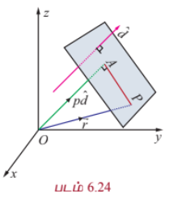

பின்னர், $\overrightarrow{OA} = p\hat{d}$ ஆகும்.

$\vec{r}$ என்பது தளத்தில் உள்ள ஏதேனும் ஒரு புள்ளி $P$-ன் நிலைவெக்டர் எனில், $\overrightarrow{AP}$ என்பது $\overrightarrow{OA}$ வுக்குச் செங்குத்தாகும்.

எனவே, $\overrightarrow{AP} \cdot \overrightarrow{OA} = 0 \Rightarrow (\vec{r} - p\hat{d}) \cdot p\hat{d} = 0$

$$\Rightarrow (\vec{r} - p\hat{d}) \cdot \hat{d} = 0$$

$$\vec{r} \cdot \hat{d} = p$$

... (1)

இச்சமன்பாடு, தளத்தின் **செங்கோட்டு வடிவ வெக்டர் சமன்பாடு** எனப்படும்.

---

#### (b) செங்கோட்டு வடிவ கார்டீசியன் சமன்பாடு (Cartesian equation of a plane in normal form)

$\hat{d}$ -ன் திசைக்கொசைன்கள் $l, m, n$ என்க. எனவே, $\hat{d} = l\hat{i} + m\hat{j} + n\hat{k}$ ஆகும்.

இதனைச் சமன்பாடு (1)-ல் பிரதியிட,

$$\vec{r} \cdot (l\hat{i} + m\hat{j} + n\hat{k}) = p$$

$P$ என்பது $(x, y, z)$ எனில், $\vec{r} = x\hat{i} + y\hat{j} + z\hat{k}$ ஆகும்.

எனவே, $(x\hat{i} + y\hat{j} + z\hat{k}) \cdot (l\hat{i} + m\hat{j} + n\hat{k}) = p$ அல்லது $lx + my + nz = p$

... (2)

சமன்பாடு (2) ஆனது தளத்தின் **செங்கோட்டு வடிவ கார்டீசியன் சமன்பாடு** எனப்படும்.

#### குறிப்புரை

(i) ஆதிப்புள்ளி வழியாக தளம் செல்லுமெனில், $p = 0$ ஆகும். எனவே, தளத்தின் சமன்பாடு $lx + my + nz = 0$.

(ii) $\vec{d}$ என்பது தளத்திற்கு செங்குத்தான வெக்டர் எனில், $\hat{d} = \frac{\vec{d}}{|\vec{d}|}$ என்பது தளத்திற்குச் செங்குத்தான ஓரலகு வெக்டராகும். எனவே, தளத்தின் சமன்பாடு $\vec{r} \cdot \frac{\vec{d}}{|\vec{d}|} = p$ அல்லது $\vec{r} \cdot \vec{d} = q$, இங்கு $q = p|\vec{d}|$ என்றாகும். $\vec{r} \cdot \vec{d} = q$ என்ற சமன்பாடு தளத்தின் **திட்ட வடிவ வெக்டர் சமன்பாடு** எனப்படும்.

#### குறிப்பு

$\vec{r} \cdot \vec{d} = q$ என்ற திட்ட வடிவச் சமன்பாட்டில், $\vec{d}$ என்பது ஓரலகு செங்குத்து வெக்டராகவோ, $q$ என்பது செங்குத்துத் தொலைவாகவோ இருக்கத் தேவையில்லை.

---

### 6.8.2 ஒரு வெக்டருக்கு செங்குத்தாக கொடுக்கப்பட்ட ஒரு புள்ளி வழியாகச் செல்லும் தளத்தின் சமன்பாடு
### (Equation of a plane perpendicular to a vector and passing through a given point)

#### (a) வெக்டர் சமன்பாடு (Vector form of equation)

$\vec{a}$ என்ற வெக்டரை நிலை வெக்டராகக் கொண்ட புள்ளி $A$ வழியாகச் செல்வதும் $\vec{n}$ -க்கு செங்குத்தானதுமான தளத்தைக் கருதுக. தளத்தின் மீதுள்ள ஏதேனும் ஒரு புள்ளி $P$-ன் நிலை வெக்டர் $\vec{r}$ என்க.

எனவே $\overrightarrow{AP}$ என்பது $\vec{n}$ -க்கு செங்குத்தாகும்.

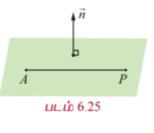

$$\Rightarrow \overrightarrow{AP} \cdot \vec{n} = 0 \Rightarrow (\vec{r} - \vec{a}) \cdot \vec{n} = 0$$

... (1)

இச்சமன்பாடு $\vec{a}$ என்ற வெக்டரை நிலைவெக்டராகக் கொண்ட புள்ளி வழியாகச் செல்வதும் $\vec{n}$ -க்கு செங்குத்தானதுமான தளத்தின் வெக்டர் சமன்பாடாகும்.

#### குறிப்பு

$$(\vec{r} - \vec{a}) \cdot \vec{n} = 0 \Rightarrow \vec{r} \cdot \vec{n} = \vec{a} \cdot \vec{n} \Rightarrow \vec{r} \cdot \vec{n} = q, \text{ இங்கு } q = \vec{a} \cdot \vec{n}$$

---

#### (b) கார்டீசியன் சமன்பாடு (Cartesian form of equation)

$a, b, c$ என்பன $\vec{n}$ -ன் திசை விகிதங்கள் எனில், $\vec{n} = a\hat{i} + b\hat{j} + c\hat{k}$ ஆகும். $A$-ன் அச்சுத்தூரங்கள் $(x_1, y_1, z_1)$ என்க. எனவே, சமன்பாடு (1)லிருந்து,

$$((x - x_1)\hat{i} + (y - y_1)\hat{j} + (z - z_1)\hat{k}) \cdot (a\hat{i} + b\hat{j} + c\hat{k}) = 0$$

$$\Rightarrow a(x - x_1) + b(y - y_1) + c(z - z_1) = 0$$

இது $(x_1, y_1, z_1)$ என்ற புள்ளி வழியாகச் செல்வதும் $a, b, c$ என்பவற்றை திசை விகிதங்களாகக் கொண்ட வெக்டருக்கு செங்குத்தானதுமான தளத்தின் கார்டீசியன் சமன்பாடாகும்.

---

### 6.8.3 தளத்தின் வெட்டுத்துண்டு வடிவச் சமன்பாடு
### (Intercept form of the equation of a plane)

$\vec{r} \cdot \vec{n} = q$ என்ற தளம் $OA = a, OB = b, OC = c$ என்ற வெட்டுத் துண்டுகளை ஏற்படுத்துமாறு ஆய அச்சுக்களை $A, B, C$ என்ற புள்ளிகளில் சந்திக்கிறது என்க. எனவே, $A$ -ன் நிலை வெக்டர் $a\hat{i}$ ஆகும்.

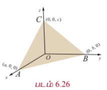

$A$ என்ற இப்புள்ளி கொடுக்கப்பட்ட தளத்தின் மீது உள்ளதால், $(a\hat{i}) \cdot \vec{n} = q$ ஆகும். இதிலிருந்து $\hat{i} \cdot \vec{n} = \frac{q}{a}$ ஆகும்.

இவ்வாறே, $b\hat{j}$ மற்றும் $c\hat{k}$ என்ற வெக்டர்களும் கொடுக்கப்பட்ட தளத்தில் உள்ளதால், $\hat{j} \cdot \vec{n} = \frac{q}{b}$ மற்றும் $\hat{k} \cdot \vec{n} = \frac{q}{c}$ எனக்கிடைக்கிறது.

$\vec{r} = x\hat{i} + y\hat{j} + z\hat{k}$ என $\vec{r} \cdot \vec{n} = q$ -ல் பிரதியிட, நாம் பெறுவது

$$x(\hat{i} \cdot \vec{n}) + y(\hat{j} \cdot \vec{n}) + z(\hat{k} \cdot \vec{n}) = q$$

எனவே, $\frac{qx}{a} + \frac{qy}{b} + \frac{qz}{c} = q$

$$\Rightarrow \frac{x}{a} + \frac{y}{b} + \frac{z}{c} = 1$$

இது $a, b, c$ என்ற வெட்டுத் துண்டுகளை முறையே $x, y, z$ அச்சுக்களில் ஏற்படுத்தும் தளத்தின் **வெட்டுத் துண்டு வடிவச் சமன்பாடாகும்**.

---

### தேற்றம் 6.16

$x, y, z$ -ல் உள்ள $ax + by + cz + d = 0$ என்ற நேரியச் சமன்பாடு ஒரு தளத்தைக் குறிக்கும்.

#### நிரூபணம்

$ax + by + cz + d = 0$ என்ற சமன்பாட்டை வெக்டர் சமன்பாடாக

$$(x\hat{i} + y\hat{j} + z\hat{k}) \cdot (a\hat{i} + b\hat{j} + c\hat{k}) = -d$$

அல்லது $\vec{r} \cdot \vec{n} = -d$ என எழுதலாம்.

இச்சமன்பாடு ஒரு தளத்தின் திட்ட வடிவ வெக்டர் சமன்பாடாகும். எனவே, கொடுக்கப்பட்ட சமன்பாடு $ax + by + cz + d = 0$ என்பது ஒரு தளத்தைக் குறிக்கிறது. இங்கு $\vec{n} = a\hat{i} + b\hat{j} + c\hat{k}$ என்ற வெக்டர் தளத்திற்குச் செங்குத்தான வெக்டராகும்.

#### குறிப்பு

ஒரு தளத்தின் பொது வடிவச் சமன்பாடு $ax + by + cz + d = 0$ -ல் உள்ள $a, b, c$ என்பன தளத்தின் செங்குத்தின் அல்லது செங்கோட்டின் திசை விகிதங்கள் ஆகும்.

---

### எடுத்துக்காட்டு 6.38

ஆதியில் இருந்து 12 அலகுகள் தூரத்தில் இருப்பதும் $6\hat{i} + 2\hat{j} - 3\hat{k}$ என்ற வெக்டருக்குச் செங்குத்தானதாகவும் உள்ள தளத்தின் வெக்டர் மற்றும் கார்டீசியன் சமன்பாடுகளைக் காண்க.

#### தீர்வு

இங்கு, $\vec{d} = 6\hat{i} + 2\hat{j} - 3\hat{k}$ மற்றும் $p = 12$ என்க.

$6\hat{i} + 2\hat{j} - 3\hat{k}$ என்ற வெக்டரின் திசையில் உள்ள ஓரலகு வெக்டர் $\hat{d}$ எனில்,

$$\hat{d} = \frac{\vec{d}}{|\vec{d}|} = \frac{1}{7}(6\hat{i} + 2\hat{j} - 3\hat{k})$$

$\vec{r}$ என்பது தளத்தில் உள்ள ஏதேனுமொரு புள்ளி $(x, y, z)$ -ன் நிலைவெக்டர் எனில், தளத்தின் செங்கோட்டு வடிவ வெக்டர் சமன்பாடு $\vec{r} \cdot \hat{d} = p$ -ஐப் பயன்படுத்தி நாம் பெறுவது,

$$\frac{1}{7}\vec{r} \cdot (6\hat{i} + 2\hat{j} - 3\hat{k}) = 12$$

$\vec{r} = x\hat{i} + y\hat{j} + z\hat{k}$ என இச்சமன்பாட்டில் பிரதியிடக் கிடைப்பது

$$\frac{1}{7}(x\hat{i} + y\hat{j} + z\hat{k}) \cdot (6\hat{i} + 2\hat{j} - 3\hat{k}) = 12$$

புள்ளிப் பெருக்கலைப் பயன்படுத்திச் சுருக்கினால் கிடைக்கும் $6x + 2y - 3z = 84$ என்ற சமன்பாடு தேவையான தளத்தின் கார்டீசியன் சமன்பாடாகும்.

---

### எடுத்துக்காட்டு 6.39

ஒரு தளத்தின் கார்டீசியன் சமன்பாடு $3x - 4y + 3z = -8$ எனில், தளத்தின் வெக்டர் சமன்பாட்டை திட்ட வடிவில் காண்க.

#### தீர்வு

$\vec{r} = x\hat{i} + y\hat{j} + z\hat{k}$ என்பது தளத்தில் உள்ள ஏதேனுமொரு புள்ளி $(x, y, z)$ -ன் நிலைவெக்டர் என்க.

கொடுக்கப்பட்ட சமன்பாட்டை $(x\hat{i} + y\hat{j} + z\hat{k}) \cdot (3\hat{i} - 4\hat{j} + 3\hat{k}) = -8$ அல்லது $\vec{r} \cdot (3\hat{i} - 4\hat{j} + 3\hat{k}) = -8$ என எழுதலாம்.

இது கொடுக்கப்பட்ட தளத்தின் திட்ட வடிவ வெக்டர் சமன்பாடாகும்.

---

### எடுத்துக்காட்டு 6.40

$\vec{r} \cdot (3\hat{i} - 4\hat{j} + 12\hat{k}) = 5$ என்ற தளத்தின் செங்குத்தின் திசைக் கொசைன்கள் மற்றும் ஆதியிலிருந்து தளத்திற்கு வரையப்படும் செங்குத்தின் நீளம் ஆகியவற்றைக் காண்க.

#### தீர்வு

$\vec{d} = 3\hat{i} - 4\hat{j} + 12\hat{k}$ மற்றும் $q = 5$ என்க.

$3\hat{i} - 4\hat{j} + 12\hat{k}$ -ன் திசையில் உள்ள ஓரலகு வெக்டர் $\hat{d}$ எனில்

$$\hat{d} = \frac{1}{13}(3\hat{i} - 4\hat{j} + 12\hat{k})$$

ஆகும்.

கொடுக்கப்பட்ட சமன்பாட்டை 13 -ஆல் வகுக்க, நாம் பெறுவது

$$\vec{r} \cdot \left(\frac{3}{13}\hat{i} - \frac{4}{13}\hat{j} + \frac{12}{13}\hat{k}\right) = \frac{5}{13}$$

இது $\vec{r} \cdot \hat{d} = p$ எனும் தளத்தின் செங்கோட்டு வடிவச் சமன்பாடாகும்.

இச்சமன்பாட்டிலிருந்து $\hat{d} = \frac{1}{13}(3\hat{i} - 4\hat{j} + 12\hat{k})$ என்பது ஆதியிலிருந்து தளத்திற்கு வரையப்பட்ட ஓரலகு செங்குத்து வெக்டராகும் என அறிகிறோம். எனவே, $\hat{d}$ -ன் திசைக்கொசைன்கள் $\frac{3}{13}, -\frac{4}{13}, \frac{12}{13}$ மற்றும் ஆதியில் இருந்து தளத்திற்கு வரையப்படும் செங்குத்தின் நீளம் $\frac{5}{13}$ ஆகும்.

---

### எடுத்துக்காட்டு 6.41

$4\hat{i} + 2\hat{j} - 3\hat{k}$ என்ற வெக்டரை நிலைவெக்டராகக் கொண்ட புள்ளி வழிச் செல்வதும் $2\hat{i} - \hat{j} + \hat{k}$ என்ற வெக்டருக்குச் செங்குத்தானதுமான தளத்தின் வெக்டர் மற்றும் கார்டீசியன் சமன்பாடுகளைக் காண்க.

#### தீர்வு

கொடுக்கப்பட்ட புள்ளியின் நிலை வெக்டர் $\vec{a} = 4\hat{i} + 2\hat{j} - 3\hat{k}$ மற்றும் $\vec{n} = 2\hat{i} - \hat{j} + \hat{k}$ என்க.

கொடுக்கப்பட்ட புள்ளி வழியாகச் செல்வதும், தளத்திற்குச் செங்குத்தான வெக்டரைக் கொண்டதுமான தளத்தின் வெக்டர் சமன்பாடு $(\vec{r} - \vec{a}) \cdot \vec{n} = 0$ அல்லது $\vec{r} \cdot \vec{n} = \vec{a} \cdot \vec{n}$.

எனவே, தேவையான தளத்தின் வெக்டர் சமன்பாடு காண இச்சமன்பாட்டில் $\vec{a} = 4\hat{i} + 2\hat{j} - 3\hat{k}$ மற்றும் $\vec{n} = 2\hat{i} - \hat{j} + \hat{k}$ எனப்பிரதியிட, நாம் பெறுவது

$$\vec{r} \cdot (2\hat{i} - \hat{j} + \hat{k}) = (4\hat{i} + 2\hat{j} - 3\hat{k}) \cdot (2\hat{i} - \hat{j} + \hat{k})$$

$$\Rightarrow \vec{r} \cdot (2\hat{i} - \hat{j} + \hat{k}) = 3$$

$\vec{r} = x\hat{i} + y\hat{j} + z\hat{k}$ எனப்பிரதியிடக் கிடைப்பது $2x - y + z = 3$ ஆகும். இதுவே தேவையான தளத்தின் கார்டீசியன் சமன்பாடாகும்.

---

### எடுத்துக்காட்டு 6.42

ஒரு நகரும் தளம் ஆய அச்சுக்களில் ஏற்படுத்தும் வெட்டுத் துண்டுகளின் தலைகீழிகளின் கூடுதல் ஒரு மாறிலியாக இருக்குமாறு நகர்கிறது எனில், அத்தளமானது ஒரு நிலைத்த புள்ளி வழியாகச் செல்கிறது எனக்காட்டுக.

#### தீர்வு

$x, y, z$ அச்சுகளில் முறையே $a, b, c$ என்ற வெட்டுத் துண்டுகளை ஏற்படுத்தும் தளத்தின் சமன்பாடு $\frac{x}{a} + \frac{y}{b} + \frac{z}{c} = 1$ ஆகும். ஆய அச்சுகளில் ஏற்படுத்தும் வெட்டுத்துண்டுகளின் தலைகீழிகளின் கூடுதல் ஒரு மாறிலி என்பதால் $\frac{1}{a} + \frac{1}{b} + \frac{1}{c} = k$ ஆகும். இங்கு, $k$ ஒரு மாறிலி. இதனை

$$\frac{x}{a} + \frac{y}{b} + \frac{z}{c} = 1$$

$$k\left(\frac{x}{a} + \frac{y}{b} + \frac{z}{c}\right) = k$$

$$\frac{x}{1/k} + \frac{y}{1/k} + \frac{z}{1/k} = 1$$

$$x + y + z = \frac{1}{k}$$

என எழுதலாம்.

இச்சமன்பாடு, $\frac{x}{a} + \frac{y}{b} + \frac{z}{c} = 1$ என்ற தளமானது $\left(\frac{1}{k}, \frac{1}{k}, \frac{1}{k}\right)$ என்ற நிலையான புள்ளி வழியாகச் செல்கிறது எனக் காட்டுகிறது.

---

### பயிற்சி 6.6

1. ஆதிப்புள்ளியில் இருந்து 7 அலகுகள் தொலைவில் உள்ளதும், செங்குத்தின் திசை விகிதங்கள் $3, -4, 5$ கொண்டதுமான தளத்தின் வெக்டர் சமன்பாடு காண்க.

2. $12x + 3y - 4z = 65$ என்ற தளத்தின் செங்குத்தின் திசைக்கொசைன்களைக் காண்க. மேலும், தளத்தின் துணை அலகு அல்லாத வெக்டர் சமன்பாடு மற்றும் ஆதியில் இருந்து தளத்திற்கு வரையப்படும் செங்குத்தின் நீளம் காண்க.

3. $2\hat{i} + 6\hat{j} + 3\hat{k}$ என்ற நிலை வெக்டரை கொண்ட புள்ளி வழியாகச் செல்வதும் $\hat{i} + 3\hat{j} + 5\hat{k}$ என்ற வெக்டருக்குச் செங்குத்தானதுமான தளத்தின் வெக்டர் மற்றும் கார்டீசியன் சமன்பாடுகளைக் காண்க.

4. $(-1, 1, 2)$ என்ற புள்ளி வழியாகச் செல்வதும் ஆய அச்சுகளுடன் சமகோணத்தை ஏற்படுத்தும் எண்ணளவு $3\sqrt{3}$ கொண்ட செங்கோட்டைக் கொண்டதுமான தளத்தின் வெக்டர் மற்றும் கார்டீசியன் சமன்பாடுகளைக் காண்க.

5. $\vec{r} \cdot (6\hat{i} + 4\hat{j} - 3\hat{k}) = 12$ என்ற தளம் ஆய அச்சுகளுடன் ஏற்படுத்தும் வெட்டுத்துண்டுகளைக் காண்க.

6. ஒரு தளம் ஆய அச்சுகளை முறையே $A, B, C$ என்ற புள்ளிகளில் வெட்டுவதால் உருவாகும் முக்கோணம் $ABC$ -ன் மையக்கோட்டுச் சந்தி $(u, v, w)$ எனில், தளத்தின் சமன்பாட்டைக் காண்க.

---

### 6.8.4 கொடுக்கப்பட்ட ஒரே கோட்டிலமையாத மூன்று புள்ளிகள் வழியாகச் செல்லும் தளத்தின் சமன்பாடு
### (Equation of a plane passing through three given non-collinear points)

#### (a) துணை அலகு வெக்டர் சமன்பாடு (Parametric form of vector equation)

##### தேற்றம் 6.17

$\vec{a}, \vec{b}, \vec{c}$ என்பன ஒரே கோட்டிலமையாத மூன்று புள்ளிகளின் நிலை வெக்டர்கள் எனில், கொடுக்கப்பட்ட இம்மூன்று புள்ளிகள் வழியாகச் செல்லும் தளத்தின் துணை அலகு வெக்டர் சமன்பாடு

$$\vec{r} = \vec{a} + s(\vec{b} - \vec{a}) + t(\vec{c} - \vec{a}), \text{ இங்கு } \vec{b} \neq 0, \vec{c} \neq 0 \text{ மற்றும் } s, t \in \mathbb{R} \text{ ஆகும்}$$

#### நிரூபணம்

ஒரே கோட்டிலமையாத முறையே $\vec{a}, \vec{b}, \vec{c}$ என்ற வெக்டர்களை நிலை வெக்டர்களாகக் கொண்ட $A, B, C$ என்ற புள்ளிகள் வழியாக தேவையான தளம் செல்கிறது என்க. ஆகவே, இவற்றில் குறைந்தது இரு வெக்டர்கள் பூச்சியமற்ற வெக்டர்களாக இருக்கும். நாம் $\vec{b} \neq 0$ மற்றும் $\vec{c} \neq 0$ எனக் கொள்வோம். தளத்தின் மீதுள்ள ஏதேனும் ஒரு புள்ளி $P$ -ன் நிலைவெக்டர் $\vec{r}$ என்க. $\overrightarrow{AD}$ என்பது $\overrightarrow{AB}$ -க்கு இணையாக இருக்குமாறும் மற்றும் $\overrightarrow{DP}$ என்பது $\overrightarrow{AC}$ -க்கு இணையாக இருக்குமாறும் $AB$ -ஐ நீட்டித்து அதன் மேல் $D$ என்ற புள்ளியை எடுத்துக் கொள்க. எனவே,

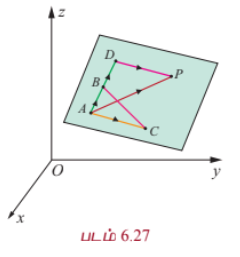

$$\overrightarrow{AD} = s(\vec{b} - \vec{a}), \quad \overrightarrow{DP} = t(\vec{c} - \vec{a})$$

முக்கோணம் $ADP$ -ல்,

$$\overrightarrow{AP} = \overrightarrow{AD} + \overrightarrow{DP}$$

அல்லது

$$\vec{r} - \vec{a} = s(\vec{b} - \vec{a}) + t(\vec{c} - \vec{a}),$$

இங்கு $\vec{b} \neq 0, \vec{c} \neq 0$ மற்றும் $s, t \in \mathbb{R}$.

அதாவது,

$$\vec{r} = \vec{a} + s(\vec{b} - \vec{a}) + t(\vec{c} - \vec{a})$$

இது கொடுக்கப்பட்ட ஒரே கோட்டிலமையாத மூன்று புள்ளிகள் வழியாகச் செல்லும் தளத்தின் துணை அலகு வெக்டர் சமன்பாடாகும்.

---

#### (b) துணை அலகு அல்லாத வெக்டர் சமன்பாடு (Non-parametric form of vector equation)

ஒரே கோட்டிலமையாத முறையே $\vec{a}, \vec{b}, \vec{c}$ என்ற வெக்டர்களை நிலைவெக்டர்களாகக் கொண்ட $A, B, C$ என்ற புள்ளிகள் வழியாகத் தேவையான தளம் செல்கிறது என்க. ஆகவே இவற்றில் குறைந்தது இரு வெக்டர்களாவது பூச்சியமற்றதாக இருக்கும். நாம் $\vec{b} \neq 0$ மற்றும் $\vec{c} \neq 0$ எனக் கொள்வோம்.

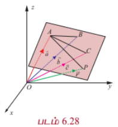

எனவே, $\overrightarrow{AB} = \vec{b} - \vec{a}$ மற்றும் $\overrightarrow{AC} = \vec{c} - \vec{a}$ ஆகும். $(\vec{b} - \vec{a})$ மற்றும் $(\vec{c} - \vec{a})$ என்ற வெக்டர்கள் தேவையான தளத்தில் உள்ளன. மேலும், $\vec{a}, \vec{b}, \vec{c}$ என்பன ஒரே கோட்டிலமையாத வெக்டர்கள் என்பதால், $\overrightarrow{AB}$ என்பது $\overrightarrow{AC}$ -க்கு இணையாக இருக்காது. எனவே, $(\vec{b} - \vec{a}) \times (\vec{c} - \vec{a})$ என்பது தளத்திற்கு செங்குத்தாகும்.

தளத்தில் உள்ள ஏதேனும் ஒரு புள்ளி $P(x, y, z)$ -ன் நிலை வெக்டர் $\vec{r}$ எனில், $\vec{a}$ என்ற வெக்டரை நிலை வெக்டராகக் கொண்ட புள்ளி $A$ வழியாகச் செல்வதும் $(\vec{b} - \vec{a}) \times (\vec{c} - \vec{a})$ என்ற வெக்டருக்கு செங்குத்தானதுமான தளத்தின் சமன்பாடு

$$(\vec{r} - \vec{a}) \cdot ((\vec{b} - \vec{a}) \times (\vec{c} - \vec{a})) = 0$$

அல்லது

$$[\vec{r} - \vec{a}, \vec{b} - \vec{a}, \vec{c} - \vec{a}] = 0$$

இது ஒரே கோட்டிலமையாத மூன்று புள்ளிகள் வழிச் செல்லும் தளத்தின் துணை அலகு அல்லாத வெக்டர் சமன்பாடாகும்.

---

#### (c) கார்டீசியன் சமன்பாடு (Cartesian form of equation)

$\vec{a}, \vec{b}, \vec{c}$ என்ற நிலைவெக்டர்களைக் கொண்ட ஒரே கோட்டிலமையாத மூன்று புள்ளிகள் $A, B, C$ என்பவற்றின் அச்சுத்தூரங்கள் முறையே $(x_1, y_1, z_1), (x_2, y_2, z_2), (x_3, y_3, z_3)$ மற்றும் $\vec{r}$ என்ற வெக்டரை நிலை வெக்டராகக் கொண்ட $P$ என்ற புள்ளியின் அச்சுத்தூரங்கள் $(x, y, z)$ எனில்,

$$\vec{a} = x_1\hat{i} + y_1\hat{j} + z_1\hat{k}, \quad \vec{b} = x_2\hat{i} + y_2\hat{j} + z_2\hat{k}, \quad \vec{c} = x_3\hat{i} + y_3\hat{j} + z_3\hat{k}$$

மற்றும்

$$\vec{r} = x\hat{i} + y\hat{j} + z\hat{k}$$

இவ்வெக்டர்களைப் பயன்படுத்தி, ஒரே கோட்டிலமையாத கொடுக்கப்பட்ட மூன்று புள்ளிகள் வழிச் செல்லும் தளத்தின் துணை அலகு அல்லாத வெக்டர் சமன்பாட்டினை பின்வருமாறு எழுதலாம்.

$$\begin{vmatrix}
x - x_1 & y - y_1 & z - z_1 \\
x_2 - x_1 & y_2 - y_1 & z_2 - z_1 \\
x_3 - x_1 & y_3 - y_1 & z_3 - z_1
\end{vmatrix} = 0$$

இதுவே ஒரே கோட்டிலமையாத மூன்று புள்ளிகள் வழிச் செல்லும் தளத்தின் கார்டீசியன் சமன்பாடாகும்.

---

### 6.8.5 கொடுக்கப்பட்ட ஒரு புள்ளி வழிச் செல்வதும் இணை அல்லாத இரண்டு வெக்டர்களுக்கு இணையாகவும் உள்ள தளத்தின் சமன்பாடு
### (Equation of a plane passing through a given point and parallel to two given non-parallel vectors)

#### (a) துணை அலகு வெக்டர் சமன்பாடு (Parametric form of vector equation)

$\vec{a}$ என்ற நிலை வெக்டரைக் கொண்ட கொடுக்கப்பட்ட புள்ளி $A$ வழிச் செல்வதும் கொடுக்கப்பட்ட இணை அல்லாத $\vec{b}, \vec{c}$ என்ற இரு வெக்டர்களுக்கு இணையாகவும் ஒரு தளம் உள்ளது என்க.

தளத்தின் மீதுள்ள ஏதேனும் ஒரு புள்ளி $P$ -ன் நிலை வெக்டர் $\vec{r}$ எனில், $(\vec{r} - \vec{a}), \vec{b}$ மற்றும் $\vec{c}$ என்பன ஒரு தள வெக்டர்களாகும்.

எனவே, $(\vec{r} - \vec{a})$ என்ற வெக்டர் $\vec{b}$ மற்றும் $\vec{c}$ என்ற வெக்டர்கள் அமைக்கும் தளத்தில் இருக்கும்.

ஆகவே, $\vec{r} - \vec{a} = s\vec{b} + t\vec{c}$ எனுமாறு $s, t \in \mathbb{R}$ என்ற திசையிலிகளைக் காணமுடியும். இதிலிருந்து

$$\vec{r} = \vec{a} + s\vec{b} + t\vec{c}, \text{ இங்கு } s, t \in \mathbb{R}$$

... (1)

எனப் பெறலாம்.

இது கொடுக்கப்பட்ட ஒரு புள்ளி வழிச் செல்வதும் இணை அல்லாத இரு வெக்டர்களுக்கு இணையானதுமான தளத்தின் **துணை அலகு வடிவ வெக்டர் சமன்பாடாகும்**.

---

#### (b) துணை அலகு அல்லாத வெக்டர் சமன்பாடு (Non-parametric form of vector equation)

சமன்பாடு (1)-ஐ பின்வருமாறு எழுதலாம்.

$$(\vec{r} - \vec{a}) \cdot (\vec{b} \times \vec{c}) = 0$$

... (2)

இது கொடுக்கப்பட்ட ஒரு புள்ளி வழிச் செல்வதும் கொடுக்கப்பட்ட இணை அல்லாத இரு வெக்டர்களுக்கு இணையானதுமான தளத்தின் **துணை அலகு அல்லாத வெக்டர் சமன்பாடாகும்**.

---

#### (c) கார்டீசியன் சமன்பாடு (Cartesian form of equation)

$\vec{a} = x_1\hat{i} + y_1\hat{j} + z_1\hat{k}, \quad \vec{b} = b_1\hat{i} + b_2\hat{j} + b_3\hat{k}, \quad \vec{c} = c_1\hat{i} + c_2\hat{j} + c_3\hat{k}$ மற்றும் $\vec{r} = x\hat{i} + y\hat{j} + z\hat{k}$ எனில், சமன்பாடு (2)-ஐ பின்வருமாறு எழுதலாம்.

$$\begin{vmatrix}
x - x_1 & y - y_1 & z - z_1 \\
b_1 & b_2 & b_3 \\
c_1 & c_2 & c_3
\end{vmatrix} = 0$$

இது கொடுக்கப்பட்ட ஒரு புள்ளி வழிச் செல்வதும் கொடுக்கப்பட்ட இணை அல்லாத இரு வெக்டர்களுக்கு இணையானதுமான தளத்தின் **கார்டீசியன் சமன்பாடாகும்**.

---

### 6.8.6 கொடுக்கப்பட்ட இரண்டு தனித்த புள்ளிகள் வழியாகச் செல்வதும் ஒரு பூச்சியமற்ற வெக்டருக்கு இணையாகவும் உள்ள தளத்தின் சமன்பாடு
### (Equation of a plane passing through two given distinct points and is parallel to a non-zero vector)

#### (a) துணை அலகு வெக்டர் சமன்பாடு (Parametric form of vector equation)

$\vec{a}, \vec{b}$ என்ற நிலை வெக்டர்களைக் கொண்ட இரு தனித்த புள்ளிகள் $A$ மற்றும் $B$ வழியாகச் செல்வதும் $\vec{c}$ என்ற பூச்சியமற்ற வெக்டருக்கு இணையானதுமான தளத்தின் துணை அலகு வடிவ வெக்டர் சமன்பாடு

$$\vec{r} = \vec{a} + s(\vec{b} - \vec{a}) + t\vec{c}$$

அல்லது

$$\vec{r} = (1 - s)\vec{a} + s\vec{b} + t\vec{c}$$

... (1)

இங்கு $s, t \in \mathbb{R}$, $(\vec{b} - \vec{a})$ மற்றும் $\vec{c}$ என்பன இணையான வெக்டர்கள் அல்ல.

---

#### (b) துணை அலகு அல்லாத வெக்டர் சமன்பாடு (Non-parametric form of vector equation)

சமன்பாடு (1)-ஐ துணை அலகு அல்லாத வெக்டர் சமன்பாடாக பின்வருமாறு எழுதலாம்

$$(\vec{r} - \vec{a}) \cdot ((\vec{b} - \vec{a}) \times \vec{c}) = 0$$

... (2)

இங்கு, $(\vec{b} - \vec{a})$ மற்றும் $\vec{c}$ என்பன இணை வெக்டர்கள் அல்ல.

---

#### (c) கார்டீசியன் சமன்பாடு (Cartesian form of equation)

$\vec{a} = x_1\hat{i} + y_1\hat{j} + z_1\hat{k}, \quad \vec{b} = x_2\hat{i} + y_2\hat{j} + z_2\hat{k}, \quad \vec{c} = c_1\hat{i} + c_2\hat{j} + c_3\hat{k} \neq 0$ மற்றும் $\vec{r} = x\hat{i} + y\hat{j} + z\hat{k}$ எனில் சமன்பாடு (2) -ஐ பின்வருமாறு எழுதலாம்.

$$\begin{vmatrix}
x - x_1 & y - y_1 & z - z_1 \\
x_2 - x_1 & y_2 - y_1 & z_2 - z_1 \\
c_1 & c_2 & c_3
\end{vmatrix} = 0$$

இதுவே, தேவையான தளத்தின் கார்டீசியன் சமன்பாடாகும்.

---

### எடுத்துக்காட்டு 6.43

$(0, 1, -5)$ என்ற புள்ளி வழிச் செல்லும் $\vec{r} = (2\hat{i} - \hat{j} + 4\hat{k}) + s(2\hat{i} + 3\hat{j} + 6\hat{k})$ மற்றும் $\vec{r} = (-3\hat{i} + \hat{j} + 5\hat{k}) + t(\hat{i} - \hat{j} + \hat{k})$ என்ற கோடுகளுக்கு இணையாக உள்ளதுமான தளத்தின் துணை அலகு அல்லாத வெக்டர் சமன்பாடு மற்றும் கார்டீசியன் சமன்பாடுகளைக் காண்க.

#### தீர்வு

தேவையான தளம் $\vec{b} = 2\hat{i} + 3\hat{j} + 6\hat{k}, \vec{c} = \hat{i} - \hat{j} + \hat{k}$ என்ற வெக்டர்களுக்கு இணையாகவும், $\vec{a}$ -ஐ நிலை வெக்டராகக் கொண்ட $(0, 1, -5)$ என்ற புள்ளி வழியாகவும் செல்வதைக் காண்கிறோம். மேலும், $\vec{b}$ மற்றும் $\vec{c}$ என்பன இணை வெக்டர்கள் அல்ல எனவும் காண்கிறோம்.

தேவையான தளத்தின் துணை அலகு அல்லாத வெக்டர் சமன்பாடு $(\vec{r} - \vec{a}) \cdot (\vec{b} \times \vec{c}) = 0$

... (1)

இப்பொழுது $\vec{a} = \hat{j} - 5\hat{k}$ மற்றும்

$$\vec{b} \times \vec{c} = \begin{vmatrix}
\hat{i} & \hat{j} & \hat{k} \\
2 & 3 & 6 \\
1 & -1 & 1
\end{vmatrix} = 9\hat{i} + 4\hat{j} - 5\hat{k}$$

என சமன்பாடு (1)-ல் பிரதியிட, நாம் பெறுவது

$$(\vec{r} - (\hat{j} - 5\hat{k})) \cdot (9\hat{i} + 4\hat{j} - 5\hat{k}) = 0$$

$$\Rightarrow \vec{r} \cdot (9\hat{i} + 4\hat{j} - 5\hat{k}) = 13$$

$\vec{r} = x\hat{i} + y\hat{j} + z\hat{k}$ என்பது தளத்தின் மீதுள்ள ஏதேனும் ஒரு புள்ளியின் நிலைவெக்டர் எனில், மேற்கண்ட சமன்பாட்டிலிருந்து தளத்தின் கார்டீசியன் சமன்பாட்டை $9x + 4y - 5z = 13$ எனப் பெறுகிறோம்.

---

### எடுத்துக்காட்டு 6.44

$(-1, 2, 0), (2, 2, -1)$ என்ற புள்ளிகள் வழியாகச் செல்வதும்

$$\frac{x - 1}{2} = \frac{y + 1}{1} = \frac{z - 1}{-1}$$

என்ற கோட்டிற்கு இணையாகவும் உள்ள தளத்தின் துணை அலகு வெக்டர் சமன்பாடு, துணை அலகு அல்லாத வெக்டர் சமன்பாடு மற்றும் கார்டீசியன் சமன்பாடுகளைக் காண்க.

#### தீர்வு

தேவையான தளம் கொடுக்கப்பட்ட கோட்டிற்கு இணை என்பதால், அத்தளம் $\vec{c} = \hat{i} + \hat{j} - \hat{k}$ என்ற வெக்டருக்கு இணையாகும் மற்றும் $\vec{a} = -\hat{i} + 2\hat{j}$, $\vec{b} = 2\hat{i} + 2\hat{j} - \hat{k}$ என்ற புள்ளிகள் வழியாகச் செல்லும்.

- தளத்தின் துணை அலகு வடிவ வெக்டர் சமன்பாடு $\vec{r} = \vec{a} + s(\vec{b} - \vec{a}) + t\vec{c}$, இங்கு $s, t \in \mathbb{R}$

$$\Rightarrow \vec{r} = (-\hat{i} + 2\hat{j}) + s(3\hat{i} - \hat{k}) + t(\hat{i} + \hat{j} - \hat{k}), \text{ இங்கு } s, t \in \mathbb{R}$$

- தளத்தின் துணை அலகு அல்லாத வெக்டர் சமன்பாடு $(\vec{r} - \vec{a}) \cdot ((\vec{b} - \vec{a}) \times \vec{c}) = 0$

இங்கு,

$$(\vec{b} - \vec{a}) \times \vec{c} = \begin{vmatrix}
\hat{i} & \hat{j} & \hat{k} \\
3 & 0 & -1 \\
1 & 1 & -1
\end{vmatrix} = 2\hat{i} + 2\hat{j} + 3\hat{k}$$

எனவே, $(\vec{r} - (-\hat{i} + 2\hat{j})) \cdot (2\hat{i} + 2\hat{j} + 3\hat{k}) = 0$

$$\Rightarrow \vec{r} \cdot (2\hat{i} + 2\hat{j} + 3\hat{k}) = 3$$

- $\vec{r} = x\hat{i} + y\hat{j} + z\hat{k}$ என்பது தளத்தில் உள்ள ஏதேனுமொரு புள்ளியின் நிலைவெக்டர் எனில், மேற்கண்ட சமன்பாட்டிலிருந்து தளத்தின் கார்டீசியன் சமன்பாட்டை $2x + 2y + 3z = 3$ எனப் பெறுகிறோம்.

---

### பயிற்சி 6.7

1. $(2, 3, 6)$ என்ற புள்ளி வழிச் செல்வதும்

$$\frac{x - 1}{2} = \frac{y - 1}{3} = \frac{z - 3}{1}$$

மற்றும்

$$\frac{x - 3}{2} = \frac{y + 3}{-5} = \frac{z - 1}{-3}$$

என்ற கோடுகளுக்கு இணையானதுமான தளத்தின் துணை அலகு அல்லாத வெக்டர் சமன்பாடு மற்றும் கார்டீசியன் சமன்பாடுகளைக் காண்க.

2. $(2, 2, 1), (9, 3, 6)$ ஆகிய புள்ளிகள் வழிச் செல்லக்கூடியதும் $2x + 6y + 6z = 9$ என்ற தளத்திற்குச் செங்குத்தாக அமைவதுமான தளத்தின் துணை அலகு அல்லாத வெக்டர் சமன்பாடு மற்றும் கார்டீசியன் சமன்பாடுகளைக் காண்க.

3. $(2, -2, 1), (1, -2, 3)$ என்ற புள்ளிகள் வழிச் செல்வதும் $(2, 1, -3)$ மற்றும் $(-1, 5, -8)$ என்ற புள்ளிகள் வழிச் செல்லும் நேர்க்கோட்டிற்கு இணையாகவும் அமையும் தளத்தின் துணை அலகு வெக்டர் சமன்பாடு, மற்றும் கார்டீசியன் சமன்பாடுகளைக் காண்க.

4. $(1, -2, 4)$ என்ற புள்ளி வழிச் செல்வதும் $x + 2y - 3z = 11$ என்ற தளத்திற்கு செங்குத்தாகவும்

$$\frac{x + 7}{3} = \frac{y}{-1} = \frac{z - 1}{1}$$

என்ற கோட்டிற்கு இணையாகவும் அமையும் தளத்தின் துணை அலகு அல்லாத வெக்டர் சமன்பாடு மற்றும் கார்டீசியன் சமன்பாடுகளைக் காண்க.

5. $\vec{r} = (-\hat{i} + \hat{j} - 3\hat{k}) + t(2\hat{i} - 4\hat{j} + \hat{k})$ என்ற கோட்டை உள்ளடக்கியதும் $\vec{r} \cdot (\hat{i} + 2\hat{j} + \hat{k}) = 8$ என்ற தளத்திற்குச் செங்குத்தானதுமான தளத்தின் துணை அலகு வடிவ வெக்டர், மற்றும் கார்டீசியன் சமன்பாடுகளைக் காண்க.

6. $(3, 6, -2), (-1, -2, 6)$, மற்றும் $(6, 4, -2)$ ஆகிய ஒரே கோட்டிலமையாத மூன்று புள்ளிகள் வழிச் செல்லும் தளத்தின் துணை அலகு, துணை அலகு அல்லாத வெக்டர், மற்றும் கார்டீசியன் சமன்பாடுகளைக் காண்க.

7. $\vec{r} = (6\hat{i} - 2\hat{j} + \hat{k}) + s(5\hat{i} - 4\hat{j} + \hat{k}) + t(-\hat{i} - \hat{j} - \hat{k})$ என்ற தளத்தின் துணை அலகு அல்லாத வெக்டர், மற்றும் கார்டீசியன் சமன்பாடுகளைக் காண்க.

---

### 6.8.7 ஒரு கோடு ஒரு தளத்தின் மீது அமைவதற்கான கட்டுப்பாடு
### (Condition for a line to lie in a plane)

கொடுக்கப்பட்ட ஒரு கோட்டின் மீதுள்ள ஒவ்வொரு புள்ளியும், தளத்தின் மீது இருக்கும் எனவும், தளத்தின் செங்கோடு கொடுக்கப்பட்ட நேர்க்கோட்டிற்கு செங்குத்தாக அமையும் எனவும் இருப்பின், அந்த நேர்க்கோடு தளத்தின் மீது அமையும். அதாவது,

(i) $\vec{r} = \vec{a} + t\vec{b}$ என்ற கோடு $\vec{r} \cdot \vec{n} = d$ என்ற தளத்தின் மீது இருந்தால் $\vec{a} \cdot \vec{n} = d$ மற்றும் $\vec{b} \cdot \vec{n} = 0$ ஆகும்.

(ii) $\frac{x - x_1}{a} = \frac{y - y_1}{b} = \frac{z - z_1}{c}$ என்ற கோடு $Ax + By + Cz + D = 0$ என்ற தளத்தின் மீது இருந்தால், $Ax_1 + By_1 + Cz_1 + D = 0$ மற்றும் $aA + bB + cC = 0$ ஆகும்.

---

### எடுத்துக்காட்டு 6.45

$$\frac{x - 3}{-4} = \frac{y - 4}{-7} = \frac{z + 3}{12}$$

என்ற கோடு $5x - y + z = 8$ என்ற தளத்தில் அமையுமா எனச் சரிபார்க்க.

#### தீர்வு

இங்கு, $(x_1, y_1, z_1) = (3, 4, -3)$ மற்றும் கோட்டின் திசை விகிதங்கள் $(a, b, c) = (-4, -7, 12)$ ஆகும். தளத்தின் செங்கோட்டின் திசை விகிதங்கள் $(A, B, C) = (5, -1, 1)$ ஆகும்.

கொடுக்கப்பட்ட புள்ளி $(x_1, y_1, z_1) = (3, 4, -3)$ ஆனது $5x - y + z = 8$ என்ற தளத்தை நிறைவு செய்வதைக் காண்கிறோம். ஆனால், $aA + bB + cC = (-4)(5) + (-7)(-1) + (12)(1) = -20 + 7 + 12 = -1 \neq 0$ என்பதால் தளத்தின் செங்கோடு கொடுக்கப்பட்ட கோட்டிற்கு செங்குத்தானது அல்ல. எனவே, கொடுக்கப்பட்ட கோடானது கொடுக்கப்பட்ட தளத்தின் மீது அமையாது.

---

### 6.8.8 இரண்டு கோடுகள் ஒரே தளத்தில் அமைவதற்கான நிபந்தனை
### (Condition for coplanarity of two lines)

#### (a) வெக்டர் வடிவக் கட்டுப்பாடு (Condition in vector form)

$\vec{r} = \vec{a} + s\vec{b}$ மற்றும் $\vec{r} = \vec{c} + t\vec{d}$ என்பன கொடுக்கப்பட்ட இரண்டு இணை அல்லாத ஒரு தளம் அமையும் கோடுகள் என்க.

ஆகவே, அவை ஒரே தளத்தில் இருக்கும். $\vec{a}$ மற்றும் $\vec{c}$ ஆகியவற்றை நிலைவெக்டர்களாகக் கொண்ட இரு புள்ளிகள் $A$ மற்றும் $C$ என்க. எனவே, $A$ மற்றும் $C$ என்ற இவ்விரு புள்ளிகளும் தளத்தின் மீது அமையும். $\vec{b}$ மற்றும் $\vec{d}$ என்ற வெக்டர்கள் தளத்திற்கு இணையாக உள்ள வெக்டர்கள் என்பதால், $\vec{b} \times \vec{d}$ என்பது தளத்திற்கு செங்குத்தாக அமையும். எனவே, $\overrightarrow{AC}$ என்பது $\vec{b} \times \vec{d}$ -க்கு செங்குத்தாகும். அதாவது,

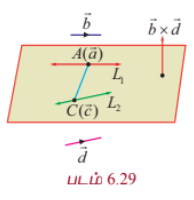

$$(\vec{c} - \vec{a}) \cdot (\vec{b} \times \vec{d}) = 0$$

இதுவே இரண்டு நேர்க்கோடுகள் ஒரே தளத்தில் அமைவதற்குத் தேவையான நிபந்தனையாகும்.

---

#### (b) கார்டீசியன் வடிவக் கட்டுப்பாடு (Condition in Cartesian form)

$$\frac{x - x_1}{b_1} = \frac{y - y_1}{b_2} = \frac{z - z_1}{b_3}$$

மற்றும்

$$\frac{x - x_2}{d_1} = \frac{y - y_2}{d_2} = \frac{z - z_2}{d_3}$$

என்ற கோடுகள் ஒரே தளத்தில் அமையும் எனில்,

$$\begin{vmatrix}
x_2 - x_1 & y_2 - y_1 & z_2 - z_1 \\
b_1 & b_2 & b_3 \\
d_1 & d_2 & d_3
\end{vmatrix} = 0$$

இதுவே, கொடுக்கப்பட்ட இரண்டு கோடுகள் ஒரே தளத்தில் அமைவதற்கான கார்டீசியன் வடிவக் கட்டுப்பாடு ஆகும்.

---

### 6.8.9 ஒரே தளத்தில் அமையும் இணை அல்லாத இரண்டு கோடுகளைக் கொண்டுள்ள தளத்தின் சமன்பாடு
### (Equation of plane containing two non-parallel coplanar lines)

#### (a) துணை அலகு வெக்டர் சமன்பாடு (Parametric form of vector equation)

$\vec{r} = \vec{a} + s\vec{b}$ மற்றும் $\vec{r} = \vec{c} + t\vec{d}$ என்பன ஒரே தளத்தில் அமையும் இணை அல்லாத இரண்டு கோடுகள் என்க. எனவே, $\vec{b} \times \vec{d} \neq 0$ ஆகும். $\vec{r}_0$ என்ற வெக்டரை நிலைவெக்டராகக் கொண்ட தளத்தில் உள்ள ஏதேனுமொரு புள்ளி $P$ என்க. ஆகவே, $\vec{r}_0 - \vec{a}, \vec{b}, \vec{d}$ மற்றும் $\vec{r}_0 - \vec{c}, \vec{b}, \vec{d}$ என்பன ஒரு தள வெக்டர்களாகும். ஆகையால், $\vec{r}_0 - \vec{a} = t\vec{b} + s\vec{d}$ அல்லது $\vec{r}_0 - \vec{c} = t\vec{b} + s\vec{d}$ ஆகும். எனவே, தேவையான தளத்தின் துணை அலகு வெக்டர் சமன்பாடு $\vec{r} = \vec{a} + t\vec{b} + s\vec{d}$ அல்லது $\vec{r} = \vec{c} + t\vec{b} + s\vec{d}$ ஆகும்.

---

#### (b) துணை அலகு அல்லாத வெக்டர் சமன்பாடு (Non-parametric form of vector equation)

$\vec{r} = \vec{a} + s\vec{b}$ மற்றும் $\vec{r} = \vec{c} + t\vec{d}$ என்பன ஒரே தளத்தில் அமையும் இணை அல்லாத இரண்டு கோடுகள் என்க. எனவே, $\vec{b} \times \vec{d} \neq 0$ ஆகும். $\vec{r}_0$ என்ற வெக்டரை நிலை வெக்டராகக் கொண்ட தளத்தில் உள்ள ஏதேனுமொரு புள்ளி $P$ என்க. ஆகவே, $\vec{r}_0 - \vec{a}, \vec{b}, \vec{d}$ மற்றும் $\vec{r}_0 - \vec{c}, \vec{b}, \vec{d}$ என்பன ஒரு தள வெக்டர்களாகும். ஆகையால், $(\vec{r}_0 - \vec{a}) \cdot (\vec{b} \times \vec{d}) = 0$ அல்லது $(\vec{r}_0 - \vec{c}) \cdot (\vec{b} \times \vec{d}) = 0$ ஆகும்.

எனவே, $(\vec{r} - \vec{a}) \cdot (\vec{b} \times \vec{d}) = 0$ அல்லது $(\vec{r} - \vec{c}) \cdot (\vec{b} \times \vec{d}) = 0$ என்பது தேவையான தளத்தின் துணை அலகு அல்லாத வெக்டர் சமன்பாடாகும்.

---

#### (c) கார்டீசியன் வடிவச் சமன்பாடு (Cartesian form of equation of plane)

$$\frac{x - x_1}{b_1} = \frac{y - y_1}{b_2} = \frac{z - z_1}{b_3}$$

மற்றும்

$$\frac{x - x_2}{d_1} = \frac{y - y_2}{d_2} = \frac{z - z_2}{d_3}$$

ஆகிய ஒரே தளத்தில் அமையும் இரண்டு கோடுகளைக் கொண்டுள்ள தளத்தின் கார்டீசியன் வடிவச் சமன்பாடு

$$\begin{vmatrix}
x - x_1 & y - y_1 & z - z_1 \\
b_1 & b_2 & b_3 \\
d_1 & d_2 & d_3
\end{vmatrix} = 0$$

அல்லது

$$\begin{vmatrix}
x - x_2 & y - y_2 & z - z_2 \\
b_1 & b_2 & b_3 \\
d_1 & d_2 & d_3
\end{vmatrix} = 0$$

---

### எடுத்துக்காட்டு 6.46

$\vec{r} = (-3\hat{i} - 5\hat{j} + \hat{k}) + s(3\hat{i} + 5\hat{j} + 7\hat{k})$ மற்றும் $\vec{r} = (2\hat{i} + 4\hat{j} + 6\hat{k}) + t(\hat{i} + 4\hat{j} + 7\hat{k})$ ஆகிய கோடுகள் ஒரே தளத்தில் அமையும் எனக் காட்டுக. மேலும், இக்கோடுகளைத் தன்னகத்தே கொண்டுள்ள தளத்தின் துணை அலகு அல்லாத வெக்டர் சமன்பாட்டைக் காண்க.

#### தீர்வு

கொடுக்கப்பட்ட இரண்டு கோடுகளின் சமன்பாட்டை $\vec{r} = \vec{a} + t\vec{b}$ மற்றும் $\vec{r} = \vec{c} + s\vec{d}$ உடன் ஒப்பிட நமக்குக் கிடைப்பது

$\vec{a} = -3\hat{i} - 5\hat{j} + \hat{k}, \quad \vec{b} = 3\hat{i} + 5\hat{j} + 7\hat{k}, \quad \vec{c} = 2\hat{i} + 4\hat{j} + 6\hat{k}$ மற்றும் $\vec{d} = \hat{i} + 4\hat{j} + 7\hat{k}$ ஆகும்.

இரண்டு கோடுகள் ஒரே தளம் அமையும் கோடுகளாக இருக்கக் கட்டுப்பாடு $(\vec{c} - \vec{a}) \cdot (\vec{b} \times \vec{d}) = 0$

இங்கு,

$$\vec{b} \times \vec{d} = \begin{vmatrix}
\hat{i} & \hat{j} & \hat{k} \\
3 & 5 & 7 \\
1 & 4 & 7
\end{vmatrix} = 7\hat{i} - 14\hat{j} + 7\hat{k}$$

மற்றும்

$$\vec{c} - \vec{a} = 5\hat{i} + 9\hat{j} + 5\hat{k}$$

இப்பொழுது

$$(\vec{c} - \vec{a}) \cdot (\vec{b} \times \vec{d}) = (5\hat{i} + 9\hat{j} + 5\hat{k}) \cdot (7\hat{i} - 14\hat{j} + 7\hat{k}) = 35 - 126 + 35 = -56 \neq 0$$

எனவே, கொடுக்கப்பட்ட இரண்டு கோடுகளும் ஒரே தளத்தில் அமையும். இப்பொழுது, இவ்விரு கோடுகளும் அமையும் தளத்தின் துணை அலகு அல்லாத வெக்டர் சமன்பாட்டைக் காண்போம். ஒரே தளத்தில் அமையும் இரண்டு கோடுகளைக் கொண்ட தளத்தின் வெக்டர் சமன்பாடு $(\vec{r} - \vec{a}) \cdot (\vec{b} \times \vec{d}) = 0$ ஆகும் என நாமறிவோம்.

இச்சமன்பாட்டில் $\vec{a} = -3\hat{i} - 5\hat{j} + \hat{k}$ மற்றும் $\vec{b} \times \vec{d} = 7\hat{i} - 14\hat{j} + 7\hat{k}$ எனப்பிரதியிட, நாம் பெறுவது

$$(\vec{r} - (-3\hat{i} - 5\hat{j} + \hat{k})) \cdot (7\hat{i} - 14\hat{j} + 7\hat{k}) = 0$$

என்ற சமன்பாடாகும். அதாவது, $\vec{r} \cdot (\hat{i} - 2\hat{j} + \hat{k}) = 2$ ஆகும். இதுவே, தேவையான தளத்தின் துணை அலகு அல்லாத வெக்டர் சமன்பாடாகும்.

---

### பயிற்சி 6.8

1. $\vec{r} = (5\hat{i} + 7\hat{j} - 3\hat{k}) + s(4\hat{i} + 4\hat{j} - 5\hat{k})$ மற்றும் $\vec{r} = (8\hat{i} + 4\hat{j} + 5\hat{k}) + t(7\hat{i} + 3\hat{j} + \hat{k})$ ஆகிய கோடுகள் ஒரே தளத்தில் அமையும் எனக் காண்பிக்க. மேலும், இக்கோடுகள் அமையும் தளத்தின் துணை அலகு அல்லாத வெக்டர் சமன்பாட்டைக் காண்க.

2. $$\frac{x - 2}{3} = \frac{y - 3}{4} = \frac{z - 1}{1}$$

மற்றும்

$$\frac{x - 1}{3} = \frac{y - 4}{2} = \frac{z - 5}{-1}$$

என்ற கோடுகள் ஒரு தளத்தில் அமையும் எனக்காட்டுக. மேலும், இக்கோடுகள் அமையும் தளத்தினைக் காண்க.

3. $$\frac{x - 1}{2} = \frac{y - 2}{3} = \frac{z - 1}{m}$$

மற்றும்

$$\frac{x - 3}{1} = \frac{y - 2}{-m} = \frac{z}{2}$$

ஆகிய கோடுகள் ஒரே தளத்தில் அமைகின்றன எனில், $m$-ன் வேறுபட்ட மெய்மதிப்புகளைக் காண்க.

4. $$\frac{x - 1}{\lambda} = \frac{y + 1}{2} = \frac{z - 1}{2}$$

மற்றும்

$$\frac{x + 1}{5} = \frac{y + 1}{\lambda} = \frac{z}{2}$$

ஆகிய கோடுகள் ஒரே தளத்தில் அமைகின்றன எனில், $\lambda$ -ன் மதிப்பைக் காண்க. மேலும், இவ்விரு கோடுகளைக் கொண்ட தளங்களின் சமன்பாடுகளைக் காண்க.

---

### 6.8.10 இரண்டு தளங்களுக்கு இடைப்பட்ட கோணம் (Angle between two planes)

இரு தளங்களுக்கு இடைப்பட்ட கோணமானது அத்தளங்களின் செங்கோடுகளுக்கு இடைப்பட்ட கோணத்திற்குச் சமமாகும்.

#### தேற்றம் 6.18

$\vec{r} \cdot \vec{n}_1 = p_1$ மற்றும் $\vec{r} \cdot \vec{n}_2 = p_2$ ஆகிய இரு தளங்களுக்கு இடைப்பட்ட குறுங்கோணம் $\theta$ எனில்

$$\theta = \cos^{-1}\left(\frac{\vec{n}_1 \cdot \vec{n}_2}{|\vec{n}_1||\vec{n}_2|}\right)$$

#### நிரூபணம்

$\vec{r} \cdot \vec{n}_1 = p_1$ மற்றும் $\vec{r} \cdot \vec{n}_2 = p_2$ ஆகிய இரு தளங்களுக்கு இடைப்பட்ட குறுங்கோணம் $\theta$ என்பது அத்தளங்களின் செங்குத்து வெக்டர்கள் $\vec{n}_1$ மற்றும் $\vec{n}_2$ ஆகியவற்றுக்கு இடைப்பட்ட கோணமாகும். எனவே,

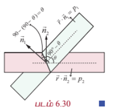

$$\cos\theta = \frac{\vec{n}_1 \cdot \vec{n}_2}{|\vec{n}_1||\vec{n}_2|} \Rightarrow \theta = \cos^{-1}\left(\frac{\vec{n}_1 \cdot \vec{n}_2}{|\vec{n}_1||\vec{n}_2|}\right)$$

... (1)

#### குறிப்புரை

(i) $\vec{r} \cdot \vec{n}_1 = p_1$ மற்றும் $\vec{r} \cdot \vec{n}_2 = p_2$ ஆகிய இரு தளங்கள் ஒன்றுக்கொன்று செங்குத்தானவை எனில், $\vec{n}_1 \cdot \vec{n}_2 = 0$ ஆகும்.

(ii) $\vec{r} \cdot \vec{n}_1 = p_1$ மற்றும் $\vec{r} \cdot \vec{n}_2 = p_2$ ஆகிய இரு தளங்கள் இணை எனில், $\vec{n}_1 = \lambda \vec{n}_2$, இங்கு $\lambda$ ஒரு திசையிலி ஆகும்.

(iii) $\vec{r} \cdot \vec{n} = p$ என்ற தளத்திற்கு இணையாக உள்ள தளத்தின் சமன்பாடு $\vec{r} \cdot \vec{n} = k, k \in \mathbb{R}$ ஆகும்.

---

#### தேற்றம் 6.19

$a_1x + b_1y + c_1z + d_1 = 0$ மற்றும் $a_2x + b_2y + c_2z + d_2 = 0$ ஆகிய தளங்களுக்கு இடைப்பட்ட குறுங்கோணம் $\theta$ எனில்,

$$\theta = \cos^{-1}\left(\frac{a_1a_2 + b_1b_2 + c_1c_2}{\sqrt{a_1^2 + b_1^2 + c_1^2}\sqrt{a_2^2 + b_2^2 + c_2^2}}\right)$$

#### நிரூபணம்

$a_1x + b_1y + c_1z + d_1 = 0$ மற்றும் $a_2x + b_2y + c_2z + d_2 = 0$ ஆகிய தளங்களின் செங்கோட்டு வெக்டர்கள் முறையே $\vec{n}_1$ மற்றும் $\vec{n}_2$ என்க. பின்னர், $\vec{n}_1 = a_1\hat{i} + b_1\hat{j} + c_1\hat{k}$ மற்றும் $\vec{n}_2 = a_2\hat{i} + b_2\hat{j} + c_2\hat{k}$ ஆகும்.

எனவே தேற்றம் 6.18-ன் சமன்பாடு (1)-ஐப் பயன்படுத்தி, தளங்களுக்கு இடைப்பட்ட குறுங்கோணம் $\theta$ எனில்,

$$\theta = \cos^{-1}\left(\frac{a_1a_2 + b_1b_2 + c_1c_2}{\sqrt{a_1^2 + b_1^2 + c_1^2}\sqrt{a_2^2 + b_2^2 + c_2^2}}\right)$$

எனப் பெறுகிறோம்.

#### குறிப்புரை

(i) $a_1x + b_1y + c_1z + d_1 = 0$ மற்றும் $a_2x + b_2y + c_2z + d_2 = 0$ என்ற தளங்கள் ஒன்றுக்கொன்று செங்குத்து எனில், $a_1a_2 + b_1b_2 + c_1c_2 = 0$ ஆகும்.

(ii) $a_1x + b_1y + c_1z + d_1 = 0$ மற்றும் $a_2x + b_2y + c_2z + d_2 = 0$ என்ற தளங்கள் இணையானவை எனில், $\frac{a_1}{a_2} = \frac{b_1}{b_2} = \frac{c_1}{c_2}$ ஆகும்.

(iii) $ax + by + cz = p$ என்ற தளத்திற்கு இணையான தளத்தின் சமன்பாடு $ax + by + cz = k$, $k \in \mathbb{R}$ ஆகும்.

---

### எடுத்துக்காட்டு 6.47

$\vec{r} \cdot (2\hat{i} + 2\hat{j} + 2\hat{k}) = 11$ மற்றும் $4x - 2y + 2z = 15$ ஆகிய தளங்களுக்கு இடைப்பட்ட குறுங்கோணத்தைக் காண்க.

#### தீர்வு

$\vec{r} \cdot (2\hat{i} + 2\hat{j} + 2\hat{k}) = 11$ மற்றும் $4x - 2y + 2z = 15$ ஆகிய தளங்களின் செங்கோட்டு வெக்டர்கள் முறையே $\vec{n}_1 = 2\hat{i} + 2\hat{j} + 2\hat{k}$ மற்றும் $\vec{n}_2 = 4\hat{i} - 2\hat{j} + 2\hat{k}$ ஆகும்.

கொடுக்கப்பட்ட தளங்களுக்கு இடைப்பட்ட குறுங்கோணம் $\theta$ எனில்,

$$\theta = \cos^{-1}\left(\frac{(2\hat{i} + 2\hat{j} + 2\hat{k}) \cdot (4\hat{i} - 2\hat{j} + 2\hat{k})}{|2\hat{i} + 2\hat{j} + 2\hat{k}||4\hat{i} - 2\hat{j} + 2\hat{k}|}\right) = \cos^{-1}\left(\frac{2}{3}\right)$$

---

### 6.8.11 ஒரு கோட்டிற்கும் மற்றும் ஒரு தளத்திற்கும் இடைப்பட்ட கோணம்
### (Angle between a line and a plane)

ஒரு கோட்டிற்கும் மற்றும் ஒரு தளத்திற்கும் இடைப்பட்ட கோணமானது, தளத்தின் செங்கோட்டிற்கும் கொடுக்கப்பட்ட கோட்டிற்கும் இடைப்பட்ட கோணத்தின் நிரப்புக் கோணமாகும்.

$\vec{r} = \vec{a} + t\vec{b}$ என்பது கோட்டின் சமன்பாடு மற்றும் $\vec{r} \cdot \vec{n} = p$ என்பது தளத்தின் சமன்பாடு என்க.

எனவே, $\vec{b}$ ஆனது கொடுக்கப்பட்ட கோட்டிற்கு இணையாகவும் $\vec{n}$ என்பது கொடுக்கப்பட்ட தளத்திற்குச் செங்குத்தாகவும் இருக்கும்.

கொடுக்கப்பட்ட கோட்டிற்கும் மற்றும் தளத்திற்கும் இடைப்பட்ட குறுங்கோணம் $\theta$ எனில், $\vec{n}$ -க்கும் $\vec{b}$ -க்கும் இடைப்பட்ட குறுங்கோணம் $\frac{\pi}{2} - \theta$ ஆகும். எனவே,

$$\cos\left(\frac{\pi}{2} - \theta\right) = \frac{|\vec{b} \cdot \vec{n}|}{|\vec{b}||\vec{n}|} = \sin\theta$$

ஆகவே, கோட்டிற்கும் தளத்திற்கும் இடைப்பட்ட குறுங்கோணம்

$$\theta = \sin^{-1}\left(\frac{|\vec{b} \cdot \vec{n}|}{|\vec{b}||\vec{n}|}\right)$$

... (1)

$$\frac{x - x_1}{a_1} = \frac{y - y_1}{b_1} = \frac{z - z_1}{c_1}$$

மற்றும்

$$ax + by + cz = p$$

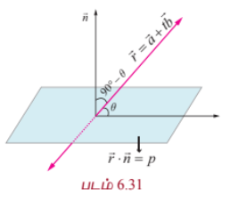

ஆகியன முறையே கோடு மற்றும் தளத்தின் சமன்பாடுகள் எனில், $\vec{b} = a_1\hat{i} + b_1\hat{j} + c_1\hat{k}$ மற்றும் $\vec{n} = a\hat{i} + b\hat{j} + c\hat{k}$ ஆகும். இம்மதிப்புகளை சமன்பாடு (1)-ல் பிரதியிட, கொடுக்கப்பட்ட கோட்டிற்கும் தளத்திற்கும் இடைப்பட்ட குறுங்கோணம் $\theta$ கிடைக்கிறது. எனவே,

$$\theta = \sin^{-1}\left(\frac{|a_1a + b_1b + c_1c|}{\sqrt{a_1^2 + b_1^2 + c_1^2}\sqrt{a^2 + b^2 + c^2}}\right)$$

#### குறிப்புரை

(i) நேர்க்கோடு தளத்திற்குச் செங்குத்து எனில், இந்நேர்க்கோடு தளத்தின் செங்கோட்டிற்கு இணையாகும். ஆகவே, $\vec{b}$ ஆனது $\vec{n}$ -க்கு இணையாகும். எனவே, $\vec{b} = \lambda\vec{n}$ இங்கு, $\lambda \in \mathbb{R}$ ஆகும். இதிலிருந்து $\frac{a_1}{a} = \frac{b_1}{b} = \frac{c_1}{c}$ எனப் பெறுகிறோம்.

(ii) ஒரு நேர்க்கோடு, தளத்திற்கு இணை எனில், இந்நேர்க்கோடு தளத்தின் செங்கோட்டிற்கு செங்குத்தாகும். எனவே, $\vec{b} \cdot \vec{n} = 0 \Rightarrow a_1a + b_1b + c_1c = 0$ ஆகும்.

---

### எடுத்துக்காட்டு 6.48

$\vec{r} = (\hat{i} + \hat{j} + \hat{k}) + t(2\hat{i} - \hat{j} + \hat{k})$ என்ற கோட்டிற்கும் $x - 2y + z = 5$ என்ற தளத்திற்கும் இடைப்பட்ட கோணம் காண்க.

#### தீர்வு

$\vec{r} = \vec{a} + t\vec{b}$ என்ற கோட்டிற்கும், செங்கோட்டு வெக்டர் $\vec{n}$ கொண்ட தளத்திற்கும் இடைப்பட்ட கோணம்

$$\theta = \sin^{-1}\left(\frac{|\vec{b} \cdot \vec{n}|}{|\vec{b}||\vec{n}|}\right)$$

ஆகும்.

இங்கு, $\vec{b} = 2\hat{i} - \hat{j} + \hat{k}$ மற்றும் $\vec{n} = \hat{i} - 2\hat{j} + \hat{k}$ ஆகும்.

ஆகவே,

$$\theta = \sin^{-1}\left(\frac{|(2\hat{i} - \hat{j} + \hat{k}) \cdot (\hat{i} - 2\hat{j} + \hat{k})|}{|2\hat{i} - \hat{j} + \hat{k}||\hat{i} - 2\hat{j} + \hat{k}|}\right) = \sin^{-1}\left(\frac{2}{\sqrt{6}\sqrt{6}}\right) = \sin^{-1}\left(\frac{1}{3}\right)$$

---

### 6.8.12 ஒரு புள்ளியிலிருந்து தளத்திற்குள்ள தொலைவு
### (Distance of a point from a plane)

#### (a) தளத்தின் வெக்டர் சமன்பாடு (Vector form of equation)

##### தேற்றம் 6.20

$\vec{u}$ என்ற நிலைவெக்டர் கொண்ட புள்ளியிலிருந்து $\vec{r} \cdot \vec{n} = p$ என்ற தளத்திற்கு உள்ள செங்குத்துத் தொலைவு

$$\delta = \frac{|\vec{u} \cdot \vec{n} - p|}{|\vec{n}|}$$

#### நிரூபணம்

$A$ என்ற புள்ளியின் நிலை வெக்டர் $\vec{u}$ என்க.

$\vec{r} \cdot \vec{n} = p$ என்ற தளத்திற்கு $A$ என்ற புள்ளியிலிருந்து வரையப்பட்ட செங்குத்தின் அடி $F$ என்க. $F$ மற்றும் $A$ ஆகியவற்றை இணைக்கும் கோடானது தளத்தின் செங்கோடு $\vec{n}$ -க்கு இணையாகும். எனவே, $FA$-ன் சமன்பாடு $\vec{r} = \vec{u} + t\vec{n}$ ஆகும்.

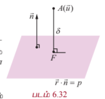

ஆனால், $F$ என்பது $\vec{r} = \vec{u} + t\vec{n}$ என்ற கோடும் $\vec{r} \cdot \vec{n} = p$ என்ற தளமும் வெட்டிக்கொள்ளும் புள்ளியாகும். $\vec{r}_1$ என்பது $F$-ன் நிலைவெக்டர் எனில், $\vec{r}_1 = \vec{u} + t_1\vec{n}$, $t_1 \in \mathbb{R}$, மற்றும் $\vec{r}_1 \cdot \vec{n} = p$ ஆகும். இச்சமன்பாடுகளிலிருந்து $\vec{r}_1$ -ஐ நீக்க, நாம் பெறுவது

$$(\vec{u} + t_1\vec{n}) \cdot \vec{n} = p$$

$$\Rightarrow t_1 = \frac{p - \vec{u} \cdot \vec{n}}{|\vec{n}|^2}$$

இப்பொழுது,

$$\overrightarrow{FA} = \vec{u} - (\vec{u} + t_1\vec{n}) = -t_1\vec{n}$$

$$= -\left(\frac{p - \vec{u} \cdot \vec{n}}{|\vec{n}|^2}\right)\vec{n} = \frac{(\vec{u} \cdot \vec{n} - p)}{|\vec{n}|^2}\vec{n}$$

எனவே, $A$ என்ற புள்ளியிலிருந்து கொடுக்கப்பட்ட தளத்திற்குள்ள செங்குத்துத் தொலைவு

$$\delta = |\overrightarrow{FA}| = \frac{|\vec{u} \cdot \vec{n} - p|}{|\vec{n}|}$$

$AF$ என்ற செங்குத்தின் அடி $F$ -ன் நிலைவெக்டர்

$$\vec{r}_1 = \vec{u} + t_1\vec{n}$$

அல்லது

$$\vec{r}_1 = \vec{u} + \left(\frac{p - \vec{u} \cdot \vec{n}}{|\vec{n}|^2}\right)\vec{n}$$

---

#### (b) தளத்தின் கார்டீசியன் சமன்பாடு (Cartesian form of equation)

$\vec{u}$ என்ற கொடுக்கப்பட்ட நிலைவெக்டரைக் கொண்ட புள்ளி $A(x_1, y_1, z_1)$ மற்றும் கொடுக்கப்பட்ட தளத்தின் கார்டீசியன் சமன்பாடு $ax + by + cz = p$ எனில், $\vec{u} = x_1\hat{i} + y_1\hat{j} + z_1\hat{k}$ மற்றும் $\vec{n} = a\hat{i} + b\hat{j} + c\hat{k}$ ஆகும்.

இவ்வெக்டர்களை $\delta = \frac{|\vec{u} \cdot \vec{n} - p|}{|\vec{n}|}$ -ல் பிரதியிட, கொடுக்கப்பட்ட தளத்திற்குள்ள செங்குத்துத் தொலைவு

$$\delta = \frac{|ax_1 + by_1 + cz_1 - p|}{\sqrt{a^2 + b^2 + c^2}}$$

எனப் பெறுகிறோம்.

#### குறிப்புரை

ஆதிப்புள்ளியிலிருந்து $ax + by + cz + d = 0$ என்ற தளத்திற்குள்ள செங்குத்துத் தொலைவு

$$\delta = \frac{|d|}{\sqrt{a^2 + b^2 + c^2}}$$

---

### எடுத்துக்காட்டு 6.49

$(2, 5, -3)$ என்ற புள்ளியிலிருந்து $\vec{r} \cdot (6\hat{i} - 3\hat{j} + 2\hat{k}) = 5$ என்ற தளத்திற்குள்ள தொலைவு காண்க.

#### தீர்வு

கொடுக்கப்பட்ட சமன்பாட்டை $\vec{r} \cdot \vec{n} = p$ உடன் ஒப்பிடும்போது நமக்கு $\vec{n} = 6\hat{i} - 3\hat{j} + 2\hat{k}$ எனக் கிடைக்கிறது.

$\vec{u}$ என்ற நிலை வெக்டரைக் கொண்ட புள்ளியிலிருந்து $\vec{r} \cdot \vec{n} = p$ என்ற தளத்திற்குள்ள செங்குத்துத் தொலைவு

$$\delta = \frac{|\vec{u} \cdot \vec{n} - p|}{|\vec{n}|}$$

ஆகும். எனவே, $\vec{u} = 2\hat{i} + 5\hat{j} - 3\hat{k}$ மற்றும் $\vec{n} = 6\hat{i} - 3\hat{j} + 2\hat{k}$ என $\delta$ -ல் பிரதியிட, நாம் பெறுவது

$$\delta = \frac{|(2\hat{i} + 5\hat{j} - 3\hat{k}) \cdot (6\hat{i} - 3\hat{j} + 2\hat{k}) - 5|}{|6\hat{i} - 3\hat{j} + 2\hat{k}|} = \frac{|12 - 15 - 6 - 5|}{7} = \frac{14}{7} = 2$$

அலகுகள்.

---

### எடுத்துக்காட்டு 6.50

$A(4, 1, 2)$ மற்றும் $B(7, 5, 4)$ ஆகிய புள்ளிகள் வழியாகச் செல்லும் நேர்க்கோடும் $x - y + z = 5$ என்ற தளமும் வெட்டிக் கொள்ளும் புள்ளிக்கும் $(5, -5, -10)$ என்ற புள்ளிக்கும் உள்ள தொலைவைக் காண்க.

#### தீர்வு

$A(4, 1, 2)$ மற்றும் $B(7, 5, 4)$ ஆகிய புள்ளிகளை இணைக்கும் கோட்டின் சமன்பாடு

$$\frac{x - 4}{3} = \frac{y - 1}{4} = \frac{z - 2}{2} = t$$

(என்க).

இக்கோட்டின் மீதுள்ள ஏதேனும் ஒரு புள்ளி $(3t + 4, 4t + 1, 2t + 2)$ ஆகும். கோடும் தளமும் வெட்டிக் கொள்ளும் புள்ளியைக் காண, $x = 3t + 4, y = 4t + 1, z = 2t + 2$ என $x - y + z = 5$ -ல் பிரதியிட்டு $t = 0$ எனப் பெறுகிறோம். எனவே, நேர்க்கோடும் தளமும் வெட்டிக்கொள்ளும் புள்ளி $(4, 1, 2)$ ஆகும். ஆகவே, $(4, 1, 2)$ மற்றும் $(5, -5, -10)$ ஆகிய புள்ளிகளுக்கு இடைப்பட்ட தொலைவு

$$\sqrt{(4-5)^2 + (1+5)^2 + (2+10)^2} = \sqrt{1 + 36 + 144} = \sqrt{181}$$

அலகுகள்.

---

### 6.8.13 இணையான இரு தளங்களுக்கு இடைப்பட்ட தொலைவு
### (Distance between two parallel planes)

#### தேற்றம் 6.21

$a_1x + b_1y + c_1z + d_1 = 0$ மற்றும் $a_2x + b_2y + c_2z + d_2 = 0$ ஆகிய இரு இணையான தளங்களுக்கு இடைப்பட்ட தொலைவு

$$\frac{|d_1 - d_2|}{\sqrt{a^2 + b^2 + c^2}}$$

#### நிரூபணம்

$a_2x + b_2y + c_2z + d_2 = 0$ என்ற தளத்தின் மீதுள்ள ஏதேனும் ஒரு புள்ளி $A(x_1, y_1, z_1)$ என்க. பின்னர்,

$$a_1x_1 + b_1y_1 + c_1z_1 + d_1 = 0 \Rightarrow a_1x_1 + b_1y_1 + c_1z_1 = -d_1$$

$A(x_1, y_1, z_1)$ என்ற புள்ளியிலிருந்து $a_1x + b_1y + c_1z + d_1 = 0$ என்ற தளத்திற்குள்ள தொலைவு

$$\delta = \frac{|a_1x_1 + b_1y_1 + c_1z_1 + d_1|}{\sqrt{a_1^2 + b_1^2 + c_1^2}} = \frac{|-d_1 + d_2|}{\sqrt{a_1^2 + b_1^2 + c_1^2}}$$

எனவே, $a_1x + b_1y + c_1z + d_1 = 0$ மற்றும் $a_2x + b_2y + c_2z + d_2 = 0$ என்ற இணையான இரு தளங்களுக்கு இடைப்பட்ட தொலைவு

$$\delta = \frac{|d_1 - d_2|}{\sqrt{a^2 + b^2 + c^2}}$$

---

### எடுத்துக்காட்டு 6.51

$x + 2y - 2z + 1 = 0$ மற்றும் $2x + 4y - 4z + 5 = 0$ ஆகிய இரண்டு இணையான தளங்களுக்கு இடைப்பட்ட தொலைவு காண்க.

#### தீர்வு

$a_1x + b_1y + c_1z + d_1 = 0$ மற்றும் $a_2x + b_2y + c_2z + d_2 = 0$ என்ற இரு இணையான தளங்களுக்கு இடைப்பட்ட தொலைவு

$$\delta = \frac{|d_1 - d_2|}{\sqrt{a^2 + b^2 + c^2}}$$

இரண்டாவது சமன்பாட்டை $\frac{5}{2}$ -ஆல் வகுத்து $x + 2y - 2z + \frac{5}{2} = 0$ என எழுத,

$$a = 1, b = 2, c = -2, d_1 = 1, d_2 = \frac{5}{2}$$

எனப் பெறலாம். இம்மதிப்புகளை சூத்திரத்தில் பிரதியிட,

$$\delta = \frac{|1 - \frac{5}{2}|}{\sqrt{1^2 + 2^2 + (-2)^2}} = \frac{\frac{3}{2}}{3} = \frac{1}{2}$$

அலகுகள் எனத் தேவையான தொலைவு கிடைக்கிறது.

---

### எடுத்துக்காட்டு 6.52

$\vec{r} \cdot (2\hat{i} - 2\hat{j} - \hat{k}) = 6$ மற்றும் $\vec{r} \cdot (6\hat{i} - 6\hat{j} - 3\hat{k}) = 27$ என்ற தளங்களுக்கு இடைப்பட்ட தொலைவு காண்க.

#### தீர்வு

$\vec{r} \cdot (2\hat{i} - 2\hat{j} - \hat{k}) = 6$ என்ற தளத்தின் மீதுள்ள ஏதேனும் ஒரு புள்ளியின் நிலைவெக்டர் $\vec{u}$ என்க. பின்னர்,

$$\vec{u} \cdot (2\hat{i} - 2\hat{j} - \hat{k}) = 6$$

... (1)

கொடுக்கப்பட்ட இரண்டு தளங்களுக்கு இடைப்பட்ட தொலைவு $\delta$ எனில், $\delta$ என்பது $\vec{u}$ என்ற புள்ளியிலிருந்து $\vec{r} \cdot (6\hat{i} - 6\hat{j} - 3\hat{k}) = 27$ என்ற தளத்திற்குள்ள செங்குத்துத் தொலைவாகும்.

எனவே,

$$\delta = \frac{|\vec{u} \cdot (6\hat{i} - 6\hat{j} - 3\hat{k}) - 27|}{|6\hat{i} - 6\hat{j} - 3\hat{k}|} = \frac{|3(\vec{u} \cdot (2\hat{i} - 2\hat{j} - \hat{k})) - 27|}{\sqrt{6^2 + (-6)^2 + (-3)^2}} = \frac{|3(6) - 27|}{9} = \frac{9}{9} = 1$$

அலகு.

---

### 6.8.14 இரு தளங்களின் வெட்டுக்கோட்டின் சமன்பாடு
### (Equation of line of intersection of two planes)

$\vec{r} \cdot \vec{n} = p$ மற்றும் $\vec{r} \cdot \vec{m} = q$ என்பன இணை அல்லாத இரு தளங்கள் என்க. $\vec{n}$ மற்றும் $\vec{m}$ ஆகிய வெக்டர்கள் முறையே கொடுக்கப்பட்ட தளங்களுக்குச் செங்குத்தாகும். மேலும், இத்தளங்களின் வெட்டுக்கோடானது $\vec{n}$ மற்றும் $\vec{m}$ என்ற இரு வெக்டர்களுக்கும் செங்குத்தாகும் என்பதால், $\vec{n} \times \vec{m}$ என்ற வெக்டருக்கு இணையாகும். $\vec{n} \times \vec{m} = l_1\hat{i} + l_2\hat{j} + l_3\hat{k}$ என்க.

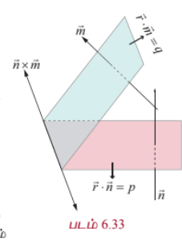

$a_1x + b_1y + c_1z = p$ மற்றும் $a_2x + b_2y + c_2z = q$ என்ற இரு தளங்களின் சமன்பாடுகளை எடுத்துக்கொள்வோம்.

கொடுக்கப்பட்ட இவ்விரு தளங்களின் வெட்டுக்கோடு குறைந்தபட்சம் ஒரு ஆய அச்சுத் தளத்தையாவது சந்திக்கும். நம் வசதிக்காக வெட்டுக்கோடு சந்திக்கும் ஆய அச்சுத் தளத்தை $z = 0$ எனக்கொள்வோம். $z = 0$ எனக்கொடுக்கப்பட்ட தளங்களின் சமன்பாடுகளில் பிரதியிட்டு $a_1x + b_1y - p = 0$ மற்றும் $a_2x + b_2y - q = 0$ என்ற இரு சமன்பாடுகளைப் பெறலாம். இவ்விரு சமன்பாடுகளின் தீர்வு காண்பதால், $x$ மற்றும் $y$-ன் மதிப்புகளை முறையே $x_1$ மற்றும் $y_1$ எனப்பெறலாம். எனவே, $l_1\hat{i} + l_2\hat{j} + l_3\hat{k}$ வெக்டருக்கு இணையாக உள்ள கோட்டின் மீதுள்ள ஒரு புள்ளி $(x_1, y_1, 0)$ ஆகும். ஆகவே, வெட்டுக்கோட்டின் சமன்பாடு

$$\frac{x - x_1}{l_1} = \frac{y - y_1}{l_2} = \frac{z - 0}{l_3}$$

ஆகும்.

---

### 6.8.15 இரு தளங்களின் வெட்டுக்கோடு வழியாகச் செல்லும் தளத்தின் சமன்பாடு
### (Equation of a plane passing through the line of intersection of two given planes)

#### தேற்றம் 6.22

$\vec{r} \cdot \vec{n}_1 = d_1$ மற்றும் $\vec{r} \cdot \vec{n}_2 = d_2$ என்ற தளங்களின் வெட்டுக்கோடு வழியாகச் செல்லும் தளத்தின் வெக்டர் சமன்பாடு

$$(\vec{r} \cdot \vec{n}_1 - d_1) + \lambda(\vec{r} \cdot \vec{n}_2 - d_2) = 0$$

ஆகும். இங்கு $\lambda \in \mathbb{R}$.

#### நிரூபணம்

பின்வரும் சமன்பாட்டை எடுத்துக் கொள்வோம்.

$$(\vec{r} \cdot \vec{n}_1 - d_1) + \lambda(\vec{r} \cdot \vec{n}_2 - d_2) = 0$$

... (1)

இச்சமன்பாட்டினை

$$\vec{r} \cdot (\vec{n}_1 + \lambda\vec{n}_2) - (d_1 + \lambda d_2) = 0$$

... (2)

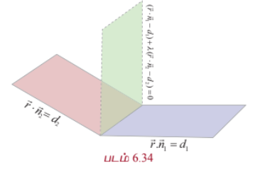

என எழுதலாம்.

$\vec{n} = \vec{n}_1 + \lambda\vec{n}_2$ மற்றும் $d = d_1 + \lambda d_2$ என்க.

எனவே, சமன்பாடு (2) ஆனது

$$\vec{r} \cdot \vec{n} = d$$

... (3)

என்றாகும். சமன்பாடு (3) ஆனது ஒரு தளத்தைக் குறிக்கிறது. எனவே, சமன்பாடு (1)-ம் ஒரு தளத்தைக் குறிக்கும்.

கொடுக்கப்பட்ட தளங்களின் வெட்டுக்கோட்டின் மீதுள்ள ஏதேனும் ஒரு புள்ளியின் நிலைவெக்டர் $\vec{r}_1$ என்க. பின்னர், $\vec{r}_1$ ஆனது $\vec{r} \cdot \vec{n}_1 = d_1$ மற்றும் $\vec{r} \cdot \vec{n}_2 = d_2$ என்ற இரு தளங்களின் சமன்பாடுகளையும் நிறைவு செய்யும். எனவே,

$$\vec{r}_1 \cdot \vec{n}_1 = d_1$$

... (4)

மற்றும்

$$\vec{r}_1 \cdot \vec{n}_2 = d_2$$

... (5)

சமன்பாடுகள் (4) மற்றும் (5)களிலிருந்து, $\vec{r}_1$ என்பது சமன்பாடு (1)-ஐ நிறைவு செய்வதைக் காணலாம். ஆகவே, கொடுக்கப்பட்ட தளங்களின் வெட்டுக்கோட்டின் மீதுள்ள எந்தவொரு புள்ளியும் தளம் (1)-ன் மீது அமையும் எனக் காண்கிறோம். எனவே, தளம் (1) ஆனது கொடுக்கப்பட்ட தளங்களின் வெட்டுக்கோடு வழியாகச் செல்லும் என்பது நிரூபணமாகிறம்.

$a_1x + b_1y + c_1z + d_1 = 0$ மற்றும் $a_2x + b_2y + c_2z + d_2 = 0$ ஆகிய இரு தளங்களின் வழியாகச் செல்லும் தளத்தின் கார்டீசியன் சமன்பாடு

$$(a_1x + b_1y + c_1z + d_1) + \lambda(a_2x + b_2y + c_2z + d_2) = 0$$

ஆகும்.

---

### எடுத்துக்காட்டு 6.53

$\vec{r} \cdot (\hat{i} + \hat{j} + \hat{k}) + 1 = 0$ மற்றும் $\vec{r} \cdot (2\hat{i} - 3\hat{j} + 5\hat{k}) = -2$ என்ற தளங்களின் வெட்டுக்கோடு வழியாகவும் $(-1, 2, 1)$ என்ற புள்ளி வழியாகவும் செல்லும் தளத்தின் சமன்பாடு காண்க.

#### தீர்வு

$\vec{r} \cdot \vec{n}_1 = d_1$ மற்றும் $\vec{r} \cdot \vec{n}_2 = d_2$ என்ற தளங்களின் வெட்டுக்கோடு வழியாகச் செல்லும் தளத்தின் சமன்பாடு

$$(\vec{r} \cdot \vec{n}_1 - d_1) + \lambda(\vec{r} \cdot \vec{n}_2 - d_2) = 0$$

ஆகும்.

இச்சமன்பாட்டில், $\vec{r} = x\hat{i} + y\hat{j} + z\hat{k}$, $\vec{n}_1 = \hat{i} + \hat{j} + \hat{k}$, $\vec{n}_2 = 2\hat{i} - 3\hat{j} + 5\hat{k}$, $d_1 = -1$ மற்றும் $d_2 = -2$ எனப்பிரதியிட, கொடுக்கப்பட்ட தளங்களின் வெட்டுக்கோடு வழியாகச் செல்லும்.

$$(x + y + z + 1) + \lambda(2x - 3y + 5z + 2) = 0$$

என்ற தளத்தின் சமன்பாடு கிடைக்கிறது.

இத்தளம் $(-1, 2, 1)$ என்ற புள்ளி வழிச் செல்வதால், $\lambda = \frac{3}{5}$ எனப் பெறுகிறோம். எனவே, தேவையான தளத்தின் சமன்பாடு $11x - 4y + 20z + 1 = 0$ ஆகும்.

---

### எடுத்துக்காட்டு 6.54

$2x + y - 3z + 7 = 0$ மற்றும் $x + 2y - z + 5 = 0$ என்ற தளங்களின் வெட்டுக்கோடு வழிச்செல்வதும் $x + y - 3z - 5 = 0$ என்ற தளத்திற்குச் செங்குத்தானதுமான தளத்தின் சமன்பாட்டைக் காண்க.

#### தீர்வு

$2x + y - 3z + 7 = 0$ மற்றும் $x + 2y - z + 5 = 0$ ஆகிய தளங்களின் வெட்டுக்கோடு வழிச்செல்லும் தளத்தின் சமன்பாடு

$$(2x + y - 3z + 7) + \lambda(x + 2y - z + 5) = 0$$

அல்லது

$$(2 + \lambda)x + (1 + 2\lambda)y + (-3 - \lambda)z + (7 + 5\lambda) = 0$$

இத்தளம், கொடுக்கப்பட்ட $x + y - 3z - 5 = 0$ தளத்திற்குச் செங்குத்தானது என்பதால், இவ்விரு தளங்களின் செங்கோடுகள் ஒன்றுக்கொன்று செங்குத்தாகும். எனவே,

$$(2 + \lambda)(1) + (1 + 2\lambda)(1) + (-3 - \lambda)(-3) = 0$$

$$\Rightarrow 2 + \lambda + 1 + 2\lambda + 9 + 3\lambda = 0 \Rightarrow 6\lambda + 12 = 0$$

$$\Rightarrow \lambda = -2$$

எனவே, தேவையான தளத்தின் சமன்பாடு

$$(2x + y - 3z + 7) - 2(x + 2y - z + 5) = 0$$

$$\Rightarrow 2x + y - 3z + 7 - 2x - 4y + 2z - 10 = 0$$

$$\Rightarrow -3y - z - 3 = 0$$

அல்லது

$$3y + z + 3 = 0$$
