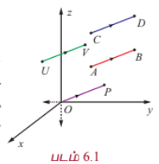
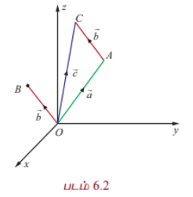
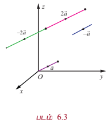

### 6.2 வெக்டர்களின் வடிவக்கணித அறிமுகம் (Geometric introduction to vectors)

முப்பரிமாண வெளி $\mathbb{R}^3$ -ல் $\vec{v}$ என்ற வெக்டர், $A = (a_1, a_2, a_3) \in \mathbb{R}^3$ என்ற புள்ளியை ஒரு தொடக்கப் புள்ளியாகவும் $B = (b_1, b_2, b_3) \in \mathbb{R}^3$ என்ற முடிவுப் புள்ளியாகவும் கொண்ட ஒரு திசையிடப்பட்ட கோட்டுத்துண்டால் குறிப்பிடப்படுகிறது. இதனை $\overrightarrow{AB}$ எனக் குறிக்கிறோம்.

$\overrightarrow{AB}$ என்ற கோட்டுத்துண்டின் நீளம் $\vec{v}$ என்ற வெக்டரின் எண்ணளவாகும், மற்றும் $A$ -இல் இருந்து $B$ -ன் திசையானது $\vec{v}$ என்ற வெக்டரின் திசையாகும். எனவே, ஒரு வெக்டரை $\vec{v}$ அல்லது $\overrightarrow{AB}$ எனக் குறிப்பிடலாம். $\mathbb{R}^3$ -ல் $\overrightarrow{AB}$ -ன் நீளம் $\overrightarrow{CD}$ -ன் நீளத்திற்குச் சமமாகவும், $A$ -இல் இருந்து $B$ -ன் திசையும் $C$ -இல் இருந்து $D$ -இன் திசையும் ஒரே திசையாகவும் இருந்தால், இருந்தால் மட்டுமே $\overrightarrow{AB}$ மற்றும் $\overrightarrow{CD}$ என்ற இரு வெக்டர்கள் சமவெக்டர்கள் எனப்படும். இதனை $\overrightarrow{AB} = \overrightarrow{CD}$ என எழுதுவோம். இங்கு $\overrightarrow{CD}$ என்பது $\overrightarrow{AB}$ -ன் நகர்வு எனப்படும்.

$\mathbb{R}^3$ -ல் உள்ள எந்தவொரு வெக்டர் $\overrightarrow{AB}$ -யையும் $\mathbb{R}^3$ -ல் எங்கு வேண்டுமானாலும் நகர்த்தி, $U \in \mathbb{R}^3$ என்ற புள்ளியை தொடக்கப்புள்ளியாகவும் $V \in \mathbb{R}^3$ என்ற புள்ளியை முடிவுப் புள்ளியாகவும் கொண்ட ஒரு வெக்டருக்குச் சமமாக $\overrightarrow{AB} = \overrightarrow{UV}$ எனுமாறு எழுத முடியும் எனக் காண்கிறோம்.

குறிப்பாக, $\mathbb{R}^3$ -ன் ஆதிப்புள்ளி $O$ எனில், $P \in \mathbb{R}^3$ என்ற புள்ளியை $\overrightarrow{AB} = \overrightarrow{OP}$ எனுமாறு காணலாம். $\overrightarrow{OP}$ என்ற வெக்டர் $P$ என்ற புள்ளியின் **நிலை வெக்டர்** எனப்படும். மேலும், கொடுக்கப்பட்ட ஏதேனுமொரு வெக்டர் $\vec{v}$ -க்கு, $P \in \mathbb{R}^3$ என்ற தனித்த புள்ளியை $\overrightarrow{OP} = \vec{v}$ எனுமாறு காணலாம். $\overrightarrow{AB}$ என்ற வெக்டரின் தொடக்கப்புள்ளி $A$ -யும் முடிவுப்புள்ளி $B$ -யும் ஒன்றாக அமைந்தால், அவ்வெக்டர் **பூச்சிய வெக்டர்** எனப்படும். $(1,0,0), (0,1,0), (0,0,1)$, மற்றும் $(0,0,0)$ என்ற புள்ளிகளின் நிலை வெக்டர்களை முறையே $\hat{i}, \hat{j}, \hat{k}$ மற்றும் $\vec{0}$ ஆகிய வழக்கமான குறியீடுகளால் குறிப்பிடுகிறோம்.

கொடுக்கப்பட்ட ஒரு புள்ளி $(a_1, a_2, a_3) \in \mathbb{R}^3$ -ன் நிலைவெக்டர் $a_1\hat{i} + a_2\hat{j} + a_3\hat{k}$ எனப்படும். இது $(0,0,0)$ என்ற புள்ளியை தொடக்கப்புள்ளியாகவும், $(a_1, a_2, a_3)$ என்ற புள்ளியை முடிவுப்புள்ளியாகவும் கொண்ட கோட்டுத்துண்டாகும். அனைத்து மெய்யெண்களும் **திசையிலிகள்** எனப்படும்.

$A$ என்பது $(a_1, a_2, a_3)$ மற்றும் $B$ என்பது $(b_1, b_2, b_3)$ எனில் $\overrightarrow{AB}$ வெக்டரின் நீளம்

$$|\overrightarrow{AB}| = \sqrt{(b_1 - a_1)^2 + (b_2 - a_2)^2 + (b_3 - a_3)^2}$$

ஆகும். குறிப்பாக $(b_1, b_2, b_3)$ -ன் நிலைவெக்டர் $\vec{b}$ எனில், இதன் நீளம் $\sqrt{b_1^2 + b_2^2 + b_3^2}$ ஆகும். நீளம் 1 உடைய வெக்டரை **அலகு வெக்டர்** என்கிறோம். அலகு வெக்டரைக் குறிப்பிட்ட $\hat{u}$ என்ற குறியீட்டைப் பயன்படுத்துகிறோம். $\hat{i}, \hat{j}$, மற்றும் $\hat{k}$ ஆகியவை அலகு வெக்டர்கள் என்பதையும், நீளம் 0 கொண்ட ஒரேயொரு வெக்டர் $\vec{0}$ என்பதையும் நினைவில் கொள்க.

$\vec{a} = a_1\hat{i} + a_2\hat{j} + a_3\hat{k} \in \mathbb{R}^3$, $\vec{b} = b_1\hat{i} + b_2\hat{j} + b_3\hat{k} \in \mathbb{R}^3$ மற்றும் $\alpha \in \mathbb{R}$ எனில், முப்பரிமாண வெளியில் வெக்டர்களின் கூட்டல் மற்றும் திசையிலிப் பெருக்கல் ஆகியவற்றை பின்வருமாறு வரையறுக்கிறோம்.

$$\vec{a} + \vec{b} = (a_1 + b_1)\hat{i} + (a_2 + b_2)\hat{j} + (a_3 + b_3)\hat{k}$$

$$\alpha\vec{a} = (\alpha a_1)\hat{i} + (\alpha a_2)\hat{j} + (\alpha a_3)\hat{k}$$

$\vec{a} + \vec{b}$ -ன் வடிவக்கணித விளக்கம் காண, $A(a_1, a_2, a_3)$ மற்றும் $B(b_1, b_2, b_3)$ என்ற புள்ளிகளின் நிலைவெக்டர்கள் முறையே $\vec{a}$, $\vec{b}$ என்க. $A$ என்ற புள்ளியை தொடக்கப் புள்ளியாகவும், பொருத்தமான ஒரு புள்ளி $(c_1, c_2, c_3) \in \mathbb{R}^3$ யை முடிவுப்புள்ளியாகவும் கொண்ட வெக்டருக்கு நிலைவெக்டர் $\vec{b}$ யை நகர்த்தினால் படம் (6.2), $(c_1, c_2, c_3)$ புள்ளியின் நிலைவெக்டர் $\vec{c}$ ஆனது $\vec{a} + \vec{b}$ யைக் குறிக்கும்.

$\alpha\vec{a}$ எனும் வெக்டர் $\vec{a}$ எனும் வெக்டருக்கு இணையாக உள்ள வெக்டராகும். $|\alpha| > 1$ எனில் $\vec{a}$ -ன் நீளம் $|\alpha|$ மடங்கு பெரிதாக்கப்படுகிறது. $0 < |\alpha| < 1$ எனில் $\vec{a}$ -ன் நீளம் $|\alpha|$ மடங்கு குறுக்கப்படுகிறது. $\alpha < 0$ எனில் $\alpha\vec{a}$ -ன் எண்ணளவு $\vec{a}$ -ன் எண்ணளவைப் போல் $|\alpha|$ மடங்காகவும் $\alpha\vec{a}$ -ன் திசை $\vec{a}$ -ன் திசைக்கு எதிர்த்திசையிலும் இருக்கும். குறிப்பாக $\alpha = -1$ எனில் $\alpha\vec{a} = -\vec{a}$ என்ற வெக்டரின் நீளமானது $\vec{a}$ -ன் நீளத்திற்குச் சமமாகவும் $\vec{a}$ -ன் திசைக்கு எதிர்திசையிலும் அமையும். படம். 6.3

