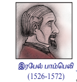

இருப்பனவாகவும், இல்லாதனவாகவும் தோன்றும்  
இறவனின் அற்புதமான இருப்பிடமே கற்பனை எனக்காகும்.  
- கோட்டு பிறை மூல பிறை  

கலப்பெண்களின் வளர்ச்சிக்கு பல கணித வல்லுநர்கள் தங்களது பங்களிப்பை  
அளித்துள்ளனர். கலப்பெண்களின் கூட்டல், கழித்தல், பெருக்கல் மற்றும்  
வகுத்தலை வரையறுத்தவர் இத்தாலிய கணித மேலது இரேபல் பாம்பிலே  
ஆவார். இவர் தான் முதன் முதனில் கலப்பெண்களின் மீதான இயற்கணிதத்தை  
வரையறுத்தவர் என கருதப்படுகின்றது. அவரது சாதனைகளை அங்கிரிக்கும்  
விதமாக நிலவில் உள்ள ஒரு குழுக்கு பாம்பெலி என பெயரிடப்பட்டுள்ளது.  

 
அன்றை வாழ்வில் கலப்பெண்கள்  

ஒரு நேரத்தில் மாறுபடும் இரு பகுதிகளைக் கொண்டிருக்கும் ஒரு நிகழ்வில்  
உதாரணமாக மாறுபடுத்தப்பட்டதில் கலப்பெண்களை பயன்படுத்துவது பயனுள்ளதாக உள்ளது.  
பொறியியலாளர்கள், மருத்துவர்கள், அறிவியலாளர்கள், வாகன வடிவமைப்பாளர்கள் மற்றும்  
பலரும் மிகளந்த சமர்ப்பிக்கப்பட்டது. இதன் இலக்க அடைய வழங்கப்பட்டுள்ள  
உருவாக்கும் குழந்தைகளில் கலப்பெண்களை பயன்படுத்துகிறார்கள். சமர்ப்பை செயலாக்கும்,  
கட்டுப்பாட்டு கோட்டை, மிகளந்தவியல், திராவியத்தியம், குவாண்டம் இயக்கியல், வரையலியல்,  
மற்றும் அதிர்வு பகுப்பாய்வு ஆகிய துறைகளில் கலப்பெண்களின் பயன்பாடு தவிர்க்க இயலாததாகும்.  

---

### கற்றலின் நோக்கங்கள்  

இப்பாடப்பகுதியை நிறைவாக கற்ற பின்னர்,  
- கலப்பெண்களின் மீதான இயற்கணிதம்  
- ஆர்கள் தளத்தில் கலப்பெண்களை குறித்தல்  
- ஒரு கலப்பெண்ணின் இணைக்கப்படும் மற்றும் மட்டு மதிப்பை காணல்  
- ஒரு கலப்பெண்ணின் துருவ வடிவம் மற்றும் ஆய்வாளர் வடிவத்தை காணல்  
- முயல்வரின் தேர்ந்தெடையப்படுத்தி ஒரு கலப்பெண்ணின் n-ஆய் படிமூலங்களைக் காணல்  
பொன்றவற்றை மாணவர்களால் செய்ய இயலும்.  

