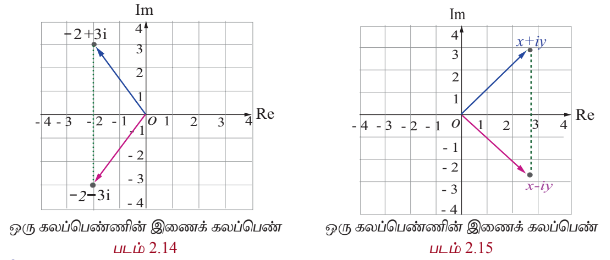

இருப்பனவாகவும், இல்லாதனவாகவும் தோன்றும்  
இறவனின் அற்புதமான இருப்பிடமே கற்பனை எனக்காகும்.  
- கோட்டு பிறை மூல பிறை  

கலப்பெண்களின் வளர்ச்சிக்கு பல கணித வல்லுநர்கள் தங்களது பங்களிப்பை  
அளித்துள்ளனர். கலப்பெண்களின் கூட்டல், கழித்தல், பெருக்கல் மற்றும்  
வகுத்தலை வரையறுத்தவர் இத்தாலிய கணித மேலது இரேபல் பாம்பிலே  
ஆவார். இவர் தான் முதன் முதனில் கலப்பெண்களின் மீதான இயற்கணிதத்தை  
வரையறுத்தவர் என கருதப்படுகின்றது. அவரது சாதனைகளை அங்கிரிக்கும்  
விதமாக நிலவில் உள்ள ஒரு குழுக்கு பாம்பெலி என பெயரிடப்பட்டுள்ளது.  

 
அன்றை வாழ்வில் கலப்பெண்கள்  

ஒரு நேரத்தில் மாறுபடும் இரு பகுதிகளைக் கொண்டிருக்கும் ஒரு நிகழ்வில்  
உதாரணமாக மாறுபடுத்தப்பட்டதில் கலப்பெண்களை பயன்படுத்துவது பயனுள்ளதாக உள்ளது.  
பொறியியலாளர்கள், மருத்துவர்கள், அறிவியலாளர்கள், வாகன வடிவமைப்பாளர்கள் மற்றும்  
பலரும் மிகளந்த சமர்ப்பிக்கப்பட்டது. இதன் இலக்க அடைய வழங்கப்பட்டுள்ள  
உருவாக்கும் குழந்தைகளில் கலப்பெண்களை பயன்படுத்துகிறார்கள். சமர்ப்பை செயலாக்கும்,  
கட்டுப்பாட்டு கோட்டை, மிகளந்தவியல், திராவியத்தியம், குவாண்டம் இயக்கியல், வரையலியல்,  
மற்றும் அதிர்வு பகுப்பாய்வு ஆகிய துறைகளில் கலப்பெண்களின் பயன்பாடு தவிர்க்க இயலாததாகும்.  

---

### கற்றலின் நோக்கங்கள்  

இப்பாடப்பகுதியை நிறைவாக கற்ற பின்னர்,  
- கலப்பெண்களின் மீதான இயற்கணிதம்  
- ஆர்கள் தளத்தில் கலப்பெண்களை குறித்தல்  
- ஒரு கலப்பெண்ணின் இணைக்கப்படும் மற்றும் மட்டு மதிப்பை காணல்  
- ஒரு கலப்பெண்ணின் துருவ வடிவம் மற்றும் ஆய்வாளர் வடிவத்தை காணல்  
- முயல்வரின் தேர்ந்தெடையப்படுத்தி ஒரு கலப்பெண்ணின் n-ஆய் படிமூலங்களைக் காணல்  
பொன்றவற்றை மாணவர்களால் செய்ய இயலும்.  

---

### 2.1 கலப்பெண்கள் அறிமுகம் (Introduction to Complex Numbers)  

கலப்பெண்களை அறிமுகப்படுத்துவதற்கு முன்பாக முதலில் "வர்க்கப்படுத்தும் போது குறை  
என்ன கிடைக்கும் வகையில் ஏதேனும் ஒரு மேல் எண் உள்ளது?" என்ற கேள்விக்கு விடையளிக்க  
முயல்வேண்டும். இதற்கு விடையளிக்க கீழ்க்கண்ட சமன்பாடுகளைக் கருதுக.  

| சமன்பாடு 1 | சமன்பாடு 2 |
|---|---|
| $x^2 - 1 = 0$ | $x^2 + 1 = 0$ |
| $x = \pm \sqrt{1}$ | $x = \pm \sqrt{-1}$ |
| $x = \pm 1$ | $x = \pm i$ |
# சமன்பாடு
1-க்கு $ x = -1 $ மற்றும் $ x = 1 $ என்ற இரண்டு மேல் எண் தீர்வுகள் உள்ளன. இச்சமன்பாடு மேல் தீர்ப்பது எண்பதும் $ f(x) = x^2 - 1 $ என்ற வளைவரையின் $ x $ வெட்டுத்துண்டுகளை காண்பதும் ஒன்றுதான் எண் முக்குத் தெரியும். இந்த வளைவரை $ x $ -அச்சை $ (-1, 0) $ மற்றும் $ (1, 0) $ ஆகிய புள்ளிகளில் வெட்டுகிறது.

மேல் 2.1

மேல் 2.2
இதே வாதத்தின் அடிப்படையில் சமன்பாடு 2-க்கு மேல் எண் தீர்வுகள் இல்லை. ஏனெனில், $ f(x) = x^2 + 1 $ என்ற வளைவரையின் வைரபடத்திலிருந்து, இது $ x $ -அச்சை வெட்டாது எண்பதைக் காணலாம்.

இதற்கான காரணம் எண் வென்றால், ஒரு மேல் எண்ணை வர்க்கப்படுத்தி ஒரு குறை எண்ணைப் பெறுவது எண்பது இயலாத காரியமாகும். சமன்பாடு 2-க்கு தீர்வு இருக்க வேண்டுமானால், வர்க்கப்படுத்தினால் $ -1 $ வருமாறு ஒரு கற்பனை எண்ணை உருவாக்க வேண்டும். $ \sqrt{-1} $ எண்பதைக் கற்பனை அலகு $ i $ எனக்குறிப்பிடுகின்றோம். இதிலிருந்து $ i^2 = -1 $ என்ப பெறலாம். இந்த உண்மையைப் பயன்படுத்தி கற்பனை எண் $ i $ -ன் அடுக்குகளின் மதிப்புகளைப் பெறலாம்.

## 2.1.1 கற்பனை அலகு $ i $-இன் அடுக்குகள் (Powers of imaginary unit $ i $)
| $i^0 = 1$, $i^1 = i$ | $i^2 = -1$ | $i^3 = i^2 i = -i$ | $i^4 = i^2 i^2 = 1$ |
|---|---|---|---|
| $(i)^{-1} = \frac{1}{i} = \frac{i}{i^2} = -i$ | $(i)^{-2} = -1$ | $(i)^{-3} = i$ | $(i)^{-4} = 1 = i^4$ |

இதிலிருந்து $ n $-ஒரு முழு எண் எணில், $ i^n $ -க்கு நான்கு வெவ்வேறான மதிப்புகள் மட்டுமே உள்ளது எண்பதை அறியலாம். இம்மதிப்புகளானது $ n $-ஒரு 4-ஆல் வகுப்பதால் கிடைக்கும் மீதிகள் 0, 1, 2, மற்றும் 3 ஆகியவற்றை பெருத்து அமைக்கிறது. முழு எண் $ n $ ஆனது $ n \leq 4 $ மற்றும் $ n \geq 4 $, ஆக இருக்கும் போது, வகுத்தல் கொள்கையின்படி $ n = 4q + k, \, 0 \leq k < 4 $, இங்கு $ k $ மற்றும் $ q $ ஆனது ஆகியவை முழு எண்கள். இதிலிருந்து

$$(i)^n = (i)^{4q+k} = (i)^{4q} (i)^k = (i)^4 (i)^k = (i)^4 (i)^k = (i)^4$$

## எடுத்துக்காட்டு 2.1

கீழ்க்காண்பவைகளை சுருக்குக.

(i) $ i^7 $ (ii) $ i^{1729} $ (iii) $ i^{-1924} + i^{2018} $ (iv) $ \sum_{n=1}^{102} i^n $ (v) $ i^2 i^3 \cdots i^{40} $

## தீர்வு

(i) $ (i)^7 = (i)^{4 \cdot 3} = (i)^3 = -i $ (ii) $ i^{1729} = i^{1728} i = i $

(iii) $(i)^{1924} + (i)^{2018} = (i)^{1924+0} + (i)^{2016+2} = (i)^0 + (i)^2 = 1 - 1 = 0$

(iv) $$ \sum_{n=1}^{\infty} i^n = (i^1 + i^2 + i^3 + i^4) + (i^5 + i^6 + i^7 + i^8) + \cdots + (i^{97} + i^{98} + i^{99} + i^{100}) + i^{101} + i^{102} $$

$$ = (i^1 + i^2 + i^3 + i^4) + (i^1 + i^2 + i^3 + i^4) + \cdots + (i^1 + i^2 + i^3 + i^4) + i^1 + i^2 $$

$$ = \{i + (-1) + (-i) + 1\} + \{i + (-1) + (-i) + 1\} + \cdots + \{i + (-1) + (-i) + 1\} + i + (-1) $$

$$ = 0 + 0 + \cdots + 0 + i - 1 = -1 + i $$ (இது எண்ணை என்?)

(v) $$ i^2 i^3 \cdots i^{40} = i^{1+2+3+\cdots+40} = i^{\frac{40 \times 41}{2}} = i^{20} = i^0 = 1. $$

முடிவு: i-ன் நான்கு தொடர்ச்சியான அடுக்குகளின் கூடுதல் பூச்சியமாகும். $$ i^2 + i^{2+1} + i^{2+2} + i^{2+3} = 0 $$

குறிப்பு:

(i) $$ \sqrt{ab} = \sqrt{a} \sqrt{b} $$ என்பது $$ a, b $$ ஆகியவற்றில் குறைந்தபட்சம் ஒன்றாவது குறையற்றதாக இருந்தால் மட்டும் உண்மை ஆகும்.

உதாரணமாக, $$ 6 = \sqrt{36} = \sqrt{(-4)(-9)} = \sqrt{(-4)(-9)} = (2i)(3i) = 6i^2 = -6 $$ என்ற முன்னாளாக இருந்தால் மட்டுமே உண்மை ஆகும்.

(ii) $$ y \in \mathbb{R} - \text{கீழ் } y^2 \geq 0. $$

ஆகவே, $$ \sqrt{(-1)(y^2)} = \sqrt{(y^2)(-1)} $$

$$ \sqrt{(-1)(y^2)} = \sqrt{(y^2)(-i)} $$

$$ iy = yi. $$

## பயிற்சி 2.1

மின்வருவனவற்றை சுருக்குக:

1. $$ i^{1947} + i^{1950} $$

2. $$ i^{1948} - i^{-1869} $$

3. $$ \sum_{n=1}^{12} i^n $$

4. $$ i^{59} + \frac{1}{i^{59}} $$

5. $$ i^{2i} i^{3} \cdots i^{2000} $$

6. $$ \sum_{n=1}^{10} i^{n-50} $$

## 2.2 கலப்பு எண்கள் (Complex Numbers)

நாம், $$ x^2 + 1 = 0 $$ என்ற சமன்பாடுகளும் மெய்யனை தொடர்பில் தீர்வு இல்லை என்பதைக் கண்டோம். பொதுவாக, மெய் தீர்வுகள் இல்லாத மெய் என் குணக்களை கொண்ட பல்வுறுப்புக் கோவைச் சமன்பாடுகள் உள்ளன. இவ்வாறான பல்வுறுப்புக் கோவைச் சமன்பாடு களின் தீர்வுகளை உள்ளடக்க மெய் என் தொடர்பானது விரிவுபடுத்தப்படுகின்றது. இக்காரணத்திற்காக கணிதவியல் அறிஞர்கள் கலப்பெண்கள் என்ற எண்களின் தொடர்பை வரையறுக்கத் தூண்டப்பட்டனர்.

இப்பகுதியில் நாம் கீழ்காண்மை வரையறுப்பியோம்.

(i) செவ்வக வடிவில் கலப்பெண்கள்

(ii) ஆர்கண்ட் தளம்

(iii) கலப்பெண்களின் மீதான இயற்கணிதச் செயல்பாடுகள்

கலப்பெண்கள் தொடர்பு என் பது கற்பனை அலகு i கொண்டு விரிவாக்கம் செய்யப்பட்ட மெய் என் தொடர்பின் விரிவாக்கமாகும்.

மெய் எண்கள் $$ x $$ மற்றும் $$ y, i^2 = -1 $$ என்ற பண்பை கொண்ட கற்பனை அலகு $$ i $$ உடன் கூட்டல் மற்றும் பெருக்கல் செயல்களின் தூணை கொண்டு $$ x + iy $$ என்ற கலப்பெண்களை பெறலாம். இதில் $$ 'i' $$ என்ற குறியீட்டை வெட்டுகளின் கூட்டலாக கருத வேண்டும். இதை அறிமுகப்படுத்தியவர் கார்ந் பிரீட்டிருக்கும் (1777-1855).

### 2.2.1 சேவ்வக வடிவம் (Rectangular form)

#### வரையறை 2.1 (ஒரு கல்ப்பெண்ணின் சேவ்வக வடிவம்)

ஒரு கல்ப்பெண்ணின் சேவ்வக வடிவமும் என்பது $x + iy$ (அல்லது $x + yi$) ஆகும். இங்கு $x$ மற்றும் $y$ ஆகியவை மெய்ய எண்களாகும். இதில் $x$ என்பது கல்ப்பெண்ணின் மெய்ய பகுதி எனவும் $y$ என்பது கற்பனைப் பகுதி எனவும் அழைக்கப்படுகின்றது.

$x = 0$ எனில், கல்ப்பெண்ணானது முழுவதும் கற்பனை எண் ஆகும். $y = 0$ எனில், கல்ப்பெண்ணானது முழுவதும் மெய்ய எண் ஆகும். பூஜ்ஜியம் மட்டும் தான் ஒரு நேரத்தில் மெய்ய எண்ணாகவும் முழுவதும் கற்பனை எண்ணாகவும் இருக்கும். ஒரு கல்ப்பெண்ணின் திட்ட செல்வக வடிவம் $x + iy - \pi$ எனக்குறிப்பது வழக்கம். மேலும் $x = \text{Re}(z)$ எனவும் $y = \text{Im}(z)$ எனவும் குறிக்கலாம். உதாரணமாக, $\text{Re}(5 - i7) = 5$ மற்றும் $\text{Im}(5 - i7) = -7$ ஆகும்.

$a + i\beta, \beta \neq 0$ என்ற வடிவில் உள்ள எண்களை கற்பனை எண்கள் (மெய்யற்ற கல்ப்பெண்கள்) என்கிறோம்.

இரு கல்ப்பெண்கள் எந்த நிலையில் சமம் எனலாம் என்பதை பின்வருமாறு வரையறுக்கிறோம்.

---

#### வரையறை 2.2

இரண்டு கல்ப்பெண்கள் $z_1 = x_1 + iy_1$ மற்றும் $z_2 = x_2 + iy_2$ ஆகியவை சமமாக இருக்கத் தேவையானதும் ப�ோதுமானதுமான நிபந்தனை $\text{Re}(z_1) = \text{Re}(z_2)$ மற்றும் $\text{Im}(z_1) = \text{Im}(z_2)$.

அதாவது $x_1 = x_2$ மற்றும் $y_1 = y_2$.

உதாரணமாக, $a + i\beta = -7 + 3i$ எனில், $a = -7$ மற்றும் $\beta = 3$ ஆகும்.

## 2.2.2 அர்த்தம் தளம் (Argand plane)

ஒரு கலப்பெண் $ z = x + iy $ -ஐ ஒரே ஒரு வழியில் $ (x, y) $ என்ற மெய் எண்களின் வரிசை ஜோடிகளாக எழுதலாம். $ 3 - 8i, 6 $ மற்றும் $ -4i $ ஆகிய கலப்பெண்களை முறையே $ (3, -8), (6, 0) $, மற்றும் $ (0, -4) $ என வரிசை ஜோடிகளாக எழுதலாம். இவ்வாறாக $ z = x + iy $ என்ற கலப்பெண்ணை $ (x, y) $ என்ற புள்ளியில் அது அச்சத்தைத் தெரியப்படுத்தலாம். நாம் $ x $ அச்சை மெய் அச்சாகவும், $ y $ அச்சை கற்பனை அச்சாகவும் கொண்டால் $ xy $ -தளத்தை கலப்பெண் தளம் அல்லது ஆர்கண்ட் தளம் என்கிறோம். ஆர்கண்ட் தளம் என்ற பெயரானது சுர்வார்த்தைச் சேர்ந்த கணிதவியலாளர் ஜென் ஆர்கண்ட் (1768 – 1822) என்பவரின் நினைவாக பெயரிடப்பட்டுள்ளது.

ஒரு கலப்பெண்ணைது ஒரு புள்ளியை மட்டுமே குறிப்பது இல்லை, மேலும் ஆதியிலிருந்து அப்புள்ளியை குறிக்கும் நிலை வெட்டாகவும் இதனைப் பார்க்கலாம். அந்த எண், அந்த புள்ளி, மற்றும் அந்த வெட்டர் ஆகியவற்றை அணைத்தையும் $ z $ என்ற ஒரு எழுத்தால் குறிக்கலாம். வழக்கமாக இணையான நகர்த்தல் மூலம் வெட்டர்களை எவ்வாறு கையாளுவோமோ அதே போல் இங்கும் செய்யலாம். இப்பாடப்பகுதியில், $ \mathbb{C} $ என்பது கலப்பெண்களின் கணத்தைக் குறிக்கின்றது. வரையும் வாயிலாக ஒரு கலப்பெண்ணினை $ \mathbb{R}^2 $ -ல் ஒரு புள்ளியாகவே அல்லது ஒரு வெட்டாகவே ஆர்கண்ட் தளத்தில் பார்க்கலாம்.

**படம் 2.3**

**படம் 2.4**

**படம் 2.5**

#### விளக்க எடுத்துக்காட்டு 2.1

$$2 + i, -1 + 2i, 3 - 2i, 0 - 2i, 3 + \sqrt{-2}, -2 - 3i, \cos \frac{\pi}{6} + i \sin \frac{\pi}{6}$$

மற்றும் $ 3 + 0i $ ஆகியவற்றில் சில ஆர்கண்ட் தளத்தில் குறிக்கப்பட்டுள்ளன.

 

### 2.2.3 கலப்பெண்களின் மீதான இயற்கணிதச் செயல்பாடுகள் (Algebraic operations on complex numbers)

இப்பாடப் பகுதியில், மெய் எண்களின் மீதான பண்புகளை கொண்டு கலப்பெண்களின் இயற்கணித பண்புகளை யும் அவற்றின் வடிவியல் அமைப்புகளை யும் காண்போம்.

#### (i) கலப்பெண்ணின் திசையிலில் பெருக்கம்

$$z = x + iy \text{ மற்றும் } k \in \mathbb{R}, \text{ எனில்}$$

$$kz = (kx) + (ky)i \text{ என வரையறுப்போம்.}$$

குறிப்பாக $ 0z = 0 $, $ 1z = z $ மற்றும் $ (-1)z = -z $ ஆகும்.

$$kz \text{ -ன் வரையறுக்கள் } k = 2, \frac{1}{2}, -1 \text{ ஆகியவற்றிற்கு கீழே தரப்பட்டுள்ளன.}$$

#### (ii) கலப்பெண்களின் கூட்டல்

$$z_1 = x_1 + iy_1 \quad \text{மற்றும்} \quad z_2 = x_2 + iy_2, \quad \text{இங்கு} \quad x_1, x_2, y_1, \text{மற்றும்} \quad y_2 \in \mathbb{R} \quad \text{எனில்,}$$

$$z_1 + z_2 = (x_1 + iy_1) + (x_2 + iy_2)$$

$$= (x_1 + x_2) + i(y_1 + y_2)$$

$$z_1 + z_2 = (x_1 + x_2) + i(y_1 + y_2)$$

என வரையறுப்போம். ஏற்கனவே நாம் ஒரு வெட்டை  
இணையாக நகர்த்துவதால் அதன் எண் மதிப்பும் திசையும்  
மாறாது எனக் கண்டுள்ளோம். $ z_1 = x_1 + iy_1 $ மற்றும் $ z_2 = x_2 + iy_2 $  
எனும் போது வெட்டர் கட்டுலின் இணைகரவிதிப்படி அதன்  
கூடுதல் $ z_1 + z_2 = (x_1 + x_2) + i(y_1 + y_2) $ ஆனது $ (x_1 + x_2, y_1 + y_2) $  
என்று புள்ளியுடன் தொடர்புபடுத்தப்படுகின்றது. இப்புள்ளியை  
ஆயத்தொலைகளாகக் கொண்ட வெட்டராகவும் இதனைப்  
பார்க்கலாம். ஆகவே, $ z_1, z_2, $ மற்றும் $ z_1 + z_2 $ ஆகியவற்றை  
வரையும் வரையறு செய்ய முடியும். 2.11-ல்  
உள்ளவாறு காணலாம்.

**படம் 2.11**

#### (iii) கலப்பெண்களின் கழித்தல்  
இதுபோலவே $ z_1 - z_2 $ என்ற கலப்பெண்ணை ஆதிப்புள்ளியை ஆரம்பப்புள்ளியாகவும் ($ x_1 - x_2, y_1 - y_2 $) யை இறுதிப்புள்ளியாகவும் கொண்ட வெக்டராக பார்க்கலாம்.  

$$z_1 - z_2 = z_1 + (-z_2)$$  
$$z_1 - z_2 = (x_1 + iy_1) - (x_2 + iy_2)$$  
$$= (x_1 - x_2) + i(y_1 - y_2)$$  
$$z_1 - z_2 = (x_1 - x_2) + i(y_1 - y_2).$$  

மிக முக்கியமானது என்னவென்றால் $ z_1 - z_2 $ என்ற வெக்டரை $ z_2 - z_1 $ ஆரம்பப் புள்ளியாகவும் $ z_1 - z_2 $ முடிவுப் புள்ளியாகவும் கொண்ட படம் 2.12  

வெக்டராகவும் பார்க்கலாம் என்பதாகும். இந்த வகையான குறிப்பிடுதலானது எந்த வகையிலும் கழித்தலின் கருத்துரை மற்றும் வெக்டரை $ z_1 $ மற்றும் $ z_2 $ இணைக்கும் கழித்தல் வெக்டரானது புள்ளிக்கொடுகிறது.  

**படம் 2.12**

#### (iv) கலப்பெண்களின் பெருக்கல்  
$ z_1 $ மற்றும் $ z_2 $ என்ற கலப்பெண்களின் பெருக்கல் ஆனது  
$$z_1z_2 = (x_1 + iy_1)(x_2 + iy_2)$$  
$$= (x_1x_2 - y_1y_2) + i(x_1y_2 + x_2y_1)$$  

$ z_1z_2 = (x_1x_2 - y_1y_2) + i(x_1y_2 + x_2y_1) $ என வரையறுக்கப்படுகின்றது.  

$ z_1 $ மற்றும் $ z_2 $ ஒரு பெருக்குவதால் கிடைக்கும் கலப்பெண்ணும் ஒரு வெக்டரை குறிப்பிடுதல் மட்டுமல்லாமல் அவ்வெக்டரானது $ z_1 $ மற்றும் $ z_2 $ ஆகிய வெக்டர்கள் அமைந்த தளத்திலேயே அமைவும் இதிலிருந்து இந்த கலப்பெண்களின் பெருக்கம் வெக்டர் இயங்கியதற்கு உள்ள வெக்டர்களின் திசையில் பெருக்கத்தையே அல்லது வெக்டர்களின் வெக்டர் பெருக்கத்தையே குறிப்பிடுவது அல்ல என அறியலாம்.  

**படம் 2.13**

##### மேற்குறிப்பு  
கலப்பெண் $ z $ ஒரு $ i $ ஆல் பெருக்குதல்.  
$$z = x + iy, \text{ எனக்.}$$  
$$iz = i(x + iy)$$  
$$= -y + ix.$$  

கலப்பெண் $ iz $ என்பது கலப்பெண் $ z - \infty $ 90° அல்லது $ \frac{\pi}{2} $ ரெடியன் கடிகார எதிர்த்தையில் ஆதியை பொருத்து கழற்றுவது ஆகும். பொதுவாக, எந்த கலப்பெண் $ z - \infty $ முடிவு தொடர்ச்சியாக $ i $ ஆல் பெருக்குவதால் தொடர்ச்சியாக 90° கடிகார எதிர்த்தையில் ஆதியை பொருத்து கழற்றப்படும்.  

##### விளக்க எடுத்துக்காட்டு 2.2  
(i) $ z_1 = 6 + 7i $ மற்றும் $ z_2 = 3 - 5i $ எனில் $ z_1 + z_2 $ மற்றும் $ z_1 - z_2 $ ஆகியவை  
$$(3 - 5i) + (6 + 7i) = (3 + 6) + (-5 + 7)i = 9 + 2i$$  
$$(6 + 7i) - (3 - 5i) = (6 - 3) + (7 - (-5))i = 3 + 12i.$$  

(ii) $ z_1 = 2 + 3i $ மற்றும் $ z_2 = 4 + 7i $ எனில் $ z_1z_2 $ ஆனது  
$$(2 + 3i)(4 + 7i) = (2 \times 4 - 3 \times 7) + i(2 \times 7 + 3 \times 4)$$  
$$= (8 - 21) + (14 + 12)i$$  
$$= -13 + 26i.$$  

### எடுத்துக்காட்டு 2.2  
$(2 + i)x + (1 - i)y + 2i - 3$ மற்றும் $x + (-1 + 2i)y + 1 + i$ ஆகிய கலப்பெண்கள் சமம் எனில் $x$ மற்றும் $y$-ன் மெய்மதிப்புகளைக் காண்க.
#### தீர்வு  
$$z_1 = (2+i)x + (1-i)y + 2i - 3 = (2x + y - 3) + i(x - y + 2) \text{ மற்றும்}$$  
$$z_2 = x + (-1+2i)y + 1+i = (x - y + 1) + i(2y + 1) \text{ எனக்.}$$  
$$z_1 = z_2 \text{ எனக் கொடுக்கப்பட்டுள்ளது.}$$  

எனவே,  
$$(2x + y - 3) + i(x - y + 2) = (x - y + 1) + i(2y + 1).$$  

மேல் மற்றும் கற்பனைப் பகுதிகளைச் சமப்படுத்த  
$$2x + y - 3 = x - y + 1 \implies x + 2y = 4$$  
$$x - y + 2 = 2y + 1 \implies x - 3y = -1$$  

மேற்கண்ட சமன்பாடுகளைத் தீர்க்க  
$$x = 2 \text{ மற்றும் } y = 1 \text{ எனப்படுமாறும்.}$$  

---

### பயிற்சி 2.2  

1. $ z = 5 - 2i $ மற்றும் $ w = -1 + 3i $ எனக்கொண்டு கீழ்க்காண்பவைகளின் மதிப்புகளைக் காண்க.  

   (i) $ z + w $  
   (ii) $ z - iw $  
   (iii) $ 2z + 3w $  
   (iv) $ zw $  
   (v) $ z^2 + 2zw + w^2 $  
   (vi) $ (z + w)^2 $  

2. $ z = 2 + 3i $ எனக்கொண்டு கீழ்க்காணும் கலப்பெண்களை ஆரகண்டு தளத்தில் குறிக்க.  

   (i) $ z, iz, $ மற்றும் $ z + iz $  
   (ii) $ z, -iz, $ மற்றும் $ z - iz $  

3. $ (3 - i)x - (2 - i)y + 2i + 5 $ மற்றும் $ 2x + (-1 + 2i)y + 3 + 2i $ ஆகிய கலப்பெண்கள் சமம் எனில் $ x $ மற்றும் $ y $ என்பது மதிப்புகளைக் காண்க.  

---

### 2.3 கலப்பெண்களின் அடிப்படை அடிப்படையில் பண்புகள் (Basic Algebraic Properties of Complex Numbers)  

கலப்பெண்களின் கட்டல் மற்றும் பெருக்கல் பண்புகள் மேல் எனக்களின் பண்புகளைப் ப�ொலவே இருந்தும். கீழே சில அடிப்படை இயற்கணித பண்புகளை பட்டியலிட்டுள்ளோம். அவற்றில் சிலவற்றை சரிபார்த்துள்ளோம்.  

---

### 2.3.1 கலப்பு எண்களின் பண்புகள் (Properties of complex numbers)  

| கலப்பு எண்கள் கட்டலைப் பெருத்து கீழ்க்காணும் பண்புகளை நிறைவு செய்யும். | கலப்பு எண்கள் பெருக்கலைப் பெருத்து கீழ்க்காணும் பண்புகளை நிறைவு செய்யும். |
|---|---|
| (i) அடையும் பண்பு $ z_1 $ மற்றும் $ z_2 $ என்ற எடையும் இரு கலப்பெண்களுக்கு இவற்றின் கூடுதல் $ z_1 + z_2 $ - யும் ஒரு கலப்பெண் ஆகும். | (i) அடையும் பண்பு $ z_1 $ மற்றும் $ z_2 $ என்ற எடையும் இரு கலப்பெண்களுக்கு இவற்றின் பெருக்கல் $ z_1z_2 $ - யும் ஒரு கலப்பெண் ஆகும். |
| (ii) பரிமாற்றுப் பண்பு $ z_1 $ மற்றும் $ z_2 $ என்ற ஏதேனும் இரு கலப்பெண்களுக்கு $z_1$+ $z_2$= $z_2$ + $ z_1$ . | (ii) பரிமாற்றுப் பண்பு $z_1$ மற்றும் $z_2$ என்ற ஏதேனும் இரு கலப்பெண்களுக்கு $z_1$$z_2$ =$z_2$$z_1$  |
| (iii) சேர்ப்புப் பண்பு $z_1$, $z_2$, மற்றும் $z_3$ என்ற ஏதேனும் மூன்று கலப்பெண்களுக்கு ($z_1$+ $z_2$)+ $z_3$ = $z_1$+ ($z_2$+ $z_3$) . | (iii) சேர்ப்புப் பண்பு $z_1$, $z_2$, மற்றும் $z_3$ என்ற ஏதேனும் மூன்று கலப்பெண்களுக்கு ($z_1$ $z_2$) $z_3$ = $z_1$ ($z_2$ $z_3$) .  |
|(iv) கூட்டல் சமனி எந்த ஒரு கலப்பெண் z -க்கும் 0+0 = 0i என்ற ஒரு கலப்பெண்ணினை z + 0=0 + z = z என்றவாறு காணலாம். 0 = 0 + 0i என்ற கலப்பெண்ணினை கூட்டல் சமனி என்கிறோம்.| (iv) பெருக்கல் சமனி எந்த ஒரு கலப்பெண் z -க்கும் 1=1+  0i என்ற ஒரு கலப்பெண்ணினை z1=1z =z என்றவாறு காணலாம். 1=1+  0i என்ற கலப்பெண்ணினை பெருக்கல் சமனி என்கிறோம்.  |
| (v) கூட்டல் நேர்மாறு எந்த ஒரு கலப்பெண் z -க்கும் −z என்ற ஒரு கலப்பெண்ணினை, z+(-z) = (-z)+z = 0 என்றவாறு காணலாம். z -ன் கூட்டல் நேர்மாறு −z என்கிறோம். | (v) பெருக்கல் நேர்மாறு எந்த ஒரு பூஜ்ஜியமற்ற கலப்பெண் z -க்கும் w என்ற ஒரு கலப்பெண்ணினை zw =wz= 1 என்றவாறு காணலாம். z -ன் பெருக்கல் நேர்மாறு w ஆகும். w-வை z−1 எனக் குறிப்பர்.  |
| (vi) பங்கீட்டு விதி (கூட்டலின் மேல் பெருக்கலின் பங்கீட்டு விதி) $z_1$, $z_2$ , மற்றும் $z_3$ என்ற ஏதேனும் மூன்று கலப்பெண்களுக்கு $z_1$ ($z_2$+ $z_3$) = $z_1$$z_2$+ $z_1$$z_3$   மற்றும் ($z_1$ + $z_2$) $z_3$ = $z_1$$z_3$+ $z_2$$z_3$ ஆகும். |

இவற்றில் சிலவற்றை கீழே நிறுவுவோம்.

##### பண்பு  
கூட்டலின் பரிமாற்று விதி  
ஏதேனும் இரு கலப்பெண்கள் $ z_1 $ மற்றும் $ z_2 $ -விற்கு $ z_1 + z_2 = z_2 + z_1 $ என பெறலாம்.

##### நிரூபணம்  
$$ z_1 = x_1 + iy_1, \ z_2 = x_2 + iy_2, \ \text{இங்கு } x_1, x_2, y_1, \ \text{மற்றும் } y_2 \in \mathbb{R} \ \text{எனக்.} $$  
$$ z_1 + z_2 = (x_1 + iy_1) + (x_2 + iy_2) $$  
$$ = (x_1 + x_2) + i(y_1 + y_2) $$  
$$ = (x_2 + x_1) + i(y_2 + y_1) $$  
$$ = (x_2 + iy_2) + (x_1 + iy_1) $$  
$$ = z_2 + z_1. $$

##### பண்பு  
பெருக்கலுக்கான நேர்மாறுப் பண்பு  
பூஜ்ஜியமற்ற எந்த ஒரு கலப்பெண் $ z = x + iy $ -க்கும் பெருக்கல் நேர்மாறானது  
$$ \frac{x}{x^2 + y^2} + i \frac{-y}{x^2 + y^2} $$  
ஆகும்.

##### நிரூபணம்

பெருக்கல் நேர்மாறு கூட்டல் நேர்மாறுப் ப�ொல வெளிப்படையாகக் காண இயலாது.

$$ z^{-1} = u + iv $$ என்பது $$ z = x + iy $$ -ன் நேர்மாறு என்க.

$$ z^{-1} = 1 $$ என்பதால்

$$ (x + iy)(u + iv) = 1 $$

$$ (xu - yv) + i(xv + uy) = 1 + i0 $$

மேல் மற்றும் கற்பனைப் பகுதிகளைச் சமர்ப்பித்த

$$ xu - yv = 1 $$ மற்றும் $$ xv + uy = 0 $$.

மேற்கண்ட சமன்பாட்டுத் தொகுப்பினை மற்றும் $$ v $$ -க்குத் தீர்க்க நாம்

$$ u = \frac{x}{x^2 + y^2} $$ மற்றும் $$ v = \frac{-y}{x^2 + y^2} $$ என்பெறலாம் (∵ $$ z $$ பூஜ்ஜியமற்றது $$ \Rightarrow z^2 + y^2 > 0 $$)

$$ z = x + iy $$, எனில் $$ z^{-1} = \frac{x}{x^2 + y^2} + i \frac{-y}{x^2 + y^2} $$ ஆகும்.

$$ z = 0 $$ எனும் ப�ோது $$ z^{-1} $$ வரையறுக்கப்படவில்லை.

இதில் நேர்மாறு என்கல்பெண்ணின் நேர்மாறு $$ z^{-1} $$ -ஐப் பெறலாம். $$ z $$ என்ற கல்பெண்ணின்

நேர்மாறு வசதிக்காக $$ z^{-1} = \frac{1}{z} $$ என நாம் பயன்படுத்துகிற�ோம். $$ z_1 $$ மற்றும் $$ z_2 $$ என்ற இரு

கல்பெண்களில் $$ z_2 \neq 0 $$ எனில், $$ z_1 $$ மற்றும் $$ \frac{1}{z_2} $$ -ன் பெருக்கற்பலனை இருப்பிடுகின்ற�ோம்.

இதுபோலவே மற்ற பண்புகளையும் நாம் சரிபார்க்கலாம். அடுத்த பாடப் பகுதியில், நாம் ஒரு

கல்பெண்ணின் இணைக்கல்பெண்ணினை வரையறுப்ப�ோம். இது ஒரு கல்பெண்ணின் நேர்மாறு

எளிதாக காண நமக்கு பயன்படும்.

கலப்பு எனக்கு அடுக்குக் குறியீட்டின் விதிகளை நிறைவு செய்யும்

(i) $$ z^m z^n = z^{m+n} $$ (ii) $$ \frac{z^m}{z^n} = z^{m-n} $$, $$ z \neq 0 $$ (iii) $$ (z^m)^n = z^{mn} $$ (iv) $$ (z_1 z_2)^m = z_1^m z_2^m $$

## பயிற்சி 2.3

1. $$ z_1 = 1 - 3i, \ z_2 = -4i $$, மற்றும் $$ z_3 = 5 $$ எனில் கீழ்க்காண்பவகளை நிறுவுக.

(i) $$ (z_1 + z_2) + z_3 = z_1 + (z_2 + z_3) $$ (ii) $$ (z_1 z_2) z_3 = z_1 (z_2 z_3) $$

2. $$ z_1 = 3, \ z_2 = -7i $$, மற்றும் $$ z_3 = 5 + 4i $$ எனில் கீழ்க்காண்பவகளை நிறுவுக.

(i) $$ z_1 (z_2 + z_3) = z_1 z_2 + z_1 z_3 $$ (ii) $$ (z_1 + z_2) z_3 = z_1 z_3 + z_2 z_3 $$

3. $$ z_1 = 2 + 5i, \ z_2 = -3 - 4i $$, மற்றும் $$ z_3 = 1 + i $$ எனில் $$ z_1, \ z_2, $$ மற்றும் $$ z_3 $$ ஆகியவற்றின் கூட்டல்

மற்றும் பெருக்கல் நேர்மாறுகளைக் காண்க.

## 2.4 ஒரு கல்பெண்ணின் இணைக்கல்பெண்

### (Conjugate of a Complex Number)

இப்பாடப்பகுதியில் நாம் ஒரு கல்பெண்ணின் இணைக்கல்பெண், அதனை வரையடுத்தில்

குறித்தல், மேலும் அதன் பண்புகளைப் பெருத்தமான உதாரணங்களுடன் காண்போம்.

---

### வரையறு 2.3

$$ x + iy $$ என்ற கல்பெண்ணின் இணைக்கல்பெண் $$ x - iy $$ என வரையறுக்கப்படுகிறது.

z என்ற கலப்பெண்ணின் இணைக்கலப்பெண் $\bar{z}$ என குறிப்பிடப்படுகின்றது. z-ன் இணைக்கலப்பெண்ணை மாறுவதற்கு i-க்குப்பதிலாக -i-ஐ z-ல் பிரதியிட வேண்டும். உதாரணமாக 2-5i என்ற கலப்பெண்ணின் இணைக்கலப்பெண் 2+5i ஆகும். ஒரு கலப்பெண்ணையும் அதன் இணைக்கலப்பெண்ணையும் பெருக்க ஒரு மெல் என கிடைக்கும். உதாரணமாக,  
(i) $(x+iy)(x-iy) = x^2 - (iy)^2 = x^2 + y^2$  
(ii) $(1+3i)(1-3i) = (1)^2 - (3i)^2 = 1+9 = 10$  

வரைபடத்தின் வாயிலாக ஒரு கலப்பெண் z-ன் இணைக்கலப்பெண்ணினை மெல் அச்சின் மீது z-ன் பிரதிபலிப்பு எனலாம்.  

### 2.4.1 ஒரு கலப்பெண் மணியின் இணை மணியின் வருவ கணித வினாக்கள்  
#### (Geometrical representation of conjugate of a complex number)  

### குறிப்பு

$ x + iy $ மற்றும் $ x - iy $ என்ற இரு கலப்பெண்கள் ஒன்றுக்கொன்று இணை ஆகும். இணை எனக்கள் கலப்பெண்களை வகுக்கும் போது பயன்படுகிறது. ஒரு கலப்பெண்ணின் பகுதியில் மெய் எண்ணைப் பெற தொகுதி மற்றும் பகுதிகளை பகுதியில் உள்ள கலப்பெண்ணின் இணை எண்ணால் பெருக்க வேண்டும். இதனை பகுதியில் உள்ள விகிதமுறை மூலத்தை விகிதமுறை எண்ணாக்கும் முறையுடன் ஒப்பிடலாம்.

### 2.4.2 இணைக் கலப்பெண்கள் பயன்படுகிறது (Properties of Complex Conjugates)

1.$ z_1 + z_2 = z_1 + z_2 $  

2.$ z_1 - z_2 = z_1 - z_2 $  

3.$ z_1 z_2 = z_1 z_2 $  

4.$ \left( \frac{z_1}{z_2} \right) = \frac{\bar{z_1}}{\bar{z_2}}, \ z_2 \neq 0 $  

5.$ \text{Re}(z) = \frac{z + \bar{z}}{2} $  

6.$ \text{Im}(z) = \frac{z - \bar{z}}{2i} $

7.$ \left( z^n \right) = \left( \bar{z} \right)^n $, இங்கு $ n $ ஒரு முழு எண்

8.$ z $ ஒரு மெய் எண் என இருந்தால், இருந்தால் மட்டுமே $ z = \bar{z} $

9.$ z $ ஒரு முழுவதும் கற்பனை எண் என இருந்தால், இருந்தால் மட்டுமே $ z = -\bar{z} $

10.$ \bar{z} = z $

இவற்றில் சில பண்புகளை நிறுவுவோம்.

#### பண்பு

ஏதேனும் இரு கலப்பெண்கள் $ z_1 $ மற்றும் $ z_2 $ -விற்கு $ \bar{z_1 + z_2} = \bar{z_1} + \bar{z_2} $ என பெறலாம்.

### நிரூபணம்

$z_1 = x_1 + iy_1$ , $z_2 = x_2 + iy_2$ , மற்றும் $x_1, x_2, y_1, y_2 \in \mathbb{R}$ என்க.

$$\overline{z_1 + z_2} = \overline{(x_1 + iy_1) + (x_2 + iy_2)}$$

$$= \overline{(x_1 + x_2) + i(y_1 + y_2)} = (x_1 + x_2) - i(y_1 + y_2)$$

$$= (x_1 - iy_1) + (x_2 - iy_2)$$

$$= \overline{z_1} + \overline{z_2}.$$

இதனை கணிதத் தொகுத்தறிதல் மூலம் முடிவுற்ற எண்ணிக்கையிலான கலப்பெண்களுக்கும் இதனை விரிவுபடுத்தலாம்.

$$\overline{z_1 + z_2 + z_3 + \cdots + z_n} = \overline{z_1} + \overline{z_2} + \overline{z_3} + \cdots + \overline{z_n}, \quad n = 2, 3, \ldots$$

---

### பண்பு

$$\overline{z_1 z_2} = \overline{z_1} \overline{z_2}$$

இங்கு $x_1, x_2, y_1, y_2 \in \mathbb{R}$.

### நிரூபணம்

$z_1 = x_1 + iy_1$ மற்றும் $z_2 = x_2 + iy_2$ என்க.

ஆகவே,

$$z_1 z_2 = (x_1 + iy_1)(x_2 + iy_2) = (x_1 x_2 - y_1 y_2) + i(x_1 y_2 + x_2 y_1).$$

எனவே,

$$\overline{z_1 z_2} = \overline{(x_1 x_2 - y_1 y_2) + i(x_1 y_2 + x_2 y_1)} = (x_1 x_2 - y_1 y_2) - i(x_1 y_2 + x_2 y_1).$$

மேலும்,

$$\overline{z_1} \overline{z_2} = (x_1 - iy_1)(x_2 - iy_2) = (x_1 x_2 - y_1 y_2) - i(x_1 y_2 + x_2 y_1).$$

ஆகவே,

$$\overline{z_1 z_2} = \overline{z_1} \overline{z_2}.$$

---

### பண்பு

$z$ ஒரு முழுவதும் கற்பனை எண் என இருந்தால், இருந்தால் மட்டுமே $z = -\overline{z}$.

### நிரூபணம்

$z = x + iy$ என்க. வரையறையின்படி $\overline{z} = x - iy$ ஆகும்.

எனவே,

$$z = -\overline{z}$$

$$\Leftrightarrow x + iy = -(x - iy)$$

$$\Leftrightarrow 2x = 0 \Leftrightarrow x = 0$$

$$\Leftrightarrow z \text{ ஒரு முழுவதும் கற்பனை எண்}.$$

இதுபோலவே, இணைக் கலப்பெண்களின் மற்ற பண்புகளையும் நிறுவலாம்.

### எடுத்துக்காட்டு 2.3

$$\frac{3 + 4i}{5 - 12i}$$

-ஐ $x + iy$ வடிவில் எழுதுக. இதிலிருந்து மெய் மற்றும் கற்பனை பகுதிகளைக் காண்க.

### தீர்வு

$$\frac{3 + 4i}{5 - 12i}$$

-ன் மெய் மற்றும் கற்பனை பகுதிகளைக் காண இதனை $x + iy$ என செவ்வக வடிவில் எழுத வேண்டும். இந்த பின்னத்தினை சுருக்க தொகுதி மற்றும் பகுதிகளை பகுதியிலுள்ள கலப்பெண்ணின் இணை கலப்பெண்ணால் பெருக்கி பகுதியில் உள்ள $i$-ஐ நீக்கலாம்.
$$\frac{3 + 4i}{5 - 12i} = \frac{(3 + 4i)(5 + 12i)}{(5 - 12i)(5 + 12i)}$$

$$= \frac{(15 - 48) + (20 + 36)i}{5^2 + 12^2}$$

$$ = \frac{-33 + 56i}{169} = \frac{33}{169} + i \frac{56}{169}.$$

$$3 + 4i \frac{33}{169} = -\frac{33}{169} + i \frac{56}{169}  $$
என்பது $x + iy$ வடிவில் உள்ளது.

ஆகவே மெய்முகத் $$-\frac{33}{169}$$ மற்றும் கற்பனை முகத் $$\frac{56}{169}.$$

## எடுத்துக்கள் 2.4

$$\left( \frac{1+i}{1-i} \right)^3 - \left( \frac{1-i}{1+i} \right)^3$$

ஒரு சொல்கை வடிவில் சுருக்குக.

## தீர்வு

$$\frac{1+i}{1-i} = \frac{(1+i)(1+i)}{(1-i)(1+i)} = \frac{1+2i-1}{1+1} = \frac{2i}{2} = i,$$

செலும் $$\frac{1-i}{1+i} = \left( \frac{1+i}{1-i} \right)^{-1} = \frac{1}{i} = -i.$$

எனவே, $$\left( \frac{1+i}{1-i} \right)^3 - \left( \frac{1-i}{1+i} \right)^3 = i^3 - (-i)^3 = -i - i = -2i.$$

**எடுத்துக்காட்டு 2.5**  

$$\frac{z+3}{z-5i} = \frac{1+4i}{2}$$

எனில், கலப்பெண் $ z $ -ஐ செவ்வக வடிவில் காண்க.  

#### தீர்வு  
$$\frac{z+3}{z-5i} = \frac{1+4i}{2} \quad \text{என்பதால்}$$  
$$\Rightarrow 2(z+3) = (1+4i)(z-5i)$$  
$$\Rightarrow 2z+6 = (1+4i)z + 20 - 5i$$  
$$\Rightarrow (2-1-4i)z = 20 - 5i - 6$$  
$$\Rightarrow z = \frac{14-5i}{1-4i} = \frac{(14-5i)(1+4i)}{(1-4i)(1+4i)} = \frac{34+51i}{17} = 2+3i.$$

**எடுத்துக்காட்டு 2.6**  

$$z_1 = 3 - 2i \quad \text{மற்றும்} \quad z_2 = 6 + 4i \quad \text{எனில்} \quad \frac{z_1}{z_2} - \text{ஐ செவ்வக வடிவில் காண்க.}$$

#### தீர்வு  
$$z_1 \quad \text{மற்றும்} \quad z_2 \quad \text{ஆகியவற்றின் மதிப்புகளை பிரதியிட},$$  
$$\frac{z_1}{z_2} = \frac{3-2i}{6+4i} = \frac{3-2i}{6+4i} \times \frac{6-4i}{6-4i}$$  
$$= \frac{(18-8) + i(-12-12)}{6^2 + 4^2} = \frac{10 - 24i}{52} = \frac{10}{52} - \frac{24i}{52}$$  
$$= \frac{5}{26} - \frac{6}{13}i.$$

### எடுத்துக்காட்டு 2.7

$$ z = (2 + 3i)(1 - i) $$ எனில் $ z^{-1} $ -ஐக்காக்குக.

#### தீர்வு
$$ z = (2 + 3i)(1 - i) = (2 + 3) + (3 - 2)i = 5 + i $$
$$ \Rightarrow z^{-1} = \frac{1}{z} = \frac{1}{5 + i} $$

தொகுதி மற்றும் பகுதியை பகுதியின் இணை எண்ணால் பெருக்க

$$ z^{-1} = \frac{(5 - i)}{(5 + i)(5 - i)} = \frac{5 - i}{5^2 + 1^2} = \frac{5}{26} - i \frac{1}{26} $$
$$ \Rightarrow z^{-1} = \frac{5}{26} - i \frac{1}{26} $$

#### எடுத்துக்காட்டு 2.8

நிறுவக (i) $$ (2 + i\sqrt{3})^{10} + (2 - i\sqrt{3})^{10} $$ ஒரு மெய் எண் மற்றும்

(ii) $$ \left( \frac{19 + 9i}{5 - 3i} \right)^{15} - \left( \frac{8 + i}{1 + 2i} \right)^{15} $$ என்பது முழுவதும் கற்பனை எண்

#### தீர்வு
(i) $$ z = (2 + i\sqrt{3})^{10} + (2 - i\sqrt{3})^{10} $$ என்க.

இதிலிருந்து, $$ \bar{z} = (2 + i\sqrt{3})^{10} + (2 - i\sqrt{3})^{10} $$
$$ = (2 + i\sqrt{3})^{10} + (2 - i\sqrt{3}) $$
$$ = (2 + i\sqrt{3})^{10} + (2 - i) $$
$$ = (2 - i\sqrt{3})^{10} + (2 + i\sqrt{3}) $$
$$ \bar{z} = z \Rightarrow z $$ ஒரு மெய் மெய் எண் ஆகும்.

(ii) $$ z = \left( \frac{19 + 9i}{5 - 3i} \right)^{15} - \left( \frac{8 + i}{1 + 2i} \right)^{15} $$ என்க.

இங்கு, $$ \frac{19 + 9i}{5 - 3i} = \frac{(19 + 9i)(5 + 3i)}{(5 - 3i)(5 + 3i)} $$
$$ = \frac{(95 - 27) + i(45 + 57)}{5^2 + 3^2} = \frac{68 + 102i}{34} $$
$$ = 2 + 3i $$

மற்றும், $$ \frac{8 + i}{1 + 2i} = \frac{(8 + i)(1 - 2i)}{(1 + 2i)(1 - 2i)} $$
$$ = \frac{(8 + 2) + i(1 - 16)}{1^2 + 2^2} = \frac{10 - 15i}{5} $$
$$ = 2 - 3i $$

##### இப்பொழுது,
$$z = \left( \frac{19 + 9i}{5 - 3i} \right)^{15} - \left( \frac{8 + i}{1 + 2i} \right)^{15}$$

$$\Rightarrow z = (2 + 3i)^{15} - (2 - 3i)^{15}     \tag{(1) , (2) விருந்து} \text{}$$

##### வரையறையிலிருந்து,
$$\bar{z} = \left( \overline{(2 + 3i)^{15}} - \overline{(2 - 3i)^{15}} \right)$$

$$= \left( \overline{2 + 3i} \right)^{15} - \left( \overline{2 - 3i} \right)^{15}  {(இரண்டு எண் பண்புகளின் படி)}$$

$$= (2 - 3i)^{15} - (2 + 3i)^{15} = -((2 + 3i)^{15} - (2 - 3i)^{15})$$

$$\Rightarrow \bar{z} = -z.$$

##### ஆகவே,
$$z = \left( \frac{19 + 9i}{5 - 3i} \right)^{15} - \left( \frac{8 + i}{1 + 2i} \right)^{15}$$

என்பது முழுவதும் கற்பனை எண் ஆகும்.

## பயிற்சி 2.4

1. கீழ்காணப்படும் செய்வக வடிவில் எழுதுக:

   (i) $ (5 + 9i) + (2 - 4i) $  
   (ii) $ \frac{10 - 5i}{6 + 2i} $  
   (iii) $ \overline{3i} + \frac{1}{2 - i} $

2. $ z = x + iy $ எனில், கீழ்காணப்படவகை எண் செய்வக வடிவினைக் காண்க.

   (i) $ \text{Re} \left( \frac{1}{z} \right) $  
   (ii) $ \text{Re} \left( i \bar{z} \right) $  
   (iii) $ \text{Im} \left( 3z + 4 \bar{z} - 4i \right) $

3. $ z_1 = 2 - i $ மற்றும் $ z_2 = -4 + 3i $ எனில் $ z_1 z_2 $ மற்றும் $ \frac{z_1}{z_2} $ -ன் நேர்மாறாகக் காண்க.

4. கலப்பெண்கள் $ u, v, w $ மற்றும் $ x $ ஆகியவை $ \frac{1}{u} = \frac{1}{v} = \frac{1}{w} $ என்றவாறு தொடர்புடத்தப்பட்டுள்ளது. $ v = 3 - 4i $ மற்றும் $ w = 4 + 3i $ எனில் $ u $ -ஐ செய்வக வடிவில் எழுதுக.

5. கீழ்காணும் பண்புகளை நிறுவுக:

   (i) $ z $ ஒரு மேல் எண் எண் இருக்கும், இருக்கும் மட்டுமே $ z = \bar{z} $

   (ii) $ \text{Re}(z) = \frac{z + \bar{z}}{2} $ மற்றும் $ \text{Im}(z) = \frac{z - \bar{z}}{2i} $

6. $ \sqrt{3 + i} $ ஆனது $ n $ -ன் எந்த மீச்சிறு மிகை முழு எண் மதிப்புகளுக்கு

   (i) மேல்  
   (ii) முழுவதும் கற்பனை எண்களாக இருக்கும்?

7. மின்வருவனவற்றை நிறுவுக:

   (i) $ (2 + i\sqrt{3})^{10} - (2 - i\sqrt{3})^{10} $ என்பது முழுவதும் கற்பனை

   (ii) $ \left( \frac{19 - 7i}{9 + i} \right)^{12} + \left( \frac{20 - 5i}{7 - 6i} \right)^{12} $ என்பது மேல் எண்.

   ## 2.5 ஒரு கல்பிடியைவின் மட்டு மதிப்பு

### (Modulus of a Complex Number)

மேல் எண் நேர்க்கோட்டில் மட்டு மதிப்பு எண்பது எவ்வாறு ஆதிக்கும் அந்த எண்ணும் உள்ள தொலைவை குறிக்கிறதோ அதுபொலவே, ஒரு கல்பிடியைவின் மட்டு எண்பது கல்பெண் தளத்தில் ஆதிக்கும் அந்த எண்ணுக்கும் உள்ள தொலைவை குறிக்கின்றது. ஆதியிலிருந்து ஆராயின் திசையில் $ z = x + iy $ -க்கு உள்ள தொலைவு எண்பது, ஒரு பக்கம் $ x $ மற்றும் மறுபக்கம் $ y $ ஆகக் கொண்டு அமைக்கப்படும் செங்கோண முக்கோணத்தின் காணத்தின் நீளத்திற்கு சமமாகும். 

படம் 2.16

##### வரையறை 2.4

$ z = x + iy $ எனில் $ z $ -ன் மட்டு மதிப்பினை |z| என குறிப்பிடுகின்றோம். இதைன |z| = $ \sqrt{x^2 + y^2} $ என வரையறுப்போம்.

உதாரணமாக 

(i) $ |i| = \sqrt{0^2 + 1^2} = 1 $

(ii) $ |-12i| = \sqrt{0^2 + (-12)^2} = 12 $

(iii) $ |12 - 5i| = \sqrt{12^2 + (-5)^2} = \sqrt{169} = 13 $

### குறிப்பு

$ z = x + iy $ எனில் $ \bar{z} = x - iy $, மேலும் $ z \bar{z} = (x + iy)(x - iy) = (x^2 - (iy)^2) = x^2 + y^2 = |z|^2 $.

$ |z|^2 = z \bar{z} $.

### 2.5.1 ஒரு கல்பிடியைவின் மட்டுக்களை பண்புகள்

#### (Properties of Modulus of a complex number)

1.$ |z| = |\bar{z}| $  

2.$ |z_1 + z_2| \leq |z_1| + |z_2| $ (முக்கோணச் சமனில்)  

3.$ |z_1 z_2| = |z_1||z_2| $  

4.$ |z_1 - z_2| \geq ||z_1| - |z_2|| $  
   

5.$ \frac{|z_1|}{|z_2|} = \frac{|z_1|}{|z_2|}, \ z_2 \neq 0 $

6.$ |z^n| = |z|^n $, இங்கு $ n $ ஒரு முழு எண்

7.$ \text{Re}(z) \leq |z| $

8.$ \text{Im}(z) \leq |z| $

இவற்றில் சில பண்புகளை நாம் நிறுவுவோம்.

### பண்பு (முக்கோண சமனில் - Triangle inequality)

$ z_1 $ மற்றும் $ z_2 $ என்ற எதிர்காலம் இரு கல்பிடியைக்குக் $ |z_1 + z_2| \leq |z_1| + |z_2| $ என பிறரும்.

### தீர்ப்பை

$$|z_1 + z_2|^2 = (z_1 + z_2)(\bar{z_1} + \bar{z_2})$$

$$= (z_1 + z_2)(\bar{z_1} + \bar{z}_2)$$

$$= z_1\bar{z_1} + (z_1\bar{z_2} + \bar{z_1}z_2) + z_2\bar{z_2}$$

$$= z_1\bar{z_1} + (z_1\bar{z_2} + \bar{z_1}z_2) + z_2\bar{z_2}$$

$$= z_1\bar{z_1} + z_2\bar{z_2}$$

$$= |z|^2 = z \bar{z}$$

$$= \text{Re}(z) \leq |z|$$

$$= \text{Im}(z) \leq |z|$$

$$= |z_1|^2 + 2 \text{Re}(z_1 \overline{z_2}) + |z_2|^2$$

$$\leq |z_1|^2 + 2 |z_1 \overline{z_2}| + |z_2|^2$$

$$= |z_1|^2 + 2 |z_1| |z_2| + |z_2|^2$$

$$\Rightarrow |z_1 + z_2|^2 \leq \left( |z_1| + |z_2| \right)^2$$

$$\Rightarrow |z_1 + z_2| \leq |z_1| + |z_2|.$$

#### வடிவக் கணித விளக்கம் (Geometrical interpretation)

நாம் இப்பொழுது $Oz$, $1$ அல்லது $z_2$, மற்றும் $z_1 + z_2$ ஆகியவற்றை
முனைப்புள்ளிகளாகக் கொண்ட முக்கோணத்தை கருதுவோம்.
வடிவியல் வாயிலாக $z_1 + z_2$ உடன் தொடர்புடைய முக்கோணத்தின்
பக்கம் மீதமுள்ள இரண்டு பக்கங்களின் நீளங்களின் கூடுதலை விட
அதிகமாக இருக்காது என நாம் அறிவோம். இதனால் தான் இந்த
பண்பினை "முக்கோண சமனிலி" என்கிறோம். இதனை கணிதத்
தொகுத்தறிதலைக் கொண்டு முடிவுற்ற எண்ணிக்கையிலான
கலப்பெண்களுக்கும் இதனை விரிவுபடுத்தலாம்.
$$|z_1 + z_2 + z_3 + \cdots + z_n| \leq |z_1| + |z_2| + |z_3| + \cdots + |z_n|$$

இங்கு $n = 2, 3, \ldots$.

**படம் 2.17**

பண்பு $z_1$ மற்றும் $z_2$ என்ற கலப்பெண்களுக்கு இடைப்பட்ட தூரம் கலப்பெண் தளத்தில் $|z_1 - z_2|$ ஆகும்.

$z_1 = x_1 + iy_1$ மற்றும் $z_2 = x_2 + iy_2$ எனில்

$$|z_1 - z_2| = \sqrt{(x_1 - x_2)^2 + (y_1 - y_2)^2}.$$

#### மேற்குறிப்பு

$z_1$ மற்றும் $z_2$ என்ற இரு கலப்பெண்களுக்கு இடைப்பட்ட தூரம் $|z_1 - z_2|$ ஆகும்.

இதுபோலவே ஆதி, $z_1$, மற்றும் $z_2$ ஆகியவற்றை முனைப்புள்ளிகளாக கொண்ட முக்கோணத்தில் மேற்கூறிய வழிமுறையின் படி,

$$|z_1 - z_2| \leq |z_1| + |z_2|$$

$$|z_1| - |z_2| \leq |z_1 + z_2| \leq |z_1| + |z_2|.$$

மற்றும்

$$|z_1| - |z_2| \leq |z_1 - z_2| \leq |z_1| + |z_2|.$$

**படம் 2.18**

##### பண்பு

பெருக்கலின் எண்ணளவு என்பது எண்ணளவுகளின் பெருக்கல் பலனுக்குச் சமம் ஆகும்.

$z_1$ மற்றும் $z_2$ என்ற ஏதேனும் இரண்டு கலப்பெண்களுக்கு $|z_1 z_2| = |z_1||z_2|$ ஆகும்.

##### நிரூபணம்

$$|z_1 z_2|^2 = (z_1 z_2)(\overline{z_1 z_2}) \quad (\because |z|^2 = z\overline{z})$$

$$= (z_1 z_2)(\overline{z_1} \overline{z_2}) \quad (\because \overline{z_1 z_2} = \overline{z_1} \overline{z_2})$$

$$= (z_1 \overline{z_1})(z_2 \overline{z_2}) = |z_1|^2 |z_2|^2 \quad (\text{பரிமாற்றுப் பண்புப்படி } z_1 \overline{z_2} = \overline{z_1} z_2)$$

ஆகவே, $|z_1 z_2| = |z_1||z_2|$.

##### குறிப்பு

கணிதத் தொகுத்தறிதல் மூலம் இதனை முடிவுற்ற எண்ணிக்கையிலான கலப்பெண்களுக்கும் இதனை விரிவுபடுத்தலாம்:

$$|z_1 z_2 z_3 \cdots z_n| = |z_1||z_2||z_3|\cdots|z_n|$$

அதாவது கலப்பெண்களின் பெருக்கற் பலனின் மட்டு மதிப்பு என்பது அக்கலப்பெண்களின் மட்டுகளின் பெருக்கலுக்கு சமம் ஆகும்.

இதுபோலவே கலப்பெண்களின் மட்டுகளின் மீதான மற்ற பண்புகளையும் நிறுவலாம்.

#### எடுத்துக்காட்டு 2.9

$z_1 = 3 + 4i$, $z_2 = 5 - 12i$, மற்றும் $z_3 = 6 + 8i$ எனில் $|z_1|$, $|z_2|$, $|z_3|$, $|z_1 + z_2|$, $|z_2 - z_3|$, மற்றும் $|z_1 + z_3|$ ஆகியவற்றின் மதிப்புகளைக் காண்க.

#### தீர்வு

$$|z_1| = |3 + 4i| = \sqrt{3^2 + 4^2} = 5$$

$$|z_2| = |5 - 12i| = \sqrt{5^2 + (-12)^2} = 13$$

$$|z_3| = |6 + 8i| = \sqrt{6^2 + 8^2} = 10$$

$$|z_1 + z_2| = |(3 + 4i) + (5 - 12i)| = |8 - 8i| = \sqrt{128} = 8\sqrt{2}$$

$$|z_2 - z_3| = |(5 - 12i) - (6 + 8i)| = |-1 - 20i| = \sqrt{401}$$

$$|z_1 + z_3| = |(3 + 4i) + (6 + 8i)| = |9 + 12i| = \sqrt{225} = 15$$

எல்லா வகைகளிலும் முக்கோணச் சமனிலி நிறைவு செய்யப்பட்டுள்ளது என்பதைக் காண்க.

$$|z_1 + z_3| = |z_1| + |z_3| = 15 \quad (\text{ஏன்?})$$

#### எடுத்துக்காட்டு 2.10

கீழ்க்காண்பவைகளின் மதிப்புகளைக் காண்க.

(i) $$\left| \frac{2 + i}{-1 + 2i} \right|$$

(ii) $$|(1 + i)(2 + 3i)(4i - 3)|$$

(iii) $$\left| \frac{i(2 + i)^3}{(1 + i)^2} \right|$$

#### தீர்வு

(i) $$\left| \frac{2 + i}{-1 + 2i} \right| = \frac{|2 + i|}{|-1 + 2i|} = \frac{\sqrt{2^2 + 1^2}}{\sqrt{(-1)^2 + 2^2}} = 1. \quad \left( \because \left| \frac{z_1}{z_2} \right| = \frac{|z_1|}{|z_2|}, \quad z_2 \neq 0 \right)$$

(ii) $$|(1 + i)(2 + 3i)(4i - 3)| = |1 + i||2 + 3i||4i - 3| \quad (\because |z_1 z_2 z_3| = |z_1||z_2||z_3|)$$

$$= |1 + i||2 + 3i||-3 + 4i| \quad (\because |z| = |\overline{z}|)$$

$$= \sqrt{1^2 + 1^2} \sqrt{2^2 + 3^2} \sqrt{(-3)^2 + 4^2} = \sqrt{2} \sqrt{13} \sqrt{25} = 5\sqrt{26}.$$

(iii) $$\left| \frac{i(2 + i)^3}{(1 + i)^2} \right| = \frac{|i||2 + i|^3}{|1 + i|^2} \quad \left( \because \left| \frac{z_1}{z_2} \right| = \frac{|z_1|}{|z_2|}, \quad z_2 \neq 0 \right)$$

$$= \frac{1 \cdot (\sqrt{2^2 + 1^2})^3}{(\sqrt{1^2 + 1^2})^2} = \frac{(\sqrt{5})^3}{(\sqrt{2})^2} = \frac{5\sqrt{5}}{2}.$$

#### எடுத்துக்காட்டு 2.11

$i$, $-2+i$, மற்றும் $3$ ஆகியவற்றில் எந்த கலப்பெண் ஆதியிலிருந்து அதிக தொலைவில் உள்ளது?

#### தீர்வு

$z = i$, $z = -2+i$, மற்றும் $z = 3$ ஆகியவற்றிற்கும் ஆதிக்கும் உள்ள தொலைவுகள்

$$|z| = |i| = 1$$

$$|z| = |-2+i| = \sqrt{(-2)^2 + 1^2} = \sqrt{5}$$

$$|z| = |3| = 3$$

$1 < \sqrt{5} < 3$ எனவே, ஆதியிலிருந்து அதிக தொலைவில் உள்ள கலப்பெண் $3$ ஆகும்.

**படம் 2.19**

#### எடுத்துக்காட்டு 2.12

$z_1$, $z_2$, மற்றும் $z_3$ ஆகிய கலப்பெண்கள் $|z_1| = |z_2| = |z_3| = |z_1 + z_2 + z_3| = 1$ என்றவாறு இருந்தால்,

$$\left| \frac{1}{z_1} + \frac{1}{z_2} + \frac{1}{z_3} \right|$$

-ன் மதிப்பைக் காண்க.

#### தீர்வு

$|z_1| = |z_2| = |z_3| = 1$ எனக் கொடுக்கப்பட்டுள்ளது.

எனவே, $|z_1|^2 = 1 \Rightarrow z_1 \overline{z_1} = 1$, $|z_2|^2 = 1 \Rightarrow z_2 \overline{z_2} = 1$, மற்றும் $|z_3|^2 = 1 \Rightarrow z_3 \overline{z_3} = 1$.

ஆகவே, $\overline{z_1} = \frac{1}{z_1}$, $\overline{z_2} = \frac{1}{z_2}$, மற்றும் $\overline{z_3} = \frac{1}{z_3}$.

மேலும்,

$$\left| \frac{1}{z_1} + \frac{1}{z_2} + \frac{1}{z_3} \right| = \left| \overline{z_1} + \overline{z_2} + \overline{z_3} \right| = |z_1 + z_2 + z_3| = 1.$$
#### எடுத்துக்காட்டு 2.13

$|z| = 2$ எனில் $3 \leq |z + 3 + 4i| \leq 7$ எனக் காட்டுக.

#### தீர்வு

$$|z + 3 + 4i| \leq |z| + |3 + 4i| = 2 + 5 = 7$$

$$|z + 3 + 4i| \leq 7 \tag{1}$$

$$|z + 3 + 4i| \geq ||z| - |3 + 4i|| = |2 - 5| = 3$$

$$|z + 3 + 4i| \geq 3 \tag{2}$$

(1) மற்றும் (2)-லிருந்து $3 \leq |z + 3 + 4i| \leq 7$.

**படம் 2.20**

#### குறிப்பு

கீழ் மற்றும் மேல் எல்லை மதிப்புகளைக் காண $||z_1| - |z_2|| \leq |z_1 + z_2| \leq |z_1| + |z_2|$ என்ற பண்பை பயன்படுத்த வேண்டும்.

#### எடுத்துக்காட்டு 2.14

$1$, $-\frac{1}{2} + i\frac{\sqrt{3}}{2}$, மற்றும் $-\frac{1}{2} - i\frac{\sqrt{3}}{2}$ என்ற புள்ளிகள் ஒரு சமபக்க முக்கோணத்தின் முனைப்புள்ளிகளாக அமையும் என நிறுவுக.

#### தீர்வு

இதற்கு நாம் முக்கோணத்தின் பக்கங்களின் நீளங்கள் சமம் என நிறுவினால் போதும்.

$z_1 = 1$, $z_2 = -\frac{1}{2} + i\frac{\sqrt{3}}{2}$, மற்றும் $z_3 = -\frac{1}{2} - i\frac{\sqrt{3}}{2}$ என்க.

முக்கோணத்தின் பக்கங்களின் நீளங்களை காண்போம்:

$$|z_1 - z_2| = \left|1 - \left(-\frac{1}{2} + i\frac{\sqrt{3}}{2}\right)\right| = \left|\frac{3}{2} - i\frac{\sqrt{3}}{2}\right| = \sqrt{\frac{9}{4} + \frac{3}{4}} = \sqrt{3}$$

$$|z_2 - z_3| = \left|\left(-\frac{1}{2} + i\frac{\sqrt{3}}{2}\right) - \left(-\frac{1}{2} - i\frac{\sqrt{3}}{2}\right)\right| = |i\sqrt{3}| = \sqrt{3}$$

$$|z_3 - z_1| = \left|\left(-\frac{1}{2} - i\frac{\sqrt{3}}{2}\right) - 1\right| = \left|-\frac{3}{2} - i\frac{\sqrt{3}}{2}\right| = \sqrt{\frac{9}{4} + \frac{3}{4}} = \sqrt{3}$$

பக்கங்களின் நீளங்கள் சமம் எனவே, கொடுக்கப்பட்ட புள்ளிகள் ஒரு சமபக்க முக்கோணத்தை அமைக்கும்.

**படம் 2.21**

### எடுத்துக்காட்டு 2.15

$z_1, z_2$, மற்றும் $z_3$ என்ற கலப்பெண்கள் $|z_1| = |z_2| = |z_3| = r > 0$ மற்றும் $z_1 + z_2 + z_3 \neq 0$ எனவும் இருந்தால்

$$\left| \frac{z_1 z_2 + z_2 z_3 + z_3 z_1}{z_1 + z_2 + z_3} \right| = r$$

என நிறுவுக.

### தீர்வு

$|z_1| = |z_2| = |z_3| = r$ என கொடுக்கப்பட்டுள்ளது.

$\Rightarrow z_1 \overline{z_1} = z_2 \overline{z_2} = z_3 \overline{z_3} = r^2$

$\Rightarrow z_1 = \frac{r^2}{\overline{z_1}}, \quad z_2 = \frac{r^2}{\overline{z_2}}, \quad z_3 = \frac{r^2}{\overline{z_3}}$

ஆகவே,

$$z_1 + z_2 + z_3 = \frac{r^2}{\overline{z_1}} + \frac{r^2}{\overline{z_2}} + \frac{r^2}{\overline{z_3}}$$

$$= r^2 \left( \frac{\overline{z_2} \overline{z_3} + \overline{z_1} \overline{z_3} + \overline{z_1} \overline{z_2}}{\overline{z_1} \overline{z_2} \overline{z_3}} \right) \quad (\because \overline{z_1} + \overline{z_2} = \overline{z_1 + z_2})$$

$$= r^2 \left( \frac{z_2 z_3 + z_1 z_3 + z_1 z_2}{|z_1||z_2||z_3|} \right) \quad (\because |z| = |\overline{z}| \text{ மற்றும் } |z_1 z_2 z_3| = |z_1||z_2||z_3|)$$

$$|z_1 + z_2 + z_3| = r^2 \frac{|z_2 z_3 + z_1 z_3 + z_1 z_2|}{r^3} = \frac{|z_2 z_3 + z_1 z_3 + z_1 z_2|}{r}$$

$$\Rightarrow \frac{z_2 z_3 + z_1 z_3 + z_1 z_2}{z_1 + z_2 + z_3} = r. \quad (\text{கொடுக்கப்பட்டதன் படி } z_1 + z_2 + z_3 \neq 0)$$

எனவே, $$\left| \frac{z_1 z_2 + z_2 z_3 + z_3 z_1}{z_1 + z_2 + z_3} \right| = r.$$

### எடுத்துக்காட்டு 2.16

$z^2 = \overline{z}$ என்ற சமன்பாட்டிற்கு நான்கு மூலங்கள் இருக்கும் என நிறுவுக.

### தீர்வு

$z^2 = \overline{z}$ என கொடுக்கப்பட்டுள்ளது.

$$\Rightarrow |z|^2 = |z|$$

$$\Rightarrow |z|(|z| - 1) = 0$$

$$\Rightarrow |z| = 0, \text{ அல்லது } |z| = 1.$$

$|z| = 0 \Rightarrow z = 0$ என்பது ஒரு தீர்வு, $|z| = 1 \Rightarrow z\overline{z} = 1 \Rightarrow \overline{z} = \frac{1}{z}$.

கொடுக்கப்பட்டதிலிருந்து $z^2 = \overline{z} \Rightarrow z^2 = \frac{1}{z} \Rightarrow z^3 = 1$.

இதற்கு 3 பூஜ்ஜியமற்ற தீர்வுகள் இருக்கும். ஆகவே பூஜ்ஜியத்தையும் சேர்த்து இதற்கு நான்கு தீர்வுகள் இருக்கும்.

### 2.5.2 ஒரு கலப்பெண்ணின் வர்க்கமூலம் (Square roots of a complex number)

$a + ib$ -ன் வர்க்கமூலம் $x + iy$ என்க.

அதாவது $\sqrt{a + ib} = x + iy$, இங்கு $x, y \in \mathbb{R}$.

$$a + ib = (x + iy)^2 = x^2 - y^2 + i2xy$$

மெய் மற்றும் கற்பனைப் பகுதிகளைச் சமப்படுத்த,

$$x^2 - y^2 = a \quad \text{மற்றும்} \quad 2xy = b.$$

$$(x^2 + y^2)^2 = (x^2 - y^2)^2 + 4x^2y^2 = a^2 + b^2.$$

$x^2 + y^2$ மிகை ஆகையால் $x^2 + y^2 = \sqrt{a^2 + b^2}$.

$x^2 - y^2 = a$ மற்றும் $x^2 + y^2 = \sqrt{a^2 + b^2}$ ஆகியவற்றைத் தீர்க்க,

$$x = \pm \sqrt{\frac{\sqrt{a^2 + b^2} + a}{2}}, \quad y = \pm \sqrt{\frac{\sqrt{a^2 + b^2} - a}{2}}.$$

$2xy = b$ என்பதிலிருந்து $b$ மிகை எண் எனில் $x$ மற்றும் $y$ ஆகியவை ஒரே குறியுடையவையாகவும் மற்றும் $b$ குறை எனில் $x$ மற்றும் $y$ ஆகியவை வெவ்வேறு குறியுடையவையாகவும் இருக்கும்.

ஆகவே,

$$\sqrt{a + ib} = \pm \left( \sqrt{\frac{|z| + a}{2}} + i \frac{b}{|b|} \sqrt{\frac{|z| - a}{2}} \right), \quad \text{இங்கு } b \neq 0. \quad (\because \text{Re}(z) \leq |z|)$$

### ஒரு கலப்பெண்ணின் வர்க்கமூலம் காண சூத்திரம்

$$\sqrt{a + ib} = \pm \left( \sqrt{\frac{|z| + a}{2}} + i \frac{b}{|b|} \sqrt{\frac{|z| - a}{2}} \right), \quad \text{இங்கு } z = a + ib \text{ மற்றும் } b \neq 0.$$

### குறிப்பு

$b$ குறை எனில், $\frac{b}{|b|} = -1$, $x$ மற்றும் $y$ ஆகியவை வெவ்வேறு குறியுடையவை.

$b$ மிகை எனில், $\frac{b}{|b|} = 1$, $x$ மற்றும் $y$ ஆகியவை ஒரே குறியுடையவை.

---

### எடுத்துக்காட்டு 2.17

$6 - 8i$ -ன் வர்க்கமூலம் காண்க.

### தீர்வு

$|6 - 8i| = \sqrt{6^2 + (-8)^2} = 10$ மற்றும்

வர்க்கமூலம் காண சூத்திரத்தைப் பயன்படுத்த,

$$\sqrt{6 - 8i} = \pm \left( \sqrt{\frac{10 + 6}{2}} - i \sqrt{\frac{10 - 6}{2}} \right) \quad (\because b \text{ குறை, } \frac{b}{|b|} = -1)$$

$$= \pm \left( \sqrt{8} - i\sqrt{2} \right)$$

$$= \pm \left( 2\sqrt{2} - i\sqrt{2} \right).$$

---

### பயிற்சி 2.5

1. கீழ்க்காணும் கலப்பெண்களின் மட்டு மதிப்பினைக் காண்க.

   (i) $\left| \frac{2i}{3 + 4i} \right|$  
   (ii) $\left| \frac{2 - i}{1 + i} + \frac{1 - 2i}{1 - i} \right|$  
   (iii) $|(1 - i)^{10}|$  
   (iv) $|2i(3 - 4i)(4 - 3i)|$

2. $z_1$ மற்றும் $z_2$ என்ற ஏதேனும் இரு கலப்பெண்களுக்கு $|z_1| = |z_2| = 1$ மற்றும் $z_1 z_2 \neq -1$ எனில்

   $$\frac{z_1 + z_2}{1 + z_1 z_2}$$

   ஓர் மெய் எண் எனக்காட்டுக.

3. $10 - 8i$, $11 + 6i$ ஆகிய புள்ளிகளில் எப்புள்ளி $1 + i$ -க்கு மிக அருகாமையில் இருக்கும்?

4. $|z| = 3$ எனில் $7 \leq |z + 6 - 8i| \leq 13$ எனக்காட்டுக.

5. $|z| = 1$ எனில், $2 \leq |z^2 - 3| \leq 4$ எனக்காட்டுக.

6. $|z| = 2$ எனில், $8 \leq |z + 6 + 8i| \leq 12$ எனக்காட்டுக.

7. $z_1, z_2$, மற்றும் $z_3$ என்ற மூன்று கலப்பெண்கள் $|z_1| = 1, |z_2| = 2, |z_3| = 3$, மற்றும் $|z_1 + z_2 + z_3| = 1$ என்றவாறு உள்ளது எனில் $|9z_1 z_2 + 4z_1 z_3 + z_2 z_3| = 6$ என நிறுவுக.

8. $z, iz$, மற்றும் $z + iz$ ஆகியவற்றை முனைப்புள்ளிகளாகக் கொண்டு அமைக்கப்படும் முக்கோணத்தின் பரப்பு 50 சதுர அலகுகள் எனில், $|z|$ -ன் மதிப்பினைக் காண்க.

9. $z^3 + 2\overline{z} = 0$ என்ற சமன்பாட்டிற்கு ஐந்து தீர்வுகள் இருக்கும் என நிறுவுக.

10. கீழ்க்காண்பவைகளின் வர்க்கமூலம் காண்க: (i) $4 + 3i$ (ii) $-6 + 8i$ (iii) $-5 - 12i$.

## 2.6 கலப்பெண்களின் வடிவியல் மற்றும் நியமப்பாதை

### (Geometry and Locus of Complex Numbers)

இப்பாடப்பகுதியில் நாம் $z$ என்ற கலப்பெண்ணின் வடிவக் கணித விளக்கத்தையும் கார்டீசியன் வடிவில் $z$ -ன் நியமப்பாதையையும் காணலாம்.

---

### எடுத்துக்காட்டு 2.18

$z = 3 + 2i$ எனக்கொண்டு $z$, $iz$, மற்றும் $z + iz$ ஆகியவற்றை ஆர்கண்ட் தளத்தில் குறிக்க. இக்கலப்பெண்கள் ஓர் இரு சமபக்க செங்கோண முக்கோணத்தின் பக்கங்களாக அமையும் என நிறுவுக.

### தீர்வு

கொடுக்கப்பட்டவை: $z = 3 + 2i$.

ஆகவே, $iz = i(3 + 2i) = -2 + 3i$.

$z + iz = (3 + 2i) + i(3 + 2i) = 1 + 5i$.

$z$, $z + iz$, மற்றும் $iz$ ஆகியவை முறையே $A, B$, மற்றும் $C$ என்க.

$$AB^2 = |(z + iz) - z|^2 = |-2 + 3i|^2 = 13$$

$$BC^2 = |iz - (z + iz)|^2 = |-3 - 2i|^2 = 13$$

$$CA^2 = |z - iz|^2 = |5 - i|^2 = 26$$

$AB^2 + BC^2 = CA^2$ மற்றும் $AB = BC$, எனவே, $\triangle ABC$ ஓர் இருசமபக்க செங்கோண முக்கோணமாகும்.

**படம் 2.22**
### வரையறை 2.5 (வட்டம்)

ஒரு தளத்தில் நிலையான புள்ளிக்கும் நகரும் புள்ளிக்கும் இடைப்பட்ட தூரம் எப்பொழுதும் மாறிலியாக இருக்குமாறு நகரும் புள்ளியின் நியமப்பாதை ஒரு வட்டம் என வரையறுக்கப்படுகிறது. நிலையான புள்ளி வட்டத்தின் மையம் மற்றும் மாறிலி தொலைவு வட்டத்தின் ஆரம் ஆகும்.

### வட்டத்தின் சமன்பாடு கலப்பெண் வடிவில் (Equation of Complex Form of a Circle)

$z$ -ன் நியமப்பாதை $|z - z_0| = r$ என்ற சமன்பாட்டை நிறைவு செய்கின்றது. இங்கு $z_0$ என்பது நிலையான புள்ளி மற்றும் $r$ என்பது மிகை மாறிலி. இச்சமன்பாடு $z_0$ -லிருந்து $z$ -க்கு $r$ தூரமுள்ள எல்லா கலப்பு எண்களையும் கொண்டிருக்கும்.

எனவே, $|z - z_0| = r$ என்பது கலப்பெண் வடிவில் வட்டத்தின் சமன்பாடு ஆகும். (படம் 2.23-ஐ பார்க்க)

(i) $|z - z_0| < r$ ஆனது வட்டத்தின் உள்ள்பகுதியில் உள்ள புள்ளிகளைக் குறிக்கிறது.

(ii) $|z - z_0| > r$ ஆனது வட்டத்தின் வெளிப்பகுதியில் உள்ள புள்ளிகளைக் குறிக்கிறது.

**படம் 2.23**
### விளக்க எடுத்துக்காட்டு 2.3

$$|z| = r \Rightarrow \sqrt{x^2 + y^2} = r$$

$$\Rightarrow x^2 + y^2 = r^2,$$

என்பது ஆதியை மையமாகவும் $r$ அலகு ஆரம் கொண்ட வட்டத்தைக் குறிக்கிறது.

### எடுத்துக்காட்டு 2.19

$|3z - 5 + i| = 4$ என்ற சமன்பாடு வட்டத்தைக் குறிக்கிறது எனக்காட்டுக. மேலும் இதன் மையம் மற்றும் ஆரத்தைக் காண்க.

### தீர்வு

$|3z - 5 + i| = 4$ என்ற சமன்பாட்டை

$$3\left|z - \frac{5}{3} + \frac{i}{3}\right| = 4 \Rightarrow \left|z - \left(\frac{5}{3} - \frac{i}{3}\right)\right| = \frac{4}{3}$$

என எழுதலாம்.

இது $|z - z_0| = r$ என்ற வடிவில் உள்ளது. ஆகவே இது வட்டத்தைக் குறிக்கின்றது. இதன் மையம் மற்றும் ஆரம் ஆகியவை முறையே $\left(\frac{5}{3}, -\frac{1}{3}\right)$ மற்றும் $\frac{4}{3}$ ஆகும்.

**படம் 2.24**

### எடுத்துக்காட்டு 2.20

$|z + 2 - i| < 2$ என்பது ஒரு வட்டத்தின் உள்பகுதியில் உள்ள புள்ளிகளைக் குறிக்கும் என காட்டுக. அவ்வட்டத்தின் மையம் மற்றும் ஆரத்தைக் காண்க.

### தீர்வு

$|z + 2 - i| = 2$ என்ற சமன்பாட்டை கருதுக. இதனை

$$|z - (-2 + i)| = 2$$

என எழுதலாம்.

இச்சமன்பாடு $z_0 = -2 + i$ மற்றும் ஆரம் $r = 2$ உள்ள வட்டத்தைக் குறிக்கிறது. ஆகவே $|z + 2 - i| < 2$ என்பது மையம் $-2 + i$ மற்றும் ஆரம் 2 உள்ள வட்டத்தின் உள்பகுதியில் உள்ள புள்ளிகளைக் குறிக்கிறது.

**படம் 2.25**

### எடுத்துக்காட்டு 2.21

பின்வரும் சமன்பாடுகளில் $z$ -ன் நியமப்பாதையை கார்ட்டீசியன் வடிவில் காண்க.

(i) $|z| = |z - i|$  
(ii) $|2z - 3 - i| = 3$

### தீர்வு

(i) $|z| = |z - i|$

$$\Rightarrow |x + iy| = |x + iy - i|$$

$$\Rightarrow \sqrt{x^2 + y^2} = \sqrt{x^2 + (y - 1)^2}$$

$$\Rightarrow x^2 + y^2 = x^2 + y^2 - 2y + 1$$

$$\Rightarrow 2y - 1 = 0.$$

(ii) $|2z - 3 - i| = 3$

$$|2(x + iy) - 3 - i| = 3$$

$$|(2x - 3) + i(2y - 1)| = 3.$$

இருபுறமும் வர்க்கப்படுத்த,

$$(2x - 3)^2 + (2y - 1)^2 = 9$$

$$\Rightarrow 4x^2 - 12x + 9 + 4y^2 - 4y + 1 = 9$$

$$\Rightarrow 4x^2 + 4y^2 - 12x - 4y + 1 = 0,$$

என்பது கார்ட்டீசியன் வடிவில் $z$ -ன் நியமப்பாதை ஆகும்.

### பயிற்சி 2.6

1. $z = x + iy$ என்ற ஏதேனும் ஒரு கலப்பெண் $\left| \frac{z - 4i}{z + 4i} \right| = 1$ எனுமாறு அமைந்ததால் $z$ -ன் நியமப்பாதை மெய் அச்சு எனக் காட்டுக.

2. $z = x + iy$ என்ற ஏதேனும் ஒரு கலப்பெண் $\text{Im}\left( \frac{2z + 1}{iz + 1} \right) = 0$ எனுமாறு அமைந்ததால் $z$ -ன் நியமப்பாதை $2x^2 + 2y^2 + x - 2y = 0$ எனக் காட்டுக.

3. பின்வரும் சமன்பாடுகளில் $z = x + iy$ -ன் நியமப்பாதையை கார்ட்டீசியன் வடிவில் காண்க.

   (i) $[\text{Re}(iz)]^2 = 3$  
   (ii) $\text{Im}[(1 - i)z + 1] = 0$  
   (iii) $|z + i| = |z - 1|$  
   (iv) $\overline{z} = z^{-1}$.

4. பின்வரும் சமன்பாடுகள் வட்டத்தை குறிக்கிறது என காட்டுக. மேலும் இதன் மையம் மற்றும் ஆரத்தைக் காண்க.

   (i) $|z - 2 - i| = 3$  
   (ii) $|2z + 2 - 4i| = 2$  
   (iii) $|3z - 6 + 12i| = 8$.

5. பின்வரும் சமன்பாடுகளில் $z = x + iy$ -ன் நியமப்பாதையை கார்டீசியன் வடிவில் காண்க.

   (i) $|z - 4| = 16$  
   (ii) $|z - 4|^2 - |z - 1|^2 = 16$.

---

## 2.7 கலப்பு எண்களின் துருவ வடிவம் மற்றும் ஆய்லர் வடிவம்

### (Polar and Euler form of Complex Numbers)

கலப்பெண்களை கூட்டும்போதும் கழிக்கும் போதும் நாம் கலப்பெண்களின் செவ்வக வடிவ ஆயத்தொலைகளை பயன்படுத்துகிறோம். ஏனெனில் இங்கு மெய் மற்றும் கற்பனை பகுதிகளை கூட்டவோ அல்லது கழிக்கவோ மட்டுமே செய்கிறோம். கலப்பெண்களின் பெருக்கல் அல்லது அடுக்குகள் அல்லது மூலங்களைக் காணும் போது துருவ வடிவத்தை பயன்படுத்துகிறோம். ஏனெனில் இது செவ்வக ஆயத்தொலை முறையினைவிட துருவ வடிவில் எளிதாகக் காணலாம்.

### 2.7.1 ஒரு கலப்பெண்ணின் துருவ வடிவம் (Polar form of a complex number)

துருவ ஆயத்தொலை வடிவம் என்பது ஆதியிலிருந்து $z = x + iy$ என்ற புள்ளிவரை உள்ள வெக்டரை அதன் எண் மதிப்பு மற்றும் திசையினை கொண்டு வகைப்படுத்தும் மற்றொரு வடிவம் ஆகும். துருவ ஆயத்தொலை முறையில் $O$ என்ற நிலையான புள்ளியை துருவ புள்ளி எனவும் துருவ புள்ளியிலிருந்து ஆரம்பிக்கும் கிடைமட்ட அரை கோட்டினை ஆரம்பக் கோடு (துருவ அச்சு) எனவும் அழைக்கின்றோம். $r$ என்பது துருவ புள்ளியிலிருந்து $P$ உள்ள தூரம் மற்றும் $\theta$ என்பது ஆரம்பக் கோட்டிலிருந்து $OP$-ன் திசையில் கடிகார எதிர்திசையில் அளக்கப்பட்ட சாய்வுக் கோணம் எனவும் கொண்டால், $(r, \theta)$ வரிசையிட்ட ஜோடியினை $P$-ன் துருவ ஆயத்தொலைகள் எனலாம். துருவ ஆயத்தொலை முறையை செவ்வக ஆயத்தொலை முறையுடன் ஒன்றின் மேல் ஒன்றறாக படத்தில் காட்டியவாறு வைத்தால்,

$$x = r\cos\theta \tag{1}$$  
$$y = r\sin\theta \tag{2}$$

எனப் பெறலாம்.

எந்த ஒரு பூஜ்ஜியமற்ற கலப்பெண் $z = x + iy$ -யையும் $z = r(\cos\theta + i\sin\theta)$ என எழுதலாம்.

### வரையறை 2.6

$r$ மற்றும் $\theta$ ஆகியவை $P(x, y)$ என்ற பூஜ்ஜியமற்ற கலப்பெண் $z = x + iy$ -ன் துருவ ஆயத்தொலைகள் என்க. $P$ என்ற புள்ளியின் துருவ அல்லது முக்கோண வடிவம் என்பது

$$z = r(\cos\theta + i\sin\theta).$$

துருவ வடிவினை வசதிக்காக நாம் $z = x + iy = r(\cos\theta + i\sin\theta) = r \operatorname{cis}\theta$ என எழுதலாம்.

இதில் $r$ என்பது கலப்பெண் $z$ -ன் எண்ணளவு அல்லது மட்டு மதிப்பு ஆகும். $\theta$ என்பது கலப்பெண் $z$ -ன் வீச்சு ஆகும். இதனை $\arg z$ எனக் குறிப்போம்.

(i) $z = 0$ -வுக்கு வீச்சு $\theta$ வரையறுக்கப்படவில்லை. எனவே துருவ ஆயத்தொலை முறையில் $z \neq 0$ என்பதை நினைவில் கொள்ள வேண்டும்.

(ii) $z = x + iy$ என்ற கலப்பெண்ணின் துருவ வடிவம் $(r, \theta)$ எனில் இதன் இணை கலப்பெண் $\overline{z} = x - iy$ -ன் துருவ வடிவம் $(r, -\theta)$ ஆகும்.

(1) மற்றும் (2)-ஐ வர்க்கப்படுத்தி கூட்டி வர்க்கமூலம் காண $r$ கிடைக்கிறது $r = |z| = \sqrt{x^2 + y^2}$.

(2)-ஐ (1)-ஆல் வகுக்க, $\frac{r\sin\theta}{r\cos\theta} = \frac{y}{x} \Rightarrow \tan\theta = \frac{y}{x}$.

### நிலை (i)

$z$-ஐ வெக்டராகக் கருதும்போது மெய் எண் $\theta$ என்பது $z$ ஆனது மிகை மெய் அச்சுடன் ஏற்படுத்தும் கோணத்தை ரேடியனில் குறிக்கும். கோணம் $\theta$ -விற்கு குறை மதிப்புகளையும் சேர்த்து முடிவுற்ற எண்ணிக்கையிலான மதிப்புகள் $2\pi$ -ன் முழு எண் மடங்குகளாக இருக்கும். இம்மதிப்புகளை $\tan\theta = \frac{y}{x}$ என்ற சமன்பாட்டினை கொண்டு தீர்மானிக்கலாம். இந்த $\theta$ -ன் ஒவ்வொரு மதிப்புகளையும் $z$-ன் வீச்சுகள் என்கிறோம். மேலும் $\theta$ -வின் எந்த ஒரு மதிப்புடனும் $2\pi$ -ன் மடங்குகளை கூட்டுவதன் மூலம் $\theta$ -வின் எல்லா மதிப்புகளையும் அடங்கிய கணத்தைப் பெறலாம். இதனை $\arg z$ எனக் குறிப்பிடுகிறோம். $\arg z$-ன் முதன்மை வீச்சினை $\operatorname{Arg} z$ எனக் குறிப்பிடுகிறோம்.

**படம் 2.29**

### நிலை (ii)

$-\pi < \theta \leq \pi$ என்ற நிபந்தனைக்கு உட்பட்டு $\theta$ விற்கு ஒரே ஒரு மதிப்புதான் இருக்கும். இந்த மதிப்பினை $z$-ன் முதன்மை வீச்சு என்கிறோம். இதனை $\operatorname{Arg} z$ என குறிப்பர்.

இங்கு $-\pi < \operatorname{Arg}(z) \leq \pi$ அல்லது $-\pi < \theta \leq \pi$.

### ஒரு கலப்பெண்ணின் முதன்மை வீச்சு

இங்கு $\operatorname{Arg} z$ -ல் உள்ள $A$ என்பது என் பது மிக முக்கியம் ஏனெனில் இதுவே முதன்மை வீச்சிற்கும் பொதுவான வீச்சிற்கும் உள்ள வித்தியாசத்தை குறிக்கப் பயன்படுகின்றது.

முதன்மை வீச்சு $\theta$ -வை காண பொதுவாக நாம் $\alpha = \tan^{-1} \left| \frac{y}{x} \right|$ -ஐ கணக்கிட்டு கலப்பெண் எந்த கால்பகுதியில் அமைக்கின்றதோ அதற்கேற்றார்போல் $\alpha$ உடன் $\pi - \theta$ கூட்டியோ அல்லது கழித்தோ பெறலாம்.

$$ \text{arg } z = \text{Arg } z + 2n\pi, \quad n \in \mathbb{Z}. $$

வீச்சின் சில பண்புகள்

1. $ \text{arg}(z_1 z_2) = \text{arg } z_1 + \text{arg } z_2 $

2. $ \text{arg} \left( \frac{z_1}{z_2} \right) = \text{arg } z_1 - \text{arg } z_2 $

3. $ \text{arg} \left( z^n \right) = n \text{ arg } z $

4. $ \cos \theta + i \sin \theta $ -ன் மற்றொரு வடிவம் $ \cos(2k\pi + \theta) + i \sin(2k\pi + \theta), \quad k \in \mathbb{Z} $ ஆகும்.

உதாரணமாக $ 1, i, -1 $, மற்றும் $ -i $ ஆகியவற்றின் முதன்மை வீச்சுகள் மற்றும் பொது வீச்சுகள் அட்டவணைப்பெத்தப்பட்டுள்ளது:

| $ z $    | $ 1 $    | $ i $    | $ -1 $    | $ -i $    |
|---|---|---|---|---|
| $ \text{Arg}(z) $ | $ 0 $    | $ \frac{\pi}{2} $    | $ \pi $    | $ -\frac{\pi}{2} $    |
| $ \text{arg } z $ | $ 2n\pi $    | $ 2n\pi + \frac{\pi}{2} $ | $ 2n\pi + \pi $ | $ 2n\pi - \frac{\pi}{2} $ |

**படம் 2.34**

**விளக்கம் எடுத்துக்கொள்**

கலப்பெண் தளத்தில் கீழ்க்காணும் கலப்பெண்களைக் குறிக்க.

(i) $ 5 \left( \cos \frac{\pi}{4} + i \sin \frac{\pi}{4} \right) $

(ii) $ 4 \left( \cos \frac{2\pi}{3} + i \sin \frac{2\pi}{3} \right) $

(iii) $ 3 \left( \cos \frac{-5\pi}{6} + i \sin \frac{-5\pi}{6} \right) $

(iv) $ 2 \left( \cos \frac{\pi}{6} - i \sin \frac{\pi}{6} \right) $

**படம் 2.35**

**2.7.2 கலப்பெண்கள் ஆய்வரின் வடிவம் (Euler's Form of the complex number)**

ஆய்வரின் குத்திரம் கீழ்க்கண்ட வாறு வரையறுக்கப்பட்டுள்ளது.

$$ e^{i\theta} = \cos \theta + i \sin \theta $$

ஆய்வரின் குத்திரத்திலிருந்து துருவ வடிவத்தை $ z = re^{i\theta} $ எனப் பெறலாம்.

**குறிப்பு**

கலப்பெண்கள் பெருக்கல் அல்லது கலப்பெண்கள் அடுக்குகள் அல்லது மூலங்களை காணும் போது ஆய்வரின் வடிவத்தை நாம் பயன்படுத்துகிறோம்.

### எடுத்துக்காட்டு 2.22

பின்வரும் கலப்பெண்களுக்கு மட்டு மற்றும் முதன்மை வீச்சு ஆகியவற்றைக் காண்க.

(i) $\sqrt{3} + i$  
(ii) $-\sqrt{3} + i$  
(iii) $-\sqrt{3} - i$  
(iv) $\sqrt{3} - i$

### தீர்வு

(i) $\sqrt{3} + i$

மட்டு = $\sqrt{x^2 + y^2} = \sqrt{(\sqrt{3})^2 + 1^2} = \sqrt{3 + 1} = 2$

$$\alpha = \tan^{-1}\left|\frac{y}{x}\right| = \tan^{-1}\left(\frac{1}{\sqrt{3}}\right) = \frac{\pi}{6}$$

$\sqrt{3} + i$ என்ற கலப்பெண்ணானது முதல் கால் பகுதியில் அமைவதால் முதன்மை வீச்சு

$$\theta = \alpha = \frac{\pi}{6}.$$

ஆகவே, $\sqrt{3} + i$ -ன் மட்டு மற்றும் முதன்மை வீச்சு முறையே 2 மற்றும் $\frac{\pi}{6}$ ஆகும்.

**படம் 2.36**

(ii) $-\sqrt{3} + i$

மட்டு = 2 மற்றும்

$$\alpha = \tan^{-1}\left|\frac{y}{x}\right| = \tan^{-1}\left(\frac{1}{\sqrt{3}}\right) = \frac{\pi}{6}$$

$-\sqrt{3} + i$ என்ற கலப்பெண்ணானது இரண்டாம் கால்பகுதியில் அமைவதால் முதன்மை வீச்சு

$$\theta = \pi - \alpha = \pi - \frac{\pi}{6} = \frac{5\pi}{6}.$$

ஆகவே, $-\sqrt{3} + i$ -ன் மட்டு மற்றும் முதன்மை வீச்சு முறையே 2 மற்றும் $\frac{5\pi}{6}$ ஆகும்.

**படம் 2.37**

(iii) $-\sqrt{3} - i$

$r = 2$ மற்றும் $\alpha = \frac{\pi}{6}$.

$-\sqrt{3} - i$ என்ற கலப்பெண்ணானது மூன்றாம் கால்பகுதியில் அமைவதால் முதன்மை வீச்சு

$$\theta = \alpha - \pi = \frac{\pi}{6} - \pi = -\frac{5\pi}{6}.$$

ஆகவே, $-\sqrt{3} - i$ -ன் மட்டு மற்றும் முதன்மை வீச்சு முறையே 2 மற்றும் $-\frac{5\pi}{6}$ ஆகும்.

**படம் 2.38**

(iv) $\sqrt{3} - i$

$r = 2$ மற்றும் $\alpha = \frac{\pi}{6}$.

$\sqrt{3} - i$ என்ற கலப்பெண்ணானது நான்காம் கால்பகுதியில் அமைவதால் முதன்மை வீச்சு

$$\theta = -\alpha = -\frac{\pi}{6}.$$

**படம் 2.39**

ஆகவே, $\sqrt{3} - i$ -ன் மட்டு மற்றும் முதன்மை வீச்சு முறையே 2 மற்றும் $-\frac{\pi}{6}$ ஆகும்.

இந்த நான்கிலும் மட்டு மதிப்புகள் சமம் ஆனால் அதன் வீச்சானது அக்கலப்பெண் அமையும் கால்பகுதியை பொருத்து அமைகின்றது.

### எடுத்துக்காட்டு 2.23

(i) $-1 - i$ (ii) $1 + i\sqrt{3}$ என்ற கலப்பெண்களை துருவ வடிவில் காண்க.

### தீர்வு

(i) $-1 - i = r(\cos\theta + i\sin\theta)$ என்க.

$r = \sqrt{x^2 + y^2} = \sqrt{(-1)^2 + (-1)^2} = \sqrt{2}$ மற்றும்

$$\alpha = \tan^{-1}\left|\frac{y}{x}\right| = \tan^{-1}(1) = \frac{\pi}{4}$$

என கிடைக்கிறது.

$-1 - i$ என்ற கலப்பெண் மூன்றறாம் கால்பகுதியில் அமைவதால் அதன் முதன்மை வீச்சு,

$$\theta = \alpha - \pi = \frac{\pi}{4} - \pi = -\frac{3\pi}{4}$$

எனவே, $-1 - i = \sqrt{2}\left(\cos\left(-\frac{3\pi}{4}\right) + i\sin\left(-\frac{3\pi}{4}\right)\right)$

$$= \sqrt{2}\left(\cos\frac{3\pi}{4} - i\sin\frac{3\pi}{4}\right).$$

$$-1 - i = \sqrt{2}\left(\cos\left(\frac{3\pi}{4} + 2k\pi\right) - i\sin\left(\frac{3\pi}{4} + 2k\pi\right)\right), \quad k \in \mathbb{Z}.$$

### குறிப்பு

$k$ -ன் பல்வேறு மதிப்புகளைப் பொருத்து நமக்கு பல்வேறு மாறுபட்ட துருவ வடிவங்கள் கிடைக்கும்.

(ii) $1 + i\sqrt{3}$

$$r = |z| = \sqrt{1^2 + (\sqrt{3})^2} = 2$$

$$\theta = \tan^{-1}\left(\frac{\sqrt{3}}{1}\right) = \tan^{-1}(\sqrt{3}) = \frac{\pi}{3}$$

ஆகவே $\arg(z) = \frac{\pi}{3}$.

எனவே, $1 + i\sqrt{3}$ -ன் துருவ வடிவம்

$$1 + i\sqrt{3} = 2\left(\cos\frac{\pi}{3} + i\sin\frac{\pi}{3}\right)$$

$$= 2\left(\cos\left(\frac{\pi}{3} + 2k\pi\right) + i\sin\left(\frac{\pi}{3} + 2k\pi\right)\right), \quad k \in \mathbb{Z}.$$

### எடுத்துக்காட்டு 2.24

$z = \frac{-2}{1 + i\sqrt{3}}$ எனில் முதன்மை வீச்சு $\operatorname{Arg} z$ -ஐ காண்க.

### தீர்வு

$$\arg z = \arg\left(\frac{-2}{1 + i\sqrt{3}}\right)$$

$$= \arg(-2) - \arg(1 + i\sqrt{3}) \quad \left(\because \arg\left(\frac{z_1}{z_2}\right) = \arg z_1 - \arg z_2\right)$$

$$= \left(\pi - \tan^{-1}\left(\frac{0}{2}\right)\right) - \tan^{-1}\left(\frac{\sqrt{3}}{1}\right)$$

$$= \pi - \frac{\pi}{3} = \frac{2\pi}{3}$$

**படம் 2.40**

இதிலிருந்து $\frac{2\pi}{3}$ என்பது $\arg z$ -ன் மதிப்புகளில் ஒன்று. $\frac{2\pi}{3}$ ஆனது $-\pi$ மற்றும் $\pi$ -க்கு இடையில் அமைவதால் முதன்மை வீச்சு $\operatorname{Arg} z = \frac{2\pi}{3}$ ஆகும்.

### துருவ வடிவின் பண்புகள் (Properties of polar form)

#### பண்பு 1

$z = r(\cos\theta + i\sin\theta)$ எனில், $z^{-1} = \frac{1}{r}(\cos\theta - i\sin\theta)$ ஆகும்.

### தீர்வு

$$z^{-1} = \frac{1}{z} = \frac{1}{r(\cos\theta + i\sin\theta)}$$

$$= \frac{(\cos\theta - i\sin\theta)}{r(\cos\theta + i\sin\theta)(\cos\theta - i\sin\theta)}$$

$$= \frac{(\cos\theta - i\sin\theta)}{r(\cos^2\theta + \sin^2\theta)}$$

$$z^{-1} = \frac{1}{r}(\cos\theta - i\sin\theta).$$

**படம் 2.41**

#### பண்பு 2

$z_1 = r_1(\cos\theta_1 + i\sin\theta_1)$ மற்றும் $z_2 = r_2(\cos\theta_2 + i\sin\theta_2)$ எனில்,

$$z_1 z_2 = r_1 r_2\left(\cos(\theta_1 + \theta_2) + i\sin(\theta_1 + \theta_2)\right).$$

### தீர்வு

$$z_1 = r_1(\cos\theta_1 + i\sin\theta_1) \text{ மற்றும்}$$

$$z_2 = r_2(\cos\theta_2 + i\sin\theta_2)$$

$$\Rightarrow z_1 z_2 = r_1 r_2(\cos\theta_1 + i\sin\theta_1)(\cos\theta_2 + i\sin\theta_2)$$

**படம் 2.42**

$$= r_1 r_2 \left[ (\cos\theta_1\cos\theta_2 - \sin\theta_1\sin\theta_2) + i(\sin\theta_1\cos\theta_2 + \cos\theta_1\sin\theta_2) \right]$$

$$z_1 z_2 = r_1 r_2 \left[ \cos(\theta_1 + \theta_2) + i\sin(\theta_1 + \theta_2) \right].$$

### குறிப்பு

$$\arg(z_1 z_2) = \theta_1 + \theta_2 = \arg z_1 + \arg z_2.$$

### பண்பு 3

$z_1 = r_1(\cos\theta_1 + i\sin\theta_1)$ மற்றும் $z_2 = r_2(\cos\theta_2 + i\sin\theta_2)$ எனில்,

$$\frac{z_1}{z_2} = \frac{r_1}{r_2} \left[ \cos(\theta_1 - \theta_2) + i\sin(\theta_1 - \theta_2) \right].$$

### தீர்வு

$z_1$ மற்றும் $z_2$ வின் துருவ வடிவங்களைப் பயன்படுத்த

$$\frac{z_1}{z_2} = \frac{r_1}{r_2} \frac{(\cos\theta_1 + i\sin\theta_1)}{(\cos\theta_2 + i\sin\theta_2)}$$

$$= \frac{r_1}{r_2} \frac{(\cos\theta_1 + i\sin\theta_1)(\cos\theta_2 - i\sin\theta_2)}{(\cos\theta_2 + i\sin\theta_2)(\cos\theta_2 - i\sin\theta_2)}$$

$$= \frac{r_1}{r_2} \left[ (\cos\theta_1\cos\theta_2 + \sin\theta_1\sin\theta_2) + i(\sin\theta_1\cos\theta_2 - \cos\theta_1\sin\theta_2) \right]$$

$$\frac{z_1}{z_2} = \frac{r_1}{r_2} \left[ \cos(\theta_1 - \theta_2) + i\sin(\theta_1 - \theta_2) \right].$$

**படம் 2.43**

### குறிப்பு

$$\arg\left(\frac{z_1}{z_2}\right) = \theta_1 - \theta_2 = \arg z_1 - \arg z_2.$$

### எடுத்துக்காட்டு 2.25

$$\frac{3}{2}\left(\cos\frac{\pi}{3} + i\sin\frac{\pi}{3}\right) \cdot 6\left(\cos\frac{5\pi}{6} + i\sin\frac{5\pi}{6}\right)$$

என்ற பெருக்கத்தின் மதிப்பினை செவ்வக வடிவில் காண்க.

### தீர்வு

$$\frac{3}{2}\left(\cos\frac{\pi}{3} + i\sin\frac{\pi}{3}\right) \cdot 6\left(\cos\frac{5\pi}{6} + i\sin\frac{5\pi}{6}\right)$$

$$= \left(\frac{3}{2} \cdot 6\right) \left[ \cos\left(\frac{\pi}{3} + \frac{5\pi}{6}\right) + i\sin\left(\frac{\pi}{3} + \frac{5\pi}{6}\right) \right]$$

$$= 9\left[ \cos\frac{7\pi}{6} + i\sin\frac{7\pi}{6} \right]$$

$$= 9\left[ \cos\left(\pi + \frac{\pi}{6}\right) + i\sin\left(\pi + \frac{\pi}{6}\right) \right]$$

$$= 9\left[ \cos\frac{\pi}{6} - i\sin\frac{\pi}{6} \right]$$

$$= 9\left[ \frac{\sqrt{3}}{2} - i\frac{1}{2} \right] = \frac{9\sqrt{3}}{2} - i\frac{9}{2}.$$

இது செவ்வக வடிவில் உள்ளது.

### எடுத்துக்காட்டு 2.26

$$\frac{2\left(\cos\frac{9\pi}{4} + i\sin\frac{9\pi}{4}\right)}{4\left(\cos\frac{3\pi}{2} + i\sin\frac{3\pi}{2}\right)}$$

என்ற வகுத்தலின் மதிப்பினை செவ்வக வடிவில் காண்க.

### தீர்வு

$$\frac{2\left(\cos\frac{9\pi}{4} + i\sin\frac{9\pi}{4}\right)}{4\left(\cos\frac{3\pi}{2} + i\sin\frac{3\pi}{2}\right)}$$

$$= \frac{1}{2}\left[ \cos\left(\frac{9\pi}{4} - \frac{3\pi}{2}\right) + i\sin\left(\frac{9\pi}{4} - \frac{3\pi}{2}\right) \right]$$

$$= \frac{1}{2}\left[ \cos\left(\frac{9\pi}{4} - \frac{6\pi}{4}\right) + i\sin\left(\frac{9\pi}{4} - \frac{6\pi}{4}\right) \right]$$

$$= \frac{1}{2}\left[ \cos\frac{3\pi}{4} + i\sin\frac{3\pi}{4} \right]$$

$$= \frac{1}{2}\left[ -\frac{1}{\sqrt{2}} + i\frac{1}{\sqrt{2}} \right] = -\frac{1}{2\sqrt{2}} + i\frac{1}{2\sqrt{2}}.$$

இது செவ்வக வடிவில் உள்ளது.

### எடுத்துக்காட்டு 2.27

$z = x + iy$ மற்றும் $\arg\left(\frac{z-1}{z+1}\right) = \frac{\pi}{2}$ எனில், $x^2 + y^2 = 1$ எனக் காட்டுக.

### தீர்வு

இப்பொழுது,

$$\frac{z-1}{z+1} = \frac{x + iy - 1}{x + iy + 1} = \frac{(x-1) + iy}{(x+1) + iy}$$

$$\Rightarrow \frac{z-1}{z+1} = \frac{[(x-1) + iy][(x+1) - iy]}{(x+1)^2 + y^2}$$

$$= \frac{(x^2 + y^2 - 1) + i(2y)}{(x+1)^2 + y^2}.$$

கொடுக்கப்பட்டவை $\arg\left(\frac{z-1}{z+1}\right) = \frac{\pi}{2}$

$$\Rightarrow \tan\theta = \frac{2y}{x^2 + y^2 - 1} = \tan\frac{\pi}{2}$$

$$\Rightarrow x^2 + y^2 = 1.$$

### பயிற்சி 2.7

1. கீழ்காணும் கலப்பெண்களின் துருவ வடிவினைக் காண்க.

   (i) $2 + i2\sqrt{3}$  
   (ii) $3 - i\sqrt{3}$  
   (iii) $-2 - i2$  
   (iv) $\frac{i - 1}{\cos\frac{\pi}{3} + i\sin\frac{\pi}{3}}$.

2. பின்வருவனவற்றை செவ்வக வடிவில் எழுதுக.

   (i) $\left(\cos\frac{\pi}{6} + i\sin\frac{\pi}{6}\right)\left(\cos\frac{\pi}{12} + i\sin\frac{\pi}{12}\right)$  
   (ii) $\frac{\cos\frac{\pi}{6} + i\sin\frac{\pi}{6}}{2\left(\cos\frac{\pi}{3} + i\sin\frac{\pi}{3}\right)}$.

3. $(x_1 + iy_1)(x_2 + iy_2)(x_3 + iy_3)\cdots(x_n + iy_n) = a + ib$ எனில்,

   (i) $(x_1^2 + y_1^2)(x_2^2 + y_2^2)(x_3^2 + y_3^2)\cdots(x_n^2 + y_n^2) = a^2 + b^2$  
   (ii) $\sum_{r=1}^{n} \tan^{-1}\left(\frac{y_r}{x_r}\right) = \tan^{-1}\left(\frac{b}{a}\right) + 2k\pi, \quad k \in \mathbb{Z}$ எனக்காட்டுக.

4. $\frac{1 + z}{1 - z} = \cos 2\theta + i\sin 2\theta$ எனில், $z = i\tan\theta$ என நிறுவுக.

5. $\cos\alpha + \cos\beta + \cos\gamma = \sin\alpha + \sin\beta + \sin\gamma = 0$ எனில்,

   (i) $\cos 3\alpha + \cos 3\beta + \cos 3\gamma = 3\cos(\alpha + \beta + \gamma)$ மற்றும்  
   (ii) $\sin 3\alpha + \sin 3\beta + \sin 3\gamma = 3\sin(\alpha + \beta + \gamma)$ என நிறுவுக.

6. $z = x + iy$ மற்றும் $\arg\left(\frac{z - i}{z + 2}\right) = \frac{\pi}{4}$ எனில், $x^2 + y^2 + 3x - 3y + 2 = 0$ எனக்காட்டுக.

### 2.8 டி மாய்வரின் தேற்றமும் அதன் பயன்பாடுகளும்

### (de Moivre's Theorem and its Applications)

ஆபரகாம் டி மாய்வர் (1667–1754) என்ற கணிதவியல் அறிஞர் முக்கோணவியலில் கலப்பு எண்களைப் பயன்படுத்தினார்.

$(\cos\theta + i\sin\theta)^n = (\cos n\theta + i\sin n\theta)$ எனும் சூத்திரம் அவரது பெயரால் அறியப்படுகின்றது.

முக்கோணவியலை வடிவியலின் ஆதிக்கத்தில் இருந்து மீட்டெடுத்து பகுப்பாய்விற்குள் கொண்டு செல்ல அவர் பெயரால் வழங்கும் இச்சூத்திரமே தூண்டுகோலாக அமைந்தது.

### 2.8.1 டி மாய்வரின் தேற்றம் (de Moivre's Theorem)

டி மாய்வரின் தேற்றம்

கொடுக்கப்பட்ட கலப்பெண் $\cos\theta + i\sin\theta$ மற்றும் $n$ என்ற முழு எண்ணிற்கு

$$(\cos\theta + i\sin\theta)^n = \cos n\theta + i\sin n\theta.$$

### கிளைத்தேற்றம்

(1) $(\cos\theta - i\sin\theta)^n = \cos n\theta - i\sin n\theta$  
(2) $(\cos\theta + i\sin\theta)^{-n} = \cos n\theta - i\sin n\theta$  
(3) $(\cos\theta - i\sin\theta)^{-n} = \cos n\theta + i\sin n\theta$  
(4) $\sin\theta + i\cos\theta = i(\cos\theta - i\sin\theta)$.

நாம் இப்பொழுது டிமாய்வரின் தேற்றத்தை கலப்பெண்களை சுருக்குதல் மற்றும் சமன்பாடுகளைத் தீர்த்தல் போன்றவற்றிற்கு பயன்படுத்துவோம்.

### எடுத்துக்காட்டு 2.28

$z = \cos\theta + i\sin\theta$ எனில், $z^n + \frac{1}{z^n} = 2\cos n\theta$ மற்றும் $z^n - \frac{1}{z^n} = 2i\sin n\theta$ என நிறுவுக.

### தீர்வு

$z = \cos\theta + i\sin\theta$ என்க.

டி மாய்வரின் தேற்றப்படி

$$z^n = (\cos\theta + i\sin\theta)^n = \cos n\theta + i\sin n\theta$$

$$\frac{1}{z^n} = z^{-n} = \cos n\theta - i\sin n\theta$$

ஆகவே,

$$z^n + \frac{1}{z^n} = (\cos n\theta + i\sin n\theta) + (\cos n\theta - i\sin n\theta)$$

$$z^n + \frac{1}{z^n} = 2\cos n\theta.$$

இதுபோலவே,

$$z^n - \frac{1}{z^n} = (\cos n\theta + i\sin n\theta) - (\cos n\theta - i\sin n\theta)$$

$$z^n - \frac{1}{z^n} = 2i\sin n\theta.$$

---

### எடுத்துக்காட்டு 2.29

சுருக்குக $\left(\sin\frac{\pi}{6} + i\cos\frac{\pi}{6}\right)^{18}$.

### தீர்வு

$$\sin\frac{\pi}{6} + i\cos\frac{\pi}{6} = i\left(\cos\frac{\pi}{6} - i\sin\frac{\pi}{6}\right)$$

ஆக எழுதலாம்.

இருபுறமும் 18-ன் அடுக்கிற்கு உயர்த்த,

$$\left(\sin\frac{\pi}{6} + i\cos\frac{\pi}{6}\right)^{18} = i^{18}\left(\cos\frac{\pi}{6} - i\sin\frac{\pi}{6}\right)^{18}$$

$$= (-1)\left(\cos\frac{18\pi}{6} - i\sin\frac{18\pi}{6}\right)$$

$$= -(\cos 3\pi - i\sin 3\pi) = 1 + i0$$

ஆகவே, $\left(\sin\frac{\pi}{6} + i\cos\frac{\pi}{6}\right)^{18} = 1$.

---

### எடுத்துக்காட்டு 2.30

சுருக்குக $\left(\frac{1 + \cos 2\theta + i\sin 2\theta}{1 + \cos 2\theta - i\sin 2\theta}\right)^{30}$.

### தீர்வு

$z = \cos 2\theta + i\sin 2\theta$ என்க.

$|z| = |z|^2 = z\overline{z} = 1$ என்பதிலிருந்து $\overline{z} = \frac{1}{z} = \cos 2\theta - i\sin 2\theta$ என பெறலாம்.

ஆகவே,

$$\frac{1 + \cos 2\theta + i\sin 2\theta}{1 + \cos 2\theta - i\sin 2\theta} = \frac{1 + z}{1 + \frac{1}{z}} = \frac{1 + z}{\frac{z + 1}{z}} = z.$$

எனவே,

$$\left(\frac{1 + \cos 2\theta + i\sin 2\theta}{1 + \cos 2\theta - i\sin 2\theta}\right)^{30} = z^{30} = (\cos 2\theta + i\sin 2\theta)^{30}$$

$$= \cos 60\theta + i\sin 60\theta.$$

---

### எடுத்துக்காட்டு 2.31

சுருக்குக (i) $(1 + i)^{18}$ (ii) $(-\sqrt{3} + 3i)^{31}$.

### தீர்வு

(i) $(1 + i)^{18}$

$1 + i = r(\cos\theta + i\sin\theta)$ என்க.

$$r = \sqrt{1^2 + 1^2} = \sqrt{2}; \quad \alpha = \tan^{-1}\left(\frac{1}{1}\right) = \frac{\pi}{4},$$

$$\theta = \frac{\pi}{4} \quad (\because 1 + i \text{ ஆனது முதலாம் கால் பகுதியில் உள்ளதால்})$$

ஆகவே, $1 + i = \sqrt{2}\left(\cos\frac{\pi}{4} + i\sin\frac{\pi}{4}\right)$

இருபுறமும் 18-ன் அடுக்கிற்கு உயர்த்த,

$$(1 + i)^{18} = (\sqrt{2})^{18}\left(\cos\frac{\pi}{4} + i\sin\frac{\pi}{4}\right)^{18}.$$

டி மாய்வரின் தேற்றப்படி,

$$(1 + i)^{18} = 2^9\left(\cos\frac{18\pi}{4} + i\sin\frac{18\pi}{4}\right)$$

$$= 2^9\left(\cos\left(4\pi + \frac{\pi}{2}\right) + i\sin\left(4\pi + \frac{\pi}{2}\right)\right) = 2^9\left(\cos\frac{\pi}{2} + i\sin\frac{\pi}{2}\right)$$

$$(1 + i)^{18} = 512(i) = 512i.$$

(ii) $(-\sqrt{3} + 3i)^{31}$

$-\sqrt{3} + 3i = r(\cos\theta + i\sin\theta)$ என்க.

$$r = \sqrt{(-\sqrt{3})^2 + 3^2} = \sqrt{12} = 2\sqrt{3},$$

$$\alpha = \tan^{-1}\left|\frac{3}{-\sqrt{3}}\right| = \tan^{-1}(\sqrt{3}) = \frac{\pi}{3},$$

$$\theta = \pi - \alpha = \pi - \frac{\pi}{3} = \frac{2\pi}{3} \quad (\because -\sqrt{3} + 3i \text{ ஆனது II-ஆம் கால் பகுதியில் உள்ளதால்})$$

ஆகவே, $-\sqrt{3} + 3i = 2\sqrt{3}\left(\cos\frac{2\pi}{3} + i\sin\frac{2\pi}{3}\right)$.

இருபுறமும் 31-ன் அடுக்கிற்கு உயர்த்த,

$$(-\sqrt{3} + 3i)^{31} = \left(2\sqrt{3}\right)^{31}\left(\cos\frac{2\pi}{3} + i\sin\frac{2\pi}{3}\right)^{31}$$

$$= (2\sqrt{3})^{31}\left(\cos\left(20\pi + \frac{2\pi}{3}\right) + i\sin\left(20\pi + \frac{2\pi}{3}\right)\right)$$

$$= (2\sqrt{3})^{31}\left(\cos\frac{2\pi}{3} + i\sin\frac{2\pi}{3}\right)$$

$$= (2\sqrt{3})^{31}\left(-\cos\frac{\pi}{3} + i\sin\frac{\pi}{3}\right)$$

$$= (2\sqrt{3})^{31}\left(-\frac{1}{2} + i\frac{\sqrt{3}}{2}\right).$$

---

### 2.8.2 ஒரு கலப்பெண்ணின் n-ஆம் படிமூலங்களைக் காணல்

#### (Finding $n^{\text{th}}$ roots of a complex number)

கலப்பெண்களின் மூலங்களைக் காண டி மாய்வரின் சூத்திரத்தைப் பயன்படுத்துகிறோம். $n$ ஒரு முழு எண் மற்றும் $\omega$ ஒரு கலப்பெண் ஆனது $z$-ன் $n$-ஆம் படிமூலம் $z^{1/n}$ எனக்கொண்டால்

$$\omega^n = z \tag{1}$$

$\omega = \rho(\cos\phi + i\sin\phi)$ மற்றும் $z = r(\cos\theta + i\sin\theta) = r(\cos(\theta + 2k\pi) + i\sin(\theta + 2k\pi)), \quad k \in \mathbb{Z}$ என்க.

$z$-ன் $n$-ஆம் படிமூலம் $\omega$ எனில்

$$\omega^n = z$$

$$\Rightarrow \rho^n(\cos n\phi + i\sin n\phi) = r(\cos(\theta + 2k\pi) + i\sin(\theta + 2k\pi)), \quad k \in \mathbb{Z}$$

டி மாய்வரின் தேற்றப்படி,

$$\rho^n(\cos n\phi + i\sin n\phi) = r(\cos(\theta + 2k\pi) + i\sin(\theta + 2k\pi)), \quad k \in \mathbb{Z}$$

மட்டுக்களையும் வீச்சுகளையும் சமப்படுத்த

$$\rho^n = r \quad \text{மற்றும்} \quad n\phi = \theta + 2k\pi, \quad k \in \mathbb{Z}$$

எனப்பெறலாம்.

$$\rho = r^{1/n} \quad \text{மற்றும்} \quad \phi = \frac{\theta + 2k\pi}{n}, \quad k \in \mathbb{Z}.$$

ஆகவே, $\omega$ -ன் மதிப்புகள்

$$r^{1/n}\left(\cos\frac{\theta + 2k\pi}{n} + i\sin\frac{\theta + 2k\pi}{n}\right), \quad k \in \mathbb{Z}.$$

$k$ -விற்கு எண்ணிக்கையற்ற மதிப்புகள் இருந்தாலும் $\omega$ -விற்கு வெவ்வேறான மதிப்புகளைப் பெற $k = 0, 1, 2, 3, \ldots, n-1$ எனப்பிரதியிட வேண்டும். $k = n, n+1, n+2, \ldots$ என பிரதியிட்டால் கிடைத்த மூலங்களே (சுற்றுவட்ட முறையில்) சீரான இடைவெளியில் கிடைக்கும். ஆகவே $z = r(\cos\theta + i\sin\theta)$ என்ற கலப்பெண்ணின் $n$-ஆம் படிமூலங்கள்

$$z^{1/n} = r^{1/n}\left(\cos\frac{\theta + 2k\pi}{n} + i\sin\frac{\theta + 2k\pi}{n}\right), \quad k = 0, 1, 2, 3, \ldots, n-1.$$

ஒரு கலப்பெண்ணின் $n$-ஆம் மூலத்தினை

$$\sqrt[n]{r e^{\frac{i(\theta + 2k\pi)}{n}}}$$

எனக்கொள்வதன் மூலமும் படத்தில் காட்டியுள்ளது போன்ற ஒரு அழகிய வடிவியல் விளக்கத்தினைப் பெறலாம். இந்த $n$ மூலங்களுக்கும், $|\omega| = \sqrt[n]{r}$ அதாவது மட்டு மதிப்பு $\sqrt[n]{r}$ எனவே இவை ஆதியை மையமாக $\sqrt[n]{r}$ ஆரமுள்ள வட்டத்தின் மீது அமையும். மேலும் இந்த $n$ மூலங்களில் அடுத்தடுத்த மூலங்களின் வீச்சுகள் $\frac{2\pi}{n}$ என்ற வித்தியாசத்தில் வேறுபடுவதால் இந்த $n$ மூலங்களும் வட்டத்தின் மேல் சீரான இடைவெளிகளில் அமையும்.

**படம் 2.44**
### மேற்குறிப்பு

(1) **டி மாய்வர் தேற்றத்தின் பொது வடிவம் (General form of de Moivre's Theorem)**

$x$ ஒரு விகிதமுறு எண் எனில் $\cos x\theta + i\sin x\theta$ என்பது $(\cos\theta + i\sin\theta)^x$ -ன் மதிப்புகளில் ஒன்றாகும்.

(2) **அலகு வட்டத்தின் துருவ வடிவம் (Polar form of unit circle)**

$z = e^{i\theta} = \cos\theta + i\sin\theta$ என்க.

எனவே, $|z|^2 = |\cos\theta + i\sin\theta|^2$

$$\Rightarrow |x + iy|^2 = \cos^2\theta + \sin^2\theta = 1$$

$$\Rightarrow x^2 + y^2 = 1.$$

எனவே, $|z| = 1$ ஆனது ஆதியை மையமாகக் கொண்ட அலகு வட்டத்தை (ஓரலகு வட்டத்தை) குறிக்கிறது.

### 2.8.3 ஒன்றின் $n$-ஆம் படிமூலங்கள் (The $n^{\text{th}}$ roots of unity)

$z^n = 1$, $n$ ஒரு முழு எண், என்ற சமன்பாட்டின் தீர்வுகளே ஒன்றின் $n$-ஆம் படிமூலங்கள் ஆகும்.

$z^n = 1$ என்ற சமன்பாட்டை துருவ வடிவில்

$$z^n = \cos(0 + 2k\pi) + i\sin(0 + 2k\pi) = e^{i2k\pi}, \quad k = 0, 1, 2, \ldots$$

டி மாய்வரின் தேற்றத்தைப் பயன்படுத்தி ஒன்றின் $n$-ஆம் படிமூலங்களை பின்வருமாறு காணலாம்:

$$z = \left(\cos\frac{2k\pi}{n} + i\sin\frac{2k\pi}{n}\right) = e^{\frac{i2k\pi}{n}}, \quad k = 0, 1, 2, 3, \ldots, n-1. \tag{1}$$

கொடுக்கப்பட்ட மிகை முழு எண் $n$ -க்கு, $z$ என்பது ஒன்றின் $n$-ஆம் படி மூலமாக இருக்குமெனில் $z^n = 1$ என இருக்க வேண்டும்.

இதனை $\omega$ என்ற கலப்பெண்ணின் மூலம் குறித்தால்,

$$\omega = e^{\frac{2\pi i}{n}} = \cos\frac{2\pi}{n} + i\sin\frac{2\pi}{n}$$

$$\Rightarrow \omega^n = \left(e^{\frac{2\pi i}{n}}\right)^n = e^{2\pi i} = 1$$

எனப்பெறலாம்.

**படம் 2.45**

ஆகவே ஒன்றின் $n$-ஆம் படிமூலங்களில் ஒன்று $\omega$ ஆகும்.
சமன்பாடு (1)-லிருந்து $1, \omega, \omega^2, \ldots, \omega^{n-1}$ ஆகியவை ஒன்றின் $n$-ஆம் படிமூலங்கள் ஆகும். $1, \omega, \omega^2, \ldots, \omega^{n-1}$ என்ற இந்த கலப்பெண்கள் கலப்பெண் தளத்தில் $n$ பக்கங்களை உடைய சீரான பலகோணத்தின் உச்சிப்புள்ளிகளாக ஓரலகு வட்டத்தின் மீது படத்தில் காட்டியுள்ளவாறு அமையும். இந்த எல்லா $n$-ஆம் படிமூலங்களின் மட்டு மதிப்புகளும் 1 எனவே இவை ஆதியை மையமாகவும் ஆரம் 1 கொண்ட வட்டத்தின் மீது அமையும். மேலும் இந்த $n$ மூலங்களில் அடுத்தடுத்த மூலக்ளுக்கு இடைப்பட்ட கோண வித்தியாசம் $\frac{2\pi}{n}$. எனவே, $n$ மூலங்களும் வட்டத்தின் மீது சீரான இடைவெளி விட்டு அமையும்.

ஒன்றின் $n$-ஆம் படிமூலங்கள் $1, \omega, \omega^2, \ldots, \omega^{n-1}$ ஆகியவை $\omega$ -வை பொது விகிதமாகக் கொண்ட பெருக்குத் தொடரை அமைக்கிறது.

ஆகவே

$$1 + \omega + \omega^2 + \cdots + \omega^{n-1} = \frac{1 - \omega^n}{1 - \omega} = 0$$

இங்கு $\omega^n = 1$ மற்றும் $\omega \neq 1$.

ஒன்றின் $n$-ஆம் படிமூலங்கள் அனைத்தின் கூட்டுத்தொகை

$$1 + \omega + \omega^2 + \cdots + \omega^{n-1} = 0$$

ஆகும்.

ஒன்றின் $n$-ஆம் படிமூலங்கள் அனைத்தின் பெருக்குத் தொகை

$$1 \cdot \omega \cdot \omega^2 \cdots \omega^{n-1} = \omega^{0 + 1 + 2 + 3 + \cdots + (n-1)} = \omega^{\frac{(n-1)n}{2}}$$

$$= \left(\omega^n\right)^{\frac{(n-1)}{2}} = \left(e^{i2\pi}\right)^{\frac{(n-1)}{2}} = \left(e^{i\pi}\right)^{n-1} = (-1)^{n-1}$$

ஒன்றின் $n$-ஆம் படிமூலங்கள் அனைத்தின் பெருக்குத்தொகை

$$1 \cdot \omega \cdot \omega^2 \cdots \omega^{n-1} = (-1)^{n-1}$$

ஆகும்.

$|\omega| = 1$, எனவே $\omega\overline{\omega} = |\omega|^2 = 1$; ஆகையால், $\overline{\omega} = \omega^{-1} \Rightarrow (\overline{\omega})^k = \omega^{-k}, \quad 0 \leq k \leq n-1$

$$\omega^{n-k} = \omega^n \omega^{-k} = \omega^{-k} = (\overline{\omega})^k, \quad 0 \leq k \leq n-1$$

ஆகவே,

$$\omega^{n-k} = \omega^{-k} = (\overline{\omega})^k, \quad 0 \leq k \leq n-1.$$

### குறிப்பு

(1) ஒன்றின் $n$-ஆம் படிமூலங்கள் அனைத்தும் பெருக்குத் தொடரை அமைக்கின்றது.

(2) ஒன்றின் $n$-ஆம் படிமூலங்கள் அனைத்தின் கூட்டுத்தொகை பூஜ்ஜியமாகும்.

(3) ஒன்றின் $n$-ஆம் படிமூலங்கள் அனைத்தின் பெருக்குத்தொகை $(-1)^{n-1}$ ஆகும்.

(4) ஒன்றின் $n$-ஆம் படிமூலங்கள் அனைத்தும் ஆதியை மையமாகவும் ஆரம் 1 கொண்ட வட்டத்தின் மீது அமைவதுடன் வட்டத்தை $n$ சமபாகங்களாகப் பிரிக்கின்றது. மேலும் இவை $n$ பக்கங்கள் கொண்ட பலகோணத்தை அமைக்கின்றது.

### எடுத்துக்காட்டு 2.32

ஒன்றின் மூன்றாம் படிமூலங்களைக் காண்க.

### தீர்வு

நாம் $1^{\frac{1}{3}}$ ஐ காணவேண்டும். $z = 1^{\frac{1}{3}}$ எனில், $z^3 = 1$ ஆகும்.

$z^3 = 1$ என்ற சமன்பாட்டை துருவ வடிவில் எழுத

$$z^3 = \cos(0 + 2k\pi) + i\sin(0 + 2k\pi) = e^{i2k\pi}, \quad k = 0, 1, 2, \ldots$$

எனவே,

$$z = \cos\frac{2k\pi}{3} + i\sin\frac{2k\pi}{3} = e^{\frac{i2k\pi}{3}}, \quad k = 0, 1, 2.$$

$k = 0, 1, 2$ எனப்பிரதியிட

$k = 0, \quad z = \cos 0 + i\sin 0 = 1$.

$k = 1, \quad z = \cos\frac{2\pi}{3} + i\sin\frac{2\pi}{3} = \cos\left(\pi - \frac{\pi}{3}\right) + i\sin\left(\pi - \frac{\pi}{3}\right)$

$$= -\cos\frac{\pi}{3} + i\sin\frac{\pi}{3} = -\frac{1}{2} + i\frac{\sqrt{3}}{2}.$$

$k = 2, \quad z = \cos\frac{4\pi}{3} + i\sin\frac{4\pi}{3} = \cos\left(\pi + \frac{\pi}{3}\right) + i\sin\left(\pi + \frac{\pi}{3}\right)$

$$= -\cos\frac{\pi}{3} - i\sin\frac{\pi}{3} = -\frac{1}{2} - i\frac{\sqrt{3}}{2}.$$

ஆகவே, ஒன்றின் மூன்றாம் படிமூலங்கள்

$$1, \frac{-1 + i\sqrt{3}}{2}, \frac{-1 - i\sqrt{3}}{2} \quad \Rightarrow \quad 1, \omega, \text{ மற்றும் } \omega^2, \text{ இங்கு } \omega = e^{\frac{2\pi i}{3}} = \frac{-1 + i\sqrt{3}}{2}.$$

**படம் 2.46**

### எடுத்துக்காட்டு 2.33

ஒன்றின் நான்காம் படிமூலங்களைக் காண்க.

### தீர்வு

நாம் $1^{\frac{1}{4}}$ ஐ காண வேண்டும். $z = 1^{\frac{1}{4}}$ எனில் $z^4 = 1$ ஆகும்.

$z^4 = 1$ என்ற சமன்பாட்டை துருவ வடிவில் எழுத,

$$z^4 = \cos(0 + 2k\pi) + i\sin(0 + 2k\pi) = e^{i2k\pi}, \quad k = 0, 1, 2, \ldots$$

எனவே,

$$z = \cos\frac{2k\pi}{4} + i\sin\frac{2k\pi}{4} = e^{\frac{i2k\pi}{4}}, \quad k = 0, 1, 2, 3.$$

$k = 0, 1, 2, 3$ எனப்பிரதியிட

$k = 0, \quad z = \cos 0 + i\sin 0 = 1$.

$k = 1, \quad z = \cos\frac{\pi}{2} + i\sin\frac{\pi}{2} = i$.

**படம் 2.47**

$k = 2, \quad z = \cos\pi + i\sin\pi = -1$.

$k = 3, \quad z = \cos\frac{3\pi}{2} + i\sin\frac{3\pi}{2} = -\cos\frac{\pi}{2} - i\sin\frac{\pi}{2} = -i$.

ஒன்றின் நான்காம் படிமூலங்கள் $1, i, -1, -i \quad \Rightarrow \quad 1, \omega, \omega^2, \text{ மற்றும் } \omega^3$, இங்கு $\omega = e^{\frac{2\pi i}{4}} = i$.

---

### குறிப்பு

(i) இப்பாடப்பகுதியில் $\omega$ என்பது ஒன்றின் $n$-ஆம் படிமூலத்தை குறிப்பிடப்பயன்படுத்தப்பட்டுள்ளது. எனவே $\omega$ ஆனது $n$-ஐப் பொருத்து எவ்வாறு அமைகின்றது என்பது அட்டவணைப்படுத்தப்பட்டுள்ளது.

| $n$-ன் மதிப்புகள் | 2 | 3 | 4 | 5 | $\cdots$ | $k$ |
|---|---|---|---|---|---|---|
| $\omega$ -ன் மதிப்புகள் | $e^{\frac{2\pi i}{2}}$ | $e^{\frac{2\pi i}{3}}$ | $e^{\frac{2\pi i}{4}}$ | $e^{\frac{2\pi i}{5}}$ | $\cdots$ | $e^{\frac{2\pi i}{k}}$ |

(ii) $z e^{i\theta}$ என்பது $z$ -ஐ ஆதியை பொறுத்து $\theta$ கோணம் கடிகார எதிர்திசையில் சுற்றுவது ஆகும்.

### எடுத்துக்காட்டு 2.34

$z^3 + 8i = 0$ என்ற சமன்பாட்டைத் தீர்க்க. இங்கு $z \in \mathbb{C}$.

### தீர்வு

$z^3 + 8i = 0$ என்க.

$\Rightarrow z^3 = -8i$

$$= 8(-i) = 8\left(\cos\left(-\frac{\pi}{2} + 2k\pi\right) + i\sin\left(-\frac{\pi}{2} + 2k\pi\right)\right), \quad k \in \mathbb{Z}.$$

எனவே,

$$z = \sqrt[3]{8}\left(\cos\left(-\frac{\pi}{6} + \frac{4k\pi}{3}\right) + i\sin\left(-\frac{\pi}{6} + \frac{4k\pi}{3}\right)\right), \quad k = 0, 1, 2.$$

$k = 0, 1, 2$ எனப் பிரதியிட

$k = 0, \quad z = 2\left(\cos\left(-\frac{\pi}{6}\right) + i\sin\left(-\frac{\pi}{6}\right)\right) = 2\left(\frac{\sqrt{3}}{2} - i\frac{1}{2}\right) = \sqrt{3} - i$.

$k = 1, \quad z = 2\left(\cos\frac{\pi}{2} + i\sin\frac{\pi}{2}\right) = 2(0 + i) = 2i$.

$k = 2, \quad z = 2\left(\cos\frac{7\pi}{6} + i\sin\frac{7\pi}{6}\right) = 2\left(\cos\left(\pi + \frac{\pi}{6}\right) + i\sin\left(\pi + \frac{\pi}{6}\right)\right)$

$$= 2\left(-\cos\frac{\pi}{6} - i\sin\frac{\pi}{6}\right) = 2\left(-\frac{\sqrt{3}}{2} - i\frac{1}{2}\right) = -\sqrt{3} - i.$$

$z$ -ன் மதிப்புகள் $\sqrt{3} - i, 2i$, மற்றும் $-\sqrt{3} - i$.

### எடுத்துக்காட்டு 2.35

$\sqrt{3} + i$ -ன் எல்லா மூன்றாம் படிமூலங்களையும் காண்க.

### தீர்வு

நாம் $(\sqrt{3} + i)^{\frac{1}{3}}$ -ன் மதிப்புகளை காண வேண்டும். $z = (\sqrt{3} + i)^{\frac{1}{3}}$ எனில்

$$z^3 = \sqrt{3} + i = r(\cos\theta + i\sin\theta)$$ ஆகும்.

$$r = \sqrt{(\sqrt{3})^2 + 1^2} = 2, \quad \text{மற்றும்} \quad \alpha = \tan^{-1}\left(\frac{1}{\sqrt{3}}\right) = \frac{\pi}{6} \quad (\because \sqrt{3} + i \text{ I கால்பகுதியில் அமைவதால்})$$

ஆகவே,

$$z^3 = 2\left(\cos\frac{\pi}{6} + i\sin\frac{\pi}{6}\right)$$

$$\Rightarrow z = \sqrt[3]{2}\left(\cos\frac{\pi + 12k\pi}{18} + i\sin\frac{\pi + 12k\pi}{18}\right), \quad k = 0, 1, 2.$$

$k = 0, 1, 2$ எனப்பிரதியிட,

$k = 0, \quad z = \sqrt[3]{2}\left(\cos\frac{\pi}{18} + i\sin\frac{\pi}{18}\right);$

$k = 1, \quad z = \sqrt[3]{2}\left(\cos\frac{13\pi}{18} + i\sin\frac{13\pi}{18}\right);$

$k = 2, \quad z = \sqrt[3]{2}\left(\cos\frac{25\pi}{18} + i\sin\frac{25\pi}{18}\right) = \sqrt[3]{2}\left(-\cos\frac{7\pi}{18} - i\sin\frac{7\pi}{18}\right).$

### எடுத்துக்காட்டு 2.36

$z_1, z_2$, மற்றும் $z_3$ ஆகியவை $|z| = 2$ என்ற வட்டத்தின் மீதமைந்த சமபக்க முக்கோணத்தின் உச்சிப்புள்ளிகள் என்க. மேலும் $z_1 = 1 + i\sqrt{3}$ எனில், $z_2$ மற்றும் $z_3$ -ஐக் காண்க.

### தீர்வு

$|z| = 2$ என்பது $(0, 0)$ -வை மையமாகவும் 2 ஐ ஆரமாகவும் கொண்ட வட்டத்தைக் குறிக்கும். $A, B$, மற்றும் $C$ ஆகியவை முக்கோணத்தின் முனைப்புள்ளிகள் என்க. $z_1, z_2$ மற்றும் $z_3$ ஆகியவை $|z| = 2$ என்ற வட்டத்தின் மீதமைந்த சமபக்க முக்கோணத்தின் உச்சிப்புள்ளிகள். எனவே, $AB, BC$, மற்றும் $CA$ என்ற பக்கங்கள் ஆதியை பொருத்து (முக்கோணத்தின் சுற்று வட்ட மையம்) $\frac{2\pi}{3}$ ரேடியன்கள் (120°) கோண இடைவெளி விட்டு அமையும். ($z e^{i\theta}$ என்பது $z$ -ஐ ஆதியைப் பொருத்து $\theta$ கோணம் கடிகார எதிர்திசையில் சுற்றுவது ஆகும்)

ஆகவே, $z_1$ -ஐ முறையே $\frac{2\pi}{3}$ மற்றும் $\frac{4\pi}{3}$ கோணங்கள் சுற்றுவதால் $z_2$ மற்றும் $z_3$ ஆகியவற்றை பெறலாம்.

$\overline{OA} = z_1 = 1 + i\sqrt{3}$ என்க.

$$\overline{OB} = z_1 e^{\frac{2\pi i}{3}} = (1 + i\sqrt{3}) e^{\frac{2\pi i}{3}}$$

$$= (1 + i\sqrt{3}) \left(\cos\frac{2\pi}{3} + i\sin\frac{2\pi}{3}\right)$$

$$= (1 + i\sqrt{3}) \left(-\frac{1}{2} + i\frac{\sqrt{3}}{2}\right) = -2;$$

**படம் 2.48**

$$\overline{OC} = z_1 e^{\frac{4\pi i}{3}} = (1 + i\sqrt{3}) e^{\frac{4\pi i}{3}}$$

$$= (1 + i\sqrt{3}) \left(\cos\frac{4\pi}{3} + i\sin\frac{4\pi}{3}\right)$$

$$= (1 + i\sqrt{3}) \left(-\frac{1}{2} - i\frac{\sqrt{3}}{2}\right) = 1 - i\sqrt{3}.$$

ஆகவே, $z_2 = -2$ மற்றும் $z_3 = 1 - i\sqrt{3}$.

### பயிற்சி 2.8

1. $\omega \neq 1$ என்பது ஒன்றின் மூன்றாம் படிமூலம் எனில்

$$\frac{a + b\omega + c\omega^2}{b + c\omega + a\omega^2} + \frac{a + b\omega + c\omega^2}{c + a\omega + b\omega^2} = -1$$

என நிறுவுக.

2. $\left(\frac{\sqrt{3}}{2} + \frac{i}{2}\right)^5 + \left(\frac{\sqrt{3}}{2} - \frac{i}{2}\right)^5 = -\sqrt{3}$ எனக்காட்டுக.

3. $\left(\frac{1 + \sin\frac{\pi}{10} + i\cos\frac{\pi}{10}}{1 + \sin\frac{\pi}{10} - i\cos\frac{\pi}{10}}\right)^{10}$ -ன் மதிப்பு காண்க.

4. $2\cos\alpha = x + \frac{1}{x}$ மற்றும் $2\cos\beta = y + \frac{1}{y}$ எனக் கொண்டு, கீழ்க்காண்பவைகளை நிறுவுக.

   (i) $\frac{x}{y} + \frac{y}{x} = 2\cos(\alpha - \beta)$  
   (ii) $xy - \frac{1}{xy} = 2i\sin(\alpha + \beta)$  
   (iii) $\frac{x^m}{y^m} - \frac{y^n}{x^m} = 2i\sin(m\alpha - n\beta)$  
   (iv) $x^m y^n + \frac{1}{x^m y^n} = 2\cos(m\alpha + n\beta)$.

5. $z^3 + 27 = 0$ என்ற சமன்பாட்டைத் தீர்க்க.

6. $\omega \neq 1$ என்பது ஒன்றின் முப்படி மூலம் எனில் $(z - 1)^3 + 8 = 0$ என்ற சமன்பாட்டின் மூலங்கள் $-1, 1 - 2\omega, 1 - 2\omega^2$ எனக்காட்டுக.

7. $\sum_{k=1}^{8} \left(\cos\frac{2k\pi}{9} + i\sin\frac{2k\pi}{9}\right)$ -ன் மதிப்பு காண்க.

8. $\omega \neq 1$ என்பது ஒன்றின் முப்படி மூலம் எனில், பின்வருவனவற்றை நிறுவுக.

   (i) $(1 - \omega + \omega^2)^6 + (1 + \omega - \omega^2)^6 = 128$.  
   (ii) $(1 + \omega)(1 + \omega^2)(1 + \omega^4)(1 + \omega^8)\cdots(1 + \omega^{2^{11}}) = 1$.

9. $z = 2 - 2i$ எனில், ஆதியைப் பொருத்து $z$ -ஐ $\theta$ ரேடியன்கள் கடிகார திசைக்கு எதிர் திசையில் சுழற்றினால் $z$ -ன் மதிப்பை கீழ்க்காணும் $\theta$ மதிப்புகளுக்கு காண்க.

   (i) $\theta = \frac{2\pi}{3}$  
   (ii) $\theta = \frac{2\pi}{3}$  
   (iii) $\theta = \frac{3\pi}{2}$.

### பயிற்சி 2.9

சரியான அல்லது மிகப்பொருத்தமான விடையை தேர்ந்தெடுத்து எழுதுக :

1. $i^n + i^{n+1} + i^{n+2} + i^{n+3}$ –ன் மதிப்பு

   (1) 0 (2) 1 (3) $-1$ (4) $i$

2. $\sum_{n=1}^{13} (i^n + i^{n-1})$ –ன் மதிப்பு

   (1) $1+i$ (2) $i$ (3) 1 (4) 0

3. $z, iz$, மற்றும் $z + iz$ என்ற கலப்பெண்கள் ஆர்கன்ட் தளத்தில் உருவாக்கும் முக்கோணத்தின் பரப்பளவு

   (1) $\frac{1}{2}|z|^2$ (2) $|z|^2$ (3) $\frac{3}{2}|z|^2$ (4) $2|z|^2$

4. ஒரு கலப்பெண்ணின் இணை கலப்பெண் $\frac{1}{i-2}$ எனில், அந்த கலப்பெண்

   (1) $\frac{1}{i+2}$ (2) $\frac{-1}{i+2}$ (3) $\frac{-1}{i-2}$ (4) $\frac{1}{i-2}$

5. $z = \frac{(\sqrt{3} + i)^3(3i + 4)^2}{(8 + 6i)^2}$ எனில், $|z|$ –ன் மதிப்பு

   (1) 0 (2) 1 (3) 2 (4) 3

6. $z$ எனும் பூஜ்ஜியமற்ற கலப்பெண்ணிற்கு $2iz^2 = \overline{z}$ எனில், $|z|$ –ன் மதிப்பு

   (1) $\frac{1}{2}$ (2) 1 (3) 2 (4) 3

7. $|z - 2 + i| \leq 2$ எனில், $|z|$ –ன் மீப்பெரு மதிப்பு

   (1) $\sqrt{3} - 2$ (2) $\sqrt{3} + 2$ (3) $\sqrt{5} - 2$ (4) $\sqrt{5} + 2$

8. $\left|z - \frac{3}{z}\right| = 2$ எனில், $|z|$ –ன் மீப்பெரு மதிப்பு

   (1) 1 (2) 2 (3) 3 (4) 5

9. $|z| = 1$ எனில், $\frac{1 + z}{1 + \overline{z}}$ –ன் மதிப்பு

   (1) $z$ (2) $\overline{z}$ (3) $\frac{1}{z}$ (4) 1

10. $|z| - z = 1 + 2i$ என்ற சமன்பாட்டின் தீர்வு

    (1) $\frac{3}{2} - 2i$ (2) $-\frac{3}{2} + 2i$ (3) $2 - \frac{3}{2}i$ (4) $2 + \frac{3}{2}i$

11. $|z_1| = 1, |z_2| = 2, |z_3| = 3$, மற்றும் $|9z_1 z_2 + 4z_1 z_3 + z_2 z_3| = 12$ எனில், $|z_1 + z_2 + z_3|$ –ன் மதிப்பு

    (1) 1 (2) 2 (3) 3 (4) 4

12. $z$ என்ற கலப்பெண்ணானது $z \in \mathbb{C} \setminus \mathbb{R}$ ஆகவும் $z + \frac{1}{z} \in \mathbb{R}$ எனவும் இருந்தால், $|z|$ –ன் மதிப்பு

    (1) 0 (2) 1 (3) 2 (4) 3

13. $z_1, z_2$, மற்றும் $z_3$ என்ற கலப்பெண்கள் $z_1 + z_2 + z_3 = 0$ எனவும் $|z_1| = |z_2| = |z_3| = 1$ ஆகவும் இருந்தால், $z_1^2 + z_2^2 + z_3^2$ –ன் மதிப்பு

    (1) 3 (2) 2 (3) 1 (4) 0

14. $\frac{z - 1}{z + 1}$ என்பது முழுவதும் கற்பனை எனில், $|z|$ –ன் மதிப்பு

    (1) $\frac{1}{2}$ (2) 1 (3) 2 (4) 3

15. $z = x + iy$ என்ற கலப்பெண்ணிற்கு $|z + 2| = |z - 2|$ எனில், $z$–ன் நியமப்பாதை

    (1) மெய் அச்சு (2) கற்பனை அச்சு (3) நீள்வட்டம் (4) வட்டம்

16. $\frac{3}{-1 + i}$ என்ற கலப்பெண்ணின் முதன்மை வீச்சு

    (1) $-\frac{5\pi}{6}$ (2) $-\frac{2\pi}{3}$ (3) $-\frac{3\pi}{4}$ (4) $-\frac{\pi}{2}$

17. $(\sin 40^\circ + i\cos 40^\circ)^5$ –ன் முதன்மை வீச்சு

    (1) $-110^\circ$ (2) $-70^\circ$ (3) $70^\circ$ (4) $110^\circ$

18. $(1 + i)(1 + 2i)(1 + 3i)\cdots(1 + ni) = x + iy$ எனில், $2 \cdot 5 \cdot 10 \cdots (1 + n^2)$ –ன் மதிப்பு

    (1) 1 (2) $i$ (3) $x^2 + y^2$ (4) $1 + n^2$

19. $\omega \neq 1$ என்பது ஒன்றின் முப்படி மூலம் மற்றும் $(1 + \omega)^7 = A + B\omega$ எனில், $(A, B)$ என்பது

    (1) $(1, 0)$ (2) $(-1, 1)$ (3) $(0, 1)$ (4) $(1, 1)$

20. $\frac{(1 + i\sqrt{3})^2}{4i(1 - i\sqrt{3})}$ என்ற கலப்பெண்ணின் முதன்மை வீச்சு

    (1) $\frac{2\pi}{3}$ (2) $\frac{\pi}{6}$ (3) $\frac{5\pi}{6}$ (4) $\frac{\pi}{2}$

21. $x^2 + x + 1 = 0$ என்ற சமன்பாட்டின் மூலங்கள் $\alpha$ மற்றும் $\beta$ எனில், $\alpha^{2020} + \beta^{2020}$ –ன் மதிப்பு

    (1) $-2$ (2) $-1$ (3) 1 (4) 2

22. $\left(\cos\frac{\pi}{3} + i\sin\frac{\pi}{3}\right)^{\frac{3}{4}}$ –ன் எல்லா நான்கு மதிப்புகளின் பெருக்குத் தொகை

    (1) $-2$ (2) $-1$ (3) 1 (4) 2

23. $\omega \neq 1$ என்பது ஒன்றின் முப்படி மூலம் மற்றும்

    $$\begin{vmatrix} 1 & 1 & 1 \\ 1 & -\omega^2 & \omega^2 \\ 1 & \omega^2 & \omega^4 \end{vmatrix} = 3k$$

    எனில், $k$–ன் மதிப்பு

    (1) 1 (2) $-1$ (3) $\sqrt{3}i$ (4) $-\sqrt{3}i$

24. $\left(\frac{1 + \sqrt{3}i}{1 - \sqrt{3}i}\right)^{10}$ –ன் மதிப்பு

    (1) $\operatorname{cis}\frac{2\pi}{3}$ (2) $\operatorname{cis}\frac{4\pi}{3}$ (3) $-\operatorname{cis}\frac{2\pi}{3}$ (4) $-\operatorname{cis}\frac{4\pi}{3}$

25. $\omega = \operatorname{cis}\frac{2\pi}{3}$ எனில்

    $$\begin{vmatrix}
    z + 1 & \omega & \omega^2 \\
    \omega & z + \omega^2 & 1 \\
    \omega^2 & 1 & z + \omega
    \end{vmatrix} = 0$$

    என்ற சமன்பாட்டின் வெவ்வேறான மூலங்களின் எண்ணிக்கை.

    (1) 1 (2) 2 (3) 3 (4) 4