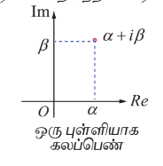
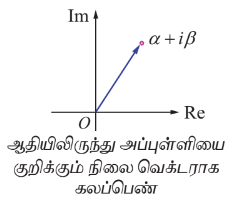
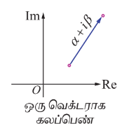
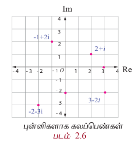
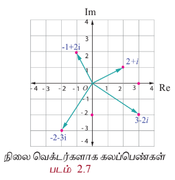
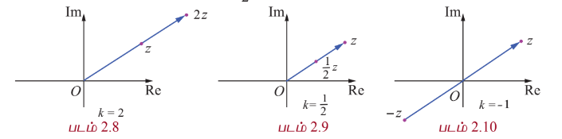

## 2.2 கலப்பு எண்கள் (Complex Numbers)

நாம், $$ x^2 + 1 = 0 $$ என்ற சமன்பாடுகளும் மெய்யனை தொடர்பில் தீர்வு இல்லை என்பதைக் கண்டோம். பொதுவாக, மெய் தீர்வுகள் இல்லாத மெய் என் குணக்களை கொண்ட பல்வுறுப்புக் கோவைச் சமன்பாடுகள் உள்ளன. இவ்வாறான பல்வுறுப்புக் கோவைச் சமன்பாடு களின் தீர்வுகளை உள்ளடக்க மெய் என் தொடர்பானது விரிவுபடுத்தப்படுகின்றது. இக்காரணத்திற்காக கணிதவியல் அறிஞர்கள் கலப்பெண்கள் என்ற எண்களின் தொடர்பை வரையறுக்கத் தூண்டப்பட்டனர்.

இப்பகுதியில் நாம் கீழ்காண்மை வரையறுப்பியோம்.

(i) செவ்வக வடிவில் கலப்பெண்கள்

(ii) ஆர்கண்ட் தளம்

(iii) கலப்பெண்களின் மீதான இயற்கணிதச் செயல்பாடுகள்

கலப்பெண்கள் தொடர்பு என் பது கற்பனை அலகு i கொண்டு விரிவாக்கம் செய்யப்பட்ட மெய் என் தொடர்பின் விரிவாக்கமாகும்.

மெய் எண்கள் $$ x $$ மற்றும் $$ y, i^2 = -1 $$ என்ற பண்பை கொண்ட கற்பனை அலகு $$ i $$ உடன் கூட்டல் மற்றும் பெருக்கல் செயல்களின் தூணை கொண்டு $$ x + iy $$ என்ற கலப்பெண்களை பெறலாம். இதில் $$ 'i' $$ என்ற குறியீட்டை வெட்டுகளின் கூட்டலாக கருத வேண்டும். இதை அறிமுகப்படுத்தியவர் கார்ந் பிரீட்டிருக்கும் (1777-1855).

### 2.2.1 சேவ்வக வடிவம் (Rectangular form)

#### வரையறை 2.1 (ஒரு கல்ப்பெண்ணின் சேவ்வக வடிவம்)

ஒரு கல்ப்பெண்ணின் சேவ்வக வடிவமும் என்பது $x + iy$ (அல்லது $x + yi$) ஆகும். இங்கு $x$ மற்றும் $y$ ஆகியவை மெய்ய எண்களாகும். இதில் $x$ என்பது கல்ப்பெண்ணின் மெய்ய பகுதி எனவும் $y$ என்பது கற்பனைப் பகுதி எனவும் அழைக்கப்படுகின்றது.

$x = 0$ எனில், கல்ப்பெண்ணானது முழுவதும் கற்பனை எண் ஆகும். $y = 0$ எனில், கல்ப்பெண்ணானது முழுவதும் மெய்ய எண் ஆகும். பூஜ்ஜியம் மட்டும் தான் ஒரு நேரத்தில் மெய்ய எண்ணாகவும் முழுவதும் கற்பனை எண்ணாகவும் இருக்கும். ஒரு கல்ப்பெண்ணின் திட்ட செல்வக வடிவம் $x + iy - \pi$ எனக்குறிப்பது வழக்கம். மேலும் $x = \text{Re}(z)$ எனவும் $y = \text{Im}(z)$ எனவும் குறிக்கலாம். உதாரணமாக, $\text{Re}(5 - i7) = 5$ மற்றும் $\text{Im}(5 - i7) = -7$ ஆகும்.

$a + i\beta, \beta \neq 0$ என்ற வடிவில் உள்ள எண்களை கற்பனை எண்கள் (மெய்யற்ற கல்ப்பெண்கள்) என்கிறோம்.

இரு கல்ப்பெண்கள் எந்த நிலையில் சமம் எனலாம் என்பதை பின்வருமாறு வரையறுக்கிறோம்.

---

#### வரையறை 2.2

இரண்டு கல்ப்பெண்கள் $z_1 = x_1 + iy_1$ மற்றும் $z_2 = x_2 + iy_2$ ஆகியவை சமமாக இருக்கத் தேவையானதும் ப�ோதுமானதுமான நிபந்தனை $\text{Re}(z_1) = \text{Re}(z_2)$ மற்றும் $\text{Im}(z_1) = \text{Im}(z_2)$.

அதாவது $x_1 = x_2$ மற்றும் $y_1 = y_2$.

உதாரணமாக, $a + i\beta = -7 + 3i$ எனில், $a = -7$ மற்றும் $\beta = 3$ ஆகும்.

## 2.2.2 அர்த்தம் தளம் (Argand plane)

ஒரு கலப்பெண் $ z = x + iy $ -ஐ ஒரே ஒரு வழியில் $ (x, y) $ என்ற மெய் எண்களின் வரிசை ஜோடிகளாக எழுதலாம். $ 3 - 8i, 6 $ மற்றும் $ -4i $ ஆகிய கலப்பெண்களை முறையே $ (3, -8), (6, 0) $, மற்றும் $ (0, -4) $ என வரிசை ஜோடிகளாக எழுதலாம். இவ்வாறாக $ z = x + iy $ என்ற கலப்பெண்ணை $ (x, y) $ என்ற புள்ளியில் அது அச்சத்தைத் தெரியப்படுத்தலாம். நாம் $ x $ அச்சை மெய் அச்சாகவும், $ y $ அச்சை கற்பனை அச்சாகவும் கொண்டால் $ xy $ -தளத்தை கலப்பெண் தளம் அல்லது ஆர்கண்ட் தளம் என்கிறோம். ஆர்கண்ட் தளம் என்ற பெயரானது சுர்வார்த்தைச் சேர்ந்த கணிதவியலாளர் ஜென் ஆர்கண்ட் (1768 – 1822) என்பவரின் நினைவாக பெயரிடப்பட்டுள்ளது.

ஒரு கலப்பெண்ணைது ஒரு புள்ளியை மட்டுமே குறிப்பது இல்லை, மேலும் ஆதியிலிருந்து அப்புள்ளியை குறிக்கும் நிலை வெட்டாகவும் இதனைப் பார்க்கலாம். அந்த எண், அந்த புள்ளி, மற்றும் அந்த வெட்டர் ஆகியவற்றை அணைத்தையும் $ z $ என்ற ஒரு எழுத்தால் குறிக்கலாம். வழக்கமாக இணையான நகர்த்தல் மூலம் வெட்டர்களை எவ்வாறு கையாளுவோமோ அதே போல் இங்கும் செய்யலாம். இப்பாடப்பகுதியில், $ \mathbb{C} $ என்பது கலப்பெண்களின் கணத்தைக் குறிக்கின்றது. வரையும் வாயிலாக ஒரு கலப்பெண்ணினை $ \mathbb{R}^2 $ -ல் ஒரு புள்ளியாகவே அல்லது ஒரு வெட்டாகவே ஆர்கண்ட் தளத்தில் பார்க்கலாம்.

**படம் 2.3**

**படம் 2.4**

**படம் 2.5**

#### விளக்க எடுத்துக்காட்டு 2.1

$$2 + i, -1 + 2i, 3 - 2i, 0 - 2i, 3 + \sqrt{-2}, -2 - 3i, \cos \frac{\pi}{6} + i \sin \frac{\pi}{6}$$

மற்றும் $ 3 + 0i $ ஆகியவற்றில் சில ஆர்கண்ட் தளத்தில் குறிக்கப்பட்டுள்ளன.

 

### 2.2.3 கலப்பெண்களின் மீதான இயற்கணிதச் செயல்பாடுகள் (Algebraic operations on complex numbers)

இப்பாடப் பகுதியில், மெய் எண்களின் மீதான பண்புகளை கொண்டு கலப்பெண்களின் இயற்கணித பண்புகளை யும் அவற்றின் வடிவியல் அமைப்புகளை யும் காண்போம்.

#### (i) கலப்பெண்ணின் திசையிலில் பெருக்கம்

$$z = x + iy \text{ மற்றும் } k \in \mathbb{R}, \text{ எனில்}$$

$$kz = (kx) + (ky)i \text{ என வரையறுப்போம்.}$$

குறிப்பாக $ 0z = 0 $, $ 1z = z $ மற்றும் $ (-1)z = -z $ ஆகும்.

$$kz \text{ -ன் வரையறுக்கள் } k = 2, \frac{1}{2}, -1 \text{ ஆகியவற்றிற்கு கீழே தரப்பட்டுள்ளன.}$$

#### (ii) கலப்பெண்களின் கூட்டல்

$$z_1 = x_1 + iy_1 \quad \text{மற்றும்} \quad z_2 = x_2 + iy_2, \quad \text{இங்கு} \quad x_1, x_2, y_1, \text{மற்றும்} \quad y_2 \in \mathbb{R} \quad \text{எனில்,}$$

$$z_1 + z_2 = (x_1 + iy_1) + (x_2 + iy_2)$$

$$= (x_1 + x_2) + i(y_1 + y_2)$$

$$z_1 + z_2 = (x_1 + x_2) + i(y_1 + y_2)$$

என வரையறுப்போம். ஏற்கனவே நாம் ஒரு வெட்டை  
இணையாக நகர்த்துவதால் அதன் எண் மதிப்பும் திசையும்  
மாறாது எனக் கண்டுள்ளோம். $ z_1 = x_1 + iy_1 $ மற்றும் $ z_2 = x_2 + iy_2 $  
எனும் போது வெட்டர் கட்டுலின் இணைகரவிதிப்படி அதன்  
கூடுதல் $ z_1 + z_2 = (x_1 + x_2) + i(y_1 + y_2) $ ஆனது $ (x_1 + x_2, y_1 + y_2) $  
என்று புள்ளியுடன் தொடர்புபடுத்தப்படுகின்றது. இப்புள்ளியை  
ஆயத்தொலைகளாகக் கொண்ட வெட்டராகவும் இதனைப்  
பார்க்கலாம். ஆகவே, $ z_1, z_2, $ மற்றும் $ z_1 + z_2 $ ஆகியவற்றை  
வரையும் வரையறு செய்ய முடியும். 2.11-ல்  
உள்ளவாறு காணலாம்.

**படம் 2.11**

#### (iii) கலப்பெண்களின் கழித்தல்  
இதுபோலவே $ z_1 - z_2 $ என்ற கலப்பெண்ணை ஆதிப்புள்ளியை ஆரம்பப்புள்ளியாகவும் ($ x_1 - x_2, y_1 - y_2 $) யை இறுதிப்புள்ளியாகவும் கொண்ட வெக்டராக பார்க்கலாம்.  

$$z_1 - z_2 = z_1 + (-z_2)$$  
$$z_1 - z_2 = (x_1 + iy_1) - (x_2 + iy_2)$$  
$$= (x_1 - x_2) + i(y_1 - y_2)$$  
$$z_1 - z_2 = (x_1 - x_2) + i(y_1 - y_2).$$  

மிக முக்கியமானது என்னவென்றால் $ z_1 - z_2 $ என்ற வெக்டரை $ z_2 - z_1 $ ஆரம்பப் புள்ளியாகவும் $ z_1 - z_2 $ முடிவுப் புள்ளியாகவும் கொண்ட படம் 2.12  

வெக்டராகவும் பார்க்கலாம் என்பதாகும். இந்த வகையான குறிப்பிடுதலானது எந்த வகையிலும் கழித்தலின் கருத்துரை மற்றும் வெக்டரை $ z_1 $ மற்றும் $ z_2 $ இணைக்கும் கழித்தல் வெக்டரானது புள்ளிக்கொடுகிறது.  

**படம் 2.12**

#### (iv) கலப்பெண்களின் பெருக்கல்  
$ z_1 $ மற்றும் $ z_2 $ என்ற கலப்பெண்களின் பெருக்கல் ஆனது  
$$z_1z_2 = (x_1 + iy_1)(x_2 + iy_2)$$  
$$= (x_1x_2 - y_1y_2) + i(x_1y_2 + x_2y_1)$$  

$ z_1z_2 = (x_1x_2 - y_1y_2) + i(x_1y_2 + x_2y_1) $ என வரையறுக்கப்படுகின்றது.  

$ z_1 $ மற்றும் $ z_2 $ ஒரு பெருக்குவதால் கிடைக்கும் கலப்பெண்ணும் ஒரு வெக்டரை குறிப்பிடுதல் மட்டுமல்லாமல் அவ்வெக்டரானது $ z_1 $ மற்றும் $ z_2 $ ஆகிய வெக்டர்கள் அமைந்த தளத்திலேயே அமைவும் இதிலிருந்து இந்த கலப்பெண்களின் பெருக்கம் வெக்டர் இயங்கியதற்கு உள்ள வெக்டர்களின் திசையில் பெருக்கத்தையே அல்லது வெக்டர்களின் வெக்டர் பெருக்கத்தையே குறிப்பிடுவது அல்ல என அறியலாம்.  

**படம் 2.13**

##### மேற்குறிப்பு  
கலப்பெண் $ z $ ஒரு $ i $ ஆல் பெருக்குதல்.  
$$z = x + iy, \text{ எனக்.}$$  
$$iz = i(x + iy)$$  
$$= -y + ix.$$  

கலப்பெண் $ iz $ என்பது கலப்பெண் $ z - \infty $ 90° அல்லது $ \frac{\pi}{2} $ ரெடியன் கடிகார எதிர்த்தையில் ஆதியை பொருத்து கழற்றுவது ஆகும். பொதுவாக, எந்த கலப்பெண் $ z - \infty $ முடிவு தொடர்ச்சியாக $ i $ ஆல் பெருக்குவதால் தொடர்ச்சியாக 90° கடிகார எதிர்த்தையில் ஆதியை பொருத்து கழற்றப்படும்.  

##### விளக்க எடுத்துக்காட்டு 2.2  
(i) $ z_1 = 6 + 7i $ மற்றும் $ z_2 = 3 - 5i $ எனில் $ z_1 + z_2 $ மற்றும் $ z_1 - z_2 $ ஆகியவை  
$$(3 - 5i) + (6 + 7i) = (3 + 6) + (-5 + 7)i = 9 + 2i$$  
$$(6 + 7i) - (3 - 5i) = (6 - 3) + (7 - (-5))i = 3 + 12i.$$  

(ii) $ z_1 = 2 + 3i $ மற்றும் $ z_2 = 4 + 7i $ எனில் $ z_1z_2 $ ஆனது  
$$(2 + 3i)(4 + 7i) = (2 \times 4 - 3 \times 7) + i(2 \times 7 + 3 \times 4)$$  
$$= (8 - 21) + (14 + 12)i$$  
$$= -13 + 26i.$$  

### எடுத்துக்காட்டு 2.2  
$(2 + i)x + (1 - i)y + 2i - 3$ மற்றும் $x + (-1 + 2i)y + 1 + i$ ஆகிய கலப்பெண்கள் சமம் எனில் $x$ மற்றும் $y$-ன் மெய்மதிப்புகளைக் காண்க.
#### தீர்வு  
$$z_1 = (2+i)x + (1-i)y + 2i - 3 = (2x + y - 3) + i(x - y + 2) \text{ மற்றும்}$$  
$$z_2 = x + (-1+2i)y + 1+i = (x - y + 1) + i(2y + 1) \text{ எனக்.}$$  
$$z_1 = z_2 \text{ எனக் கொடுக்கப்பட்டுள்ளது.}$$  

எனவே,  
$$(2x + y - 3) + i(x - y + 2) = (x - y + 1) + i(2y + 1).$$  

மேல் மற்றும் கற்பனைப் பகுதிகளைச் சமப்படுத்த  
$$2x + y - 3 = x - y + 1 \implies x + 2y = 4$$  
$$x - y + 2 = 2y + 1 \implies x - 3y = -1$$  

மேற்கண்ட சமன்பாடுகளைத் தீர்க்க  
$$x = 2 \text{ மற்றும் } y = 1 \text{ எனப்படுமாறும்.}$$  

---

### பயிற்சி 2.2  

1. $ z = 5 - 2i $ மற்றும் $ w = -1 + 3i $ எனக்கொண்டு கீழ்க்காண்பவைகளின் மதிப்புகளைக் காண்க.  

   (i) $ z + w $  
   (ii) $ z - iw $  
   (iii) $ 2z + 3w $  
   (iv) $ zw $  
   (v) $ z^2 + 2zw + w^2 $  
   (vi) $ (z + w)^2 $  

2. $ z = 2 + 3i $ எனக்கொண்டு கீழ்க்காணும் கலப்பெண்களை ஆரகண்டு தளத்தில் குறிக்க.  

   (i) $ z, iz, $ மற்றும் $ z + iz $  
   (ii) $ z, -iz, $ மற்றும் $ z - iz $  

3. $ (3 - i)x - (2 - i)y + 2i + 5 $ மற்றும் $ 2x + (-1 + 2i)y + 3 + 2i $ ஆகிய கலப்பெண்கள் சமம் எனில் $ x $ மற்றும் $ y $ என்பது மதிப்புகளைக் காண்க.  

---
