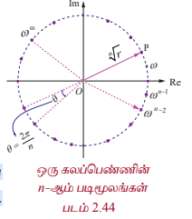
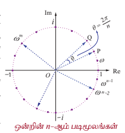
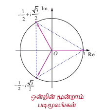
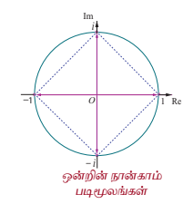
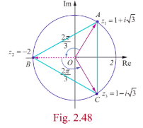

### 2.8 டி மாய்வரின் தேற்றமும் அதன் பயன்பாடுகளும்

### (de Moivre's Theorem and its Applications)

ஆபரகாம் டி மாய்வர் (1667–1754) என்ற கணிதவியல் அறிஞர் முக்கோணவியலில் கலப்பு எண்களைப் பயன்படுத்தினார்.

$(\cos\theta + i\sin\theta)^n = (\cos n\theta + i\sin n\theta)$ எனும் சூத்திரம் அவரது பெயரால் அறியப்படுகின்றது.

முக்கோணவியலை வடிவியலின் ஆதிக்கத்தில் இருந்து மீட்டெடுத்து பகுப்பாய்விற்குள் கொண்டு செல்ல அவர் பெயரால் வழங்கும் இச்சூத்திரமே தூண்டுகோலாக அமைந்தது.

### 2.8.1 டி மாய்வரின் தேற்றம் (de Moivre's Theorem)

டி மாய்வரின் தேற்றம்

கொடுக்கப்பட்ட கலப்பெண் $\cos\theta + i\sin\theta$ மற்றும் $n$ என்ற முழு எண்ணிற்கு

$$(\cos\theta + i\sin\theta)^n = \cos n\theta + i\sin n\theta.$$

### கிளைத்தேற்றம்

(1) $(\cos\theta - i\sin\theta)^n = \cos n\theta - i\sin n\theta$  
(2) $(\cos\theta + i\sin\theta)^{-n} = \cos n\theta - i\sin n\theta$  
(3) $(\cos\theta - i\sin\theta)^{-n} = \cos n\theta + i\sin n\theta$  
(4) $\sin\theta + i\cos\theta = i(\cos\theta - i\sin\theta)$.

நாம் இப்பொழுது டிமாய்வரின் தேற்றத்தை கலப்பெண்களை சுருக்குதல் மற்றும் சமன்பாடுகளைத் தீர்த்தல் போன்றவற்றிற்கு பயன்படுத்துவோம்.

### எடுத்துக்காட்டு 2.28

$z = \cos\theta + i\sin\theta$ எனில், $z^n + \frac{1}{z^n} = 2\cos n\theta$ மற்றும் $z^n - \frac{1}{z^n} = 2i\sin n\theta$ என நிறுவுக.

### தீர்வு

$z = \cos\theta + i\sin\theta$ என்க.

டி மாய்வரின் தேற்றப்படி

$$z^n = (\cos\theta + i\sin\theta)^n = \cos n\theta + i\sin n\theta$$

$$\frac{1}{z^n} = z^{-n} = \cos n\theta - i\sin n\theta$$

ஆகவே,

$$z^n + \frac{1}{z^n} = (\cos n\theta + i\sin n\theta) + (\cos n\theta - i\sin n\theta)$$

$$z^n + \frac{1}{z^n} = 2\cos n\theta.$$

இதுபோலவே,

$$z^n - \frac{1}{z^n} = (\cos n\theta + i\sin n\theta) - (\cos n\theta - i\sin n\theta)$$

$$z^n - \frac{1}{z^n} = 2i\sin n\theta.$$

---

### எடுத்துக்காட்டு 2.29

சுருக்குக $\left(\sin\frac{\pi}{6} + i\cos\frac{\pi}{6}\right)^{18}$.

### தீர்வு

$$\sin\frac{\pi}{6} + i\cos\frac{\pi}{6} = i\left(\cos\frac{\pi}{6} - i\sin\frac{\pi}{6}\right)$$

ஆக எழுதலாம்.

இருபுறமும் 18-ன் அடுக்கிற்கு உயர்த்த,

$$\left(\sin\frac{\pi}{6} + i\cos\frac{\pi}{6}\right)^{18} = i^{18}\left(\cos\frac{\pi}{6} - i\sin\frac{\pi}{6}\right)^{18}$$

$$= (-1)\left(\cos\frac{18\pi}{6} - i\sin\frac{18\pi}{6}\right)$$

$$= -(\cos 3\pi - i\sin 3\pi) = 1 + i0$$

ஆகவே, $\left(\sin\frac{\pi}{6} + i\cos\frac{\pi}{6}\right)^{18} = 1$.

---

### எடுத்துக்காட்டு 2.30

சுருக்குக $\left(\frac{1 + \cos 2\theta + i\sin 2\theta}{1 + \cos 2\theta - i\sin 2\theta}\right)^{30}$.

### தீர்வு

$z = \cos 2\theta + i\sin 2\theta$ என்க.

$|z| = |z|^2 = z\overline{z} = 1$ என்பதிலிருந்து $\overline{z} = \frac{1}{z} = \cos 2\theta - i\sin 2\theta$ என பெறலாம்.

ஆகவே,

$$\frac{1 + \cos 2\theta + i\sin 2\theta}{1 + \cos 2\theta - i\sin 2\theta} = \frac{1 + z}{1 + \frac{1}{z}} = \frac{1 + z}{\frac{z + 1}{z}} = z.$$

எனவே,

$$\left(\frac{1 + \cos 2\theta + i\sin 2\theta}{1 + \cos 2\theta - i\sin 2\theta}\right)^{30} = z^{30} = (\cos 2\theta + i\sin 2\theta)^{30}$$

$$= \cos 60\theta + i\sin 60\theta.$$

---

### எடுத்துக்காட்டு 2.31

சுருக்குக (i) $(1 + i)^{18}$ (ii) $(-\sqrt{3} + 3i)^{31}$.

### தீர்வு

(i) $(1 + i)^{18}$

$1 + i = r(\cos\theta + i\sin\theta)$ என்க.

$$r = \sqrt{1^2 + 1^2} = \sqrt{2}; \quad \alpha = \tan^{-1}\left(\frac{1}{1}\right) = \frac{\pi}{4},$$

$$\theta = \frac{\pi}{4} \quad (\because 1 + i \text{ ஆனது முதலாம் கால் பகுதியில் உள்ளதால்})$$

ஆகவே, $1 + i = \sqrt{2}\left(\cos\frac{\pi}{4} + i\sin\frac{\pi}{4}\right)$

இருபுறமும் 18-ன் அடுக்கிற்கு உயர்த்த,

$$(1 + i)^{18} = (\sqrt{2})^{18}\left(\cos\frac{\pi}{4} + i\sin\frac{\pi}{4}\right)^{18}.$$

டி மாய்வரின் தேற்றப்படி,

$$(1 + i)^{18} = 2^9\left(\cos\frac{18\pi}{4} + i\sin\frac{18\pi}{4}\right)$$

$$= 2^9\left(\cos\left(4\pi + \frac{\pi}{2}\right) + i\sin\left(4\pi + \frac{\pi}{2}\right)\right) = 2^9\left(\cos\frac{\pi}{2} + i\sin\frac{\pi}{2}\right)$$

$$(1 + i)^{18} = 512(i) = 512i.$$

(ii) $(-\sqrt{3} + 3i)^{31}$

$-\sqrt{3} + 3i = r(\cos\theta + i\sin\theta)$ என்க.

$$r = \sqrt{(-\sqrt{3})^2 + 3^2} = \sqrt{12} = 2\sqrt{3},$$

$$\alpha = \tan^{-1}\left|\frac{3}{-\sqrt{3}}\right| = \tan^{-1}(\sqrt{3}) = \frac{\pi}{3},$$

$$\theta = \pi - \alpha = \pi - \frac{\pi}{3} = \frac{2\pi}{3} \quad (\because -\sqrt{3} + 3i \text{ ஆனது II-ஆம் கால் பகுதியில் உள்ளதால்})$$

ஆகவே, $-\sqrt{3} + 3i = 2\sqrt{3}\left(\cos\frac{2\pi}{3} + i\sin\frac{2\pi}{3}\right)$.

இருபுறமும் 31-ன் அடுக்கிற்கு உயர்த்த,

$$(-\sqrt{3} + 3i)^{31} = \left(2\sqrt{3}\right)^{31}\left(\cos\frac{2\pi}{3} + i\sin\frac{2\pi}{3}\right)^{31}$$

$$= (2\sqrt{3})^{31}\left(\cos\left(20\pi + \frac{2\pi}{3}\right) + i\sin\left(20\pi + \frac{2\pi}{3}\right)\right)$$

$$= (2\sqrt{3})^{31}\left(\cos\frac{2\pi}{3} + i\sin\frac{2\pi}{3}\right)$$

$$= (2\sqrt{3})^{31}\left(-\cos\frac{\pi}{3} + i\sin\frac{\pi}{3}\right)$$

$$= (2\sqrt{3})^{31}\left(-\frac{1}{2} + i\frac{\sqrt{3}}{2}\right).$$

---

### 2.8.2 ஒரு கலப்பெண்ணின் n-ஆம் படிமூலங்களைக் காணல்

#### (Finding $n^{\text{th}}$ roots of a complex number)

கலப்பெண்களின் மூலங்களைக் காண டி மாய்வரின் சூத்திரத்தைப் பயன்படுத்துகிறோம். $n$ ஒரு முழு எண் மற்றும் $\omega$ ஒரு கலப்பெண் ஆனது $z$-ன் $n$-ஆம் படிமூலம் $z^{1/n}$ எனக்கொண்டால்

$$\omega^n = z \tag{1}$$

$\omega = \rho(\cos\phi + i\sin\phi)$ மற்றும் $z = r(\cos\theta + i\sin\theta) = r(\cos(\theta + 2k\pi) + i\sin(\theta + 2k\pi)), \quad k \in \mathbb{Z}$ என்க.

$z$-ன் $n$-ஆம் படிமூலம் $\omega$ எனில்

$$\omega^n = z$$

$$\Rightarrow \rho^n(\cos n\phi + i\sin n\phi) = r(\cos(\theta + 2k\pi) + i\sin(\theta + 2k\pi)), \quad k \in \mathbb{Z}$$

டி மாய்வரின் தேற்றப்படி,

$$\rho^n(\cos n\phi + i\sin n\phi) = r(\cos(\theta + 2k\pi) + i\sin(\theta + 2k\pi)), \quad k \in \mathbb{Z}$$

மட்டுக்களையும் வீச்சுகளையும் சமப்படுத்த

$$\rho^n = r \quad \text{மற்றும்} \quad n\phi = \theta + 2k\pi, \quad k \in \mathbb{Z}$$

எனப்பெறலாம்.

$$\rho = r^{1/n} \quad \text{மற்றும்} \quad \phi = \frac{\theta + 2k\pi}{n}, \quad k \in \mathbb{Z}.$$

ஆகவே, $\omega$ -ன் மதிப்புகள்

$$r^{1/n}\left(\cos\frac{\theta + 2k\pi}{n} + i\sin\frac{\theta + 2k\pi}{n}\right), \quad k \in \mathbb{Z}.$$

$k$ -விற்கு எண்ணிக்கையற்ற மதிப்புகள் இருந்தாலும் $\omega$ -விற்கு வெவ்வேறான மதிப்புகளைப் பெற $k = 0, 1, 2, 3, \ldots, n-1$ எனப்பிரதியிட வேண்டும். $k = n, n+1, n+2, \ldots$ என பிரதியிட்டால் கிடைத்த மூலங்களே (சுற்றுவட்ட முறையில்) சீரான இடைவெளியில் கிடைக்கும். ஆகவே $z = r(\cos\theta + i\sin\theta)$ என்ற கலப்பெண்ணின் $n$-ஆம் படிமூலங்கள்

$$z^{1/n} = r^{1/n}\left(\cos\frac{\theta + 2k\pi}{n} + i\sin\frac{\theta + 2k\pi}{n}\right), \quad k = 0, 1, 2, 3, \ldots, n-1.$$

ஒரு கலப்பெண்ணின் $n$-ஆம் மூலத்தினை

$$\sqrt[n]{r e^{\frac{i(\theta + 2k\pi)}{n}}}$$

எனக்கொள்வதன் மூலமும் படத்தில் காட்டியுள்ளது போன்ற ஒரு அழகிய வடிவியல் விளக்கத்தினைப் பெறலாம். இந்த $n$ மூலங்களுக்கும், $|\omega| = \sqrt[n]{r}$ அதாவது மட்டு மதிப்பு $\sqrt[n]{r}$ எனவே இவை ஆதியை மையமாக $\sqrt[n]{r}$ ஆரமுள்ள வட்டத்தின் மீது அமையும். மேலும் இந்த $n$ மூலங்களில் அடுத்தடுத்த மூலங்களின் வீச்சுகள் $\frac{2\pi}{n}$ என்ற வித்தியாசத்தில் வேறுபடுவதால் இந்த $n$ மூலங்களும் வட்டத்தின் மேல் சீரான இடைவெளிகளில் அமையும்.

**படம் 2.44**
### மேற்குறிப்பு

(1) **டி மாய்வர் தேற்றத்தின் பொது வடிவம் (General form of de Moivre's Theorem)**

$x$ ஒரு விகிதமுறு எண் எனில் $\cos x\theta + i\sin x\theta$ என்பது $(\cos\theta + i\sin\theta)^x$ -ன் மதிப்புகளில் ஒன்றாகும்.

(2) **அலகு வட்டத்தின் துருவ வடிவம் (Polar form of unit circle)**

$z = e^{i\theta} = \cos\theta + i\sin\theta$ என்க.

எனவே, $|z|^2 = |\cos\theta + i\sin\theta|^2$

$$\Rightarrow |x + iy|^2 = \cos^2\theta + \sin^2\theta = 1$$

$$\Rightarrow x^2 + y^2 = 1.$$

எனவே, $|z| = 1$ ஆனது ஆதியை மையமாகக் கொண்ட அலகு வட்டத்தை (ஓரலகு வட்டத்தை) குறிக்கிறது.

### 2.8.3 ஒன்றின் $n$-ஆம் படிமூலங்கள் (The $n^{\text{th}}$ roots of unity)

$z^n = 1$, $n$ ஒரு முழு எண், என்ற சமன்பாட்டின் தீர்வுகளே ஒன்றின் $n$-ஆம் படிமூலங்கள் ஆகும்.

$z^n = 1$ என்ற சமன்பாட்டை துருவ வடிவில்

$$z^n = \cos(0 + 2k\pi) + i\sin(0 + 2k\pi) = e^{i2k\pi}, \quad k = 0, 1, 2, \ldots$$

டி மாய்வரின் தேற்றத்தைப் பயன்படுத்தி ஒன்றின் $n$-ஆம் படிமூலங்களை பின்வருமாறு காணலாம்:

$$z = \left(\cos\frac{2k\pi}{n} + i\sin\frac{2k\pi}{n}\right) = e^{\frac{i2k\pi}{n}}, \quad k = 0, 1, 2, 3, \ldots, n-1. \tag{1}$$

கொடுக்கப்பட்ட மிகை முழு எண் $n$ -க்கு, $z$ என்பது ஒன்றின் $n$-ஆம் படி மூலமாக இருக்குமெனில் $z^n = 1$ என இருக்க வேண்டும்.

இதனை $\omega$ என்ற கலப்பெண்ணின் மூலம் குறித்தால்,

$$\omega = e^{\frac{2\pi i}{n}} = \cos\frac{2\pi}{n} + i\sin\frac{2\pi}{n}$$

$$\Rightarrow \omega^n = \left(e^{\frac{2\pi i}{n}}\right)^n = e^{2\pi i} = 1$$

எனப்பெறலாம்.

**படம் 2.45**

ஆகவே ஒன்றின் $n$-ஆம் படிமூலங்களில் ஒன்று $\omega$ ஆகும்.
சமன்பாடு (1)-லிருந்து $1, \omega, \omega^2, \ldots, \omega^{n-1}$ ஆகியவை ஒன்றின் $n$-ஆம் படிமூலங்கள் ஆகும். $1, \omega, \omega^2, \ldots, \omega^{n-1}$ என்ற இந்த கலப்பெண்கள் கலப்பெண் தளத்தில் $n$ பக்கங்களை உடைய சீரான பலகோணத்தின் உச்சிப்புள்ளிகளாக ஓரலகு வட்டத்தின் மீது படத்தில் காட்டியுள்ளவாறு அமையும். இந்த எல்லா $n$-ஆம் படிமூலங்களின் மட்டு மதிப்புகளும் 1 எனவே இவை ஆதியை மையமாகவும் ஆரம் 1 கொண்ட வட்டத்தின் மீது அமையும். மேலும் இந்த $n$ மூலங்களில் அடுத்தடுத்த மூலக்ளுக்கு இடைப்பட்ட கோண வித்தியாசம் $\frac{2\pi}{n}$. எனவே, $n$ மூலங்களும் வட்டத்தின் மீது சீரான இடைவெளி விட்டு அமையும்.

ஒன்றின் $n$-ஆம் படிமூலங்கள் $1, \omega, \omega^2, \ldots, \omega^{n-1}$ ஆகியவை $\omega$ -வை பொது விகிதமாகக் கொண்ட பெருக்குத் தொடரை அமைக்கிறது.

ஆகவே

$$1 + \omega + \omega^2 + \cdots + \omega^{n-1} = \frac{1 - \omega^n}{1 - \omega} = 0$$

இங்கு $\omega^n = 1$ மற்றும் $\omega \neq 1$.

ஒன்றின் $n$-ஆம் படிமூலங்கள் அனைத்தின் கூட்டுத்தொகை

$$1 + \omega + \omega^2 + \cdots + \omega^{n-1} = 0$$

ஆகும்.

ஒன்றின் $n$-ஆம் படிமூலங்கள் அனைத்தின் பெருக்குத் தொகை

$$1 \cdot \omega \cdot \omega^2 \cdots \omega^{n-1} = \omega^{0 + 1 + 2 + 3 + \cdots + (n-1)} = \omega^{\frac{(n-1)n}{2}}$$

$$= \left(\omega^n\right)^{\frac{(n-1)}{2}} = \left(e^{i2\pi}\right)^{\frac{(n-1)}{2}} = \left(e^{i\pi}\right)^{n-1} = (-1)^{n-1}$$

ஒன்றின் $n$-ஆம் படிமூலங்கள் அனைத்தின் பெருக்குத்தொகை

$$1 \cdot \omega \cdot \omega^2 \cdots \omega^{n-1} = (-1)^{n-1}$$

ஆகும்.

$|\omega| = 1$, எனவே $\omega\overline{\omega} = |\omega|^2 = 1$; ஆகையால், $\overline{\omega} = \omega^{-1} \Rightarrow (\overline{\omega})^k = \omega^{-k}, \quad 0 \leq k \leq n-1$

$$\omega^{n-k} = \omega^n \omega^{-k} = \omega^{-k} = (\overline{\omega})^k, \quad 0 \leq k \leq n-1$$

ஆகவே,

$$\omega^{n-k} = \omega^{-k} = (\overline{\omega})^k, \quad 0 \leq k \leq n-1.$$

### குறிப்பு

(1) ஒன்றின் $n$-ஆம் படிமூலங்கள் அனைத்தும் பெருக்குத் தொடரை அமைக்கின்றது.

(2) ஒன்றின் $n$-ஆம் படிமூலங்கள் அனைத்தின் கூட்டுத்தொகை பூஜ்ஜியமாகும்.

(3) ஒன்றின் $n$-ஆம் படிமூலங்கள் அனைத்தின் பெருக்குத்தொகை $(-1)^{n-1}$ ஆகும்.

(4) ஒன்றின் $n$-ஆம் படிமூலங்கள் அனைத்தும் ஆதியை மையமாகவும் ஆரம் 1 கொண்ட வட்டத்தின் மீது அமைவதுடன் வட்டத்தை $n$ சமபாகங்களாகப் பிரிக்கின்றது. மேலும் இவை $n$ பக்கங்கள் கொண்ட பலகோணத்தை அமைக்கின்றது.

### எடுத்துக்காட்டு 2.32

ஒன்றின் மூன்றாம் படிமூலங்களைக் காண்க.

### தீர்வு

நாம் $1^{\frac{1}{3}}$ ஐ காணவேண்டும். $z = 1^{\frac{1}{3}}$ எனில், $z^3 = 1$ ஆகும்.

$z^3 = 1$ என்ற சமன்பாட்டை துருவ வடிவில் எழுத

$$z^3 = \cos(0 + 2k\pi) + i\sin(0 + 2k\pi) = e^{i2k\pi}, \quad k = 0, 1, 2, \ldots$$

எனவே,

$$z = \cos\frac{2k\pi}{3} + i\sin\frac{2k\pi}{3} = e^{\frac{i2k\pi}{3}}, \quad k = 0, 1, 2.$$

$k = 0, 1, 2$ எனப்பிரதியிட

$k = 0, \quad z = \cos 0 + i\sin 0 = 1$.

$k = 1, \quad z = \cos\frac{2\pi}{3} + i\sin\frac{2\pi}{3} = \cos\left(\pi - \frac{\pi}{3}\right) + i\sin\left(\pi - \frac{\pi}{3}\right)$

$$= -\cos\frac{\pi}{3} + i\sin\frac{\pi}{3} = -\frac{1}{2} + i\frac{\sqrt{3}}{2}.$$

$k = 2, \quad z = \cos\frac{4\pi}{3} + i\sin\frac{4\pi}{3} = \cos\left(\pi + \frac{\pi}{3}\right) + i\sin\left(\pi + \frac{\pi}{3}\right)$

$$= -\cos\frac{\pi}{3} - i\sin\frac{\pi}{3} = -\frac{1}{2} - i\frac{\sqrt{3}}{2}.$$

ஆகவே, ஒன்றின் மூன்றாம் படிமூலங்கள்

$$1, \frac{-1 + i\sqrt{3}}{2}, \frac{-1 - i\sqrt{3}}{2} \quad \Rightarrow \quad 1, \omega, \text{ மற்றும் } \omega^2, \text{ இங்கு } \omega = e^{\frac{2\pi i}{3}} = \frac{-1 + i\sqrt{3}}{2}.$$

**படம் 2.46**

### எடுத்துக்காட்டு 2.33

ஒன்றின் நான்காம் படிமூலங்களைக் காண்க.

### தீர்வு

நாம் $1^{\frac{1}{4}}$ ஐ காண வேண்டும். $z = 1^{\frac{1}{4}}$ எனில் $z^4 = 1$ ஆகும்.

$z^4 = 1$ என்ற சமன்பாட்டை துருவ வடிவில் எழுத,

$$z^4 = \cos(0 + 2k\pi) + i\sin(0 + 2k\pi) = e^{i2k\pi}, \quad k = 0, 1, 2, \ldots$$

எனவே,

$$z = \cos\frac{2k\pi}{4} + i\sin\frac{2k\pi}{4} = e^{\frac{i2k\pi}{4}}, \quad k = 0, 1, 2, 3.$$

$k = 0, 1, 2, 3$ எனப்பிரதியிட

$k = 0, \quad z = \cos 0 + i\sin 0 = 1$.

$k = 1, \quad z = \cos\frac{\pi}{2} + i\sin\frac{\pi}{2} = i$.

**படம் 2.47**

$k = 2, \quad z = \cos\pi + i\sin\pi = -1$.

$k = 3, \quad z = \cos\frac{3\pi}{2} + i\sin\frac{3\pi}{2} = -\cos\frac{\pi}{2} - i\sin\frac{\pi}{2} = -i$.

ஒன்றின் நான்காம் படிமூலங்கள் $1, i, -1, -i \quad \Rightarrow \quad 1, \omega, \omega^2, \text{ மற்றும் } \omega^3$, இங்கு $\omega = e^{\frac{2\pi i}{4}} = i$.

---

### குறிப்பு

(i) இப்பாடப்பகுதியில் $\omega$ என்பது ஒன்றின் $n$-ஆம் படிமூலத்தை குறிப்பிடப்பயன்படுத்தப்பட்டுள்ளது. எனவே $\omega$ ஆனது $n$-ஐப் பொருத்து எவ்வாறு அமைகின்றது என்பது அட்டவணைப்படுத்தப்பட்டுள்ளது.

| $n$-ன் மதிப்புகள் | 2 | 3 | 4 | 5 | $\cdots$ | $k$ |
|---|---|---|---|---|---|---|
| $\omega$ -ன் மதிப்புகள் | $e^{\frac{2\pi i}{2}}$ | $e^{\frac{2\pi i}{3}}$ | $e^{\frac{2\pi i}{4}}$ | $e^{\frac{2\pi i}{5}}$ | $\cdots$ | $e^{\frac{2\pi i}{k}}$ |

(ii) $z e^{i\theta}$ என்பது $z$ -ஐ ஆதியை பொறுத்து $\theta$ கோணம் கடிகார எதிர்திசையில் சுற்றுவது ஆகும்.

### எடுத்துக்காட்டு 2.34

$z^3 + 8i = 0$ என்ற சமன்பாட்டைத் தீர்க்க. இங்கு $z \in \mathbb{C}$.

### தீர்வு

$z^3 + 8i = 0$ என்க.

$\Rightarrow z^3 = -8i$

$$= 8(-i) = 8\left(\cos\left(-\frac{\pi}{2} + 2k\pi\right) + i\sin\left(-\frac{\pi}{2} + 2k\pi\right)\right), \quad k \in \mathbb{Z}.$$

எனவே,

$$z = \sqrt[3]{8}\left(\cos\left(-\frac{\pi}{6} + \frac{4k\pi}{3}\right) + i\sin\left(-\frac{\pi}{6} + \frac{4k\pi}{3}\right)\right), \quad k = 0, 1, 2.$$

$k = 0, 1, 2$ எனப் பிரதியிட

$k = 0, \quad z = 2\left(\cos\left(-\frac{\pi}{6}\right) + i\sin\left(-\frac{\pi}{6}\right)\right) = 2\left(\frac{\sqrt{3}}{2} - i\frac{1}{2}\right) = \sqrt{3} - i$.

$k = 1, \quad z = 2\left(\cos\frac{\pi}{2} + i\sin\frac{\pi}{2}\right) = 2(0 + i) = 2i$.

$k = 2, \quad z = 2\left(\cos\frac{7\pi}{6} + i\sin\frac{7\pi}{6}\right) = 2\left(\cos\left(\pi + \frac{\pi}{6}\right) + i\sin\left(\pi + \frac{\pi}{6}\right)\right)$

$$= 2\left(-\cos\frac{\pi}{6} - i\sin\frac{\pi}{6}\right) = 2\left(-\frac{\sqrt{3}}{2} - i\frac{1}{2}\right) = -\sqrt{3} - i.$$

$z$ -ன் மதிப்புகள் $\sqrt{3} - i, 2i$, மற்றும் $-\sqrt{3} - i$.

### எடுத்துக்காட்டு 2.35

$\sqrt{3} + i$ -ன் எல்லா மூன்றாம் படிமூலங்களையும் காண்க.

### தீர்வு

நாம் $(\sqrt{3} + i)^{\frac{1}{3}}$ -ன் மதிப்புகளை காண வேண்டும். $z = (\sqrt{3} + i)^{\frac{1}{3}}$ எனில்

$$z^3 = \sqrt{3} + i = r(\cos\theta + i\sin\theta)$$ ஆகும்.

$$r = \sqrt{(\sqrt{3})^2 + 1^2} = 2, \quad \text{மற்றும்} \quad \alpha = \tan^{-1}\left(\frac{1}{\sqrt{3}}\right) = \frac{\pi}{6} \quad (\because \sqrt{3} + i \text{ I கால்பகுதியில் அமைவதால்})$$

ஆகவே,

$$z^3 = 2\left(\cos\frac{\pi}{6} + i\sin\frac{\pi}{6}\right)$$

$$\Rightarrow z = \sqrt[3]{2}\left(\cos\frac{\pi + 12k\pi}{18} + i\sin\frac{\pi + 12k\pi}{18}\right), \quad k = 0, 1, 2.$$

$k = 0, 1, 2$ எனப்பிரதியிட,

$k = 0, \quad z = \sqrt[3]{2}\left(\cos\frac{\pi}{18} + i\sin\frac{\pi}{18}\right);$

$k = 1, \quad z = \sqrt[3]{2}\left(\cos\frac{13\pi}{18} + i\sin\frac{13\pi}{18}\right);$

$k = 2, \quad z = \sqrt[3]{2}\left(\cos\frac{25\pi}{18} + i\sin\frac{25\pi}{18}\right) = \sqrt[3]{2}\left(-\cos\frac{7\pi}{18} - i\sin\frac{7\pi}{18}\right).$

### எடுத்துக்காட்டு 2.36

$z_1, z_2$, மற்றும் $z_3$ ஆகியவை $|z| = 2$ என்ற வட்டத்தின் மீதமைந்த சமபக்க முக்கோணத்தின் உச்சிப்புள்ளிகள் என்க. மேலும் $z_1 = 1 + i\sqrt{3}$ எனில், $z_2$ மற்றும் $z_3$ -ஐக் காண்க.

### தீர்வு

$|z| = 2$ என்பது $(0, 0)$ -வை மையமாகவும் 2 ஐ ஆரமாகவும் கொண்ட வட்டத்தைக் குறிக்கும். $A, B$, மற்றும் $C$ ஆகியவை முக்கோணத்தின் முனைப்புள்ளிகள் என்க. $z_1, z_2$ மற்றும் $z_3$ ஆகியவை $|z| = 2$ என்ற வட்டத்தின் மீதமைந்த சமபக்க முக்கோணத்தின் உச்சிப்புள்ளிகள். எனவே, $AB, BC$, மற்றும் $CA$ என்ற பக்கங்கள் ஆதியை பொருத்து (முக்கோணத்தின் சுற்று வட்ட மையம்) $\frac{2\pi}{3}$ ரேடியன்கள் (120°) கோண இடைவெளி விட்டு அமையும். ($z e^{i\theta}$ என்பது $z$ -ஐ ஆதியைப் பொருத்து $\theta$ கோணம் கடிகார எதிர்திசையில் சுற்றுவது ஆகும்)

ஆகவே, $z_1$ -ஐ முறையே $\frac{2\pi}{3}$ மற்றும் $\frac{4\pi}{3}$ கோணங்கள் சுற்றுவதால் $z_2$ மற்றும் $z_3$ ஆகியவற்றை பெறலாம்.

$\overline{OA} = z_1 = 1 + i\sqrt{3}$ என்க.

$$\overline{OB} = z_1 e^{\frac{2\pi i}{3}} = (1 + i\sqrt{3}) e^{\frac{2\pi i}{3}}$$

$$= (1 + i\sqrt{3}) \left(\cos\frac{2\pi}{3} + i\sin\frac{2\pi}{3}\right)$$

$$= (1 + i\sqrt{3}) \left(-\frac{1}{2} + i\frac{\sqrt{3}}{2}\right) = -2;$$

**படம் 2.48**

$$\overline{OC} = z_1 e^{\frac{4\pi i}{3}} = (1 + i\sqrt{3}) e^{\frac{4\pi i}{3}}$$

$$= (1 + i\sqrt{3}) \left(\cos\frac{4\pi}{3} + i\sin\frac{4\pi}{3}\right)$$

$$= (1 + i\sqrt{3}) \left(-\frac{1}{2} - i\frac{\sqrt{3}}{2}\right) = 1 - i\sqrt{3}.$$

ஆகவே, $z_2 = -2$ மற்றும் $z_3 = 1 - i\sqrt{3}$.

### பயிற்சி 2.8

1. $\omega \neq 1$ என்பது ஒன்றின் மூன்றாம் படிமூலம் எனில்

$$\frac{a + b\omega + c\omega^2}{b + c\omega + a\omega^2} + \frac{a + b\omega + c\omega^2}{c + a\omega + b\omega^2} = -1$$

என நிறுவுக.

2. $\left(\frac{\sqrt{3}}{2} + \frac{i}{2}\right)^5 + \left(\frac{\sqrt{3}}{2} - \frac{i}{2}\right)^5 = -\sqrt{3}$ எனக்காட்டுக.

3. $\left(\frac{1 + \sin\frac{\pi}{10} + i\cos\frac{\pi}{10}}{1 + \sin\frac{\pi}{10} - i\cos\frac{\pi}{10}}\right)^{10}$ -ன் மதிப்பு காண்க.

4. $2\cos\alpha = x + \frac{1}{x}$ மற்றும் $2\cos\beta = y + \frac{1}{y}$ எனக் கொண்டு, கீழ்க்காண்பவைகளை நிறுவுக.

   (i) $\frac{x}{y} + \frac{y}{x} = 2\cos(\alpha - \beta)$  
   (ii) $xy - \frac{1}{xy} = 2i\sin(\alpha + \beta)$  
   (iii) $\frac{x^m}{y^m} - \frac{y^n}{x^m} = 2i\sin(m\alpha - n\beta)$  
   (iv) $x^m y^n + \frac{1}{x^m y^n} = 2\cos(m\alpha + n\beta)$.

5. $z^3 + 27 = 0$ என்ற சமன்பாட்டைத் தீர்க்க.

6. $\omega \neq 1$ என்பது ஒன்றின் முப்படி மூலம் எனில் $(z - 1)^3 + 8 = 0$ என்ற சமன்பாட்டின் மூலங்கள் $-1, 1 - 2\omega, 1 - 2\omega^2$ எனக்காட்டுக.

7. $\sum_{k=1}^{8} \left(\cos\frac{2k\pi}{9} + i\sin\frac{2k\pi}{9}\right)$ -ன் மதிப்பு காண்க.

8. $\omega \neq 1$ என்பது ஒன்றின் முப்படி மூலம் எனில், பின்வருவனவற்றை நிறுவுக.

   (i) $(1 - \omega + \omega^2)^6 + (1 + \omega - \omega^2)^6 = 128$.  
   (ii) $(1 + \omega)(1 + \omega^2)(1 + \omega^4)(1 + \omega^8)\cdots(1 + \omega^{2^{11}}) = 1$.

9. $z = 2 - 2i$ எனில், ஆதியைப் பொருத்து $z$ -ஐ $\theta$ ரேடியன்கள் கடிகார திசைக்கு எதிர் திசையில் சுழற்றினால் $z$ -ன் மதிப்பை கீழ்க்காணும் $\theta$ மதிப்புகளுக்கு காண்க.

   (i) $\theta = \frac{2\pi}{3}$  
   (ii) $\theta = \frac{2\pi}{3}$  
   (iii) $\theta = \frac{3\pi}{2}$.

### பயிற்சி 2.9

சரியான அல்லது மிகப்பொருத்தமான விடையை தேர்ந்தெடுத்து எழுதுக :

1. $i^n + i^{n+1} + i^{n+2} + i^{n+3}$ –ன் மதிப்பு

   (1) 0 (2) 1 (3) $-1$ (4) $i$

2. $\sum_{n=1}^{13} (i^n + i^{n-1})$ –ன் மதிப்பு

   (1) $1+i$ (2) $i$ (3) 1 (4) 0

3. $z, iz$, மற்றும் $z + iz$ என்ற கலப்பெண்கள் ஆர்கன்ட் தளத்தில் உருவாக்கும் முக்கோணத்தின் பரப்பளவு

   (1) $\frac{1}{2}|z|^2$ (2) $|z|^2$ (3) $\frac{3}{2}|z|^2$ (4) $2|z|^2$

4. ஒரு கலப்பெண்ணின் இணை கலப்பெண் $\frac{1}{i-2}$ எனில், அந்த கலப்பெண்

   (1) $\frac{1}{i+2}$ (2) $\frac{-1}{i+2}$ (3) $\frac{-1}{i-2}$ (4) $\frac{1}{i-2}$

5. $z = \frac{(\sqrt{3} + i)^3(3i + 4)^2}{(8 + 6i)^2}$ எனில், $|z|$ –ன் மதிப்பு

   (1) 0 (2) 1 (3) 2 (4) 3

6. $z$ எனும் பூஜ்ஜியமற்ற கலப்பெண்ணிற்கு $2iz^2 = \overline{z}$ எனில், $|z|$ –ன் மதிப்பு

   (1) $\frac{1}{2}$ (2) 1 (3) 2 (4) 3

7. $|z - 2 + i| \leq 2$ எனில், $|z|$ –ன் மீப்பெரு மதிப்பு

   (1) $\sqrt{3} - 2$ (2) $\sqrt{3} + 2$ (3) $\sqrt{5} - 2$ (4) $\sqrt{5} + 2$

8. $\left|z - \frac{3}{z}\right| = 2$ எனில், $|z|$ –ன் மீப்பெரு மதிப்பு

   (1) 1 (2) 2 (3) 3 (4) 5

9. $|z| = 1$ எனில், $\frac{1 + z}{1 + \overline{z}}$ –ன் மதிப்பு

   (1) $z$ (2) $\overline{z}$ (3) $\frac{1}{z}$ (4) 1

10. $|z| - z = 1 + 2i$ என்ற சமன்பாட்டின் தீர்வு

    (1) $\frac{3}{2} - 2i$ (2) $-\frac{3}{2} + 2i$ (3) $2 - \frac{3}{2}i$ (4) $2 + \frac{3}{2}i$

11. $|z_1| = 1, |z_2| = 2, |z_3| = 3$, மற்றும் $|9z_1 z_2 + 4z_1 z_3 + z_2 z_3| = 12$ எனில், $|z_1 + z_2 + z_3|$ –ன் மதிப்பு

    (1) 1 (2) 2 (3) 3 (4) 4

12. $z$ என்ற கலப்பெண்ணானது $z \in \mathbb{C} \setminus \mathbb{R}$ ஆகவும் $z + \frac{1}{z} \in \mathbb{R}$ எனவும் இருந்தால், $|z|$ –ன் மதிப்பு

    (1) 0 (2) 1 (3) 2 (4) 3

13. $z_1, z_2$, மற்றும் $z_3$ என்ற கலப்பெண்கள் $z_1 + z_2 + z_3 = 0$ எனவும் $|z_1| = |z_2| = |z_3| = 1$ ஆகவும் இருந்தால், $z_1^2 + z_2^2 + z_3^2$ –ன் மதிப்பு

    (1) 3 (2) 2 (3) 1 (4) 0

14. $\frac{z - 1}{z + 1}$ என்பது முழுவதும் கற்பனை எனில், $|z|$ –ன் மதிப்பு

    (1) $\frac{1}{2}$ (2) 1 (3) 2 (4) 3

15. $z = x + iy$ என்ற கலப்பெண்ணிற்கு $|z + 2| = |z - 2|$ எனில், $z$–ன் நியமப்பாதை

    (1) மெய் அச்சு (2) கற்பனை அச்சு (3) நீள்வட்டம் (4) வட்டம்

16. $\frac{3}{-1 + i}$ என்ற கலப்பெண்ணின் முதன்மை வீச்சு

    (1) $-\frac{5\pi}{6}$ (2) $-\frac{2\pi}{3}$ (3) $-\frac{3\pi}{4}$ (4) $-\frac{\pi}{2}$

17. $(\sin 40^\circ + i\cos 40^\circ)^5$ –ன் முதன்மை வீச்சு

    (1) $-110^\circ$ (2) $-70^\circ$ (3) $70^\circ$ (4) $110^\circ$

18. $(1 + i)(1 + 2i)(1 + 3i)\cdots(1 + ni) = x + iy$ எனில், $2 \cdot 5 \cdot 10 \cdots (1 + n^2)$ –ன் மதிப்பு

    (1) 1 (2) $i$ (3) $x^2 + y^2$ (4) $1 + n^2$

19. $\omega \neq 1$ என்பது ஒன்றின் முப்படி மூலம் மற்றும் $(1 + \omega)^7 = A + B\omega$ எனில், $(A, B)$ என்பது

    (1) $(1, 0)$ (2) $(-1, 1)$ (3) $(0, 1)$ (4) $(1, 1)$

20. $\frac{(1 + i\sqrt{3})^2}{4i(1 - i\sqrt{3})}$ என்ற கலப்பெண்ணின் முதன்மை வீச்சு

    (1) $\frac{2\pi}{3}$ (2) $\frac{\pi}{6}$ (3) $\frac{5\pi}{6}$ (4) $\frac{\pi}{2}$

21. $x^2 + x + 1 = 0$ என்ற சமன்பாட்டின் மூலங்கள் $\alpha$ மற்றும் $\beta$ எனில், $\alpha^{2020} + \beta^{2020}$ –ன் மதிப்பு

    (1) $-2$ (2) $-1$ (3) 1 (4) 2

22. $\left(\cos\frac{\pi}{3} + i\sin\frac{\pi}{3}\right)^{\frac{3}{4}}$ –ன் எல்லா நான்கு மதிப்புகளின் பெருக்குத் தொகை

    (1) $-2$ (2) $-1$ (3) 1 (4) 2

23. $\omega \neq 1$ என்பது ஒன்றின் முப்படி மூலம் மற்றும்

    $$\begin{vmatrix} 1 & 1 & 1 \\ 1 & -\omega^2 & \omega^2 \\ 1 & \omega^2 & \omega^4 \end{vmatrix} = 3k$$

    எனில், $k$–ன் மதிப்பு

    (1) 1 (2) $-1$ (3) $\sqrt{3}i$ (4) $-\sqrt{3}i$

24. $\left(\frac{1 + \sqrt{3}i}{1 - \sqrt{3}i}\right)^{10}$ –ன் மதிப்பு

    (1) $\operatorname{cis}\frac{2\pi}{3}$ (2) $\operatorname{cis}\frac{4\pi}{3}$ (3) $-\operatorname{cis}\frac{2\pi}{3}$ (4) $-\operatorname{cis}\frac{4\pi}{3}$

25. $\omega = \operatorname{cis}\frac{2\pi}{3}$ எனில்

    $$\begin{vmatrix}
    z + 1 & \omega & \omega^2 \\
    \omega & z + \omega^2 & 1 \\
    \omega^2 & 1 & z + \omega
    \end{vmatrix} = 0$$

    என்ற சமன்பாட்டின் வெவ்வேறான மூலங்களின் எண்ணிக்கை.

    (1) 1 (2) 2 (3) 3 (4) 4