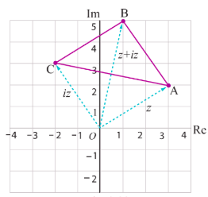
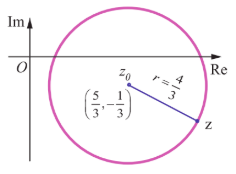

## 2.6 கலப்பெண்களின் வடிவியல் மற்றும் நியமப்பாதை

### (Geometry and Locus of Complex Numbers)

இப்பாடப்பகுதியில் நாம் $z$ என்ற கலப்பெண்ணின் வடிவக் கணித விளக்கத்தையும் கார்டீசியன் வடிவில் $z$ -ன் நியமப்பாதையையும் காணலாம்.

### எடுத்துக்காட்டு 2.18

$z = 3 + 2i$ எனக்கொண்டு $z$, $iz$, மற்றும் $z + iz$ ஆகியவற்றை ஆர்கண்ட் தளத்தில் குறிக்க. இக்கலப்பெண்கள் ஓர் இரு சமபக்க செங்கோண முக்கோணத்தின் பக்கங்களாக அமையும் என நிறுவுக.

### தீர்வு

கொடுக்கப்பட்டவை: $z = 3 + 2i$.

ஆகவே, $iz = i(3 + 2i) = -2 + 3i$.

$z + iz = (3 + 2i) + i(3 + 2i) = 1 + 5i$.

$z$, $z + iz$, மற்றும் $iz$ ஆகியவை முறையே $A, B$, மற்றும் $C$ என்க.

$$AB^2 = |(z + iz) - z|^2 = |-2 + 3i|^2 = 13$$

$$BC^2 = |iz - (z + iz)|^2 = |-3 - 2i|^2 = 13$$

$$CA^2 = |z - iz|^2 = |5 - i|^2 = 26$$

$AB^2 + BC^2 = CA^2$ மற்றும் $AB = BC$, எனவே, $\triangle ABC$ ஓர் இருசமபக்க செங்கோண முக்கோணமாகும்.

**படம் 2.22**
### வரையறை 2.5 (வட்டம்)

ஒரு தளத்தில் நிலையான புள்ளிக்கும் நகரும் புள்ளிக்கும் இடைப்பட்ட தூரம் எப்பொழுதும் மாறிலியாக இருக்குமாறு நகரும் புள்ளியின் நியமப்பாதை ஒரு வட்டம் என வரையறுக்கப்படுகிறது. நிலையான புள்ளி வட்டத்தின் மையம் மற்றும் மாறிலி தொலைவு வட்டத்தின் ஆரம் ஆகும்.

### வட்டத்தின் சமன்பாடு கலப்பெண் வடிவில் (Equation of Complex Form of a Circle)

$z$ -ன் நியமப்பாதை $|z - z_0| = r$ என்ற சமன்பாட்டை நிறைவு செய்கின்றது. இங்கு $z_0$ என்பது நிலையான புள்ளி மற்றும் $r$ என்பது மிகை மாறிலி. இச்சமன்பாடு $z_0$ -லிருந்து $z$ -க்கு $r$ தூரமுள்ள எல்லா கலப்பு எண்களையும் கொண்டிருக்கும்.

எனவே, $|z - z_0| = r$ என்பது கலப்பெண் வடிவில் வட்டத்தின் சமன்பாடு ஆகும். (படம் 2.23-ஐ பார்க்க)

(i) $|z - z_0| < r$ ஆனது வட்டத்தின் உள்ள்பகுதியில் உள்ள புள்ளிகளைக் குறிக்கிறது.

(ii) $|z - z_0| > r$ ஆனது வட்டத்தின் வெளிப்பகுதியில் உள்ள புள்ளிகளைக் குறிக்கிறது.

**படம் 2.23**
### விளக்க எடுத்துக்காட்டு 2.3

$$|z| = r \Rightarrow \sqrt{x^2 + y^2} = r$$

$$\Rightarrow x^2 + y^2 = r^2,$$

என்பது ஆதியை மையமாகவும் $r$ அலகு ஆரம் கொண்ட வட்டத்தைக் குறிக்கிறது.

### எடுத்துக்காட்டு 2.19

$|3z - 5 + i| = 4$ என்ற சமன்பாடு வட்டத்தைக் குறிக்கிறது எனக்காட்டுக. மேலும் இதன் மையம் மற்றும் ஆரத்தைக் காண்க.

### தீர்வு

$|3z - 5 + i| = 4$ என்ற சமன்பாட்டை

$$3\left|z - \frac{5}{3} + \frac{i}{3}\right| = 4 \Rightarrow \left|z - \left(\frac{5}{3} - \frac{i}{3}\right)\right| = \frac{4}{3}$$

என எழுதலாம்.

இது $|z - z_0| = r$ என்ற வடிவில் உள்ளது. ஆகவே இது வட்டத்தைக் குறிக்கின்றது. இதன் மையம் மற்றும் ஆரம் ஆகியவை முறையே $\left(\frac{5}{3}, -\frac{1}{3}\right)$ மற்றும் $\frac{4}{3}$ ஆகும்.

**படம் 2.24**

### எடுத்துக்காட்டு 2.20

$|z + 2 - i| < 2$ என்பது ஒரு வட்டத்தின் உள்பகுதியில் உள்ள புள்ளிகளைக் குறிக்கும் என காட்டுக. அவ்வட்டத்தின் மையம் மற்றும் ஆரத்தைக் காண்க.

### தீர்வு

$|z + 2 - i| = 2$ என்ற சமன்பாட்டை கருதுக. இதனை

$$|z - (-2 + i)| = 2$$

என எழுதலாம்.

இச்சமன்பாடு $z_0 = -2 + i$ மற்றும் ஆரம் $r = 2$ உள்ள வட்டத்தைக் குறிக்கிறது. ஆகவே $|z + 2 - i| < 2$ என்பது மையம் $-2 + i$ மற்றும் ஆரம் 2 உள்ள வட்டத்தின் உள்பகுதியில் உள்ள புள்ளிகளைக் குறிக்கிறது.

**படம் 2.25**

### எடுத்துக்காட்டு 2.21

பின்வரும் சமன்பாடுகளில் $z$ -ன் நியமப்பாதையை கார்ட்டீசியன் வடிவில் காண்க.

(i) $|z| = |z - i|$  
(ii) $|2z - 3 - i| = 3$

### தீர்வு

(i) $|z| = |z - i|$

$$\Rightarrow |x + iy| = |x + iy - i|$$

$$\Rightarrow \sqrt{x^2 + y^2} = \sqrt{x^2 + (y - 1)^2}$$

$$\Rightarrow x^2 + y^2 = x^2 + y^2 - 2y + 1$$

$$\Rightarrow 2y - 1 = 0.$$

(ii) $|2z - 3 - i| = 3$

$$|2(x + iy) - 3 - i| = 3$$

$$|(2x - 3) + i(2y - 1)| = 3.$$

இருபுறமும் வர்க்கப்படுத்த,

$$(2x - 3)^2 + (2y - 1)^2 = 9$$

$$\Rightarrow 4x^2 - 12x + 9 + 4y^2 - 4y + 1 = 9$$

$$\Rightarrow 4x^2 + 4y^2 - 12x - 4y + 1 = 0,$$

என்பது கார்ட்டீசியன் வடிவில் $z$ -ன் நியமப்பாதை ஆகும்.

### பயிற்சி 2.6

1. $z = x + iy$ என்ற ஏதேனும் ஒரு கலப்பெண் $\left| \frac{z - 4i}{z + 4i} \right| = 1$ எனுமாறு அமைந்ததால் $z$ -ன் நியமப்பாதை மெய் அச்சு எனக் காட்டுக.

2. $z = x + iy$ என்ற ஏதேனும் ஒரு கலப்பெண் $\text{Im}\left( \frac{2z + 1}{iz + 1} \right) = 0$ எனுமாறு அமைந்ததால் $z$ -ன் நியமப்பாதை $2x^2 + 2y^2 + x - 2y = 0$ எனக் காட்டுக.

3. பின்வரும் சமன்பாடுகளில் $z = x + iy$ -ன் நியமப்பாதையை கார்ட்டீசியன் வடிவில் காண்க.

   (i) $[\text{Re}(iz)]^2 = 3$  
   (ii) $\text{Im}[(1 - i)z + 1] = 0$  
   (iii) $|z + i| = |z - 1|$  
   (iv) $\overline{z} = z^{-1}$.

4. பின்வரும் சமன்பாடுகள் வட்டத்தை குறிக்கிறது என காட்டுக. மேலும் இதன் மையம் மற்றும் ஆரத்தைக் காண்க.

   (i) $|z - 2 - i| = 3$  
   (ii) $|2z + 2 - 4i| = 2$  
   (iii) $|3z - 6 + 12i| = 8$.

5. பின்வரும் சமன்பாடுகளில் $z = x + iy$ -ன் நியமப்பாதையை கார்டீசியன் வடிவில் காண்க.

   (i) $|z - 4| = 16$  
   (ii) $|z - 4|^2 - |z - 1|^2 = 16$.
