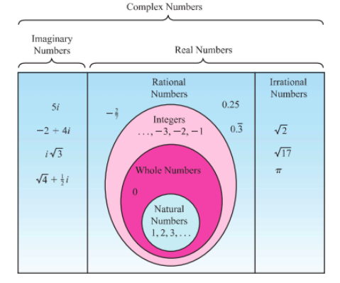

### 2.1 கலப்பெண்கள் அறிமுகம் (Introduction to Complex Numbers)  

கலப்பெண்களை அறிமுகப்படுத்துவதற்கு முன்பாக முதலில் "வர்க்கப்படுத்தும் போது குறை  
என்ன கிடைக்கும் வகையில் ஏதேனும் ஒரு மேல் எண் உள்ளது?" என்ற கேள்விக்கு விடையளிக்க  
முயல்வேண்டும். இதற்கு விடையளிக்க கீழ்க்கண்ட சமன்பாடுகளைக் கருதுக.  

| சமன்பாடு 1 | சமன்பாடு 2 |
|---|---|
| $x^2 - 1 = 0$ | $x^2 + 1 = 0$ |
| $x = \pm \sqrt{1}$ | $x = \pm \sqrt{-1}$ |
| $x = \pm 1$ | $x = \pm i$ |
# சமன்பாடு
1-க்கு $ x = -1 $ மற்றும் $ x = 1 $ என்ற இரண்டு மேல் எண் தீர்வுகள் உள்ளன. இச்சமன்பாடு மேல் தீர்ப்பது எண்பதும் $ f(x) = x^2 - 1 $ என்ற வளைவரையின் $ x $ வெட்டுத்துண்டுகளை காண்பதும் ஒன்றுதான் எண் முக்குத் தெரியும். இந்த வளைவரை $ x $ -அச்சை $ (-1, 0) $ மற்றும் $ (1, 0) $ ஆகிய புள்ளிகளில் வெட்டுகிறது.

மேல் 2.1

மேல் 2.2
இதே வாதத்தின் அடிப்படையில் சமன்பாடு 2-க்கு மேல் எண் தீர்வுகள் இல்லை. ஏனெனில், $ f(x) = x^2 + 1 $ என்ற வளைவரையின் வைரபடத்திலிருந்து, இது $ x $ -அச்சை வெட்டாது எண்பதைக் காணலாம்.

இதற்கான காரணம் எண் வென்றால், ஒரு மேல் எண்ணை வர்க்கப்படுத்தி ஒரு குறை எண்ணைப் பெறுவது எண்பது இயலாத காரியமாகும். சமன்பாடு 2-க்கு தீர்வு இருக்க வேண்டுமானால், வர்க்கப்படுத்தினால் $ -1 $ வருமாறு ஒரு கற்பனை எண்ணை உருவாக்க வேண்டும். $ \sqrt{-1} $ எண்பதைக் கற்பனை அலகு $ i $ எனக்குறிப்பிடுகின்றோம். இதிலிருந்து $ i^2 = -1 $ என்ப பெறலாம். இந்த உண்மையைப் பயன்படுத்தி கற்பனை எண் $ i $ -ன் அடுக்குகளின் மதிப்புகளைப் பெறலாம்.

## 2.1.1 கற்பனை அலகு $ i $-இன் அடுக்குகள் (Powers of imaginary unit $ i $)
| $i^0 = 1$, $i^1 = i$ | $i^2 = -1$ | $i^3 = i^2 i = -i$ | $i^4 = i^2 i^2 = 1$ |
|---|---|---|---|
| $(i)^{-1} = \frac{1}{i} = \frac{i}{i^2} = -i$ | $(i)^{-2} = -1$ | $(i)^{-3} = i$ | $(i)^{-4} = 1 = i^4$ |

இதிலிருந்து $ n $-ஒரு முழு எண் எணில், $ i^n $ -க்கு நான்கு வெவ்வேறான மதிப்புகள் மட்டுமே உள்ளது எண்பதை அறியலாம். இம்மதிப்புகளானது $ n $-ஒரு 4-ஆல் வகுப்பதால் கிடைக்கும் மீதிகள் 0, 1, 2, மற்றும் 3 ஆகியவற்றை பெருத்து அமைக்கிறது. முழு எண் $ n $ ஆனது $ n \leq 4 $ மற்றும் $ n \geq 4 $, ஆக இருக்கும் போது, வகுத்தல் கொள்கையின்படி $ n = 4q + k, \, 0 \leq k < 4 $, இங்கு $ k $ மற்றும் $ q $ ஆனது ஆகியவை முழு எண்கள். இதிலிருந்து

$$(i)^n = (i)^{4q+k} = (i)^{4q} (i)^k = (i)^4 (i)^k = (i)^4 (i)^k = (i)^4$$

## எடுத்துக்காட்டு 2.1

கீழ்க்காண்பவைகளை சுருக்குக.

(i) $ i^7 $ (ii) $ i^{1729} $ (iii) $ i^{-1924} + i^{2018} $ (iv) $ \sum_{n=1}^{102} i^n $ (v) $ i^2 i^3 \cdots i^{40} $

## தீர்வு

(i) $ (i)^7 = (i)^{4 \cdot 3} = (i)^3 = -i $ (ii) $ i^{1729} = i^{1728} i = i $

(iii) $(i)^{1924} + (i)^{2018} = (i)^{1924+0} + (i)^{2016+2} = (i)^0 + (i)^2 = 1 - 1 = 0$

(iv) $$ \sum_{n=1}^{\infty} i^n = (i^1 + i^2 + i^3 + i^4) + (i^5 + i^6 + i^7 + i^8) + \cdots + (i^{97} + i^{98} + i^{99} + i^{100}) + i^{101} + i^{102} $$

$$ = (i^1 + i^2 + i^3 + i^4) + (i^1 + i^2 + i^3 + i^4) + \cdots + (i^1 + i^2 + i^3 + i^4) + i^1 + i^2 $$

$$ = \{i + (-1) + (-i) + 1\} + \{i + (-1) + (-i) + 1\} + \cdots + \{i + (-1) + (-i) + 1\} + i + (-1) $$

$$ = 0 + 0 + \cdots + 0 + i - 1 = -1 + i $$ (இது எண்ணை என்?)

(v) $$ i^2 i^3 \cdots i^{40} = i^{1+2+3+\cdots+40} = i^{\frac{40 \times 41}{2}} = i^{20} = i^0 = 1. $$

முடிவு: i-ன் நான்கு தொடர்ச்சியான அடுக்குகளின் கூடுதல் பூச்சியமாகும். $$ i^2 + i^{2+1} + i^{2+2} + i^{2+3} = 0 $$

குறிப்பு:

(i) $$ \sqrt{ab} = \sqrt{a} \sqrt{b} $$ என்பது $$ a, b $$ ஆகியவற்றில் குறைந்தபட்சம் ஒன்றாவது குறையற்றதாக இருந்தால் மட்டும் உண்மை ஆகும்.

உதாரணமாக, $$ 6 = \sqrt{36} = \sqrt{(-4)(-9)} = \sqrt{(-4)(-9)} = (2i)(3i) = 6i^2 = -6 $$ என்ற முன்னாளாக இருந்தால் மட்டுமே உண்மை ஆகும்.

(ii) $$ y \in \mathbb{R} - \text{கீழ் } y^2 \geq 0. $$

ஆகவே, $$ \sqrt{(-1)(y^2)} = \sqrt{(y^2)(-1)} $$

$$ \sqrt{(-1)(y^2)} = \sqrt{(y^2)(-i)} $$

$$ iy = yi. $$

## பயிற்சி 2.1

மின்வருவனவற்றை சுருக்குக:

1. $$ i^{1947} + i^{1950} $$

2. $$ i^{1948} - i^{-1869} $$

3. $$ \sum_{n=1}^{12} i^n $$

4. $$ i^{59} + \frac{1}{i^{59}} $$

5. $$ i^{2i} i^{3} \cdots i^{2000} $$

6. $$ \sum_{n=1}^{10} i^{n-50} $$
