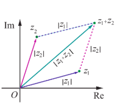
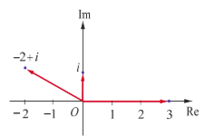

## 2.5 ஒரு கல்பிடியைவின் மட்டு மதிப்பு

### (Modulus of a Complex Number)

மேல் எண் நேர்க்கோட்டில் மட்டு மதிப்பு எண்பது எவ்வாறு ஆதிக்கும் அந்த எண்ணும் உள்ள தொலைவை குறிக்கிறதோ அதுபொலவே, ஒரு கல்பிடியைவின் மட்டு எண்பது கல்பெண் தளத்தில் ஆதிக்கும் அந்த எண்ணுக்கும் உள்ள தொலைவை குறிக்கின்றது. ஆதியிலிருந்து ஆராயின் திசையில் $ z = x + iy $ -க்கு உள்ள தொலைவு எண்பது, ஒரு பக்கம் $ x $ மற்றும் மறுபக்கம் $ y $ ஆகக் கொண்டு அமைக்கப்படும் செங்கோண முக்கோணத்தின் காணத்தின் நீளத்திற்கு சமமாகும். 

படம் 2.16

##### வரையறை 2.4

$ z = x + iy $ எனில் $ z $ -ன் மட்டு மதிப்பினை |z| என குறிப்பிடுகின்றோம். இதைன |z| = $ \sqrt{x^2 + y^2} $ என வரையறுப்போம்.

உதாரணமாக 

(i) $ |i| = \sqrt{0^2 + 1^2} = 1 $

(ii) $ |-12i| = \sqrt{0^2 + (-12)^2} = 12 $

(iii) $ |12 - 5i| = \sqrt{12^2 + (-5)^2} = \sqrt{169} = 13 $

### குறிப்பு

$ z = x + iy $ எனில் $ \bar{z} = x - iy $, மேலும் $ z \bar{z} = (x + iy)(x - iy) = (x^2 - (iy)^2) = x^2 + y^2 = |z|^2 $.

$ |z|^2 = z \bar{z} $.

### 2.5.1 ஒரு கல்பிடியைவின் மட்டுக்களை பண்புகள்

#### (Properties of Modulus of a complex number)

1.$ |z| = |\bar{z}| $  

2.$ |z_1 + z_2| \leq |z_1| + |z_2| $ (முக்கோணச் சமனில்)  

3.$ |z_1 z_2| = |z_1||z_2| $  

4.$ |z_1 - z_2| \geq ||z_1| - |z_2|| $  
   

5.$ \frac{|z_1|}{|z_2|} = \frac{|z_1|}{|z_2|}, \ z_2 \neq 0 $

6.$ |z^n| = |z|^n $, இங்கு $ n $ ஒரு முழு எண்

7.$ \text{Re}(z) \leq |z| $

8.$ \text{Im}(z) \leq |z| $

இவற்றில் சில பண்புகளை நாம் நிறுவுவோம்.

### பண்பு (முக்கோண சமனில் - Triangle inequality)

$ z_1 $ மற்றும் $ z_2 $ என்ற எதிர்காலம் இரு கல்பிடியைக்குக் $ |z_1 + z_2| \leq |z_1| + |z_2| $ என பிறரும்.

### தீர்ப்பை

$$|z_1 + z_2|^2 = (z_1 + z_2)(\bar{z_1} + \bar{z_2})$$

$$= (z_1 + z_2)(\bar{z_1} + \bar{z}_2)$$

$$= z_1\bar{z_1} + (z_1\bar{z_2} + \bar{z_1}z_2) + z_2\bar{z_2}$$

$$= z_1\bar{z_1} + (z_1\bar{z_2} + \bar{z_1}z_2) + z_2\bar{z_2}$$

$$= z_1\bar{z_1} + z_2\bar{z_2}$$

$$= |z|^2 = z \bar{z}$$

$$= \text{Re}(z) \leq |z|$$

$$= \text{Im}(z) \leq |z|$$

$$= |z_1|^2 + 2 \text{Re}(z_1 \overline{z_2}) + |z_2|^2$$

$$\leq |z_1|^2 + 2 |z_1 \overline{z_2}| + |z_2|^2$$

$$= |z_1|^2 + 2 |z_1| |z_2| + |z_2|^2$$

$$\Rightarrow |z_1 + z_2|^2 \leq \left( |z_1| + |z_2| \right)^2$$

$$\Rightarrow |z_1 + z_2| \leq |z_1| + |z_2|.$$

#### வடிவக் கணித விளக்கம் (Geometrical interpretation)

நாம் இப்பொழுது $Oz$, $1$ அல்லது $z_2$, மற்றும் $z_1 + z_2$ ஆகியவற்றை
முனைப்புள்ளிகளாகக் கொண்ட முக்கோணத்தை கருதுவோம்.
வடிவியல் வாயிலாக $z_1 + z_2$ உடன் தொடர்புடைய முக்கோணத்தின்
பக்கம் மீதமுள்ள இரண்டு பக்கங்களின் நீளங்களின் கூடுதலை விட
அதிகமாக இருக்காது என நாம் அறிவோம். இதனால் தான் இந்த
பண்பினை "முக்கோண சமனிலி" என்கிறோம். இதனை கணிதத்
தொகுத்தறிதலைக் கொண்டு முடிவுற்ற எண்ணிக்கையிலான
கலப்பெண்களுக்கும் இதனை விரிவுபடுத்தலாம்.
$$|z_1 + z_2 + z_3 + \cdots + z_n| \leq |z_1| + |z_2| + |z_3| + \cdots + |z_n|$$

இங்கு $n = 2, 3, \ldots$.

**படம் 2.17**

பண்பு $z_1$ மற்றும் $z_2$ என்ற கலப்பெண்களுக்கு இடைப்பட்ட தூரம் கலப்பெண் தளத்தில் $|z_1 - z_2|$ ஆகும்.

$z_1 = x_1 + iy_1$ மற்றும் $z_2 = x_2 + iy_2$ எனில்

$$|z_1 - z_2| = \sqrt{(x_1 - x_2)^2 + (y_1 - y_2)^2}.$$

#### மேற்குறிப்பு

$z_1$ மற்றும் $z_2$ என்ற இரு கலப்பெண்களுக்கு இடைப்பட்ட தூரம் $|z_1 - z_2|$ ஆகும்.

இதுபோலவே ஆதி, $z_1$, மற்றும் $z_2$ ஆகியவற்றை முனைப்புள்ளிகளாக கொண்ட முக்கோணத்தில் மேற்கூறிய வழிமுறையின் படி,

$$|z_1 - z_2| \leq |z_1| + |z_2|$$

$$|z_1| - |z_2| \leq |z_1 + z_2| \leq |z_1| + |z_2|.$$

மற்றும்

$$|z_1| - |z_2| \leq |z_1 - z_2| \leq |z_1| + |z_2|.$$

**படம் 2.18**

##### பண்பு

பெருக்கலின் எண்ணளவு என்பது எண்ணளவுகளின் பெருக்கல் பலனுக்குச் சமம் ஆகும்.

$z_1$ மற்றும் $z_2$ என்ற ஏதேனும் இரண்டு கலப்பெண்களுக்கு $|z_1 z_2| = |z_1||z_2|$ ஆகும்.

##### நிரூபணம்

$$|z_1 z_2|^2 = (z_1 z_2)(\overline{z_1 z_2}) \quad (\because |z|^2 = z\overline{z})$$

$$= (z_1 z_2)(\overline{z_1} \overline{z_2}) \quad (\because \overline{z_1 z_2} = \overline{z_1} \overline{z_2})$$

$$= (z_1 \overline{z_1})(z_2 \overline{z_2}) = |z_1|^2 |z_2|^2 \quad (\text{பரிமாற்றுப் பண்புப்படி } z_1 \overline{z_2} = \overline{z_1} z_2)$$

ஆகவே, $|z_1 z_2| = |z_1||z_2|$.

##### குறிப்பு

கணிதத் தொகுத்தறிதல் மூலம் இதனை முடிவுற்ற எண்ணிக்கையிலான கலப்பெண்களுக்கும் இதனை விரிவுபடுத்தலாம்:

$$|z_1 z_2 z_3 \cdots z_n| = |z_1||z_2||z_3|\cdots|z_n|$$

அதாவது கலப்பெண்களின் பெருக்கற் பலனின் மட்டு மதிப்பு என்பது அக்கலப்பெண்களின் மட்டுகளின் பெருக்கலுக்கு சமம் ஆகும்.

இதுபோலவே கலப்பெண்களின் மட்டுகளின் மீதான மற்ற பண்புகளையும் நிறுவலாம்.

#### எடுத்துக்காட்டு 2.9

$z_1 = 3 + 4i$, $z_2 = 5 - 12i$, மற்றும் $z_3 = 6 + 8i$ எனில் $|z_1|$, $|z_2|$, $|z_3|$, $|z_1 + z_2|$, $|z_2 - z_3|$, மற்றும் $|z_1 + z_3|$ ஆகியவற்றின் மதிப்புகளைக் காண்க.

#### தீர்வு

$$|z_1| = |3 + 4i| = \sqrt{3^2 + 4^2} = 5$$

$$|z_2| = |5 - 12i| = \sqrt{5^2 + (-12)^2} = 13$$

$$|z_3| = |6 + 8i| = \sqrt{6^2 + 8^2} = 10$$

$$|z_1 + z_2| = |(3 + 4i) + (5 - 12i)| = |8 - 8i| = \sqrt{128} = 8\sqrt{2}$$

$$|z_2 - z_3| = |(5 - 12i) - (6 + 8i)| = |-1 - 20i| = \sqrt{401}$$

$$|z_1 + z_3| = |(3 + 4i) + (6 + 8i)| = |9 + 12i| = \sqrt{225} = 15$$

எல்லா வகைகளிலும் முக்கோணச் சமனிலி நிறைவு செய்யப்பட்டுள்ளது என்பதைக் காண்க.

$$|z_1 + z_3| = |z_1| + |z_3| = 15 \quad (\text{ஏன்?})$$

#### எடுத்துக்காட்டு 2.10

கீழ்க்காண்பவைகளின் மதிப்புகளைக் காண்க.

(i) $$\left| \frac{2 + i}{-1 + 2i} \right|$$

(ii) $$|(1 + i)(2 + 3i)(4i - 3)|$$

(iii) $$\left| \frac{i(2 + i)^3}{(1 + i)^2} \right|$$

#### தீர்வு

(i) $$\left| \frac{2 + i}{-1 + 2i} \right| = \frac{|2 + i|}{|-1 + 2i|} = \frac{\sqrt{2^2 + 1^2}}{\sqrt{(-1)^2 + 2^2}} = 1. \quad \left( \because \left| \frac{z_1}{z_2} \right| = \frac{|z_1|}{|z_2|}, \quad z_2 \neq 0 \right)$$

(ii) $$|(1 + i)(2 + 3i)(4i - 3)| = |1 + i||2 + 3i||4i - 3| \quad (\because |z_1 z_2 z_3| = |z_1||z_2||z_3|)$$

$$= |1 + i||2 + 3i||-3 + 4i| \quad (\because |z| = |\overline{z}|)$$

$$= \sqrt{1^2 + 1^2} \sqrt{2^2 + 3^2} \sqrt{(-3)^2 + 4^2} = \sqrt{2} \sqrt{13} \sqrt{25} = 5\sqrt{26}.$$

(iii) $$\left| \frac{i(2 + i)^3}{(1 + i)^2} \right| = \frac{|i||2 + i|^3}{|1 + i|^2} \quad \left( \because \left| \frac{z_1}{z_2} \right| = \frac{|z_1|}{|z_2|}, \quad z_2 \neq 0 \right)$$

$$= \frac{1 \cdot (\sqrt{2^2 + 1^2})^3}{(\sqrt{1^2 + 1^2})^2} = \frac{(\sqrt{5})^3}{(\sqrt{2})^2} = \frac{5\sqrt{5}}{2}.$$

#### எடுத்துக்காட்டு 2.11

$i$, $-2+i$, மற்றும் $3$ ஆகியவற்றில் எந்த கலப்பெண் ஆதியிலிருந்து அதிக தொலைவில் உள்ளது?

#### தீர்வு

$z = i$, $z = -2+i$, மற்றும் $z = 3$ ஆகியவற்றிற்கும் ஆதிக்கும் உள்ள தொலைவுகள்

$$|z| = |i| = 1$$

$$|z| = |-2+i| = \sqrt{(-2)^2 + 1^2} = \sqrt{5}$$

$$|z| = |3| = 3$$

$1 < \sqrt{5} < 3$ எனவே, ஆதியிலிருந்து அதிக தொலைவில் உள்ள கலப்பெண் $3$ ஆகும்.

**படம் 2.19**

#### எடுத்துக்காட்டு 2.12

$z_1$, $z_2$, மற்றும் $z_3$ ஆகிய கலப்பெண்கள் $|z_1| = |z_2| = |z_3| = |z_1 + z_2 + z_3| = 1$ என்றவாறு இருந்தால்,

$$\left| \frac{1}{z_1} + \frac{1}{z_2} + \frac{1}{z_3} \right|$$

-ன் மதிப்பைக் காண்க.

#### தீர்வு

$|z_1| = |z_2| = |z_3| = 1$ எனக் கொடுக்கப்பட்டுள்ளது.

எனவே, $|z_1|^2 = 1 \Rightarrow z_1 \overline{z_1} = 1$, $|z_2|^2 = 1 \Rightarrow z_2 \overline{z_2} = 1$, மற்றும் $|z_3|^2 = 1 \Rightarrow z_3 \overline{z_3} = 1$.

ஆகவே, $\overline{z_1} = \frac{1}{z_1}$, $\overline{z_2} = \frac{1}{z_2}$, மற்றும் $\overline{z_3} = \frac{1}{z_3}$.

மேலும்,

$$\left| \frac{1}{z_1} + \frac{1}{z_2} + \frac{1}{z_3} \right| = \left| \overline{z_1} + \overline{z_2} + \overline{z_3} \right| = |z_1 + z_2 + z_3| = 1.$$
#### எடுத்துக்காட்டு 2.13

$|z| = 2$ எனில் $3 \leq |z + 3 + 4i| \leq 7$ எனக் காட்டுக.

#### தீர்வு

$$|z + 3 + 4i| \leq |z| + |3 + 4i| = 2 + 5 = 7$$

$$|z + 3 + 4i| \leq 7 \tag{1}$$

$$|z + 3 + 4i| \geq ||z| - |3 + 4i|| = |2 - 5| = 3$$

$$|z + 3 + 4i| \geq 3 \tag{2}$$

(1) மற்றும் (2)-லிருந்து $3 \leq |z + 3 + 4i| \leq 7$.

**படம் 2.20**

#### குறிப்பு

கீழ் மற்றும் மேல் எல்லை மதிப்புகளைக் காண $||z_1| - |z_2|| \leq |z_1 + z_2| \leq |z_1| + |z_2|$ என்ற பண்பை பயன்படுத்த வேண்டும்.

#### எடுத்துக்காட்டு 2.14

$1$, $-\frac{1}{2} + i\frac{\sqrt{3}}{2}$, மற்றும் $-\frac{1}{2} - i\frac{\sqrt{3}}{2}$ என்ற புள்ளிகள் ஒரு சமபக்க முக்கோணத்தின் முனைப்புள்ளிகளாக அமையும் என நிறுவுக.

#### தீர்வு

இதற்கு நாம் முக்கோணத்தின் பக்கங்களின் நீளங்கள் சமம் என நிறுவினால் போதும்.

$z_1 = 1$, $z_2 = -\frac{1}{2} + i\frac{\sqrt{3}}{2}$, மற்றும் $z_3 = -\frac{1}{2} - i\frac{\sqrt{3}}{2}$ என்க.

முக்கோணத்தின் பக்கங்களின் நீளங்களை காண்போம்:

$$|z_1 - z_2| = \left|1 - \left(-\frac{1}{2} + i\frac{\sqrt{3}}{2}\right)\right| = \left|\frac{3}{2} - i\frac{\sqrt{3}}{2}\right| = \sqrt{\frac{9}{4} + \frac{3}{4}} = \sqrt{3}$$

$$|z_2 - z_3| = \left|\left(-\frac{1}{2} + i\frac{\sqrt{3}}{2}\right) - \left(-\frac{1}{2} - i\frac{\sqrt{3}}{2}\right)\right| = |i\sqrt{3}| = \sqrt{3}$$

$$|z_3 - z_1| = \left|\left(-\frac{1}{2} - i\frac{\sqrt{3}}{2}\right) - 1\right| = \left|-\frac{3}{2} - i\frac{\sqrt{3}}{2}\right| = \sqrt{\frac{9}{4} + \frac{3}{4}} = \sqrt{3}$$

பக்கங்களின் நீளங்கள் சமம் எனவே, கொடுக்கப்பட்ட புள்ளிகள் ஒரு சமபக்க முக்கோணத்தை அமைக்கும்.

**படம் 2.21**

### எடுத்துக்காட்டு 2.15

$z_1, z_2$, மற்றும் $z_3$ என்ற கலப்பெண்கள் $|z_1| = |z_2| = |z_3| = r > 0$ மற்றும் $z_1 + z_2 + z_3 \neq 0$ எனவும் இருந்தால்

$$\left| \frac{z_1 z_2 + z_2 z_3 + z_3 z_1}{z_1 + z_2 + z_3} \right| = r$$

என நிறுவுக.

### தீர்வு

$|z_1| = |z_2| = |z_3| = r$ என கொடுக்கப்பட்டுள்ளது.

$\Rightarrow z_1 \overline{z_1} = z_2 \overline{z_2} = z_3 \overline{z_3} = r^2$

$\Rightarrow z_1 = \frac{r^2}{\overline{z_1}}, \quad z_2 = \frac{r^2}{\overline{z_2}}, \quad z_3 = \frac{r^2}{\overline{z_3}}$

ஆகவே,

$$z_1 + z_2 + z_3 = \frac{r^2}{\overline{z_1}} + \frac{r^2}{\overline{z_2}} + \frac{r^2}{\overline{z_3}}$$

$$= r^2 \left( \frac{\overline{z_2} \overline{z_3} + \overline{z_1} \overline{z_3} + \overline{z_1} \overline{z_2}}{\overline{z_1} \overline{z_2} \overline{z_3}} \right) \quad (\because \overline{z_1} + \overline{z_2} = \overline{z_1 + z_2})$$

$$= r^2 \left( \frac{z_2 z_3 + z_1 z_3 + z_1 z_2}{|z_1||z_2||z_3|} \right) \quad (\because |z| = |\overline{z}| \text{ மற்றும் } |z_1 z_2 z_3| = |z_1||z_2||z_3|)$$

$$|z_1 + z_2 + z_3| = r^2 \frac{|z_2 z_3 + z_1 z_3 + z_1 z_2|}{r^3} = \frac{|z_2 z_3 + z_1 z_3 + z_1 z_2|}{r}$$

$$\Rightarrow \frac{z_2 z_3 + z_1 z_3 + z_1 z_2}{z_1 + z_2 + z_3} = r. \quad (\text{கொடுக்கப்பட்டதன் படி } z_1 + z_2 + z_3 \neq 0)$$

எனவே, $$\left| \frac{z_1 z_2 + z_2 z_3 + z_3 z_1}{z_1 + z_2 + z_3} \right| = r.$$

### எடுத்துக்காட்டு 2.16

$z^2 = \overline{z}$ என்ற சமன்பாட்டிற்கு நான்கு மூலங்கள் இருக்கும் என நிறுவுக.

### தீர்வு

$z^2 = \overline{z}$ என கொடுக்கப்பட்டுள்ளது.

$$\Rightarrow |z|^2 = |z|$$

$$\Rightarrow |z|(|z| - 1) = 0$$

$$\Rightarrow |z| = 0, \text{ அல்லது } |z| = 1.$$

$|z| = 0 \Rightarrow z = 0$ என்பது ஒரு தீர்வு, $|z| = 1 \Rightarrow z\overline{z} = 1 \Rightarrow \overline{z} = \frac{1}{z}$.

கொடுக்கப்பட்டதிலிருந்து $z^2 = \overline{z} \Rightarrow z^2 = \frac{1}{z} \Rightarrow z^3 = 1$.

இதற்கு 3 பூஜ்ஜியமற்ற தீர்வுகள் இருக்கும். ஆகவே பூஜ்ஜியத்தையும் சேர்த்து இதற்கு நான்கு தீர்வுகள் இருக்கும்.

### 2.5.2 ஒரு கலப்பெண்ணின் வர்க்கமூலம் (Square roots of a complex number)

$a + ib$ -ன் வர்க்கமூலம் $x + iy$ என்க.

அதாவது $\sqrt{a + ib} = x + iy$, இங்கு $x, y \in \mathbb{R}$.

$$a + ib = (x + iy)^2 = x^2 - y^2 + i2xy$$

மெய் மற்றும் கற்பனைப் பகுதிகளைச் சமப்படுத்த,

$$x^2 - y^2 = a \quad \text{மற்றும்} \quad 2xy = b.$$

$$(x^2 + y^2)^2 = (x^2 - y^2)^2 + 4x^2y^2 = a^2 + b^2.$$

$x^2 + y^2$ மிகை ஆகையால் $x^2 + y^2 = \sqrt{a^2 + b^2}$.

$x^2 - y^2 = a$ மற்றும் $x^2 + y^2 = \sqrt{a^2 + b^2}$ ஆகியவற்றைத் தீர்க்க,

$$x = \pm \sqrt{\frac{\sqrt{a^2 + b^2} + a}{2}}, \quad y = \pm \sqrt{\frac{\sqrt{a^2 + b^2} - a}{2}}.$$

$2xy = b$ என்பதிலிருந்து $b$ மிகை எண் எனில் $x$ மற்றும் $y$ ஆகியவை ஒரே குறியுடையவையாகவும் மற்றும் $b$ குறை எனில் $x$ மற்றும் $y$ ஆகியவை வெவ்வேறு குறியுடையவையாகவும் இருக்கும்.

ஆகவே,

$$\sqrt{a + ib} = \pm \left( \sqrt{\frac{|z| + a}{2}} + i \frac{b}{|b|} \sqrt{\frac{|z| - a}{2}} \right), \quad \text{இங்கு } b \neq 0. \quad (\because \text{Re}(z) \leq |z|)$$

### ஒரு கலப்பெண்ணின் வர்க்கமூலம் காண சூத்திரம்

$$\sqrt{a + ib} = \pm \left( \sqrt{\frac{|z| + a}{2}} + i \frac{b}{|b|} \sqrt{\frac{|z| - a}{2}} \right), \quad \text{இங்கு } z = a + ib \text{ மற்றும் } b \neq 0.$$

### குறிப்பு

$b$ குறை எனில், $\frac{b}{|b|} = -1$, $x$ மற்றும் $y$ ஆகியவை வெவ்வேறு குறியுடையவை.

$b$ மிகை எனில், $\frac{b}{|b|} = 1$, $x$ மற்றும் $y$ ஆகியவை ஒரே குறியுடையவை.

---

### எடுத்துக்காட்டு 2.17

$6 - 8i$ -ன் வர்க்கமூலம் காண்க.

### தீர்வு

$|6 - 8i| = \sqrt{6^2 + (-8)^2} = 10$ மற்றும்

வர்க்கமூலம் காண சூத்திரத்தைப் பயன்படுத்த,

$$\sqrt{6 - 8i} = \pm \left( \sqrt{\frac{10 + 6}{2}} - i \sqrt{\frac{10 - 6}{2}} \right) \quad (\because b \text{ குறை, } \frac{b}{|b|} = -1)$$

$$= \pm \left( \sqrt{8} - i\sqrt{2} \right)$$

$$= \pm \left( 2\sqrt{2} - i\sqrt{2} \right).$$

---

### பயிற்சி 2.5

1. கீழ்க்காணும் கலப்பெண்களின் மட்டு மதிப்பினைக் காண்க.

   (i) $\left| \frac{2i}{3 + 4i} \right|$  
   (ii) $\left| \frac{2 - i}{1 + i} + \frac{1 - 2i}{1 - i} \right|$  
   (iii) $|(1 - i)^{10}|$  
   (iv) $|2i(3 - 4i)(4 - 3i)|$

2. $z_1$ மற்றும் $z_2$ என்ற ஏதேனும் இரு கலப்பெண்களுக்கு $|z_1| = |z_2| = 1$ மற்றும் $z_1 z_2 \neq -1$ எனில்

   $$\frac{z_1 + z_2}{1 + z_1 z_2}$$

   ஓர் மெய் எண் எனக்காட்டுக.

3. $10 - 8i$, $11 + 6i$ ஆகிய புள்ளிகளில் எப்புள்ளி $1 + i$ -க்கு மிக அருகாமையில் இருக்கும்?

4. $|z| = 3$ எனில் $7 \leq |z + 6 - 8i| \leq 13$ எனக்காட்டுக.

5. $|z| = 1$ எனில், $2 \leq |z^2 - 3| \leq 4$ எனக்காட்டுக.

6. $|z| = 2$ எனில், $8 \leq |z + 6 + 8i| \leq 12$ எனக்காட்டுக.

7. $z_1, z_2$, மற்றும் $z_3$ என்ற மூன்று கலப்பெண்கள் $|z_1| = 1, |z_2| = 2, |z_3| = 3$, மற்றும் $|z_1 + z_2 + z_3| = 1$ என்றவாறு உள்ளது எனில் $|9z_1 z_2 + 4z_1 z_3 + z_2 z_3| = 6$ என நிறுவுக.

8. $z, iz$, மற்றும் $z + iz$ ஆகியவற்றை முனைப்புள்ளிகளாகக் கொண்டு அமைக்கப்படும் முக்கோணத்தின் பரப்பு 50 சதுர அலகுகள் எனில், $|z|$ -ன் மதிப்பினைக் காண்க.

9. $z^3 + 2\overline{z} = 0$ என்ற சமன்பாட்டிற்கு ஐந்து தீர்வுகள் இருக்கும் என நிறுவுக.

10. கீழ்க்காண்பவைகளின் வர்க்கமூலம் காண்க: (i) $4 + 3i$ (ii) $-6 + 8i$ (iii) $-5 - 12i$.
