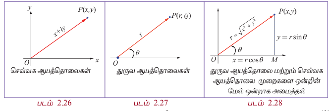
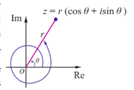
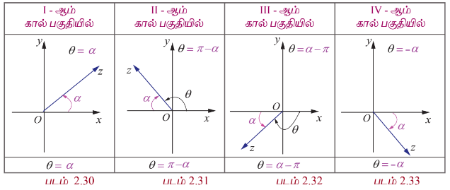
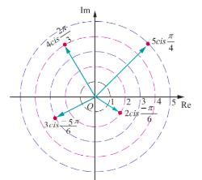
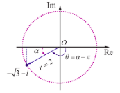
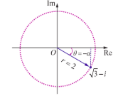
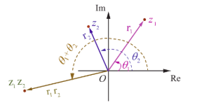
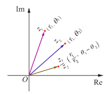

## 2.7 கலப்பு எண்களின் துருவ வடிவம் மற்றும் ஆய்லர் வடிவம்

### (Polar and Euler form of Complex Numbers)

கலப்பெண்களை கூட்டும்போதும் கழிக்கும் போதும் நாம் கலப்பெண்களின் செவ்வக வடிவ ஆயத்தொலைகளை பயன்படுத்துகிறோம். ஏனெனில் இங்கு மெய் மற்றும் கற்பனை பகுதிகளை கூட்டவோ அல்லது கழிக்கவோ மட்டுமே செய்கிறோம். கலப்பெண்களின் பெருக்கல் அல்லது அடுக்குகள் அல்லது மூலங்களைக் காணும் போது துருவ வடிவத்தை பயன்படுத்துகிறோம். ஏனெனில் இது செவ்வக ஆயத்தொலை முறையினைவிட துருவ வடிவில் எளிதாகக் காணலாம்.

### 2.7.1 ஒரு கலப்பெண்ணின் துருவ வடிவம் (Polar form of a complex number)

துருவ ஆயத்தொலை வடிவம் என்பது ஆதியிலிருந்து $z = x + iy$ என்ற புள்ளிவரை உள்ள வெக்டரை அதன் எண் மதிப்பு மற்றும் திசையினை கொண்டு வகைப்படுத்தும் மற்றொரு வடிவம் ஆகும். துருவ ஆயத்தொலை முறையில் $O$ என்ற நிலையான புள்ளியை துருவ புள்ளி எனவும் துருவ புள்ளியிலிருந்து ஆரம்பிக்கும் கிடைமட்ட அரை கோட்டினை ஆரம்பக் கோடு (துருவ அச்சு) எனவும் அழைக்கின்றோம். $r$ என்பது துருவ புள்ளியிலிருந்து $P$ உள்ள தூரம் மற்றும் $\theta$ என்பது ஆரம்பக் கோட்டிலிருந்து $OP$-ன் திசையில் கடிகார எதிர்திசையில் அளக்கப்பட்ட சாய்வுக் கோணம் எனவும் கொண்டால், $(r, \theta)$ வரிசையிட்ட ஜோடியினை $P$-ன் துருவ ஆயத்தொலைகள் எனலாம். துருவ ஆயத்தொலை முறையை செவ்வக ஆயத்தொலை முறையுடன் ஒன்றின் மேல் ஒன்றறாக படத்தில் காட்டியவாறு வைத்தால்,

$$x = r\cos\theta \tag{1}$$  
$$y = r\sin\theta \tag{2}$$

எனப் பெறலாம்.

எந்த ஒரு பூஜ்ஜியமற்ற கலப்பெண் $z = x + iy$ -யையும் $z = r(\cos\theta + i\sin\theta)$ என எழுதலாம்.

### வரையறை 2.6

$r$ மற்றும் $\theta$ ஆகியவை $P(x, y)$ என்ற பூஜ்ஜியமற்ற கலப்பெண் $z = x + iy$ -ன் துருவ ஆயத்தொலைகள் என்க. $P$ என்ற புள்ளியின் துருவ அல்லது முக்கோண வடிவம் என்பது

$$z = r(\cos\theta + i\sin\theta).$$

துருவ வடிவினை வசதிக்காக நாம் $z = x + iy = r(\cos\theta + i\sin\theta) = r \operatorname{cis}\theta$ என எழுதலாம்.

இதில் $r$ என்பது கலப்பெண் $z$ -ன் எண்ணளவு அல்லது மட்டு மதிப்பு ஆகும். $\theta$ என்பது கலப்பெண் $z$ -ன் வீச்சு ஆகும். இதனை $\arg z$ எனக் குறிப்போம்.

(i) $z = 0$ -வுக்கு வீச்சு $\theta$ வரையறுக்கப்படவில்லை. எனவே துருவ ஆயத்தொலை முறையில் $z \neq 0$ என்பதை நினைவில் கொள்ள வேண்டும்.

(ii) $z = x + iy$ என்ற கலப்பெண்ணின் துருவ வடிவம் $(r, \theta)$ எனில் இதன் இணை கலப்பெண் $\overline{z} = x - iy$ -ன் துருவ வடிவம் $(r, -\theta)$ ஆகும்.

(1) மற்றும் (2)-ஐ வர்க்கப்படுத்தி கூட்டி வர்க்கமூலம் காண $r$ கிடைக்கிறது $r = |z| = \sqrt{x^2 + y^2}$.

(2)-ஐ (1)-ஆல் வகுக்க, $\frac{r\sin\theta}{r\cos\theta} = \frac{y}{x} \Rightarrow \tan\theta = \frac{y}{x}$.

### நிலை (i)

$z$-ஐ வெக்டராகக் கருதும்போது மெய் எண் $\theta$ என்பது $z$ ஆனது மிகை மெய் அச்சுடன் ஏற்படுத்தும் கோணத்தை ரேடியனில் குறிக்கும். கோணம் $\theta$ -விற்கு குறை மதிப்புகளையும் சேர்த்து முடிவுற்ற எண்ணிக்கையிலான மதிப்புகள் $2\pi$ -ன் முழு எண் மடங்குகளாக இருக்கும். இம்மதிப்புகளை $\tan\theta = \frac{y}{x}$ என்ற சமன்பாட்டினை கொண்டு தீர்மானிக்கலாம். இந்த $\theta$ -ன் ஒவ்வொரு மதிப்புகளையும் $z$-ன் வீச்சுகள் என்கிறோம். மேலும் $\theta$ -வின் எந்த ஒரு மதிப்புடனும் $2\pi$ -ன் மடங்குகளை கூட்டுவதன் மூலம் $\theta$ -வின் எல்லா மதிப்புகளையும் அடங்கிய கணத்தைப் பெறலாம். இதனை $\arg z$ எனக் குறிப்பிடுகிறோம். $\arg z$-ன் முதன்மை வீச்சினை $\operatorname{Arg} z$ எனக் குறிப்பிடுகிறோம்.

**படம் 2.29**

### நிலை (ii)

$-\pi < \theta \leq \pi$ என்ற நிபந்தனைக்கு உட்பட்டு $\theta$ விற்கு ஒரே ஒரு மதிப்புதான் இருக்கும். இந்த மதிப்பினை $z$-ன் முதன்மை வீச்சு என்கிறோம். இதனை $\operatorname{Arg} z$ என குறிப்பர்.

இங்கு $-\pi < \operatorname{Arg}(z) \leq \pi$ அல்லது $-\pi < \theta \leq \pi$.

### ஒரு கலப்பெண்ணின் முதன்மை வீச்சு

இங்கு $\operatorname{Arg} z$ -ல் உள்ள $A$ என்பது என் பது மிக முக்கியம் ஏனெனில் இதுவே முதன்மை வீச்சிற்கும் பொதுவான வீச்சிற்கும் உள்ள வித்தியாசத்தை குறிக்கப் பயன்படுகின்றது.

முதன்மை வீச்சு $\theta$ -வை காண பொதுவாக நாம் $\alpha = \tan^{-1} \left| \frac{y}{x} \right|$ -ஐ கணக்கிட்டு கலப்பெண் எந்த கால்பகுதியில் அமைக்கின்றதோ அதற்கேற்றார்போல் $\alpha$ உடன் $\pi - \theta$ கூட்டியோ அல்லது கழித்தோ பெறலாம்.

$$ \text{arg } z = \text{Arg } z + 2n\pi, \quad n \in \mathbb{Z}. $$

வீச்சின் சில பண்புகள்

1. $ \text{arg}(z_1 z_2) = \text{arg } z_1 + \text{arg } z_2 $

2. $ \text{arg} \left( \frac{z_1}{z_2} \right) = \text{arg } z_1 - \text{arg } z_2 $

3. $ \text{arg} \left( z^n \right) = n \text{ arg } z $

4. $ \cos \theta + i \sin \theta $ -ன் மற்றொரு வடிவம் $ \cos(2k\pi + \theta) + i \sin(2k\pi + \theta), \quad k \in \mathbb{Z} $ ஆகும்.

உதாரணமாக $ 1, i, -1 $, மற்றும் $ -i $ ஆகியவற்றின் முதன்மை வீச்சுகள் மற்றும் பொது வீச்சுகள் அட்டவணைப்பெத்தப்பட்டுள்ளது:

| $ z $    | $ 1 $    | $ i $    | $ -1 $    | $ -i $    |
|---|---|---|---|---|
| $ \text{Arg}(z) $ | $ 0 $    | $ \frac{\pi}{2} $    | $ \pi $    | $ -\frac{\pi}{2} $    |
| $ \text{arg } z $ | $ 2n\pi $    | $ 2n\pi + \frac{\pi}{2} $ | $ 2n\pi + \pi $ | $ 2n\pi - \frac{\pi}{2} $ |

**படம் 2.34**

**விளக்கம் எடுத்துக்கொள்**

கலப்பெண் தளத்தில் கீழ்க்காணும் கலப்பெண்களைக் குறிக்க.

(i) $ 5 \left( \cos \frac{\pi}{4} + i \sin \frac{\pi}{4} \right) $

(ii) $ 4 \left( \cos \frac{2\pi}{3} + i \sin \frac{2\pi}{3} \right) $

(iii) $ 3 \left( \cos \frac{-5\pi}{6} + i \sin \frac{-5\pi}{6} \right) $

(iv) $ 2 \left( \cos \frac{\pi}{6} - i \sin \frac{\pi}{6} \right) $

**படம் 2.35**

**2.7.2 கலப்பெண்கள் ஆய்வரின் வடிவம் (Euler's Form of the complex number)**

ஆய்வரின் குத்திரம் கீழ்க்கண்ட வாறு வரையறுக்கப்பட்டுள்ளது.

$$ e^{i\theta} = \cos \theta + i \sin \theta $$

ஆய்வரின் குத்திரத்திலிருந்து துருவ வடிவத்தை $ z = re^{i\theta} $ எனப் பெறலாம்.

**குறிப்பு**

கலப்பெண்கள் பெருக்கல் அல்லது கலப்பெண்கள் அடுக்குகள் அல்லது மூலங்களை காணும் போது ஆய்வரின் வடிவத்தை நாம் பயன்படுத்துகிறோம்.

### எடுத்துக்காட்டு 2.22

பின்வரும் கலப்பெண்களுக்கு மட்டு மற்றும் முதன்மை வீச்சு ஆகியவற்றைக் காண்க.

(i) $\sqrt{3} + i$  
(ii) $-\sqrt{3} + i$  
(iii) $-\sqrt{3} - i$  
(iv) $\sqrt{3} - i$

### தீர்வு

(i) $\sqrt{3} + i$

மட்டு = $\sqrt{x^2 + y^2} = \sqrt{(\sqrt{3})^2 + 1^2} = \sqrt{3 + 1} = 2$

$$\alpha = \tan^{-1}\left|\frac{y}{x}\right| = \tan^{-1}\left(\frac{1}{\sqrt{3}}\right) = \frac{\pi}{6}$$

$\sqrt{3} + i$ என்ற கலப்பெண்ணானது முதல் கால் பகுதியில் அமைவதால் முதன்மை வீச்சு

$$\theta = \alpha = \frac{\pi}{6}.$$

ஆகவே, $\sqrt{3} + i$ -ன் மட்டு மற்றும் முதன்மை வீச்சு முறையே 2 மற்றும் $\frac{\pi}{6}$ ஆகும்.

**படம் 2.36**

(ii) $-\sqrt{3} + i$

மட்டு = 2 மற்றும்

$$\alpha = \tan^{-1}\left|\frac{y}{x}\right| = \tan^{-1}\left(\frac{1}{\sqrt{3}}\right) = \frac{\pi}{6}$$

$-\sqrt{3} + i$ என்ற கலப்பெண்ணானது இரண்டாம் கால்பகுதியில் அமைவதால் முதன்மை வீச்சு

$$\theta = \pi - \alpha = \pi - \frac{\pi}{6} = \frac{5\pi}{6}.$$

ஆகவே, $-\sqrt{3} + i$ -ன் மட்டு மற்றும் முதன்மை வீச்சு முறையே 2 மற்றும் $\frac{5\pi}{6}$ ஆகும்.

**படம் 2.37**

(iii) $-\sqrt{3} - i$

$r = 2$ மற்றும் $\alpha = \frac{\pi}{6}$.

$-\sqrt{3} - i$ என்ற கலப்பெண்ணானது மூன்றாம் கால்பகுதியில் அமைவதால் முதன்மை வீச்சு

$$\theta = \alpha - \pi = \frac{\pi}{6} - \pi = -\frac{5\pi}{6}.$$

ஆகவே, $-\sqrt{3} - i$ -ன் மட்டு மற்றும் முதன்மை வீச்சு முறையே 2 மற்றும் $-\frac{5\pi}{6}$ ஆகும்.

**படம் 2.38**

(iv) $\sqrt{3} - i$

$r = 2$ மற்றும் $\alpha = \frac{\pi}{6}$.

$\sqrt{3} - i$ என்ற கலப்பெண்ணானது நான்காம் கால்பகுதியில் அமைவதால் முதன்மை வீச்சு

$$\theta = -\alpha = -\frac{\pi}{6}.$$

**படம் 2.39**

ஆகவே, $\sqrt{3} - i$ -ன் மட்டு மற்றும் முதன்மை வீச்சு முறையே 2 மற்றும் $-\frac{\pi}{6}$ ஆகும்.

இந்த நான்கிலும் மட்டு மதிப்புகள் சமம் ஆனால் அதன் வீச்சானது அக்கலப்பெண் அமையும் கால்பகுதியை பொருத்து அமைகின்றது.

### எடுத்துக்காட்டு 2.23

(i) $-1 - i$ (ii) $1 + i\sqrt{3}$ என்ற கலப்பெண்களை துருவ வடிவில் காண்க.

### தீர்வு

(i) $-1 - i = r(\cos\theta + i\sin\theta)$ என்க.

$r = \sqrt{x^2 + y^2} = \sqrt{(-1)^2 + (-1)^2} = \sqrt{2}$ மற்றும்

$$\alpha = \tan^{-1}\left|\frac{y}{x}\right| = \tan^{-1}(1) = \frac{\pi}{4}$$

என கிடைக்கிறது.

$-1 - i$ என்ற கலப்பெண் மூன்றறாம் கால்பகுதியில் அமைவதால் அதன் முதன்மை வீச்சு,

$$\theta = \alpha - \pi = \frac{\pi}{4} - \pi = -\frac{3\pi}{4}$$

எனவே, $-1 - i = \sqrt{2}\left(\cos\left(-\frac{3\pi}{4}\right) + i\sin\left(-\frac{3\pi}{4}\right)\right)$

$$= \sqrt{2}\left(\cos\frac{3\pi}{4} - i\sin\frac{3\pi}{4}\right).$$

$$-1 - i = \sqrt{2}\left(\cos\left(\frac{3\pi}{4} + 2k\pi\right) - i\sin\left(\frac{3\pi}{4} + 2k\pi\right)\right), \quad k \in \mathbb{Z}.$$

### குறிப்பு

$k$ -ன் பல்வேறு மதிப்புகளைப் பொருத்து நமக்கு பல்வேறு மாறுபட்ட துருவ வடிவங்கள் கிடைக்கும்.

(ii) $1 + i\sqrt{3}$

$$r = |z| = \sqrt{1^2 + (\sqrt{3})^2} = 2$$

$$\theta = \tan^{-1}\left(\frac{\sqrt{3}}{1}\right) = \tan^{-1}(\sqrt{3}) = \frac{\pi}{3}$$

ஆகவே $\arg(z) = \frac{\pi}{3}$.

எனவே, $1 + i\sqrt{3}$ -ன் துருவ வடிவம்

$$1 + i\sqrt{3} = 2\left(\cos\frac{\pi}{3} + i\sin\frac{\pi}{3}\right)$$

$$= 2\left(\cos\left(\frac{\pi}{3} + 2k\pi\right) + i\sin\left(\frac{\pi}{3} + 2k\pi\right)\right), \quad k \in \mathbb{Z}.$$

### எடுத்துக்காட்டு 2.24

$z = \frac{-2}{1 + i\sqrt{3}}$ எனில் முதன்மை வீச்சு $\operatorname{Arg} z$ -ஐ காண்க.

### தீர்வு

$$\arg z = \arg\left(\frac{-2}{1 + i\sqrt{3}}\right)$$

$$= \arg(-2) - \arg(1 + i\sqrt{3}) \quad \left(\because \arg\left(\frac{z_1}{z_2}\right) = \arg z_1 - \arg z_2\right)$$

$$= \left(\pi - \tan^{-1}\left(\frac{0}{2}\right)\right) - \tan^{-1}\left(\frac{\sqrt{3}}{1}\right)$$

$$= \pi - \frac{\pi}{3} = \frac{2\pi}{3}$$

**படம் 2.40**

இதிலிருந்து $\frac{2\pi}{3}$ என்பது $\arg z$ -ன் மதிப்புகளில் ஒன்று. $\frac{2\pi}{3}$ ஆனது $-\pi$ மற்றும் $\pi$ -க்கு இடையில் அமைவதால் முதன்மை வீச்சு $\operatorname{Arg} z = \frac{2\pi}{3}$ ஆகும்.

### துருவ வடிவின் பண்புகள் (Properties of polar form)

#### பண்பு 1

$z = r(\cos\theta + i\sin\theta)$ எனில், $z^{-1} = \frac{1}{r}(\cos\theta - i\sin\theta)$ ஆகும்.

### தீர்வு

$$z^{-1} = \frac{1}{z} = \frac{1}{r(\cos\theta + i\sin\theta)}$$

$$= \frac{(\cos\theta - i\sin\theta)}{r(\cos\theta + i\sin\theta)(\cos\theta - i\sin\theta)}$$

$$= \frac{(\cos\theta - i\sin\theta)}{r(\cos^2\theta + \sin^2\theta)}$$

$$z^{-1} = \frac{1}{r}(\cos\theta - i\sin\theta).$$

**படம் 2.41**

#### பண்பு 2

$z_1 = r_1(\cos\theta_1 + i\sin\theta_1)$ மற்றும் $z_2 = r_2(\cos\theta_2 + i\sin\theta_2)$ எனில்,

$$z_1 z_2 = r_1 r_2\left(\cos(\theta_1 + \theta_2) + i\sin(\theta_1 + \theta_2)\right).$$

### தீர்வு

$$z_1 = r_1(\cos\theta_1 + i\sin\theta_1) \text{ மற்றும்}$$

$$z_2 = r_2(\cos\theta_2 + i\sin\theta_2)$$

$$\Rightarrow z_1 z_2 = r_1 r_2(\cos\theta_1 + i\sin\theta_1)(\cos\theta_2 + i\sin\theta_2)$$

**படம் 2.42**

$$= r_1 r_2 \left[ (\cos\theta_1\cos\theta_2 - \sin\theta_1\sin\theta_2) + i(\sin\theta_1\cos\theta_2 + \cos\theta_1\sin\theta_2) \right]$$

$$z_1 z_2 = r_1 r_2 \left[ \cos(\theta_1 + \theta_2) + i\sin(\theta_1 + \theta_2) \right].$$

### குறிப்பு

$$\arg(z_1 z_2) = \theta_1 + \theta_2 = \arg z_1 + \arg z_2.$$

### பண்பு 3

$z_1 = r_1(\cos\theta_1 + i\sin\theta_1)$ மற்றும் $z_2 = r_2(\cos\theta_2 + i\sin\theta_2)$ எனில்,

$$\frac{z_1}{z_2} = \frac{r_1}{r_2} \left[ \cos(\theta_1 - \theta_2) + i\sin(\theta_1 - \theta_2) \right].$$

### தீர்வு

$z_1$ மற்றும் $z_2$ வின் துருவ வடிவங்களைப் பயன்படுத்த

$$\frac{z_1}{z_2} = \frac{r_1}{r_2} \frac{(\cos\theta_1 + i\sin\theta_1)}{(\cos\theta_2 + i\sin\theta_2)}$$

$$= \frac{r_1}{r_2} \frac{(\cos\theta_1 + i\sin\theta_1)(\cos\theta_2 - i\sin\theta_2)}{(\cos\theta_2 + i\sin\theta_2)(\cos\theta_2 - i\sin\theta_2)}$$

$$= \frac{r_1}{r_2} \left[ (\cos\theta_1\cos\theta_2 + \sin\theta_1\sin\theta_2) + i(\sin\theta_1\cos\theta_2 - \cos\theta_1\sin\theta_2) \right]$$

$$\frac{z_1}{z_2} = \frac{r_1}{r_2} \left[ \cos(\theta_1 - \theta_2) + i\sin(\theta_1 - \theta_2) \right].$$

**படம் 2.43**

### குறிப்பு

$$\arg\left(\frac{z_1}{z_2}\right) = \theta_1 - \theta_2 = \arg z_1 - \arg z_2.$$

### எடுத்துக்காட்டு 2.25

$$\frac{3}{2}\left(\cos\frac{\pi}{3} + i\sin\frac{\pi}{3}\right) \cdot 6\left(\cos\frac{5\pi}{6} + i\sin\frac{5\pi}{6}\right)$$

என்ற பெருக்கத்தின் மதிப்பினை செவ்வக வடிவில் காண்க.

### தீர்வு

$$\frac{3}{2}\left(\cos\frac{\pi}{3} + i\sin\frac{\pi}{3}\right) \cdot 6\left(\cos\frac{5\pi}{6} + i\sin\frac{5\pi}{6}\right)$$

$$= \left(\frac{3}{2} \cdot 6\right) \left[ \cos\left(\frac{\pi}{3} + \frac{5\pi}{6}\right) + i\sin\left(\frac{\pi}{3} + \frac{5\pi}{6}\right) \right]$$

$$= 9\left[ \cos\frac{7\pi}{6} + i\sin\frac{7\pi}{6} \right]$$

$$= 9\left[ \cos\left(\pi + \frac{\pi}{6}\right) + i\sin\left(\pi + \frac{\pi}{6}\right) \right]$$

$$= 9\left[ \cos\frac{\pi}{6} - i\sin\frac{\pi}{6} \right]$$

$$= 9\left[ \frac{\sqrt{3}}{2} - i\frac{1}{2} \right] = \frac{9\sqrt{3}}{2} - i\frac{9}{2}.$$

இது செவ்வக வடிவில் உள்ளது.

### எடுத்துக்காட்டு 2.26

$$\frac{2\left(\cos\frac{9\pi}{4} + i\sin\frac{9\pi}{4}\right)}{4\left(\cos\frac{3\pi}{2} + i\sin\frac{3\pi}{2}\right)}$$

என்ற வகுத்தலின் மதிப்பினை செவ்வக வடிவில் காண்க.

### தீர்வு

$$\frac{2\left(\cos\frac{9\pi}{4} + i\sin\frac{9\pi}{4}\right)}{4\left(\cos\frac{3\pi}{2} + i\sin\frac{3\pi}{2}\right)}$$

$$= \frac{1}{2}\left[ \cos\left(\frac{9\pi}{4} - \frac{3\pi}{2}\right) + i\sin\left(\frac{9\pi}{4} - \frac{3\pi}{2}\right) \right]$$

$$= \frac{1}{2}\left[ \cos\left(\frac{9\pi}{4} - \frac{6\pi}{4}\right) + i\sin\left(\frac{9\pi}{4} - \frac{6\pi}{4}\right) \right]$$

$$= \frac{1}{2}\left[ \cos\frac{3\pi}{4} + i\sin\frac{3\pi}{4} \right]$$

$$= \frac{1}{2}\left[ -\frac{1}{\sqrt{2}} + i\frac{1}{\sqrt{2}} \right] = -\frac{1}{2\sqrt{2}} + i\frac{1}{2\sqrt{2}}.$$

இது செவ்வக வடிவில் உள்ளது.

### எடுத்துக்காட்டு 2.27

$z = x + iy$ மற்றும் $\arg\left(\frac{z-1}{z+1}\right) = \frac{\pi}{2}$ எனில், $x^2 + y^2 = 1$ எனக் காட்டுக.

### தீர்வு

இப்பொழுது,

$$\frac{z-1}{z+1} = \frac{x + iy - 1}{x + iy + 1} = \frac{(x-1) + iy}{(x+1) + iy}$$

$$\Rightarrow \frac{z-1}{z+1} = \frac{[(x-1) + iy][(x+1) - iy]}{(x+1)^2 + y^2}$$

$$= \frac{(x^2 + y^2 - 1) + i(2y)}{(x+1)^2 + y^2}.$$

கொடுக்கப்பட்டவை $\arg\left(\frac{z-1}{z+1}\right) = \frac{\pi}{2}$

$$\Rightarrow \tan\theta = \frac{2y}{x^2 + y^2 - 1} = \tan\frac{\pi}{2}$$

$$\Rightarrow x^2 + y^2 = 1.$$

### பயிற்சி 2.7

1. கீழ்காணும் கலப்பெண்களின் துருவ வடிவினைக் காண்க.

   (i) $2 + i2\sqrt{3}$  
   (ii) $3 - i\sqrt{3}$  
   (iii) $-2 - i2$  
   (iv) $\frac{i - 1}{\cos\frac{\pi}{3} + i\sin\frac{\pi}{3}}$.

2. பின்வருவனவற்றை செவ்வக வடிவில் எழுதுக.

   (i) $\left(\cos\frac{\pi}{6} + i\sin\frac{\pi}{6}\right)\left(\cos\frac{\pi}{12} + i\sin\frac{\pi}{12}\right)$  
   (ii) $\frac{\cos\frac{\pi}{6} + i\sin\frac{\pi}{6}}{2\left(\cos\frac{\pi}{3} + i\sin\frac{\pi}{3}\right)}$.

3. $(x_1 + iy_1)(x_2 + iy_2)(x_3 + iy_3)\cdots(x_n + iy_n) = a + ib$ எனில்,

   (i) $(x_1^2 + y_1^2)(x_2^2 + y_2^2)(x_3^2 + y_3^2)\cdots(x_n^2 + y_n^2) = a^2 + b^2$  
   (ii) $\sum_{r=1}^{n} \tan^{-1}\left(\frac{y_r}{x_r}\right) = \tan^{-1}\left(\frac{b}{a}\right) + 2k\pi, \quad k \in \mathbb{Z}$ எனக்காட்டுக.

4. $\frac{1 + z}{1 - z} = \cos 2\theta + i\sin 2\theta$ எனில், $z = i\tan\theta$ என நிறுவுக.

5. $\cos\alpha + \cos\beta + \cos\gamma = \sin\alpha + \sin\beta + \sin\gamma = 0$ எனில்,

   (i) $\cos 3\alpha + \cos 3\beta + \cos 3\gamma = 3\cos(\alpha + \beta + \gamma)$ மற்றும்  
   (ii) $\sin 3\alpha + \sin 3\beta + \sin 3\gamma = 3\sin(\alpha + \beta + \gamma)$ என நிறுவுக.

6. $z = x + iy$ மற்றும் $\arg\left(\frac{z - i}{z + 2}\right) = \frac{\pi}{4}$ எனில், $x^2 + y^2 + 3x - 3y + 2 = 0$ எனக்காட்டுக.

