### 8.1 அறிமுகம்

#### ஊக்குவித்தல்

அன்றாட வாழ்வியலில் நாம் பல வகையான சார்புகளைப் பற்றி காண வேண்டியுள்ளது. பல நேரங்களில் சார்பற்ற மாறியின் மாறுதலுக்கு ஏற்ப சார்பின் மதிப்பில் ஏற்படும் மாற்றங்களைக் காண வேண்டியுள்ளது. அதுபோன்ற சில சூழல்களைக் கீழே காண்போம்.

- ஒரு வட்ட வடிவ உலோகத் தகடு சீராக சூடேற்றப்படுகின்றது என்க. அதன் ஆரம் அதிகரிக்கும்போது பரப்பும் அதிகரிக்கின்றது. ஆரத்தில் ஏற்படும் மாற்றத்தை தோராயமாக அளக்க முடியும் எனில் அந்தத் தகட்டின் பரப்பில் ஏற்படும் மாற்றத்தை எவ்வாறு கணக்கிடுவது?

- தலைகீழாக வைக்கப்பட்ட ஒரு நேர்வட்டக் கூம்பு வடிவத் தொட்டியில் தண்ணீர் நிரப்பப்படுகின்றது என்க. இந்த நிகழ்வில் தண்ணீரின் உயரம், நீர்பரப்பின் ஆரம், நீரின் கன அளவு ஆகியவை காலத்தைப் பொருத்து மாறுகின்றது. ஒரு சிறிய கால இடைவெளியில் ஏற்படும் உயரத்தின் மாற்றம், ஆரத்தின் மாற்றம் இவற்றை அளவிட முடியும் எனில் அந்த கால இடைவெளியில் ஏற்படும் கன அளவின் மாற்றத்தை எவ்வாறு கணக்கிடுவது?

- ஒரு செயற்கைக்கோள் ஏவுதளத்திலிருந்து விண்வெளியில் ஏவப்படுகின்றது. ஏவுதளத்திலிருந்து பாதுகாப்பான தூரத்தில் விண்கலத்தைக் கண்காணிக்க புகைப்படக் கருவி பொருத்தப்பட்டுள்ளது. விண்கலம் மேலெழும்போது புகைப்படக் கருவியின் ஏற்றக் கோணம் மாறுகின்றது. ஒரு குறிப்பிட்ட கால இடைவெளியில், புகைப்படக் கருவியின் இரு ஏற்றக் கோணங்கள் தெரியும் எனில் அந்தக் கால இடைவெளியில் விண்கலம் பயணித்த தூரத்தை எவ்வாறு கணக்கிடுவது?

இதுபோன்ற கேள்விகளுக்கான விடைகளை, அந்தச் சார்புகளின் வகைக்கெழு மற்றும் பகுதி வகைக்கெழுவைப் பயன்படுத்தி நேரியல் தோராய மதிப்பு மற்றும் வகையீடு மூலம் காணலாம்.

ஒரு மாறியின் மெய்சார்பினது வகைக்கெழுவுக்கான கருத்துக்களை நாம் முந்தைய அத்தியாயங்களில் பயின்றுள்ளோம். ஒரு சார்பினது சார்பகத்தில் அதன் அறுதி (extremum) காண்பது, மற்றும் சார்பினது வரைபடம் வரைவது போன்ற வகைக்கெழுவின் பயன்பாடுகளைப் பற்றியும் படித்துள்ளோம். இந்த அத்தியாயத்தில் ஒரு சார்பின் மதிப்பை ஒரு குறிப்பிட்ட புள்ளியில் மதிப்பிடுகின்ற மற்றுமொரு பயன்பாட்டின் விளக்கங்களினால் காண்போம்.

$y = mx + b$ போன்ற நேரியல் சார்பின் மதிப்பினைக் காண்பதை விட, நேரியல் அல்லாத சார்பின் மதிப்பைக் கணக்கிடுவது கடினமானது என்பதை நாம் அறிவோம்.

உதாரணமாக, $f(x) = \sqrt{x} + 1$, $g(x) = \frac{x}{2} - 7$ என்ற இரு சார்புகளை எடுத்துக்கொண்டு $x = 3.25$ இல் இவற்றின் மதிப்புகளைக் கணக்கிட வேண்டுமானால் எது நமக்கு எளிதாக இருக்கும்? $f(3.25)$ -ன் மதிப்பைக் கணக்கிடுவதைவிட $g(3.25)$ -ன் மதிப்பைக் கணக்கிடுவது எளிதாக இருக்கும். $f(3.25)$ -ன் மதிப்பை கணக்கிடுவதில் சிறு பிழையை நாம் அனுமதிப்போமானால், $x = 3$-க்கு அருகில் $f$ -ன் தோராய மதிப்புக் காண்பதற்கான நேரியல் சார்பை நாம் காண இயலும். மேலும் அந்த நேரியல் சார்பினை $f(3.25)$ -ன் தோராய மதிப்பை காண பயன்படுத்தலாம். ஒரு சார்பின் வரைபடம் செங்குத்தாக இல்லாமல இருக்க வேண்டுமானால் அது நேரியல் சார்பாக இருக்க வேண்டும். மேலும் இதன் மறுதலையும் உண்மை என்பது நமக்குத் தெரியும். ஒரு சார்பின் வரைபடத்தில் கொடுக்கப்பட்ட ஒரு புள்ளி வழியாக எண்ணிலடங்கா நேர்கோடுகள் இருப்பினும் அவற்றில் தொடுகோடு மட்டுமே அந்த சார்பின் சரியான தோராய மதிப்பை அளிக்க இயலும். ஏன் எனில் அப்புள்ளி $(3, 2)$-ன் அருகில் $f$-ன் வரைபடம் ஒரு நேர்கோடு போல் தோற்றமளிக்கும்.

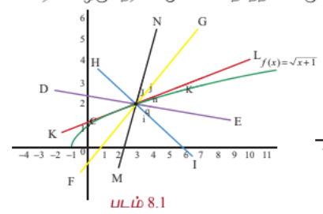
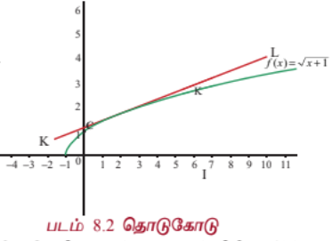

மேற்கண்ட படங்களிலிருந்து, அவற்றில் உள்ள கோடுகளில் $x = 3$ என்ற புள்ளியில் $f(x)$ -ன் வரைபடத்துக்கான தொடுகோடு மட்டுமே $x = 3$-க்கான $f$-ன் தோராய மதிப்பைத் தர இயலும் என்பது தெளிவாகின்றது. அடிப்படையில் கொடுக்கப்பட்ட சார்பை $x = 3$-ல் நேர்க்கோட்டுச் சார்பாக மாற்றுகின்றோம். இந்தக் கருத்து தேர்ந்தெடுக்கப்பட்ட புள்ளி $(3, 2)$ இன் அருகில், உள்ளீட்டின் மாறுதலுக்கு ஏற்ப சார்பின் மதிப்பில் ஏற்படும் மாறுதலைக் கணக்கிட உதவுகின்றது. வகைக்கெழுவைப் பயன்படுத்தி வகையீடுகளின் கருத்தை அறிமுகப்படுத்துவோம். இது தேர்ந்தெடுக்கப்பட்ட புள்ளியின் அருகில் தோராய மதிப்பைக் கணக்கிடுவதில் பயனுள்ளதாக இருக்கும். வகைக்கெழு, உடனடி மாறு வீதத்தை அளிக்கின்றது. ஆனால் வகையீடுகள் ஒரு சார்பின் மதிப்பில் ஏற்படும் தோராய மாற்றத்தைக் காண உதவுகின்றது. மேலும் பிரதியிடல் முறையில் வரையறுத்த தொகையிடலின் மதிப்பு காணவும் மற்றும் வகைக்கெழுச் சமன்பாடுகளைத் தீர்க்கவும் வகையீடுகள் பயன்படுகின்றன.

வகையீடுகளைக் கற்ற பின்பு பல மாறிகளைக் கொண்ட மெய்ச் சார்புகளின் மீது கவனம் செலுத்துவோம். பல மாறிகளைக் கொண்ட சார்புகளுக்கு, ஒரு மாறியின் மீதான மெய்ச் சார்பினது "வகைக்கெழுவின்" பொதுத்தன்மையாக "பகுதி வகைக்கெழு"வை அறிமுகப்படுத்துவோம்.

நாம் ஒன்றுக்கு மேற்பட்ட மாறிகளையுடைய சார்புகளை ஏன் கருத்தில் கொள்ள வேண்டும்? அந்த தேவைக்கான எளிய சூழலைக் காண்போம். ஒரு நிறுவனம் நோட்டுப் புத்தகங்கள் மற்றும் பேனாக்களையும் உற்பத்தி செய்கின்றது. இந்த நிறுவனத்தின் இலாபம் பெருமமாக இருக்கத் தேவையான உற்பத்தி அளவைக் காணவேண்டியுள்ளது. இந்த நிகழ்வில் (நோட்டுப் புத்தகம், பேனா) இரண்டு மாறிகளின் சார்பான வரவு, செலவு மற்றும் இலாபச் சார்புகளை ஆய்வு செய்ய வேண்டியுள்ளது. இதுபோல் ஒரு பெட்டியின் கன அளவை எடுத்துக்கொண்டால் இது நீளம், அகலம், உயரம் என்ற மூன்று மாறிகளின் சார்பாக உள்ளது. மேலும் ஒரு நாட்டின் பொருளாதாரம் பல துறைகளைச் சார்ந்துள்ளது. எனவே அது பல மாறிகளைச் சார்ந்துள்ளது. இவ்வாறு ஒன்றுக்கு மேற்பட்ட மாறிகளைக் கொண்ட சார்புகளின் தேவையையும், முக்கியத்துவத்தையும் கருத்தில் கொண்டு அவற்றுக்கான "வகைக்கெழு கருத்துருக்களை" உருவாக்குவதும் தேவையான ஒன்றாகின்றது. மேலும் இரண்டு மற்றும் மூன்று மாறிகளையுடைய சார்புகளுக்கான "வகையீடு" மற்றும் அவற்றின் பயன்பாடுகளையும் காண்போம்.

இந்த அத்தியாயத்தில் அன்றாட வாழ்வில் உள்ள பயன்பாடுகளைக் காணலாம்.

| படம் 8.3 |
|---|

### கற்றலின் நோக்கங்கள்

இந்த அத்தியாயத்தின் முடிவில் மாணவர்கள் பின்வருவனவற்றை அறிந்திருப்பர்.

- ஒரு மாறியைக் கொண்ட சார்பின் ஒரு புள்ளியிலான நேரியல் தோராய மதிப்பு கணக்கிடல்

- நேரியல் தோராய மதிப்பைப் பயன்படுத்தி கணிப்பான்கள் இல்லாமலே ஒரு சார்பின் தோராய மதிப்பு காணல்

- ஒரு சார்பின் வகையீடு காணல்

- அன்றாட வாழ்வில் வரும் கணக்குகளுக்கு நேரியல் தோராய மதிப்பு மற்றும் வகையீடுகளைப் பயன்படுத்துதல்

- ஒன்றுக்கு மேற்பட்ட மாறிகளையுடைய சார்பின் பகுதி வகைக்கெழு காணல்

- இரண்டு அல்லது அதற்கு மேற்பட்ட மாறிகளையுடைய சார்புகளின் நேரியல் தோராய மதிப்பு காணல்

- ஒன்றுக்கு மேற்பட்ட மாறிகளையுடைய சார்பு சமபடித்தானதா இல்லையா என தீர்மானித்தல்

- சமபடித்தான சார்புகளுக்கு ஆய்லரின் தேற்றத்தினைப் பயன்படுத்துதல்

### 8.2 நேரியல் தோராய மதிப்பு மற்றும் வகையீடுகள்
### (Linear Approximation and Differentials)

#### 8.2.1 நேரியல் தோராய மதிப்பு (Linear Approximation)

இப்பிரிவில், ஒரு புள்ளியில் ஒரு சார்பின் தோராய மதிப்பினை அறிமுகப்படுத்துவோம். நேரியல் தோராய மதிப்பினைப் பயன்படுத்தி கொடுக்கப்பட்ட புள்ளியின் அருகில் சார்பினை மதிப்பிடுவோம். பின்பு ஒரு மாறியுடைய மெய்ச்சார்பின் வகையீட்டை அறிமுகப்படுத்துவோம். இதுவும் பயன்பாட்டுக்கு உதவியாக இருக்கும்.

$f : (a, b) \rightarrow \mathbb{R}$ என்பதை வகையிடத்தக்கச் சார்பாகவும் மற்றும் $x \in (a, b)$ எனவும் கொள்க. $x$ என்ற புள்ளியில் $f$ வகையிடத்தக்கது. எனவே

$$\lim_{\Delta x \rightarrow 0} \frac{f(x + \Delta x) - f(x)}{\Delta x} = f'(x)$$

... (1)

$\Delta x$ சிறிய மதிப்பு எனில் (1)-ன் மூலம்

$$f(x + \Delta x) - f(x) \approx f'(x)\Delta x$$

... (2)

அதாவது,

$$f(x + \Delta x) \approx f(x) + f'(x)\Delta x$$

... (3)

இங்கு $\approx$ என்பது "தோராய மதிப்பிற்குச்" சமம். மேலும் சாராமாறி $x$ இலிருந்து $x + \Delta x$ க்கு மாறும்போது $f(x)$ சார்பு $f(x + \Delta x)$ க்கு மாறுவதைக் கவனிக்கவும். எனவே $\Delta x$ சிறிய மாற்றமாகவும் $\Delta f$ அல்லது $\Delta y$ வெளியீடாகவும் இருக்கும்போது சமன்பாடு (2)ஐ பின்வருமாறு மாற்றி எழுதலாம்.

வெளியீட்டில் ஏற்படும் மாற்றம் $= \Delta y = f(x + \Delta x) - f(x) \approx f'(x)\Delta x$.

$f(x)$ மற்றும் $f'(x)\Delta x$ ஐ பயன்படுத்தி $f(x + \Delta x)$ -ன் தோராய மதிப்பைக் கணக்கிட சமன்பாடு (3) பயன்படுவதைக் காணலாம். மேலும் ஒரு குறிப்பிட்ட $x_0$ க்கு $y(x) = f(x_0) + f'(x_0)(x - x_0)$, $x \in \mathbb{R}$, என்பது $(x_0, f(x_0))$ என்ற புள்ளியில் $f$ -க்கான தொடுகோட்டின் சமன்பாட்டைத் தருகின்றது. இது $x_0$ க்கு அருகில் $f$ -ன் சிறந்த தோராய மதிப்பைத் தருகின்றது. இது பின்வரும் வரையறைக்கு வழி வகுக்கின்றது.

#### வரையறை 8.1 (நேரியல் தோராய மதிப்பு)

$f : (a, b) \rightarrow \mathbb{R}$ என்பதை வகையிடத்தக்கச் சார்பாகவும், $x_0 \in (a, b)$ எனவும் கொள்க. $x_0$ என்ற புள்ளியில் $f$ -ன் தோராய மதிப்பு $L$ -ன் வரையறை

$$L(x) = f(x_0) + f'(x_0)(x - x_0), \quad x \in (a, b) \text{ ஆகும்}$$

... (4)

சமன்பாடு (3)-லிருந்து

$$f(x_0 + \Delta x) \approx f(x_0) + f'(x_0)\Delta x$$

என்பதை நாம் காணலாம்.

இது $f(x_0 + \Delta x)$ -ன் தோராய மதிப்பு காண பயனுள்ளதாகும்.

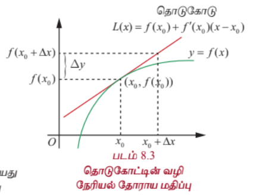

இங்கு $x$ -ன் மதிப்பு $x_0$ -ஐ நெருங்கும்போது $f(x)$ -க்கான ஒரு சிறந்த தோராய மதிப்பை $x_0$ என்ற புள்ளியில் $f$ -ன் நேரியல் தோராய மதிப்பு, தருகின்றது. ஏனெனில், புள்ளி $x_0$ -ல் $f$ தொடர்ச்சியுடையது என்பதால் $x$ -ன் மதிப்பு $x_0$ -ஐ நெருங்கும்போது

பிழை $= f(x) - L(x) = f(x) - f(x_0) - f'(x_0)(x - x_0)$

... (5)

பூச்சியத்தை நெருங்குகின்றது. மேலும் $f(x) = mx + c$ எனில், ஏதேனும் ஒரு $x \in (a, b)$ -க்கு அதன் நேரியல் தோராய மதிப்பு $L(x) = (mx_0 + c) + m(x - x_0) = mx + c = f(x)$ ஆகும். இந்த நிலையில் தோராய மதிப்பானது அந்த சார்பாகவே உள்ளது. (இது வியப்பூட்டுவதாக இல்லையா?)

---

### எடுத்துக்காட்டு 8.1

$f(x) = \sqrt{1 + x}$, $x > -1$ என்ற சார்பிற்கு நேரியல் தோராய மதிப்பை $x_0 = 3$ இல் காண்க. இதைப் பயன்படுத்தி $f(3.2)$ -ஐ மதிப்பிடுக.

#### தீர்வு

சமன்பாடு (4)-இலிருந்து $L(x) = f(x_0) + f'(x_0)(x - x_0)$ என நாம் அறிவோம். $x = x_0 + \Delta x = 3 + 0.2$ மற்றும் $f(3) = \sqrt{4} = 2$ மேலும்

$$f'(x) = \frac{1}{2\sqrt{1 + x}}$$

எனவே

$$f'(3) = \frac{1}{2\sqrt{4}} = \frac{1}{4}$$

$$L(x) = 2 + \frac{1}{4}(x - 3) = \frac{x}{4} + \frac{5}{4}$$

இது தேவையான நேரியல் தோராய மதிப்பைத் தருகின்றது.

இப்பொழுது $f(3.2) = \sqrt{4.2} \approx L(3.2) = \frac{3.2}{4} + \frac{5}{4} = 2.05$.

உண்மையில் கணிப்பானைப் பயன்படுத்தினால் $\sqrt{4.2} = 2.04939$.

---

#### 8.2.2 பிழைகள் : தனிப்பிழை, சார்பிழை, மற்றும் சதவீத பிழை
### (Errors: Absolute Error, Relative Error and Percentage Error)

நாம் ஒரு மதிப்பைத் தோராயப்படுத்தும்போது அங்கு பிழை ஏற்படுகின்றது. இந்தப் பிரிவில், சமன்பாடு (4)ஆல் நேரியல் தோராய மதிப்பு மூலம் ஏற்படும் பிழையைக் கருத்தில் கொள்வோம். பிழைகளின் பல வகைகளைப் பற்றியும் காண்போம். $h = x - x_0$ என எடுக்க, $x = x_0 + h$ என கிடைக்கும். இதனால் சமன்பாடு (5)

$$E(h) = f(x_0 + h) - f(x_0) - f'(x_0)h \text{ என மாறும்}$$

... (6)

$E(0) = 0$ என்பதைக் கவனிக்க மற்றும் $x_0$ என்ற புள்ளியில் $f$ -ன் தொடர்ச்சித் தன்மையினால் $\lim_{h \rightarrow 0} E(h) = 0$ என்பதை நாம் முன்பே பார்த்துள்ளோம். மேலும் $f$ வகையிடத்தக்கது என்பதால்

$$\lim_{h \rightarrow 0} \frac{E(h)}{h} = \lim_{h \rightarrow 0} \left(\frac{f(x_0 + h) - f(x_0)}{h} - f'(x_0)\right) = 0$$

$f$ என்ற சார்பு $x_0$ இல் வகையிடத்தக்கது எனில், $h$ பூச்சியத்தை நெருங்குவதைவிட, $E(h)$ வேகமாக பூச்சியத்தை நெருங்குவதைக் காணலாம்.

#### வரையறை 8.2

ஒரு குறிப்பிட்ட அளவையைத் தீர்மானிக்க வேண்டும் என்க. அதன் துல்லியமான மதிப்பு **மெய்மதிப்பு** எனப்படும். சில நேரங்களில் நாம் அவற்றின் தோராய மதிப்பை, தோராய மதிப்பிடல் முறையில் காண்கின்றோம். இந்நிலையில்

**தனிப்பிழை** = |மெய்மதிப்பு - தோராய மதிப்பு| என வரையறுக்கப்படுகிறது.

எனவே சமன்பாடு (6) நேரியல் தோராய மதிப்பு முறையில் ஏற்படும் தனிப்பிழையைத் தருகின்றது.

---

### எடுத்துக்காட்டு 8.2

நேரியல் தோராய மதிப்பீட்டு முறை மூலம் $\sqrt{9.2}$ -ன் தோராய மதிப்பைக் கணிப்பான் உதவியில்லாமல் காண்க.

#### தீர்வு

நேரியல் தோராய மதிப்பீட்டு முறையில் $\sqrt{9.2}$ -ன் தோராய மதிப்பைக் காண வேண்டியுள்ளது. சமன்பாடு (3)-ன் படி $f(x_0 + \Delta x) \approx f(x_0) + f'(x_0)\Delta x$ என உள்ளது. இதற்கு நாம் பொருத்தமான $f$, $x_0$ மற்றும் $\Delta x$ ஆகியவற்றைத் தேர்வு செய்ய வேண்டும். நம்முடைய இந்தத் தேர்வு மேற்கண்ட தோராய மதிப்பு சமன்பாட்டின் வலப்பக்கத்தை கணிப்பான் உதவியில்லாமல் கணக்கிடக்கூடிய வகையில் இருக்கவேண்டும். எனவே

$$f(x) = \sqrt{x}, x_0 = 9 \quad \text{மற்றும்} \quad \Delta x = 0.2$$

என நாம் தேர்வு செய்வோம். இதனால் $f'(x_0) = \frac{1}{2\sqrt{9}} = \frac{1}{6}$ மற்றும்

$$\sqrt{9.2} \approx f(9) + f'(9)(0.2) = 3 + \frac{0.2}{6} = 3.03333$$

என கிடைக்கும்.

தற்போது, ஒப்பிட்டுக் பார்ப்பதற்காக, கணிப்பானைப் பயன்படுத்தினால் $\sqrt{9.2} = 3.03315$ என கிடைப்பதைக் காணலாம். நம் தோராய மதிப்பு முதல் மூன்று தசம இடங்களுக்கு சரியாக உள்ளதைக் காணலாம். எனவே பிழை $3.03315 - 3.03333 = 0.00018$. [மேலும் இங்கு ஒருவர் $f(x) = \sqrt{18x}, x_0 = \frac{1}{2}$ மற்றும் $\Delta x = 0.2$ எனவும் தேர்வு செய்யலாம். எனவே $f$ மற்றும் $x_0$ -ன் தேர்வு தனித்தன்மையுடையதாக இருக்க வேண்டியதில்லை].

எனவே மேற்கண்ட எடுத்துக்காட்டில் தனிப்பிழை என்பது $3.03315 - 3.03333 = 0.00018$.

தனிப்பிழை எந்த அளவு பிழை என்பதைக் குறிக்கின்றது; ஆனால் அது தோராய மதிப்பு எந்த அளவுக்கு மெய்மதிப்பிற்கு அருகாமையில் நன்றாக உள்ளது என்பதைக் கூறாது. இதற்காக இரண்டு எளிய நிலைகளைக் காணலாம்.

நிலை 1 : ஏதோ ஒரு அளவின் மெய்மதிப்பு 5 மற்றும் தோராய மதிப்பு 4 என்க. அதன் தனிப்பிழை $|5 - 4| = 1$.

நிலை 2 : ஏதோ ஒன்றின் மெய்மதிப்பு 100 மற்றும் தோராய மதிப்பு 95 என்க. தற்போது அதன் தனிப்பிழை $|100 - 95| = 5$. எனவே முதல் நிலையின் தனிப்பிழை இரண்டாம் நிலையை விட குறைவாக உள்ளது.

இந்த இரு தோராய மதிப்புகளில் எது சிறந்த தோராய மதிப்பு மற்றும் ஏன்? ஒரு தோராய மதிப்பு சிறந்ததா இல்லையா என்பது பற்றி தனிப்பிழை சரியாக தெரிவிப்பதில்லை. அதே சமயம் சார்பிழை அல்லது சதவீதப்பிழை (கீழே வரையறுக்கப்பட்டுள்ளது), கணக்கிடுவோமானால் அந்த தோராய மதிப்பு எவ்வளவு சிறந்தது என்பதைக் காணலாம். மெய்மதிப்பு பூச்சியம் எனில் நம் தோராய மதிப்பு மெய்மதிப்புக்கு எந்த அளவிற்கு நெருக்கமாக உள்ளது என்பது நமக்குத் தெரியும். மெய்மதிப்பு பூச்சியமில்லை எனில் அதைப் பின்வருமாறு வரையறுப்போம்.

#### வரையறை 8.3

மெய்மதிப்பு பூச்சியமற்றது எனில்

**சார்பிழை** = $\frac{|\text{மெய்மதிப்பு} - \text{தோராய மதிப்பு}|}{\text{மெய்மதிப்பு}}$

**சதவீதப்பிழை** = சார்பிழை $\times 100$.

#### குறிப்பு

தனிப்பிழை அளவீட்டிற்கு அலகு உண்டு. அதே சமயம் சார்பிழை, சதவீதப் பிழை ஆகியவற்றிற்கு அலகுகள் இல்லை.

மேற்கண்ட நிலைகளில்

முதல் நிலை : சார்பிழை $= \frac{1}{5} = 0.2$; சதவீதப் பிழை $= \frac{1}{5} \times 100 = 20\%$.

இரண்டாம் நிலை : சார்பிழை $= \frac{5}{100} = 0.05$; சதவீதப் பிழை $= \frac{5}{100} \times 100 = 5\%$.

இதிலிருந்து இரண்டாவது தோராய மதிப்பு முதல் தோராய மதிப்பீட்டை விடச் சிறந்தது. சார்பிழை அல்லது சதவீதப் பிழை கணக்கிட எதன் தோராய மதிப்பைக் கணக்கிடுகின்றோமோ அதன் மெய்மதிப்பு தெரிந்திருக்க வேண்டும் என்பதைக் கவனிக்கவும்.

மேலும் சில எடுத்துக்காட்டுகளைக் காணலாம்.

---

### எடுத்துக்காட்டு 8.3

ஒரு சோப்பு நுரையின் வடிவம் கோளமாக உள்ளது என எடுத்துக் கொள்வோம். ஆரம் 5 செ.மீ-இலிருந்து 5.2 செ.மீ-ஆக மாறும் போது ஏற்படும் வளைபரப்பின் தோராய அதிகரிப்பை நேரியல் தோராய மதிப்பு முறையில் காண்க. மேலும் அதன் சதவீதப் பிழையையும் காண்க.

#### தீர்வு

ஆரம் $r$ உள்ள கோளத்தின் வளைபரப்பு $S(r) = 4\pi r^2$ என்பதை நினைவுகூர்க. நம்மால் சூத்திரத்தைப் பயன்படுத்தி சரியான மாற்றத்தைக் கணக்கிட முடியும் என்றாலும் நேரியல் தோராய மதிப்பு முறையைப் பயன்படுத்தி தோராய மதிப்பைக் காணலாம். சமன்பாடு (4)-ன்படி வளைபரப்பின் தோராய மாற்றம்

$$\Delta S \approx S'(5)(0.2) = 8\pi(5)(0.2) = 8\pi \text{ செ.மீ}^2$$

சரியான கணக்கீட்டின்படி வளைபரப்பின் மாற்றம்

$$S(5.2) - S(5) = 108.16\pi - 100\pi = 8.16\pi \text{ செ.மீ}^2$$

சதவீதப் பிழை $= \text{சார்பிழை} \times 100 = \frac{|8.16 - 8|}{8.16} \times 100 = 1.9607\%$.

---

### எடுத்துக்காட்டு 8.4

ஒரு நேர்வட்ட உருளையின் ஆரம் $r = 10$ செ.மீ மற்றும் உயரம் $h = 20$ செ.மீ. உருளையின் ஆரம் 10 செ.மீ இலிருந்து 10.1 செ.மீ-ஆக அதிகரிக்கின்றது என்க. மேலும் உயரம் மாறாமல் உள்ளது எனில் உருளையின் கன அளவில் ஏற்படும் மாற்றத்தைக் கணக்கிடுக. மேலும் அதன் சார்பிழை மற்றும் சதவீதப் பிழையையும் காண்க.

#### தீர்வு

உருளையின் கன அளவு $V = \pi r^2 h$ என்பதை நினைவு கூர்வோம், இங்கு ஆரம் $r$ மற்றும் உயரம் $h$ ஆகும். $V'(r) = 2\pi r h = 40\pi r$.

$$V(10.1) - V(10) \approx V'(10)(0.1) = 40\pi(10)(0.1) = 40\pi \text{ செ.மீ}^3$$

எனவே கன அளவில் ஏற்படும் மாற்றத்தின் மதிப்பு $40\pi$ செ.மீ$^3$.

கன அளவில் ஏற்படும் துல்லியமான மாற்றம்

$$V(10.1) - V(10) = 2000\pi(1.0201) - 2000\pi = 40.2\pi \text{ செ.மீ}^3$$

எனவே சார்பிழை $= \frac{|40.2 - 40|}{40.2} = \frac{0.2}{40.2} = \frac{1}{201} \approx 0.00497$;

மற்றும் சதவீதப் பிழை $= \text{சார்பிழை} \times 100 = \frac{1}{201} \times 100 = 0.497\%$.

---

### பயிற்சி 8.1

1. $f(x) = \sqrt[3]{x}$ என்க. $x = 27$ இல் நேரியல் தோராய மதிப்பைக் காண்க. நேரியல் தோராய மதிப்பை பயன்படுத்தி $\sqrt[3]{27.2}$ ன் மதிப்பைக் காண்க.

2. நேரியல் தோராய மதிப்பீட்டு முறையில் பின்வருவனவற்றின் தோராய மதிப்புகளைக் காண்க.

   (i) $(123)^{\frac{2}{3}}$

   (ii) $\sqrt[4]{15}$

   (iii) $\sqrt[3]{26}$

3. பின்வரும் சார்புகளுக்கு, கொடுக்கப்பட்ட புள்ளிகளில் நேரியல் தோராய மதிப்பைக் காண்க.

   (i) $f(x) = \sqrt{x}, x_0 = 512$

   (ii) $g(x) = \sqrt[4]{x}, x_0 = 94$

   (iii) $h(x) = \frac{x - 1}{x + 1}, x_0 = 0$

4. ஒரு வட்ட வடிவ தகட்டின் ஆரம் 12.5 செ.மீ-க்குப் பதிலாக 12.65 செ.மீ என அளக்கப்படுகின்றது எனில் அதன் பரப்பில் ஏற்படும் மாற்றத்தை கணக்கிடுவதில் பின்வருவனவற்றை காண்க:

   (i) தனிப்பிழை (ii) சார்பிழை (iii) சதவீதப் பிழை

5. பனிக்கட்டியிலான ஒரு கோளத்தின் ஆரம் 10 செ.மீ. அதன் ஆரம் 10 செ.மீலிருந்து 9.8 செ.மீ-ஆக குறைகின்றது. பின்வருவனவற்றின் தோராய மதிப்பினைக் காண்க:

   (i) கன அளவில் ஏற்படும் மாற்றம்

   (ii) வளைபரப்பில் ஏற்படும் மாற்றம்

6. $l$ நீளம் உள்ள ஒரு தனி ஊசலின் முழு அலைவு நேரம் $T$ என்பது $T = 2\pi\sqrt{\frac{l}{g}}$ என கொடுக்கப்பட்டுள்ளது, இங்கு $g$ ஒரு மாறிலி. $l$ -ல் ஏற்படும் 2 சதவீதப் பிழைக்கு ஏற்ப $T$ -ன் கணக்கீட்டில் ஏற்படும் தோராய சதவீதப் பிழையைக் காண்க.

7. ஒர் எண்ணின் $n$ -ஆம் படி மூலம் கணக்கிடப்படும்போது ஏற்படும் சதவீதப் பிழை தோராயமாக, அந்த எண்ணின் சதவீதப் பிழையின் $\frac{1}{n}$ மடங்கு ஆகும் எனக்காட்டுக.

---

#### 8.2.3 வகையீடுகள் (Differentials)

இங்கு "வகையீடுகள்" பற்றி அறிமுகப்படுத்த மீண்டும் நாம் வகைக்கெழு கருத்துருவைப் பயன்படுத்துவோம். இங்கு சமன்பாடு (1)ஐ கவனிப்போம்.

$$\frac{df}{dx} = \lim_{\Delta x \rightarrow 0} \frac{f(x_0 + \Delta x) - f(x_0)}{\Delta x} = f'(x_0)$$

... (7)

இங்கு $\frac{df}{dx}$ என்பது வித்தியாசங்களின் விகிதத்தின் எல்லை மதிப்பைக் குறிக்க லிபினிட்ஸ் பயன்படுத்திய குறியீடு ஆகும். இது $x$ -ஐப் பொருத்து $y$ -ன் வகைக்கெழு எனப்படும். $\frac{df}{dx}$ -ஐ $df$ மற்றும் $dx$ இவற்றின் விகிதமாக (வகுத்தலாக) கருதுவது பொருத்தமுள்ளதாகுமா? வேறுவிதமாக வகைக்கெழு என்பது $df$ மற்றும் $dx$ -ன் வகுத்தலாகுமாறு $df$ -க்கும் $dx$ -க்கும் பொருள் கொள்ள முடியுமா? சில நேரங்களில் ஆம் எனலாம். எடுத்துக்காட்டாக, $f(x) = mx + c$ இங்கு $m, c$ என்பன மாறிலிகள், எனில் $y = f(x)$.

எல்லா $x \in \mathbb{R}$ மற்றும் $\Delta x$ -க்கு $\Delta y = f(x + \Delta x) - f(x) = m\Delta x = f'(x)\Delta x$. எனவே சமன்பாடு (2) மற்றும் (3) மெய். இங்கு $x$ மற்றும் $y = f(x)$ இவற்றில் ஏற்படும் மாற்றம் நேர்கோட்டின் மீது ஏற்படுகின்றது. இந்நிலையில்

$$\frac{\Delta f}{\Delta x} = \frac{\Delta y}{\Delta x} = m = f'(x) = \frac{df}{dx} = \frac{dy}{dx}$$

இதனால் $df = \Delta f = \Delta y$ மற்றும் $dx = \Delta x$ என எடுத்துக்கொண்டால் வகைக்கெழு $\frac{df}{dx}$ என்பது உண்மையில் $df$ மற்றும் $dx$ -ன் விகிதமாகும். எனவே $f$ -ன் வகையீட்டை பின்வருமாறு வரையறுப்போம்:

#### வரையறை 8.4

$x$ -ன் அதிகரிப்பு $\Delta x$ உடன் மற்றும் எல்லா $x \in (a, b)$ -க்கும் $f : (a, b) \rightarrow \mathbb{R}$ ஒரு வகையிடத்தக்க சார்பு என்க. $f$ -ன் வகையீடு

$$df = f'(x)\Delta x$$

... (8)

என வரையறுக்கப்படுகின்றது.

$f(x) = x$ எனில் சமன்பாடு (8)-ன் படி

$$dx = f'(x)\Delta x = 1 \cdot \Delta x \quad \text{அதாவது} \quad dx = \Delta x$$

இது $x$ -அச்சில் ஏற்படும் மாற்றம். எனவே சமன்பாடு (8)-ன்படி $f$-ன் வகையீடு

$$df = f'(x)dx$$

அடுத்து ஏதேனும் ஒரு $y = f(x)$ -க்கான வகையீட்டை காண்போம்.

$\Delta f = f(x + dx) - f(x) \approx f'(x)dx$ என்பது $y = f(x)$ என்ற சார்பின் வெளியீட்டில் ஏற்படும் மாற்றத்தைத் தருகின்றது. $f'(x)$ என்பது $(x, f(x))$ என்ற புள்ளியில் தொடுகோட்டின் சாய்வைத் தருகின்றது. தொடுகோட்டுத் திசையில் $f$ இல் ஏற்படும் மாற்றம் $dy$ அல்லது $df$ என்க. எனவே மேற்கண்டபடி $dy = f'(x)dx$ படம் 8.4 இலிருந்து $\Delta f \approx dy$ மற்றும் $\Delta f = f(x + dx) - f(x)$ என்பது தெளிவு மற்றும் $f'(x)$ என்பது தோராயமாக $\Delta f$ மற்றும் $\Delta x$ -ன் விகிதமாகக் காணலாம். எனவே $\frac{df}{dx}$ என்பதை $df$ மற்றும் $dx$ -ன் விகிதமாக பொருள் கொள்ளலாம்.

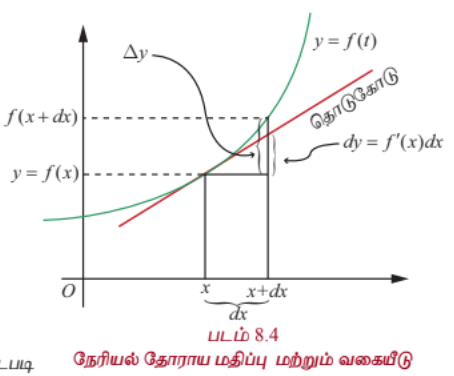

#### குறிப்புரை

ஒரு சார்பின் வகைக்கெழுவும் ஒரு சார்புதான் என்பது நாம் அறிவோம். ஒரு சார்பு $f$ -ன் வகையீடு சாரா மாறியின் சார்பாக மட்டுமல்லாமல், உள்ளீட்டில் ஏற்படும் மாற்றம் $dx = \Delta x$ -ஐயும் சார்ந்துள்ளது. எனவே, $df$ என்பது $x$ மற்றும் $dx$ என்ற இரு மாறும் அளவுகளின் சார்பாக உள்ளது. $\Delta f \approx df$ என்பதை படம் 8.4-இலிருந்து காணலாம்.

ஒப்பிட்டுப் பார்க்க சில சார்புகள், அவற்றின் வகைக்கெழுக்கள் மற்றும் வகையீடுகள் கீழே உள்ள அட்டவணையில் கொடுக்கப்பட்டுள்ளன.

| வ. எண் | சார்பு | வகைக்கெழு | வகையீடுகள் |
|---|---|---|---|
| 1 | $f(x) = x^n$ | $f'(x) = nx^{n-1}$ | $df = nx^{n-1}dx$ |
| 2 | $f(x) = \cos(2x^2 - 7x)$ | $f'(x) = -\sin(2x^2 - 7x)(4x - 7)$ | $df = -\sin(2x^2 - 7x)(4x - 7)dx$ |
| 3 | $f(x) = \cot(x^2)$ | $f'(x) = -2x\cosec^2(x^2)$ | $df = -2x\cosec^2(x^2)dx$ |
| 4 | $f(x) = \sin^{-1}(x)$ | $f'(x) = \frac{1}{\sqrt{1 - x^2}}$ | $df = \frac{1}{\sqrt{1 - x^2}}dx$ |
| 5 | $f(x) = \tan^{-1}(x)$ | $f'(x) = \frac{1}{1 + x^2}$ | $df = \frac{1}{1 + x^2}dx$ |
| 6 | $f(x) = e^{x^3 - 5x + 7}$ | $f'(x) = e^{x^3 - 5x + 7}(3x^2 - 5)$ | $df = e^{x^3 - 5x + 7}(3x^2 - 5)dx$ |
| 7 | $f(x) = \log(x^2 + 1)$ | $f'(x) = \frac{2x}{x^2 + 1}$ | $df = \frac{2x}{x^2 + 1}dx$ |

அடுத்து நாம் வகையீடுகளின் பண்புகளைப் பற்றிக் காண்போம். இந்த முடிவுகள் வகைக்கெழுவின் வரையறை மற்றும் வகைக்கெழுவின் விதிகளைப் பின்பற்றி கிடைப்பன. (5)-ம் பண்பிற்கு மட்டும் கீழே நிரூபணம் தரப்பட்டுள்ளது. மற்றவை பயிற்சிக்காக விடப்பட்டுள்ளது.

#### வகையீடுகளின் பண்புகள் (Properties of Differentials)

இங்கு நாம் மெய்மாறிகளாலான மெய்மதிப்புச் சார்புகளை மட்டும் கருத்தில் கொள்வோம்.

(1) $f$ ஒரு மாறிலிச் சார்பு எனில் $df = 0$.

(2) சமனிச் சார்பு $f(x) = x$ எனில் $df = 1dx$.

(3) $f$ வகையிடத்தக்கது மற்றும் $c \in \mathbb{R}$ எனில் $d(cf) = cdf = cf'(x)dx$.

(4) $f, g$ என்பன வகையிடத்தக்கன எனில் $d(f + g) = df + dg = (f'(x) + g'(x))dx$.

(5) $f, g$ என்பன வகையிடத்தக்கன எனில் $d(fg) = fdg + gdf = (f(x)g'(x) + f'(x)g(x))dx$.

(6) $f, g$ என்பன வகையிடத்தக்கன எனில்
$$d(f/g) = \frac{gdf - fdg}{g^2} = \frac{g(x)f'(x) - f(x)g'(x)}{g(x)^2}dx$$
இங்கு $g(x) \neq 0$.

(7) $f, g$ என்பன வகையிடத்தக்கன என்பதுடன் $h = f \circ g$ வரையறுக்கப்பட்டது எனில்
$$dh = f'(g(x))g'(x)dx$$

(8) $h(x) = e^{f(x)}$ எனில் $dh = e^{f(x)}f'(x)dx$

(9) எல்லா $x$ -க்கும் $f(x) > 0$ மற்றும் $g(x) = \log(f(x))$ எனில் $dg = \frac{f'(x)}{f(x)}dx$

---

### எடுத்துக்காட்டு 8.5

$f, g : (a, b) \rightarrow \mathbb{R}$ என்பன வகையிடத்தக்க சார்புகள் எனில் $d(fg) = fdg + gdf$ என நிறுவுக.

#### தீர்வு

$f, g : (a, b) \rightarrow \mathbb{R}$ என்பன வகையிடத்தக்க சார்புகள் என்பதுடன் $h(x) = f(x)g(x)$ என்க. $h$ என்பது வகையிடத்தக்க சார்புகளின் பெருக்கல் என்பதால் $(a, b)$இல் $h$ -ம் வகையிடத்தக்கது. எனவே வரையறைப்படி $dh = h'(x)dx$.

தற்போது பெருக்கல் விதியைப் பயன்படுத்தி $h'(x) = f(x)g'(x) + f'(x)g(x)$.

இதனால்

$$dh = h'(x)dx = (f(x)g'(x) + f'(x)g(x))dx = f(x)g'(x)dx + g(x)f'(x)dx$$

$$= f(x)dg + g(x)df = fdg + gdf$$

---

### எடுத்துக்காட்டு 8.6

$g(x) = x^2\sin x$ எனில் $dg$ -ஐக் காண்க.

#### தீர்வு

சார்பு $g$ வகையிடத்தக்கது என்பதைக் கவனிக்கவும். மேலும் $g'(x) = 2x\sin x + x^2\cos x$.

இதனால் $dg = (2x\sin x + x^2\cos x)dx$.

---

### எடுத்துக்காட்டு 8.7

10 செ.மீ ஆரம் உள்ள கோளத்தின் ஆரம் 0.1 செ.மீ குறைகின்றது எனில் அதன் கன அளவில் தோராயமாக எவ்வளவு குறையும்?

#### தீர்வு

கோளத்தின் கன அளவு $V = \frac{4}{3}\pi r^3$ என நாம் அறிவோம். இங்கு $r > 0$ என்பது ஆரம். எனவே

வகையீடு $dV = 4\pi r^2 dr$ மற்றும் $\Delta V \approx dV$ எனவே

$$dV = 4\pi(10)^2(9.9 - 10) \text{ செ.மீ}^3$$

$$= 4\pi(100)(-0.1) \text{ செ.மீ}^3$$

$$= -40\pi \text{ செ.மீ}^3$$

ஆரம் 10-இலிருந்து 9.9 ஆக குறைகின்றதால் $dr = (9.9 - 10)$ செ.மீ எனப் பயன்படுத்தியுள்ளோம். மறுபடியும் விடையில் வரும் '$-$' குறியீடு கோளத்தின் கன அளவு $40\pi$ செ.மீ$^3$ குறைவதைக் குறிக்கின்றது.

---

### பயிற்சி 8.2

1. பின்வரும் சார்புகளுக்கு வகையீடு $dy$ காண்க :

   (i) $y = \left(\frac{1 - 2x}{3 + 4x}\right)^3$

   (ii) $y = (\sin(3x^2))^{\frac{2}{3}}$

   (iii) $y = e^{2x^2 + 5x - 7}\cos(2x + 1)$

2. $f(x) = x^2 - 3x$ என்ற சார்பிற்கு $df$ காண்க மற்றும்

   (i) $x = 2$, $dx = 0.1$

   (ii) $x = 3$ மற்றும் $dx = 0.02$

   எனும்போது $df$ -ஐ மதிப்பிடுக.

3. $f$ என்ற சார்பிற்கு கொடுக்கப்பட்ட $x, \Delta x$ மதிப்புகளுக்கு $\Delta f$ மற்றும் $df$ காண்க. மேலும் அவற்றை ஒப்பிடுக.

   (i) $f(x) = \sqrt{x}$; $x = 32, \Delta x = 0.5$

   (ii) $f(x) = x^2 - 2x$; $x = 2.3, \Delta x = 0.01$

4. $\log_{10} e = 0.4343$ எனக்கொண்டு $\log_{10}(100.3)$ -ன் தோராய மதிப்பைக் காண்க.

5. ஒரு மரத்தின் அடிப்பகுதியின் விட்டம் 30 செ.மீ. அடுத்த ஆண்டு அதன் சுற்றளவு 6 செ.மீ அதிகரிக்கின்றது எனில்

   (i) தோராயமாக மரத்தின் விட்டம் எவ்வளவு வளர்ந்துள்ளது?

   (ii) அதன் குறுக்கு வெட்டுப் பரப்பானது எவ்வளவு சதவீதம் அதிகரித்திருக்கும்?

6. ஒரு குறிப்பிட்ட பறவையின் முட்டை கிட்டத்தட்ட கோள வடிவமாக உள்ளது. முட்டையின் ஆரம் ஓட்டிற்கு உள்ளே 5 மிமீ ஆகவும் ஓட்டிற்கு வெளியே 5.3 மிமீ ஆகவும் உள்ளது எனில் ஓட்டின் தோராய கன அளவைக் காண்க.

7. மனிதனின் இரத்தக் குழாயின் (தமனியின்) குறுக்கு வெட்டானது வட்ட வடிவம் எனக் கொள்க. ஒரு நோயாளிக்கு இரத்தக் குழாய் விரிவடைவதற்கான மருந்து கொடுக்கப்பட்டுள்ளது. இரத்தக் குழாயின் ஆரம் 2 மிமீ இலிருந்து 2.1 மிமீ ஆக அதிகரிக்கும்போது அதன் குறுக்கு வெட்டின் பரப்பு தோராயமாக எந்த அளவு அதிகரிக்கும்?

8. புதிதாக உருவாக்கப்பட்ட ஒரு நகரத்தின் வாக்காளர்களின் எண்ணிக்கையின் (ஆயிரங்களில்) அதிகரிப்பு $V(t) = 30 + 12t^2 - t^3$, $0 \le t \le 8$ என்பதால் மதிப்பிடப்படுகின்றது. இங்கு $t$ என்பது ஆண்டுகளை குறிக்கின்றது. காலம் 4-இலிருந்து $4 + \frac{1}{6}$ வருடமாக இருக்கும்போது ஏற்படும் தோராய வாக்காளர்களின் எண்ணிக்கை மாற்றத்தைக் காண்க.

9. ஒரு மனிதன் $x$ மணி நேரத்தில் கற்கும் $y$ வார்த்தைகளுக்கான தொடர்பு $y = 5\sqrt{x}$, $0 \le x \le 9$ எனக் கொடுக்கப்பட்டுள்ளது. $x$ -ன் மதிப்பு பின்வருமாறு மாறும்போது கற்றல் வார்த்தைகளின் எண்ணிக்கையில் ஏற்படும் தோராய மாற்றத்தைக் காண்க.

   (i) 1 இலிருந்து 1.1 மணி?

   (ii) 4 இலிருந்து 4.1 மணி?

10. ஒரு வட்ட வடிவத் தகடு வெப்பத்தினால் சீராக விரிவடைகின்றது என்க. அதன் ஆரம் 10.5 செ.மீ-இலிருந்து 10.75 செ.மீ-ஆக அதிகரிக்கும்போது அதன் பரப்பில் ஏற்படும் தோராய அதிகரிப்பு மற்றும் தோராய சதவீத அதிகரிப்பு ஆகியவற்றைக் காண்க.

11. 10 செ.மீ பக்க அளவு கொண்ட ஒரு கன சதுரத்தின் பக்கங்களுக்கு 0.2 செ.மீ கனத்திற்கு வர்ணம் பூசப்படுகின்றது. வகையீடுகளைப் பயன்படுத்தி அந்த கன சதுரத்தின் வர்ணப் பூச்சிற்கு தோராயமாக எத்தனை கன செ.மீ அளவிற்கு வர்ணம் பயன்படுத்தப்பட்டது எனக் காண்க. மேலும் துல்லியமாக எவ்வளவு வர்ணம் பயன்படுத்தப்பட்டது என்பதையும் காண்க.

### 8.3 பல மாறிகளைக் கொண்ட சார்புகள் (Functions of several Variables)

$x$ என்ற மாறியாலான $f$ என்ற சார்பை நினைவு கூர்வோம் ; $y = f(x)$ என்ற சார்பின் தன்மையை நன்கு புரிந்து கொள்ள அதன் வரைபடத்தை வரைவோம். பொதுவாக $y = f(x)$ என்ற சார்பின் வரைபடமானது $xy$ -தளத்தில் அமைந்த ஒரு வளைவரை ஆகும். மேலும் $x = a$ இல் $f$ -ன் வகைக்கெழு $f'(a)$ என்பது $x = a$ இல் $f$ -இன் வளைவரைக்கான தொடுகோட்டுச் சாய்வைக் குறிக்கிறது.

அறிமுகத்தில் ஒன்றுக்கு மேற்பட்ட மாறிகளையுடைய சார்புகளின் தேவையைப் பற்றி பார்த்தோம். இங்கு ஒன்றுக்கு மேற்பட்ட மாறிகளையுடைய சார்புகளை அறிந்து கொள்ள சில கோட்பாடுகளை உருவாக்குவோம். முதலில் இரு மாறிகளையுடைய சார்புகளைக் காண்போம். $x$ மற்றும் $y$ இல் அமைந்த சார்பு $F(x, y)$ என்க. $F$ -ன் வரைபடம் வரைய முப்பரிமாணம் $xyz$ இல் $z = F(x, y)$ -ன் வரைபடம் வரைவோம். மேலும் இரு மாறிகள் உடைய சார்பின் தொடர்ச்சித் தன்மை, மற்றும் பகுதி வகைக்கெழுவின் கோட்பாடுகளையும் காண்போம்.

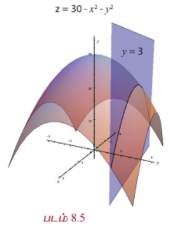
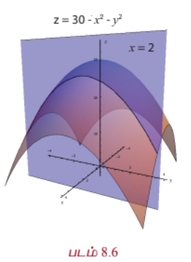

எடுத்துக்காட்டாக $g(x, y) = 30 - x^2 - y^2$, $x, y \in \mathbb{R}$ என்பதைக் காண்போம். கொடுக்கப்பட்ட புள்ளி $(x, y) \in \mathbb{R}^2$ எனில் $z = 30 - x^2 - y^2$ என்பது வரைபடத்தில் $z$ அச்சு தூரத்தைக் குறிக்கிறது. எனவே $(x, y, 30 - x^2 - y^2)$ என்ற புள்ளி $xy$ -தளத்தில் $(x, y)$ புள்ளிக்கு $30 - x^2 - y^2$ உயரத்தில் உள்ளது. உதாரணமாக $(2, 3) \in \mathbb{R}^2$ எனில் $(2, 3, 30 - 4 - 9) = (2, 3, 17)$ என்பது $g$ -ன் வரைபடத்தின் மீதுள்ளது. நாம் $y = 3$ என எடுத்துக்கொண்டால் $g(x, 3) = 21 - x^2$ என்ற சார்பு $x$ -ஐ மட்டும் சார்ந்துள்ளது. எனவே அது ஒரு வளைவரையாக இருக்க வேண்டும்.

இதுபோல் $x = 2$ என எடுத்துக்கொண்டால் $g(2, y) = 26 - y^2$ என்ற சார்பு $y$ -ஐ மட்டும் சார்ந்துள்ளது. இந்த இரு நிலைகளிலும் கிடைக்கும் சார்புகள் இருபடிச் சார்புகளாக இருப்பதால் வரைபடம் ஒரு பரவளையமாக இருக்கும். $z = g(x, y)$ -இலிருந்து கிடைக்கும் வளைபரப்பு ஒரு **பரவளையத் திண்மம்** (paraboloid) எனப்படும்.

$g(x, 3) = 21 - x^2$ என்பது ஒரு பரவளையம், இது $z = 30 - x^2 - y^2$ என்ற வளைபரப்பும் $y = 3$ என்ற தளமும் வெட்டும்போது கிடைப்பது ஆகும். (படம் 8.5-ஐக் காண்க). இதுபோல் $g(2, y) = 26 - y^2$ என்பது ஒரு பரவளையம் ; இது $z = 30 - x^2 - y^2$ என்ற வளைபரப்பும் $x = 2$ என்ற தளமும் வெட்டும்போது கிடைக்கின்றது. (படம் 8.6-ஐக் காண்க).

$x, y$ என்ற இரு மாறிகளில் அமைந்த சார்பு $F$ -ஐப் போலவே $z = F(x, y)$ என்ற சமன்பாட்டைக் கொண்டு முப்பரிமாணம் $\mathbb{R}^3$ -லும் காணலாம். இது $\mathbb{R}^3$ -ல் உள்ள வளைபரப்பைக் குறிக்கும்.

---

#### 8.3.1 ஒரு மாறியில் அமைந்த சார்புகளின் எல்லை மற்றும் தொடர்ச்சித் தன்மையின் மீள்பார்வை (நினைவு கூர்தல்)
#### (Recall of Limit and Continuity of Functions of One Variable)

இரு மாறிகளில் அமைந்த சார்பின் தொடர்ச்சித் தன்மையைப் பற்றி படிப்பதற்கு முன்னர் ஒரு மாறியில் அமைந்த சார்பின் தொடர்ச்சித் தன்மையை நினைவு கூர்வோம். XI-ஆம் வகுப்பில் பின்வரும் வரையறையை நாம் பார்த்துள்ளோம்.

$f : (a, b) \rightarrow \mathbb{R}$ என்ற சார்பு, $x_0 \in (a, b)$ என்ற புள்ளியில் தொடர்ச்சியானது எனில் பின்வரும் நிபந்தனைகளை நிறைவு செய்ய வேண்டும்.

(1) $x_0$ இல் $f$ வரையறுக்கப்பட்டிருக்கும்

(2) $\lim_{x \rightarrow x_0} f(x) = L$ எல்லை மதிப்பு உள்ளது

(3) $L = f(x_0)$

மேற்கண்ட இரண்டாவது நிபந்தனையை சரியாகப் புரிந்து கொள்வதில்தான் தொடர்ச்சித் தன்மையின் முக்கிய கருத்து உள்ளது. $x$ -ன் மதிப்பு $x_0$ -ஐ நெருங்க நெருங்க $f(x)$ -ன் மதிப்பு $L$ -ஐ நெருங்கி நெருங்கிச் செல்வதை $\lim_{x \rightarrow x_0} f(x) = L$ என எழுதுகின்றோம்.

இன்னும் தெளிவாகவும், துல்லியமாகவும் புரிந்து கொள்ள இரண்டாவது நிபந்தனையை அண்மைப் பகுதியைக் கொண்டு மாற்றி எழுதுவோம். இது இரண்டு மாறிகளில் அமைந்த சார்புகளின் தொடர்ச்சியைப் பற்றி அறிய உதவும்.

#### வரையறை 8.5 (சார்பின் எல்லை)

$f : (a, b) \rightarrow \mathbb{R}$ மற்றும் $x_0 \in (a, b)$ என்க. $L$ -ன் ஒவ்வொரு அண்மைப்பகுதி $(L - \epsilon, L + \epsilon)$, $\epsilon > 0$ -க்கும் $f(x) \in (L - \epsilon, L + \epsilon)$, $\forall x \in (x_0 - \delta, x_0 + \delta) \setminus \{x_0\}$ எனுமாறு $x_0$ -க்கு ஒரு அண்மைப்பகுதி $(x_0 - \delta, x_0 + \delta) \subset (a, b)$, $\delta > 0$ இருக்குமானால் $x = x_0$ இல் $f$ -ன் எல்லை மதிப்பு $L$ என்கிறோம்.

மேற்கண்ட அண்மைப்பகுதி வழியான நிபந்தனையை மட்டு மதிப்பு பயன்படுத்தியும் கீழ்க்கண்டவாறு கூறலாம் :

$\forall \epsilon > 0$, $|f(x) - L| < \epsilon$ எனுமாறு $\delta > 0$ மற்றும் $0 < |x - x_0| < \delta$.

இதன் பொருள் $x \neq x_0$ மற்றும் $x$-ன் மதிப்பு $x_0$ -இலிருந்து $\delta$ தூரத்திற்குள்ளாக இருக்குமானால் $f(x)$ என்பது $L$ -இலிருந்து $\epsilon$ தூரத்திற்குள்ளாக இருக்கும்.

பின்வரும் படங்கள் $\epsilon$ மற்றும் $\delta$ -க்கு இடையேயான தொடர்பை விளக்கும்.

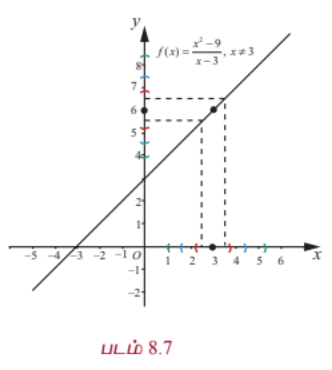
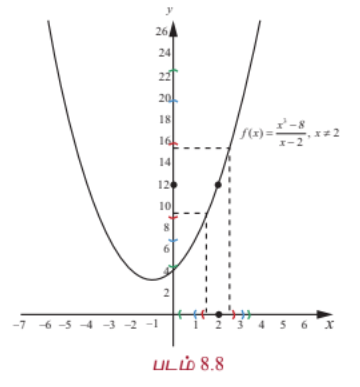

பின்வரும் நிபந்தனைகள் (1) & (2) -ஐ நிறைவு செய்தால் $x_0$ -ஐ தவிர $x_0$ -ன் அருகாமைப் பகுதியின் $f$ என்ற சார்பின் $x_0$ -க்கான எல்லை மதிப்பு உள்ளது என்பதை நாம் XI -ஆம் வகுப்பில் படித்துள்ளோம்.

(1) $\lim_{x \rightarrow x_0^+} f(x) = L_1$ (வலது எல்லை)

(2) $\lim_{x \rightarrow x_0^-} f(x) = L_2$ (இடது எல்லை)

(3) $L_1 = L_2$

$x_0$ இல் $f$ என்ற சார்பு வரையறுக்கப்பட்டது என்க. அதாவது $f(x_0) = L$. தற்போது $L_1 = L_2 = L$ எனில் சார்பு $f$ ஆனது $x = x_0$ இல் தொடர்ச்சியானது ஆகும்.

ஒரு மாறியை கொண்ட சார்புகளின் எல்லை மற்றும் தொடர்ச்சித் தன்மையில் அண்மைப் பகுதி ஒரு முக்கிய பங்காற்றுகின்றது என்பதைக் கவனிக்க. இந்த நிலையில் $x_0 \in \mathbb{R}$ -ன் அண்மைப் பகுதி $(x_0 - r, x_0 + r)$, $r > 0$ ஆக இருக்கும். இரு மாறிகளைக் கொண்ட சார்புகளின் எல்லை மற்றும் தொடர்ச்சித் தன்மை பற்றி அறிய $(u, v) \in \mathbb{R}^2$ -ன் அண்மைப் பகுதியை வரையறுக்க வேண்டியுள்ளது. எனவே $(u, v) \in \mathbb{R}^2$ மற்றும் $r > 0$ -க்கு , $(u, v)$ என்ற புள்ளியின் அண்மைப்பகுதி

$$B_r((u, v)) = \{(x, y) \in \mathbb{R}^2 : (x - u)^2 + (y - v)^2 < r^2\}$$

என்ற கணமாகும்.

$(u, v)$ என்ற புள்ளியின் $r$ -அண்மைப் பகுதி என்பது மையம் $(u, v)$ மற்றும் ஆரம் $r > 0$ கொண்ட ஒரு திறந்த வட்டு ஆகும். அண்மைப் பகுதியிலிருந்து மையம் நீக்கப்பட்டால் அது **துளையிடப்பட்ட அண்மைப்பகுதி** ஆகும்.

### 8.4 இரு மாறிகள் உடைய சார்புகளின் எல்லை மற்றும் தொடர்ச்சித் தன்மை
### (Limit and Continuity of Functions of Two Variables)

#### வரையறை 8.6 (சார்பின் எல்லை)

$A = \{(x, y) : a < x < b, c < y < d\}, F : A \rightarrow \mathbb{R}^2$ என்க. $F$ பின்வரும் நிபந்தனைகளை நிறைவு செய்யுமானால் $(u, v)$ இல் $F$ -இன் எல்லை $L$ எனப்படும்:

$L$ -ன் ஒவ்வொரு அண்மைப்பகுதி $(L - \epsilon, L + \epsilon)$, $\epsilon > 0$ -க்கும் $(x, y) \in (B_\delta((u, v)) \setminus \{(u, v)\}) \cap A$, $F(x, y) \in (L - \epsilon, L + \epsilon)$ எனுமாறு $(u, v)$ -ன் ஒரு $\delta$ -அண்மைப்பகுதி $B_\delta((u, v)) \subset A$ இருக்கும்.

இதை $\lim_{(x, y) \rightarrow (u, v)} F(x, y) = L$ என எழுதலாம்.

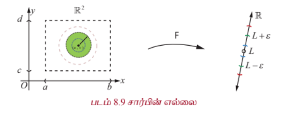

ஒரு மாறியில் அமைந்த சார்புகளை ஒப்பிடும்போது இரு மாறியில் அமைந்த சார்பின் எல்லை காணும் முறை நுட்பமானது ஆகும். இங்கு $(u, v)$ -க்கான ஒவ்வொரு சாத்தியமான பாதை வழியாகவும் $(x, y)$ என்பது $(u, v)$ -ஐ நெருங்கும்போது $F(x, y)$ -ன் மதிப்பு, ஒரே மதிப்பு $L$ -ஐ நெருங்க வேண்டும். (நேர்கோடுகளாக இல்லாத பாதைகளையும் சேர்த்து) எல்லை முறையை படம் 8.9 விளக்குகின்றது.

ஒரு மாறியில் அமைந்த சார்புகளுக்கான எல்லை விதிகள் (எல்லை தேற்றங்கள்) பல மாறிகளைக் கொண்ட சார்புகளுக்கும் பொருந்தும்.

தற்போது ஒரு மாறியில் அமைந்த சார்புகளின் தொடர்ச்சித் தன்மையை பின்பற்றி இரு மாறிகளாலான சார்புகளின் தொடர்ச்சித் தன்மையை வரையறுப்போம்.

#### வரையறை 8.7 (தொடர்ச்சித் தன்மை)

$A = \{(x, y) : a < x < b, c < y < d\} \subset \mathbb{R}^2, F : A \rightarrow \mathbb{R}$ என்ற சார்பு $F (u, v)$ இல் தொடர்ச்சியானது எனில் பின்வருவனவற்றை நிறைவு செய்ய வேண்டும்.

(1) $(u, v)$ இல் $F$ வரையறுக்கப்பட்டுள்ளது

(2) $\lim_{(x, y) \rightarrow (u, v)} F(x, y) = L$ இருக்கிறது

(3) $L = F(u, v)$

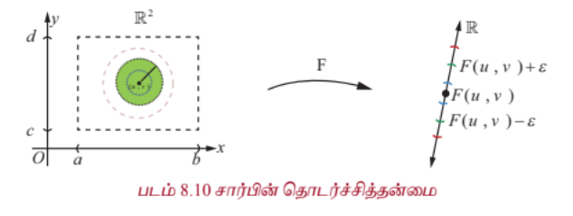

#### குறிப்புரை

(1) படம் 8.10 இல் $L = F(u, v)$ என்பது $(u, v)$ இல் தொடர்ச்சித்தன்மையை விளக்கும்.

(2) $f(x_1, x_2, \ldots, x_n)$ -ன் தொடர்ச்சித் தன்மையும் மேற்கூறிய முறையிலேயே வரையறுக்கப்படும்.

இரு மாறிகளுடைய சார்புகளின் தொடர்ச்சித் தன்மை பற்றிய சில எடுத்துக்காட்டுகளைக் காண்போம்.

---

### எடுத்துக்காட்டு 8.8

அனைத்து $(x, y) \in \mathbb{R}^2$ -க்கும் $f(x, y) = \frac{3x - 5y + 8}{1 + x^2 + y^2}$ எனில் $\mathbb{R}^2$ இல் $f$ தொடர்ச்சியானது எனக் காட்டுக.

#### தீர்வு

$(a, b) \in \mathbb{R}^2$ என்பது ஏதேனும் ஒரு புள்ளி என்க. $(a, b)$ இல் $f$ -ன் தொடர்ச்சித் தன்மை பற்றி ஆராய்வோம்.

அதாவது $(a, b)$ இல் $f$ -ன் தொடர்ச்சித் தன்மைக்கான மூன்று நிபந்தனைகளையும் சரிபார்க்கலாம்.

$f(a, b) = \frac{3a - 5b + 8}{1 + a^2 + b^2}$ என்பது வரையறுக்கப்பட்டது. எனவே முதல் நிபந்தனை மெய்யாகின்றது.

அடுத்ததாக $\lim_{(x, y) \rightarrow (a, b)} f(x, y)$ எல்லை மதிப்பு உள்ளதா எனப் பார்க்க வேண்டும்.

$\lim_{(x, y) \rightarrow (a, b)} (3x - 5y + 8) = 3a - 5b + 8$ மற்றும் $\lim_{(x, y) \rightarrow (a, b)} (1 + x^2 + y^2) = 1 + a^2 + b^2 \neq 0$.

எனவே எல்லை மதிப்பின் பண்புகள் படி

$$\lim_{(x, y) \rightarrow (a, b)} f(x, y) = \frac{\lim_{(x, y) \rightarrow (a, b)} (3x - 5y + 8)}{\lim_{(x, y) \rightarrow (a, b)} (1 + x^2 + y^2)} = \frac{3a - 5b + 8}{1 + a^2 + b^2} = L$$

என்றிருக்கிறது.

இப்போது $\lim_{(x, y) \rightarrow (a, b)} f(x, y) = L = f(a, b)$ என்பது கவனிக்கத்தக்கது. எனவே $(a, b)$ இல் $f$ -ன் தொடர்ச்சித் தன்மைக்கான மூன்று நிபந்தனைகளையும் $f$ நிறைவு செய்கின்றது.

மேலும் $(a, b)$ என்பது $\mathbb{R}^2$ இல் உள்ள ஏதேனும் ஒரு புள்ளி என்பதால் $f$ என்ற சார்பு $\mathbb{R}^2$ -ன் எல்லா புள்ளிகளிலும் தொடர்ச்சித் தன்மையுடையது என முடிவு செய்யலாம்.

---

### எடுத்துக்காட்டு 8.9

$f(x, y) = \frac{xy}{x^2 + y^2}$, $(x, y) \neq (0, 0)$ மற்றும் $f(0, 0) = 0$ என்ற சார்பை எடுத்துக் கொள்வோம். இந்தச் சார்பு $f$, $(0, 0)$ -ஐத் தவிர $\mathbb{R}^2$ -ன் மற்ற எல்லா புள்ளிகளிலும் தொடர்ச்சித்தன்மையுடையது என நிறுவுக.

#### தீர்வு

ஒவ்வொரு $(x, y) \in \mathbb{R}^2$ -க்கும் $f$ வரையறுக்கப்பட்டுள்ளதைக் கவனிக்கவும். முதலில் $(a, b) \neq (0, 0)$ இல் $f$-ன் தொடர்ச்சித் தன்மையை சரிபார்ப்போம். எடுத்துக்காட்டாக $(a, b) = (2, 5)$ எனில் $f(2, 5) = \frac{10}{29}$. மேற்கண்ட எடுத்துக்காட்டு போலவே $\lim_{(x, y) \rightarrow (2, 5)} xy = 10$ மற்றும் $\lim_{(x, y) \rightarrow (2, 5)} (x^2 + y^2) = 4 + 25 = 29 \neq 0$.

எனவே $\lim_{(x, y) \rightarrow (2, 5)} \frac{xy}{x^2 + y^2} = \frac{10}{29}$.

$f(2, 5) = \frac{10}{29} = \lim_{(x, y) \rightarrow (2, 5)} \frac{xy}{x^2 + y^2}$, எனவே $(2, 5)$ இல் $f$ தொடர்ச்சித் தன்மையுடையது என்பது தெளிவாகிறது.

இதுபோன்ற வாதங்களைக் கொண்டு $(a, b) \neq (0, 0)$ ஆக உள்ள ஒவ்வொரு புள்ளியிலும் $f$ தொடர்ச்சித் தன்மையுடையது எனலாம். தற்போது $(0, 0)$ இல் தொடர்ச்சியைக் காண்போம்.

வரையறையின்படி $f(0, 0) = 0$. அடுத்தது நாம் $\lim_{(x, y) \rightarrow (0, 0)} \frac{xy}{x^2 + y^2}$ எல்லை மதிப்பு உள்ளதா அல்லது இல்லையா எனப் பார்க்க வேண்டும்.

முதலில் $(0, 0)$ வழிச் செல்லும் $y = mx$ நேர்க்கோட்டுப்பாதையில் எல்லை மதிப்பை சரிபார்க்கலாம்.

$$\lim_{(x, y) \rightarrow (0, 0)} \frac{xy}{x^2 + y^2} = \lim_{x \rightarrow 0} \frac{x(mx)}{x^2 + m^2x^2} = \frac{m}{1 + m^2}, \quad \text{if } m \neq 0.$$

எனவே $m$ -ன் வெவ்வேறான மதிப்புகளுக்கு வெவ்வேறான $\frac{m}{1 + m^2}$ -ன் மதிப்புகள் கிடைக்கின்றன.

எனவே $\lim_{(x, y) \rightarrow (0, 0)} \frac{xy}{x^2 + y^2}$ -ன் மதிப்பு இல்லை. அதனால் $(0, 0)$ இல் $f$ தொடர்ச்சியானது அல்ல.

எனவே $(0, 0)$ -ஐத் தவிர மற்ற எல்லா புள்ளிகளிலும் $f$ தொடர்ச்சியானது ஆகும்.

---

### எடுத்துக்காட்டு 8.10

$g(x, y) = \frac{x^2y^2}{x^2 + y^2}$, $(x, y) \neq (0, 0)$ மற்றும் $g(0, 0) = 0$ எனில் $\mathbb{R}^2$ இல் $g$ தொடர்ச்சியானது என நிறுவுக.

#### தீர்வு

சார்பு $g$ எல்லா $(x, y) \in \mathbb{R}^2$ க்கும் வரையறுக்கப்பட்டது என்க. மேற்கண்ட எடுத்துக்காட்டுகளைப் போல் $(x, y) \neq (0, 0)$ ஆக உள்ள எல்லா புள்ளிகளுக்கும், $g$ தொடர்ச்சியானது என எளிதாக சரிபார்க்கலாம். அடுத்து $(0, 0)$ இல் $g$ -ன் தொடர்ச்சித் தன்மையை சரிபார்க்கலாம். $(0, 0)$ இல் $g$ -க்கு எல்லை உள்ளது மற்றும் $L = g(0, 0) = 0$ எனில்

$$|g(x, y) - g(0, 0)| = \left|\frac{x^2y^2}{x^2 + y^2} - 0\right| = \frac{x^2y^2}{x^2 + y^2} \le \frac{(x^2 + y^2)(y^2)}{x^2 + y^2} = y^2$$

... (9)

இங்கு கடைசி வரியில் நாம் $x^2y^2 \le (x^2 + y^2)(y^2)$ என்பதை அனைத்து $x, y \in \mathbb{R}$ எனப் பயன்படுத்தியுள்ளதைக் கவனிக்க. (இது $0 \le (x^2)(y^2)$ -இலிருந்து கிடைப்பது) $(x, y) \rightarrow (0, 0)$ என்பதால் $y \rightarrow 0$ எனக் கிடைக்கின்றது. சமன்பாடு (9)-லிருந்து $\lim_{(x, y) \rightarrow (0, 0)} g(x, y) = 0$ எனக் கிடைக்கின்றது. ஆகவே $(0, 0)$ இல் $g$ தொடர்ச்சியானது என்பது நிரூபிக்கப்படுகிறது. எனவே $\mathbb{R}^2$ -ன் ஒவ்வொரு புள்ளியிலும் $g$ தொடர்ச்சியானதாகும்.

---

### பயிற்சி 8.3

1. சார்பு $g(x, y) = \frac{2x^2y + 3x}{x^2 + y^2}$ -க்கு எல்லை மதிப்பு இருக்குமானால், $\lim_{(x, y) \rightarrow (1, 2)} g(x, y)$ -ஐ மதிப்பிடுக.

2. எல்லை மதிப்பு இருக்குமானால், $\lim_{(x, y) \rightarrow (0, 0)} \cos\left(\frac{3x^2 + y^2}{2}\right)$ -ஐ மதிப்பிடுக.

3. $(x, y) \neq (0, 0)$ -க்கு $f(x, y) = \frac{y^2 - xy}{y^2}$ எனில், $\lim_{(x, y) \rightarrow (0, 0)} f(x, y) = 0$ என நிறுவுக.

4. எல்லை மதிப்பு இருக்குமானால், $\lim_{(x, y) \rightarrow (0, 0)} \frac{\cos x e^y}{\sin y}$ -ஐ மதிப்பிடுக.

5. $(x, y) \neq (0, 0)$ -க்கு $g(x, y) = \frac{x^2y}{x^4 + y^2}$, மற்றும் $g(0, 0) = 0$ என்க.

   (i) ஒவ்வொரு $y = mx$, $m \in \mathbb{R}$ நேர்கோட்டுப் பாதையிலும் $\lim_{(x, y) \rightarrow (0, 0)} g(x, y) = 0$ என நிறுவுக.

   (ii) ஒவ்வொரு $y = kx^2$, $k \in \mathbb{R} \setminus \{0\}$ பரவளையப் பாதையிலும் $\lim_{(x, y) \rightarrow (0, 0)} g(x, y) = \frac{k}{1 + k^2}$ என நிறுவுக.

6. சார்பு $f(x, y) = \frac{x^2 + y^2}{2y^2 + 1}$, ஒவ்வொரு $(x, y) \in \mathbb{R}^2$ -க்கும் தொடர்ச்சியானது என நிறுவுக.

7. சார்பு $g(x, y) = \frac{e^x \sin x}{x}$, $x \neq 0$ மற்றும் $g(0, 0) = 1$ என்க. புள்ளி $(0, 0)$ இல் $g$ தொடர்ச்சியானது என நிறுவுக.

### 8.5 பகுதி வகைக்கெழுக்கள் (Partial Derivatives)

இந்தப் பிரிவில் ஒரு மாறியில் அமைந்த சார்பின் வகைக்கெழுக் கருத்துருவை பல மாறிகளில் அமைந்த மெய் சார்புகளுக்கு எவ்வாறு விரிவுபடுத்துவது என்பது பற்றி காண்போம். முதலில் இரு மாறிகளைக் கொண்ட சார்புகளை எடுத்துக் கொள்வோம். $A = \{(x, y) : a < x < b, c < y < d\} \subset \mathbb{R}^2$ மற்றும் $F : A \rightarrow \mathbb{R}$ என்பது ஒரு மெய்ச்சார்பு என்க. $(x_0, y_0) \in A$ என்க; $(x_0, y_0)$ என்ற புள்ளியில் $x$ என்ற மாறியில் மட்டும் ஏற்படும் மாற்றத்திற்கேற்ப $F$ இல் ஏற்படும் மாற்றத்தைக் காண்போம்.

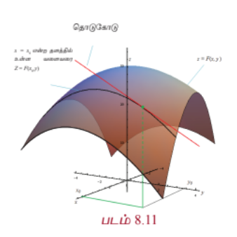
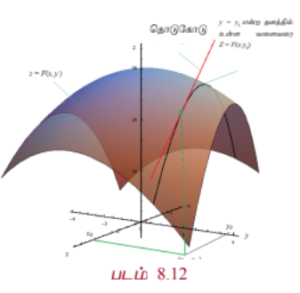

மேற்கூறியவாறு $F(x, y_0)$ என்பது $x$ -ஐ மட்டும் சார்ந்துள்ள சார்பு ஆகும். மேலும் இது $y = y_0$ என்ற தளமும் $z = F(x, y)$ என்ற வளைபரப்பும் வெட்டும் ஒரு வளைவரையாகும். எனவே $z = F(x, y_0)$ என்ற வளைவரையின் தொடுகோட்டுச் சாய்வை $x = x_0$ இல் $F(x, y_0)$ -ன் $x$ -ஐப் பொருத்த வகைக்கெழுவை $x = x_0$ -ல் காண்பதன் மூலம் காணலாம். இதேபோல் $z = F(x_0, y)$ என்ற வளைவரையின் சாய்வை $F(x_0, y)$ -ன் $y$ -ஐப் பொருத்த வகைக்கெழுவை $y = y_0$ இல் அறிவது மூலம் காணலாம். இந்த முக்கியக் கருத்துக்கள்தான் பின்வரும் பகுதி வகைக்கெழுவின் வரையறைக்கு நம்மை ஊக்குவிப்பதாக அமையும்.

#### வரையறை 8.8

$A = \{(x, y) : a < x < b, c < y < d\} \subset \mathbb{R}^2, F : A \rightarrow \mathbb{R}$ மற்றும் $(x_0, y_0) \in A$ என்க.

(i) $\lim_{h \rightarrow 0} \frac{F(x_0 + h, y_0) - F(x_0, y_0)}{h}$ -ன் மதிப்பு காணத்தக்கது எனில் $(x_0, y_0) \in A$ இல் $F$ -க்கு $x$ -ஐப் பொருத்த **பகுதி வகைக்கெழு** உள்ளது எனலாம். இந்த எல்லை மதிப்பு $\frac{\partial F}{\partial x}(x_0, y_0)$ எனக் குறிக்கப்படும்.

... (10)

(ii) $\lim_{k \rightarrow 0} \frac{F(x_0, y_0 + k) - F(x_0, y_0)}{k}$ -ன் எல்லை மதிப்பு காணத்தக்கது எனில் $(x_0, y_0) \in A$ இல் $F$ -க்கு $y$ -ஐப் பொருத்த பகுதி வகைக்கெழு உள்ளது எனலாம். இந்த எல்லை மதிப்பு $\frac{\partial F}{\partial y}(x_0, y_0)$ எனக் குறிக்கப்படும்.

... (11)

#### குறிப்புரை

1. மூன்று அல்லது அதற்கு மேற்பட்ட மாறிகளைக் கொண்ட சார்புகளுக்கும் பகுதி வகைக்கெழுவானது இதே முறையில் தான் வரையறுக்கப்படும்.

2. $\partial F$ என்பது "பகுதி $F$" என்றும் $\partial x$ என்பதை "பகுதி $x$" என்றும் படிக்க வேண்டும். எனவே $\frac{\partial F}{\partial x}$ என்பதை "பகுதி $F$ வகுத்தல் பகுதி $x$" எனப் படிக்க வேண்டும். இதை "தோ $F$ வகுத்தல் தோ $x$" எனவும் படிக்கலாம்.

3. இதேபோல் $\frac{\partial F}{\partial y}$ என்பதை "பகுதி $F$ வகுத்தல் பகுதி $y$" அல்லது "தோ $F$ வகுத்தல் தோ $y$" எனப் படிக்கலாம்.

4. சில நேரங்களில் $\frac{\partial F}{\partial x}(x_0, y_0)$ என்பது $F_x(x_0, y_0)$ அல்லது $\left(\frac{\partial F}{\partial x}\right)_{(x_0, y_0)}$ எனக் குறிக்கப்படும். இதுபோல் $\frac{\partial F}{\partial y}(x_0, y_0)$ என்பது $F_y(x_0, y_0)$ அல்லது $\left(\frac{\partial F}{\partial y}\right)_{(x_0, y_0)}$ எனக் குறிக்கப்படும்.

5. $x$ -ஐப் பொருத்து $F$ -ன் பகுதி வகைக்கெழுவைக் காணும்போது கவனிக்க வேண்டியது, மாறி $y$ -ஐ மாறிலியாகக் கருதி $x$ -ஐப் பொருத்து வகைக்கெழு காண வேண்டும். அதாவது எந்த மாறியைப் பொருத்து பகுதி வகைக்கெழு காண வேண்டுமோ அதைத் தவிர மற்ற அனைத்து மாறிகளும் மாறிலியாகக் கருதப்படும். இதனால் தான் நாம் அவற்றை "பகுதி வகைக்கெழு" என்கிறோம்.

6. $A$ -ன் ஒவ்வொரு புள்ளிக்கும் $F$ -க்கு $x$ -ஐப் பொருத்த பகுதி வகைக்கெழு இருக்குமானால் $A$ -க்கு $\frac{\partial F}{\partial x}(x, y)$ உள்ளது என்கிறோம். இங்கு $\frac{\partial F}{\partial x}(x, y)$ என்பது மறுபடியும் $A$ மீதான ஒரு மெய் மதிப்பு சார்பாகும்.

7. (4) -ன்படி வகைக்கெழுவின் எல்லா விதிகளும் (கூட்டல், பெருக்கல், வகுத்தல் மற்றும் சங்கிலி விதி) சூத்திரங்களும் பகுதி வகைக்கெழுவிற்கும் பொருந்தும்.

ஒரு மாறியில் அமைந்த சார்பிற்கு ஒரு புள்ளியில் வகைக்கெழு இருக்குமானால் அந்தப் புள்ளியில் சார்பு தொடர்ச்சித் தன்மை பெற்றிருக்கும் என்பதை நினைவு கூர்வோம். $x, y$ என்ற இரு மாறிகளில் அமைந்த சார்பு $F$ -ன் $\frac{\partial F}{\partial x}(x, y)$ மற்றும் $\frac{\partial F}{\partial y}(x, y)$ -ஐ வரையறை செய்தோம். $(x, y)$ இல் $F$ -க்கு பகுதி வகைக்கெழு காணத்தக்கது எனில், $(x, y)$ இல் $F$ தொடர்ச்சித் தன்மை உள்ளதாகுமா? இது எப்போதும் மெய்யாக இருக்க வேண்டியது அவசியமில்லை என்பதை பின்வரும் எடுத்துக்காட்டு விளக்குகின்றது.

---

### எடுத்துக்காட்டு 8.11

$xy \neq 0$ எனில் $f(x, y) = 0$ மற்றும் $xy = 0$ எனில் $f(x, y) = 1$ என்க.

(i) மதிப்பிடுக : $\frac{\partial f}{\partial x}(0, 0)$, $\frac{\partial f}{\partial y}(0, 0)$.

(ii) $(0, 0)$ இல் $f$ தொடர்ச்சியற்றது என நிறுவுக.

#### தீர்வு

$\mathbb{R}^2$ இல் $x, y$ -அச்சுகளின் மீது $f$ -ன் மதிப்பு 1 என்பதையும் மற்ற எல்லா இடங்களிலும் 0 என்பதையும் கவனிக்க.

(i) $\frac{\partial f}{\partial x}(0, 0) = \lim_{h \rightarrow 0} \frac{f(h, 0) - f(0, 0)}{h} = \lim_{h \rightarrow 0} \frac{1 - 1}{h} = 0$;

$\frac{\partial f}{\partial y}(0, 0) = \lim_{k \rightarrow 0} \frac{f(0, k) - f(0, 0)}{k} = \lim_{k \rightarrow 0} \frac{1 - 1}{k} = 0$.

(ii) இதனை நிறுவ $y = x$ என்ற நேர்கோட்டுப் பாதையில் $(x, y) \rightarrow (0, 0)$ எனும்போது $f$ -ன் எல்லை மதிப்பை கணக்கிடுவோம். $\lim_{(x, y) \rightarrow (0, 0)} f(x, y) = 0$; ஏனெனில் $y = x$ என்ற நேர்கோட்டுப் பாதையில் $x \neq 0$ எனில் $f(x, y) = 0$. ஆனால் $f(0, 0) = 1 \neq 0$; எனவே $(0, 0)$ இல் $f$ தொடர்ச்சியற்றது.

---

### எடுத்துக்காட்டு 8.12

அனைத்து $(x, y) \in \mathbb{R}^2$ -க்கும் $F(x, y) = x^2y^3 + 7y^2x$ எனில் $\frac{\partial F}{\partial x}(-1, 3)$ மற்றும் $\frac{\partial F}{\partial y}(2, 1)$ ஆகியவற்றைக் காண்க.

#### தீர்வு

முதலில் $\frac{\partial F}{\partial x}(x, y)$ கணக்கிட்டு அதனை $(-1, 3)$ இல் மதிப்பிடுவோம். $y$ -ஐ மாறிலியாகக் கொண்டு $x$ -ஐ பொருத்து வகையிடுவோம்.

$$\frac{\partial F}{\partial x}(x, y) = \frac{\partial}{\partial x}(x^2y^3 + 7y^2x) = \frac{\partial}{\partial x}(x^2y^3) + \frac{\partial}{\partial x}(7y^2x)$$

$$= 2xy^3 + 7y^2$$

எனவே $\frac{\partial F}{\partial x}(-1, 3) = 2(-1)(27) + 7(9) = -54 + 63 = 9$.

$y$ -ஐப் பொருத்து பகுதி வகைக்கெழு காண

இதுபோல்

$$\frac{\partial F}{\partial y}(x, y) = \frac{\partial}{\partial y}(x^2y^3 + 7y^2x) = \frac{\partial}{\partial y}(x^2y^3) + \frac{\partial}{\partial y}(7y^2x)$$

$$= 3x^2y^2 + 14xy$$

எனவே $\frac{\partial F}{\partial y}(2, 1) = 3(4)(1) + 14(2)(1) = 12 + 28 = 40$.

---

மேற்கண்ட எடுத்துக்காட்டில் $\frac{\partial F}{\partial x}(x, y) = 2xy^3 + 7y^2$ என்பது மறுபடியும் இரு மாறிகளைக் கொண்ட சார்பாகும். எனவே இந்தச் சார்பின் $x$ -ஐ பொருத்து அல்லது $y$ -ஐ பொருத்து பகுதி வகைக்கெழு காண முடியும். உதாரணமாக $G(x, y) = 2xy^3 + 7y^2$ என எடுத்துக் கொண்டால் $\frac{\partial G}{\partial x} = 6xy^2$. $G(x, y) = \frac{\partial F}{\partial x}$ என்பதால் $\frac{\partial}{\partial x}\left(\frac{\partial F}{\partial x}\right) = 6xy^2$ எனக் கிடைக்கிறது. இது $\frac{\partial^2 F}{\partial x^2}$ எனக் குறிக்கப்படும். இது $F$ -இன் $x$ -ஐப் பொருத்த **இரண்டாம் வரிசைப் பகுதி வகைக்கெழு** என அழைக்கப்படுகிறது.

மேலும் $\frac{\partial G}{\partial y} = 6xy^2 + 14y$, $G(x, y) = \frac{\partial F}{\partial x}$ என்பதால் $\frac{\partial}{\partial y}\left(\frac{\partial F}{\partial x}\right) = 6xy^2 + 14y$. இதை $\frac{\partial^2 F}{\partial y \partial x}$ எனக் குறிக்கலாம். இது $x, y$ -ஐப் பொருத்த $F$ -ன் **கலப்புப் பகுதி வகைக்கெழு** என அழைக்கப்படுகிறது.

இதுபோல் $\frac{\partial}{\partial x}\left(\frac{\partial F}{\partial y}\right) = 6xy^2 + 14y$ எனக் கணக்கிடலாம்.

மேலும் $\frac{\partial F}{\partial y}(x, y)$ -ஐ $y$ -ஐப் பொருத்து பகுதி வகைக்கெழு காண $\frac{\partial^2 F}{\partial y^2}$ எனக் கிடைக்கிறது. இது $F$ -ன் $y$ -ஐப் பொருத்த இரண்டாம் வரிசை பகுதி வகைக்கெழு எனப்படும். எனவே ஏதேனும் ஒரு உட்கணம் $\{(x, y) | a < x < b, c < y < d\} \subset \mathbb{R}^2$ மீது வரையறுக்கப்பட்ட $F$ என்ற சார்பிற்கு பின்வரும் குறியீடுகள் உள்ளன:

$$\frac{\partial^2 F}{\partial x^2} = \frac{\partial}{\partial x}\left(\frac{\partial F}{\partial x}\right) = F_{xx}, \quad \frac{\partial^2 F}{\partial x \partial y} = \frac{\partial}{\partial x}\left(\frac{\partial F}{\partial y}\right) = F_{xy},$$

$$\frac{\partial^2 F}{\partial y \partial x} = \frac{\partial}{\partial y}\left(\frac{\partial F}{\partial x}\right) = F_{yx}, \quad \frac{\partial^2 F}{\partial y^2} = \frac{\partial}{\partial y}\left(\frac{\partial F}{\partial y}\right) = F_{yy}$$

மேற்கண்ட அனைத்தும் $F$ -ன் **இரண்டாம் வரிசை பகுதி வகைக்கெழுக்கள்** எனப்படும். இவ்வாறு அதிகப்படியான வரிசையுடைய பகுதி வகைக்கெழுக்களையும் வரையறுக்கலாம்.

எடுத்துக்காட்டாக $\frac{\partial^3 F}{\partial x \partial y^2} = \frac{\partial}{\partial x}\left(\frac{\partial^2 F}{\partial y^2}\right)$, மற்றும் $\frac{\partial^3 F}{\partial x \partial y \partial x} = \frac{\partial}{\partial x}\left(\frac{\partial}{\partial y}\left(\frac{\partial F}{\partial x}\right)\right)$.

பகுதி வகைக்கெழுக்களுக்கான மேலும் ஒரு எடுத்துக்காட்டைக் காணலாம்.

---

### எடுத்துக்காட்டு 8.13

அனைத்து $(x, y) \in \mathbb{R}^2$ -க்கும் $f(x, y) = \sin(x^2y) + e^{2x^2+5y+3}$ எனில் $\frac{\partial f}{\partial x}$, $\frac{\partial f}{\partial y}$, $\frac{\partial^2 f}{\partial y \partial x}$, $\frac{\partial^2 f}{\partial x \partial y}$ ஆகியவற்றைக் காண்க.

#### தீர்வு

$\frac{\partial f}{\partial x}(x, y)$ -ஐ முதலில் கணக்கிடுவோம். $f$ என்பது இரு சார்புகளின் கூட்டல் எனவே

$$\frac{\partial f}{\partial x} = \frac{\partial}{\partial x}\sin(x^2y) + \frac{\partial}{\partial x}e^{2x^2+5y+3}$$

$$= \cos(x^2y)(2xy) + e^{2x^2+5y+3}(4x)$$

$$= 2xy\cos(x^2y) + 4xe^{2x^2+5y+3}$$

இதுபோல்,

$$\frac{\partial f}{\partial y} = \frac{\partial}{\partial y}\sin(x^2y) + \frac{\partial}{\partial y}e^{2x^2+5y+3}$$

$$= \cos(x^2y)(x^2) + e^{2x^2+5y+3}(5)$$

$$= x^2\cos(x^2y) + 5e^{2x^2+5y+3}$$

அடுத்து,

$$\frac{\partial^2 f}{\partial y \partial x} = \frac{\partial}{\partial y}\left(\frac{\partial f}{\partial x}\right) = \frac{\partial}{\partial y}(2xy\cos(x^2y) + 4xe^{2x^2+5y+3})$$

$$= \frac{\partial}{\partial y}(2xy\cos(x^2y)) + \frac{\partial}{\partial y}(4xe^{2x^2+5y+3})$$

$$= 2x\cos(x^2y) - 2x^3y\sin(x^2y) + 20xe^{2x^2+5y+3}$$

இறுதியாக,

$$\frac{\partial^2 f}{\partial x \partial y} = \frac{\partial}{\partial x}\left(\frac{\partial f}{\partial y}\right) = \frac{\partial}{\partial x}(x^2\cos(x^2y) + 5e^{2x^2+5y+3})$$

$$= \frac{\partial}{\partial x}(x^2\cos(x^2y)) + \frac{\partial}{\partial x}(5e^{2x^2+5y+3})$$

$$= 2x\cos(x^2y) - 2x^3y\sin(x^2y) + 20xe^{2x^2+5y+3}$$

இங்கு முதலில் நாம் கூட்டல் விதியையும் அதையடுத்து சங்கிலி விதியையும் மூன்றாவதாக பெருக்கல் விதியையும் பயன்படுத்தியுள்ளோம் என்பதைக் கவனிக்க. மேலும் $f_{xy} = f_{yx}$ ஆக உள்ளதையும் காணலாம். இது தற்செயலானதா? அல்லது எப்போதும் உண்மையானதா? உண்மையில் சில புள்ளிகளில் சில சார்புகளுக்கு $f_{xy} \neq f_{yx}$ ஆக இருக்கும். பின்வரும் தேற்றம் $f_{xy} = f_{yx}$ ஆக இருப்பதற்கான நிபந்தனையை தரும்.

---

### தேற்றம் 8.1 (கிளெய்ராட்டின் தேற்றம்)

$A = \{(x, y) : a < x < b, c < y < d\} \subset \mathbb{R}^2$, $f : A \rightarrow \mathbb{R}$ என்ற சார்பு $A$ இல் $f_{xy}$ மற்றும் $f_{yx}$ காணப்பட்டு அவை தொடர்ச்சியானதாகவும் இருக்குமானால் $A$ இல் $f_{xy} = f_{yx}$ என்பதாக இருக்கும்.

இந்நிரூபணம் இப்பாடப்பகுதியில் தவிர்க்கப்படுகின்றது.

---

### எடுத்துக்காட்டு 8.14

அனைத்து $(x, y) \in \mathbb{R}^2$ -க்கும் $w(x, y) = \frac{x^2y + 1}{e^y} + y^2$ எனில் $\frac{\partial^2 w}{\partial y \partial x}$ மற்றும் $\frac{\partial^2 w}{\partial x \partial y}$ காண்க.

#### தீர்வு

முதலில் $\frac{\partial w}{\partial x}(x, y)$ காண்போம்.

$$\frac{\partial w}{\partial x} = \frac{\partial}{\partial x}\left(\frac{x^2y + 1}{e^y} + y^2\right) = \frac{2xy}{e^y}$$

இதிலிருந்து $\frac{\partial w}{\partial x}(x, y) = \frac{2xy}{e^y}$ எனவே $\frac{\partial^2 w}{\partial y \partial x} = \frac{\partial}{\partial y}\left(\frac{2xy}{e^y}\right) = \frac{2x(1 - y)}{e^y}$ எனக் கிடைக்கின்றது.

மேலும்,

$$\frac{\partial w}{\partial y}(x, y) = \frac{\partial}{\partial y}\left(\frac{x^2y + 1}{e^y} + y^2\right)$$

$$= \frac{x^2e^y - (x^2y + 1)e^y}{e^{2y}} + 2y = \frac{x^2 - x^2y - 1}{e^y} + 2y$$

எனவே $\frac{\partial^2 w}{\partial x \partial y} = \frac{\partial}{\partial x}\left(\frac{x^2 - x^2y - 1}{e^y} + 2y\right) = \frac{2x(1 - y)}{e^y}$.

---

### வரையறை 8.9

$A = \{(x, y) : a < x < b, c < y < d\} \subset \mathbb{R}^2$ என்க. சார்பு $u : A \rightarrow \mathbb{R}^2$ என்பது $\frac{\partial^2 u}{\partial x^2} + \frac{\partial^2 u}{\partial y^2} = 0$, $\forall (x, y) \in A$ எனுமாறு இருக்குமானால் $u : A \rightarrow \mathbb{R}^2$ ஆனது $A$ -ல் **சீரானது** எனலாம். இது **இலாபிலாஸின் சமன்பாடு** எனப்படும்.

இலாபிலாஸின் சமன்பாடு வெப்பக்கடத்தல், மின்னியல் புலம், திரவ ஓட்டம் ஆகியவற்றில் இயல்பாக நிகழ்கின்றது.

---

### எடுத்துக்காட்டு 8.15

அனைத்து $(x, y) \in \mathbb{R}^2$ -க்கும் $u(x, y) = e^x \cos(x^2 - y^2)$ எனில் $\mathbb{R}^2$ இல் $u$ சீரானது என நிறுவுக.

#### தீர்வு

இங்கு $u$ என்ற சார்பு இலாபிலாஸின் சமன்பாட்டை நிறைவு செய்கின்றது எனக் காட்ட வேண்டும்.

$$u_x = e^x \cos(x^2 - y^2) - 2xe^x \sin(x^2 - y^2)$$

எனவே

$$u_{xx} = e^x \cos(x^2 - y^2) - 2xe^x \sin(x^2 - y^2) - 2e^x \sin(x^2 - y^2) - 4x^2e^x \cos(x^2 - y^2)$$

$$= e^x(1 - 4x^2)\cos(x^2 - y^2) - 4xe^x \sin(x^2 - y^2)$$

இதேபோல்

$$u_y = 2ye^x \sin(x^2 - y^2)$$

எனவே

$$u_{yy} = 2e^x \sin(x^2 - y^2) - 4y^2e^x \cos(x^2 - y^2)$$

$$u_{xx} + u_{yy} = e^x(1 - 4x^2)\cos(x^2 - y^2) - 4xe^x \sin(x^2 - y^2) + 2e^x \sin(x^2 - y^2) - 4y^2e^x \cos(x^2 - y^2)$$

$$= e^x(1 - 4x^2 - 4y^2)\cos(x^2 - y^2) + (2 - 4x)e^x \sin(x^2 - y^2) \neq 0$$

எனவே $\mathbb{R}^2$ இல் $u$ சீரானது அல்ல.

---

### பயிற்சி 8.4

1. பின்வரும் சார்புகளுக்கு கொடுக்கப்பட்ட புள்ளிகளில் பகுதி வகைக்கெழுக்கள் காண்க.

   (i) $f(x, y) = 3x^2 - 2xy + 5y^2 + x - 2$; $(2, 5)$

   (ii) $g(x, y) = 3x^2 + 5y^2 + 2x + 1$; $(-2, 1)$

   (iii) $h(x, y, z) = x^2 \sin(yz)$, $x = 2, y = \frac{\pi}{4}, z = 1$

   (iv) $G(x, y) = e^{x^2 + 3y^2}\log(xy)$, $(-1, 1)$

2. பின்வரும் சார்புகளுக்கு $f_{xy}$, $f_{yx}$ காண்க. மேலும் $f_{xy} = f_{yx}$ எனக் காட்டுக.

   (i) $f(x, y) = \frac{x}{y} + \sin\left(\frac{x}{y}\right)$

   (ii) $f(x, y) = \tan^{-1}\left(\frac{x}{y}\right)$

   (iii) $f(x, y) = \cos(x^2y^3)$

3. If $U(x, y, z) = \frac{x^2y + z}{x^2y^2 + 3z}$, எனில் $\frac{\partial U}{\partial x}$, $\frac{\partial U}{\partial y}$, மற்றும் $\frac{\partial U}{\partial z}$ -ஐக் காண்க.

4. If $U(x, y, z) = \log(x^3 + y^3 + z^3)$, எனில் $\frac{\partial U}{\partial x} + \frac{\partial U}{\partial y} + \frac{\partial U}{\partial z}$ -ஐக் காண்க.

5. பின்வரும் சார்புகளுக்கு $g_{xx}, g_{yy}, g_{xy}$ மற்றும் $g_{yx}$ ஆகியவற்றைக் காண்க.

   (i) $g(x, y) = x^3e^{2y} + y^2$

   (ii) $g(x, y) = \log(5x + 3y)$

   (iii) $g(x, y) = \cos(2x^3y) + 7x^5y$

6. $w(x, y, z) = \frac{xy + z}{x^2 + y^2 + z^2}$, $(x, y, z) \neq (0, 0, 0)$ எனில் $\frac{\partial^2 w}{\partial x^2} + \frac{\partial^2 w}{\partial y^2} + \frac{\partial^2 w}{\partial z^2} = 0$ எனக் காட்டுக.

7. $V(x, y) = e^{xy}(y\cos x - \sin x)$ எனில் $\frac{\partial^2 V}{\partial x^2} + \frac{\partial^2 V}{\partial y^2} = 0$ என நிறுவுக.

8. $w(x, y) = x\sin(xy) + y$ எனில் $\frac{\partial^2 w}{\partial y \partial x} = \frac{\partial^2 w}{\partial x \partial y}$ என நிறுவுக.

9. $v(x, y, z) = x^3 + y^3 + z^3 - 3xyz$ எனில் $\frac{\partial^2 v}{\partial y \partial z} = \frac{\partial^2 v}{\partial z \partial y}$ என நிறுவுக.

10. ஒரு நிறுவனம் ஒவ்வொரு வாரமும் இரு விதமான கணிப்பான்களை உற்பத்தி செய்கின்றது. அவற்றில் $A$ வகை கணிப்பான்கள் $x$ எண்ணிக்கையும், $B$ வகை கணிப்பான்கள் $y$ எண்ணிக்கையும் உள்ளன. வார வரவு மற்றும் செலவுச் சார்புகள் (ரூபாயில்) முறையே

    $R(x, y) = 80x + 90y - 0.04x^2 - 0.05y^2 - 0.05xy$

    மற்றும்

    $C(x, y) = 8x + 6y + 2000$

    எனத் தரப்பட்டுள்ளன.

    (i) இலாபச் சார்பு $P(x, y)$ -ஐக் காண்க.

    (ii) $\frac{\partial P}{\partial x}(1200, 1800)$ மற்றும் $\frac{\partial P}{\partial y}(1200, 1800)$ ஆகியவற்றைக் கண்டு முடிவுகளை விளக்குக.

### 8.6 பல மாறிகள் கொண்ட சார்பின் நேரியல் தோராய மதிப்பு மற்றும் வகையீடு
### (Linear Approximation and Differential of a function of several variables)

இந்த அத்தியாயத்தில் ஆரம்பத்தில் ஒரு மாறியில் அமைந்த சார்பின் நேரியல் தோராய மதிப்பு மற்றும் வகையீடு பற்றி அறிந்தோம். இங்கு அதே போன்ற கருத்துக்களை இரண்டு மற்றும் மூன்று மாறிகளில் அமைந்த சார்புகளுக்குக் காண்போம். பொதுவாக, இதேபோன்று பல மாறிகளுடைய சார்பிற்கும் வரையறுக்கலாம்.

#### வரையறை 8.10

$A = \{(x, y) : a < x < b, c < y < d\} \subset \mathbb{R}^2$, $F : A \rightarrow \mathbb{R}$, மற்றும் $(x_0, y_0) \in A$ என்க.

(i) $(x_0, y_0) \in A$ என்ற புள்ளியில் $F$ -ன் **நேரியல் தோராய மதிப்பு**

$$L(x, y) = F(x_0, y_0) + \frac{\partial F}{\partial x}(x_0, y_0)(x - x_0) + \frac{\partial F}{\partial y}(x_0, y_0)(y - y_0)$$

... (12)

(ii) $F$ -ன் **வகையீடு**

$$dF = \frac{\partial F}{\partial x}(x, y)dx + \frac{\partial F}{\partial y}(x, y)dy$$

... (13)

இங்கு $dx = \Delta x$, $dy = \Delta y$ என வரையறுக்கப்படுகிறது.

இங்கு மூன்று மாறிகளுடைய சார்பின் நேரியல் தோராய மதிப்பு மற்றும் வகையீடு ஆகியவற்றைப் பற்றி காண்போம். பல மாறிகளுடைய மெய்மதிப்புச் சார்புகளுக்கு நாம் நேரியல் தோராய மதிப்பும் வகையீடும் வரையறுக்க முடியும் எனினும் மூன்று மாறிகள் உடைய சார்போடு நாம் நிறுத்திக் கொள்வோம்.

#### வரையறை 8.11

$A = \{(x, y, z) : a < x < b, c < y < d, e < z < f\} \subset \mathbb{R}^3$, $F : A \rightarrow \mathbb{R}$ மற்றும் $(x_0, y_0, z_0) \in A$ என்க.

(i) $(x_0, y_0, z_0) \in A$ என்ற புள்ளியில் $F$ ன் **நேரியல் தோராய மதிப்பு**

$$L(x, y, z) = F(x_0, y_0, z_0) + \frac{\partial F}{\partial x}(x_0, y_0, z_0)(x - x_0) + \frac{\partial F}{\partial y}(x_0, y_0, z_0)(y - y_0) + \frac{\partial F}{\partial z}(x_0, y_0, z_0)(z - z_0)$$

... (14)

என வரையறுக்கப்படுகிறது.

(ii) $F$ -ன் **வகையீடு**

$$dF = \frac{\partial F}{\partial x}(x, y, z)dx + \frac{\partial F}{\partial y}(x, y, z)dy + \frac{\partial F}{\partial z}(x, y, z)dz$$

... (15)

இங்கு $dx = \Delta x, dy = \Delta y$ மற்றும் $dz = \Delta z$ என வரையறுக்கப்படுகிறது.

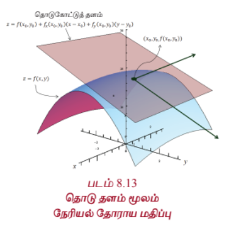

வடிவக் கணிதத்தின்படி, ஒரு மாறியில் அமைந்த சார்பு $f$ -ன், $x_0$ என்ற புள்ளிக்கான நேரியல் தோராய மதிப்பு $x_0$ என்ற புள்ளியில் $y = f(x)$ -ன் வரைபடத்திற்கான தொடுகோட்டைக் குறிக்கின்றது. இதுபோல் இரண்டு மாறிகளில் அமைந்த சார்பு $F$ -ன் $(x_0, y_0)$ என்ற புள்ளிக்கான நேரியல் தோராய மதிப்பு $(x_0, y_0)$ என்ற புள்ளியில் $z = F(x, y)$ என்ற வரைபடத்தின் **தொடு தளத்தை**க் குறிக்கின்றது.

---

### எடுத்துக்காட்டு 8.16

$w(x, y, z) = x^2y + y^2z + z^2x$, $x, y, z \in \mathbb{R}$ எனில் வகையீடு $dw$ காண்க.

#### தீர்வு

முதலில் $w_x, w_y$ மற்றும் $w_z$ காண்போம்.

$$w_x = 2xy + z^2, \quad w_y = x^2 + 2yz, \quad w_z = y^2 + 2zx$$

எனவே (15)-ன் படி வகையீடு

$$dw = (2xy + z^2)dx + (x^2 + 2yz)dy + (y^2 + 2zx)dz$$

---

### எடுத்துக்காட்டு 8.17

$U(x, y, z) = x^2y - xyz + \sin(z)$ $x, y, z \in \mathbb{R}$ எனில் $(-2, 1, 0)$ இல் $U$ இன் நேரியல் தோராய மதிப்பு காண்க.

#### தீர்வு

(14)-ன் படி நேரியல் தோராய மதிப்பு

$$L(x, y, z) = U(x_0, y_0, z_0) + \frac{\partial U}{\partial x}(x_0, y_0, z_0)(x - x_0) + \frac{\partial U}{\partial y}(x_0, y_0, z_0)(y - y_0) + \frac{\partial U}{\partial z}(x_0, y_0, z_0)(z - z_0)$$

$$U_x = 2xy - yz, \quad U_y = x^2 - xz, \quad U_z = -xy + \cos z$$

$(x_0, y_0, z_0) = (-2, 1, 0)$, எனவே $U(-2, 1, 0) = 4$, $U_x(-2, 1, 0) = -4$, $U_y(-2, 1, 0) = 4$ மற்றும் $U_z(-2, 1, 0) = 2 + 1 = 3$.

ஆகவே,

$$L(x, y, z) = 4 - 4(x + 2) + 4(y - 1) + 3z = 4 - 4x - 8 + 4y - 4 + 3z = -4x + 4y + 3z - 8$$

என்பது $(-2, 1, 0)$ இல் $U$ -ன் நேரியல் தோராய மதிப்பாகும்.

---

### பயிற்சி 8.5

1. $w(x, y) = x^3 - xy + 3y^2$, $x, y \in \mathbb{R}$ எனில் $(1, -1)$ இல் $w$-ன் நேரியல் தோராய மதிப்பு காண்க.

2. $z(x, y) = x^2 + y^4 - x^3y$, $x, y \in \mathbb{R}$ எனில் $(2, -1)$ இல் $z$ -ன் நேரியல் தோராய மதிப்பு காண்க.

3. $v(x, y) = x^2 - xy + \frac{1}{4}y^2 + 7$, $x, y \in \mathbb{R}$ எனில் வகையீடு $dv$ -ஐக் காண்க.

4. $V(x, y, z) = xy + yz + zx$, $x, y, z \in \mathbb{R}$ எனில் வகையீடு $dV$ -ஐக் காண்க.

---

#### 8.6.1 சார்பினது சார்பு விதி (Function of Function Rule)

இரு மாறிகள் $x, y$ இல் அமைந்த சார்பு $F$ என்க. சில நேரங்களில் இந்த மாறிகள் அதே மதிப்பகத்தைக் கொண்ட வேறு ஒரு மாறியின் சார்பாகவும் இருக்கலாம், எனவே சார்பு $F$ ஒரே ஒரு மாறியைத்தான் சார்ந்துள்ளது. எனவே சார்பு $F$ -ஐ நாம் ஒரு மாறி சார்பாகக் கருதி $\frac{dF}{dt}$ -ஐ பற்றிப் படிக்கலாம். இது தற்செயலானது அல்ல, இதை நிரூபிக்க முடியும்.

#### தேற்றம் 8.2

$W(x, y)$ என்பது $\frac{\partial W}{\partial x}, \frac{\partial W}{\partial y}$ என்ற பகுதி வகைக்கெழுக்கள் உள்ள $x, y$ என்ற இரு மாறிகளில் அமைந்த சார்பு என்க. $x, y$ என்ற இரு மாறிகளும் $t$ என்ற ஒரு மாறியைப் பொருத்து வகையிடக்கூடிய சார்புகள் எனில் $t$ -ஐப் பொருத்து $W$ -ம் வகையிடக்கூடிய சார்பாகும்.

$$\frac{dW}{dt} = \frac{\partial W}{\partial x}\frac{dx}{dt} + \frac{\partial W}{\partial y}\frac{dy}{dt}$$

... (16)

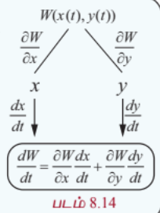

மேற்கண்ட தேற்றத்தை விளக்க ஓர் எடுத்துக்காட்டைக் காண்போம்.

---

### எடுத்துக்காட்டு 8.18

$F(x, y) = x^2 - 2y^2 + 2xy$ மற்றும் $x(t) = \cos t, y(t) = \sin t, t \in [0, 2\pi]$ என்ற சார்பிற்கு மேற்கண்ட தேற்றத்தைச் சரிபார்க்கவும்.

#### தீர்வு

$F(x, y) = x^2 - 2y^2 + 2xy$ மற்றும் $x(t) = \cos t, y(t) = \sin t$ என்க.

$F(x, y) = \cos^2 t - 2\sin^2 t + 2\cos t\sin t$ என்பதால் $F$ என்பது $t$ என்ற ஒரு மாறியில் அமைந்த சார்பாகும். சங்கிலி விதியைப் பயன்படுத்த

$$\frac{dF}{dt} = 2\cos t(-\sin t) - 4\sin t(\cos t) + 2(-\sin t)(\sin t) + 2(\cos t)(\cos t)$$

$$= -6\sin t\cos t + 2(\cos^2 t - \sin^2 t)$$

$$= -3\sin 2t + 2\cos 2t$$

மறுபுறம்

$$\frac{\partial F}{\partial x}\frac{dx}{dt} + \frac{\partial F}{\partial y}\frac{dy}{dt} = (2x + 2y)\frac{dx}{dt} + (-4y + 2x)\frac{dy}{dt}$$

$$= (2\cos t + 2\sin t)(-\sin t) + (-4\sin t + 2\cos t)(\cos t)$$

$$= -2\sin t\cos t - 2\sin^2 t - 4\sin t\cos t + 2\cos^2 t$$

$$= -6\sin t\cos t + 2(\cos^2 t - \sin^2 t)$$

$$= -3\sin 2t + 2\cos 2t$$

$$= \frac{dF}{dt}$$

---

### எடுத்துக்காட்டு 8.19

$g(x, y) = \cos(2x^3 + y^3) - x^2y$, $x(t) = e^t$, $y(t) = t^2$, $t \in \mathbb{R}$ எனில் $\frac{dg}{dt}$ -ஐக் காண்க.

#### தீர்வு

கிளை வரைபடத்தைப் பயன்படுத்தி $\frac{dg}{dt}$ -ஐக் காண்போம்.

இதற்கு முதலில் $\frac{\partial g}{\partial x}, \frac{\partial g}{\partial y}, \frac{dx}{dt}$ மற்றும் $\frac{dy}{dt}$ -ஐக் காண்போம்.

$$\frac{\partial g}{\partial x} = -6x^2\sin(2x^3 + y^3) - 2xy, \quad \frac{\partial g}{\partial y} = -3y^2\sin(2x^3 + y^3) - x^2$$

$\frac{dx}{dt} = e^t$, மற்றும் $\frac{dy}{dt} = 2t$.

எனவே

$$\frac{dg}{dt} = \frac{\partial g}{\partial x}\frac{dx}{dt} + \frac{\partial g}{\partial y}\frac{dy}{dt}$$

$$= \left[-6x^2\sin(2x^3 + y^3) - 2xy\right]e^t + \left[-3y^2\sin(2x^3 + y^3) - x^2\right]2t$$

$$= -6e^{3t}\sin(2e^{3t} + t^6) - 2e^{2t}t^2 - 6t^5\sin(2e^{3t} + t^6) - 2te^{2t}$$

$$= -6e^{3t}\sin(2e^{3t} + t^6) - 6t^5\sin(2e^{3t} + t^6) - 2e^{2t}t^2 - 2te^{2t}$$

---

மேலும் $W(x, y)$ என்ற சார்பு சில நேரங்களில் $x = x(s, t)$, மற்றும் $y = y(s, t)$, $s, t \in \mathbb{R}$ எனவும் இருக்கலாம். அப்போது $W$ என்ற சார்பு $s$ மற்றும் $t$ இவற்றைச் சார்ந்துள்ளதாக கருதலாம். $x, y$ என்ற இரு மாறிகளுக்கும் $s, t$ -ஐப் பொருத்து பகுதி வகைக்கெழுவும், $W$ -க்கு $x, y$ ஐப் பொருத்து பகுதி வகைக்கெழுவும் உள்ளது எனில் பின்வரும் தேற்றத்தைப் பயன்படுத்தி $W$ -க்கு $s$ மற்றும் $t$ -ஐப் பொருத்து பகுதி வகைக்கெழுவைக் கணக்கிட முடியும்.

#### தேற்றம் 8.3

$W(x, y)$ என்பது $x, y$ என்ற இரு மாறிகளில் அமைந்த $\frac{\partial W}{\partial x}, \frac{\partial W}{\partial y}$ என்ற பகுதி வகைக்கெழுக்கள் கொண்ட சார்பு என்க. $x = x(s, t)$ மற்றும் $y = y(s, t)$, $s, t \in \mathbb{R}$ என்ற இரு மாறிகளுக்கும் $s$ மற்றும் $t$-ஐப் பொருத்த பகுதி வகைக்கெழுக்கள் உண்டு எனில்,

$$\frac{\partial W}{\partial s} = \frac{\partial W}{\partial x}\frac{\partial x}{\partial s} + \frac{\partial W}{\partial y}\frac{\partial y}{\partial s}$$

... (17)

$$\frac{\partial W}{\partial t} = \frac{\partial W}{\partial x}\frac{\partial x}{\partial t} + \frac{\partial W}{\partial y}\frac{\partial y}{\partial t}$$

... (18)

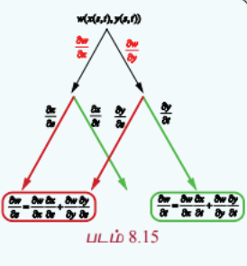

இப்பாடப்பகுதியில் மேற்கண்ட தேற்றத்திற்கு நிரூபணம் தேவையில்லை எனக் கருதி விடப்படுகின்றது. மேற்கண்ட தேற்றம் மிகவும் பயனுள்ளது. எடுத்துக்காட்டாக $x = r\cos\theta$, மற்றும் $y = r\sin\theta$, $r \ge 0$, $\theta \in \mathbb{R}$ என்ற சூழலைக் கருத்தில் கொள்வோம். (கார்டீசியன் வடிவத்திலிருந்து துருவ வடிவத்திற்கு மாற்ற) மேற்கண்ட தேற்றத்தை $n$ மாறிகள் கொண்ட சார்புகளுக்கும் பொதுமைப்படுத்தலாம்.

சில எடுத்துக்காட்டுகளைக் காண்போம்.

---

### எடுத்துக்காட்டு 8.20

சார்பு $g(x, y) = 2x^2 - y^2$, $x = r - s$, $y = r + 2s$, $r, s \in \mathbb{R}^2$ எனில் $\frac{\partial g}{\partial r}, \frac{\partial g}{\partial s}$ ஆகியவற்றைக் காண்க.

#### தீர்வு

கிளை வரைபடத்தைப் பயன்படுத்தி $\frac{\partial g}{\partial r}, \frac{\partial g}{\partial s}$ -ஐக் காண்போம்.

$$\frac{\partial g}{\partial x} = 4x, \quad \frac{\partial g}{\partial y} = -2y, \quad \frac{\partial x}{\partial r} = 1, \quad \frac{\partial x}{\partial s} = -1, \quad \frac{\partial y}{\partial r} = 1, \quad \frac{\partial y}{\partial s} = 2$$

தற்போது

$$\frac{\partial g}{\partial r} = \frac{\partial g}{\partial x}\frac{\partial x}{\partial r} + \frac{\partial g}{\partial y}\frac{\partial y}{\partial r} = 4x(1) - 2y(1) = 4(r - s) - 2(r + 2s) = 2r - 8s$$

மேலும்,

$$\frac{\partial g}{\partial s} = \frac{\partial g}{\partial x}\frac{\partial x}{\partial s} + \frac{\partial g}{\partial y}\frac{\partial y}{\partial s} = 4x(-1) - 2y(2) = -4x - 4y = -4(r - s) - 4(r + 2s) = -8r - 4s$$

---

### பயிற்சி 8.6

1. சார்பு $u(x, y) = x^2 + y^4 + 3xy$, $x(t) = e^t$ மற்றும் $y(t) = \sin t$ எனில் $\frac{du}{dt}$ -ஐக் காண்க மேலும் $t = 0$ -ல் அதன் மதிப்பைக் காண்க.

2. $u(x, y, z) = x^2y^3 + z^2$, $x = \sin t$, $y = \cos 2t$, $z = e^t$ எனில் $\frac{du}{dt}$ -ஐக் காண்க

3. $w(x, y, z) = xy + z$, $x = e^t$, $y = \sin 2t$, $z = \cos 2t$ எனில் $\frac{dw}{dt}$ -ஐக் காண்க

4. $U(x, y, z) = xyz$, $x = e^{-t}$, $y = \cos t$, $z = \sin t$, $t \in \mathbb{R}$ எனில் $\frac{dU}{dt}$ -ஐக் காண்க

5. $w(x, y) = x^3 - 6xy + y^2$, $x = e^s + 2$, $y = \cos s$, $s \in \mathbb{R}$ எனில் $\frac{dw}{ds}$ -ஐக் காண்க மற்றும் $s = 0$ இல் அதன் மதிப்பைக் காண்க.

6. $z(x, y) = \tan^{-1}\left(\frac{x}{y}\right)$, $x = st$, $y = s e^{-t}$, $s, t \in \mathbb{R}$ எனில் $\frac{\partial z}{\partial s}$ மற்றும் $\frac{\partial z}{\partial t}$ ஆகியவற்றை $s = t = 1$ இல் காண்க.

7. $U(x, y) = e^x \sin y$ என்க. இங்கு $x = s^2 + t^2$, $y = st$, $s, t \in \mathbb{R}$. $\frac{\partial U}{\partial s}, \frac{\partial U}{\partial t}$ காண்க மற்றும் $s = t = 1$ இல் அவற்றை மதிப்பிடுக.

8. $z(x, y) = x^3 - 3x^2y + 3y^3$ என்க. இங்கு $x = s e^t$, $y = s e^{-t}$, $s, t \in \mathbb{R}$. $\frac{\partial z}{\partial s}$ மற்றும் $\frac{\partial z}{\partial t}$ -ஐக் காண்க.

9. $W(x, y, z) = xy + yz + zx$, $x = u - v$, $y = uv$, $z = u + v$, $u, v \in \mathbb{R}$ எனில் $\frac{\partial W}{\partial u}, \frac{\partial W}{\partial v}$ காண்க மற்றும் $\left(1, \frac{1}{2}\right)$ இல் அவற்றின் மதிப்பைக் காண்க.

---

#### 8.6.2 சமபடித்தான சார்புகள் மற்றும் ஆய்லரின் தேற்றம்
#### (Homogeneous Functions and Euler's Theorem)

#### வரையறை 8.12

(a) $A = \{(x, y) : a < x < b, c < y < d\} \subset \mathbb{R}^2$, $F : A \rightarrow \mathbb{R}$ என்க. பொருத்தமாக வரையறுக்கப்பட்ட $\lambda, x, y$ -க்கு $(\lambda x, \lambda y) \in A$ எனில் $F(\lambda x, \lambda y) = \lambda^p F(x, y)$, $\forall \lambda \in \mathbb{R}$ எனுமாறு $p$ என்ற மாறிலி இருக்குமானால் சார்பு $F$ என்பது $A$ -ன் மீதான **சமபடித்தான** சார்பாக இருக்கும். இந்த மாறிலி $p$, சார்பு $F$ -ன் **படி** எனப்படும்.

(b) $B = \{(x, y, z) : a < x < b, c < y < d, e < z < f\} \subset \mathbb{R}^3$, $G : B \rightarrow \mathbb{R}$ என்க. பொருத்தமாக வரையறுக்கப்பட்ட $\lambda, x, y, z$ -க்கு $(\lambda x, \lambda y, \lambda z) \in B$ எனில் $G(\lambda x, \lambda y, \lambda z) = \lambda^p G(x, y, z)$, $\forall \lambda \in \mathbb{R}$ எனுமாறு $p$ என்ற ஒரு மாறிலி இருக்குமானால் சார்பு $G$ என்பது $B$ -ன் மீதான சமபடித்தான சார்பாக இருக்கும். இந்த மாறிலி $p$, $G$ -ன் படி எனப்படும்.

#### குறிப்பு

எந்த மாறியைக் கொண்டும் வகுக்கக் கூடும் என்பதால் பூச்சியத்தால் வகுப்பதைத் தவிர்க்கவே $\lambda, x, y, z$ என்பன பொருத்தமாக வரையறுக்கப்பட்டதாகக் கூறுகின்றோம்.

இதுபோன்ற சார்புகள் சாதாரண வகைக்கெழுச் சமன்பாடுகளில் (அத்தியாயம் 10) முக்கியமானவைகளாகும். சில எடுத்துக்காட்டுகளைக் காண்போம்.

$F(x, y) = x^3 - 2xy^2 + 5y^3$, $(x, y) \in \mathbb{R}^2$ என்க. பின்பு

$$F(\lambda x, \lambda y) = (\lambda x)^3 - 2(\lambda x)(\lambda y)^2 + 5(\lambda y)^3 = \lambda^3(x^3 - 2xy^2 + 5y^3) = \lambda^3 F(x, y)$$

எனவே $F$ என்பது படி 3 உடைய சமபடித்தான சார்பாகும்.

மறுபுறம் $G(x, y) = e^{x^2 + 3y}$ என்பது சமபடித்தான சார்பு அல்ல. ஏன் எனில் ஏதேனும் $\lambda \neq 1$ மற்றும் ஏதேனும் $p$ -க்கு

$$G(\lambda x, \lambda y) = e^{\lambda^2 x^2 + 3\lambda y} \neq \lambda^p e^{x^2 + 3y}$$

---

### எடுத்துக்காட்டு 8.21

சார்பு $F(x, y) = \frac{2x^2 - 5xy + 10y^2}{3x + 7y}$ படி 1 உடைய சமபடித்தான சார்பு எனக்காட்டுக.

#### தீர்வு

எல்லா $\lambda \in \mathbb{R}$.

$$F(\lambda x, \lambda y) = \frac{2(\lambda x)^2 - 5(\lambda x)(\lambda y) + 10(\lambda y)^2}{3(\lambda x) + 7(\lambda y)} = \frac{\lambda^2(2x^2 - 5xy + 10y^2)}{\lambda(3x + 7y)} = \lambda \frac{2x^2 - 5xy + 10y^2}{3x + 7y} = \lambda F(x, y)$$

எனவே $F$ ஆனது படி 1 உடைய சமபடித்தான சார்பு ஆகும்.

---

லியோனார்டு ஆய்லரின் சமபடித்தான சார்புகள் மீதான தேற்றத்தை நிரூபணமின்றி கீழே காண்போம்.

#### தேற்றம் 8.4 (ஆய்லர் தேற்றம் - நிரூபணமின்றி)

$A = \{(x, y) : a < x < b, c < y < d\} \subset \mathbb{R}^2$, $F : A \rightarrow \mathbb{R}$ என்ற சார்பு $A$ -ன் மீது தொடர்ச்சியான பகுதி வகைக்கெழு உடையதாகவும் படி $p$ உடைய சமபடித்தான சார்பாகவும் இருக்குமானால்

$$x\frac{\partial F}{\partial x}(x, y) + y\frac{\partial F}{\partial y}(x, y) = pF(x, y) \quad \forall (x, y) \in A$$

$B = \{(x, y, z) : a < x < b, c < y < d, e < z < f\} \subset \mathbb{R}^3$, $F : B \rightarrow \mathbb{R}$ என்க. $F$ என்ற சார்பு $B$ -ன் மீது தொடர்ச்சியான பகுதி வகைக்கெழு உடையதாகவும் படி $p$ உடைய சமபடித்தான சார்பாகவும் இருக்குமானால்

$$x\frac{\partial F}{\partial x}(x, y, z) + y\frac{\partial F}{\partial y}(x, y, z) + z\frac{\partial F}{\partial z}(x, y, z) = pF(x, y, z) \quad \forall (x, y, z) \in B$$

மேற்கண்ட தேற்றம் $n$ மாறிகளைக் கொண்ட எந்தவொரு சமபடித்தான சார்புக்கும் பொருந்தும். இது முதல் வகை பகுதி வகைக்கெழு காண்பதில் பயனுள்ளதாக இருக்கும்.

---

### எடுத்துக்காட்டு 8.22

$u = \sin^{-1}\left(\frac{xy}{x^2 + y^2}\right)$, எனில் $x\frac{\partial u}{\partial x} + y\frac{\partial u}{\partial y} = \frac{1}{2}\tan u$ என நிறுவுக.

#### தீர்வு

இங்கு கொடுக்கப்பட்ட சார்பு $u$ சமபடித்தானது அல்ல. எனவே ஆய்லரின் தேற்றம் சார்பு $u$ -க்கு பயன்படுத்த முடியாது. இருப்பினும் $f(x, y) = \frac{xy}{x^2 + y^2}$ என்பது சமபடித்தானது. ஏனெனில்

$$f(\lambda x, \lambda y) = \frac{(\lambda x)(\lambda y)}{(\lambda x)^2 + (\lambda y)^2} = \frac{\lambda^2 xy}{\lambda^2(x^2 + y^2)} = \lambda^0 f(x, y)$$

எனவே $f$ படி 0 உடைய சமபடித்தான சார்பாகும். இங்கு $u = \sin^{-1} f$ எனவே, $f = \sin u$ மற்றும் $f$ -ன் படி 0.

ஆய்லரின் தேற்றப்படி

$$x\frac{\partial f}{\partial x} + y\frac{\partial f}{\partial y} = 0 \cdot f(x, y) = 0$$

தற்போது $f = \sin u$ எனப் பிரதியிட,

$$x\frac{\partial}{\partial x}(\sin u) + y\frac{\partial}{\partial y}(\sin u) = 0$$

$$x\cos u\frac{\partial u}{\partial x} + y\cos u\frac{\partial u}{\partial y} = 0$$

... (19)

இருபுறமும் $\cos u$ ஆல் வகுக்க

$$x\frac{\partial u}{\partial x} + y\frac{\partial u}{\partial y} = 0$$

இது தேவையான முடிவு அல்ல. கொடுக்கப்பட்ட முடிவு வேறு. எனவே, கொடுக்கப்பட்ட சார்பு $u = \sin^{-1}\left(\frac{xy}{x^2 + y^2}\right)$ -க்கு $f(x, y) = \frac{xy}{x^2 + y^2}$ படி -1 உடைய சமபடித்தான சார்பு.

$$f(\lambda x, \lambda y) = \frac{(\lambda x)(\lambda y)}{(\lambda x)^2 + (\lambda y)^2} = \frac{\lambda^2 xy}{\lambda^2(x^2 + y^2)} = \lambda^{-1} \frac{xy}{x^2 + y^2} = \lambda^{-1} f(x, y)$$

இங்கு $f$ படி $-1$ உடைய சமபடித்தான சார்பாகும். $f = \sin u$. ஆய்லரின் தேற்றப்படி

$$x\frac{\partial f}{\partial x} + y\frac{\partial f}{\partial y} = -1 \cdot f(x, y) = -\sin u$$

$$x\frac{\partial}{\partial x}(\sin u) + y\frac{\partial}{\partial y}(\sin u) = -\sin u$$

$$x\cos u\frac{\partial u}{\partial x} + y\cos u\frac{\partial u}{\partial y} = -\sin u$$

இருபுறமும் $\cos u$ ஆல் வகுக்க

$$x\frac{\partial u}{\partial x} + y\frac{\partial u}{\partial y} = -\tan u$$

இதுவும் கொடுக்கப்பட்ட முடிவு அல்ல.

எனவே கொடுக்கப்பட்ட $u = \tan^{-1}\left(\frac{xy}{x^2 + y^2}\right)$ எனில் $f(x, y) = \frac{xy}{x^2 + y^2}$ படி -1 உடைய சமபடித்தான சார்பு.

$f = \tan u$. ஆய்லரின் தேற்றப்படி

$$x\frac{\partial f}{\partial x} + y\frac{\partial f}{\partial y} = -1 \cdot f(x, y) = -\tan u$$

$$x\frac{\partial}{\partial x}(\tan u) + y\frac{\partial}{\partial y}(\tan u) = -\tan u$$

$$x\sec^2 u\frac{\partial u}{\partial x} + y\sec^2 u\frac{\partial u}{\partial y} = -\tan u$$

இருபுறமும் $\sec^2 u$ ஆல் வகுக்க

$$x\frac{\partial u}{\partial x} + y\frac{\partial u}{\partial y} = -\frac{\tan u}{\sec^2 u} = -\sin u\cos u = -\frac{1}{2}\sin 2u$$

இதுவும் கொடுக்கப்பட்ட முடிவு அல்ல.

**குறிப்பு**: இந்தக் கணக்கை நேரிடையான கணக்கீடுகள் மூலமும் காணலாம் ; ஆனால் அந்தக் கணக்கீடு நீளமானதாக இருக்கும்.

---

### பயிற்சி 8.7

1. பின்வரும் ஒவ்வொரு சார்பும் சமபடித்தானதா இல்லையா எனக்கண்டு சமபடித்தானது எனில் அதன் படியையும் காண்க.

   (i) $f(x, y) = 2x^3 - 6x^2y + 7y^3$

   (ii) $h(x, y) = \frac{6x^9 - 20x^2y^3 + 4y^2}{3x^2 + 2y^2}$

   (iii) $g(x, y, z) = \frac{3x^2 + 5y^2 - 4z^2}{7x + 4y}$

   (iv) $U(x, y, z) = xy^2 + yz^2 + \sin\left(\frac{x^2 - y^2}{xy}\right)$

2. $f(x, y) = x^3 - 2x^2y + 3xy^2 - y^3$ என்ற சார்பு சமபடித்தானது என நிறுவுக. $f$ -ன் படியைக் கணக்கிட்டு $f$ -க்கு ஆய்லரின் தேற்றத்தைச் சரிபார்க்க.

3. $g(x, y) = \log\left(\frac{x}{y}\right)$ என்ற சார்பு சமபடித்தானது என நிறுவுக; $g$ -ன் படியைக் கணக்கிட்டு, $g$ -க்கு ஆய்லரின் தேற்றத்தைச் சரிபார்க்க.

4. $u(x, y) = \frac{x^2 + y^2}{xy}$, எனில் $x\frac{\partial u}{\partial x} + y\frac{\partial u}{\partial y} = 0$ என நிறுவுக.

5. $v(x, y) = \log\left(\frac{x^2 + y^2}{xy}\right)$, எனில் $x\frac{\partial v}{\partial x} + y\frac{\partial v}{\partial y} = 0$ என நிறுவுக.

6. $w(x, y, z) = \log\left(\frac{x^5 + y^7 - 3x^4z^{3/4}}{x^2 + y^2}\right)$, எனில் $x\frac{\partial w}{\partial x} + y\frac{\partial w}{\partial y} + z\frac{\partial w}{\partial z}$ -ஐக் காண்க.
