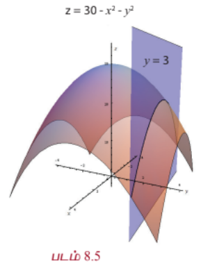
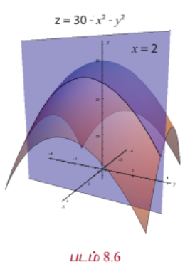
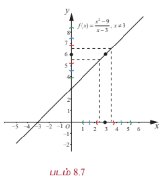
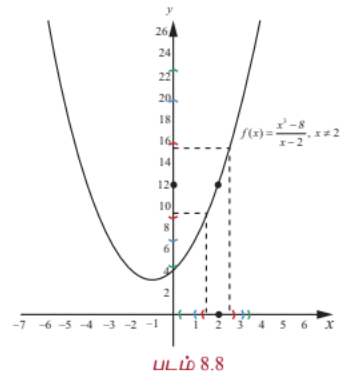

### 8.3 பல மாறிகளைக் கொண்ட சார்புகள் (Functions of several Variables)

$x$ என்ற மாறியாலான $f$ என்ற சார்பை நினைவு கூர்வோம் ; $y = f(x)$ என்ற சார்பின் தன்மையை நன்கு புரிந்து கொள்ள அதன் வரைபடத்தை வரைவோம். பொதுவாக $y = f(x)$ என்ற சார்பின் வரைபடமானது $xy$ -தளத்தில் அமைந்த ஒரு வளைவரை ஆகும். மேலும் $x = a$ இல் $f$ -ன் வகைக்கெழு $f'(a)$ என்பது $x = a$ இல் $f$ -இன் வளைவரைக்கான தொடுகோட்டுச் சாய்வைக் குறிக்கிறது.

அறிமுகத்தில் ஒன்றுக்கு மேற்பட்ட மாறிகளையுடைய சார்புகளின் தேவையைப் பற்றி பார்த்தோம். இங்கு ஒன்றுக்கு மேற்பட்ட மாறிகளையுடைய சார்புகளை அறிந்து கொள்ள சில கோட்பாடுகளை உருவாக்குவோம். முதலில் இரு மாறிகளையுடைய சார்புகளைக் காண்போம். $x$ மற்றும் $y$ இல் அமைந்த சார்பு $F(x, y)$ என்க. $F$ -ன் வரைபடம் வரைய முப்பரிமாணம் $xyz$ இல் $z = F(x, y)$ -ன் வரைபடம் வரைவோம். மேலும் இரு மாறிகள் உடைய சார்பின் தொடர்ச்சித் தன்மை, மற்றும் பகுதி வகைக்கெழுவின் கோட்பாடுகளையும் காண்போம்.

எடுத்துக்காட்டாக $g(x, y) = 30 - x^2 - y^2$, $x, y \in \mathbb{R}$ என்பதைக் காண்போம். கொடுக்கப்பட்ட புள்ளி $(x, y) \in \mathbb{R}^2$ எனில் $z = 30 - x^2 - y^2$ என்பது வரைபடத்தில் $z$ அச்சு தூரத்தைக் குறிக்கிறது. எனவே $(x, y, 30 - x^2 - y^2)$ என்ற புள்ளி $xy$ -தளத்தில் $(x, y)$ புள்ளிக்கு $30 - x^2 - y^2$ உயரத்தில் உள்ளது. உதாரணமாக $(2, 3) \in \mathbb{R}^2$ எனில் $(2, 3, 30 - 4 - 9) = (2, 3, 17)$ என்பது $g$ -ன் வரைபடத்தின் மீதுள்ளது. நாம் $y = 3$ என எடுத்துக்கொண்டால் $g(x, 3) = 21 - x^2$ என்ற சார்பு $x$ -ஐ மட்டும் சார்ந்துள்ளது. எனவே அது ஒரு வளைவரையாக இருக்க வேண்டும்.

இதுபோல் $x = 2$ என எடுத்துக்கொண்டால் $g(2, y) = 26 - y^2$ என்ற சார்பு $y$ -ஐ மட்டும் சார்ந்துள்ளது. இந்த இரு நிலைகளிலும் கிடைக்கும் சார்புகள் இருபடிச் சார்புகளாக இருப்பதால் வரைபடம் ஒரு பரவளையமாக இருக்கும். $z = g(x, y)$ -இலிருந்து கிடைக்கும் வளைபரப்பு ஒரு **பரவளையத் திண்மம்** (paraboloid) எனப்படும்.

$g(x, 3) = 21 - x^2$ என்பது ஒரு பரவளையம், இது $z = 30 - x^2 - y^2$ என்ற வளைபரப்பும் $y = 3$ என்ற தளமும் வெட்டும்போது கிடைப்பது ஆகும். (படம் 8.5-ஐக் காண்க). இதுபோல் $g(2, y) = 26 - y^2$ என்பது ஒரு பரவளையம் ; இது $z = 30 - x^2 - y^2$ என்ற வளைபரப்பும் $x = 2$ என்ற தளமும் வெட்டும்போது கிடைக்கின்றது. (படம் 8.6-ஐக் காண்க).

$x, y$ என்ற இரு மாறிகளில் அமைந்த சார்பு $F$ -ஐப் போலவே $z = F(x, y)$ என்ற சமன்பாட்டைக் கொண்டு முப்பரிமாணம் $\mathbb{R}^3$ -லும் காணலாம். இது $\mathbb{R}^3$ -ல் உள்ள வளைபரப்பைக் குறிக்கும்.

---

#### 8.3.1 ஒரு மாறியில் அமைந்த சார்புகளின் எல்லை மற்றும் தொடர்ச்சித் தன்மையின் மீள்பார்வை (நினைவு கூர்தல்)
#### (Recall of Limit and Continuity of Functions of One Variable)

இரு மாறிகளில் அமைந்த சார்பின் தொடர்ச்சித் தன்மையைப் பற்றி படிப்பதற்கு முன்னர் ஒரு மாறியில் அமைந்த சார்பின் தொடர்ச்சித் தன்மையை நினைவு கூர்வோம். XI-ஆம் வகுப்பில் பின்வரும் வரையறையை நாம் பார்த்துள்ளோம்.

$f : (a, b) \rightarrow \mathbb{R}$ என்ற சார்பு, $x_0 \in (a, b)$ என்ற புள்ளியில் தொடர்ச்சியானது எனில் பின்வரும் நிபந்தனைகளை நிறைவு செய்ய வேண்டும்.

(1) $x_0$ இல் $f$ வரையறுக்கப்பட்டிருக்கும்

(2) $\lim_{x \rightarrow x_0} f(x) = L$ எல்லை மதிப்பு உள்ளது

(3) $L = f(x_0)$

மேற்கண்ட இரண்டாவது நிபந்தனையை சரியாகப் புரிந்து கொள்வதில்தான் தொடர்ச்சித் தன்மையின் முக்கிய கருத்து உள்ளது. $x$ -ன் மதிப்பு $x_0$ -ஐ நெருங்க நெருங்க $f(x)$ -ன் மதிப்பு $L$ -ஐ நெருங்கி நெருங்கிச் செல்வதை $\lim_{x \rightarrow x_0} f(x) = L$ என எழுதுகின்றோம்.

இன்னும் தெளிவாகவும், துல்லியமாகவும் புரிந்து கொள்ள இரண்டாவது நிபந்தனையை அண்மைப் பகுதியைக் கொண்டு மாற்றி எழுதுவோம். இது இரண்டு மாறிகளில் அமைந்த சார்புகளின் தொடர்ச்சியைப் பற்றி அறிய உதவும்.

#### வரையறை 8.5 (சார்பின் எல்லை)

$f : (a, b) \rightarrow \mathbb{R}$ மற்றும் $x_0 \in (a, b)$ என்க. $L$ -ன் ஒவ்வொரு அண்மைப்பகுதி $(L - \epsilon, L + \epsilon)$, $\epsilon > 0$ -க்கும் $f(x) \in (L - \epsilon, L + \epsilon)$, $\forall x \in (x_0 - \delta, x_0 + \delta) \setminus \{x_0\}$ எனுமாறு $x_0$ -க்கு ஒரு அண்மைப்பகுதி $(x_0 - \delta, x_0 + \delta) \subset (a, b)$, $\delta > 0$ இருக்குமானால் $x = x_0$ இல் $f$ -ன் எல்லை மதிப்பு $L$ என்கிறோம்.

மேற்கண்ட அண்மைப்பகுதி வழியான நிபந்தனையை மட்டு மதிப்பு பயன்படுத்தியும் கீழ்க்கண்டவாறு கூறலாம் :

$\forall \epsilon > 0$, $|f(x) - L| < \epsilon$ எனுமாறு $\delta > 0$ மற்றும் $0 < |x - x_0| < \delta$.

இதன் பொருள் $x \neq x_0$ மற்றும் $x$-ன் மதிப்பு $x_0$ -இலிருந்து $\delta$ தூரத்திற்குள்ளாக இருக்குமானால் $f(x)$ என்பது $L$ -இலிருந்து $\epsilon$ தூரத்திற்குள்ளாக இருக்கும்.

பின்வரும் படங்கள் $\epsilon$ மற்றும் $\delta$ -க்கு இடையேயான தொடர்பை விளக்கும்.

பின்வரும் நிபந்தனைகள் (1) & (2) -ஐ நிறைவு செய்தால் $x_0$ -ஐ தவிர $x_0$ -ன் அருகாமைப் பகுதியின் $f$ என்ற சார்பின் $x_0$ -க்கான எல்லை மதிப்பு உள்ளது என்பதை நாம் XI -ஆம் வகுப்பில் படித்துள்ளோம்.

(1) $\lim_{x \rightarrow x_0^+} f(x) = L_1$ (வலது எல்லை)

(2) $\lim_{x \rightarrow x_0^-} f(x) = L_2$ (இடது எல்லை)

(3) $L_1 = L_2$

$x_0$ இல் $f$ என்ற சார்பு வரையறுக்கப்பட்டது என்க. அதாவது $f(x_0) = L$. தற்போது $L_1 = L_2 = L$ எனில் சார்பு $f$ ஆனது $x = x_0$ இல் தொடர்ச்சியானது ஆகும்.

ஒரு மாறியை கொண்ட சார்புகளின் எல்லை மற்றும் தொடர்ச்சித் தன்மையில் அண்மைப் பகுதி ஒரு முக்கிய பங்காற்றுகின்றது என்பதைக் கவனிக்க. இந்த நிலையில் $x_0 \in \mathbb{R}$ -ன் அண்மைப் பகுதி $(x_0 - r, x_0 + r)$, $r > 0$ ஆக இருக்கும். இரு மாறிகளைக் கொண்ட சார்புகளின் எல்லை மற்றும் தொடர்ச்சித் தன்மை பற்றி அறிய $(u, v) \in \mathbb{R}^2$ -ன் அண்மைப் பகுதியை வரையறுக்க வேண்டியுள்ளது. எனவே $(u, v) \in \mathbb{R}^2$ மற்றும் $r > 0$ -க்கு , $(u, v)$ என்ற புள்ளியின் அண்மைப்பகுதி

$$B_r((u, v)) = \{(x, y) \in \mathbb{R}^2 : (x - u)^2 + (y - v)^2 < r^2\}$$

என்ற கணமாகும்.

$(u, v)$ என்ற புள்ளியின் $r$ -அண்மைப் பகுதி என்பது மையம் $(u, v)$ மற்றும் ஆரம் $r > 0$ கொண்ட ஒரு திறந்த வட்டு ஆகும். அண்மைப் பகுதியிலிருந்து மையம் நீக்கப்பட்டால் அது **துளையிடப்பட்ட அண்மைப்பகுதி** ஆகும்.