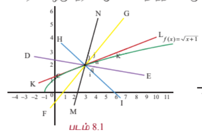
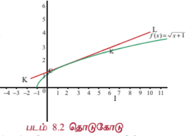

### 8.1 அறிமுகம்

#### ஊக்குவித்தல்

அன்றாட வாழ்வியலில் நாம் பல வகையான சார்புகளைப் பற்றி காண வேண்டியுள்ளது. பல நேரங்களில் சார்பற்ற மாறியின் மாறுதலுக்கு ஏற்ப சார்பின் மதிப்பில் ஏற்படும் மாற்றங்களைக் காண வேண்டியுள்ளது. அதுபோன்ற சில சூழல்களைக் கீழே காண்போம்.

- ஒரு வட்ட வடிவ உலோகத் தகடு சீராக சூடேற்றப்படுகின்றது என்க. அதன் ஆரம் அதிகரிக்கும்போது பரப்பும் அதிகரிக்கின்றது. ஆரத்தில் ஏற்படும் மாற்றத்தை தோராயமாக அளக்க முடியும் எனில் அந்தத் தகட்டின் பரப்பில் ஏற்படும் மாற்றத்தை எவ்வாறு கணக்கிடுவது?

- தலைகீழாக வைக்கப்பட்ட ஒரு நேர்வட்டக் கூம்பு வடிவத் தொட்டியில் தண்ணீர் நிரப்பப்படுகின்றது என்க. இந்த நிகழ்வில் தண்ணீரின் உயரம், நீர்பரப்பின் ஆரம், நீரின் கன அளவு ஆகியவை காலத்தைப் பொருத்து மாறுகின்றது. ஒரு சிறிய கால இடைவெளியில் ஏற்படும் உயரத்தின் மாற்றம், ஆரத்தின் மாற்றம் இவற்றை அளவிட முடியும் எனில் அந்த கால இடைவெளியில் ஏற்படும் கன அளவின் மாற்றத்தை எவ்வாறு கணக்கிடுவது?

- ஒரு செயற்கைக்கோள் ஏவுதளத்திலிருந்து விண்வெளியில் ஏவப்படுகின்றது. ஏவுதளத்திலிருந்து பாதுகாப்பான தூரத்தில் விண்கலத்தைக் கண்காணிக்க புகைப்படக் கருவி பொருத்தப்பட்டுள்ளது. விண்கலம் மேலெழும்போது புகைப்படக் கருவியின் ஏற்றக் கோணம் மாறுகின்றது. ஒரு குறிப்பிட்ட கால இடைவெளியில், புகைப்படக் கருவியின் இரு ஏற்றக் கோணங்கள் தெரியும் எனில் அந்தக் கால இடைவெளியில் விண்கலம் பயணித்த தூரத்தை எவ்வாறு கணக்கிடுவது?

இதுபோன்ற கேள்விகளுக்கான விடைகளை, அந்தச் சார்புகளின் வகைக்கெழு மற்றும் பகுதி வகைக்கெழுவைப் பயன்படுத்தி நேரியல் தோராய மதிப்பு மற்றும் வகையீடு மூலம் காணலாம்.

ஒரு மாறியின் மெய்சார்பினது வகைக்கெழுவுக்கான கருத்துக்களை நாம் முந்தைய அத்தியாயங்களில் பயின்றுள்ளோம். ஒரு சார்பினது சார்பகத்தில் அதன் அறுதி (extremum) காண்பது, மற்றும் சார்பினது வரைபடம் வரைவது போன்ற வகைக்கெழுவின் பயன்பாடுகளைப் பற்றியும் படித்துள்ளோம். இந்த அத்தியாயத்தில் ஒரு சார்பின் மதிப்பை ஒரு குறிப்பிட்ட புள்ளியில் மதிப்பிடுகின்ற மற்றுமொரு பயன்பாட்டின் விளக்கங்களினால் காண்போம்.

$y = mx + b$ போன்ற நேரியல் சார்பின் மதிப்பினைக் காண்பதை விட, நேரியல் அல்லாத சார்பின் மதிப்பைக் கணக்கிடுவது கடினமானது என்பதை நாம் அறிவோம்.

உதாரணமாக, $f(x) = \sqrt{x} + 1$, $g(x) = \frac{x}{2} - 7$ என்ற இரு சார்புகளை எடுத்துக்கொண்டு $x = 3.25$ இல் இவற்றின் மதிப்புகளைக் கணக்கிட வேண்டுமானால் எது நமக்கு எளிதாக இருக்கும்? $f(3.25)$ -ன் மதிப்பைக் கணக்கிடுவதைவிட $g(3.25)$ -ன் மதிப்பைக் கணக்கிடுவது எளிதாக இருக்கும். $f(3.25)$ -ன் மதிப்பை கணக்கிடுவதில் சிறு பிழையை நாம் அனுமதிப்போமானால், $x = 3$-க்கு அருகில் $f$ -ன் தோராய மதிப்புக் காண்பதற்கான நேரியல் சார்பை நாம் காண இயலும். மேலும் அந்த நேரியல் சார்பினை $f(3.25)$ -ன் தோராய மதிப்பை காண பயன்படுத்தலாம். ஒரு சார்பின் வரைபடம் செங்குத்தாக இல்லாமல இருக்க வேண்டுமானால் அது நேரியல் சார்பாக இருக்க வேண்டும். மேலும் இதன் மறுதலையும் உண்மை என்பது நமக்குத் தெரியும். ஒரு சார்பின் வரைபடத்தில் கொடுக்கப்பட்ட ஒரு புள்ளி வழியாக எண்ணிலடங்கா நேர்கோடுகள் இருப்பினும் அவற்றில் தொடுகோடு மட்டுமே அந்த சார்பின் சரியான தோராய மதிப்பை அளிக்க இயலும். ஏன் எனில் அப்புள்ளி $(3, 2)$-ன் அருகில் $f$-ன் வரைபடம் ஒரு நேர்கோடு போல் தோற்றமளிக்கும்.

மேற்கண்ட படங்களிலிருந்து, அவற்றில் உள்ள கோடுகளில் $x = 3$ என்ற புள்ளியில் $f(x)$ -ன் வரைபடத்துக்கான தொடுகோடு மட்டுமே $x = 3$-க்கான $f$-ன் தோராய மதிப்பைத் தர இயலும் என்பது தெளிவாகின்றது. அடிப்படையில் கொடுக்கப்பட்ட சார்பை $x = 3$-ல் நேர்க்கோட்டுச் சார்பாக மாற்றுகின்றோம். இந்தக் கருத்து தேர்ந்தெடுக்கப்பட்ட புள்ளி $(3, 2)$ இன் அருகில், உள்ளீட்டின் மாறுதலுக்கு ஏற்ப சார்பின் மதிப்பில் ஏற்படும் மாறுதலைக் கணக்கிட உதவுகின்றது. வகைக்கெழுவைப் பயன்படுத்தி வகையீடுகளின் கருத்தை அறிமுகப்படுத்துவோம். இது தேர்ந்தெடுக்கப்பட்ட புள்ளியின் அருகில் தோராய மதிப்பைக் கணக்கிடுவதில் பயனுள்ளதாக இருக்கும். வகைக்கெழு, உடனடி மாறு வீதத்தை அளிக்கின்றது. ஆனால் வகையீடுகள் ஒரு சார்பின் மதிப்பில் ஏற்படும் தோராய மாற்றத்தைக் காண உதவுகின்றது. மேலும் பிரதியிடல் முறையில் வரையறுத்த தொகையிடலின் மதிப்பு காணவும் மற்றும் வகைக்கெழுச் சமன்பாடுகளைத் தீர்க்கவும் வகையீடுகள் பயன்படுகின்றன.

வகையீடுகளைக் கற்ற பின்பு பல மாறிகளைக் கொண்ட மெய்ச் சார்புகளின் மீது கவனம் செலுத்துவோம். பல மாறிகளைக் கொண்ட சார்புகளுக்கு, ஒரு மாறியின் மீதான மெய்ச் சார்பினது "வகைக்கெழுவின்" பொதுத்தன்மையாக "பகுதி வகைக்கெழு"வை அறிமுகப்படுத்துவோம்.

நாம் ஒன்றுக்கு மேற்பட்ட மாறிகளையுடைய சார்புகளை ஏன் கருத்தில் கொள்ள வேண்டும்? அந்த தேவைக்கான எளிய சூழலைக் காண்போம். ஒரு நிறுவனம் நோட்டுப் புத்தகங்கள் மற்றும் பேனாக்களையும் உற்பத்தி செய்கின்றது. இந்த நிறுவனத்தின் இலாபம் பெருமமாக இருக்கத் தேவையான உற்பத்தி அளவைக் காணவேண்டியுள்ளது. இந்த நிகழ்வில் (நோட்டுப் புத்தகம், பேனா) இரண்டு மாறிகளின் சார்பான வரவு, செலவு மற்றும் இலாபச் சார்புகளை ஆய்வு செய்ய வேண்டியுள்ளது. இதுபோல் ஒரு பெட்டியின் கன அளவை எடுத்துக்கொண்டால் இது நீளம், அகலம், உயரம் என்ற மூன்று மாறிகளின் சார்பாக உள்ளது. மேலும் ஒரு நாட்டின் பொருளாதாரம் பல துறைகளைச் சார்ந்துள்ளது. எனவே அது பல மாறிகளைச் சார்ந்துள்ளது. இவ்வாறு ஒன்றுக்கு மேற்பட்ட மாறிகளைக் கொண்ட சார்புகளின் தேவையையும், முக்கியத்துவத்தையும் கருத்தில் கொண்டு அவற்றுக்கான "வகைக்கெழு கருத்துருக்களை" உருவாக்குவதும் தேவையான ஒன்றாகின்றது. மேலும் இரண்டு மற்றும் மூன்று மாறிகளையுடைய சார்புகளுக்கான "வகையீடு" மற்றும் அவற்றின் பயன்பாடுகளையும் காண்போம்.

இந்த அத்தியாயத்தில் அன்றாட வாழ்வில் உள்ள பயன்பாடுகளைக் காணலாம்.

| படம் 8.3 |
|---|

### கற்றலின் நோக்கங்கள்

இந்த அத்தியாயத்தின் முடிவில் மாணவர்கள் பின்வருவனவற்றை அறிந்திருப்பர்.

- ஒரு மாறியைக் கொண்ட சார்பின் ஒரு புள்ளியிலான நேரியல் தோராய மதிப்பு கணக்கிடல்

- நேரியல் தோராய மதிப்பைப் பயன்படுத்தி கணிப்பான்கள் இல்லாமலே ஒரு சார்பின் தோராய மதிப்பு காணல்

- ஒரு சார்பின் வகையீடு காணல்

- அன்றாட வாழ்வில் வரும் கணக்குகளுக்கு நேரியல் தோராய மதிப்பு மற்றும் வகையீடுகளைப் பயன்படுத்துதல்

- ஒன்றுக்கு மேற்பட்ட மாறிகளையுடைய சார்பின் பகுதி வகைக்கெழு காணல்

- இரண்டு அல்லது அதற்கு மேற்பட்ட மாறிகளையுடைய சார்புகளின் நேரியல் தோராய மதிப்பு காணல்

- ஒன்றுக்கு மேற்பட்ட மாறிகளையுடைய சார்பு சமபடித்தானதா இல்லையா என தீர்மானித்தல்

- சமபடித்தான சார்புகளுக்கு ஆய்லரின் தேற்றத்தினைப் பயன்படுத்துதல்

