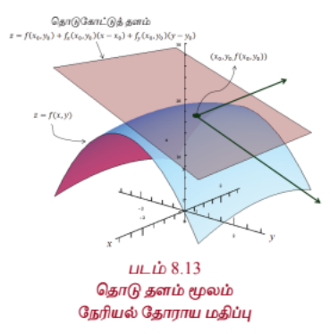
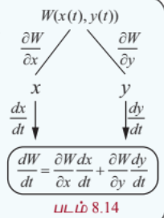
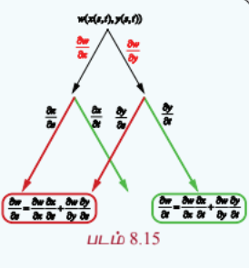

### 8.6 பல மாறிகள் கொண்ட சார்பின் நேரியல் தோராய மதிப்பு மற்றும் வகையீடு
### (Linear Approximation and Differential of a function of several variables)

இந்த அத்தியாயத்தில் ஆரம்பத்தில் ஒரு மாறியில் அமைந்த சார்பின் நேரியல் தோராய மதிப்பு மற்றும் வகையீடு பற்றி அறிந்தோம். இங்கு அதே போன்ற கருத்துக்களை இரண்டு மற்றும் மூன்று மாறிகளில் அமைந்த சார்புகளுக்குக் காண்போம். பொதுவாக, இதேபோன்று பல மாறிகளுடைய சார்பிற்கும் வரையறுக்கலாம்.

#### வரையறை 8.10

$A = \{(x, y) : a < x < b, c < y < d\} \subset \mathbb{R}^2$, $F : A \rightarrow \mathbb{R}$, மற்றும் $(x_0, y_0) \in A$ என்க.

(i) $(x_0, y_0) \in A$ என்ற புள்ளியில் $F$ -ன் **நேரியல் தோராய மதிப்பு**

$$L(x, y) = F(x_0, y_0) + \frac{\partial F}{\partial x}(x_0, y_0)(x - x_0) + \frac{\partial F}{\partial y}(x_0, y_0)(y - y_0)$$

... (12)

(ii) $F$ -ன் **வகையீடு**

$$dF = \frac{\partial F}{\partial x}(x, y)dx + \frac{\partial F}{\partial y}(x, y)dy$$

... (13)

இங்கு $dx = \Delta x$, $dy = \Delta y$ என வரையறுக்கப்படுகிறது.

இங்கு மூன்று மாறிகளுடைய சார்பின் நேரியல் தோராய மதிப்பு மற்றும் வகையீடு ஆகியவற்றைப் பற்றி காண்போம். பல மாறிகளுடைய மெய்மதிப்புச் சார்புகளுக்கு நாம் நேரியல் தோராய மதிப்பும் வகையீடும் வரையறுக்க முடியும் எனினும் மூன்று மாறிகள் உடைய சார்போடு நாம் நிறுத்திக் கொள்வோம்.

#### வரையறை 8.11

$A = \{(x, y, z) : a < x < b, c < y < d, e < z < f\} \subset \mathbb{R}^3$, $F : A \rightarrow \mathbb{R}$ மற்றும் $(x_0, y_0, z_0) \in A$ என்க.

(i) $(x_0, y_0, z_0) \in A$ என்ற புள்ளியில் $F$ ன் **நேரியல் தோராய மதிப்பு**

$$L(x, y, z) = F(x_0, y_0, z_0) + \frac{\partial F}{\partial x}(x_0, y_0, z_0)(x - x_0) + \frac{\partial F}{\partial y}(x_0, y_0, z_0)(y - y_0) + \frac{\partial F}{\partial z}(x_0, y_0, z_0)(z - z_0)$$

... (14)

என வரையறுக்கப்படுகிறது.

(ii) $F$ -ன் **வகையீடு**

$$dF = \frac{\partial F}{\partial x}(x, y, z)dx + \frac{\partial F}{\partial y}(x, y, z)dy + \frac{\partial F}{\partial z}(x, y, z)dz$$

... (15)

இங்கு $dx = \Delta x, dy = \Delta y$ மற்றும் $dz = \Delta z$ என வரையறுக்கப்படுகிறது.

வடிவக் கணிதத்தின்படி, ஒரு மாறியில் அமைந்த சார்பு $f$ -ன், $x_0$ என்ற புள்ளிக்கான நேரியல் தோராய மதிப்பு $x_0$ என்ற புள்ளியில் $y = f(x)$ -ன் வரைபடத்திற்கான தொடுகோட்டைக் குறிக்கின்றது. இதுபோல் இரண்டு மாறிகளில் அமைந்த சார்பு $F$ -ன் $(x_0, y_0)$ என்ற புள்ளிக்கான நேரியல் தோராய மதிப்பு $(x_0, y_0)$ என்ற புள்ளியில் $z = F(x, y)$ என்ற வரைபடத்தின் **தொடு தளத்தை**க் குறிக்கின்றது.

---

### எடுத்துக்காட்டு 8.16

$w(x, y, z) = x^2y + y^2z + z^2x$, $x, y, z \in \mathbb{R}$ எனில் வகையீடு $dw$ காண்க.

#### தீர்வு

முதலில் $w_x, w_y$ மற்றும் $w_z$ காண்போம்.

$$w_x = 2xy + z^2, \quad w_y = x^2 + 2yz, \quad w_z = y^2 + 2zx$$

எனவே (15)-ன் படி வகையீடு

$$dw = (2xy + z^2)dx + (x^2 + 2yz)dy + (y^2 + 2zx)dz$$

---

### எடுத்துக்காட்டு 8.17

$U(x, y, z) = x^2y - xyz + \sin(z)$ $x, y, z \in \mathbb{R}$ எனில் $(-2, 1, 0)$ இல் $U$ இன் நேரியல் தோராய மதிப்பு காண்க.

#### தீர்வு

(14)-ன் படி நேரியல் தோராய மதிப்பு

$$L(x, y, z) = U(x_0, y_0, z_0) + \frac{\partial U}{\partial x}(x_0, y_0, z_0)(x - x_0) + \frac{\partial U}{\partial y}(x_0, y_0, z_0)(y - y_0) + \frac{\partial U}{\partial z}(x_0, y_0, z_0)(z - z_0)$$

$$U_x = 2xy - yz, \quad U_y = x^2 - xz, \quad U_z = -xy + \cos z$$

$(x_0, y_0, z_0) = (-2, 1, 0)$, எனவே $U(-2, 1, 0) = 4$, $U_x(-2, 1, 0) = -4$, $U_y(-2, 1, 0) = 4$ மற்றும் $U_z(-2, 1, 0) = 2 + 1 = 3$.

ஆகவே,

$$L(x, y, z) = 4 - 4(x + 2) + 4(y - 1) + 3z = 4 - 4x - 8 + 4y - 4 + 3z = -4x + 4y + 3z - 8$$

என்பது $(-2, 1, 0)$ இல் $U$ -ன் நேரியல் தோராய மதிப்பாகும்.

---

### பயிற்சி 8.5

1. $w(x, y) = x^3 - xy + 3y^2$, $x, y \in \mathbb{R}$ எனில் $(1, -1)$ இல் $w$-ன் நேரியல் தோராய மதிப்பு காண்க.

2. $z(x, y) = x^2 + y^4 - x^3y$, $x, y \in \mathbb{R}$ எனில் $(2, -1)$ இல் $z$ -ன் நேரியல் தோராய மதிப்பு காண்க.

3. $v(x, y) = x^2 - xy + \frac{1}{4}y^2 + 7$, $x, y \in \mathbb{R}$ எனில் வகையீடு $dv$ -ஐக் காண்க.

4. $V(x, y, z) = xy + yz + zx$, $x, y, z \in \mathbb{R}$ எனில் வகையீடு $dV$ -ஐக் காண்க.

---

#### 8.6.1 சார்பினது சார்பு விதி (Function of Function Rule)

இரு மாறிகள் $x, y$ இல் அமைந்த சார்பு $F$ என்க. சில நேரங்களில் இந்த மாறிகள் அதே மதிப்பகத்தைக் கொண்ட வேறு ஒரு மாறியின் சார்பாகவும் இருக்கலாம், எனவே சார்பு $F$ ஒரே ஒரு மாறியைத்தான் சார்ந்துள்ளது. எனவே சார்பு $F$ -ஐ நாம் ஒரு மாறி சார்பாகக் கருதி $\frac{dF}{dt}$ -ஐ பற்றிப் படிக்கலாம். இது தற்செயலானது அல்ல, இதை நிரூபிக்க முடியும்.

#### தேற்றம் 8.2

$W(x, y)$ என்பது $\frac{\partial W}{\partial x}, \frac{\partial W}{\partial y}$ என்ற பகுதி வகைக்கெழுக்கள் உள்ள $x, y$ என்ற இரு மாறிகளில் அமைந்த சார்பு என்க. $x, y$ என்ற இரு மாறிகளும் $t$ என்ற ஒரு மாறியைப் பொருத்து வகையிடக்கூடிய சார்புகள் எனில் $t$ -ஐப் பொருத்து $W$ -ம் வகையிடக்கூடிய சார்பாகும்.

$$\frac{dW}{dt} = \frac{\partial W}{\partial x}\frac{dx}{dt} + \frac{\partial W}{\partial y}\frac{dy}{dt}$$

... (16)

மேற்கண்ட தேற்றத்தை விளக்க ஓர் எடுத்துக்காட்டைக் காண்போம்.

---

### எடுத்துக்காட்டு 8.18

$F(x, y) = x^2 - 2y^2 + 2xy$ மற்றும் $x(t) = \cos t, y(t) = \sin t, t \in [0, 2\pi]$ என்ற சார்பிற்கு மேற்கண்ட தேற்றத்தைச் சரிபார்க்கவும்.

#### தீர்வு

$F(x, y) = x^2 - 2y^2 + 2xy$ மற்றும் $x(t) = \cos t, y(t) = \sin t$ என்க.

$F(x, y) = \cos^2 t - 2\sin^2 t + 2\cos t\sin t$ என்பதால் $F$ என்பது $t$ என்ற ஒரு மாறியில் அமைந்த சார்பாகும். சங்கிலி விதியைப் பயன்படுத்த

$$\frac{dF}{dt} = 2\cos t(-\sin t) - 4\sin t(\cos t) + 2(-\sin t)(\sin t) + 2(\cos t)(\cos t)$$

$$= -6\sin t\cos t + 2(\cos^2 t - \sin^2 t)$$

$$= -3\sin 2t + 2\cos 2t$$

மறுபுறம்

$$\frac{\partial F}{\partial x}\frac{dx}{dt} + \frac{\partial F}{\partial y}\frac{dy}{dt} = (2x + 2y)\frac{dx}{dt} + (-4y + 2x)\frac{dy}{dt}$$

$$= (2\cos t + 2\sin t)(-\sin t) + (-4\sin t + 2\cos t)(\cos t)$$

$$= -2\sin t\cos t - 2\sin^2 t - 4\sin t\cos t + 2\cos^2 t$$

$$= -6\sin t\cos t + 2(\cos^2 t - \sin^2 t)$$

$$= -3\sin 2t + 2\cos 2t$$

$$= \frac{dF}{dt}$$

---

### எடுத்துக்காட்டு 8.19

$g(x, y) = \cos(2x^3 + y^3) - x^2y$, $x(t) = e^t$, $y(t) = t^2$, $t \in \mathbb{R}$ எனில் $\frac{dg}{dt}$ -ஐக் காண்க.

#### தீர்வு

கிளை வரைபடத்தைப் பயன்படுத்தி $\frac{dg}{dt}$ -ஐக் காண்போம்.

இதற்கு முதலில் $\frac{\partial g}{\partial x}, \frac{\partial g}{\partial y}, \frac{dx}{dt}$ மற்றும் $\frac{dy}{dt}$ -ஐக் காண்போம்.

$$\frac{\partial g}{\partial x} = -6x^2\sin(2x^3 + y^3) - 2xy, \quad \frac{\partial g}{\partial y} = -3y^2\sin(2x^3 + y^3) - x^2$$

$\frac{dx}{dt} = e^t$, மற்றும் $\frac{dy}{dt} = 2t$.

எனவே

$$\frac{dg}{dt} = \frac{\partial g}{\partial x}\frac{dx}{dt} + \frac{\partial g}{\partial y}\frac{dy}{dt}$$

$$= \left[-6x^2\sin(2x^3 + y^3) - 2xy\right]e^t + \left[-3y^2\sin(2x^3 + y^3) - x^2\right]2t$$

$$= -6e^{3t}\sin(2e^{3t} + t^6) - 2e^{2t}t^2 - 6t^5\sin(2e^{3t} + t^6) - 2te^{2t}$$

$$= -6e^{3t}\sin(2e^{3t} + t^6) - 6t^5\sin(2e^{3t} + t^6) - 2e^{2t}t^2 - 2te^{2t}$$

---

மேலும் $W(x, y)$ என்ற சார்பு சில நேரங்களில் $x = x(s, t)$, மற்றும் $y = y(s, t)$, $s, t \in \mathbb{R}$ எனவும் இருக்கலாம். அப்போது $W$ என்ற சார்பு $s$ மற்றும் $t$ இவற்றைச் சார்ந்துள்ளதாக கருதலாம். $x, y$ என்ற இரு மாறிகளுக்கும் $s, t$ -ஐப் பொருத்து பகுதி வகைக்கெழுவும், $W$ -க்கு $x, y$ ஐப் பொருத்து பகுதி வகைக்கெழுவும் உள்ளது எனில் பின்வரும் தேற்றத்தைப் பயன்படுத்தி $W$ -க்கு $s$ மற்றும் $t$ -ஐப் பொருத்து பகுதி வகைக்கெழுவைக் கணக்கிட முடியும்.

#### தேற்றம் 8.3

$W(x, y)$ என்பது $x, y$ என்ற இரு மாறிகளில் அமைந்த $\frac{\partial W}{\partial x}, \frac{\partial W}{\partial y}$ என்ற பகுதி வகைக்கெழுக்கள் கொண்ட சார்பு என்க. $x = x(s, t)$ மற்றும் $y = y(s, t)$, $s, t \in \mathbb{R}$ என்ற இரு மாறிகளுக்கும் $s$ மற்றும் $t$-ஐப் பொருத்த பகுதி வகைக்கெழுக்கள் உண்டு எனில்,

$$\frac{\partial W}{\partial s} = \frac{\partial W}{\partial x}\frac{\partial x}{\partial s} + \frac{\partial W}{\partial y}\frac{\partial y}{\partial s}$$

... (17)

$$\frac{\partial W}{\partial t} = \frac{\partial W}{\partial x}\frac{\partial x}{\partial t} + \frac{\partial W}{\partial y}\frac{\partial y}{\partial t}$$

... (18)

இப்பாடப்பகுதியில் மேற்கண்ட தேற்றத்திற்கு நிரூபணம் தேவையில்லை எனக் கருதி விடப்படுகின்றது. மேற்கண்ட தேற்றம் மிகவும் பயனுள்ளது. எடுத்துக்காட்டாக $x = r\cos\theta$, மற்றும் $y = r\sin\theta$, $r \ge 0$, $\theta \in \mathbb{R}$ என்ற சூழலைக் கருத்தில் கொள்வோம். (கார்டீசியன் வடிவத்திலிருந்து துருவ வடிவத்திற்கு மாற்ற) மேற்கண்ட தேற்றத்தை $n$ மாறிகள் கொண்ட சார்புகளுக்கும் பொதுமைப்படுத்தலாம்.

சில எடுத்துக்காட்டுகளைக் காண்போம்.

---

### எடுத்துக்காட்டு 8.20

சார்பு $g(x, y) = 2x^2 - y^2$, $x = r - s$, $y = r + 2s$, $r, s \in \mathbb{R}^2$ எனில் $\frac{\partial g}{\partial r}, \frac{\partial g}{\partial s}$ ஆகியவற்றைக் காண்க.

#### தீர்வு

கிளை வரைபடத்தைப் பயன்படுத்தி $\frac{\partial g}{\partial r}, \frac{\partial g}{\partial s}$ -ஐக் காண்போம்.

$$\frac{\partial g}{\partial x} = 4x, \quad \frac{\partial g}{\partial y} = -2y, \quad \frac{\partial x}{\partial r} = 1, \quad \frac{\partial x}{\partial s} = -1, \quad \frac{\partial y}{\partial r} = 1, \quad \frac{\partial y}{\partial s} = 2$$

தற்போது

$$\frac{\partial g}{\partial r} = \frac{\partial g}{\partial x}\frac{\partial x}{\partial r} + \frac{\partial g}{\partial y}\frac{\partial y}{\partial r} = 4x(1) - 2y(1) = 4(r - s) - 2(r + 2s) = 2r - 8s$$

மேலும்,

$$\frac{\partial g}{\partial s} = \frac{\partial g}{\partial x}\frac{\partial x}{\partial s} + \frac{\partial g}{\partial y}\frac{\partial y}{\partial s} = 4x(-1) - 2y(2) = -4x - 4y = -4(r - s) - 4(r + 2s) = -8r - 4s$$

---

### பயிற்சி 8.6

1. சார்பு $u(x, y) = x^2 + y^4 + 3xy$, $x(t) = e^t$ மற்றும் $y(t) = \sin t$ எனில் $\frac{du}{dt}$ -ஐக் காண்க மேலும் $t = 0$ -ல் அதன் மதிப்பைக் காண்க.

2. $u(x, y, z) = x^2y^3 + z^2$, $x = \sin t$, $y = \cos 2t$, $z = e^t$ எனில் $\frac{du}{dt}$ -ஐக் காண்க

3. $w(x, y, z) = xy + z$, $x = e^t$, $y = \sin 2t$, $z = \cos 2t$ எனில் $\frac{dw}{dt}$ -ஐக் காண்க

4. $U(x, y, z) = xyz$, $x = e^{-t}$, $y = \cos t$, $z = \sin t$, $t \in \mathbb{R}$ எனில் $\frac{dU}{dt}$ -ஐக் காண்க

5. $w(x, y) = x^3 - 6xy + y^2$, $x = e^s + 2$, $y = \cos s$, $s \in \mathbb{R}$ எனில் $\frac{dw}{ds}$ -ஐக் காண்க மற்றும் $s = 0$ இல் அதன் மதிப்பைக் காண்க.

6. $z(x, y) = \tan^{-1}\left(\frac{x}{y}\right)$, $x = st$, $y = s e^{-t}$, $s, t \in \mathbb{R}$ எனில் $\frac{\partial z}{\partial s}$ மற்றும் $\frac{\partial z}{\partial t}$ ஆகியவற்றை $s = t = 1$ இல் காண்க.

7. $U(x, y) = e^x \sin y$ என்க. இங்கு $x = s^2 + t^2$, $y = st$, $s, t \in \mathbb{R}$. $\frac{\partial U}{\partial s}, \frac{\partial U}{\partial t}$ காண்க மற்றும் $s = t = 1$ இல் அவற்றை மதிப்பிடுக.

8. $z(x, y) = x^3 - 3x^2y + 3y^3$ என்க. இங்கு $x = s e^t$, $y = s e^{-t}$, $s, t \in \mathbb{R}$. $\frac{\partial z}{\partial s}$ மற்றும் $\frac{\partial z}{\partial t}$ -ஐக் காண்க.

9. $W(x, y, z) = xy + yz + zx$, $x = u - v$, $y = uv$, $z = u + v$, $u, v \in \mathbb{R}$ எனில் $\frac{\partial W}{\partial u}, \frac{\partial W}{\partial v}$ காண்க மற்றும் $\left(1, \frac{1}{2}\right)$ இல் அவற்றின் மதிப்பைக் காண்க.

---

#### 8.6.2 சமபடித்தான சார்புகள் மற்றும் ஆய்லரின் தேற்றம்
#### (Homogeneous Functions and Euler's Theorem)

#### வரையறை 8.12

(a) $A = \{(x, y) : a < x < b, c < y < d\} \subset \mathbb{R}^2$, $F : A \rightarrow \mathbb{R}$ என்க. பொருத்தமாக வரையறுக்கப்பட்ட $\lambda, x, y$ -க்கு $(\lambda x, \lambda y) \in A$ எனில் $F(\lambda x, \lambda y) = \lambda^p F(x, y)$, $\forall \lambda \in \mathbb{R}$ எனுமாறு $p$ என்ற மாறிலி இருக்குமானால் சார்பு $F$ என்பது $A$ -ன் மீதான **சமபடித்தான** சார்பாக இருக்கும். இந்த மாறிலி $p$, சார்பு $F$ -ன் **படி** எனப்படும்.

(b) $B = \{(x, y, z) : a < x < b, c < y < d, e < z < f\} \subset \mathbb{R}^3$, $G : B \rightarrow \mathbb{R}$ என்க. பொருத்தமாக வரையறுக்கப்பட்ட $\lambda, x, y, z$ -க்கு $(\lambda x, \lambda y, \lambda z) \in B$ எனில் $G(\lambda x, \lambda y, \lambda z) = \lambda^p G(x, y, z)$, $\forall \lambda \in \mathbb{R}$ எனுமாறு $p$ என்ற ஒரு மாறிலி இருக்குமானால் சார்பு $G$ என்பது $B$ -ன் மீதான சமபடித்தான சார்பாக இருக்கும். இந்த மாறிலி $p$, $G$ -ன் படி எனப்படும்.

#### குறிப்பு

எந்த மாறியைக் கொண்டும் வகுக்கக் கூடும் என்பதால் பூச்சியத்தால் வகுப்பதைத் தவிர்க்கவே $\lambda, x, y, z$ என்பன பொருத்தமாக வரையறுக்கப்பட்டதாகக் கூறுகின்றோம்.

இதுபோன்ற சார்புகள் சாதாரண வகைக்கெழுச் சமன்பாடுகளில் (அத்தியாயம் 10) முக்கியமானவைகளாகும். சில எடுத்துக்காட்டுகளைக் காண்போம்.

$F(x, y) = x^3 - 2xy^2 + 5y^3$, $(x, y) \in \mathbb{R}^2$ என்க. பின்பு

$$F(\lambda x, \lambda y) = (\lambda x)^3 - 2(\lambda x)(\lambda y)^2 + 5(\lambda y)^3 = \lambda^3(x^3 - 2xy^2 + 5y^3) = \lambda^3 F(x, y)$$

எனவே $F$ என்பது படி 3 உடைய சமபடித்தான சார்பாகும்.

மறுபுறம் $G(x, y) = e^{x^2 + 3y}$ என்பது சமபடித்தான சார்பு அல்ல. ஏன் எனில் ஏதேனும் $\lambda \neq 1$ மற்றும் ஏதேனும் $p$ -க்கு

$$G(\lambda x, \lambda y) = e^{\lambda^2 x^2 + 3\lambda y} \neq \lambda^p e^{x^2 + 3y}$$

---

### எடுத்துக்காட்டு 8.21

சார்பு $F(x, y) = \frac{2x^2 - 5xy + 10y^2}{3x + 7y}$ படி 1 உடைய சமபடித்தான சார்பு எனக்காட்டுக.

#### தீர்வு

எல்லா $\lambda \in \mathbb{R}$.

$$F(\lambda x, \lambda y) = \frac{2(\lambda x)^2 - 5(\lambda x)(\lambda y) + 10(\lambda y)^2}{3(\lambda x) + 7(\lambda y)} = \frac{\lambda^2(2x^2 - 5xy + 10y^2)}{\lambda(3x + 7y)} = \lambda \frac{2x^2 - 5xy + 10y^2}{3x + 7y} = \lambda F(x, y)$$

எனவே $F$ ஆனது படி 1 உடைய சமபடித்தான சார்பு ஆகும்.

---

லியோனார்டு ஆய்லரின் சமபடித்தான சார்புகள் மீதான தேற்றத்தை நிரூபணமின்றி கீழே காண்போம்.

#### தேற்றம் 8.4 (ஆய்லர் தேற்றம் - நிரூபணமின்றி)

$A = \{(x, y) : a < x < b, c < y < d\} \subset \mathbb{R}^2$, $F : A \rightarrow \mathbb{R}$ என்ற சார்பு $A$ -ன் மீது தொடர்ச்சியான பகுதி வகைக்கெழு உடையதாகவும் படி $p$ உடைய சமபடித்தான சார்பாகவும் இருக்குமானால்

$$x\frac{\partial F}{\partial x}(x, y) + y\frac{\partial F}{\partial y}(x, y) = pF(x, y) \quad \forall (x, y) \in A$$

$B = \{(x, y, z) : a < x < b, c < y < d, e < z < f\} \subset \mathbb{R}^3$, $F : B \rightarrow \mathbb{R}$ என்க. $F$ என்ற சார்பு $B$ -ன் மீது தொடர்ச்சியான பகுதி வகைக்கெழு உடையதாகவும் படி $p$ உடைய சமபடித்தான சார்பாகவும் இருக்குமானால்

$$x\frac{\partial F}{\partial x}(x, y, z) + y\frac{\partial F}{\partial y}(x, y, z) + z\frac{\partial F}{\partial z}(x, y, z) = pF(x, y, z) \quad \forall (x, y, z) \in B$$

மேற்கண்ட தேற்றம் $n$ மாறிகளைக் கொண்ட எந்தவொரு சமபடித்தான சார்புக்கும் பொருந்தும். இது முதல் வகை பகுதி வகைக்கெழு காண்பதில் பயனுள்ளதாக இருக்கும்.

---

### எடுத்துக்காட்டு 8.22

$u = \sin^{-1}\left(\frac{xy}{x^2 + y^2}\right)$, எனில் $x\frac{\partial u}{\partial x} + y\frac{\partial u}{\partial y} = \frac{1}{2}\tan u$ என நிறுவுக.

#### தீர்வு

இங்கு கொடுக்கப்பட்ட சார்பு $u$ சமபடித்தானது அல்ல. எனவே ஆய்லரின் தேற்றம் சார்பு $u$ -க்கு பயன்படுத்த முடியாது. இருப்பினும் $f(x, y) = \frac{xy}{x^2 + y^2}$ என்பது சமபடித்தானது. ஏனெனில்

$$f(\lambda x, \lambda y) = \frac{(\lambda x)(\lambda y)}{(\lambda x)^2 + (\lambda y)^2} = \frac{\lambda^2 xy}{\lambda^2(x^2 + y^2)} = \lambda^0 f(x, y)$$

எனவே $f$ படி 0 உடைய சமபடித்தான சார்பாகும். இங்கு $u = \sin^{-1} f$ எனவே, $f = \sin u$ மற்றும் $f$ -ன் படி 0.

ஆய்லரின் தேற்றப்படி

$$x\frac{\partial f}{\partial x} + y\frac{\partial f}{\partial y} = 0 \cdot f(x, y) = 0$$

தற்போது $f = \sin u$ எனப் பிரதியிட,

$$x\frac{\partial}{\partial x}(\sin u) + y\frac{\partial}{\partial y}(\sin u) = 0$$

$$x\cos u\frac{\partial u}{\partial x} + y\cos u\frac{\partial u}{\partial y} = 0$$

... (19)

இருபுறமும் $\cos u$ ஆல் வகுக்க

$$x\frac{\partial u}{\partial x} + y\frac{\partial u}{\partial y} = 0$$

இது தேவையான முடிவு அல்ல. கொடுக்கப்பட்ட முடிவு வேறு. எனவே, கொடுக்கப்பட்ட சார்பு $u = \sin^{-1}\left(\frac{xy}{x^2 + y^2}\right)$ -க்கு $f(x, y) = \frac{xy}{x^2 + y^2}$ படி -1 உடைய சமபடித்தான சார்பு.

$$f(\lambda x, \lambda y) = \frac{(\lambda x)(\lambda y)}{(\lambda x)^2 + (\lambda y)^2} = \frac{\lambda^2 xy}{\lambda^2(x^2 + y^2)} = \lambda^{-1} \frac{xy}{x^2 + y^2} = \lambda^{-1} f(x, y)$$

இங்கு $f$ படி $-1$ உடைய சமபடித்தான சார்பாகும். $f = \sin u$. ஆய்லரின் தேற்றப்படி

$$x\frac{\partial f}{\partial x} + y\frac{\partial f}{\partial y} = -1 \cdot f(x, y) = -\sin u$$

$$x\frac{\partial}{\partial x}(\sin u) + y\frac{\partial}{\partial y}(\sin u) = -\sin u$$

$$x\cos u\frac{\partial u}{\partial x} + y\cos u\frac{\partial u}{\partial y} = -\sin u$$

இருபுறமும் $\cos u$ ஆல் வகுக்க

$$x\frac{\partial u}{\partial x} + y\frac{\partial u}{\partial y} = -\tan u$$

இதுவும் கொடுக்கப்பட்ட முடிவு அல்ல.

எனவே கொடுக்கப்பட்ட $u = \tan^{-1}\left(\frac{xy}{x^2 + y^2}\right)$ எனில் $f(x, y) = \frac{xy}{x^2 + y^2}$ படி -1 உடைய சமபடித்தான சார்பு.

$f = \tan u$. ஆய்லரின் தேற்றப்படி

$$x\frac{\partial f}{\partial x} + y\frac{\partial f}{\partial y} = -1 \cdot f(x, y) = -\tan u$$

$$x\frac{\partial}{\partial x}(\tan u) + y\frac{\partial}{\partial y}(\tan u) = -\tan u$$

$$x\sec^2 u\frac{\partial u}{\partial x} + y\sec^2 u\frac{\partial u}{\partial y} = -\tan u$$

இருபுறமும் $\sec^2 u$ ஆல் வகுக்க

$$x\frac{\partial u}{\partial x} + y\frac{\partial u}{\partial y} = -\frac{\tan u}{\sec^2 u} = -\sin u\cos u = -\frac{1}{2}\sin 2u$$

இதுவும் கொடுக்கப்பட்ட முடிவு அல்ல.

**குறிப்பு**: இந்தக் கணக்கை நேரிடையான கணக்கீடுகள் மூலமும் காணலாம் ; ஆனால் அந்தக் கணக்கீடு நீளமானதாக இருக்கும்.

---

### பயிற்சி 8.7

1. பின்வரும் ஒவ்வொரு சார்பும் சமபடித்தானதா இல்லையா எனக்கண்டு சமபடித்தானது எனில் அதன் படியையும் காண்க.

   (i) $f(x, y) = 2x^3 - 6x^2y + 7y^3$

   (ii) $h(x, y) = \frac{6x^9 - 20x^2y^3 + 4y^2}{3x^2 + 2y^2}$

   (iii) $g(x, y, z) = \frac{3x^2 + 5y^2 - 4z^2}{7x + 4y}$

   (iv) $U(x, y, z) = xy^2 + yz^2 + \sin\left(\frac{x^2 - y^2}{xy}\right)$

2. $f(x, y) = x^3 - 2x^2y + 3xy^2 - y^3$ என்ற சார்பு சமபடித்தானது என நிறுவுக. $f$ -ன் படியைக் கணக்கிட்டு $f$ -க்கு ஆய்லரின் தேற்றத்தைச் சரிபார்க்க.

3. $g(x, y) = \log\left(\frac{x}{y}\right)$ என்ற சார்பு சமபடித்தானது என நிறுவுக; $g$ -ன் படியைக் கணக்கிட்டு, $g$ -க்கு ஆய்லரின் தேற்றத்தைச் சரிபார்க்க.

4. $u(x, y) = \frac{x^2 + y^2}{xy}$, எனில் $x\frac{\partial u}{\partial x} + y\frac{\partial u}{\partial y} = 0$ என நிறுவுக.

5. $v(x, y) = \log\left(\frac{x^2 + y^2}{xy}\right)$, எனில் $x\frac{\partial v}{\partial x} + y\frac{\partial v}{\partial y} = 0$ என நிறுவுக.

6. $w(x, y, z) = \log\left(\frac{x^5 + y^7 - 3x^4z^{3/4}}{x^2 + y^2}\right)$, எனில் $x\frac{\partial w}{\partial x} + y\frac{\partial w}{\partial y} + z\frac{\partial w}{\partial z}$ -ஐக் காண்க.