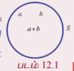

## 12.1 அறிமுகம் (Introduction)

கணிதவியலை தொடர்நிலைக் கணிதம் என்றும் தனிநிலைக் கணிதம் என்றும் இரு பெரும் பிரிவுகளாக வகைப்படுத்துவர். அவற்றுள் தொடர்நிலைக் கணிதம் என்பது மெய்யெண்கள் கணத்திலுள்ள எண்ணிடமுடியாத முடிவற்ற எண்களை (uncountably infinite) கொண்ட முடிவுகளின் கூற்றுகளை அடிப்படையாகக் கொண்டதாகும். அதாவது எந்த இரு மெய் எண்களுக்கு இடையே எண்ணிட முடியாத முடிவற்ற கணத்தைக் கொண்டிருக்கும் தன்மையைக் கொண்டது. எடுத்துக்காட்டாக தொடர்நிலைக் கணிதத்தில் அமையும் சார்பானது ஒரு தொடர்ச்சியான வளைவரையானது இடைவெளியற்ற புள்ளிகளால் அமையப்பெற்றிருக்கும்.

தனிநிலைக் கணிதத்தில் (Discrete Mathematics) உள்ள உறுப்புகள் முடிவுறு நிலையுடையதாகவும் அல்லது அவ்வுறுப்புகள் முடிவற்றதாயிருந்தால் எண்ணிடத்தக்கதாகவும் (countably infinite), தனித்த நிலையில் இருக்கும். அதாவது எந்த இரு புள்ளிகளுக்கும் இடையே முடிவுறு அல்லது எண்ணிடத்தக்க முடிவற்ற புள்ளிகளைக் கொண்டிருக்கும். எடுத்துக்காட்டாக ஒரு முடிவுறு கணத்தின் உறுப்புகளைக் கொண்டு அமையும் ஒரு சார்பினை வரையறுத்துப் பெறும் இணைப்பின் வரிசை சோடிகளாக அமைத்து பின் அதனை வரிசை சோடிகள் முழுவதையும் பட்டியலிட்டு காட்டும் வகையில் வரையறுக்க இயலும்.

பத்தொன்பதாம் நூற்றாண்டின் இறுதியிலும், 20ஆம் நூற்றாண்டின் தொடக்கத்திலும் வாழ்ந்த கணித அறிஞர்கள் தனிநிலைக் கணிதம் என்ற ஒரு புதிய பிரிவை உருவாக்கினர். இப்பிரிவில் உள்ள கருத்துகள் இயல் எண்கள் கணத்தைப் போல முடிவுறு அல்லது எண்ணிடத்தக்க முடிவற்ற கணங்களைக் கொண்ட உறுப்புகளை அடிப்படையாகக் கொண்டிருக்கும். இவ்வகை கணங்களை தனிநிலைக் கணங்கள் என்று அழைக்கலாம். மேலும் தனிநிலைக் கணிதத்தின் சிறப்பியல்பானது இக்கணத்திலிருந்து இயல் எண்கள் கணத்திற்கு உறுப்புகளை ஒன்றுக்கொன்று தொடர்புபடுத்த முடிகிறது. எனவே தனிநிலை உறுப்புகளைக் கொண்ட கணத்தைக் கொண்டு ஒரு வரிசையை (sequence) அமைக்க முடிகிறது. தனிநிலை உறுப்புகளான கணங்களில் இச்சிறப்புத் தன்மையினைக் காண இயலுமேயன்றி எண்ணிட முடியாத இடைவெளிகள் ஏதும் இல்லாததால் வரிசையாக அமைக்கப்பட்ட உறுப்புகளைக் கொண்ட மெய் கணத்தில் காண இயலாது.

கணினிப் பயன்பாடு அனைத்துத் துறைகளிலும் முக்கியப் பங்காற்றி வருதல் பற்றி அனைவரும் அறிவர். தனிநிலைக் கணங்கள் மூலம் கணக்கீடுகளின் பயன்பாடுகள் அதிகரித்ததினால் கணினி அறிவியல், அறிவியலின் ஒரு முக்கியப் பகுதியாகவே மாறியிருப்பதைக் காணலாம்.

மேலும், தனிநிலைக் கணங்கள் பற்றிய கருத்துகளை அடிப்படையாகக் கொண்டு சுருக்கமானதும், தெளிவானதுமான நவீன கணினி நிரல் மொழிகள் (programming languages) உருவாக்கப்படுகின்றன. அதனால் கணினி அறிஞர்கள், தனிநிலைக் கணங்கள் பற்றி நன்கு கற்று அதன் மூலம் நிரல் நெறிமுறைகள் (computer algorithms) உருவாக்கிடும் நிலை ஏற்பட்டுள்ளது.

தனிநிலைக் கணிதம் கற்பதால் உண்டாகும் நன்மைகளாகக் கூறப்படுவது யாதெனில், பிரச்சினைகளைப் பகுத்தறிதல், அவற்றிற்குத் தீர்வு காணுதல் போன்ற திறன்களை வளர்ப்பதில் தக்க கருவியாக விளங்கி செயல்படுவதே ஆகும்.

### ஜான் ஃபான் நியுமேன்
(1903-1957)

## 12 தனிநிலைக் கணிதம்

தனிநிலைக்கணக்கியலில் சேர்மமானங்கள், கணித தர்க்கவியல், பூலியன் இயற்கணிதம், வரைபடக் கோட்பாடு, குறியீட்டுக் கோட்பாடு போன்ற பல பிரிவுகள் உள்ளன. அவற்றுள் தனிநிலைக் கணிதம் சார்ந்த வரிசை மாற்றங்கள், சேர்வுகள் கணிதத் தொகுத்தறிதல் போன்ற தலைப்புகளில் முந்தைய வகுப்பிலேயே கற்றறிந்தோம். இப்பாடத்தில், ஈருறுப்புச் செயல்கள் (Binary operations), தர்க்கக் கணிதம் (Mathematical logic) எனும் இரு பிரிவுகளைப் பற்றி அறிந்து கொள்வோம்.

### குறியீடுகள்

$\in$ - உள்ளது (அ) இருக்கும். (belongs to)

$\ni$ - என்றவாறு (அ) எனுமாறு (such that)

$\forall$ - ஒவ்வொரு (அ) அனைத்திற்கும் (for every)

$\Rightarrow$ - தெரிவிப்பது (implies)

$\exists$ - அங்கே உள்ளது (அ) இருத்தல் (there exists)

பொதுவாக ஒரு கணத்தில் ஒன்று அல்லது ஒன்றுக்கும் மேற்பட்ட உறுப்புகளின் மீது ஒரு செயலியை செயல்படுத்தும் முறையை செயல் (operation) என்று குறிப்பிடப்படும். $\mathbb{Z}$-ல் உள்ள ஓர் உறுப்பின் குறை உறுப்பு (negative element) காணல் என்பது, அச்சமயத்தில் ஒரே ஒரு உறுப்பை மட்டுமே அச்செயலுக்குக் கருதுவதாகும். அவ்வாறான செயல் ஓருறுப்புச் செயல் (unary operation) ஆகும். $\mathbb{Z}$ என்ற கணத்தில் ஏதேனும் இரு உறுப்புகளின் கூடுதல் காண்பதற்கு இரு உறுப்புகள் தேவையாகிறது. அதாவது கூடுதல் காணல் எனும் செயல் ஈருறுப்புச் செயல் என்று கூறப்படும். கூடுதலுக்கான $+$ என்ற செயலி, ஈருறுப்புச் செயலி (Binary operator) என்று அழைக்கப்படும்.

பொதுவாக, ஒரு கணத்தில் ஒரு செயலுக்கு $n$ உறுப்புகள் பயன்படுத்தப்படும்போது, அது $n$ உறுப்புச் செயலி என்று அழைக்கப்படுகிறது. இப்பிரிவில், ஈருறுப்புச் செயல்கள் பற்றி விரிவாகக் காண்போம்.

### கற்றலின் நோக்கங்கள்

இந்த அத்தியாயத்தின் முடிவில் மாணவர்கள் பின்வருவனவற்றை அறிந்திருப்பர்.

● ஈருறுப்புச் செயலியின் வரையறை மற்றும் அதன் பண்புகளை சோதித்தல்

● பூலியன் அணிகள்மீது ஈருறுப்புச் செயலியை வரையறுத்து அதன் பண்புகளைச் சரிபார்த்தல்

● மட்டு எண் கணித தொகுப்புகளின் மீது ஈருறுப்புச் செயலியை வரையறுத்து அதன் பண்புகளை சோதித்தல்

● தனி மற்றும் கூட்டுக் கூற்றுகளை அடையாளம் காணுதல்

● தர்க்க இணைப்புகளை வரையறை செய்து மெய்ம்மை அட்டவணைகளை அமைத்தல்

● மெய்ம்மம், முரண்பாடு மற்றும் நிச்சயமின்மைகளை அடையாளம் காணுதல்

● தர்க்க சமானமானவைகளை தோற்றுவித்து அவற்றிற்கு இரட்டைக் கோட்பாடுகளைப் பயன்படுத்துதல்

## 12.2 ஈருறுப்புச் செயலிகள் (Binary Operations)

### 12.2.1 வரையறைகள் (Definitions)

$\mathbb{R}$ -ன் மீது அடிப்படை எண்கணித ஈருறுப்புச் செயலிகள் கூட்டல் $(+)$, கழித்தல் $(-)$, பெருக்கல் $(\times)$, மற்றும் வகுத்தல் $(\div)$ என்பவைகளாகும். 19ஆம் நூற்றாண்டின் இறுதியிலும் மற்றும் 20ஆம் நூற்றாண்டின் தொடக்கத்திலும் வாழ்ந்த கணித அறிஞர்கள் எபேல், கெய்லி, கோஷி போன்றோர் மேற்கூறிய வழக்கமான இயற்கணிதச் செயலிகள் நிறைவு செய்யும் பண்புகளை பொதுமைப்படுத்த முயற்சி செய்ததார்கள். அதன் மூலம் அவர்கள் புதிய நுண் இயற்கணித அமைப்புகளைக் கொள்ககை ரீதியான அணுகுமுறை மூலம் உருவாக்கினார்கள். அவ்வாறு பெறப்பட்ட இந்த புதிய பிரிவு நுண் இயற்கணிதம் என்று அழைக்கப்படுகிறது.

எடுத்துக்காட்டாக ஏதேனும் இரு இயல் எண்களின் கூடுதல் ஓர் இயல் எண் என்றும் அவற்றின் பெருக்கலும் ஓர் இயல் எண் என்றும் அறிவோம். அதாவது, வழக்கமான கூட்டல் $(+)$ மற்றும் $(\times)$ பெருக்கல் செயலிகள் $\mathbb{N}$ என்ற கணத்தில் இரு உறுப்புகளைக் கொண்டு செயல்படுத்துவதால் ஈருறுப்புச் செயலி என்று அழைக்கப்படுகின்றன.

அதையே குறியீட்டுவடிவில், $m+n\in\mathbb{N}$; $m\times n\in\mathbb{N}$, $\forall m,n\in\mathbb{N}=\{1,2,3,\ldots\}$ என்று எழுதுகிறோம்.

மேற்கூறிய இரண்டு ஈருறுப்புச் செயல்களும் கீழ்க்காணும் விதிகளை நிறைவுச் செய்வதைக் கவனிக்க.

(1) $\mathbb{N}$ -ல் இருந்து ஒரே நேரத்தில் இரண்டு எண்கள் எடுக்கப்பட்டு செயல்படுத்தப்படுகின்றன.

(2) அவைகளின் முடிவில் கிடைக்கும் உறுப்பு மீண்டும் $\mathbb{N}$ என்ற கணத்திலேயே இருக்கிறது.

இவ்வாறாக ஒரு வெற்றற்ற கணத்தின் மீது வரையறுக்கப்படும் எந்த ஒரு செயலையும் நுண்கணிதத்தில் ஒரு ஈருறுப்பு செயலி அல்லது ஈருறுப்புத் தொகுப்பு எனப்படும்.

**வரையறை 12.1**

ஒரு வெற்றற்ற கணம் $S$ –இன் மீது வரையறுக்கப்பட்ட $*$ என்ற ஏதேனும் ஒரு செயல், ஓர் ஈருறுப்புச் செயல் என அழைக்கப்படவேண்டுமெனில் அது பின்வரும் பண்புகளைக் கொண்டிருக்க வேண்டும்.

(i) $S \times S$ -ல் உள்ள ஒவ்வொரு வரிசைச் சோடி $(a,b)$ -க்கு $*$ என்ற செயல் கண்டிப்பாக வரையறுக்கப்பட்டிருக்க வேண்டும்.

(ii) $S \times S$ -ல் ஒவ்வொரு வரிசைச் சோடி $(a,b)$ -யுடன் $S$ -ல் $a*b$ என்ற ஒரே ஓர் உறுப்பு இருக்கும்.

வேறுவிதமாகச் கூறினால், $S$ -ன் மீது வரையறுக்கப்படும் $*$ என்ற ஈருறுப்புச் செயலானது $S$ -ல் உள்ள உறுப்புகளின் ஒவ்வொரு வரிசைச் சோடியையும் $S$ -ல் ஒரே ஓர் உறுப்பைத் தொடர்புபடுத்தும் ஒரு விதி ஆகும். இதனை ஒரு சார்பாகவும் பின்வருமாறு வரையறுக்கலாம்.

$* : S \times S \rightarrow S$; அதாவது, $*(a,b) = a*b \in S$, இங்கு $a*b$ என்பது ஒரே ஓர் உறுப்பாகும்.

$*$-ன் விளைவு $a*b$ எப்பொழுதும் கண்டிப்பாக $S$ -ல் அமைய வேண்டும் மற்றும் $S$ -க்கு வெளியே அமையக்கூடாது. இந்நிலையில் $S$ -ஆனது $*$-ன் கீழ் அடைவு பெற்றுள்ளது எனக் கூறலாம். இப்பண்பை அடைவுப் பண்பு என்று கூறுவர்.

**வரையறை 12.2**

ஒன்று அல்லது அதற்கு மேற்பட்ட ஈருறுப்புச் செயல்களைப் பொருத்து ஏதேனும் ஒரு வெற்றற்ற கணத்தின் மீது வரையறுக்கப்பட்டால் அது இயற்கணித அமைப்பு எனப்படும்.

$*$ என்ற ஈருறுப்புச் செயலை $S$ -இன் மீது பின்வருமாறும் வரையறுக்கலாம்:

$\forall a,b \in S$, $a*b$ என்பது ஒருமைத்தன்மை வாய்ந்தது, மேலும் $a*b \in S$.

#### குறிப்பு

மேலேயுள்ள வறையறையிலிருந்து ஒவ்வொரு ஈருறுப்புச் செயலும் அடைவுப் பண்பை நிறைவு செய்யும் என்பது தெளிவாகிறது.

#### குறிப்பு

$*$ என்ற செயல் ஒரு குறியீடுதான். $*$ என்பது $+, -, \times, \div$, அணிக் கூட்டல், அணிப் பெருக்கல், போன்ற செயல்களில் ஒன்றைக் குறிக்கும். மேலும் $*$ ஆனது ஈருறுப்புச் செயலியாக இருப்பதோ அல்லது இல்லாமலிருப்பதோ அது வரையறுக்கப்படும் கணத்தைப் பொருத்ததாகும்.

எடுத்துக்காட்டாக, வழக்கமான கூட்டல் $+$ மற்றும் பெருக்கல் $\times$ ஆனது $\mathbb{N}$ -ன் மீது ஓர் ஈருறுப்புச் செயல் ஆகும். ஆனால், கழித்தல் $-$ ஆனது $\mathbb{N}$ –ன் மீது ஓர் ஈருறுப்புச் செயல் ஆகாது.

இதனை சரிபார்க்க. $(3,4) \in \mathbb{N} \times \mathbb{N}$ என்க.

$(a,b) = (3,4)$, $3-4 = -1 \notin \mathbb{N}$.

எனவே $-$ ஆனது $\mathbb{N}$ -ன் மீது ஓர் ஈருறுப்புச் செயல் ஆகாது. அதே சமயத்தில் $-$ ஆனது $\mathbb{Z}$ -ன் மீது ஓர் ஈருறுப்புச் செயல் என்பது தெளிவு. எனவே, $\mathbb{Z}$ ஆனது $+$ மற்றும் $-$ ஐ பொருத்து கீழ் அடைவு பெற்றுள்ளது. எனவே, $(\mathbb{Z}, +, -)$ ஓர் இயற்கணித அமைப்பு ஆகும்.

### படம் 12.1

#### உற்றுநோக்கி அறிந்தவை

ஒரு செயலின் ஈருறுப்புப் பண்பானது அது வரையறுக்கப்படும் கணத்தைப் பொருத்ததாகும்.

(a) $\mathbb{N}$ உடன் 0 மற்றும் குறை முழு எண்களையும் சேர்த்து விரிவுபடுத்தப்பட்ட கணம்தான் $\mathbb{Z}$ எனப்படும் முழு எண் கணம் ஆகும். $\mathbb{Z}$ -ன் மீது $-$ ஆனது ஒரு ஈருறுப்புச் செயலி ஆகும். ஆனால் $\mathbb{N}$ -ன் மீது $-$ ஒரு ஈருறுப்புச் செயலி ஆகாது.

(b) செயலி $\div$ ஆனது, $\mathbb{Z}$ -ன் மீது ஓர் ஈருறுப்புச் செயல் ஆகாது. எடுத்துக்காட்டாக, $(1,2) \in \mathbb{Z} \times \mathbb{Z}$ -க்கு $1 \div 2 = \frac{1}{2} \notin \mathbb{Z}$. எனவே, $\mathbb{Z}$ என்ற கணத்தை விரிவுபடுத்தக் கிடைக்கப்பெறும் கணம் $\mathbb{Q}$ ஆகும்.

(c) எண்களைக் கொண்ட அடிப்படைச் செயல்பாடுகளில் '$0$' ஆல் வகுப்பது வரையறுக்கப்படவில்லை என்ற உண்மையை அறிவோம். எனவே, $\div$ ஆனது $\mathbb{Q} \setminus \{0\}$-ன் மீது ஓர் ஈருறுப்புச் செயல் ஆகும். இவ்வாறே $+, -, \times$ ஆகியவைகள் $\mathbb{Q}$ -ன் மீது ஈருறுப்புச் செயல்கள் ஆகும் ஆனால் $\div$ ஆனது $\mathbb{Q} \setminus \{0\}$-ன் மீது அமையும் ஓர் ஈருறுப்புச் செயல் ஆகும்.

மேற்கொண்டு $\mathbb{Q}$ ஐ $\mathbb{R}$ -க்கும் மற்றும் $\mathbb{R}$ ஐ $\mathbb{C}$-க்கும் விரிவுபடுத்துவதற்குக் காரணம் என்ன? என்ற வினா எழுந்துள்ளது. எனவே, $+, -, \times, \div$ ஆகிய அடிப்படையான எண்கணித செயல்களுடன் "$x^2 - 2 = 0$"; "$x^2 + 1 = 0$" என்ற சமன்பாட்டு வகைகளின் மூலங்களையும் உள்ளடக்கிய ஒரு எண் தொகுப்பு தேவைப்படுகிறது. எனவே, ஏற்கனவே உள்ள எண் தொகுப்புடன் விகிதமுறா எண்களையும் கற்பனை எண்களையும் திரட்டி [அத்தியாயம் 3ஐப் பார்க்க] உள்ளடக்கும்பொழுது கிடைக்கும் எண் தொகுப்பானது $\mathbb{R}$ -ம் $\mathbb{C}$-ம் ஆகும். இதில் மிகப்பெரிய எண் தொகுப்பான $\mathbb{C}$ ஆனது முறையே $\mathbb{N}, \mathbb{Z}, \mathbb{Q}$ மற்றும் $\mathbb{R}$ ஆகிய எண் தொகுப்புகளை கொண்டிருக்கும் உட்கணங்களாக இருக்கும்.

**அட்டவணை 12.1**

| எண் தொகுப்பு செயலிகள் | $\mathbb{N}$ | $\mathbb{Z}$ | $\mathbb{Q}$ | $\mathbb{R}$ | $\mathbb{C}$ | $\mathbb{Q} \setminus \{0\}$ | $\mathbb{R} \setminus \{0\}$ | $\mathbb{C} \setminus \{0\}$ |
|---|---|---|---|---|---|---|---|---|
| $+$ | அடைவு பெற்று உள்ளது | அடைவு பெற்று உள்ளது | அடைவு பெற்று உள்ளது | அடைவு பெற்று உள்ளது | அடைவு பெற்று உள்ளது | அடைவு பெற வில்லை | அடைவு பெற வில்லை | அடைவு பெற வில்லை |
| $-$ | அடைவு பெற வில்லை | அடைவு பெற்று உள்ளது | அடைவு பெற்று உள்ளது | அடைவு பெற்று உள்ளது | அடைவு பெற்று உள்ளது | அடைவு பெற வில்லை | அடைவு பெற வில்லை | அடைவு பெற வில்லை |
| $\times$ | அடைவு பெற்று உள்ளது | அடைவு பெற்று உள்ளது | அடைவு பெற்று உள்ளது | அடைவு பெற்று உள்ளது | அடைவு பெற்று உள்ளது | அடைவு பெற்று உள்ளது | அடைவு பெற்று உள்ளது | அடைவு பெற்று உள்ளது |
| $\div$ | அடைவு பெற வில்லை | அடைவு பெற வில்லை | அடைவு பெற வில்லை | அடைவு பெற வில்லை | அடைவு பெற வில்லை | அடைவு பெற்று உள்ளது | அடைவு பெற்று உள்ளது | அடைவு பெற்று உள்ளது |

### எடுத்துக்காட்டு 12.1

கீழ்க்காணும் ஈருறுப்புச் செயலிகள், அதற்குரிய கணங்களில் அடைவுப் பண்பைப் பெற்றுள்ளதா என்பதைச் சோதிக்க. அவ்வாறில்லாதவற்றிற்கு ஈருப்புச் செயலியின் நிபந்தனையை நிறைவேற்றும் முறையைக் காண்க.

$$a*b = 3a + 5b - ab^2; \quad a,b \in \mathbb{Z}$$

#### தீர்வு

$\mathbb{Z}$-இன் மீது $\times$ ஆனது ஈருறுப்புச் செயலி என்பதால் $a,b \in \mathbb{Z} \implies a \times b \in \mathbb{Z}$ மற்றும் $b \times b = b^2 \in \mathbb{Z}$ ... (1)

$\mathbb{Z}$ -ன் மீது $+$ ஆனது ஈருறுப்புச் செயலி என்பதால் (1) $\implies 3a + 5b - ab^2 \in \mathbb{Z}$ ... (2)

மேலும், $a \in \mathbb{Z}$ மற்றும் $3a \in \mathbb{Z} \implies 3a \in \mathbb{Z}$. ... (3)

(2), (3) ஆகியவற்றிலிருந்து $\mathbb{Z}$ -ன் மீது '$-$' ஆனது ஈருறுப்புச் செயலி என்பதாலும் $a*b = 3a + 5b - ab^2 \in \mathbb{Z}$ கிடைக்கும். எனவே $a*b \in \mathbb{Z}$ என்பதால் $*$ ஆனது $\mathbb{Z}$ -ன் மீது அடைவு பெற்றுள்ளது.

### 12.2.2 ஈருறுப்புச் செயலியின் மேலும் சில பண்புகள்
### (Some more properties of a binary operation)

**பரிமாற்றுப் பண்பு (Commutative property)**

ஒரு வெற்றற்ற கணம் $S$ –ன் மீது ஈருறுப்புச் செயலி $*$ ஆனது பரிமாற்றுத் தன்மையுடையதாயின் ஒவ்வொரு $a,b \in S$ -க்கும் $a*b = b*a$ என்பது உண்மையாக வேண்டும்.

**சேர்ப்புப் பண்பு (Associative property)**

ஒரு வெற்றற்ற கணம் $S$ -ன் மீது ஈருறுப்புச் செயலி $*$ ஆனது சேர்ப்புப் பண்பு உடையதாயின் $(a*b)*c = a*(b*c)$, $\forall a,b,c \in S$ என்பது உண்மையாக வேண்டும்.

**சமனிப் பண்பு (Existence of Identity property)**

$*$ என்ற ஈருறுப்புச் செயலியின் கீழ் $e \in S$ என்பது $S$ -ன் சமனி உறுப்பு எனில் $\forall a \in S$, $a*e = a$ மற்றும் $e*a = a$ என்பதை நிறைவு செய்யும்.

**எதிர்மறைப் பண்பு (Existence of inverse property)**

$S$ -ல் $e$ எனும் ஒரு சமனி உறுப்பு இருந்ததால் $a \in S, b \in S$, $a*b = e$ மற்றும் $b*a = e$ எனில், $b \in S$ என்பது $a$ -ன் நேர்மாறு உறுப்பு அல்லது எதிர்மறை உறுப்பு எனப்படும். இதை நாம் $b = a^{-1}$ என எழுதலாம்.

#### குறிப்பு

$a^{-1}$ ஆனது $S$-ல் ஒரு உறுப்பாகும். $a^{-1}$-ஐ $a$-ன் எதிர்மறை என்று கூறலாமேயன்றி $\frac{1}{a}$ என்று கூற இயலாது.

#### குறிப்பு

(i) $1 \in \mathbb{Z}$ என்பது ஒரு பெருக்கல் சமனி. $\mathbb{Z}$ -ல் ஒரே ஓர் உறுப்புதான் இத்தன்மையைப் பெற்றிருக்கும். இவ்வுறுப்பு $n \cdot 1 = 1 \cdot n = n$, $\forall n \in \mathbb{Z}$ என்ற பண்பை நிறைவு செய்யும்.

(ii) ஓர் உறுப்பின் பெருக்கல் எதிர்மறையை விளக்க எடுத்துக்காட்டாக, $2 \in \mathbb{Q}$ -ன் பெருக்கல் எதிர்மறை $\frac{1}{2} \in \mathbb{Q}$ ஆகும். $x = \frac{1}{2}$ தவிர வேறு எந்த எண்ணும் $2 \times x = x \times 2 = 1$, $x \in \mathbb{Q}$ என்ற சமன்பாட்டை நிறைவு செய்யும் பண்பை பெற்றிருக்காது.

#### குறிப்பு

ஒரு கணிதக் கூற்றில் 'ஒவ்வொன்றுக்கும்' அல்லது 'அனைத்திற்கும்' என்பதை தொடர்புபடுத்தும்பொழுது அது ஒவ்வொரு சோடி அல்லது மூன்று உறுப்புகளுக்கும் நிரூபிக்கப்பட வேண்டும். ஒவ்வொரு சோடி அல்லது மூன்று உறுப்புகளுக்கு நிரூபிப்பது என்பது அவ்வளவு எளிதல்ல. ஆனால் இந்த வகையான நிலைமைகளில் இக்கூற்றின் மறுப்பை நிரூபிப்பது சாலச் சிறந்தது. அதாவது "ஒவ்வொன்றுக்கும்" அல்லது "அனைத்திற்கும்" என்பதன் மறுப்பானது "அங்கே உள்ளது (அ) இருத்தல்" என்பதற்கு ஒப்ப ஒரு சோடி அல்லது மூன்று உறுப்புகளாக எடுத்துக் கொண்ட கூற்று மறுக்குமாறு உருவாக்க முயற்சிக்கலாம். அவ்வாறு காண இயலுமாயின், தரப்பட்ட கூற்று சரியானது அல்ல என்பது முடிவாகும்.

சமனி மற்றும் எதிர்மறை உறுப்புகளின் ஒருமைத்தன்மை சார்ந்த வினாக்கள் ஆராயப்பட வேண்டும்.

பின்வரும் கோட்பாடுகள் மேலே குறிப்பிட்ட முடிவுகளை மிகவும் பொதுவான வடிவத்தில் நிரூபிக்கின்றன.

**தேற்றம் 12.1 (சமனி உறுப்பின் ஒருமைத்தன்மை)**

ஓர் இயற்கணித அமைப்பில் சமனி உறுப்பானது (உள்ளது எனில்) ஒருமைத்தன்மை வாய்ந்தது.

**நிரூபணம்**

$(S, *)$ என்பது ஓர் இயற்கணித அமைப்பு என்க. $*$ ஐ பொருத்து $S$ -ன் சமனி உறுப்பானது $S$ -ல் உள்ளது எனக் கொள்க. மேலும் ஒரே ஒரு சமனி உறுப்பு மட்டுமே உள்ளது என நிரூபிக்க.

$S$ –ன் சமனி உறுப்புகள் $e_1, e_2$ என இருவ்வதாகக் கொள்வோம்.

முதலில் $e_1$ ஐ சமனி உறுப்பாகவும், $e_2$ ஐ $S$ -ன் உறுப்பாகவும் எடுத்துக்கொண்டால்,

$e_1 * e_2 = e_2$ மற்றும் $e_2 * e_1 = e_2$. ... (1)

பிறகு $e_2$ ஐ சமனி உறுப்பாகவும், $e_1$ ஐ $S$ -ன் உறுப்பாகவும் எடுத்துக்கொண்டால்,

$e_2 * e_1 = e_1$ மற்றும் $e_1 * e_2 = e_1$. ... (2)

(1), (2) -லிருந்து, $e_1 = e_2$. எனவே, சமனி உறுப்பு ஒருமைத்தன்மை வாய்ந்தது.

**தேற்றம் 12.2 (எதிர்மறை உறுப்பின் ஒருமைத்தன்மை)**

ஓர் இயற்கணித அமைப்பில் ஓர் உறுப்பின் எதிர்மறை (இருப்பின்) ஒருமைத்தன்மை வாய்ந்தது.

**நிரூபணம்**

$(S, *)$ என்பது ஓர் இயற்கணித அமைப்பு என்க. மேலும் $a \in S$ என்க. $a$ -ன் எதிர்மறை $S$ -ல் உள்ளது எனக் கொள்க. $S$ -ல் உள்ள ஒவ்வொரு உறுப்பிற்கும் ஒரே ஒரு எதிர்மறை உறுப்பு மட்டுமே இருக்கும். மேலும் $S$ -ல் எதிர்மறை உறுப்பு இருந்ததால் அதில் சமனி உறுப்பு $e$ உறுதியாக இருக்கும்.

$a \in S$ என்க. $S$ -ல் உள்ள உறுப்பு $a$ -ற்கு ஒரே ஒரு எதிர்மறை உறுப்பு மட்டுமே இருக்கும் என நிரூபிக்க.

$a$ -ன் எதிர்மறை உறுப்புகள் $a_1, a_2$ என்ற இரு உறுப்புகள் இருப்பதாகக் கொள்வோம்.

$a_1$ ஐ $a$ -ன் எதிர்மறையாகக் கொள்வோமாயின் $a_1 * a = a * a_1 = e$ ... (1)

$a_2$ ஐ $a$ -ன் எதிர்மறையாகக் கொள்வோமாயின் $a_2 * a = a * a_2 = e$ ... (2)

$$a_1 = a_1 * e = a_1 * (a * a_2) \quad (\text{(2) -ன்படி})$$

$$= (a_1 * a) * a_2 \quad (\text{சேர்ப்புப் பண்பின்படி})$$

$$= e * a_2 \quad (\text{(1) -ன்படி})$$

$$= a_2 \quad (\text{சமனிப் பண்பின்படி})$$

$\therefore a_1 = a_2$. எனவே, $S$ -ல் உள்ள உறுப்பு $a$ -ற்கு ஒரே ஒரு எதிர்மறை உறுப்பு மட்டுமே இருக்கும் என்று அறியலாம்.

#### குறிப்பு

தேற்றம் 12.1 மற்றும் 12.2-இன் உண்மையான ஒருமைத்தன்மையை விரிவாக மேற்படிப்பில் தெரிந்து கொள்ளலாம்.

### எடுத்துக்காட்டு 12.2

$\mathbb{Z}$ என்ற கணத்தில் '$+$' என்ற ஈருறுப்புச் செயலி கொண்டு (i) அடைவுப் பண்பு (ii) பரிமாற்றுப் பண்பு (iii) சேர்ப்புப் பண்பு (iv) சமனிப் பண்பு மற்றும் (v) எதிர்மறைப் பண்பு ஆகியவைகளைப் பெற்றுள்ளதா எனச் சரிபார்க்க.

#### தீர்வு

(i) $m+n \in \mathbb{Z}$, $\forall m,n \in \mathbb{Z}$. எனவே, '$+$' ஆனது, $\mathbb{Z}$ -ன் மீது ஓர் ஈருறுப்புச் செயலி ஆகும்.

(ii) மேலும் $m+n = n+m$, $\forall m,n \in \mathbb{Z}$. எனவே, பரிமாற்றுப் பண்பு உண்மையாகும்.

(iii) $(m+n)+p = m+(n+p)$, $\forall m,n,p \in \mathbb{Z}$. எனவே, சேர்ப்புப் பண்பு உண்மையாகும்.

(iv) $m+0 = 0+m = m$, $\forall m \in \mathbb{Z}$. எனவே, $0 \in \mathbb{Z}$ $\ni$ $m+0 = 0+m = m$. எனவே சமனிப்பண்பு உள்ளது.

(v) $m+(-m) = (-m)+m = 0$, $\forall m \in \mathbb{Z}$. $\therefore -m \in \mathbb{Z}$, $\ni$ $m+(-m) = (-m)+m = 0$. எனவே, எதிர்மறைப் பண்பும் உள்ளது. இவ்வாறாக, கூட்டல் செயலி $+$ ஆனது, $\mathbb{Z}$ -ன் மீது மேற்கண்ட ஐந்து பண்புகளை நிறைவு செய்யும்.

கூட்டல் சமனி $=0$ மற்றும் ஏதேனும் ஒரு முழு எண் $m$ -ன் கூட்டல் எதிர்மறை $-m$ என்பதைக் கவனத்தில் கொள்வோம்.

### எடுத்துக்காட்டு 12.3

$\mathbb{Z}$ -ன் மீது இயற்கணித செயலி '$-$' ஆனது (i) அடைவுப் பண்பு (ii) பரிமாற்றுப் பண்பு (iii) சேர்ப்புப் பண்பு (iv) சமனிப் பண்பு மற்றும் (v) எதிர்மறைப் பண்பு ஆகியவைகளை கொண்டுள்ளதா எனச் சரிபார்க்க.

#### தீர்வு

(i) கழித்தல் '$-$' ஆனது $\mathbb{N}$ ன் மீது ஓர் ஈருறுப்புச் செயல் அல்ல. ஆனால் $\mathbb{Z}$ ன் மீது ஓர் ஈருறுப்புச் செயல் ஆகும். எனவே, மேலும் சில பண்புகளை '$-$' என்ற ஈருறுப்புச் செயலியைக் கொண்டு $\mathbb{Z}$ ன் மீது எளிதான மதிப்புகளுக்குச் சரிபார்ப்பது நல்லது.

(ii) $m = 4$, $n = 5$ எனில், $(m-n) = (4-5) = -1$ மற்றும் $(n-m) = (5-4) = 1$. இங்கு $m-n \neq n-m$. எனவே, '$-$' ஆனது $\mathbb{Z}$ -இன் மீது பரிமாற்றுப் பண்பை நிறைவு செய்யாது.

(iii) $m-n-p$ மற்றும் $m-(n-p)$ போன்றவற்றில் $m=4, n=5$, மற்றும் $p=7$ என்ற

$$(m-n)-p = (4-5)-7 = -1-7 = -8$$ ... (1)

$$m-(n-p) = 4-(5-7) = 4-(-2) = 6$$ ... (2)

(1), (2) -லிருந்து $(m-n)-p \neq m-(n-p)$.

எனவே, '$-$' ஆனது $\mathbb{Z}$ -ன் மீது சேர்ப்புப் பண்பை நிறைவு செய்யாது.

(iv) சமனி உறுப்பு இல்லை. (ஏன்?)

(v) எதிர்மறை உறுப்பு இல்லை (ஏன்?)

### எடுத்துக்காட்டு 12.4

$\mathbb{Z}_e$ ன் மீது $+$ என்ற ஈருறுப்புச் செயலி (i) அடைவுப் பண்பு (ii) பரிமாற்றுப் பண்பு (iii) சேர்ப்புப் பண்பு (iv) சமனிப் பண்பு மற்றும் (v) எதிர்மறைப் பண்பு ஆகியவைகளை பெற்றுள்ளதா எனச் சரிபார்க்க. இங்கு $\mathbb{Z}_e$ = அனைத்து இரட்டை முழுக்களின் கணம்.

#### தீர்வு

$\mathbb{Z}_e = \{2k | k \in \mathbb{Z}\} = \{\ldots, -6, -4, -2, 0, 2, 4, 6, \ldots\}$ என்ற இரட்டை முழுக்களின் கணத்தைக் கருதுக.

$\mathbb{Z}_e$ -ன் மீது கூட்டலின் '$+$' என்ற ஈருறுப்புச் செயலியைக் கொண்டு பின்வரும் பண்புகளைச் சரிபார்க்கலாம்.

(i) ஏதேனும் இரண்டு இரட்டை முழுக்களின் கூடுதல் ஓர் இரட்டை முழு எண் ஆகும். ஏனெனில், $x,y \in \mathbb{Z}_e \implies x = 2m$ மற்றும் $y = 2n$, $m,n \in \mathbb{Z}$.

எனவே, $x+y = 2m+2n = 2(m+n) \in \mathbb{Z}_e$. எனவே, $\mathbb{Z}_e$ -ன் மீது '$+$' ஆனது அடைவுப் பண்பு பெற்றுள்ளது.

(ii) $\forall x,y \in \mathbb{Z}_e$, $(x+y) = (2m+2n) = (2n+2m) = (y+x)$. எனவே, $+$ ஆனது பரிமாற்று விதியை நிறைவு செய்கிறது.

(iii) இதேபோல், $\forall x,y,z \in \mathbb{Z}_e$, $(x+y)+z = x+(y+z)$. எனவே, சேர்ப்பு விதியும் உண்மையாகிறது.

(iv) $x = 2k$ எனக் கொள்க. $2k+0 = 0+2k = 2k$. எனவே, $\forall x \in \mathbb{Z}_e$, $0 \in \mathbb{Z}_e$ $\ni$ $x+0 = 0+x = x$. ஆகையால், 0 சமனி உறுப்பாகும்.

(v) $x = 2k$ என எடுத்துக்கொண்டால், இதன் எதிர்மறை $x'$ ஆனது பின்வருமாறு பெறப்படுகிறது. $2k+x' = 0 \implies x' = -2k = 2(-k)$. அதாவது $x' = -x$. எனவே, $\forall x \in \mathbb{Z}_e$, $-x \in \mathbb{Z}_e$, $\ni$ $x+(-x) = (-x)+x = 0$. எனவே, $-x$ என்பது $x$ -ன் எதிர்மறை ஆகும்.

### எடுத்துக்காட்டு 12.5

$\mathbb{Z}_0$ = அனைத்து ஒற்றறை முழுக்களின் கணம் எனில் $\mathbb{Z}_o$ -ன் மீது இயற்கணித செயலி $+$ ஆனது (i) அடைவுப்பண்பு (ii) பரிமாற்றுப்பண்பு (iii) சேர்ப்புப்பண்பு (iv) சமனிப்பண்பு மற்றும் (v) எதிர்மறைப் பண்பு ஆகியவற்றைப் பெற்றுள்ளதா எனச் சரிபார்க்க.

#### தீர்வு

$\mathbb{Z}_o = \{2k+1 : k \in \mathbb{Z}\} = \{\ldots, -5, -3, -1, 1, 3, 5, \ldots\}$ என்ற அனைத்து ஒற்றறை முழுக்களைக் கொண்ட கணத்தைக் கருதுக. கூட்டல் $+$ ஆனது $\mathbb{Z}_o$ -இன் மீது ஓர் ஈருறுப்புச் செயல் ஆகாது. ஏனெனில், $x = 2m+1$, $y = 2n+1$ எனும்பொழுது $x+y = 2(m+n+1)$ என்பது அனைத்து $m,n$ -க்கும் இரட்டை எண்ணாகவே அமையும். எடுத்துக்காட்டாக, $3,7 \in \mathbb{Z}_o$ என்ற இரு ஒற்றறை எண்களைக் கருதுக. அவைகளின் கூடுதல் $3+7 = 10$ என்பது ஓர் இரட்டை எண்ணாகும். பொதுவாக, $x,y \in \mathbb{Z}_0$ எனில், $x+y \notin \mathbb{Z}_0$ ஆகும். $+$ ஆனது $\mathbb{Z}_o$ ன் மீது ஓர் ஈருறுப்புச் செயல் அல்லலாததால் ஏனையப் பண்புகளைச் சரிபார்க்க வேண்டிய அவசியமில்லை.

### எடுத்துக்காட்டு 12.6

கொடுக்கப்பட்ட கணத்தின்மீது பின்வரும் செயலியானது (i) அடைவுப் பண்பு (ii) பரிமாற்றுப் பண்பு மற்றும் (iii) சேர்ப்புப் பண்பு ஆகியவைகளைக் கொண்டுள்ளதா எனச் சரிபார்க்க.

$$a*b = a^b; \quad a,b \in \mathbb{N} \quad (\text{அடுக்குக்குறி பண்பு})$$

#### தீர்வு

(i) $a*b = a^b \in \mathbb{N}$, $\forall a,b \in \mathbb{N}$ என்பது உண்மை. எனவே $\mathbb{N}$ ஆனது $*$ –ன் கீழ் அடைவு பெற்றுள்ளது.

(ii) $a=2$, $b=3$ ஆகிய மதிப்புகளை $a*b = a^b$ மற்றும் $b*a = b^a$ ஆகியவைகளில் பிரதியிட,

$2*3 = 2^3 = 8$ ஆனால் $3*2 = 3^2 = 9 \implies 2*3 \neq 3*2$.

எனவே $*$ ஆனது பரிமாற்றுப் பண்பை நிறைவு செய்யாது.

(iii) $(a*b)*c = a*(b*c)$ எனக் கொள்க.

இதில் $a=2, b=3$ மற்றும் $c=4$ என பிரதியிடக் கிடைப்பது

$(2*3)*4 = (2^3)*4 = 8*4 = 8^4 = 4096$

ஆனால் $2*(3*4) = 2*(3^4) = 2*81 = 2^{81}$

$\implies (a*b)*c \neq a*(b*c)$.

எனவே, $*$ ஆனது சேர்ப்புப் பண்பை நிறைவு செய்யாது.

#### குறிப்பு

இந்த ஈருறுப்பு செயலிக்கு சமனியும் எதிர்மறையும் இல்லை. (காரணத்துடன் விளக்குக)

### எடுத்துக்காட்டு 12.7

கொடுக்கப்பட்ட கணத்தின்மீது பின்வரும் செயலானது (i) அடைவுப் பண்பு (ii) பரிமாற்றுப் பண்பு (iii) சேர்ப்புப் பண்பு (iv) சமனிப் பண்பு மற்றும் (v) எதிர்மறைப் பண்பு ஆகியவைகளைப் பெற்றிருக்குமா எனச் சரிபார்க்க.

$$m*n = m+n-mn; \quad m,n \in \mathbb{Z}$$

#### தீர்வு

(i) $m+n-mn$ -ன் விளைவு ஆனது ஒரு முழு எண் என்பது தெளிவாகிறது. எனவே $*$ ஆனது $\mathbb{Z}$ -ன் மீது அடைவு பெற்றுள்ளது.

(ii) $m*n = m+n-mn = n+m-nm = n*m$, $\forall m,n \in \mathbb{Z}$. எனவே, $*$ ஆனது பரிமாற்றுப் பண்பை நிறைவு செய்கிறது.

(iii) $(m*n)*p = (m+n-mn)*p = (m+n-mn)+p-(m+n-mn)p$

$$= m+n-mn+p-mp-np+mnp$$ ... (1)

இதேபோன்று, $m*(n*p) = m*(n+p-np) = m+(n+p-np)-m(n+p-np)$

$$= m+n+p-np-mn-mp+mnp$$ ... (2)

(1) மற்றும் (2) -லிருந்து $(m*n)*p = m*(n*p)$. எனவே $*$ ஆனது சேர்ப்புப் பண்பை நிறைவு செய்கிறது.

(iv) $e$ என்ற ஒரு முழு எண்ணை $m*e = e*m = m$, $\forall m \in \mathbb{Z}$ என்றவாறு காண வேண்டும்.

ஆகவே, $m*e = m \implies m+e-me = m \implies e(1-m) = 0 \implies e=0$ அல்லது $m=1$. இங்கு, $m$ ஆனது ஒரு தன்னிச்சையான முழு எண் என்பதால் $m=1$ என இருக்க வேண்டிய அவசியமில்லை. எனவே $e=0$ மட்டும்தான் இருக்கமுடியும். மேலும் $m*0 = 0*m = m$, $\forall m \in \mathbb{Z}$. எனவே 0 என்பது சமனி உறுப்பாகும். எனவே சமனிப் பண்பு உறுதிப்படுத்தப்படுகிறது.

(v) $m \in \mathbb{Z}$ என்ற ஓர் உறுப்பை $m*m' = m'*m = e = 0$, $\forall m \in \mathbb{Z}$ என்றவாறு காண வேண்டும்.

$$m*m' = 0 \implies m+m'-mm' = 0 \implies m' = \frac{-m}{1-m} = \frac{m}{m-1}$$

$m=1$ எனும்போது $m'$ ஐ வரையறுக்க முடியாது. $m=2$ எனும்பொழுது $m' = 2$ ஒரு முழு எண். ஆனால் $m=2$ தவிர $m$-ன் அனைத்து மதிப்புகளுக்கும் $m'$ ஒரு முழு எண்ணாக இருக்கத் தேவையில்லை. எனவே, $\mathbb{Z}$ -ல் எதிர்மறை உறுப்பு அமையாது.

### 12.2.3 பூலியன் அணிகள் மீது சில ஈருறுப்புச் செயல்கள்
### (Some binary operations on Boolean Matrices)

**வரையறை 12.3**

ஒரு மெய் அணியின் ஒவ்வொரு உறுப்பும் 0 அல்லது 1 ஆக இருந்தால் அத்தகைய அணி பூலியன் அணி எனப்படும்.

குறிப்பாக பூலியன் பதிவுகளான 0 மற்றும் 1, பல்வேறு விதங்களில் வரையறுக்க முடியும். மின்சார ஓட்டத்தை நிறுத்த அல்லது ஓடச் செய்யும் சாதனத்தில் "ஓடச் செய்தல் மற்றும் நிறுத்துதல்" என்பதனையும், கோட்டுருவியல், சேர்ப்பு அணி போன்ற பல இடங்களில் பூலியன் பதிவுகள் 0 மற்றும் 1 பயன்படுத்தப்படுகின்றன. நாம் அதே வகை பூலியன் அணிகளை விவாதத்திற்கு எடுத்துக் கொள்வோம்.

பூலியன் அணிகளின் தொகுப்பின் மீது பின்வரும் இரு வகையான செயற்பாடுகள் வரையறுக்கப்படுகின்றன.

$A = [a_{ij}]$ மற்றும் $B = [b_{ij}]$ என்ற ஒரே வகையான ஏதேனும் இரு பூலியன் அணிகள் என்க. அவைகளின் இணைப்பு $\vee$ மற்றும் சந்திப்பு $\wedge$ என்று குறிக்கப்பட்டு பின்வருமாறு வரையறுக்கப்படுகிறது.

**வரையறை 12.4** $A$ மற்றும் $B$-ன் இணைப்பு

$$A \vee B = [a_{ij} \vee b_{ij}] = [c_{ij}]$$

இங்கு $c_{ij} = \begin{cases} 1 & \text{எனில் } a_{ij}=1 \text{ அல்லது } b_{ij}=1 \\ 0 & \text{மற்றபடி} \end{cases}$

**வரையறை 12.5** $A$ மற்றும் $B$-ன் சந்திப்பு

$$A \wedge B = [a_{ij} \wedge b_{ij}] = [c_{ij}]$$

இங்கு $c_{ij} = \begin{cases} 1 & \text{எனில் } a_{ij}=1 \text{ மற்றும் } b_{ij}=1 \\ 0 & \text{மற்றபடி} \end{cases}$

மேற்கூறியவற்றிலிருந்து, $a_{ij} \vee b_{ij} = \max\{a_{ij}, b_{ij}\}$; $a_{ij} \wedge b_{ij} = \min\{a_{ij}, b_{ij}\}$ என்பது விளங்கும் $a_{ij},b_{ij} \in \{0,1\}$.

### எடுத்துக்காட்டு 12.8

$A = \begin{bmatrix} 0 & 1 \\ 1 & 1 \end{bmatrix}$, $B = \begin{bmatrix} 1 & 1 \\ 0 & 1 \end{bmatrix}$ ஆகிய இரண்டும் ஒரே வகையான பூலியன் அணிகள் எனில், $A \vee B$ மற்றும் $A \wedge B$ ஆகியவற்றைக் காண்க.

#### தீர்வு

$$A \vee B = \begin{bmatrix} 0 & 1 \\ 1 & 1 \end{bmatrix} \vee \begin{bmatrix} 1 & 1 \\ 0 & 1 \end{bmatrix} = \begin{bmatrix} 0 \vee 1 & 1 \vee 1 \\ 1 \vee 0 & 1 \vee 1 \end{bmatrix} = \begin{bmatrix} 1 & 1 \\ 1 & 1 \end{bmatrix}$$

$$A \wedge B = \begin{bmatrix} 0 & 1 \\ 1 & 1 \end{bmatrix} \wedge \begin{bmatrix} 1 & 1 \\ 0 & 1 \end{bmatrix} = \begin{bmatrix} 0 \wedge 1 & 1 \wedge 1 \\ 1 \wedge 0 & 1 \wedge 1 \end{bmatrix} = \begin{bmatrix} 0 & 1 \\ 0 & 1 \end{bmatrix}$$

**இணைப்பு மற்றும் சந்திப்பு நிறைவு செய்யும் பண்புகள்**

$\mathcal{B}$ என்பது ஒரே வகையான பூலியன் அணிகளின் தொகுப்பு என்க. இணைப்பு மற்றும் சந்திப்பு $\mathcal{B}$-ன் மீது நிறைவு செய்யக்கூடிய பண்புகளைக் காண்போம்.

**அடைவுப் பண்பு**

$A,B \in \mathcal{B}$, $A \vee B = [a_{ij} \vee b_{ij}] = [c_{ij}] \in \mathcal{B}$. ஏனெனில், $a_{ij} \vee b_{ij} = 0$ அல்லது $1$ $\forall i,j$. எனவே $\vee$ என்பது $\mathcal{B}$ –ன் மீது அடைவு பெற்றுள்ளது.

**சேர்ப்புப் பண்பு**

$(A \vee B) \vee C = A \vee (B \vee C)$, $\forall A,B,C \in \mathcal{B}$. எனவே, $\vee$ என்பது சேர்ப்புப்பண்பை நிறைவு செய்கிறது.

**சமனிப் பண்பு**

$\forall A \in \mathcal{B}$, $\exists$ பூச்சிய அணி $0 \in \mathcal{B}$ $\ni$ $A \vee 0 = 0 \vee A = A$ -க்கு சமனி உறுப்பு பூச்சிய அணி ஆகும்.

**எதிர்மறைப் பண்பு**

எந்த ஓர் அணி $A \in \mathcal{B}$-க்கு, $A \vee B = B \vee A = 0$ என்ற சமன்பாட்டை நிறைவு செய்யும்படி $B \in \mathcal{B}$ என்ற நேர்மாறு அணியைக் காணமுடியாது. எனவே, எதிர்மறை உறுப்பு $\mathcal{B}$ –ல் இருக்காது. இதுபோலவே, சந்திப்பு $\wedge$ என்ற செயலி ஆனது பின்வருபவைகளை நிறைவு செய்யும் என்பதை சரிபார்க்கமுடியும். (i) அடைவுப் பண்பு (ii) பரிமாற்றுப் பண்பு (iii) சேர்ப்புப் பண்பு (iv) சமனி உறுப்பு $U = \begin{bmatrix} 1 & 1 \\ 1 & 1 \end{bmatrix}$ என்ற அணி ஆகும் (v) எதிர்மறை உறுப்பு இருப்பதை உறுதிப்படுத்தமுடியாது.

### 12.2.4 மட்டு எண் கணிதம் (Modular Arithmetic)

இதுவரை வழக்கமான அடிப்படை இயற்கணித செயலிகள், அணிக் கூட்டல், அணிப் பெருக்கல், பூலியன் அணிகளின் இணைப்பு மற்றும் சந்திப்பு ஆகிய ஈருறுப்புச் செயலிகளின் பண்புகளைப் பற்றி விவாதித்தோம். இப்பிரிவில் 'மட்டு எண் கணிதம்' என்ற பிரிவில் ஒரு புதிய ஈருறுப்புச் செயலி பற்றி விவாதிப்போம். $n > 1$ ஒரு மிகை முழு எண் என்க. இங்கு $n$ என்பது 'மட்டு எண்' என அழைக்கப்படும்.

$a, b$ ஆகிய இரண்டு முழுக்களுக்கு இடையேயுள்ள வித்தியாசம் $n$ –ன் மடங்கு எனில், மட்டு $n$ –ன் அடிப்படையில் $a$ -ம் $b$ -ம் ஒருங்கிசைவு உடையதாகும். இதனையே குறியீடுகள் மூலம், $a \equiv b \pmod{n}$ எனக்குறிப்பிடுவர்.

இதன்படி $a-b = nk$, $k \in \mathbb{Z}$ மற்றும் $a$ - ஐ $n$ ஆல் வகுக்கும்பொழுது கிடைக்கும் மீதி $b$ ஆனது மிகக் குறைந்த மிகை முழு எண் ஆகும்.

எடுத்துக்காட்டாக, $25 \equiv 4 \pmod{7}$, $20 \equiv 3 \pmod{17}$ $(13 \pmod{7})$, மற்றும் $15 \equiv 0 \pmod{5}$, ... மேலும் முழுக்களின் கணத்தை $n$ ஆல் வகுக்கும்போது கிடைக்கும் மீதிக்கான சாத்தியக் கூறுகள் $0,1,2,\ldots,n-1$ ஆகும். $\mathbb{Z}_5$ -ல்

$[0] = \{\ldots, -15, -10, -5, 0, 5, 10, 15, \ldots\}$

$[1] = \{\ldots, -14, -9, -4, 1, 6, 11, 16, \ldots\}$

$[2] = \{\ldots, -13, -8, -3, 2, 7, 12, 17, \ldots\}$

$[3] = \{\ldots, -12, -7, -2, 3, 8, 13, 18, \ldots\}$

$[4] = \{\ldots, -11, -6, -1, 4, 9, 14, 19, \ldots\}$

என்பவற்றை $\mathbb{Z}_5 = \{[0],[1],[2],[3],[4]\}$ என எழுதலாம். ஒவ்வொரு தொகுப்பிலும் ஏதேனும் இரண்டு எண்கள் மட்டு 5க்கு ஒருங்கிசைவு உடையதாகும். குறை எண்கள் தொகுப்பில் இருக்கும். ஆனால் $\mathbb{Z}_5$ யை குறிக்க மிகை எண்களை உபயோகிக்கலாம்.

2007க்கு முன், மட்டு எண்கணிதமானது 10-இலக்க ISBN (சர்வதேச நிலையான தர புத்தக எண்/International Standard Book Number) எண் தொகுப்பில் பயன்படுத்தப்பட்டது. உதாரணமாக, கடைசி இலக்கமானது சமநிலை சோதனைக்கானது ஆகும். இது $\{0,1,2,3,4,5,6,7,8,9,X\}$ என்ற கணத்திலிருந்து கிடைக்கிறது. 81-7808-755-3 என்ற ISBN எண்ணில் கடைசி இலக்கமான 3 ஆனது பின்வருமாறு கிடைக்கப்பெறுகிறது.

$1*8+2*1+3*7+4*8+5*0+6*8+7*7+8*5+9*5 = 8+2+21+32+0+48+49+40+45 = 245 \equiv 3 \pmod{11}$.

மாற்றாக நிறையிட்ட கூடுதல் பின் திருப்புகை முறையில் கணக்கிடப்படுகிறது.

$9*8+8*1+7*7+6*8+5*0+4*8+3*7+2*5+1*5 = 245 \equiv 3 \pmod{11}$. இரண்டு வழிகளிலும், நாம் ஒரே சரிபார்ப்பு (check) எண் 3 ஐப் பெறுகிறோம்.

2007-க்குப் பிறகு 13-இலக்க ISBN எண் பின்பற்றப்படுகிறது. (இடமிருந்து வலமாக) வலமிருந்து இடமாகத் தொடங்கும் முதல் 12 இலக்கங்களை 3, 1, 3, 1,.... என்கிற நிறைகளால் பெருக்கப்படுகின்றன. பின்னர் நிறையிட்ட கூடுதல் கணக்கிடப்படுகிறது. 10 –ன் அதிக மடங்கு எடுக்கப்படுகிறது. பின்னர் வித்தியாசம் கணக்கிடப்படுகிறது. அதன் கூட்டல் எதிர்மறை மட்டு 10 என்பது பதிமூன்றாவது இலக்கமாகும்.

உதாரணமாக, 978-81-931995-6-5 என்ற ISBN எண்ணைக் கருதுவோம். இதில் இடமிருந்து வலமாக 12 இலக்கங்களை எடுத்துக்கொள்வோம்.

9 7 8 8 1 9 3 1 9 9 5 6

1 3 1 3 1 3 1 3 1 3 1 3

9 21 8 24 1 27 3 3 9 27 5 18

இதில் இறுதி நிரையின் கூடுதல் 155 ஆகும். 10 –ன் மடங்குகளில் அருகிலுள்ள (உயர்) முழு எண் 160 ஆகும். 160-க்கும் 155-க்கும் உள்ள வித்தியாசம் 5 ஆகும். எனவே 5-ன் கூட்டல் எதிர்மறை மட்டு 10 –ஐ பொருத்து 5 ஆகும். இது ISBN எண்ணில் 13-வது இலக்கமாகும்.

மட்டு எண்கணிதத்தில், $n$ ஐ விட குறைவான மிகை முழுக்களைக் கொண்ட கணம் $\mathbb{Z}_n$ -ன் மீது "கூட்டல் மட்டு $n$, $+_n$" மற்றும் "$n$-ன் பெருக்கல் மட்டு $n$, $\times_n$" ஆகிய புதிய இரண்டு செயலிகளை வரையறுப்போம்.

**வரையறை 12.6**

(i) கூட்டல் மட்டு $n$ (addition modulo $n$) ஆனது பின்வருமாறு வரையறுக்கப்படுகிறது. $a,b \in \mathbb{Z}_n$ என்க. பிறகு $a+b$ ஐ $n$ ஆல் வகுக்க கிடைக்கும் மீதி $a +_n b$

(ii) பெருக்கல் மட்டு $n$ (multiplication modulo $n$) ஆனது பின்வருமாறு வரையறுக்கப்படுகிறது. $a,b \in \mathbb{Z}_n$ என்க. பிறகு $a \times b$ ஐ $n$ ஆல் வகுக்க கிடைக்கும் மீதி $a \times_n b$

### எடுத்துக்காட்டு 12.9

கூட்டல் மட்டு 5 செயலி அட்டவணையைப் பயன்படுத்தி கணம் $\mathbb{Z}_5$ -ன் மீது $+_5$ என்ற செயலிக்கு (i) அடைவுப்பண்பு (ii) பரிமாற்றுப்பண்பு (iii) சேர்ப்புப்பண்பு (iv) சமனிப்பண்பு மற்றும் (v) எதிர்மறைப் பண்பு ஆகியவைகளைச் சரிபார்க்க.

#### தீர்வு

$\mathbb{Z}_5 = \{[0],[1],[2],[3],[4]\}$ மட்டு 5 கூட்டல் செயலி அட்டவணை பின்வருமாறு பெறப்படுகிறது. மீதிகளின் கணமானது $\{0,1,2,3,4\} \equiv \{[0],[1],[2],[3],[4]\}$ என்ற தொகுப்பு அமைப்பைக் குறிக்கிறது.

**அட்டவணை 12.2**

| $+_5$ | 0 | 1 | 2 | 3 | 4 |
|---|---|---|---|---|---|
| 0 | 0 | 1 | 2 | 3 | 4 |
| 1 | 1 | 2 | 3 | 4 | 0 |
| 2 | 2 | 3 | 4 | 0 | 1 |
| 3 | 3 | 4 | 0 | 1 | 2 |
| 4 | 4 | 0 | 1 | 2 | 3 |

(i) செயலி அட்டவணையில் உள்ள எல்லா வெற்றிடங்களும் $\mathbb{Z}_5$ -ன் சரியாக ஓர் உறுப்பு மூலம் நிரப்பப்பட்டிருந்தால் $a+_5 b$ -ன் விளைவு ஒருமைத்தன்மை வாய்ந்தது. எனவே, $+_5$ ஆனது $\mathbb{Z}_5$ –ன் மீது அடைவு பெற்றுள்ளது.

(ii) அட்டவணையில் உள்ள பதிவுகள் முதன்மை மூலைவிட்டத்துடன் சமச்சீராக வைக்கப்பட்டுள்ளதால் $+_5$ ஆனது பரிமாற்றுப் பண்புடையது.

(iii) சேர்ப்புப் பண்பை சரிபார்ப்பதற்கு செயலி அட்டவணையை நேரடியாகப் பயன்படுத்த முடியாது. எனவே, இதை வழக்கம்போல ஓர் எடுத்துக்காட்டின் மூலம் சரிபார்க்க வேண்டும். $2,3,4 \in \mathbb{Z}_5$ எனில், $(2+_5 3)+_5 4 = 0+_5 4 = 4$ (மட்டு 5)

$2+_5 (3+_5 4) = 2+_5 2 = 4$ (மட்டு 5)

எனவே, $(2+_5 3)+_5 4 = 2+_5 (3+_5 4)$.

இது போன்று தொடர்ந்தால் எல்லா சாத்தியமான மும்மூன்று உறுப்புகளின் தொகுப்பிற்கும் இதை சரிபார்க்க முடியும். முடிவாக, $+_5$ ஆனது சேர்ப்புப் பண்பை நிறைவு செய்யும் எனக் காட்டலாம்.

(iv) 0 தலைமையிலான நிரை மற்றும் நிரல் ஒரே மாதிரியானவை. எனவே, $0 \in \mathbb{Z}_5$ என்பது சமனி உறுப்பாகும்.

(v) ஒவ்வொரு நிரை மற்றும் நிரலிலும் சமனி உறுப்பு 0 உள்ளதால் எதிர்மறை உறுப்பு உறுதி செய்யப்படுகிறது. எனவே, அட்டவணை 12.2-லிருந்து எதிர்மறைப் பண்பு உண்மை என்பது தெளிவாகிறது.

எடுத்துக்காட்டாக * $\mathbb{Z}_5$ -ன் உறுப்புகளில் ஏதேனும் ஓர் உறுப்பு '2' இன் எதிர்மறையைக் காணும் முறை கீழே கோடிட்டுக் காட்டப்பட்டுள்ளது.

* 2 தலைமையிலான III வது நிரையில் சமனி உறுப்பின் நிலையை முதலில் கண்டறியவும். III வது நிரையில் கிடைமட்டமாக நகர்ந்து 0 ஐ அடைந்த பிறகு IV வது நிரலில் 0 –க்கு மேலே நகரும்போது கிடைக்கும் 3-ஐதான் 2-ன் எதிர்மறை உறுப்பாக கொள்வர். மேலும் இதற்கு அத்தாட்சியாக $2+_5 3 = 0$ (மட்டு 5) என்பதும் உண்மையாவதாகக் காணலாம். ஏனெனில், 0 ஆனது III வது நிரை மற்றும் IV வது நிரலை இணைக்கும் உறுப்பாகும். IV வது நிரலில் மிக உயர்ந்த நிலையில் கிடைக்கப்பெற்ற உறுப்பு 3 ஆகும். எனவே 2-ன் எதிர்மறை உறுப்பு 3 ஐத் தவிர வேறில்லை. இதேவழியில் $\mathbb{Z}_5$ -ன் ஒவ்வோர் உறுப்பின் எதிர்மறையைப் பெறலாம்.

* இவ்வாறாக 0-ன் எதிர்மறை $0 \in \mathbb{Z}_5$, 1–ன் எதிர்மறை $4 \in \mathbb{Z}_5$, 2–ன் எதிர்மறை $3 \in \mathbb{Z}_5$, 3–ன் எதிர்மறை $2 \in \mathbb{Z}_5$, 4 –ன் எதிர்மறை $1 \in \mathbb{Z}_5$ ஆகும்.

### எடுத்துக்காட்டு 12.10

மட்டு 11ஐப் பொருத்து எச்சத் தொகுதிகளின் கணம் $\{0,1,2,3,4,5,6,7,8,9,10\}$ -இன் உட்கணம் $A = \{1,3,4,5,9\}$ -ன் மீது $\times_{11}$ என்ற செயலிக்கு (i) அடைவுப் பண்பு (ii) பரிமாற்றுப் பண்பு (iii) சேர்ப்புப் பண்பு (iv) சமனிப் பண்பு (v) எதிர்மறைப் பண்பு ஆகியவைகளைச் சரிபார்க்க.

#### தீர்வு

$\times_{11}$ என்ற செயலியின் செயலி அட்டவணை பின்வருமாறு.

**அட்டவணை 12.3**

| $\times_{11}$ | 1 | 3 | 4 | 5 | 9 |
|---|---|---|---|---|---|
| 1 | 1 | 3 | 4 | 5 | 9 |
| 3 | 3 | 9 | 1 | 4 | 5 |
| 4 | 4 | 1 | 5 | 9 | 3 |
| 5 | 5 | 4 | 9 | 3 | 1 |
| 9 | 9 | 5 | 3 | 1 | 4 |

முந்தைய எடுத்துக்காட்டில் விவரித்தபடி $\times_{11}$ என்ற செயலிக்கு $A$ –ன் மீது பின்வரும் பண்புகளைச் சரிபார்த்தல் கீழ்க்கண்டவாறு கொடுக்கப்பட்டுள்ளது.

(i) பெருக்கல் அட்டவணையில் உள்ள எல்லா வெற்றிடங்களும் $A$-ல் சரியாக ஓர் உறுப்பு மூலம் நிரப்பப்பட்டிருப்பதால் $\times_{11}$, $A$ –ன் மீது அடைவுப் பண்பு பெற்றுள்ளது.

(ii) அட்டவணையில் உள்ள உறுப்புகள் அனைத்தும் முதன்மை மூலைவிட்டத்திற்கு சமச்சீராக இருப்பதால், $\times_{11}$ பரிமாற்றுப் பண்புடையதாகும்.

(iii) $\times_{11}$ என்பது வழக்கமாக சேர்ப்புப் பண்புக்கு கட்டுப்படும்.

(iv) 1 தலைமையிலான நிரை மற்றும் நிரல் ஒரே மாதிரியானவை. எனவே, $1 \in A$ என்பது சமனி உறுப்பாகும்.

(v) ஒவ்வொரு நிரை மற்றும் நிரலில் சமனி உறுப்பு 1 இருப்பதால் எதிர்மறைப் பண்பு $\times_{11}$ -க்கு உண்மையாகிறது. 1 –ன் எதிர்மறை $1 \in A$, 3 –ன் எதிர்மறை $4 \in A$, 4–ன் எதிர்மறை $3 \in A$, 5 –ன் எதிர்மறை $9 \in A$, 9 –ன் எதிர்மறை $5 \in A$ ஆகும்.

### பயிற்சி 12.1

1. கீழே கொடுக்கப்பட்டுள்ள கணங்களின் மீது வரையறுக்கப்பட்டிருக்கும் $*$ ஓர் ஈருறுப்புச் செயலியா எனத் தீர்மானிக்க.

(i) $\mathbb{R}$ -ன் மீது $a*b = a \div b$.

(ii) $A = \{1,2,3,4,5\}$ -ன் மீது $a*b = a$ -ல் சிறியது,

(iii) $\mathbb{R}$ -ன் மீது $a*b = a+b$

2. $\mathbb{Z}$ -ன் மீது $*$ என்ற ஈருறுப்புச் செயலி பின்வருமாறு வரையறுக்கப்பட்டுள்ளது. $m*n = m+n-mn$, $\forall m,n \in \mathbb{Z}$, $*$ ஆனது $\mathbb{Z}$ -ன் மீது அடைவுப் பண்பை பெற்றுள்ளதா?

3. $\mathbb{R}$ -ன் மீது $*$ ஆனது $a*b = ab - a - b + 7$ என வரையறுக்கப்பட்டால் $*$, $\mathbb{R}$ -ன் மீது அடைவு பெற்றுள்ளதா? அவ்வாறெனில், $3 * \left(\frac{7}{15}\right)$ காண்க.

4. $A = \{a : 5|a, b \in \mathbb{Z}\}$ என்க. வழக்கமான பெருக்கல் $A$ -ன் மீது ஓர் ஈருறுப்புச் செயல் ஆகுமா என பரிசோதிக்க.

5. (i) $*$ என்ற ஓர் ஈருறுப்புச் செயலி $\mathbb{Q}$ -ன் மீது பின்வருமாறு வரையறுக்கப்படுகிறது. இந்த $*$ ஆனது, அடைவுப் பண்பு, பரிமாற்றுப் பண்பு, சேர்ப்புப் பண்பு ஆகியவற்றை நிறைவு செய்கிறதா எனச் சோதிக்க $$a*b = \frac{a+b}{2}; \quad a,b \in \mathbb{Q}$$

(ii) $*$ ஆனது, சமனிப் பண்பு மற்றும் எதிர்மறைப் பண்பு ஆகியவை, $\mathbb{Q}$ -ன் மீது உண்மையாகுமா எனச் சோதிக்க. $$a*b = \frac{a+b}{2}; \quad a,b \in \mathbb{Q}$$

6. $*$ என்ற ஈருறுப்புச் செயலி ஆனது $A = \{a,b,c\}$ என்ற கணத்தின் மீது பரிமாற்று விதிக்கு கட்டுப்பட்டால் பின்வரும் பட்டியலைப் பூர்த்தி செய்க.

| $*$ | $a$ | $b$ | $c$ |
|---|---|---|---|
| $a$ | $b$ |  |  |
| $b$ | $c$ | $b$ | $a$ |
| $c$ |  | $a$ | $c$ |

7. $A = \{a,b,c,d\}$ என்ற கணத்தின் மீது $*$ என்ற ஈருறுப்புச் செயலியை பின்வரும் பட்டியலுடன் கருதுக.

| $*$ | $a$ | $b$ | $c$ | $d$ |
|---|---|---|---|---|
| $a$ | $a$ | $c$ | $b$ | $d$ |
| $b$ | $d$ | $a$ | $b$ | $c$ |
| $c$ | $c$ | $d$ | $a$ | $a$ |
| $d$ | $d$ | $b$ | $a$ | $c$ |

இது பரிமாற்றுப்பண்பு மற்றும் சேர்ப்புப் பண்புகளைப் பெற்றுள்ளதா?

8. Let $A = \begin{bmatrix} 1 & 0 & 1 & 0 \\ 0 & 1 & 0 & 1 \\ 1 & 0 & 0 & 1 \end{bmatrix}$, $B = \begin{bmatrix} 0 & 1 & 0 & 1 \\ 1 & 0 & 1 & 0 \\ 1 & 0 & 0 & 1 \end{bmatrix}$, $C = \begin{bmatrix} 1 & 1 & 0 & 1 \\ 0 & 1 & 1 & 0 \\ 1 & 1 & 1 & 1 \end{bmatrix}$ என்பவைகள் ஒரே மாதிரியான வகையினை உடைய ஏதேனும் மூன்று பூலியன் அணிகள் எனில், (i) $A \vee B$ (ii) $A \wedge B$ (iii) $(A \vee B) \wedge C$ (iv) $(A \wedge B) \vee C$ ஆகியவைகளைக் காண்க.

9. (i) $M = \left\{ \begin{bmatrix} x & x \\ x & x \end{bmatrix} : x \in \mathbb{R} \setminus \{0\} \right\}$ என்க. $*$ என்பது அணிப் பெருக்கல் எனக் கொள்க. $*$ ஆனது $M$ –ன் மீது அடைவு பெற்றுள்ளதா எனத் தீர்மானிக்க. அவ்வாறெனில், $*$ ஆனது $M$ -ன் மீது பரிமாற்றுப் பண்பு, சேர்ப்புப் பண்புகளையும் நிறைவு செய்யுமா எனச் சோதிக்க.

(ii) $M = \left\{ \begin{bmatrix} x & x \\ x & x \end{bmatrix} : x \in \mathbb{R} \setminus \{0\} \right\}$ என்க. $*$ என்பது அணிப் பெருக்கல் எனக் கொள்க. $*$ ஆனது $M$ –ன் மீது அடைவு பெற்றுள்ளதா எனத் தீர்மானிக்க. அவ்வாறெனில், $*$ ஆனது $M$ -ன் மீது சமனிப்பண்பு மற்றும் எதிர்மறைப் பண்புகளை நிறைவு செய்யுமா எனவும் சோதிக்க.

10. (i) $A = \mathbb{Q} \setminus \{1\}$ என்க. $A$ -ன் மீது $*$ பின்வருமாறு வரையறுக்கப்படுகிறது. $x*y = x+y-xy$ எனில் $*$ ஆனது $A$ -ன் மீது அடைவு பெற்றுள்ளதா? அவ்வாறெனில், $A$ -ன் மீது $*$ ஆனது பரிமாற்று விதி மற்றும் சேர்ப்பு விதிகளை நிறைவு செய்யுமா எனச் சோதிக்க.

(ii) $A = \mathbb{Q} \setminus \{1\}$ என்க. $A$ -ன் மீது $*$ பின்வருமாறு வரையறுக்கப்படுகிறது. $x*y = x+y-xy$ எனில் $*$ ஆனது $A$ -ன் மீது அடைவு பெற்றுள்ளதா? அவ்வாறெனில், $A$ -ன் மீது $*$ ஆனது சமனிப்பண்பு மற்றும் எதிர்மறைப் பண்புகளை நிறைவு செய்யுமா எனச் சோதிக்க.

## 12.3 கணித தர்க்கவியல் (Mathematical Logic)

ஜார்ஜ் பூலே ஒரு சுயமாய்க் கற்றுத் தேர்ந்த கணிதமேதை மட்டுமல்ல, ஒரு தத்துவஞானி மற்றும் தர்க்கவியலாளரும் ஆவார். இரும எண்களை உள்ளடக்கிய பூலியன் இயற்கணிதம் குறித்த அவரது முடிவுகள் பல்வேறு துறைகளில் முக்கியப் பங்கு வகிக்கின்றன. குறிப்பாக கணினி பயன்பாடுகளில் அதிகமாக பங்கு வகிக்கின்றன. குறியீட்டு தர்க்கத்தின் கருத்தை அவர் அறிமுகப்படுத்தினார் மற்றும் கணித தர்க்கத்தின் விரைவான வளர்ச்சிக்கு நிறைய முடிவுகளை வழங்கினார்.

தர்க்கவியலின் முதல் புத்தகத்தை எழுதியவர் மதிப்பிற்குரிய கிரேக்க தத்துவஞானி அரிஸ்டாடில் (384-322 கி.மு (பொ.ஆ.மு)) ஆவார். 17ஆம் நூற்றாண்டில் ஜெர்மானிய தத்துவ ஞானியும் கணித வல்லுநருமான காட்ஃபிரைட் லெபினிட்ஸ் என்பவர் தர்க்கவியலில் குறியீடுகளை பயன்படுத்தும் முறையை வித்திட்டார். பின்னர் இந்த முறையை 19ஆம் நூற்றாண்டில் வழிமுறைப்படுத்தியவர்கள் ஜார்ஜ் பூலே மற்றும் அகஸ்டஸ் டீமார்கன் ஆவர். தர்க்கம், குறியீடுகள், இயற்கணிதம் ஆகியவற்றை ஒன்றுபடுத்திப் பார்த்ததால் தர்க்கவியல், கணிதவியலோடு அதிகம் ஒத்துப்போகிறது என்ற உண்மையை நிறுவியவர் ஜார்ஜ் பூலே.

19ஆம் நூற்றாண்டின் இறுதியிலும் மற்றும் 20ஆம் நூற்றாண்டின் தொடக்கத்திலும் கணித தர்க்கவியல் வளர்ச்சி பெற்றது. 1930களில் ஆராய்ச்சியாளர்கள் இரும எண்களான (binary numbers) (நியூமான் தனது மரணப்படுக்கையில் இரும எண்களான 0 மற்றும் 1 இந்த உலகை ஆளப்போகிறது என்றறார்.) 0 மற்றும் 1 களைக் கொண்டு மின்சுற்றை அளவிடவும் மற்றும் மின்னணு கணினிகளை வடிவமைக்கவும் முடியும் என்று கண்டறிந்தனர். இன்று டிஜிட்டல் (மின்னணு) கணினிகள் மற்றும் மின்சுற்றுகள் இந்த இரும எண் கணிதத்தை (binary arithmetic) செயல்படுத்த வடிவமைக்கப்பட்டுள்ளது. நாம் கணிதத் தர்க்கத்தை மொழியாகவும் மற்றும் கணிதம் மற்றும் கணினி அறிவியல் பாடங்களில் உய்த்து அறிதலாகவும் ஆய்வு செய்யலாம்.

பொதுவாக தர்க்கம் என்பது சரியான பகுத்தறிவின் ஆய்வாகும். ஆனால் கணித தர்க்கம் அறிவை ஒரு துல்லியமான கணித வழியில் பிரதிநிதித்துவப்படுத்த அனுமதிக்கிறது. மேலும் இது துல்லியமான விதிகளின் தொகுப்பைப் பயன்படுத்தி சரியான அனுமானங்களைச் செய்ய அனுமதிக்கிறது. இது கணினி அறிவியலுக்கான ஒரு சக்தி வாய்ந்த கருவியாகக் கருதப்படுகிறது. ஏனெனில் இது முக்கியமாக நிகழ்ச்சி நிரல்களின் சரியான தன்மையை சரிபார்க்கப் பயன்படுகிறது.

### 12.3.1 கூற்று மற்றும் அதன் மெய் மதிப்பு (Statement and its truth value)

கணித தர்க்கவியலின் எளிய பகுதி என்னவென்றால் அதன் முன்மொழி தர்க்கமாகும். இப்பகுதியை உருவாக்க ஏதுவாக அதன் கூற்றுகள் அல்லது அதன் முன்மொழிவுகள் பயன்படுகின்றன. பெரும்பாலும் கருத்துத் தொடர்பில் நம்முடைய எண்ணங்களை வெளிப்படுத்த மொழி தேவைப்படுகிறது. அவைகள் வாக்கிய வகைகளாக இருக்கின்றன. வெவ்வேறு வகையான வாக்கிய வகைகள்

(1) சாதாரண வாக்கியம் (Assertive type)

(2) கட்டளை வாக்கியம் (A command or a request type)

(3) வியப்பு வாக்கியம் (Emotions, excitement type)

(4) வினா வாக்கியம் (Question type)

(5) திறந்த வாக்கியம் (open type)

**வரையறை 12.7**

கூற்று என்பது ஒரு சாதாரண வாக்கியமாகும். இவ்வாக்கியத்தின் பொருள் ஆனது உண்மை அல்லது தவறு என அமையலாம். ஆனால் இரண்டும் கலந்து இருத்தல் கூடாது.

கட்டளை வாக்கியமோ, வியப்பு வாக்கியமோ, வினா வாக்கியமோ ஒரு கூற்று ஆகாது.

ஒரு கூற்றின் மெய்மதிப்பு என்பது அதன் 'உண்மை' அல்லது 'தவறினை' குறிப்பதாக அமைவது. ஒரு கூற்று உண்மையாயின் அதன் மெய்மதிப்பை T அல்லது 1 எனக் குறிப்பிடுகிறோம். ஒரு கூற்று தவறு எனில் அதன் மெய்மதிப்பை F அல்லது 0 எனக் குறிப்பிடுகிறோம்.

எந்த ஒரு வாக்கியத்திற்கும் அதன் மெய் மதிப்பு வாக்கியத்தில் கூறப்படாத சில நிபந்தனைகளுக்கு ஏற்ப மாறுபட்டால் அது ஒரு திறந்த வாக்கியமாகும். எடுத்துக்காட்டாக, (i) $x = 7 > 3$ ஒரு திறந்த வாக்கியம். இதன் மெய் மதிப்பானது $x$ -ன் மதிப்பை பொருத்தது. அதாவது, $x = 5$ எனில் அது உண்மை. $x \ne 5$ எனில் அது தவறு. (ii) அவன் ஒரு கெட்டவன். இது திறந்த வாக்கியம் ஏனெனில். உண்மையென கருதப்படும் கருத்து நபருக்கு நபர் மாறுபடும்.

### எடுத்துக்காட்டு 12.11

பின்வரும் வாக்கியங்களிலிருந்து சரியான கூற்றுகளை அடையாளம் காணவும்.

(1) உலகத்தில் மிக உயரமான சிகரம் எவரெஸ்ட் சிகரமாகும்.

(2) $3+4 = 8$.

(3) $7+5 = 12 \ne 0$.

(4) அந்த புத்தகத்தை எனக்கு கொடு.

(5) $x = 3$ என்றிருக்கும் போது $(10 - 7 = x)$.

(6) இந்த மலர் எவ்வளவு அழகாக இருக்கிறது!

(7) நீ எங்கே செல்கின்றறாய்?

(8) நீ வெற்றி பெற வாழ்த்துக்கள்.

(9) இது முடிவின் ஆரம்பம்.

#### தீர்வு

(2) ன் மெய்மதிப்பு F ஆகும். (1) மற்றும் (3) ஆவது வாக்கியங்களின் மெய்மதிப்பு T ஆக உள்ளது. எனவே, அவைகள் யாவும் கூற்றுகளாகும்.

(5) வது வாக்கியம் $x = 3$ க்கு உண்மை மற்றும் $x \ne 3$-க்கு தவறு. எனவே இது உண்மையாகவோ அல்லது தவறாகவோ இருக்குமே தவிர ஒரே நேரத்தில் இரண்டுமாக இல்லாமலிருப்பதால் இதுவும் ஒரு கூற்றாகும்.

(4) வது வாக்கியம் கட்டளையையும் (6) வது ஆச்சரியத்தையும் (7) வது வினாவையும் (8) வது வாழ்த்தையும் குறிப்பதால் (4), (6), (7), (8) மற்றும் (9) ஆகிய வாக்கியங்கள் கூற்றுகளல்ல.

(9) ஆனது ஒரு முரண்பாடான (paradox) கூற்றாகும்.

### 12.3.2 கூட்டுக் கூற்றுகள், தர்க்க இணைப்புகள் மற்றும் மெய் அட்டவணைகள்
### (Compound Statements, Logical Connectives and Truth Tables)

**வரையறை 12.8 (தனி மற்றும் கூட்டுக் கூற்றுகள்)**

ஒரு கூற்றினை இரண்டு அல்லது அதற்கு மேற்பட்ட கூற்றுகளாக பிரிக்க இயலாவிடில் அக்கூற்றை தனிக்கூற்று அல்லது அணுக்கூற்று என அழைப்பர். ஒரு கூற்றானது இரண்டு அல்லது அதற்கு மேற்பட்ட கூற்றுகளின் சேர்ப்பாயின் அது ஒரு கூட்டுக் கூற்று என அழைக்கப்படும். எனவே, எந்த ஒரு கூற்றும் தனிக்கூற்று அல்லது கூட்டுக்கூற்று ஆக இருக்க முடியும் என்பது இதன்மூலம் தெளிவாகிறது.

**தனிக்கூற்றுக்கு எடுத்துக்காட்டு**

எடுத்துக்காட்டு 12.11 –ல் (1), (2), (3) ஆகிய வாக்கியங்கள் தனிக் கூற்றுகளாகும்.

**கூட்டுக் கூற்றுக்கு எடுத்துக்காட்டு**

"1 ஒரு பகா எண் அல்ல மற்றும் ஊட்டி கேரளாவில் உள்ளது" என்ற கூற்றைக் கருதுக.

மேற்கண்ட கூற்றானது பின்வரும் தனிக் கூற்றுகளின் கூட்டுக் கூற்றாகும்.

$p$ : 1 ஒரு பகா எண் அல்ல.

$q$ : ஊட்டி கேரளாவில் உள்ளது.

எனவே, கொடுக்கப்பட்ட கூற்று ஒரு தனிக் கூற்று அல்ல. அது ஒரு கூட்டுக் கூற்று ஆகும்.

மேலே உள்ள விவாதங்களிலிருந்து, எந்தவொரு எளிய கூற்றும் T அல்லது F -இன் மதிப்பைப் பெறுகிறது. எனவே இது ஒரு மாறியாக கருதப்படலாம். இந்த மாறி, கூற்று மாறி அல்லது முன்மொழிவு மாறி என அழைக்கப்படுகிறது. முன்மொழிவு மாறிகள் பொதுவாக, $p, q, r, \ldots$ எனக் குறிக்கப்படுகின்றன.

**வரையறை 12.9 (தர்க்க இணைப்புகள்)**

இரண்டு அல்லது அதற்கு மேற்பட்ட கூற்றுகளை இணைத்து புதிய கூற்றுகளை உருவாக்குவதற்கு "மற்றும்", "அல்லது", "எனில்-பின்னர்", "என்றால் மற்றும் என்றால் மட்டுமே" மற்றும் "அல்ல" முதலிய வார்த்தைகளை இணைப்புகளாகப் பயன்படுத்துகிறோம். இவ்வார்த்தைகளை ஆங்கிலத்தில் முறையே 'and', 'or', 'if-then', 'if and only if' மற்றும் 'not' என்கிறோம். இந்த இணைப்பு வார்த்தைகளை 'தர்க்க இணைப்புகள்' என்று கூறுவர்.

தனிக் கூற்றுகளிலிருந்து ஒரு கூட்டுக் கூற்றை அமைப்பதற்கு சில இணைப்புகள் பயன்படுத்தப்படுகின்றன. மறுப்பு (அல்ல), இணையல் (மற்றும்) மற்றும் பிரிப்பிணைவு (அல்லது) ஆகியவைகள் சில அடிப்படை தர்க்க இணைப்புகள் ஆகும்.

**வரையறை 12.10**

ஒரு 'கூற்றுக் கோவை' என்பது ஒன்று அல்லது அதற்கு மேற்பட்ட கூற்றுகளை சில அடிப்படை தர்க்க இணைப்புகளால் இணைத்து உருவாக்கும் ஒரு கோவை ஆகும்.

**வரையறை 12.11 (மெய்மை அட்டவணை)**

தனிக் கூற்றுகள் மற்றும் கூட்டுக் கூற்றுகளுக்கு இடையேயான தொடர்பினை அவைகளின் மெய் மதிப்புகள் மூலம் வெளிப்படுத்தும் ஒரு அட்டவணையை 'மெய்மை அட்டவணை' என்பர்.

**வரையறை 12.12**

(i) $p$ ஒரு தனிக் கூற்று என்க. $p$ -ன் மறுப்பு என்பது $p$ -ன் மெய்மதிப்பின் எதிர்மறையை உடைய கூற்றாகும். அதை $\neg p$ என்ற குறியீட்டால் குறிப்பிடுவர். $p$ -ன் மெய் மதிப்பு 'F' எனில் $\neg p$-ன் மெய்மதிப்பு T ஆகும். அவ்வாறில்லையெனில் அது F ஆகும்.

(ii) $p$, $q$ ஏதேனும் இரு தனிக் கூற்றுகள் என்க. 'மற்றும்' (and) என்ற வார்த்தையால் இணைக்கப்படும்பொழுது, $p$ மற்றும் $q$ என்ற கூட்டுக் கூற்றை அடைகிறோம். இதனை $p \wedge q$ என்ற குறியீட்டால் குறிப்பிடுவர். இதனை '$p$ இணையல் $q$' அல்லது '$p$ தொப்பி $q$' எனப் படிக்கலாம். $p$ -ம் $q$ -ம் T ஆக மெய் மதிப்பை பெற்றிருந்தால் $p \wedge q$ -ன் மெய் மதிப்பு T ஆகும். அவ்வாறில்லை எனில், அது F ஆகும்.

(iii) இரண்டு தனிக் கூற்றுகள் $p$ மற்றும் $q$ கள் அல்லது (or) என்ற வார்த்தையால் இணைக்கப்படும்பொழுது பெறப்படும் கூட்டுக் கூற்று $p$, $q$ -ன் பிரிப்பிணைவு (disjunction) எனப்படும். இதனை, $p \vee q$ என்ற குறியீட்டால் குறிப்பிடுவர். இதனை '$p$ பிரிப்பிணைவு $q$' அல்லது '$p$ கிண்ணம் $q$' எனப் படிக்கலாம். $p$ -ம் $q$ -ம் F என்ற மெய்மதிப்பை பெற்றிருந்தால் $p \vee q$ -ன் மெய்மதிப்பு F ஆகும். அவ்வாறில்லை எனில் அது T ஆகும்.

**தர்க்க இணைப்புகள் மற்றும் அதன் மெய்மை அட்டவணைகள்**
**(Logical Connectives and their Truth Tables)**

**(1) அல்ல NOT [$\neg$] என்பதற்குரிய மறுப்பின் மெய்மை அட்டவணை**

**அட்டவணை 12.4**

| $p$ | $\neg p$ |
|---|---|
| T | F |
| F | T |

**(2) மற்றும் AND [$\wedge$] என்பதற்குரிய இணையலின் மெய்மை அட்டவணை**

**அட்டவணை 12.5**

| $p$ | $q$ | $p \wedge q$ |
|---|---|---|
| T | T | T |
| T | F | F |
| F | T | F |
| F | F | F |

**(3) அல்லது OR [$\vee$] என்பதற்குரிய பிரிப்பிணைவின் மெய்மை அட்டவணை**

**அட்டவணை 12.6**

| $p$ | $q$ | $p \vee q$ |
|---|---|---|
| T | T | T |
| T | F | T |
| F | T | T |
| F | F | F |

### எடுத்துக்காட்டு 12.12

$p$ : 'குளிராக இருக்கிறது', $q$ : 'மழை பெய்கிறது' என்ற கூற்றுகளுக்கு $\neg p$, $p \wedge q$, $p \vee q$ மற்றும் $q \vee \neg p$ ஆகிய வார்த்தைகளுடன் கூடிய வாக்கியங்களை அமைக்க (எழுதுக).

#### தீர்வு

(1) $\neg p$ : குளிராக இல்லை

(2) $p \wedge q$ : குளிராக இருக்கிறது மற்றும் மழை பெய்கிறது

(3) $p \vee q$ : குளிராக இருக்கிறது அல்லது மழை பெய்கிறது

(4) $q \vee \neg p$ : மழை பெய்கிறது அல்லது குளிராக இல்லை

$\neg p$ என்ற கூற்றில் ஒரே ஒரு தனிக்கூற்று $p$ மட்டும் உள்ளதால் அதற்குரிய மெய்மை அட்டவணையில் $2^1 = 2$ நிரைகள் இருக்கும். $p \wedge q$ மற்றும் $p \vee q$ என்கிற கூட்டுக் கூற்றுகள், $p$ மற்றும் $q$ ஆகிய இரண்டு தனிக் கூற்றுகளைப் பெற்றுள்ளது. எனவே அவைகளுக்குரிய மெய்மை அட்டவணைகளில் $4 = 2^2$ நிரைகள் இருக்கும். எனவே, இதேபோல ஒரு கூட்டுக் கூற்றில் $n$ வெவ்வேறான உள் கூற்றுகள் இடம்பெறின் மெய்மை அட்டவணையானது $2^n$ நிரைகளைக் கொண்டிருக்கும்.

### எடுத்துக்காட்டு 12.13

பின்வரும் கூற்றின் வாய்ப்பாடுகளுக்கு எத்தனை நிரைகள் தேவைப்படும்?

(i) $p \wedge (t \vee (p \vee s))$

(ii) $(p \vee q) \vee (r \vee s) \vee (t \vee v)$

#### தீர்வு

(i) $p \wedge (t \vee (p \vee s))$ என்ற கூற்றில் $p, s, t$ என்ற மாறிகள் அதாவது 3 உள் கூற்றுகள் இடம்பெறுகின்றன. எனவே, இதன் மெய்மை அட்டவணையில் $2^3 = 8$ நிரைகள் இடம்பெறும்.

(ii) $(p \vee q) \vee (r \vee s) \vee (t \vee v)$ என்ற கூற்றில் $p, q, r, s, t, v$ என்ற 6 மாறிகள் இடம் பெறுவதால் அதன் மெய்மை அட்டவணையில் $2^6 = 64$ நிரைகள் இடம்பெறும்.

**நிபந்தனைக் கூற்று**

**வரையறை 12.13**

$p$ மற்றும் $q$ ஏதேனும் இரு கூற்றுகளின் நிபந்தனைக் கூற்றானது, "$p$ எனில் $q$" என்ற கூற்றைக் குறிக்கும். இதை $p \rightarrow q$ எனக் குறிப்பிடுவர். இங்கு $p$ ஐக் கருதுகோள் அல்லது முன்உதாரணம் என்றும் $q$ ஐ முடிவு அல்லது விளைவு என்றும் அழைப்பார்கள். $p$ –ன் மெய் மதிப்பு உண்மையாக இருந்து $q$ -ன் மெய்மதிப்பு தவறாக இருப்பின் $p \rightarrow q$ -ன் மெய் மதிப்பு தவறாகும். அவ்வாறில்லை எனில் அது உண்மையாகும்.

**அட்டவணை 12.7**

| $p$ | $q$ | $p \rightarrow q$ |
|---|---|---|
| T | T | T |
| T | F | F |
| F | T | T |
| F | F | T |

### எடுத்துக்காட்டு 12.14

இன்று திங்கள் எனில், பிறகு $4 + 4 = 8$, என்பதனை $p \rightarrow q$ -ஆகக் கருதுக, இங்கு உள்கூற்றுகள் $p$ மற்றும் $q$ பின்வருமாறு கொடுக்கப்படுகிறது.

$p$: இன்று திங்கள் கிழமை; $q$: $4 + 4 = 8$.

$q$ –ன் முடிவானது T என்பதால் $p \rightarrow q$ -ன் மெய்மதிப்பு T ஆகிறது.

ஒரு முக்கியமான கருத்து என்னவென்றால் $p$ மற்றும் $q$-ன் வாக்கியங்களின் அர்த்தங்களை கருத்தில் கொண்டு $p \rightarrow q$ ஐ செயல்படுத்தக்கூடாது. மேலும் $p$ என்பது $q$ வுடன் தொடர்புடையதாக இருக்கவேண்டிய அவசியமில்லை.

**விளைவுகள்**

$p \rightarrow q$ என்ற நிபந்தனைக் கூற்றிலிருந்து மேலும் மூன்று நிபந்தனைக் கூற்றுகள் வருவிக்கப்படுகின்றன. அவைகள் கீழே பட்டியலிடப்படுகிறது.

(i) மறுதலைக் கூற்று (Converse statement) $q \rightarrow p$.

(ii) எதிர்மறைக் கூற்று (Inverse statement) $\neg p \rightarrow \neg q$.

(iii) நேர்மாறுக் கூற்று (Contrapositive statement) $\neg q \rightarrow \neg p$.

### எடுத்துக்காட்டு 12.15

கீழே கொடுக்கப்பட்டிருக்கும் இரண்டு கூற்றுகள் $p$ மற்றும் $q$ -க்கு பின்வருபவைகளை எழுதுக.

(i) நிபந்தனைக் கூற்று (ii) மறுதலைக் கூற்று (iii) எதிர்மறைக் கூற்று (iv) நேர்மாறுக் கூற்று

$p$ : பகா எண்களின் எண்ணிக்கை முடிவில்லாதது

$q$: ஊட்டி கேரளாவில் உள்ளது

#### தீர்வு

$p$ மற்றும் $q$ சம்பந்தப்பட்ட நான்கு விதமான நிபந்தனைக் கூற்றுகள் கீழே கொடுக்கப்பட்டுள்ளன.

(i) $p \rightarrow q$ : (நிபந்தனைக் கூற்று) "பகா எண்களின் எண்ணிக்கை முடிவில்லாதது எனில் பின்னர் ஊட்டி கேரளாவில் உள்ளது".

(ii) $q \rightarrow p$ : (மறுதலைக் கூற்று) "ஊட்டி கேரளாவில் உள்ளது எனில், பகா எண்களின் எண்ணிக்கை முடிவில்லாதது"

(iii) $\neg p \rightarrow \neg q$ : (எதிர்மறைக் கூற்று) "பகா எண்களின் எண்ணிக்கை முடிவில்லாதது அல்ல எனில், ஊட்டி கேரளாவில் இல்லை".

(iv) $\neg q \rightarrow \neg p$ : (நேர்மாறுக் கூற்று) "ஊட்டி கேரளாவில் இல்லை எனில், பின்னர் பகா எண்களின் எண்ணிக்கை முடிவில்லாதது அல்ல".

**இரு நிபந்தனைக் கூற்று**

**வரையறை 12.14**

$p$ மற்றும் $q$ என்ற ஏதேனும் இரு கூற்றுகளின் இரு நிபந்தனைக் கூற்று "$p$ இருந்தால் இருந்தால் மட்டுமே $q$" என்ற கூற்றாகும். இதனை $p \leftrightarrow q$ எனக் குறிப்பிடுவர். $p$ மற்றும் $q$ -க்கு ஒரே மாதிரியான மெய் மதிப்புகள் இருந்தால் மட்டுமே $p \leftrightarrow q$ -ன் மெய்மதிப்பு T ஆகும். அவ்வாறில்லை எனில், அது F ஆகும்.

**அட்டவணை 12.8**

| $p$ | $q$ | $p \leftrightarrow q$ |
|---|---|---|
| T | T | T |
| T | F | F |
| F | T | F |
| F | F | T |

**விலக்கி வைத்தல் (Exclusive OR (EOR) [$\oplus$])**

**வரையறை 12.15**

$p$ மற்றும் $q$ ஏதேனும் இரு கூற்றுகள் என்க. $p$ EOR $q$ என்பது ஒரு கூட்டுக் கூற்று ஆகும். இதன் மெய்மதிப்பை $p$ அல்லது $q$ சரியாக இருக்கையில் 'சரி' என்றும் அவ்வாறு இல்லையேல் 'தவறு' என்றும் தீர்மானிக்கப்படும். $p \oplus q$ என இது குறிக்கப்படும். $p$ அல்லது $q$ -ன் மெய் மதிப்பு T எனும்பொழுது $p \oplus q$ -ன் மெய்மதிப்பு T ஆகும். அவ்வாறில்லை எனில், அது F ஆகும்.

$p \oplus q$ -ன் மெய்மை அட்டவணை கீழே தரப்பட்டுள்ளது.

**அட்டவணை 12.9**

| $p$ | $q$ | $p \oplus q$ |
|---|---|---|
| T | T | F |
| T | F | T |
| F | T | T |
| F | F | F |

### எடுத்துக்காட்டு 12.16

$(p \wedge \neg q) \wedge (\neg p \wedge q)$ -ன் மெய்மை அட்டவணையைத் தருக.

**அட்டவணை 12.10**

| $p$ | $q$ | $\neg q$ | $r : p \wedge \neg q$ | $s : \neg p \wedge q$ | $r \wedge s$ |
|---|---|---|---|---|---|
| T | T | F | F | F | F |
| T | F | T | T | F | F |
| F | T | F | F | T | F |
| F | F | T | F | F | F |

மேற்காணும் முடிவை மெய்மை அட்டவணைகளை பயன்படுத்தாமல் நிரூபிக்க முடியும். இதனைத் தர்க்க சமானமானவை பற்றி அறிந்த பிறகே வழங்க முடியும்.

### 12.3.3 மெய்மம், முரண்பாடு மற்றும் நிச்சயமின்மை
### (Tautology, Contradiction, and Contingency)

**வரையறை 12.16**

ஒரு கூற்று அதன் கூட்டுக் கூற்றுகளின் மெய் மதிப்பை பொருட்படுத்தாமல் மெய்மம் எனக் கூறவேண்டுமானால் அதன் மெய்மதிப்பு எல்லா நிலையிலும் T ஆக இருக்க வேண்டும். இதை T எனக் குறிப்பிடுவர்.

**வரையறை 12.17**

ஒரு கூற்று அதன் கூட்டுக் கூற்றுகளின் மெய் மதிப்பைப் பொருட்படுத்தாமல் "முரண்பாடு" எனக் கூற வேண்டுமானால் அதன் மெய்மதிப்பு எப்பொழுதும் F ஆக இருக்கவேண்டும். இதை F எனக் குறிப்பிடுவர்.

**வரையறை 12.18**

ஒரு கூற்று மெய்மமும் அல்ல மற்றும் முரண்பாடும் அல்ல எனில், அதற்கு "நிச்சயமின்மை" என்று பெயர்.

**உற்று நோக்கி அறிந்தவை**

1. ஒரு மெய்மத்துக்குரிய மெய்மை அட்டவணையில் கூற்றுக் கோவைக்குரிய நிரலில் உள்ள உறுப்புகள் அனைத்தும் T ஆக இருக்கும்.

2. ஒரு முரண்பாடுக்குரிய மெய்மை அட்டவணையில் கூற்றுக் கோவைக்குரிய நிரலில் உள்ள உறுப்புகள் அனைத்தும் F ஆக இருக்கும்.

3. ஒரு மெய்மத்தின் மறுப்பு ஒரு முரண்பாடாகும். ஒரு முரண்பாட்டின் மறுப்பு ஒரு மெய்மம் ஆகும்.

4. மறுப்புடன் கூடிய ஒரு கூற்றின் பிரிப்பிணைவு ஒரு மெய்மம் ஆகும். மறுப்புடன் கூடிய ஒரு கூற்றின் இணையல் ஒரு முரண்பாடாகும். அதாவது $p \vee \neg p$ ஒரு மெய்மம் ஆகும். $p \wedge \neg p$ ஒரு முரண்பாடாகும். இவற்றின் மெய்மை அட்டவணைகளை அமைத்து எளிதில் புரிந்து கொள்ளலாம்.

**மெய்மத்திற்கு எடுத்துக்காட்டு**

**அட்டவணை 12.11**

| $p$ | $\neg p$ | $p \vee \neg p$ |
|---|---|---|
| T | F | T |
| F | T | T |

$p \vee \neg p$ இன் மெய்மை அட்டவணையில் கடைசி நிரலில் T மட்டுமே உள்ளதால் $p \vee \neg p$ ஒரு மெய்மம் ஆகும்.

**முரண்பாடுக்கான எடுத்துக்காட்டு**

**அட்டவணை 12.12**

| $p$ | $\neg p$ | $p \wedge \neg p$ |
|---|---|---|
| T | F | F |
| F | T | F |

மேற்காணும் மெய்மை அட்டவணையில் கடைசி நிரலில் F மட்டுமே உள்ளதால், $p \wedge \neg p$ ஒரு முரண்பாடாகும்.

#### குறிப்பு

அட்டவணை 12.10 ல், கடைசி நிரல் முழுவதும் F ஆக இருப்பதால் $(p \wedge \neg q) \wedge (\neg p \wedge q)$ ஒரு முரண்பாடாகும்.

**நிச்சயமின்மைக்கு எடுத்துக்காட்டு**

**அட்டவணை 12.13**

| $p$ | $q$ | $p \leftrightarrow q$ | $\neg q$ | $p \wedge \neg q$ | $\neg(p \wedge \neg q)$ | $(p \leftrightarrow q) \wedge \neg(p \wedge \neg q)$ |
|---|---|---|---|---|---|---|
| T | T | T | F | F | T | T |
| T | F | F | T | T | F | F |
| F | T | F | F | F | T | F |
| F | F | T | T | F | T | F |

மேற்கண்ட மெய்மை அட்டவணையில் கடைசி நிரலில் T மற்றும் F கலந்து வருவதால் கொடுக்கப்பட்ட கூற்றுகள் மெய்மமும் அல்ல மற்றும் முரண்பாடும் அல்ல. எனவே, இது ஒரு நிச்சயமின்மை.

### 12.3.4 இருமை இயல்பு அல்லது இரட்டைத் தன்மை (Duality)

**வரையறை 12.19**

ஒரு கூற்று வாய்பாட்டினுடைய இருமை ஆனது $\vee$, $\wedge$, T ஆகியவைகளுக்கு முறையே $\wedge$, $\vee$, F களை பதிலிடுவதன் மூலம் பெறப்படுகிறது. ஓர் இருமை ஆனது T (tautology / மெய்மம்) க்கு பதிலாக F-ஐயும், F (contradiction / முரண்பாடு)-க்குப் பதிலாக Tஐயும் பதிலிடுவதன் மூலம் பெறப்படுகிறது.

#### குறிப்புரை

(1) இருமை காணும்பொழுது $\neg$ என்ற குறியீடு மாற்றப்படாது.

(2) ஓர் இருமத்தின் இருமம் அதே கூற்றுதான் ஆகும்.

(3) சிறப்பு கூற்றுகளான T (மெய்மம்) மற்றும் F (முரண்பாடு) ஆகியவைகள் ஒன்றுக்கொன்று இருமம் ஆகின்றன.

(4) T, F ஆக மாற்றப்படுகிறது. இதன் மறுதலையும் உண்மை.

**இருமை இயல்பின் கோட்பாடு**

ஒரு கூட்டுக் கூற்று $S_1$ ஆனது $\neg$, $\wedge$, மற்றும் $\vee$ ஆகியவைகளை மட்டும் கொண்டுள்ளது எனில் $S_1$ -லிருந்து $\wedge$ -க்குப் பதிலாக $\vee$ -வையும் மற்றும் $\vee$ -க்குப் பதிலாக $\wedge$ -வையும் பதிவிடுதன் மூலம் $S_2$ என்ற புதிய கூற்று பெறலாம். $S_2$ என்பது ஒரு முரண்பாடாக இருந்தால் மட்டுமே $S_1$ என்பது ஒரு மெய்மம் ஆகும்.

எடுத்துக்காட்டாக,

(i) $(p \vee q) \vee (r \vee s) \vee F$ –ன் இருமம் $(p \wedge q) \wedge (r \wedge s) \wedge T$.

(ii) $p \wedge [\neg q \vee (p \wedge q \wedge \neg r)]$ –ன் இருமம் $p \vee [\neg q \wedge (p \vee q \vee \neg r)]$ ஆகும்.

### 12.3.5 தர்க்க சமானத் தன்மை (Logical Equivalence)

**வரையறை 12.20**

$A$ மற்றும் $B$ என்கிற இரண்டு கூட்டுக் கூற்றுகளின் மெய்மை அட்டவணைகளின் கடைசி நிரல்கள் ஒரே மாதிரியான மெய் மதிப்புகளைப் பெற்றிருப்பின் அவை தர்க்க சமானமானவை எனப்படும். இதனை $A \equiv B$ அல்லது $A \Leftrightarrow B$ என்ற குறியீட்டால் குறிப்பிடுவர்.

மேற்கண்ட வரையறையிலிருந்து $A$ -ம் $B$ -ம் தர்க்க சமானமானவை எனில் $A \Leftrightarrow B$ கண்டிப்பாக ஒரு மெய்மம் என்பது தெளிவாகிறது.

**சமானமானவைகளின் சில விதிகள்**

**1. தன்னடக்க விதிகள்**

(i) $p \vee p \equiv p$ (ii) $p \wedge p \equiv p$.

**நிரூபணம்**

**அட்டவணை 12.14**

| $p$ | $p \vee p$ | $p \wedge p$ |
|---|---|---|
| T | T | T |
| F | F | F |

மேற்கண்ட மெய்மை அட்டவணையில் $p$, $p \vee p$ மற்றும் $p \wedge p$ ஆகியவைகள் ஒரே மெய் மதிப்புகளைப் பெற்றுள்ளது. எனவே, $p \vee p \equiv p$ மற்றும் $p \wedge p \equiv p$.

**2. பரிமாற்று விதிகள்**

(i) $p \vee q \equiv q \vee p$ (ii) $p \wedge q \equiv q \wedge p$.

**நிரூபணம்**

**அட்டவணை 12.15**

| $p$ | $q$ | $p \vee q$ | $q \vee p$ |
|---|---|---|---|
| T | T | T | T |
| T | F | T | T |
| F | T | T | T |
| F | F | F | F |

$p \vee q$ மற்றும் $q \vee p$ களின் மெய் மதிப்புகள் ஒரே மாதிரியாக உள்ளன. எனவே, $p \vee q \equiv q \vee p$. இதேபோல, (ii) $p \wedge q \equiv q \wedge p$ என நிரூபிக்கலாம்.

**3. சேர்ப்பு விதிகள்**

(i) $(p \vee q) \vee r \equiv p \vee (q \vee r)$ (ii) $(p \wedge q) \wedge r \equiv p \wedge (q \wedge r)$.

**நிரூபணம் (i)**

சேர்ப்பு விதியை நிரூபிக்க ஏதுவாக மெய்மை அட்டவணை கீழே தரப்பட்டுள்ளது.

**அட்டவணை 12.16**

| $p$ | $q$ | $r$ | $p \vee q$ | $q \vee r$ | $(p \vee q) \vee r$ | $p \vee (q \vee r)$ |
|---|---|---|---|---|---|---|
| T | T | T | T | T | T | T |
| T | T | F | T | T | T | T |
| T | F | T | T | T | T | T |
| T | F | F | T | F | T | T |
| F | T | T | T | T | T | T |
| F | T | F | T | T | T | T |
| F | F | T | F | T | T | T |
| F | F | F | F | F | F | F |

மெய்மை அட்டவணையில் $(p \vee q) \vee r$ மற்றும் $p \vee (q \vee r)$ ஆகியவற்றிற்கான நிரல்கள் ஒரே மாதிரியாக உள்ளன.

எனவே, $(p \vee q) \vee r \equiv p \vee (q \vee r)$.

இதேபோல, (ii) $(p \wedge q) \wedge r \equiv p \wedge (q \wedge r)$ என நிரூபிக்க முடியும்.

**4. பங்கீட்டு விதிகள்**

(i) $p \vee (q \wedge r) \equiv (p \vee q) \wedge (p \vee r)$ (ii) $p \wedge (q \vee r) \equiv (p \wedge q) \vee (p \wedge r)$

**நிரூபணம் (i)**

**அட்டவணை 12.17**

| $p$ | $q$ | $r$ | $q \wedge r$ | $p \vee (q \wedge r)$ | $p \vee q$ | $p \vee r$ | $(p \vee q) \wedge (p \vee r)$ |
|---|---|---|---|---|---|---|---|
| T | T | T | T | T | T | T | T |
| T | T | F | F | T | T | T | T |
| T | F | T | F | T | T | T | T |
| T | F | F | F | T | T | T | T |
| F | T | T | T | T | T | T | T |
| F | T | F | F | F | T | F | F |
| F | F | T | F | F | F | T | F |
| F | F | F | F | F | F | F | F |

மெய்மை அட்டவணையில் $p \vee (q \wedge r)$ மற்றும் $(p \vee q) \wedge (p \vee r)$ ஆகியவற்றிற்கான நிரல்கள் ஒரே மாதிரியாக உள்ளன. எனவே, $p \vee (q \wedge r) \equiv (p \vee q) \wedge (p \vee r)$.

இதேபோல, (ii) $p \wedge (q \vee r) \equiv (p \wedge q) \vee (p \wedge r)$ என நிரூபிக்க முடியும்.

**5. சமனி விதிகள்**

(i) $p \vee T \equiv T$ மற்றும் $p \vee F \equiv p$ (ii) $p \wedge T \equiv p$ மற்றும் $p \wedge F \equiv F$

**நிரூபணம்**

**அட்டவணை 12.18**

| $p$ | T | F | $p \vee T$ | $p \vee F$ |
|---|---|---|---|---|
| T | T | F | T | T |
| F | T | F | T | F |

(i) மெய்மை அட்டவணையில் $p \vee T$ மற்றும் T ஆகியவற்றிற்கான நிரல்கள் ஒரே மாதிரியுள்ளதால் அவை இரண்டும் தர்க்க சமானமானவை. $p \vee F$ மற்றும் $p$ ஆகியவற்றிற்கான நிரல்கள் ஒரே மாதிரியுள்ளதால் அவை இரண்டும் தர்க்க சமானமானவை.

(ii) $p \wedge T \equiv p$ மற்றும் $p \wedge F \equiv F$ என நிரூபிக்கமுடியும்.

**6. நிரப்பு விதிகள்**

(i) $p \vee \neg p \equiv T$ மற்றும் $p \wedge \neg p \equiv F$ (ii) $\neg T \equiv F$ மற்றும் $\neg F \equiv T$

**நிரூபணம்**

**அட்டவணை 12.19**

| $p$ | $\neg p$ | T | $\neg T$ | F | $\neg F$ | $p \vee \neg p$ | $p \wedge \neg p$ |
|---|---|---|---|---|---|---|---|
| T | F | T | F | F | T | T | F |
| F | T | T | F | F | T | T | F |

(i) மெய்மை அட்டவணையில் $p \vee \neg p$ மற்றும் T தொடர்பான நிரல்கள் ஒரே மாதிரியுள்ளதால் அவை தர்க்க சமானமானவை ஆகும். $p \wedge \neg p$ மற்றும் F தொடர்பான நிரல்கள் ஒரே மாதிரியுள்ளதால் அவை தர்க்க சமானமானவை ஆகும்.

(ii) மெய்மை அட்டவணையில் $\neg T$ மற்றும் F தொடர்பான நிரல்கள் ஒரே மாதிரியாக உள்ளது. எனவே அவை தர்க்க சமானமானவை ஆகும். இதேபோன்று $\neg F$ மற்றும் T தொடர்பான நிரல்கள் ஒரே மாதிரியாக உள்ளன. எனவே, அவை தர்க்க சமானமானவை ஆகும்.

**7. உட்சுழற்சி விதி அல்லது இரட்டை மறுப்பு விதி**

$\neg(\neg p) \equiv p$

**நிரூபணம்**

**அட்டவணை 12.20**

| $p$ | $\neg p$ | $\neg(\neg p)$ |
|---|---|---|
| T | F | T |
| F | T | F |

மெய்மை அட்டவணையில் $p$ மற்றும் $\neg(\neg p)$ –ன் நிரல்கள் முழுவதும் ஒரே மாதிரியாக உள்ளது. எனவே அவை சமானமானவை ஆகும்.

**8. டீ மார்கனின் விதிகள்**

(i) $\neg(p \wedge q) \equiv \neg p \vee \neg q$ (ii) $\neg(p \vee q) \equiv \neg p \wedge \neg q$

**நிரூபணம் (i)**

**அட்டவணை 12.21**

| $p$ | $q$ | $\neg p$ | $\neg q$ | $p \wedge q$ | $\neg(p \wedge q)$ | $\neg p \vee \neg q$ |
|---|---|---|---|---|---|---|
| T | T | F | F | T | F | F |
| T | F | F | T | F | T | T |
| F | T | T | F | F | T | T |
| F | F | T | T | F | T | T |

மெய்மை அட்டவணையில் $\neg(p \wedge q)$ மற்றும் $\neg p \vee \neg q$ ஆகியவற்றிற்கான நிரல்கள் ஒரே மாதிரியாக உள்ளன. எனவே அவை சமானமானவை. $\neg(p \wedge q) \equiv \neg p \vee \neg q$.

இருமையாக (ii) $\neg(p \vee q) \equiv \neg p \wedge \neg q$ என்பதை நிரூபிக்க முடியும்.

**9. ஈர்ப்பு விதிகள்**

(i) $p \vee (p \wedge q) \equiv p$ (ii) $p \wedge (p \vee q) \equiv p$

**நிரூபணம்**

**அட்டவணை 12.22**

| $p$ | $q$ | $p \wedge q$ | $p \vee q$ | $p \vee (p \wedge q)$ | $p \wedge (p \vee q)$ |
|---|---|---|---|---|---|
| T | T | T | T | T | T |
| T | F | F | T | T | T |
| F | T | F | T | F | F |
| F | F | F | F | F | F |

(i) மெய்மை அட்டவணையில் $p \vee (p \wedge q)$ மற்றும் $p$ ஆகியவற்றிற்கான நிரல்கள் முழுவதும் ஒரே மாதிரியாக உள்ளன. எனவே அவை சமானமானவை.

(ii) மெய்மை அட்டவணையில் $p \wedge (p \vee q)$ மற்றும் $p$ ஆகியவற்றிற்கான நிரல்கள் முழுவதும் ஒரே மாதிரியாக உள்ளன. எனவே அவை சமானமானவை.

### எடுத்துக்காட்டு 12.17

$p \rightarrow q \equiv \neg p \vee q$ -க்கு சமானமானவை பண்பை நிறுவுக.

#### தீர்வு

**அட்டவணை 12.23**

| $p$ | $q$ | $\neg p$ | $p \rightarrow q$ | $\neg p \vee q$ |
|---|---|---|---|---|
| T | T | F | T | T |
| T | F | F | F | F |
| F | T | T | T | T |
| F | F | T | T | T |

மெய்மை அட்டவணையில் $p \rightarrow q$ மற்றும் $\neg p \vee q$ ஆகியவற்றிற்கான நிரல்கள் முழுவதும் ஒரே மாதிரியாக உள்ளது. எனவே அவை சமானமானவை ஆகும்.

### எடுத்துக்காட்டு 12.18

இரு நிபந்தனைக் கூற்றை நிபந்தனைக் கூற்றுடன் இணைத்து $p \leftrightarrow q \equiv (p \rightarrow q) \wedge (q \rightarrow p)$ என்ற சமானமானவை பண்பை நிரூபிக்க.

#### தீர்வு

**அட்டவணை 12.24**

| $p$ | $q$ | $p \rightarrow q$ | $q \rightarrow p$ | $p \leftrightarrow q$ | $(p \rightarrow q) \wedge (q \rightarrow p)$ |
|---|---|---|---|---|---|
| T | T | T | T | T | T |
| T | F | F | T | F | F |
| F | T | T | F | F | F |
| F | F | T | T | T | T |

மெய்மை அட்டவணையில் $p \leftrightarrow q$ மற்றும் $(p \rightarrow q) \wedge (q \rightarrow p)$ ஆகியவற்றிற்கான நிரல்கள் முழுவதும் ஒரே மாதிரியாக உள்ளன. எனவே அவை சமானமானவை.

### எடுத்துக்காட்டு 12.19

சமானமானவை பண்புகளைப் பயன்படுத்தி $p \leftrightarrow q \equiv (p \wedge q) \vee (\neg p \wedge \neg q)$ எனக் காட்டுக.

#### தீர்வு

இக்கொள்கையை எடுத்துக்காட்டுகள் 12.17 மற்றும் 12.18ஐப் பயன்படுத்தி தருவிக்க முடியும்.

$p \leftrightarrow q \equiv (p \rightarrow q) \wedge (q \rightarrow p)$ ... (1)

$\equiv (\neg p \vee q) \wedge (\neg q \vee p)$ (எடுத்துக்காட்டு 12.17 -ன் படி) ... (2)

$\equiv ((\neg p \wedge \neg q) \vee (\neg p \wedge p)) \vee ((q \wedge \neg q) \vee (q \wedge p))$ (பங்கீட்டுப் பண்பின்படி)

$\equiv (\neg p \wedge \neg q) \vee F \vee F \vee (p \wedge q)$ (நிரப்பு விதிப்படி)

$\equiv (\neg p \wedge \neg q) \vee (p \wedge q)$ (சமனி விதிப்படி)

$\equiv (p \wedge q) \vee (\neg p \wedge \neg q)$ (பரிமாற்று விதிப்படி)

இறுதியாக, $p \leftrightarrow q \equiv (p \wedge q) \vee (\neg p \wedge \neg q)$.

### பயிற்சி 12.2

1. $p$ என்பது "ஜுபிடர் ஒரு கோளாகும்" மற்றும் $q$ என்பது "இந்தியா ஒரு தீவு". பின்வரும் கூற்றுகளுக்குரிய வார்த்தைகளுடன் கூடிய வாக்கியங்களை அமைக்க.

(i) $\neg p$ (ii) $p \wedge q$ (iii) $p \vee q$ (iv) $p \rightarrow q$ (v) $p \leftrightarrow q$

2. $p$ மற்றும் $q$ என்ற கூற்று மாறிகளைக் கொண்டு பின்வரும் ஒவ்வொரு வாக்கியத்தையும் குறியீட்டு அமைப்பில் எழுதுக.

(i) 19 ஒரு பகா எண் அல்ல மற்றும் ஒரு முக்கோணத்தின் அனைத்து கோணங்கள் சமம்.

(ii) 19 ஒரு பகா எண் அல்லது ஒரு முக்கோணத்தின் அனைத்து கோணங்களும் சமமல்ல.

(iii) 19 ஒரு பகா எண் மற்றும் ஒரு முக்கோணத்தின் அனைத்து கோணங்களும் சமம்.

(iv) 19 ஒரு பகா எண் அல்ல.

3. பின்வரும் கூற்றுகளுக்கு மெய்மதிப்பை தீர்மானிக்க.

(i) $6+2 = 5$ எனில், பாலின் நிறம் வெண்மை.

(ii) சீனா ஐரோப்பாவில் உள்ளது அல்லது 3 ஒரு முழு எண்.

(iii) $5+5 = 9$ என்பது மெய்யல்ல அல்லது பூமி ஒரு கோள்.

(iv) 11 ஒரு பகா எண் மற்றும் ஒரு செவ்வகத்தின் எல்லா பக்கங்களும் சமம்.

4. பின்வரும் வாக்கியங்களில் எது கூற்று?

(i) $4+7=12$ (ii) நீ என்ன செய்து கொண்டிருக்கிறாய்? (iii) $3+8 > n$ , $n \in \mathbb{N}$

(iv) மயில் நமது தேசிய பறவை (v) இந்த மலை எவ்வளவு உயரம்!

5. பின்வரும் கூற்றுகள் சம்பந்தமான மறுதலை, எதிர்மறை மற்றும் நேர்மாறுகளை எழுதுக.

(i) $x$, $y$ என்ற எண்கள் $x=y$ என்றவாறு உள்ளது எனில், பின்னர் $x^2 = y^2$.

(ii) ஒரு நாற்கரம் ஒரு சதுரம் எனில், பின்னர் இது ஒரு செவ்வகமாகும்.

6. பின்வரும் கூற்றுகளுக்கு மெய்மை அட்டவணைகளை அமைக்க.

(i) $\neg p \wedge \neg q$ (ii) $\neg(p \wedge \neg q)$ (iii) $(p \vee q) \vee \neg q$ (iv) $(\neg p \rightarrow r) \wedge (p \leftrightarrow q)$

7. பின்வரும் கூட்டு கூற்றுகளில் எவைகள் மெய்மம் அல்லது முரண்பாடுகள் அல்லது நிச்சயமின்மை என்று காண்க.

(i) $(p \wedge q) \wedge \neg(p \vee q)$ (ii) $(p \vee q) \wedge \neg(p \rightarrow q)$

(iii) $(p \rightarrow q) \leftrightarrow (\neg p \rightarrow q)$ (iv) $(p \rightarrow q) \wedge (q \rightarrow r) \rightarrow (p \rightarrow r)$

8. (i) $\neg(p \wedge q) \equiv \neg p \vee \neg q$ (ii) $\neg(p \rightarrow q) \equiv p \wedge \neg q$ எனக் காட்டுக.

9. $q \rightarrow p \equiv \neg p \rightarrow \neg q$ என நிறுவுக.

10. $p \rightarrow q$ மற்றும் $q \rightarrow p$ ஆகியவைகள் சமானமற்றவை எனக் காட்டுக.

11. $\neg(p \leftrightarrow q) \equiv p \leftrightarrow \neg q$ எனக் காட்டுக.

12. மெய்மை அட்டவணையைப் பயன்படுத்தாமல் $p \rightarrow (q \rightarrow p)$ என்பது ஒரு மெய்மம் அல்லது ஒரு முரண்பாடு எனச் சோதிக்க.

13. மெய்மை அட்டவணையைப் பயன்படுத்தி $\neg(p \vee q) \vee \neg(p \wedge q)$ மற்றும் $\neg p$ என்ற கூற்றுகள் தர்க்க சமானமானவை எனச் சோதிக்க.

14. மெய்மை அட்டவணையைப் பயன்படுத்தாமல் $(p \rightarrow q) \rightarrow (p \rightarrow r) \equiv (p \wedge q) \rightarrow r$ என நிரூபிக்க.

15. $p \rightarrow (\neg q \vee \neg r) \equiv \neg p \vee (\neg q \vee \neg r)$ என்பதை மெய்மை அட்டவணையைப் பயன்படுத்தி நிறுவுக.
