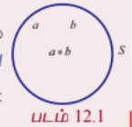

## 12.2 ஈருறுப்புச் செயலிகள் (Binary Operations)

### 12.2.1 வரையறைகள் (Definitions)

$\mathbb{R}$ -ன் மீது அடிப்படை எண்கணித ஈருறுப்புச் செயலிகள் கூட்டல் $(+)$, கழித்தல் $(-)$, பெருக்கல் $(\times)$, மற்றும் வகுத்தல் $(\div)$ என்பவைகளாகும். 19ஆம் நூற்றாண்டின் இறுதியிலும் மற்றும் 20ஆம் நூற்றாண்டின் தொடக்கத்திலும் வாழ்ந்த கணித அறிஞர்கள் எபேல், கெய்லி, கோஷி போன்றோர் மேற்கூறிய வழக்கமான இயற்கணிதச் செயலிகள் நிறைவு செய்யும் பண்புகளை பொதுமைப்படுத்த முயற்சி செய்ததார்கள். அதன் மூலம் அவர்கள் புதிய நுண் இயற்கணித அமைப்புகளைக் கொள்ககை ரீதியான அணுகுமுறை மூலம் உருவாக்கினார்கள். அவ்வாறு பெறப்பட்ட இந்த புதிய பிரிவு நுண் இயற்கணிதம் என்று அழைக்கப்படுகிறது.

எடுத்துக்காட்டாக ஏதேனும் இரு இயல் எண்களின் கூடுதல் ஓர் இயல் எண் என்றும் அவற்றின் பெருக்கலும் ஓர் இயல் எண் என்றும் அறிவோம். அதாவது, வழக்கமான கூட்டல் $(+)$ மற்றும் $(\times)$ பெருக்கல் செயலிகள் $\mathbb{N}$ என்ற கணத்தில் இரு உறுப்புகளைக் கொண்டு செயல்படுத்துவதால் ஈருறுப்புச் செயலி என்று அழைக்கப்படுகின்றன.

அதையே குறியீட்டுவடிவில், $m+n\in\mathbb{N}$; $m\times n\in\mathbb{N}$, $\forall m,n\in\mathbb{N}=\{1,2,3,\ldots\}$ என்று எழுதுகிறோம்.

மேற்கூறிய இரண்டு ஈருறுப்புச் செயல்களும் கீழ்க்காணும் விதிகளை நிறைவுச் செய்வதைக் கவனிக்க.

(1) $\mathbb{N}$ -ல் இருந்து ஒரே நேரத்தில் இரண்டு எண்கள் எடுக்கப்பட்டு செயல்படுத்தப்படுகின்றன.

(2) அவைகளின் முடிவில் கிடைக்கும் உறுப்பு மீண்டும் $\mathbb{N}$ என்ற கணத்திலேயே இருக்கிறது.

இவ்வாறாக ஒரு வெற்றற்ற கணத்தின் மீது வரையறுக்கப்படும் எந்த ஒரு செயலையும் நுண்கணிதத்தில் ஒரு ஈருறுப்பு செயலி அல்லது ஈருறுப்புத் தொகுப்பு எனப்படும்.

**வரையறை 12.1**

ஒரு வெற்றற்ற கணம் $S$ –இன் மீது வரையறுக்கப்பட்ட $*$ என்ற ஏதேனும் ஒரு செயல், ஓர் ஈருறுப்புச் செயல் என அழைக்கப்படவேண்டுமெனில் அது பின்வரும் பண்புகளைக் கொண்டிருக்க வேண்டும்.

(i) $S \times S$ -ல் உள்ள ஒவ்வொரு வரிசைச் சோடி $(a,b)$ -க்கு $*$ என்ற செயல் கண்டிப்பாக வரையறுக்கப்பட்டிருக்க வேண்டும்.

(ii) $S \times S$ -ல் ஒவ்வொரு வரிசைச் சோடி $(a,b)$ -யுடன் $S$ -ல் $a*b$ என்ற ஒரே ஓர் உறுப்பு இருக்கும்.

வேறுவிதமாகச் கூறினால், $S$ -ன் மீது வரையறுக்கப்படும் $*$ என்ற ஈருறுப்புச் செயலானது $S$ -ல் உள்ள உறுப்புகளின் ஒவ்வொரு வரிசைச் சோடியையும் $S$ -ல் ஒரே ஓர் உறுப்பைத் தொடர்புபடுத்தும் ஒரு விதி ஆகும். இதனை ஒரு சார்பாகவும் பின்வருமாறு வரையறுக்கலாம்.

$* : S \times S \rightarrow S$; அதாவது, $*(a,b) = a*b \in S$, இங்கு $a*b$ என்பது ஒரே ஓர் உறுப்பாகும்.

$*$-ன் விளைவு $a*b$ எப்பொழுதும் கண்டிப்பாக $S$ -ல் அமைய வேண்டும் மற்றும் $S$ -க்கு வெளியே அமையக்கூடாது. இந்நிலையில் $S$ -ஆனது $*$-ன் கீழ் அடைவு பெற்றுள்ளது எனக் கூறலாம். இப்பண்பை அடைவுப் பண்பு என்று கூறுவர்.

**வரையறை 12.2**

ஒன்று அல்லது அதற்கு மேற்பட்ட ஈருறுப்புச் செயல்களைப் பொருத்து ஏதேனும் ஒரு வெற்றற்ற கணத்தின் மீது வரையறுக்கப்பட்டால் அது இயற்கணித அமைப்பு எனப்படும்.

$*$ என்ற ஈருறுப்புச் செயலை $S$ -இன் மீது பின்வருமாறும் வரையறுக்கலாம்:

$\forall a,b \in S$, $a*b$ என்பது ஒருமைத்தன்மை வாய்ந்தது, மேலும் $a*b \in S$.

#### குறிப்பு

மேலேயுள்ள வறையறையிலிருந்து ஒவ்வொரு ஈருறுப்புச் செயலும் அடைவுப் பண்பை நிறைவு செய்யும் என்பது தெளிவாகிறது.

#### குறிப்பு

$*$ என்ற செயல் ஒரு குறியீடுதான். $*$ என்பது $+, -, \times, \div$, அணிக் கூட்டல், அணிப் பெருக்கல், போன்ற செயல்களில் ஒன்றைக் குறிக்கும். மேலும் $*$ ஆனது ஈருறுப்புச் செயலியாக இருப்பதோ அல்லது இல்லாமலிருப்பதோ அது வரையறுக்கப்படும் கணத்தைப் பொருத்ததாகும்.

எடுத்துக்காட்டாக, வழக்கமான கூட்டல் $+$ மற்றும் பெருக்கல் $\times$ ஆனது $\mathbb{N}$ -ன் மீது ஓர் ஈருறுப்புச் செயல் ஆகும். ஆனால், கழித்தல் $-$ ஆனது $\mathbb{N}$ –ன் மீது ஓர் ஈருறுப்புச் செயல் ஆகாது.

இதனை சரிபார்க்க. $(3,4) \in \mathbb{N} \times \mathbb{N}$ என்க.

$(a,b) = (3,4)$, $3-4 = -1 \notin \mathbb{N}$.

எனவே $-$ ஆனது $\mathbb{N}$ -ன் மீது ஓர் ஈருறுப்புச் செயல் ஆகாது. அதே சமயத்தில் $-$ ஆனது $\mathbb{Z}$ -ன் மீது ஓர் ஈருறுப்புச் செயல் என்பது தெளிவு. எனவே, $\mathbb{Z}$ ஆனது $+$ மற்றும் $-$ ஐ பொருத்து கீழ் அடைவு பெற்றுள்ளது. எனவே, $(\mathbb{Z}, +, -)$ ஓர் இயற்கணித அமைப்பு ஆகும்.

### படம் 12.1

#### உற்றுநோக்கி அறிந்தவை

ஒரு செயலின் ஈருறுப்புப் பண்பானது அது வரையறுக்கப்படும் கணத்தைப் பொருத்ததாகும்.

(a) $\mathbb{N}$ உடன் 0 மற்றும் குறை முழு எண்களையும் சேர்த்து விரிவுபடுத்தப்பட்ட கணம்தான் $\mathbb{Z}$ எனப்படும் முழு எண் கணம் ஆகும். $\mathbb{Z}$ -ன் மீது $-$ ஆனது ஒரு ஈருறுப்புச் செயலி ஆகும். ஆனால் $\mathbb{N}$ -ன் மீது $-$ ஒரு ஈருறுப்புச் செயலி ஆகாது.

(b) செயலி $\div$ ஆனது, $\mathbb{Z}$ -ன் மீது ஓர் ஈருறுப்புச் செயல் ஆகாது. எடுத்துக்காட்டாக, $(1,2) \in \mathbb{Z} \times \mathbb{Z}$ -க்கு $1 \div 2 = \frac{1}{2} \notin \mathbb{Z}$. எனவே, $\mathbb{Z}$ என்ற கணத்தை விரிவுபடுத்தக் கிடைக்கப்பெறும் கணம் $\mathbb{Q}$ ஆகும்.

(c) எண்களைக் கொண்ட அடிப்படைச் செயல்பாடுகளில் '$0$' ஆல் வகுப்பது வரையறுக்கப்படவில்லை என்ற உண்மையை அறிவோம். எனவே, $\div$ ஆனது $\mathbb{Q} \setminus \{0\}$-ன் மீது ஓர் ஈருறுப்புச் செயல் ஆகும். இவ்வாறே $+, -, \times$ ஆகியவைகள் $\mathbb{Q}$ -ன் மீது ஈருறுப்புச் செயல்கள் ஆகும் ஆனால் $\div$ ஆனது $\mathbb{Q} \setminus \{0\}$-ன் மீது அமையும் ஓர் ஈருறுப்புச் செயல் ஆகும்.

மேற்கொண்டு $\mathbb{Q}$ ஐ $\mathbb{R}$ -க்கும் மற்றும் $\mathbb{R}$ ஐ $\mathbb{C}$-க்கும் விரிவுபடுத்துவதற்குக் காரணம் என்ன? என்ற வினா எழுந்துள்ளது. எனவே, $+, -, \times, \div$ ஆகிய அடிப்படையான எண்கணித செயல்களுடன் "$x^2 - 2 = 0$"; "$x^2 + 1 = 0$" என்ற சமன்பாட்டு வகைகளின் மூலங்களையும் உள்ளடக்கிய ஒரு எண் தொகுப்பு தேவைப்படுகிறது. எனவே, ஏற்கனவே உள்ள எண் தொகுப்புடன் விகிதமுறா எண்களையும் கற்பனை எண்களையும் திரட்டி [அத்தியாயம் 3ஐப் பார்க்க] உள்ளடக்கும்பொழுது கிடைக்கும் எண் தொகுப்பானது $\mathbb{R}$ -ம் $\mathbb{C}$-ம் ஆகும். இதில் மிகப்பெரிய எண் தொகுப்பான $\mathbb{C}$ ஆனது முறையே $\mathbb{N}, \mathbb{Z}, \mathbb{Q}$ மற்றும் $\mathbb{R}$ ஆகிய எண் தொகுப்புகளை கொண்டிருக்கும் உட்கணங்களாக இருக்கும்.

**அட்டவணை 12.1**

| எண் தொகுப்பு செயலிகள் | $\mathbb{N}$ | $\mathbb{Z}$ | $\mathbb{Q}$ | $\mathbb{R}$ | $\mathbb{C}$ | $\mathbb{Q} \setminus \{0\}$ | $\mathbb{R} \setminus \{0\}$ | $\mathbb{C} \setminus \{0\}$ |
|---|---|---|---|---|---|---|---|---|
| $+$ | அடைவு பெற்று உள்ளது | அடைவு பெற்று உள்ளது | அடைவு பெற்று உள்ளது | அடைவு பெற்று உள்ளது | அடைவு பெற்று உள்ளது | அடைவு பெற வில்லை | அடைவு பெற வில்லை | அடைவு பெற வில்லை |
| $-$ | அடைவு பெற வில்லை | அடைவு பெற்று உள்ளது | அடைவு பெற்று உள்ளது | அடைவு பெற்று உள்ளது | அடைவு பெற்று உள்ளது | அடைவு பெற வில்லை | அடைவு பெற வில்லை | அடைவு பெற வில்லை |
| $\times$ | அடைவு பெற்று உள்ளது | அடைவு பெற்று உள்ளது | அடைவு பெற்று உள்ளது | அடைவு பெற்று உள்ளது | அடைவு பெற்று உள்ளது | அடைவு பெற்று உள்ளது | அடைவு பெற்று உள்ளது | அடைவு பெற்று உள்ளது |
| $\div$ | அடைவு பெற வில்லை | அடைவு பெற வில்லை | அடைவு பெற வில்லை | அடைவு பெற வில்லை | அடைவு பெற வில்லை | அடைவு பெற்று உள்ளது | அடைவு பெற்று உள்ளது | அடைவு பெற்று உள்ளது |

### எடுத்துக்காட்டு 12.1

கீழ்க்காணும் ஈருறுப்புச் செயலிகள், அதற்குரிய கணங்களில் அடைவுப் பண்பைப் பெற்றுள்ளதா என்பதைச் சோதிக்க. அவ்வாறில்லாதவற்றிற்கு ஈருப்புச் செயலியின் நிபந்தனையை நிறைவேற்றும் முறையைக் காண்க.

$$a*b = 3a + 5b - ab^2; \quad a,b \in \mathbb{Z}$$

#### தீர்வு

$\mathbb{Z}$-இன் மீது $\times$ ஆனது ஈருறுப்புச் செயலி என்பதால் $a,b \in \mathbb{Z} \implies a \times b \in \mathbb{Z}$ மற்றும் $b \times b = b^2 \in \mathbb{Z}$ ... (1)

$\mathbb{Z}$ -ன் மீது $+$ ஆனது ஈருறுப்புச் செயலி என்பதால் (1) $\implies 3a + 5b - ab^2 \in \mathbb{Z}$ ... (2)

மேலும், $a \in \mathbb{Z}$ மற்றும் $3a \in \mathbb{Z} \implies 3a \in \mathbb{Z}$. ... (3)

(2), (3) ஆகியவற்றிலிருந்து $\mathbb{Z}$ -ன் மீது '$-$' ஆனது ஈருறுப்புச் செயலி என்பதாலும் $a*b = 3a + 5b - ab^2 \in \mathbb{Z}$ கிடைக்கும். எனவே $a*b \in \mathbb{Z}$ என்பதால் $*$ ஆனது $\mathbb{Z}$ -ன் மீது அடைவு பெற்றுள்ளது.

### 12.2.2 ஈருறுப்புச் செயலியின் மேலும் சில பண்புகள்
### (Some more properties of a binary operation)

**பரிமாற்றுப் பண்பு (Commutative property)**

ஒரு வெற்றற்ற கணம் $S$ –ன் மீது ஈருறுப்புச் செயலி $*$ ஆனது பரிமாற்றுத் தன்மையுடையதாயின் ஒவ்வொரு $a,b \in S$ -க்கும் $a*b = b*a$ என்பது உண்மையாக வேண்டும்.

**சேர்ப்புப் பண்பு (Associative property)**

ஒரு வெற்றற்ற கணம் $S$ -ன் மீது ஈருறுப்புச் செயலி $*$ ஆனது சேர்ப்புப் பண்பு உடையதாயின் $(a*b)*c = a*(b*c)$, $\forall a,b,c \in S$ என்பது உண்மையாக வேண்டும்.

**சமனிப் பண்பு (Existence of Identity property)**

$*$ என்ற ஈருறுப்புச் செயலியின் கீழ் $e \in S$ என்பது $S$ -ன் சமனி உறுப்பு எனில் $\forall a \in S$, $a*e = a$ மற்றும் $e*a = a$ என்பதை நிறைவு செய்யும்.

**எதிர்மறைப் பண்பு (Existence of inverse property)**

$S$ -ல் $e$ எனும் ஒரு சமனி உறுப்பு இருந்ததால் $a \in S, b \in S$, $a*b = e$ மற்றும் $b*a = e$ எனில், $b \in S$ என்பது $a$ -ன் நேர்மாறு உறுப்பு அல்லது எதிர்மறை உறுப்பு எனப்படும். இதை நாம் $b = a^{-1}$ என எழுதலாம்.

#### குறிப்பு

$a^{-1}$ ஆனது $S$-ல் ஒரு உறுப்பாகும். $a^{-1}$-ஐ $a$-ன் எதிர்மறை என்று கூறலாமேயன்றி $\frac{1}{a}$ என்று கூற இயலாது.

#### குறிப்பு

(i) $1 \in \mathbb{Z}$ என்பது ஒரு பெருக்கல் சமனி. $\mathbb{Z}$ -ல் ஒரே ஓர் உறுப்புதான் இத்தன்மையைப் பெற்றிருக்கும். இவ்வுறுப்பு $n \cdot 1 = 1 \cdot n = n$, $\forall n \in \mathbb{Z}$ என்ற பண்பை நிறைவு செய்யும்.

(ii) ஓர் உறுப்பின் பெருக்கல் எதிர்மறையை விளக்க எடுத்துக்காட்டாக, $2 \in \mathbb{Q}$ -ன் பெருக்கல் எதிர்மறை $\frac{1}{2} \in \mathbb{Q}$ ஆகும். $x = \frac{1}{2}$ தவிர வேறு எந்த எண்ணும் $2 \times x = x \times 2 = 1$, $x \in \mathbb{Q}$ என்ற சமன்பாட்டை நிறைவு செய்யும் பண்பை பெற்றிருக்காது.

#### குறிப்பு

ஒரு கணிதக் கூற்றில் 'ஒவ்வொன்றுக்கும்' அல்லது 'அனைத்திற்கும்' என்பதை தொடர்புபடுத்தும்பொழுது அது ஒவ்வொரு சோடி அல்லது மூன்று உறுப்புகளுக்கும் நிரூபிக்கப்பட வேண்டும். ஒவ்வொரு சோடி அல்லது மூன்று உறுப்புகளுக்கு நிரூபிப்பது என்பது அவ்வளவு எளிதல்ல. ஆனால் இந்த வகையான நிலைமைகளில் இக்கூற்றின் மறுப்பை நிரூபிப்பது சாலச் சிறந்தது. அதாவது "ஒவ்வொன்றுக்கும்" அல்லது "அனைத்திற்கும்" என்பதன் மறுப்பானது "அங்கே உள்ளது (அ) இருத்தல்" என்பதற்கு ஒப்ப ஒரு சோடி அல்லது மூன்று உறுப்புகளாக எடுத்துக் கொண்ட கூற்று மறுக்குமாறு உருவாக்க முயற்சிக்கலாம். அவ்வாறு காண இயலுமாயின், தரப்பட்ட கூற்று சரியானது அல்ல என்பது முடிவாகும்.

சமனி மற்றும் எதிர்மறை உறுப்புகளின் ஒருமைத்தன்மை சார்ந்த வினாக்கள் ஆராயப்பட வேண்டும்.

பின்வரும் கோட்பாடுகள் மேலே குறிப்பிட்ட முடிவுகளை மிகவும் பொதுவான வடிவத்தில் நிரூபிக்கின்றன.

**தேற்றம் 12.1 (சமனி உறுப்பின் ஒருமைத்தன்மை)**

ஓர் இயற்கணித அமைப்பில் சமனி உறுப்பானது (உள்ளது எனில்) ஒருமைத்தன்மை வாய்ந்தது.

**நிரூபணம்**

$(S, *)$ என்பது ஓர் இயற்கணித அமைப்பு என்க. $*$ ஐ பொருத்து $S$ -ன் சமனி உறுப்பானது $S$ -ல் உள்ளது எனக் கொள்க. மேலும் ஒரே ஒரு சமனி உறுப்பு மட்டுமே உள்ளது என நிரூபிக்க.

$S$ –ன் சமனி உறுப்புகள் $e_1, e_2$ என இருவ்வதாகக் கொள்வோம்.

முதலில் $e_1$ ஐ சமனி உறுப்பாகவும், $e_2$ ஐ $S$ -ன் உறுப்பாகவும் எடுத்துக்கொண்டால்,

$e_1 * e_2 = e_2$ மற்றும் $e_2 * e_1 = e_2$. ... (1)

பிறகு $e_2$ ஐ சமனி உறுப்பாகவும், $e_1$ ஐ $S$ -ன் உறுப்பாகவும் எடுத்துக்கொண்டால்,

$e_2 * e_1 = e_1$ மற்றும் $e_1 * e_2 = e_1$. ... (2)

(1), (2) -லிருந்து, $e_1 = e_2$. எனவே, சமனி உறுப்பு ஒருமைத்தன்மை வாய்ந்தது.

**தேற்றம் 12.2 (எதிர்மறை உறுப்பின் ஒருமைத்தன்மை)**

ஓர் இயற்கணித அமைப்பில் ஓர் உறுப்பின் எதிர்மறை (இருப்பின்) ஒருமைத்தன்மை வாய்ந்தது.

**நிரூபணம்**

$(S, *)$ என்பது ஓர் இயற்கணித அமைப்பு என்க. மேலும் $a \in S$ என்க. $a$ -ன் எதிர்மறை $S$ -ல் உள்ளது எனக் கொள்க. $S$ -ல் உள்ள ஒவ்வொரு உறுப்பிற்கும் ஒரே ஒரு எதிர்மறை உறுப்பு மட்டுமே இருக்கும். மேலும் $S$ -ல் எதிர்மறை உறுப்பு இருந்ததால் அதில் சமனி உறுப்பு $e$ உறுதியாக இருக்கும்.

$a \in S$ என்க. $S$ -ல் உள்ள உறுப்பு $a$ -ற்கு ஒரே ஒரு எதிர்மறை உறுப்பு மட்டுமே இருக்கும் என நிரூபிக்க.

$a$ -ன் எதிர்மறை உறுப்புகள் $a_1, a_2$ என்ற இரு உறுப்புகள் இருப்பதாகக் கொள்வோம்.

$a_1$ ஐ $a$ -ன் எதிர்மறையாகக் கொள்வோமாயின் $a_1 * a = a * a_1 = e$ ... (1)

$a_2$ ஐ $a$ -ன் எதிர்மறையாகக் கொள்வோமாயின் $a_2 * a = a * a_2 = e$ ... (2)

$$a_1 = a_1 * e = a_1 * (a * a_2) \quad (\text{(2) -ன்படி})$$

$$= (a_1 * a) * a_2 \quad (\text{சேர்ப்புப் பண்பின்படி})$$

$$= e * a_2 \quad (\text{(1) -ன்படி})$$

$$= a_2 \quad (\text{சமனிப் பண்பின்படி})$$

$\therefore a_1 = a_2$. எனவே, $S$ -ல் உள்ள உறுப்பு $a$ -ற்கு ஒரே ஒரு எதிர்மறை உறுப்பு மட்டுமே இருக்கும் என்று அறியலாம்.

#### குறிப்பு

தேற்றம் 12.1 மற்றும் 12.2-இன் உண்மையான ஒருமைத்தன்மையை விரிவாக மேற்படிப்பில் தெரிந்து கொள்ளலாம்.

### எடுத்துக்காட்டு 12.2

$\mathbb{Z}$ என்ற கணத்தில் '$+$' என்ற ஈருறுப்புச் செயலி கொண்டு (i) அடைவுப் பண்பு (ii) பரிமாற்றுப் பண்பு (iii) சேர்ப்புப் பண்பு (iv) சமனிப் பண்பு மற்றும் (v) எதிர்மறைப் பண்பு ஆகியவைகளைப் பெற்றுள்ளதா எனச் சரிபார்க்க.

#### தீர்வு

(i) $m+n \in \mathbb{Z}$, $\forall m,n \in \mathbb{Z}$. எனவே, '$+$' ஆனது, $\mathbb{Z}$ -ன் மீது ஓர் ஈருறுப்புச் செயலி ஆகும்.

(ii) மேலும் $m+n = n+m$, $\forall m,n \in \mathbb{Z}$. எனவே, பரிமாற்றுப் பண்பு உண்மையாகும்.

(iii) $(m+n)+p = m+(n+p)$, $\forall m,n,p \in \mathbb{Z}$. எனவே, சேர்ப்புப் பண்பு உண்மையாகும்.

(iv) $m+0 = 0+m = m$, $\forall m \in \mathbb{Z}$. எனவே, $0 \in \mathbb{Z}$ $\ni$ $m+0 = 0+m = m$. எனவே சமனிப்பண்பு உள்ளது.

(v) $m+(-m) = (-m)+m = 0$, $\forall m \in \mathbb{Z}$. $\therefore -m \in \mathbb{Z}$, $\ni$ $m+(-m) = (-m)+m = 0$. எனவே, எதிர்மறைப் பண்பும் உள்ளது. இவ்வாறாக, கூட்டல் செயலி $+$ ஆனது, $\mathbb{Z}$ -ன் மீது மேற்கண்ட ஐந்து பண்புகளை நிறைவு செய்யும்.

கூட்டல் சமனி $=0$ மற்றும் ஏதேனும் ஒரு முழு எண் $m$ -ன் கூட்டல் எதிர்மறை $-m$ என்பதைக் கவனத்தில் கொள்வோம்.

### எடுத்துக்காட்டு 12.3

$\mathbb{Z}$ -ன் மீது இயற்கணித செயலி '$-$' ஆனது (i) அடைவுப் பண்பு (ii) பரிமாற்றுப் பண்பு (iii) சேர்ப்புப் பண்பு (iv) சமனிப் பண்பு மற்றும் (v) எதிர்மறைப் பண்பு ஆகியவைகளை கொண்டுள்ளதா எனச் சரிபார்க்க.

#### தீர்வு

(i) கழித்தல் '$-$' ஆனது $\mathbb{N}$ ன் மீது ஓர் ஈருறுப்புச் செயல் அல்ல. ஆனால் $\mathbb{Z}$ ன் மீது ஓர் ஈருறுப்புச் செயல் ஆகும். எனவே, மேலும் சில பண்புகளை '$-$' என்ற ஈருறுப்புச் செயலியைக் கொண்டு $\mathbb{Z}$ ன் மீது எளிதான மதிப்புகளுக்குச் சரிபார்ப்பது நல்லது.

(ii) $m = 4$, $n = 5$ எனில், $(m-n) = (4-5) = -1$ மற்றும் $(n-m) = (5-4) = 1$. இங்கு $m-n \neq n-m$. எனவே, '$-$' ஆனது $\mathbb{Z}$ -இன் மீது பரிமாற்றுப் பண்பை நிறைவு செய்யாது.

(iii) $m-n-p$ மற்றும் $m-(n-p)$ போன்றவற்றில் $m=4, n=5$, மற்றும் $p=7$ என்ற

$$(m-n)-p = (4-5)-7 = -1-7 = -8$$ ... (1)

$$m-(n-p) = 4-(5-7) = 4-(-2) = 6$$ ... (2)

(1), (2) -லிருந்து $(m-n)-p \neq m-(n-p)$.

எனவே, '$-$' ஆனது $\mathbb{Z}$ -ன் மீது சேர்ப்புப் பண்பை நிறைவு செய்யாது.

(iv) சமனி உறுப்பு இல்லை. (ஏன்?)

(v) எதிர்மறை உறுப்பு இல்லை (ஏன்?)

### எடுத்துக்காட்டு 12.4

$\mathbb{Z}_e$ ன் மீது $+$ என்ற ஈருறுப்புச் செயலி (i) அடைவுப் பண்பு (ii) பரிமாற்றுப் பண்பு (iii) சேர்ப்புப் பண்பு (iv) சமனிப் பண்பு மற்றும் (v) எதிர்மறைப் பண்பு ஆகியவைகளை பெற்றுள்ளதா எனச் சரிபார்க்க. இங்கு $\mathbb{Z}_e$ = அனைத்து இரட்டை முழுக்களின் கணம்.

#### தீர்வு

$\mathbb{Z}_e = \{2k | k \in \mathbb{Z}\} = \{\ldots, -6, -4, -2, 0, 2, 4, 6, \ldots\}$ என்ற இரட்டை முழுக்களின் கணத்தைக் கருதுக.

$\mathbb{Z}_e$ -ன் மீது கூட்டலின் '$+$' என்ற ஈருறுப்புச் செயலியைக் கொண்டு பின்வரும் பண்புகளைச் சரிபார்க்கலாம்.

(i) ஏதேனும் இரண்டு இரட்டை முழுக்களின் கூடுதல் ஓர் இரட்டை முழு எண் ஆகும். ஏனெனில், $x,y \in \mathbb{Z}_e \implies x = 2m$ மற்றும் $y = 2n$, $m,n \in \mathbb{Z}$.

எனவே, $x+y = 2m+2n = 2(m+n) \in \mathbb{Z}_e$. எனவே, $\mathbb{Z}_e$ -ன் மீது '$+$' ஆனது அடைவுப் பண்பு பெற்றுள்ளது.

(ii) $\forall x,y \in \mathbb{Z}_e$, $(x+y) = (2m+2n) = (2n+2m) = (y+x)$. எனவே, $+$ ஆனது பரிமாற்று விதியை நிறைவு செய்கிறது.

(iii) இதேபோல், $\forall x,y,z \in \mathbb{Z}_e$, $(x+y)+z = x+(y+z)$. எனவே, சேர்ப்பு விதியும் உண்மையாகிறது.

(iv) $x = 2k$ எனக் கொள்க. $2k+0 = 0+2k = 2k$. எனவே, $\forall x \in \mathbb{Z}_e$, $0 \in \mathbb{Z}_e$ $\ni$ $x+0 = 0+x = x$. ஆகையால், 0 சமனி உறுப்பாகும்.

(v) $x = 2k$ என எடுத்துக்கொண்டால், இதன் எதிர்மறை $x'$ ஆனது பின்வருமாறு பெறப்படுகிறது. $2k+x' = 0 \implies x' = -2k = 2(-k)$. அதாவது $x' = -x$. எனவே, $\forall x \in \mathbb{Z}_e$, $-x \in \mathbb{Z}_e$, $\ni$ $x+(-x) = (-x)+x = 0$. எனவே, $-x$ என்பது $x$ -ன் எதிர்மறை ஆகும்.

### எடுத்துக்காட்டு 12.5

$\mathbb{Z}_0$ = அனைத்து ஒற்றறை முழுக்களின் கணம் எனில் $\mathbb{Z}_o$ -ன் மீது இயற்கணித செயலி $+$ ஆனது (i) அடைவுப்பண்பு (ii) பரிமாற்றுப்பண்பு (iii) சேர்ப்புப்பண்பு (iv) சமனிப்பண்பு மற்றும் (v) எதிர்மறைப் பண்பு ஆகியவற்றைப் பெற்றுள்ளதா எனச் சரிபார்க்க.

#### தீர்வு

$\mathbb{Z}_o = \{2k+1 : k \in \mathbb{Z}\} = \{\ldots, -5, -3, -1, 1, 3, 5, \ldots\}$ என்ற அனைத்து ஒற்றறை முழுக்களைக் கொண்ட கணத்தைக் கருதுக. கூட்டல் $+$ ஆனது $\mathbb{Z}_o$ -இன் மீது ஓர் ஈருறுப்புச் செயல் ஆகாது. ஏனெனில், $x = 2m+1$, $y = 2n+1$ எனும்பொழுது $x+y = 2(m+n+1)$ என்பது அனைத்து $m,n$ -க்கும் இரட்டை எண்ணாகவே அமையும். எடுத்துக்காட்டாக, $3,7 \in \mathbb{Z}_o$ என்ற இரு ஒற்றறை எண்களைக் கருதுக. அவைகளின் கூடுதல் $3+7 = 10$ என்பது ஓர் இரட்டை எண்ணாகும். பொதுவாக, $x,y \in \mathbb{Z}_0$ எனில், $x+y \notin \mathbb{Z}_0$ ஆகும். $+$ ஆனது $\mathbb{Z}_o$ ன் மீது ஓர் ஈருறுப்புச் செயல் அல்லலாததால் ஏனையப் பண்புகளைச் சரிபார்க்க வேண்டிய அவசியமில்லை.

### எடுத்துக்காட்டு 12.6

கொடுக்கப்பட்ட கணத்தின்மீது பின்வரும் செயலியானது (i) அடைவுப் பண்பு (ii) பரிமாற்றுப் பண்பு மற்றும் (iii) சேர்ப்புப் பண்பு ஆகியவைகளைக் கொண்டுள்ளதா எனச் சரிபார்க்க.

$$a*b = a^b; \quad a,b \in \mathbb{N} \quad (\text{அடுக்குக்குறி பண்பு})$$

#### தீர்வு

(i) $a*b = a^b \in \mathbb{N}$, $\forall a,b \in \mathbb{N}$ என்பது உண்மை. எனவே $\mathbb{N}$ ஆனது $*$ –ன் கீழ் அடைவு பெற்றுள்ளது.

(ii) $a=2$, $b=3$ ஆகிய மதிப்புகளை $a*b = a^b$ மற்றும் $b*a = b^a$ ஆகியவைகளில் பிரதியிட,

$2*3 = 2^3 = 8$ ஆனால் $3*2 = 3^2 = 9 \implies 2*3 \neq 3*2$.

எனவே $*$ ஆனது பரிமாற்றுப் பண்பை நிறைவு செய்யாது.

(iii) $(a*b)*c = a*(b*c)$ எனக் கொள்க.

இதில் $a=2, b=3$ மற்றும் $c=4$ என பிரதியிடக் கிடைப்பது

$(2*3)*4 = (2^3)*4 = 8*4 = 8^4 = 4096$

ஆனால் $2*(3*4) = 2*(3^4) = 2*81 = 2^{81}$

$\implies (a*b)*c \neq a*(b*c)$.

எனவே, $*$ ஆனது சேர்ப்புப் பண்பை நிறைவு செய்யாது.

#### குறிப்பு

இந்த ஈருறுப்பு செயலிக்கு சமனியும் எதிர்மறையும் இல்லை. (காரணத்துடன் விளக்குக)

### எடுத்துக்காட்டு 12.7

கொடுக்கப்பட்ட கணத்தின்மீது பின்வரும் செயலானது (i) அடைவுப் பண்பு (ii) பரிமாற்றுப் பண்பு (iii) சேர்ப்புப் பண்பு (iv) சமனிப் பண்பு மற்றும் (v) எதிர்மறைப் பண்பு ஆகியவைகளைப் பெற்றிருக்குமா எனச் சரிபார்க்க.

$$m*n = m+n-mn; \quad m,n \in \mathbb{Z}$$

#### தீர்வு

(i) $m+n-mn$ -ன் விளைவு ஆனது ஒரு முழு எண் என்பது தெளிவாகிறது. எனவே $*$ ஆனது $\mathbb{Z}$ -ன் மீது அடைவு பெற்றுள்ளது.

(ii) $m*n = m+n-mn = n+m-nm = n*m$, $\forall m,n \in \mathbb{Z}$. எனவே, $*$ ஆனது பரிமாற்றுப் பண்பை நிறைவு செய்கிறது.

(iii) $(m*n)*p = (m+n-mn)*p = (m+n-mn)+p-(m+n-mn)p$

$$= m+n-mn+p-mp-np+mnp$$ ... (1)

இதேபோன்று, $m*(n*p) = m*(n+p-np) = m+(n+p-np)-m(n+p-np)$

$$= m+n+p-np-mn-mp+mnp$$ ... (2)

(1) மற்றும் (2) -லிருந்து $(m*n)*p = m*(n*p)$. எனவே $*$ ஆனது சேர்ப்புப் பண்பை நிறைவு செய்கிறது.

(iv) $e$ என்ற ஒரு முழு எண்ணை $m*e = e*m = m$, $\forall m \in \mathbb{Z}$ என்றவாறு காண வேண்டும்.

ஆகவே, $m*e = m \implies m+e-me = m \implies e(1-m) = 0 \implies e=0$ அல்லது $m=1$. இங்கு, $m$ ஆனது ஒரு தன்னிச்சையான முழு எண் என்பதால் $m=1$ என இருக்க வேண்டிய அவசியமில்லை. எனவே $e=0$ மட்டும்தான் இருக்கமுடியும். மேலும் $m*0 = 0*m = m$, $\forall m \in \mathbb{Z}$. எனவே 0 என்பது சமனி உறுப்பாகும். எனவே சமனிப் பண்பு உறுதிப்படுத்தப்படுகிறது.

(v) $m \in \mathbb{Z}$ என்ற ஓர் உறுப்பை $m*m' = m'*m = e = 0$, $\forall m \in \mathbb{Z}$ என்றவாறு காண வேண்டும்.

$$m*m' = 0 \implies m+m'-mm' = 0 \implies m' = \frac{-m}{1-m} = \frac{m}{m-1}$$

$m=1$ எனும்போது $m'$ ஐ வரையறுக்க முடியாது. $m=2$ எனும்பொழுது $m' = 2$ ஒரு முழு எண். ஆனால் $m=2$ தவிர $m$-ன் அனைத்து மதிப்புகளுக்கும் $m'$ ஒரு முழு எண்ணாக இருக்கத் தேவையில்லை. எனவே, $\mathbb{Z}$ -ல் எதிர்மறை உறுப்பு அமையாது.

### 12.2.3 பூலியன் அணிகள் மீது சில ஈருறுப்புச் செயல்கள்
### (Some binary operations on Boolean Matrices)

**வரையறை 12.3**

ஒரு மெய் அணியின் ஒவ்வொரு உறுப்பும் 0 அல்லது 1 ஆக இருந்தால் அத்தகைய அணி பூலியன் அணி எனப்படும்.

குறிப்பாக பூலியன் பதிவுகளான 0 மற்றும் 1, பல்வேறு விதங்களில் வரையறுக்க முடியும். மின்சார ஓட்டத்தை நிறுத்த அல்லது ஓடச் செய்யும் சாதனத்தில் "ஓடச் செய்தல் மற்றும் நிறுத்துதல்" என்பதனையும், கோட்டுருவியல், சேர்ப்பு அணி போன்ற பல இடங்களில் பூலியன் பதிவுகள் 0 மற்றும் 1 பயன்படுத்தப்படுகின்றன. நாம் அதே வகை பூலியன் அணிகளை விவாதத்திற்கு எடுத்துக் கொள்வோம்.

பூலியன் அணிகளின் தொகுப்பின் மீது பின்வரும் இரு வகையான செயற்பாடுகள் வரையறுக்கப்படுகின்றன.

$A = [a_{ij}]$ மற்றும் $B = [b_{ij}]$ என்ற ஒரே வகையான ஏதேனும் இரு பூலியன் அணிகள் என்க. அவைகளின் இணைப்பு $\vee$ மற்றும் சந்திப்பு $\wedge$ என்று குறிக்கப்பட்டு பின்வருமாறு வரையறுக்கப்படுகிறது.

**வரையறை 12.4** $A$ மற்றும் $B$-ன் இணைப்பு

$$A \vee B = [a_{ij} \vee b_{ij}] = [c_{ij}]$$

இங்கு $c_{ij} = \begin{cases} 1 & \text{எனில் } a_{ij}=1 \text{ அல்லது } b_{ij}=1 \\ 0 & \text{மற்றபடி} \end{cases}$

**வரையறை 12.5** $A$ மற்றும் $B$-ன் சந்திப்பு

$$A \wedge B = [a_{ij} \wedge b_{ij}] = [c_{ij}]$$

இங்கு $c_{ij} = \begin{cases} 1 & \text{எனில் } a_{ij}=1 \text{ மற்றும் } b_{ij}=1 \\ 0 & \text{மற்றபடி} \end{cases}$

மேற்கூறியவற்றிலிருந்து, $a_{ij} \vee b_{ij} = \max\{a_{ij}, b_{ij}\}$; $a_{ij} \wedge b_{ij} = \min\{a_{ij}, b_{ij}\}$ என்பது விளங்கும் $a_{ij},b_{ij} \in \{0,1\}$.

### எடுத்துக்காட்டு 12.8

$A = \begin{bmatrix} 0 & 1 \\ 1 & 1 \end{bmatrix}$, $B = \begin{bmatrix} 1 & 1 \\ 0 & 1 \end{bmatrix}$ ஆகிய இரண்டும் ஒரே வகையான பூலியன் அணிகள் எனில், $A \vee B$ மற்றும் $A \wedge B$ ஆகியவற்றைக் காண்க.

#### தீர்வு

$$A \vee B = \begin{bmatrix} 0 & 1 \\ 1 & 1 \end{bmatrix} \vee \begin{bmatrix} 1 & 1 \\ 0 & 1 \end{bmatrix} = \begin{bmatrix} 0 \vee 1 & 1 \vee 1 \\ 1 \vee 0 & 1 \vee 1 \end{bmatrix} = \begin{bmatrix} 1 & 1 \\ 1 & 1 \end{bmatrix}$$

$$A \wedge B = \begin{bmatrix} 0 & 1 \\ 1 & 1 \end{bmatrix} \wedge \begin{bmatrix} 1 & 1 \\ 0 & 1 \end{bmatrix} = \begin{bmatrix} 0 \wedge 1 & 1 \wedge 1 \\ 1 \wedge 0 & 1 \wedge 1 \end{bmatrix} = \begin{bmatrix} 0 & 1 \\ 0 & 1 \end{bmatrix}$$

**இணைப்பு மற்றும் சந்திப்பு நிறைவு செய்யும் பண்புகள்**

$\mathcal{B}$ என்பது ஒரே வகையான பூலியன் அணிகளின் தொகுப்பு என்க. இணைப்பு மற்றும் சந்திப்பு $\mathcal{B}$-ன் மீது நிறைவு செய்யக்கூடிய பண்புகளைக் காண்போம்.

**அடைவுப் பண்பு**

$A,B \in \mathcal{B}$, $A \vee B = [a_{ij} \vee b_{ij}] = [c_{ij}] \in \mathcal{B}$. ஏனெனில், $a_{ij} \vee b_{ij} = 0$ அல்லது $1$ $\forall i,j$. எனவே $\vee$ என்பது $\mathcal{B}$ –ன் மீது அடைவு பெற்றுள்ளது.

**சேர்ப்புப் பண்பு**

$(A \vee B) \vee C = A \vee (B \vee C)$, $\forall A,B,C \in \mathcal{B}$. எனவே, $\vee$ என்பது சேர்ப்புப்பண்பை நிறைவு செய்கிறது.

**சமனிப் பண்பு**

$\forall A \in \mathcal{B}$, $\exists$ பூச்சிய அணி $0 \in \mathcal{B}$ $\ni$ $A \vee 0 = 0 \vee A = A$ -க்கு சமனி உறுப்பு பூச்சிய அணி ஆகும்.

**எதிர்மறைப் பண்பு**

எந்த ஓர் அணி $A \in \mathcal{B}$-க்கு, $A \vee B = B \vee A = 0$ என்ற சமன்பாட்டை நிறைவு செய்யும்படி $B \in \mathcal{B}$ என்ற நேர்மாறு அணியைக் காணமுடியாது. எனவே, எதிர்மறை உறுப்பு $\mathcal{B}$ –ல் இருக்காது. இதுபோலவே, சந்திப்பு $\wedge$ என்ற செயலி ஆனது பின்வருபவைகளை நிறைவு செய்யும் என்பதை சரிபார்க்கமுடியும். (i) அடைவுப் பண்பு (ii) பரிமாற்றுப் பண்பு (iii) சேர்ப்புப் பண்பு (iv) சமனி உறுப்பு $U = \begin{bmatrix} 1 & 1 \\ 1 & 1 \end{bmatrix}$ என்ற அணி ஆகும் (v) எதிர்மறை உறுப்பு இருப்பதை உறுதிப்படுத்தமுடியாது.

### 12.2.4 மட்டு எண் கணிதம் (Modular Arithmetic)

இதுவரை வழக்கமான அடிப்படை இயற்கணித செயலிகள், அணிக் கூட்டல், அணிப் பெருக்கல், பூலியன் அணிகளின் இணைப்பு மற்றும் சந்திப்பு ஆகிய ஈருறுப்புச் செயலிகளின் பண்புகளைப் பற்றி விவாதித்தோம். இப்பிரிவில் 'மட்டு எண் கணிதம்' என்ற பிரிவில் ஒரு புதிய ஈருறுப்புச் செயலி பற்றி விவாதிப்போம். $n > 1$ ஒரு மிகை முழு எண் என்க. இங்கு $n$ என்பது 'மட்டு எண்' என அழைக்கப்படும்.

$a, b$ ஆகிய இரண்டு முழுக்களுக்கு இடையேயுள்ள வித்தியாசம் $n$ –ன் மடங்கு எனில், மட்டு $n$ –ன் அடிப்படையில் $a$ -ம் $b$ -ம் ஒருங்கிசைவு உடையதாகும். இதனையே குறியீடுகள் மூலம், $a \equiv b \pmod{n}$ எனக்குறிப்பிடுவர்.

இதன்படி $a-b = nk$, $k \in \mathbb{Z}$ மற்றும் $a$ - ஐ $n$ ஆல் வகுக்கும்பொழுது கிடைக்கும் மீதி $b$ ஆனது மிகக் குறைந்த மிகை முழு எண் ஆகும்.

எடுத்துக்காட்டாக, $25 \equiv 4 \pmod{7}$, $20 \equiv 3 \pmod{17}$ $(13 \pmod{7})$, மற்றும் $15 \equiv 0 \pmod{5}$, ... மேலும் முழுக்களின் கணத்தை $n$ ஆல் வகுக்கும்போது கிடைக்கும் மீதிக்கான சாத்தியக் கூறுகள் $0,1,2,\ldots,n-1$ ஆகும். $\mathbb{Z}_5$ -ல்

$[0] = \{\ldots, -15, -10, -5, 0, 5, 10, 15, \ldots\}$

$[1] = \{\ldots, -14, -9, -4, 1, 6, 11, 16, \ldots\}$

$[2] = \{\ldots, -13, -8, -3, 2, 7, 12, 17, \ldots\}$

$[3] = \{\ldots, -12, -7, -2, 3, 8, 13, 18, \ldots\}$

$[4] = \{\ldots, -11, -6, -1, 4, 9, 14, 19, \ldots\}$

என்பவற்றை $\mathbb{Z}_5 = \{[0],[1],[2],[3],[4]\}$ என எழுதலாம். ஒவ்வொரு தொகுப்பிலும் ஏதேனும் இரண்டு எண்கள் மட்டு 5க்கு ஒருங்கிசைவு உடையதாகும். குறை எண்கள் தொகுப்பில் இருக்கும். ஆனால் $\mathbb{Z}_5$ யை குறிக்க மிகை எண்களை உபயோகிக்கலாம்.

2007க்கு முன், மட்டு எண்கணிதமானது 10-இலக்க ISBN (சர்வதேச நிலையான தர புத்தக எண்/International Standard Book Number) எண் தொகுப்பில் பயன்படுத்தப்பட்டது. உதாரணமாக, கடைசி இலக்கமானது சமநிலை சோதனைக்கானது ஆகும். இது $\{0,1,2,3,4,5,6,7,8,9,X\}$ என்ற கணத்திலிருந்து கிடைக்கிறது. 81-7808-755-3 என்ற ISBN எண்ணில் கடைசி இலக்கமான 3 ஆனது பின்வருமாறு கிடைக்கப்பெறுகிறது.

$1*8+2*1+3*7+4*8+5*0+6*8+7*7+8*5+9*5 = 8+2+21+32+0+48+49+40+45 = 245 \equiv 3 \pmod{11}$.

மாற்றாக நிறையிட்ட கூடுதல் பின் திருப்புகை முறையில் கணக்கிடப்படுகிறது.

$9*8+8*1+7*7+6*8+5*0+4*8+3*7+2*5+1*5 = 245 \equiv 3 \pmod{11}$. இரண்டு வழிகளிலும், நாம் ஒரே சரிபார்ப்பு (check) எண் 3 ஐப் பெறுகிறோம்.

2007-க்குப் பிறகு 13-இலக்க ISBN எண் பின்பற்றப்படுகிறது. (இடமிருந்து வலமாக) வலமிருந்து இடமாகத் தொடங்கும் முதல் 12 இலக்கங்களை 3, 1, 3, 1,.... என்கிற நிறைகளால் பெருக்கப்படுகின்றன. பின்னர் நிறையிட்ட கூடுதல் கணக்கிடப்படுகிறது. 10 –ன் அதிக மடங்கு எடுக்கப்படுகிறது. பின்னர் வித்தியாசம் கணக்கிடப்படுகிறது. அதன் கூட்டல் எதிர்மறை மட்டு 10 என்பது பதிமூன்றாவது இலக்கமாகும்.

உதாரணமாக, 978-81-931995-6-5 என்ற ISBN எண்ணைக் கருதுவோம். இதில் இடமிருந்து வலமாக 12 இலக்கங்களை எடுத்துக்கொள்வோம்.

9 7 8 8 1 9 3 1 9 9 5 6

1 3 1 3 1 3 1 3 1 3 1 3

9 21 8 24 1 27 3 3 9 27 5 18

இதில் இறுதி நிரையின் கூடுதல் 155 ஆகும். 10 –ன் மடங்குகளில் அருகிலுள்ள (உயர்) முழு எண் 160 ஆகும். 160-க்கும் 155-க்கும் உள்ள வித்தியாசம் 5 ஆகும். எனவே 5-ன் கூட்டல் எதிர்மறை மட்டு 10 –ஐ பொருத்து 5 ஆகும். இது ISBN எண்ணில் 13-வது இலக்கமாகும்.

மட்டு எண்கணிதத்தில், $n$ ஐ விட குறைவான மிகை முழுக்களைக் கொண்ட கணம் $\mathbb{Z}_n$ -ன் மீது "கூட்டல் மட்டு $n$, $+_n$" மற்றும் "$n$-ன் பெருக்கல் மட்டு $n$, $\times_n$" ஆகிய புதிய இரண்டு செயலிகளை வரையறுப்போம்.

**வரையறை 12.6**

(i) கூட்டல் மட்டு $n$ (addition modulo $n$) ஆனது பின்வருமாறு வரையறுக்கப்படுகிறது. $a,b \in \mathbb{Z}_n$ என்க. பிறகு $a+b$ ஐ $n$ ஆல் வகுக்க கிடைக்கும் மீதி $a +_n b$

(ii) பெருக்கல் மட்டு $n$ (multiplication modulo $n$) ஆனது பின்வருமாறு வரையறுக்கப்படுகிறது. $a,b \in \mathbb{Z}_n$ என்க. பிறகு $a \times b$ ஐ $n$ ஆல் வகுக்க கிடைக்கும் மீதி $a \times_n b$

### எடுத்துக்காட்டு 12.9

கூட்டல் மட்டு 5 செயலி அட்டவணையைப் பயன்படுத்தி கணம் $\mathbb{Z}_5$ -ன் மீது $+_5$ என்ற செயலிக்கு (i) அடைவுப்பண்பு (ii) பரிமாற்றுப்பண்பு (iii) சேர்ப்புப்பண்பு (iv) சமனிப்பண்பு மற்றும் (v) எதிர்மறைப் பண்பு ஆகியவைகளைச் சரிபார்க்க.

#### தீர்வு

$\mathbb{Z}_5 = \{[0],[1],[2],[3],[4]\}$ மட்டு 5 கூட்டல் செயலி அட்டவணை பின்வருமாறு பெறப்படுகிறது. மீதிகளின் கணமானது $\{0,1,2,3,4\} \equiv \{[0],[1],[2],[3],[4]\}$ என்ற தொகுப்பு அமைப்பைக் குறிக்கிறது.

**அட்டவணை 12.2**

| $+_5$ | 0 | 1 | 2 | 3 | 4 |
|---|---|---|---|---|---|
| 0 | 0 | 1 | 2 | 3 | 4 |
| 1 | 1 | 2 | 3 | 4 | 0 |
| 2 | 2 | 3 | 4 | 0 | 1 |
| 3 | 3 | 4 | 0 | 1 | 2 |
| 4 | 4 | 0 | 1 | 2 | 3 |

(i) செயலி அட்டவணையில் உள்ள எல்லா வெற்றிடங்களும் $\mathbb{Z}_5$ -ன் சரியாக ஓர் உறுப்பு மூலம் நிரப்பப்பட்டிருந்தால் $a+_5 b$ -ன் விளைவு ஒருமைத்தன்மை வாய்ந்தது. எனவே, $+_5$ ஆனது $\mathbb{Z}_5$ –ன் மீது அடைவு பெற்றுள்ளது.

(ii) அட்டவணையில் உள்ள பதிவுகள் முதன்மை மூலைவிட்டத்துடன் சமச்சீராக வைக்கப்பட்டுள்ளதால் $+_5$ ஆனது பரிமாற்றுப் பண்புடையது.

(iii) சேர்ப்புப் பண்பை சரிபார்ப்பதற்கு செயலி அட்டவணையை நேரடியாகப் பயன்படுத்த முடியாது. எனவே, இதை வழக்கம்போல ஓர் எடுத்துக்காட்டின் மூலம் சரிபார்க்க வேண்டும். $2,3,4 \in \mathbb{Z}_5$ எனில், $(2+_5 3)+_5 4 = 0+_5 4 = 4$ (மட்டு 5)

$2+_5 (3+_5 4) = 2+_5 2 = 4$ (மட்டு 5)

எனவே, $(2+_5 3)+_5 4 = 2+_5 (3+_5 4)$.

இது போன்று தொடர்ந்தால் எல்லா சாத்தியமான மும்மூன்று உறுப்புகளின் தொகுப்பிற்கும் இதை சரிபார்க்க முடியும். முடிவாக, $+_5$ ஆனது சேர்ப்புப் பண்பை நிறைவு செய்யும் எனக் காட்டலாம்.

(iv) 0 தலைமையிலான நிரை மற்றும் நிரல் ஒரே மாதிரியானவை. எனவே, $0 \in \mathbb{Z}_5$ என்பது சமனி உறுப்பாகும்.

(v) ஒவ்வொரு நிரை மற்றும் நிரலிலும் சமனி உறுப்பு 0 உள்ளதால் எதிர்மறை உறுப்பு உறுதி செய்யப்படுகிறது. எனவே, அட்டவணை 12.2-லிருந்து எதிர்மறைப் பண்பு உண்மை என்பது தெளிவாகிறது.

எடுத்துக்காட்டாக * $\mathbb{Z}_5$ -ன் உறுப்புகளில் ஏதேனும் ஓர் உறுப்பு '2' இன் எதிர்மறையைக் காணும் முறை கீழே கோடிட்டுக் காட்டப்பட்டுள்ளது.

* 2 தலைமையிலான III வது நிரையில் சமனி உறுப்பின் நிலையை முதலில் கண்டறியவும். III வது நிரையில் கிடைமட்டமாக நகர்ந்து 0 ஐ அடைந்த பிறகு IV வது நிரலில் 0 –க்கு மேலே நகரும்போது கிடைக்கும் 3-ஐதான் 2-ன் எதிர்மறை உறுப்பாக கொள்வர். மேலும் இதற்கு அத்தாட்சியாக $2+_5 3 = 0$ (மட்டு 5) என்பதும் உண்மையாவதாகக் காணலாம். ஏனெனில், 0 ஆனது III வது நிரை மற்றும் IV வது நிரலை இணைக்கும் உறுப்பாகும். IV வது நிரலில் மிக உயர்ந்த நிலையில் கிடைக்கப்பெற்ற உறுப்பு 3 ஆகும். எனவே 2-ன் எதிர்மறை உறுப்பு 3 ஐத் தவிர வேறில்லை. இதேவழியில் $\mathbb{Z}_5$ -ன் ஒவ்வோர் உறுப்பின் எதிர்மறையைப் பெறலாம்.

* இவ்வாறாக 0-ன் எதிர்மறை $0 \in \mathbb{Z}_5$, 1–ன் எதிர்மறை $4 \in \mathbb{Z}_5$, 2–ன் எதிர்மறை $3 \in \mathbb{Z}_5$, 3–ன் எதிர்மறை $2 \in \mathbb{Z}_5$, 4 –ன் எதிர்மறை $1 \in \mathbb{Z}_5$ ஆகும்.

### எடுத்துக்காட்டு 12.10

மட்டு 11ஐப் பொருத்து எச்சத் தொகுதிகளின் கணம் $\{0,1,2,3,4,5,6,7,8,9,10\}$ -இன் உட்கணம் $A = \{1,3,4,5,9\}$ -ன் மீது $\times_{11}$ என்ற செயலிக்கு (i) அடைவுப் பண்பு (ii) பரிமாற்றுப் பண்பு (iii) சேர்ப்புப் பண்பு (iv) சமனிப் பண்பு (v) எதிர்மறைப் பண்பு ஆகியவைகளைச் சரிபார்க்க.

#### தீர்வு

$\times_{11}$ என்ற செயலியின் செயலி அட்டவணை பின்வருமாறு.

**அட்டவணை 12.3**

| $\times_{11}$ | 1 | 3 | 4 | 5 | 9 |
|---|---|---|---|---|---|
| 1 | 1 | 3 | 4 | 5 | 9 |
| 3 | 3 | 9 | 1 | 4 | 5 |
| 4 | 4 | 1 | 5 | 9 | 3 |
| 5 | 5 | 4 | 9 | 3 | 1 |
| 9 | 9 | 5 | 3 | 1 | 4 |

முந்தைய எடுத்துக்காட்டில் விவரித்தபடி $\times_{11}$ என்ற செயலிக்கு $A$ –ன் மீது பின்வரும் பண்புகளைச் சரிபார்த்தல் கீழ்க்கண்டவாறு கொடுக்கப்பட்டுள்ளது.

(i) பெருக்கல் அட்டவணையில் உள்ள எல்லா வெற்றிடங்களும் $A$-ல் சரியாக ஓர் உறுப்பு மூலம் நிரப்பப்பட்டிருப்பதால் $\times_{11}$, $A$ –ன் மீது அடைவுப் பண்பு பெற்றுள்ளது.

(ii) அட்டவணையில் உள்ள உறுப்புகள் அனைத்தும் முதன்மை மூலைவிட்டத்திற்கு சமச்சீராக இருப்பதால், $\times_{11}$ பரிமாற்றுப் பண்புடையதாகும்.

(iii) $\times_{11}$ என்பது வழக்கமாக சேர்ப்புப் பண்புக்கு கட்டுப்படும்.

(iv) 1 தலைமையிலான நிரை மற்றும் நிரல் ஒரே மாதிரியானவை. எனவே, $1 \in A$ என்பது சமனி உறுப்பாகும்.

(v) ஒவ்வொரு நிரை மற்றும் நிரலில் சமனி உறுப்பு 1 இருப்பதால் எதிர்மறைப் பண்பு $\times_{11}$ -க்கு உண்மையாகிறது. 1 –ன் எதிர்மறை $1 \in A$, 3 –ன் எதிர்மறை $4 \in A$, 4–ன் எதிர்மறை $3 \in A$, 5 –ன் எதிர்மறை $9 \in A$, 9 –ன் எதிர்மறை $5 \in A$ ஆகும்.

### பயிற்சி 12.1

1. கீழே கொடுக்கப்பட்டுள்ள கணங்களின் மீது வரையறுக்கப்பட்டிருக்கும் $*$ ஓர் ஈருறுப்புச் செயலியா எனத் தீர்மானிக்க.

(i) $\mathbb{R}$ -ன் மீது $a*b = a \div b$.

(ii) $A = \{1,2,3,4,5\}$ -ன் மீது $a*b = a$ -ல் சிறியது,

(iii) $\mathbb{R}$ -ன் மீது $a*b = a+b$

2. $\mathbb{Z}$ -ன் மீது $*$ என்ற ஈருறுப்புச் செயலி பின்வருமாறு வரையறுக்கப்பட்டுள்ளது. $m*n = m+n-mn$, $\forall m,n \in \mathbb{Z}$, $*$ ஆனது $\mathbb{Z}$ -ன் மீது அடைவுப் பண்பை பெற்றுள்ளதா?

3. $\mathbb{R}$ -ன் மீது $*$ ஆனது $a*b = ab - a - b + 7$ என வரையறுக்கப்பட்டால் $*$, $\mathbb{R}$ -ன் மீது அடைவு பெற்றுள்ளதா? அவ்வாறெனில், $3 * \left(\frac{7}{15}\right)$ காண்க.

4. $A = \{a : 5|a, b \in \mathbb{Z}\}$ என்க. வழக்கமான பெருக்கல் $A$ -ன் மீது ஓர் ஈருறுப்புச் செயல் ஆகுமா என பரிசோதிக்க.

5. (i) $*$ என்ற ஓர் ஈருறுப்புச் செயலி $\mathbb{Q}$ -ன் மீது பின்வருமாறு வரையறுக்கப்படுகிறது. இந்த $*$ ஆனது, அடைவுப் பண்பு, பரிமாற்றுப் பண்பு, சேர்ப்புப் பண்பு ஆகியவற்றை நிறைவு செய்கிறதா எனச் சோதிக்க $$a*b = \frac{a+b}{2}; \quad a,b \in \mathbb{Q}$$

(ii) $*$ ஆனது, சமனிப் பண்பு மற்றும் எதிர்மறைப் பண்பு ஆகியவை, $\mathbb{Q}$ -ன் மீது உண்மையாகுமா எனச் சோதிக்க. $$a*b = \frac{a+b}{2}; \quad a,b \in \mathbb{Q}$$

6. $*$ என்ற ஈருறுப்புச் செயலி ஆனது $A = \{a,b,c\}$ என்ற கணத்தின் மீது பரிமாற்று விதிக்கு கட்டுப்பட்டால் பின்வரும் பட்டியலைப் பூர்த்தி செய்க.

| $*$ | $a$ | $b$ | $c$ |
|---|---|---|---|
| $a$ | $b$ |  |  |
| $b$ | $c$ | $b$ | $a$ |
| $c$ |  | $a$ | $c$ |

7. $A = \{a,b,c,d\}$ என்ற கணத்தின் மீது $*$ என்ற ஈருறுப்புச் செயலியை பின்வரும் பட்டியலுடன் கருதுக.

| $*$ | $a$ | $b$ | $c$ | $d$ |
|---|---|---|---|---|
| $a$ | $a$ | $c$ | $b$ | $d$ |
| $b$ | $d$ | $a$ | $b$ | $c$ |
| $c$ | $c$ | $d$ | $a$ | $a$ |
| $d$ | $d$ | $b$ | $a$ | $c$ |

இது பரிமாற்றுப்பண்பு மற்றும் சேர்ப்புப் பண்புகளைப் பெற்றுள்ளதா?

8. Let $A = \begin{bmatrix} 1 & 0 & 1 & 0 \\ 0 & 1 & 0 & 1 \\ 1 & 0 & 0 & 1 \end{bmatrix}$, $B = \begin{bmatrix} 0 & 1 & 0 & 1 \\ 1 & 0 & 1 & 0 \\ 1 & 0 & 0 & 1 \end{bmatrix}$, $C = \begin{bmatrix} 1 & 1 & 0 & 1 \\ 0 & 1 & 1 & 0 \\ 1 & 1 & 1 & 1 \end{bmatrix}$ என்பவைகள் ஒரே மாதிரியான வகையினை உடைய ஏதேனும் மூன்று பூலியன் அணிகள் எனில், (i) $A \vee B$ (ii) $A \wedge B$ (iii) $(A \vee B) \wedge C$ (iv) $(A \wedge B) \vee C$ ஆகியவைகளைக் காண்க.

9. (i) $M = \left\{ \begin{bmatrix} x & x \\ x & x \end{bmatrix} : x \in \mathbb{R} \setminus \{0\} \right\}$ என்க. $*$ என்பது அணிப் பெருக்கல் எனக் கொள்க. $*$ ஆனது $M$ –ன் மீது அடைவு பெற்றுள்ளதா எனத் தீர்மானிக்க. அவ்வாறெனில், $*$ ஆனது $M$ -ன் மீது பரிமாற்றுப் பண்பு, சேர்ப்புப் பண்புகளையும் நிறைவு செய்யுமா எனச் சோதிக்க.

(ii) $M = \left\{ \begin{bmatrix} x & x \\ x & x \end{bmatrix} : x \in \mathbb{R} \setminus \{0\} \right\}$ என்க. $*$ என்பது அணிப் பெருக்கல் எனக் கொள்க. $*$ ஆனது $M$ –ன் மீது அடைவு பெற்றுள்ளதா எனத் தீர்மானிக்க. அவ்வாறெனில், $*$ ஆனது $M$ -ன் மீது சமனிப்பண்பு மற்றும் எதிர்மறைப் பண்புகளை நிறைவு செய்யுமா எனவும் சோதிக்க.

10. (i) $A = \mathbb{Q} \setminus \{1\}$ என்க. $A$ -ன் மீது $*$ பின்வருமாறு வரையறுக்கப்படுகிறது. $x*y = x+y-xy$ எனில் $*$ ஆனது $A$ -ன் மீது அடைவு பெற்றுள்ளதா? அவ்வாறெனில், $A$ -ன் மீது $*$ ஆனது பரிமாற்று விதி மற்றும் சேர்ப்பு விதிகளை நிறைவு செய்யுமா எனச் சோதிக்க.

(ii) $A = \mathbb{Q} \setminus \{1\}$ என்க. $A$ -ன் மீது $*$ பின்வருமாறு வரையறுக்கப்படுகிறது. $x*y = x+y-xy$ எனில் $*$ ஆனது $A$ -ன் மீது அடைவு பெற்றுள்ளதா? அவ்வாறெனில், $A$ -ன் மீது $*$ ஆனது சமனிப்பண்பு மற்றும் எதிர்மறைப் பண்புகளை நிறைவு செய்யுமா எனச் சோதிக்க.