### 4.1 அறிமுகம் (Introduction)

நம் அன்றாட வாழ்க்கையில் அளவீட்டுக் கருவிகளைக் கொண்டு அளவிட முடியாத கணக்குகளுக்கு மறைமுக அளவீடுகளால் தீர்வு காணப்படுகிறது. மலைகள் மற்றும் உயரமான கட்டிடங்களின் உயரங்களை அளவீட்டுக் கருவிகளைக் கொண்டு கண்டறிய இயலாதபோது அவைகளைக் கண்டறிய முக்கோணவியல் நமக்கு உதவுகிறது. பொறியியல் மற்றும் இயற்பியல் உள்ளிட்ட இதர அறிவியல் பிரிவுகளில் முக்கோணவியல் சார்புகளும் மற்றும் அவற்றின் நேர்மாறு முக்கோணவியல் சார்புகளும் பரவலாகப் பயன்படுத்தப்படுகிறது. மேலும் இச்சார்புகள், ஒரு செங்கோண முக்கோணத்தில் இரு பக்கங்களின் நீளங்களை மட்டுமே அறிந்து அம்முக்கோணத்திற்கு தீர்வு காணும் கணக்குகளில் மட்டுமல்லாமல்,

$$\int \frac{1}{\sqrt{a^2 - x^2}} dx, \quad \int \frac{1}{x^2 + a^2} dx$$

போன்ற குறிப்பிட்ட தொகையிடல் கணக்குகளுக்கு தீர்வு காண உதவுகின்றன. சைன் சார்பின் நேர்மாறு முக்கோணவியல் சைன் சார்பான $\arcsin(x)$ -க்கு $\sin^{-1} x$ எனும் குறியீட்டை முதல் முறையாக ஆங்கில கணிதவியலாளர் ஜான் F.W. ஹெர்சே (1792-1871) (John F.W. Herschel) என்பவர் அறிமுகப்படுத்தினார். 1826-ல் தன் தந்தையுடன் சேர்ந்து பணியாற்றி சாதனை செய்தமைக்காக இராயல் வானவியல் கழகத்தின் தங்க பதக்கம் இவருக்கு அளிக்கப்பட்டது.

மின் சாதன அலைவு காட்டி (Oscilloscope) எனும் கருவி சைன் சார்பின் வளைவரைகளைப் போன்று மின் சமிக்கைகளை வரைபடங்களாக மாற்றுகிறது. கட்டுப்பாட்டுக் கருவிகளைக் கொண்டு சைன் வளைவரையின் வீச்சு, கால அளவு மற்றும் நிலை மாற்றத்தை மாற்றலாம். மனித உடலின் இதயத்துடிப்புகளை அளவிடுதல் போன்று பல்வேறு பயன்பாடுகளில் அலைவுக்காட்டிக்கருவி பயன்படுத்தப்படுகிறது. அத்தகைய பயன்பாடுகளில் முக்கோணவியலின் சார்புகள் முக்கிய பங்கு வகிக்கிறது.

நேர்மாறு முக்கோணவியல் சார்புகளை சில எளிய எடுத்துக்காட்டுகளின் மூலம் விளக்குவோம்.

### விளக்க எடுத்துக்காட்டு - 1 (சாய்வு கணக்கு)

$y = mx + b$ எனும் நேர்கோட்டைக் கருதுக. $x$ அச்சுடன் நேர்க்கோடு ஏற்படுத்தும் கோணம் $\theta$ -ஐ சாய்வு $m$ மூலம் காண்போம். ஒரு சார்பின் சாய்வு என்பது அதன் மாறு வீதமாக வரையறுக்கப்படும். சாய்வு அல்லது சாய்வு விகிதம் பொதுவாக $m = \frac{\Delta y}{\Delta x}$ எனக் கணக்கிடப்படுகிறது. படத்திலுள்ள செங்கோண முக்கோணத்திலிருந்து,

$$\tan\theta = \frac{\Delta y}{\Delta x}.$$

எனவே, $\tan\theta = m$. இங்கு $\theta$ வின் மதிப்பைக் கண்டறிய முக்கோணவியல் சார்பின் நேர்மாறு தேவைப்படுகிறது. இதனை "நேர்மாறு தொடுகோட்டுச் சார்பு (inverse tangent function)" என்போம்.

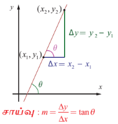
**படம். 4.1**

### விளக்க எடுத்துக்காட்டு - 2 (திரைப்பட அரங்கின் திரைகள்)

திரையரங்கத்தின் திரை 7 மீட்டர் உயரம் கொண்டது என்க. ஒருவர் அமர்ந்த நிலையில் திரையின் அடிபகுதியானது பார்வை மட்டத்திற்கு 2 மீட்டர் உயரத்தில் உள்ளது. பார்வையிலிருந்து திரையின் அடிமட்டம் வரை வரையப்படும் கிடைமட்ட கோட்டிற்கும், பார்வையிலிருந்து திரையின் முகட்டிற்கு வரையப்படும் நேர்க்கோட்டிற்கும் இடையே ஏற்படும் கோணம் பார்வைக் கோணம் என்க. படத்தில், $\theta$ என்பது பார்வைக்கோணமாகும். திரையிலிருந்து $x$ மீட்டர் தூரத்தில் ஒருவர் அமர்ந்திருப்பதாக கொள்வோம். பார்வைக் கோணம் $\theta$ -ஐக் கண்டறிய பயன்படும் சார்பு

$$\theta(x) = \tan^{-1}\left(\frac{9}{x}\right) - \tan^{-1}\left(\frac{2}{x}\right)$$

இங்கு பார்வைக் கோணம் $\theta$ என்பது $x$-ன் சார்பு என்பதை கவனிக்க.

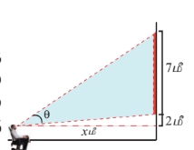
**படம். 4.2**

### விளக்க எடுத்துக்காட்டு - 3 (இழுப்புப் பாலம்)

படத்தில் காண்பது போன்ற இரட்டை மடிப் பலகு இழுப்புப் பாலம் ஒன்றினைக் கருதுவோம். ஒவ்வொரு மடிப்பலகும் 40 மீட்டர் நீளம் கொண்டது. 33 மீட்டர் அகலமுடைய கப்பல் ஒன்று பாலத்தைக் கடக்க வேண்டும். பாலத்தைக் கப்பல் கடக்க, ஒவ்வொரு மடிப்பலகும் திறப்பதற்கு ஏற்படுத்தும் மீச்சிறு கோணம் $\theta$ -ஐக் கண்டறிய நேர்மாறு முக்கோணவியல் சார்பு பயன்படுகிறது.

அலகு வட்டத்தினைப் பயன்படுத்தி, மெய்யெண்களின் முக்கோணவியல் சார்புகள் (இங்கு ஆரையனில் கோணங்கள் மதிப்பிடப்படுகின்றன) குறித்து பதினொன்றாம் வகுப்பில் படித்தோம். இப்பாடப்பகுதியில், நேர்மாறு முக்கோணவியல் சார்புகள், அதன் வரைபடங்கள் மற்றும் பண்புகளைப் பற்றி கற்றறிவோம். வழக்கம் போல் $\mathbb{R}$ மற்றும் $\mathbb{Z}$ என்பவை முறையே மெய்யெண்களின் கணத்தையும் மற்றும் முழுவெண்களின் கணத்தையும் குறிக்கின்றன.

ஆறு முக்கோணவியல் சார்புகளின் காலவட்ட ஒழுங்குடைமை (periodicity), சார்பகம் (domain) மற்றும் வீச்சகம் (range) முதலியனவற்றின் வரையறைகளை நினைவுகூர்வோம்.

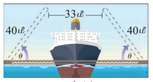
**படம். 4.3**

### கற்றலின் நோக்கங்கள்

இப்பாடப்பகுதி நிறைவுறும்போது, மாணவர்கள் அறிந்திருக்க வேண்டியவைகள்:

- நேர்மாறு முக்கோணவியல் சார்புகளின் வரையறைகள்
- நேர்மாறு முக்கோணவியல் சார்புகளின் முதன்மை மதிப்புகளை மதிப்பிடும் விதம்
- முக்கோணவியல் சார்புகள் மற்றும் அதன் நேர்மாறு சார்புகளின் வரைபடங்கள் வரையும் விதம்
- நேர்மாறு முக்கோணவியல் சார்புகளின் பண்புகளைப் பயன்படுத்துதல் மற்றும் சில கோவைகளின் மதிப்புகளைக் கண்டறிதல்

### 4.2 சில அடிப்படைக் கருத்துகள் (Some Fundamental Concepts)

#### வரையறை 4.1 (காலவட்ட ஒழுங்குடைமை)

ஒரு மெய்மதிப்புடைய சார்பு $f$ -ன் சார்பகத்தில் உள்ள அனைத்து $x$–க்கும், ஒரு மிகை எண் $p$ –ஐ, $x+p$ ஆனது $f$ -ன் சார்பகத்தில் இருக்குமாறும் $f(x+p) = f(x)$ எனவும் காண இயலுமானால், $f$ ஐ திரும்ப சார்பு அல்லது காலவட்டச் சார்பு என்போம். அவ்வாறான எண்களில் மிகச்சிறிய எண், $f$ என்ற சார்பின் காலம் (period) எனப்படும்.

எடுத்துக்காட்டாக, $\sin x, \cos x, \cosec x, \sec x$ மற்றும் $e^{ix}$ ஆகியவை காலம் $2\pi$ ஆரையன்கள் கொண்ட காலவட்டச் சார்புகளாகும். மாறாக $\tan x, \cot x$ ஆகியவை $\pi$ ஆரையன்கள் கொண்ட காலவட்டச் சார்புகளாகும்.

---

#### வரையறை 4.2 (ஒற்றை மற்றும் இரட்டைச் சார்புகள்)

ஒரு மெய்மதிப்புடைய சார்பு $f$–ன் சார்பகத்தில் உள்ள ஒவ்வொரு $x$ க்கும், $-x$ என்பதும் $f$ –ன் சார்பகத்தில் இருந்து, $f(-x) = f(x)$ என்றவாறு இருந்தால், $f$ ஐ ஓர் இரட்டைச் சார்பு (even function) என்போம்.

ஒரு மெய்மதிப்புடைய சார்பு $f$ –ன் சார்பகத்தில் உள்ள ஒவ்வொரு $x$ –க்கும், $-x$ என்பதும் $f$ –ன் சார்பகத்தில் இருந்து, $f(-x) = -f(x)$ என்றவாறு இருந்தால், $f$ ஐ ஓர் ஒற்றைச் சார்பு (odd function) என்போம்.

எடுத்துக்காட்டாக, $x, x^3, \sin x, \cosec x, \tan x$ மற்றும் $\cot x$ ஆகியவை ஒற்றைச் சார்புகளாகும். ஆனால் $x^2, \cos x$ மற்றும் $\sec x$ ஆகியவை இரட்டைச் சார்புகளாகும்.

---

#### குறிப்புரை

$g$ மற்றும் $h$ க்கு காலம் இருந்து, $f = g \pm h$ என்றவாறு இருந்தால் $f$ -ன் காலம் மி.சி.ம {காலம் $g$, காலம் $h$} என இருக்கும்.

எடுத்துக்காட்டாக, $y = \cos 6x + \sin 4x$ -ன் காலம் $\pi$ மற்றும் $y = \cos x - \sin x$ -ன் காலம் $2\pi$ ஆகும்.

---

### 4.2.1 முக்கோணவியல் சார்புகளின் சார்பகம் மற்றும் வீச்சகம் (Domain and Range of trigonometric functions)

முக்கோணவியல் சார்புகளின் சார்பகங்கள் மற்றும் வீச்சகங்கள் பின்வரும் அட்டவணையில் கொடுக்கப்பட்டுள்ளன.

| முக்கோணவியல் சார்பு | $\sin x$ | $\cos x$ | $\tan x$ | $\cosec x$ | $\sec x$ | $\cot x$ |
|---|---|---|---|---|---|---|
| **சார்பகம்** | $\mathbb{R}$ | $\mathbb{R}$ | $\mathbb{R} \setminus \left\{ (2n+1)\frac{\pi}{2}, n \in \mathbb{Z} \right\}$ | $\mathbb{R} \setminus \{ n\pi, n \in \mathbb{Z} \}$ | $\mathbb{R} \setminus \left\{ (2n+1)\frac{\pi}{2}, n \in \mathbb{Z} \right\}$ | $\mathbb{R} \setminus \{ n\pi, n \in \mathbb{Z} \}$ |
| **வீச்சகம்** | $[-1, 1]$ | $[-1, 1]$ | $\mathbb{R}$ | $\mathbb{R} \setminus (-1, 1)$ | $\mathbb{R} \setminus (-1, 1)$ | $\mathbb{R}$ |

---

### 4.2.2 சார்புகளின் வரைபடங்கள் (Graphs of functions)

$f : \mathbb{R} \rightarrow \mathbb{R}$ என்பது ஒரு மெய்மதிப்புடைய சார்பு என்க. அதன் சார்பகத்தில் உள்ள ஒரு புள்ளி $x$ –ல் சார்பு $f$-ன் மதிப்பு $f(x)$ என்க. பின்னர், $(x, f(x)), x \in \mathbb{R}$ என்ற புள்ளிகளின் தொகுப்புக் கணம், சார்பு $f$-ன் வரைபடத்தை தீர்மானிக்கிறது. பொதுவாக, $xy$ –தளத்தில் உள்ள ஒரு வரைபடம், ஒரு சார்பினைக் குறிக்கும் என கூறமுடியாது. இருந்தபோதிலும், ஒரு வரைபடம் நிலைக் குத்துக் கோட்டுச் சோதனையை (ஒரு நிலைக்குத்துக்கோடு ஒரு வரைபடத்தை வெட்டுமானால், அக்கோடு அதிகபட்சமாக ஒரேயொரு புள்ளியில் மட்டும் வெட்டும்) நிறைவு செய்தால், அவ்வரைபடம் ஒரு சார்பினைக் குறிக்கும்.

நம் அன்றாட வாழ்வில், அலைகள், இரவு/பகல் சுழற்சி போன்று நேரத்தைப் பொறுத்து காலவட்டத்தினை உள்ளடக்கிய பல்வேறு நிகழ்வுகளைக் காண்கிறோம். முக்கோணவியல் சார்புகள் அனைத்தும் திரும்பச் சார்புகள் என்பதால், இத்தகைய நிகழ்வுகளை முக்கோணவியல் சார்புகள் மூலமாக அறிந்துணரலாகும். முக்கோணவியல் சார்புகளை அவைகளின் வரைபடங்கள் வாயிலாகப் பார்த்து அறிந்து கொள்வதின் மூலம், கால வட்ட ஒழுங்குடைமையுள்ள நிகழ்வுகளின் பண்புகளை ஆராய்ந்தறியலாம்.

முக்கோணவியல் சார்புகளின் வரைபடத்தை $xy$ –தளத்தில் வரைய, சாரா மாறி $x$ ஐ ஆரையனில் உள்ள கோண அளவுகளைக் குறிக்கும். சார்ந்த மாறியை $y$ எனவும் குறிப்பிடுவோம். சைன் சார்பினை $y = \sin x$ என எழுதுகிறோம். இதைப்போலவே மற்ற முக்கோணவியல் சார்புகளையும் எழுதலாம்.

இனி வரும் பாடப்பகுதிகளில், முக்கோணவியல் சார்புகள் மற்றும் நேர்மாறு முக்கோணவியல் சார்புகளின் வரைபடங்களை எவ்வாறு வரையலாம் எனவும் மற்றும் அவற்றின் பண்புகளைப் பற்றியும் படிக்க உள்ளோம்.

### 4.2.3 வரைபடத்தின் வீச்சு மற்றும் காலம் (Amplitude and Period of a graph)

$x$-அச்சிலிருந்து ஒரு சார்பின் வரைபடத்திற்கு உள்ள மீப்பெரு தூரம் அச்சார்பின் வீச்சு (amplitude) ஆகும். இவ்வாறாக ஒரு சார்பின் வீச்சு ஆனது $x$-அச்சிலிருந்து அதன் மீப்பெரு அல்லது மீச்சிறு மதிப்பிற்கு உள்ள உயரம் ஆகும். ஒரு முழுச்சுற்றினை பூர்த்தி செய்ய சார்புக்கு தேவைப்படும் தூரம் அச்சார்பின் காலம் (period) ஆகும்.

### குறிப்புரை

(i) காலவட்டச் சார்பின் கால அளவிற்கு (period) சமமான நீளம் கொண்ட இடைவெளியில் வரையப்படும் வரைபடப்பகுதியே திரும்ப திரும்ப வரும் பல வரைபட பகுதிகளைக் கொண்டதாக அச்சார்பின் மொத்த வரைபடம் அமையும்.

(ii) ஒற்றைச் சார்பின் வரைபடம் ஆதியைப் பொறுத்து சமச்சீராகவும் மற்றும் இரட்டைச் சார்பின் வரைபடம் $y$-அச்சைப் பொறுத்து சமச்சீராகவும் இருக்கும்.

---

### 4.2.4 நேர்மாறு சார்புகள் (Inverse functions)

உள்ளீடு செய்யப்படும் ஒரு மதிப்புக்கு எப்பொழுதும் ஒரேயொரு தனித்த மதிப்பினை விடையாகத் தரும் விதிமுறையே ஒரு சார்பாகும் என்பதை நினைவு கூர்வோம். சார்பின் நேர்மாறு இருத்தலுக்கு மேற்கண்ட சார்பிற்கான தேவையைப் பூர்த்தி செய்தல் அவசியமாகிறது. இதனை நாம் ஒரு எடுத்துக்காட்டு மூலம் விளக்குவோம்.

இரட்டையர் அல்லாத அனைத்து மானிடர்களின் கணத்தினைக் கருதுவோம். அக்கணத்திலுள்ள ஒவ்வொருவரும் ஒரு இரத்த வகை மற்றும் ஒரு மரபணு (DNA) தொடர்ச்சியை பெற்றுள்ளார். மானிடரை உள்ளீடாக வும் இரத்த வகை அல்லது மரபணு தொடர்ச்சியை வெளியீடாக வும் இருப்பதால் இவை சார்புகளாகின்றன. ஒரே இரத்த வகை கொண்டுள்ள மனிதர் பலருண்டு என்பதனை நாம் அறிவோம். இருப்பினும் மரபணு தொடர்ச்சியை பொருத்தவரை ஒவ்வொரு தனி மனிதனுக்கும் மரபணு தொடர்ச்சி தனித்தனியே இருக்கும். இதனை பின்னோக்கி படிக்கும்போது இரத்த மாதிரியின் இரத்த வகை தெரிந்திருந்ததால் அதன் மூலம் அம்மாதிரி இரத்த வகை குறிப்பாக யாரிடமிருந்து பெறப்பட்டது என கூற முடியுமா? முடியாது என்பதே இதற்கு விடையாகும். மாறாக ஒரு மரபணு தொடர்ச்சியை தெரிந்திருந்ததால் கணத்திலுள்ள அதற்குரிய மனிதரைக் கண்டறிய இயலும். இவ்வாறாக மரபணு தொடர்ச்சி மூலம் மனிதரைக் கண்டறியும் பின்னோக்குதலே நேர்மாறு சார்பின் இருத்தலுக்கான அடிப்படையாகிறது.

இத்தகைய பின்னோக்கி கண்டறிதலே நேர்மாறு சார்பாகும். மரபணு தொடர்ச்சி எடுத்துக்காட்டுப் போல், சார்பானது ஒன்றுக்கொன்று சார்பாக இருந்ததால், அதற்கு நேர்மாறு சார்பு இருக்கும். தோராயமாக கூறும்போது சார்பு செய்யும் செயலை அதன் நேர்மாறு சார்பு அச்செயலை, செயலிழக்க வைக்கிறது.

ஒரு செங்கோண முக்கோணத்தின் ஒரு குறுங்கோணமும் மற்றும் ஒரு பக்க நீளமும் கொடுக்கப்பட்டிருந்ததால், பிற கோணங்களையும் மற்றும் பிற பக்க நீளங்களையும் கண்டறிவது எளிதாகும். ஆனால் ஒரு செங்கோண முக்கோணத்தின் இரு பக்கங்கள் மட்டுமே தரப்பட்டிருந்ததால், பக்கங்களின் விகிதத்தைப் பயன்படுத்தி கோணத்தைக் காண்பதற்கு ஒரு வழிமுறை தேவைப்படுகிறது. இத்தகைய தருணத்தில் தான் முக்கோணவியல் சார்பின் நேர்மாறு சார்பு எனும் கருத்தாக்கம் முக்கியத்துவம் பெறுகிறது.

எந்தவொரு முக்கோணவியல் சார்பும் அதன் முழுமை சார்பகத்தின்மீது ஒன்றுக்கொன்று சார்பு அல்ல என்பதை நாம் அறிவோம். எடுத்துக்காட்டாக, $\sin\theta = 0.5$ எனக் கொடுக்கப்பட்டிருந்தால், $\theta = \frac{\pi}{6}, \frac{5\pi}{6}, \frac{13\pi}{6}, \frac{7\pi}{6}, \frac{11\pi}{6}, \ldots$ ஆகிய எண்ணற்ற $\theta$–வின் மதிப்புகள் கொடுக்கப்பட்ட சமன்பாட்டை பூர்த்தி செய்யும். எனவே, கொடுக்கப்பட்ட $\sin\theta$–விற்கு ஏற்ப $\theta$–க்கு தனித்த மதிப்பைக் காண இயலாது. இவ்வாறு ஒரே மதிப்பிற்கு பல கோணங்களை கோர்க்கும் நிலை ஏற்படுவதை தவிர்க்க, நேர்மாறு முக்கோணவியல் சார்பினை வரையறுக்கும் முன்னரே, தக்க எல்லையை கட்டுப்பாட்டிற்கு உட்பட்டவாறு சார்பிற்கான சார்பகத்தை வரையறை செய்ய வேண்டும்.

முக்கோணவியல் சார்பின் நேர்மாறை உருவாக்கும்போது, கட்டுபடுத்தப்பட்ட இடைவெளியில் அச்சார்பு ஒன்றுக்கொன்று சார்பாக அமையும்படி போதுமானதொரு சிறிய இடைவெளியைக் கருதுவோம். ஆனால், அவ்வாறு கட்டுபடுத்தப்பட்ட இடைவெளியைச் சார்பகமாகக் கொண்ட சார்பின் வீச்சகம் அச்சார்பின் முழுமையான வீச்சகமாக இருக்கவேண்டும். இப்பாடப்பகுதியில் கட்டுப்படுத்தப்பட்ட சார்பகங்களில் வரையறுக்கப்பட்ட முக்கோணவியல் சார்புகளின் நேர்மாறு சார்புகளை வரையறை செய்வோம்.

---

### 4.2.5 நேர்மாறு சார்புகளின் வரைபடங்கள் (Graph of inverse functions)

$f$ என்பது ஒரு இருபுறச் சார்பாகவும் மற்றும் $f$ -ன் நேர்மாறு $f^{-1}$ எனவும் கருதுவோம். ஆகவே $y = f(x)$ எனில், எனில் மட்டுமே $x = f^{-1}(y)$ ஆகும். எனவே $(a, b)$ என்பது, $f$-ன் வரைபடத்தில் ஒரு புள்ளியாக அமைவதற்குத் தேவையானதும் மற்றும் போதுமானதுமான நிபந்தனை அப்புள்ளிக்கு ஒத்த புள்ளியாக $(b, a)$ எனும் புள்ளி $f^{-1}$-ன் வரைபடத்தில் அமையவேண்டும். இக்கருத்தின் வாயிலாக $f$-ன் வரைபடத்தில் உள்ள $x$ மற்றும் $y$ அச்சுகளை ஒன்றுக்கொன்று இடமாற்றம் செய்வதன்மூலம், $f^{-1}$ ன் வரைபடத்தைப் பெறலாம் என்பது புலனாகின்றது. மாறாக $y = x$ எனும் நேர்க்கோட்டின் ஊடாக $f$-ன் வரைபடத்தின் கண்ணாடி பிம்பமாக (mirror image) $f^{-1}$-ன் வரைபடம் உள்ளது எனவும் கூறலாம் அல்லது $y = x$ எனும் நேர்க்கோட்டின் ஊடாக $f$ -ன் வரைபடத்தின் பிரதிபலிப்பாக (reflection) $f^{-1}$ ன் வரைபடம் உள்ளது எனவும் கூறலாம்.

### 4.3 சைன் சார்பு மற்றும் நேர்மாறு சைன் சார்பு
### (Sine Function and Inverse Sine Function)

$\mathbb{R}$ –ஐ சார்பகமாகவும் மற்றும் $[-1, 1]$ –ஐ வீச்சகமாகவும் கொண்டதே சைன் சார்பு என்பதை நினைவு கூர்வோம். சைன் சார்பை $y = \sin x$ எனவும் மற்றும் நேர்மாறு சைன் சார்பை $y = \sin^{-1} x$ அல்லது $y = \arcsin(x)$ எனவும் குறிப்பிடுவோம். இங்கு $-1$ எனும் குறியீடு படிக்குறி அன்று. மேலும் இக்குறியீடு நேர்மாறைக் குறிக்கிறதே அன்றி தலைகீழியை அல்ல.

அனைத்து மெய்யெண்கள் $x$ –க்கும் $\sin(x + 2\pi) = \sin x$ என்பது மெய்யாகிறது. மேலும் $0 < p < 2\pi$ –இல் $\sin(x + p)$ –ன் மதிப்பு $\sin x$ –க்கு சமமாக இருக்க வேண்டிய அவசியமில்லை. எனவே, சைன் சார்பின் கால முறை $2\pi$ ஆகும்.

---

### 4.3.1 சைன் சார்பின் வரைபடம் (The graph of sine function)

சைன் சார்பின் வரைபடமானது $y = \sin x$ என்பதன் வரைபடமாகும். இங்கு $x$ ஒரு மெய்யெண்ணாகும். சைன் சார்பின் காலம் $2\pi$ என்பதால், பின்வரும் ஒவ்வொரு இடைவெளியிலும் $\ldots, [-2\pi, 0], [0, 2\pi], [2\pi, 4\pi], [4\pi, 6\pi], \ldots$ சைன் சார்பின் வரைபடம் ஒரே வடிவத்தில் அமைகின்றது. எனவே $x \in [0, 2\pi]$ - எனும் மதிப்புகளுக்கு மட்டும் வரைபடத்தை தீர்மானித்தாலே போதுமானதாகும். $x \in [0, 2\pi]$ எனில் $y = \sin x$ ன் வரைபடத்தில் உள்ள $(x, y)$ புள்ளிகளில் அறிந்த சில புள்ளிகளின் மதிப்புகளைக் காண கீழ்க்காணும் அட்டவணையை உருவாக்குவோம்.

| $x$ (ஆரையனில்) | $0$ | $\frac{\pi}{6}$ | $\frac{\pi}{4}$ | $\frac{\pi}{3}$ | $\frac{\pi}{2}$ | $\pi$ | $\frac{3\pi}{2}$ | $2\pi$ |
|---|---|---|---|---|---|---|---|---|
| $y = \sin x$ | $0$ | $\frac{1}{2}$ | $\frac{1}{\sqrt{2}}$ | $\frac{\sqrt{3}}{2}$ | $1$ | $0$ | $-1$ | $0$ |

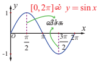
**படம். 4.4**

அட்டவணையின்படி $y = \sin x$, $0 \leq x \leq 2\pi$, இன் வரைபடம் ஆதியிலிருந்து தொடங்குகிறது என்பது தெளிவாகிறது. $0$ முதல் $\frac{\pi}{2}$ வரை மதிப்பு அதிகரிக்கும்போது, $y = \sin x$ -ன் மதிப்பும் $0$ முதல் $1$ வரை அதிகரிக்கின்றது.

$\frac{\pi}{2}$ முதல் $\pi$ வரை ன் மதிப்பு அதிகரித்து, தொடர்ந்து $\frac{3\pi}{2}$ வரையிலும் அதிகரிக்கும்போது $y$ ன் மதிப்பு $1$ முதல் $0$ வரை குறைகிறது, அதனை தொடர்ந்து $-1$ க்கு குறைகிறது. $\frac{3\pi}{2}$ முதல் $2\pi$ வரை $x$ ன் மதிப்பு அதிகரிக்கும்போது $y$ ன் மதிப்பு $-1$ முதல் $0$ வரை அதிகரிக்கிறது. அட்டவணையிலுள்ள புள்ளிகளை வரைபடத்தில் குறித்து இழைவான வளைவரை வரைக. வரைபடத்தின் ஒரு பகுதி படம்.4.4-ல் காண்பிக்கப்பட்டுள்ளது.

$y = \sin x$ என்பது $2\pi$ காலம் கொண்டது என்பதால், $y = \sin x$ -ன் முழு வளைவரையில் $[0, 2\pi]$ இடைவெளியில் அமைந்த வரைபடமே இருமருங்கும் திரும்ப திரும்ப அமைந்துள்ளது. படம். 4.5 –ல் சைன் சார்பின் முழு வரைபடம் காண்பிக்கப்பட்டுள்ளது. $0$ முதல் $2\pi$ வரையுள்ள சைன் வளைவரையின் பகுதியை ஒரு சுழற்சி என்போம். அதன் வீச்சு $1$ ஆகும்.

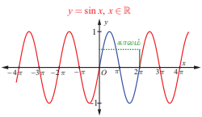
**படம். 4.5**

### குறிப்பு

$0 \leq x \leq \pi$ -ல் முதல் மற்றும் இரண்டாம் காற்பகுதியில் சைன் சார்பின் மதிப்புகளுக்கு $\sin x \geq 0$ ஆகும். $\pi < x < 2\pi$ -ல் மூன்றாம் மற்றும் நான்காம் காற்பகுதியில் சைன் மதிப்புகளுக்கு $\sin x < 0$ ஆகும்.

---

### 4.3.2 சைன் சார்பின் பண்புகள் (Properties of the sine function)

$y = \sin x$ ன் வரைபடத்திலிருந்து கீழ்க்காணும் சைன் சார்பின் பண்புகளைப் பற்றி காணலாம்.

(i) வளைவரையில் தொடர்ச்சியின்மையோ அல்லது முறிவுகளோ இல்லை. சைன் சார்பு தொடர்ச்சியானது.

(ii) வரைபடம் ஆதிபுள்ளியைப் பொறுத்து சமச்சீராக இருப்பதால் சைன் சார்பு ஒற்றைச் சார்பாகும்.

(iii) சைன் சார்பின் மீப்பெரு மதிப்பு $1$ ஐ $x = \ldots, -\frac{3\pi}{2}, \frac{\pi}{2}, \frac{5\pi}{2}, \ldots$ ஆகிய மதிப்புகளில் பெறுகிறது. மீச்சிறு மதிப்பு $-1$ ஐ $x = \ldots, -\frac{\pi}{2}, \frac{3\pi}{2}, \frac{7\pi}{2}, \ldots$ ஆகிய மதிப்புகளில் பெறுகிறது. மாறாக அனைத்து $x \in \mathbb{R}$ க்கும் $-1 \leq \sin x \leq 1$ எனக்கூறலாம்.

---

### 4.3.3 நேர்மாறு சைன் சார்பு மற்றும் அதன் பண்புகள்

#### (The inverse sine function and its properties)

சைன் சார்பானது அதன் முழு சார்பகம் $\mathbb{R}$ -ல் ஒன்றுக்கொன்றானது அல்ல. இதனை $y = b$, $-1 \leq b \leq 1$ எனும் ஒவ்வொரு கிடைமட்டக்கோடும் $y = \sin x$ -ன் வரைபடத்தினை எண்ணற்ற முறை வெட்டுவதைக் கொண்டு இதனை நாம் அறியலாம். அதாவது, ஒன்றுக்கொன்றான சார்பா என சோதிக்கும் கருவியான கிடைமட்டச் சோதனையில் சைன் சார்பு தோல்வியடைகிறது. $\left[-\frac{\pi}{2}, \frac{\pi}{2}\right]$ என சைன் சார்பின் சார்பகம் கட்டுபடுத்தப்பட்டால், அதன் வீச்சகம் $[-1, 1]$ என்பதோடு மட்டுமில்லாமல் சைன் சார்பு ஒன்றுக்கொன்று மற்றும் மேற்கோர்த்தலாகவும் இருக்கிறது. தற்போது $[-1, 1]$-ஐ சார்பகமாகவும் $\left[-\frac{\pi}{2}, \frac{\pi}{2}\right]$ –ஐ வீச்சகமாகவும் கொண்டு நேர்மாறு சைன் சார்பை வரையறை செய்யலாம்.

### வரையறை 4.3

$-1 \leq x \leq 1$ -ல், $\sin^{-1} x$ -ஐ $y \in \left[-\frac{\pi}{2}, \frac{\pi}{2}\right]$ எனும் தனித்த எண்ணை $\sin y = x$ எனுமாறு வரையறுக்கப்படுகிறது. அதாவது, $\sin^{-1} : [-1, 1] \rightarrow \left[-\frac{\pi}{2}, \frac{\pi}{2}\right]$ எனும் நேர்மாறு சைன் சார்பை, $\sin^{-1}(x) = y$ என வரையறுக்கத் தேவையானதும் மற்றும் போதுமானதுமான நிபந்தனை $\sin y = x$ மற்றும் $y \in \left[-\frac{\pi}{2}, \frac{\pi}{2}\right]$ ஆகும்.

---

### குறிப்பு

(i) $\left[-\frac{\pi}{2}, \frac{\pi}{2}\right]$ எனும் கட்டுபடுத்தப்பட்ட சார்பகத்தில் சைன் சார்பு ஒன்றுக்கொன்று ஆகும். ஆனால், பூஜ்ஜியத்தை உள்ளடக்கிய இதனை விடப் பெரிய இடைவெளியில் சைன் சார்பு ஒன்றுக்கொன்று சார்பாகாது.

(ii) $\sin^{-1} x$ –ன் வீச்சகமான $\left[-\frac{\pi}{2}, \frac{\pi}{2}\right]$ –ல் கொசைன் சார்பு குறையற்ற எண் மதிப்பைப் பெறுகிறது. இந்த முடிவு, தொகை நுண்கணிதத்தில் சில முக்கோணவியல் பிரதியிடலில் முக்கியமாகப் பயன்படுத்தப்படுகிறது.

(iii) சைன் சார்பின் நேர்மாறைப் பற்றி குறிப்பிடும்போதெல்லாம், $\sin : \left[-\frac{\pi}{2}, \frac{\pi}{2}\right] \rightarrow [-1, 1]$ மற்றும் $\sin^{-1} : [-1, 1] \rightarrow \left[-\frac{\pi}{2}, \frac{\pi}{2}\right]$ என நினைவில் கொள்ள வேண்டும்.

(iv) $\ldots, \left[-\frac{5\pi}{2}, -\frac{3\pi}{2}\right], \left[-\frac{3\pi}{2}, -\frac{\pi}{2}\right], \left[\frac{\pi}{2}, \frac{3\pi}{2}\right], \left[\frac{3\pi}{2}, \frac{5\pi}{2}\right], \ldots$ ஆகிய இடைவெளிகளில் ஏதேனும் ஒரு இடைவெளியை சைன் சார்பின் சார்பகமாகக் கட்டுப்படுத்தலாம். அவ்வாறான இடைவெளிகளிலும் சைன் சார்பு ஒன்றுக்கொன்றான சார்பாகவும் மற்றும் $[-1, 1]$ என்பது அதன் வீச்சாகவும் இருக்கும்.

(v) கட்டுப்படுத்தப்பட்ட இடைவெளி $\left[-\frac{\pi}{2}, \frac{\pi}{2}\right]$ ஆனது சைன் சார்பின் முதன்மை சார்பகம் (principal domain) எனவும், $-1 \leq x \leq 1$ -ல் $y = \sin^{-1} x$ எனும் சார்பின் மதிப்புகள் முதன்மை மதிப்புகள் (principal value) எனவும் அழைக்கப்படுகிறது.

---

$y = \sin^{-1} x$ -ன் வரையறையிலிருந்து பின்வருவனவற்றை அறிந்து கொள்ளவும்.

(i) $-1 \leq x \leq 1$ மற்றும் $-\frac{\pi}{2} \leq y \leq \frac{\pi}{2}$ என்றிருக்கும்போது, $y = \sin^{-1} x$ எனில், எனில் மட்டுமே $x = \sin y$ ஆகும்.

(ii) $|x| \leq 1$ எனில் $\sin(\sin^{-1} x) = x$ ஆகும். $|x| > 1$ எனும்போது $\sin(\sin^{-1} x)$ அர்த்தமற்றதாகிறது.

(iii) $-\frac{\pi}{2} \leq x \leq \frac{\pi}{2}$ எனில் $\sin^{-1}(\sin x) = x$ ஆகும். $\sin^{-1}(\sin 2\pi) = 0 \neq 2\pi$ என்பதனைக் கவனத்தில் கொள்க.

(iv) $\frac{\pi}{2} \leq x \leq \frac{3\pi}{2}$ எனில், $\sin^{-1}(\sin x) = \pi - x$ ஆகும். $\frac{\pi}{2} \leq x \leq \frac{3\pi}{2}$ எனும்போது $-\frac{\pi}{2} \leq \pi - x \leq \frac{\pi}{2}$ எனக் கிடைக்கும் என்பதனைக் கவனிக்கவும்.

(v) $y = \sin^{-1} x$ என்பது ஒற்றைச் சார்பாகும்.

### குறிப்புரை

$\sin x = \frac{1}{2}$ மற்றும் $x = \sin^{-1}\left(\frac{1}{2}\right)$ ஆகிய சமன்பாடுகளுக்கு இடையே உள்ள வேறுபாட்டைக் காண்போம். $\sin x = \frac{1}{2}$ எனும் சமன்பாட்டைத் தீர்க்கவேண்டும் எனில் $(-\infty, \infty)$ எனும் இடைவெளியில் $\sin x = \frac{1}{2}$ எனுமாறு உள்ள அனைத்து $x$ மதிப்புகளையும் கண்டறிய வேண்டும். ஆயினும், $x = \sin^{-1}\left(\frac{1}{2}\right)$ -ல் உள்ள $x$ மதிப்பைக் கண்டறிய $\left[-\frac{\pi}{2}, \frac{\pi}{2}\right]$ எனும் இடைவெளியில் $\sin x = \frac{1}{2}$ எனுமாறு உள்ள தனித்த மதிப்பைக் கண்டறியவேண்டும்.

---

### 4.3.4 நேர்மாறு சைன் சார்பின் வரைபடம் (Graph of the inverse sine function)

$\sin^{-1} : [-1, 1] \rightarrow \left[-\frac{\pi}{2}, \frac{\pi}{2}\right]$, எனும் நேர்மாறு சைன் சார்பு $[-1, 1]$ இடைவெளியில் $x$ எனும் மெய்யெண்ணை உள்ளீடாகக் கொண்டு $\left[-\frac{\pi}{2}, \frac{\pi}{2}\right]$ இடைவெளியில் $y$ எனும் மெய்யெண்ணை வெளியீடாகத் தருகிறது. வழக்கம்போல் $y = \sin^{-1} x$ சமன்பாட்டைப் பயன்படுத்தி $(x, y)$ எனும் சில புள்ளிகளைக் கண்டறிந்து அவற்றை $xy$ தளத்தில் குறிப்போம். $x$ –ன் மதிப்பு $-1$ லிருந்து $1$ வரை அதிகரிக்கும்போது $y$–ன் மதிப்பு $-\frac{\pi}{2}$ -லிருந்து $\frac{\pi}{2}$ வரை அதிகரிக்கின்றது. இப்புள்ளிகளை இழைவான வளைவரையால் இணைக்கும்போது $y = \sin^{-1} x$ ன் வரைபடம் கிடைக்கின்றது. அது படம். 4.6–ல் கொடுக்கப்பட்டுள்ளது.

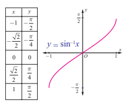
**படம். 4.6**

### குறிப்புரை

$y = \sin^{-1} x$ ன் வரைபடமானது,

(i) $\left[-\frac{\pi}{2}, \frac{\pi}{2}\right]$ இடைவெளியில் $y = \sin x$ ன் வரைபடத்தின் பகுதியை $y = x$ எனும் கோட்டின் ஊடாக பிரதிபலிக்கும் பகுதியாகவோ அல்லது $y = \sin x$ ன் வரைபடத்தில் $x$ மற்றும் $y$ அச்சுகளை இடமாற்றுவதன் மூலமாகவும் பெறலாம்.

(ii) ஆதி வழியே செல்கிறது.

(iii) ஆதியைப் பொறுத்து சமச்சீராக இருப்பதால் $y = \sin^{-1} x$ என்பது ஒற்றைச் சார்பாகிறது.

$y = \sin x, -\frac{\pi}{2} \leq x \leq \frac{\pi}{2}$ மற்றும் $y = \sin^{-1} x, -1 \leq x \leq 1$ ஆகியவைகளின் வரைபடங்கள் தனித்தனியாகவும், இரு வரைபடங்களையும் ஒருங்கிணைத்தும் புரிதலுக்காக கீழே கொடுக்கப்பட்டுள்ளது.

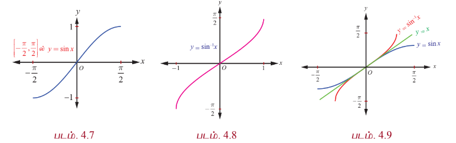

$y = \sin^{-1} x$ -ன் வரைபடமானது $y = x$ எனும் கோட்டினைப் பொறுத்து $y = \sin x, -\frac{\pi}{2} \leq x \leq \frac{\pi}{2}$ ன் வரைபடத்தின் மீதான பிம்பம் என்பதை படம் 4.9 காட்டுகிறது. மேலும் சைன் சார்பும் மற்றும் நேர்மாறு சைன் சார்பும் ஆதியைப் பொறுத்து சமச்சீராக உள்ளன என்பதையும் காட்டுகிறது.

---

### எடுத்துக்காட்டு 4.1

ஆரையன் மற்றும் பாகைகளில் $\sin^{-1}\left(-\frac{1}{2}\right)$ –ன் முதன்மை மதிப்பைக் காண்க.

### தீர்வு

$\sin^{-1}\left(-\frac{1}{2}\right) = y$ என்க. எனவே, $\sin y = -\frac{1}{2}$ ஆகும்.

$\sin^{-1} x$ -ன் முதன்மை மதிப்புகளின் வீச்சகம் $\left[-\frac{\pi}{2}, \frac{\pi}{2}\right]$ ஆகும். எனவே $\sin y = -\frac{1}{2}$ என்றவாறு $y \in \left[-\frac{\pi}{2}, \frac{\pi}{2}\right]$ ஐ கண்டறியவேண்டும். ஆகவே $y = -\frac{\pi}{6}$ எனக் கிடைக்கின்றது. எனவே $\sin^{-1}\left(-\frac{1}{2}\right)$ -ன் முதன்மை மதிப்பு $-\frac{\pi}{6}$ ஆகும். அதன் ஒத்த மதிப்பு $-30^\circ$ ஆகும்.

---

### எடுத்துக்காட்டு 4.2

$\sin^{-1}(2)$ -ன் முதன்மை மதிப்பு இருப்பின், அதனை கண்டறிக.

### தீர்வு

$y = \sin^{-1} x$ –ன் சார்பகம் $[-1, 1]$ என்பதாலும் $2 \notin [-1, 1]$ என்பதாலும் $\sin^{-1}(2)$ -க்கு முதன்மை மதிப்பு இல்லை.

---

### எடுத்துக்காட்டு 4.3

முதன்மை மதிப்பைக் காண்க.

(i) $\sin^{-1}\left(\frac{1}{\sqrt{2}}\right)$ (ii) $\sin^{-1}\left(\sin\left(-\frac{\pi}{3}\right)\right)$ (iii) $\sin^{-1}\left(\sin\left(\frac{5\pi}{6}\right)\right)$.

### தீர்வு

$\sin^{-1} : [-1, 1] \rightarrow \left[-\frac{\pi}{2}, \frac{\pi}{2}\right]$ என்பது $\sin^{-1} x = y$ என கொடுக்கப்படத் தேவையானதும் மற்றும் போதுமானதுமான நிபந்தனை $x = \sin y$ ஆகும். இங்கு $-1 \leq x \leq 1$ மற்றும் $-\frac{\pi}{2} \leq y \leq \frac{\pi}{2}$. எனவே,

(i) $\frac{\pi}{4} \in \left[-\frac{\pi}{2}, \frac{\pi}{2}\right]$, மற்றும் $\sin\frac{\pi}{4} = \frac{1}{\sqrt{2}}$ என்பதால் $\sin^{-1}\left(\frac{1}{\sqrt{2}}\right) = \frac{\pi}{4}$.

(ii) $-\frac{\pi}{3} \in \left[-\frac{\pi}{2}, \frac{\pi}{2}\right]$ என்பதால் $\sin^{-1}\left(\sin\left(-\frac{\pi}{3}\right)\right) = -\frac{\pi}{3}$ ஆகும்.

(iii) $\frac{5\pi}{6} \notin \left[-\frac{\pi}{2}, \frac{\pi}{2}\right]$ என்பதால் $\sin^{-1}\left(\sin\frac{5\pi}{6}\right) = \sin^{-1}\left(\sin\left(\pi - \frac{5\pi}{6}\right)\right) = \sin^{-1}\left(\sin\frac{\pi}{6}\right) = \frac{\pi}{6}$.

---

### எடுத்துக்காட்டு 4.4

$\sin^{-1}(2 - 3x^2)$ –ன் சார்பகத்தைக் காண்க.

### தீர்வு

$\sin^{-1} x$ -ன் சார்பகம் $[-1, 1]$ ஆகும்.

எனவே $-1 \leq 2 - 3x^2 \leq 1$. ஆகையால் $-3 \leq -3x^2 \leq -1$.

$-3 \leq -3x^2$, எனும்போது $x^2 \leq 1$ (1)

$-3x^2 \leq -1$, எனும்போது $x^2 \geq \frac{1}{3}$ (2)

சமன்பாடுகள் (1) மற்றும் (2), ஆகியவற்றிலிருந்து $\frac{1}{3} \leq x^2 \leq 1$ எனக் கிடைக்கிறது.

எனவே, $\frac{1}{\sqrt{3}} \leq |x| \leq 1$.

$a \leq |x| \leq b$ என்பதிலிருந்து $x \in [-b, -a] \cup [a, b]$ என கிடைக்கும் என்பதால்,

எனவே, $x \in \left[-1, -\frac{1}{\sqrt{3}}\right] \cup \left[\frac{1}{\sqrt{3}}, 1\right]$.

---

### பயிற்சி 4.1

1. $x$ -ன் அனைத்து மதிப்புகளையும் காண்க

   (i) $-10\pi \leq x \leq 10\pi$ மற்றும் $\sin x = 0$  
   (ii) $-3\pi \leq x \leq 3\pi$ மற்றும் $\sin x = -1$.

2. பின்வருவனவற்றின் காலம் மற்றும் வீச்சு காண்க.

   (i) $y = \sin 7x$  
   (ii) $y = \sin\left(\frac{x}{3}\right)$  
   (iii) $y = -4\sin(2x - \pi)$.

3. $0 \leq x < 6\pi$ எனும்போது $y = \sin\left(\frac{x}{3}\right)$ ன் வரைபடம் வரைக.

4. மதிப்பு காண்க (i) $\sin^{-1}\left(\sin\frac{2\pi}{3}\right)$ (ii) $\sin^{-1}\left(\sin\frac{5\pi}{4}\right)$.

5. $x$ –ன் எந்த மதிப்பிற்கு $\sin x = \sin^{-1} x$ ஆகும்?

6. பின்வருவனவற்றிற்கு சார்பகம் காண்க

   (i) $f(x) = \sin^{-1}\left(\frac{2x + 1}{2}\right)$  
   (ii) $g(x) = \sin^{-1}\left(4x^2 - 2\right) - \frac{\pi}{4}$.

7. மதிப்பு காண்க $\sin^{-1}\left(\sin\frac{5\pi}{9}\right) + \sin^{-1}\left(\sin\frac{5\pi}{9}\right)$.

### 4.4 கொசைன் சார்பு மற்றும் நேர்மாறு கொசைன் சார்பு
### (The Cosine Function and Inverse Cosine Function)

$\mathbb{R}$ –ஐ சார்பகமாகவும் மற்றும் $[-1, 1]$ –ஐ வீச்சகமாகவும் கொண்ட சார்பே கொசைன் சார்பு ஆகும். கொசைன் சார்பை $y = \cos x$ எனவும் மற்றும் நேர்மாறு கொசைன் சார்பினை $y = \cos^{-1} x$ அல்லது $y = \arccos(x)$ எனவும் குறிப்பிடப்படுகின்றன. அனைத்து மெய்யெண்கள் $x$–க்கு $\cos(x + 2\pi) = \cos x$ என்பது மெய்யாகும். மேலும், $0 < p < 2\pi$, $x \in \mathbb{R}$ –க்கு $\cos(x + p)$ மற்றும் $\cos x$ ஆகியன சமமாக இருக்கவேண்டிய அவசியமில்லை. எனவே $y = \cos x$ -ன் காலம் $2\pi$ ஆகும்.

---

### 4.4.1 கொசைன் சார்பின் வரைபடம் (Graph of cosine function)

கொசைன் சார்பின் வரைபடமானது $y = \cos x$ –ன் வரைபடமாகும். இங்கு $x$ ஒரு மெய் எண்ணாகும். கொசைன் சார்பின் காலமுறை $2\pi$ என்பதால் $\ldots, [-4\pi, -2\pi], [-2\pi, 0], [0, 2\pi], [2\pi, 4\pi], [4\pi, 6\pi], \ldots$ ஆகிய இடைவெளிகளில் ஒவ்வொரு இடைவெளியிலும் கொசைன் சார்பின் வரைபடம் ஒரே வடிவத்தினை திரும்பவும் பெறுகின்றது. எனவே $x \in [0, 2\pi]$–க்கு உரிய கொசைன் சார்பு வரைபடத்தின் பகுதியைத் தீர்மானித்தாலே போதுமானது. $x \in [0, 2\pi]$ எனில் $y = \cos x$ ன் வரைபடத்தில் உள்ள $(x, y)$ புள்ளிகளில் அறிந்த சில புள்ளிகளை குறிப்பதற்கு கீழ்க்காணும் அட்டவணையை உருவாக்குவோம்.

| $x$ (ஆரையனில்) | $0$ | $\frac{\pi}{6}$ | $\frac{\pi}{4}$ | $\frac{\pi}{3}$ | $\frac{\pi}{2}$ | $\pi$ | $\frac{3\pi}{2}$ | $2\pi$ |
|---|---|---|---|---|---|---|---|---|
| $y = \cos x$ | $1$ | $\frac{\sqrt{3}}{2}$ | $\frac{1}{\sqrt{2}}$ | $\frac{1}{2}$ | $0$ | $-1$ | $0$ | $1$ |

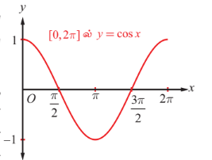
**படம். 4.10**

$y = \cos x$, $0 \leq x \leq 2\pi$, ன் வரைபடம் $(0, 1)$ புள்ளியிலிருந்து தொடங்குகிறது என்பதை அட்டவனையிலிருந்து அறியலாம். $x$ ன் மதிப்பு $0$ முதல் $\pi$ வரை அதிகரிக்கும்போது, $y = \cos x$ -ன் மதிப்பும் $1$ முதல் $-1$ வரை குறைகின்றது. $x$ ன் மதிப்பு $\pi$ முதல் $2\pi$ வரை அதிகரிக்கும்போது, $y$ -ன் மதிப்பும் $-1$ முதல் $1$ வரை அதிகரிக்கின்றது. அட்டவணையிலுள்ள புள்ளிகளை வரைபடத்தில் குறித்து அவற்றை இணைக்கும் இழைவான வளைவரையை வரைக. $y = \cos x$ -ன் வரைபடத்தின் ஒரு பகுதியினை படம். 4.10-ல் காண்பிக்கப்பட்டுள்ளது.

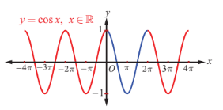
**படம். 4.11**

$[0, 2\pi]$ இடைவெளியின் இருபுறமும் மேலே உள்ள வரைபடப் பகுதியை திரும்ப திரும்ப கொண்டிருக்கும் வகையில் $y = \cos x$ -ன் முழுவரைபடம் அமைந்திருக்கும். படம்.4.11–ல் கொசைன் சார்பின் முழு வரைபடம் கொடுக்கப்பட்டுள்ளது.

கொசைன் சார்பின் வரைபடத்திலிருந்து $\cos x$-ன் மதிப்பு முதல் காற்பகுதியில் $0 \leq x \leq \frac{\pi}{2}$ மிகையெண்ணாகவும், இரண்டாவது காற்பகுதியில் $\frac{\pi}{2} < x \leq \pi$ மற்றும் மூன்றாவது காற்பகுதியில் $\pi < x < \frac{3\pi}{2}$ ஆகியவற்றில் குறையெண்ணாகவும், மீண்டும் நான்காவது காற்பகுதியில் $\frac{3\pi}{2} < x < 2\pi$ மிகையெண்ணாகவும் உள்ளது என்பதை காண்கிறோம்.

### குறிப்பு

வரைபடத்திலிருந்து, அனைத்து $x$ மதிப்புகளுக்கும் $\cos(-x) = \cos x$ என அறியலாம். இது $y = \cos x$ ஒரு இரட்டைச் சார்பு என்பதை உறுதி செய்கிறது.

---

### 4.4.2 கொசைன் சார்பின் பண்புகள் (Properties of the cosine function)

$y = \cos x$ ன் வரைபடத்திலிருந்து கொசைன் சார்பின் பின்வரும் பண்புகளைக் காணலாம்.

(i) வளைவரையில் எங்கும் முறிவோ அல்லது தொடர்ச்சியின்மையோ இல்லை. கொசைன் சார்பு தொடர்ச்சியானது.

(ii) $y$ அச்சைப் பொறுத்து வரைபடம் சமச்சீராக இருப்பதால் கொசைன் சார்பு இரட்டைச் சார்பாகும்.

(iii) $x = \ldots, -2\pi, 0, 2\pi, \ldots$ ஆகிய மதிப்புகளில் கொசைன் சார்பு மீப்பெரு மதிப்பு $1$ ஐ அடைகிறது. $x = \ldots, -\pi, \pi, 3\pi, \ldots$ ஆகிய மதிப்புகளுக்கு கொசைன் சார்பு மீச்சிறு மதிப்பு $-1$ ஐ அடைகிறது. அதாவது, $-1 \leq \cos x \leq 1$, $x \in \mathbb{R}$ ஆகும்.

---

### குறிப்புரை

(i) $y = \cos x$ ன் வரைபடத்தை $\frac{\pi}{2}$ ஆரையன்கள் அளவிற்கு வலப்புறம் நகர்த்த, $y = \cos\left(x - \frac{\pi}{2}\right)$ -ன் வரைபடமாகப் பெறலாம். இந்த வரைபடம் $y = \sin x$ -ன் வரைபடத்துக்கு ஒப்பாக அமைகிறது. இங்கு $\cos\left(\frac{\pi}{2} - x\right) = \sin x$ என்பதை கவனிக்கவும்.

(ii) $y = A\sin\alpha x$ மற்றும் $y = B\cos\beta x$ ஆகியன முறையே $-A \leq A\sin\alpha x \leq A$ மற்றும் $-B \leq B\cos\beta x \leq B$ எனும் அசமன்பாடுகளைப் பூர்த்தி செய்கிறது. $y = A\sin\alpha x$ –ன் வீச்சு மற்றும் காலம் முறையே $A$ மற்றும் $\frac{2\pi}{\alpha}$ ஆகும். $y = B\cos\beta x$ –ன் வீச்சு மற்றும் காலம் முறையே $B$ மற்றும் $\frac{2\pi}{\beta}$ ஆகும். $y = A\sin\alpha x$ மற்றும் $y = B\cos\beta x$ ஆகியன சைன் வளைகோட்டுச் (Sinusoidal) சார்புகளாகும்.

(iii) $\left[0, \frac{2\pi}{\alpha}\right]$ மற்றும் $\left[0, \frac{2\pi}{\beta}\right]$ -ன் மீதான முறையே $y = A\sin\alpha x$ மற்றும் $y = B\cos\beta x$ ஆகியவற்றின் பகுதி வரைபடங்களை நீட்டிக்க $y = A\sin\alpha x$ மற்றும் $y = B\cos\beta x$ ஆகியவற்றின் முழு வரைப்படங்கள் பெறப்படுகின்றது.

---

### பயன்பாடுகள்

காலச் சுழற்சியில் நிகழும் நிகழ்வுகளான, பருவ வெப்பநிலை, கடல் அலைகள் போன்ற இயற்கை நிகழ்வுகள் திரும்ப திரும்ப நேர்வதால், சைன் வளைகோட்டைப் பயன்படுத்தி மாதிரிகள் வடிவமைக்கப்படுகின்றன. எடுத்துக்காட்டாக, சைன் வளைகோட்டுச் சார்பு $y = d + a\cos(b(t - c))$ -ஐ பயன்படுத்தி கடல் அலைகளை மாதிரியாக உருவாக்க கீழ்க்காணும் படிகள் தரப்படுகின்றன.

(i) சைன் வளைகோட்டு வரைபடத்தின் வீச்சு என்பது, வரைபடத்தில் $y$ - ன் மீப்பெரு மற்றும் மீச்சிறு மதிப்புகளின் வேறுபாட்டின் எண் மதிப்பில் பாதியாகும். அதாவது, வீச்சு, $a = \frac{1}{2}(\text{மீப்பெரு மதிப்பு} - \text{மீச்சிறு மதிப்பு})$;

மையக்கோடு $y = d$, இங்கு $d = \frac{1}{2}(\text{மீப்பெரு மதிப்பு} + \text{மீச்சிறு மதிப்பு})$.

(ii) காலம் $p = 2 \times$ (மீப்பெரு மதிப்பிலிருந்து மீச்சிறு மதிப்பிற்கு இடையேயுள்ள கால அளவு);
$b = \frac{2\pi}{p}$

(iii) $c = b \times$ (மீப்பெரு மதிப்பை அடையும் நேரம்).

### மாதிரி-1

ஒரு கப்பல்துறையின் எல்லையில் கடல் அலைகளினால் ஆழம் மாறுபடுகின்றது. கீழ்க்காணும் அட்டவணையில் வெவ்வேறு நேரங்களில் நீரின் ஆழம் (மீட்டரில்) கொடுக்கப்பட்டுள்ளது.

| நேரம், $t$ | 12 முற்பகல் | 2 முற்பகல் | 4 முற்பகல் | 6 முற்பகல் | 8 முற்பகல் | 10 முற்பகல் | 12 முற்பகல் |
|---|---|---|---|---|---|---|---|
| ஆழம் | 3.5 | 4.2 | 3.5 | 2.1 | 1.4 | 2.1 | 3.5 |

$t$ நேரத்தில் நீரின் ஆழத்தைக் காண $y = d + a\cos(bt - c)$ எனும் வடிவில் ஒரு சைன் வளைகோட்டுச் சார்பினை கருதுவோம். இங்கு, $a = 1.4$, $d = 2.8$, $p = 12$, $b = \frac{\pi}{6}$, $c = \frac{\pi}{3}$.

தேவைப்படும் சைன் வளைகோட்டுச் சார்பு $y = 2.8 + 1.4\cos\left(\frac{\pi}{6}t - \frac{\pi}{3}\right)$ என ஆகும்.

### குறிப்பு

சைன் மற்றும் கொசைன் சார்புகளின் உருமாற்றங்கள் எண்ணற்ற பயன்பாடுகளுக்குப் பயன்படுகின்றன. சைன் அல்லது கொசைன் சார்பினைப் பயன்படுத்தி ஒரு வட்ட இயக்க மாதிரி ஒன்றை உருவாக்க முடியும்.

### மாதிரி-2

ஆதியை மையமாகவும் ஆரம் 4 ம் உள்ள ஒரு வட்டப்பாதையில் ஒரு புள்ளி நகர்கிறது. சுழலும் கோண சுழற்சியை சார்பாகக் கொண்டு அப்புள்ளியின் $y$-ஆயக்கூறை காணலாம்.

ஆதியை மையமாகக் கொண்டும் ஆரம் 4 ம் உள்ள ஒரு வட்டத்தின் மீதுள்ள புள்ளியின் $y$-ஆயக்கூறு, $y = a\sin\theta$ ஆகும், இங்கு $\theta$ என்பது சுழலும் கோண சுழற்சி. இங்கு $y(\theta) = 4\sin\theta$ எனும் சமன்பாடு கிடைக்கிறது. (இங்கு $\theta$ ஆரையன், வீச்சு 4 மற்றும் காலம் $2\pi$ ஆகும்) வீச்சு 4 என்பதால் சைன் சார்பின் $y$ மதிப்புகள் 4 காரணியாக செங்குத்தாக நீளத்தை நீள்கிறது.

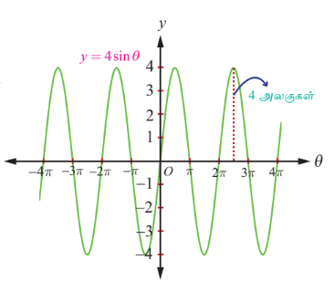
**படம். 4.12**

### 4.4.3 நேர்மாறு கொசைன் சார்பு மற்றும் அதன் பண்புகள்
### (The inverse cosine function and its properties)

கொசைன் சார்பு அதன் முழு சார்பகம் $\mathbb{R}$ -ல் ஒன்றுக்கொன்று அல்ல. எனினும் கட்டுபடுத்தப்பட்ட சார்பகம் $[0, \pi]$ மீது கொசைன் சார்பு ஒன்றுக்கொன்று சார்பாகும் மற்றும் அதன் வீச்சகம் $[-1, 1]$ ஆகும். தற்போது $[-1, 1]$-ஐ சார்பகமாகவும் மற்றும் $[0, \pi]$ –ஐ வீச்சகமாகவும் கொண்டு நேர்மாறு கொசைன் சார்பை வரையறை செய்யலாம்.

### வரையறை 4.4

$-1 \leq x \leq 1$ -ல், $\cos^{-1} x$ ஆனது $[0, \pi]$ -ல் தனித்த $y$ –ஆக $\cos y = x$ எனுமாறு வரையறுக்கப்படுகிறது.

அதாவது $\cos^{-1} : [-1, 1] \rightarrow [0, \pi]$ எனும் நேர்மாறு கொசைன் சார்பு, $\cos^{-1} x = y$ என வரையறுக்கத் தேவையானதும் மற்றும் போதுமானதுமான நிபந்தனை $\cos y = x$ மற்றும் $y \in [0, \pi]$ ஆகும்.

### குறிப்பு

(i) $\cos^{-1} x$ -ன் வீச்சகமான $[0, \pi]$ எனும் இடைவெளியில் சைன் சார்பு குறையற்ற எண் மதிப்பைக் கொண்டுள்ளது. இந்த முடிவு, தொகை நுண்கணிதத்தில் சில முக்கோணவியல் பிரதியிடலுக்கு முக்கியமாகப் பயன்படுத்தப்படுகிறது.

(ii) நேர்மாறு கொசைன் சார்பைப் பற்றிக் குறிப்பிடும்போதெல்லாம் $\cos : [0, \pi] \rightarrow [-1, 1]$ மற்றும் $\cos^{-1} : [-1, 1] \rightarrow [0, \pi]$ என நினைவில் கொள்ள வேண்டும்.

(iii) $\ldots, [-2\pi, -\pi], [0, \pi], [\pi, 2\pi], \ldots$ ஆகிய இடைவெளிகளில் ஏதேனும் ஒரு இடைவெளியை கொசைன் சார்பின் சார்பகமாக கட்டுப்படுத்தலாம். அவ்வாறாக இடைவெளிகளிலும் கொசைன் சார்பு ஒன்றுக்கொன்றான சார்பாகவும் மற்றும் $[-1, 1]$ என்பது அதன் வீச்சாகவும் இருக்கும். கட்டுப்படுத்தப்பட்ட இடைவெளி $[0, \pi]$ ஆனது கொசைன் சார்பின் முதன்மை சார்பகம் எனவும், $-1 \leq x \leq 1$ -ல் சார்பு $y = \cos^{-1} x$ எனும் சார்பின் மதிப்புகள் முதன்மை மதிப்புகள் எனவும் அழைக்கப்படுகிறது.

$y = \cos^{-1} x$ எனும் வரையறையிலிருந்து பின்வரும் கருத்துகளைக் கவனிக்கவும்.

(i) $-1 \leq x \leq 1$ மற்றும் $0 \leq y \leq \pi$ என்றிருக்கும்போது $y = \cos^{-1} x$ எனில், எனில் மட்டுமே $x = \cos y$ ஆகும்.

(ii) $|x| \leq 1$ எனில் $\cos(\cos^{-1} x) = x$ ஆகும். $|x| > 1$ எனும்போது $\cos(\cos^{-1} x)$ என்பது அர்த்தமற்றதாகிறது.

(iii) $\cos^{-1} x$ -ன் வீச்சகமான $0 \leq x \leq \pi$ ல் $\cos^{-1}(\cos x) = x$ என ஆகும். $\cos^{-1}(\cos 3\pi) = \pi$ என்பதனை கவனிக்கவும்.

---

### 4.4.4 நேர்மாறு கொசைன் சார்பின் வரைபடம் (Graph of the inverse cosine function)

$\cos^{-1} : [-1, 1] \rightarrow [0, \pi]$ எனும் நேர்மாறு கொசைன் சார்பு $[-1, 1]$ இடைவெளியில் $x$ எனும் மெய்யெண்ணை உள்ளீடாகக் கொண்டு $[0, \pi]$ இடைவெளியில் $y$ (ஆரையன்களில்) எனும் மெய்யெண்ணை வெளியீடாக தருகிறது. $y = \cos^{-1} x$ சமன்பாட்டைப் பயன்படுத்தி $(x, y)$ எனும் சில புள்ளிகளைக் கண்டறிந்து $xy$ தளத்தில் குறிப்போம். $x$–ன் மதிப்பு $-1$ லிருந்து $1$ வரை அதிகரிக்கும்போது $y$–ன் மதிப்பு $\pi$ லிருந்து $0$ வரை குறைகின்றது. நேர்மாறு கொசைன் சார்பு அதன் சார்பகத்தில் குறையும் சார்பாகவும் மற்றும் தொடர்ச்சியானதாகவும் இருக்கிறது. இப்புள்ளிகளை இழைவான வளைவரையால் இணைக்கும்போது படம் 4.14–ல் காண்பதைப் போன்று $y = \cos^{-1} x$ எனும் வரைபடம் நமக்கு கிடைக்கின்றது.

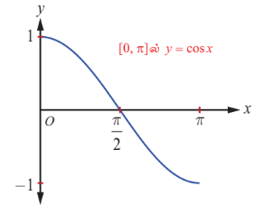
**படம். 4.13**

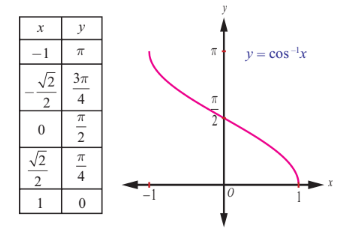
**படம். 4.14**

### குறிப்பு

(i) $y = \cos^{-1} x$ ன் வரைபடமானது, $y = \cos x$ ன் வரைபடத்தின் $x$ மற்றும் $y$ அச்சுகளை இடமாற்றுவதன் மூலமாகவும் பெறலாம்.

(ii) $y = \cos^{-1} x$ எனும் சார்பின் $x$ -வெட்டுத்துண்டு $1$ மற்றும் $y$ -வெட்டுத்துண்டு $\frac{\pi}{2}$ ஆகும்.

(iii) ஆதியைப் பொறுத்தோ அல்லது $y$ -அச்சைப் பொறுத்தோ $y = \cos^{-1} x$ -ன் வரைபடம் சமச்சீர் அல்ல. எனவே சார்பு $y = \cos^{-1} x$ இரட்டைச் சார்போ அல்லது ஒற்றைச் சார்போ அல்ல.

### எடுத்துக்காட்டு 4.5

$\cos^{-1}\left(\frac{\sqrt{3}}{2}\right)$ -ன் முதன்மை மதிப்பைக் காண்க.

### தீர்வு

$\cos^{-1}\left(\frac{\sqrt{3}}{2}\right) = y$ என்க. எனவே, $\cos y = \frac{\sqrt{3}}{2}$ ஆகும்.

$y = \cos^{-1} x$ -ன் முதன்மை மதிப்பு வீச்சகம் $[0, \pi]$ என நாம் அறிவோம். எனவே, $\cos y = \frac{\sqrt{3}}{2}$ எனும்படி $y$ மதிப்பு $[0, \pi]$ -ல் காண வேண்டும். ஆனால், $\cos\frac{\pi}{6} = \frac{\sqrt{3}}{2}$ மற்றும் $\frac{\pi}{6} \in [0, \pi]$ என்பதால் $y = \frac{\pi}{6}$ ஆகும். எனவே, $\cos^{-1}\left(\frac{\sqrt{3}}{2}\right)$ -ன் முதன்மை மதிப்பு $\frac{\pi}{6}$ ஆகும்.

---

### எடுத்துக்காட்டு 4.6

மதிப்பு காண்க

(i) $\cos^{-1}\left(-\frac{1}{2}\right)$  
(ii) $\cos^{-1}\left(\cos\left(-\frac{\pi}{3}\right)\right)$  
(iii) $\cos^{-1}\left(\cos\frac{7\pi}{6}\right)$

### தீர்வு

$\cos^{-1} : [-1, 1] \rightarrow [0, \pi]$ எனும் நேர்மாறு கொசைன் சார்பு வரையறையின்படி, $\cos^{-1} x = y$ எனில், எனில் மட்டுமே $\cos y = x$. இங்கு $-1 \leq x \leq 1$ மற்றும் $0 \leq y \leq \pi$ ஆகையால்,

(i) $\cos^{-1}\left(-\frac{1}{2}\right) = \frac{3\pi}{4}$, ஏனெனில் $\frac{3\pi}{4} \in [0, \pi]$ மற்றும் $\cos\frac{3\pi}{4} = -\cos\frac{\pi}{4} = -\frac{1}{\sqrt{2}}$.

(ii) $\cos^{-1}\left(\cos\left(-\frac{\pi}{3}\right)\right) = \cos^{-1}\left(\cos\frac{\pi}{3}\right) = \frac{\pi}{3}$, ஏனெனில் $-\frac{\pi}{3} \notin [0, \pi]$, ஆனால் $\frac{\pi}{3} \in [0, \pi]$.

(iii) $\cos^{-1}\left(\cos\frac{7\pi}{6}\right) = \frac{5\pi}{6}$, ஏனெனில் $\cos\frac{7\pi}{6} = \cos\left(\pi + \frac{\pi}{6}\right) = -\cos\frac{\pi}{6} = -\frac{\sqrt{3}}{2}$ மற்றும் $\cos\frac{5\pi}{6} = -\cos\frac{\pi}{6} = -\frac{\sqrt{3}}{2}$; $\frac{5\pi}{6} \in [0, \pi]$.

---

### எடுத்துக்காட்டு 4.7

$\cos^{-1}\left(\frac{2 + \sin x}{3}\right)$ -ன் சார்பகம் காண்க.

### தீர்வு

$y = \cos^{-1} x$ -ன் சார்பகம் $-1 \leq x \leq 1$ அதாவது $|x| \leq 1$ ஆகும்.

எனவே, $-1 \leq \frac{2 + \sin x}{3} \leq 1$ என்பதை $-3 \leq 2 + \sin x \leq 3$ எனலாம்.

எனவே, $-5 \leq \sin x \leq 1$ என்பதை சுருக்கி, $-1 \leq \sin x \leq 1$ எனப் பெறலாம்,

$-\sin^{-1}(1) \leq x \leq \sin^{-1}(1)$ அல்லது $-\frac{\pi}{2} \leq x \leq \frac{\pi}{2}$ எனப் பெறலாம்.

ஆகையால் $\cos^{-1}\left(\frac{2 + \sin x}{3}\right)$ -ன் சார்பகம் $\left[-\frac{\pi}{2}, \frac{\pi}{2}\right]$ ஆகும்.

### பயிற்சி 4.2

1. அனைத்து $x$ -ன் மதிப்புகளையும் காண்க

   (i) $-6\pi \leq x \leq 6\pi$ மற்றும் $\cos x = 0$  
   (ii) $-5\pi \leq x \leq 5\pi$ மற்றும் $\cos x = -1$.

2. $\cos^{-1}\left(\cos\left(-\frac{\pi}{6}\right)\right) \neq -\frac{\pi}{6}$ என இருப்பதற்கான காரணத்தைக் கூறுக.

3. $\cos^{-1}(\cos x) = -\cos^{-1}(x)$ என்பது மெய்யாகுமா? விடைக்கு தக்க காரணம் கூறுக.

4. $\cos^{-1}\left(\frac{1}{2}\right)$ -ன் முதன்மை மதிப்புக் காண்க.

5. மதிப்பு காண்க

   (i) $2\sin^{-1}\left(\frac{1}{2}\right) + \cos^{-1}\left(\frac{1}{2}\right)$  
   (ii) $\sin^{-1}\left(\frac{1}{2}\right) + \cos^{-1}(-1)$  
   (iii) $\cos^{-1}\left(\cos\frac{7\pi}{17}\right) + \sin^{-1}\left(\sin\frac{7\pi}{17}\right)$.

6. சார்பகம் காண்க

   (i) $f(x) = \sin^{-1}\left(\frac{x - 2}{3}\right) + \cos^{-1}\left(\frac{x - 1}{4}\right)$  
   (ii) $g(x) = \sin^{-1} x + \cos^{-1} x$.

7. $x$ -ன் எந்த மதிப்பிற்கு, சமனிலை

   $\frac{\pi}{2} < \cos^{-1}(3x - 1) < \pi$

   மெய்யாகும்?

8. மதிப்பு காண்க

   (i) $\cos^{-1}\left(\frac{4}{5}\right) + \sin^{-1}\left(\frac{4}{5}\right)$  
   (ii) $\cos^{-1}\left(\cos\left(\frac{4\pi}{3}\right)\right)$.

### 4.5 தொடுகோட்டுச் சார்பு மற்றும் நேர்மாறு தொடுகோட்டுச் சார்பு
### (The Tangent Function and the Inverse Tangent Function)

கட்டிடம், மலை அல்லது கொடிகம்பம் போன்றவற்றின் உயரம் அல்லது தூரத்தை கண்டறிவதற்கு $y = \tan x$ எனும் தொடுகோட்டுச் சார்பை பயன்படுத்துகிறோம். $y = \tan x = \frac{\sin x}{\cos x}$ -ன் சார்பகத்தில் பகுதியை பூஜ்ஜியமாக்கும் $x$-ன் மதிப்புகள் நீக்கப்படுகிறது. எனவே $x = \ldots, -\frac{3\pi}{2}, -\frac{\pi}{2}, \frac{\pi}{2}, \frac{3\pi}{2}, \ldots$ ஆகிய மதிப்புகளுக்கு தொடுகோட்டுச் சார்பு வரையறுக்கப்படவில்லை. ஆகையால் $y = \tan x$ -ன் சார்பகமானது $\left\{ x : x \neq (2k+1)\frac{\pi}{2}, k \in \mathbb{Z} \right\} = \bigcup_{k=-\infty}^{\infty} \left( (2k+1)\frac{\pi}{2}, (2k+3)\frac{\pi}{2} \right)$ ஆகும். அதன் வீச்சகம் $(-\infty, \infty)$ ஆகும். $y = \tan x$ எனும் தொடுகோட்டுச் சார்பின் காலம் $\pi$ ஆகும்.

---

### 4.5.1 தொடுகோட்டுச் சார்பின் வரைபடம் (The graph of tangent function)

மீள்நிகழ் காலமுறையுள்ள இடைவெளிகளில் சார்பின் மதிப்பை காண்பதற்கு தொடுகோட்டுச் சார்பு பயனுள்ளதாக இருக்கும். தொடுகோட்டுச் சார்பு ஒற்றைச் சார்பாகும். ஆகையால் $y = \tan x$ -ன் வளைவரை ஆதியைப் பொறுத்து சமச்சீராக இருக்கும். தொடுகோட்டுச் சார்பின் காலம் $\pi$ என்பதால் $\pi$ நீளமுள்ள ஏதேனும் ஒரு இடைவெளியில் $y = \tan x$ ன் வரைபடத்தை வரையலாம். $\left(-\frac{\pi}{2}, \frac{\pi}{2}\right)$ எனும் இடைவெளியைக் கருதுக. $x \in \left(-\frac{\pi}{2}, \frac{\pi}{2}\right)$ எனும்படி $y = \tan x$ ன் வளைவரை வரைய கீழ்க்காணும் அட்டவணையை அமைப்போம்.

| $x$ (ஆரையனில்) | $-\frac{\pi}{3}$ | $-\frac{\pi}{4}$ | $-\frac{\pi}{6}$ | $0$ | $\frac{\pi}{6}$ | $\frac{\pi}{4}$ | $\frac{\pi}{3}$ |
|---|---|---|---|---|---|---|---|
| $y = \tan x$ | $-\sqrt{3}$ | $-1$ | $-\frac{1}{\sqrt{3}}$ | $0$ | $\frac{1}{\sqrt{3}}$ | $1$ | $\sqrt{3}$ |

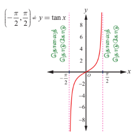
**படம். 4.15**

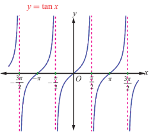
**படம். 4.16**

இப்போது அட்டவணையிலுள்ள புள்ளிகளை வரைபடத்தில் குறித்து, அவைகளை இழைவான வளைவரையில் இணைத்து $y = \tan x$, $-\frac{\pi}{2} < x < \frac{\pi}{2}$, ன் வரைபடத்தை வரையலாம். $x$, $\frac{\pi}{2}$ மதிப்பை நெருங்கும்போது அதே சமயம் $\frac{\pi}{2}$ -ஐ விட குறைவான மதிப்பைப் பெறும்போது $\sin x$ மதிப்பு $1$ -ஐ நெருங்கும் மற்றும் $\cos x$ மிகை எண் மதிப்பாகவும் $0$-ஐ நெருங்கியும் இருக்கும். ஆதலால் $x$, $\frac{\pi}{2}$ -ஐ நெருங்கும்போது $\frac{\sin x}{\cos x}$ எனும் விகிதம் மிகையெண் மதிப்பாகவும் மற்றும் அதன் மதிப்பு அதிகரித்தும் $\infty$-ஐ நெருங்குகிறது. எனவே $x = \frac{\pi}{2}$ எனும் நேர்க்கோடு வரைபடத்திற்கு செங்குத்து தொலைத்தொடுகோடாக இருக்கும். அதேபோல் $x$, $-\frac{\pi}{2}$ -ஐ நெருங்கும்போது $\frac{\sin x}{\cos x}$ எனும் விகிதம் குறையெண் மதிப்பாகவும் மற்றும் எண்ணளவு அதிகரித்தும் $-\infty$ -ஐ நெருங்கும். எனவே $x = -\frac{\pi}{2}$ எனும் நேர்க்கோடும் வரைபடத்திற்கு செங்குத்து தொலைத் தொடுகோடாக இருக்கும். எனவே, படம் 4.15 ல் காண்பிக்கப்பட்டுள்ளது போல், $-\frac{\pi}{2} < x < \frac{\pi}{2}$ -க்கு, $y = \tan x$ இன் வரைபடத்தின் ஒரு கிளை கிடைக்கும். $y = \tan x$ -ன் முதன்மை சார்பகம் $\left(-\frac{\pi}{2}, \frac{\pi}{2}\right)$ ஆகும்.

$x = (2n+1)\frac{\pi}{2}, n \in \mathbb{Z}$ மதிப்புகளைத் தவிர ஏனைய மெய்யெண்களுக்கு தொடுகோட்டுச்சார்பு வரையறுக்கப்படுகிறது மற்றும் அதிகரிக்கும் சார்பாக இருக்கிறது. $x = (2n+1)\frac{\pi}{2}, n \in \mathbb{Z}$ -ல் செங்குத்து தொலைத் தொடுகோடுகள் உள்ளது. $x = n\pi, n \in \mathbb{Z}$ -ஐப் பொறுத்து $y = \tan x$ ன் கிளைகள் சமச்சீராக உள்ளது. $y = \tan x$ ன் முழு வரைபடம் படம் 4.16-இல் காண்பிக்கப்பட்டுள்ளது.

### குறிப்பு

வரைபடத்திலிருந்து $y = \tan x$ எனும் வளைவரையானது, $0 < x < \frac{\pi}{2}$ -ல் மற்றும் $\pi < x < \frac{3\pi}{2}$ -ல் மிகையெண் மதிப்பாக இருக்கிறது; $\frac{\pi}{2} < x < \pi$ -ல் மற்றும் $\frac{3\pi}{2} < x < 2\pi$ -ல் குறையெண் மதிப்பாகவும் இருக்கிறது.

### 4.5.2 தொடுகோட்டுச் சார்பின் பண்புகள் (Properties of the tangent function)

$y = \tan x$ ன் வளைவரையிலிருந்து கீழ்க்காணும் தொடுகோட்டுச் சார்பின் பண்புகளை அறியலாம்.

(i) தொடுகோட்டுச் சார்பின் வளைவரை தொடர்ச்சியற்றது. மேலும் $x = (2n+1)\frac{\pi}{2}, n \in \mathbb{Z}$ எனும் புள்ளிகளில் $y = \tan x$ தொடர்ச்சியற்றதாக உள்ளது.

(ii) $-\frac{\pi}{2} < x < \frac{\pi}{2}$ -க்கு $y = \tan x$ எனும் வளைவரையின் ஒரு பகுதி ஆதியைப் பொறுத்து சமச்சீராக உள்ளது.

(iii) $x = (2n+1)\frac{\pi}{2}, n \in \mathbb{Z}$ ஆகிய இடங்களில், எண்ணற்ற தொலைத் தொடுகோடுகள் உள்ளது.

(iv) தொடுகோட்டுச் சார்பிற்கு மீப்பெருமோ அல்லது மீச்சிறுமோ இல்லை.

### குறிப்புரை

(i) $y = a\tan bx$ -ன் வளைவரை $-\frac{\pi}{2b} < x < \frac{\pi}{2b}$ எனும் இடைவெளியில் ஒரு முழுமையான சுழற்சியில் பெற்றுள்ளது மற்றும் அதன் காலம் $\frac{\pi}{b}$ ஆகும்.

(ii) $y = a\tan bx$ -க்கு தொலைத் தொடுகோடுகள் $x = \frac{(2k+1)\pi}{2b}, k \in \mathbb{Z}$ ஆகும்.

(iii) தொடுகோட்டுச் சார்பிற்கு மீப்பெருமோ அல்லது மீச்சிறுமோ இல்லை என்பதால் $\tan x$ க்கான வீச்சு வரையறுக்க முடியாது.

---

### 4.5.3 நேர்மாறு தொடுகோட்டுச் சார்பு மற்றும் அதன் பண்புகள்
### (The inverse tangent function and its properties)

தொடுகோட்டுச் சார்பானது அதன் முழுசார்பகம் $\mathbb{R} \setminus \left\{ \frac{\pi}{2} + k\pi, k \in \mathbb{Z} \right\}$ -ல் ஒன்றுக்கொன்றான சார்பு அல்ல ஆயினும், $\tan : \left(-\frac{\pi}{2}, \frac{\pi}{2}\right) \rightarrow \mathbb{R}$ என்பது இருபுறச் சார்பு. $\mathbb{R}$ -ஐ சார்பகமாகவும் மற்றும் $\left(-\frac{\pi}{2}, \frac{\pi}{2}\right)$ வீச்சகமாகவும் கொண்டு நேர்மாறு தொடுகோட்டுச் சார்பை வரையறை செய்வோம்.

### வரையறை 4.5

எவ்வொரு மெய்யெண் $x$ -க்கும், $\tan y = x$ என்றவாறு $\left(-\frac{\pi}{2}, \frac{\pi}{2}\right)$ -ல் உள்ள தனித்த எண் $y$ ஐ $\tan^{-1} x$ என வரையறுக்கப்படுகிறது. அதாவது, நேர்மாறு தொடுகோட்டுச் சார்பு $\tan^{-1} : (-\infty, \infty) \rightarrow \left(-\frac{\pi}{2}, \frac{\pi}{2}\right)$ ஐ $\tan^{-1} x = y$ என வறையறுக்கத் தேவையானதும் மற்றும் போதுமானதுமான நிபந்தனை $\tan y = x$ மற்றும் $y \in \left(-\frac{\pi}{2}, \frac{\pi}{2}\right)$ ஆகும்.

$y = \tan^{-1} x$ வரையறையிலிருந்து பின்வருவனவற்றை அறியலாம்.

(i) $y = \tan^{-1} x$ என்பதற்கு தேவையானதும் மற்றும் போதுமானதுமான நிபந்தனை அனைத்து $x \in \mathbb{R}$ மற்றும் $-\frac{\pi}{2} < y < \frac{\pi}{2}$ ற்கு $x = \tan y$ ஆகும்.

(ii) ஒவ்வொரு மெய்யெண் $x$-க்கும் $\tan(\tan^{-1} x) = x$ ஆகும். மேலும் $y = \tan^{-1} x$ ஒரு ஒற்றைச் சார்பு ஆகும்.

(iii) $\tan^{-1}(\tan x) = x$ என இருக்கத் தேவையானதும் மற்றும் போதுமானதுமான நிபந்தனை $-\frac{\pi}{2} < x < \frac{\pi}{2}$ ஆகும். இங்கு $\tan^{-1}(\tan \pi) = 0$ ஆகுமே தவிர $\pi$ ஆகாது என்பதனைக் கவனிக்கவும்.

### குறிப்பு

(i) நேர்மாறு தொடுகோட்டுச் சார்பு பற்றிக் குறிப்பிடும்போதெல்லாம், $\tan : \left(-\frac{\pi}{2}, \frac{\pi}{2}\right) \rightarrow \mathbb{R}$ மற்றும் $\tan^{-1} : \mathbb{R} \rightarrow \left(-\frac{\pi}{2}, \frac{\pi}{2}\right)$ என்பதை நினைவில் கொள்ளவேண்டும்.

(ii) கட்டுப்படுத்தப்பட்ட சார்பகமான $\left(-\frac{\pi}{2}, \frac{\pi}{2}\right)$ என்பது தொடுகோட்டுச் சார்பின் முதன்மை சார்பகமாகும். $y = \tan^{-1} x$, $x \in \mathbb{R}$, எனும் மதிப்புகள் $y = \tan^{-1} x$ வின் முதன்மை மதிப்புகளாகும்.

---

### 4.5.4 நேர்மாறு தொடுகோட்டுச் சார்பின் வரைபடம்
### (Graph of the inverse tangent function)

$y = \tan^{-1} x$ ன் சார்பு மெய்யெண் கோட்டின் முழுவதுமான $(-\infty, \infty)$ -ஐ சார்பகமாகவும் மற்றும் $\left(-\frac{\pi}{2}, \frac{\pi}{2}\right)$ -ஐ வீச்சகமாகவும் கொண்டுள்ளது. இங்கு $-\frac{\pi}{2}$ மற்றும் $\frac{\pi}{2}$ ஆகிய இடங்களில் தொடுகோட்டுச் சார்பு வரையறுக்கப்படவில்லை என்பது குறிப்பிடத்தக்கது. எனவே $y = \tan^{-1} x$ வரைபடமானது $y = -\frac{\pi}{2}$ மற்றும் $y = \frac{\pi}{2}$ ஆகிய இரு கோடுகளுக்கிடையே மட்டும்தான் அமையப்பெற்றிருக்கும் மற்றும் அவ்விரு கோடுகளையும் எவ்விடத்திலும் தொடுவதில்லை. மாறாக, $y = -\frac{\pi}{2}$ மற்றும் $y = \frac{\pi}{2}$ ஆகிய இவ்விரு கோடுகளும் $y = \tan^{-1} x$ -க்கு கிடைமட்ட தொலைத் தொடுகோடுகளாக இருக்கின்றன.

படம் 4.17 மற்றும் படம் 4.18 ஆகிய இரு படங்களும் முறையே $\left(-\frac{\pi}{2}, \frac{\pi}{2}\right)$ எனும் சார்பகத்தைக் கொண்ட $y = \tan x$ ன் வரைபடத்தையும் மற்றும் $(-\infty, \infty)$ எனும் சார்பகத்தைக் கொண்ட $y = \tan^{-1} x$ ன் வரைபடத்தையும் சித்தரிக்கிறது.

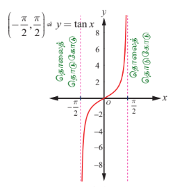
**படம். 4.17**

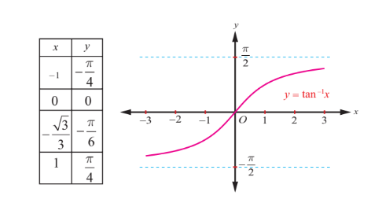
**படம். 4.18**

### குறிப்பு

(i) நேர்மாறு தொடுகோட்டுச் சார்பு திடமாக ஏறும் சார்பு மற்றும் $(-\infty, \infty)$ எனும் சார்பகத்தில் தொடர்ச்சியானது.

(ii) $y = \tan^{-1} x$ -ன் வரைபடம் ஆதி வழியாகச் செல்கிறது.

(iii) ஆதியைப் பொறுத்து வளைவரை சமச்சீராக இருப்பதால் சார்பு $y = \tan^{-1} x$ ஆனது ஒரு ஒற்றைச் சார்பாகும்.

---

### எடுத்துக்காட்டு 4.8

முதன்மை மதிப்பு காண்க: $\tan^{-1}(\sqrt{3})$.

### தீர்வு

$\tan^{-1}(\sqrt{3}) = y$ என்க. எனவே, $\tan y = \sqrt{3}$. ஆகையால், $y = \frac{\pi}{3}$. ஏனெனில் $\frac{\pi}{3} \in \left(-\frac{\pi}{2}, \frac{\pi}{2}\right)$.

எனவே, $\tan^{-1}(\sqrt{3})$ ன் முதன்மை மதிப்பு $\tan^{-1}(\sqrt{3}) = \frac{\pi}{3}$ ஆகும்.

---

### எடுத்துக்காட்டு 4.9

மதிப்பு காண்க (i) $\tan^{-1}(-\sqrt{3})$ (ii) $\tan^{-1}\left(\tan\frac{3\pi}{5}\right)$ (iii) $\tan^{-1}(\tan 2019)$

### தீர்வு

(i) $\tan^{-1}(-\sqrt{3}) = -\tan^{-1}(\sqrt{3}) = -\frac{\pi}{3}$, ஏனெனில் $-\frac{\pi}{3} \in \left(-\frac{\pi}{2}, \frac{\pi}{2}\right)$.

(ii) $\tan^{-1}\left(\tan\frac{3\pi}{5}\right)$.

$\tan\theta = \tan\frac{3\pi}{5}$ எனுமாறு $\theta \in \left(-\frac{\pi}{2}, \frac{\pi}{2}\right)$ ஐ நாம் கண்டறிய வேண்டும்.

தொடுகோட்டுச் சார்பின் காலம் $\pi$ என்பதால், $\tan\frac{3\pi}{5} = \tan\left(\frac{3\pi}{5} - \pi\right) = \tan\left(-\frac{2\pi}{5}\right)$.

எனவே, $\tan^{-1}\left(\tan\frac{3\pi}{5}\right) = \tan^{-1}\left(\tan\left(-\frac{2\pi}{5}\right)\right) = -\frac{2\pi}{5}$, ஏனெனில் $-\frac{2\pi}{5} \in \left(-\frac{\pi}{2}, \frac{\pi}{2}\right)$.

(iii) $\tan^{-1}(\tan x) = x, x \in \mathbb{R}$ என்பதால், $\tan^{-1}(\tan 2019) = 2019$ ஆகும்.

### எடுத்துக்காட்டு 4.10

மதிப்பு காண்க $\tan^{-1}(-1) + \cos^{-1}\left(\frac{1}{2}\right) + \sin^{-1}\left(-\frac{1}{2}\right)$.

### தீர்வு

$\tan^{-1}(-1) = y$ என்க. எனவே, $\tan y = -1 = -\tan\frac{\pi}{4} = \tan\left(-\frac{\pi}{4}\right)$.

இங்கு $-\frac{\pi}{4} \in \left(-\frac{\pi}{2}, \frac{\pi}{2}\right)$ என்பது குறிப்பிடதக்கது. எனவே, $\tan^{-1}(-1) = -\frac{\pi}{4}$.

இனி, $\cos^{-1}\left(\frac{1}{2}\right) = y$ எனில் $\cos y = \frac{1}{2} = \cos\frac{\pi}{3}$.

$\frac{\pi}{3} \in [0, \pi]$ என்பதால் $\cos^{-1}\left(\frac{1}{2}\right) = \frac{\pi}{3}$.

மேலும், $\sin^{-1}\left(-\frac{1}{2}\right) = y$ எனில் $\sin y = -\frac{1}{2} = -\sin\frac{\pi}{6}$.

$-\frac{\pi}{6} \in \left[-\frac{\pi}{2}, \frac{\pi}{2}\right]$ என்பதால் $\sin^{-1}\left(-\frac{1}{2}\right) = -\frac{\pi}{6}$.

எனவே, $\tan^{-1}(-1) + \cos^{-1}\left(\frac{1}{2}\right) + \sin^{-1}\left(-\frac{1}{2}\right) = -\frac{\pi}{4} + \frac{\pi}{3} - \frac{\pi}{6} = -\frac{\pi}{12}$.

---

### எடுத்துக்காட்டு 4.11

நிரூபி $\tan^{-1}\left(\frac{x}{\sqrt{1 - x^2}}\right) = \sin^{-1} x, \quad -1 < x < 1$.

### தீர்வு

$x = 0$ எனில், இருபுறமும் $0$ ஆகும். ... (1)

$0 < x < 1$ என்க. $\theta = \sin^{-1} x$ என்க. எனவே $0 < \theta < \frac{\pi}{2}$ ஆகும். தற்போது $\sin\theta = \frac{x}{1}$ என்பதால், $\tan\theta = \frac{x}{\sqrt{1 - x^2}}$.

எனவே, $\tan^{-1}\left(\frac{x}{\sqrt{1 - x^2}}\right) = \sin^{-1} x$. ... (2)

அடுத்தாக $-1 < x < 0$ என்க. எனவே, $\theta = \sin^{-1} x$ என்பதிலிருந்து $-\frac{\pi}{2} < \theta < 0$.

$\sin\theta = \frac{x}{1}$ என்பதால், $\tan\theta = \frac{x}{\sqrt{1 - x^2}}$.

இம்முறையிலும் $\tan^{-1}\left(\frac{x}{\sqrt{1 - x^2}}\right) = \sin^{-1} x$ என கிடைக்கின்றது. ... (3)

சமன்பாடுகள் (1), (2) மற்றும் (3) ஆகியவற்றிலிருந்து $\tan^{-1}\left(\frac{x}{\sqrt{1 - x^2}}\right) = \sin^{-1} x, \quad -1 < x < 1$ என நிறுவப்படுகின்றது.

---

### பயிற்சி 4.3

1. கீழ்க்காணும் சார்புகளின் சார்பகம் காண்க.

   (i) $\tan^{-1}(2x - 9)$  
   (ii) $\frac{1}{2}\tan^{-1}(4x - 1) - \frac{\pi}{4}$.

2. மதிப்பு காண்க (i) $\tan^{-1}\left(\tan\frac{5\pi}{4}\right)$ (ii) $\tan^{-1}\left(\tan\left(-\frac{\pi}{6}\right)\right)$.

3. மதிப்பு காண்க

   (i) $\tan^{-1}\left(\tan\frac{7\pi}{4}\right)$ (ii) $\tan^{-1}(\tan 1947)$ (iii) $\tan^{-1}(\tan(-0.2021))$.

4. மதிப்பு காண்க (i) $\tan^{-1}\left(\frac{1}{2}\right) - \sin^{-1}\left(\frac{1}{2}\right)$ (ii) $\sin^{-1}\left(\frac{1}{2}\right) - \cos^{-1}\left(\frac{4}{5}\right)$.

   (iii) $\cos^{-1}\left(\sin\left(\frac{\pi}{3}\right)\right) + \tan^{-1}\left(\tan\left(\frac{\pi}{3}\right)\right)$.

### 4.6 கொசீகண்ட் சார்பு மற்றும் நேர்மாறு கொசீகண்ட் சார்பு
### (The Cosecant Function and the Inverse Cosecant Function)

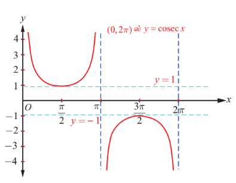
**படம். 4.19**
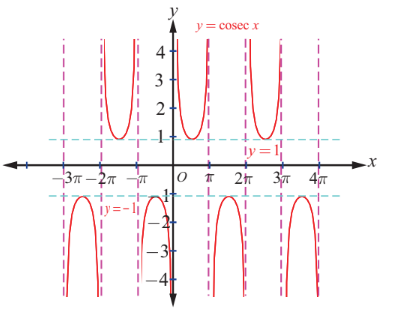
**படம். 4.20**

சைன் சார்பினைப் போன்றே, கொசீகண்ட் சார்பும் ஓர் ஒற்றைச் சார்பாகும் மற்றும் அதன் காலம் $2\pi$ ஆகும். கொசீகண்ட் சார்பு $y = \cosec x$ -ன் மதிப்புகள் $2\pi$ அளவுக்குப் பிறகு திரும்பவும் அதே மதிப்புகளைப் பெறுகிறது. $\sin x = 0$ எனும்போது, $y = \cosec x = \frac{1}{\sin x}$ ஐ வரையறுக்க இயலாது. ஆதலால் கொசீகண்ட் சார்பின் சார்பகம் $\mathbb{R} \setminus \{ n\pi : n \in \mathbb{Z} \}$ ஆகும். $-1 \leq \sin x \leq 1$ என்பதால் $y = \cosec x$ ஆனது $-1$ மற்றும் $1$-க்கும் இடையே எம்மதிப்பையும் பெறுவதில்லை. எனவே, கொசீகண்ட் சார்பின் வீச்சகம் $(-\infty, -1] \cup [1, \infty)$ ஆகும்.

---

### 4.6.1 கொசீகண்ட் சார்பின் வரைபடம்
### (Graph of the cosecant function)

$(0, 2\pi)$ இடைவெளியில், கொசீகண்ட் சார்பானது $x = \pi$ எனும் புள்ளியைத் தவிர்த்து ஏனைய புள்ளிகளில் தொடர்ச்சியாக இருக்கும். இதற்கு மீப்பெருமமோ அல்லது மீச்சிறுமமோ இல்லை. பொதுவாக, $x \in \left(0, \frac{\pi}{2}\right]$ மதிப்புகளுக்கு $y = \cosec x$ -ன் மதிப்பு, $\infty$ முதல் $1$ வரை குறையும். $x \in \left[\frac{\pi}{2}, \pi\right)$ மதிப்புகளுக்கு, $y = \cosec x$ -ன் மதிப்புகள் $1$ முதல் $\infty$ வரை அதிகரிக்கும். $x \in \left(\pi, \frac{3\pi}{2}\right]$ மதிப்புகளுக்கு, $y = \cosec x$ -ன் மதிப்புகள் $-\infty$ முதல் $-1$ வரை அதிகரிக்கும். $x \in \left[\frac{3\pi}{2}, 2\pi\right)$ மதிப்புகளுக்கு, $y = \cosec x$ -ன் மதிப்புகள் $-1$ முதல் $-\infty$ வரை குறையும். $y = \cosec x$, $x \in (0, 2\pi) \setminus \{\pi\}$ -ன் வரைபடத்தினை படம் 4.19 -ல் காண்க.

$\ldots, (-4\pi, -2\pi) \setminus \{-3\pi\}, (-2\pi, 0) \setminus \{-\pi\}, (0, 2\pi) \setminus \{\pi\}, (2\pi, 4\pi) \setminus \{3\pi\}, (4\pi, 6\pi) \setminus \{5\pi\}, \ldots$

ஆகிய இடைவெளிகளில் $(0, 2\pi)$ல் $y = \cosec x$ ன் வரைபடத்தின் இப்பகுதியே திரும்ப அமைகின்றது. $y = \cosec x$ -ன் முழு வரைபடம் ஆனது படம் 4.20-ல் காண்பிக்கப்பட்டுள்ளது.

---

### 4.6.2 நேர்மாறு கொசீகண்ட் சார்பு (The inverse cosecant function)

$\cosec : \left[-\frac{\pi}{2}, 0\right) \cup \left(0, \frac{\pi}{2}\right] \rightarrow (-\infty, -1] \cup [1, \infty)$ எனும் கொசீகண்ட் சார்பானது $\left[-\frac{\pi}{2}, 0\right) \cup \left(0, \frac{\pi}{2}\right]$ எனும் கட்டுபடுத்தப்பட்ட சார்பகத்தில் இருபுறச்சார்பாக உள்ளது. எனவே, $(-\infty, -1] \cup [1, \infty)$ -ஐ சார்பகமாகவும் மற்றும் $\left[-\frac{\pi}{2}, 0\right) \cup \left(0, \frac{\pi}{2}\right]$ வீச்சகமாகவும் கொண்டு நேர்மாறு கொசீகண்ட் சார்பு வரையறுக்கப்படுகிறது.

### வரையறை 4.6

$\cosec^{-1} : (-\infty, -1] \cup [1, \infty) \rightarrow \left[-\frac{\pi}{2}, 0\right) \cup \left(0, \frac{\pi}{2}\right]$ எனும் நேர்மாறு கொசீகண்ட் சார்பை, $\cosec^{-1} x = y$ என வரையறுக்கத் தேவையானதும் மற்றும் போதுமானதுமான நிபந்தனை $\cosec y = x$ மற்றும் $y \in \left[-\frac{\pi}{2}, 0\right) \cup \left(0, \frac{\pi}{2}\right]$ ஆகும்.

---

### 4.6.3 நேர்மாறு கொசீகண்ட் சார்பின் வரைபடம்
### (Graph of the inverse cosecant function)

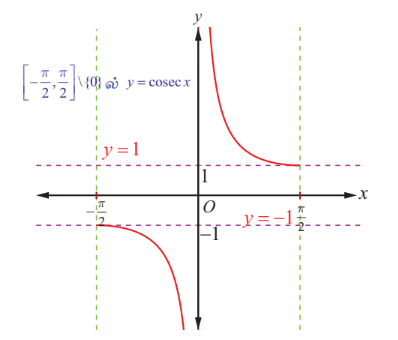
**படம். 4.21**
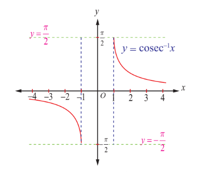
**படம். 4.22**

$y = \cosec^{-1} x$ எனும் நேர்மாறு கொசீகண்ட் சார்பின் சார்பகம் $\mathbb{R} \setminus (-1, 1)$ மற்றும் வீச்சகம் $\left[-\frac{\pi}{2}, \frac{\pi}{2}\right] \setminus \{0\}$ ஆகும். அதாவது, $\cosec^{-1} : (-\infty, -1] \cup [1, \infty) \rightarrow \left[-\frac{\pi}{2}, 0\right) \cup \left(0, \frac{\pi}{2}\right]$ ஆகும்.

படம் 4.21 மற்றும் படம் 4.22 –ல் முதன்மை சார்பகத்தில் கொசீகண்ட் சார்பின் வரைபடம் மற்றும் நேர்மாறு கொசீகண்ட் சார்பின் சார்பகத்தில் அதன் வரைபடம் ஆகியவை முறையே காண்பிக்கப்பட்டுள்ளன.

### 4.7 சீகண்ட் சார்பு மற்றும் நேர்மாறு சீகண்ட் சார்பு (The Secant Function and Inverse Secant Function)

சீகண்ட் சார்பு என்பது கொசைன் சார்பின் தலைகீழ்ச்சார்பு என வரையறுக்கப்பட்டுள்ளது. எனவே, $y = \sec x = \frac{1}{\cos x}$ என்பது $\cos x = 0$ எனும்போது தவிர ஏனைய $x$ மதிப்புகளுக்கு வரையறுக்கப்படுகிறது. ஆகையால், $y = \sec x$ -ன் சார்பகம் $\mathbb{R} \setminus \left\{ (2n+1)\frac{\pi}{2}, n \in \mathbb{Z} \right\}$ ஆகும். $-1 \leq \cos x \leq 1$ என்பதால், $y = \sec x$ என்பது $(-1, 1)$ -ல் எம்மதிப்புகளையும் பெறாது. எனவே, சீகண்ட் சார்பின் வீச்சகம் $(-\infty, -1] \cup [1, \infty)$ ஆகும். சீகண்ட் சார்பிற்கு மீப்பெருமோ அன்றி மீச்சிறுமோ இல்லை. $y = \sec x$ என்பது $2\pi$ கொண்ட காலம் சார்பு மற்றும் இரட்டைச் சார்பாகவும் அமைகிறது.

---

### 4.7.1 சீகண்ட் சார்பின் வளைவரை (The graph of the secant function)

$0 \leq x \leq 2\pi$, $x \neq \frac{\pi}{2}, \frac{3\pi}{2}$ -ல் சீகண்ட் சார்பின் வளைவரை படம் 4.23-ல் காண்பிக்கப்பட்டுள்ளது. முதல் மற்றும் நான்காம் காற்பகுதிகளில் அதாவது $-\frac{\pi}{2} < x < \frac{\pi}{2}$ இடைவெளியில், $y = \sec x$ மிகையெண் மதிப்புகளை மட்டுமே பெறுகிறது. அதே சமயம் இரண்டாவது மற்றும் மூன்றாவது காற்பகுதிகளில் அதாவது $\frac{\pi}{2} < x < \frac{3\pi}{2}$ இடைவெளியில் குறையெண் மதிப்புகளையே பெறுகிறது.

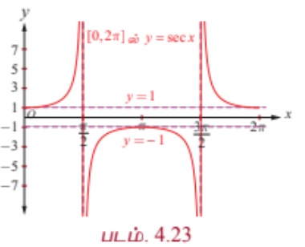

$0 \leq x \leq 2\pi$, $x \neq \frac{\pi}{2}, \frac{3\pi}{2}$ எனும்போது சீகண்ட் சார்பு தொடர்ச்சியாக இருக்கும். $x \in \left[0, \frac{\pi}{2}\right)$ எனும்போது சீகண்ட் சார்பின் மதிப்பு $1$ முதல் $\infty$ வரை உயரும். மேலும், $x \in \left(\frac{\pi}{2}, \pi\right]$ எனும்போது சீகண்ட் சார்பின் மதிப்பு $-\infty$ முதல் $-1$ வரை உயரும். $x \in \left[\pi, \frac{3\pi}{2}\right)$ எனும்போது $-1$ முதல் $-\infty$ வரை இறங்கும். $x \in \left(\frac{3\pi}{2}, 2\pi\right]$ எனும்போது $\infty$ முதல் $1$ வரை இறங்கும். $y = \sec x$ ஒரு $2\pi$ -காலம் கொண்ட சார்பாகும், எனவே $0 \leq x \leq 2\pi$, $x \neq \frac{\pi}{2}, \frac{3\pi}{2}$ -க்கான வளைவரைப் பகுதியே, $[2\pi, 4\pi] \setminus \left\{\frac{5\pi}{2}, \frac{7\pi}{2}\right\}, [4\pi, 6\pi] \setminus \left\{\frac{9\pi}{2}, \frac{11\pi}{2}\right\}, \ldots$ மற்றும் $\ldots, [-4\pi, -2\pi] \setminus \left\{-\frac{7\pi}{2}, -\frac{5\pi}{2}\right\}, [-2\pi, 0] \setminus \left\{-\frac{3\pi}{2}, -\frac{\pi}{2}\right\}$ ஆகிய இடைவெளிகளில் திரும்ப, திரும்ப அமைகின்றது. தற்போது $y = \sec x$ -ன் முழு வரைபடமும் படம் 4.24-ல் காண்பிக்கப்பட்டுள்ளது.

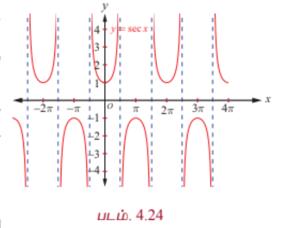

---

### 4.7.2 நேர்மாறு சீகண்ட் சார்பு (Inverse secant function)

$\sec x: [0, \pi] \setminus \left\{\frac{\pi}{2}\right\} \rightarrow \mathbb{R} \setminus (-1, 1)$ எனும் சீகண்ட் சார்பு கட்டுப்படுத்தப்பட்ட சார்பகமான $[0, \pi] \setminus \left\{\frac{\pi}{2}\right\}$ -ல் ஓர் இருபுறச் சார்பு ஆகும். எனவே நேர்மாறு சீகண்ட் சார்பு என்பது $\mathbb{R} \setminus (-1, 1)$ என்பதை சார்பகமாகவும் மற்றும் $[0, \pi] \setminus \left\{\frac{\pi}{2}\right\}$ வீச்சகமாகவும் கொண்டு வரையறுக்கப்படுகிறது.

### வரையறை 4.7

$\sec y = x$ மற்றும் $y \in [0, \pi] \setminus \left\{\frac{\pi}{2}\right\}$ எனும்போது நேர்மாறு சீகண்ட் சார்பு $\sec^{-1} : \mathbb{R} \setminus (-1, 1) \rightarrow [0, \pi] \setminus \left\{\frac{\pi}{2}\right\}$ ஐ $\sec^{-1} x = y$ என வரையறுக்கப்படுகிறது.

---

### 4.7.3 நேர்மாறு சீகண்ட் சார்பின் வரைபடம் (Graph of the inverse secant function)

நேர்மாறு சீகண்ட் சார்பு, $y = \sec^{-1} x$ என்பது $\mathbb{R} \setminus (-1, 1)$ -ஐ சார்பகமாகவும் மற்றும் $[0, \pi] \setminus \left\{\frac{\pi}{2}\right\}$ -ஐ வீச்சாகவும் கொண்ட சார்பாகும். அதாவது, $\sec^{-1} : \mathbb{R} \setminus (-1, 1) \rightarrow [0, \pi] \setminus \left\{\frac{\pi}{2}\right\}$.

படம் 4.25 மற்றும் படம் 4.26 ஆகியவற்றில், முறையே முதன்மை சார்பகத்தில் சீகண்ட் சார்பின் வரைபடமும் மற்றும் நேர்மாறு சீகண்ட் சார்பின் வரைபடம் அதற்குறிய சார்பகத்தில் காண்பிக்கப்பட்டுள்ளது.

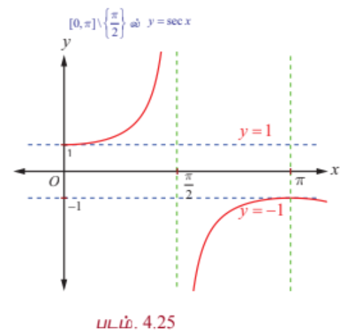

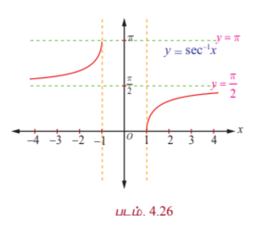

---

### குறிப்புரை

$y = \sec x$ அல்லது $\cosec x$ எனும் வரைபடத்தை எளிதாக வரைய கீழ்க்காணும் வழிமுறையைப் பின்பற்றவும்.

(i) $y = \cos x$ அல்லது $\sin x$ வரைபடத்தை வரையவும்.

(ii) $x$ வெட்டுத்துண்டுகள் சந்திக்கும் புள்ளிகளில் செங்குத்து தொலைத் தொடுகோடுகளை வரையவும். $y$ மதிப்புகளின் தலைகீழியாக எடுத்துக் கொள்ளவும்.

### 4.8 கோடான்ஜெண்ட் சார்பு மற்றும் நேர்மாறு கோடான்ஜெண்ட் சார்பு
### (The Cotangent Function and the Inverse Cotangent Function)

கோடான்ஜெண்ட் சார்பு என்பது $\cot x = \frac{1}{\tan x}$ ஆகும். $\tan x = 0$ அல்லது $x = n\pi, n \in \mathbb{Z}$ எனும் மதிப்புகளைத் தவிர $x$ -ன் ஏனைய மெய்யெண் மதிப்புகளுக்கு கோடான்ஜெண்ட் சார்பு வரையறுக்கப்படுகிறது. எனவே, கோடான்ஜெண்ட் சார்பின் சார்பகமானது $\mathbb{R} \setminus \{ n\pi : n \in \mathbb{Z} \}$ மற்றும் அதன் வீச்சகம் $(-\infty, \infty)$ ஆகும். $\tan x$ போன்று கோடான்ஜெண்ட் சார்பும் ஓர் ஒற்றைச் சார்பாகவும் மற்றும் அதன் காலம் $\pi$ ஆகவும் உள்ளது.

---

### 4.8.1 கோடான்ஜெண்ட் சார்பின் வரைபடம் (The graph of the cotangent function)

கோடான்ஜெண்ட் சார்பு $(0, 2\pi) \setminus \{\pi\}$ எனும் கணத்தில் தொடர்ச்சியாக இருக்கிறது. $(0, 2\pi) \setminus \{\pi\}$ -ல் முதலில் கோடான்ஜெண்ட் சார்பின் வரைபடத்தை வரைவோம். முதல் மற்றும் மூன்றாம் காற்பகுதியில் கோடான்ஜெண்ட் மிகையெண் மதிப்புகளை மட்டுமே பெறுகிறது. இரண்டாவது மற்றும் நான்காவது காற்பகுதிகளில் குறையெண் மதிப்புகளை மட்டுமே பெறுகிறது. கோடான்ஜெண்ட் சார்பிற்கு மீப்பெருமோ அல்லது மீச்சிறுமோ இல்லை. $x \in \left(0, \frac{\pi}{2}\right]$ எனும்போது கோடான்ஜெண்ட் சார்பு, $\infty$ -லிருந்து $0$ -க்கு இறங்குகிறது; $x \in \left[\frac{\pi}{2}, \pi\right)$ எனும்போது $0$ -லிருந்து $-\infty$-க்கு இறங்குகிறது; $x \in \left(\pi, \frac{3\pi}{2}\right]$ எனும்போது $-\infty$-லிருந்து $0$ வரை இறங்குகிறது; $x \in \left[\frac{3\pi}{2}, 2\pi\right)$ எனும்போது, $0$-லிருந்து $-\infty$ வரை இறங்குகிறது.

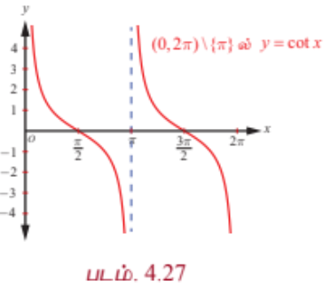

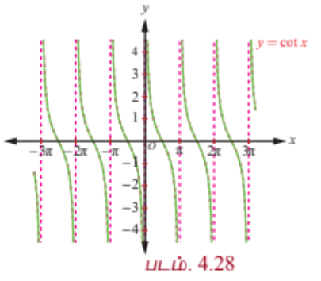

$y = \cot x$, $x \in (0, 2\pi) \setminus \{\pi\}$ -க்கான வரைபடம் படம் 4.27—ல் காண்பிக்கப்பட்டுள்ளது. $(0, 2\pi) \setminus \{\pi\}$ -ல் அமைந்த $y = \cot x$ ன் வரைபடம் போல $(2\pi, 4\pi) \setminus \{3\pi\}, (4\pi, 6\pi) \setminus \{5\pi\}, \ldots$, மற்றும் $\ldots, (-4\pi, -2\pi) \setminus \{-3\pi\}, (-2\pi, 0) \setminus \{-\pi\}$ ஆகிய இடைவெளிகளிலும் $y = \cot x$ ன் வரைப்படம் திரும்ப, திரும்ப அமைகிறது. $\mathbb{R} \setminus \{ n\pi : n \in \mathbb{Z} \}$ -ஐ சார்பகமாகக் கொண்ட கோடான்ஜெண்ட் சார்பின் முழு வரைபடமும் படம் 4.28-ல் காண்பிக்கப்பட்டுள்ளது.

---

### 4.8.2 நேர்மாறு கோடான்ஜெண்ட் சார்பு (Inverse cotangent function)

கோடான்ஜெண்ட் சார்பு அதன் முழுசார்பகத்தில் $\mathbb{R} \setminus \{ n\pi : n \in \mathbb{Z} \}$ ஒன்றுக்கொன்று சார்பு அல்ல. ஆயினும் கட்டுபடுத்தப்பட சார்பகமான $(0, \pi)$ -ல், $\cot : (0, \pi) \rightarrow (-\infty, \infty)$ ஆனது இருபுறச் சார்பாகும். எனவே, $(-\infty, \infty)$ சார்பகமாகவும், $(0, \pi)$ வீச்சாகவும் கொண்டு நேர்மாறு கோடான்செண்ட் சார்பை வரையறுப்போம்.

---

### வரையறை 4.8

நேர்மாறு கோடான்ஜெண்ட் சார்பான $\cot^{-1} : (-\infty, \infty) \rightarrow (0, \pi)$ என்பது $\cot^{-1} x = y$ என வரையறுக்க தேவையானதும் மற்றும் போதுமானதுமான நிபந்தனைகள் $y \in (0, \pi)$ மற்றும் $\cot y = x$ ஆகும்.

---

### 4.8.3 நேர்மாறு கோடான்ஜெண்ட் சார்பின் வரைபடம்
### (Graph of the inverse cotangent function)

நேர்மாறு கோடான்ஜெண்ட் சார்பான $y = \cot^{-1} x$ என்பது $\mathbb{R}$ -ஐ சார்பகமாகவும் மற்றும் $(0, \pi)$ -ஐ வீச்சாகவும் கொண்ட சார்பாகும். அதாவது $\cot^{-1} : (-\infty, \infty) \rightarrow (0, \pi)$ ஆகும்.

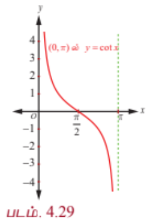

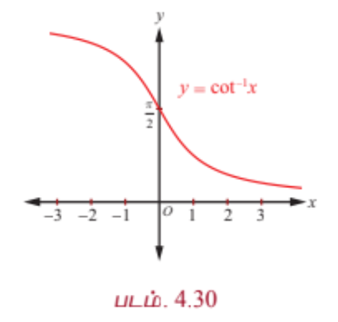

படம் 4.29 மற்றும் படம். 4.30 ஆகியவற்றில் வரைபடங்கள் முறையே முதன்மை சார்பகத்தில் கோடான்ஜெண்ட் சார்பின் வரைபடம் மற்றும் நேர்மாறு கோடான்ஜெண்ட் சார்பின் வரைபடம் அதற்குரிய சார்பகத்திலும் கொடுக்கப்பட்டுள்ளன.

### 4.9 நேர்மாறு முக்கோணவியல் சார்புகளின் முதன்மை மதிப்பு
### (Principal Value of Inverse Trigonometric Functions)

$x$ எனும் புள்ளியில் நேர்மாறு முக்கோணவியல் சார்பின் முதன்மை மதிப்பானது, முதன்மை பகுதியின் வீச்சில் உள்ள $x$ எனும் புள்ளியில் நேர்மாறு சார்பின் மதிப்பாகும். எடுத்துக்காட்டாக $\frac{\pi}{6} \in [0, \pi]$ என்பதால், $\cos^{-1}\left(\frac{\sqrt{3}}{2}\right)$ -ன் முதன்மை மதிப்பு $\frac{\pi}{6}$ ஆகும். இரு மதிப்புகள் எண்மதிப்பில் சமமாகவும், ஒன்று குறையெண்ணாகவும் மற்றொன்று மிகையெண்ணாகவும் இருந்தால் முக்கோணவியல் சார்பின் முதன்மை மதிப்பு மிகை எண்ணாகவே அமையும். கீழ்க்காணும் அட்டவணையில் முக்கோணவியல் சார்புகளின் முதன்மை சார்பகம் மற்றும் வீச்சகம், நேர்மாறு முக்கோணவியல் சார்புகளின் சார்பகம் மற்றும் வீச்சகம் ஆகியவை பட்டியலிடப்படுகின்றன.

| சார்பு | முதன்மை சார்பகம் | வீச்சகம் | நேர்மாறு சார்பு | சார்பகம் | முதன்மை மதிப்பிற்குரிய வீச்சகம் |
|---|---|---|---|---|---|
| சைன் | $\left[-\frac{\pi}{2}, \frac{\pi}{2}\right]$ | $[-1, 1]$ | $\sin^{-1}$ | $[-1, 1]$ | $\left[-\frac{\pi}{2}, \frac{\pi}{2}\right]$ |
| கொசைன் | $[0, \pi]$ | $[-1, 1]$ | $\cos^{-1}$ | $[-1, 1]$ | $[0, \pi]$ |
| தொடுகோடு | $\left(-\frac{\pi}{2}, \frac{\pi}{2}\right)$ | $\mathbb{R}$ | $\tan^{-1}$ | $\mathbb{R}$ | $\left(-\frac{\pi}{2}, \frac{\pi}{2}\right)$ |
| கொசீகண்ட் | $\left[-\frac{\pi}{2}, \frac{\pi}{2}\right] \setminus \{0\}$ | $\mathbb{R} \setminus (-1, 1)$ | $\cosec^{-1}$ | $\mathbb{R} \setminus (-1, 1)$ | $\left[-\frac{\pi}{2}, \frac{\pi}{2}\right] \setminus \{0\}$ |
| சீகண்ட் | $[0, \pi] \setminus \left\{\frac{\pi}{2}\right\}$ | $\mathbb{R} \setminus (-1, 1)$ | $\sec^{-1}$ | $\mathbb{R} \setminus (-1, 1)$ | $[0, \pi] \setminus \left\{\frac{\pi}{2}\right\}$ |
| கோடான்ஜெண்ட் | $(0, \pi)$ | $\mathbb{R}$ | $\cot^{-1}$ | $\mathbb{R}$ | $(0, \pi)$ |

---

### எடுத்துக்காட்டு 4.12

முதன்மை மதிப்பு காண்க

(i) $\cosec^{-1}(-1)$ (ii) $\sec^{-1}(-2)$

### தீர்வு

(i) $\cosec^{-1}(-1) = y$ என்க. எனவே, $\cosec y = -1$.

$y = \cosec^{-1} x$ -ன் முதன்மை மதிப்பிற்குரிய வீச்சகம் $\left[-\frac{\pi}{2}, \frac{\pi}{2}\right] \setminus \{0\}$ ஆகும். மேலும், $\cosec\left(-\frac{\pi}{2}\right) = -1$ என்பதால், $y = -\frac{\pi}{2}$ என்றிருக்க வேண்டும். இங்கு $-\frac{\pi}{2} \in \left[-\frac{\pi}{2}, \frac{\pi}{2}\right] \setminus \{0\}$ என்பதை கவனிக்க.

எனவே, $\cosec^{-1}(-1)$ -ன் முதன்மை மதிப்பு $-\frac{\pi}{2}$ ஆகும்.

(ii) $y = \sec^{-1}(-2)$ என்க. எனவே, $\sec y = -2$.

$y = \sec^{-1} x$ -ன் முதன்மை மதிப்பிற்குரிய வீச்சகம் $[0, \pi] \setminus \left\{\frac{\pi}{2}\right\}$ ஆகும்.

$\sec y = -2$ என்றிருக்குமாறு $[0, \pi] \setminus \left\{\frac{\pi}{2}\right\}$ -ல் $y$-ஐ காணவேண்டும்.

ஆனால் $\sec y = -2 \Rightarrow \cos y = -\frac{1}{2}$.

இனி, $\cos y = -\frac{1}{2} = -\cos\frac{\pi}{3} = \cos\left(\pi - \frac{\pi}{3}\right) = \cos\frac{2\pi}{3}$. எனவே, $y = \frac{2\pi}{3}$.

$\frac{2\pi}{3} \in [0, \pi] \setminus \left\{\frac{\pi}{2}\right\}$ என்பதால், $\sec^{-1}(-2)$ -ன் முதன்மை மதிப்பு $\frac{2\pi}{3}$ ஆகும்.

---

### எடுத்துக்காட்டு 4.13

$\sec^{-1}\left(-\frac{2\sqrt{3}}{3}\right)$ ன் மதிப்பு காண்க.

### தீர்வு

$\sec^{-1}\left(-\frac{2\sqrt{3}}{3}\right) = \theta$ என்க. எனவே, $\sec\theta = -\frac{2}{\sqrt{3}}$. இங்கு $\theta \in [0, \pi] \setminus \left\{\frac{\pi}{2}\right\}$ ஆகும்.

எனவே, $\cos\theta = -\frac{\sqrt{3}}{2}$ ஆகும். இனி, $\cos\frac{5\pi}{6} = -\cos\frac{\pi}{6} = -\frac{\sqrt{3}}{2}$ ஆகும்.

எனவே, $\sec^{-1}\left(-\frac{2\sqrt{3}}{3}\right) = \frac{5\pi}{6}$ ஆகும்.

---

### எடுத்துக்காட்டு 4.14

$\cot^{-1}\left(\frac{1}{7}\right) = \theta$ எனில், $\cos\theta$ மதிப்பு காண்க.

.png)

### தீர்வு

வரையறைப்படி $\cot^{-1} x \in (0, \pi)$.

எனவே, $\cot^{-1}\left(\frac{1}{7}\right) = \theta$ என்பதிலிருந்து $\theta \in (0, \pi)$ ஆகும்.

ஆனால் $\cot^{-1}\left(\frac{1}{7}\right) = \theta$ என்பது $\cot\theta = \frac{1}{7}$ ஆகும். எனவே $\tan\theta = 7$ மற்றும் $\theta$ ஒரு குறுங்கோணம் ஆகும்.

$\tan\theta = \frac{7}{1}$ என்பதை பயன்படுத்தி, செங்கோண முக்கோணம் ஒன்றை உருவாக்குக. பின்னர் $\cos\theta = \frac{1}{5\sqrt{2}}$ என நமக்கு கிடைக்கிறது.

---

### எடுத்துக்காட்டு 4.15

$\cot^{-1}\left(\frac{1}{\sqrt{x^2 - 1}}\right) = \sec^{-1} x$, $x > 1$ எனக் காட்டுக.

.png)

### தீர்வு

$\cot^{-1}\left(\frac{1}{\sqrt{x^2 - 1}}\right) = \alpha$ என்க. எனவே, $\cot\alpha = \frac{1}{\sqrt{x^2 - 1}}$ மற்றும் $\alpha$ ஒரு குறுங்கோணம் ஆகும்.

கொடுக்கப்பட்ட விவரங்களைக் கொண்டு ஒரு செங்கோண முக்கோணம் உருவாக்குக. முக்கோணத்திலிருந்து, $\sec\alpha = \frac{x}{1} = x$ எனப் பெறலாம். எனவே, $\alpha = \sec^{-1} x$ ஆகும்.

எனவே $\cot^{-1}\left(\frac{1}{\sqrt{x^2 - 1}}\right) = \sec^{-1} x$, $x > 1$ ஆகும்.

---

### பயிற்சி 4.4

1. முதன்மை மதிப்பு காண்க

   (i) $\sec^{-1}\left(\frac{2}{\sqrt{3}}\right)$  
   (ii) $\cot^{-1}(\sqrt{3})$  
   (iii) $\cosec^{-1}(-\sqrt{2})$

2. மதிப்பு காண்க

   (i) $\tan^{-1}(-\sqrt{3}) - \sec^{-1}(-2)$  
   (ii) $\sin^{-1}(-1) + \cos^{-1}\left(\frac{1}{2}\right) + \cot^{-1}(2)$  
   (iii) $\cot^{-1}(1) + \sin^{-1}\left(-\frac{\sqrt{3}}{2}\right) - \sec^{-1}(-\sqrt{2})$

### 4.10 நேர்மாறு முக்கோணவியல் சார்புகளின் பண்புகள்
### (Properties of Inverse Trigonometric Functions)

இப்பாடப்பகுதியில் நேர்மாறு முக்கோணவியல் சார்புகளின் சிலப் பண்புகளைப் பற்றி ஆராய்வோம். இங்கு குறிப்பிடப்படும் பண்புகள் தொடர்புடைய நேர்மாறு முக்கோணவியல் சார்புகள் அவற்றின் முதன்மை மதிப்புகள் உள்ள இடைவெளிகளில் எங்கு வரையறுக்கப்பட்டுள்ளதோ, அவ்விடத்தில் பொருந்தும்.

#### பண்பு-I

(i) $\theta \in \left[-\frac{\pi}{2}, \frac{\pi}{2}\right]$ எனில், $\sin^{-1}(\sin \theta) = \theta$  
(ii) $\theta \in [0, \pi]$ எனில், $\cos^{-1}(\cos \theta) = \theta$  
(iii) $\theta \in \left(-\frac{\pi}{2}, \frac{\pi}{2}\right)$ எனில், $\tan^{-1}(\tan \theta) = \theta$  
(iv) $\theta \in \left[-\frac{\pi}{2}, \frac{\pi}{2}\right] \setminus \{0\}$ எனில், $\cosec^{-1}(\cosec \theta) = \theta$  
(v) $\theta \in [0, \pi] \setminus \left\{\frac{\pi}{2}\right\}$ எனில், $\sec^{-1}(\sec \theta) = \theta$  
(vi) $\theta \in (0, \pi)$ எனில், $\cot^{-1}(\cot \theta) = \theta$

#### நிரூபணம்

மேற்கண்ட அனைத்து முடிவுகளும் அவைகளுக்குரிய நேர்மாறு சார்புகளின் வரையறைகளிலிருந்து கிடைக்கப் பெறலாம்.

எடுத்துகாட்டிற்கு, (i) $\sin\theta = x$; $\theta \in \left[-\frac{\pi}{2}, \frac{\pi}{2}\right]$ என்க.

எனவே நேர்மாறு சைன் சார்பின் வரையறையிலிருந்து, $\sin\theta = x$ மூலம் $\theta = \sin^{-1} x$ எனப் பெறலாம். எனவே, $\sin^{-1}(\sin \theta) = \theta$.

---

#### பண்பு-II

(i) $x \in [-1, 1]$ எனில், $\sin(\sin^{-1} x) = x$  
(ii) $x \in [-1, 1]$ எனில், $\cos(\cos^{-1} x) = x$  
(iii) $x \in \mathbb{R}$ எனில், $\tan(\tan^{-1} x) = x$  
(iv) $x \in \mathbb{R} \setminus (-1, 1)$ எனில், $\cosec(\cosec^{-1} x) = x$  
(v) $x \in \mathbb{R} \setminus (-1, 1)$ எனில், $\sec(\sec^{-1} x) = x$  
(vi) $x \in \mathbb{R}$ எனில், $\cot(\cot^{-1} x) = x$

#### நிரூபணம்

(i) $x \in [-1, 1]$ எனும்போது, $\sin^{-1} x$ நன்கு வரையறுக்கப்பட்டுள்ளது.

$\sin^{-1} x = \theta$ என்க. எனவே, வரையறைப்படி $\theta \in \left[-\frac{\pi}{2}, \frac{\pi}{2}\right]$ மற்றும் $\sin\theta = x$ ஆகும்.

எனவே, $\sin\theta = x$ என்பதிலிருந்து $\sin(\sin^{-1} x) = x$ எனப் பெறலாம்.

இதேபோன்று மற்ற முடிவுகளையும் நிரூபிக்கலாம்.

---

#### குறிப்பு

(i) முக்கோணவியல் சார்பு $y = f(x)$ -க்கு, $f$ -ன் வீச்சிலுள்ள அனைத்து $x$-க்கும் $f(f^{-1}(x)) = x$ ஆகும். $f^{-1}(x)$ -ன் வரையறையிலிருந்து இதனைப் பெறலாம். $f(g^{-1}(x))$ எனும்போது, இங்கு $g^{-1}(x) = \sin^{-1} x$ அல்லது $\cos^{-1} x$ அத்தகைய கணக்கை தீர்க்க, நேர்மாறு முக்கோணவியல் சார்பினை வரையறுக்கும் முக்கோணம் ஒன்றை வரைவது அவசியமாகிறது. உதாரணத்திற்கு $\cot(\sin^{-1} x)$ -ன் மதிப்பைக் காண முக்கோணம் ஒன்றை, $\sin^{-1} x$ -ஐ பயன்படுத்தி வரையவேண்டும். இருப்பினும், $f(f^{-1}(x))$ போன்றவற்றைக் கையாளும்போது கவனம் செலுத்த வேண்டியுள்ளது.

(ii) $f$ என்பது ஆறு முக்கோணவியல் சார்புகளில் ஏதேனும் ஒன்று எனில், $f^{-1}(f(x))$ -ன் மதிப்பைக் காணுதல்.

(அ) $x$ என்பது $f$ -ன் கட்டுபடுத்தப்பட்ட சார்பகத்தில் இருந்தால் $f^{-1}(f(x)) = x$ ஆகும்.

(ஆ) $x$ என்பது $f$ -ன் கட்டுபடுத்தப்பட்ட சார்பகத்தில் இல்லையெனில் $f$ -ன் கட்டுபடுத்தப்பட்ட சார்பகத்தில் $f(x) = f(x_1)$ எனுமாறு $x_1$ -ஐ கண்டறிய வேண்டும். இனி, $f^{-1}(f(x)) = x_1$.

எடுத்துகாட்டாக,

$$
\sin^{-1}(\sin x) = \begin{cases}
x, & \text{if } x \in \left[-\frac{\pi}{2}, \frac{\pi}{2}\right] \\
\text{other value}, & \text{if } x \notin \left[-\frac{\pi}{2}, \frac{\pi}{2}\right]
\end{cases}
$$

இங்கு $\sin x = \sin x_1$ மற்றும் $x_1 \in \left[-\frac{\pi}{2}, \frac{\pi}{2}\right]$.

---

#### பண்பு-III (தலைகீழ் நேர்மாறு முற்றொருமைகள்)

(i) $x \in \mathbb{R} \setminus (-1, 1)$ எனில், $\sin^{-1}\left(\frac{1}{x}\right) = \cosec^{-1} x$.  
(ii) $x \in \mathbb{R} \setminus (-1, 1)$ எனில், $\cos^{-1}\left(\frac{1}{x}\right) = \sec^{-1} x$.  
(iii) $$
\tan^{-1}\left(\frac{1}{x}\right) = \begin{cases}
\cot^{-1} x, & x > 0 \\
\cot^{-1} x - \pi, & x < 0
\end{cases}
$$

#### நிரூபணம்

(i) $x \in \mathbb{R} \setminus (-1, 1)$ எனில், $\frac{1}{x} \in [-1, 1]$ மற்றும் $x \neq 0$ ஆகும். எனவே, $\sin^{-1}\left(\frac{1}{x}\right)$ என்பது நன்கு வரையறுக்கப்பட்டது.

$\sin^{-1}\left(\frac{1}{x}\right) = \theta$ என்க. எனவே, வரையறையின்படி $\theta \in \left[-\frac{\pi}{2}, \frac{\pi}{2}\right] \setminus \{0\}$ மற்றும் $\sin\theta = \frac{1}{x}$.

ஆகையால், $\cosec\theta = x$ என்பதிலிருந்து $\theta = \cosec^{-1} x$ எனப் பெறப்படுகிறது.

இனி, $\sin^{-1}\left(\frac{1}{x}\right) = \theta = \cosec^{-1} x$ ஆகும். ஆகையால், $\sin^{-1}\left(\frac{1}{x}\right) = \cosec^{-1} x$, $x \in \mathbb{R} \setminus (-1, 1)$ ஆகும்.

இதே போன்று மற்ற முடிவுகளையும் நிரூபிக்கலாம்.

---

#### பண்பு-IV (பிரதிபலிப்பு முற்றொருமைகள்)

(i) $x \in [-1, 1]$ எனில், $\sin^{-1}(-x) = -\sin^{-1} x$.  
(ii) $x \in \mathbb{R}$ எனில், $\tan^{-1}(-x) = -\tan^{-1} x$.  
(iii) $x \geq 1$ அல்லது $x \in \mathbb{R} \setminus (-1, 1)$ எனில், $\cosec^{-1}(-x) = -\cosec^{-1} x$.  
(iv) $x \in [-1, 1]$ எனில், $\cos^{-1}(-x) = \pi - \cos^{-1} x$.  
(v) $x \geq 1$ அல்லது $x \in \mathbb{R} \setminus (-1, 1)$ எனில், $\sec^{-1}(-x) = \pi - \sec^{-1} x$.  
(vi) $x \in \mathbb{R}$ எனில், $\cot^{-1}(-x) = \pi - \cot^{-1} x$.

#### நிரூபணம்

(i) $x \in [-1, 1]$ எனில், $-x \in [-1, 1]$ ஆகும். ஆகையால், $\sin^{-1}(-x)$ என்பது நன்கு வரையறுக்கப்பட்டது.

$\sin^{-1}(-x) = \theta$ என்க. எனவே $\theta \in \left[-\frac{\pi}{2}, \frac{\pi}{2}\right]$ மற்றும் $\sin\theta = -x$ ஆகும்.

எனவே, $\sin\theta = -x$ -லிருந்து $x = -\sin\theta = \sin(-\theta)$ என ஆகும்.

$x = \sin(-\theta)$ என்பதிலிருந்து, $\sin^{-1} x = -\theta$ என ஆகும். இதிலிருந்து $\theta = -\sin^{-1} x$ ஆகும்.

எனவே, $\sin^{-1}(-x) = -\sin^{-1} x$ ஆகும்.

(iv) $x \in [-1, 1]$ எனில், $-x \in [-1, 1]$ என ஆகும். எனவே, $\cos^{-1}(-x)$ என்பது நன்கு வரையறுக்கப்பட்டது.

$\cos^{-1}(-x) = \theta$ என்க. எனவே $\theta \in [0, \pi]$ மற்றும் $\cos\theta = -x$ ஆகும்.

எனவே, $\cos\theta = -x$ என்பதால் $x = -\cos\theta = \cos(\pi - \theta)$ ஆகும்.

ஆகையால், $\pi - \theta = \cos^{-1} x$ என்பதால் $\theta = \pi - \cos^{-1} x$ ஆகும்.

எனவே $\cos^{-1}(-x) = \pi - \cos^{-1} x$ ஆகும்.

இதே போன்று ஏனைய முடிவுகளையும் நிரூபிக்கலாம்.

---

#### குறிப்பு

(i) ஒன்றுக்கொன்று மற்றும் ஒற்றைச் சார்பின் நேர்மாறு சார்பும் ஒற்றைச் சார்பாகும். எடுத்துகாட்டிற்கு, $\left[-\frac{\pi}{2}, \frac{\pi}{2}\right]$ எனும் கட்டுப்படுத்தப்பட்ட சார்பகத்தில் சைன் சார்பு ஒன்றுக்கொன்று மற்றும் ஒற்றைச் சார்பாக இருப்பதால் $y = \sin^{-1} x$ என்பது ஓர் ஒற்றைச் சார்பாகும்.

(ii) இரட்டைச் சார்பின் நேர்மாறு இரட்டைச் சார்பாகுமா? இவ்வினாவினை அர்த்தமற்ற வினா என புறக்கணித்துவிடலாம். ஏனெனில் பூஜ்ஜியத்தைத் தவிர வேறெங்கும் ஓர் இரட்டைச் சார்பு ஒன்றுக்கொன்று ஆக இருக்காது. $\cos^{-1} x$ மற்றும் $\sec^{-1} x$ ஆகியவை இரட்டைச் சார்பாக இருக்காது என்பதை கவனிக்கவும்.

---

#### பண்பு-V (துணை நேர்மாறுச்சார்பு முற்றொருமைகள்)

(i) $\sin^{-1} x + \cos^{-1} x = \frac{\pi}{2}$, $x \in [-1, 1]$.  
(ii) $\tan^{-1} x + \cot^{-1} x = \frac{\pi}{2}$, $x \in \mathbb{R}$.  
(iii) $\cosec^{-1} x + \sec^{-1} x = \frac{\pi}{2}$, $x \in \mathbb{R} \setminus (-1, 1)$ அல்லது $x \geq 1$.

#### நிரூபணம்

(i) இங்கு, $x \in [-1, 1]$. $\sin^{-1} x = \theta$ என்க. எனவே $\theta \in \left[-\frac{\pi}{2}, \frac{\pi}{2}\right]$ மற்றும் $\sin\theta = x$ ஆகும்.

$-\frac{\pi}{2} \leq \theta \leq \frac{\pi}{2} \Leftrightarrow 0 \leq \frac{\pi}{2} - \theta \leq \pi$ என்பதைக் கவனிக்க.

எனவே, $\cos\left(\frac{\pi}{2} - \theta\right) = \sin\theta = x$ என்பதிலிருந்து $\cos^{-1} x = \frac{\pi}{2} - \theta = \frac{\pi}{2} - \sin^{-1} x$ எனப் பெறலாம்.

எனவே, $\sin^{-1} x + \cos^{-1} x = \frac{\pi}{2}$ ஆகும்.

(ii) $\cot^{-1} x = \theta$ என்க. எனவே, $\cot\theta = x$, $0 < \theta < \pi$ மற்றும் $x \in \mathbb{R}$ ஆகும்.

இனி, $\tan\left(\frac{\pi}{2} - \theta\right) = \cot\theta = x$ ஆகும் (1)

ஆகையால், $x \in \mathbb{R}$ -க்கு $\tan(\tan^{-1} x) = x$ மற்றும் (1) -லிருந்து $\tan(\tan^{-1} x) = \tan\left(\frac{\pi}{2} - \theta\right)$ ஆகும்.

எனவே, $\tan^{-1} x = \frac{\pi}{2} - \theta$ ஆகும். ... (2)

$0 < \cot^{-1} x < \pi$ -லிருந்து $-\frac{\pi}{2} < \frac{\pi}{2} - \cot^{-1} x < \frac{\pi}{2}$ என்பதைக் கவனிக்க.

ஆகையால், (2) லிருந்து $\tan^{-1} x = \frac{\pi}{2} - \cot^{-1} x$ எனப் பெறலாம்.

எனவே, $\tan^{-1} x + \cot^{-1} x = \frac{\pi}{2}$, $x \in \mathbb{R}$ ஆகும்.

இதே போன்று, (iii) நிரூபிக்கலாம்.

---

#### பண்பு-VI

(i) $\sin^{-1} x + \sin^{-1} y = \sin^{-1}\left(x\sqrt{1 - y^2} + y\sqrt{1 - x^2}\right)$, இங்கு $x^2 + y^2 \leq 1$ அல்லது $xy < 0$ ஆகும்.

(ii) $\sin^{-1} x - \sin^{-1} y = \sin^{-1}\left(x\sqrt{1 - y^2} - y\sqrt{1 - x^2}\right)$, இங்கு $x^2 + y^2 \leq 1$ அல்லது $xy > 0$ ஆகும்.

(iii) $x + y \geq 0$ எனில், $\cos^{-1} x + \cos^{-1} y = \cos^{-1}\left(xy - \sqrt{1 - x^2}\sqrt{1 - y^2}\right)$ ஆகும்.

(iv) $x \leq y$ எனில், $\cos^{-1} x - \cos^{-1} y = \cos^{-1}\left(xy + \sqrt{1 - x^2}\sqrt{1 - y^2}\right)$ ஆகும்.

(v) $xy < 1$ எனில், $\tan^{-1} x + \tan^{-1} y = \tan^{-1}\left(\frac{x + y}{1 - xy}\right)$ ஆகும்.

(vi) $xy > -1$ எனில், $\tan^{-1} x - \tan^{-1} y = \tan^{-1}\left(\frac{x - y}{1 + xy}\right)$ ஆகும்.

#### நிரூபணம்

(i) $A = \sin^{-1} x$ என்க. எனவே, $x = \sin A$; $A \in \left[-\frac{\pi}{2}, \frac{\pi}{2}\right]$; $|x| \leq 1$ மற்றும் $\cos A$ என்பது மிகையெண் மதிப்பாகும். $B = \sin^{-1} y$ என்க. எனவே, $y = \sin B$; $B \in \left[-\frac{\pi}{2}, \frac{\pi}{2}\right]$; $|y| \leq 1$ மற்றும் $\cos B$ மிகை எண் மதிப்பாகும்.

இனி, $\cos A = \sqrt{1 - \sin^2 A} = \sqrt{1 - x^2}$ மற்றும் $\cos B = \sqrt{1 - \sin^2 B} = \sqrt{1 - y^2}$ ஆகும்.

எனவே, $\sin(A + B) = \sin A \cos B + \cos A \sin B$

$= x\sqrt{1 - y^2} + y\sqrt{1 - x^2}$, இங்கு $|x| \leq 1$; $|y| \leq 1$ எனவே, $x^2 + y^2 \leq 1$.

ஆகையால், $A + B = \sin^{-1}\left(x\sqrt{1 - y^2} + y\sqrt{1 - x^2}\right)$.

ஆகையால், $\sin^{-1} x + \sin^{-1} y = \sin^{-1}\left(x\sqrt{1 - y^2} + y\sqrt{1 - x^2}\right)$, இங்கு $x^2 + y^2 \leq 1$ அல்லது $xy < 0$.

இதைப் போலவே ஏனைய முடிவுகளையும் நிரூபிக்கலாம்.

---

#### பண்பு-VII

(i) $2\tan^{-1} x = \tan^{-1}\left(\frac{2x}{1 - x^2}\right)$, $|x| < 1$  
(ii) $2\tan^{-1} x = \cos^{-1}\left(\frac{1 - x^2}{1 + x^2}\right)$, $x \geq 0$  
(iii) $2\tan^{-1} x = \sin^{-1}\left(\frac{2x}{1 + x^2}\right)$, $|x| \leq 1$

#### நிரூபணம்

(i) பண்பு-VI (v) –ல் $y = x$ என எடுத்துக்கொண்டால், நமக்கு தேவையான முடிவுகளை பெறலாம்,

$2\tan^{-1} x = \tan^{-1}\left(\frac{2x}{1 - x^2}\right)$, $|x| < 1$ ஆகும்.

(ii) $\theta = 2\tan^{-1} x$ எனவே, $\tan\frac{\theta}{2} = x$.

$\cos\theta = \frac{1 - \tan^2\frac{\theta}{2}}{1 + \tan^2\frac{\theta}{2}} = \frac{1 - x^2}{1 + x^2}$ என்பதிலிருந்து $\theta = \cos^{-1}\left(\frac{1 - x^2}{1 + x^2}\right)$.

எனவே, $2\tan^{-1} x = \cos^{-1}\left(\frac{1 - x^2}{1 + x^2}\right)$, $x \geq 0$.

இதைப் போலவே ஏனைய முடிவுகளும் நிரூபிக்கலாம்.

---

#### பண்பு-VIII

(i) $|x| \leq \frac{1}{2}$ அல்லது $-\frac{1}{2} \leq x \leq \frac{1}{2}$ எனில், $\sin^{-1}(2x\sqrt{1 - x^2}) = 2\sin^{-1} x$  
(ii) $\frac{1}{2} \leq x \leq 1$ எனில், $\sin^{-1}(2x\sqrt{1 - x^2}) = 2\cos^{-1} x$

#### நிரூபணம்

(i) $x = \sin\theta$ எனவே $|x| \leq 1$.

இனி, $2x\sqrt{1 - x^2} = 2\sin\theta \cos\theta = \sin 2\theta$.

ஆகையால், $2\theta = \sin^{-1}(2x\sqrt{1 - x^2})$. எனவே, $\sin^{-1}(2x\sqrt{1 - x^2}) = 2\sin^{-1} x$.

(ii) $x = \cos\theta$.

இனி, $2x\sqrt{1 - x^2} = 2\cos\theta \sin\theta = \sin 2\theta$.

எனவே, $2\theta = \sin^{-1}(2x\sqrt{1 - x^2})$. ஆகையால், $\sin^{-1}(2x\sqrt{1 - x^2}) = 2\cos^{-1} x$.

---

#### பண்பு-IX

(i) $0 \leq x \leq 1$ எனில், $\sin^{-1} x = \cos^{-1}\sqrt{1 - x^2}$  
(ii) $-1 \leq x < 0$ எனில், $\sin^{-1} x = -\cos^{-1}\sqrt{1 - x^2}$  
(iii) $-1 < x < 1$ எனில், $\sin^{-1} x = \tan^{-1}\left(\frac{x}{\sqrt{1 - x^2}}\right)$  
(iv) $0 \leq x \leq 1$ எனில், $\cos^{-1} x = \sin^{-1}\sqrt{1 - x^2}$  
(v) $-1 \leq x < 0$ எனில், $\cos^{-1} x = \pi - \sin^{-1}\sqrt{1 - x^2}$  
(vi) $x > 0$ எனில், $\tan^{-1} x = \sin^{-1}\left(\frac{x}{\sqrt{1 + x^2}}\right) = \cos^{-1}\left(\frac{1}{\sqrt{1 + x^2}}\right)$

#### நிரூபணம்

(i) $\sin^{-1} x = \theta$ என்க. எனவே, $\sin\theta = x$. $0 \leq x \leq 1$ என்பதால், $0 \leq \theta \leq \frac{\pi}{2}$ என கிடைக்கிறது.

இனி, $\cos\theta = \sqrt{1 - x^2}$ அல்லது $\cos^{-1}\sqrt{1 - x^2} = \theta$.

எனவே, $\sin^{-1} x = \cos^{-1}\sqrt{1 - x^2}$, $0 \leq x \leq 1$.

(ii) $-1 \leq x \leq 0$ என்க. மேலும் $\sin^{-1} x = \theta$. எனவே $-\frac{\pi}{2} \leq \theta < 0$.

அதனால், $\sin\theta = x$ மற்றும் $\cos(-\theta) = \sqrt{1 - x^2}$ (ஏனெனில் $\cos\theta > 0$).

எனவே, $\cos^{-1}\sqrt{1 - x^2} = -\theta = -\sin^{-1} x$. எனவே, $\sin^{-1} x = -\cos^{-1}\sqrt{1 - x^2}$.

இதே போன்று ஏனைய முடிவுகளையும் நிரூபிக்கலாம்.

---

#### பண்பு-X

(i) $3\sin^{-1} x = \sin^{-1}(3x - 4x^3)$, $x \in \left[-\frac{1}{2}, \frac{1}{2}\right]$.  
(ii) $3\cos^{-1} x = \cos^{-1}(4x^3 - 3x)$, $x \in \left[\frac{1}{2}, 1\right]$.

#### நிரூபணம்

(i) $x = \sin\theta$ என்க. ஆகையால், $\theta = \sin^{-1} x$.

இனி, $3x - 4x^3 = 3\sin\theta - 4\sin^3\theta = \sin 3\theta$.

ஆகையால், $\sin^{-1}(3x - 4x^3) = 3\theta = 3\sin^{-1} x$.

இதே போன்று அடுத்ததாக உள்ள முடிவையும் நிரூபிக்கலாம்.

---

#### குறிப்புரை

(i) $$
\sin^{-1}(\cos x) = \begin{cases}
\frac{\pi}{2} - x, & x \in [0, \pi] \\
\text{other value}, & x \notin [0, \pi]
\end{cases}
$$
மற்றும் $\cos y = \cos x$, $y \in [0, \pi]$.

(ii) $$
\cos^{-1}(\sin x) = \begin{cases}
\frac{\pi}{2} - x, & x \in \left[-\frac{\pi}{2}, \frac{\pi}{2}\right] \\
\text{other value}, & x \notin \left[-\frac{\pi}{2}, \frac{\pi}{2}\right]
\end{cases}
$$
மற்றும் $\sin y = \sin x$, $y \in \left[-\frac{\pi}{2}, \frac{\pi}{2}\right]$.

---

### எடுத்துக்காட்டு 4.16

$\frac{\pi}{2} \leq \sin^{-1} x + \cos^{-1} x \leq \frac{3\pi}{2}$ என நிறுவுக.

### தீர்வு

$\sin^{-1} x + \cos^{-1} x = \frac{\pi}{2}$.

$0 \leq \cos^{-1} x \leq \pi$ எனவே,

$\frac{\pi}{2} + 0 \leq \frac{\pi}{2} + \cos^{-1} x \leq \frac{\pi}{2} + \pi$.

எனவே, $\frac{\pi}{2} \leq \sin^{-1} x + \cos^{-1} x \leq \frac{3\pi}{2}$.

---

### எடுத்துக்காட்டு 4.17

சுருக்குக (i) $\cos^{-1}\left(\cos\frac{13\pi}{3}\right)$  
(ii) $\tan^{-1}\left(\tan\frac{3\pi}{4}\right)$  
(iii) $\sec^{-1}\left(\sec\frac{5\pi}{3}\right)$  
(iv) $\sin^{-1}[\sin 10]$

### தீர்வு

(i) $\cos^{-1}\left(\cos\frac{13\pi}{3}\right)$.

$\cos^{-1} x$ -ன் முதன்மை மதிப்புகளின் வீச்சகம் $[0, \pi]$ ஆகும்.

$\frac{13\pi}{3} \notin [0, \pi]$ என்பதால், $\frac{13\pi}{3}$ -ஐ, $\frac{13\pi}{3} = 4\pi + \frac{\pi}{3}$ என எழுதுவோம். இங்கு $\frac{\pi}{3} \in [0, \pi]$.

இனி, $\cos\frac{13\pi}{3} = \cos\left(4\pi + \frac{\pi}{3}\right) = \cos\frac{\pi}{3}$.

எனவே, $\cos^{-1}\left(\cos\frac{13\pi}{3}\right) = \cos^{-1}\left(\cos\frac{\pi}{3}\right) = \frac{\pi}{3}$, ஏனெனில் $\frac{\pi}{3} \in [0, \pi]$.

(ii) $\tan^{-1}\left(\tan\frac{3\pi}{4}\right)$.

$\tan^{-1} x$ -ன் முதன்மை வீச்சான $\left(-\frac{\pi}{2}, \frac{\pi}{2}\right)$ -ல் $\frac{3\pi}{4}$ இல்லை என்பதை கவணிக்கவும்.

எனவே $\frac{3\pi}{4} = \pi - \frac{\pi}{4}$ என எழுதுவோம்.

இனி, $\tan\frac{3\pi}{4} = \tan\left(\pi - \frac{\pi}{4}\right) = -\tan\frac{\pi}{4} = \tan\left(-\frac{\pi}{4}\right)$ மற்றும் $-\frac{\pi}{4} \in \left(-\frac{\pi}{2}, \frac{\pi}{2}\right)$.

ஆகையால், $\tan^{-1}\left(\tan\frac{3\pi}{4}\right) = \tan^{-1}\left(\tan\left(-\frac{\pi}{4}\right)\right) = -\frac{\pi}{4}$.

(iii) $\sec^{-1}\left(\sec\frac{5\pi}{3}\right)$.

$\sec^{-1} x$ -ன் முதன்மை வீச்சான $[0, \pi] \setminus \left\{\frac{\pi}{2}\right\}$ -ல் $\frac{5\pi}{3}$ இல்லை என்பதை கவணிக்கவும்.

எனவே $\frac{5\pi}{3} = 2\pi - \frac{\pi}{3}$ என எழுதுவோம். இனி, $\sec\frac{5\pi}{3} = \sec\left(2\pi - \frac{\pi}{3}\right) = \sec\frac{\pi}{3}$ மற்றும் $\frac{\pi}{3} \in [0, \pi] \setminus \left\{\frac{\pi}{2}\right\}$.

எனவே, $\sec^{-1}\left(\sec\frac{5\pi}{3}\right) = \sec^{-1}\left(\sec\frac{\pi}{3}\right) = \frac{\pi}{3}$.

(iv) $\sin^{-1}[\sin 10]$

$\theta \in \left[-\frac{\pi}{2}, \frac{\pi}{2}\right]$ எனில், $\sin^{-1}(\sin \theta) = \theta$ ஆகும். $\frac{\pi}{2} = 1.5708$ மற்றும் $3\pi = 9.4248$; $10 \notin \left[-\frac{\pi}{2}, \frac{\pi}{2}\right]$ எனலாம், ஆயினும் $10 - 3\pi \in \left[-\frac{\pi}{2}, \frac{\pi}{2}\right]$ ஆகும்.

இனி, $\sin 10 = \sin(10 - 3\pi)$.

எனவே, $\sin^{-1}[\sin 10] = \sin^{-1}[\sin(10 - 3\pi)] = 10 - 3\pi$, ஏனெனில் $10 - 3\pi \in \left[-\frac{\pi}{2}, \frac{\pi}{2}\right]$.

---

### எடுத்துக்காட்டு 4.18

மதிப்பு காண்க (i) $\sin\left(\frac{\pi}{3} - \sin^{-1}\left(\frac{1}{2}\right)\right)$  
(ii) $\cos\left(\frac{1}{2}\cos^{-1}\left(\frac{1}{8}\right)\right)$  
(iii) $\tan\left(\sin^{-1}\left(\frac{2a}{1 + a^2}\right) + \cos^{-1}\left(\frac{1 - a^2}{1 + a^2}\right)\right)$.

### தீர்வு

(i) $\sin\left(\frac{\pi}{3} - \sin^{-1}\left(\frac{1}{2}\right)\right) = \sin\left(\frac{\pi}{3} - \frac{\pi}{6}\right) = \sin\frac{\pi}{6} = \frac{1}{2}$.

(ii) $\cos\left(\frac{1}{2}\cos^{-1}\left(\frac{1}{8}\right)\right)$ ல் $\cos^{-1}\left(\frac{1}{8}\right) = \theta$ என்க. எனவே, $\cos\theta = \frac{1}{8}$ மற்றும் $\theta \in [0, \pi]$.

இனி, $\cos\theta = \frac{1}{8}$ -லிருந்து $2\cos^2\frac{\theta}{2} - 1 = \frac{1}{8}$. ஆகையால், $\cos\frac{\theta}{2} = \frac{3}{4}$.

எனவே, $\cos\left(\frac{1}{2}\cos^{-1}\left(\frac{1}{8}\right)\right) = \cos\frac{\theta}{2} = \frac{3}{4}$.

(iii) $\tan\left[\sin^{-1}\left(\frac{2a}{1+a^2}\right) + \cos^{-1}\left(\frac{1-a^2}{1+a^2}\right)\right]$

$a = \tan\theta$ என்க.

இனி,

$
\tan \left[ \frac{1}{2} \sin^{-1} \left( \frac{2a}{1+a^2} \right) + \frac{1}{2} \cos^{-1} \left( \frac{1-a^2}{1+a^2} \right) \right] = \tan \left[ \frac{1}{2} \sin^{-1} \left( \frac{2 \tan \theta}{1+\tan^2 \theta} \right) + \frac{1}{2} \cos^{-1} \left( \frac{1-\tan^2 \theta}{1+\tan^2 \theta} \right) \right]
$

$
= \tan \left[ \frac{1}{2} \sin^{-1} (\sin 2\theta) + \frac{1}{2} \cos^{-1} (\cos 2\theta) \right] = \tan \left[ 2\theta \right] = \frac{2 \tan \theta}{1-\tan^2 \theta} = \frac{2a}{1-a^2}.
$

---

### எடுத்துக்காட்டு 4.19

நிரூபிக்க $\tan(\cos^{-1} x) = \frac{\sqrt{1 - x^2}}{x}$ இங்கு $x < 1$, $x \neq 0$.

### தீர்வு

எனவே $\cos^{-1} x = \theta$ ஆகையால், $x = \cos\theta$ மற்றும் $-1 \leq x \leq 1$.

இனி, $\tan(\cos^{-1} x) = \tan\theta = \frac{\sin\theta}{\cos\theta} = \frac{\sqrt{1 - \cos^2\theta}}{\cos\theta} = \frac{\sqrt{1 - x^2}}{x}$, $x < 1$, $x \neq 0$.

---

### எடுத்துக்காட்டு 4.20

மதிப்பிடுக $\sin\left[\sin^{-1}\left(\frac{3}{5}\right) + \sec^{-1}\left(\frac{5}{4}\right)\right]$.

### தீர்வு

$\sec^{-1}\left(\frac{5}{4}\right) = \theta$ என்க. எனவே, $\sec\theta = \frac{5}{4}$. அதனால், $\cos\theta = \frac{4}{5}$.

மேலும், $\sin\theta = \sqrt{1 - \cos^2\theta} = \sqrt{1 - \left(\frac{4}{5}\right)^2} = \frac{3}{5}$, எனப் பெற $\theta = \sin^{-1}\left(\frac{3}{5}\right)$.

ஆகையால், $\sec^{-1}\left(\frac{5}{4}\right) = \sin^{-1}\left(\frac{3}{5}\right)$ மற்றும் $\sin^{-1}\left(\frac{3}{5}\right) + \sec^{-1}\left(\frac{5}{4}\right) = 2\sin^{-1}\left(\frac{3}{5}\right)$.

$|x| \leq \frac{1}{2}$ எனில், $\sin^{-1}(2x\sqrt{1 - x^2}) = 2\sin^{-1} x$ என அறிவோம்.

$\frac{3}{5} < \frac{1}{2}$ என்பதால் $2\sin^{-1}\left(\frac{3}{5}\right) = \sin^{-1}\left(2 \times \frac{3}{5} \times \sqrt{1 - \left(\frac{3}{5}\right)^2}\right)$

$= \sin^{-1}\left(\frac{24}{25}\right)$.

எனவே, $\sin\left[\sin^{-1}\left(\frac{3}{5}\right) + \sec^{-1}\left(\frac{5}{4}\right)\right] = \sin\left(\sin^{-1}\left(\frac{24}{25}\right)\right) = \frac{24}{25}$, ஏனெனில் $\frac{24}{25} \in [-1, 1]$.

---

### எடுத்துக்காட்டு 4.21

நிரூபிக்க (i) $\tan^{-1}\left(\frac{1}{2}\right) + \tan^{-1}\left(\frac{1}{3}\right) = \frac{\pi}{4}$  
(ii) $2\tan^{-1}\left(\frac{1}{2}\right) + \tan^{-1}\left(\frac{1}{7}\right) = \tan^{-1}\left(\frac{31}{17}\right)$

### தீர்வு

(i) $\tan^{-1} x + \tan^{-1} y = \tan^{-1}\left(\frac{x + y}{1 - xy}\right)$, $xy < 1$ என அறிவோம்.

ஆகையால், $\tan^{-1}\left(\frac{1}{2}\right) + \tan^{-1}\left(\frac{1}{3}\right) = \tan^{-1}\left(\frac{\frac{1}{2} + \frac{1}{3}}{1 - \frac{1}{2}\cdot\frac{1}{3}}\right) = \tan^{-1}(1) = \frac{\pi}{4}$.

(ii) $2\tan^{-1} x = \tan^{-1}\left(\frac{2x}{1 - x^2}\right)$, $|x| < 1$ என அறிவோம்.

எனவே, $2\tan^{-1}\left(\frac{1}{2}\right) = \tan^{-1}\left(\frac{2 \times \frac{1}{2}}{1 - \left(\frac{1}{2}\right)^2}\right) = \tan^{-1}\left(\frac{4}{3}\right)$.

ஆகையால், $2\tan^{-1}\left(\frac{1}{2}\right) + \tan^{-1}\left(\frac{1}{7}\right) = \tan^{-1}\left(\frac{4}{3}\right) + \tan^{-1}\left(\frac{1}{7}\right)$

$= \tan^{-1}\left(\frac{\frac{4}{3} + \frac{1}{7}}{1 - \frac{4}{3}\cdot\frac{1}{7}}\right) = \tan^{-1}\left(\frac{31}{17}\right)$.

---

### எடுத்துக்காட்டு 4.22

$\cos^{-1} x + \cos^{-1} y + \cos^{-1} z = \pi$ மற்றும் $0 < x, y, z < 1$, எனில் $x^2 + y^2 + z^2 + 2xyz = 1$ எனக் காண்பி.

### தீர்வு

$\cos^{-1} x = \alpha$ மற்றும் $\cos^{-1} y = \beta$ என்க. எனவே, $x = \cos\alpha$ மற்றும் $y = \cos\beta$ ஆகும்.

$\cos^{-1} x + \cos^{-1} y + \cos^{-1} z = \pi$ என்பதிலிருந்து $\alpha + \beta = \pi - \cos^{-1} z$ ... (1)

இனி, $\cos(\alpha + \beta) = \cos\alpha \cos\beta - \sin\alpha \sin\beta = xy - \sqrt{1 - x^2}\sqrt{1 - y^2}$.

(1)-லிருந்து, $\cos(\pi - \cos^{-1} z) = xy - \sqrt{1 - x^2}\sqrt{1 - y^2}$ எனப்பெறலாம்.

$-\cos(\cos^{-1} z) = xy - \sqrt{1 - x^2}\sqrt{1 - y^2}$.

எனவே, $-z = xy - \sqrt{1 - x^2}\sqrt{1 - y^2}$, என்பதிலிருந்து $xy + z = \sqrt{1 - x^2}\sqrt{1 - y^2}$.

இருபுறமும் வர்க்கப்படுத்தி சுருக்க $x^2 + y^2 + z^2 + 2xyz = 1$ எனப் பெறலாம்.

---

### எடுத்துக்காட்டு 4.23

$d$-ஐ பொது வித்தியாசமாகக் கொண்டு $a_1, a_2, a_3, \ldots, a_n$ ஒரு கூட்டுத் தொடர் எனில்,

$\tan^{-1}\left(\frac{d}{a_1 a_2}\right) + \tan^{-1}\left(\frac{d}{a_2 a_3}\right) + \cdots + \tan^{-1}\left(\frac{d}{a_{n-1} a_n}\right) = \frac{a_n - a_1}{1 + a_1 a_n}$ என நிறுவு.

### தீர்வு

$\tan^{-1}\left(\frac{d}{a_1 a_2}\right) = \tan^{-1}\left(\frac{a_2 - a_1}{1 + a_1 a_2}\right) = \tan^{-1} a_2 - \tan^{-1} a_1$.

இதே போன்று $\tan^{-1}\left(\frac{d}{a_2 a_3}\right) = \tan^{-1} a_3 - \tan^{-1} a_2$.

தொடர்ந்து உய்த்தறிதல் மூலம்

$\tan^{-1}\left(\frac{d}{a_{n-1} a_n}\right) = \tan^{-1} a_n - \tan^{-1} a_{n-1}$ என கிடைக்கிறது.

செங்குத்தாக கூட்டும்போது,

$\tan^{-1}\left(\frac{d}{a_1 a_2}\right) + \tan^{-1}\left(\frac{d}{a_2 a_3}\right) + \cdots + \tan^{-1}\left(\frac{d}{a_{n-1} a_n}\right) = \tan^{-1} a_n - \tan^{-1} a_1$ என நமக்கு கிடைக்கிறது.

$= \tan^{-1}\left(\frac{a_n - a_1}{1 + a_1 a_n}\right) = \frac{a_n - a_1}{1 + a_1 a_n}$.

---

### எடுத்துக்காட்டு 4.24

தீர்க்க $\tan^{-1}\left(\frac{1 - x}{1 + x}\right) = \frac{1}{2}\tan^{-1} x$, இங்கு $x > 0$.

### தீர்வு

$\tan^{-1}\left(\frac{1 - x}{1 + x}\right) = \frac{1}{2}\tan^{-1} x$ என்பதிலிருந்து $\tan^{-1} 1 - \tan^{-1} x = \frac{1}{2}\tan^{-1} x$.

எனவே, $\frac{\pi}{4} = \frac{3}{2}\tan^{-1} x$, என்பதையே சுருக்கி $\tan^{-1} x = \frac{\pi}{6}$ எனப் பெறுகிறோம்.

எனவே, $x = \tan\frac{\pi}{6} = \frac{1}{\sqrt{3}}$.

---

### எடுத்துக்காட்டு 4.25

தீர்க்க $\sin^{-1} x > \cos^{-1} x$.

### தீர்வு

$\sin^{-1} x > \cos^{-1} x$ எனக் கொடுக்கப்பட்டுள்ளது.

இருபுறமும் $\sin^{-1} x$ -ஐ கூட்ட,

$\sin^{-1} x + \sin^{-1} x > \cos^{-1} x + \sin^{-1} x$, என்பது சுருங்கி $2\sin^{-1} x > \frac{\pi}{2}$.

$\left[-\frac{\pi}{2}, \frac{\pi}{2}\right]$ எனும் இடைவெளியில் சைன் சார்பு மதிப்பு ஏறும் என்பதால், $x > \sin\frac{\pi}{4}$ அல்லது $x > \frac{1}{\sqrt{2}}$ ஆகும்.

ஆகையால் தீர்வு கணமான இடைவெளி $\left(\frac{1}{\sqrt{2}}, 1\right]$ ஆகும்.

---

### எடுத்துக்காட்டு 4.26

$\cot(\sin^{-1} x) = \frac{\sqrt{1 - x^2}}{x}$, $-1 \leq x \leq 1$ மற்றும் $x \neq 0$ எனக் காண்பி.

### தீர்வு

$\sin^{-1} x = \theta$ என்க. எனவே, $x = \sin\theta$ மற்றும் $x \neq 0$, $\theta \in \left[-\frac{\pi}{2}, 0\right) \cup \left(0, \frac{\pi}{2}\right]$ என கிடைக்க பெறுகிறது.

$\cos\theta \geq 0$ மற்றும் $\cos\theta = \sqrt{1 - \sin^2\theta} = \sqrt{1 - x^2}$.

எனவே, $\cot(\sin^{-1} x) = \cot\theta = \frac{\cos\theta}{\sin\theta} = \frac{\sqrt{1 - x^2}}{x}$, $|x| \leq 1$ மற்றும் $x \neq 0$.

---

### எடுத்துக்காட்டு 4.27

$6x^2 < 1$ எனில், $\tan^{-1} 2x + \tan^{-1} 3x = \frac{\pi}{4}$ ஐ தீர்க்க.

### தீர்வு

$6x^2 < 1$ எனில் $\tan^{-1} 2x + \tan^{-1} 3x = \tan^{-1}\left(\frac{5x}{1 - 6x^2}\right)$.

$\tan^{-1}\left(\frac{5x}{1 - 6x^2}\right) = \frac{\pi}{4}$, என்பதால் $\frac{5x}{1 - 6x^2} = \tan\frac{\pi}{4} = 1$.

ஆகையால், $1 - 6x^2 = 5x$, என்பதிலிருந்து $6x^2 + 5x - 1 = 0$.

ஆகவே, $x = \frac{1}{6}, -1$.

$x = -1$ என்பது சமன்பாட்டின் இடப்புறம் குறையெண் மதிப்பையும் மற்றும் வலப்புறம் மிகையெண் மதிப்பையும் தருகிறது என்பதை கவனிக்கவும். ஆகையால், $x = -1$ என்பது தீர்வாகாது. எனவே, $x = \frac{1}{6}$ மட்டுமே சமன்பாட்டிற்குத் தீர்வாக அமையும்.

---

### எடுத்துக்காட்டு 4.28

தீர்க்க $\tan^{-1}\left(\frac{x - 1}{x - 2}\right) + \tan^{-1}\left(\frac{x + 1}{x + 2}\right) = \frac{\pi}{4}$.

### தீர்வு

தற்போது, $\tan^{-1}\left(\frac{x - 1}{x - 2}\right) + \tan^{-1}\left(\frac{x + 1}{x + 2}\right) = \tan^{-1}\left(\frac{\frac{x - 1}{x - 2} + \frac{x + 1}{x + 2}}{1 - \frac{x - 1}{x - 2}\cdot\frac{x + 1}{x + 2}}\right) = \frac{\pi}{4}$.

எனவே, $\frac{\frac{x - 1}{x - 2} + \frac{x + 1}{x + 2}}{1 - \frac{x - 1}{x - 2}\cdot\frac{x + 1}{x + 2}} = 1$, என்பதை சுருக்கினால் $2x^2 = 4$ எனக்கிடைக்கிறது.

எனவே, $x^2 = 2$ என்பதிலிருந்து $x = \pm\sqrt{2}$ எனப்பெறுகிறோம்.

---

### எடுத்துக்காட்டு 4.29

தீர்க்க $\cos^{-1}\left(\frac{x}{\sqrt{1 + x^2}}\right) = \sin^{-1}\left(\cot^{-1}\left(\frac{3}{4}\right)\right)$.

### தீர்வு

$\sin^{-1}\left(\frac{x}{\sqrt{1 + x^2}}\right) = \cos^{-1}\left(\frac{1}{\sqrt{1 + x^2}}\right)$ என அறிவோம்.

எனவே, $\cos^{-1}\left(\frac{x}{\sqrt{1 + x^2}}\right) = \frac{1}{\sqrt{1 + x^2}}$ ... (1)

$\cot^{-1}\left(\frac{3}{4}\right) = \theta$ என்க. பின்னர் $\cot\theta = \frac{3}{4}$ மற்றும் $\theta$ குறுங்கோணம்.

படத்திலிருந்து, நமக்கு கிடைக்கபெறுவது $\sin\left(\cot^{-1}\left(\frac{3}{4}\right)\right) = \sin\theta = \frac{4}{5}$ ... (2)

(1) மற்றும் (2)–ஐ கொடுக்கப்பட்ட சமன்பாட்டில் பயன்படுத்தும்போது

$\frac{1}{\sqrt{1 + x^2}} = \frac{4}{5}$, என்பதிலிருந்து $\sqrt{1 + x^2} = \frac{5}{4}$.

எனவே, $x = \pm\frac{3}{4}$.

---

### பயிற்சி 4.5

1. மதிப்பு உள்ளது எனில் பின்வருவனவற்றிக்கு மதிப்பு காண்க. மதிப்பு இல்லையெனில் அதற்கான காரணம் தருக.

   (i) $\sin(\cos^{-1} \pi)$  
   (ii) $\tan\left(\sin^{-1}\left(\frac{5\pi}{2}\right)\right)$  
   (iii) $\sin^{-1}[\sin 5]$.

2. முக்கோணத்தினை மேற்கோளாகக் கொண்டு $x$ -ன் மதிப்பு காண்க.

   (i) $\sin(\cos^{-1} x)$  
   (ii) $\cos(\tan^{-1} 3x)$  
   (iii) $\tan\left(\sin^{-1}\left(\frac{x}{2}\right)\right)$.

3. மதிப்பு காண்க

   (i) $\sin\left(\cos^{-1}\left(\frac{\sqrt{3}}{2}\right)\right)$  
   (ii) $\cot\left(\sin^{-1}\left(\frac{3}{5}\right) + \sin^{-1}\left(\frac{4}{5}\right)\right)$  
   (iii) $\tan\left(\sin^{-1}\left(\frac{3}{5}\right) + \cot^{-1}\left(\frac{3}{2}\right)\right)$.

4. நிரூபிக்க

   (i) $\tan^{-1}\left(\frac{1}{7}\right) + \tan^{-1}\left(\frac{1}{13}\right) = \tan^{-1}\left(\frac{2}{9}\right)$  
   (ii) $\sin^{-1}\left(\frac{3}{5}\right) - \cos^{-1}\left(\frac{12}{13}\right) = \sin^{-1}\left(\frac{16}{65}\right)$.

5. நிரூபிக்க $\tan^{-1} x + \tan^{-1} y + \tan^{-1} z = \tan^{-1}\left(\frac{x + y + z - xyz}{1 - xy - yz - zx}\right)$.

6. $\tan^{-1} x + \tan^{-1} y + \tan^{-1} z = \pi$ எனில், $x + y + z = xyz$ எனக் காட்டுக.

7. $|x| < \frac{1}{3}$ எனில், $\tan^{-1}\left(\frac{3x - x^3}{1 - 3x^2}\right) = 3\tan^{-1} x$ என நிறுவுக.

8. சுருக்குக: $\tan^{-1}\left(\frac{x}{y}\right) - \tan^{-1}\left(\frac{x - y}{x + y}\right)$.

9. தீர்க்க:

   (i) $\sin^{-1} x + \sin^{-1} 2x = \frac{\pi}{2}$  
   (ii) $2\tan^{-1}\left(\sqrt{\frac{a - b}{a + b}}\tan\frac{x}{2}\right) = \cos^{-1}\left(\frac{a\cos x + b}{a + b\cos x}\right)$, $a > 0, b > 0$  
   (iii) $2\tan^{-1} x = \cos^{-1}(1 - 2x^2)$  
   (iv) $\cot^{-1}(-x) - \cot^{-1} x = \frac{2\pi}{3}$, $x > 0$.

10. சமன்பாட்டின் தீர்வுகளின் எண்ணிக்கையைக் காண்க $\tan^{-1}(x - 1) + \tan^{-1} x + \tan^{-1}(x + 1) = \tan^{-1} 3x$.
