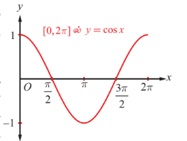
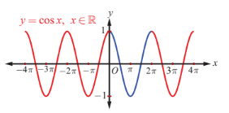
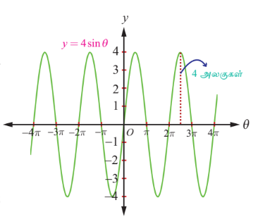
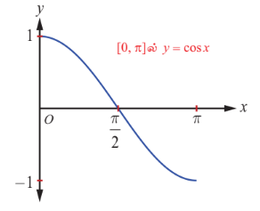
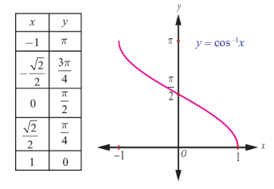

### 4.4 கொசைன் சார்பு மற்றும் நேர்மாறு கொசைன் சார்பு
### (The Cosine Function and Inverse Cosine Function)

$\mathbb{R}$ –ஐ சார்பகமாகவும் மற்றும் $[-1, 1]$ –ஐ வீச்சகமாகவும் கொண்ட சார்பே கொசைன் சார்பு ஆகும். கொசைன் சார்பை $y = \cos x$ எனவும் மற்றும் நேர்மாறு கொசைன் சார்பினை $y = \cos^{-1} x$ அல்லது $y = \arccos(x)$ எனவும் குறிப்பிடப்படுகின்றன. அனைத்து மெய்யெண்கள் $x$–க்கு $\cos(x + 2\pi) = \cos x$ என்பது மெய்யாகும். மேலும், $0 < p < 2\pi$, $x \in \mathbb{R}$ –க்கு $\cos(x + p)$ மற்றும் $\cos x$ ஆகியன சமமாக இருக்கவேண்டிய அவசியமில்லை. எனவே $y = \cos x$ -ன் காலம் $2\pi$ ஆகும்.

---

### 4.4.1 கொசைன் சார்பின் வரைபடம் (Graph of cosine function)

கொசைன் சார்பின் வரைபடமானது $y = \cos x$ –ன் வரைபடமாகும். இங்கு $x$ ஒரு மெய் எண்ணாகும். கொசைன் சார்பின் காலமுறை $2\pi$ என்பதால் $\ldots, [-4\pi, -2\pi], [-2\pi, 0], [0, 2\pi], [2\pi, 4\pi], [4\pi, 6\pi], \ldots$ ஆகிய இடைவெளிகளில் ஒவ்வொரு இடைவெளியிலும் கொசைன் சார்பின் வரைபடம் ஒரே வடிவத்தினை திரும்பவும் பெறுகின்றது. எனவே $x \in [0, 2\pi]$–க்கு உரிய கொசைன் சார்பு வரைபடத்தின் பகுதியைத் தீர்மானித்தாலே போதுமானது. $x \in [0, 2\pi]$ எனில் $y = \cos x$ ன் வரைபடத்தில் உள்ள $(x, y)$ புள்ளிகளில் அறிந்த சில புள்ளிகளை குறிப்பதற்கு கீழ்க்காணும் அட்டவணையை உருவாக்குவோம்.

| $x$ (ஆரையனில்) | $0$ | $\frac{\pi}{6}$ | $\frac{\pi}{4}$ | $\frac{\pi}{3}$ | $\frac{\pi}{2}$ | $\pi$ | $\frac{3\pi}{2}$ | $2\pi$ |
|---|---|---|---|---|---|---|---|---|
| $y = \cos x$ | $1$ | $\frac{\sqrt{3}}{2}$ | $\frac{1}{\sqrt{2}}$ | $\frac{1}{2}$ | $0$ | $-1$ | $0$ | $1$ |

**படம். 4.10**

$y = \cos x$, $0 \leq x \leq 2\pi$, ன் வரைபடம் $(0, 1)$ புள்ளியிலிருந்து தொடங்குகிறது என்பதை அட்டவனையிலிருந்து அறியலாம். $x$ ன் மதிப்பு $0$ முதல் $\pi$ வரை அதிகரிக்கும்போது, $y = \cos x$ -ன் மதிப்பும் $1$ முதல் $-1$ வரை குறைகின்றது. $x$ ன் மதிப்பு $\pi$ முதல் $2\pi$ வரை அதிகரிக்கும்போது, $y$ -ன் மதிப்பும் $-1$ முதல் $1$ வரை அதிகரிக்கின்றது. அட்டவணையிலுள்ள புள்ளிகளை வரைபடத்தில் குறித்து அவற்றை இணைக்கும் இழைவான வளைவரையை வரைக. $y = \cos x$ -ன் வரைபடத்தின் ஒரு பகுதியினை படம். 4.10-ல் காண்பிக்கப்பட்டுள்ளது.

**படம். 4.11**

$[0, 2\pi]$ இடைவெளியின் இருபுறமும் மேலே உள்ள வரைபடப் பகுதியை திரும்ப திரும்ப கொண்டிருக்கும் வகையில் $y = \cos x$ -ன் முழுவரைபடம் அமைந்திருக்கும். படம்.4.11–ல் கொசைன் சார்பின் முழு வரைபடம் கொடுக்கப்பட்டுள்ளது.

கொசைன் சார்பின் வரைபடத்திலிருந்து $\cos x$-ன் மதிப்பு முதல் காற்பகுதியில் $0 \leq x \leq \frac{\pi}{2}$ மிகையெண்ணாகவும், இரண்டாவது காற்பகுதியில் $\frac{\pi}{2} < x \leq \pi$ மற்றும் மூன்றாவது காற்பகுதியில் $\pi < x < \frac{3\pi}{2}$ ஆகியவற்றில் குறையெண்ணாகவும், மீண்டும் நான்காவது காற்பகுதியில் $\frac{3\pi}{2} < x < 2\pi$ மிகையெண்ணாகவும் உள்ளது என்பதை காண்கிறோம்.

### குறிப்பு

வரைபடத்திலிருந்து, அனைத்து $x$ மதிப்புகளுக்கும் $\cos(-x) = \cos x$ என அறியலாம். இது $y = \cos x$ ஒரு இரட்டைச் சார்பு என்பதை உறுதி செய்கிறது.

---

### 4.4.2 கொசைன் சார்பின் பண்புகள் (Properties of the cosine function)

$y = \cos x$ ன் வரைபடத்திலிருந்து கொசைன் சார்பின் பின்வரும் பண்புகளைக் காணலாம்.

(i) வளைவரையில் எங்கும் முறிவோ அல்லது தொடர்ச்சியின்மையோ இல்லை. கொசைன் சார்பு தொடர்ச்சியானது.

(ii) $y$ அச்சைப் பொறுத்து வரைபடம் சமச்சீராக இருப்பதால் கொசைன் சார்பு இரட்டைச் சார்பாகும்.

(iii) $x = \ldots, -2\pi, 0, 2\pi, \ldots$ ஆகிய மதிப்புகளில் கொசைன் சார்பு மீப்பெரு மதிப்பு $1$ ஐ அடைகிறது. $x = \ldots, -\pi, \pi, 3\pi, \ldots$ ஆகிய மதிப்புகளுக்கு கொசைன் சார்பு மீச்சிறு மதிப்பு $-1$ ஐ அடைகிறது. அதாவது, $-1 \leq \cos x \leq 1$, $x \in \mathbb{R}$ ஆகும்.

---

### குறிப்புரை

(i) $y = \cos x$ ன் வரைபடத்தை $\frac{\pi}{2}$ ஆரையன்கள் அளவிற்கு வலப்புறம் நகர்த்த, $y = \cos\left(x - \frac{\pi}{2}\right)$ -ன் வரைபடமாகப் பெறலாம். இந்த வரைபடம் $y = \sin x$ -ன் வரைபடத்துக்கு ஒப்பாக அமைகிறது. இங்கு $\cos\left(\frac{\pi}{2} - x\right) = \sin x$ என்பதை கவனிக்கவும்.

(ii) $y = A\sin\alpha x$ மற்றும் $y = B\cos\beta x$ ஆகியன முறையே $-A \leq A\sin\alpha x \leq A$ மற்றும் $-B \leq B\cos\beta x \leq B$ எனும் அசமன்பாடுகளைப் பூர்த்தி செய்கிறது. $y = A\sin\alpha x$ –ன் வீச்சு மற்றும் காலம் முறையே $A$ மற்றும் $\frac{2\pi}{\alpha}$ ஆகும். $y = B\cos\beta x$ –ன் வீச்சு மற்றும் காலம் முறையே $B$ மற்றும் $\frac{2\pi}{\beta}$ ஆகும். $y = A\sin\alpha x$ மற்றும் $y = B\cos\beta x$ ஆகியன சைன் வளைகோட்டுச் (Sinusoidal) சார்புகளாகும்.

(iii) $\left[0, \frac{2\pi}{\alpha}\right]$ மற்றும் $\left[0, \frac{2\pi}{\beta}\right]$ -ன் மீதான முறையே $y = A\sin\alpha x$ மற்றும் $y = B\cos\beta x$ ஆகியவற்றின் பகுதி வரைபடங்களை நீட்டிக்க $y = A\sin\alpha x$ மற்றும் $y = B\cos\beta x$ ஆகியவற்றின் முழு வரைப்படங்கள் பெறப்படுகின்றது.

---

### பயன்பாடுகள்

காலச் சுழற்சியில் நிகழும் நிகழ்வுகளான, பருவ வெப்பநிலை, கடல் அலைகள் போன்ற இயற்கை நிகழ்வுகள் திரும்ப திரும்ப நேர்வதால், சைன் வளைகோட்டைப் பயன்படுத்தி மாதிரிகள் வடிவமைக்கப்படுகின்றன. எடுத்துக்காட்டாக, சைன் வளைகோட்டுச் சார்பு $y = d + a\cos(b(t - c))$ -ஐ பயன்படுத்தி கடல் அலைகளை மாதிரியாக உருவாக்க கீழ்க்காணும் படிகள் தரப்படுகின்றன.

(i) சைன் வளைகோட்டு வரைபடத்தின் வீச்சு என்பது, வரைபடத்தில் $y$ - ன் மீப்பெரு மற்றும் மீச்சிறு மதிப்புகளின் வேறுபாட்டின் எண் மதிப்பில் பாதியாகும். அதாவது, வீச்சு, $a = \frac{1}{2}(\text{மீப்பெரு மதிப்பு} - \text{மீச்சிறு மதிப்பு})$;

மையக்கோடு $y = d$, இங்கு $d = \frac{1}{2}(\text{மீப்பெரு மதிப்பு} + \text{மீச்சிறு மதிப்பு})$.

(ii) காலம் $p = 2 \times$ (மீப்பெரு மதிப்பிலிருந்து மீச்சிறு மதிப்பிற்கு இடையேயுள்ள கால அளவு);
$b = \frac{2\pi}{p}$

(iii) $c = b \times$ (மீப்பெரு மதிப்பை அடையும் நேரம்).

### மாதிரி-1

ஒரு கப்பல்துறையின் எல்லையில் கடல் அலைகளினால் ஆழம் மாறுபடுகின்றது. கீழ்க்காணும் அட்டவணையில் வெவ்வேறு நேரங்களில் நீரின் ஆழம் (மீட்டரில்) கொடுக்கப்பட்டுள்ளது.

| நேரம், $t$ | 12 முற்பகல் | 2 முற்பகல் | 4 முற்பகல் | 6 முற்பகல் | 8 முற்பகல் | 10 முற்பகல் | 12 முற்பகல் |
|---|---|---|---|---|---|---|---|
| ஆழம் | 3.5 | 4.2 | 3.5 | 2.1 | 1.4 | 2.1 | 3.5 |

$t$ நேரத்தில் நீரின் ஆழத்தைக் காண $y = d + a\cos(bt - c)$ எனும் வடிவில் ஒரு சைன் வளைகோட்டுச் சார்பினை கருதுவோம். இங்கு, $a = 1.4$, $d = 2.8$, $p = 12$, $b = \frac{\pi}{6}$, $c = \frac{\pi}{3}$.

தேவைப்படும் சைன் வளைகோட்டுச் சார்பு $y = 2.8 + 1.4\cos\left(\frac{\pi}{6}t - \frac{\pi}{3}\right)$ என ஆகும்.

### குறிப்பு

சைன் மற்றும் கொசைன் சார்புகளின் உருமாற்றங்கள் எண்ணற்ற பயன்பாடுகளுக்குப் பயன்படுகின்றன. சைன் அல்லது கொசைன் சார்பினைப் பயன்படுத்தி ஒரு வட்ட இயக்க மாதிரி ஒன்றை உருவாக்க முடியும்.

### மாதிரி-2

ஆதியை மையமாகவும் ஆரம் 4 ம் உள்ள ஒரு வட்டப்பாதையில் ஒரு புள்ளி நகர்கிறது. சுழலும் கோண சுழற்சியை சார்பாகக் கொண்டு அப்புள்ளியின் $y$-ஆயக்கூறை காணலாம்.

ஆதியை மையமாகக் கொண்டும் ஆரம் 4 ம் உள்ள ஒரு வட்டத்தின் மீதுள்ள புள்ளியின் $y$-ஆயக்கூறு, $y = a\sin\theta$ ஆகும், இங்கு $\theta$ என்பது சுழலும் கோண சுழற்சி. இங்கு $y(\theta) = 4\sin\theta$ எனும் சமன்பாடு கிடைக்கிறது. (இங்கு $\theta$ ஆரையன், வீச்சு 4 மற்றும் காலம் $2\pi$ ஆகும்) வீச்சு 4 என்பதால் சைன் சார்பின் $y$ மதிப்புகள் 4 காரணியாக செங்குத்தாக நீளத்தை நீள்கிறது.

**படம். 4.12**

### 4.4.3 நேர்மாறு கொசைன் சார்பு மற்றும் அதன் பண்புகள்
### (The inverse cosine function and its properties)

கொசைன் சார்பு அதன் முழு சார்பகம் $\mathbb{R}$ -ல் ஒன்றுக்கொன்று அல்ல. எனினும் கட்டுபடுத்தப்பட்ட சார்பகம் $[0, \pi]$ மீது கொசைன் சார்பு ஒன்றுக்கொன்று சார்பாகும் மற்றும் அதன் வீச்சகம் $[-1, 1]$ ஆகும். தற்போது $[-1, 1]$-ஐ சார்பகமாகவும் மற்றும் $[0, \pi]$ –ஐ வீச்சகமாகவும் கொண்டு நேர்மாறு கொசைன் சார்பை வரையறை செய்யலாம்.

### வரையறை 4.4

$-1 \leq x \leq 1$ -ல், $\cos^{-1} x$ ஆனது $[0, \pi]$ -ல் தனித்த $y$ –ஆக $\cos y = x$ எனுமாறு வரையறுக்கப்படுகிறது.

அதாவது $\cos^{-1} : [-1, 1] \rightarrow [0, \pi]$ எனும் நேர்மாறு கொசைன் சார்பு, $\cos^{-1} x = y$ என வரையறுக்கத் தேவையானதும் மற்றும் போதுமானதுமான நிபந்தனை $\cos y = x$ மற்றும் $y \in [0, \pi]$ ஆகும்.

### குறிப்பு

(i) $\cos^{-1} x$ -ன் வீச்சகமான $[0, \pi]$ எனும் இடைவெளியில் சைன் சார்பு குறையற்ற எண் மதிப்பைக் கொண்டுள்ளது. இந்த முடிவு, தொகை நுண்கணிதத்தில் சில முக்கோணவியல் பிரதியிடலுக்கு முக்கியமாகப் பயன்படுத்தப்படுகிறது.

(ii) நேர்மாறு கொசைன் சார்பைப் பற்றிக் குறிப்பிடும்போதெல்லாம் $\cos : [0, \pi] \rightarrow [-1, 1]$ மற்றும் $\cos^{-1} : [-1, 1] \rightarrow [0, \pi]$ என நினைவில் கொள்ள வேண்டும்.

(iii) $\ldots, [-2\pi, -\pi], [0, \pi], [\pi, 2\pi], \ldots$ ஆகிய இடைவெளிகளில் ஏதேனும் ஒரு இடைவெளியை கொசைன் சார்பின் சார்பகமாக கட்டுப்படுத்தலாம். அவ்வாறாக இடைவெளிகளிலும் கொசைன் சார்பு ஒன்றுக்கொன்றான சார்பாகவும் மற்றும் $[-1, 1]$ என்பது அதன் வீச்சாகவும் இருக்கும். கட்டுப்படுத்தப்பட்ட இடைவெளி $[0, \pi]$ ஆனது கொசைன் சார்பின் முதன்மை சார்பகம் எனவும், $-1 \leq x \leq 1$ -ல் சார்பு $y = \cos^{-1} x$ எனும் சார்பின் மதிப்புகள் முதன்மை மதிப்புகள் எனவும் அழைக்கப்படுகிறது.

$y = \cos^{-1} x$ எனும் வரையறையிலிருந்து பின்வரும் கருத்துகளைக் கவனிக்கவும்.

(i) $-1 \leq x \leq 1$ மற்றும் $0 \leq y \leq \pi$ என்றிருக்கும்போது $y = \cos^{-1} x$ எனில், எனில் மட்டுமே $x = \cos y$ ஆகும்.

(ii) $|x| \leq 1$ எனில் $\cos(\cos^{-1} x) = x$ ஆகும். $|x| > 1$ எனும்போது $\cos(\cos^{-1} x)$ என்பது அர்த்தமற்றதாகிறது.

(iii) $\cos^{-1} x$ -ன் வீச்சகமான $0 \leq x \leq \pi$ ல் $\cos^{-1}(\cos x) = x$ என ஆகும். $\cos^{-1}(\cos 3\pi) = \pi$ என்பதனை கவனிக்கவும்.

---

### 4.4.4 நேர்மாறு கொசைன் சார்பின் வரைபடம் (Graph of the inverse cosine function)

$\cos^{-1} : [-1, 1] \rightarrow [0, \pi]$ எனும் நேர்மாறு கொசைன் சார்பு $[-1, 1]$ இடைவெளியில் $x$ எனும் மெய்யெண்ணை உள்ளீடாகக் கொண்டு $[0, \pi]$ இடைவெளியில் $y$ (ஆரையன்களில்) எனும் மெய்யெண்ணை வெளியீடாக தருகிறது. $y = \cos^{-1} x$ சமன்பாட்டைப் பயன்படுத்தி $(x, y)$ எனும் சில புள்ளிகளைக் கண்டறிந்து $xy$ தளத்தில் குறிப்போம். $x$–ன் மதிப்பு $-1$ லிருந்து $1$ வரை அதிகரிக்கும்போது $y$–ன் மதிப்பு $\pi$ லிருந்து $0$ வரை குறைகின்றது. நேர்மாறு கொசைன் சார்பு அதன் சார்பகத்தில் குறையும் சார்பாகவும் மற்றும் தொடர்ச்சியானதாகவும் இருக்கிறது. இப்புள்ளிகளை இழைவான வளைவரையால் இணைக்கும்போது படம் 4.14–ல் காண்பதைப் போன்று $y = \cos^{-1} x$ எனும் வரைபடம் நமக்கு கிடைக்கின்றது.

**படம். 4.13**

**படம். 4.14**

### குறிப்பு

(i) $y = \cos^{-1} x$ ன் வரைபடமானது, $y = \cos x$ ன் வரைபடத்தின் $x$ மற்றும் $y$ அச்சுகளை இடமாற்றுவதன் மூலமாகவும் பெறலாம்.

(ii) $y = \cos^{-1} x$ எனும் சார்பின் $x$ -வெட்டுத்துண்டு $1$ மற்றும் $y$ -வெட்டுத்துண்டு $\frac{\pi}{2}$ ஆகும்.

(iii) ஆதியைப் பொறுத்தோ அல்லது $y$ -அச்சைப் பொறுத்தோ $y = \cos^{-1} x$ -ன் வரைபடம் சமச்சீர் அல்ல. எனவே சார்பு $y = \cos^{-1} x$ இரட்டைச் சார்போ அல்லது ஒற்றைச் சார்போ அல்ல.

### எடுத்துக்காட்டு 4.5

$\cos^{-1}\left(\frac{\sqrt{3}}{2}\right)$ -ன் முதன்மை மதிப்பைக் காண்க.

### தீர்வு

$\cos^{-1}\left(\frac{\sqrt{3}}{2}\right) = y$ என்க. எனவே, $\cos y = \frac{\sqrt{3}}{2}$ ஆகும்.

$y = \cos^{-1} x$ -ன் முதன்மை மதிப்பு வீச்சகம் $[0, \pi]$ என நாம் அறிவோம். எனவே, $\cos y = \frac{\sqrt{3}}{2}$ எனும்படி $y$ மதிப்பு $[0, \pi]$ -ல் காண வேண்டும். ஆனால், $\cos\frac{\pi}{6} = \frac{\sqrt{3}}{2}$ மற்றும் $\frac{\pi}{6} \in [0, \pi]$ என்பதால் $y = \frac{\pi}{6}$ ஆகும். எனவே, $\cos^{-1}\left(\frac{\sqrt{3}}{2}\right)$ -ன் முதன்மை மதிப்பு $\frac{\pi}{6}$ ஆகும்.

---

### எடுத்துக்காட்டு 4.6

மதிப்பு காண்க

(i) $\cos^{-1}\left(-\frac{1}{2}\right)$  
(ii) $\cos^{-1}\left(\cos\left(-\frac{\pi}{3}\right)\right)$  
(iii) $\cos^{-1}\left(\cos\frac{7\pi}{6}\right)$

### தீர்வு

$\cos^{-1} : [-1, 1] \rightarrow [0, \pi]$ எனும் நேர்மாறு கொசைன் சார்பு வரையறையின்படி, $\cos^{-1} x = y$ எனில், எனில் மட்டுமே $\cos y = x$. இங்கு $-1 \leq x \leq 1$ மற்றும் $0 \leq y \leq \pi$ ஆகையால்,

(i) $\cos^{-1}\left(-\frac{1}{2}\right) = \frac{3\pi}{4}$, ஏனெனில் $\frac{3\pi}{4} \in [0, \pi]$ மற்றும் $\cos\frac{3\pi}{4} = -\cos\frac{\pi}{4} = -\frac{1}{\sqrt{2}}$.

(ii) $\cos^{-1}\left(\cos\left(-\frac{\pi}{3}\right)\right) = \cos^{-1}\left(\cos\frac{\pi}{3}\right) = \frac{\pi}{3}$, ஏனெனில் $-\frac{\pi}{3} \notin [0, \pi]$, ஆனால் $\frac{\pi}{3} \in [0, \pi]$.

(iii) $\cos^{-1}\left(\cos\frac{7\pi}{6}\right) = \frac{5\pi}{6}$, ஏனெனில் $\cos\frac{7\pi}{6} = \cos\left(\pi + \frac{\pi}{6}\right) = -\cos\frac{\pi}{6} = -\frac{\sqrt{3}}{2}$ மற்றும் $\cos\frac{5\pi}{6} = -\cos\frac{\pi}{6} = -\frac{\sqrt{3}}{2}$; $\frac{5\pi}{6} \in [0, \pi]$.

---

### எடுத்துக்காட்டு 4.7

$\cos^{-1}\left(\frac{2 + \sin x}{3}\right)$ -ன் சார்பகம் காண்க.

### தீர்வு

$y = \cos^{-1} x$ -ன் சார்பகம் $-1 \leq x \leq 1$ அதாவது $|x| \leq 1$ ஆகும்.

எனவே, $-1 \leq \frac{2 + \sin x}{3} \leq 1$ என்பதை $-3 \leq 2 + \sin x \leq 3$ எனலாம்.

எனவே, $-5 \leq \sin x \leq 1$ என்பதை சுருக்கி, $-1 \leq \sin x \leq 1$ எனப் பெறலாம்,

$-\sin^{-1}(1) \leq x \leq \sin^{-1}(1)$ அல்லது $-\frac{\pi}{2} \leq x \leq \frac{\pi}{2}$ எனப் பெறலாம்.

ஆகையால் $\cos^{-1}\left(\frac{2 + \sin x}{3}\right)$ -ன் சார்பகம் $\left[-\frac{\pi}{2}, \frac{\pi}{2}\right]$ ஆகும்.

### பயிற்சி 4.2

1. அனைத்து $x$ -ன் மதிப்புகளையும் காண்க

   (i) $-6\pi \leq x \leq 6\pi$ மற்றும் $\cos x = 0$  
   (ii) $-5\pi \leq x \leq 5\pi$ மற்றும் $\cos x = -1$.

2. $\cos^{-1}\left(\cos\left(-\frac{\pi}{6}\right)\right) \neq -\frac{\pi}{6}$ என இருப்பதற்கான காரணத்தைக் கூறுக.

3. $\cos^{-1}(\cos x) = -\cos^{-1}(x)$ என்பது மெய்யாகுமா? விடைக்கு தக்க காரணம் கூறுக.

4. $\cos^{-1}\left(\frac{1}{2}\right)$ -ன் முதன்மை மதிப்புக் காண்க.

5. மதிப்பு காண்க

   (i) $2\sin^{-1}\left(\frac{1}{2}\right) + \cos^{-1}\left(\frac{1}{2}\right)$  
   (ii) $\sin^{-1}\left(\frac{1}{2}\right) + \cos^{-1}(-1)$  
   (iii) $\cos^{-1}\left(\cos\frac{7\pi}{17}\right) + \sin^{-1}\left(\sin\frac{7\pi}{17}\right)$.

6. சார்பகம் காண்க

   (i) $f(x) = \sin^{-1}\left(\frac{x - 2}{3}\right) + \cos^{-1}\left(\frac{x - 1}{4}\right)$  
   (ii) $g(x) = \sin^{-1} x + \cos^{-1} x$.

7. $x$ -ன் எந்த மதிப்பிற்கு, சமனிலை

   $\frac{\pi}{2} < \cos^{-1}(3x - 1) < \pi$

   மெய்யாகும்?

8. மதிப்பு காண்க

   (i) $\cos^{-1}\left(\frac{4}{5}\right) + \sin^{-1}\left(\frac{4}{5}\right)$  
   (ii) $\cos^{-1}\left(\cos\left(\frac{4\pi}{3}\right)\right)$.