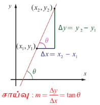
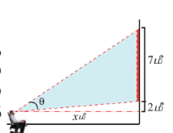
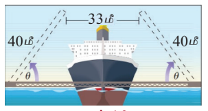

### 4.1 அறிமுகம் (Introduction)

நம் அன்றாட வாழ்க்கையில் அளவீட்டுக் கருவிகளைக் கொண்டு அளவிட முடியாத கணக்குகளுக்கு மறைமுக அளவீடுகளால் தீர்வு காணப்படுகிறது. மலைகள் மற்றும் உயரமான கட்டிடங்களின் உயரங்களை அளவீட்டுக் கருவிகளைக் கொண்டு கண்டறிய இயலாதபோது அவைகளைக் கண்டறிய முக்கோணவியல் நமக்கு உதவுகிறது. பொறியியல் மற்றும் இயற்பியல் உள்ளிட்ட இதர அறிவியல் பிரிவுகளில் முக்கோணவியல் சார்புகளும் மற்றும் அவற்றின் நேர்மாறு முக்கோணவியல் சார்புகளும் பரவலாகப் பயன்படுத்தப்படுகிறது. மேலும் இச்சார்புகள், ஒரு செங்கோண முக்கோணத்தில் இரு பக்கங்களின் நீளங்களை மட்டுமே அறிந்து அம்முக்கோணத்திற்கு தீர்வு காணும் கணக்குகளில் மட்டுமல்லாமல்,

$$\int \frac{1}{\sqrt{a^2 - x^2}} dx, \quad \int \frac{1}{x^2 + a^2} dx$$

போன்ற குறிப்பிட்ட தொகையிடல் கணக்குகளுக்கு தீர்வு காண உதவுகின்றன. சைன் சார்பின் நேர்மாறு முக்கோணவியல் சைன் சார்பான $\arcsin(x)$ -க்கு $\sin^{-1} x$ எனும் குறியீட்டை முதல் முறையாக ஆங்கில கணிதவியலாளர் ஜான் F.W. ஹெர்சே (1792-1871) (John F.W. Herschel) என்பவர் அறிமுகப்படுத்தினார். 1826-ல் தன் தந்தையுடன் சேர்ந்து பணியாற்றி சாதனை செய்தமைக்காக இராயல் வானவியல் கழகத்தின் தங்க பதக்கம் இவருக்கு அளிக்கப்பட்டது.

மின் சாதன அலைவு காட்டி (Oscilloscope) எனும் கருவி சைன் சார்பின் வளைவரைகளைப் போன்று மின் சமிக்கைகளை வரைபடங்களாக மாற்றுகிறது. கட்டுப்பாட்டுக் கருவிகளைக் கொண்டு சைன் வளைவரையின் வீச்சு, கால அளவு மற்றும் நிலை மாற்றத்தை மாற்றலாம். மனித உடலின் இதயத்துடிப்புகளை அளவிடுதல் போன்று பல்வேறு பயன்பாடுகளில் அலைவுக்காட்டிக்கருவி பயன்படுத்தப்படுகிறது. அத்தகைய பயன்பாடுகளில் முக்கோணவியலின் சார்புகள் முக்கிய பங்கு வகிக்கிறது.

நேர்மாறு முக்கோணவியல் சார்புகளை சில எளிய எடுத்துக்காட்டுகளின் மூலம் விளக்குவோம்.

### விளக்க எடுத்துக்காட்டு - 1 (சாய்வு கணக்கு)

$y = mx + b$ எனும் நேர்கோட்டைக் கருதுக. $x$ அச்சுடன் நேர்க்கோடு ஏற்படுத்தும் கோணம் $\theta$ -ஐ சாய்வு $m$ மூலம் காண்போம். ஒரு சார்பின் சாய்வு என்பது அதன் மாறு வீதமாக வரையறுக்கப்படும். சாய்வு அல்லது சாய்வு விகிதம் பொதுவாக $m = \frac{\Delta y}{\Delta x}$ எனக் கணக்கிடப்படுகிறது. படத்திலுள்ள செங்கோண முக்கோணத்திலிருந்து,

$$\tan\theta = \frac{\Delta y}{\Delta x}.$$

எனவே, $\tan\theta = m$. இங்கு $\theta$ வின் மதிப்பைக் கண்டறிய முக்கோணவியல் சார்பின் நேர்மாறு தேவைப்படுகிறது. இதனை "நேர்மாறு தொடுகோட்டுச் சார்பு (inverse tangent function)" என்போம்.

**படம். 4.1**

### விளக்க எடுத்துக்காட்டு - 2 (திரைப்பட அரங்கின் திரைகள்)

திரையரங்கத்தின் திரை 7 மீட்டர் உயரம் கொண்டது என்க. ஒருவர் அமர்ந்த நிலையில் திரையின் அடிபகுதியானது பார்வை மட்டத்திற்கு 2 மீட்டர் உயரத்தில் உள்ளது. பார்வையிலிருந்து திரையின் அடிமட்டம் வரை வரையப்படும் கிடைமட்ட கோட்டிற்கும், பார்வையிலிருந்து திரையின் முகட்டிற்கு வரையப்படும் நேர்க்கோட்டிற்கும் இடையே ஏற்படும் கோணம் பார்வைக் கோணம் என்க. படத்தில், $\theta$ என்பது பார்வைக்கோணமாகும். திரையிலிருந்து $x$ மீட்டர் தூரத்தில் ஒருவர் அமர்ந்திருப்பதாக கொள்வோம். பார்வைக் கோணம் $\theta$ -ஐக் கண்டறிய பயன்படும் சார்பு

$$\theta(x) = \tan^{-1}\left(\frac{9}{x}\right) - \tan^{-1}\left(\frac{2}{x}\right)$$

இங்கு பார்வைக் கோணம் $\theta$ என்பது $x$-ன் சார்பு என்பதை கவனிக்க.

**படம். 4.2**

### விளக்க எடுத்துக்காட்டு - 3 (இழுப்புப் பாலம்)

படத்தில் காண்பது போன்ற இரட்டை மடிப் பலகு இழுப்புப் பாலம் ஒன்றினைக் கருதுவோம். ஒவ்வொரு மடிப்பலகும் 40 மீட்டர் நீளம் கொண்டது. 33 மீட்டர் அகலமுடைய கப்பல் ஒன்று பாலத்தைக் கடக்க வேண்டும். பாலத்தைக் கப்பல் கடக்க, ஒவ்வொரு மடிப்பலகும் திறப்பதற்கு ஏற்படுத்தும் மீச்சிறு கோணம் $\theta$ -ஐக் கண்டறிய நேர்மாறு முக்கோணவியல் சார்பு பயன்படுகிறது.

அலகு வட்டத்தினைப் பயன்படுத்தி, மெய்யெண்களின் முக்கோணவியல் சார்புகள் (இங்கு ஆரையனில் கோணங்கள் மதிப்பிடப்படுகின்றன) குறித்து பதினொன்றாம் வகுப்பில் படித்தோம். இப்பாடப்பகுதியில், நேர்மாறு முக்கோணவியல் சார்புகள், அதன் வரைபடங்கள் மற்றும் பண்புகளைப் பற்றி கற்றறிவோம். வழக்கம் போல் $\mathbb{R}$ மற்றும் $\mathbb{Z}$ என்பவை முறையே மெய்யெண்களின் கணத்தையும் மற்றும் முழுவெண்களின் கணத்தையும் குறிக்கின்றன.

ஆறு முக்கோணவியல் சார்புகளின் காலவட்ட ஒழுங்குடைமை (periodicity), சார்பகம் (domain) மற்றும் வீச்சகம் (range) முதலியனவற்றின் வரையறைகளை நினைவுகூர்வோம்.

**படம். 4.3**

### கற்றலின் நோக்கங்கள்

இப்பாடப்பகுதி நிறைவுறும்போது, மாணவர்கள் அறிந்திருக்க வேண்டியவைகள்:

- நேர்மாறு முக்கோணவியல் சார்புகளின் வரையறைகள்
- நேர்மாறு முக்கோணவியல் சார்புகளின் முதன்மை மதிப்புகளை மதிப்பிடும் விதம்
- முக்கோணவியல் சார்புகள் மற்றும் அதன் நேர்மாறு சார்புகளின் வரைபடங்கள் வரையும் விதம்
- நேர்மாறு முக்கோணவியல் சார்புகளின் பண்புகளைப் பயன்படுத்துதல் மற்றும் சில கோவைகளின் மதிப்புகளைக் கண்டறிதல்