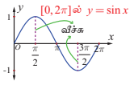
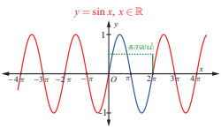
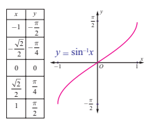
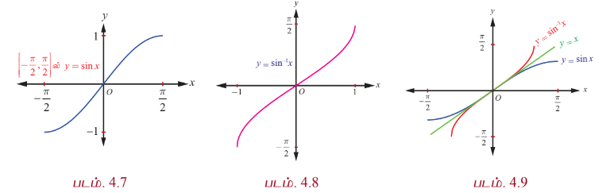

### 4.3 சைன் சார்பு மற்றும் நேர்மாறு சைன் சார்பு
### (Sine Function and Inverse Sine Function)

$\mathbb{R}$ –ஐ சார்பகமாகவும் மற்றும் $[-1, 1]$ –ஐ வீச்சகமாகவும் கொண்டதே சைன் சார்பு என்பதை நினைவு கூர்வோம். சைன் சார்பை $y = \sin x$ எனவும் மற்றும் நேர்மாறு சைன் சார்பை $y = \sin^{-1} x$ அல்லது $y = \arcsin(x)$ எனவும் குறிப்பிடுவோம். இங்கு $-1$ எனும் குறியீடு படிக்குறி அன்று. மேலும் இக்குறியீடு நேர்மாறைக் குறிக்கிறதே அன்றி தலைகீழியை அல்ல.

அனைத்து மெய்யெண்கள் $x$ –க்கும் $\sin(x + 2\pi) = \sin x$ என்பது மெய்யாகிறது. மேலும் $0 < p < 2\pi$ –இல் $\sin(x + p)$ –ன் மதிப்பு $\sin x$ –க்கு சமமாக இருக்க வேண்டிய அவசியமில்லை. எனவே, சைன் சார்பின் கால முறை $2\pi$ ஆகும்.

---

### 4.3.1 சைன் சார்பின் வரைபடம் (The graph of sine function)

சைன் சார்பின் வரைபடமானது $y = \sin x$ என்பதன் வரைபடமாகும். இங்கு $x$ ஒரு மெய்யெண்ணாகும். சைன் சார்பின் காலம் $2\pi$ என்பதால், பின்வரும் ஒவ்வொரு இடைவெளியிலும் $\ldots, [-2\pi, 0], [0, 2\pi], [2\pi, 4\pi], [4\pi, 6\pi], \ldots$ சைன் சார்பின் வரைபடம் ஒரே வடிவத்தில் அமைகின்றது. எனவே $x \in [0, 2\pi]$ - எனும் மதிப்புகளுக்கு மட்டும் வரைபடத்தை தீர்மானித்தாலே போதுமானதாகும். $x \in [0, 2\pi]$ எனில் $y = \sin x$ ன் வரைபடத்தில் உள்ள $(x, y)$ புள்ளிகளில் அறிந்த சில புள்ளிகளின் மதிப்புகளைக் காண கீழ்க்காணும் அட்டவணையை உருவாக்குவோம்.

| $x$ (ஆரையனில்) | $0$ | $\frac{\pi}{6}$ | $\frac{\pi}{4}$ | $\frac{\pi}{3}$ | $\frac{\pi}{2}$ | $\pi$ | $\frac{3\pi}{2}$ | $2\pi$ |
|---|---|---|---|---|---|---|---|---|
| $y = \sin x$ | $0$ | $\frac{1}{2}$ | $\frac{1}{\sqrt{2}}$ | $\frac{\sqrt{3}}{2}$ | $1$ | $0$ | $-1$ | $0$ |

**படம். 4.4**

அட்டவணையின்படி $y = \sin x$, $0 \leq x \leq 2\pi$, இன் வரைபடம் ஆதியிலிருந்து தொடங்குகிறது என்பது தெளிவாகிறது. $0$ முதல் $\frac{\pi}{2}$ வரை மதிப்பு அதிகரிக்கும்போது, $y = \sin x$ -ன் மதிப்பும் $0$ முதல் $1$ வரை அதிகரிக்கின்றது.

$\frac{\pi}{2}$ முதல் $\pi$ வரை ன் மதிப்பு அதிகரித்து, தொடர்ந்து $\frac{3\pi}{2}$ வரையிலும் அதிகரிக்கும்போது $y$ ன் மதிப்பு $1$ முதல் $0$ வரை குறைகிறது, அதனை தொடர்ந்து $-1$ க்கு குறைகிறது. $\frac{3\pi}{2}$ முதல் $2\pi$ வரை $x$ ன் மதிப்பு அதிகரிக்கும்போது $y$ ன் மதிப்பு $-1$ முதல் $0$ வரை அதிகரிக்கிறது. அட்டவணையிலுள்ள புள்ளிகளை வரைபடத்தில் குறித்து இழைவான வளைவரை வரைக. வரைபடத்தின் ஒரு பகுதி படம்.4.4-ல் காண்பிக்கப்பட்டுள்ளது.

$y = \sin x$ என்பது $2\pi$ காலம் கொண்டது என்பதால், $y = \sin x$ -ன் முழு வளைவரையில் $[0, 2\pi]$ இடைவெளியில் அமைந்த வரைபடமே இருமருங்கும் திரும்ப திரும்ப அமைந்துள்ளது. படம். 4.5 –ல் சைன் சார்பின் முழு வரைபடம் காண்பிக்கப்பட்டுள்ளது. $0$ முதல் $2\pi$ வரையுள்ள சைன் வளைவரையின் பகுதியை ஒரு சுழற்சி என்போம். அதன் வீச்சு $1$ ஆகும்.

**படம். 4.5**

### குறிப்பு

$0 \leq x \leq \pi$ -ல் முதல் மற்றும் இரண்டாம் காற்பகுதியில் சைன் சார்பின் மதிப்புகளுக்கு $\sin x \geq 0$ ஆகும். $\pi < x < 2\pi$ -ல் மூன்றாம் மற்றும் நான்காம் காற்பகுதியில் சைன் மதிப்புகளுக்கு $\sin x < 0$ ஆகும்.

---

### 4.3.2 சைன் சார்பின் பண்புகள் (Properties of the sine function)

$y = \sin x$ ன் வரைபடத்திலிருந்து கீழ்க்காணும் சைன் சார்பின் பண்புகளைப் பற்றி காணலாம்.

(i) வளைவரையில் தொடர்ச்சியின்மையோ அல்லது முறிவுகளோ இல்லை. சைன் சார்பு தொடர்ச்சியானது.

(ii) வரைபடம் ஆதிபுள்ளியைப் பொறுத்து சமச்சீராக இருப்பதால் சைன் சார்பு ஒற்றைச் சார்பாகும்.

(iii) சைன் சார்பின் மீப்பெரு மதிப்பு $1$ ஐ $x = \ldots, -\frac{3\pi}{2}, \frac{\pi}{2}, \frac{5\pi}{2}, \ldots$ ஆகிய மதிப்புகளில் பெறுகிறது. மீச்சிறு மதிப்பு $-1$ ஐ $x = \ldots, -\frac{\pi}{2}, \frac{3\pi}{2}, \frac{7\pi}{2}, \ldots$ ஆகிய மதிப்புகளில் பெறுகிறது. மாறாக அனைத்து $x \in \mathbb{R}$ க்கும் $-1 \leq \sin x \leq 1$ எனக்கூறலாம்.

---

### 4.3.3 நேர்மாறு சைன் சார்பு மற்றும் அதன் பண்புகள்

#### (The inverse sine function and its properties)

சைன் சார்பானது அதன் முழு சார்பகம் $\mathbb{R}$ -ல் ஒன்றுக்கொன்றானது அல்ல. இதனை $y = b$, $-1 \leq b \leq 1$ எனும் ஒவ்வொரு கிடைமட்டக்கோடும் $y = \sin x$ -ன் வரைபடத்தினை எண்ணற்ற முறை வெட்டுவதைக் கொண்டு இதனை நாம் அறியலாம். அதாவது, ஒன்றுக்கொன்றான சார்பா என சோதிக்கும் கருவியான கிடைமட்டச் சோதனையில் சைன் சார்பு தோல்வியடைகிறது. $\left[-\frac{\pi}{2}, \frac{\pi}{2}\right]$ என சைன் சார்பின் சார்பகம் கட்டுபடுத்தப்பட்டால், அதன் வீச்சகம் $[-1, 1]$ என்பதோடு மட்டுமில்லாமல் சைன் சார்பு ஒன்றுக்கொன்று மற்றும் மேற்கோர்த்தலாகவும் இருக்கிறது. தற்போது $[-1, 1]$-ஐ சார்பகமாகவும் $\left[-\frac{\pi}{2}, \frac{\pi}{2}\right]$ –ஐ வீச்சகமாகவும் கொண்டு நேர்மாறு சைன் சார்பை வரையறை செய்யலாம்.

### வரையறை 4.3

$-1 \leq x \leq 1$ -ல், $\sin^{-1} x$ -ஐ $y \in \left[-\frac{\pi}{2}, \frac{\pi}{2}\right]$ எனும் தனித்த எண்ணை $\sin y = x$ எனுமாறு வரையறுக்கப்படுகிறது. அதாவது, $\sin^{-1} : [-1, 1] \rightarrow \left[-\frac{\pi}{2}, \frac{\pi}{2}\right]$ எனும் நேர்மாறு சைன் சார்பை, $\sin^{-1}(x) = y$ என வரையறுக்கத் தேவையானதும் மற்றும் போதுமானதுமான நிபந்தனை $\sin y = x$ மற்றும் $y \in \left[-\frac{\pi}{2}, \frac{\pi}{2}\right]$ ஆகும்.

---

### குறிப்பு

(i) $\left[-\frac{\pi}{2}, \frac{\pi}{2}\right]$ எனும் கட்டுபடுத்தப்பட்ட சார்பகத்தில் சைன் சார்பு ஒன்றுக்கொன்று ஆகும். ஆனால், பூஜ்ஜியத்தை உள்ளடக்கிய இதனை விடப் பெரிய இடைவெளியில் சைன் சார்பு ஒன்றுக்கொன்று சார்பாகாது.

(ii) $\sin^{-1} x$ –ன் வீச்சகமான $\left[-\frac{\pi}{2}, \frac{\pi}{2}\right]$ –ல் கொசைன் சார்பு குறையற்ற எண் மதிப்பைப் பெறுகிறது. இந்த முடிவு, தொகை நுண்கணிதத்தில் சில முக்கோணவியல் பிரதியிடலில் முக்கியமாகப் பயன்படுத்தப்படுகிறது.

(iii) சைன் சார்பின் நேர்மாறைப் பற்றி குறிப்பிடும்போதெல்லாம், $\sin : \left[-\frac{\pi}{2}, \frac{\pi}{2}\right] \rightarrow [-1, 1]$ மற்றும் $\sin^{-1} : [-1, 1] \rightarrow \left[-\frac{\pi}{2}, \frac{\pi}{2}\right]$ என நினைவில் கொள்ள வேண்டும்.

(iv) $\ldots, \left[-\frac{5\pi}{2}, -\frac{3\pi}{2}\right], \left[-\frac{3\pi}{2}, -\frac{\pi}{2}\right], \left[\frac{\pi}{2}, \frac{3\pi}{2}\right], \left[\frac{3\pi}{2}, \frac{5\pi}{2}\right], \ldots$ ஆகிய இடைவெளிகளில் ஏதேனும் ஒரு இடைவெளியை சைன் சார்பின் சார்பகமாகக் கட்டுப்படுத்தலாம். அவ்வாறான இடைவெளிகளிலும் சைன் சார்பு ஒன்றுக்கொன்றான சார்பாகவும் மற்றும் $[-1, 1]$ என்பது அதன் வீச்சாகவும் இருக்கும்.

(v) கட்டுப்படுத்தப்பட்ட இடைவெளி $\left[-\frac{\pi}{2}, \frac{\pi}{2}\right]$ ஆனது சைன் சார்பின் முதன்மை சார்பகம் (principal domain) எனவும், $-1 \leq x \leq 1$ -ல் $y = \sin^{-1} x$ எனும் சார்பின் மதிப்புகள் முதன்மை மதிப்புகள் (principal value) எனவும் அழைக்கப்படுகிறது.

---

$y = \sin^{-1} x$ -ன் வரையறையிலிருந்து பின்வருவனவற்றை அறிந்து கொள்ளவும்.

(i) $-1 \leq x \leq 1$ மற்றும் $-\frac{\pi}{2} \leq y \leq \frac{\pi}{2}$ என்றிருக்கும்போது, $y = \sin^{-1} x$ எனில், எனில் மட்டுமே $x = \sin y$ ஆகும்.

(ii) $|x| \leq 1$ எனில் $\sin(\sin^{-1} x) = x$ ஆகும். $|x| > 1$ எனும்போது $\sin(\sin^{-1} x)$ அர்த்தமற்றதாகிறது.

(iii) $-\frac{\pi}{2} \leq x \leq \frac{\pi}{2}$ எனில் $\sin^{-1}(\sin x) = x$ ஆகும். $\sin^{-1}(\sin 2\pi) = 0 \neq 2\pi$ என்பதனைக் கவனத்தில் கொள்க.

(iv) $\frac{\pi}{2} \leq x \leq \frac{3\pi}{2}$ எனில், $\sin^{-1}(\sin x) = \pi - x$ ஆகும். $\frac{\pi}{2} \leq x \leq \frac{3\pi}{2}$ எனும்போது $-\frac{\pi}{2} \leq \pi - x \leq \frac{\pi}{2}$ எனக் கிடைக்கும் என்பதனைக் கவனிக்கவும்.

(v) $y = \sin^{-1} x$ என்பது ஒற்றைச் சார்பாகும்.

### குறிப்புரை

$\sin x = \frac{1}{2}$ மற்றும் $x = \sin^{-1}\left(\frac{1}{2}\right)$ ஆகிய சமன்பாடுகளுக்கு இடையே உள்ள வேறுபாட்டைக் காண்போம். $\sin x = \frac{1}{2}$ எனும் சமன்பாட்டைத் தீர்க்கவேண்டும் எனில் $(-\infty, \infty)$ எனும் இடைவெளியில் $\sin x = \frac{1}{2}$ எனுமாறு உள்ள அனைத்து $x$ மதிப்புகளையும் கண்டறிய வேண்டும். ஆயினும், $x = \sin^{-1}\left(\frac{1}{2}\right)$ -ல் உள்ள $x$ மதிப்பைக் கண்டறிய $\left[-\frac{\pi}{2}, \frac{\pi}{2}\right]$ எனும் இடைவெளியில் $\sin x = \frac{1}{2}$ எனுமாறு உள்ள தனித்த மதிப்பைக் கண்டறியவேண்டும்.

---

### 4.3.4 நேர்மாறு சைன் சார்பின் வரைபடம் (Graph of the inverse sine function)

$\sin^{-1} : [-1, 1] \rightarrow \left[-\frac{\pi}{2}, \frac{\pi}{2}\right]$, எனும் நேர்மாறு சைன் சார்பு $[-1, 1]$ இடைவெளியில் $x$ எனும் மெய்யெண்ணை உள்ளீடாகக் கொண்டு $\left[-\frac{\pi}{2}, \frac{\pi}{2}\right]$ இடைவெளியில் $y$ எனும் மெய்யெண்ணை வெளியீடாகத் தருகிறது. வழக்கம்போல் $y = \sin^{-1} x$ சமன்பாட்டைப் பயன்படுத்தி $(x, y)$ எனும் சில புள்ளிகளைக் கண்டறிந்து அவற்றை $xy$ தளத்தில் குறிப்போம். $x$ –ன் மதிப்பு $-1$ லிருந்து $1$ வரை அதிகரிக்கும்போது $y$–ன் மதிப்பு $-\frac{\pi}{2}$ -லிருந்து $\frac{\pi}{2}$ வரை அதிகரிக்கின்றது. இப்புள்ளிகளை இழைவான வளைவரையால் இணைக்கும்போது $y = \sin^{-1} x$ ன் வரைபடம் கிடைக்கின்றது. அது படம். 4.6–ல் கொடுக்கப்பட்டுள்ளது.

**படம். 4.6**

### குறிப்புரை

$y = \sin^{-1} x$ ன் வரைபடமானது,

(i) $\left[-\frac{\pi}{2}, \frac{\pi}{2}\right]$ இடைவெளியில் $y = \sin x$ ன் வரைபடத்தின் பகுதியை $y = x$ எனும் கோட்டின் ஊடாக பிரதிபலிக்கும் பகுதியாகவோ அல்லது $y = \sin x$ ன் வரைபடத்தில் $x$ மற்றும் $y$ அச்சுகளை இடமாற்றுவதன் மூலமாகவும் பெறலாம்.

(ii) ஆதி வழியே செல்கிறது.

(iii) ஆதியைப் பொறுத்து சமச்சீராக இருப்பதால் $y = \sin^{-1} x$ என்பது ஒற்றைச் சார்பாகிறது.

$y = \sin x, -\frac{\pi}{2} \leq x \leq \frac{\pi}{2}$ மற்றும் $y = \sin^{-1} x, -1 \leq x \leq 1$ ஆகியவைகளின் வரைபடங்கள் தனித்தனியாகவும், இரு வரைபடங்களையும் ஒருங்கிணைத்தும் புரிதலுக்காக கீழே கொடுக்கப்பட்டுள்ளது.

$y = \sin^{-1} x$ -ன் வரைபடமானது $y = x$ எனும் கோட்டினைப் பொறுத்து $y = \sin x, -\frac{\pi}{2} \leq x \leq \frac{\pi}{2}$ ன் வரைபடத்தின் மீதான பிம்பம் என்பதை படம் 4.9 காட்டுகிறது. மேலும் சைன் சார்பும் மற்றும் நேர்மாறு சைன் சார்பும் ஆதியைப் பொறுத்து சமச்சீராக உள்ளன என்பதையும் காட்டுகிறது.

---

### எடுத்துக்காட்டு 4.1

ஆரையன் மற்றும் பாகைகளில் $\sin^{-1}\left(-\frac{1}{2}\right)$ –ன் முதன்மை மதிப்பைக் காண்க.

### தீர்வு

$\sin^{-1}\left(-\frac{1}{2}\right) = y$ என்க. எனவே, $\sin y = -\frac{1}{2}$ ஆகும்.

$\sin^{-1} x$ -ன் முதன்மை மதிப்புகளின் வீச்சகம் $\left[-\frac{\pi}{2}, \frac{\pi}{2}\right]$ ஆகும். எனவே $\sin y = -\frac{1}{2}$ என்றவாறு $y \in \left[-\frac{\pi}{2}, \frac{\pi}{2}\right]$ ஐ கண்டறியவேண்டும். ஆகவே $y = -\frac{\pi}{6}$ எனக் கிடைக்கின்றது. எனவே $\sin^{-1}\left(-\frac{1}{2}\right)$ -ன் முதன்மை மதிப்பு $-\frac{\pi}{6}$ ஆகும். அதன் ஒத்த மதிப்பு $-30^\circ$ ஆகும்.

---

### எடுத்துக்காட்டு 4.2

$\sin^{-1}(2)$ -ன் முதன்மை மதிப்பு இருப்பின், அதனை கண்டறிக.

### தீர்வு

$y = \sin^{-1} x$ –ன் சார்பகம் $[-1, 1]$ என்பதாலும் $2 \notin [-1, 1]$ என்பதாலும் $\sin^{-1}(2)$ -க்கு முதன்மை மதிப்பு இல்லை.

---

### எடுத்துக்காட்டு 4.3

முதன்மை மதிப்பைக் காண்க.

(i) $\sin^{-1}\left(\frac{1}{\sqrt{2}}\right)$ (ii) $\sin^{-1}\left(\sin\left(-\frac{\pi}{3}\right)\right)$ (iii) $\sin^{-1}\left(\sin\left(\frac{5\pi}{6}\right)\right)$.

### தீர்வு

$\sin^{-1} : [-1, 1] \rightarrow \left[-\frac{\pi}{2}, \frac{\pi}{2}\right]$ என்பது $\sin^{-1} x = y$ என கொடுக்கப்படத் தேவையானதும் மற்றும் போதுமானதுமான நிபந்தனை $x = \sin y$ ஆகும். இங்கு $-1 \leq x \leq 1$ மற்றும் $-\frac{\pi}{2} \leq y \leq \frac{\pi}{2}$. எனவே,

(i) $\frac{\pi}{4} \in \left[-\frac{\pi}{2}, \frac{\pi}{2}\right]$, மற்றும் $\sin\frac{\pi}{4} = \frac{1}{\sqrt{2}}$ என்பதால் $\sin^{-1}\left(\frac{1}{\sqrt{2}}\right) = \frac{\pi}{4}$.

(ii) $-\frac{\pi}{3} \in \left[-\frac{\pi}{2}, \frac{\pi}{2}\right]$ என்பதால் $\sin^{-1}\left(\sin\left(-\frac{\pi}{3}\right)\right) = -\frac{\pi}{3}$ ஆகும்.

(iii) $\frac{5\pi}{6} \notin \left[-\frac{\pi}{2}, \frac{\pi}{2}\right]$ என்பதால் $\sin^{-1}\left(\sin\frac{5\pi}{6}\right) = \sin^{-1}\left(\sin\left(\pi - \frac{5\pi}{6}\right)\right) = \sin^{-1}\left(\sin\frac{\pi}{6}\right) = \frac{\pi}{6}$.

---

### எடுத்துக்காட்டு 4.4

$\sin^{-1}(2 - 3x^2)$ –ன் சார்பகத்தைக் காண்க.

### தீர்வு

$\sin^{-1} x$ -ன் சார்பகம் $[-1, 1]$ ஆகும்.

எனவே $-1 \leq 2 - 3x^2 \leq 1$. ஆகையால் $-3 \leq -3x^2 \leq -1$.

$-3 \leq -3x^2$, எனும்போது $x^2 \leq 1$ (1)

$-3x^2 \leq -1$, எனும்போது $x^2 \geq \frac{1}{3}$ (2)

சமன்பாடுகள் (1) மற்றும் (2), ஆகியவற்றிலிருந்து $\frac{1}{3} \leq x^2 \leq 1$ எனக் கிடைக்கிறது.

எனவே, $\frac{1}{\sqrt{3}} \leq |x| \leq 1$.

$a \leq |x| \leq b$ என்பதிலிருந்து $x \in [-b, -a] \cup [a, b]$ என கிடைக்கும் என்பதால்,

எனவே, $x \in \left[-1, -\frac{1}{\sqrt{3}}\right] \cup \left[\frac{1}{\sqrt{3}}, 1\right]$.

---

### பயிற்சி 4.1

1. $x$ -ன் அனைத்து மதிப்புகளையும் காண்க

   (i) $-10\pi \leq x \leq 10\pi$ மற்றும் $\sin x = 0$  
   (ii) $-3\pi \leq x \leq 3\pi$ மற்றும் $\sin x = -1$.

2. பின்வருவனவற்றின் காலம் மற்றும் வீச்சு காண்க.

   (i) $y = \sin 7x$  
   (ii) $y = \sin\left(\frac{x}{3}\right)$  
   (iii) $y = -4\sin(2x - \pi)$.

3. $0 \leq x < 6\pi$ எனும்போது $y = \sin\left(\frac{x}{3}\right)$ ன் வரைபடம் வரைக.

4. மதிப்பு காண்க (i) $\sin^{-1}\left(\sin\frac{2\pi}{3}\right)$ (ii) $\sin^{-1}\left(\sin\frac{5\pi}{4}\right)$.

5. $x$ –ன் எந்த மதிப்பிற்கு $\sin x = \sin^{-1} x$ ஆகும்?

6. பின்வருவனவற்றிற்கு சார்பகம் காண்க

   (i) $f(x) = \sin^{-1}\left(\frac{2x + 1}{2}\right)$  
   (ii) $g(x) = \sin^{-1}\left(4x^2 - 2\right) - \frac{\pi}{4}$.

7. மதிப்பு காண்க $\sin^{-1}\left(\sin\frac{5\pi}{9}\right) + \sin^{-1}\left(\sin\frac{5\pi}{9}\right)$.