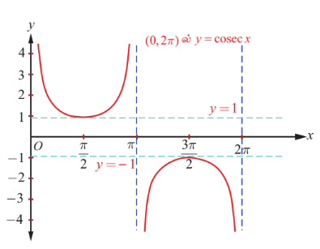
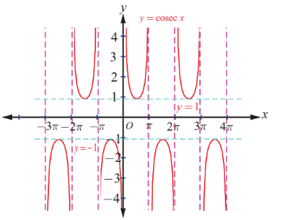
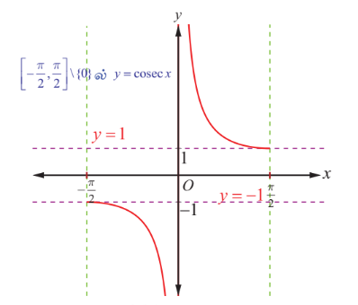
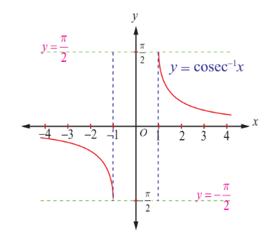

### 4.6 கொசீகண்ட் சார்பு மற்றும் நேர்மாறு கொசீகண்ட் சார்பு
### (The Cosecant Function and the Inverse Cosecant Function)

**படம். 4.19**

**படம். 4.20**

சைன் சார்பினைப் போன்றே, கொசீகண்ட் சார்பும் ஓர் ஒற்றைச் சார்பாகும் மற்றும் அதன் காலம் $2\pi$ ஆகும். கொசீகண்ட் சார்பு $y = \cosec x$ -ன் மதிப்புகள் $2\pi$ அளவுக்குப் பிறகு திரும்பவும் அதே மதிப்புகளைப் பெறுகிறது. $\sin x = 0$ எனும்போது, $y = \cosec x = \frac{1}{\sin x}$ ஐ வரையறுக்க இயலாது. ஆதலால் கொசீகண்ட் சார்பின் சார்பகம் $\mathbb{R} \setminus \{ n\pi : n \in \mathbb{Z} \}$ ஆகும். $-1 \leq \sin x \leq 1$ என்பதால் $y = \cosec x$ ஆனது $-1$ மற்றும் $1$-க்கும் இடையே எம்மதிப்பையும் பெறுவதில்லை. எனவே, கொசீகண்ட் சார்பின் வீச்சகம் $(-\infty, -1] \cup [1, \infty)$ ஆகும்.

---

### 4.6.1 கொசீகண்ட் சார்பின் வரைபடம்
### (Graph of the cosecant function)

$(0, 2\pi)$ இடைவெளியில், கொசீகண்ட் சார்பானது $x = \pi$ எனும் புள்ளியைத் தவிர்த்து ஏனைய புள்ளிகளில் தொடர்ச்சியாக இருக்கும். இதற்கு மீப்பெருமமோ அல்லது மீச்சிறுமமோ இல்லை. பொதுவாக, $x \in \left(0, \frac{\pi}{2}\right]$ மதிப்புகளுக்கு $y = \cosec x$ -ன் மதிப்பு, $\infty$ முதல் $1$ வரை குறையும். $x \in \left[\frac{\pi}{2}, \pi\right)$ மதிப்புகளுக்கு, $y = \cosec x$ -ன் மதிப்புகள் $1$ முதல் $\infty$ வரை அதிகரிக்கும். $x \in \left(\pi, \frac{3\pi}{2}\right]$ மதிப்புகளுக்கு, $y = \cosec x$ -ன் மதிப்புகள் $-\infty$ முதல் $-1$ வரை அதிகரிக்கும். $x \in \left[\frac{3\pi}{2}, 2\pi\right)$ மதிப்புகளுக்கு, $y = \cosec x$ -ன் மதிப்புகள் $-1$ முதல் $-\infty$ வரை குறையும். $y = \cosec x$, $x \in (0, 2\pi) \setminus \{\pi\}$ -ன் வரைபடத்தினை படம் 4.19 -ல் காண்க.

$\ldots, (-4\pi, -2\pi) \setminus \{-3\pi\}, (-2\pi, 0) \setminus \{-\pi\}, (0, 2\pi) \setminus \{\pi\}, (2\pi, 4\pi) \setminus \{3\pi\}, (4\pi, 6\pi) \setminus \{5\pi\}, \ldots$

ஆகிய இடைவெளிகளில் $(0, 2\pi)$ல் $y = \cosec x$ ன் வரைபடத்தின் இப்பகுதியே திரும்ப அமைகின்றது. $y = \cosec x$ -ன் முழு வரைபடம் ஆனது படம் 4.20-ல் காண்பிக்கப்பட்டுள்ளது.

---

### 4.6.2 நேர்மாறு கொசீகண்ட் சார்பு (The inverse cosecant function)

$\cosec : \left[-\frac{\pi}{2}, 0\right) \cup \left(0, \frac{\pi}{2}\right] \rightarrow (-\infty, -1] \cup [1, \infty)$ எனும் கொசீகண்ட் சார்பானது $\left[-\frac{\pi}{2}, 0\right) \cup \left(0, \frac{\pi}{2}\right]$ எனும் கட்டுபடுத்தப்பட்ட சார்பகத்தில் இருபுறச்சார்பாக உள்ளது. எனவே, $(-\infty, -1] \cup [1, \infty)$ -ஐ சார்பகமாகவும் மற்றும் $\left[-\frac{\pi}{2}, 0\right) \cup \left(0, \frac{\pi}{2}\right]$ வீச்சகமாகவும் கொண்டு நேர்மாறு கொசீகண்ட் சார்பு வரையறுக்கப்படுகிறது.

### வரையறை 4.6

$\cosec^{-1} : (-\infty, -1] \cup [1, \infty) \rightarrow \left[-\frac{\pi}{2}, 0\right) \cup \left(0, \frac{\pi}{2}\right]$ எனும் நேர்மாறு கொசீகண்ட் சார்பை, $\cosec^{-1} x = y$ என வரையறுக்கத் தேவையானதும் மற்றும் போதுமானதுமான நிபந்தனை $\cosec y = x$ மற்றும் $y \in \left[-\frac{\pi}{2}, 0\right) \cup \left(0, \frac{\pi}{2}\right]$ ஆகும்.

---

### 4.6.3 நேர்மாறு கொசீகண்ட் சார்பின் வரைபடம்
### (Graph of the inverse cosecant function)

**படம். 4.21**

**படம். 4.22**

$y = \cosec^{-1} x$ எனும் நேர்மாறு கொசீகண்ட் சார்பின் சார்பகம் $\mathbb{R} \setminus (-1, 1)$ மற்றும் வீச்சகம் $\left[-\frac{\pi}{2}, \frac{\pi}{2}\right] \setminus \{0\}$ ஆகும். அதாவது, $\cosec^{-1} : (-\infty, -1] \cup [1, \infty) \rightarrow \left[-\frac{\pi}{2}, 0\right) \cup \left(0, \frac{\pi}{2}\right]$ ஆகும்.

படம் 4.21 மற்றும் படம் 4.22 –ல் முதன்மை சார்பகத்தில் கொசீகண்ட் சார்பின் வரைபடம் மற்றும் நேர்மாறு கொசீகண்ட் சார்பின் சார்பகத்தில் அதன் வரைபடம் ஆகியவை முறையே காண்பிக்கப்பட்டுள்ளன.