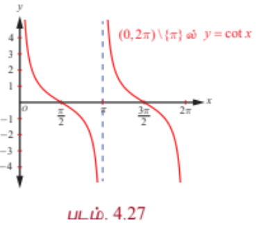
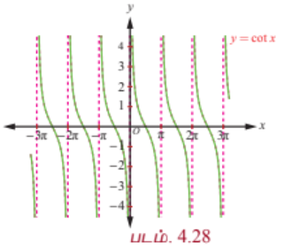
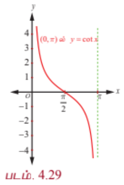
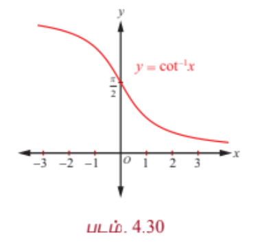

### 4.8 கோடான்ஜெண்ட் சார்பு மற்றும் நேர்மாறு கோடான்ஜெண்ட் சார்பு
### (The Cotangent Function and the Inverse Cotangent Function)

கோடான்ஜெண்ட் சார்பு என்பது $\cot x = \frac{1}{\tan x}$ ஆகும். $\tan x = 0$ அல்லது $x = n\pi, n \in \mathbb{Z}$ எனும் மதிப்புகளைத் தவிர $x$ -ன் ஏனைய மெய்யெண் மதிப்புகளுக்கு கோடான்ஜெண்ட் சார்பு வரையறுக்கப்படுகிறது. எனவே, கோடான்ஜெண்ட் சார்பின் சார்பகமானது $\mathbb{R} \setminus \{ n\pi : n \in \mathbb{Z} \}$ மற்றும் அதன் வீச்சகம் $(-\infty, \infty)$ ஆகும். $\tan x$ போன்று கோடான்ஜெண்ட் சார்பும் ஓர் ஒற்றைச் சார்பாகவும் மற்றும் அதன் காலம் $\pi$ ஆகவும் உள்ளது.

---

### 4.8.1 கோடான்ஜெண்ட் சார்பின் வரைபடம் (The graph of the cotangent function)

கோடான்ஜெண்ட் சார்பு $(0, 2\pi) \setminus \{\pi\}$ எனும் கணத்தில் தொடர்ச்சியாக இருக்கிறது. $(0, 2\pi) \setminus \{\pi\}$ -ல் முதலில் கோடான்ஜெண்ட் சார்பின் வரைபடத்தை வரைவோம். முதல் மற்றும் மூன்றாம் காற்பகுதியில் கோடான்ஜெண்ட் மிகையெண் மதிப்புகளை மட்டுமே பெறுகிறது. இரண்டாவது மற்றும் நான்காவது காற்பகுதிகளில் குறையெண் மதிப்புகளை மட்டுமே பெறுகிறது. கோடான்ஜெண்ட் சார்பிற்கு மீப்பெருமோ அல்லது மீச்சிறுமோ இல்லை. $x \in \left(0, \frac{\pi}{2}\right]$ எனும்போது கோடான்ஜெண்ட் சார்பு, $\infty$ -லிருந்து $0$ -க்கு இறங்குகிறது; $x \in \left[\frac{\pi}{2}, \pi\right)$ எனும்போது $0$ -லிருந்து $-\infty$-க்கு இறங்குகிறது; $x \in \left(\pi, \frac{3\pi}{2}\right]$ எனும்போது $-\infty$-லிருந்து $0$ வரை இறங்குகிறது; $x \in \left[\frac{3\pi}{2}, 2\pi\right)$ எனும்போது, $0$-லிருந்து $-\infty$ வரை இறங்குகிறது.

$y = \cot x$, $x \in (0, 2\pi) \setminus \{\pi\}$ -க்கான வரைபடம் படம் 4.27—ல் காண்பிக்கப்பட்டுள்ளது. $(0, 2\pi) \setminus \{\pi\}$ -ல் அமைந்த $y = \cot x$ ன் வரைபடம் போல $(2\pi, 4\pi) \setminus \{3\pi\}, (4\pi, 6\pi) \setminus \{5\pi\}, \ldots$, மற்றும் $\ldots, (-4\pi, -2\pi) \setminus \{-3\pi\}, (-2\pi, 0) \setminus \{-\pi\}$ ஆகிய இடைவெளிகளிலும் $y = \cot x$ ன் வரைப்படம் திரும்ப, திரும்ப அமைகிறது. $\mathbb{R} \setminus \{ n\pi : n \in \mathbb{Z} \}$ -ஐ சார்பகமாகக் கொண்ட கோடான்ஜெண்ட் சார்பின் முழு வரைபடமும் படம் 4.28-ல் காண்பிக்கப்பட்டுள்ளது.

---

### 4.8.2 நேர்மாறு கோடான்ஜெண்ட் சார்பு (Inverse cotangent function)

கோடான்ஜெண்ட் சார்பு அதன் முழுசார்பகத்தில் $\mathbb{R} \setminus \{ n\pi : n \in \mathbb{Z} \}$ ஒன்றுக்கொன்று சார்பு அல்ல. ஆயினும் கட்டுபடுத்தப்பட சார்பகமான $(0, \pi)$ -ல், $\cot : (0, \pi) \rightarrow (-\infty, \infty)$ ஆனது இருபுறச் சார்பாகும். எனவே, $(-\infty, \infty)$ சார்பகமாகவும், $(0, \pi)$ வீச்சாகவும் கொண்டு நேர்மாறு கோடான்செண்ட் சார்பை வரையறுப்போம்.

---

### வரையறை 4.8

நேர்மாறு கோடான்ஜெண்ட் சார்பான $\cot^{-1} : (-\infty, \infty) \rightarrow (0, \pi)$ என்பது $\cot^{-1} x = y$ என வரையறுக்க தேவையானதும் மற்றும் போதுமானதுமான நிபந்தனைகள் $y \in (0, \pi)$ மற்றும் $\cot y = x$ ஆகும்.

---

### 4.8.3 நேர்மாறு கோடான்ஜெண்ட் சார்பின் வரைபடம்
### (Graph of the inverse cotangent function)

நேர்மாறு கோடான்ஜெண்ட் சார்பான $y = \cot^{-1} x$ என்பது $\mathbb{R}$ -ஐ சார்பகமாகவும் மற்றும் $(0, \pi)$ -ஐ வீச்சாகவும் கொண்ட சார்பாகும். அதாவது $\cot^{-1} : (-\infty, \infty) \rightarrow (0, \pi)$ ஆகும்.

படம் 4.29 மற்றும் படம். 4.30 ஆகியவற்றில் வரைபடங்கள் முறையே முதன்மை சார்பகத்தில் கோடான்ஜெண்ட் சார்பின் வரைபடம் மற்றும் நேர்மாறு கோடான்ஜெண்ட் சார்பின் வரைபடம் அதற்குரிய சார்பகத்திலும் கொடுக்கப்பட்டுள்ளன.