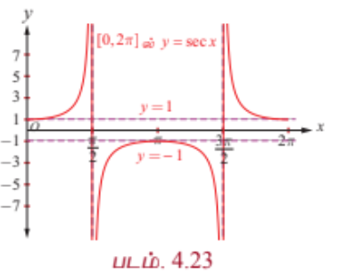
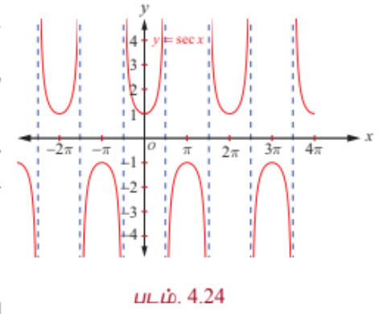
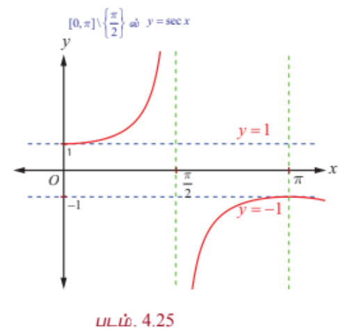
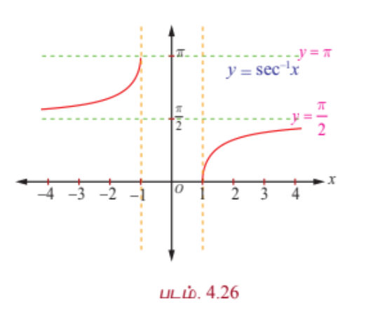

### 4.7 சீகண்ட் சார்பு மற்றும் நேர்மாறு சீகண்ட் சார்பு (The Secant Function and Inverse Secant Function)

சீகண்ட் சார்பு என்பது கொசைன் சார்பின் தலைகீழ்ச்சார்பு என வரையறுக்கப்பட்டுள்ளது. எனவே, $y = \sec x = \frac{1}{\cos x}$ என்பது $\cos x = 0$ எனும்போது தவிர ஏனைய $x$ மதிப்புகளுக்கு வரையறுக்கப்படுகிறது. ஆகையால், $y = \sec x$ -ன் சார்பகம் $\mathbb{R} \setminus \left\{ (2n+1)\frac{\pi}{2}, n \in \mathbb{Z} \right\}$ ஆகும். $-1 \leq \cos x \leq 1$ என்பதால், $y = \sec x$ என்பது $(-1, 1)$ -ல் எம்மதிப்புகளையும் பெறாது. எனவே, சீகண்ட் சார்பின் வீச்சகம் $(-\infty, -1] \cup [1, \infty)$ ஆகும். சீகண்ட் சார்பிற்கு மீப்பெருமோ அன்றி மீச்சிறுமோ இல்லை. $y = \sec x$ என்பது $2\pi$ கொண்ட காலம் சார்பு மற்றும் இரட்டைச் சார்பாகவும் அமைகிறது.

---

### 4.7.1 சீகண்ட் சார்பின் வளைவரை (The graph of the secant function)

$0 \leq x \leq 2\pi$, $x \neq \frac{\pi}{2}, \frac{3\pi}{2}$ -ல் சீகண்ட் சார்பின் வளைவரை படம் 4.23-ல் காண்பிக்கப்பட்டுள்ளது. முதல் மற்றும் நான்காம் காற்பகுதிகளில் அதாவது $-\frac{\pi}{2} < x < \frac{\pi}{2}$ இடைவெளியில், $y = \sec x$ மிகையெண் மதிப்புகளை மட்டுமே பெறுகிறது. அதே சமயம் இரண்டாவது மற்றும் மூன்றாவது காற்பகுதிகளில் அதாவது $\frac{\pi}{2} < x < \frac{3\pi}{2}$ இடைவெளியில் குறையெண் மதிப்புகளையே பெறுகிறது.

$0 \leq x \leq 2\pi$, $x \neq \frac{\pi}{2}, \frac{3\pi}{2}$ எனும்போது சீகண்ட் சார்பு தொடர்ச்சியாக இருக்கும். $x \in \left[0, \frac{\pi}{2}\right)$ எனும்போது சீகண்ட் சார்பின் மதிப்பு $1$ முதல் $\infty$ வரை உயரும். மேலும், $x \in \left(\frac{\pi}{2}, \pi\right]$ எனும்போது சீகண்ட் சார்பின் மதிப்பு $-\infty$ முதல் $-1$ வரை உயரும். $x \in \left[\pi, \frac{3\pi}{2}\right)$ எனும்போது $-1$ முதல் $-\infty$ வரை இறங்கும். $x \in \left(\frac{3\pi}{2}, 2\pi\right]$ எனும்போது $\infty$ முதல் $1$ வரை இறங்கும். $y = \sec x$ ஒரு $2\pi$ -காலம் கொண்ட சார்பாகும், எனவே $0 \leq x \leq 2\pi$, $x \neq \frac{\pi}{2}, \frac{3\pi}{2}$ -க்கான வளைவரைப் பகுதியே, $[2\pi, 4\pi] \setminus \left\{\frac{5\pi}{2}, \frac{7\pi}{2}\right\}, [4\pi, 6\pi] \setminus \left\{\frac{9\pi}{2}, \frac{11\pi}{2}\right\}, \ldots$ மற்றும் $\ldots, [-4\pi, -2\pi] \setminus \left\{-\frac{7\pi}{2}, -\frac{5\pi}{2}\right\}, [-2\pi, 0] \setminus \left\{-\frac{3\pi}{2}, -\frac{\pi}{2}\right\}$ ஆகிய இடைவெளிகளில் திரும்ப, திரும்ப அமைகின்றது. தற்போது $y = \sec x$ -ன் முழு வரைபடமும் படம் 4.24-ல் காண்பிக்கப்பட்டுள்ளது.

---

### 4.7.2 நேர்மாறு சீகண்ட் சார்பு (Inverse secant function)

$\sec x: [0, \pi] \setminus \left\{\frac{\pi}{2}\right\} \rightarrow \mathbb{R} \setminus (-1, 1)$ எனும் சீகண்ட் சார்பு கட்டுப்படுத்தப்பட்ட சார்பகமான $[0, \pi] \setminus \left\{\frac{\pi}{2}\right\}$ -ல் ஓர் இருபுறச் சார்பு ஆகும். எனவே நேர்மாறு சீகண்ட் சார்பு என்பது $\mathbb{R} \setminus (-1, 1)$ என்பதை சார்பகமாகவும் மற்றும் $[0, \pi] \setminus \left\{\frac{\pi}{2}\right\}$ வீச்சகமாகவும் கொண்டு வரையறுக்கப்படுகிறது.

### வரையறை 4.7

$\sec y = x$ மற்றும் $y \in [0, \pi] \setminus \left\{\frac{\pi}{2}\right\}$ எனும்போது நேர்மாறு சீகண்ட் சார்பு $\sec^{-1} : \mathbb{R} \setminus (-1, 1) \rightarrow [0, \pi] \setminus \left\{\frac{\pi}{2}\right\}$ ஐ $\sec^{-1} x = y$ என வரையறுக்கப்படுகிறது.

---

### 4.7.3 நேர்மாறு சீகண்ட் சார்பின் வரைபடம் (Graph of the inverse secant function)

நேர்மாறு சீகண்ட் சார்பு, $y = \sec^{-1} x$ என்பது $\mathbb{R} \setminus (-1, 1)$ -ஐ சார்பகமாகவும் மற்றும் $[0, \pi] \setminus \left\{\frac{\pi}{2}\right\}$ -ஐ வீச்சாகவும் கொண்ட சார்பாகும். அதாவது, $\sec^{-1} : \mathbb{R} \setminus (-1, 1) \rightarrow [0, \pi] \setminus \left\{\frac{\pi}{2}\right\}$.

படம் 4.25 மற்றும் படம் 4.26 ஆகியவற்றில், முறையே முதன்மை சார்பகத்தில் சீகண்ட் சார்பின் வரைபடமும் மற்றும் நேர்மாறு சீகண்ட் சார்பின் வரைபடம் அதற்குறிய சார்பகத்தில் காண்பிக்கப்பட்டுள்ளது.

---

### குறிப்புரை

$y = \sec x$ அல்லது $\cosec x$ எனும் வரைபடத்தை எளிதாக வரைய கீழ்க்காணும் வழிமுறையைப் பின்பற்றவும்.

(i) $y = \cos x$ அல்லது $\sin x$ வரைபடத்தை வரையவும்.

(ii) $x$ வெட்டுத்துண்டுகள் சந்திக்கும் புள்ளிகளில் செங்குத்து தொலைத் தொடுகோடுகளை வரையவும். $y$ மதிப்புகளின் தலைகீழியாக எடுத்துக் கொள்ளவும்.