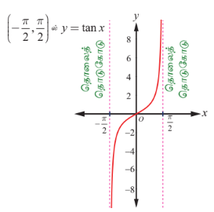
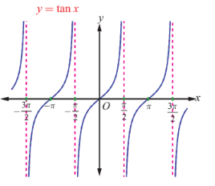
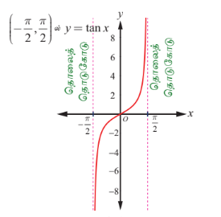
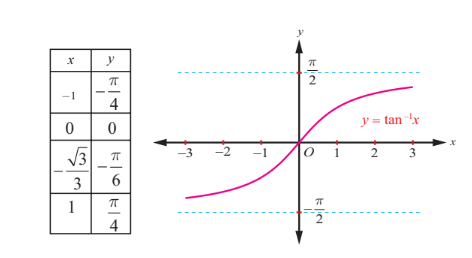

### 4.5 தொடுகோட்டுச் சார்பு மற்றும் நேர்மாறு தொடுகோட்டுச் சார்பு
### (The Tangent Function and the Inverse Tangent Function)

கட்டிடம், மலை அல்லது கொடிகம்பம் போன்றவற்றின் உயரம் அல்லது தூரத்தை கண்டறிவதற்கு $y = \tan x$ எனும் தொடுகோட்டுச் சார்பை பயன்படுத்துகிறோம். $y = \tan x = \frac{\sin x}{\cos x}$ -ன் சார்பகத்தில் பகுதியை பூஜ்ஜியமாக்கும் $x$-ன் மதிப்புகள் நீக்கப்படுகிறது. எனவே $x = \ldots, -\frac{3\pi}{2}, -\frac{\pi}{2}, \frac{\pi}{2}, \frac{3\pi}{2}, \ldots$ ஆகிய மதிப்புகளுக்கு தொடுகோட்டுச் சார்பு வரையறுக்கப்படவில்லை. ஆகையால் $y = \tan x$ -ன் சார்பகமானது $\left\{ x : x \neq (2k+1)\frac{\pi}{2}, k \in \mathbb{Z} \right\} = \bigcup_{k=-\infty}^{\infty} \left( (2k+1)\frac{\pi}{2}, (2k+3)\frac{\pi}{2} \right)$ ஆகும். அதன் வீச்சகம் $(-\infty, \infty)$ ஆகும். $y = \tan x$ எனும் தொடுகோட்டுச் சார்பின் காலம் $\pi$ ஆகும்.

---

### 4.5.1 தொடுகோட்டுச் சார்பின் வரைபடம் (The graph of tangent function)

மீள்நிகழ் காலமுறையுள்ள இடைவெளிகளில் சார்பின் மதிப்பை காண்பதற்கு தொடுகோட்டுச் சார்பு பயனுள்ளதாக இருக்கும். தொடுகோட்டுச் சார்பு ஒற்றைச் சார்பாகும். ஆகையால் $y = \tan x$ -ன் வளைவரை ஆதியைப் பொறுத்து சமச்சீராக இருக்கும். தொடுகோட்டுச் சார்பின் காலம் $\pi$ என்பதால் $\pi$ நீளமுள்ள ஏதேனும் ஒரு இடைவெளியில் $y = \tan x$ ன் வரைபடத்தை வரையலாம். $\left(-\frac{\pi}{2}, \frac{\pi}{2}\right)$ எனும் இடைவெளியைக் கருதுக. $x \in \left(-\frac{\pi}{2}, \frac{\pi}{2}\right)$ எனும்படி $y = \tan x$ ன் வளைவரை வரைய கீழ்க்காணும் அட்டவணையை அமைப்போம்.

| $x$ (ஆரையனில்) | $-\frac{\pi}{3}$ | $-\frac{\pi}{4}$ | $-\frac{\pi}{6}$ | $0$ | $\frac{\pi}{6}$ | $\frac{\pi}{4}$ | $\frac{\pi}{3}$ |
|---|---|---|---|---|---|---|---|
| $y = \tan x$ | $-\sqrt{3}$ | $-1$ | $-\frac{1}{\sqrt{3}}$ | $0$ | $\frac{1}{\sqrt{3}}$ | $1$ | $\sqrt{3}$ |

**படம். 4.15**

**படம். 4.16**

இப்போது அட்டவணையிலுள்ள புள்ளிகளை வரைபடத்தில் குறித்து, அவைகளை இழைவான வளைவரையில் இணைத்து $y = \tan x$, $-\frac{\pi}{2} < x < \frac{\pi}{2}$, ன் வரைபடத்தை வரையலாம். $x$, $\frac{\pi}{2}$ மதிப்பை நெருங்கும்போது அதே சமயம் $\frac{\pi}{2}$ -ஐ விட குறைவான மதிப்பைப் பெறும்போது $\sin x$ மதிப்பு $1$ -ஐ நெருங்கும் மற்றும் $\cos x$ மிகை எண் மதிப்பாகவும் $0$-ஐ நெருங்கியும் இருக்கும். ஆதலால் $x$, $\frac{\pi}{2}$ -ஐ நெருங்கும்போது $\frac{\sin x}{\cos x}$ எனும் விகிதம் மிகையெண் மதிப்பாகவும் மற்றும் அதன் மதிப்பு அதிகரித்தும் $\infty$-ஐ நெருங்குகிறது. எனவே $x = \frac{\pi}{2}$ எனும் நேர்க்கோடு வரைபடத்திற்கு செங்குத்து தொலைத்தொடுகோடாக இருக்கும். அதேபோல் $x$, $-\frac{\pi}{2}$ -ஐ நெருங்கும்போது $\frac{\sin x}{\cos x}$ எனும் விகிதம் குறையெண் மதிப்பாகவும் மற்றும் எண்ணளவு அதிகரித்தும் $-\infty$ -ஐ நெருங்கும். எனவே $x = -\frac{\pi}{2}$ எனும் நேர்க்கோடும் வரைபடத்திற்கு செங்குத்து தொலைத் தொடுகோடாக இருக்கும். எனவே, படம் 4.15 ல் காண்பிக்கப்பட்டுள்ளது போல், $-\frac{\pi}{2} < x < \frac{\pi}{2}$ -க்கு, $y = \tan x$ இன் வரைபடத்தின் ஒரு கிளை கிடைக்கும். $y = \tan x$ -ன் முதன்மை சார்பகம் $\left(-\frac{\pi}{2}, \frac{\pi}{2}\right)$ ஆகும்.

$x = (2n+1)\frac{\pi}{2}, n \in \mathbb{Z}$ மதிப்புகளைத் தவிர ஏனைய மெய்யெண்களுக்கு தொடுகோட்டுச்சார்பு வரையறுக்கப்படுகிறது மற்றும் அதிகரிக்கும் சார்பாக இருக்கிறது. $x = (2n+1)\frac{\pi}{2}, n \in \mathbb{Z}$ -ல் செங்குத்து தொலைத் தொடுகோடுகள் உள்ளது. $x = n\pi, n \in \mathbb{Z}$ -ஐப் பொறுத்து $y = \tan x$ ன் கிளைகள் சமச்சீராக உள்ளது. $y = \tan x$ ன் முழு வரைபடம் படம் 4.16-இல் காண்பிக்கப்பட்டுள்ளது.

### குறிப்பு

வரைபடத்திலிருந்து $y = \tan x$ எனும் வளைவரையானது, $0 < x < \frac{\pi}{2}$ -ல் மற்றும் $\pi < x < \frac{3\pi}{2}$ -ல் மிகையெண் மதிப்பாக இருக்கிறது; $\frac{\pi}{2} < x < \pi$ -ல் மற்றும் $\frac{3\pi}{2} < x < 2\pi$ -ல் குறையெண் மதிப்பாகவும் இருக்கிறது.

### 4.5.2 தொடுகோட்டுச் சார்பின் பண்புகள் (Properties of the tangent function)

$y = \tan x$ ன் வளைவரையிலிருந்து கீழ்க்காணும் தொடுகோட்டுச் சார்பின் பண்புகளை அறியலாம்.

(i) தொடுகோட்டுச் சார்பின் வளைவரை தொடர்ச்சியற்றது. மேலும் $x = (2n+1)\frac{\pi}{2}, n \in \mathbb{Z}$ எனும் புள்ளிகளில் $y = \tan x$ தொடர்ச்சியற்றதாக உள்ளது.

(ii) $-\frac{\pi}{2} < x < \frac{\pi}{2}$ -க்கு $y = \tan x$ எனும் வளைவரையின் ஒரு பகுதி ஆதியைப் பொறுத்து சமச்சீராக உள்ளது.

(iii) $x = (2n+1)\frac{\pi}{2}, n \in \mathbb{Z}$ ஆகிய இடங்களில், எண்ணற்ற தொலைத் தொடுகோடுகள் உள்ளது.

(iv) தொடுகோட்டுச் சார்பிற்கு மீப்பெருமோ அல்லது மீச்சிறுமோ இல்லை.

### குறிப்புரை

(i) $y = a\tan bx$ -ன் வளைவரை $-\frac{\pi}{2b} < x < \frac{\pi}{2b}$ எனும் இடைவெளியில் ஒரு முழுமையான சுழற்சியில் பெற்றுள்ளது மற்றும் அதன் காலம் $\frac{\pi}{b}$ ஆகும்.

(ii) $y = a\tan bx$ -க்கு தொலைத் தொடுகோடுகள் $x = \frac{(2k+1)\pi}{2b}, k \in \mathbb{Z}$ ஆகும்.

(iii) தொடுகோட்டுச் சார்பிற்கு மீப்பெருமோ அல்லது மீச்சிறுமோ இல்லை என்பதால் $\tan x$ க்கான வீச்சு வரையறுக்க முடியாது.

---

### 4.5.3 நேர்மாறு தொடுகோட்டுச் சார்பு மற்றும் அதன் பண்புகள்
### (The inverse tangent function and its properties)

தொடுகோட்டுச் சார்பானது அதன் முழுசார்பகம் $\mathbb{R} \setminus \left\{ \frac{\pi}{2} + k\pi, k \in \mathbb{Z} \right\}$ -ல் ஒன்றுக்கொன்றான சார்பு அல்ல ஆயினும், $\tan : \left(-\frac{\pi}{2}, \frac{\pi}{2}\right) \rightarrow \mathbb{R}$ என்பது இருபுறச் சார்பு. $\mathbb{R}$ -ஐ சார்பகமாகவும் மற்றும் $\left(-\frac{\pi}{2}, \frac{\pi}{2}\right)$ வீச்சகமாகவும் கொண்டு நேர்மாறு தொடுகோட்டுச் சார்பை வரையறை செய்வோம்.

### வரையறை 4.5

எவ்வொரு மெய்யெண் $x$ -க்கும், $\tan y = x$ என்றவாறு $\left(-\frac{\pi}{2}, \frac{\pi}{2}\right)$ -ல் உள்ள தனித்த எண் $y$ ஐ $\tan^{-1} x$ என வரையறுக்கப்படுகிறது. அதாவது, நேர்மாறு தொடுகோட்டுச் சார்பு $\tan^{-1} : (-\infty, \infty) \rightarrow \left(-\frac{\pi}{2}, \frac{\pi}{2}\right)$ ஐ $\tan^{-1} x = y$ என வறையறுக்கத் தேவையானதும் மற்றும் போதுமானதுமான நிபந்தனை $\tan y = x$ மற்றும் $y \in \left(-\frac{\pi}{2}, \frac{\pi}{2}\right)$ ஆகும்.

$y = \tan^{-1} x$ வரையறையிலிருந்து பின்வருவனவற்றை அறியலாம்.

(i) $y = \tan^{-1} x$ என்பதற்கு தேவையானதும் மற்றும் போதுமானதுமான நிபந்தனை அனைத்து $x \in \mathbb{R}$ மற்றும் $-\frac{\pi}{2} < y < \frac{\pi}{2}$ ற்கு $x = \tan y$ ஆகும்.

(ii) ஒவ்வொரு மெய்யெண் $x$-க்கும் $\tan(\tan^{-1} x) = x$ ஆகும். மேலும் $y = \tan^{-1} x$ ஒரு ஒற்றைச் சார்பு ஆகும்.

(iii) $\tan^{-1}(\tan x) = x$ என இருக்கத் தேவையானதும் மற்றும் போதுமானதுமான நிபந்தனை $-\frac{\pi}{2} < x < \frac{\pi}{2}$ ஆகும். இங்கு $\tan^{-1}(\tan \pi) = 0$ ஆகுமே தவிர $\pi$ ஆகாது என்பதனைக் கவனிக்கவும்.

### குறிப்பு

(i) நேர்மாறு தொடுகோட்டுச் சார்பு பற்றிக் குறிப்பிடும்போதெல்லாம், $\tan : \left(-\frac{\pi}{2}, \frac{\pi}{2}\right) \rightarrow \mathbb{R}$ மற்றும் $\tan^{-1} : \mathbb{R} \rightarrow \left(-\frac{\pi}{2}, \frac{\pi}{2}\right)$ என்பதை நினைவில் கொள்ளவேண்டும்.

(ii) கட்டுப்படுத்தப்பட்ட சார்பகமான $\left(-\frac{\pi}{2}, \frac{\pi}{2}\right)$ என்பது தொடுகோட்டுச் சார்பின் முதன்மை சார்பகமாகும். $y = \tan^{-1} x$, $x \in \mathbb{R}$, எனும் மதிப்புகள் $y = \tan^{-1} x$ வின் முதன்மை மதிப்புகளாகும்.

---

### 4.5.4 நேர்மாறு தொடுகோட்டுச் சார்பின் வரைபடம்
### (Graph of the inverse tangent function)

$y = \tan^{-1} x$ ன் சார்பு மெய்யெண் கோட்டின் முழுவதுமான $(-\infty, \infty)$ -ஐ சார்பகமாகவும் மற்றும் $\left(-\frac{\pi}{2}, \frac{\pi}{2}\right)$ -ஐ வீச்சகமாகவும் கொண்டுள்ளது. இங்கு $-\frac{\pi}{2}$ மற்றும் $\frac{\pi}{2}$ ஆகிய இடங்களில் தொடுகோட்டுச் சார்பு வரையறுக்கப்படவில்லை என்பது குறிப்பிடத்தக்கது. எனவே $y = \tan^{-1} x$ வரைபடமானது $y = -\frac{\pi}{2}$ மற்றும் $y = \frac{\pi}{2}$ ஆகிய இரு கோடுகளுக்கிடையே மட்டும்தான் அமையப்பெற்றிருக்கும் மற்றும் அவ்விரு கோடுகளையும் எவ்விடத்திலும் தொடுவதில்லை. மாறாக, $y = -\frac{\pi}{2}$ மற்றும் $y = \frac{\pi}{2}$ ஆகிய இவ்விரு கோடுகளும் $y = \tan^{-1} x$ -க்கு கிடைமட்ட தொலைத் தொடுகோடுகளாக இருக்கின்றன.

படம் 4.17 மற்றும் படம் 4.18 ஆகிய இரு படங்களும் முறையே $\left(-\frac{\pi}{2}, \frac{\pi}{2}\right)$ எனும் சார்பகத்தைக் கொண்ட $y = \tan x$ ன் வரைபடத்தையும் மற்றும் $(-\infty, \infty)$ எனும் சார்பகத்தைக் கொண்ட $y = \tan^{-1} x$ ன் வரைபடத்தையும் சித்தரிக்கிறது.

**படம். 4.17**

**படம். 4.18**

### குறிப்பு

(i) நேர்மாறு தொடுகோட்டுச் சார்பு திடமாக ஏறும் சார்பு மற்றும் $(-\infty, \infty)$ எனும் சார்பகத்தில் தொடர்ச்சியானது.

(ii) $y = \tan^{-1} x$ -ன் வரைபடம் ஆதி வழியாகச் செல்கிறது.

(iii) ஆதியைப் பொறுத்து வளைவரை சமச்சீராக இருப்பதால் சார்பு $y = \tan^{-1} x$ ஆனது ஒரு ஒற்றைச் சார்பாகும்.

---

### எடுத்துக்காட்டு 4.8

முதன்மை மதிப்பு காண்க: $\tan^{-1}(\sqrt{3})$.

### தீர்வு

$\tan^{-1}(\sqrt{3}) = y$ என்க. எனவே, $\tan y = \sqrt{3}$. ஆகையால், $y = \frac{\pi}{3}$. ஏனெனில் $\frac{\pi}{3} \in \left(-\frac{\pi}{2}, \frac{\pi}{2}\right)$.

எனவே, $\tan^{-1}(\sqrt{3})$ ன் முதன்மை மதிப்பு $\tan^{-1}(\sqrt{3}) = \frac{\pi}{3}$ ஆகும்.

---

### எடுத்துக்காட்டு 4.9

மதிப்பு காண்க (i) $\tan^{-1}(-\sqrt{3})$ (ii) $\tan^{-1}\left(\tan\frac{3\pi}{5}\right)$ (iii) $\tan^{-1}(\tan 2019)$

### தீர்வு

(i) $\tan^{-1}(-\sqrt{3}) = -\tan^{-1}(\sqrt{3}) = -\frac{\pi}{3}$, ஏனெனில் $-\frac{\pi}{3} \in \left(-\frac{\pi}{2}, \frac{\pi}{2}\right)$.

(ii) $\tan^{-1}\left(\tan\frac{3\pi}{5}\right)$.

$\tan\theta = \tan\frac{3\pi}{5}$ எனுமாறு $\theta \in \left(-\frac{\pi}{2}, \frac{\pi}{2}\right)$ ஐ நாம் கண்டறிய வேண்டும்.

தொடுகோட்டுச் சார்பின் காலம் $\pi$ என்பதால், $\tan\frac{3\pi}{5} = \tan\left(\frac{3\pi}{5} - \pi\right) = \tan\left(-\frac{2\pi}{5}\right)$.

எனவே, $\tan^{-1}\left(\tan\frac{3\pi}{5}\right) = \tan^{-1}\left(\tan\left(-\frac{2\pi}{5}\right)\right) = -\frac{2\pi}{5}$, ஏனெனில் $-\frac{2\pi}{5} \in \left(-\frac{\pi}{2}, \frac{\pi}{2}\right)$.

(iii) $\tan^{-1}(\tan x) = x, x \in \mathbb{R}$ என்பதால், $\tan^{-1}(\tan 2019) = 2019$ ஆகும்.

### எடுத்துக்காட்டு 4.10

மதிப்பு காண்க $\tan^{-1}(-1) + \cos^{-1}\left(\frac{1}{2}\right) + \sin^{-1}\left(-\frac{1}{2}\right)$.

### தீர்வு

$\tan^{-1}(-1) = y$ என்க. எனவே, $\tan y = -1 = -\tan\frac{\pi}{4} = \tan\left(-\frac{\pi}{4}\right)$.

இங்கு $-\frac{\pi}{4} \in \left(-\frac{\pi}{2}, \frac{\pi}{2}\right)$ என்பது குறிப்பிடதக்கது. எனவே, $\tan^{-1}(-1) = -\frac{\pi}{4}$.

இனி, $\cos^{-1}\left(\frac{1}{2}\right) = y$ எனில் $\cos y = \frac{1}{2} = \cos\frac{\pi}{3}$.

$\frac{\pi}{3} \in [0, \pi]$ என்பதால் $\cos^{-1}\left(\frac{1}{2}\right) = \frac{\pi}{3}$.

மேலும், $\sin^{-1}\left(-\frac{1}{2}\right) = y$ எனில் $\sin y = -\frac{1}{2} = -\sin\frac{\pi}{6}$.

$-\frac{\pi}{6} \in \left[-\frac{\pi}{2}, \frac{\pi}{2}\right]$ என்பதால் $\sin^{-1}\left(-\frac{1}{2}\right) = -\frac{\pi}{6}$.

எனவே, $\tan^{-1}(-1) + \cos^{-1}\left(\frac{1}{2}\right) + \sin^{-1}\left(-\frac{1}{2}\right) = -\frac{\pi}{4} + \frac{\pi}{3} - \frac{\pi}{6} = -\frac{\pi}{12}$.

---

### எடுத்துக்காட்டு 4.11

நிரூபி $\tan^{-1}\left(\frac{x}{\sqrt{1 - x^2}}\right) = \sin^{-1} x, \quad -1 < x < 1$.

### தீர்வு

$x = 0$ எனில், இருபுறமும் $0$ ஆகும். ... (1)

$0 < x < 1$ என்க. $\theta = \sin^{-1} x$ என்க. எனவே $0 < \theta < \frac{\pi}{2}$ ஆகும். தற்போது $\sin\theta = \frac{x}{1}$ என்பதால், $\tan\theta = \frac{x}{\sqrt{1 - x^2}}$.

எனவே, $\tan^{-1}\left(\frac{x}{\sqrt{1 - x^2}}\right) = \sin^{-1} x$. ... (2)

அடுத்தாக $-1 < x < 0$ என்க. எனவே, $\theta = \sin^{-1} x$ என்பதிலிருந்து $-\frac{\pi}{2} < \theta < 0$.

$\sin\theta = \frac{x}{1}$ என்பதால், $\tan\theta = \frac{x}{\sqrt{1 - x^2}}$.

இம்முறையிலும் $\tan^{-1}\left(\frac{x}{\sqrt{1 - x^2}}\right) = \sin^{-1} x$ என கிடைக்கின்றது. ... (3)

சமன்பாடுகள் (1), (2) மற்றும் (3) ஆகியவற்றிலிருந்து $\tan^{-1}\left(\frac{x}{\sqrt{1 - x^2}}\right) = \sin^{-1} x, \quad -1 < x < 1$ என நிறுவப்படுகின்றது.

---

### பயிற்சி 4.3

1. கீழ்க்காணும் சார்புகளின் சார்பகம் காண்க.

   (i) $\tan^{-1}(2x - 9)$  
   (ii) $\frac{1}{2}\tan^{-1}(4x - 1) - \frac{\pi}{4}$.

2. மதிப்பு காண்க (i) $\tan^{-1}\left(\tan\frac{5\pi}{4}\right)$ (ii) $\tan^{-1}\left(\tan\left(-\frac{\pi}{6}\right)\right)$.

3. மதிப்பு காண்க

   (i) $\tan^{-1}\left(\tan\frac{7\pi}{4}\right)$ (ii) $\tan^{-1}(\tan 1947)$ (iii) $\tan^{-1}(\tan(-0.2021))$.

4. மதிப்பு காண்க (i) $\tan^{-1}\left(\frac{1}{2}\right) - \sin^{-1}\left(\frac{1}{2}\right)$ (ii) $\sin^{-1}\left(\frac{1}{2}\right) - \cos^{-1}\left(\frac{4}{5}\right)$.

   (iii) $\cos^{-1}\left(\sin\left(\frac{\pi}{3}\right)\right) + \tan^{-1}\left(\tan\left(\frac{\pi}{3}\right)\right)$.