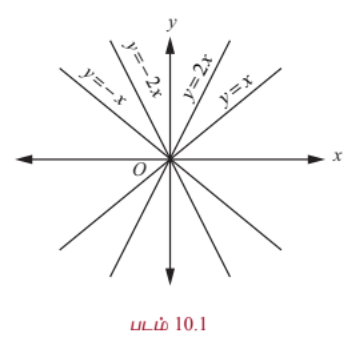
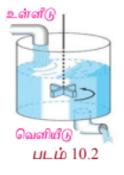

### 10.1 அறிமுகம் மற்றும் பாட வளர்ச்சி
### (Motivation and Early Developments)

அன்றாட வாழ்க்கையில்
- எறியப்பட்ட பொருள், விண்வெளிக்கலன், துணைக்கோள் மற்றும் கோள்கள் ஆகியவற்றின் இயக்கப்பாதை
- மின்சுற்றில் உள்ள மின்னூட்டம் அல்லது மின்னோட்டம்
- ஒரு கோல் அல்லது பலகை வழியாக ஏற்படும் வெப்பக்கடத்தல்
- ஒரு கம்பி அல்லது மெல்லிய தோலில் ஏற்படும் அதிர்வுகள்

ஆகியவற்றை கணக்கிடும் நிகழ்வுகளைக் கருதுவோம். இதுபோன்ற நிகழ்வுகளை கணிதவியல் சமன்பாடுகளாக உருவாக்கும்போது சில அறிவியல் விதிகளின் அடிப்படையில் வகைக்கெழுச் சமன்பாடுகள் உருவாகின்றன. இவ்விதிகள் ஒன்று அல்லது அதற்கு மேற்பட்ட அளவுகளின் மற்ற அளவுகளைப் பொருத்து மாறுவீதங்களை (வகைக்கெழுக்களை) உள்ளடக்கியுள்ளது. ஆகவே, இந்த அறிவியல் விதிகள் வகைக்கெழுக்களை உள்ளடக்கிய கணிதவியல் சமன்பாடுகளாக அதாவது வகைக்கெழுச் சமன்பாடுகளாக அமைகின்றன.

வடிவக்கணிதம், இயந்திரவியல், இயற்பியல், வேதியியல் மற்றும் பொறியியல் ஆகிய பாடங்களில் வகைக்கெழுச் சமன்பாடுகள் அதிக அளவில் பயன்படுத்தப்படுகின்றன. முந்தைய வகுப்புகளில் மாறுவீதங்களைப் பற்றி படித்துள்ளோம். இது கணநேர மாறுவீதம் எனவும் அழைக்கப்படும். இதனை $\frac{dy}{dx}$ எனக்குறிப்பிடுவோம்.

ஒரு சில அறியப்படாத சார்புகளுக்கும் அவற்றின் மாறு வீதங்களுக்கும் இடையேயுள்ள தொடர்புகளை கீழே காண்போம்.

(a) $x$ ஐப் பொருத்து $y$ இன் மாறுவீதம் $y$ க்கு நேர் விகிதத்தில் உள்ளது:

$$\frac{dy}{dx} = ky$$

(b) $x$ ஐப் பொருத்து $y$ இன் மாறுவீதம் $y^2$ மற்றும் $x$ இன் பெருக்கல் பலனுக்கு நேர்விகிதத்தில் உள்ளது:

$$\frac{dy}{dx} = ky^2x$$

(c) $x$ ஐப் பொருத்து $y$ இன் மாறுவீதம் $y$ க்கு எதிர் விகிதத்தில் உள்ளது:

$$\frac{dy}{dx} = \frac{k}{y}$$

(d) $x$ ஐப் பொருத்து $y$ இன் மாறுவீதம் $y^2$ க்கு நேர்விகிதத்திலும் மற்றும் $x$ க்கு எதிர் விகிதத்திலும் உள்ளது:

$$\frac{dy}{dx} = k\frac{y^2}{x}$$

ஓர் அறியப்படாத சார்பின் ஒன்று அல்லது அதற்கு மேற்பட்ட வகைக்கெழுக்களை உள்ளடக்கிய ஒரு சமன்பாடு **வகைக்கெழுச் சமன்பாடாகும்**.

பொதுவாக நேரமானது சாரா மாறியாக எடுத்துக் கொள்ளப்படும்.

நடைமுறை வாழ்க்கை நிகழ்வுகளில் கணித முறைகளைப் பயன்படுத்த வேண்டும். பெரும்பாலான நடைமுறைக் கணக்குகள் மாறும் அளவுகளுக்கு இடையேயுள்ள தொடர்புகளை விளக்குவதாகவே அமைந்துள்ளன. மாறு வீதங்கள் கணிதவியலில் வகைக்கெழுக்களால் குறிப்பிடப்படுவதால் கணிதவியல் மாதிரிகள் ஓர் அறியாத சார்பின் ஒன்று அல்லது அதற்கு மேற்பட்ட வகைக்கெழுக்களை உள்ளடக்கிய சமன்பாடுகளாக காணப்படுகின்றன. அத்தகைய சமன்பாடுகள் வகைக்கெழுச் சமன்பாடுகளாகும். அறிவியல், பொறியியல் போன்ற படிப்புகளில் இயற்பியல் விதிகளும் மற்றும் தொடர்புகளும் வகைக்கெழுச் சமன்பாடுகளாக வடிவமைக்கப்படுவதால், இப்படிப்புகளில் வகைக்கெழுச் சமன்பாடுகள் அதிக முக்கியத்துவம் வாய்ந்ததாக கருதப்படுகின்றன. மக்கள் தொகை பெருக்கம் அல்லது கதிர்வீச்சு சிதைவு போன்றவற்றை உள்ளடக்கிய கணிதவியல் மாதிரிகளை உருவாக்கும்போது வகைக்கெழுச் சமன்பாடுகள் மிகவும் பயனுள்ளதாகின்றன. மேலும் உயிரியல் மற்றும் பொருளியியல் சார்ந்த படிப்புகள் வகைக்கெழுச் சமன்பாடுகளின் பயன்பாடின்றி முழுமையடையாது.

வடிவக்கணிதம் மற்றும் இயற்பியல் ஆகியவற்றில் உள்ள கணக்குகளின் தீர்வுகளைக்காண்பதற்கு நியூட்டன் மற்றும் லீபினிட்ஸ் ஆகியோரால் நுண்கணிதத்துடன் கண்டுபிடிக்கப்பட்டதுதான் வகைக்கெழுச் சமன்பாடுகளாகும்.

பெர்னோலி குடும்பம், ஆய்லர் மற்றும் பலரால் மேம்படுத்தப்பட்ட நியூட்டோனியன் இயற்பியலில் வகைக்கெழுச் சமன்பாடுகள் மிக முக்கிய பங்காற்றியது. நாம் அன்றாட வாழ்க்கையில் பயன்படுத்தும் அலைபேசி, மகிழ்வுந்து, வானூர்தி, இணையதளம், வானிலை முன்னறிவிப்பு, சுகாதார மேம்பாடு போன்றவற்றின் பயன்பாட்டில் வகைக்கெழுச் சமன்பாடு அவசியமாகிறது.

இந்த அத்தியாயத்தில், முதல் வரிசை சாதாரண வகைக்கெழுச் சமன்பாடுகள் பற்றியும் அவற்றின் தீர்வுகளைக் காணும் சில வழிமுறைகளைப் பற்றியும் காண்போம்.

### கற்றலின் நோக்கங்கள்

இப்பாடப்பகுதியை கற்றபின் பின்வருவனவற்றை மாணவர்கள் அறிந்திருப்பர்

- வகைக்கெழுச் சமன்பாடுகளை வகைப்படுத்துதல்
- வகைக்கெழுச் சமன்பாடுகளை அமைத்தல்
- வகைக்கெழுச் சமன்பாடுகளின் வரிசை மற்றும் படி காணல்
- மாறிகளைப் பிரித்தல், பிரதியிடல், தொகையீட்டுக்காரணி காணல் போன்ற வழிமுறைகளைப் பயன்படுத்தி வகைக்கெழுச் சமன்பாடுகளின் தீர்வு காணல்
- வாழ்வியல் கணக்குகளில் வகைக்கெழுச் சமன்பாடுகளைப் பயன்படுத்துதல்

### 10.2 வகைக்கெழுச் சமன்பாடு, வரிசை மற்றும் படி
### (Differential Equation, Order, and Degree)

#### வரையறை 10.1

ஏதேனும் ஒரு சமன்பாடு ஒரு சார்பின் குறைந்தபட்சம் ஒரு சாதாரண வகைக்கெழு அல்லது பகுதி வகைக்கெழுவையாவது கொண்டிருக்குமானால் அச்சமன்பாடு **வகைக்கெழுச் சமன்பாடாகும்**.

எடுத்துக்காட்டாக, $y = f(x)$, இங்கு $y$ ஆனது ஒரு சார்ந்த மாறி ($f$ என்பது தெரியாத ஒரு சார்பு) மற்றும் $x$ என்பது ஒரு சாராமாறி என்க. பின்பு,

(1) $\frac{dy}{dx} = 0$ என்ற சமன்பாடு ஒரு வகைக்கெழுச் சமன்பாடாகும்.

(2) $\frac{dy}{dx} = \sin x$ என்ற சமன்பாடு ஒரு வகைக்கெழுச் சமன்பாடாகும்.

(3) $\frac{dy}{dx} + yx = 7 + 5$ என்ற சமன்பாடு ஒரு வகைக்கெழுச் சமன்பாடாகும்.

(4) $\frac{d^2y}{dx^2} + \frac{dy}{dx} + yx = \sin x$ என்ற சமன்பாடு ஒரு வகைக்கெழுச் சமன்பாடாகும்.

(5) $e^x \frac{dy}{dx} = \log x, x > 0$ என்ற சமன்பாடு ஒரு வகைக்கெழுச் சமன்பாடாகும்.

(6) $\tan^{-1}\left(\frac{dy}{dx}\right) = yx + \left(\frac{d^2y}{dx^2}\right)^2$ என்ற சமன்பாடு ஒரு வகைக்கெழுச் சமன்பாடாகும்.

#### வரையறை 10.2

ஒரு வகைக்கெழுச் சமன்பாட்டில் காணப்படும் மிக உயர்ந்த வகைக்கெழுவின் வரிசையே அச்சமன்பாட்டின் **வரிசை** (order) ஆகும்.

ஆகவே, ஒரு சமன்பாட்டில் காணப்படும் அறியாத சார்பின் மிக உயர்ந்த வரிசையுடைய வகைக்கெழு $k$ ஆவது வகைக்கெழு எனில், அவ்வகைக்கெழுச் சமன்பாட்டின் வரிசை $k$ ஆகும். இங்கு $k$ என்பது ஒரு மிகை முழு எண்ணாகும்.

எடுத்துக்காட்டாக,

$$\frac{d^3y}{dx^3} + 3\left(\frac{dy}{dx}\right)^2 + 2\left(\frac{d^2y}{dx^2}\right)^3 + 5 = 0$$

எனும் வகைக்கெழுச் சமன்பாட்டின் வரிசை மூன்று ஆகும்.

#### வரையறை 10.3 (வகைக்கெழுச் சமன்பாட்டின் படி)

ஒரு வகைக்கெழுச் சமன்பாட்டை பல்லுறுப்புக் கோவை வடிவில் எழுத இயலுமெனில், அச்சமன்பாட்டில் தோன்றும் மிக உயர்ந்த வரிசையுடைய வகைக்கெழுவின் முழு எண் படியே அச்சமன்பாட்டின் **படி** எனப்படும்.

மாறாக, பல்லுறுப்புக் கோவை வடிவில் எழுதப்படும் ஒரு வகைக்கெழுச் சமன்பாடு பின்வரும் நிபந்தனைகளை நிறைவு செய்யுமானால், அச்சமன்பாட்டில் தோன்றும் மிக உயர்ந்த வரிசையுடைய வகைக்கெழுவின் அடுக்கு அவ்வகைக்கெழுச் சமன்பாட்டின் படி எனப்படும்.

(i) சமன்பாட்டில் உள்ள அனைத்து வகைக்கெழுக்களின் அடுக்குகளும் பின்னங்களற்றதாக இருக்க வேண்டும்.

(ii) மிக உயர்ந்த வரிசை கொண்ட வகைக்கெழுக்களை மாறியாகக் கொண்ட ஆழ்நிலைச் சார்பு, முக்கோணவியல் சார்பு, விஞ்சிய அல்லது படிக்குறிச் சார்பு போன்ற சார்புகளாக இருக்கக்கூடாது. உயர்ந்த வரிசை உடைய வகைக்கெழுவைக்கொண்ட எந்தவொரு உறுப்பின் கெழுவும் $x, y$ அல்லது குறைவான வரிசைக் கொண்ட வகைக்கெழு ஆகியவற்றில் ஒன்றினை மாறியாகக் கொண்ட சார்பாக இருக்கலாம். ஆனால், வகைக்கழுக்களை மாறியாகக் கொண்ட விஞ்சிய முக்கோணவியல், படிக்குறி, மடக்கைச் சார்புகளாக இருக்கக்கூடாது.

மேற்கூறப்பட்ட நிபந்தனைகளில் ஒன்று அல்லது அதற்கு மேற்பட்ட நிபந்தனைகளை ஒரு வகைக்கெழுச் சமன்பாடு நிறைவு செய்யவில்லை எனில், மேற்கூறப்பட்ட அனைத்து நிபந்தனைகளையும் நிறைவு செய்யும் வகையில் பல்லுறுப்புக் கோவை வடிவத்திற்கு அவ்வகைக்கெழுச் சமன்பாட்டை மாற்றி அமைக்க வேண்டும்.

ஒரு வகைக்கெழுச் சமன்பாட்டை மிக உயர்ந்த வரிசைக் கொண்ட வகைக்கெழுவை முதன்மை உறுப்பாகக் கொண்ட பல்லுறுப்புக் கோவைச் சமன்பாடாக எழுத இயலவில்லை எனில் அச்சமன்பாட்டின் படியை வரையறுக்க முடியாது.

வகைக்கெழுச் சமன்பாட்டின் படி காண்பதற்கான நிபந்தனைகளில், கூறப்பட்டுள்ள நுணுக்கங்களை சரியாக புரிந்து கொள்ளவில்லை எனில், அவ்வகைக்கெழுச் சமன்பாட்டின் படியை தீர்மானிப்பது அவ்வளவு எளிதானதாக இருக்காது. ஆகவே, கீழே கொடுக்கப்பட்டுள்ள விளக்க எடுத்துக்காட்டுகளில் விவரிக்கப்பட்டுள்ள முறைகளை கவனித்து வகைக்கெழுச் சமன்பாடுகளின் படி காணும் நுட்பங்களை அறிந்து கொள்ளலாம்.

#### படி காண்பதற்கான விளக்க எடுத்துக்காட்டுகள் :

(1) $3\left(\frac{dy}{dx}\right)^2 + \frac{d^2y}{dx^2} = y\sin x$ எனும் வகைக்கெழுச் சமன்பாட்டைக் கருதுவோம். இச்சமன்பாட்டில் இடம் பெற்றுள்ள மிக உயர்ந்த வகைக்கெழுவின் வரிசை 2, மற்றும் அதன் அடுக்கு 1 ஆகும். ஆகவே, இவ்வகைக்கெழுச் சமன்பாட்டின் வரிசை 2 மற்றும் படி 1 ஆகும்.

(2) $1 + \left(\frac{dy}{dx}\right)^2 = y\left(\frac{d^3y}{dx^3}\right)^{\frac{2}{3}}$ எனும் வகைக்கெழுச் சமன்பாட்டை கருதுவோம்.

இச்சமன்பாடு பின்ன அடுக்குகளைப் பெற்றுள்ளதால், முதலில் பின்ன அடுக்குகளை நீக்க வேண்டும். ஆகவே, சமன்பாட்டின் இருபுறமும் வர்க்கம் காண, நாம் பெறுவது

$$\left[1 + \left(\frac{dy}{dx}\right)^2\right]^3 = y^2\left(\frac{d^3y}{dx^3}\right)^2$$

இப்பொழுது, இச்சமன்பாட்டில் இடம்பெற்றுள்ள மிக உயர்ந்த வகைக்கெழுவின் வரிசை 3 எனவும் அதன் அடுக்கு 2 எனவும் தெளிவாகக் காண்கிறோம். ஆகவே இவ்வகைக்கெழுச் சமன்பாட்டின் வரிசை 3 மற்றும் படி 2 ஆகும்.

(3) $\sin\left(\frac{d^2y}{dx^2}\right) + \frac{dy}{dx} = 3x$ எனும் வகைக்கெழுச் சமன்பாட்டை கருதுவோம்.

இங்கு மிக உயர்ந்த வகைக்கெழுவின் வரிசை 2 மற்றும் இவ்வகைக்கெழு எந்த சார்பிலும் உள்ளடங்கியதாக இல்லை. எனவே, இவ்வகைக்கெழுச் சமன்பாட்டின் வரிசை 2 ஆகும். மேலும், இச்சமன்பாடு வகைக்கெழுக்களை கொண்ட பல்லுறுப்புக் கோவைச் சமன்பாடல்ல. ஆகவே, இச்சமன்பாட்டின் படி வரையறுக்கப்படவில்லை.

(4) $e^{\frac{d^2y}{dx^2}} + \frac{dy}{dx} = \sin(2x)$ எனும் வகைக்கெழுச் சமன்பாட்டைக் கருதுக. இச்சமன்பாட்டில் காணப்படும் மிக உயர்ந்த வகைக்கெழுவின் வரிசை 2 மற்றும் இவ்வகைக்கெழு படிக் குறிச் சார்பின் மாறியாக உள்ளது. மேலும், இச்சமன்பாட்டை $\frac{d^2y}{dx^2}$ னும் வகைக்கெழுவை முதன்மை உறுப்பாகக் கொண்ட பல்லுறுப்புக் கோவையாக எழுத முடியாது. எனவே, இச்சமன்பாட்டின் படியை வரையறுக்க இயலாது. இச்சமன்பாட்டின் வரிசை 2 ஆகும்.

(5) பின்வரும் வகைக்கெழுச் சமன்பாடுகளுக்கு படி காண இயலாது.

(i) $e^{\frac{dy}{dx}} + \frac{dy}{dx} = 0$

(ii) $\log\left(\frac{dy}{dx}\right) + \frac{d^2y}{dx^2} = 0$

(iii) $\cos\left(\frac{dy}{dx}\right) + \frac{d^2y}{dx^2} = 2x$

(6) $(y''')^4 + (y')^2 + 5\sin(y'') = 0$ எனும் வகைக்கெழுச் சமன்பாட்டின் வரிசை 3 ஆகும். ஆனால், இச்சமன்பாட்டின் படி வரையறுக்கப்படவில்லை.

(7) $\cos(y''') + \sin(y') + y = 7 + \sin x$ எனும் வகைக்கெழுச் சமன்பாட்டின் வரிசை 3 ஆகும். ஆனால், இச்சமன்பாட்டின் படி வரையறுக்கப்படவில்லை.

#### குறிப்புரை

ஒரு வகைக்கெழுச் சமன்பாட்டின் படி எப்பொழுதும் ஒரு மிகை முழு எண்ணாக இருக்கும் என்பதை கவனத்தில் கொள்க.

---

### எடுத்துக்காட்டு 10.1

பின்வரும் வகைக்கெழுச் சமன்பாடுகளின் வரிசை மற்றும் படி (இருப்பின்) ஆகியவற்றைக் காண்க:

(i) $\frac{dy}{dx} = xy + 5$

(ii) $\frac{d^4y}{dx^4} + 3\left(\frac{dy}{dx}\right)^7 = 6y + \cos x$

(iii) $\frac{d^2y}{dx^2} + 3\left(\frac{d^2y}{dx^2}\right)^2 = x + \log\left(\frac{dy}{dx}\right)$

(iv) $3\left(\frac{d^2y}{dx^2}\right)^2 + \left(\frac{dy}{dx}\right)^3 = 4$

(v) $dy = (xy + \cos x)dx$

#### தீர்வு

(i) இச்சமன்பாட்டில் காணப்படும் மிக உயர்ந்த வரிசை கொண்ட வகைக்கெழு $\frac{dy}{dx}$ ஆகும். மேலும் இதன் அடுக்கு 1 ஆகும்.

எனவே, கொடுக்கப்பட்ட வகைக்கெழுச் சமன்பாட்டின் வரிசை 1 மற்றும் படி 1 ஆகும்.

(ii) இங்கு, மிக உயர்ந்த வரிசை கொண்ட வகைக்கெழு $\frac{d^4y}{dx^4}$ ஆகும். மேலும், இதன் அடுக்கு 1 ஆகும்.

எனவே, கொடுக்கப்பட்ட வகைக்கெழுச் சமன்பாட்டின் வரிசை 4 மற்றும் படி 1 ஆகும்.

(iii) கொடுக்கப்பட்ட வகைக்கெழுச் சமன்பாட்டில் காணப்படும் மிக உயரந்த் வரிசை கொண்ட வகைக்கெழு $\frac{d^2y}{dx^2}$ ஆகும். மேலும், இதன் அடுக்கு 1 ஆகும்.

எனவே, இச்சமன்பாட்டின் வரிசை 2 ஆகும்.

கொடுக்கப்பட்ட வகைக்கெழுச் சமன்பாட்டை அதனுடைய வகைக்கெழுக்களைக் கொண்டு பல்லுறுப்புக் கோவைச் சமன்பாடாக எழுத முடியாது. ஆகவே, இச்சமன்பாட்டின் படி வரையறுக்கப்படவில்லை.

(iv) கொடுக்கப்பட்ட வகைக்கெழுச் சமன்பாடு

$$3\left(\frac{d^2y}{dx^2}\right)^2 + \left(\frac{dy}{dx}\right)^3 = 4$$

இருபுறமும் வர்க்கம் காண, நாம் பெறுவது

$$9\left(\frac{d^2y}{dx^2}\right)^4 + \left(\frac{dy}{dx}\right)^6 = 16$$

இச்சமன்பாட்டில் உள்ள மிக உயர்ந்த வரிசையுடைய வகைக்கெழு $\frac{d^2y}{dx^2}$ ஆகும். இதன் அடுக்கு 4 ஆகும்.

எனவே, கொடுக்கப்பட்ட வகைக்கெழுச் சமன்பாட்டின் வரிசை 2 மற்றும் படி 4 ஆகும்.

(v) கொடுக்கப்பட்ட சமன்பாட்டை $\frac{dy}{dx} = xy + \cos x$ என எழுதலாம். எனவே, $dy = (xy + \cos x)dx$ என்பது படி 1 கொண்ட முதல் வரிசை வகைக்கெழுச் சமன்பாடாகும்.

---

### பயிற்சி 10.1

1. பின்வரும் வகைக்கெழுச் சமன்பாடுகள் ஒவ்வொன்றின் வரிசை மற்றும் படி (இருக்குமானால்) ஆகியவற்றைத் தீர்மானிக்க.

(i) $\frac{dy}{dx} = xy + \cot x$

(ii) $\frac{d^3y}{dx^3} + 3\left(\frac{dy}{dx}\right)^2 + 2\left(\frac{d^2y}{dx^2}\right)^3 + 5 = 0$

(iii) $\frac{d^2y}{dx^2} + \left(\frac{dy}{dx}\right)^2 = x\sin\left(\frac{d^2y}{dx^2}\right)$

(iv) $\frac{dy}{dx} + 4x = 0$

(v) $y\frac{dy}{dx} = \frac{x}{dy/dx} + \left(\frac{dy}{dx}\right)^3$

(vi) $x\left(\frac{d^2y}{dx^2}\right)^2 + \frac{dy}{dx} = 10$

(vii) $\frac{d^2y}{dx^2} = \sqrt{1 + \left(\frac{dy}{dx}\right)^3}$

(viii) $\frac{dy}{dx} = xy + \cos\left(\frac{dy}{dx}\right)$

(ix) $\frac{d^2y}{dx^2} + 3\frac{dy}{dx} + 5y = 0$

(x) $x e^{xy} = \frac{dy}{dx}$

### 10.3 வகைக்கெழுச் சமன்பாடுகளை வகைப்படுத்துதல்
### (Classification of Differential Equations)

#### வரையறை 10.4: (சாதாரண வகைக்கெழுச் சமன்பாடு)

ஒரு வகைக்கெழுச் சமன்பாடு ஒரேயொரு சாரா மாறியைப் பொருத்து ஒன்று அல்லது அதற்கு மேற்பட்ட சார்புகளின் சாதாரண வகைக்கெழுக்களைக் கொண்டுள்ளது எனில், அச்சமன்பாடு **சாதாரண வகைக்கெழுச் சமன்பாடு** எனப்படும்.

#### வரையறை 10.5: (பகுதி வகைக்கெழுச் சமன்பாடு)

ஒரு வகைக்கெழுச் சமன்பாடு ஒன்று அல்லது அதற்கு மேற்பட்ட சார்புகளின் பகுதி வகைக்கெழுக்களை மட்டும் கொண்டிருக்கும் எனில், அச்சமன்பாடு **பகுதி வகைக்கெழுச் சமன்பாடு** எனப்படும்.

எடுத்துக்காட்டாக, அறியாத சார்பு $y$ எனவும் சாராமாறி $x$ எனவும் கொள்க. பின்னர்
$\frac{dy}{dx} = ye^x + 2$, $\frac{d^2y}{dx^2} + \frac{dy}{dx} + 5y = 0$ மற்றும் $\frac{dx}{dt} + \frac{dy}{dt} = 3x + 4y$ என்பவை சாதாரண வகைக்கெழுச் சமன்பாடுகளுக்கு சில உதாரணங்களாகும்.

$\frac{\partial u}{\partial y} = \frac{\partial u}{\partial x}$, $\frac{\partial^2 u}{\partial x^2} + \frac{\partial^2 u}{\partial y^2} = 0$ மற்றும் $\frac{\partial^2 u}{\partial x^2} = \frac{\partial^2 u}{\partial t^2} + \frac{\partial u}{\partial t}$ என்பவை பகுதி வகைக்கெழுச் சமன்பாடுகளுக்கு சில உதாரணங்களாகும்.

இந்த அத்தியாயத்தில் சாதாரண வகைக்கெழுச் சமன்பாடுகளைப் பற்றி மட்டும் காண்போம்.

சாதாரண வகைக்கெழுச் சமன்பாடுகளை நேரியலான சாதாரண வகைகெழுச் சமன்பாடுகள் மற்றும் நேரியலற்ற சாதாரண வகைக்கெழுச் சமன்பாடுகள் என இரு வேறுபட்ட பிரிவுகளாக வகைப்படுத்தலாம்.

#### வரையறை 10.6:

வரிசை $n$ உடைய நேரியலான சாதாரண வகைக்கெழுச் சமன்பாட்டின் பொது வடிவம்

$$a_n(x)y^{(n)} + a_{n-1}(x)y^{(n-1)} + \cdots + a_1(x)y' + a_0(x)y = g(x)$$

... (1)

ஆகும். இங்கு, கெழுக்கள் $a_n(x), a_{n-1}(x), \ldots, a_1(x), a_0(x)$ மற்றும் $g(x)$ என்பன சாரா மாறி $x$ ஐப் பொருத்த சார்புகளாகும் (பூச்சிய சார்பையும் உள்ளடக்கியது).

#### குறிப்பு

(1) நேரியலான வகைக்கெழுச் சமன்பாடுகளில், ஒரு சார்பு $y(x)$ உடன் அதன் வகைக்கெழுக்கள் பெருக்கலாக இருக்காது. மற்றும் ஒரு சார்பு அல்லது அதன் வகைக்கெழுக்களின் அடுக்கு 1 ஐ விட அதிகமாக இருக்காது என்பது கவனத்தில் கொள்ள வேண்டிய முக்கியமான குறிப்புகளாகும்.

(2) நேரியல் வகைக்கெழுச் சமன்பாடுகளில் $y$ ஐப் பொருத்த விஞ்சிய சார்புகள் (முக்கோணவியல், மடக்கை போன்றவை) அல்லது அதனுடைய வகைக்கெழுக்கள் காணப்படாது.

(3) ஒரு சார்போ அல்லது அதனுடைய வகைக்கெழுக்களோ மற்றொரு சார்பினுள் மாறியாக உள்ளடங்கி இருக்காது. உதாரணமாக, $y'$ அல்லது $e^{y'}$ போன்றவை.

(4) கெழுக்கள் $a_n(x), a_{n-1}(x), \ldots, a_1(x), a_0(x)$ மற்றும் $g(x)$ ஆகியவை பூச்சிய அல்லது பூச்சியமற்ற சார்புகளாகவோ, மாறிலி அல்லது மாறிலிகளற்ற சார்புகளாகவோ, நேரியலான அல்லது நேரியலற்ற சார்புகளாகவோ இருக்கலாம். ஒரு வகைக்கெழுச் சமன்பாடு நேரியலானதா என்பதை உறுதிப்படுத்த, ஒரு சார்பு $y(x)$ மற்றும் அதனுடைய வகைக்கெழுக்கள் மட்டுமே பயன்படுத்தப்படுகின்றன.

#### வரையறை 10.7:

நேரியல் அல்லாத ஒரு வகைக்கெழுச் சமன்பாடு **நேரியலற்ற வகைக்கெழுச் சமன்பாடு** எனப்படும்.

ஒரு வகைக்கெழுச் சமன்பாட்டில் $y, y', y'', \ldots, y^{(n)}$ கெழுக்களில் சார்ந்த மாறி $y$ அல்லது அதனுடைய வகைக்கெழுக்கள் அல்லது $y, y', y'', \ldots, y^{(n)}$, $(y')^2$ போன்ற அடுக்குகள் இடம்பெற்றிருந்தால் அவ்வகைக்கெழுச் சமன்பாடு நேரியலற்ற வகைக்கெழுச் சமன்பாடாகும். மேலும் $\sin y$ அல்லது $e^{y'}$ இது போன்றவை நேரிய சமன்பாட்டில் அமையாது.

எடுத்துக்காட்டாக

(1) $\frac{dy}{dx} = ax^3$, $\frac{d^2y}{dx^2} + \frac{dy}{dx} + 2y = 0$ மற்றும் $\frac{dy}{dx} + p(x)y = q(x)$ என்பன நேரியலான சாதாரண வகைக்கெழுச் சமன்பாடுகளாகும். ஆனால் $y\frac{dy}{dx} + \sin x = 0$ என்பது நேரியல்பற்ற வகைக்கெழுச் சமன்பாடாகும்.

(2) $y' - 7y' + y = 3x^2$ என்பது இரண்டாம் வரிசை நேரியலான சாதாரண இருபடி வகைக்கெழுச் சமன்பாடாகும்.

(3) $y'' + y' = x$ என்பது இரண்டாம் வரிசை நேரியலான சாதாரண வகைக்கெழுச் சமன்பாடாகும்.

(4) $y' y = x^2$ என்பது முதல் வரிசை நேரியல்பற்ற சாதாரண வகைக்கெழுச் சமன்பாடாகும்.

(5) $y' = \sin(y)$ என்பது முதல் வரிசை நேரியல்பற்ற சாதாரண வகைக்கெழுச் சமன்பாடாகும்.

(6) $y'' + y = \sin(x)$ என்பது இரண்டாம் வரிசை நேரியலான சாதாரண வகைக்கெழுச் சமன்பாடாகும்.

#### வரையறை 10.8:

சமன்பாடு (1)இல் $g(x) = 0$ எனில், அச்சமன்பாடு **சமப்படித்தான சமன்பாடு** எனப்படும். அவ்வாறில்லையெனில் அச்சமன்பாடு **சமபடியற்ற சமன்பாடு** எனப்படும்.

#### குறிப்புரை

$$a_n(x)y^{(n)} + a_{n-1}(x)y^{(n-1)} + \cdots + a_1(x)y' + a_0(x)y = 0$$

... (2)

எனும் சமன்பாட்டின் இரண்டு தீர்வுகள் $y_i(x), i = 1, 2$ எனில்,

$$a_n(x)y_i^{(n)} + a_{n-1}(x)y_i^{(n-1)} + \cdots + a_1(x)y_i' + a_0(x)y_i = 0, \quad i = 1, 2$$

ஆகும்.

$u(x) = c_1 y_1(x) + c_2 y_2(x)$, இங்கு $c_1, c_2$ என்பன ஏதேனும் இரு மாறிலிகள் என்க. பின்னர், $u(x)$ என்பதும் சமன்பாடு (2)-ன் தீர்வாகும் என்பதை எளிதில் சரிபார்க்கலாம்.

ஆகவே, முதல் வரிசை நேரியலான வகைக்கெழுச் சமன்பாட்டை $y' + p(x)y = f(x)$ என எழுதலாம். அவ்வாறு எழுத முடியாத முதல் வரிசை வகைக்கெழுச் சமன்பாடு நேரியலற்றதாகும்.

$y = 0$ என்பது $y' + p(x)y = 0$ எனும் சமபடித்தான சமன்பாட்டின் தீர்வு எனத் தெளிவாக தெரிவதால், இத்தீர்வினை **வெளிப்படைத் தீர்வு** என அழைக்கிறோம். இச்சமன்பாட்டின் மற்ற தீர்வுகளை **வெளிப்படையற்ற தீர்வுகள்** என்போம். இது பொதுவான நேரியல் வகைக்கெழுச் சமன்பாடுகளுக்கும் உண்மையாகும்.

### 10.4. வகைக்கெழுச் சமன்பாடுகளின் உருவாக்கம்
### (Formation of Differential Equations)

#### 10.4.1 இயற்பியல் சூழ்நிலைகளிலிருந்து வகைக்கெழுச் சமன்பாடுகளை உருவாக்குதல்
#### (Formation of Differential equations from Physical Situations)

அன்றாட வாழ்க்கை நிகழ்வுகள் எவ்வாறு வகைக்கெழுச் சமன்பாட்டு மாதிரிகளாக உருவாகின்றன என்பதை விவரிக்க நாம் சில மாதிரிகளை காண்போம்.

**மாதிரி 1: (நியூட்டனின் விதி)**

நியூட்டனின் இரண்டாம் இயக்க விதிப்படி, $m$ எனும் மாறாத நிறை கொண்ட ஒரு பொருளின் மீது $F$ எனும் விசை செயல்படுவதால் ஏற்படும் கணநேர முடுக்கம் $a$ ஆனது $F = ma$ எனும் சமன்பாட்டால் பெறப்படுகிறது. தடையின்றி விழும் ஒரு பொருளானது தரைமட்டத்திற்கு மேல் $h(t)$ என்ற உயரத்திலிருந்து விடுவிக்கப்படுகிறது.

.png)

பின்னர், நியூட்டனின் இரண்டாவது விதியானது $m\frac{d^2h}{dt^2} = f\left(t, h, \frac{dh}{dt}\right)$ எனும் வகைக்கெழுச் சமன்பாட்டால் விவரிக்கப்படுகிறது. இங்கு $m$ என்பது பொருளின் நிறை, $h$ என்பது தரைமட்டத்திற்கு மேல் உள்ள உயரம் ஆகும். இச்சமன்பாடு காலத்தைப் பொருத்து அறியாத உயரத்தைக் குறிப்பிடும் சார்பின் இரண்டாம் வரிசை வகைக்கெழுச் சமன்பாடாகும்.

**மாதிரி 2: (மக்கள் தொகைப் பெருக்கம்)**

.png)

குழந்தைகளின் எண்ணிக்கை அதிகரிக்கும்போது மக்கள் தொகையும் அதிகரிக்கும். எடுத்துக்காட்டாக, முயல்களின் பெருக்கத்தை நாம் எடுத்துக் கொள்வோம். முயல்களின் எண்ணிக்கை அதிகமாக இருந்தால், குட்டி முயல்களின் எண்ணிக்கையும் அதிகமாகும். காலம் அதிகரிக்கும்போது முயல்களின் பெருக்கம் அதிகரிக்கிறது. $t$ நேரத்தில் உயிரினத்தொகுதியின் பெருக்கத்தின் வளர்ச்சி வீதம் $N(t)$ ஆனது உயிரினத்தொகுதி பெருக்கத்திற்கு விகிதமாக இருக்குமானால், பெருக்கத்தை தீர்மானிக்கும் வகைக்கெழுச் சமன்பாடு $\frac{dN}{dt} = rN$ ஆகும். இங்கு, $r > 0$ என்பது வளர்ச்சி விகிதம் ஆகும்.

**மாதிரி 3: (லாஜிஸ்டிக் வளர்ச்சி மாதிரி)**

ஒரு குறிப்பிட்ட மக்கள் தொகை $L$ இல் நோய் பரவும் வீதமானது (அதாவது, நோய் தொற்று உள்ள மக்களின் எண்ணிக்கை $N$ அதிகரிக்கும் வீதமானது) நோய்தொற்று உள்ள மக்களின் எண்ணிக்கையும் நோய்தொற்று இல்லாதவர்களின் எண்ணிக்கையையும் பெருக்கிக் கிடைக்கும் மதிப்பாகும் :

$$\frac{dN}{dt} = kN(L - N), \quad k > 0$$

---

### பயிற்சி 10.2

1. பின்வரும் இயற்பியல் கூற்றுகள் ஒவ்வொன்றையும், வகைக்கெழுச் சமன்பாடாக எழுதுக.

   (i) ரேடியம் சிதைவுறும் வீதமானது காணப்படும் அளவு $Q$ -க்கு நேர்விகிதத்தில் இருக்கும்.

   (ii) ஒரு நகரத்தின் மக்கள் தொகை $P$ ஆனது, மக்கள்தொகை மற்றும் $5,00,000$-க்கும் மக்கள் தொகைக்கும் உள்ள வேறுபாடு ஆகியவற்றை பெருக்கிக் கிடைக்கும் மதிப்புக்கு நேர்விகிதத்தில் அதிகரிக்கிறது.

   (iii) ஒரு பொருளின் வெப்பநிலை $T$ஐப் பொருத்து ஆவி அழுத்தம் $P$-ன் மாறுவீதமானது, ஆவி அழுத்தத்திற்கு நேர்விகிதத்திலும், வெப்பநிலையின் வர்க்கத்திற்கு எதிர்விகிதத்திலும் உள்ளது.

   (iv) ஒரு சேமிப்புத் தொகைக்கு ஒரு வருடத்திற்கு வழங்கப்படும் 8% வட்டித் தொகையானது தொடர்ச்சியாக அசலுடன் சேர்க்கப்படுகிறது. மேலும், மற்றொரு முதலீட்டிலிருந்து ஒவ்வொரு ஆண்டும் கிடைக்கும் வரவு `400 இத்தொகையுடன் தொடர்ச்சியாக சேர்க்கப்படுகிறது.

2. ஒரு கோள வடிவ மழைத்துளியானது அதன் வளைபரப்பின் மாறுவீதத்திற்கு நேர்விகிதத்தில் ஆவியாகிறது. மழைத்துளியின் ஆரத்தின் மாறுவீதத்தை உள்ளடக்கிய வகைக்கெழுச் சமன்பாட்டை உருவாக்குக.

---

#### 10.4.2 வடிவக் கணிதத்திலிருந்து வகைக்கெழுச் சமன்பாடுகளை உருவாக்குதல்
#### (Formation of Differential Equations from Geometrical Problems)

சில மாறிலிகளை துணையலகுகளாகக் கொண்ட கொடுக்கப்பட்ட சார்புகளுக்கு, அச்சார்புகளில் உள்ள மாறிலிகளை நீக்கி வகைக்கெழுச் சமன்பாடுகளை உருவாக்கலாம். எடுத்துக்காட்டாக, $y = Ae^x + Be^{-x}$ எனும் சமன்பாட்டிலிருந்து $A, B$ எனும் மாறிலிகளை நீக்குவதால் $\frac{d^2y}{dx^2} - y = 0$ எனும் வகைக்கெழுச் சமன்பாடு பெறப்படுகிறது.

$n$ மாறிலிகளைக் கொண்ட ஒரு வளைவரை குடும்பத்தின் சமன்பாட்டைக் கருதுவோம். இம்மாறிலிகள் இல்லாத வகைக்கெழுச் சமன்பாட்டை அமைப்பதற்கான வழிமுறையைக் காண்போம்.

கொடுக்கப்பட்ட சமன்பாட்டின் $n$ தொடர் வகைக்கெழுக்களைக் காண்பதன் மூலம் அச்சமன்பாட்டின் $n$ வகைக்கெழுச் சமன்பாடுகளைப் பெறுகிறோம். கொடுக்கப்பட்ட சமன்பாட்டையும் அச்சமன்பாட்டைத் தொடர்ந்து $n$ முறை வகைப்படுத்துவதால் கிடைக்கும் $n$ புதிய சமன்பாடுகளையும் சேர்த்துக் கிடைக்கும் $(n+1)$ சமன்பாடுகளிலிருந்து $n$ மாறிலிகளை நீக்கிய பின்னர், $n$ வரிசையுள்ள வகைக்கெழுவைக் கொண்ட தேவையான வகைக்கெழுச் சமன்பாடு கிடைக்கும்.

---

### எடுத்துக்காட்டு 10.2

ஆதி வழியாகச் செல்லும் நேர்க்கோடுகளின் தொகுதியின் வகைக்கெழுச் சமன்பாட்டைக் காண்க.

#### தீர்வு

ஆதி வழிச்செல்லும் நேர்க்கோடுகளின் குடும்பத்தின் சமன்பாடு $y = mx$ ஆகும். இங்கு, $m$ என்பது ஏதேனும் ஒரு மாறிலி. ... (1)

இருபுறமும் $x$ஐப் பொருத்து வகைக்கெழுக் காண, நாம் பெறுவது,

$$\frac{dy}{dx} = m$$

... (2)

சமன்பாடுகள் (1) மற்றும் (2) ஆகியவற்றிலிருந்து, நாம் பெறுவது, $y = x\frac{dy}{dx}$. இதுவே தேவையான வகைக்கெழுச் சமன்பாடாகும்.

கொடுக்கப்பட்ட $y = mx$ எனும் சமன்பாடு ஒரேயொரு மாறிலியை மட்டுமே பெற்றுள்ளது. எனவே, நாம் முதல் வரிசை வகைக்கெழுச் சமன்பாட்டைப் பெறுகிறோம் என்பதை கவனத்தில் கொள்க.

---

### எடுத்துக்காட்டு 10.3

$y = A\cos x + B\sin x$ எனும் சமன்பாட்டிலிருந்து $A, B$ எனும் மாறிலிகளை நீக்கி வகைக்கெழுச் சமன்பாட்டை உருவாக்குக.

#### தீர்வு

$$y = A\cos x + B\sin x$$

... (1)

சமன்பாடு (1)ஐ தொடர்ந்து இருமுறை வகையிட, நாம் பெறுவது

$$\frac{dy}{dx} = -A\sin x + B\cos x$$

... (2)

$$\frac{d^2y}{dx^2} = -A\cos x - B\sin x = -(A\cos x + B\sin x)$$

... (3)

சமன்பாடு (1)ஐ (3)இல் பிரதியிட, $\frac{d^2y}{dx^2} + y = 0$ எனும் தேவையான வகைக்கெழுச் சமன்பாட்டை நாம் பெறுகிறோம்.

---

### எடுத்துக்காட்டு 10.4

$(a, 0)$ மற்றும் $(-a, 0)$ எனும் புள்ளிகள் வழியாகச் செல்லும் வட்டக் தொகுதியின் வகைக்கெழுச் சமன்பாட்டைக் காண்க.

#### தீர்வு

$(a, 0)$ மற்றும் $(-a, 0)$ எனும் புள்ளிகள் வழியாகச் செல்லும் வட்டத்தின் மையம் $y$ - அச்சின் மீது அமையும்.

வட்டத்தின் மையம் $(0, b)$ என்க. ஆகவே, வட்டத்தின் ஆரம் $\sqrt{a^2 + b^2}$ ஆகும்.

எனவே, $(a, 0)$ மற்றும் $(-a, 0)$ எனும் புள்ளிகள் வழியாகச் செல்லும் வட்டக் தொகுதியின் சமன்பாடு $x^2 + (y - b)^2 = a^2 + b^2$.

... (1)

இங்கு $b$ என்பது ஏதேனும் ஒரு மாறிலியாகும்.

சமன்பாடு (1)-ன் இருபக்கமும் $x$-ஐப் பொருத்து வகைக்கெழு காண,

$$2x + 2(y - b)\frac{dy}{dx} = 0$$

$$\Rightarrow y - b = -\frac{x}{\frac{dy}{dx}}$$

$$b = y + \frac{x}{\frac{dy}{dx}}$$

$b$-ன் இம்மதிப்பை சமன்பாடு (1)-ல் பிரதியிட, நாம் பெறுவது

$$x^2 + \left(y - y - \frac{x}{y'}\right)^2 = a^2 + \left(y + \frac{x}{y'}\right)^2$$

$$x^2 + \frac{x^2}{(y')^2} = a^2 + y^2 + \frac{2xy}{y'} + \frac{x^2}{(y')^2}$$

$$x^2 - y^2 - a^2 = \frac{2xy}{y'}$$

$$(x^2 - y^2 - a^2)y' = 2xy$$

$$(x^2 - y^2 - a^2)\frac{dy}{dx} = 2xy$$

இதுவே தேவையான வகைக்கெழுச் சமன்பாடாகும்.

---

### எடுத்துக்காட்டு 10.5

$y^2 = 4ax$ எனும் பரவளையத் தொகுதியின் வகைக்கெழுச் சமன்பாட்டைக் காண்க. இங்கு $a$ என்பது ஏதேனும் ஒரு மாறிலியாகும்.

#### தீர்வு

பரவளையக் குடும்பத்தின் சமன்பாடு $y^2 = 4ax$,

இங்கு $a$ என்பது ஏதேனும் ஒரு மாறிலியாகும். ... (1)

சமன்பாட்டின் இருபக்கமும் $x$ஐப் பொருத்து வகைக்கெழு காண, நாம் பெறுவது

$$2y\frac{dy}{dx} = 4a \Rightarrow a = \frac{y}{2}\frac{dy}{dx}$$

$a$ இன் மதிப்பை சமன்பாடு (1)-ல் பிரதியிட, நாம் பெறுவது

$$y^2 = 4\left(\frac{y}{2}\frac{dy}{dx}\right)x \Rightarrow y^2 = 2xy\frac{dy}{dx}$$

$$y = 2x\frac{dy}{dx}$$

எனும் தேவையான வகைக்கெழுச் சமன்பாடாகும்.

---

### எடுத்துக்காட்டு 10.6

$x$ -அச்சின் மீது குவியங்களையும் ஆதிப்புள்ளியில் மையத்தையும் கொண்ட நீள்வட்டக் குடும்பத்தின் வகைக்கெழுச் சமன்பாட்டைக் காண்க.

#### தீர்வு

$x$ -அச்சின் மீது குவியங்களையும் ஆதிப்புள்ளியில் மையத்தையும் கொண்ட நீள்வட்டக் குடும்பத்தின் சமன்பாடு $\frac{x^2}{a^2} + \frac{y^2}{b^2} = 1$, $a > b$ ... (1)

இங்கு $a, b$ என்பன ஏதேனுமிரு மாறிலிகள்.

சமன்பாடு (1)-ன் இருபுறமும் $x$ஐப் பொருத்து வகைக்கெழு காண,

$$\frac{2x}{a^2} + \frac{2y}{b^2}\frac{dy}{dx} = 0 \Rightarrow \frac{x}{a^2} + \frac{y}{b^2}y' = 0$$

... (2)

சமன்பாடு (2)-ன் இருபக்கமும் $x$ஐப் பொருத்து வகைக்கெழு காண,

$$\frac{1}{a^2} + \frac{1}{b^2}\left(y'\right)^2 + \frac{y}{b^2}y'' = 0$$

$$\Rightarrow \frac{1}{a^2} + \frac{1}{b^2}\left(y'^2 + yy''\right) = 0$$

... (3)

$\frac{1}{a^2}$ இன் மதிப்பை சமன்பாடு (2)-ல் பிரதியிட்டு எளிமைப்படுத்தினால் நமக்குக் கிடைப்பது,

$$-\frac{y}{b^2}\frac{y'}{x} + \frac{1}{b^2}\left(y'^2 + yy''\right) = 0$$

$$\Rightarrow yy'^2 + xyy'' - yy' = 0$$

$$\Rightarrow xy y'' + x(y')^2 - yy' = 0$$

இதுவே தேவையான வகைக்கெழுச் சமன்பாடாகும்.

#### குறிப்புரை

ஒரு மாறிலியைக் கொண்ட சமன்பாட்டிலிருந்து அம்மாறிலியை நீக்குவதால் முதல் வரிசை வகைக்கெழுச் சமன்பாட்டையும் மற்றும் இரண்டு மாறிலிகளைக் கொண்ட சமன்பாட்டிலிருந்து இரண்டு மாறிலிகளையும் நீக்குவதால் இரண்டாம் வரிசை வகைக்கெழுச் சமன்பாட்டையும் மற்றும் இதேபோல் தொடர, நீக்கப்படும் மாறிலிகளின் எண்ணிக்கைகேற்ப வரிசைகளைக் கொண்ட வகைக்கெழுச் சமன்பாடுகளைப் பெறலாம்.

---

### பயிற்சி 10.3

1. ஒரு தளத்தில் (i) நேர்க்குத்து அல்லாத நேர்க்கோடுகள் (ii) கிடைமட்டம் அல்லாத நேர்க்கோடுகள் ஆகிய தொகுப்புகளின் வகைக்கெழுச் சமன்பாடுகளைக் காண்க.

2. $x^2 + y^2 = r^2$ எனும் வட்டத்தைத் தொடும் எல்லா நேர்க்கோடுகளின் வகைக்கெழுச் சமன்பாட்டைக் காண்க.

3. ஆதிப்புள்ளி வழியாகச் செல்லும், மையத்தினை $x$ -அச்சின் மீது கொண்ட எல்லா வட்டங்களின் வகைக்கெழுச் சமன்பாட்டைக் காண்க.

4. செவ்வகலம் $4a$ மற்றும் $x$ -அச்சுக்கு இணையான அச்சுகளைக் கொண்ட பரவளையத் தொகுப்பின் வகைக்கெழுச் சமன்பாட்டைக் காண்க.

5. முனை $(0, -1)$ மற்றும் $y$ -அச்சை அச்சாகவும் கொண்ட பரவளையக் குடும்பத்தின் வகைக்கெழுச் சமன்பாட்டைக் காண்க.

6. ஆதிப்புள்ளியை மையமாகவும், $y$ -அச்சின் மீது குவியங்களையும் கொண்ட நீள்வட்டத் தொகுதியின் வகைக்கெழுச் சமன்பாட்டைக் காண்க.

7. $y = Ae^{8x} + Be^{-8x}$ எனும் சமன்பாட்டைக் கொண்ட வளைவரைக் குடும்பத்தின் வகைக்கெழுச் சமன்பாட்டைக் காண்க. இங்கு $A, B$ என்பன ஏதேனும் இரு மாறிலிகள்.

8. $xy = ae^x + be^{-x} + x^2$ எனும் சமன்பாட்டால் குறிப்பிடப்படும் வளைவரையின் வகைக்கெழுச் சமன்பாட்டைக் காண்க.

### 10.5 சாதாரண வகைக்கெழுச் சமன்பாடுகளின் தீர்வு
### (Solution of Ordinary Differential Equations)

#### வரையறை 10.9: (வகைக்கெழுச் சமன்பாட்டின் தீர்வு)

ஒரு வகைக்கெழுச் சமன்பாட்டினை நிறைவு செய்யுமாறு சார்ந்த மாறிகளை சாரா மாறிகளுடன் தொடர்புபடுத்தும் கோவை அச்சமன்பாட்டின் **தீர்வு** ஆகும்.

#### குறிப்பு

(i) ஒவ்வொரு வகைக்கெழுச் சமன்பாடும் ஒரு தீர்வினைப் பெற்றிருக்கும் என உறுதியாக கூறமுடியாது.

எடுத்துக்காட்டாக, $(y'(x))^2 + y^2 + 1 = 0$ என்ற வகைக்கெழுச் சமன்பாட்டை கருதுவோம். இங்கு, $(y'(x))^2 + y^2 = -1$ என்பதால் $y'(x)$ என்பது மெய்மதிப்பாகாது. எனவே, கொடுக்கப்பட்ட வகைக்கெழுச் சமன்பாட்டிற்கு தீர்வு கிடையாது.

(ii) ஒரு வகைக்கெழுச் சமன்பாட்டிற்கு தீர்வு இருக்குமானால், அத்தீர்வு ஒருமைத்தன்மை வாய்ந்ததாகாது.

எடுத்துக்காட்டாக, $y = e^{2x}, y = 2e^{2x}, y = 8e^{2x}$ எனும் சார்புகள் $\frac{dy}{dx} - 2y = 0$ எனும் ஒரே வகைக்கெழுச் சமன்பாட்டின் தீர்வுகளாகும். $y = ce^{2x}, c \in \mathbb{R}$ எனும் சார்புகள் அனைத்தும் $\frac{dy}{dx} - 2y = 0$ எனும் வகைக்கெழுச் சமன்பாட்டின் தீர்வுகளாகும். ஆகவே, ஒரு வகைக்கெழுச் சமன்பாட்டின் வாய்ப்புள்ள எல்லா தீர்வுகளையும் குறிப்பிட, ஒரு வகைக்கெழுச் சமன்பாட்டின் **பொதுத் தீர்வு** எனும் கருத்தாக்கத்தை காண்போம்.

#### வரையறை 10.10: (பொதுத் தீர்வு)

ஒரு வகைக்கெழுச் சமன்பாட்டின் தீர்வில் உள்ள மாறத்தக்க மாறிலிகளின் (எதேச்சை மாறிலிகளின்) எண்ணிக்கையானது, அவ்வகைக்கெழுச் சமன்பாட்டின் வரிசைக்குச் சமமாக இருப்பின், அத்தீர்வினை அச்சமன்பாட்டின் **பொதுத் தீர்வு** என்கிறோம்.

#### குறிப்புரை

ஒரு வகைக்கெழுச் சமன்பாட்டின் வாய்ப்புள்ள எல்லா தீர்வுகளையும் பொதுத்தீர்வு உள்ளடக்கியிருக்கும். பொதுவாக, சாதாரண வகைக்கெழுச் சமன்பாடுகளின் பொதுத்தீர்வு மாறிலிகளையும், பகுதி வகைக்கெழுச் சமன்பாடுகளின் பொதுத்தீர்வு சார்புகளையும் உள்ளடக்கியிருக்கும்.

#### வரையறை 10.11: (குறிப்பிட்டத் தீர்வு)

ஒரு வகைக்கெழுச் சமன்பாட்டின் பொதுத்தீர்வில் உள்ள மாறத்தக்க மாறிலிகளுக்கு குறிப்பிட்ட மதிப்புகளைக் கொடுப்பதால் பெறப்படும் தீர்வினை **குறிப்பிட்டத் தீர்வு** என்போம்.

#### குறிப்புரை

(i) கூடுதலான நிபந்தனைகளை கொடுப்பதன் மூலம் ஒரு வகைக்கெழுச் சமன்பாட்டின் குறிப்பிட்ட தீர்வினைக் காண்கிறோம்.

(ii) $y' = f(x, y)$ எனும் முதல் வரிசை வகைக்கெழுச் சமன்பாட்டின் பொதுத் தீர்வானது $xy$ -தளத்தில் ஒரு துணையலகினைக் கொண்ட வளைவரைத் தொகுதியைக் குறிப்பிடுகிறது.

எடுத்துக்காட்டாக, $y = ce^{2x}, c \in \mathbb{R}$ என்பது $\frac{dy}{dx} - 2y = 0$ எனும் வகைக்கெழுச் சமன்பாட்டின் பொதுத் தீர்வாகும்.

$y = a\cos x + b\sin x$ என்பது $\frac{d^2y}{dx^2} + y = 0$ எனும் இரண்டாம் வரிசை வகைக்கெழுச் சமன்பாட்டை நிறைவு செய்கிறது என ஏற்கனவே படித்துள்ளோம். இது இரண்டு மாறிலிகளைப் பெற்றுள்ளதால், $\frac{d^2y}{dx^2} + y = 0$ எனும் வகைக்கெழுச் சமன்பாட்டின் பொதுத் தீர்வாகிறது. $a = 1, b = 0$ எனப் பொதுத் தீர்வில் பிரதியிடுவதால் நமக்குக் கிடைக்கும் $y = \cos x$ என்பது $\frac{d^2y}{dx^2} + y = 0$ எனும் வகைக்கெழுச் சமன்பாட்டின் குறிப்பிட்ட தீர்வாகிறது.

பொதுவாக பயன்பாட்டில், மாறத்தக்க எதேச்சை மாறிலிகளை நீக்குவதால் வகைக்கெழுச் சமன்பாடுகள் எழுவதில்லை. வகைக்கெழுச் சமன்பாடுகள் பொதுவாக பொறியியல், அறிவியல் மற்றும் சமூக அறிவியல் உட்பட அனைத்துப் பிரிவுகளிலும் நடைமுறை நிகழ்வுகளை ஆராயும்போது கிடைக்கிறது. கொடுக்கப்பட்ட கட்டுப்பாடுகளை நிறைவு செய்யுமாறு ஒரு வகைக்கெழுச் சமன்பாட்டிற்கு ஒருமைத்தன்மை வாய்ந்த தீர்வு காண, பொதுவாக மாறிலிகளின் மீதான சில நிபந்தனைகள் இச்சமன்பாட்டுடன் கொடுக்கப்பட்டு இருக்கும்.

---

### எடுத்துக்காட்டு 10.7

$\frac{dy}{dx} = -\frac{x}{y}$ எனும் வகைக்கெழுச் சமன்பாட்டின் தீர்வு $x^2 + y^2 = r^2$ என நிறுவுக. இங்கு $r$ என்பது மாறிலியாகும்.

#### தீர்வு

கொடுக்கப்பட்ட சமன்பாடு $x^2 + y^2 = r^2$, $r \in \mathbb{R}$ ... (1)

இச்சமன்பாடு ஒரேயொரு மாறிலியை மட்டும் பெற்றுள்ளது. ஆகவே, கொடுக்கப்பட்ட சமன்பாட்டிற்கு ஒருமுறை மட்டும் வகைக்கெழு காண்போம். சமன்பாடு (1)ஐ $x$ ஐப் பொருத்து வகையிட, நாம் பெறுவது

$$2x + 2y\frac{dy}{dx} = 0 \Rightarrow \frac{dy}{dx} = -\frac{x}{y}$$

ஆகவே, $x^2 + y^2 = r^2$ என்பது $\frac{dy}{dx} = -\frac{x}{y}$ எனும் வகைக்கெழுச் சமன்பாட்டை நிறைவு செய்கிறது. எனவே, $x^2 + y^2 = r^2$ என்பது $\frac{dy}{dx} = -\frac{x}{y}$ எனும் வகைக்கெழுச் சமன்பாட்டின் தீர்வாகும்.

---

### எடுத்துக்காட்டு 10.8

$y = mx + \frac{7}{m}, m \neq 0$ என்பது $xy' - y + 7 = 0$ எனும் வகைக்கெழுச் சமன்பாட்டின் தீர்வாகும் எனக்காட்டுக.

#### தீர்வு

கொடுக்கப்பட்ட சார்பு $y = mx + \frac{7}{m}$, இங்கு $m$ ஏதேனும் ஒரு எதேச்சை மாறிலியாகும். ... (1)

சமன்பாடு (1)-ன் இருபுறமும் $x$ ஐப் பொருத்து வகைக்கெழு காண, நாம் பெறுவது $y' = m$ ஆகும்.

$y'$ மற்றும் $y$ -ன் மதிப்புகளைக் கொடுக்கப்பட்ட வகைக்கெழுச் சமன்பாட்டில் பிரதியிட

$$xy' - y + 7 = x(m) - \left(mx + \frac{7}{m}\right) + 7 = -\frac{7}{m} + 7 \neq 0$$

எனவே, கொடுக்கப்பட்ட சார்பு $xy' - y + 7 = 0$ எனும் வகைக்கெழுச் சமன்பாட்டின் தீர்வாகாது.

---

### எடுத்துக்காட்டு 10.9

$y = \sqrt{2x^2 + 1} + Ce^{-2x^2}$ என்பது $\frac{dy}{dx} + 4xy - 4x\sqrt{2x^2 + 1} = 0$ எனும் வகைக்கெழுச் சமன்பாட்டின் தீர்வாகும் எனக்காட்டுக.

#### தீர்வு

கொடுக்கப்பட்ட சார்பு $y = \sqrt{2x^2 + 1} + Ce^{-2x^2}$, இங்கு $C$ ஏதேனும் ஒரு மாறிலியாகும். ... (1)

சமன்பாடு (1)-ன் இருபுறமும் $x$ ஐப் பொருத்து வகைக்கெழு காண,

$$\frac{dy}{dx} = \frac{2x}{\sqrt{2x^2 + 1}} - 4Cxe^{-2x^2}$$

$\frac{dy}{dx}$ மற்றும் $y$ ஆகியவற்றின் மதிப்புகளைக் கொடுக்கப்பட்ட வகைக்கெழுச் சமன்பாட்டில் பிரதியிட,

$$\frac{dy}{dx} + 4xy - 4x\sqrt{2x^2 + 1}$$

$$= \frac{2x}{\sqrt{2x^2 + 1}} - 4Cxe^{-2x^2} + 4x\left(\sqrt{2x^2 + 1} + Ce^{-2x^2}\right) - 4x\sqrt{2x^2 + 1}$$

$$= \frac{2x}{\sqrt{2x^2 + 1}} - 4Cxe^{-2x^2} + 4x\sqrt{2x^2 + 1} + 4Cxe^{-2x^2} - 4x\sqrt{2x^2 + 1}$$

$$= \frac{2x}{\sqrt{2x^2 + 1}} \neq 0$$

எனவே, கொடுக்கப்பட்ட சார்பு $\frac{dy}{dx} + 4xy - 4x\sqrt{2x^2 + 1} = 0$ எனும் வகைக்கெழுச் சமன்பாட்டின் தீர்வாகாது.

---

### எடுத்துக்காட்டு 10.10

$y = a\cos(\log x) + b\sin(\log x)$, $x > 0$ என்பது $x^2y'' + xy' + y = 0$ எனும் வகைக்கெழுச் சமன்பாட்டின் தீர்வாகும் எனக்காட்டுக.

#### தீர்வு

கொடுக்கப்பட்ட சார்பு $y = a\cos(\log x) + b\sin(\log x)$ ... (1)

இங்கு $a, b$ என்பன ஏதேனும் இரண்டு மாறிலிகள். இவ்விரு மாறிலிகளையும் நீக்க கொடுக்கப்பட்ட சார்பின் தொடர் வகைக்கெழுக்களை இருமுறை காணவேண்டும்.

சமன்பாடு (1)-ன் இருபக்கமும் $x$ ஐப் பொருத்து வகைக்கெழு காண நாம் பெறுவது,

$$y' = -a\sin(\log x)\frac{1}{x} + b\cos(\log x)\frac{1}{x}$$

$$\Rightarrow xy' = -a\sin(\log x) + b\cos(\log x)$$

இச்சமன்பாட்டினை மீண்டும் $x$ஐப் பொருத்து வகையிட,

$$xy'' + y' = -a\cos(\log x)\frac{1}{x} - b\sin(\log x)\frac{1}{x}$$

$$\Rightarrow x^2y'' + xy' = -a\cos(\log x) - b\sin(\log x) = -y$$

$$\Rightarrow x^2y'' + xy' + y = 0$$

எனவே, $y = a\cos(\log x) + b\sin(\log x)$ என்பது கொடுக்கப்பட்ட வகைக்கெழுச் சமன்பாட்டின் தீர்வாகும்.

---

### பயிற்சி 10.4

1. பின்வரும் சமன்பாடுகள் ஒவ்வொன்றும் அவற்றிற்கெதிரே கொடுக்கப்பட்டுள்ள வகைக்கெழுச் சமன்பாட்டின் தீர்வாகும் எனக்காட்டுக.

   (i) $y = 2x^2$ ; $xy' = 2y$

   (ii) $y = ae^x + be^{-x}$ ; $y'' - y = 0$

2. $y = e^{mx}$ எனும் சார்பு கொடுக்கப்பட்ட வகைக்கெழுச் சமன்பாட்டிற்கு தீர்வாக அமையுமாறு $m$ -ன் மதிப்புகளைக் காண்க.

   (i) $y' + 2y = 0$

   (ii) $y'' - 5y' + 6y = 0$

3. ஏதேனும் ஒரு புள்ளியில் ஒரு வளைவரையின் தொடுகோட்டின் சாய்வு, அப்புள்ளியின் $y$ அச்சுத் தொலைவின் 4 மடங்கின் தலைகீழியாகும். மேலும் வளைவரை $(2,5)$ எனும் புள்ளி வழியாகச் செல்கிறது எனில், வளைவரையின் சமன்பாட்டைக் காண்க.

4. $y = e^{mx} + n$ என்பது $\frac{d^2y}{dx^2} - 10\frac{dy}{dx} = 0$ எனும் வகைக்கெழுச் சமன்பாட்டின் தீர்வாகும் எனக்காட்டுக.

5. $y = ax + \frac{b}{x}$, $x \neq 0$ என்பது $x^2y'' + xy' - y = 0$ எனும் வகைக்கெழுச் சமன்பாட்டின் தீர்வாகும் எனக்காட்டுக.

6. $y = ae^{3x} + be^{x}$ என்பது $\frac{d^2y}{dx^2} - 3\frac{dy}{dx} = 0$ எனும் வகைக்கெழுச் சமன்பாட்டின் தீர்வாகும் எனக்காட்டுக. இங்கு $a, b$ ஏதேனும் இரு எதேச்சை மாறிலிகள்.

7. $y^2 = a(x^2 + 2)$ எனும் வளைவரைத் தொகுதியைக் குறிக்கும் வகைக்கெழுச் சமன்பாடு $y(2x^2 + y^2)\frac{dy}{dx} - 8x^3 - 2xy^2 = 0$ எனக்காட்டுக. இங்கு $a$ என்பது மிகை மதிப்புடைய துணையலகாகும்.

8. $y = a\cos bx$ என்பது $\frac{d^2y}{dx^2} + b^2y = 0$ எனும் வகைக்கெழுச் சமன்பாட்டின் தீர்வாகும் எனக்காட்டுக.

முதல் வரிசை, முதற்படி வகைக்கெழுச் சமன்பாடுகளின் தீர்வுகாணும் சில முறைகளை இப்பொழுது காண்போம்.

### 10.6 முதல் வரிசை, முதற்படி வகைக்கெழுச் சமன்பாடுகளின் தீர்வு
### (Solution of First Order and First Degree Differential Equations)

#### 10.6.1 மாறிகளைப் பிரிக்கும் முறை (Variables Separable Method)

வகைக்கெழுச் சமன்பாடுகளின் மாறிகளைப் பிரித்து தீர்வு காணும் முறையானது தொடக்கத்தில் லிபினிட்ஸ் என்பவரால் அறிமுகப்படுத்தப்பட்டது. அதன் பின்னர், 1694-ல் பெர்னோலி என்பவரால் இது முறைப்படுத்தப்பட்டது.

ஒரு முதல் வரிசை வகைக்கெழுச் சமன்பாட்டை $h(y)y' = g(x)$ எனும் வடிவில் எழுத முடியுமானால், அச்சமன்பாட்டின் மாறிகள் பிரிபடக்கூடியனவாகும். இங்கு, $y'$ மற்றும் $y$ -ன் சார்பு ஆகியவற்றின் பெருக்கல் இச்சமன்பாட்டின் இடப்பக்கமும், சார்பு $x$ ஆனது இச்சமன்பாட்டின் வலப்பக்கமும் அமைந்திருக்கும். வகைக்கெழுச் சமன்பாட்டை பிரித்து இவ்வாறு எழுதும் முறை **மாறிகள் பிரிக்கக்கூடிய முறை** எனப்படும்.

முதல் வரிசை வகைக்கெழுச் சமன்பாட்டின் மாறிகளை பிரித்தெழுத முடியுமானால் அச்சமன்பாட்டின் தீர்வு காண்பது எளிதாகும். $f_1(x)g_1(y) dx + f_2(x)g_2(y) dy = 0$ எனும் வடிவில் உள்ள சமன்பாடு மாறிகள் பிரிபடக்கூடியது அல்லது மாறிகள் பிரிபடக்கூடிய சமன்பாடு எனப்படும்.

கொடுக்கப்பட்ட வகைக்கெழுச் சமன்பாட்டை

$$\frac{f_1(x)}{f_2(x)} dx + \frac{g_2(y)}{g_1(y)} dy = 0$$

... (1)

எனும் அமைப்பில் எழுதுக. சமன்பாடு (1)-ன் இருபுறமும் வகையிட நமக்கு கொடுக்கப்பட்ட வகைக்கெழுச் சமன்பாட்டின் பொதுத்தீர்வு

$$\int \frac{f_1(x)}{f_2(x)} dx + \int \frac{g_2(y)}{g_1(y)} dy = C$$

எனக்கிடைக்கிறது. இங்கு $C$ என்பது எதேச்சை மாறிலியாகும்.

#### குறிப்புரை

1. இரு பக்கமும் உள்ள மாறிலிகளை ஒருங்கிணைத்து ஒரே மாறிலியாக மாற்றுவதால் சமன்பாட்டின் தீர்வு காணும்போது மாறிலிகளை இருபுறமும் சேர்க்கத் தேவையில்லை.

2. இந்த எதேச்சை மாறிலியுடன் காணப்படும் தீர்வு வகைக்கெழுச் சமன்பாட்டின் பொதுத்தீர்வு எனப்படும்.

ஒரு வகைக்கெழுச் சமன்பாட்டின் தீர்வு காணும் முறையில் தொகையிடலும் பயன்படுத்தப்படுவதால் "வகைக்கெழுச் சமன்பாட்டின் தீர்வு காணல்" என்பதை "வகைக்கெழுச் சமன்பாட்டின் தொகை காணல்" எனவும் குறிப்பிடுவோம்.

---

### எடுத்துக்காட்டு 10.11

தீர்க்க $\sqrt{1 + x^2} \frac{dy}{dx} = \sqrt{1 + y^2}$.

#### தீர்வு

$$\sqrt{1 + x^2} \frac{dy}{dx} = \sqrt{1 + y^2}$$

... (1)

கொடுக்கப்பட்ட சமன்பாட்டின் மாறிகளைப் பிரித்து

$$\frac{dy}{\sqrt{1 + y^2}} = \frac{dx}{\sqrt{1 + x^2}}$$

... (2)

என எழுதலாம்.

சமன்பாடு (2)-ன் இருபக்கமும் தொகையிடக் கிடைப்பது

$$\sinh^{-1} y = \sinh^{-1} x + C$$

... (3)

ஆனால் $\sinh^{-1} y - \sinh^{-1} x = \sinh^{-1}\left(\frac{y\sqrt{1+x^2} - x\sqrt{1+y^2}}{\sqrt{(1+x^2)(1+y^2)}}\right)$ ... (4)

சமன்பாடு (4)ஐ (3)-ல் பயன்படுத்தக் கிடைப்பது

$$\sinh^{-1}\left(\frac{y\sqrt{1+x^2} - x\sqrt{1+y^2}}{\sqrt{(1+x^2)(1+y^2)}}\right) = C$$

$$\Rightarrow \frac{y\sqrt{1+x^2} - x\sqrt{1+y^2}}{\sqrt{(1+x^2)(1+y^2)}} = \sinh C = a$$

$$\Rightarrow y\sqrt{1+x^2} - x\sqrt{1+y^2} = a\sqrt{(1+x^2)(1+y^2)}$$

இதுவே தேவையான தீர்வு ஆகும்.

---

### எடுத்துக்காட்டு 10.12

$y(1) = 2$ எனும் நிபந்தனையை நிறைவு செய்யும் $(1 + x^3)dy - x^2y dx = 0$ எனும் வகைக்கெழுச் சமன்பாட்டின் குறிப்பிட்ட தீர்வு காண்க.

#### தீர்வு

கொடுக்கப்பட்ட சமன்பாடு $(1 + x^3)dy - x^2y dx = 0$.

இச்சமன்பாட்டை $\frac{dy}{y} - \frac{x^2}{1 + x^3} dx = 0$ என எழுதலாம்.

இருபுறமும் தொகையிடக் கிடைப்பது

$$\log y - \frac{1}{3}\log(1 + x^3) = C_1$$

$$\Rightarrow 3\log y = \log(1 + x^3) + \log C$$

$$\log y^3 = \log(C(1 + x^3))$$

எனவே, கொடுக்கப்பட்ட வகைக்கெழுச் சமன்பாட்டின் பொதுத் தீர்வு $y^3 = C(1 + x^3)$.

$x = 1, y = 2$ எனும்போது, $8 = C(2) \Rightarrow C = 4$.

எனவே, கொடுக்கப்பட்ட வகைக்கெழுச் சமன்பாட்டின் குறிப்பிட்ட தீர்வு $y^3 = 4(1 + x^3)$.

---

#### 10.6.2 பிரதியீட்டு முறை (Substitution Method)

$\frac{dy}{dx} = f(ax + by + c)$ எனும் வடிவில் உள்ள வகைக்கெழுச் சமன்பாட்டை கருதுவோம்.

(i) $a \neq 0$ மற்றும் $b \neq 0$ எனில் $ax + by + c = z$ எனப் பிரதியிட கொடுக்கப்பட்ட சமன்பாடு மாறிகள் பிரிக்கக்கூடிய அமைப்புக்கு மாறும்.

(ii) $a = 0$ அல்லது $b = 0$ எனில் கொடுக்கப்பட்ட வகைக்கெழுச் சமன்பாடு மாறிகள் பிரிக்கக்கூடியதாக இருப்பதைக் காணலாம்.

---

### எடுத்துக்காட்டு 10.13

தீர்க்க: $y' = \sin^2(x - y + 1)$.

#### தீர்வு

கொடுக்கப்பட்ட சமன்பாடு

$$y' = \sin^2(x - y + 1)$$

$z = x - y + 1$ என்க. எனவே,

$$\frac{dz}{dx} = 1 - \frac{dy}{dx}$$

ஆகவே, கொடுக்கப்பட்ட சமன்பாடு

$$1 - \frac{dz}{dx} = \sin^2 z$$

என மாறுகிறது.

அதாவது,

$$\frac{dz}{dx} = 1 - \sin^2 z = \cos^2 z$$

மாறிகளைப் பிரித்து எழுதக் கிடைப்பது $\frac{dz}{\cos^2 z} = dx$ (அல்லது) $\sec^2 z dz = dx$.

தொகையிட, நாம் பெறுவது $\tan z = x + C$ (அல்லது) $\tan(x - y + 1) = x + C$.

---

### எடுத்துக்காட்டு 10.14

தீர்க்க: $\frac{dy}{dx} = \sqrt{4x - 2y + 1}$.

#### தீர்வு

கொடுக்கப்பட்ட சமன்பாடு

$$\frac{dy}{dx} = \sqrt{4x - 2y + 1}$$

$z = 4x - 2y + 1$ எனப் பிரதியிடக் கிடைப்பது

$$\frac{dz}{dx} = 4 - 2\frac{dy}{dx} = 4 - 2\sqrt{z}$$

எனவே, $\frac{dz}{4 - 2\sqrt{z}} = dx$.

தொகையிட,

$$\int \frac{dz}{4 - 2\sqrt{z}} = x + C$$

$u = \sqrt{z}$ எனப் பிரதியிட,

$$\frac{du}{dx} = \frac{1}{2\sqrt{z}}\frac{dz}{dx}$$

$$\int \frac{2u du}{4 - 2u} = x + C$$

$$\int \frac{u}{2 - u} du = x + C$$

$$\int \left(-1 + \frac{2}{2 - u}\right) du = x + C$$

$$-u - 2\log(2 - u) = x + C$$

அல்லது

$$z - 2\log(2 - \sqrt{z}) = -x + C$$

$z = 4x - 2y + 1$ எனப் பிரதியிட, நாம் பெறும் பொதுத் தீர்வு

$$4x - 2y + 1 - 2\log\left(2 - \sqrt{4x - 2y + 1}\right) = -x + C$$

---

### எடுத்துக்காட்டு 10.15

தீர்க்க: $\frac{dy}{dx} = \frac{x - y + 5}{2x - 2y + 7}$.

#### தீர்வு

கொடுக்கப்பட்ட சமன்பாடு

$$\frac{dy}{dx} = \frac{x - y + 5}{2x - 2y + 7}$$

$z = x - y$ என்க.

$$\frac{dz}{dx} = 1 - \frac{dy}{dx}$$

$$\frac{dy}{dx} = 1 - \frac{dz}{dx}$$

எனவே, கொடுக்கப்பட்ட சமன்பாடு

$$1 - \frac{dz}{dx} = \frac{z + 5}{2z + 7}$$

என மாறும்.

$$\frac{dz}{dx} = 1 - \frac{z + 5}{2z + 7} = \frac{2z + 7 - z - 5}{2z + 7} = \frac{z + 2}{2z + 7}$$

மாறிகளைப் பிரித்து எழுத, நாம் பெறுவது

$$\frac{2z + 7}{z + 2} dz = dx$$

$$\frac{2z + 4 + 3}{z + 2} dz = dx$$

$$\left(2 + \frac{3}{z + 2}\right) dz = dx$$

இருபக்கமும் தொகையிட, நாம் பெறுவது

$$2z + 3\log(z + 2) = x + C$$

அதாவது,

$$2(x - y) + 3\log(x - y + 2) = x + C$$

---

### எடுத்துக்காட்டு 10.16

தீர்க்க: $\frac{dy}{dx} = (3x + 4y)^2$.

#### தீர்வு

கொடுக்கப்பட்ட சமன்பாடு

$$\frac{dy}{dx} = (3x + 4y)^2$$

இக் கொடுக்கப்பட்டச் சமன்பாட்டின் தீர்வு காண $z = 3x + 4y$ எனப்பிரதியிடுகிறோம்.

$x$ஐப் பொருத்து வகைக்கெழு காண, நாம் பெறுவது,

$$\frac{dz}{dx} = 3 + 4\frac{dy}{dx}$$

$$\Rightarrow \frac{dy}{dx} = \frac{1}{4}\left(\frac{dz}{dx} - 3\right)$$

எனவே, கொடுக்கப்பட்ட வகைக்கெழுச் சமன்பாடு

$$\frac{1}{4}\left(\frac{dz}{dx} - 3\right) = z^2$$

$$\frac{dz}{dx} = 4z^2 + 3$$

இச்சமன்பாட்டில் மாறிகள் பிரிபடக்கூடியன.

எனவே, மாறிகளைப் பிரித்து தொகையிட,

$$\int \frac{dz}{4z^2 + 3} = \int dx$$

$$\frac{1}{2\sqrt{3}}\tan^{-1}\left(\frac{2z}{\sqrt{3}}\right) = x + C$$

கொடுக்கப்பட்ட வகைக்கெழுச் சமன்பாட்டின் பொதுத்தீர்வு

$$\frac{1}{2\sqrt{3}}\tan^{-1}\left(\frac{2(3x + 4y)}{\sqrt{3}}\right) = x + C$$

என நமக்குக் கிடைக்கிறது.

---

### பயிற்சி 10.5

1. நிறை $M$ உடைய ஒரு தானியங்கி இயந்திரத்தின் இயக்கியால் உருவாக்கப்படும் மாறாத விசை $F$ எனில், அதனுடைய திசைவேகம் $V$ என்பது $M\frac{dV}{dt} = F - kV$ எனும் சமன்பாட்டால் குறிக்கப்படுகிறது. $k$ என்பது மாறிலியாகும். $t = 0$ எனில் $V = 0$ என கொடுக்கப்படும்போது $V$ ஐ $t$ -ன் சார்பாக எழுதுக.

2. செங்குத்தாக விழும் வான்குடை மிதவை (parachute)யின் திசைவேகம் $v$ ஆனது $v\frac{dv}{dx} = g\left(1 - \frac{v^2}{k^2}\right)$ எனும் சமன்பாட்டை நிறைவு செய்கிறது. இங்கு $g$ மற்றும் $k$ என்பன மாறிலிகள் ஆகும். ஆரம்ப நிலையில் $v$ மற்றும் $x$ ஆகிய இரண்டும் பூச்சியமானால், $v$ ஐ $x$ -ன் சார்பாகக் காண்க.

3. ஒரு வளைவரையின் சாய்வு $\frac{y}{x} = \frac{1}{x^2}$ ஆகும். வளைவரை $(1, 0)$ எனும் புள்ளி வழிச் செல்லுமெனில், அதன் சமன்பாட்டைக் காண்க.

4. பின்வரும் வகைக்கெழுச் சமன்பாடுகளின் தீர்வுகளைக் காண்க:

   (i) $\frac{dy}{dx} = \frac{1 + y^2}{1 + x^2}$

   (ii) $y dx - x dy + \log y dx = 0$

   (iii) $\sin x \frac{dy}{dx} - \cos x \sin y = 0$

   (iv) $\frac{dy}{dx} = e^{x - y} + e^{3x - y}$

   (v) $e^x \cos y dx - e^y \sin y dy = 0$

   (vi) $y dx - x dy = \frac{x}{y} \cot\left(\frac{x}{y}\right) dx$

   (vii) $\frac{dy}{dx} = \sqrt{2x^2 - 5x + 2}$

   (viii) $xy \frac{dy}{dx} = e^x \log x - 1$

   (ix) $\tan y \cos x \frac{dy}{dx} = \cos y \sin x$

   (x) $\frac{dy}{dx} = \tan^2(x + y)$

---

#### 10.6.3 சமபடித்தான அமைப்பு அல்லது சமபடித்தான வகைக்கெழுச் சமன்பாடுகள்
#### (Homogeneous Form or Homogeneous Differential Equation)

#### வரையறை 10.12 : ($n$-ஆம் சமபடித்தான சார்பு)

$n \in \mathbb{R}$ மற்றும் பொருத்தமாகக் கட்டுப்படுத்தப்பட்ட $x, y$ மற்றும் $t$ ஆகியவற்றுக்கு $f(tx, ty) = t^n f(x, y)$ எனில், $x, y$ ஆகியவற்றை மாறிகளாகக் கொண்ட சார்பு $f(x, y)$ ஆனது $n$ ஆம் படியில் **சமபடித்தான சார்பு** எனப்படும். இது ஆய்லரின் சமபடித்தன்மை எனவும் அழைக்கப்படும்.

எடுத்துக்காட்டாக,

(i) $f(x, y) = x^2 + 6xy - 4y^2$ என்பது $x, y$-ல் அமைந்த படி 2 உடைய சமபடித்தான சார்பாகும்.

(ii) ஆனால் $f(x, y) = x^3 + e^x \sin y$ என்பது சமபடித்தான சார்பு அல்ல.

$f(x, y)$ என்பது படி 0 கொண்ட சமபடித்தான சார்பு எனில், $f(x, y)$ என்பதை எப்பொழுதும் $g\left(\frac{y}{x}\right)$ அல்லது $g\left(\frac{x}{y}\right)$ எனும் வடிவில் எழுதுமாறு $g$ எனும் சார்பு இருக்கும்.

#### வரையறை 10.13 : (சமபடித்தான வகைக்கெழுச் சமன்பாடு)

ஒரு சாதாரண வகைக்கெழுச் சமன்பாட்டை $\frac{dy}{dx} = g\left(\frac{y}{x}\right)$ எனும் அமைப்பில் எழுதமுடியுமானால், அச்சமன்பாடு **சமபடித்தான அமைப்பில் உள்ள வகைக்கெழுச் சமன்பாடு** எனப்படும்.

#### கவனிக்க

வரையறை 10.8இல் பயன்படுத்தப்பட்டுள்ள "சமபடித்தான" எனும் வார்த்தையும் வரையறை 10.12இல் பயன்படுத்தப்பட்டுள்ள "சமபடித்தான" எனும் வார்த்தையும் வெவ்வேறு பொருள் கொண்டவை என்பதை கவனத்தில் கொள்க.

#### குறிப்புரை

(i) $M$ மற்றும் $N$ என்பவை ஒரே படி கொண்ட சமபடித்தான சார்புகள் எனில், வகையீடு அமைப்பில் உள்ள $M(x, y) dx + N(x, y) dy = 0$ எனும் வகைக்கெழுச் சமன்பாடு சமபடித்தான வகைக்கெழுச் சமன்பாடு எனப்படும்.

(ii) மேற்கண்ட சமன்பாட்டை, $\frac{dy}{dx} = f(x, y)$ [வகைக்கெழு வடிவம்] என எழுதலாம். இங்கு $f(x, y) = -M(x, y)/N(x, y)$ ஆகும். இச்சார்பு படி 0 கொண்ட சமபடித்தான சார்பு எனத் தெளிவாகக் காணலாம்.

எடுத்துக்காட்டாக,

(1) $(x^2 + 3y^2) dx - 2xy dy = 0$ எனும் வகைக்கெழுச் சமன்பாட்டை கருதுவோம். கொடுக்கப்பட்ட சமன்பாட்டை

$$\frac{dy}{dx} = \frac{x^2 + 3y^2}{2xy} = \frac{1 + 3(y/x)^2}{2(y/x)}$$

என எழுதலாம்.

ஆகவே, கொடுக்கப்பட்ட சமன்பாட்டை $\frac{dy}{dx} = g\left(\frac{y}{x}\right)$ என எழுதலாம்.

எனவே, $(x^2 + 3y^2) dx - 2xy dy = 0$ எனும் சமன்பாடு சமபடித்தான வகைக்கெழுச் சமன்பாடாகும்.

(2) $\frac{dy}{dx} = \frac{x^3 + y}{x^2 + xy}$ எனும் வகைக்கெழுச் சமன்பாடு சமப்படித்தான சமன்பாடு அல்ல (சரிபார்!).

$\frac{dy}{dx} = g\left(\frac{y}{x}\right)$ எனும் சமப்படித்தான வகைக்கெழுச் சமன்பாட்டின் தீர்வு காண்பதற்கு $v = \frac{y}{x}$ எனப் பிரதியிடுக. பின்னர், $y = xv$ மற்றும் $\frac{dy}{dx} = v + x\frac{dv}{dx}$ ஆகும். ஆகவே, கொடுக்கப்பட்ட வகைக்கெழுச் சமன்பாடு $x\frac{dv}{dx} = f(v) - v$ என வடிவத்திற்கு மாறும். இச்சமன்பாட்டின் தீர்வினை மாறிகளைப் பிரிக்கும் முறையில் காணலாம். இதிலிருந்து பின்வரும் முடிவினைப் பெறுகிறோம்.

#### தேற்றம் 10.1

$M(x, y) dx + N(x, y) dy = 0$ என்பது சமபடித்தான வகைக்கெழுச் சமன்பாடு எனில், $y = vx$ எனப் பிரதியிட்டு மாறியை மாற்றுவதால் இச்சமன்பாடு $v$ மற்றும் $x$ எனும் பிரிபடக்கூடிய மாறிகளைக் கொண்ட சமன்பாடாக உருமாறுகிறது.

---

### எடுத்துக்காட்டு 10.17

தீர்க்க : $(x^2 + 3y^2) dx - 2xy dy = 0$.

#### தீர்வு

கொடுக்கப்பட்ட சமன்பாடு சமபடித்தான சமன்பாடாகும் என்பது நமக்குத் தெரியும்.

ஆகவே, கொடுக்கப்பட்ட சமன்பாட்டை

$$\frac{dy}{dx} = \frac{x^2 + 3y^2}{2xy} = \frac{1 + 3v^2}{2v}$$

$y = vx$ எனில்,

$$v + x\frac{dv}{dx} = \frac{1 + 3v^2}{2v}$$

அல்லது

$$x\frac{dv}{dx} = \frac{1 + v^2}{2v}$$

மாறிகளைப் பிரித்து எழுத

$$\frac{2v}{1 + v^2} dv = \frac{dx}{x}$$

எனப் பெறுகிறோம்.

இருபுறமும் தொகையிட,

$$\log(1 + v^2) = \log x + \log C$$

எனவே, $1 + v^2 = Cx$, இங்கு $C$ என்பது எதேச்சை மாறிலி.

$v$ க்குப் பதிலாக $\frac{y}{x}$ எனப் பிரதியிட, நமக்குக் கிடைப்பது

$$1 + \frac{y^2}{x^2} = Cx$$

எனவே, $x^2 + y^2 = Cx^3$.

இதுவே கொடுக்கப்பட்ட வகைக்கெழுச் சமன்பாட்டின் பொதுத் தீர்வாகும்.

### எடுத்துக்காட்டு 10.18

தீர்க்க : $(y\sqrt{x^2 + y^2} - x) dx + x dy = 0$, $y(1) = 0$.

#### தீர்வு

கொடுக்கப்பட்ட வகைக்கெழுச் சமன்பாடு சமபடித்தான சமன்பாடாகும் (சரிபார்!).

கொடுக்கப்பட்ட சமன்பாட்டை

$$\frac{dy}{dx} = \frac{x - y\sqrt{x^2 + y^2}}{x}$$

எனும் வகைக்கெழு அமைப்பில் எழுதலாம்.

$x$ -ன் ஆரம்ப மதிப்பு 1 என்பதால், $x > 0$ என கருதுவோம்.

மேலும் $x = x$ என எடுத்துக் கொள்வோம்.

$$\frac{dy}{dx} = 1 - \frac{y}{x}\sqrt{1 + \frac{y^2}{x^2}}$$

$y = vx$ என்க. பின்னர்,

$$v + x\frac{dv}{dx} = 1 - v\sqrt{1 + v^2}$$

இதிலிருந்து

$$x\frac{dv}{dx} = 1 - v - v\sqrt{1 + v^2}$$

மாறிகளைப் பிரித்து எழுத,

$$\frac{dv}{1 - v - v\sqrt{1 + v^2}} = \frac{dx}{x}$$

இச்சமன்பாட்டின் இருபக்கமும் தொகையிட,

$$\int \frac{dv}{1 - v - v\sqrt{1 + v^2}} = \log x + \log C$$

$v = \tan\theta$ எனப் பிரதியிடுவோம்.

$$dv = \sec^2\theta d\theta, \quad \sqrt{1 + v^2} = \sec\theta$$

$$1 - v - v\sqrt{1 + v^2} = 1 - \tan\theta - \tan\theta\sec\theta$$

$$= \frac{\cos\theta - \sin\theta - \sin\theta}{\cos\theta} = \frac{\cos\theta - 2\sin\theta}{\cos\theta}$$

$$\int \frac{\sec^2\theta d\theta}{\frac{\cos\theta - 2\sin\theta}{\cos\theta}} = \int \frac{d\theta}{\cos\theta - 2\sin\theta} \times \frac{1}{\cos^2\theta}$$

இது மிகவும் கடினமானதாகும். மாற்று முறை:

கொடுக்கப்பட்ட சமன்பாட்டை

$$(y\sqrt{x^2 + y^2} - x) dx + x dy = 0$$

$y = vx$ எனப் பிரதியிட,

$$(vx\sqrt{x^2 + v^2x^2} - x) dx + x(v dx + x dv) = 0$$

$$(vx^2\sqrt{1+v^2} - x) dx + xv dx + x^2 dv = 0$$

$$x^2 v\sqrt{1+v^2} dx - x dx + xv dx + x^2 dv = 0$$

$$x[v\sqrt{1+v^2} + v - 1] dx + x^2 dv = 0$$

$$x[v(\sqrt{1+v^2} + 1) - 1] dx + x^2 dv = 0$$

$$x[v(\sqrt{1+v^2} + 1) - 1] dx + x^2 dv = 0$$

$$v(\sqrt{1+v^2} + 1) - 1 + x\frac{dv}{dx} = 0$$

$$x\frac{dv}{dx} = 1 - v(\sqrt{1+v^2} + 1)$$

மாறிகளைப் பிரித்து எழுத,

$$\frac{dv}{\sqrt{1+v^2}} = \frac{dx}{x}$$

இச்சமன்பாட்டின் இருபக்கமும் தொகையிட,

$$\log(v + \sqrt{1+v^2}) = \log x + \log C$$

அல்லது

$$v + \sqrt{1+v^2} = Cx$$

மேலும் $v = \frac{y}{x}$ -க்கு $v$ ஐப் பிரதியிட, கிடைப்பது

$$\frac{y}{x} + \sqrt{1+\frac{y^2}{x^2}} = Cx$$

(அல்லது)

$$y + \sqrt{x^2 + y^2} = Cx^2$$

இதுவே கொடுக்கப்பட்ட வகைக்கெழுச் சமன்பாட்டின் பொதுத் தீர்வாகும்.

மேலும் $x = 1$ எனில், $y = 0$ எனும் நிபந்தனையைப் பயன்படுத்தி $C = 1$ எனப் பெறுகிறோம்.

எனவே, கொடுக்கப்பட்ட வகைக்கெழுச் சமன்பாட்டின் குறிப்பிட்ட தீர்வு

$$y + \sqrt{x^2 + y^2} = x^2$$

### எடுத்துக்காட்டு 10.19

தீர்வு காண்க : $(2x + 3y) dx + (y - x) dy = 0$.

#### தீர்வு

கொடுக்கப்பட்ட சமன்பாட்டை

$$\frac{dy}{dx} = -\frac{2x + 3y}{y - x} = \frac{2x + 3y}{x - y}$$

என எழுதலாம்.

இச்சமன்பாடு சமப்படித்தான சமன்பாடாகும்.

$y = vx$ என்க. பின்னர்,

$$v + x\frac{dv}{dx} = \frac{2 + 3v}{1 - v}$$

$$\Rightarrow x\frac{dv}{dx} = \frac{2 + 3v}{1 - v} - v = \frac{2 + 3v - v + v^2}{1 - v} = \frac{v^2 + 2v + 2}{1 - v}$$

அல்லது

$$\frac{1 - v}{v^2 + 2v + 2} dv = \frac{dx}{x}$$

$$\frac{1 - v}{v^2 + 2v + 2} = \frac{2 - (v + 2)}{v^2 + 2v + 2} = \frac{2}{v^2 + 2v + 2} - \frac{v + 2}{v^2 + 2v + 2}$$

$$\frac{1 - v}{v^2 + 2v + 2} = \frac{2}{(v+1)^2 + 1} - \frac{v+2}{(v+1)^2 + 1}$$

$$\frac{1 - v}{v^2 + 2v + 2} = \frac{2}{(v+1)^2 + 1} - \frac{v+1}{(v+1)^2 + 1} - \frac{1}{(v+1)^2 + 1}$$

$$\frac{1 - v}{v^2 + 2v + 2} = \frac{1}{(v+1)^2 + 1} - \frac{v+1}{(v+1)^2 + 1}$$

இரு பக்கமும் தொகையிட,

$$\int \frac{1 - v}{v^2 + 2v + 2} dv = \int \frac{dx}{x}$$

$$\int \left[\frac{1}{(v+1)^2 + 1} - \frac{v+1}{(v+1)^2 + 1}\right] dv = \log x + \log C$$

$$\tan^{-1}(v+1) - \frac{1}{2}\log((v+1)^2 + 1) = \log x + \log C$$

$$\tan^{-1}(v+1) - \frac{1}{2}\log(v^2 + 2v + 2) = \log x + \log C$$

$v = \frac{y}{x}$ எனப் பிரதியிட,

$$\tan^{-1}\left(\frac{y}{x} + 1\right) - \frac{1}{2}\log\left(\frac{y^2}{x^2} + \frac{2y}{x} + 2\right) = \log x + \log C$$

$$\tan^{-1}\left(\frac{x+y}{x}\right) - \frac{1}{2}\log\left(\frac{x^2 + 2xy + 2y^2}{x^2}\right) = \log x + \log C$$

இதுவே தேவையான தீர்வு ஆகும்.

---

### எடுத்துக்காட்டு 10.20

தீர்வு காண்க : $y^2 dx + (x^2 - xy) dy = 0$.

#### தீர்வு

கொடுக்கப்பட்ட சமன்பாட்டை

$$\frac{dy}{dx} = -\frac{y^2}{x^2 - xy} = -\frac{(y/x)^2}{1 - (y/x)}$$

என எழுதலாம்.

இச்சமன்பாடு சமபடித்தான வகைக்கெழுச் சமன்பாடாகும்.

$y = vx$ எனப்பிரதியிட,

$$v + x\frac{dv}{dx} = -\frac{v^2}{1 - v}$$

$$x\frac{dv}{dx} = -\frac{v^2}{1 - v} - v = -\frac{v^2 + v - v^2}{1 - v} = -\frac{v}{1 - v}$$

$$x\frac{dv}{dx} = \frac{v}{v - 1}$$

மாறிகளைப் பிரித்து எழுத,

$$\frac{v - 1}{v} dv = \frac{dx}{x}$$

$$\left(1 - \frac{1}{v}\right) dv = \frac{dx}{x}$$

இருபக்கமும் தொகையிட, நாம் பெறுவது

$$v - \log v = \log x + \log C$$

அல்லது $v = \log(vxC)$.

$v = \frac{y}{x}$ எனப் பிரதியிட,

$$\frac{y}{x} = \log\left(\frac{y}{x} \cdot x C\right)$$

$$\frac{y}{x} = \log(Cy)$$

$$e^{y/x} = Cy$$

அல்லது

$$y = \frac{1}{C} e^{y/x}$$

இது கொடுக்கப்பட்ட வகைக்கெழுச் சமன்பாட்டின் தீர்வாகும்.

---

### எடுத்துக்காட்டு 10.21

தீர்வு காண்க : $\left(1 + 2e^{x/y}\right) dx + 2e^{x/y}\left(1 - \frac{x}{y}\right) dy = 0$.

#### தீர்வு

கொடுக்கப்பட்ட சமன்பாட்டை

$$\frac{dx}{dy} = -\frac{2e^{x/y}\left(1 - \frac{x}{y}\right)}{1 + 2e^{x/y}} = \frac{2e^{x/y}\left(\frac{x}{y} - 1\right)}{1 + 2e^{x/y}}$$

... (1)

சமன்பாடு (1)-ல் $\frac{x}{y}$ எனும் உறுப்பு காணப்படுவதால், இச்சமன்பாட்டில் $x = vy$ எனப் பிரதியிடுவது பொருத்தமாக இருக்கும்.

$x = vy$ என சமன்பாடு (1)-ல் பிரதியிட,

$$y\frac{dv}{dy} + v = \frac{2e^v(v - 1)}{1 + 2e^v}$$

$$y\frac{dv}{dy} = \frac{2e^v(v - 1)}{1 + 2e^v} - v$$

$$= \frac{2ve^v - 2e^v - v - 2ve^v}{1 + 2e^v} = -\frac{v + 2e^v}{1 + 2e^v}$$

மாறிகளைப் பிரித்தெழுத,

$$\frac{1 + 2e^v}{v + 2e^v} dv = -\frac{dy}{y}$$

இரு பக்கமும் தொகையிட,

$$\log(v + 2e^v) = -\log y + \log C$$

$$\log(v + 2e^v) + \log y = \log C$$

$$y(v + 2e^v) = C$$

$v = \frac{x}{y}$ எனப்பிரதியிட,

$$y\left(\frac{x}{y} + 2e^{x/y}\right) = C$$

$$x + 2ye^{x/y} = C$$

இதுவே தேவையான தீர்வு ஆகும்.

---

### பயிற்சி 10.6

பின்வரும் வகைக்கெழுச் சமன்பாடுகளின் தீர்வு காண்க:

1. $\left(\cos\frac{x}{y} - \frac{x}{y}\sin\frac{x}{y}\right) dx - \frac{x}{y}\sin\frac{x}{y} dy = 0$

2. $x^3 dy - 2xy dx = 0$

3. $x^2 e^{y/x} dx - y^2 e^{x/y} dy = 0$

4. $2x^2 y dx - (x^2 + y^2) dy = 0$

5. $(x^2 + y^2) dx - (x^2 - y^2) dy = 0$

6. $x\frac{dy}{dx} + y = \frac{y^2}{x}\cos\left(\frac{x}{y}\right)$

7. $\left(1 + 3e^{y/x}\right) dx + 3e^{y/x}\left(1 - \frac{y}{x}\right) dy = 0$, $x = 1$ எனில் $y = 0$ எனக்கொடுக்கப்பட்டுள்ளது

8. $(x^2 + y^2) dy - xy dx = 0$. $y(1) = 1$ மற்றும் $y(x_0) = e$ எனக்கொடுக்கப்பட்டுள்ளது. $x_0$ -ன் மதிப்பைக் காண்க.

### 10.7 முதல் வரிசை நேரியல் வகைக்கெழுச் சமன்பாடுகள்
### (First Order Linear Differential Equations)

முதல் வரிசை நேரியல் வகைக்கெழுச் சமன்பாட்டின் வடிவம்

$$\frac{dy}{dx} + Py = Q$$

... (1)

ஆகும். இங்கு $P$ மற்றும் $Q$ என்பன $x$ -ல் மட்டுமே உள்ள சார்புகளாகும். இச்சமன்பாட்டில் $y$ மற்றும் அதன் வகைக்கெழு $\frac{dy}{dx}$ இவ்விரண்டின் பெருக்கல் பலன் இருக்காது. மேலும் சார்ந்த மாறி $y$ மற்றும் சாராமாறி $x$ ஐப் பொருத்த அதனுடைய வகைக்கெழு ஆகியவை முதலாம் படியாக மட்டுமே காணப்படும்.

சமன்பாடு (1)-ன் தீர்வு காண்பதற்கு முதலில்

$$\frac{dy}{dx} + Py = 0$$

... (2)

எனும் சமபடித்தான சமன்பாட்டை எடுத்துக் கொள்வோம்.

சமன்பாடு (2)-ன் தீர்வினை பின்வருமாறு காணலாம்:

மாறிலிகளைப் பிரித்து எழுத,

$$\frac{dy}{y} = -Pdx$$

தொகையிட, நமக்குக் கிடைப்பது $ye^{\int Pdx} = C$.

இப்பொழுது,

$$\frac{d}{dx}\left(ye^{\int Pdx}\right) = e^{\int Pdx}\frac{dy}{dx} + yPe^{\int Pdx}$$

$$= e^{\int Pdx}\left(\frac{dy}{dx} + Py\right)$$

... (3)

(சமன்பாடு (1)ஐப் பயன்படுத்த)

சமன்பாடு (3)-ன் இருபக்கமும் $x$ஐப் பொருத்து தொகையிட, கொடுக்கப்பட்ட வகைக்கெழுச் சமன்பாட்டின் தீர்வு

$$ye^{\int Pdx} = \int Qe^{\int Pdx} dx + C$$

எனக் கிடைக்கிறது.

இங்கு $e^{\int Pdx}$ என்பது சமன்பாடு (1)-ன் **தொகையீட்டுக் காரணி** (தொ.கா) எனப்படும்.

#### குறிப்புரை

1. நேரியல் வகைக்கெழுச் சமன்பாட்டின் தீர்வு $y \times (\text{IF}) = \int Q \times (\text{IF}) dx + C$ ஆகும். இங்கு $C$ என்பது எதேச்சை மாறிலி.

2. கொடுக்கப்பட்ட வகைக்கெழுச் சமன்பாட்டில் காணப்படும் $\frac{dy}{dx}$ -ன் கெழு 1 என இருக்கும்போது, தொகையீட்டுக் காரணி $e^{\int Pdx}$ -ல் உள்ள $P$ என்பது $y$ -ன் கெழுவாகும்.

3. $\frac{dx}{dy} + Px = Q$ என்ற முதல் வரிசை நேரியல் சமன்பாட்டில் $P$ மற்றும் $Q$ என்பன $y$ -ல் மட்டுமே உள்ள சார்புகளாகும். இச்சமன்பாட்டில் $x$ மற்றும் $\frac{dx}{dy}$ இவ்விரண்டும் பெருக்கலாக இருக்காது. மேலும் சார்ந்த மாறி $x$ மற்றும் சாராமாறி $y$ ஐப் பொருத்த அதன் வகைக் கெழு ஆகியவற்றின் படி 1 ஆக மட்டுமே காணப்படும்.

இவ்வகையில், வகைக்கெழுச் சமன்பாட்டின் தீர்வு $xe^{\int Pdy} = \int Qe^{\int Pdy} dy + C$ ஆகும்.

---

### எடுத்துக்காட்டு 10.22

தீர்வு காண்க : $\frac{dy}{dx} + 2y = e^{-x}$.

#### தீர்வு

கொடுக்கப்பட்ட சமன்பாடு $\frac{dy}{dx} + 2y = e^{-x}$ ... (1)

இது $\frac{dy}{dx} + Py = Q$ என்ற நேரியல் வகைக்கெழுச் சமன்பாட்டின் வடிவில் உள்ளது.

இங்கு $P = 2$ ; $Q = e^{-x}$ ஆகும்.

$\int Pdx = \int 2 dx = 2x$.

தொகையீட்டுக் காரணி (தொ.கா) = $e^{\int Pdx} = e^{2x}$.

எனவே, சமன்பாடு (1)-ன் தீர்வு

$$ye^{\int Pdx} = \int Qe^{\int Pdx} dx + C$$

$$ye^{2x} = \int e^{-x} e^{2x} dx + C = \int e^x dx + C = e^x + C$$

அல்லது $ye^{2x} = e^x + C$ அல்லது $y = e^{-x} + Ce^{-2x}$

இதுவே தேவையான தீர்வாகும்.

---

### எடுத்துக்காட்டு 10.23

தீர்வு காண்க : $y' + \frac{\tan x}{x} y = \frac{\cos x}{x}$.

#### தீர்வு

கொடுக்கப்பட்ட சமன்பாட்டை

$$\frac{dy}{dx} + \frac{\tan x}{x} y = \frac{\cos x}{x}$$

என எழுதலாம்.

இது $\frac{dy}{dx} + Py = Q$ என்ற நேரியல் வகைக்கெழுச் சமன்பாட்டின் வடிவில் உள்ளது. இங்கு

$$P = \frac{\tan x}{x} ; Q = \frac{\cos x}{x}$$

$$\int Pdx = \int \frac{\tan x}{x} dx = \log(\sec x) = \log\left(\frac{1}{\cos x}\right)$$

தொகையீட்டுக் காரணி = $e^{\int Pdx} = e^{\log(\sec x)} = \sec x$.

கொடுக்கப்பட்ட சமன்பாட்டின் தீர்வு

$$ye^{\int Pdx} = \int Qe^{\int Pdx} dx + C$$

i.e., $y\sec x = \int \frac{\cos x}{x} \sec x dx + C = \int \frac{1}{x} dx + C = \log x + C$

i.e., $y\sec x = \log x + C$

அல்லது, $y = \cos x \log x + C\cos x$

இதுவே தேவையான தீர்வு ஆகும்.

---

### எடுத்துக்காட்டு 10.24

தீர்வு காண்க : $\frac{dy}{dx} + 2y\cot x = 3x^2\cosec^2 x$.

#### தீர்வு

கொடுக்கப்பட்ட சமன்பாடு $\frac{dy}{dx} + 2y\cot x = 3x^2\cosec^2 x$.

இது $\frac{dy}{dx} + Py = Q$ என்ற நேரியல் வகைக்கெழுச் சமன்பாட்டின் வடிவில் உள்ளது. இங்கு

$$P = 2\cot x ; Q = 3x^2\cosec^2 x$$

$$\int Pdx = \int 2\cot x dx = 2\log(\sin x) = \log(\sin^2 x)$$

தொகையீட்டுக் காரணி = $e^{\int Pdx} = e^{\log(\sin^2 x)} = \sin^2 x$.

கொடுக்கப்பட்ட சமன்பாட்டின் தீர்வு

$$ye^{\int Pdx} = \int Qe^{\int Pdx} dx + C$$

$$y\sin^2 x = \int 3x^2\cosec^2 x \cdot \sin^2 x dx + C = \int 3x^2 dx + C = x^3 + C$$

எனவே, $y\sin^2 x = x^3 + C$ என்பது தேவையான தீர்வாகும்.

---

### எடுத்துக்காட்டு 10.25

தீர்வு காண்க : $(1 + x^3)\frac{dy}{dx} + 6x^2y = 1 + x^2$.

#### தீர்வு

இங்கு $\frac{dy}{dx}$ -ன் கெழுவை 1ஆக மாற்ற சமன்பாட்டின் இருபுறமும் $1 + x^3$ ஆல் வகுக்க வேண்டும்.

எனவே, கொடுக்கப்பட்ட சமன்பாடு

$$\frac{dy}{dx} + \frac{6x^2}{1 + x^3}y = \frac{1 + x^2}{1 + x^3}$$

இது $\frac{dy}{dx} + Py = Q$ என்ற நேரியல் வகைக்கெழுச் சமன்பாட்டின் வடிவில் உள்ளது.

இங்கு, $P = \frac{6x^2}{1 + x^3}$ ; $Q = \frac{1 + x^2}{1 + x^3}$ ;

$$\int Pdx = \int \frac{6x^2}{1 + x^3} dx = 2\log(1 + x^3) = \log(1 + x^3)^2$$

தொகையீட்டுக் காரணி = $e^{\int Pdx} = e^{\log(1+x^3)^2} = (1 + x^3)^2$

கொடுக்கப்பட்ட சமன்பாட்டின் தீர்வு

$$ye^{\int Pdx} = \int Qe^{\int Pdx} dx + C$$

$$y(1 + x^3)^2 = \int \frac{1 + x^2}{1 + x^3}(1 + x^3)^2 dx + C = \int (1 + x^2)(1 + x^3) dx + C$$

$$= \int (1 + x^2 + x^3 + x^5) dx + C = x + \frac{x^3}{3} + \frac{x^4}{4} + \frac{x^6}{6} + C$$

அல்லது $y = \frac{1}{(1+x^3)^2}\left(x + \frac{x^3}{3} + \frac{x^4}{4} + \frac{x^6}{6} + C\right)$. இதுவே தேவையான தீர்வாகும்.

---

### எடுத்துக்காட்டு 10.26

தீர்வு காண்க : $ye^{y} dx + (x - 2y)e^{y} dy = 0$.

#### தீர்வு

கொடுக்கப்பட்ட சமன்பாட்டை

$$\frac{dx}{dy} + \frac{2}{y} x = e^{y}$$

என எழுதலாம்.

இது $\frac{dx}{dy} + Px = Q$ என்ற வடிவில் உள்ள நேரியல் வகைக்கெழுச் சமன்பாடாகும்.

இங்கு $P = \frac{2}{y}$ ; $Q = e^{y}$

$$\int Pdy = \int \frac{2}{y} dy = 2\log y = \log y^2$$

தொகையீட்டுக் காரணி = $e^{\int Pdy} = e^{\log y^2} = y^2$.

கொடுக்கப்பட்ட சமன்பாட்டின் தீர்வு

$$xe^{\int Pdy} = \int Qe^{\int Pdy} dy + C$$

$$x y^2 = \int e^{y} y^2 dy + C$$

$y^2e^y$ -ஐ தொகையிட, நமக்கு கிடைப்பது $e^y(y^2 - 2y + 2) + C$.

அல்லது $x = \frac{1}{y^2}(e^y(y^2 - 2y + 2) + C)$

இதுவே தேவையான தீர்வாகும்.

---

### பயிற்சி 10.7

பின்வரும் நேரியல் வகைக்கெழுச் சமன்பாடுகளின் தீர்வு காண்க :

1. $\cos x \frac{dy}{dx} + y \sin x = 1$

2. $(1 + x^2)\frac{dy}{dx} + yx = 1$

3. $\frac{dy}{dx} + \frac{y}{x} = \sin x$

4. $x\frac{dy}{dx} + 2xy = 4x^2 + 12$

5. $(2 + 10x^3)\frac{dy}{dx} + y = 0$

6. $x\sin x \frac{dy}{dx} + \cos x \sin y = \sin x$

7. $e^{-x} \frac{dy}{dx} + \sin x = 1$

8. $\frac{dy}{dx} + \frac{y}{x} = \frac{1}{x} \log x$

9. $\frac{dy}{dx} + \frac{y}{x} = \frac{x}{\log x}$

10. $\frac{dy}{dx} + \frac{y}{x\log x} = \frac{\sin x}{\log x}$

11. $x\frac{dy}{dx} + 2y = a x^4$

12. $\frac{dy}{dx} + \frac{3x^2}{1+x^3}y = \frac{\sin 2x}{1+x^3}$

13. $x\frac{dy}{dx} + y = x\log x$

14. $x\frac{dy}{dx} + 2y = x^2\log x$

15. $\frac{dy}{dx} + \frac{3y}{x} = \frac{1}{x^2}$, $x = 1$ எனில் $y = 2$

### 10.8 முதல் வரிசை சாதாரண வகைக்கெழுச் சமன்பாடுகளின் பயன்பாடுகள்
### (Applications of First Order Ordinary Differential Equations)

நடைமுறை வாழ்வில் சில நிகழ்வுகளின் தீர்வு காண்பதில் வகைக்கெழுச் சமன்பாடுகளின் பயன்பாடு அதிக முக்கியத்துவம் பெறுகிறது. எதிர்காலத்தில் அல்லது அறியாத ஒரு செயல்பாட்டின் தன்மையை முன்கூட்டியே கணிப்பதில் வகைக்கெழுச் சமன்பாடுகளின் தீர்வுகள் பயன்படுகின்றன. பெரும்பாலான நிகழ்வுகளில் ஒரு அளவின் மாறுவீதமானது அந்த அளவின் காலத்தைப் பொருத்த சார்பாக கொடுக்கப்படும்போது அந்த அளவினைக் காண்பதே நமது குறிக்கோளாகும். $t$ நேரத்தில் ஒரு பொருளின் இருப்பு $x$ எனில், $t$ நேரத்தில் அப்பொருளின் இருப்பின் கணநேர மாறுவீதம் $\frac{dx}{dt}$ ஆகும். இதிலிருந்து $\frac{dx}{dt} = f(x,t)$ என்ற வடிவில் உள்ள வகைக்கெழுச் சமன்பாட்டைப் பெறுகிறோம். இப்பாடப்பகுதியில் இவ்வாறான கணக்குகளை மட்டுமே நாம் காண உள்ளோம். மேலும் கணநேர மாறுவீதம் என்பதை மாறுவீதம் என்றே நாம் குறிப்பிடுவோம்.

---

#### 10.8.1 பொருளின் இருப்பின் பெருக்கம் (Population growth)

நாம் பொருளின் இருப்பின் பெருக்கத்தை (எடுத்துக்காட்டாக மக்கள்தொகைப் பெருக்கம், விலங்கு இனப்பெருக்கம் அல்லது நுண்ணுயிரிகளின் வளர்ச்சி) நேரம் $t$ -ன் சார்பாக கருதுவோம்.

$t$ நேரத்தில் பொருளின் இருப்பு $x(t)$ என்க. $x(t)$ என்பது முழு எண் மதிப்புடைய சார்பாக இருப்பினும், கிட்டத்தட்ட (தோராயமாக) $x(t)$ ஐ வகைமையுள்ள சார்பாகக் கருதி வகைக்கெழுச் சமன்பாடுகளின் உத்திகளைப் பயன்படுத்தி $x(t)$ ஐ காண்கிறோம். பொருளின் இருப்பின் மாறுவீதம் அந்த நேரத்தில் ஆரம்ப இருப்புக்கு நேர் விகிதத்தில் இருக்கும் எனக் கருதுவோம். பின்னர்

$$\frac{dx}{dt} = kx, \quad \text{இங்கு } k \text{ என்பது விகிதச் சம மாறிலியாகும்}$$

... (1)

மேலும், பொருளின் இருப்பு எப்போதும் அதிகரிப்பதால், $k > 0$ ஆகும். இவ்வகைக்கெழுச் சமன்பாட்டின் தீர்வு $x(t) = Ce^{kt}$, இங்கு $C$ என்பது தொகையீட்டு மாறிலியாகும். $C$ மற்றும் $k$ ஆகியவற்றின் மதிப்புகளை ஆரம்ப நிபந்தனைகளைப் பயன்படுத்திக் காணலாம். ஆகவே, இருப்பு $x(t)$ என்பது அடுக்கு வேகத்தில் அதிகரிக்கும். பொருளின் இருப்பு அதிகரிக்கும் இவ்விதி **மால்த்தாஸ் விதி** எனப்படும்.

---

### எடுத்துக்காட்டு 10.27

பொருளின் இருப்பின் பெருக்கமானது அதில் காணப்படும் பொருளின் இருப்பின் எண்ணிக்கையின் விகிதமாக அமைந்துள்ளது. பொருளின் இருப்பு 50 ஆண்டுகளில் இரு மடங்காகிறது எனில், எத்தனை ஆண்டுகளில் பொருளின் இருப்பு மும்மடங்காகும்?

#### தீர்வு

$t$ நேரத்தில் பொருளின் இருப்பு $x(t)$ என்க. பின்னர் $\frac{dx}{dt} = kx$.

மாறிகளைப் பிரித்து எழுத,

$$\frac{dx}{x} = kdt$$

இரு பக்கமும் தொகையிட, $\log x = kt + \log C$ அல்லது $x = Ce^{kt}$,

இங்கு $C$ எதேச்சை மாறிலி.

$t = 0$ எனும்போது பொருளின் இருப்பு $x_0$ என்க. எனவே, $C = x_0$ ஆகும்.

ஆதலால், $x = x_0 e^{kt}$.

$t = 50$ எனும்போது $x = 2x_0$, என்பதால் $k = \frac{1}{50}\log 2$ ஆகும்.

எனவே, $t$ நேரத்தில் பொருளின் இருப்பு $x = x_0 2^{\frac{t}{50}}$ ஆகும்.

$t_1$ நேரத்தில் பொருளின் இருப்பு மும்மடங்காகிறது என்க.

அதாவது, $t = t_1$ எனில் $x = 3x_0$ என்பதால் $t_1 = 50\frac{\log 3}{\log 2}$ ஆகும்.

எனவே, $50\frac{\log 3}{\log 2}$ வருடங்களில் பொருளின் இருப்பு மும்மடங்காகும்.

---

#### 10.8.2 கதிரியக்கச் சிதைவு (Radioactive decay)

ஒரு அணுக்கருவானது புரோட்டான்கள் மற்றும் நியுட்ரான்களின் சேர்வாக உள்ளது. புரோட்டான்கள் மற்றும் நியுட்ரான்களின் இணைவானது பெரும்பாலும் நிலையானதாக இருப்பதில்லை. அதாவது, அவ்வாறான அணுக்கள் சிதைவுறும் அல்லது மற்றொரு பொருளின் அணுவாக உருமாற்றமடையும். இத்தகைய அணுக்கருக்கள் கதிரியக்கப் பண்பு கொண்டவையாகும். ஒரு பொருளின் அணுக்கரு சிதைவுறும் வீதம் $\frac{dA}{dt}$ ஆனது $t$ நேரத்தில் மீதமுள்ள அப்பொருளின் அளவுக்கு விகிதமாக உள்ளது எனக்கருதுவோம்.

எனவே, தேவையான வகைக்கெழுச் சமன்பாடு $\frac{dA}{dt} \propto A$ அதாவது $\frac{dA}{dt} = kA$ ...(2)

இங்கு $k$ என்பது விகிதச்சம மாறிலியாகும். இங்கு சிதைவுறுதல் நடைபெறுவதால், $k < 0$ ஆகும்.

#### குறிப்புரை

சமன்பாடுகள் (1) மற்றும் (2) ஆகிய இரண்டு வகைக்கெழுச் சமன்பாடுகளும் ஒன்றேயாகும். ஆனால், அவற்றின் குறியீடுகள் மற்றும் விகிதச் சம மாறிலிகளின் பொருள் விளக்கம் மட்டும் வெவ்வேறாகும். சமன்பாடு (1)-ல் வளர்ச்சியின் போது $k > 0$ எனவும் சமன்பாடு (2)-ல் சிதைவுறுதலின்போது $k < 0$ எனவும் உள்ளது.

ஒரு தனித்த வகைக்கெழுச் சமன்பாடு பல்வேறு மாறுபட்ட நிகழ்வுகளின் கணிதவியல் மாதிரியாகப் பயன்படும்.

---

### எடுத்துக்காட்டு 10.28

ஆரம்பத்தில் ஒரு கதிரியக்க ஐசோடோப்பின் நிறை 200 மி.கி. ஆகும். 2 வருடங்களுக்குப் பின்னர் அதன் நிறை 50 மி.கி. குறைந்து உள்ளது. $t$ நேரத்தில் மீதமுள்ள ஐசோடோப்பின் நிறைக்கான சமன்பாட்டைக் காண்க. அதன் அரை ஆயுட்காலம் எவ்வளவு? (ஒரு குறிப்பிட்ட கதிரியக்க ஐசோடோப்பின் ஆரம்ப அளவு பாதியாகக் குறைய ஆகும் கால அளவு அரை ஆயுட் காலம் எனப்படும்).

#### தீர்வு

$t$ நேரத்தில் மீதமுள்ள ஐசோடோப்பின் இருப்பு $A$ என்க. $-k$ என்பது விகிதச் சம மாறிலி என்க. இங்கு $k > 0$ ஆகும். பின்னர், கதிரியக்க ஐசோடோப்பின் சிதைவுறும் வீதம் $\frac{dA}{dt} = -kA$ எனும் சமன்பாட்டால் பெறப்படுகிறது. இச்சமன்பாட்டில் உள்ள குறை குறி நிறை குறைவதைக் குறிக்கிறது.

மேலும், இச்சமன்பாடு மாறிகள் பிரிபடக்கூடிய சமன்பாடாகும். எனவே, மாறிகளைப் பிரித்து எழுதக் கிடைப்பது $\frac{dA}{A} = -kdt$ ஆகும்.

இரு பக்கமும் தொகையிடக் கிடைப்பது $\log A = -kt + \log C$ அல்லது $A = Ce^{-kt}$.

ஆரம்பத்தில் பொருளின் நிறை 200 மி.கி. ஆகும். அதாவது $t = 0$ எனும்போது $A = 200$ ஆகும். எனவே, சமன்பாடு (1)லிருந்து, $C = 200$ எனப் பெறுகிறோம்.

$$A = 200e^{-kt}$$

மேலும் $t = 2$ எனும்போது $A = 150$ என்பதால், $k = -\frac{1}{2}\log\left(\frac{3}{4}\right)$.

எனவே, $t$ வருடங்களுக்குப் பிறகு மீதமுள்ள ஐசோடோப்பின் நிறை

$$A(t) = 200e^{-\frac{t}{2}\log(4/3)} = 200\left(\frac{3}{4}\right)^{t/2}$$

ஆகும்.

$A = 100$ மி.கிராமாக குறைய ஆகும் காலம் அரை ஆயுட் காலம் $t_h$ ஆகும்.

எனவே, $t_h = \frac{2\log 2}{\log(4/3)}$.

---

#### 10.8.3 நியூட்டனின் குளிர்ச்சி அல்லது வெப்பம் அடையும் விதி
#### (Newton's Law of cooling/warming)

$30^\circ$C உள்ள ஒரு அறையில் ஒரு கோப்பையில் ஊற்றி வைக்கப்பட்டுள்ள காபியின் வெப்பநிலை $80^\circ$C என்க. காபியின் வெப்பநிலை என்னவாகும்? காபியின் வெப்பநிலை அறையின் வெப்பநிலையை அடையும் வரை குறைவதைக் காண்கிறோம்.

இப்பொழுது, வெப்பநிலை $30^\circ$C உள்ள ஒரு அறையில் குளிர் சாதனப் பெட்டியில் இருந்து எடுத்து வைக்கப்பட்ட குளிர்ந்த நீரின் வெப்பநிலை $15^\circ$C என்க. குளிர்ந்த நீரின் வெப்பநிலை என்னவாகும்? மேற்கூறியவாறே, நீரின் வெப்பநிலையானது அறையின் வெப்பநிலையை அடையும் வரை அதிகரிப்பதைக் காண்கிறோம்.

நியூட்டனின் குளிர்ச்சி அல்லது வெப்பமடையும் விதிப்படி, ஒரு பொருளின் வெப்பநிலை மாறும் வீதமானது பொருளின் வெப்பநிலைக்கும் சுற்றுப்புற ஊடகத்தின் வெப்பநிலைக்கும் உள்ள வேறுபாட்டிற்கு நேர்விகிதமாக அமையும். $t$ நேரத்தில் பொருளின் வெப்பநிலை $T(t)$ எனவும், சுற்றுப்புற ஊடகத்தின் வெப்பநிலை $T_m$ எனவும், வெப்பநிலையின் மாறுவீதம் $\frac{dT}{dt}$ எனவும் இருப்பின் நியூட்டனின் குளிர்ச்சி (அல்லது வெப்பம்) அடையும் விதிப்படி

$$\frac{dT}{dt} \propto (T - T_m) \quad \text{அல்லது} \quad \frac{dT}{dt} = -k(T - T_m)$$

இங்கு $k$ என்பது விகிதச் சம மாறிலியாகும்.

குளிர்ச்சி அல்லது வெப்பம் அடைதல் எனும் இரு நிலைகளிலும் $T_m$ ஒரு மாறிலி எனில், $k > 0$ ஆகும்.

---

### எடுத்துக்காட்டு 10.29

ஒரு துப்பறிவாளர் ஒரு கொலைக்கான புலன் விசாரணையின் போது, ஒருவரின் உயிரற்ற உடலை சரியாக பிற்பகல் 8 மணிக்கு காண்கிறார். முன்னெச்சரிக்கையாக துப்பறிவாளர் அவ்வுடலின் வெப்பநிலையை அளந்து $70^\circ$F எனக் குறித்துக் கொள்கிறார். 2 மணி நேரம் கழித்து அந்த உடலின் வெப்பநிலை $60^\circ$F ஆக இருப்பதைக் காண்கிறார். உடல் இருந்த அறையின் வெப்பநிலை $50^\circ$F ஆகும். மற்றும் இறப்பதற்கு முன்பு அந்த நபரின் உடல் வெப்பநிலை $98.6^\circ$F எனில், அந்த நபர் கொலை செய்யப்பட்ட நேரம் என்னவாக இருந்திருக்கும்?

$\log 2.43 = 0.88789$; $\log 0.5 = -0.69315$.

#### தீர்வு

$t$ நேரத்தில் உடலின் வெப்பநிலை $T$ என்க. பிற்பகல் 8 மணி என்பதை $t = 0$ எனக்கொள்க.

நியுட்டனின் குளிர்வு விதிப்படி,

$$\frac{dT}{dt} = -k(T - 50) \quad \text{அல்லது} \quad \frac{dT}{T - 50} = -kdt$$

இரு பக்கமும் தொகையிட, $\log(T - 50) = -kt + \log C$ அல்லது $T - 50 = Ce^{-kt}$.

$t = 0$ எனும்போது $T = 70$ என்பதால், $C = 20$.

$t = 2$ எனும்போது $T = 60$ என்பதால், $10 = 20e^{-2k}$.

ஆகவே, $k = -\frac{1}{2}\log\left(\frac{1}{2}\right) = \frac{1}{2}\log 2$.

எனவே, தீர்வு

$$T - 50 = 20e^{-\frac{t}{2}\log 2}$$

அல்லது

$$T = 50 + 20\left(\frac{1}{2}\right)^{t/2}$$

நாம் இப்பொழுது $T(t) = 98.6$ ஆக இருக்கும்போது $t$-ன் மதிப்பைக் காணவேண்டும்.

$$98.6 = 50 + 20\left(\frac{1}{2}\right)^{t/2}$$

$$48.6 = 20\left(\frac{1}{2}\right)^{t/2}$$

$$2.43 = \left(\frac{1}{2}\right)^{t/2}$$

$$\log 2.43 = \frac{t}{2} \log\left(\frac{1}{2}\right)$$

$$t = 2\frac{\log 2.43}{\log 0.5} = 2\frac{0.88789}{-0.69315} = -2.56$$

$t = -2.56$ என்பது 8 மணிக்கு முன் 2.56 மணிநேரம். எனவே, அந்த நபர் இறந்த நேரம் தோராயமாக பிற்பகல் 5.30 மணியாகும்.

---

#### 10.8.4 கலவை கணக்குகள் (Mixture problems)

இரசாயனத் தொழில்துறையில் கலவை கணக்குகள் பெருமளவில் பயன்படுத்தப்படுகிறது. ஒரு கொள்கலனை அடிப்படை மாதிரியாகக் கொண்டு கலவைக் கணக்கின் தீர்வு காணும் முறையை விளக்குவோம்.

ஒரு பொருள் $S$ ஆனது ஒரு கொள்கலனில் உள்ள கலவையில் ஓட்ட விகிதம் மாறாதவாறு கலக்கிறது. மேலும் இக்கலவையை தொடர்ந்து கிளறி கலவை சீராக வைக்கப்படுகிறது. அம்மாதிரியான சூழ்நிலையில், இந்த சீரான கலவையானது ஒரே நேரத்தில் மற்றொரு விகிதத்தில் கொள்கலனிலிருந்து வெளியேற்றப்படுகிறது என்க. இப்பொழுது, $t$ நேரத்தில் அக்கலவையில் உள்ள பொருள் $S$ -ன் அளவினை நாம் காண விழைகிறோம்.

$t$ நேரத்தில் பொருள் $S$ -ன் $x$ என்க. மற்றும் $\frac{dx}{dt}$ எனும் வகைக்கெழு $t$ ஐப் பொருத்து $x$-ன் மாறுவீதம் என்க. 'உள்ளீடு' என்பது பொருள் $S$ கொள்கலனில் உள்ள கலவையினுள் கலக்கும் (நுழையும்) வீதம் மற்றும் 'வெளியீடு' என்பது கலவை கொள்கலனிலிருந்து வெளியேறும் வீதம் எனில்,

$$\frac{dx}{dt} = \text{உள்ளீடு} - \text{வெளியீடு}$$

எனும் சமன்பாட்டைப் பெறுகிறோம்.

---

### எடுத்துக்காட்டு 10.30

ஒரு தொட்டியில் உள்ள 1000 லிட்டர் நீரில் 100 கிராம் உப்பு கரைந்துள்ளது. பிரைன் என்பது அடர்ந்த அடர்த்திக் கொண்ட உப்புக் கரைசலாகும். வழக்கமாக சோடியம் குளோரைடு கரைசலாகும். பிரைன் ஒரு நிமிடத்திற்கு 10 லிட்டர் வீதம் உட்புகுத்தப்படுகிறது. மேலும், ஒவ்வொரு லிட்டர் நீரிலும் 5 கிராம் உப்பு கரைந்துள்ளது. தொட்டியில் உள்ள நீரானது தொடர்ந்து கலக்கப்பட்டு சீராக வைக்கப்பட்டுள்ளது. பிரைன் ஒரு நிமிடத்திற்கு 10 லிட்டர் வீதம் வெளியேறுகிறது. $t$ நேரத்தில் தொட்டியில் உள்ள உப்பின் அளவைக் காண்க.

#### தீர்வு

$t$ நேரத்தில் தொட்டியில் உள்ள உப்பின் அளவு $x(t)$ என்க. இதன் மாறுவீதம்

$$\frac{dx}{dt} = \text{உள் நுழையும் வீதம்} - \text{வெளியேறும் வீதம்}$$

இப்பொழுது ஒரு லிட்டர் நீரில் 5 கிராம் உப்பு கரைக்கப்பட்டு தொட்டியில் உட்புகுத்தப்படுவதால், 10 லிட்டர் நீரில் 50 கிராம் உப்பு தொட்டியில் உள்ள நீரில் கரைந்திருக்கும். மேலும், தொட்டியில் இருந்து உப்புக்கரைசல் (பிரைன்) ஒரு நிமிடத்திற்கு 10 லிட்டர் வீதம் வெளியேறுகிறது. இது தொட்டியில் உள்ள மொத்த உப்புக் கரைசலின் $10/1000 = 0.01$ மடங்காகும். ஆகவே, $t$ நேரத்தில் உள்ள உப்பின் அளவு $x(t)$ -ன் 0.01 மடங்காகும். அதாவது $0.01 x(t)$ ஆகும்.

எனவே, இந்த மாதிரியின் வகைக்கெழுச் சமன்பாடு

$$\frac{dx}{dt} = 50 - 0.01x$$

இச்சமன்பாட்டினை

$$\frac{dx}{5000 - x} = 0.01 dt$$

என எழுதலாம்.

சமன்பாட்டின் இரு பக்கமும் தொகையிட, $\log(5000 - x) = -0.01t + \log C$

அல்லது $5000 - x = Ce^{-0.01t}$ அல்லது $x = 5000 - Ce^{-0.01t}$

ஆரம்பத்தில், அதாவது $t = 0$ எனும்போது $x = 100$

அதாவது $100 = 5000 - C$. ஆகையால், $C = 4900$.

எனவே $t$ நேரத்தில் தொட்டியில் உள்ள உப்பின் அளவு $x = 5000 - 4900e^{-0.01t}$.

---

### பயிற்சி 10.8

1. நுண்ணுயிர்களின் பெருக்கத்தில், பாக்டீரியாக்களின் எண்ணிக்கையின் பெருக்க வீதமானது அதில் காணப்படும் பாக்டீரியாக்களின் எண்ணிக்கையின் விகிதமாக உள்ளது. இப்பெருக்கத்தால் பாக்டீரியாவின் எண்ணிக்கை 5 மணி நேரத்தில் மும்மடங்காகிறது எனில், 10 மணி நேர முடிவில் பாக்டீரியாக்களின் எண்ணிக்கை என்னவாக இருக்கும்?

2. ஒரு நகரத்தின் மக்கள் தொகை வளர்ச்சி வீதம் $t$ நேரத்தில் உள்ள மக்கள் தொகையின் விகிதமாக அமைந்துள்ளது. மேலும் நகரத்தின் மக்கள் தொகை 40 ஆண்டுகளில் 3,00,000லிருந்து 4,00,000 ஆக அதிகரித்துள்ளது எனக் கொடுக்கப்பட்டுள்ளது எனில், $t$ நேரத்தில் அந்நகரத்தின் மக்கள் தொகையைக் காண்க.

3. மின்தடை மற்றும் தன் மின் தூண்டல் கொண்ட ஒரு மின் சுற்றின் மின் இயக்கு விசையின் சமன்பாடு $E = Ri + L\frac{di}{dt}$ ஆகும். இங்கு $E$ என்பது மின் சுற்றுக்கு கொடுக்கப்படும் மின் இயக்கு விசை, $R$ என்பது மின்தடை மற்றும் $L$ என்பது தன் மின் தூண்டல் எண் ஆகும். $E = 0$ எனும்போது $t$ நேரத்தில், மின்சாரம் $i$ஐக் காண்க.

4. வினாடிக்கு 10 மீட்டர் வேகத்தில் இயங்கும் ஒரு மின்விசைப் படகின் இயந்திரம் நிறுத்தப்படுகிறது. அதன் பின்னர் ஏதேனும் ஒரு நேரத்தில் (இயந்திரம் நிறுத்தப்பட்ட பிறகு) மின் விசைப் படகின் வேகம் குறையும் வீதமானது அந்நேரத்தில் அதன் திசைவேகத்திற்கு சமமாக உள்ளது எனக் கொடுக்கப்பட்டுள்ளது. இயந்திரம் நிறுத்தப்பட்ட 2 வினாடிகளுக்குப் பிறகு விசைப்படகின் திசைவேகம் காண்க.

5. வருடத்திற்கு 5% தொடர் கூட்டு வீதத்தில் ஒருவர் `10,000-த்தை வங்கிக் கணக்கில் முதலீடு செய்கிறார். 18 மாதங்களுக்குப் பின்னர் அவர் வங்கிக் கணக்கில் எவ்வளவு தொகை இருக்கும்?

6. ஒரு மாதிரியில் காணப்படும் கதிரியக்க அணுக்கருக்கள் சிதைவுறும் வீதமானது அந்நேரத்தில் அந்த மாதிரியில் காணப்படும் அணுக்கருக்களின் எண்ணிக்கைக்கு விகிதமாக அமைந்துள்ளது. 100 ஆண்டு கால இடைவெளியில் ஒரு மாதிரியில் ஆரம்பத்தில் காணப்படும் கதிரியக்க அணுக்கருக்களின் எண்ணிக்கையில் 10% சிதைவுறுகிறது. 1000 ஆண்டுகள் முடிவில் ஆரம்பத்தில் காணப்படும் கதிரியக்க அணுக்கருக்களின் எண்ணிக்கையில் எவ்வளவு மீதமிருக்கும்?

7. வெப்பநிலை $25^\circ$C ஆக உள்ள ஒரு அறையில் வைக்கப்பட்டுள்ள நீரின் வெப்பநிலை $100^\circ$C ஆகும். 10 நிமிடங்களில் நீரின் வெப்பநிலை $80^\circ$C ஆகக் குறைந்து விடுகிறது எனில்,

   (i) 20 நிமிடங்களுக்குப் பின்னர் நீரின் வெப்பநிலை

   (ii) வெப்பநிலை $40^\circ$C ஆக இருக்கும்போது நேரம் காண்க.

   $\log_e \frac{11}{15} = -0.3101$; $\log_e \frac{5}{1} = 1.6094$ (குறிப்பு: இது தவறு, $\log_e 5 = 1.6094$)

8. காலை 10.00 மணிக்கு பெண் ஒருவர் தன்னுடைய மைக்ரோ அலை சமையல் அடுப்பிலிருந்து சூடான காபியை வெளியில் எடுத்து அது குளிர்வதற்காக அருகில் உள்ள சமையல் அறையில் வைக்கிறார். அந்த நேரத்தில் காபியின் வெப்பநிலை $180^\circ$F ஆகும். மேலும், 10 நிமிடங்களுக்குப் பிறகு அதன் வெப்பநிலை $160^\circ$F ஆகும். சமையல் அறையின் நிலையான வெப்பநிலை $70^\circ$F எனில்

   (i) காலை 10.15 மணிக்கு காபியின் வெப்பநிலைக் காண்க. $\log \frac{9}{11} = -0.2006$ (கொடுக்கப்பட்டுள்ளது)

   (ii) வெப்பநிலை $130^\circ$F க்கும் $140^\circ$F க்கும் இடைப்பட்டதாக இருக்கும்போது அவர் காபியை அருந்த நினைத்ததால், எந்நேரத்திற்கு இடையில் அவர் காபியை அருந்த வேண்டும்?

   $\log \frac{6}{11} = -0.6061$, $\log \frac{7}{11} = -0.4519$ (கொடுக்கப்பட்டுள்ளது)

9. ஒரு பாத்திரத்தில் $100^\circ$C வெப்பநிலையில் கொதித்துக் கொண்டிருக்கும் நீரானது $t = 0$ எனும் நேரத்தில் அடுப்பின் மீது இருந்து இறக்கி குளிர்வதற்காக சமையலறையில் வைக்கப்படுகிறது. 5 நிமிடங்களுக்குப் பிறகு நீரின் வெப்பநிலை $80^\circ$C ஆகக் குறைகிறது. மேலும், அடுத்த 5 நிமிடங்களுக்குப் பிறகு நீரின் வெப்பநிலை $65^\circ$C ஆக குறைகிறது எனில், சமையலறையின் வெப்பநிலையைக் காண்க.

10. ஆரம்பத்தில் ஒரு தொட்டியில் 50 லிட்டர் தூய்மையான தண்ணீர் உள்ளது. தொடக்க நேரம் $t = 0$ -ல் ஒரு லிட்டர் நீரில் 2 கிராம் வீதம் கரைக்கப்பட்ட உப்புக் கரைசலானது ஒரு நிமிடத்திற்கு 3 லிட்டர் வீதம் தொட்டியில் விடப்படுகிறது. இக்கலவையானது தொடர்ந்து கலக்கப்பட்டு சீராக வைக்கப்படுகிறது. மேலும், அதே நேரத்தில் நன்கு கலக்கப்பட்ட இக்கலவையானது அதே வீதத்தில் தொட்டியிலிருந்து வெளியேறுகிறது. $t > 0$ எனும் ஏதேனும் ஒரு நேரத்தில் தொட்டியில் உள்ள உப்பின் அளவினைக் காண்க.
