### 11.1 அறிமுகம் (Introduction)

ஒரு சமவாய்ப்பு மாறி சோதனையின் சாத்தியமான விளைவுகளை முழுமையாக விவரிக்கும் ஒரு கூறுவெளியின் கோட்பாட்டைப் பற்றி மேல்நிலை முதலாமாண்டு இரண்டாம் தொகுதியில் விளக்கப்பட்டுள்ளது.

ஒரு சமவாய்ப்புச் சோதனையின் கூறுவெளியில் வரையறுக்கப்பட்ட சமவாய்ப்பு மாறி என அழைக்கப்படும் ஒரு சார்பு, அதன் நிகழ்தகவுப் பரவல் ஆகியவற்றைப் பற்றி இப்பாடப்பகுதியில் கற்போம்.

### 11.2 சமவாய்ப்பு மாறி (Random Variable)

சமவாய்ப்புச் சோதனையின் முடிவைக் குறியீடுகளால் குறிப்பது அனைத்து நிகழ்வுகளிலும் எளிதானது அல்ல. நாம் கருதும் பல சமவாய்ப்புச் சோதனைகளில் சாத்தியமான முடிவுகளின் விளக்கமாக $S$ எனும் கூறுவெளியே அமைகின்றது.

லேப்லஸ்
(1749-1827)

190

11 நிகழ்தகவு பரவல்கள்

12th_Maths_Vol 2_TM_CH 11_Probability.indd 190 26/11/2024 11:15:10

191 நிகழ்தகவு பரவல்கள்

அதாவது சோதனையின் முடிவு அல்லது $S$ எனும் கூறுவெளியின் கூறுபுள்ளிகள் எண்களாக இருக்க வேண்டிய அவசியமில்லை. உதாரணமாக ஒரு நாணயத்தைச் சுண்டும்போது கிடைக்கும் முடிவுகள் $H$ (தலை) அல்லது $T$ (பூ) ஆகும். சமவாய்ப்புச் சோதனையின் முடிவுகளில் சில தருணங்களில் எண்மதிப்புகளைத்தான் கையாளவேண்டியுள்ளது. எனவே சோதனையின் ஒவ்வொரு முடிவிற்கும் ஓர் எண்ணை ஒதுக்கீடு செய்கிறோம். அதாவது தலைக்கு 1 எனவும் பூவிற்கு 0 எனவும் ஒதுக்கீடு செய்கிறோம். இவ்வாறு $S$ –இல் உள்ள உறுப்புகளுக்கு எண்மதிப்புகளை ஒதுக்கீடு செய்தல் ஒரு **சமவாய்ப்பு மாறி** என அழைக்கப்படுகிறது. ஒரு சமவாய்ப்பு மாறி என்பது உண்மையில் ஒரு சார்பாகும்.

#### வரையறை 11.1

ஒரு சமவாய்ப்பு மாறி $X$ என்பது $S$ எனும் கூறுவெளியிலிருந்து $\mathbb{R}$ எனும் மெய்யெண் கணத்தின் மீது பின்வருமாறு வரையறுக்கப்படும் சார்பாகும்.

$\mathbb{R}$ –இல் உள்ள இடைவெளி அல்லது உட்கணம் அல்லது கூறுபுள்ளிகளின் நேர்மாறு பிம்பங்கள் $S$ –இல், ஒரு நிகழ்வாக அமைகிறது. ஒவ்வொரு நிகழ்வும் நிகழ்தகவு மதிப்பைக் கொண்டிருக்கும்.

சமவாய்ப்பு மாறிகளைக் குறிப்பிட ஆங்கில எழுத்துகளில் தலைப்பு எழுத்துக்களான $X, Y$ மற்றும் $Z$ போன்றவற்றையும் சமவாய்ப்பு மாறிகளுக்கான சாத்தியமுள்ள மதிப்புகளைக் குறிப்பிட சிறிய எழுத்துக்களான $x, y$ மற்றும் $z$ போன்றவற்றையும் பயன்படுத்துவோம்.

ஒரு சமவாய்ப்பு மாறிக்கான கூறுவெளி $S = \{\omega_1, \omega_2, \omega_3, \ldots\}$ என்க. $\mathbb{R}$ என்பது மெய்யெண் கோட்டைக் குறிக்கிறது. இனி $X$ என்பது $S$ -இல் வரையறுக்கப்பட்ட மெய்மதிப்புச் சார்பு என்க. $X : S \rightarrow \mathbb{R}$ எனக் குறிப்பிடப்படுகிறது. $\omega$ என்பது $S$ -இல் உள்ள கூறுபுள்ளி என்பதால் $X(\omega)$ என்பது ஒரு மெய்யெண்ணாகும்.

$X(\omega) \in \mathbb{R}$ எனுமாறு உள்ள $X(\omega)$ தொகுப்பு வீச்சகமாகும். அதாவது $R_X$ எனக் குறிப்பிடப்படும் வீச்சகமானது $R_X = \{X(\omega) / \omega \in S\}$ ஆகும்.

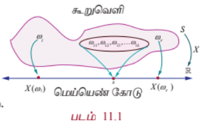

மெய்யெண் கோட்டின் மீதான கூறுவெளி $S$ -இன் சில கூறுபுள்ளிகள் $\omega_i$ அல்லது நிகழ்வுகளின் வரைபடத்தை படம் 11.1-ல் காணலாம்.

சான்றாக, $\omega_{11}, \omega_{12}, \omega_{13}, \ldots, \omega_{1k} \in S$ –க்கு $x$ என்பது $X$ -இன் ஒரு சாத்தியமான மதிப்பு எனில் $\omega_{11}, \omega_{12}, \omega_{13}, \ldots, \omega_{1k}$ என்பது $x$ –இன் நேர்மாறு மதிப்பாகும்.

அதாவது $X^{-1}(x) = \{\omega_{11}, \omega_{12}, \omega_{13}, \ldots, \omega_{1k}\}$ என்பது $S$–இல் ஒரு நிகழ்வாகும்.

---

### விளக்க எடுத்துக்காட்டு 11.1

ஒரு நாணயம் ஒரு முறை சுண்டப்படுகிறது என்க. $H$(தலை) மற்றும் $T$(பூ) என இரு கூறுபுள்ளிகள் கூறுவெளியில் உள்ளன.

அதாவது $S = \{T, H\}$.

$X : S \rightarrow \mathbb{R}$ என்பது தலைகளின் எண்ணிக்கை என்க.

அதாவது $X(T) = 0$, மற்றும் $X(H) = 1$ ஆகும்.

எனவே $X$ எனும் சமவாய்ப்பு மாறி 0 மற்றும் 1 ஆகிய மதிப்புகளைப் பெறுகிறது. $X(\omega)$ என்பது தலைகளின் எண்ணிக்கையைக் குறித்தால்

$$
X(\omega) =
\begin{cases}
0, & \omega = T \\
1, & \omega = H
\end{cases}
$$

---

### எடுத்துக்காட்டு 11.1

இரு நாணயங்கள் ஒரு முறை சுண்டப்படுகின்றன. $X$ என்பது பூக்களின் எண்ணிக்கையைக் குறித்தால், (i) கூறுவெளியை எழுதுக (ii) 1–ன் நேர்மாறு பிம்பத்தைக் காண்க (iii) சமவாய்ப்பு மாறியின் மதிப்புகள், மற்றும் நேர்மாறு பிம்பங்களில் உள்ள உறுப்புகளின் எண்ணிக்கையைக் காண்க.

#### தீர்வு

(i) கூறுவெளி $S = \{(H, T), (T, H), (T, T), (H, H)\}$

அதாவது $S = \{TT, TH, HT, HH\}$

(ii) $X : S \rightarrow \mathbb{R}$ என்பது பூக்களின் எண்ணிக்கை என்க.

எனவே $X(TT) = 2$ (2 பூக்கள்)

$X(TH) = 1$ (1 பூ)

$X(HT) = 1$ (1 பூ)

மற்றும் $X(HH) = 0$ (0 பூக்கள்).

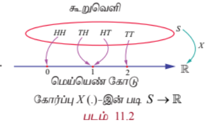

இனி $X$ என்பது 0, 1 மற்றும் 2 ஆகிய மதிப்புகளைப் பெறும் சமவாய்ப்பு மாறியாகும்.

$X(\omega)$ என்பது பூக்களின் எண்ணிக்கையைக் குறிப்பிடுகிறது என்க, இதிலிருந்து

$$
X(\omega) =
\begin{cases}
2, & \omega = TT \\
1, & \omega = HT, TH \\
0, & \omega = HH
\end{cases}
$$

எனப் பெறுகிறோம்.

1-இன் நேர்மாறு பிம்பங்கள் $TH, HT$ ஆகும். அதாவது $X^{-1}(1) = \{TH, HT\}$.

(iii) நேர்மாறு பிம்பங்களில் உறுப்புகளின் எண்ணிக்கை பட்டியலில் காட்டப்பட்டுள்ளது.

| சமவாய்ப்பு மாறியின் மதிப்புகள் | 0 | 1 | 2 | மொத்தம் |
|---|---|---|---|---|
| நேர்மாறு பிம்பங்களில் உறுப்புகளின் எண்ணிக்கை | 1 | 2 | 1 | 4 |

---

### எடுத்துக்காட்டு 11.2

சீரான இரு பகடைகள் உருட்டப்படுவதாகக் கொள்வோம். $X$ என்பது இரு பகடையில் கிடைக்கும் எண்களின் மொத்தக் கூட்டுத் தொகை எனில், (i) கூறுவெளி (ii) $X$ எனும் சமவாய்ப்பு மாறி எடுக்கும் மதிப்புகள், (iii) 10-இன் நேர்மாறு பிம்பம், மற்றும் (iv) $X$-ன் நேர்மாறு பிம்பத்தில் உள்ள உறுப்புகளின் எண்ணிக்கை ஆகியவற்றைக் காண்க.

#### தீர்வு

(i) கூறுவெளி

$$S = \begin{Bmatrix}
(1,1), (1,2), (1,3), (1,4), (1,5), (1,6) \\
(2,1), (2,2), (2,3), (2,4), (2,5), (2,6) \\
(3,1), (3,2), (3,3), (3,4), (3,5), (3,6) \\
(4,1), (4,2), (4,3), (4,4), (4,5), (4,6) \\
(5,1), (5,2), (5,3), (5,4), (5,5), (5,6) \\
(6,1), (6,2), (6,3), (6,4), (6,5), (6,6)
\end{Bmatrix}$$

36 வரிசைப்படுத்தப்பட்ட சோடிகள் $(\alpha, \beta)$ -இல் உள்ளன. இங்கு $\alpha$ மற்றும் $\beta$ ஆகியவை 1 முதல் 6 வரை படத்திலிருப்பது போல் எந்தவொரு முழு எண் மதிப்பையும் பெறும். ஒவ்வொரு புள்ளி $(\alpha, \beta)$ என்பதற்கும் $X$ என்பது பகடையின் மேலுள்ள எண்களின் கூடுதல் என ஒதுக்கீடு செய்யப்படுகிறது.

அதாவது $X(\alpha, \beta) = \alpha + \beta$ ஆகும்.

எனவே

$X(1,1) = 1 + 1 = 2$

$X(1,2) = X(2,1) = 3$

$X(1,3) = X(2,2) = X(3,1) = 4$

$X(1,4) = X(2,3) = X(3,2) = X(4,1) = 5$

$X(1,5) = X(2,4) = X(3,3) = X(4,2) = X(5,1) = 6$

$X(1,6) = X(2,5) = X(3,4) = X(4,3) = X(5,2) = X(6,1) = 7$

$X(2,6) = X(3,5) = X(4,4) = X(5,3) = X(6,2) = 8$

$X(3,6) = X(4,5) = X(5,4) = X(6,3) = 9$

$X(4,6) = X(5,5) = X(6,4) = 10$

$X(5,6) = X(6,5) = 11$

$X(6,6) = 12$.

(ii) எனவே $X$ எனும் சமவாய்ப்பு மாறி 2, 3, 4, 5, 6, 7, 8, 9, 10, 11, 12 ஆகிய மதிப்புகளைப் பெறுகிறது.

(iii) 10-இன் நேர்மாறு பிம்பம் $\{(4,6), (5,5), (6,4)\}$ ஆகும்.

(iv) நேர்மாறு பிம்பங்களில் எண்ணிக்கை கீழே பட்டியலிடப்பட்டுள்ளது.

| சமவாய்ப்பு மாறியின் மதிப்புகள் | 2 | 3 | 4 | 5 | 6 | 7 | 8 | 9 | 10 | 11 | 12 | மொத்தம் |
|---|---|---|---|---|---|---|---|---|---|---|---|---|
| நேர்மாறு பிம்பங்களில் உறுப்புகளின் எண்ணிக்கை | 1 | 2 | 3 | 4 | 5 | 6 | 5 | 4 | 3 | 2 | 1 | 36 |

---

### எடுத்துக்காட்டு 11.3

ஒரு ஜாடியில் 2 வெள்ளை பந்துகள் மற்றும் 3 சிவப்பு பந்துகள் உள்ளன. சமவாய்ப்பு முறையில் 3 பந்துகள் ஜாடியிலிருந்து தேர்ந்தெடுக்கப்படுகின்றன. $X$ என்பது தேர்ந்தெடுக்கும் சிவப்பு பந்துகளின் எண்ணிக்கையைக் குறிப்பிட்டால், சமவாய்ப்பு மாறி $X$ -இன் மதிப்புகளையும் அதன் நேர்மாறு பிம்பங்களில் எண்ணிக்கையையும் காண்க.

#### தீர்வு

வெள்ளை மற்றும் சிவப்பு பந்துகளை, $w_1, w_2, r_1, r_2$, மற்றும் $r_3$ எனக் குறிப்பிடுவோம்.

கூறுவெளியில் $^5C_3 = 10$ வெவ்வேறு 3 எண்ணிக்கை அளவுள்ள கூறுகள் உள்ளன.

அதாவது $S = \{w_1w_2r_1, w_1w_2r_2, w_1w_2r_3, w_1r_1r_2, w_1r_1r_3, w_1r_2r_3, w_2r_1r_2, w_2r_1r_3, w_2r_2r_3, r_1r_2r_3\}$.

சமவாய்ப்பு மாறி $X$ எடுக்கும் மதிப்புகள் 1, 2, மற்றும் 3 ஆகும்.

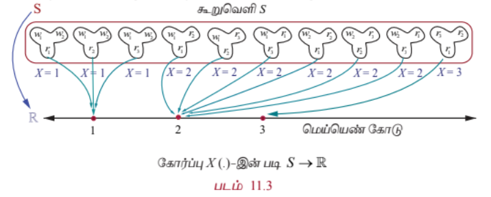

| சமவாய்ப்பு மாறி $X$-இன் மதிப்புகள் | 1 | 2 | 3 | மொத்தம் |
|---|---|---|---|---|
| நேர்மாறு பிம்பங்களில் உறுப்புகளின் எண்ணிக்கை | 3 | 6 | 1 | 10 |

#### குறிப்புரை

$X$ என்பது வெள்ளை பந்துகளின் எண்ணிக்கையைக் குறிப்பிட்டால் $X$ எடுக்கக் கூடிய மதிப்புகள் 0, 1, மற்றும் 2 ஆகும். நேர்மாறு பிம்பங்களில் எண்ணிக்கை கீழ்க்காணுமாறு பட்டியலிடப்படுகிறது.

| சமவாய்ப்பு மாறி $X$-இன் மதிப்புகள் | 0 | 1 | 2 | மொத்தம் |
|---|---|---|---|---|
| நேர்மாறு பிம்பங்களில் உறுப்புகளின் எண்ணிக்கை | 1 | 6 | 3 | 10 |

---

### விளக்க எடுத்துக்காட்டு 11.2

150 மாணவர்களைக் கொண்ட ஒரு குழு 4 பேருந்துகளில் சுற்றுலாவிற்குச் செல்கின்றனர். ஒரு பேருந்தில் 38 மாணவர்களும், இரண்டாவது பேருந்தில் 36 மாணவர்களும், மூன்றாவது பேருந்தில் 32 மாணவர்களும், மீதமுள்ள மாணவர்கள் நான்காவது பேருந்திலும் பயணித்தனர். சேருமிடம் வந்ததும் அந்த 150 மாணவர்களில் ஒருவர் சமவாய்ப்பு முறையில் தேர்ந்தெடுக்கப்பட்டார். $X$ என்பது சமவாய்ப்பு முறையில் தேர்ந்தெடுக்கப்பட்ட மாணவன் இருந்த பேருந்திலுள்ள மாணவர்களின் எண்ணிக்கையைக் குறிக்கிறது என்க. எனவே $X$ என்பது 32, 36, 38, மற்றும் 44 ஆகிய மதிப்புகளைக் கொண்டிருக்கும்.

---

### எடுத்துக்காட்டு 11.4

6 வெள்ளை மற்றும் 4 கருப்பு பந்துகள் கொண்ட ஒரு ஜாடியிலிருந்து இரு பந்துகள் சமவாய்ப்பு முறையில் தேர்ந்தெடுக்கப்படுகின்றன. தேர்ந்தெடுக்கப்படும் ஒவ்வொரு கருப்பு பந்திற்கும் ` 30 வெல்வதாகவும் தேர்ந்தெடுக்கப்படும் ஒவ்வொரு வெள்ளை பந்திற்கும் ` 20 தோற்பதாகவும் கொள்க. வெல்லும் தொகையை $X$ குறிப்பதாகக் கொண்டால், $X$ -இன் மதிப்புகளையும் மற்றும் அதன் நேர்மாறு பிம்பங்களில் புள்ளிகளின் எண்ணிக்கையும் காண்க.

#### தீர்வு

சாத்தியமான தீர்வுகள் (i) இரண்டுமே கருப்பாக இருக்கலாம் அல்லது (ii) ஒரு வெள்ளை மற்றும் ஒரு கருப்பு அல்லது (iii) இரண்டுமே வெள்ளையாக இருக்கலாம். எனவே $X$ என்பது பின்வரும் மதிப்புகளைக் கொண்டிருக்கும் சமவாய்ப்பு மாறியாகும்.

$X$ (இரண்டுமே கருப்பு பந்துகள்) = ` $2(30) = $60$

$X$ (ஒரு கருப்பு மற்றும் ஒரு வெள்ளை பந்து) = ` $30 - $20 = $10$

$X$ (இரண்டுமே வெள்ளை பந்துகள்) = ` $2(-20) = -$40$

எனவே $X$ ஆனது 60, 10, மற்றும் -40 மதிப்புகளைக் கொண்டிருக்கும்.

| சமவாய்ப்பு மாறி $X$-இன் மதிப்புகள் | 60 | 10 | -40 | மொத்தம் |
|---|---|---|---|---|
| நேர்மாறு பிம்பங்களில் உறுப்புகளின் எண்ணிக்கை | 6 | 24 | 15 | 45 |

(60-இன் நேர்மாறு பிம்பம் $\{r_1r_2, r_1r_3, r_1r_4, r_2r_3, r_2r_4, r_3r_4\}$ ஆகும்.)

---

### விளக்க எடுத்துக்காட்டு 11.3

தலை நிகழும்வரை ஒரு நாணயம் சுண்டப்படுகிறது. அதன் கூறுவெளி

$S = \{H, TH, TTH, TTTH, \ldots\}$ ஆகும்.

தலை நிகழும்வரை சுண்டப்படும் எண்ணிக்கையை $X$ என்க.

இனி $X$ எனும் சமவாய்ப்பு மாறி 1, 2, 3, $\ldots$ முதலிய மதிப்புகளைக் கொண்டிருக்கும்.

---

### விளக்க எடுத்துக்காட்டு 11.4

$N$ என்பது ஒரு கால இடைவெளியில் உதவிமையத்திற்குச் சென்று வரிசையில் காத்திருக்கும் நுகர்வோர்களின் எண்ணிக்கை எனில் குறையற்ற எண்களின் கணமாகத்தான் கூறுவெளி அமையும். அதாவது $S = \{0, 1, 2, 3, \ldots\}$ மற்றும் $N$ என்பது ஒரு சமவாய்ப்பு மாறி கொண்டிருக்கும் மதிப்புகள் $0, 1, 2, 3, \ldots$ ஆகும்.

---

### விளக்க எடுத்துக்காட்டு 11.5

ஒரு சோதனை மின் விளக்கின் ஆயுளை ஆராயும் எனில் மின்விளக்கின் ஆயுட்காலமாகக் கூறுவெளி அமையும். எனவே கூறுவெளியானது $S = [0, \infty)$ ஆகும். $X$ என்பது மின்விளக்கின் ஆயுட்காலத்தைக் குறித்தால், $X$ எனும் சமவாய்ப்பு மாறி கொண்டிருக்கும் மதிப்புகள் $[0, \infty)$ -ல் அமையும்.

---

### விளக்க எடுத்துக்காட்டு 11.6

$r$ ஆரமுள்ள ஒரு வட்டு $D$ என்க. $D$-இல் சமவாய்ப்பு முறையில் ஒரு புள்ளி தேர்ந்தெடுக்கப்படுகிறது. மையத்திலிருந்து புள்ளி இருக்கும் தொலைவை $X$ என்க. கூறுவெளி $S = D$ மற்றும் $X$ எனும் சமவாய்ப்பு மாறிக் கொண்டிருக்கும் மதிப்புகள் 0 முதல் $r$ வரை ஆகும். அதாவது $\forall \omega \in S$ -க்கு $X(\omega) \in [0, r]$ ஆகும்.

---

### பயிற்சி 11.1

1. $X$ என்பது மூன்று சீரான நாணயங்களை ஒரே சமயத்தில் ஒரு முறைச் சுண்டும்போது விழும் பூக்களின் எண்ணிக்கை என்க. சமவாய்ப்பு மாறியான $X$–இன் மதிப்புகளையும் அதன் நேர்மாறு பிம்பங்களில் உள்ள புள்ளிகளின் எண்ணிக்கையையும் காண்க.

2. ஒரு கூடையில் 5 மாங்கனிகள் மற்றும் 4 ஆப்பிள்கள் உள்ளன. அதிலிருந்து மூன்று பழங்கள் சமவாய்ப்பு முறையில் தேர்ந்தெடுக்கப்படுகின்றன. அவ்வாறு தேர்ந்தெடுக்கும் பழங்கள் ஆப்பிள்கள் எனில், சமவாய்ப்பு மாறியான $X$–இன் மதிப்புகளையும் அதன் நேர்மாறு பிம்பங்களில் உள்ள புள்ளிகளின் எண்ணிக்கையையும் காண்க.

3. 6 சிவப்பு மற்றும் 8 கருப்பு பந்துகள் உள்ள ஒரு கொள்கலனிலிருந்து இரு பந்துகள் சீரான முறையில் தேர்ந்தெடுக்கப்படுகின்றன. அவ்வாறு தேர்ந்தெடுக்கப்படும் ஒவ்வொரு சிவப்பு பந்திற்கும் ` 15 வெல்வதாகவும் தேர்ந்தெடுக்கப்படும் ஒவ்வொரு கருப்பு பந்திற்கும் ` 10 தோற்பதாகவும் கொள்க. வெல்லும் தொகையை $X$ குறிப்பதாகக் கொண்டால் $X$ -இன் மதிப்புகளையும் மற்றும் அதன் நேர்மாறு பிம்பங்களில் புள்ளிகளின் எண்ணிக்கையையும் காண்க.

4. ஆறு பக்க பகடை ஒன்றின் ஒரு பக்கத்தில் ‘2’ எனக் குறிக்கப்பட்டுள்ளது. அதன் இரண்டு பக்கங்களில் ‘3’ எனவும், மீதமுள்ள மூன்று பக்கங்களில் ‘4’ எனவும் உள்ளது. இருமுறை பகடை உருட்டப்படுகிறது. $X$ என்பது இரு உருட்டல்களில் கிடைக்கும் எண்களின் கூட்டுத் தொகையை குறிக்கிறது எனில், $X$ –இன் மதிப்புகளையும் மற்றும் அதன் நேர்மாறு பிம்பங்களில் புள்ளிகளின் எண்ணிக்கையையும் காண்க.

# 11.3 சமவாய்ப்பு மாறிகளின் வகைகள் (Types of Random Variable)

இந்த அத்தியாயத்தில் இரு வகை சமவாய்ப்பு மாறிகளைப் பற்றி மட்டும் பார்ப்போம். அவற்றில் ஒன்று எண்ணிடதக்க மதிப்புகளைக் கொண்டிருக்கும் ஒரு சமவாய்ப்பு மாறி மற்றும் மற்றொன்று தொடர்ச்சியான மதிப்புகளைக் கொண்டிருக்கும் சமவாய்ப்பு மாறியாகும். அதாவது,

(i) தனிநிலை சமவாய்ப்பு மாறி (எண்ணத்தக்க அளவை)

(ii) தொடர்ச்சியான சமவாய்ப்பு மாறி (அளவிடத்தக்க அளவை)

---

## 11.3.1 தனிநிலை சமவாய்ப்பு மாறிகள் (Discrete random variables)

இப்பாடப்பகுதியில் நாம் பின்வருவனவற்றைப் பற்றி விவாதிக்கலாம்.

(i) தனிநிலை சமவாய்ப்பு மாறி

(ii) நிகழ்தகவு நிறைச் சார்பு

(iii) குவிவு பரவல் சார்பு

(iv) நிகழ்தகவு நிறைச்சார்பிலிருந்து குவிவு பரவல் சார்புபெறுதல்

(v) குவிவு பரவல் சார்பிலிருந்து நிகழ்தகவு நிறைச் சார்பு பெறுதல்

சமவாய்ப்பு மாறியின் வீச்சு கணமானது எண்களின் தனிநிலை கணம் எனில் சமவாய்ப்பு மாறியின் நேர்மாறு பிம்பம் முடிவுறு அல்லது எண்ணிடத்தக்க முடிவுறு கணமாக அமையும். அத்தகைய சமவாய்ப்பு மாறிகள் தனிநிலை சமவாய்ப்பு மாறிகள் என அழைக்கப்படுகின்றன. தனிநிலை கூறுவெளியில் வரையறுக்கப்படும் ஒரு சமவாய்ப்பு மாறி தனிநிலையாக இருக்கும்.

### வரையறை 11.2 (தனிநிலை சமவாய்ப்பு மாறி)

கூறுவெளி $S$–லிருந்து மெய்யெண்கள் $\mathbb{R}$–க்கு வரையறுக்கப்படும் $X$ எனும் ஒரு சமவாய்ப்பு மாறி, $X$–இன் வீச்சு எண்ணிடதக்கதாக இருந்தால் தனிநிலை சமவாய்ப்பு மாறியாகும். அதாவது, முடிவுறு அல்லது எண்ணிடதக்க முடிவுறா எண் மதிப்புகளை மட்டுமே கொண்டிருக்கும். இங்கு $S$ கணத்தில் உள்ள ஒவ்வொரு மதிப்பின் நிகழ்தகவும் மிகையெண் நிகழ்தகவுக் கொண்டதாகவும், நிகழ்தகவுகளின் மொத்த கூடுதல் ஒன்றாகவும் இருக்கும்.

### குறிப்புரை

தொடர் கூறுவெளியில் கூட தனிநிலை சமவாய்ப்பு மாறியை வரையறுக்க இயலும். சான்றாக,

(i) தொடர் கூறுவெளி $S = [0,1]$–இல், அனைத்து $\omega \in S$ -க்கு,

$$
X(\omega)=10
$$

என வரையறுக்கப்படும் சமவாய்ப்பு மாறி என்பது ஒரு தனிநிலை சமவாய்ப்பு மாறியாகும்.

(ii) தொடர் கூறுவெளி $S=[0,20]$–க்கு, வரையறுக்கப்படும் சமவாய்ப்பு மாறி

$$
X(\omega)=
\begin{array}{ll}
10, & \omega \in [0,10) \\
20, & \omega \in [10,20]
\end{array}
$$

என்பது ஒரு தனிநிலை சமவாய்ப்பு மாறியாகும்.

---

## 11.3.2 நிகழ்தகவு நிறைச் சார்பு (Probability Mass Function)

ஒரு தனிநிலை சமவாய்ப்பு மாறி குறிப்பிட்ட $x$ மதிப்பைப் பெறும்போது, அதாவது

$$
P(X=x)
$$

என்பது $f(x)$ அல்லது $p(x)$ எனக் குறிப்பிடப்படும். $f(x)$ எனும் சார்பு நிகழ்தகவு நிறைச் சார்பு என அழைக்கப்படுகிறது. இருப்பினும் சில நூலாசிரியர்கள் இதனை நிகழ்தகவு சார்பு எனவும் நிகழ்வெண் சார்பு எனவும் குறிப்பிடுகின்றனர். இப்பாடப்பகுதியில், சமவாய்ப்பு மாறி தனிநிலையாக இருக்கும்போது, வழக்கமான துறைச் சொல்லான நிகழ்தகவு நிறைச் சார்பு என்பது பயன்படுத்தப்படுகிறது மற்றும் அதன் வழக்கமான சுருக்கம் pmf ஆகும்.

### வரையறை 11.3 (நிகழ்தகவு நிறைச் சார்பு)

$x_1, x_2, x_3, \ldots, x_n, \ldots$ என்ற தனி மதிப்புகளைக் கொண்ட $X$ என்பது ஒரு தனிநிலை சமவாய்ப்பு மாறியெனில், சார்பு $f(.)$ அல்லது $p(.)$ எனக் குறிப்பிடப்படுகிறது. மேலும்

$$
f(x_k)=P(X=x_k), \quad k=1,2,3,\ldots
$$

என்பது நிகழ்தகவு நிறைச் சார்பாக வரையறுக்கப்படுகிறது.

### தேற்றம் 11.1 (நிரூபணமின்றி)

$f(x)$ எனும் சார்பு $x_1, x_2, x_3, \ldots, x_n, \ldots$ என்ற மெய்யெண் மதிப்புகளுக்கு நிகழ்தகவுச் சார்பாக தேவையானதும் மற்றும் போதுமானதுமான நிபந்தனைகளாகக் கீழ்க்காணும் பண்புகளைக் கொண்டிருக்க வேண்டும்.

(i)

$$
f(x_k)\ge 0,\quad k=1,2,3,\ldots
$$

(ii)

$$
\sum_{k} f(x_k)=1
$$

### குறிப்பு

(i)

$$
f(x_k)=P(X=x_k), \quad k=1,2,3,\ldots
$$

என்ற நிகழ்தகவுகளின் கணம், தனிநிலை சமவாய்ப்பு மாறியின் நிகழ்தகவுப் பரவல் என்றும் அழைக்கப்படுகின்றது.

(ii) சமவாய்ப்பு மாறி ஒரு சார்பு என்பதால் அதனை

(a) பட்டியல் முறை

(b) வரைபடம் முறை

(c) கோவை முறை

ஆகிய முறைகளில் குறிப்பிடலாம்.

---

### எடுத்துக்காட்டு 11.5

இரு சீரான நாணயங்கள் ஒரே சமயத்தில் சுண்டி விடப்படுகின்றன. (ஒரு சீரான நாணயம் இரு முறை சுண்டி விடப்படுவதற்கு சமானமானது). கிடைத்த தலைகளின் எண்ணிக்கைக்கு நிகழ்தகவு நிறைச் சார்பு காண்க.

### தீர்வு

கூறுவெளி

$$
S=\{TT,TH,HT,HH\}
$$

தலைகளின் எண்ணிக்கையைக் குறிக்கும் சமவாய்ப்பு மாறி $X$ என்க.

எனவே,

$$
X(TT)=0,
$$

$$
X(TH)=1,
$$

$$
X(HT)=1,
$$

மற்றும்

$$
X(HH)=2.
$$

எனவே சமவாய்ப்பு மாறி $X$–ஆனது $0,1,2$ ஆகிய மதிப்புகளைக் கொண்டிருக்கும்.

| சமவாய்ப்பு மாறியின் மதிப்பு | 0 | 1 | 2 | மொத்தம் |
|---|---|---|---|---|
| நேர்மாறு பிம்பங்களில் உறுப்புகளின் எண்ணிக்கை | 1 | 2 | 1 | 4 |

நிகழ்தகவு நிறைச் சார்பு கீழ்க்காணுமாறு கொடுக்கப்பட்டுள்ளது.

$$
f(0)=P(X=0)=\frac{1}{4}
$$

$$
f(1)=P(X=1)=\frac{1}{2}
$$

மற்றும்

$$
f(2)=P(X=2)=\frac{1}{4}
$$

சார்பு $f(x)$ கீழ்க்காணும் நிபந்தனைகளைப் பூர்த்தி செய்கிறது.

(i)

$
f(x)\ge 0,\quad x=0,1,2
$

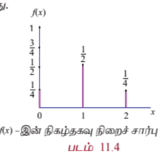

(ii) $$ \sum_x f(x) = \sum_{x=0}^{x=2} f(x) = f(0) + f(1) + f(2) $$

$$= \frac{1}{4} + \frac{1}{2} + \frac{1}{4} = 1$$

எனவே $f(x)$ என்பது ஒரு நிகழ்தகவு நிறைச் சார்பு ஆகும்.

நிகழ்தகவு நிறைச் சார்பு கீழ்க்காணுமாறு கொடுக்கப்பட்டுள்ளது.

| $x$ | 0 | 1 | 2 |
|-----|-----|-----|-----|
| $f(x)$ | $\frac{1}{4}$ | $\frac{1}{2}$ | $\frac{1}{4}$ |

(அல்லது)

$$
f(x)=
\begin{array}{ll}
\frac{1}{4}, & x=0 \\
\\
\frac{1}{2}, & x=1 \\
\\
\frac{1}{4}, & x=2
\end{array}
$$

### எடுத்துக்காட்டு 11.6

இரு சீரான பகடைகள் ஒரு முறை உருட்டப்படுகின்றன. கிடைத்த நான்குகளின் எண்ணிக்கைக்கான நிகழ்தகவு நிறைச் சார்பு காண்க.

$$S = \begin{Bmatrix}
(1,1), (1,2), (1,3), (1,4), (1,5), (1,6) \\
(2,1), (2,2), (2,3), (2,4), (2,5), (2,6) \\
(3,1), (3,2), (3,3), (3,4), (3,5), (3,6) \\
(4,1), (4,2), (4,3), (4,4), (4,5), (4,6) \\
(5,1), (5,2), (5,3), (5,4), (5,5), (5,6) \\
(6,1), (6,2), (6,3), (6,4), (6,5), (6,6)
\end{Bmatrix}$$

#### தீர்வு

நான்குகளின் எண்ணிக்கையை $x$ -இன் மதிப்புகளாகக் கொண்ட சமவாய்ப்பு மாறி $X$ என்க.

கூறுவெளி $S$ அட்டவணையாகத் தரப்பட்டுள்ளது. இதனை $S = \{(i, j)\}$ எனவும் எழுதலாம், இங்கு $i = 1, 2, 3, \ldots, 6$, மற்றும் $j = 1, 2, 3, \ldots, 6$ ஆகும்.

எனவே $X$ –ஆனது 0, 1, மற்றும் 2 ஆகிய மதிப்புகளைக் கொண்டிருக்கும்.

(i) $X = 0$, $\forall (i, j)$, $i \neq 4$ மற்றும் $j \neq 4$ எனில்

(ii) $X = 1$, $(1,4), (2,4), (3,4), (5,4), (6,4), (4,1), (4,2), (4,3), (4,5), (4,6)$ என்பவற்றில்

(iii) $X = 2$, $(4,4)$ -இல்

எனவே,

| சமவாய்ப்பு மாறி $X$-இன் மதிப்பு | 0 | 1 | 2 | மொத்தம் |
|---|---|---|---|---|
| நேர்மாறு பிம்பங்களில் உறுப்புகளின் எண்ணிக்கை | 25 | 10 | 1 | 36 |

நிகழ்தகவுகள்

$$f(0) = P(X = 0) = \frac{25}{36},$$

$$f(1) = P(X = 1) = \frac{10}{36}$$

மற்றும்

$$f(2) = P(X = 2) = \frac{1}{36}$$

ஆகும்.

இங்கு சார்பு $f(x)$ கீழ்க்காணும் நிபந்தனைகளைப் பூர்த்தி செய்கின்றது.

(i) $f(x) \ge 0$, $x = 0, 1, 2$ மற்றும்

(ii) $\sum_{x} f(x) = f(0) + f(1) + f(2) = \frac{25}{36} + \frac{10}{36} + \frac{1}{36} = 1$

நிகழ்தகவு நிறைச் சார்பு கீழ்க்காணுமாறு வழங்கப்படுகிறது.

| $x$ | 0 | 1 | 2 |
|---|---|---|---|
| $f(x)$ | $\frac{25}{36}$ | $\frac{10}{36}$ | $\frac{1}{36}$ |

(அல்லது)

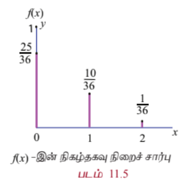

$$f(x) = \begin{cases}
\frac{25}{36}, & x = 0 \\
\frac{10}{36}, & x = 1 \\
\frac{1}{36}, & x = 2
\end{cases}$$

## 11.3.3 குவிவுப் பரவல் சார்பு அல்லது பரவல் சார்பு
### (Cumulative Distribution Function or Distribution Function)

பல தருணங்களில் நிகழ்தகவைக் கண்டறியும்பொழுது, சமவாய்ப்பு மாறி $X$, ஏற்கும் மதிப்புகளானது ஏதேனும் ஒரு மெய்யெண் $x$-க்கு குறைவாகவோ அல்லது சமமாகவோ இருப்பதைக் காணலாம். ஒவ்வொரு மெய்யெண் $x$ –க்கும் $F(x) = P(X \le x)$ என்றிருந்ததால், $F(x)$ -ஐ சமவாய்ப்பு மாறி $X$ -இன் குவிவு பரவல் சார்பு அல்லது பரவல் சார்பு என்று கூறலாம். பொதுவான சுருக்கம் cdf ஆகும்.

#### வரையறை 11.4 (குவிவு பரவல் சார்பு)

$x_1 < x_2 < x_3 < \cdots$ எனும்படி $x_1, x_2, x_3, \ldots$ மதிப்புகளுக்கு $f(x_i)$ –ஐ நிகழ்தகவு நிறைச் சார்பாகக் கொண்டிருக்கும் தனிநிலை சமவாய்ப்பு மாறி $X$ –இன் குவிவு பரவல் சார்பு ஆனது

$$F(x) = P(X \le x) = \sum_{x_i \le x} f(x_i), \quad x \in \mathbb{R}$$

ஆகும்.

தனிநிலை சமவாய்ப்பு மாறியின் பரவல் சார்பு தனிநிலை பரவல் சார்பு எனப்படுகிறது. எனினும், நிகழ்தகவு நிறைச் சார்பு $f(x)$ என்பது $x_1, x_2, x_3, \ldots$ எனும் தனிநிலை மதிப்புகள் கணத்திற்குத்தான் வரையறுக்கப்பட்டது. குவிவு பரவல் சார்பு $F(x)$ என்பது அனைத்து மெய் மதிப்புகளான $x \in \mathbb{R}$ –க்கு வரையறுக்கப்படுகிறது.

நிகழ்தகவு நிறை சார்பினைப் பயன்படுத்தி குவிவு பரவல் சார்பினைக் கணிக்கலாம்.

$$F(x) = P(X \le x) = \sum_{x_i \le x} P(X = x_i)$$

$X$ எனும் சமவாய்ப்பு மாறி, $x_1, x_2, x_3, \ldots, x_n$, ($x_1 < x_2 < x_3 < \cdots < x_n$) என்ற முடிவுறு எண்ணிக்கையிலான மதிப்புகளை மட்டும் கொண்டிருந்தால், அதன் குவிவு பரவல் சார்பினை கீழ்க்காணுமாறு வரையறுக்கலாம்.

$$F(x) = \begin{cases}
0, & x < x_1 \\
f(x_1), & x_1 \le x < x_2 \\
f(x_1) + f(x_2), & x_2 \le x < x_3 \\
f(x_1) + f(x_2) + f(x_3), & x_3 \le x < x_4 \\
\vdots \\
f(x_1) + f(x_2) + \cdots + f(x_n), & x \ge x_n
\end{cases}$$

தனிநிலை சமவாய்ப்பு மாறி $X$–க்கு, குவிவு பரவல் சார்பு கீழ்க்காணும் பண்புகளைப் பூர்த்தி செய்கிறது.

(i) அனைத்து $x \in \mathbb{R}$ -க்கு $0 \le F(x) \le 1$,

(ii) $F(x)$, ஒரு மெய் மதிப்புடையக் குறைவுறாச் சார்பு ஆகும். $x \le y$ எனில், $F(x) \le F(y)$.

(iii) $F(x)$ ஒரு வலப்பக்கத் தொடர் சார்பு ஆகும். $\lim_{x \to a^+} F(x) = F(a)$.

(iv) $\lim_{x \to -\infty} F(x) = F(-\infty) = 0$.

(v) $\lim_{x \to \infty} F(x) = F(\infty) = 1$.

(vi) $P(x_1 < X \le x_2) = F(x_2) - F(x_1)$.

(vii) $P(X \ge x) = 1 - P(X < x) = 1 - F(x)$.

(viii) $P(X = x_k) = F(x_k) - F(x_k^-)$.

### குறிப்பு

சில நூலாசிரியர்கள் குவிவு பரவல் சார்பு $F(x)$-இன் வரையறைக்கு வலப்பக்கத் தொடர்ச்சிக்கு பதிலாக இடப்பக்க தொடர்ச்சியைப் பயன்படுத்துகிறார்கள்.

### 11.3.4 நிகழ்தகவு நிறை சார்பிலிருந்து குவிவு பரவல் சார்பு
#### (Cumulative Distribution Function from Probability Mass function)

ஒரு தனிநிலை சமவாய்ப்பு மாறி $X$ –இன் நிகழ்தகவு நிறை சார்பு மற்றும் குவிவு பரவல் சார்பு ஆகிய இரண்டும் $X$ –இன் அனைத்து நிகழ்தகவு தகவல்களையும் கொண்டிருக்கும். $X$ –ன் நிகழ்தகவு பரவலை இந்த இரண்டிலொன்று தீர்மானிக்க இயலும். உண்மையில், தனிநிலை சமவாய்ப்பு மாறி $X$ –இன் பரவல் சார்பு $F$-இனை $X$-இன் நிகழ்தகவு நிறைச்சார்பு $f(x)$ மூலமாக விளக்கலாம். அதற்கு நேர்மாறாகவும் விளக்கலாம்.

### எடுத்துக்காட்டு 11.7

சமவாய்ப்பு மாறி $X$ –இன் நிகழ்தகவு நிறை சார்பு $f(x)$ என்பது

| $x$ | 1 | 2 | 3 | 4 |
|---|---|---|---|---|
| $f(x)$ | $\frac{1}{12}$ | $\frac{5}{12}$ | $\frac{5}{12}$ | $\frac{1}{12}$ |

எனில், (i) அதன் குவிவு பரவல் சார்பு காண்க. அதன் மூலமாக (ii) $P(X \le 3)$ மற்றும், (iii) $P(X \ge 2)$ ஆகியவற்றைக் காண்க

#### தீர்வு

(i) வரையறைப்படி தனிநிலை சமவாய்ப்பு மாறிக்கான குவிவு பரவல் சார்பு

$$F(x) = P(X \le x) = \sum_{x_i \le x} P(X = x_i)$$

$P(X < 1) = 0$, $-\infty < x < 1$.

$$F(1) = P(X \le 1) = \sum_{x_i \le 1} P(X = x_i) = P(X = 1) = \frac{1}{12}$$

$$F(2) = P(X \le 2) = \sum_{x_i \le 2} P(X = x_i) = P(X = 1) + P(X = 2)$$

$$= 0 + \frac{1}{12} + \frac{5}{12} = \frac{1}{2}$$

$$F(3) = P(X \le 3) = \sum_{x_i \le 3} P(X = x_i) = P(X = 1) + P(X = 2) + P(X = 3)$$

$$= 0 + \frac{1}{12} + \frac{5}{12} + \frac{5}{12} = \frac{11}{12}$$

$$F(4) = P(X \le 4) = \sum_{x_i \le 4} P(X = x_i) = P(X = 1) + P(X = 2) + P(X = 3) + P(X = 4)$$

$$= 0 + \frac{1}{12} + \frac{5}{12} + \frac{5}{12} + \frac{1}{12} = 1$$
எனவே குவிவு பரவல் சார்பானது

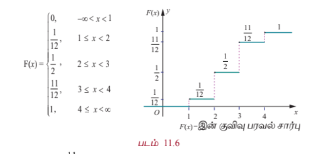

$$F(x) = \begin{cases}
0, & -\infty < x < 1 \\
\frac{1}{12}, & 1 \le x < 2 \\
\frac{1}{2}, & 2 \le x < 3 \\
\frac{11}{12}, & 3 \le x < 4 \\
1, & x \ge 4
\end{cases}$$

(ii) $P(X \le 3) = F(3) = \frac{11}{12}$.

(iii) $P(X \ge 2) = 1 - P(X < 2) = 1 - P(X \le 1) = 1 - F(1) = 1 - \frac{1}{12} = \frac{11}{12}$.

### எடுத்துக்காட்டு 11.8

ஓர் ஆறு பக்க பகடையின் ஒரு பக்கத்தில் '1' என குறிக்கப்படுகிறது. அதன் இரு பக்கங்களில் '2' எனவும் மீதமுள்ள மூன்று பக்கங்களில் '3' எனவும் குறிக்கப்படுகிறது. இரு முறை பகடை உருட்டப்படுகிறது. இருமுறை எறிதலின் மொத்தத் தொகையை $X$ குறிக்கிறது எனில்

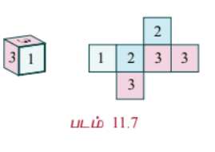

(i) நிகழ்தகவு நிறை சார்பு காண்க.

(ii) குவிவு பரவல் சார்பு காண்க.

(iii) $P(X < 6)$ காண்க

(iv) $P(X \ge 4)$ காண்க.

#### தீர்வு

இருமுறை எறிதலின் மொத்தத் தொகை $X$ -ஐ குறிப்பதால், $X$ -ஆனது 2, 3, 4, 5, மற்றும் 6 ஆகிய மதிப்புகளைக் கொண்டிருக்கும்.

அருகிலுள்ள அட்டவணை $S$-லிருந்து,

| சமவாய்ப்பு மாறியின் மதிப்பு | 2 | 3 | 4 | 5 | 6 | மொத்தம் |
|---|---|---|---|---|---|---|
| நேர்மாறு பிம்பங்களில் உறுப்புகளின் எண்ணிக்கை | 1 | 4 | 10 | 12 | 9 | 36 |

$$P(X = 2) = \frac{1}{36}, \quad P(X = 3) = \frac{4}{36}$$

$$P(X = 4) = \frac{10}{36}, \quad P(X = 5) = \frac{12}{36}$$

மற்றும்

$$P(X = 6) = \frac{9}{36}$$

### கூறுவெளி $S$

| II I | 1 | 2 | 2 | 3 | 3 | 3 |
|---|---|---|---|---|---|---|
| 1 | 2 | 3 | 3 | 4 | 4 | 4 |
| 2 | 3 | 4 | 4 | 5 | 5 | 5 |
| 2 | 3 | 4 | 4 | 5 | 5 | 5 |
| 3 | 4 | 5 | 5 | 6 | 6 | 6 |
| 3 | 4 | 5 | 5 | 6 | 6 | 6 |
| 3 | 4 | 5 | 5 | 6 | 6 | 6 |

### படம் 11.6

### படம் 11.7

(i) நிகழ்தகவு நிறை சார்பானது

| $x$ | 2 | 3 | 4 | 5 | 6 |
|---|---|---|---|---|---|
| $f(x)$ | $\frac{1}{36}$ | $\frac{4}{36}$ | $\frac{10}{36}$ | $\frac{12}{36}$ | $\frac{9}{36}$ |

(ii) குவிவு பரவல் சார்பு

வரையறைப்படி தனிநிலை சமவாய்ப்பு மாறியின் குவிவு பரவல் சார்பானது,

$$F(x) = P(X \le x) = \sum_{x_i \le x} P(X = x_i)$$

$P(X < x) = 0$, $x < 2$.

$$F(2) = P(X \le 2) = \sum_{x_i \le 2} P(X = x_i) = P(X = 2) 

= 0 + \frac{1}{36} = \frac{1}{36}$$

$$F(3) = P(X \le 3) = \sum_{x_i \le 3} P(X = x_i) = P(X = 2) + P(X = 3) = 0 + \frac{1}{36} + \frac{4}{36} = \frac{5}{36}$$

$$F(4) = P(X \le 4) = \sum_{x_i \le 4} P(X = x_i) = P(X = 2) + P(X = 3) + P(X = 4) = 0 + \frac{1}{36} + \frac{4}{36} + \frac{10}{36} = \frac{15}{36}$$

$$F(5) = P(X \le 5) = \sum_{x_i \le 5} P(X = x_i) = P(X = 2) + P(X = 3) + P(X = 4) + P(X = 5) = 0 + \frac{1}{36} + \frac{4}{36} + \frac{10}{36} + \frac{12}{36} = \frac{27}{36}$$

$$F(6) = P(X \le 6) = \sum_{x_i \le 6} P(X = x_i) = P(X = 2) + P(X = 3) + P(X = 4) + P(X = 5) + P(X = 6) = 0 + \frac{1}{36} + \frac{4}{36} + \frac{10}{36} + \frac{12}{36} + \frac{9}{36} = 1$$

எனவே, குவிவு பரவல் சார்பானது,

$$F(x) = \begin{cases}
0, & x < 2 \\
\frac{1}{36}, & 2 \le x < 3 \\
\frac{5}{36}, & 3 \le x < 4 \\
\frac{15}{36}, & 4 \le x < 5 \\
\frac{27}{36}, & 5 \le x < 6 \\
1, & x \ge 6
\end{cases}$$

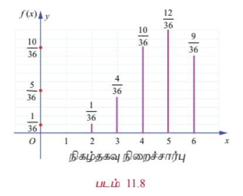
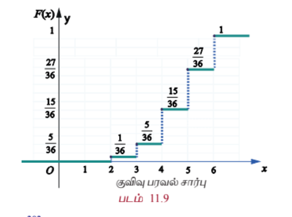

(iii) $P(X < 6) = \sum_{x_i < 6} P(X = x_i) = P(X = 3) + P(X = 4) + P(X = 5)$

$$= \frac{4}{36} + \frac{10}{36} + \frac{12}{36} = \frac{26}{36}$$

(iv) $P(X \ge 4) = \sum_{x_i \ge 4} P(X = x_i) = P(X = 4) + P(X = 5) + P(X = 6)$

$$= \frac{10}{36} + \frac{12}{36} + \frac{9}{36} = \frac{31}{36}$$

## 11.3.5 குவிவு பரவல் சார்பிலிருந்து நிகழ்தகவு நிறை சார்பு
### (Probability Mass Function from Cumulative Distribution Function)

ஒரு தனிநிலை சமவாய்ப்பு மாறி $X$-க்கு, குவிவு பரவல் சார்பு $F$ ஒவ்வொரு $x_i$ -யிலும் துள்ளல் இருக்கும். மேலும் அடுத்தடுத்த $x_i$ -களில் மாறாமலும் இருக்கும். $x_i$ -இல் இருக்கும் துள்ளலின் உயரம் $f(x_i)$; இதே முறையில் $F$ -லிருந்து $x_i$ -இன் நிகழ்தகவை மீட்டெடுக்கலாம்.

$x_1 < x_2 < x_3 < \cdots$ என்றவாறு இருக்கும் $x_1, x_2, x_3, \ldots$ மதிப்புகளைக் கொண்டிருக்கும் தனிநிலை சமவாய்ப்பு மாறி $X$ என்க. மற்றும் $F(x_i)$ என்பது பரவல் சார்பாகும். எனவே நிகழ்தகவு நிறை சார்பு $f(x_i)$ ஆனது,

$$f(x_i) = F(x_i) - F(x_{i-1}), \quad i = 1, 2, 3, \ldots$$

ஆகும்.

### குறிப்பு

$x = a$ -ல் $F(x)$ சார்பின் துள்ளல் $F(a) - F(a^-)$ ஆகும். $F$ குறைவுறாமலும் மற்றும் வலப்பக்கமாக தொடர்ச்சியாகவும் இருப்பதால், குவிவு பரவல் சார்பு $F$ -ன் துள்ளல் $P(X = x) = F(x) - F(x^-)$ ஆகும்.

இங்கு துள்ளல் (தொடர்ச்சியில் இல்லாமல் இருப்பதால்) நிகழ்தகவாக நிகழ்கிறது. அதாவது ஒரு குவிவு பரவல் சார்பின் தொடர்ச்சியற்றவைகளின் கணம் எண்ணத்தக்கது!

## எடுத்துக்காட்டு 11.9

கீழே கொடுக்கப்பட்டுள்ள குவிவு பரவல் சார்பு $F(x)$ -இன் தனிநிலை சமவாய்ப்பு மாறி $X$ -யின் நிகழ்தகவு நிறைசார்பினைக் காண்க.

$$F(x) = \begin{cases}
0, & x < -2 \\
0.25, & -2 \le x < -1 \\
0.60, & -1 \le x < 0 \\
0.90, & 0 \le x < 1 \\
1, & x \ge 1
\end{cases}$$

மேலும் (i) $P(X < 0)$ மற்றும் (ii) $P(X \ge 1)$ காண்க.

#### தீர்வு

$X$ என்பது ஒரு தனிநிலை சமவாய்ப்பு மாறி என்பதால், கொடுக்கப்பட்ட தகவல்களிலிருந்து, $X$ பின்வரும் மதிப்புகளான $-2, -1, 0$ மற்றும் $1$ ஆகியவற்றைப் பெறும்.

வரையறைப்படி தனிநிலை சமவாய்ப்பு மாறி $X$-க்கு, $f(x) = P(X = x)$

எனவே $F(x)$-இன் $x = -2$ -ல் இடப்பக்க எல்லை $F(-2^-)$ ஆகும்.

$$f(-2) = P(X = -2) = F(-2) - F(-2^-) = 0.25 - 0 = 0.25$$

இதே போன்று ஏனைய துள்ளல் புள்ளிகளுக்கும்,

$$f(-1) = P(X = -1) = F(-1) - F(-1^-) = 0.60 - 0.25 = 0.35$$

$$f(0) = P(X = 0) = F(0) - F(0^-) = 0.90 - 0.60 = 0.30$$

$$f(1) = P(X = 1) = F(1) - F(1^-) = 1 - 0.90 = 0.10$$

எனப் பெறப்படுகிறது.

எனவே நிகழ்தகவு நிறை சார்பானது

| $x$ | $-2$ | $-1$ | $0$ | $1$ |
|---|---|---|---|---|
| $f(x)$ | $0.25$ | $0.35$ | $0.30$ | $0.10$ |

ஆகும்.

$F(x)$ எனும் பரவல் சார்பிற்கு $x = -2, -1, 0$, மற்றும் $1$-ல் துள்ளல்கள் உள்ளன. அந்த துள்ளல்கள் முறையே, $0.25, 0.35, 0.30$ மற்றும் $0.10$ என கீழ்க்காணும் படத்தில் காண்பிக்கப்பட்டுள்ளது.

இந்த துள்ளல்களே நிகழ்தகவு நிறைச் சார்பினைத் தீர்மானிக்கின்றன.

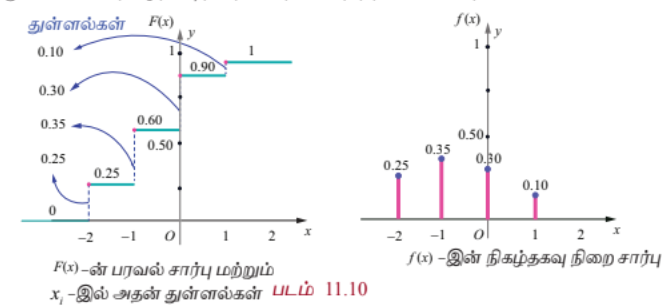

### படம் 11.10

(i) $P(X < 0) = \sum_{x < 0} P(X = x) = P(X = -2) + P(X = -1) = 0.25 + 0.35 = 0.60$

(ii) $P(X \ge 1) = \sum_{x \ge 1} P(X = x) = P(X = 1) = 0.10$

## எடுத்துக்காட்டு 11.10

ஒரு தனிநிலை சார்பு $X$ -ன் நிகழ்தகவு நிறை சார்பானது

| $x$ | 1 | 2 | 3 | 4 | 5 | 6 |
|---|---|---|---|---|---|---|
| $f(x)$ | $k$ | $2k$ | $6k$ | $5k$ | $6k$ | $10k$ |

எனில், (i) $P(2 < X < 6)$ (ii) $P(2 \le X \le 5)$ (iii) $P(X \le 4)$ (iv) $P(X > 3)$ என்பவற்றைக் காண்க.

#### தீர்வு

கொடுக்கப்பட்ட சார்பு நிகழ்தகவு நிறை சார்பு என்பதால் மொத்த நிகழ்தகவு ஒன்றாகும். அதாவது $\sum_x f(x) = 1$ ஆகும்.

கொடுக்கப்பட்ட தகவல்களிலிருந்து $k + 2k + 6k + 5k + 6k + 10k = 1$

$30k = 1 \implies k = \frac{1}{30}$

எனவே நிகழ்தகவு நிறை சார்பானது,

| $x$ | 1 | 2 | 3 | 4 | 5 | 6 |
|---|---|---|---|---|---|---|
| $f(x)$ | $\frac{1}{30}$ | $\frac{2}{30}$ | $\frac{6}{30}$ | $\frac{5}{30}$ | $\frac{6}{30}$ | $\frac{10}{30}$ |

(i) $P(2 < X < 6) = f(3) + f(4) + f(5) = \frac{6}{30} + \frac{5}{30} + \frac{6}{30} = \frac{17}{30}$

(ii) $P(2 \le X \le 5) = f(2) + f(3) + f(4) + f(5) = \frac{2}{30} + \frac{6}{30} + \frac{5}{30} + \frac{6}{30} = \frac{19}{30}$

(iii) $P(X \le 4) = f(1) + f(2) + f(3) + f(4) = \frac{1}{30} + \frac{2}{30} + \frac{6}{30} + \frac{5}{30} = \frac{14}{30}$

(iv) $P(X > 3) = f(4) + f(5) + f(6) = \frac{5}{30} + \frac{6}{30} + \frac{10}{30} = \frac{21}{30}$

## பயிற்சி 11.2

1. மூன்று சீரான நாணயங்கள் ஒரே நேரத்தில் சுண்டப்படுகின்றன. கிடைக்கும் தலைகளின் எண்ணிக்கைக்கான நிகழ்தகவு நிறை சார்பினைக் காண்க.

2. ஓர் அறுபக்க பகடையின் ஒரு பக்கத்தில் '1' எனவும், இரு பக்கங்களில் '3' எனவும், மற்றும் ஏனைய மூன்று பக்கங்களில் '5' எனவும் குறிக்கப்பட்டுள்ளது. பகடை இருமுறை வீசப்படுகிறது. இருமுறை வீசப்பட்டதின் கூட்டுத்தொகையை $X$ குறிக்கிறது எனில்

(i) நிகழ்தகவு நிறை சார்பு

(ii) குவிவு பரவல் சார்பு

(iii) $P(4 \le X \le 10)$

(iv) $P(X \ge 6)$

ஆகியவற்றைக் காண்க

3. மகன் மற்றும் மகளுக்கு சமவாய்ப்பு நிகழ்தகவுகள் எனக் கருதி 4 குழந்தைகள் கொண்ட ஒரு குடும்பத்தில் உள்ள மகள்களின் எண்ணிக்கைக்கு நிகழ்தகவு நிறை சார்பினையும் குவிவு பரவல் சார்பினையும் காண்க.

4. ஒரு தனிநிலை சமவாய்ப்பு மாறி 0, 1, மற்றும் 2 மதிப்புகளை மட்டுமே கொள்ளும் என்க.

$$f(x) = \frac{x^2 + 1}{k}, \quad x = 0, 1, 2$$

என வரையறுக்கப்பட்ட நிகழ்தகவு நிறை சார்பிற்கு

(i) $k$-இன் மதிப்பு

(ii) குவிவு பரவல் சார்பு

(iii) $P(X \ge 1)$

ஆகியவற்றைக் காண்க.

5. $$F(x) = \begin{cases}
0, & x < -1 \\
0.15, & -1 \le x < 0 \\
0.35, & 0 \le x < 1 \\
0.60, & 1 \le x < 2 \\
0.85, & 2 \le x < 3 \\
1, & x \ge 3
\end{cases}$$

எனக் கொடுக்கப்பட்ட ஒரு தனிநிலை சமவாய்ப்பு மாறியின் குவிவு பரவல் சார்பிற்கு

(i) நிகழ்தகவு நிறை சார்பு

(ii) $P(X < 1)$

(iii) $P(X \ge 2)$

காண்க

6. ஒரு சமவாய்ப்பு மாறி $X$-க்கு நிகழ்தகவு நிறைசார்பானது

| $x$ | 1 | 2 | 3 | 4 | 5 |
|---|---|---|---|---|---|
| $f(x)$ | $k^2$ | $2k^2$ | $3k^2$ | $2k$ | $3k$ |

எனில்

(i) $k$ மதிப்பு

(ii) $P(2 \le X \le 5)$

(iii) $P(X > 3)$

ஆகியவற்றைக் காண்க.

7. $$F(x) = \begin{cases}
0, & x < 0 \\
\frac{1}{2}, & 0 \le x < 1 \\
\frac{3}{5}, & 1 \le x < 2 \\
\frac{4}{5}, & 2 \le x < 3 \\
\frac{9}{10}, & 3 \le x < 4 \\
1, & x \ge 4
\end{cases}$$

என்பது ஒரு தனிநிலை சமவாய்ப்பு மாறியின் குவிவு பரவல் சார்பு எனில்

(i) நிகழ்தகவு நிறை சார்பு

(ii) $P(X < 3)$

(iii) $P(X \ge 2)$

ஆகியவற்றைக் காண்க.

## 11.4 தொடர்ச்சியான பரவல்கள் (Continuous Distributions)

இப்பகுதியில்

(i) தொடர்ச்சியான சமவாய்ப்பு மாறி

(ii) நிகழ்தகவு அடர்த்தி சார்பு

(iii) பரவல் சார்பு (குவிவு பரவல் சார்பு)

(iv) நிகழ்தகவு அடர்த்தி சார்பிலிருந்து பரவல் சார்பினைத் தீர்மானித்தல்

(v) பரவல் சார்பிலிருந்து நிகழ்தகவு அடர்த்தி சார்பினைத் தீர்மானித்தல்

ஆகியவற்றைக் கற்போம்.

சில சமயங்களில் செப்பு கம்பியில் உள்ள மின்சாரத்தின் அளவு அல்லது ஒரு மின்விளக்கின் ஆயுட்காலம் போன்றவற்றை அளவிட ஒரு மெய்யெண் இடைவெளியில் உள்ள ஏதேனும் ஒரு மதிப்பைக் கருதவேண்டியுள்ளது. அதன்பிறகே அந்த அளவீட்டின் துல்லியம் சாத்தியமாகும். இந்த அளவீடு எடுத்துரைக்கும் சமவாய்ப்பு மாறி தொடர்ச்சியான சமவாய்ப்பு மாறி எனப்படுகிறது. ஒரு மெய்யெண் இடைவெளியிலுள்ள அனைத்து மதிப்புகளையும் உள்ளடக்கியதாக சமவாய்ப்பு மாறியின் வீச்சு அமையும்; அதாவது, மெய்யெண்களின் தொடரகமாக வீச்சு அமைகிறது எனலாம்.

### படம் 11.11

## 11.4.1 தொடர்ச்சியான சமவாய்ப்பு மாறியின் வரையறை
### (The definition of continuous random variable)

**வரையறை 11.5 (தொடர்ச்சியான சமவாய்ப்பு மாறி)**

$S$ என்பது ஒரு கூறுவெளி என்க. $X: S \rightarrow \mathbb{R}$ எனும் ஒரு சமவாய்ப்பு மாறி $\mathbb{R}$ -ன் ஒரு கணமான $I$ -ல் ஏதேனும் மதிப்பைப் பெறும் என்க. $I$ -இல் உள்ள அனைத்து $x$ -க்கும் $P(X = x) = 0$ என்பது $X$ -இன் ஒரு தொடர்ச்சியான சமவாய்ப்பு மாறியாகும்.

## 11.4.2 நிகழ்தகவு அடர்த்தி சார்பு
### (Probability density function)

**வரையறை 11.6 (நிகழ்தகவு அடர்த்தி சார்பு)**

தொடர்ச்சியான சமவாய்ப்பு மாறியில் $x \in (a, b)$ எனுமாறு உள்ள சாத்தியமான ஒவ்வொரு நிகழ்வு $x$ -ற்கும்

$$P(a < X < b) = \int_a^b f(x) \, dx$$

எனும் பண்பு உள்ளது எனில், $f(x)$ எனும் ஒரு குறையற்ற மெய்யெண் மதிப்புடைய சார்பானது, நிகழ்தகவு அடர்த்தி சார்பாகும்.

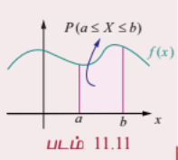

**தேற்றம் 11.2 (நிரூபணமின்றி)**

ஏதேனும் ஒரு தொடர்ச்சியான சமவாய்ப்பு மாறி $X$ -க்கு, ஒரு சார்பு நிகழ்தகவு அடர்த்தி சார்பாகத் தேவையானதும் மற்றும் போதுமானதுமான நிபந்தனைகளாகக் கீழ்க்காணும் பண்புகளைக் கொண்டிருக்க வேண்டும்.

(i) $f(x) \ge 0$, அனைத்து $x$ -க்கும் மற்றும்

(ii) $$\int_{-\infty}^{\infty} f(x) \, dx = 1$$

### குறிப்பு

மேற்கண்ட வரையறையிலிருந்து, $X$ ஒரு தொடர்ச்சியான சமவாய்ப்பு மாறி எனில்,

$$P(a < X < b) = \int_a^b f(x) \, dx$$

என்பதனால்

$$P(X = a) = \int_a^a f(x) \, dx = 0$$

ஆகும்.

எனவே $X$ குறிப்பிட்ட ஒரு மதிப்பைக் கொண்டால் அதன் நிகழ்தகவு பூச்சியமாகும்.

## 11.4.3 பரவல் சார்பு (குவிவு பரவல் சார்பு)
### (Distribution function (Cumulative distribution function))

**வரையறை 11.7 (குவிவு பரவல் சார்பு)**

$f(x)$ எனும் நிகழ்தகவு அடர்த்தியுடைய ஒரு தொடர்ச்சியான சமவாய்ப்பு மாறி $X$-ன் பரவல் சார்பு அல்லது குவிவு பரவல் சார்பு $F(x)$ என்பது

$$F(x) = P(X \le x) = \int_{-\infty}^{x} f(u) \, du, \quad -\infty < x < \infty$$

ஆகும்.

### குறிப்புரை

(1) தனி நிலையில், $f(a) = P(X = a)$ என்பது $X$ ஆனது $a$ மதிப்பைக் கொள்வதற்கான நிகழ்தகவாகும்.

தொடர்ச்சியானதில், $x = a$ -இல் $f(a)$ என்பது $X$ ஆனது $a$ மதிப்பைக் கொள்வதற்கான நிகழ்தகவு அல்ல. அதாவது $f(a) \ne P(X = a)$ ஆகும். $X$ தொடர்ச்சியான வகை எனில், அனைத்து $a \in \mathbb{R}$ -க்கு $P(X = a) = 0$ ஆகும்.

(2) சமவாய்ப்பு மாறி தொடர்ச்சியானபோது தனிநிலையில் பயன்படுத்தப்பட்ட கூட்டல் தொகையிடலாக மாற்றம் பெறுகிறது.

(3) தொடர்ச்சியான சமவாய்ப்பு மாறிக்கு

$$P(a < X < b) = P(a \le X < b) = P(a < X \le b) = P(a \le X \le b)$$

(4) தொடர்ச்சியான சமவாய்ப்பு மாறியின் பரவல் சார்பு தொடர்ச்சியான பரவல் சார்பு என அழைக்கப்படுகிறது.

## 11.4.3.1 பரவல் சார்பின் பண்புகள்
### (Properties of distribution function)

$X$ எனும் தொடர்ச்சியான சமவாய்ப்பு மாறிக்கு, கீழ்க்காணும் பண்புகளை குவிவு பரவல் சார்பு பூர்த்தி செய்கிறது.

(i) $0 \le F(x) \le 1$

(ii) $F(x)$ -ன் குறையற்ற மெய்மதிப்பாகும். அதாவது $x < y$ எனில், $F(x) \le F(y)$

(iii) $F(x)$ எவ்விடத்திலும் தொடர்ச்சியாகும்

(iv) $$\lim_{x \to -\infty} F(x) = F(-\infty) = 0$$ மற்றும் $$\lim_{x \to \infty} F(x) = F(\infty) = 1$$

(v) $$P(X \ge x) = 1 - P(X < x) = 1 - F(x)$$

(vi) $$P(a < X < b) = F(b) - F(a)$$

## எடுத்துக்காட்டு 11.11

$$f(x) = \begin{cases}
Cx^2, & 1 \le x \le 4 \\
0, & \text{மற்றபடி}
\end{cases}$$

எனும் சார்பு ஒரு அடர்த்தி சார்பு எனில் மாறிலி $C$ -இன் மதிப்பு காண்க. மேலும் (i) $P(1.5 < X < 3.5)$ (ii) $P(X \le 2)$ (iii) $P(X > 3)$ ஆகியவற்றைக் காண்க.

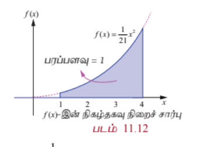

### தீர்வு

கொடுக்கப்பட்ட சார்பு நிகழ்தகவு அடர்த்தி சார்பு என்பதால்,

$$\int_{-\infty}^{\infty} f(x) \, dx = 1$$

அதாவது

$$\int_{-\infty}^{\infty} f(x) \, dx = \int_{-\infty}^{1} f(x) \, dx + \int_{1}^{4} f(x) \, dx + \int_{4}^{\infty} f(x) \, dx = 1$$

கொடுக்கப்பட்ட தகவல்களிலிருந்து

$$\int_{-\infty}^{1} 0 \, dx + \int_{1}^{4} Cx^2 \, dx + \int_{4}^{\infty} 0 \, dx = 1$$

$$0 + C\left[\frac{x^3}{3}\right]_{1}^{4} + 0 = 1$$

$$C\left(\frac{64 - 1}{3}\right) = 1 \implies C(21) = 1 \implies C = \frac{1}{21}$$

எனவே நிகழ்தகவு அடர்த்தி சார்பானது

$$f(x) = \begin{cases}
\frac{x^2}{21}, & 1 \le x \le 4 \\
0, & \text{மற்றபடி}
\end{cases}$$

ஆகும்.

$f(x)$ தொடர்ச்சியாதலால், குறிப்பிட்ட எந்த மதிப்பிற்கும் $X$ -ன் நிகழ்தகவு பூச்சியமாகும். எனவே சமவாய்ப்பு மாறி தொடர்ச்சியானபோது குறியீடுகளான $<$ -ஐ $\le$ ஆகவும் மற்றும் $>$ -ஐ $\ge$ -ஆகவும் ஆகிய இரு ஜோடிக் குறியீடுகளை ஒன்றுக்கொன்று இடமாற்றம் செய்து பயன்படுத்தலாம்.

### படம் 11.12

(i) $P(1.5 < X < 3.5) = P(1.5 \le X \le 3.5) = P(1.5 < X \le 3.5) = P(1.5 \le X < 3.5)$

எனவே

$$P(1.5 < X < 3.5) = \int_{1.5}^{3.5} f(x) \, dx = \int_{1.5}^{3.5} \frac{x^2}{21} \, dx$$

$$= \frac{1}{21}\left[\frac{x^3}{3}\right]_{1.5}^{3.5} = \frac{1}{21}\left(\frac{(3.5)^3 - (1.5)^3}{3}\right)$$

$$= \frac{79}{126}$$

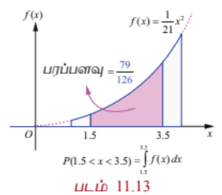

(ii) $$P(X \le 2) = \int_{-\infty}^{2} f(x) \, dx = \int_{-\infty}^{1} f(x) \, dx + \int_{1}^{2} f(x) \, dx$$

எனவே

$$P(X \le 2) = \int_{-\infty}^{1} 0 \, dx + \int_{1}^{2} \frac{x^2}{21} \, dx$$

$$= 0 + \frac{1}{21}\left[\frac{x^3}{3}\right]_{1}^{2}$$

$$= \frac{1}{21}\left(\frac{8 - 1}{3}\right) = \frac{7}{63}$$

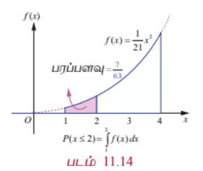

(iii) $$P(X > 3) = \int_{3}^{\infty} f(x) \, dx = \int_{3}^{4} f(x) \, dx + \int_{4}^{\infty} f(x) \, dx$$

$$= \int_{3}^{4} \frac{x^2}{21} \, dx + 0$$

$$= \frac{1}{21}\left[\frac{x^3}{3}\right]_{3}^{4}$$

$$= \frac{1}{21}\left(\frac{64 - 27}{3}\right) = \frac{37}{63}$$

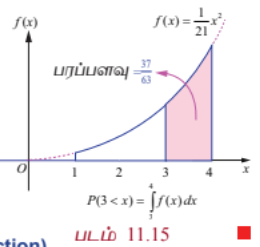

## 11.4.4 நிகழ்தகவு அடர்த்தி சார்பிலிருந்து பரவல் சார்பு
### (Distribution function from Probability density function)

ஒரு தொடர்ச்சியான சமவாய்ப்பு மாறி $X$ -இன், நிகழ்தகவு அடர்த்தி சார்பு மற்றும் குவிவு பரவல் சார்பும் (அல்லது பரவல் சார்பும்) $X$ -இன் அனைத்து நிகழ்தகவு தகவல்களைக் கொண்டிருக்கும். $X$ -இன் நிகழ்தகவு பரவலை இவற்றில் ஏதேனுமொன்று தீர்மானிக்கும். $X$ -இன் நிகழ்தகவு அடர்த்தி சார்பிலிருந்து தொடர்ச்சியான சமவாய்ப்பு மாறி $X$ -இன் பரவல் சார்பைத் தீர்மானிக்கவும், மற்றும் மறுதலையாகவும் காணும் வழிமுறையைக் கற்போம்.

## எடுத்துக்காட்டு 11.12

$$f(x) = \begin{cases}
x - 1, & 1 \le x \le 2 \\
3 - x, & 2 \le x \le 3 \\
0, & \text{மற்றபடி}
\end{cases}$$

என்பது சமவாய்ப்பு மாறி $X$ -இன் நிகழ்தகவு அடர்த்தி சார்பு $f(x)$ எனில்

(i) பரவல் சார்பு $F(x)$

(ii) $P(1.5 \le X \le 2.5)$

ஆகியவற்றைக் காண்க.

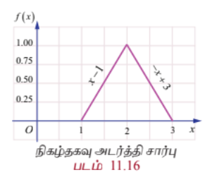

#### தீர்வு

(i) வரையறைப்படி

$$F(x) = P(X \le x) = \int_{-\infty}^{x} f(u) \, du$$

$x < 1$ எனும்போது,

$$F(x) = P(X \le x) = \int_{-\infty}^{x} 0 \, du = 0$$

$1 \le x \le 2$ எனும்போது,

$$F(x) = P(X \le x) = \int_{-\infty}^{1} 0 \, du + \int_{1}^{x} (u - 1) \, du$$

$$= 0 + \left[\frac{(u - 1)^2}{2}\right]_{1}^{x} = \frac{(x - 1)^2}{2}$$

$2 \le x \le 3$ எனும்போது,

$$F(x) = P(X \le x) = \int_{-\infty}^{1} 0 \, du + \int_{1}^{2} (u - 1) \, du + \int_{2}^{x} (3 - u) \, du$$

$$= 0 + \left[\frac{(u - 1)^2}{2}\right]_{1}^{2} + \left[-\frac{(3 - u)^2}{2}\right]_{2}^{x}$$

$$= \frac{1}{2} + \frac{1}{2} - \frac{(3 - x)^2}{2} = 1 - \frac{(3 - x)^2}{2}$$

$x \ge 3$ எனும்போது,

$$F(x) = P(X \le x) = \int_{-\infty}^{1} 0 \, du + \int_{1}^{2} (u - 1) \, du + \int_{2}^{3} (3 - u) \, du + \int_{3}^{x} 0 \, du$$

$$= 0 + \left[\frac{(u - 1)^2}{2}\right]_{1}^{2} + \left[-\frac{(3 - u)^2}{2}\right]_{2}^{3} + 0$$

$$= \frac{1}{2} + \frac{1}{2} = 1$$

இவற்றின் மூலம்

$$F(x) = \begin{cases}
0, & -\infty < x < 1 \\
\frac{(x - 1)^2}{2}, & 1 \le x \le 2 \\
1 - \frac{(3 - x)^2}{2}, & 2 \le x \le 3 \\
1, & 3 \le x < \infty
\end{cases}$$

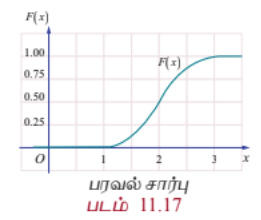

(ii) $$P(1.5 \le X \le 2.5) = F(2.5) - F(1.5)$$

$$= \left[1 - \frac{(3 - 2.5)^2}{2}\right] - \left[\frac{(1.5 - 1)^2}{2}\right]$$

$$= \left(1 - \frac{0.25}{2}\right) - \left(\frac{0.25}{2}\right) = 1 - 0.25 = 0.75$$

அல்லது

$$P(1.5 \le X \le 2.5) = \int_{1.5}^{2.5} f(x) \, dx = \int_{1.5}^{2} (x - 1) \, dx + \int_{2}^{2.5} (3 - x) \, dx = 0.75$$

சோதித்தல்: (i) $F(x)$ அனைத்து இடங்களிலும் தொடர்ச்சியா எனவும்

(ii) படம் 11.16-லிருந்து, முக்கோணத்தின் பரப்பு $= \frac{1}{2}bh = 1$ எனவும் சோதிக்க.

## 11.4.5 நிகழ்தகவு பரவல் சார்பிலிருந்து நிகழ்தகவு அடர்த்தி சார்பு
### (Probability density function from Probability distribution function)

தொடர்ச்சியான சமவாய்ப்பு மாறி $X$ -ன் பரவல் சார்பு $F(x)$ -லிருந்து நிகழ்தகவு அடர்த்தி சார்பு $f(x)$-ஐ தீர்மானிக்கும் வழிமுறையைக் கற்போம்.

ஒரு தொடர்ச்சியான சமவாய்ப்பு மாறி $X$ -ன் பரவல் சார்பு $F(x)$ என்க. இனி வகையிடல் இருக்கும் இடத்திலெல்லாம்

$$f(x) = \frac{d}{dx} F(x) = F'(x)$$

என்பது நிகழ்தகவு அடர்த்தி சார்பைக் குறிக்கும்.

## எடுத்துக்காட்டு 11.13

ஒரு சமவாய்ப்பு மாறி $X$ -இன் பரவல் சார்பு,

$$F(x) = \begin{cases}
0, & x \le 0 \\
x^2, & 0 \le x \le 1 \\
1, & x \ge 1
\end{cases}$$

எனில்

(i) நிகழ்தகவு அடர்த்தி சார்பு $f(x)$

(ii) $P(0.2 \le X \le 0.7)$

ஆகியவற்றைக் காண்க.

#### தீர்வு

(i) $f(x)$ -ன் தொடர்ச்சி புள்ளிகளில் $x$-ஐப் பொறுத்து $F(x)$ -ஐ வகையிட

$$f(x) = F'(x) = \begin{cases}
0, & x < 0 \\
2x, & 0 < x < 1 \\
0, & x > 1
\end{cases}$$

எனப் பெறுகிறோம்.

$f(x)$ எனும் நிகழ்தகவு அடர்த்தி சார்பு $x = 0$ -ல், அல்லது $x = 1$-ல் தொடர்ச்சியற்று உள்ளது. $f(0)$ மற்றும் $f(1)$ -ஐ எவ்வகையிலும் வரையறுக்கலாம். $f(0) = 0$, மற்றும் $f(1) = 0$ எனத் தெரிவு செய்வோம்.

எனவே $f(x)$ எனும் நிகழ்தகவு அடர்த்தி சார்பு

$$f(x) = \begin{cases}
2x, & 0 \le x \le 1 \\
0, & \text{மற்றபடி}
\end{cases}$$

(ii) $$P(0.2 \le X \le 0.7) = F(0.7) - F(0.2)$$

$$= (0.7)^2 - (0.2)^2 = 0.49 - 0.04 = 0.45$$

அல்லது

$$P(0.2 \le X \le 0.7) = \int_{0.2}^{0.7} f(x) \, dx = \int_{0.2}^{0.7} 2x \, dx = 0.45$$

### குறிப்புரை

வரையறைப்படி,

$$P(X \le x) = F(x) = \int_{-\infty}^{x} f(u) \, du$$

ஆகும். $F(x)$ அல்லது $f(x)$ ஆகிய இவற்றிலொன்றிலாவது நிகழ்தகவு $P(a < X < b)$ -ஐப் பெறலாம்.

### குறிப்பு

மேற்குறிப்பிட்ட நிகழ்தகவு அடர்த்தி சார்பினை

$$f(x) = \begin{cases}
2x, & 0 < x < 1 \\
0, & \text{மற்றபடி}
\end{cases}$$

அல்லது

$$f(x) = \begin{cases}
2x, & 0 < x \le 1 \\
0, & \text{மற்றபடி}
\end{cases}$$

அல்லது

$$f(x) = \begin{cases}
2x, & 0 \le x < 1 \\
0, & \text{மற்றபடி}
\end{cases}$$

எனவும் வரையறுக்கலாம்.

## எடுத்துக்காட்டு 11.14

சமவாய்ப்பு மாறி $X$-ன் நிகழ்தகவு அடர்த்தி சார்பு

$$f(x) = \begin{cases}
k, & 1 < x < 5 \\
0, & \text{மற்றபடி}
\end{cases}$$

எனில்

(i) பரவல் சார்பு

(ii) $P(X < 3)$

(iii) $P(2 < X < 4)$

(iv) $P(X \le 3)$

#### தீர்வு

$f(x)$ ஒரு நிகழ்தகவு அடர்த்தி சார்பு என்பதால், $f(x) \ge 0$ மற்றும்

$$\int_{-\infty}^{\infty} f(x) \, dx = 1$$

அதாவது

$$\int_{-\infty}^{1} 0 \, dx + \int_{1}^{5} k \, dx + \int_{5}^{\infty} 0 \, dx = 1$$

$$0 + k[x]_{1}^{5} + 0 = 1 \implies 4k = 1 \implies k = \frac{1}{4}$$

எனவே நிகழ்தகவு அடர்த்தி சார்பானது

$$f(x) = \begin{cases}
\frac{1}{4}, & 1 < x < 5 \\
0, & \text{மற்றபடி}
\end{cases}$$

(i) பரவல் சார்பு

பரவல் சார்பு

$$F(x) = P(X \le x) = \int_{-\infty}^{x} f(u) \, du$$

$x < 1$ எனும்போது

$$F(x) = \int_{-\infty}^{x} f(u) \, du = \int_{-\infty}^{x} 0 \, du = 0$$

$1 \le x \le 5$ எனும்போது

$$F(x) = \int_{-\infty}^{x} f(u) \, du = \int_{-\infty}^{1} 0 \, du + \int_{1}^{x} \frac{1}{4} \, du = \frac{x - 1}{4}$$

$x \ge 5$ எனும்போது

$$F(x) = \int_{-\infty}^{x} f(u) \, du = \int_{-\infty}^{1} 0 \, du + \int_{1}^{5} \frac{1}{4} \, du + \int_{5}^{x} 0 \, du = 1$$

அதாவது

$$F(x) = \begin{cases}
0, & x < 1 \\
\frac{x - 1}{4}, & 1 \le x \le 5 \\
1, & x \ge 5
\end{cases}$$

(ii) $$P(X < 3) = P(X \le 3) = F(3) = \frac{3 - 1}{4} = \frac{1}{2}$$

($F(x)$ தொடர்ச்சியாக இருப்பதால்).

(iii) $$P(2 < X < 4) = P(2 \le X \le 4) = F(4) - F(2) = \frac{4 - 1}{4} - \frac{2 - 1}{4} = \frac{1}{2}$$

(iv) $$P(X \le 3) = F(3) = \frac{1}{2}$$

## எடுத்துக்காட்டு 11.15

ஒரு மின்சாதனத்தின் ஆயுட்காலத்தைக் குறிக்கும் சமவாய்ப்பு மாறி $X$ -ன் நிகழ்தகவு அடர்த்தி சார்பு

$$f(x) = \begin{cases}
ke^{-2x}, & x > 0 \\
0, & x \le 0
\end{cases}$$

ஆகும்.

(i) $k$ -ன் மதிப்பு காண்க

(ii) பரவல் சார்பு

(iii) $P(X < 2)$

(iv) $X$ -ன் குறைந்தபட்சம் நான்கு நேர அலகுகளுக்கான நிகழ்தகவு காண்க

(v) $P(X = 3)$

#### தீர்வு

(i) நிகழ்தகவு அடர்த்தி சார்பு $f(x)$ என்பதால், $f(x) \ge 0$ மற்றும்

$$\int_{-\infty}^{\infty} f(x) \, dx = 1$$

அதாவது

$$\int_{-\infty}^{0} 0 \, dx + \int_{0}^{\infty} ke^{-2x} \, dx = 1$$

$$k\left[-\frac{e^{-2x}}{2}\right]_{0}^{\infty} = 1 \implies k\left(0 + \frac{1}{2}\right) = 1 \implies k = 2$$

எனவே நிகழ்தகவு அடர்த்தி சார்பு

$$f(x) = \begin{cases}
2e^{-2x}, & x > 0 \\
0, & x \le 0
\end{cases}$$

(ii) பரவல் சார்பு

வரையறைப்படி பரவல் சார்பு

$$F(x) = P(X \le x) = \int_{-\infty}^{x} f(u) \, du$$

$x \le 0$ எனும்போது

$$F(x) = \int_{-\infty}^{x} f(u) \, du = \int_{-\infty}^{x} 0 \, du = 0$$

$x > 0$ எனும்போது

$$F(x) = \int_{-\infty}^{x} f(u) \, du = \int_{-\infty}^{0} 0 \, du + \int_{0}^{x} 2e^{-2u} \, du = \left[-e^{-2u}\right]_{0}^{x} = 1 - e^{-2x}$$

இதிலிருந்து பெறுவது

$$F(x) = \begin{cases}
0, & x \le 0 \\
1 - e^{-2x}, & x > 0
\end{cases}$$

(iii) $$P(X < 2) = P(X \le 2) = F(2) = 1 - e^{-4}$$

($F(x)$ தொடர்ச்சி என்பதால்)

(iv) $X$ குறைந்தபட்சம் நான்கு நேர அலகுகளுக்கான நிகழ்தகவு

$$P(X \ge 4) = 1 - P(X < 4) = 1 - F(4) = 1 - (1 - e^{-8}) = e^{-8}$$

(v) தொடர்ச்சியானதில், $x = a$ -ல் $f(a)$ என்பது $X$ ஆனது $a$ மதிப்பைக் கொள்வதற்கான நிகழ்தகவு அல்ல. அதாவது $f(a) \ne P(X = a)$ ஆகும். $X$ தொடர்ச்சியான வகை எனில், அனைத்து $a \in \mathbb{R}$ -க்கு $P(X = a) = 0$ ஆகும். எனவே $P(X = 3) = 0$ ஆகும்.

## பயிற்சி 11.3

1. சமவாய்ப்பு மாறி $X$ -யின் நிகழ்தகவு அடர்த்தி சார்பு

$$f(x) = \begin{cases}
kx^2 e^{-x}, & x > 0 \\
0, & x \le 0
\end{cases}$$

எனில் $k$ -ன் மதிப்பைக் காண்க.

2. சமவாய்ப்பு மாறி $X$ -யின் நிகழ்தகவு அடர்த்தி சார்பு

$$f(x) = \begin{cases}
x, & 0 \le x \le 1 \\
2 - x, & 1 \le x \le 2 \\
0, & \text{மற்றபடி}
\end{cases}$$

(i) $P(0.2 \le X \le 0.6)$

(ii) $P(1.2 \le X \le 1.8)$

(iii) $P(0.5 \le X \le 1.5)$

ஆகியவற்றைக் காண்க

3. ஒரு பால் விற்பனையகத்தில் வினியோகிக்கப்படும் பாலின் அளவு சமவாய்ப்பு மாறி $X$ என்க. குறைந்தபட்சம் 200 லிட்டர்கள் மற்றும் அதிகபட்சம் 600 லிட்டர்களுடன் நிகழ்தகவு அடர்த்தி சார்பு

$$f(x) = \begin{cases}
kx, & 200 \le x \le 600 \\
0, & \text{மற்றபடி}
\end{cases}$$

(i) $k$ மதிப்பு காண்க.

(ii) பரவல் சார்பு காண்க.

(iii) 300 லிட்டர்கள் மற்றும் 500 லிட்டர்களுக்கிடையே தினசரி விற்பனை இருப்பதற்கான நிகழ்தகவு காண்க?

4. சமவாய்ப்பு மாறி $X$ -யின் நிகழ்தகவு அடர்த்தி சார்பு

$$f(x) = \begin{cases}
kx^3 e^{-x}, & x > 0 \\
0, & x \le 0
\end{cases}$$

எனில்

(i) $k$ மதிப்பு

(ii) பரவல் சார்பு

(iii) $P(X < 3)$

(iv) $P(X \le 5)$

(v) $P(X \le 4)$

ஆகியவற்றைக் காண்க.

5. சமவாய்ப்பு மாறி $X$ -யின் நிகழ்தகவு அடர்த்தி சார்பு,

$$f(x) = \begin{cases}
1 + x, & -1 \le x \le 0 \\
1 - x, & 0 \le x \le 1 \\
0, & \text{மற்றபடி}
\end{cases}$$

எனில்

(i) பரவல் சார்பு $F(x)$

(ii) $P(-0.5 \le X \le 0.5)$

காண்க.

6. சமவாய்ப்பு மாறி $X$ -யின் பரவல் சார்பு $F(x)$

$$F(x) = \begin{cases}
0, & -\infty < x < 0 \\
\frac{x^2 + x}{2}, & 0 \le x \le 1 \\
1, & 1 \le x < \infty
\end{cases}$$

எனில்

(i) நிகழ்தகவு அடர்த்தி சார்பு $f(x)$

(ii) $P(0.3 \le X \le 0.6)$

ஆகியவற்றைக் காண்க.

## 11.5 கணித எதிர்பார்ப்பு (Mathematical Expectation)

சமவாய்ப்பு மாறியின் முக்கியமான சிறப்பியல்புகளில் ஒன்று அதன் கணித எதிர்பார்ப்பு ஆகும். கணித எதிர்பார்ப்பின் பிற பெயர்கள் எதிர்பார்ப்பு மதிப்பு, சராசரி, மற்றும் முதல் விலக்கப் பெருக்கத் தொகை முதலியன.

வழக்கமாக எண் சராசரி முறையிலேயே கணித எதிர்பார்ப்பும் அதனையொட்டி வரையறுக்கப்படுகிறது.

$n$ எண்களின் $a_1, a_2, a_3, \ldots, a_n$ -ன் சராசரி எண் மதிப்பு,

$$\frac{a_1 + a_2 + a_3 + \cdots + a_n}{n}$$

ஆகும்.

$a_1, a_2, a_3, \ldots, a_n$ ஆகிய $n$ எண்களின் முழு தொகுப்பையும் தொகுத்து ஒற்றை மதிப்பில் சுருக்கமாகவோ அல்லது வகைப்படுத்தவோ சராசரி உதவுகிறது.

### விளக்க எடுத்துக்காட்டு 11.7

6, 2, 5, 5, 2, 6, 2, -4, 1, 5 எனும் பத்து எண்களைக் கருதுக.

இதன் சராசரி

$$\frac{6 + 2 + 5 + 5 + 2 + 6 + 2 - 4 + 1 + 5}{10} = 3$$

ஆகும்.

6, 2, 5, 5, 2, 6, 2, -4, 1, 5 ஆகிய 10 எண்களையும் சமவாய்ப்பு மாறி $X$-ன் மதிப்புகளாக கருதினால் நிகழ்தகவு நிறை சார்பு

| $x$ | -4 | 1 | 2 | 5 | 6 |
|---|---|---|---|---|---|
| $P(X = x)$ | $\frac{1}{10}$ | $\frac{1}{10}$ | $\frac{3}{10}$ | $\frac{3}{10}$ | $\frac{2}{10}$ |

ஆகும்.

சராசரிக்கான மேற்கண்ட கணக்கீட்டை

$$-4 \cdot \frac{1}{10} + 1 \cdot \frac{1}{10} + 2 \cdot \frac{3}{10} + 5 \cdot \frac{3}{10} + 6 \cdot \frac{2}{10} = 3$$

எனவும் மாற்றி எழுதலாம்.

இவ்வெடுத்துக்காட்டின் மூலம் சமவாய்ப்பு மாறியின் ஓவ்வொரு மதிப்பையும் அதன் நிகழ்தகவால் பெருக்கி கிடைக்கும் பெருக்கல்களின் கூட்டலாக எந்தவொரு சமவாய்ப்பு மாறியின் சராசரி அல்லது எதிர்பார்ப்பு மதிப்பைப் பெறலாம் என்பது தெளிவாகிறது. எனவே சராசரி = (x -இன் மதிப்பு) $\times$ நிகழ்தகவு

சமவாய்ப்பு மாறி தனிநிலை எனில் இக்கூற்று மெய்யாகும். தொடர்ச்சியான சமவாய்ப்பு மாறியைப் பொறுத்தவரையில், கணித எதிர்பார்ப்பும் கூட்டலுக்கு பதிலாக தொகையிடலின் அடிப்படையிலேயே அமையும்.

சமவாய்ப்பு மாறி $X$ -க்கான நிகழ்தகவு பரவலுக்கு தொகுக்க பொதுவாக இரு அளவுகள் பயன்படுத்தப்படுகின்றன. புள்ளியியலைப் பொறுத்தவரை ஒன்று மையப்போக்கு மற்றொன்று சிதறல் அல்லது நிகழ்தகவு பரவலின் மாறுபாடு எனலாம். நிகழ்தகவு பரவலின் மையப்போக்கின் அளவையே சராசரி ஆகும். மேலும் சிதறலின் அளவையே பரவற்படி அல்லது பரவலின் மாறுபாடு ஆகும். ஆனால் இவ்விரு அளவைகளும் ஒரு நிகழ்தகவு பரவலினை தனிச்சிறப்புப்பட இனங்காணவில்லை. அதாவது இரு வெவ்வேறு பரவல்களுக்கும் ஒரே சராசரியும் சிதறலும் அமையலாம். இருப்பினும் இத்தகு அளவைகள் எளிதாக கணிக்க இயலும். சமவாய்ப்பு மாறி $X$ -இன் நிகழ்தகவுப் பரவலினைப் பற்றி கற்க உதவுகின்றன.

## 11.5.1 சராசரி (Mean)

**வரையறை 11.8 (சராசரி)**

ஒரு சமவாய்ப்பு மாறி $X$ -இன் நிகழ்தகவு நிறை அல்லது அடர்த்திச் சார்பு $f(x)$ என்க.

$$E(X) = \begin{cases}
\sum_x x f(x), & \text{X தனிநிலை எனில்} \\
\int_{-\infty}^{\infty} x f(x) \, dx, & \text{X தொடர்ச்சியானது எனில்}
\end{cases}$$

$E(X)$ அல்லது $\mu$ என்பது எதிர்பார்ப்பின் மதிப்பு அல்லது சராசரி அல்லது $X$ -இன் கணித எதிர்பார்ப்பு என வரையறுக்கப்படுகிறது.

எதிர்பார்க்கப்படும் மதிப்பு பொதுவாக சமவாய்ப்பு மாறி கொள்ளும் மதிப்பாக இருக்ககாது. பன்முறை சார்பற்று செய்யப்படும் ஒரு சோதனையில் ஒரு சமவாய்ப்பு மாறியின் எதிர்பார்ப்பை புரிந்து கொள்ள இந்த எதிர்பார்க்கப்படும் மதிப்பு உதவும்.

**தேற்றம் 11.3 (நிரூபணமின்றி)**

நிகழ்தகவு நிறை அல்லது அடர்த்திசார்பு $f(x)$ உடைய ஒரு சமவாய்ப்பு மாறி $X$ என்க. $g(X)$ எனும் புதிய சமவாய்ப்பு மாறியின் சார்பின் எதிர்பார்ப்பு மதிப்பு,

$$E(g(X)) = \begin{cases}
\sum_x g(x) f(x), & \text{X தனிநிலை எனில்} \\
\int_{-\infty}^{\infty} g(x) f(x) \, dx, & \text{X தொடர்ச்சியானது எனில்}
\end{cases}$$

$g(X) = X^k$, $k = 0, 1, 2, \ldots$ எனில், மேற்கண்ட தேற்றம் தரும் எதிர்பார்க்கப்படும் மதிப்பு சமவாய்ப்பு மாறி $X$-ன் ஆதிபுள்ளியில் உள்ள $k$ -வது விலக்கப் பெருக்கத் தொகை எனப்படுகிறது.

$$E(X^k) = \begin{cases}
\sum_x x^k f(x), & \text{X தனிநிலை எனில்} \\
\int_{-\infty}^{\infty} x^k f(x) \, dx, & \text{X தொடர்ச்சியானது எனில்}
\end{cases}$$

### குறிப்பு

$k = 0$ எனும்போது, வரையறைப்படி,

$$E(X^0) = \begin{cases}
\sum_x f(x) = 1, & \text{X தனிநிலை எனில்} \\
\int_{-\infty}^{\infty} f(x) \, dx = 1, & \text{X தொடர்ச்சியானது எனில்}
\end{cases}$$

## 11.5.2 பரவற்படி அல்லது மாறுபாட்டளவை (Variance)

பரவற்படி எனும் புள்ளியியல் அளவை தரவுகளின் தொகுப்பின் சராசரி மதிப்பிலிருந்து அளவிடப்பட்ட தரவு எவ்வவாறு மாறுபடுகிறது என்பதைக் கூறுகிறது. கணித ரீதியாக, மாறுபாட்டளவை என்பது ஒரு தரவு தொகுப்பின் எண்கணித சராசரியிலிருந்து விலகல்களின் வர்க்கங்களின் சராசரியாகும். மாறுபாடு, பரவல் மற்றும் சிதறல் ஆகிய சொற்கள் ஒத்தவையாகும், மேலும் பரவல் எவ்வவாறு பரவுகிறது என்பதைக் குறிக்கிறது.

**வரையறை 11.9 (பரவற்படி)**

$Var(X)$ or $\sigma^2$ or $\sigma_x^2$ எனக் குறிப்பிடப்படும் சமவாய்ப்பு மாறி $X$-ன் பரவற்படி

$$Var(X) = E[(X - E(X))^2] = E(X^2) - [E(X)]^2$$

ஆகும்.

பரவற்படியின் வர்க்கமூலம் திட்ட விலக்கம் எனப்படும். அதாவது திட்ட விலக்கம் $\sqrt{Var(X)}$ ஆகும். சமவாய்ப்பு மாறியின் பரவற்படியும் திட்டவிலக்கமும் குறையற்ற எண்ணாகத்தான் இருக்கும்.

## 11.5.3 கணித எதிர்பார்ப்பு மற்றும் பரவற்படியின் பண்புகள்
### (Properties of Mathematical expectation and variance)

(i) $E(aX + b) = aE(X) + b$, இங்கு $a$ மற்றும் $b$ ஆகியன மாறிலிகள்.

**நிரூபணம்**

$X$ ஒரு தனிநிலை சமவாய்ப்பு மாறி எனில்,

$$E(aX + b) = \sum_i (ax_i + b) f(x_i)$$

(வரையறைப்படி)

$$= \sum_i ax_i f(x_i) + \sum_i b f(x_i)$$

$$= a\sum_i x_i f(x_i) + b\sum_i f(x_i)$$

$$= aE(X) + b \cdot 1 \quad (\because \sum_i f(x_i) = 1)$$

$$E(aX + b) = aE(X) + b$$

இதேபோன்று, $X$ ஒரு தொடர்ச்சியான சமவாய்ப்பு மாறி எனில், கூட்டலை தொகையிடலாக மாற்றி நிரூபிக்கலாம்.

**கிளைத்தேற்றம் 1 :** $E(aX) = aE(X)$ ($b = 0$ எனும்போது)

**கிளைத்தேற்றம் 2 :** $E(b) = b$ ($a = 0$ எனும்போது)

(ii) $$Var(X) = E(X^2) - [E(X)]^2$$

**நிரூபணம்**

$E(X) = \mu$ என அறிவோம்.

$$Var(X) = E[(X - \mu)^2]$$

$$= E[X^2 - 2\mu X + \mu^2]$$

$$= E(X^2) - 2\mu E(X) + \mu^2 \quad (\mu \text{ என்பது ஒரு மாறிலி})$$

$$= E(X^2) - 2\mu^2 + \mu^2$$

$$Var(X) = E(X^2) - [E(X)]^2$$

சமவாய்ப்பு மாறி $X$ -இன் பரவற்படியைக் கணக்கிட ஒரு மாற்று வழி

$$\sigma^2 = Var(X) = E(X^2) - [E(X)]^2$$

(iii) $$Var(aX + b) = a^2 Var(X)$$ இங்கு $a$ மற்றும் $b$ ஆகியவை மாறிலிகள்.

**நிரூபணம்**

$$Var(aX + b) = E[(aX + b) - E(aX + b)]^2$$

$$= E[(aX + b) - (aE(X) + b)]^2$$

$$= E[aX - aE(X)]^2$$

$$= E[a^2 (X - E(X))^2]$$

$$= a^2 E[(X - E(X))^2]$$

எனவே $$Var(aX + b) = a^2 Var(X)$$

**கிளைத்தேற்றம் 3 :** $Var(aX) = a^2 Var(X)$ ($b = 0$ எனும்போது)

**கிளைத்தேற்றம் 4 :** $Var(b) = 0$ ($a = 0$ எனும்போது)

பரவற்படி என்பது சமவாய்ப்பு மாறியின் மதிப்புகளின் சராசரி $\mu$-ஐப் பொறுத்து விலகல் பற்றிய தகவல்களைத் தருகிறது. $\sigma^2$ சிறியதாக இருந்தால் சமவாய்ப்பு மாறிகள் சராசரியைப் பொறுத்து அதிகமாகத் திரண்டு குவிந்ததாக அமையும். $\sigma^2$ பெரியதாக இருந்தால் சமவாய்ப்பு மாறியின் மதிப்புகள் சராசரியிலிருந்து மிகவும் விலகியிருக்கும் என்பது பொருளாகும்.

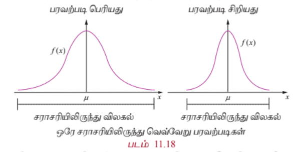

ஓரே சராசரியும் ஆனால் வெவ்வேறு பரவற்படி கொண்ட இரு தொடர்ச்சியான சமவாய்ப்பு மாறிகளின் pdf-களை மேற்கண்ட படம் காண்பிக்கிறது. அவற்றின் வளைவரைகள் மணி வடிவில் உள்ளது.

## எடுத்துக்காட்டு 11.16

கீழ்க்காணும் சார்பு ஒரு நிகழ்தகவு நிறை சார்பினைக் குறிக்கிறது என்க.

| $x$ | 1 | 2 | 3 | 4 | 5 | 6 |
|---|---|---|---|---|---|---|
| $f(x)$ | $c$ | $2c$ | $3c$ | $4c$ | $5c$ | $2c$ |

(i) $c$-ன் மதிப்பு

(ii) சராசரி மற்றும் பரவற்படி காண்க.

#### தீர்வு

(i) $f(x)$ ஒரு நிகழ்தகவு நிறை சார்பு என்பதால், அனைத்து $x$ -க்கும், $f(x) \ge 0$ மற்றும் $\sum_x f(x) = 1$.

ஆகையால், $\sum_x f(x) = 1$

$$c + 2c + 3c + 4c + 5c + 2c = 1$$

$$17c = 1 \implies c = \frac{1}{17}$$

அனைத்து $x$ -க்கும், $f(x) \ge 0$ என்பதால், $c$ -இன் சாத்தியமான மதிப்பு $\frac{1}{17}$ ஆகும்.

எனவே, நிகழ்தகவு நிறை சார்பானது

| $x$ | 1 | 2 | 3 | 4 | 5 | 6 |
|---|---|---|---|---|---|---|
| $f(x)$ | $\frac{1}{17}$ | $\frac{2}{17}$ | $\frac{3}{17}$ | $\frac{4}{17}$ | $\frac{5}{17}$ | $\frac{2}{17}$ |

(ii) சராசரி மற்றும் பரவற்படி காண கீழ்க்காணும் அட்டவணையைப் பயன்படுத்துவோம்.

| $x$ | $f(x)$ | $xf(x)$ | $x^2 f(x)$ |
|---|---|---|---|
| 1 | $\frac{1}{17}$ | $\frac{1}{17}$ | $\frac{1}{17}$ |
| 2 | $\frac{2}{17}$ | $\frac{4}{17}$ | $\frac{8}{17}$ |
| 3 | $\frac{3}{17}$ | $\frac{9}{17}$ | $\frac{27}{17}$ |
| 4 | $\frac{4}{17}$ | $\frac{16}{17}$ | $\frac{64}{17}$ |
| 5 | $\frac{5}{17}$ | $\frac{25}{17}$ | $\frac{125}{17}$ |
| 6 | $\frac{2}{17}$ | $\frac{12}{17}$ | $\frac{72}{17}$ |
|  | $\sum f(x) = 1$ | $\sum xf(x) = \frac{67}{17}$ | $\sum x^2 f(x) = \frac{297}{17}$ |

சராசரி:

$$E(X) = \sum x f(x) = \frac{67}{17} \approx 3.94$$

பரவற்படி:

$$Var(X) = E(X^2) - [E(X)]^2 = \sum x^2 f(x) - \left(\sum x f(x)\right)^2$$

$$= \frac{297}{17} - \left(\frac{67}{17}\right)^2 = \frac{297}{17} - \frac{4489}{289} = \frac{5049 - 4489}{289} = \frac{560}{289} \approx 1.94$$

எனவே சராசரி மற்றும் பரவற்படி முறையே $\frac{67}{17}$ மற்றும் $\frac{560}{289}$ ஆகும்.

## எடுத்துக்காட்டு 11.17

8 வெள்ளை மற்றும் 4 கருப்பு பந்துகள் கொண்ட ஒரு கூடையிலிருந்து இரு பந்துகள் சமவாய்ப்பு முறையில் தேர்ந்தெடுக்கப்படுகின்றன. தேர்ந்தெடுக்கப்படும் ஒவ்வொரு கருப்பு பந்துக்கும் ₹20 வெல்லும் தொகையாகவும் தேர்ந்தெடுக்கப்படும் ஒவ்வொரு வெள்ளை பந்துக்கும் ₹10 தோற்கும் தொகையாகவும் கருதுக. எதிர்பார்க்கப்படும் வெல்லும் தொகை மற்றும் பரவற்படி காண்க.

#### தீர்வு

$X$ என்பது வெல்லும் தொகை என்க. சாத்தியமான தேர்வுகளாவன (i) இரு பந்துகளுமே கருப்பு, அல்லது (ii) ஒரு வெள்ளை மற்றும் ஒரு கருப்பு (iii) இரண்டுமே வெள்ளை. எனவே $X$ எனும் சமவாய்ப்பு மாறி கீழ்க்காணுமாறு வரையறுக்கப்படுகிறது:

$X$ (இரண்டுமே கருப்பு பந்துகள்) = $2(20) = ₹40$

$X$ (ஒரு கருப்பு பந்து மற்றும் ஒரு வெள்ளைப் பந்து) = $20 - 10 = ₹10$

$X$ (இரண்டுமே வெள்ளைப் பந்துகள்) = $-2(10) = -₹20$

எனவே $X$ கொள்ளும் மதிப்புகள் 40, 10 மற்றும் -20 ஆகும்.

மொத்த பந்துகள் $n = 12$

2 பந்துகள் தேர்ந்தெடுக்க மொத்த வழிகள் = $\binom{12}{2} = \frac{12 \times 11}{2} = 66$

2 கருப்பு பந்துகள் தேர்ந்தெடுக்க வழிகள் = $\binom{4}{2} = 6$

ஒரு கருப்பு பந்து மற்றும் ஒரு வெள்ளை பந்து தேர்ந்தெடுக்க = $\binom{4}{1}\binom{8}{1} = 32$

2 வெள்ளை பந்துகள் தேர்ந்தெடுக்க வழிகள் = $\binom{8}{2} = 28$

| சமவாய்ப்பு மாறி $X$ -இன் மதிப்புகள் | 40 | 10 | -20 | மொத்தம் |
|---|---|---|---|---|
| நேர்மாறு பிம்பங்களிலுள்ள உறுப்புகளின் எண்ணிக்கை | 6 | 32 | 28 | 66 |

நிகழ்தகவு நிறை சார்பானது

| $X$ | 40 | 10 | -20 | மொத்தம் |
|---|---|---|---|---|
| $f(x)$ | $\frac{6}{66}$ | $\frac{32}{66}$ | $\frac{28}{66}$ | 1 |

சராசரி:

$$E(X) = \sum x f(x) = 40\left(\frac{6}{66}\right) + 10\left(\frac{32}{66}\right) - 20\left(\frac{28}{66}\right)$$

$$= \frac{240 + 320 - 560}{66} = 0$$

அதாவது எதிர்பார்க்கப்படும் வெல்லும் தொகை 0.

பரவற்படி:

$$E(X^2) = \sum x^2 f(x) = 40^2\left(\frac{6}{66}\right) + 10^2\left(\frac{32}{66}\right) + (-20)^2\left(\frac{28}{66}\right)$$

$$= \frac{9600 + 3200 + 11200}{66} = \frac{24000}{66} = \frac{4000}{11}$$

$$[E(X)]^2 = 0^2 = 0$$

இதன்படி

$$Var(X) = E(X^2) - [E(X)]^2 = \frac{4000}{11} - 0 = \frac{4000}{11}$$

எனவே $E(X) = 0$ மற்றும் $Var(X) = \frac{4000}{11}$

## எடுத்துக்காட்டு 11.18

$$f(x) = \begin{cases}
\lambda e^{-\lambda x}, & x \ge 0 \\
0, & \text{மற்றபடி}
\end{cases}$$

எனும் நிகழ்தகவு அடர்த்தி சார்பு உள்ள ஒரு சமவாய்ப்பு மாறி $X$ -க்கு சராசரி மற்றும் பரவற்படி காண்க.

#### தீர்வு

கொடுக்கப்பட்டுள்ள பரவல் தொடர்ச்சியானது என்பதை கவனிக்கவும்.

**சராசரி**

வரையறைப்படி

$$\mu = E(X) = \int_{-\infty}^{\infty} x f(x) \, dx$$

$$= \int_{-\infty}^{0} x(0) \, dx + \int_{0}^{\infty} x(\lambda e^{-\lambda x}) \, dx$$

$$= \lambda \int_{0}^{\infty} x e^{-\lambda x} \, dx$$

$$= \lambda \frac{\Gamma(2)}{\lambda^2} = \lambda \frac{1!}{\lambda^2} = \frac{1}{\lambda}$$

(மிகை முழு எண் $n$ -க்கு, காமா தொகையிடல் $\Gamma(n) = \int_0^{\infty} x^{n-1} e^{-x} \, dx = (n-1)!$)

**பரவற்படி**

வரையறைப்படி,

$$E(X^2) = \int_{-\infty}^{\infty} x^2 f(x) \, dx$$

$$= \int_{-\infty}^{0} x^2(0) \, dx + \int_{0}^{\infty} x^2(\lambda e^{-\lambda x}) \, dx$$

$$= \lambda \int_{0}^{\infty} x^2 e^{-\lambda x} \, dx$$

$$= \lambda \frac{\Gamma(3)}{\lambda^3} = \lambda \frac{2!}{\lambda^3} = \frac{2}{\lambda^2}$$

(காமா தொகையிடல் பயன்படுத்த)

எனவே

$$Var(X) = E(X^2) - [E(X)]^2 = \frac{2}{\lambda^2} - \left(\frac{1}{\lambda}\right)^2 = \frac{1}{\lambda^2}$$

ஆகையால் சராசரி மற்றும் பரவற்படி முறையே $\frac{1}{\lambda}$ மற்றும் $\frac{1}{\lambda^2}$.

(பெர்னோலி சூத்திரப்படி அல்லது பகுதி தொகையிடல் முறையினையும் பயன்படுத்தலாம்)

## பயிற்சி 11.4

1. கீழ்க்காணும் ஒரு சமவாய்ப்பு மாறி $X$ -ன் நிகழ்தகவு நிறை (அல்லது) அடர்த்திச் சார்புகளுக்கு சராசரி மற்றும் பரவற்படி காண்க:

(i) $$f(x) = \begin{cases}
\frac{1}{10}, & x = 2, 5 \\
\frac{1}{5}, & x = 0, 1, 3, 4
\end{cases}$$

(ii) $$f(x) = \begin{cases}
\frac{x}{6}, & x = 1, 2, 3
\end{cases}$$

(iii) $$f(x) = \begin{cases}
2x, & 0 \le x \le 1 \\
0, & \text{மற்றபடி}
\end{cases}$$

(iv) $$f(x) = \begin{cases}
\frac{1}{\sqrt{2\pi}} e^{-\frac{x^2}{2}}, & -\infty < x < \infty \\
0, & \text{மற்றபடி}
\end{cases}$$

2. நான்கு சிவப்புப் பந்துகளும் மற்றும் மூன்று கருப்புப் பந்துகள் கொண்ட ஒரு கூடையிலிருந்து பதிலீடாக இடாது அடுத்தடுத்து இரு பந்துகள் வெளியில் எடுக்கப்படுகின்றன. சிவப்பு பந்து வெளியில் எடுக்கும் சாத்திய கூறுகளை $X$ என்க. $X$-ன் நிகழ்தகவு நிறை சார்பையும் சராசரியையும் காண்க.

3. $\mu$ மற்றும் $\sigma^2$ ஆகியவை முறையே தனிநிலை சமவாய்ப்பு மாறி $X$ -ன் சராசரி மற்றும் பரவற்படி மற்றும் $E(X) = 10$ மற்றும் $E(X^2) = 116$ எனில் $\mu$ மற்றும் $\sigma^2$ காண்க.

4. நான்கு சீரான நாணயங்கள் ஒரு முறை சுண்டப்படுகின்றன. தலைகளின் எண்ணிக்கை நிகழ்விற்கு நிகழ்தகவு நிறை சார்பு, சராசரி, மற்றும் பரவற்படி காண்க.

5. ஒரு பயணிகள் இரயில் ஒவ்வொரு அரை மணி நேரத்திற்கும் ஒரு நிலையத்திற்கு சரியான நேரத்தில் வந்து சேரும். ஒவ்வொரு நாள் காலையிலும், ஒரு மாணவர் தனது வீட்டிலிருந்து இரயில் நிலையத்திற்கு செல்கிறார். மாணவர் ரயில் நிலையத்தை அடையும் நேரத்திலிருந்து ரயிலுக்காக காத்திருக்கும் நேரத்தை $X$ என நிமிடங்களில் குறிக்கலாம். $X$ -ன் நிகழ்தகவு அடர்த்தி சார்பு

$$f(x) = \begin{cases}
\frac{1}{30}, & 0 \le x \le 30 \\
0, & \text{மற்றபடி}
\end{cases}$$

எனில் சமவாய்ப்பு மாறி $X$ -ன் எதிர்பார்ப்பு மதிப்பை கணித்து விளக்குக.

6. கணினி தயாரிக்கப்படும்போது ஆயிரக்கணக்கான மணிநேரம் பயன்படுத்தப்படும் ஒரு மின்னணுசாதனமொன்றின் பழுதடையும் நேரத்தின் அடர்த்தி சார்பு

$$f(x) = \begin{cases}
3e^{-3x}, & x > 0 \\
0, & \text{மற்றபடி}
\end{cases}$$

ஆகும். இம்மின்னணுசாதனத்தின் எதிர்பார்க்கப்படும் ஆயுட்காலத்தை காண்க.

7. சமவாய்ப்பு மாறி $X$ -ன் நிகழ்தகவு அடர்த்தி சார்பு

$$f(x) = \begin{cases}
16x e^{-4x}, & x > 0 \\
0, & x \le 0
\end{cases}$$

ஆகும். சமவாய்ப்பு மாறி $X$ -ன் சராசரி மற்றும் பரவற்படி காண்க.

## 11.6 அறிமுறை பரவல்கள் : சில சிறப்பு தனி நிலை பரவல்கள்
### (Theoretical Distributions: Some Special Discrete Distributions)

சராசரி மற்றும் பரவற்படியுடன் பலவேறு பொதுவான நிகழ்தகவு பரவல்களை முந்தையப் பகுதியில் கற்றோம். சில சிறப்பு வாய்ந்த தனிதிலை நிகழ்தகவு பரவல்களைக் காண்போம்.

இப்பகுதியில் பின்வரும் தனிநிலை பரவல்களைக் காண்போம்.

(i) ஒரு புள்ளி பரவல்

(ii) இருபுள்ளி பரவல்

(iii) பெர்னோலி பரவல்

(iv) ஈருறுப்பு பரவல்

## 11.6.1 ஒரு புள்ளி பரவல்
### (The One point distribution)

$f(x) = P(X = x_0) = 1$ என வரையறுக்கப்படும் நிகழ்தகவு நிறை சார்பு $f(x)$ -ன்படி ஒரு புள்ளி $x_0$ இருக்குமானால், சமவாய்ப்பு மாறி $X$ -க்கு, ஒரு புள்ளி பரவற்படி அமையும். அதாவது ஒரு புள்ளியில் நிகழ்தகவு நிறை குவிந்துள்ளது.

குவிவு பரவல் சார்பு

$$F(x) = \begin{cases}
0, & x < x_0 \\
1, & x \ge x_0
\end{cases}$$

சராசரி :

$$E(X) = \sum_x x f(x) = x_0 \cdot 1 = x_0$$

பரவற்படி :

$$Var(X) = E(X^2) - [E(X)]^2 = x_0^2 - x_0^2 = 0$$

எனவே சராசரி மற்றும் பரவற்படி முறையே $x_0$ மற்றும் 0 ஆகும்.

## 11.6.2 இரு புள்ளி பரவல்
### (The Two point distribution)

**(a) சமச்சீரற்ற வகை:**

$$f(x) = \begin{cases}
p, & x = x_1 \\
1-p, & x = x_2
\end{cases}$$

இங்கு $0 < p < 1$.

என அமையுமாறு இரு மதிப்புகள் $x_1$ மற்றும் $x_2$ இருக்குமானால் சமவாய்ப்பு மாறி $X$ -க்கு இரு புள்ளி பரவல் உண்டு.

குவிவு பரவல் சார்பு

$$F(x) = \begin{cases}
0, & x < x_1 \\
p, & x_1 \le x < x_2 \\
1, & x \ge x_2
\end{cases}$$

சராசரி :

$$E(X) = \sum_x x f(x) = x_1 p + x_2 (1-p) = px_1 + qx_2$$

இங்கு $q = 1-p$.

பரவற்படி :

$$Var(X) = E(X^2) - [E(X)]^2 = x_1^2 p + x_2^2 q - (px_1 + qx_2)^2$$

$$= pq(x_2 - x_1)^2$$

சராசரி மற்றும் பரவற்படி முறையே $px_1 + qx_2$ மற்றும் $pq(x_2 - x_1)^2$ ஆகும்.

**(b) சீரான வகை :**

$p = q = \frac{1}{2}$ எனும்போது, இரு புள்ளி பரவல்

$$f(x) = \begin{cases}
\frac{1}{2}, & x = x_1 \\
\frac{1}{2}, & x = x_2
\end{cases}$$

என ஆகும். மேலும் குவிவு பரவல் சார்பு

$$F(x) = \begin{cases}
0, & x < x_1 \\
\frac{1}{2}, & x_1 \le x < x_2 \\
1, & x \ge x_2
\end{cases}$$

ஆகும். சராசரி மற்றும் பரவற்படி முறையே $\frac{x_1 + x_2}{2}$ மற்றும் $\frac{(x_2 - x_1)^2}{4}$ ஆகும்.

## 11.6.3 பெர்னோலி பரவல்
### (The Bernoulli distribution)

வெற்றிக்கான நிகழ்தகவு $p$ ஆக இருக்கும் சார்பற்ற சோதனைகளை முதலில் ஆராய்ந்தது சுவிஸ் கணிதவியலாளர் ஜேக்ஸ் பெர்னோலி (Jacques Bernoulli) (1654–1705) ஆவார். அவர் காலமாகி எட்டு ஆண்டுகளுக்குப் பிறகு 1713 இல் அவரது மருமகன் நிக்கோலஸால் வெளியிடப்பட்ட அவரது நூலான ஊகித்தல் கலையில், பெர்னோலி இதுபோன்ற சோதனைகளின் எண்ணிக்கை பெரிதாக இருந்தால், வெற்றிகளின் விகிதம் $p$ க்கு நெருக்கமாக நிகழ்தகவு 1-க்கு அருகில் இருக்கும் எனச் சுட்டிக் காட்டினார்.

நிகழ்தகவு கருத்தியலில் சுவிஸ் கணிதவியலாளர் ஜேக்ஸ் பெர்னோலியின் பெயரால் விளங்கும் பெர்னோலி பரவல் ஒரு சமவாய்ப்பு மாறியின் தனிநிலை நிகழ்தகவு பரவலாகும். ஒன்றையொன்று விலக்கும் மற்றும் யாவுமளாவிய வகைகளில் அதாவது வெற்றி அல்லது தோல்வி (எடுத்துக்காட்டாக: தலைகள் அல்லது பூக்கள், குறைபாடுள்ளவை அல்லது குறைபாடற்ற நல்ல பொருள்கள், பிறப்பு அல்லது இறப்பு அல்லது பல்வேறு சாத்திய ஜோடிகள்) என வகைப்படுத்தப்படும் ஒரு சமவாய்ப்பு சோதனை பெர்னோலி சோதனையாகும். சோதனைக்கு சோதனை மாறாது இருக்கும் வெற்றியின் நிகழ்தகவு அமையுமாறு பலமுறை சார்பற்ற வகையில் மேற்கொள்ளும் பெர்னோலி சோதனை மூலம் பெர்னோலி சோதனைத் தொடர் நேரிடுகிறது.

$X$ (வெற்றி) = 1 மற்றும் $X$ (தோல்வி) = 0 என வரையறுக்கப்படும் ஒரு பெர்னோலி சோதனையுடன் இணைந்த சமவாய்ப்பு மாறி $X$ -க்கு ,

$$f(x) = \begin{cases}
p, & x = 1 \\
q = 1-p, & x = 0
\end{cases}$$

இங்கு $0 < p < 1$

$X$ என்பது பெர்னோலி சமவாய்ப்பு மாறி எனவும் மற்றும் $f(x)$ என்பது பெர்னோலி பரவல் எனவும் முறையே அழைக்கப்படுகிறது

அல்லது சமானமாக

வெற்றி $p$ ஆகிய நிகழ்தகவு உடைய பெர்னோலி பரவலை பின்பற்றும் ஒரு சமவாய்ப்பு மாறி, பண்பளவையாக அழைக்கப்பெறும் $p$ மற்றும் $X \sim Ber(p)$ எனக் குறிப்பிடப்பட்டால், $X$ -இன் நிகழ்தகவு நிறை சார்பு

$$f(x) = p^x (1-p)^{1-x}, \quad x = 0, 1$$

ஆகும்.

**பெர்னோலி பரவலின் குவிவு பரவல்**

$$F(x) = \begin{cases}
0, & x < 0 \\
1-p, & 0 \le x < 1 \\
1, & x \ge 1
\end{cases}$$

எனப்படும்.

**சராசரி :**

$$E(X) = \sum_x x f(x) = 0 \cdot (1-p) + 1 \cdot p = p$$

0 மற்றும் 1 மதிப்புகளை மட்டுமே $X$ கொள்வதால், அதன் எதிர்பார்ப்பு மதிப்பு $p$ என்பதைப் "பார்த்ததில்லை" எனக் கூறலாம்.

**பரவற்படி :**

$$Var(X) = E(X^2) - [E(X)]^2 = \sum_x x^2 f(x) - p^2$$

$$= 0^2(1-p) + 1^2(p) - p^2 = p - p^2 = p(1-p) = pq$$

இங்கு $q = 1-p$

பண்பளவை $p$, சராசரி $\mu$ மற்றும் பரவற்படி $\sigma^2$ ஆகியவை உடைய பெர்னோலி பரவலைப் பின்பற்றும் $X$ ஒரு பெர்னோலி சமவாய்ப்பு மாறி எனில்

$$\mu = p \quad \text{மற்றும்} \quad \sigma^2 = pq$$

$p = q = \frac{1}{2}$ எனும்போது, பெர்னோலி பரவல்

$$f(x) = \begin{cases}
\frac{1}{2}, & x = 0 \\
\frac{1}{2}, & x = 1
\end{cases}$$

இங்கு $0 < p < 1$.

மற்றும் குவிவு பரவல்

$$F(x) = \begin{cases}
0, & x < 0 \\
\frac{1}{2}, & 0 \le x < 1 \\
1, & x \ge 1
\end{cases}$$

ஆகும். சராசரி மற்றும் பரவற்படி முறையே $\frac{1}{2}$ மற்றும் $\frac{1}{4}$ ஆகும்.

## 11.6.4 ஈருறுப்பு பரவல்
### (The Binomial Distribution)

தலைகள் அல்லது பூக்கள், வெற்றி அல்லது தோல்வி, குறைபாடு உடைய பொருள் அல்லது நல்ல பொருள் அல்லது இத்தகைய சாத்தியமான சோடிகள் இருக்கும் இரண்டு சாத்தியக் கூறுகளை மட்டுமே கொண்டிருக்கும் தொடர்ந்து நிகழ்த்தப்படும் சில சோதனைகளில் ஈருறுப்பு பரவல் முக்கியமாக பயன்படுத்தப்படுகிறது. அத்தகைய ஒவ்வொரு கூறுகளின் நிகழ்தகவினையும் பெருக்கல் விதியினைப் பயன்படுத்தி சில சமயங்களில் கிளை வரைபடத்துடன் கணிக்கப்படுகிறது.

ஒரு நாணயம் ஒரு முறை சுண்டப்படுகிறது என்க. தலைகளின் எண்ணிக்கையை $X$ குறிக்கிறது என்க. இனி $X \sim Ber(p)$, ஏனெனில் $p$ அல்லது $1-p$ எனும் நிகழ்தகவுடன் தலை $(X = 1)$ அல்லது பூ $(X = 0)$ ஆகிய இரண்டில் ஒன்று மட்டுமே கிடைக்கிறது.

ஒரு நாணயம் $n$ தடவை சுண்டப்படுகிறது என்க. தலைகளின் எண்ணிக்கையை $X$ குறிக்கிறது என்க. இனி $0, 1, 2, \ldots, n$ ஆகிய மதிப்புகளை $X$ கொள்கிறது. தலைகளின் எண்ணிக்கை $x$ -க்கான நிகழ்தகவு

$$P(X = x) = \binom{n}{x} p^x (1-p)^{n-x}$$

$X = x$ என்பது $n$ சுண்டல்களில் $x$ தலைகளின் சேர்ப்பிப்பிற்கு ஒத்ததாக, அதாவது $\binom{n}{x}$ வழிகளில் தலைகளும் மற்றும் மீதமுள்ள வழிகளில் $n-x$ பூக்களும் என அமைகிறது. எனவே ஒவ்வொரு விளைவின் நிகழ்தகவு $p^x (1-p)^{n-x}$ ஆகும். $n$ மதிப்பு 30 -க்கும் குறைவாக இருக்கும்போது ஈருறுப்பு தேற்றம் பயன்படுத்துவது பொருத்தமானதாகும்.

**வரையறை 11.11 (ஈருறுப்பு சமவாய்ப்பு மாறி)**

$n$ -தொடர்ச்சியான முயற்சிகளில் உள்ள வெற்றிகளின் எண்ணிக்கையை $X$ குறித்தால்,

(i) $n$ -தொடர்ச்சியான முயற்சிகள் சார்பற்றவையாகவும் மற்றும் $n$ -எண்ணிடத் தக்கவையாகவும்

(ii) 'வெற்றி' அல்லது 'தோல்வி' எனப் பெயரிடப்பட்ட இரு சாத்தியமான விளைவுகளை மட்டுமே ஒவ்வொரு முயற்சியும் கொண்டிருக்கவும்

(iii) ஒவ்வொரு முயற்சியிலும் $p$ எனக் குறிக்கப்படும் வெற்றியின் நிகழ்தகவு மாறாது இருக்கவும், அமைந்தால் ஒரு தனிநிலை சமவாய்ப்பு மாறி $X$ ஈருறுப்பு சமவாய்ப்பு மாறி என அழைக்கப்படும்.

**வரையறை 11.12 (ஈருறுப்பு பரவல்)**

ஈருறுப்பு சமவாய்ப்பு மாறி $X$ என்பது $n$-சார்பற்ற முயற்சிகளில் வெற்றிகளின் எண்ணிக்கையைக் குறிக்கிறது என்க. வெற்றிக்கான நிகழ்தகவு $p$ எனக் கொண்டால், தோல்விக்கான நிகழ்தகவு $q = 1-p$ ஆகும். ஈருறுப்பு பரவலை $X \sim B(n, p)$ எனக் குறிப்பர்.

$X$ -ன் நிகழ்தகவு நிறை சார்பு

$$f(x) = \binom{n}{x} p^x (1-p)^{n-x}, \quad x = 0, 1, 2, \ldots, n$$

ஆகும்.

ஈருறுப்பு விரிவாக்கத்திலிருந்து பரவலின் பெயர் பெறப்பட்டது. $a$ மற்றும் $b$, மாறிலிகளுக்கு, ஈருறுப்பு விரிவாக்கம்,

$$(a+b)^n = \sum_{x=0}^{n} \binom{n}{x} a^x b^{n-x}$$

ஆகும்.

ஒரு தனி முயற்சியில் வெற்றிக்கான நிகழ்தகவு $p$ என்க. இனி, $a = p$ மற்றும் $b = 1-p$ என்பதை ஈருறுப்பு விரிவாக்கத்தில் பயன்படுத்தும்போது ஈருறுப்பு சமவாய்ப்பு மாறிகளின் நிகழ்தகவுகளின் கூடுதல் 1 எனக் காணலாம். சோதனையில் ஒவ்வொரு முயற்சியும் இரு விளைவுகள், {வெற்றி, தோல்வி} என வகைபடுத்துவதால், பரவல் "ஈர்"-உறுப்பு என அழைக்கப்படுகிறது.

$p$ மற்றும் $n$ எனும் பண்பளவைகளைக் கொண்ட ஈருறுப்புப் பரவலினைப் பின்பற்றும் ஓர் ஈருறுப்பு சமவாய்ப்பு மாறி $X$ என்க. சராசரி $\mu$ மற்றும் பரவற்படி $\sigma^2$ முறையே

$$\mu = np \quad \text{மற்றும்} \quad \sigma^2 = np(1-p)$$

எதிர்பார்க்கப்படும் மதிப்பு பொதுவாக சமவாய்ப்பு மாறி கொள்ளும் மதிப்பாக இருக்காது. பன்முறை சார்பற்று செய்யப்படும் ஒரு சோதனையில் ஒரு சமவாய்ப்பு மாறியின் எதிர்பார்ப்பைப் புரிந்து கொள்ள இந்த எதிர்பார்க்கப்படும் மதிப்பு உதவும். $p = 0.5$ எனும்போது அல்லது $n$ பெரியதாக இருக்கும்போது ஈருறுப்பு பரவலின் அமைப்பு சமச்சீராக அமையும்.

$p = q = \frac{1}{2}$ எனும்போது, ஈருறுப்பு பரவல்

$$f(x) = \binom{n}{x} \left(\frac{1}{2}\right)^x \left(\frac{1}{2}\right)^{n-x} = \binom{n}{x} \left(\frac{1}{2}\right)^n, \quad x = 0, 1, 2, \ldots, n$$

ஆகும்.

அதாவது,

$$f(x) = \binom{n}{x} \frac{1}{2^n}, \quad x = 0, 1, 2, \ldots, n$$

சராசரி மற்றும் பரவற்படி முறையே $\frac{n}{2}$ மற்றும் $\frac{n}{4}$ ஆகும்.

## எடுத்துக்காட்டு 11.19

பின்வருவனவற்றிற்கு ஈருறுப்பு பரவல் காணவும்.

(i) ஐந்து சீரான நாணயங்கள் ஒரு முறை சுண்டப்படுகின்றன மற்றும் தலைகளின் எண்ணிக்கையை $X$ குறிக்கிறது என்க.

(ii) ஒரு சீரான பகடை 10 முறை உருட்டப்படுகிறது மற்றும் எண் 4 தோன்றுவதின் எண்ணிக்கையை $X$ குறிக்கிறது என்க.

#### தீர்வு

(i) ஐந்து சீரான நாணயங்கள் ஒருமுறை சுண்டப்படுகின்றன. நாணயங்கள் சீரானவை என்பதால் ஓர் ஒற்றறை நாணயத்திலிருந்து ஒரு தலை கிடைப்பதற்கான நிகழ்தகவு $p = \frac{1}{2}$ மற்றும்

$$q = 1-p = \frac{1}{2}$$

ஐந்து நாணயங்களிலிருந்து தலைகள் கிடைப்பதற்கான எண்ணிக்கையை $X$ குறிக்கிறது என்க. $0, 1, 2, 3, 4$ மற்றும் 5 ஆகிய மதிப்புகளைக் கொள்ளும் ஈருறுப்பு சமவாய்ப்பு மாறி $X$ என்க. $n = 5$ மற்றும் $p = \frac{1}{2}$ ஆகும். அதாவது $X \sim B\left(5, \frac{1}{2}\right)$ ஆகும்.

எனவே ஈருறுப்பு பரவல்

$$f(x) = \binom{n}{x} p^x (1-p)^{n-x}, \quad x = 0, 1, 2, \ldots, n$$

என்பது

$$f(x) = \binom{5}{x} \left(\frac{1}{2}\right)^x \left(\frac{1}{2}\right)^{5-x}, \quad x = 0, 1, 2, \ldots, 5$$

என்றாகும்.

அதாவது,

$$f(x) = \binom{5}{x} \left(\frac{1}{2}\right)^5, \quad x = 0, 1, 2, \ldots, 5$$

(ii) ஒரு சீரான பகடை 10 முறை உருட்டப்படுகிறது மற்றும் எண் 4 தோன்றுவதின் எண்ணிக்கையை $X$ குறிக்கிறது என்க. $0, 1, 2, 3, \ldots, 10$ எனும் மதிப்புகளைக் கொள்ளும் ஈருறுப்பு சமவாய்ப்பு மாறி $X$ என்க. $n = 10$ மற்றும் $p = \frac{1}{6}$ ஆகும். அதாவது $X \sim B\left(10, \frac{1}{6}\right)$ ஆகும்.

பகடையில் நான்கு கிடைப்பதற்கான நிகழ்தகவு $p = \frac{1}{6}$ மற்றும் $q = 1-p = \frac{5}{6}$ ஆகும்.

எனவே ஈருறுப்பு பரவல்

$$f(x) = \binom{10}{x} \left(\frac{1}{6}\right)^x \left(\frac{5}{6}\right)^{10-x}, \quad x = 0, 1, 2, \ldots, 10$$

## எடுத்துக்காட்டு 11.20

பத்து வினாக்கள் கொண்ட ஒரு பல்வாய்ப்புத் தேர்வில், ஒவ்வொரு வினாவிற்கும் நான்கு கவனச் சிதறல் விடைகளில் ஒன்று சரியான விடையாகும். ஊகத்தின் அடிப்படையில் ஒரு மாணவர் விடையளிக்கிறார் என்க. சரியான விடைகளின் எண்ணிக்கையை $X$ குறிக்கிறது எனில், (i) ஈருறுப்பு பரவல் (ii) மாணவர் ஏழு சரியான விடைகள் அளிப்பதற்கான நிகழ்தகவு (iii) குறைந்தபட்சம் ஒரு விடை சரியானதாக இருக்க நிகழ்தகவு ஆகியவற்றைக் காண்க.

#### தீர்வு

(i) வெற்றிகளின் எண்ணிக்கையை $X$ குறிப்பதால், $X$ கொள்ளும் மதிப்புகள் $0, 1, 2, \ldots, 10$ ஆகும். வெற்றிக்கான நிகழ்தகவு $p = \frac{1}{4}$ மற்றும் தோல்விக்கு $q = 1-p = \frac{3}{4}$, மற்றும் $n = 10$ ஆகும்.

எனவே $X$ ஈருறுப்பு பரவலை அனுசரிக்கிறது. $X \sim B\left(10, \frac{1}{4}\right)$ எனக் குறிப்பிடப்படுகிறது.

இதிலிருந்து பெறுவது,

$$f(x) = \binom{10}{x} \left(\frac{1}{4}\right)^x \left(\frac{3}{4}\right)^{10-x}, \quad x = 0, 1, 2, \ldots, 10$$

ஆகும்.

(ii) ஏழு சரியான விடைகளை அளிப்பதற்கான நிகழ்தகவு

$$P(X = 7) = f(7) = \binom{10}{7} \left(\frac{1}{4}\right)^7 \left(\frac{3}{4}\right)^{3} = 120 \left(\frac{3}{4}\right)^3 \left(\frac{1}{4}\right)^7$$

ஒரு மாணவர் ஏழு சரியான விடைகளை அளிப்பதற்கான நிகழ்தகவு $120 \left(\frac{3}{4}\right)^3 \left(\frac{1}{4}\right)^7$ ஆகும்.

(iii) குறைந்தபட்சம் ஒரு சரியான விடையளிப்பதற்கான நிகழ்தகவு

$$P(X \ge 1) = 1 - P(X = 0) = 1 - f(0)$$

$$= 1 - \binom{10}{0} \left(\frac{1}{4}\right)^0 \left(\frac{3}{4}\right)^{10} = 1 - \left(\frac{3}{4}\right)^{10}$$

மாணவர் குறைந்தபட்சம் ஒரு சரியான விடையளிப்பதற்கான நிகழ்தகவு $1 - \left(\frac{3}{4}\right)^{10}$ ஆகும்.

## எடுத்துக்காட்டு 11.21

ஓர் ஈருறுப்பு மாறி $X$ யின் சராசரி மற்றும் பரவற்படி முறையே 2 மற்றும் 1.5 ஆகும். காண்க

(i) $P(X = 0)$

(ii) $P(X = 1)$

(iii) $P(X \ge 1)$

ஆகியவற்றைக் காண்க.

#### தீர்வு

நிகழ்தகவு கண்டறிய $n$ மற்றும் $p$ ஆகிய பண்பளவைகளின் மதிப்புகளைக் கண்டறியவேண்டும்.

தரப்பட்ட தகவல்களிலிருந்து,

சராசரி = $np = 2$ மற்றும் பரவற்படி = $npq = 1.5$

இதிலிருந்து பெறுவது

$$\frac{npq}{np} = \frac{1.5}{2} = \frac{3}{4}$$

$$q = \frac{3}{4} \quad \text{மற்றும்} \quad p = 1 - q = 1 - \frac{3}{4} = \frac{1}{4}$$

$np = 2$ என்பதன் மூலம்

$$n = \frac{2}{p} = \frac{2}{1/4} = 8$$

எனவே $X \sim B\left(8, \frac{1}{4}\right)$

எனவே நிகழ்தகவு பரவலானது

$$P(X = x) = f(x) = \binom{8}{x} \left(\frac{1}{4}\right)^x \left(\frac{3}{4}\right)^{8-x}, \quad x = 0, 1, 2, \ldots, 8$$

(i) $$P(X = 0) = f(0) = \binom{8}{0} \left(\frac{1}{4}\right)^0 \left(\frac{3}{4}\right)^8 = \left(\frac{3}{4}\right)^8$$

(ii) $$P(X = 1) = f(1) = \binom{8}{1} \left(\frac{1}{4}\right)^1 \left(\frac{3}{4}\right)^7 = 8 \cdot \frac{1}{4} \cdot \left(\frac{3}{4}\right)^7 = 2 \left(\frac{3}{4}\right)^7$$

(iii) $$P(X \ge 1) = 1 - P(X = 0) = 1 - \left(\frac{3}{4}\right)^8$$

## எடுத்துக்காட்டு 11.22

ABC குழுமம் தயாரிக்கும் பொருட்களில் சராசரியாக, 20% பொருட்கள் குறைபாடுள்ளவை எனக் கண்டறியப்பட்டது. சமவாய்ப்பு முறையில் இதிலிருந்து 6 பொருட்கள் தேர்ந்தெடுக்கப்படுகிறது. மேலும் குறைபாடுள்ள பொருட்களின் எண்ணிக்கையை $X$ குறித்தால் (i) இரு பொருட்கள் குறைபாடுள்ளவை (ii) அதிகபட்சம் ஒரு பொருள் குறைபாடுள்ளது (iii) குறைந்தபட்சம் இரு பொருட்கள் குறைபாடுள்ளவை. ஆகியவற்றிற்கான நிகழ்தகவு காண்க.

#### தீர்வு

கொடுக்கப்பட்டது $n = 6$.

குறைபாடுள்ள ஒரு பொருளைத் தேர்ந்தெடுப்பதற்கான நிகழ்தகவு $\frac{20}{100}$, அதாவது $p = \frac{1}{5}$.

$$q = 1-p = \frac{4}{5}$$

குறைபாடுள்ள பொருட்களின் எண்ணிக்கையை $X$ குறிப்பதால், $X$ கொள்ளும் மதிப்புகள் $0, 1, 2, \ldots, 6$ ஆகும்.

எனவே $X$ ஈருறுப்பு பரவலைப் பின்பற்றுகிறது. அதனை $X \sim B\left(6, \frac{1}{5}\right)$ எனக் குறிப்பிடலாம்.

இதிலிருந்து பெறுவது

$$f(x) = \binom{6}{x} \left(\frac{1}{5}\right)^x \left(\frac{4}{5}\right)^{6-x}, \quad x = 0, 1, 2, \ldots, 6$$

(i) இரு குறைபாடுகளுள்ள பொருட்களுக்கான நிகழ்தகவு,

$$P(X = 2) = f(2) = \binom{6}{2} \left(\frac{1}{5}\right)^2 \left(\frac{4}{5}\right)^4 = 15 \left(\frac{4}{5}\right)^4 \left(\frac{1}{5}\right)^2$$

(ii) அதிகபட்சம் ஒரு பொருள் குறைபாடுள்ளதாக இருக்க நிகழ்தகவு,

$$P(X \le 1) = P(X = 0) + P(X = 1)$$

$$= \binom{6}{0} \left(\frac{1}{5}\right)^0 \left(\frac{4}{5}\right)^6 + \binom{6}{1} \left(\frac{1}{5}\right)^1 \left(\frac{4}{5}\right)^5$$

$$= \left(\frac{4}{5}\right)^6 + 6 \cdot \frac{1}{5} \cdot \left(\frac{4}{5}\right)^5 = \left(\frac{4}{5}\right)^5 \left(\frac{4}{5} + \frac{6}{5}\right) = 2 \left(\frac{4}{5}\right)^5$$

அதிகபட்சம் ஒரு பொருள் குறைபாடுள்ளதாக இருக்க நிகழ்தகவு $2 \left(\frac{4}{5}\right)^5$.

(iii) குறைந்தபட்சம் இரு பொருட்கள் குறைபாடுள்ளதாக இருக்க நிகழ்தகவு

$$P(X \ge 2) = 1 - P(X < 2) = 1 - [P(X = 0) + P(X = 1)]$$

$$= 1 - 2 \left(\frac{4}{5}\right)^5$$

குறைந்தபட்சம் இரு பொருட்கள் குறைபாடுள்ளதாக இருக்க நிகழ்தகவு $1 - 2 \left(\frac{4}{5}\right)^5$.

## பயிற்சி 11.5

1. கீழ்க்காணும் ஈருறுப்பு பரவல் $B(n, p)$ -க்காக $P(X = k)$ என்பதைக் கணிக்க

(i) $n = 6, p = \frac{1}{3}, k = 3$

(ii) $n = 10, p = \frac{1}{5}, k = 4$

(iii) $n = 9, p = \frac{1}{2}, k = 7$

2. எந்த முயற்சியிலும் ஒரு இலக்கைத் திரு.Q தாக்க நிகழ்தகவு $\frac{1}{4}$ ஆகும். பத்து முறை இலக்கை அவர் தாக்க முயற்சிக்கிறார் எனக் கொள்க. இலக்கைத் தாக்க (i) சரியாக 4 முறைகள் (ii) குறைந்தபட்சம் ஒரு முறை தாக்குவதற்கு ஆகியவற்றிற்கான நிகழ்தகவு காண்க.

3. கீழ்க்காணும் சோதனைகளில் ஈருறுப்பு பரவலைப் பயன்படுத்தி சமவாய்ப்பு மாறி $X$ -ன் சராசரி மற்றும் பரவற்படி காண்க.

(i) 100 தடவை ஒரு சீரான நாணயம் சுண்டப்படுகிறது. தலைகளின் எண்ணிக்கையை $X$ குறிக்கிறது.

(ii) 240 தடவை ஒரு சீரான பகடை சுண்டப்படுகிறது. எண் நான்கு தோன்றுவதற்கான எண்ணிக்கையை $X$ குறிக்கிறது.

4. ஒரு மின்சோதனையில் ஒரு குறிப்பிட்ட சாதனத்தின் தாங்கும் திறனுக்கான நிகழ்தகவு $\frac{3}{4}$. சோதிக்கப்பட ஐந்தில் சரியாக மூன்று சாதனங்களின் தாங்கு திறனுக்கான நிகழ்தகவைக் கண்டறிக.

5. ஒரு உற்பத்தியாளரிடமிருந்து ஒரு குறிப்பிட்ட மின்வகைக் கருவியை ஒரு விற்பனையாளர் கொள்முதல் செய்கிறார். உற்பத்தியாளர் கருவியின் பழுதாகும் சதவீதம் 5% எனக் கூறுகிறார். கொள்முதல் செய்யப்பட்ட சரக்கிலிருந்து 10 பொருட்களை விற்பனையாளரின் பரிசோதகர் சமவாய்ப்பு முறையில் பரிசோதிக்கிறார். அவற்றுள் (i) குறைந்தபட்சம் ஒரு பழுதான பொருள் (ii) சரியாக இரு பொருட்கள் பழுதாக இருக்க நிகழ்தகவு காண்க.

6. ஒரு பாதரச ஆவி விளக்கின் பயன்படும் காலம் குறைந்தபட்சம் 600 மணித்துளிகளுக்கான நிகழ்தகவு 0.9 எனில் அத்தகைய 12 விளக்குகளில்

(i) சரியாக 10 விளக்குகளின் பயன்படும் காலம் குறைந்தபட்சம் 600 மணித்துளிகளுக்கான நிகழ்தகவு;

(ii) குறைந்தபட்சம் 11 விளக்குகளின் பயன்படும் காலம் குறைந்தபட்சம் 600 மணித்துளிகளுக்கான நிகழ்தகவு

(iii) குறைந்தபட்சம் 2 விளக்குகளின் பயன்படும் காலம் குறைந்தபட்சம் 600 மணித்துளிகள் கூட இல்லாததற்கான நிகழ்தகவு ஆகியவற்றைக் காண்க.

7. ஓர் ஈருறுப்பு சமவாய்ப்பு மாறி $X$ -ன் சராசரி மற்றும் திட்ட விலக்கம் முறையே 6 மற்றும் 2 ஆகும். (i) நிகழ்தகவு நிறை சார்பு (ii) $P(X = 3)$ (iii) $P(X \ge 2)$ ஆகியவற்றைக் காண்க.

8. $P(X = 4) = P(X = 2)$ மற்றும் $n = 6$ எனும்படி உள்ள $X \sim B(n, p)$ -ன் பரவல், சராசரி மற்றும் திட்டவிலக்கம் ஆகியவற்றைக் காண்க.

9. 5 சார்பற்ற சோதனைகளை உடைய ஒரு ஈருறுப்பு பரவலின் 1 மற்றும் 2 வெற்றிக்கான நிகழ்தகவுகள் முறையே 0.4096 மற்றும் 0.2048 ஆகும். ஈருப்பு பரவலின் சராசரி மற்றும் பரவற்படி காண்க.
