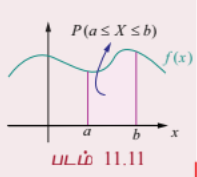
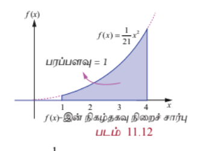
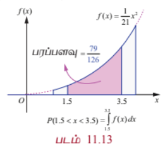
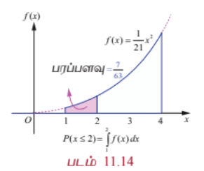
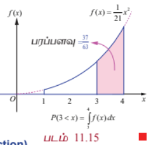
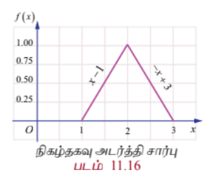
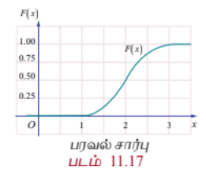

## 11.4 தொடர்ச்சியான பரவல்கள் (Continuous Distributions)

இப்பகுதியில்

(i) தொடர்ச்சியான சமவாய்ப்பு மாறி

(ii) நிகழ்தகவு அடர்த்தி சார்பு

(iii) பரவல் சார்பு (குவிவு பரவல் சார்பு)

(iv) நிகழ்தகவு அடர்த்தி சார்பிலிருந்து பரவல் சார்பினைத் தீர்மானித்தல்

(v) பரவல் சார்பிலிருந்து நிகழ்தகவு அடர்த்தி சார்பினைத் தீர்மானித்தல்

ஆகியவற்றைக் கற்போம்.

சில சமயங்களில் செப்பு கம்பியில் உள்ள மின்சாரத்தின் அளவு அல்லது ஒரு மின்விளக்கின் ஆயுட்காலம் போன்றவற்றை அளவிட ஒரு மெய்யெண் இடைவெளியில் உள்ள ஏதேனும் ஒரு மதிப்பைக் கருதவேண்டியுள்ளது. அதன்பிறகே அந்த அளவீட்டின் துல்லியம் சாத்தியமாகும். இந்த அளவீடு எடுத்துரைக்கும் சமவாய்ப்பு மாறி தொடர்ச்சியான சமவாய்ப்பு மாறி எனப்படுகிறது. ஒரு மெய்யெண் இடைவெளியிலுள்ள அனைத்து மதிப்புகளையும் உள்ளடக்கியதாக சமவாய்ப்பு மாறியின் வீச்சு அமையும்; அதாவது, மெய்யெண்களின் தொடரகமாக வீச்சு அமைகிறது எனலாம்.

### படம் 11.11

## 11.4.1 தொடர்ச்சியான சமவாய்ப்பு மாறியின் வரையறை
### (The definition of continuous random variable)

**வரையறை 11.5 (தொடர்ச்சியான சமவாய்ப்பு மாறி)**

$S$ என்பது ஒரு கூறுவெளி என்க. $X: S \rightarrow \mathbb{R}$ எனும் ஒரு சமவாய்ப்பு மாறி $\mathbb{R}$ -ன் ஒரு கணமான $I$ -ல் ஏதேனும் மதிப்பைப் பெறும் என்க. $I$ -இல் உள்ள அனைத்து $x$ -க்கும் $P(X = x) = 0$ என்பது $X$ -இன் ஒரு தொடர்ச்சியான சமவாய்ப்பு மாறியாகும்.

## 11.4.2 நிகழ்தகவு அடர்த்தி சார்பு
### (Probability density function)

**வரையறை 11.6 (நிகழ்தகவு அடர்த்தி சார்பு)**

தொடர்ச்சியான சமவாய்ப்பு மாறியில் $x \in (a, b)$ எனுமாறு உள்ள சாத்தியமான ஒவ்வொரு நிகழ்வு $x$ -ற்கும்

$$P(a < X < b) = \int_a^b f(x) \, dx$$

எனும் பண்பு உள்ளது எனில், $f(x)$ எனும் ஒரு குறையற்ற மெய்யெண் மதிப்புடைய சார்பானது, நிகழ்தகவு அடர்த்தி சார்பாகும்.

**தேற்றம் 11.2 (நிரூபணமின்றி)**

ஏதேனும் ஒரு தொடர்ச்சியான சமவாய்ப்பு மாறி $X$ -க்கு, ஒரு சார்பு நிகழ்தகவு அடர்த்தி சார்பாகத் தேவையானதும் மற்றும் போதுமானதுமான நிபந்தனைகளாகக் கீழ்க்காணும் பண்புகளைக் கொண்டிருக்க வேண்டும்.

(i) $f(x) \ge 0$, அனைத்து $x$ -க்கும் மற்றும்

(ii) $$\int_{-\infty}^{\infty} f(x) \, dx = 1$$

### குறிப்பு

மேற்கண்ட வரையறையிலிருந்து, $X$ ஒரு தொடர்ச்சியான சமவாய்ப்பு மாறி எனில்,

$$P(a < X < b) = \int_a^b f(x) \, dx$$

என்பதனால்

$$P(X = a) = \int_a^a f(x) \, dx = 0$$

ஆகும்.

எனவே $X$ குறிப்பிட்ட ஒரு மதிப்பைக் கொண்டால் அதன் நிகழ்தகவு பூச்சியமாகும்.

## 11.4.3 பரவல் சார்பு (குவிவு பரவல் சார்பு)
### (Distribution function (Cumulative distribution function))

**வரையறை 11.7 (குவிவு பரவல் சார்பு)**

$f(x)$ எனும் நிகழ்தகவு அடர்த்தியுடைய ஒரு தொடர்ச்சியான சமவாய்ப்பு மாறி $X$-ன் பரவல் சார்பு அல்லது குவிவு பரவல் சார்பு $F(x)$ என்பது

$$F(x) = P(X \le x) = \int_{-\infty}^{x} f(u) \, du, \quad -\infty < x < \infty$$

ஆகும்.

### குறிப்புரை

(1) தனி நிலையில், $f(a) = P(X = a)$ என்பது $X$ ஆனது $a$ மதிப்பைக் கொள்வதற்கான நிகழ்தகவாகும்.

தொடர்ச்சியானதில், $x = a$ -இல் $f(a)$ என்பது $X$ ஆனது $a$ மதிப்பைக் கொள்வதற்கான நிகழ்தகவு அல்ல. அதாவது $f(a) \ne P(X = a)$ ஆகும். $X$ தொடர்ச்சியான வகை எனில், அனைத்து $a \in \mathbb{R}$ -க்கு $P(X = a) = 0$ ஆகும்.

(2) சமவாய்ப்பு மாறி தொடர்ச்சியானபோது தனிநிலையில் பயன்படுத்தப்பட்ட கூட்டல் தொகையிடலாக மாற்றம் பெறுகிறது.

(3) தொடர்ச்சியான சமவாய்ப்பு மாறிக்கு

$$P(a < X < b) = P(a \le X < b) = P(a < X \le b) = P(a \le X \le b)$$

(4) தொடர்ச்சியான சமவாய்ப்பு மாறியின் பரவல் சார்பு தொடர்ச்சியான பரவல் சார்பு என அழைக்கப்படுகிறது.

## 11.4.3.1 பரவல் சார்பின் பண்புகள்
### (Properties of distribution function)

$X$ எனும் தொடர்ச்சியான சமவாய்ப்பு மாறிக்கு, கீழ்க்காணும் பண்புகளை குவிவு பரவல் சார்பு பூர்த்தி செய்கிறது.

(i) $0 \le F(x) \le 1$

(ii) $F(x)$ -ன் குறையற்ற மெய்மதிப்பாகும். அதாவது $x < y$ எனில், $F(x) \le F(y)$

(iii) $F(x)$ எவ்விடத்திலும் தொடர்ச்சியாகும்

(iv) $$\lim_{x \to -\infty} F(x) = F(-\infty) = 0$$ மற்றும் $$\lim_{x \to \infty} F(x) = F(\infty) = 1$$

(v) $$P(X \ge x) = 1 - P(X < x) = 1 - F(x)$$

(vi) $$P(a < X < b) = F(b) - F(a)$$

## எடுத்துக்காட்டு 11.11

$$f(x) = \begin{cases}
Cx^2, & 1 \le x \le 4 \\
0, & \text{மற்றபடி}
\end{cases}$$

எனும் சார்பு ஒரு அடர்த்தி சார்பு எனில் மாறிலி $C$ -இன் மதிப்பு காண்க. மேலும் (i) $P(1.5 < X < 3.5)$ (ii) $P(X \le 2)$ (iii) $P(X > 3)$ ஆகியவற்றைக் காண்க.

### தீர்வு

கொடுக்கப்பட்ட சார்பு நிகழ்தகவு அடர்த்தி சார்பு என்பதால்,

$$\int_{-\infty}^{\infty} f(x) \, dx = 1$$

அதாவது

$$\int_{-\infty}^{\infty} f(x) \, dx = \int_{-\infty}^{1} f(x) \, dx + \int_{1}^{4} f(x) \, dx + \int_{4}^{\infty} f(x) \, dx = 1$$

கொடுக்கப்பட்ட தகவல்களிலிருந்து

$$\int_{-\infty}^{1} 0 \, dx + \int_{1}^{4} Cx^2 \, dx + \int_{4}^{\infty} 0 \, dx = 1$$

$$0 + C\left[\frac{x^3}{3}\right]_{1}^{4} + 0 = 1$$

$$C\left(\frac{64 - 1}{3}\right) = 1 \implies C(21) = 1 \implies C = \frac{1}{21}$$

எனவே நிகழ்தகவு அடர்த்தி சார்பானது

$$f(x) = \begin{cases}
\frac{x^2}{21}, & 1 \le x \le 4 \\
0, & \text{மற்றபடி}
\end{cases}$$

ஆகும்.

$f(x)$ தொடர்ச்சியாதலால், குறிப்பிட்ட எந்த மதிப்பிற்கும் $X$ -ன் நிகழ்தகவு பூச்சியமாகும். எனவே சமவாய்ப்பு மாறி தொடர்ச்சியானபோது குறியீடுகளான $<$ -ஐ $\le$ ஆகவும் மற்றும் $>$ -ஐ $\ge$ -ஆகவும் ஆகிய இரு ஜோடிக் குறியீடுகளை ஒன்றுக்கொன்று இடமாற்றம் செய்து பயன்படுத்தலாம்.

### படம் 11.12

(i) $P(1.5 < X < 3.5) = P(1.5 \le X \le 3.5) = P(1.5 < X \le 3.5) = P(1.5 \le X < 3.5)$

எனவே

$$P(1.5 < X < 3.5) = \int_{1.5}^{3.5} f(x) \, dx = \int_{1.5}^{3.5} \frac{x^2}{21} \, dx$$

$$= \frac{1}{21}\left[\frac{x^3}{3}\right]_{1.5}^{3.5} = \frac{1}{21}\left(\frac{(3.5)^3 - (1.5)^3}{3}\right)$$

$$= \frac{79}{126}$$

(ii) $$P(X \le 2) = \int_{-\infty}^{2} f(x) \, dx = \int_{-\infty}^{1} f(x) \, dx + \int_{1}^{2} f(x) \, dx$$

எனவே

$$P(X \le 2) = \int_{-\infty}^{1} 0 \, dx + \int_{1}^{2} \frac{x^2}{21} \, dx$$

$$= 0 + \frac{1}{21}\left[\frac{x^3}{3}\right]_{1}^{2}$$

$$= \frac{1}{21}\left(\frac{8 - 1}{3}\right) = \frac{7}{63}$$

(iii) $$P(X > 3) = \int_{3}^{\infty} f(x) \, dx = \int_{3}^{4} f(x) \, dx + \int_{4}^{\infty} f(x) \, dx$$

$$= \int_{3}^{4} \frac{x^2}{21} \, dx + 0$$

$$= \frac{1}{21}\left[\frac{x^3}{3}\right]_{3}^{4}$$

$$= \frac{1}{21}\left(\frac{64 - 27}{3}\right) = \frac{37}{63}$$

## 11.4.4 நிகழ்தகவு அடர்த்தி சார்பிலிருந்து பரவல் சார்பு
### (Distribution function from Probability density function)

ஒரு தொடர்ச்சியான சமவாய்ப்பு மாறி $X$ -இன், நிகழ்தகவு அடர்த்தி சார்பு மற்றும் குவிவு பரவல் சார்பும் (அல்லது பரவல் சார்பும்) $X$ -இன் அனைத்து நிகழ்தகவு தகவல்களைக் கொண்டிருக்கும். $X$ -இன் நிகழ்தகவு பரவலை இவற்றில் ஏதேனுமொன்று தீர்மானிக்கும். $X$ -இன் நிகழ்தகவு அடர்த்தி சார்பிலிருந்து தொடர்ச்சியான சமவாய்ப்பு மாறி $X$ -இன் பரவல் சார்பைத் தீர்மானிக்கவும், மற்றும் மறுதலையாகவும் காணும் வழிமுறையைக் கற்போம்.

## எடுத்துக்காட்டு 11.12

$$f(x) = \begin{cases}
x - 1, & 1 \le x \le 2 \\
3 - x, & 2 \le x \le 3 \\
0, & \text{மற்றபடி}
\end{cases}$$

என்பது சமவாய்ப்பு மாறி $X$ -இன் நிகழ்தகவு அடர்த்தி சார்பு $f(x)$ எனில்

(i) பரவல் சார்பு $F(x)$

(ii) $P(1.5 \le X \le 2.5)$

ஆகியவற்றைக் காண்க.

#### தீர்வு

(i) வரையறைப்படி

$$F(x) = P(X \le x) = \int_{-\infty}^{x} f(u) \, du$$

$x < 1$ எனும்போது,

$$F(x) = P(X \le x) = \int_{-\infty}^{x} 0 \, du = 0$$

$1 \le x \le 2$ எனும்போது,

$$F(x) = P(X \le x) = \int_{-\infty}^{1} 0 \, du + \int_{1}^{x} (u - 1) \, du$$

$$= 0 + \left[\frac{(u - 1)^2}{2}\right]_{1}^{x} = \frac{(x - 1)^2}{2}$$

$2 \le x \le 3$ எனும்போது,

$$F(x) = P(X \le x) = \int_{-\infty}^{1} 0 \, du + \int_{1}^{2} (u - 1) \, du + \int_{2}^{x} (3 - u) \, du$$

$$= 0 + \left[\frac{(u - 1)^2}{2}\right]_{1}^{2} + \left[-\frac{(3 - u)^2}{2}\right]_{2}^{x}$$

$$= \frac{1}{2} + \frac{1}{2} - \frac{(3 - x)^2}{2} = 1 - \frac{(3 - x)^2}{2}$$

$x \ge 3$ எனும்போது,

$$F(x) = P(X \le x) = \int_{-\infty}^{1} 0 \, du + \int_{1}^{2} (u - 1) \, du + \int_{2}^{3} (3 - u) \, du + \int_{3}^{x} 0 \, du$$

$$= 0 + \left[\frac{(u - 1)^2}{2}\right]_{1}^{2} + \left[-\frac{(3 - u)^2}{2}\right]_{2}^{3} + 0$$

$$= \frac{1}{2} + \frac{1}{2} = 1$$

இவற்றின் மூலம்

$$F(x) = \begin{cases}
0, & -\infty < x < 1 \\
\frac{(x - 1)^2}{2}, & 1 \le x \le 2 \\
1 - \frac{(3 - x)^2}{2}, & 2 \le x \le 3 \\
1, & 3 \le x < \infty
\end{cases}$$

(ii) $$P(1.5 \le X \le 2.5) = F(2.5) - F(1.5)$$

$$= \left[1 - \frac{(3 - 2.5)^2}{2}\right] - \left[\frac{(1.5 - 1)^2}{2}\right]$$

$$= \left(1 - \frac{0.25}{2}\right) - \left(\frac{0.25}{2}\right) = 1 - 0.25 = 0.75$$

அல்லது

$$P(1.5 \le X \le 2.5) = \int_{1.5}^{2.5} f(x) \, dx = \int_{1.5}^{2} (x - 1) \, dx + \int_{2}^{2.5} (3 - x) \, dx = 0.75$$

சோதித்தல்: (i) $F(x)$ அனைத்து இடங்களிலும் தொடர்ச்சியா எனவும்

(ii) படம் 11.16-லிருந்து, முக்கோணத்தின் பரப்பு $= \frac{1}{2}bh = 1$ எனவும் சோதிக்க.

## 11.4.5 நிகழ்தகவு பரவல் சார்பிலிருந்து நிகழ்தகவு அடர்த்தி சார்பு
### (Probability density function from Probability distribution function)

தொடர்ச்சியான சமவாய்ப்பு மாறி $X$ -ன் பரவல் சார்பு $F(x)$ -லிருந்து நிகழ்தகவு அடர்த்தி சார்பு $f(x)$-ஐ தீர்மானிக்கும் வழிமுறையைக் கற்போம்.

ஒரு தொடர்ச்சியான சமவாய்ப்பு மாறி $X$ -ன் பரவல் சார்பு $F(x)$ என்க. இனி வகையிடல் இருக்கும் இடத்திலெல்லாம்

$$f(x) = \frac{d}{dx} F(x) = F'(x)$$

என்பது நிகழ்தகவு அடர்த்தி சார்பைக் குறிக்கும்.

## எடுத்துக்காட்டு 11.13

ஒரு சமவாய்ப்பு மாறி $X$ -இன் பரவல் சார்பு,

$$F(x) = \begin{cases}
0, & x \le 0 \\
x^2, & 0 \le x \le 1 \\
1, & x \ge 1
\end{cases}$$

எனில்

(i) நிகழ்தகவு அடர்த்தி சார்பு $f(x)$

(ii) $P(0.2 \le X \le 0.7)$

ஆகியவற்றைக் காண்க.

#### தீர்வு

(i) $f(x)$ -ன் தொடர்ச்சி புள்ளிகளில் $x$-ஐப் பொறுத்து $F(x)$ -ஐ வகையிட

$$f(x) = F'(x) = \begin{cases}
0, & x < 0 \\
2x, & 0 < x < 1 \\
0, & x > 1
\end{cases}$$

எனப் பெறுகிறோம்.

$f(x)$ எனும் நிகழ்தகவு அடர்த்தி சார்பு $x = 0$ -ல், அல்லது $x = 1$-ல் தொடர்ச்சியற்று உள்ளது. $f(0)$ மற்றும் $f(1)$ -ஐ எவ்வகையிலும் வரையறுக்கலாம். $f(0) = 0$, மற்றும் $f(1) = 0$ எனத் தெரிவு செய்வோம்.

எனவே $f(x)$ எனும் நிகழ்தகவு அடர்த்தி சார்பு

$$f(x) = \begin{cases}
2x, & 0 \le x \le 1 \\
0, & \text{மற்றபடி}
\end{cases}$$

(ii) $$P(0.2 \le X \le 0.7) = F(0.7) - F(0.2)$$

$$= (0.7)^2 - (0.2)^2 = 0.49 - 0.04 = 0.45$$

அல்லது

$$P(0.2 \le X \le 0.7) = \int_{0.2}^{0.7} f(x) \, dx = \int_{0.2}^{0.7} 2x \, dx = 0.45$$

### குறிப்புரை

வரையறைப்படி,

$$P(X \le x) = F(x) = \int_{-\infty}^{x} f(u) \, du$$

ஆகும். $F(x)$ அல்லது $f(x)$ ஆகிய இவற்றிலொன்றிலாவது நிகழ்தகவு $P(a < X < b)$ -ஐப் பெறலாம்.

### குறிப்பு

மேற்குறிப்பிட்ட நிகழ்தகவு அடர்த்தி சார்பினை

$$f(x) = \begin{cases}
2x, & 0 < x < 1 \\
0, & \text{மற்றபடி}
\end{cases}$$

அல்லது

$$f(x) = \begin{cases}
2x, & 0 < x \le 1 \\
0, & \text{மற்றபடி}
\end{cases}$$

அல்லது

$$f(x) = \begin{cases}
2x, & 0 \le x < 1 \\
0, & \text{மற்றபடி}
\end{cases}$$

எனவும் வரையறுக்கலாம்.

## எடுத்துக்காட்டு 11.14

சமவாய்ப்பு மாறி $X$-ன் நிகழ்தகவு அடர்த்தி சார்பு

$$f(x) = \begin{cases}
k, & 1 < x < 5 \\
0, & \text{மற்றபடி}
\end{cases}$$

எனில்

(i) பரவல் சார்பு

(ii) $P(X < 3)$

(iii) $P(2 < X < 4)$

(iv) $P(X \le 3)$

#### தீர்வு

$f(x)$ ஒரு நிகழ்தகவு அடர்த்தி சார்பு என்பதால், $f(x) \ge 0$ மற்றும்

$$\int_{-\infty}^{\infty} f(x) \, dx = 1$$

அதாவது

$$\int_{-\infty}^{1} 0 \, dx + \int_{1}^{5} k \, dx + \int_{5}^{\infty} 0 \, dx = 1$$

$$0 + k[x]_{1}^{5} + 0 = 1 \implies 4k = 1 \implies k = \frac{1}{4}$$

எனவே நிகழ்தகவு அடர்த்தி சார்பானது

$$f(x) = \begin{cases}
\frac{1}{4}, & 1 < x < 5 \\
0, & \text{மற்றபடி}
\end{cases}$$

(i) பரவல் சார்பு

பரவல் சார்பு

$$F(x) = P(X \le x) = \int_{-\infty}^{x} f(u) \, du$$

$x < 1$ எனும்போது

$$F(x) = \int_{-\infty}^{x} f(u) \, du = \int_{-\infty}^{x} 0 \, du = 0$$

$1 \le x \le 5$ எனும்போது

$$F(x) = \int_{-\infty}^{x} f(u) \, du = \int_{-\infty}^{1} 0 \, du + \int_{1}^{x} \frac{1}{4} \, du = \frac{x - 1}{4}$$

$x \ge 5$ எனும்போது

$$F(x) = \int_{-\infty}^{x} f(u) \, du = \int_{-\infty}^{1} 0 \, du + \int_{1}^{5} \frac{1}{4} \, du + \int_{5}^{x} 0 \, du = 1$$

அதாவது

$$F(x) = \begin{cases}
0, & x < 1 \\
\frac{x - 1}{4}, & 1 \le x \le 5 \\
1, & x \ge 5
\end{cases}$$

(ii) $$P(X < 3) = P(X \le 3) = F(3) = \frac{3 - 1}{4} = \frac{1}{2}$$

($F(x)$ தொடர்ச்சியாக இருப்பதால்).

(iii) $$P(2 < X < 4) = P(2 \le X \le 4) = F(4) - F(2) = \frac{4 - 1}{4} - \frac{2 - 1}{4} = \frac{1}{2}$$

(iv) $$P(X \le 3) = F(3) = \frac{1}{2}$$

## எடுத்துக்காட்டு 11.15

ஒரு மின்சாதனத்தின் ஆயுட்காலத்தைக் குறிக்கும் சமவாய்ப்பு மாறி $X$ -ன் நிகழ்தகவு அடர்த்தி சார்பு

$$f(x) = \begin{cases}
ke^{-2x}, & x > 0 \\
0, & x \le 0
\end{cases}$$

ஆகும்.

(i) $k$ -ன் மதிப்பு காண்க

(ii) பரவல் சார்பு

(iii) $P(X < 2)$

(iv) $X$ -ன் குறைந்தபட்சம் நான்கு நேர அலகுகளுக்கான நிகழ்தகவு காண்க

(v) $P(X = 3)$

#### தீர்வு

(i) நிகழ்தகவு அடர்த்தி சார்பு $f(x)$ என்பதால், $f(x) \ge 0$ மற்றும்

$$\int_{-\infty}^{\infty} f(x) \, dx = 1$$

அதாவது

$$\int_{-\infty}^{0} 0 \, dx + \int_{0}^{\infty} ke^{-2x} \, dx = 1$$

$$k\left[-\frac{e^{-2x}}{2}\right]_{0}^{\infty} = 1 \implies k\left(0 + \frac{1}{2}\right) = 1 \implies k = 2$$

எனவே நிகழ்தகவு அடர்த்தி சார்பு

$$f(x) = \begin{cases}
2e^{-2x}, & x > 0 \\
0, & x \le 0
\end{cases}$$

(ii) பரவல் சார்பு

வரையறைப்படி பரவல் சார்பு

$$F(x) = P(X \le x) = \int_{-\infty}^{x} f(u) \, du$$

$x \le 0$ எனும்போது

$$F(x) = \int_{-\infty}^{x} f(u) \, du = \int_{-\infty}^{x} 0 \, du = 0$$

$x > 0$ எனும்போது

$$F(x) = \int_{-\infty}^{x} f(u) \, du = \int_{-\infty}^{0} 0 \, du + \int_{0}^{x} 2e^{-2u} \, du = \left[-e^{-2u}\right]_{0}^{x} = 1 - e^{-2x}$$

இதிலிருந்து பெறுவது

$$F(x) = \begin{cases}
0, & x \le 0 \\
1 - e^{-2x}, & x > 0
\end{cases}$$

(iii) $$P(X < 2) = P(X \le 2) = F(2) = 1 - e^{-4}$$

($F(x)$ தொடர்ச்சி என்பதால்)

(iv) $X$ குறைந்தபட்சம் நான்கு நேர அலகுகளுக்கான நிகழ்தகவு

$$P(X \ge 4) = 1 - P(X < 4) = 1 - F(4) = 1 - (1 - e^{-8}) = e^{-8}$$

(v) தொடர்ச்சியானதில், $x = a$ -ல் $f(a)$ என்பது $X$ ஆனது $a$ மதிப்பைக் கொள்வதற்கான நிகழ்தகவு அல்ல. அதாவது $f(a) \ne P(X = a)$ ஆகும். $X$ தொடர்ச்சியான வகை எனில், அனைத்து $a \in \mathbb{R}$ -க்கு $P(X = a) = 0$ ஆகும். எனவே $P(X = 3) = 0$ ஆகும்.

## பயிற்சி 11.3

1. சமவாய்ப்பு மாறி $X$ -யின் நிகழ்தகவு அடர்த்தி சார்பு

$$f(x) = \begin{cases}
kx^2 e^{-x}, & x > 0 \\
0, & x \le 0
\end{cases}$$

எனில் $k$ -ன் மதிப்பைக் காண்க.

2. சமவாய்ப்பு மாறி $X$ -யின் நிகழ்தகவு அடர்த்தி சார்பு

$$f(x) = \begin{cases}
x, & 0 \le x \le 1 \\
2 - x, & 1 \le x \le 2 \\
0, & \text{மற்றபடி}
\end{cases}$$

(i) $P(0.2 \le X \le 0.6)$

(ii) $P(1.2 \le X \le 1.8)$

(iii) $P(0.5 \le X \le 1.5)$

ஆகியவற்றைக் காண்க

3. ஒரு பால் விற்பனையகத்தில் வினியோகிக்கப்படும் பாலின் அளவு சமவாய்ப்பு மாறி $X$ என்க. குறைந்தபட்சம் 200 லிட்டர்கள் மற்றும் அதிகபட்சம் 600 லிட்டர்களுடன் நிகழ்தகவு அடர்த்தி சார்பு

$$f(x) = \begin{cases}
kx, & 200 \le x \le 600 \\
0, & \text{மற்றபடி}
\end{cases}$$

(i) $k$ மதிப்பு காண்க.

(ii) பரவல் சார்பு காண்க.

(iii) 300 லிட்டர்கள் மற்றும் 500 லிட்டர்களுக்கிடையே தினசரி விற்பனை இருப்பதற்கான நிகழ்தகவு காண்க?

4. சமவாய்ப்பு மாறி $X$ -யின் நிகழ்தகவு அடர்த்தி சார்பு

$$f(x) = \begin{cases}
kx^3 e^{-x}, & x > 0 \\
0, & x \le 0
\end{cases}$$

எனில்

(i) $k$ மதிப்பு

(ii) பரவல் சார்பு

(iii) $P(X < 3)$

(iv) $P(X \le 5)$

(v) $P(X \le 4)$

ஆகியவற்றைக் காண்க.

5. சமவாய்ப்பு மாறி $X$ -யின் நிகழ்தகவு அடர்த்தி சார்பு,

$$f(x) = \begin{cases}
1 + x, & -1 \le x \le 0 \\
1 - x, & 0 \le x \le 1 \\
0, & \text{மற்றபடி}
\end{cases}$$

எனில்

(i) பரவல் சார்பு $F(x)$

(ii) $P(-0.5 \le X \le 0.5)$

காண்க.

6. சமவாய்ப்பு மாறி $X$ -யின் பரவல் சார்பு $F(x)$

$$F(x) = \begin{cases}
0, & -\infty < x < 0 \\
\frac{x^2 + x}{2}, & 0 \le x \le 1 \\
1, & 1 \le x < \infty
\end{cases}$$

எனில்

(i) நிகழ்தகவு அடர்த்தி சார்பு $f(x)$

(ii) $P(0.3 \le X \le 0.6)$

ஆகியவற்றைக் காண்க.