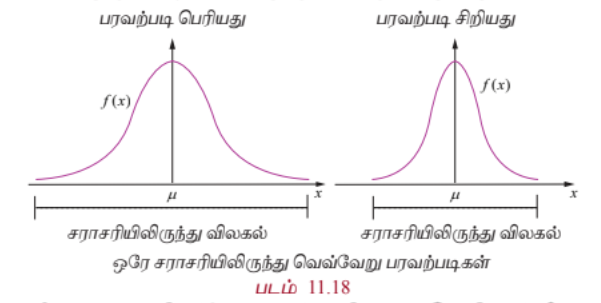

## 11.5 கணித எதிர்பார்ப்பு (Mathematical Expectation)

சமவாய்ப்பு மாறியின் முக்கியமான சிறப்பியல்புகளில் ஒன்று அதன் கணித எதிர்பார்ப்பு ஆகும். கணித எதிர்பார்ப்பின் பிற பெயர்கள் எதிர்பார்ப்பு மதிப்பு, சராசரி, மற்றும் முதல் விலக்கப் பெருக்கத் தொகை முதலியன.

வழக்கமாக எண் சராசரி முறையிலேயே கணித எதிர்பார்ப்பும் அதனையொட்டி வரையறுக்கப்படுகிறது.

$n$ எண்களின் $a_1, a_2, a_3, \ldots, a_n$ -ன் சராசரி எண் மதிப்பு,

$$\frac{a_1 + a_2 + a_3 + \cdots + a_n}{n}$$

ஆகும்.

$a_1, a_2, a_3, \ldots, a_n$ ஆகிய $n$ எண்களின் முழு தொகுப்பையும் தொகுத்து ஒற்றை மதிப்பில் சுருக்கமாகவோ அல்லது வகைப்படுத்தவோ சராசரி உதவுகிறது.

### விளக்க எடுத்துக்காட்டு 11.7

6, 2, 5, 5, 2, 6, 2, -4, 1, 5 எனும் பத்து எண்களைக் கருதுக.

இதன் சராசரி

$$\frac{6 + 2 + 5 + 5 + 2 + 6 + 2 - 4 + 1 + 5}{10} = 3$$

ஆகும்.

6, 2, 5, 5, 2, 6, 2, -4, 1, 5 ஆகிய 10 எண்களையும் சமவாய்ப்பு மாறி $X$-ன் மதிப்புகளாக கருதினால் நிகழ்தகவு நிறை சார்பு

| $x$ | -4 | 1 | 2 | 5 | 6 |
|---|---|---|---|---|---|
| $P(X = x)$ | $\frac{1}{10}$ | $\frac{1}{10}$ | $\frac{3}{10}$ | $\frac{3}{10}$ | $\frac{2}{10}$ |

ஆகும்.

சராசரிக்கான மேற்கண்ட கணக்கீட்டை

$$-4 \cdot \frac{1}{10} + 1 \cdot \frac{1}{10} + 2 \cdot \frac{3}{10} + 5 \cdot \frac{3}{10} + 6 \cdot \frac{2}{10} = 3$$

எனவும் மாற்றி எழுதலாம்.

இவ்வெடுத்துக்காட்டின் மூலம் சமவாய்ப்பு மாறியின் ஓவ்வொரு மதிப்பையும் அதன் நிகழ்தகவால் பெருக்கி கிடைக்கும் பெருக்கல்களின் கூட்டலாக எந்தவொரு சமவாய்ப்பு மாறியின் சராசரி அல்லது எதிர்பார்ப்பு மதிப்பைப் பெறலாம் என்பது தெளிவாகிறது. எனவே சராசரி = (x -இன் மதிப்பு) $\times$ நிகழ்தகவு

சமவாய்ப்பு மாறி தனிநிலை எனில் இக்கூற்று மெய்யாகும். தொடர்ச்சியான சமவாய்ப்பு மாறியைப் பொறுத்தவரையில், கணித எதிர்பார்ப்பும் கூட்டலுக்கு பதிலாக தொகையிடலின் அடிப்படையிலேயே அமையும்.

சமவாய்ப்பு மாறி $X$ -க்கான நிகழ்தகவு பரவலுக்கு தொகுக்க பொதுவாக இரு அளவுகள் பயன்படுத்தப்படுகின்றன. புள்ளியியலைப் பொறுத்தவரை ஒன்று மையப்போக்கு மற்றொன்று சிதறல் அல்லது நிகழ்தகவு பரவலின் மாறுபாடு எனலாம். நிகழ்தகவு பரவலின் மையப்போக்கின் அளவையே சராசரி ஆகும். மேலும் சிதறலின் அளவையே பரவற்படி அல்லது பரவலின் மாறுபாடு ஆகும். ஆனால் இவ்விரு அளவைகளும் ஒரு நிகழ்தகவு பரவலினை தனிச்சிறப்புப்பட இனங்காணவில்லை. அதாவது இரு வெவ்வேறு பரவல்களுக்கும் ஒரே சராசரியும் சிதறலும் அமையலாம். இருப்பினும் இத்தகு அளவைகள் எளிதாக கணிக்க இயலும். சமவாய்ப்பு மாறி $X$ -இன் நிகழ்தகவுப் பரவலினைப் பற்றி கற்க உதவுகின்றன.

## 11.5.1 சராசரி (Mean)

**வரையறை 11.8 (சராசரி)**

ஒரு சமவாய்ப்பு மாறி $X$ -இன் நிகழ்தகவு நிறை அல்லது அடர்த்திச் சார்பு $f(x)$ என்க.

$$E(X) = \begin{cases}
\sum_x x f(x), & \text{X தனிநிலை எனில்} \\
\int_{-\infty}^{\infty} x f(x) \, dx, & \text{X தொடர்ச்சியானது எனில்}
\end{cases}$$

$E(X)$ அல்லது $\mu$ என்பது எதிர்பார்ப்பின் மதிப்பு அல்லது சராசரி அல்லது $X$ -இன் கணித எதிர்பார்ப்பு என வரையறுக்கப்படுகிறது.

எதிர்பார்க்கப்படும் மதிப்பு பொதுவாக சமவாய்ப்பு மாறி கொள்ளும் மதிப்பாக இருக்ககாது. பன்முறை சார்பற்று செய்யப்படும் ஒரு சோதனையில் ஒரு சமவாய்ப்பு மாறியின் எதிர்பார்ப்பை புரிந்து கொள்ள இந்த எதிர்பார்க்கப்படும் மதிப்பு உதவும்.

**தேற்றம் 11.3 (நிரூபணமின்றி)**

நிகழ்தகவு நிறை அல்லது அடர்த்திசார்பு $f(x)$ உடைய ஒரு சமவாய்ப்பு மாறி $X$ என்க. $g(X)$ எனும் புதிய சமவாய்ப்பு மாறியின் சார்பின் எதிர்பார்ப்பு மதிப்பு,

$$E(g(X)) = \begin{cases}
\sum_x g(x) f(x), & \text{X தனிநிலை எனில்} \\
\int_{-\infty}^{\infty} g(x) f(x) \, dx, & \text{X தொடர்ச்சியானது எனில்}
\end{cases}$$

$g(X) = X^k$, $k = 0, 1, 2, \ldots$ எனில், மேற்கண்ட தேற்றம் தரும் எதிர்பார்க்கப்படும் மதிப்பு சமவாய்ப்பு மாறி $X$-ன் ஆதிபுள்ளியில் உள்ள $k$ -வது விலக்கப் பெருக்கத் தொகை எனப்படுகிறது.

$$E(X^k) = \begin{cases}
\sum_x x^k f(x), & \text{X தனிநிலை எனில்} \\
\int_{-\infty}^{\infty} x^k f(x) \, dx, & \text{X தொடர்ச்சியானது எனில்}
\end{cases}$$

### குறிப்பு

$k = 0$ எனும்போது, வரையறைப்படி,

$$E(X^0) = \begin{cases}
\sum_x f(x) = 1, & \text{X தனிநிலை எனில்} \\
\int_{-\infty}^{\infty} f(x) \, dx = 1, & \text{X தொடர்ச்சியானது எனில்}
\end{cases}$$

## 11.5.2 பரவற்படி அல்லது மாறுபாட்டளவை (Variance)

பரவற்படி எனும் புள்ளியியல் அளவை தரவுகளின் தொகுப்பின் சராசரி மதிப்பிலிருந்து அளவிடப்பட்ட தரவு எவ்வவாறு மாறுபடுகிறது என்பதைக் கூறுகிறது. கணித ரீதியாக, மாறுபாட்டளவை என்பது ஒரு தரவு தொகுப்பின் எண்கணித சராசரியிலிருந்து விலகல்களின் வர்க்கங்களின் சராசரியாகும். மாறுபாடு, பரவல் மற்றும் சிதறல் ஆகிய சொற்கள் ஒத்தவையாகும், மேலும் பரவல் எவ்வவாறு பரவுகிறது என்பதைக் குறிக்கிறது.

**வரையறை 11.9 (பரவற்படி)**

$Var(X)$ or $\sigma^2$ or $\sigma_x^2$ எனக் குறிப்பிடப்படும் சமவாய்ப்பு மாறி $X$-ன் பரவற்படி

$$Var(X) = E[(X - E(X))^2] = E(X^2) - [E(X)]^2$$

ஆகும்.

பரவற்படியின் வர்க்கமூலம் திட்ட விலக்கம் எனப்படும். அதாவது திட்ட விலக்கம் $\sqrt{Var(X)}$ ஆகும். சமவாய்ப்பு மாறியின் பரவற்படியும் திட்டவிலக்கமும் குறையற்ற எண்ணாகத்தான் இருக்கும்.

## 11.5.3 கணித எதிர்பார்ப்பு மற்றும் பரவற்படியின் பண்புகள்
### (Properties of Mathematical expectation and variance)

(i) $E(aX + b) = aE(X) + b$, இங்கு $a$ மற்றும் $b$ ஆகியன மாறிலிகள்.

**நிரூபணம்**

$X$ ஒரு தனிநிலை சமவாய்ப்பு மாறி எனில்,

$$E(aX + b) = \sum_i (ax_i + b) f(x_i)$$

(வரையறைப்படி)

$$= \sum_i ax_i f(x_i) + \sum_i b f(x_i)$$

$$= a\sum_i x_i f(x_i) + b\sum_i f(x_i)$$

$$= aE(X) + b \cdot 1 \quad (\because \sum_i f(x_i) = 1)$$

$$E(aX + b) = aE(X) + b$$

இதேபோன்று, $X$ ஒரு தொடர்ச்சியான சமவாய்ப்பு மாறி எனில், கூட்டலை தொகையிடலாக மாற்றி நிரூபிக்கலாம்.

**கிளைத்தேற்றம் 1 :** $E(aX) = aE(X)$ ($b = 0$ எனும்போது)

**கிளைத்தேற்றம் 2 :** $E(b) = b$ ($a = 0$ எனும்போது)

(ii) $$Var(X) = E(X^2) - [E(X)]^2$$

**நிரூபணம்**

$E(X) = \mu$ என அறிவோம்.

$$Var(X) = E[(X - \mu)^2]$$

$$= E[X^2 - 2\mu X + \mu^2]$$

$$= E(X^2) - 2\mu E(X) + \mu^2 \quad (\mu \text{ என்பது ஒரு மாறிலி})$$

$$= E(X^2) - 2\mu^2 + \mu^2$$

$$Var(X) = E(X^2) - [E(X)]^2$$

சமவாய்ப்பு மாறி $X$ -இன் பரவற்படியைக் கணக்கிட ஒரு மாற்று வழி

$$\sigma^2 = Var(X) = E(X^2) - [E(X)]^2$$

(iii) $$Var(aX + b) = a^2 Var(X)$$ இங்கு $a$ மற்றும் $b$ ஆகியவை மாறிலிகள்.

**நிரூபணம்**

$$Var(aX + b) = E[(aX + b) - E(aX + b)]^2$$

$$= E[(aX + b) - (aE(X) + b)]^2$$

$$= E[aX - aE(X)]^2$$

$$= E[a^2 (X - E(X))^2]$$

$$= a^2 E[(X - E(X))^2]$$

எனவே $$Var(aX + b) = a^2 Var(X)$$

**கிளைத்தேற்றம் 3 :** $Var(aX) = a^2 Var(X)$ ($b = 0$ எனும்போது)

**கிளைத்தேற்றம் 4 :** $Var(b) = 0$ ($a = 0$ எனும்போது)

பரவற்படி என்பது சமவாய்ப்பு மாறியின் மதிப்புகளின் சராசரி $\mu$-ஐப் பொறுத்து விலகல் பற்றிய தகவல்களைத் தருகிறது. $\sigma^2$ சிறியதாக இருந்தால் சமவாய்ப்பு மாறிகள் சராசரியைப் பொறுத்து அதிகமாகத் திரண்டு குவிந்ததாக அமையும். $\sigma^2$ பெரியதாக இருந்தால் சமவாய்ப்பு மாறியின் மதிப்புகள் சராசரியிலிருந்து மிகவும் விலகியிருக்கும் என்பது பொருளாகும்.

ஓரே சராசரியும் ஆனால் வெவ்வேறு பரவற்படி கொண்ட இரு தொடர்ச்சியான சமவாய்ப்பு மாறிகளின் pdf-களை மேற்கண்ட படம் காண்பிக்கிறது. அவற்றின் வளைவரைகள் மணி வடிவில் உள்ளது.

## எடுத்துக்காட்டு 11.16

கீழ்க்காணும் சார்பு ஒரு நிகழ்தகவு நிறை சார்பினைக் குறிக்கிறது என்க.

| $x$ | 1 | 2 | 3 | 4 | 5 | 6 |
|---|---|---|---|---|---|---|
| $f(x)$ | $c$ | $2c$ | $3c$ | $4c$ | $5c$ | $2c$ |

(i) $c$-ன் மதிப்பு

(ii) சராசரி மற்றும் பரவற்படி காண்க.

#### தீர்வு

(i) $f(x)$ ஒரு நிகழ்தகவு நிறை சார்பு என்பதால், அனைத்து $x$ -க்கும், $f(x) \ge 0$ மற்றும் $\sum_x f(x) = 1$.

ஆகையால், $\sum_x f(x) = 1$

$$c + 2c + 3c + 4c + 5c + 2c = 1$$

$$17c = 1 \implies c = \frac{1}{17}$$

அனைத்து $x$ -க்கும், $f(x) \ge 0$ என்பதால், $c$ -இன் சாத்தியமான மதிப்பு $\frac{1}{17}$ ஆகும்.

எனவே, நிகழ்தகவு நிறை சார்பானது

| $x$ | 1 | 2 | 3 | 4 | 5 | 6 |
|---|---|---|---|---|---|---|
| $f(x)$ | $\frac{1}{17}$ | $\frac{2}{17}$ | $\frac{3}{17}$ | $\frac{4}{17}$ | $\frac{5}{17}$ | $\frac{2}{17}$ |

(ii) சராசரி மற்றும் பரவற்படி காண கீழ்க்காணும் அட்டவணையைப் பயன்படுத்துவோம்.

| $x$ | $f(x)$ | $xf(x)$ | $x^2 f(x)$ |
|---|---|---|---|
| 1 | $\frac{1}{17}$ | $\frac{1}{17}$ | $\frac{1}{17}$ |
| 2 | $\frac{2}{17}$ | $\frac{4}{17}$ | $\frac{8}{17}$ |
| 3 | $\frac{3}{17}$ | $\frac{9}{17}$ | $\frac{27}{17}$ |
| 4 | $\frac{4}{17}$ | $\frac{16}{17}$ | $\frac{64}{17}$ |
| 5 | $\frac{5}{17}$ | $\frac{25}{17}$ | $\frac{125}{17}$ |
| 6 | $\frac{2}{17}$ | $\frac{12}{17}$ | $\frac{72}{17}$ |
|  | $\sum f(x) = 1$ | $\sum xf(x) = \frac{67}{17}$ | $\sum x^2 f(x) = \frac{297}{17}$ |

சராசரி:

$$E(X) = \sum x f(x) = \frac{67}{17} \approx 3.94$$

பரவற்படி:

$$Var(X) = E(X^2) - [E(X)]^2 = \sum x^2 f(x) - \left(\sum x f(x)\right)^2$$

$$= \frac{297}{17} - \left(\frac{67}{17}\right)^2 = \frac{297}{17} - \frac{4489}{289} = \frac{5049 - 4489}{289} = \frac{560}{289} \approx 1.94$$

எனவே சராசரி மற்றும் பரவற்படி முறையே $\frac{67}{17}$ மற்றும் $\frac{560}{289}$ ஆகும்.

## எடுத்துக்காட்டு 11.17

8 வெள்ளை மற்றும் 4 கருப்பு பந்துகள் கொண்ட ஒரு கூடையிலிருந்து இரு பந்துகள் சமவாய்ப்பு முறையில் தேர்ந்தெடுக்கப்படுகின்றன. தேர்ந்தெடுக்கப்படும் ஒவ்வொரு கருப்பு பந்துக்கும் ₹20 வெல்லும் தொகையாகவும் தேர்ந்தெடுக்கப்படும் ஒவ்வொரு வெள்ளை பந்துக்கும் ₹10 தோற்கும் தொகையாகவும் கருதுக. எதிர்பார்க்கப்படும் வெல்லும் தொகை மற்றும் பரவற்படி காண்க.

#### தீர்வு

$X$ என்பது வெல்லும் தொகை என்க. சாத்தியமான தேர்வுகளாவன (i) இரு பந்துகளுமே கருப்பு, அல்லது (ii) ஒரு வெள்ளை மற்றும் ஒரு கருப்பு (iii) இரண்டுமே வெள்ளை. எனவே $X$ எனும் சமவாய்ப்பு மாறி கீழ்க்காணுமாறு வரையறுக்கப்படுகிறது:

$X$ (இரண்டுமே கருப்பு பந்துகள்) = $2(20) = ₹40$

$X$ (ஒரு கருப்பு பந்து மற்றும் ஒரு வெள்ளைப் பந்து) = $20 - 10 = ₹10$

$X$ (இரண்டுமே வெள்ளைப் பந்துகள்) = $-2(10) = -₹20$

எனவே $X$ கொள்ளும் மதிப்புகள் 40, 10 மற்றும் -20 ஆகும்.

மொத்த பந்துகள் $n = 12$

2 பந்துகள் தேர்ந்தெடுக்க மொத்த வழிகள் = $\binom{12}{2} = \frac{12 \times 11}{2} = 66$

2 கருப்பு பந்துகள் தேர்ந்தெடுக்க வழிகள் = $\binom{4}{2} = 6$

ஒரு கருப்பு பந்து மற்றும் ஒரு வெள்ளை பந்து தேர்ந்தெடுக்க = $\binom{4}{1}\binom{8}{1} = 32$

2 வெள்ளை பந்துகள் தேர்ந்தெடுக்க வழிகள் = $\binom{8}{2} = 28$

| சமவாய்ப்பு மாறி $X$ -இன் மதிப்புகள் | 40 | 10 | -20 | மொத்தம் |
|---|---|---|---|---|
| நேர்மாறு பிம்பங்களிலுள்ள உறுப்புகளின் எண்ணிக்கை | 6 | 32 | 28 | 66 |

நிகழ்தகவு நிறை சார்பானது

| $X$ | 40 | 10 | -20 | மொத்தம் |
|---|---|---|---|---|
| $f(x)$ | $\frac{6}{66}$ | $\frac{32}{66}$ | $\frac{28}{66}$ | 1 |

சராசரி:

$$E(X) = \sum x f(x) = 40\left(\frac{6}{66}\right) + 10\left(\frac{32}{66}\right) - 20\left(\frac{28}{66}\right)$$

$$= \frac{240 + 320 - 560}{66} = 0$$

அதாவது எதிர்பார்க்கப்படும் வெல்லும் தொகை 0.

பரவற்படி:

$$E(X^2) = \sum x^2 f(x) = 40^2\left(\frac{6}{66}\right) + 10^2\left(\frac{32}{66}\right) + (-20)^2\left(\frac{28}{66}\right)$$

$$= \frac{9600 + 3200 + 11200}{66} = \frac{24000}{66} = \frac{4000}{11}$$

$$[E(X)]^2 = 0^2 = 0$$

இதன்படி

$$Var(X) = E(X^2) - [E(X)]^2 = \frac{4000}{11} - 0 = \frac{4000}{11}$$

எனவே $E(X) = 0$ மற்றும் $Var(X) = \frac{4000}{11}$

## எடுத்துக்காட்டு 11.18

$$f(x) = \begin{cases}
\lambda e^{-\lambda x}, & x \ge 0 \\
0, & \text{மற்றபடி}
\end{cases}$$

எனும் நிகழ்தகவு அடர்த்தி சார்பு உள்ள ஒரு சமவாய்ப்பு மாறி $X$ -க்கு சராசரி மற்றும் பரவற்படி காண்க.

#### தீர்வு

கொடுக்கப்பட்டுள்ள பரவல் தொடர்ச்சியானது என்பதை கவனிக்கவும்.

**சராசரி**

வரையறைப்படி

$$\mu = E(X) = \int_{-\infty}^{\infty} x f(x) \, dx$$

$$= \int_{-\infty}^{0} x(0) \, dx + \int_{0}^{\infty} x(\lambda e^{-\lambda x}) \, dx$$

$$= \lambda \int_{0}^{\infty} x e^{-\lambda x} \, dx$$

$$= \lambda \frac{\Gamma(2)}{\lambda^2} = \lambda \frac{1!}{\lambda^2} = \frac{1}{\lambda}$$

(மிகை முழு எண் $n$ -க்கு, காமா தொகையிடல் $\Gamma(n) = \int_0^{\infty} x^{n-1} e^{-x} \, dx = (n-1)!$)

**பரவற்படி**

வரையறைப்படி,

$$E(X^2) = \int_{-\infty}^{\infty} x^2 f(x) \, dx$$

$$= \int_{-\infty}^{0} x^2(0) \, dx + \int_{0}^{\infty} x^2(\lambda e^{-\lambda x}) \, dx$$

$$= \lambda \int_{0}^{\infty} x^2 e^{-\lambda x} \, dx$$

$$= \lambda \frac{\Gamma(3)}{\lambda^3} = \lambda \frac{2!}{\lambda^3} = \frac{2}{\lambda^2}$$

(காமா தொகையிடல் பயன்படுத்த)

எனவே

$$Var(X) = E(X^2) - [E(X)]^2 = \frac{2}{\lambda^2} - \left(\frac{1}{\lambda}\right)^2 = \frac{1}{\lambda^2}$$

ஆகையால் சராசரி மற்றும் பரவற்படி முறையே $\frac{1}{\lambda}$ மற்றும் $\frac{1}{\lambda^2}$.

(பெர்னோலி சூத்திரப்படி அல்லது பகுதி தொகையிடல் முறையினையும் பயன்படுத்தலாம்)

## பயிற்சி 11.4

1. கீழ்க்காணும் ஒரு சமவாய்ப்பு மாறி $X$ -ன் நிகழ்தகவு நிறை (அல்லது) அடர்த்திச் சார்புகளுக்கு சராசரி மற்றும் பரவற்படி காண்க:

(i) $$f(x) = \begin{cases}
\frac{1}{10}, & x = 2, 5 \\
\frac{1}{5}, & x = 0, 1, 3, 4
\end{cases}$$

(ii) $$f(x) = \begin{cases}
\frac{x}{6}, & x = 1, 2, 3
\end{cases}$$

(iii) $$f(x) = \begin{cases}
2x, & 0 \le x \le 1 \\
0, & \text{மற்றபடி}
\end{cases}$$

(iv) $$f(x) = \begin{cases}
\frac{1}{\sqrt{2\pi}} e^{-\frac{x^2}{2}}, & -\infty < x < \infty \\
0, & \text{மற்றபடி}
\end{cases}$$

2. நான்கு சிவப்புப் பந்துகளும் மற்றும் மூன்று கருப்புப் பந்துகள் கொண்ட ஒரு கூடையிலிருந்து பதிலீடாக இடாது அடுத்தடுத்து இரு பந்துகள் வெளியில் எடுக்கப்படுகின்றன. சிவப்பு பந்து வெளியில் எடுக்கும் சாத்திய கூறுகளை $X$ என்க. $X$-ன் நிகழ்தகவு நிறை சார்பையும் சராசரியையும் காண்க.

3. $\mu$ மற்றும் $\sigma^2$ ஆகியவை முறையே தனிநிலை சமவாய்ப்பு மாறி $X$ -ன் சராசரி மற்றும் பரவற்படி மற்றும் $E(X) = 10$ மற்றும் $E(X^2) = 116$ எனில் $\mu$ மற்றும் $\sigma^2$ காண்க.

4. நான்கு சீரான நாணயங்கள் ஒரு முறை சுண்டப்படுகின்றன. தலைகளின் எண்ணிக்கை நிகழ்விற்கு நிகழ்தகவு நிறை சார்பு, சராசரி, மற்றும் பரவற்படி காண்க.

5. ஒரு பயணிகள் இரயில் ஒவ்வொரு அரை மணி நேரத்திற்கும் ஒரு நிலையத்திற்கு சரியான நேரத்தில் வந்து சேரும். ஒவ்வொரு நாள் காலையிலும், ஒரு மாணவர் தனது வீட்டிலிருந்து இரயில் நிலையத்திற்கு செல்கிறார். மாணவர் ரயில் நிலையத்தை அடையும் நேரத்திலிருந்து ரயிலுக்காக காத்திருக்கும் நேரத்தை $X$ என நிமிடங்களில் குறிக்கலாம். $X$ -ன் நிகழ்தகவு அடர்த்தி சார்பு

$$f(x) = \begin{cases}
\frac{1}{30}, & 0 \le x \le 30 \\
0, & \text{மற்றபடி}
\end{cases}$$

எனில் சமவாய்ப்பு மாறி $X$ -ன் எதிர்பார்ப்பு மதிப்பை கணித்து விளக்குக.

6. கணினி தயாரிக்கப்படும்போது ஆயிரக்கணக்கான மணிநேரம் பயன்படுத்தப்படும் ஒரு மின்னணுசாதனமொன்றின் பழுதடையும் நேரத்தின் அடர்த்தி சார்பு

$$f(x) = \begin{cases}
3e^{-3x}, & x > 0 \\
0, & \text{மற்றபடி}
\end{cases}$$

ஆகும். இம்மின்னணுசாதனத்தின் எதிர்பார்க்கப்படும் ஆயுட்காலத்தை காண்க.

7. சமவாய்ப்பு மாறி $X$ -ன் நிகழ்தகவு அடர்த்தி சார்பு

$$f(x) = \begin{cases}
16x e^{-4x}, & x > 0 \\
0, & x \le 0
\end{cases}$$

ஆகும். சமவாய்ப்பு மாறி $X$ -ன் சராசரி மற்றும் பரவற்படி காண்க.