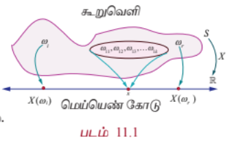
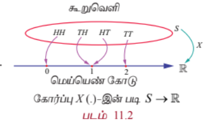
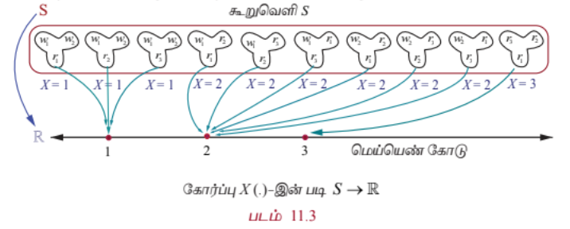

### 11.2 சமவாய்ப்பு மாறி (Random Variable)

சமவாய்ப்புச் சோதனையின் முடிவைக் குறியீடுகளால் குறிப்பது அனைத்து நிகழ்வுகளிலும் எளிதானது அல்ல. நாம் கருதும் பல சமவாய்ப்புச் சோதனைகளில் சாத்தியமான முடிவுகளின் விளக்கமாக $S$ எனும் கூறுவெளியே அமைகின்றது.

லேப்லஸ்
(1749-1827)

190

11 நிகழ்தகவு பரவல்கள்

12th_Maths_Vol 2_TM_CH 11_Probability.indd 190 26/11/2024 11:15:10

191 நிகழ்தகவு பரவல்கள்

அதாவது சோதனையின் முடிவு அல்லது $S$ எனும் கூறுவெளியின் கூறுபுள்ளிகள் எண்களாக இருக்க வேண்டிய அவசியமில்லை. உதாரணமாக ஒரு நாணயத்தைச் சுண்டும்போது கிடைக்கும் முடிவுகள் $H$ (தலை) அல்லது $T$ (பூ) ஆகும். சமவாய்ப்புச் சோதனையின் முடிவுகளில் சில தருணங்களில் எண்மதிப்புகளைத்தான் கையாளவேண்டியுள்ளது. எனவே சோதனையின் ஒவ்வொரு முடிவிற்கும் ஓர் எண்ணை ஒதுக்கீடு செய்கிறோம். அதாவது தலைக்கு 1 எனவும் பூவிற்கு 0 எனவும் ஒதுக்கீடு செய்கிறோம். இவ்வாறு $S$ –இல் உள்ள உறுப்புகளுக்கு எண்மதிப்புகளை ஒதுக்கீடு செய்தல் ஒரு **சமவாய்ப்பு மாறி** என அழைக்கப்படுகிறது. ஒரு சமவாய்ப்பு மாறி என்பது உண்மையில் ஒரு சார்பாகும்.

#### வரையறை 11.1

ஒரு சமவாய்ப்பு மாறி $X$ என்பது $S$ எனும் கூறுவெளியிலிருந்து $\mathbb{R}$ எனும் மெய்யெண் கணத்தின் மீது பின்வருமாறு வரையறுக்கப்படும் சார்பாகும்.

$\mathbb{R}$ –இல் உள்ள இடைவெளி அல்லது உட்கணம் அல்லது கூறுபுள்ளிகளின் நேர்மாறு பிம்பங்கள் $S$ –இல், ஒரு நிகழ்வாக அமைகிறது. ஒவ்வொரு நிகழ்வும் நிகழ்தகவு மதிப்பைக் கொண்டிருக்கும்.

சமவாய்ப்பு மாறிகளைக் குறிப்பிட ஆங்கில எழுத்துகளில் தலைப்பு எழுத்துக்களான $X, Y$ மற்றும் $Z$ போன்றவற்றையும் சமவாய்ப்பு மாறிகளுக்கான சாத்தியமுள்ள மதிப்புகளைக் குறிப்பிட சிறிய எழுத்துக்களான $x, y$ மற்றும் $z$ போன்றவற்றையும் பயன்படுத்துவோம்.

ஒரு சமவாய்ப்பு மாறிக்கான கூறுவெளி $S = \{\omega_1, \omega_2, \omega_3, \ldots\}$ என்க. $\mathbb{R}$ என்பது மெய்யெண் கோட்டைக் குறிக்கிறது. இனி $X$ என்பது $S$ -இல் வரையறுக்கப்பட்ட மெய்மதிப்புச் சார்பு என்க. $X : S \rightarrow \mathbb{R}$ எனக் குறிப்பிடப்படுகிறது. $\omega$ என்பது $S$ -இல் உள்ள கூறுபுள்ளி என்பதால் $X(\omega)$ என்பது ஒரு மெய்யெண்ணாகும்.

$X(\omega) \in \mathbb{R}$ எனுமாறு உள்ள $X(\omega)$ தொகுப்பு வீச்சகமாகும். அதாவது $R_X$ எனக் குறிப்பிடப்படும் வீச்சகமானது $R_X = \{X(\omega) / \omega \in S\}$ ஆகும்.

மெய்யெண் கோட்டின் மீதான கூறுவெளி $S$ -இன் சில கூறுபுள்ளிகள் $\omega_i$ அல்லது நிகழ்வுகளின் வரைபடத்தை படம் 11.1-ல் காணலாம்.

சான்றாக, $\omega_{11}, \omega_{12}, \omega_{13}, \ldots, \omega_{1k} \in S$ –க்கு $x$ என்பது $X$ -இன் ஒரு சாத்தியமான மதிப்பு எனில் $\omega_{11}, \omega_{12}, \omega_{13}, \ldots, \omega_{1k}$ என்பது $x$ –இன் நேர்மாறு மதிப்பாகும்.

அதாவது $X^{-1}(x) = \{\omega_{11}, \omega_{12}, \omega_{13}, \ldots, \omega_{1k}\}$ என்பது $S$–இல் ஒரு நிகழ்வாகும்.

---

### விளக்க எடுத்துக்காட்டு 11.1

ஒரு நாணயம் ஒரு முறை சுண்டப்படுகிறது என்க. $H$(தலை) மற்றும் $T$(பூ) என இரு கூறுபுள்ளிகள் கூறுவெளியில் உள்ளன.

அதாவது $S = \{T, H\}$.

$X : S \rightarrow \mathbb{R}$ என்பது தலைகளின் எண்ணிக்கை என்க.

அதாவது $X(T) = 0$, மற்றும் $X(H) = 1$ ஆகும்.

எனவே $X$ எனும் சமவாய்ப்பு மாறி 0 மற்றும் 1 ஆகிய மதிப்புகளைப் பெறுகிறது. $X(\omega)$ என்பது தலைகளின் எண்ணிக்கையைக் குறித்தால்

$$
X(\omega) =
\begin{cases}
0, & \omega = T \\
1, & \omega = H
\end{cases}
$$

---

### எடுத்துக்காட்டு 11.1

இரு நாணயங்கள் ஒரு முறை சுண்டப்படுகின்றன. $X$ என்பது பூக்களின் எண்ணிக்கையைக் குறித்தால், (i) கூறுவெளியை எழுதுக (ii) 1–ன் நேர்மாறு பிம்பத்தைக் காண்க (iii) சமவாய்ப்பு மாறியின் மதிப்புகள், மற்றும் நேர்மாறு பிம்பங்களில் உள்ள உறுப்புகளின் எண்ணிக்கையைக் காண்க.

#### தீர்வு

(i) கூறுவெளி $S = \{(H, T), (T, H), (T, T), (H, H)\}$

அதாவது $S = \{TT, TH, HT, HH\}$

(ii) $X : S \rightarrow \mathbb{R}$ என்பது பூக்களின் எண்ணிக்கை என்க.

எனவே $X(TT) = 2$ (2 பூக்கள்)

$X(TH) = 1$ (1 பூ)

$X(HT) = 1$ (1 பூ)

மற்றும் $X(HH) = 0$ (0 பூக்கள்).

இனி $X$ என்பது 0, 1 மற்றும் 2 ஆகிய மதிப்புகளைப் பெறும் சமவாய்ப்பு மாறியாகும்.

$X(\omega)$ என்பது பூக்களின் எண்ணிக்கையைக் குறிப்பிடுகிறது என்க, இதிலிருந்து

$$
X(\omega) =
\begin{cases}
2, & \omega = TT \\
1, & \omega = HT, TH \\
0, & \omega = HH
\end{cases}
$$

எனப் பெறுகிறோம்.

1-இன் நேர்மாறு பிம்பங்கள் $TH, HT$ ஆகும். அதாவது $X^{-1}(1) = \{TH, HT\}$.

(iii) நேர்மாறு பிம்பங்களில் உறுப்புகளின் எண்ணிக்கை பட்டியலில் காட்டப்பட்டுள்ளது.

| சமவாய்ப்பு மாறியின் மதிப்புகள் | 0 | 1 | 2 | மொத்தம் |
|---|---|---|---|---|
| நேர்மாறு பிம்பங்களில் உறுப்புகளின் எண்ணிக்கை | 1 | 2 | 1 | 4 |

---

### எடுத்துக்காட்டு 11.2

சீரான இரு பகடைகள் உருட்டப்படுவதாகக் கொள்வோம். $X$ என்பது இரு பகடையில் கிடைக்கும் எண்களின் மொத்தக் கூட்டுத் தொகை எனில், (i) கூறுவெளி (ii) $X$ எனும் சமவாய்ப்பு மாறி எடுக்கும் மதிப்புகள், (iii) 10-இன் நேர்மாறு பிம்பம், மற்றும் (iv) $X$-ன் நேர்மாறு பிம்பத்தில் உள்ள உறுப்புகளின் எண்ணிக்கை ஆகியவற்றைக் காண்க.

#### தீர்வு

(i) கூறுவெளி

$$S = \begin{Bmatrix}
(1,1), (1,2), (1,3), (1,4), (1,5), (1,6) \\
(2,1), (2,2), (2,3), (2,4), (2,5), (2,6) \\
(3,1), (3,2), (3,3), (3,4), (3,5), (3,6) \\
(4,1), (4,2), (4,3), (4,4), (4,5), (4,6) \\
(5,1), (5,2), (5,3), (5,4), (5,5), (5,6) \\
(6,1), (6,2), (6,3), (6,4), (6,5), (6,6)
\end{Bmatrix}$$

36 வரிசைப்படுத்தப்பட்ட சோடிகள் $(\alpha, \beta)$ -இல் உள்ளன. இங்கு $\alpha$ மற்றும் $\beta$ ஆகியவை 1 முதல் 6 வரை படத்திலிருப்பது போல் எந்தவொரு முழு எண் மதிப்பையும் பெறும். ஒவ்வொரு புள்ளி $(\alpha, \beta)$ என்பதற்கும் $X$ என்பது பகடையின் மேலுள்ள எண்களின் கூடுதல் என ஒதுக்கீடு செய்யப்படுகிறது.

அதாவது $X(\alpha, \beta) = \alpha + \beta$ ஆகும்.

எனவே

$X(1,1) = 1 + 1 = 2$

$X(1,2) = X(2,1) = 3$

$X(1,3) = X(2,2) = X(3,1) = 4$

$X(1,4) = X(2,3) = X(3,2) = X(4,1) = 5$

$X(1,5) = X(2,4) = X(3,3) = X(4,2) = X(5,1) = 6$

$X(1,6) = X(2,5) = X(3,4) = X(4,3) = X(5,2) = X(6,1) = 7$

$X(2,6) = X(3,5) = X(4,4) = X(5,3) = X(6,2) = 8$

$X(3,6) = X(4,5) = X(5,4) = X(6,3) = 9$

$X(4,6) = X(5,5) = X(6,4) = 10$

$X(5,6) = X(6,5) = 11$

$X(6,6) = 12$.

(ii) எனவே $X$ எனும் சமவாய்ப்பு மாறி 2, 3, 4, 5, 6, 7, 8, 9, 10, 11, 12 ஆகிய மதிப்புகளைப் பெறுகிறது.

(iii) 10-இன் நேர்மாறு பிம்பம் $\{(4,6), (5,5), (6,4)\}$ ஆகும்.

(iv) நேர்மாறு பிம்பங்களில் எண்ணிக்கை கீழே பட்டியலிடப்பட்டுள்ளது.

| சமவாய்ப்பு மாறியின் மதிப்புகள் | 2 | 3 | 4 | 5 | 6 | 7 | 8 | 9 | 10 | 11 | 12 | மொத்தம் |
|---|---|---|---|---|---|---|---|---|---|---|---|---|
| நேர்மாறு பிம்பங்களில் உறுப்புகளின் எண்ணிக்கை | 1 | 2 | 3 | 4 | 5 | 6 | 5 | 4 | 3 | 2 | 1 | 36 |

---

### எடுத்துக்காட்டு 11.3

ஒரு ஜாடியில் 2 வெள்ளை பந்துகள் மற்றும் 3 சிவப்பு பந்துகள் உள்ளன. சமவாய்ப்பு முறையில் 3 பந்துகள் ஜாடியிலிருந்து தேர்ந்தெடுக்கப்படுகின்றன. $X$ என்பது தேர்ந்தெடுக்கும் சிவப்பு பந்துகளின் எண்ணிக்கையைக் குறிப்பிட்டால், சமவாய்ப்பு மாறி $X$ -இன் மதிப்புகளையும் அதன் நேர்மாறு பிம்பங்களில் எண்ணிக்கையையும் காண்க.

#### தீர்வு

வெள்ளை மற்றும் சிவப்பு பந்துகளை, $w_1, w_2, r_1, r_2$, மற்றும் $r_3$ எனக் குறிப்பிடுவோம்.

கூறுவெளியில் $^5C_3 = 10$ வெவ்வேறு 3 எண்ணிக்கை அளவுள்ள கூறுகள் உள்ளன.

அதாவது $S = \{w_1w_2r_1, w_1w_2r_2, w_1w_2r_3, w_1r_1r_2, w_1r_1r_3, w_1r_2r_3, w_2r_1r_2, w_2r_1r_3, w_2r_2r_3, r_1r_2r_3\}$.

சமவாய்ப்பு மாறி $X$ எடுக்கும் மதிப்புகள் 1, 2, மற்றும் 3 ஆகும்.

| சமவாய்ப்பு மாறி $X$-இன் மதிப்புகள் | 1 | 2 | 3 | மொத்தம் |
|---|---|---|---|---|
| நேர்மாறு பிம்பங்களில் உறுப்புகளின் எண்ணிக்கை | 3 | 6 | 1 | 10 |

#### குறிப்புரை

$X$ என்பது வெள்ளை பந்துகளின் எண்ணிக்கையைக் குறிப்பிட்டால் $X$ எடுக்கக் கூடிய மதிப்புகள் 0, 1, மற்றும் 2 ஆகும். நேர்மாறு பிம்பங்களில் எண்ணிக்கை கீழ்க்காணுமாறு பட்டியலிடப்படுகிறது.

| சமவாய்ப்பு மாறி $X$-இன் மதிப்புகள் | 0 | 1 | 2 | மொத்தம் |
|---|---|---|---|---|
| நேர்மாறு பிம்பங்களில் உறுப்புகளின் எண்ணிக்கை | 1 | 6 | 3 | 10 |

---

### விளக்க எடுத்துக்காட்டு 11.2

150 மாணவர்களைக் கொண்ட ஒரு குழு 4 பேருந்துகளில் சுற்றுலாவிற்குச் செல்கின்றனர். ஒரு பேருந்தில் 38 மாணவர்களும், இரண்டாவது பேருந்தில் 36 மாணவர்களும், மூன்றாவது பேருந்தில் 32 மாணவர்களும், மீதமுள்ள மாணவர்கள் நான்காவது பேருந்திலும் பயணித்தனர். சேருமிடம் வந்ததும் அந்த 150 மாணவர்களில் ஒருவர் சமவாய்ப்பு முறையில் தேர்ந்தெடுக்கப்பட்டார். $X$ என்பது சமவாய்ப்பு முறையில் தேர்ந்தெடுக்கப்பட்ட மாணவன் இருந்த பேருந்திலுள்ள மாணவர்களின் எண்ணிக்கையைக் குறிக்கிறது என்க. எனவே $X$ என்பது 32, 36, 38, மற்றும் 44 ஆகிய மதிப்புகளைக் கொண்டிருக்கும்.

---

### எடுத்துக்காட்டு 11.4

6 வெள்ளை மற்றும் 4 கருப்பு பந்துகள் கொண்ட ஒரு ஜாடியிலிருந்து இரு பந்துகள் சமவாய்ப்பு முறையில் தேர்ந்தெடுக்கப்படுகின்றன. தேர்ந்தெடுக்கப்படும் ஒவ்வொரு கருப்பு பந்திற்கும் ` 30 வெல்வதாகவும் தேர்ந்தெடுக்கப்படும் ஒவ்வொரு வெள்ளை பந்திற்கும் ` 20 தோற்பதாகவும் கொள்க. வெல்லும் தொகையை $X$ குறிப்பதாகக் கொண்டால், $X$ -இன் மதிப்புகளையும் மற்றும் அதன் நேர்மாறு பிம்பங்களில் புள்ளிகளின் எண்ணிக்கையும் காண்க.

#### தீர்வு

சாத்தியமான தீர்வுகள் (i) இரண்டுமே கருப்பாக இருக்கலாம் அல்லது (ii) ஒரு வெள்ளை மற்றும் ஒரு கருப்பு அல்லது (iii) இரண்டுமே வெள்ளையாக இருக்கலாம். எனவே $X$ என்பது பின்வரும் மதிப்புகளைக் கொண்டிருக்கும் சமவாய்ப்பு மாறியாகும்.

$X$ (இரண்டுமே கருப்பு பந்துகள்) = ` $2(30) = $60$

$X$ (ஒரு கருப்பு மற்றும் ஒரு வெள்ளை பந்து) = ` $30 - $20 = $10$

$X$ (இரண்டுமே வெள்ளை பந்துகள்) = ` $2(-20) = -$40$

எனவே $X$ ஆனது 60, 10, மற்றும் -40 மதிப்புகளைக் கொண்டிருக்கும்.

| சமவாய்ப்பு மாறி $X$-இன் மதிப்புகள் | 60 | 10 | -40 | மொத்தம் |
|---|---|---|---|---|
| நேர்மாறு பிம்பங்களில் உறுப்புகளின் எண்ணிக்கை | 6 | 24 | 15 | 45 |

(60-இன் நேர்மாறு பிம்பம் $\{r_1r_2, r_1r_3, r_1r_4, r_2r_3, r_2r_4, r_3r_4\}$ ஆகும்.)

---

### விளக்க எடுத்துக்காட்டு 11.3

தலை நிகழும்வரை ஒரு நாணயம் சுண்டப்படுகிறது. அதன் கூறுவெளி

$S = \{H, TH, TTH, TTTH, \ldots\}$ ஆகும்.

தலை நிகழும்வரை சுண்டப்படும் எண்ணிக்கையை $X$ என்க.

இனி $X$ எனும் சமவாய்ப்பு மாறி 1, 2, 3, $\ldots$ முதலிய மதிப்புகளைக் கொண்டிருக்கும்.

---

### விளக்க எடுத்துக்காட்டு 11.4

$N$ என்பது ஒரு கால இடைவெளியில் உதவிமையத்திற்குச் சென்று வரிசையில் காத்திருக்கும் நுகர்வோர்களின் எண்ணிக்கை எனில் குறையற்ற எண்களின் கணமாகத்தான் கூறுவெளி அமையும். அதாவது $S = \{0, 1, 2, 3, \ldots\}$ மற்றும் $N$ என்பது ஒரு சமவாய்ப்பு மாறி கொண்டிருக்கும் மதிப்புகள் $0, 1, 2, 3, \ldots$ ஆகும்.

---

### விளக்க எடுத்துக்காட்டு 11.5

ஒரு சோதனை மின் விளக்கின் ஆயுளை ஆராயும் எனில் மின்விளக்கின் ஆயுட்காலமாகக் கூறுவெளி அமையும். எனவே கூறுவெளியானது $S = [0, \infty)$ ஆகும். $X$ என்பது மின்விளக்கின் ஆயுட்காலத்தைக் குறித்தால், $X$ எனும் சமவாய்ப்பு மாறி கொண்டிருக்கும் மதிப்புகள் $[0, \infty)$ -ல் அமையும்.

---

### விளக்க எடுத்துக்காட்டு 11.6

$r$ ஆரமுள்ள ஒரு வட்டு $D$ என்க. $D$-இல் சமவாய்ப்பு முறையில் ஒரு புள்ளி தேர்ந்தெடுக்கப்படுகிறது. மையத்திலிருந்து புள்ளி இருக்கும் தொலைவை $X$ என்க. கூறுவெளி $S = D$ மற்றும் $X$ எனும் சமவாய்ப்பு மாறிக் கொண்டிருக்கும் மதிப்புகள் 0 முதல் $r$ வரை ஆகும். அதாவது $\forall \omega \in S$ -க்கு $X(\omega) \in [0, r]$ ஆகும்.

---

### பயிற்சி 11.1

1. $X$ என்பது மூன்று சீரான நாணயங்களை ஒரே சமயத்தில் ஒரு முறைச் சுண்டும்போது விழும் பூக்களின் எண்ணிக்கை என்க. சமவாய்ப்பு மாறியான $X$–இன் மதிப்புகளையும் அதன் நேர்மாறு பிம்பங்களில் உள்ள புள்ளிகளின் எண்ணிக்கையையும் காண்க.

2. ஒரு கூடையில் 5 மாங்கனிகள் மற்றும் 4 ஆப்பிள்கள் உள்ளன. அதிலிருந்து மூன்று பழங்கள் சமவாய்ப்பு முறையில் தேர்ந்தெடுக்கப்படுகின்றன. அவ்வாறு தேர்ந்தெடுக்கும் பழங்கள் ஆப்பிள்கள் எனில், சமவாய்ப்பு மாறியான $X$–இன் மதிப்புகளையும் அதன் நேர்மாறு பிம்பங்களில் உள்ள புள்ளிகளின் எண்ணிக்கையையும் காண்க.

3. 6 சிவப்பு மற்றும் 8 கருப்பு பந்துகள் உள்ள ஒரு கொள்கலனிலிருந்து இரு பந்துகள் சீரான முறையில் தேர்ந்தெடுக்கப்படுகின்றன. அவ்வாறு தேர்ந்தெடுக்கப்படும் ஒவ்வொரு சிவப்பு பந்திற்கும் ` 15 வெல்வதாகவும் தேர்ந்தெடுக்கப்படும் ஒவ்வொரு கருப்பு பந்திற்கும் ` 10 தோற்பதாகவும் கொள்க. வெல்லும் தொகையை $X$ குறிப்பதாகக் கொண்டால் $X$ -இன் மதிப்புகளையும் மற்றும் அதன் நேர்மாறு பிம்பங்களில் புள்ளிகளின் எண்ணிக்கையையும் காண்க.

4. ஆறு பக்க பகடை ஒன்றின் ஒரு பக்கத்தில் ‘2’ எனக் குறிக்கப்பட்டுள்ளது. அதன் இரண்டு பக்கங்களில் ‘3’ எனவும், மீதமுள்ள மூன்று பக்கங்களில் ‘4’ எனவும் உள்ளது. இருமுறை பகடை உருட்டப்படுகிறது. $X$ என்பது இரு உருட்டல்களில் கிடைக்கும் எண்களின் கூட்டுத் தொகையை குறிக்கிறது எனில், $X$ –இன் மதிப்புகளையும் மற்றும் அதன் நேர்மாறு பிம்பங்களில் புள்ளிகளின் எண்ணிக்கையையும் காண்க.