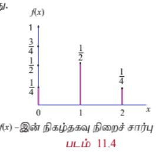
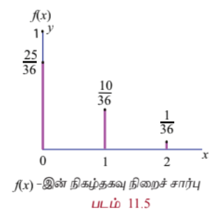
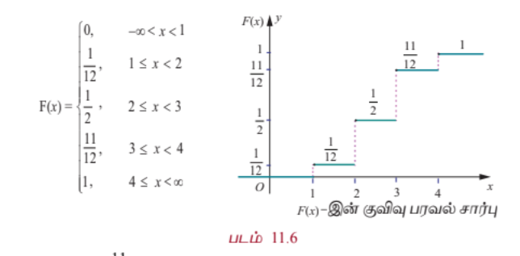
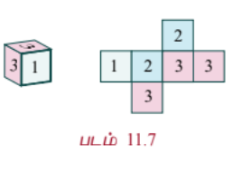
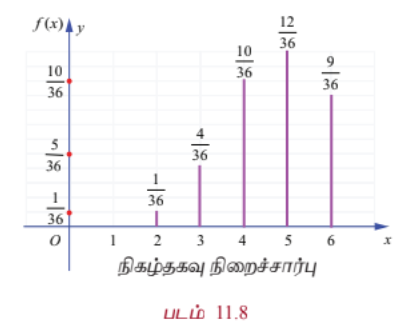
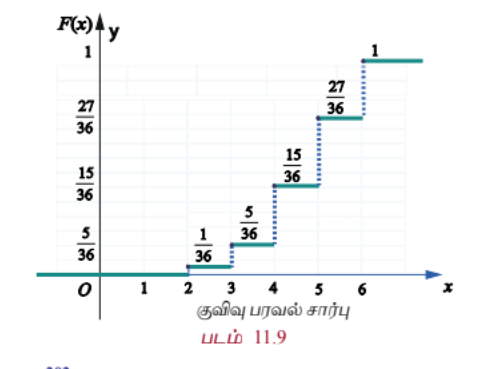
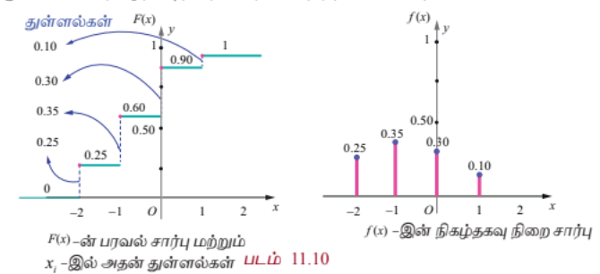

# 11.3 சமவாய்ப்பு மாறிகளின் வகைகள் (Types of Random Variable)

இந்த அத்தியாயத்தில் இரு வகை சமவாய்ப்பு மாறிகளைப் பற்றி மட்டும் பார்ப்போம். அவற்றில் ஒன்று எண்ணிடதக்க மதிப்புகளைக் கொண்டிருக்கும் ஒரு சமவாய்ப்பு மாறி மற்றும் மற்றொன்று தொடர்ச்சியான மதிப்புகளைக் கொண்டிருக்கும் சமவாய்ப்பு மாறியாகும். அதாவது,

(i) தனிநிலை சமவாய்ப்பு மாறி (எண்ணத்தக்க அளவை)

(ii) தொடர்ச்சியான சமவாய்ப்பு மாறி (அளவிடத்தக்க அளவை)

---

## 11.3.1 தனிநிலை சமவாய்ப்பு மாறிகள் (Discrete random variables)

இப்பாடப்பகுதியில் நாம் பின்வருவனவற்றைப் பற்றி விவாதிக்கலாம்.

(i) தனிநிலை சமவாய்ப்பு மாறி

(ii) நிகழ்தகவு நிறைச் சார்பு

(iii) குவிவு பரவல் சார்பு

(iv) நிகழ்தகவு நிறைச்சார்பிலிருந்து குவிவு பரவல் சார்புபெறுதல்

(v) குவிவு பரவல் சார்பிலிருந்து நிகழ்தகவு நிறைச் சார்பு பெறுதல்

சமவாய்ப்பு மாறியின் வீச்சு கணமானது எண்களின் தனிநிலை கணம் எனில் சமவாய்ப்பு மாறியின் நேர்மாறு பிம்பம் முடிவுறு அல்லது எண்ணிடத்தக்க முடிவுறு கணமாக அமையும். அத்தகைய சமவாய்ப்பு மாறிகள் தனிநிலை சமவாய்ப்பு மாறிகள் என அழைக்கப்படுகின்றன. தனிநிலை கூறுவெளியில் வரையறுக்கப்படும் ஒரு சமவாய்ப்பு மாறி தனிநிலையாக இருக்கும்.

### வரையறை 11.2 (தனிநிலை சமவாய்ப்பு மாறி)

கூறுவெளி $S$–லிருந்து மெய்யெண்கள் $\mathbb{R}$–க்கு வரையறுக்கப்படும் $X$ எனும் ஒரு சமவாய்ப்பு மாறி, $X$–இன் வீச்சு எண்ணிடதக்கதாக இருந்தால் தனிநிலை சமவாய்ப்பு மாறியாகும். அதாவது, முடிவுறு அல்லது எண்ணிடதக்க முடிவுறா எண் மதிப்புகளை மட்டுமே கொண்டிருக்கும். இங்கு $S$ கணத்தில் உள்ள ஒவ்வொரு மதிப்பின் நிகழ்தகவும் மிகையெண் நிகழ்தகவுக் கொண்டதாகவும், நிகழ்தகவுகளின் மொத்த கூடுதல் ஒன்றாகவும் இருக்கும்.

### குறிப்புரை

தொடர் கூறுவெளியில் கூட தனிநிலை சமவாய்ப்பு மாறியை வரையறுக்க இயலும். சான்றாக,

(i) தொடர் கூறுவெளி $S = [0,1]$–இல், அனைத்து $\omega \in S$ -க்கு,

$$
X(\omega)=10
$$

என வரையறுக்கப்படும் சமவாய்ப்பு மாறி என்பது ஒரு தனிநிலை சமவாய்ப்பு மாறியாகும்.

(ii) தொடர் கூறுவெளி $S=[0,20]$–க்கு, வரையறுக்கப்படும் சமவாய்ப்பு மாறி

$$
X(\omega)=
\begin{array}{ll}
10, & \omega \in [0,10) \\
20, & \omega \in [10,20]
\end{array}
$$

என்பது ஒரு தனிநிலை சமவாய்ப்பு மாறியாகும்.

---

## 11.3.2 நிகழ்தகவு நிறைச் சார்பு (Probability Mass Function)

ஒரு தனிநிலை சமவாய்ப்பு மாறி குறிப்பிட்ட $x$ மதிப்பைப் பெறும்போது, அதாவது

$$
P(X=x)
$$

என்பது $f(x)$ அல்லது $p(x)$ எனக் குறிப்பிடப்படும். $f(x)$ எனும் சார்பு நிகழ்தகவு நிறைச் சார்பு என அழைக்கப்படுகிறது. இருப்பினும் சில நூலாசிரியர்கள் இதனை நிகழ்தகவு சார்பு எனவும் நிகழ்வெண் சார்பு எனவும் குறிப்பிடுகின்றனர். இப்பாடப்பகுதியில், சமவாய்ப்பு மாறி தனிநிலையாக இருக்கும்போது, வழக்கமான துறைச் சொல்லான நிகழ்தகவு நிறைச் சார்பு என்பது பயன்படுத்தப்படுகிறது மற்றும் அதன் வழக்கமான சுருக்கம் pmf ஆகும்.

### வரையறை 11.3 (நிகழ்தகவு நிறைச் சார்பு)

$x_1, x_2, x_3, \ldots, x_n, \ldots$ என்ற தனி மதிப்புகளைக் கொண்ட $X$ என்பது ஒரு தனிநிலை சமவாய்ப்பு மாறியெனில், சார்பு $f(.)$ அல்லது $p(.)$ எனக் குறிப்பிடப்படுகிறது. மேலும்

$$
f(x_k)=P(X=x_k), \quad k=1,2,3,\ldots
$$

என்பது நிகழ்தகவு நிறைச் சார்பாக வரையறுக்கப்படுகிறது.

### தேற்றம் 11.1 (நிரூபணமின்றி)

$f(x)$ எனும் சார்பு $x_1, x_2, x_3, \ldots, x_n, \ldots$ என்ற மெய்யெண் மதிப்புகளுக்கு நிகழ்தகவுச் சார்பாக தேவையானதும் மற்றும் போதுமானதுமான நிபந்தனைகளாகக் கீழ்க்காணும் பண்புகளைக் கொண்டிருக்க வேண்டும்.

(i)

$$
f(x_k)\ge 0,\quad k=1,2,3,\ldots
$$

(ii)

$$
\sum_{k} f(x_k)=1
$$

### குறிப்பு

(i)

$$
f(x_k)=P(X=x_k), \quad k=1,2,3,\ldots
$$

என்ற நிகழ்தகவுகளின் கணம், தனிநிலை சமவாய்ப்பு மாறியின் நிகழ்தகவுப் பரவல் என்றும் அழைக்கப்படுகின்றது.

(ii) சமவாய்ப்பு மாறி ஒரு சார்பு என்பதால் அதனை

(a) பட்டியல் முறை

(b) வரைபடம் முறை

(c) கோவை முறை

ஆகிய முறைகளில் குறிப்பிடலாம்.

---

### எடுத்துக்காட்டு 11.5

இரு சீரான நாணயங்கள் ஒரே சமயத்தில் சுண்டி விடப்படுகின்றன. (ஒரு சீரான நாணயம் இரு முறை சுண்டி விடப்படுவதற்கு சமானமானது). கிடைத்த தலைகளின் எண்ணிக்கைக்கு நிகழ்தகவு நிறைச் சார்பு காண்க.

### தீர்வு

கூறுவெளி

$$
S=\{TT,TH,HT,HH\}
$$

தலைகளின் எண்ணிக்கையைக் குறிக்கும் சமவாய்ப்பு மாறி $X$ என்க.

எனவே,

$$
X(TT)=0,
$$

$$
X(TH)=1,
$$

$$
X(HT)=1,
$$

மற்றும்

$$
X(HH)=2.
$$

எனவே சமவாய்ப்பு மாறி $X$–ஆனது $0,1,2$ ஆகிய மதிப்புகளைக் கொண்டிருக்கும்.

| சமவாய்ப்பு மாறியின் மதிப்பு | 0 | 1 | 2 | மொத்தம் |
|---|---|---|---|---|
| நேர்மாறு பிம்பங்களில் உறுப்புகளின் எண்ணிக்கை | 1 | 2 | 1 | 4 |

நிகழ்தகவு நிறைச் சார்பு கீழ்க்காணுமாறு கொடுக்கப்பட்டுள்ளது.

$$
f(0)=P(X=0)=\frac{1}{4}
$$

$$
f(1)=P(X=1)=\frac{1}{2}
$$

மற்றும்

$$
f(2)=P(X=2)=\frac{1}{4}
$$

சார்பு $f(x)$ கீழ்க்காணும் நிபந்தனைகளைப் பூர்த்தி செய்கிறது.

(i)

$
f(x)\ge 0,\quad x=0,1,2
$

(ii) $$ \sum_x f(x) = \sum_{x=0}^{x=2} f(x) = f(0) + f(1) + f(2) $$

$$= \frac{1}{4} + \frac{1}{2} + \frac{1}{4} = 1$$

எனவே $f(x)$ என்பது ஒரு நிகழ்தகவு நிறைச் சார்பு ஆகும்.

நிகழ்தகவு நிறைச் சார்பு கீழ்க்காணுமாறு கொடுக்கப்பட்டுள்ளது.

| $x$ | 0 | 1 | 2 |
|-----|-----|-----|-----|
| $f(x)$ | $\frac{1}{4}$ | $\frac{1}{2}$ | $\frac{1}{4}$ |

(அல்லது)

$$
f(x)=
\begin{array}{ll}
\frac{1}{4}, & x=0 \\
\\
\frac{1}{2}, & x=1 \\
\\
\frac{1}{4}, & x=2
\end{array}
$$

### எடுத்துக்காட்டு 11.6

இரு சீரான பகடைகள் ஒரு முறை உருட்டப்படுகின்றன. கிடைத்த நான்குகளின் எண்ணிக்கைக்கான நிகழ்தகவு நிறைச் சார்பு காண்க.

$$S = \begin{Bmatrix}
(1,1), (1,2), (1,3), (1,4), (1,5), (1,6) \\
(2,1), (2,2), (2,3), (2,4), (2,5), (2,6) \\
(3,1), (3,2), (3,3), (3,4), (3,5), (3,6) \\
(4,1), (4,2), (4,3), (4,4), (4,5), (4,6) \\
(5,1), (5,2), (5,3), (5,4), (5,5), (5,6) \\
(6,1), (6,2), (6,3), (6,4), (6,5), (6,6)
\end{Bmatrix}$$

#### தீர்வு

நான்குகளின் எண்ணிக்கையை $x$ -இன் மதிப்புகளாகக் கொண்ட சமவாய்ப்பு மாறி $X$ என்க.

கூறுவெளி $S$ அட்டவணையாகத் தரப்பட்டுள்ளது. இதனை $S = \{(i, j)\}$ எனவும் எழுதலாம், இங்கு $i = 1, 2, 3, \ldots, 6$, மற்றும் $j = 1, 2, 3, \ldots, 6$ ஆகும்.

எனவே $X$ –ஆனது 0, 1, மற்றும் 2 ஆகிய மதிப்புகளைக் கொண்டிருக்கும்.

(i) $X = 0$, $\forall (i, j)$, $i \neq 4$ மற்றும் $j \neq 4$ எனில்

(ii) $X = 1$, $(1,4), (2,4), (3,4), (5,4), (6,4), (4,1), (4,2), (4,3), (4,5), (4,6)$ என்பவற்றில்

(iii) $X = 2$, $(4,4)$ -இல்

எனவே,

| சமவாய்ப்பு மாறி $X$-இன் மதிப்பு | 0 | 1 | 2 | மொத்தம் |
|---|---|---|---|---|
| நேர்மாறு பிம்பங்களில் உறுப்புகளின் எண்ணிக்கை | 25 | 10 | 1 | 36 |

நிகழ்தகவுகள்

$$f(0) = P(X = 0) = \frac{25}{36},$$

$$f(1) = P(X = 1) = \frac{10}{36}$$

மற்றும்

$$f(2) = P(X = 2) = \frac{1}{36}$$

ஆகும்.

இங்கு சார்பு $f(x)$ கீழ்க்காணும் நிபந்தனைகளைப் பூர்த்தி செய்கின்றது.

(i) $f(x) \ge 0$, $x = 0, 1, 2$ மற்றும்

(ii) $\sum_{x} f(x) = f(0) + f(1) + f(2) = \frac{25}{36} + \frac{10}{36} + \frac{1}{36} = 1$

நிகழ்தகவு நிறைச் சார்பு கீழ்க்காணுமாறு வழங்கப்படுகிறது.

| $x$ | 0 | 1 | 2 |
|---|---|---|---|
| $f(x)$ | $\frac{25}{36}$ | $\frac{10}{36}$ | $\frac{1}{36}$ |

(அல்லது)

$$f(x) = \begin{cases}
\frac{25}{36}, & x = 0 \\
\frac{10}{36}, & x = 1 \\
\frac{1}{36}, & x = 2
\end{cases}$$

## 11.3.3 குவிவுப் பரவல் சார்பு அல்லது பரவல் சார்பு
### (Cumulative Distribution Function or Distribution Function)

பல தருணங்களில் நிகழ்தகவைக் கண்டறியும்பொழுது, சமவாய்ப்பு மாறி $X$, ஏற்கும் மதிப்புகளானது ஏதேனும் ஒரு மெய்யெண் $x$-க்கு குறைவாகவோ அல்லது சமமாகவோ இருப்பதைக் காணலாம். ஒவ்வொரு மெய்யெண் $x$ –க்கும் $F(x) = P(X \le x)$ என்றிருந்ததால், $F(x)$ -ஐ சமவாய்ப்பு மாறி $X$ -இன் குவிவு பரவல் சார்பு அல்லது பரவல் சார்பு என்று கூறலாம். பொதுவான சுருக்கம் cdf ஆகும்.

#### வரையறை 11.4 (குவிவு பரவல் சார்பு)

$x_1 < x_2 < x_3 < \cdots$ எனும்படி $x_1, x_2, x_3, \ldots$ மதிப்புகளுக்கு $f(x_i)$ –ஐ நிகழ்தகவு நிறைச் சார்பாகக் கொண்டிருக்கும் தனிநிலை சமவாய்ப்பு மாறி $X$ –இன் குவிவு பரவல் சார்பு ஆனது

$$F(x) = P(X \le x) = \sum_{x_i \le x} f(x_i), \quad x \in \mathbb{R}$$

ஆகும்.

தனிநிலை சமவாய்ப்பு மாறியின் பரவல் சார்பு தனிநிலை பரவல் சார்பு எனப்படுகிறது. எனினும், நிகழ்தகவு நிறைச் சார்பு $f(x)$ என்பது $x_1, x_2, x_3, \ldots$ எனும் தனிநிலை மதிப்புகள் கணத்திற்குத்தான் வரையறுக்கப்பட்டது. குவிவு பரவல் சார்பு $F(x)$ என்பது அனைத்து மெய் மதிப்புகளான $x \in \mathbb{R}$ –க்கு வரையறுக்கப்படுகிறது.

நிகழ்தகவு நிறை சார்பினைப் பயன்படுத்தி குவிவு பரவல் சார்பினைக் கணிக்கலாம்.

$$F(x) = P(X \le x) = \sum_{x_i \le x} P(X = x_i)$$

$X$ எனும் சமவாய்ப்பு மாறி, $x_1, x_2, x_3, \ldots, x_n$, ($x_1 < x_2 < x_3 < \cdots < x_n$) என்ற முடிவுறு எண்ணிக்கையிலான மதிப்புகளை மட்டும் கொண்டிருந்தால், அதன் குவிவு பரவல் சார்பினை கீழ்க்காணுமாறு வரையறுக்கலாம்.

$$F(x) = \begin{cases}
0, & x < x_1 \\
f(x_1), & x_1 \le x < x_2 \\
f(x_1) + f(x_2), & x_2 \le x < x_3 \\
f(x_1) + f(x_2) + f(x_3), & x_3 \le x < x_4 \\
\vdots \\
f(x_1) + f(x_2) + \cdots + f(x_n), & x \ge x_n
\end{cases}$$

தனிநிலை சமவாய்ப்பு மாறி $X$–க்கு, குவிவு பரவல் சார்பு கீழ்க்காணும் பண்புகளைப் பூர்த்தி செய்கிறது.

(i) அனைத்து $x \in \mathbb{R}$ -க்கு $0 \le F(x) \le 1$,

(ii) $F(x)$, ஒரு மெய் மதிப்புடையக் குறைவுறாச் சார்பு ஆகும். $x \le y$ எனில், $F(x) \le F(y)$.

(iii) $F(x)$ ஒரு வலப்பக்கத் தொடர் சார்பு ஆகும். $\lim_{x \to a^+} F(x) = F(a)$.

(iv) $\lim_{x \to -\infty} F(x) = F(-\infty) = 0$.

(v) $\lim_{x \to \infty} F(x) = F(\infty) = 1$.

(vi) $P(x_1 < X \le x_2) = F(x_2) - F(x_1)$.

(vii) $P(X \ge x) = 1 - P(X < x) = 1 - F(x)$.

(viii) $P(X = x_k) = F(x_k) - F(x_k^-)$.

### குறிப்பு

சில நூலாசிரியர்கள் குவிவு பரவல் சார்பு $F(x)$-இன் வரையறைக்கு வலப்பக்கத் தொடர்ச்சிக்கு பதிலாக இடப்பக்க தொடர்ச்சியைப் பயன்படுத்துகிறார்கள்.

### 11.3.4 நிகழ்தகவு நிறை சார்பிலிருந்து குவிவு பரவல் சார்பு
#### (Cumulative Distribution Function from Probability Mass function)

ஒரு தனிநிலை சமவாய்ப்பு மாறி $X$ –இன் நிகழ்தகவு நிறை சார்பு மற்றும் குவிவு பரவல் சார்பு ஆகிய இரண்டும் $X$ –இன் அனைத்து நிகழ்தகவு தகவல்களையும் கொண்டிருக்கும். $X$ –ன் நிகழ்தகவு பரவலை இந்த இரண்டிலொன்று தீர்மானிக்க இயலும். உண்மையில், தனிநிலை சமவாய்ப்பு மாறி $X$ –இன் பரவல் சார்பு $F$-இனை $X$-இன் நிகழ்தகவு நிறைச்சார்பு $f(x)$ மூலமாக விளக்கலாம். அதற்கு நேர்மாறாகவும் விளக்கலாம்.

### எடுத்துக்காட்டு 11.7

சமவாய்ப்பு மாறி $X$ –இன் நிகழ்தகவு நிறை சார்பு $f(x)$ என்பது

| $x$ | 1 | 2 | 3 | 4 |
|---|---|---|---|---|
| $f(x)$ | $\frac{1}{12}$ | $\frac{5}{12}$ | $\frac{5}{12}$ | $\frac{1}{12}$ |

எனில், (i) அதன் குவிவு பரவல் சார்பு காண்க. அதன் மூலமாக (ii) $P(X \le 3)$ மற்றும், (iii) $P(X \ge 2)$ ஆகியவற்றைக் காண்க

#### தீர்வு

(i) வரையறைப்படி தனிநிலை சமவாய்ப்பு மாறிக்கான குவிவு பரவல் சார்பு

$$F(x) = P(X \le x) = \sum_{x_i \le x} P(X = x_i)$$

$P(X < 1) = 0$, $-\infty < x < 1$.

$$F(1) = P(X \le 1) = \sum_{x_i \le 1} P(X = x_i) = P(X = 1) = \frac{1}{12}$$

$$F(2) = P(X \le 2) = \sum_{x_i \le 2} P(X = x_i) = P(X = 1) + P(X = 2)$$

$$= 0 + \frac{1}{12} + \frac{5}{12} = \frac{1}{2}$$

$$F(3) = P(X \le 3) = \sum_{x_i \le 3} P(X = x_i) = P(X = 1) + P(X = 2) + P(X = 3)$$

$$= 0 + \frac{1}{12} + \frac{5}{12} + \frac{5}{12} = \frac{11}{12}$$

$$F(4) = P(X \le 4) = \sum_{x_i \le 4} P(X = x_i) = P(X = 1) + P(X = 2) + P(X = 3) + P(X = 4)$$

$$= 0 + \frac{1}{12} + \frac{5}{12} + \frac{5}{12} + \frac{1}{12} = 1$$
எனவே குவிவு பரவல் சார்பானது

$$F(x) = \begin{cases}
0, & -\infty < x < 1 \\
\frac{1}{12}, & 1 \le x < 2 \\
\frac{1}{2}, & 2 \le x < 3 \\
\frac{11}{12}, & 3 \le x < 4 \\
1, & x \ge 4
\end{cases}$$

(ii) $P(X \le 3) = F(3) = \frac{11}{12}$.

(iii) $P(X \ge 2) = 1 - P(X < 2) = 1 - P(X \le 1) = 1 - F(1) = 1 - \frac{1}{12} = \frac{11}{12}$.

### எடுத்துக்காட்டு 11.8

ஓர் ஆறு பக்க பகடையின் ஒரு பக்கத்தில் '1' என குறிக்கப்படுகிறது. அதன் இரு பக்கங்களில் '2' எனவும் மீதமுள்ள மூன்று பக்கங்களில் '3' எனவும் குறிக்கப்படுகிறது. இரு முறை பகடை உருட்டப்படுகிறது. இருமுறை எறிதலின் மொத்தத் தொகையை $X$ குறிக்கிறது எனில்

(i) நிகழ்தகவு நிறை சார்பு காண்க.

(ii) குவிவு பரவல் சார்பு காண்க.

(iii) $P(X < 6)$ காண்க

(iv) $P(X \ge 4)$ காண்க.

#### தீர்வு

இருமுறை எறிதலின் மொத்தத் தொகை $X$ -ஐ குறிப்பதால், $X$ -ஆனது 2, 3, 4, 5, மற்றும் 6 ஆகிய மதிப்புகளைக் கொண்டிருக்கும்.

அருகிலுள்ள அட்டவணை $S$-லிருந்து,

| சமவாய்ப்பு மாறியின் மதிப்பு | 2 | 3 | 4 | 5 | 6 | மொத்தம் |
|---|---|---|---|---|---|---|
| நேர்மாறு பிம்பங்களில் உறுப்புகளின் எண்ணிக்கை | 1 | 4 | 10 | 12 | 9 | 36 |

$$P(X = 2) = \frac{1}{36}, \quad P(X = 3) = \frac{4}{36}$$

$$P(X = 4) = \frac{10}{36}, \quad P(X = 5) = \frac{12}{36}$$

மற்றும்

$$P(X = 6) = \frac{9}{36}$$

### கூறுவெளி $S$

| II I | 1 | 2 | 2 | 3 | 3 | 3 |
|---|---|---|---|---|---|---|
| 1 | 2 | 3 | 3 | 4 | 4 | 4 |
| 2 | 3 | 4 | 4 | 5 | 5 | 5 |
| 2 | 3 | 4 | 4 | 5 | 5 | 5 |
| 3 | 4 | 5 | 5 | 6 | 6 | 6 |
| 3 | 4 | 5 | 5 | 6 | 6 | 6 |
| 3 | 4 | 5 | 5 | 6 | 6 | 6 |

### படம் 11.6

### படம் 11.7

(i) நிகழ்தகவு நிறை சார்பானது

| $x$ | 2 | 3 | 4 | 5 | 6 |
|---|---|---|---|---|---|
| $f(x)$ | $\frac{1}{36}$ | $\frac{4}{36}$ | $\frac{10}{36}$ | $\frac{12}{36}$ | $\frac{9}{36}$ |

(ii) குவிவு பரவல் சார்பு

வரையறைப்படி தனிநிலை சமவாய்ப்பு மாறியின் குவிவு பரவல் சார்பானது,

$$F(x) = P(X \le x) = \sum_{x_i \le x} P(X = x_i)$$

$P(X < x) = 0$, $x < 2$.

$$F(2) = P(X \le 2) = \sum_{x_i \le 2} P(X = x_i) = P(X = 2) 

= 0 + \frac{1}{36} = \frac{1}{36}$$

$$F(3) = P(X \le 3) = \sum_{x_i \le 3} P(X = x_i) = P(X = 2) + P(X = 3) = 0 + \frac{1}{36} + \frac{4}{36} = \frac{5}{36}$$

$$F(4) = P(X \le 4) = \sum_{x_i \le 4} P(X = x_i) = P(X = 2) + P(X = 3) + P(X = 4) = 0 + \frac{1}{36} + \frac{4}{36} + \frac{10}{36} = \frac{15}{36}$$

$$F(5) = P(X \le 5) = \sum_{x_i \le 5} P(X = x_i) = P(X = 2) + P(X = 3) + P(X = 4) + P(X = 5) = 0 + \frac{1}{36} + \frac{4}{36} + \frac{10}{36} + \frac{12}{36} = \frac{27}{36}$$

$$F(6) = P(X \le 6) = \sum_{x_i \le 6} P(X = x_i) = P(X = 2) + P(X = 3) + P(X = 4) + P(X = 5) + P(X = 6) = 0 + \frac{1}{36} + \frac{4}{36} + \frac{10}{36} + \frac{12}{36} + \frac{9}{36} = 1$$

எனவே, குவிவு பரவல் சார்பானது,

$$F(x) = \begin{cases}
0, & x < 2 \\
\frac{1}{36}, & 2 \le x < 3 \\
\frac{5}{36}, & 3 \le x < 4 \\
\frac{15}{36}, & 4 \le x < 5 \\
\frac{27}{36}, & 5 \le x < 6 \\
1, & x \ge 6
\end{cases}$$

(iii) $P(X < 6) = \sum_{x_i < 6} P(X = x_i) = P(X = 3) + P(X = 4) + P(X = 5)$

$$= \frac{4}{36} + \frac{10}{36} + \frac{12}{36} = \frac{26}{36}$$

(iv) $P(X \ge 4) = \sum_{x_i \ge 4} P(X = x_i) = P(X = 4) + P(X = 5) + P(X = 6)$

$$= \frac{10}{36} + \frac{12}{36} + \frac{9}{36} = \frac{31}{36}$$

## 11.3.5 குவிவு பரவல் சார்பிலிருந்து நிகழ்தகவு நிறை சார்பு
### (Probability Mass Function from Cumulative Distribution Function)

ஒரு தனிநிலை சமவாய்ப்பு மாறி $X$-க்கு, குவிவு பரவல் சார்பு $F$ ஒவ்வொரு $x_i$ -யிலும் துள்ளல் இருக்கும். மேலும் அடுத்தடுத்த $x_i$ -களில் மாறாமலும் இருக்கும். $x_i$ -இல் இருக்கும் துள்ளலின் உயரம் $f(x_i)$; இதே முறையில் $F$ -லிருந்து $x_i$ -இன் நிகழ்தகவை மீட்டெடுக்கலாம்.

$x_1 < x_2 < x_3 < \cdots$ என்றவாறு இருக்கும் $x_1, x_2, x_3, \ldots$ மதிப்புகளைக் கொண்டிருக்கும் தனிநிலை சமவாய்ப்பு மாறி $X$ என்க. மற்றும் $F(x_i)$ என்பது பரவல் சார்பாகும். எனவே நிகழ்தகவு நிறை சார்பு $f(x_i)$ ஆனது,

$$f(x_i) = F(x_i) - F(x_{i-1}), \quad i = 1, 2, 3, \ldots$$

ஆகும்.

### குறிப்பு

$x = a$ -ல் $F(x)$ சார்பின் துள்ளல் $F(a) - F(a^-)$ ஆகும். $F$ குறைவுறாமலும் மற்றும் வலப்பக்கமாக தொடர்ச்சியாகவும் இருப்பதால், குவிவு பரவல் சார்பு $F$ -ன் துள்ளல் $P(X = x) = F(x) - F(x^-)$ ஆகும்.

இங்கு துள்ளல் (தொடர்ச்சியில் இல்லாமல் இருப்பதால்) நிகழ்தகவாக நிகழ்கிறது. அதாவது ஒரு குவிவு பரவல் சார்பின் தொடர்ச்சியற்றவைகளின் கணம் எண்ணத்தக்கது!

## எடுத்துக்காட்டு 11.9

கீழே கொடுக்கப்பட்டுள்ள குவிவு பரவல் சார்பு $F(x)$ -இன் தனிநிலை சமவாய்ப்பு மாறி $X$ -யின் நிகழ்தகவு நிறைசார்பினைக் காண்க.

$$F(x) = \begin{cases}
0, & x < -2 \\
0.25, & -2 \le x < -1 \\
0.60, & -1 \le x < 0 \\
0.90, & 0 \le x < 1 \\
1, & x \ge 1
\end{cases}$$

மேலும் (i) $P(X < 0)$ மற்றும் (ii) $P(X \ge 1)$ காண்க.

#### தீர்வு

$X$ என்பது ஒரு தனிநிலை சமவாய்ப்பு மாறி என்பதால், கொடுக்கப்பட்ட தகவல்களிலிருந்து, $X$ பின்வரும் மதிப்புகளான $-2, -1, 0$ மற்றும் $1$ ஆகியவற்றைப் பெறும்.

வரையறைப்படி தனிநிலை சமவாய்ப்பு மாறி $X$-க்கு, $f(x) = P(X = x)$

எனவே $F(x)$-இன் $x = -2$ -ல் இடப்பக்க எல்லை $F(-2^-)$ ஆகும்.

$$f(-2) = P(X = -2) = F(-2) - F(-2^-) = 0.25 - 0 = 0.25$$

இதே போன்று ஏனைய துள்ளல் புள்ளிகளுக்கும்,

$$f(-1) = P(X = -1) = F(-1) - F(-1^-) = 0.60 - 0.25 = 0.35$$

$$f(0) = P(X = 0) = F(0) - F(0^-) = 0.90 - 0.60 = 0.30$$

$$f(1) = P(X = 1) = F(1) - F(1^-) = 1 - 0.90 = 0.10$$

எனப் பெறப்படுகிறது.

எனவே நிகழ்தகவு நிறை சார்பானது

| $x$ | $-2$ | $-1$ | $0$ | $1$ |
|---|---|---|---|---|
| $f(x)$ | $0.25$ | $0.35$ | $0.30$ | $0.10$ |

ஆகும்.

$F(x)$ எனும் பரவல் சார்பிற்கு $x = -2, -1, 0$, மற்றும் $1$-ல் துள்ளல்கள் உள்ளன. அந்த துள்ளல்கள் முறையே, $0.25, 0.35, 0.30$ மற்றும் $0.10$ என கீழ்க்காணும் படத்தில் காண்பிக்கப்பட்டுள்ளது.

இந்த துள்ளல்களே நிகழ்தகவு நிறைச் சார்பினைத் தீர்மானிக்கின்றன.

### படம் 11.10

(i) $P(X < 0) = \sum_{x < 0} P(X = x) = P(X = -2) + P(X = -1) = 0.25 + 0.35 = 0.60$

(ii) $P(X \ge 1) = \sum_{x \ge 1} P(X = x) = P(X = 1) = 0.10$

## எடுத்துக்காட்டு 11.10

ஒரு தனிநிலை சார்பு $X$ -ன் நிகழ்தகவு நிறை சார்பானது

| $x$ | 1 | 2 | 3 | 4 | 5 | 6 |
|---|---|---|---|---|---|---|
| $f(x)$ | $k$ | $2k$ | $6k$ | $5k$ | $6k$ | $10k$ |

எனில், (i) $P(2 < X < 6)$ (ii) $P(2 \le X \le 5)$ (iii) $P(X \le 4)$ (iv) $P(X > 3)$ என்பவற்றைக் காண்க.

#### தீர்வு

கொடுக்கப்பட்ட சார்பு நிகழ்தகவு நிறை சார்பு என்பதால் மொத்த நிகழ்தகவு ஒன்றாகும். அதாவது $\sum_x f(x) = 1$ ஆகும்.

கொடுக்கப்பட்ட தகவல்களிலிருந்து $k + 2k + 6k + 5k + 6k + 10k = 1$

$30k = 1 \implies k = \frac{1}{30}$

எனவே நிகழ்தகவு நிறை சார்பானது,

| $x$ | 1 | 2 | 3 | 4 | 5 | 6 |
|---|---|---|---|---|---|---|
| $f(x)$ | $\frac{1}{30}$ | $\frac{2}{30}$ | $\frac{6}{30}$ | $\frac{5}{30}$ | $\frac{6}{30}$ | $\frac{10}{30}$ |

(i) $P(2 < X < 6) = f(3) + f(4) + f(5) = \frac{6}{30} + \frac{5}{30} + \frac{6}{30} = \frac{17}{30}$

(ii) $P(2 \le X \le 5) = f(2) + f(3) + f(4) + f(5) = \frac{2}{30} + \frac{6}{30} + \frac{5}{30} + \frac{6}{30} = \frac{19}{30}$

(iii) $P(X \le 4) = f(1) + f(2) + f(3) + f(4) = \frac{1}{30} + \frac{2}{30} + \frac{6}{30} + \frac{5}{30} = \frac{14}{30}$

(iv) $P(X > 3) = f(4) + f(5) + f(6) = \frac{5}{30} + \frac{6}{30} + \frac{10}{30} = \frac{21}{30}$

## பயிற்சி 11.2

1. மூன்று சீரான நாணயங்கள் ஒரே நேரத்தில் சுண்டப்படுகின்றன. கிடைக்கும் தலைகளின் எண்ணிக்கைக்கான நிகழ்தகவு நிறை சார்பினைக் காண்க.

2. ஓர் அறுபக்க பகடையின் ஒரு பக்கத்தில் '1' எனவும், இரு பக்கங்களில் '3' எனவும், மற்றும் ஏனைய மூன்று பக்கங்களில் '5' எனவும் குறிக்கப்பட்டுள்ளது. பகடை இருமுறை வீசப்படுகிறது. இருமுறை வீசப்பட்டதின் கூட்டுத்தொகையை $X$ குறிக்கிறது எனில்

(i) நிகழ்தகவு நிறை சார்பு

(ii) குவிவு பரவல் சார்பு

(iii) $P(4 \le X \le 10)$

(iv) $P(X \ge 6)$

ஆகியவற்றைக் காண்க

3. மகன் மற்றும் மகளுக்கு சமவாய்ப்பு நிகழ்தகவுகள் எனக் கருதி 4 குழந்தைகள் கொண்ட ஒரு குடும்பத்தில் உள்ள மகள்களின் எண்ணிக்கைக்கு நிகழ்தகவு நிறை சார்பினையும் குவிவு பரவல் சார்பினையும் காண்க.

4. ஒரு தனிநிலை சமவாய்ப்பு மாறி 0, 1, மற்றும் 2 மதிப்புகளை மட்டுமே கொள்ளும் என்க.

$$f(x) = \frac{x^2 + 1}{k}, \quad x = 0, 1, 2$$

என வரையறுக்கப்பட்ட நிகழ்தகவு நிறை சார்பிற்கு

(i) $k$-இன் மதிப்பு

(ii) குவிவு பரவல் சார்பு

(iii) $P(X \ge 1)$

ஆகியவற்றைக் காண்க.

5. $$F(x) = \begin{cases}
0, & x < -1 \\
0.15, & -1 \le x < 0 \\
0.35, & 0 \le x < 1 \\
0.60, & 1 \le x < 2 \\
0.85, & 2 \le x < 3 \\
1, & x \ge 3
\end{cases}$$

எனக் கொடுக்கப்பட்ட ஒரு தனிநிலை சமவாய்ப்பு மாறியின் குவிவு பரவல் சார்பிற்கு

(i) நிகழ்தகவு நிறை சார்பு

(ii) $P(X < 1)$

(iii) $P(X \ge 2)$

காண்க

6. ஒரு சமவாய்ப்பு மாறி $X$-க்கு நிகழ்தகவு நிறைசார்பானது

| $x$ | 1 | 2 | 3 | 4 | 5 |
|---|---|---|---|---|---|
| $f(x)$ | $k^2$ | $2k^2$ | $3k^2$ | $2k$ | $3k$ |

எனில்

(i) $k$ மதிப்பு

(ii) $P(2 \le X \le 5)$

(iii) $P(X > 3)$

ஆகியவற்றைக் காண்க.

7. $$F(x) = \begin{cases}
0, & x < 0 \\
\frac{1}{2}, & 0 \le x < 1 \\
\frac{3}{5}, & 1 \le x < 2 \\
\frac{4}{5}, & 2 \le x < 3 \\
\frac{9}{10}, & 3 \le x < 4 \\
1, & x \ge 4
\end{cases}$$

என்பது ஒரு தனிநிலை சமவாய்ப்பு மாறியின் குவிவு பரவல் சார்பு எனில்

(i) நிகழ்தகவு நிறை சார்பு

(ii) $P(X < 3)$

(iii) $P(X \ge 2)$

ஆகியவற்றைக் காண்க.