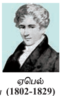
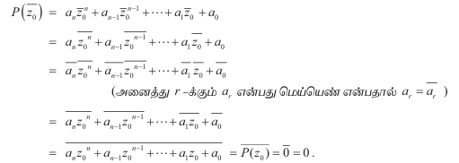

## 3.1 அறிமுகம் (Introduction)

இயற்கணித சமன்பாடுகளின் தீர்வைக் காண்பது கணிதத்தின் மிகப் பழமையான சவால்களில் ஒன்றாகும். அதிலும் குறிப்பாக பல்லுறுப்புக் கோவை சமன்பாடுகளின் மூலங்களைக் கண்டறிய முயல்வதுதான் எனலாம். ஏறத்தாழ கி.மு (பொ.ஆ.மு) 2000 ஆண்டு கால கட்டத்தைச் சார்ந்த சுமேரியர்கள் மற்றும் பாபிலோனியர்களில் ஆரம்பித்து, உலக நாடுகளின் பல்வேறு பகுதிகளான எகிப்து, கிரேக்கம், இந்தியா, சீன மற்றும் அரபு நாடுகளைச் சார்ந்த கணிதவியலாளர்கள் மற்றும் தத்துவ அறிஞர்கள் அனைவரும் பல்லுறுப்புக் கோவை சமன்பாடுகளுக்குத் தீர்வு காண விழைந்தனர்.

பண்டைய காலத்தில் கணிதவியலாளர்கள் கணக்குகளையும் அதன் தீர்வு முறைகளையும் முழுவதும் வார்த்தைகளால் வடித்தனர். பொது வழிமுறைகளைத் தவிர்த்து குறிப்பிட்ட தீர்வு அமையும் கணக்குகளில் ஆர்வம் செலுத்தினர். குறை எண்களைக் கொண்டுள்ள இருபடிச் சமன்பாடுகளுக்கான தீர்வினை பிரம்மகுப்தர்தான் முதல்முறையாகக் கண்டறிந்தார். பல்லுறுப்புக் கோவைகளை ஆராய்ந்த கணிதவியலாளர்களில் சிலர் யூக்லிட், டையோபான்டஸ், பிரம்மகுப்தர், உமர்கய்யாம், ஃபிபனோசி, டெஸ்கார்டே மற்றும் ரூபினி ஆகியோராவர்.

ஐந்தாம்படி சமன்பாடுகளின் தீர்வு காண இயற்கணித முறையில் சூத்திரமுறை ஏதுமில்லை என்பதை நிரூபிக்க புரிந்து கொள்ள சிரமப்படும் வகையில் மிக நீண்ட வாதங்களை முன்வைத்து நிரூபித்தார். இறுதியாக 1823 ஆண்டில் நார்வேஜியன் கணிதவியலாளரான ஏபெல் அதனை எளிய முறையில் நிரூபித்தார்.

ஒரு உற்பத்தி நிறுவனம் தன் தயாரிப்புகளை செவ்வக வடிவான பெட்டிகளில் அடைக்க விரும்புகின்றது. அந்த நிறுவனம் அகலத்தை விட ஆறு மடங்காக நீளம் அமையுமாறும், அடிமான நீளம் மற்றும் அகலத்தின் கூட்டுச் சராசரியாக உயரம் அமையுமாறும் பெட்டிகள் தயாரிக்கப்பட திட்டமிடுகின்றது. எனவே அந்த நிறுவனம் வரையறுக்கப்பட்ட கனஅளவு கொண்ட பெட்டியின் பல்வேறு பக்க அளவுகளின் சாத்தியக் கூறுகள் பற்றி அறிய விரும்புகின்றது.

அடிமானத்தின் அகலம் $$x$$ எனவும், நீளம் $$x+6$$ எனவும் மற்றும் உயரம் $$x+3$$ எனவும் கணக்கிடப்பட்டால் பெட்டியின் கன அளவு

$$
x(x+3)(x+6)
$$

என அமையும்.

கன அளவு 2618 ச.அடியாகக் கொண்டால்

$$
x(x+3)(x+6)=2618
$$

அதாவது,

$$
x^3+9x^2+18x=2618
$$

என அமையும்.

இச்சமன்பாட்டினைத் தீர்க்கும் வகையில் $x$-ன் மதிப்பு அமைந்தால் தேவையான அளவுகளுடன் பெட்டி அமையும்.

ஒரு வட்டமும் ஒரு நேர்க்கோடும் இரு புள்ளிகளுக்கு மேல் வெட்டிக் கொள்ளாது என நாம் அறிவோம். இதனை எங்ஙனம் நிரூபிப்பது? இத்தகைய கூற்றுகளை நிரூபிக்க கணிதச் சமன்பாடுகள் உதவுகின்றன.

$$x-y$$ தளத்தில் ஆதிபுள்ளியை மையமாகவும் $$r$$ ஐ ஆரமாகவும் உள்ள வட்டத்தின் சமன்பாடு

$$
x^2+y^2=r^2
$$

என அமையும்.

மேலும் இதே தளத்தில் அமைந்த ஒரு நேர்க்கோட்டின் சமன்பாடு

$$
ax+by+c=0
$$

என அறிவோம்.

இவ்வட்டமும் நேர்க்கோடும் வெட்டிக் கொள்ளும் புள்ளிகள் இரு சமன்பாடுகளையும் நிறைவு செய்யும். வேறு வகையில் சொல்வதென்றால்,

$$
x^2+y^2=r^2
$$

மற்றும்

$$
ax+by+c=0
$$

ஆகிய உடன்நிகழ் சமன்பாடுகளின் தீர்வுகளே வெட்டிக் கொள்ளும் புள்ளிகளைத் தரும்.

மேற்கண்ட சமன்பாடுகளின் தீர்விலிருந்துதான் அவை ஒன்றையொன்று தொடுகிறதா, இரு புள்ளிகளில் மட்டும் வெட்டுகின்றதா அல்லது வெட்டிக் கொள்வதே இல்லையா என நாம் தீர்மானிக்க இயலும்.

பண்டைய காலத்தில் குறிப்பிடப்பட்ட சில வடிவ உருவமைப்பு கணக்குகளில் கவராயமும், வரைகோலும் (அலகுகள் குறிப்பிடாத நேர் முனை) மட்டுமே பயன்படுத்தி வடிவத்தை உருவமைக்கும் கணக்குகள் உண்டு. சான்றாக, ஒரு சீரான அறுகோணம் மற்றும் 17 பக்கம் கொண்ட பலகோணமும் இத்தகைய முறையில் உருவமைக்கலாம். ஆனால் ஒரு எழுகோணத்தையோ அல்லது 18 பக்கம் கொண்ட பலகோணத்தையோ இவ்வாறு உருவாக்க இயலாது.

குறிப்பாக கீழ்க்காணும் மூன்று பிரபலமான கணக்குகளில் கவராயம் மற்றும் வரைகோல் ஆகிய இரண்டை மட்டும் பயன்படுத்தி உருவாக்க இயலாது.

- ஒரு கோணத்தை முக்கூறாக்குதல் (கொடுக்கப்பட்ட கோணத்தை மூன்று சமகோணங்களாகப் பிரித்தல்)

- வட்டத்தை சதுரமாக்கல் (கொடுக்கப்பட்ட வட்டத்தின் பரப்பளவுக்குச் சம பரப்பளவுள்ள ஒரு சதுரத்தினை உருவாக்குதல்)

- கன சதுரத்தை இரட்டிப்பாக்கல் (கொடுக்கப்பட்ட கனசதுரத்தின் கனஅளவுக்கு இரு மடங்கு இணையான ஒரு கனசதுரத்தினை உருவாக்குதல்)

இத்தகைய பண்டைய கணக்குகளுக்கான தீர்வுகள் இவற்றை பல்லுறுப்புக் கோவைக் கணக்குகளாக மாற்றிய பிறகே கண்டறிய இயன்றது; உண்மையில் இத்தகைய வடிவமைப்புகளை உருவாக்க இயலாது. ஒரு செயலைச் செய்ய இயலுமா அல்லது இயலாதா என நிரூபிக்க கணிதம் துணை புரிகின்றது.

நடைமுறை வாழ்வியல் பிரச்சினைகளுக்குத் தீர்வு காண வேண்டும் எனில், அவற்றினை கணிதவியலாளர்கள் கணக்காக மாற்றி, அறிந்த கணித முறைகளைப் பயன்படுத்தி கணிதத் தீர்வு எட்டியவுடன் மீண்டும் நடைமுறை வாழ்க்கைக்கு ஏற்ற வகையில் தீர்வினைத் தருவர். இத்தகைய மாற்றங்களுக்கு உட்படும் பல்வேறு வாழ்வியல் பிரச்சினைகள் கணிதத்தில் சமன்பாடுகளாகின்றன.

ஒரு பெட்டியின் அளவுகளைப் பற்றித் தீர்மானிக்கும்போதும், குறிப்பிட்ட வடிவியல் முடிவுகளை நிரூபிக்கும்போதும், சில வடிவமைப்புகளை உருவாக்க இயலாது என நிரூபிக்கும்போதும் அவை கணித சமன்பாடுகளாகின்றன.

இந்த அத்தியாயத்தில் சமன்பாடுகளின் சில கோட்பாடுகளைப் பற்றியும் குறிப்பாக பல்லுறுப்புக் கோவைச் சமன்பாடுகளைப் பற்றியும் அவற்றின் தீர்வுகளைப் பற்றியும் கற்போம்.

மேலும் பல்லுறுப்புக் கோவைகளின் சில பண்புகளைப் பற்றியும், கொடுக்கப்பட்டுள்ள மூலங்களிலிருந்து பல்லுறுப்புக் கோவைச் சமன்பாடுகளாக உருவாக்குதல், அடிப்படை இயற்கணித தேற்றம் அறிதல், பல்லுறுப்புக் கோவைகளின் மூலங்களில் மிகை மற்றும் குறை மூலங்களின் எண்ணிக்கை காணல் முதலியன கற்போம்.

இவற்றின் வாயிலாக குறிப்பிட்ட சில வகை பல்லுறுப்புச் சமன்பாடுகளின் தீர்வுத் தன்மையைக் காண்பது நமது இலக்காகும். சில பல்லுறுப்புக் கோவைகளாக மாற்ற இயலாத சமன்பாடுகளுக்கான தீர்வினை பல்லுறுப்பு சமன்பாடுகளின் வாயிலாக கண்டறிய உதவும் சில வழிமுறைகளைப் பற்றியும் கற்போம்.

## 3.2 பல்லுறுப்புக் கோவைச் சமன்பாடுகளின் அடிப்படைக் கூறுகள்

(Basics of Polynomial Equations)

### 3.2.1 பல்லுறுப்புக் கோவைச் சமன்பாடுகளின் வகைகள் (Different types of Polynomial Equations)

எந்தவொரு குறையற்ற முழு எண் $$n$$ -க்கு, $$x$$ எனும் ஒற்றை மாறியில் $$n$$ படியுள்ள ஒரு பல்லுறுப்புக் கோவையானது,

$$
P \equiv P(x) = a_n x^n + a_{n-1} x^{n-1} + \cdots + a_1 x + a_0 \quad \text{ஆகும்.} \qquad \dots (1)
$$

இங்கு $$a_r \in \mathbb{C}$$ ஆகியவை மாறிலிகளாகவும், $$r = 0,1,2,\ldots,n$$ எனவும், இங்கு $$a_n \neq 0$$ ஆகும். $$x$$ எனும் மாறி மெய்யெண் அல்லது கலப்பெண்ணாக இருக்கலாம்.

$$P$$ எனும் பல்லுறுப்புக் கோவையின் அனைத்து கெழுக்களும் மெய்யெண்கள் எனில், இதனை "$$\mathbb{R}$$ -ன் மீதான பல்லுறுப்புக்கோவை $$P$$" என்போம். இதே போன்று, "$$\mathbb{C}$$ -ன் மீதான பல்லுறுப்புக்கோவை $$P$$" எனவும், "$$\mathbb{Q}$$ -ன் மீதான பல்லுறுப்புக்கோவை $$P$$" எனவும், "$$\mathbb{Z}$$ -ன் மீதான பல்லுறுப்புக்கோவை $$P$$" எனவும் கலைச்சொற்களைப் பயன்படுத்துகிறோம்.

$$P$$ எனும் சார்பு, $$P(x) = a_n x^n + a_{n-1} x^{n-1} + \cdots + a_1 x + a_0$$ என வரையறுக்கப்பட்டு பல்லுறுப்புக் கோவைச் சார்பு என வழங்கப்படுகிறது.

$$
a_n x^n + a_{n-1} x^{n-1} + \cdots + a_1 x + a_0 = 0 \qquad \dots (2)
$$

என்பது பல்லுறுப்புக் கோவைச் சமன்பாடு என அழைக்கப்படுகின்றது.

ஏதேனும் சில $$c \in \mathbb{C}$$ -க்கு $$a_n c^n + a_{n-1} c^{n-1} + \cdots + a_1 c + a_0 = 0$$ எனில், $$c$$ என்பது பல்லுறுப்புக் கோவை (1)-ன் ஒரு பூச்சியமாக்கி எனவும், பல்லுறுப்புக் கோவைச் சமன்பாடு (2)-ன் ஒரு மூலம் அல்லது தீர்வு எனவும் அழைக்கப்படுகின்றது.

$$c$$ என்பது $$x$$ எனும் ஒரு மாறி உள்ள சமன்பாட்டின் மூலம் எனில், "$$x = c$$ ஒரு மூலம்" என எழுதுவதுண்டு. $$a_r$$ எனும் மாறிலிகள் கெழுக்கள் எனப்படுகின்றன. $$a_n$$ எனும் கெழு தலைமைக் கெழு எனவும், $$a_n x^n$$ என்பது தலைமை உறுப்பு அல்லது முதன்மை உறுப்பு எனவும் அழைக்கப்படுகிறது. கெழுக்கள் மெய்யெண்களாகவே அல்லது கலப்பெண்களாகவே இருக்கலாம். இதில் விதிக்கப்படும் ஒரு நிபந்தனை என்பது தலைமைக் கெழு பூச்சியமற்ற எண்ணாக இருக்க வேண்டும். தலைமைக் கெழு 1 என இருக்கும் பல்லுறுப்புக் கோவை தலை ஒற்றை பல்லுறுப்புக் கோவை எனப்படும்.

**குறிப்புரை:**

> $$x$$ -ன் அனைத்து மதிப்புகளுக்கும் பல்லுறுப்புக் கோவைச் சார்புகள் வரையறுக்கப்படுகின்றன.
>
> ஒவ்வொரு பூச்சியமற்ற மாறிலியும் பூச்சியத்தைப் படியாகக் கொண்ட பல்லுறுப்புக் கோவையாகும்.
>
> $$0$$ எனும் மாறிலியும் ஒரு பல்லுறுப்புக் கோவையாகும். இது பூச்சிய பல்லுறுப்புக் கோவை எனப்படும். இதன் படி வரையறுக்கப்படவில்லை.
>
> பல்லுறுப்புக் கோவையின் படி ஒரு குறையற்ற முழு எண்ணாக இருக்கும்.
>
> தலைமைக் கெழு பூச்சியம் கொண்ட ஒரு பல்லுறுப்புக் கோவை பூச்சிய பல்லுறுப்புக் கோவை மட்டுமே ஆகும்.
>
> படி இரண்டு உடைய பல்லுறுப்புக் கோவை இருபடி பல்லுறுப்புக் கோவை எனப்படும்.
>
> படி மூன்று உடைய பல்லுறுப்புக் கோவை முப்படி பல்லுறுப்புக் கோவை எனப்படும்.
>
> படி நான்கு உடைய பல்லுறுப்புக் கோவை நாற்படி பல்லுறுப்புக் கோவை எனப்படும்.

ஒரு மாறி $$x$$-ல் அமைந்த ஒரு பல்லுறுப்புக்கோவையை, $$x$$-ன் படி இறங்குவரிசையில் அமையுமாறு எழுதுவது வழக்கம். அதாவது மிக உயர்ந்த படி கொண்ட உறுப்பில் தொடங்கி மாறிலி உறுப்பு கடைசி உறுப்பாக இருக்குமாறு எழுதுவது வழக்கம்.

சான்றாக, $$2x + 3y + 4z = 5$$ மற்றும் $$6x^2 + 7x^3 + 8z = 9$$ ஆகியவை $$x, y, z$$ என்ற மூன்று மாறிகள் கொண்ட சமன்பாடுகள் ஆகும்; $$x^2 - 4x + 5 = 0$$ என்பது $$x$$ எனும் ஒரு மாறி கொண்ட சமன்பாடு ஆகும். முந்தைய வகுப்புகளில் முக்கோணவியல் சமன்பாடுகள், நேரிய சமன்பாடுகளின் தொகுப்புகள், மற்றும் சில பல்லுறுப்புக் கோவை சமன்பாடுகள் ஆகியவற்றிற்கு தீர்வு கண்டறிந்தோம்.

$$x^2 - 5x + 6$$ எனும் பல்லுறுப்புக்கோவையின் பூச்சியமாக்கி $$3$$ எனவும் மற்றும் $$x^2 - 5x + 6 = 0$$ எனும் சமன்பாட்டின் மூலம் அல்லது தீர்வு $$3$$ எனவும் அறிகிறோம். மேலும் $$\cos(x) = \sin(x)$$ மற்றும் $$\cos(x) + \sin(x) = 1$$ ஆகியன $$x$$ எனும் ஒரு மாறி கொண்ட சமன்பாடுகளாகும். இருப்பினும், $$\cos(x) - \sin(x)$$ மற்றும் $$\cos(x) + \sin(x) - 1$$ ஆகியன பல்லுறுப்புக் கோவைகள் அல்ல. எனவே $$\cos(x) = \sin(x)$$ மற்றும் $$\cos(x) + \sin(x) = 1$$ ஆகியன "பல்லுறுப்புக் கோவைச் சமன்பாடுகள் அல்ல". இப்பாடப்பகுதியில் "பல்லுறுப்புக் கோவைச் சமன்பாடுகளைப் பற்றி மட்டும் கவனத்தில் கொள்கிறோம். மேலும், ஒரு ஒரு மாறி கொண்ட பல்லுறுப்புக் கோவைச் சமன்பாடு மூலம் தீர்வு காணக்கூடிய சமன்பாடுகளை மட்டும் கருத்தில் கொள்கிறோம்.

$$\sin^2(x) + \cos^2(x) = 1$$ என்பது $$\mathbb{R}$$ -ல் உள்ள முற்றொருமையாகும். அது சமயத்தில் $$\sin(x) + \cos(x) = 1$$ மற்றும் $$\sin^3(x) + \cos^3(x) = 1$$ ஆகியன சமன்பாடுகளாகும்.

முக்கியமாக, பல்லுறுப்புக் கோவைகளின் கெழுக்கள் மெய்யெண்களாகவே அல்லது கலப்பெண்களாகவே இருந்தாலும் அடுக்குக் குறி குறையற்ற முழுக்களாகத்தான் இருக்க வேண்டும் என்பது குறிப்பிடத்தக்கது. உதாரணமாக, $$3x^{-1} + 1$$ மற்றும் $$5x^{\frac{1}{2}} + 1$$ ஆகியன பல்லுறுப்புக் கோவைகள் அல்ல.

பல்லுறுப்புக்கோவைகளைப் பற்றியும், பல்லுறுப்புக்கோவைச் சமன்பாடுகளைப் பற்றியும் குறிப்பாக இருபடிச் சமன்பாடுகளைப் பற்றியும் முன்னரே கற்றுள்ளோம். இப்பாடப்பகுதியில் அவற்றைப்பற்றி சுருக்கமான ஒரு மீள்பார்வையுடன் மேலும் சில கருத்துக்களையும் காண்போம்.

### 3.2.2 இருபடிச் சமன்பாடுகள் (Quadratic Equations)

இருபடிச் சமன்பாடான $$ax^2 + bx + c = 0$$ -ல், $$b^2 - 4ac$$ என்பது பண்புகாட்டி என அழைக்கப்பட்டு $$\Delta$$ எனக் குறிப்பிடப்படுகின்றது. $$ax^2 + bx + c$$ எனும் பல்லுறுப்புக்கோவை சமன்பாட்டின் மூலங்கள்

$$
\frac{-b + \sqrt{\Delta}}{2a} \quad \text{மற்றும்} \quad \frac{-b - \sqrt{\Delta}}{2a}
$$

என்பன $$ax^2 + bx + c = 0$$ -ன் மூலங்களாகும் என நாமறிவோம். இவ்விரு மூலங்களையும் ஒருங்கே

$$
\frac{-b \pm \sqrt{b^2 - 4ac}}{2a}
$$

எனக் குறிப்பிடுகிறோம். இங்கு $$a \neq 0$$ எனக் குறிப்பிடுவது தேவையற்றது. ஏனெனில் $$ax^2 + bx + c$$ என்பது இருபடி சமன்பாடு எனக் கூறுவதிலிருந்தே $$a \neq 0$$ என்பது தெளிவாகிறது.

மூலங்கள் சமமாக இருக்கத் தேவையானதும், மற்றும் போதுமானதுமான நிபந்தனை $$\Delta = 0$$ ஆகும் எனக் கற்றறிந்துள்ளோம். $$a, b, c$$ என்பன மெய் எனில்

- $$\Delta > 0$$ என இருந்தால், இருந்தால் மட்டுமே மூலங்கள் மெய்யாகவும் மற்றும் வெவ்வேறாகவும் இருக்கும்.

- $$\Delta < 0$$ என இருந்தால், இருந்தால் மட்டுமே இருபடிச் சமன்பாட்டிற்கு மெய் தீர்வுகள் இருக்காது.

## 3.3 வியட்டாவின் சூத்திரங்கள் மற்றும் பல்லுறுப்புக் கோவைச் சமன்பாடுகளை உருவாக்குதல்

(Vieta's Formulae and Formation of Polynomial Equations)

ஒரு பல்லுறுப்புக்கோவையின் கெழுக்கள் அவற்றின் மூலங்களின் கூடுதல் மற்றும் மூலங்களின் பெருக்கல் இவற்றை தொடர்புபடுத்தும் சூத்திரமே வியட்டாவின் சூத்திரமாகும். பல்லுறுப்புக் கோவையில் பிரெஞ்சு கணிதவியலாளரான வியட்டாவின் பங்கு நவீன இயற்கணிதத்திற்கு வழிகோலியது.

### 3.3.1 இருபடிச் சமன்பாட்டிற்கான வியட்டாவின் சூத்திரங்கள்

(Vieta's formula for Quadratic Equations)

$$ax^2 + bx + c = 0$$ எனும் இருபடி சமன்பாட்டின் மூலங்கள் $$\alpha$$ மற்றும் $$\beta$$ என்க.

பின்னர்,

$$
ax^2 + bx + c = a(x - \alpha)(x - \beta) = ax^2 - a(\alpha + \beta)x + a(\alpha\beta)
$$

ஒத்த அடுக்குகளின் கெழுக்களை ஒப்பிடும்போது,

$$
\alpha + \beta = -\frac{b}{a} \quad \text{மற்றும்} \quad \alpha\beta = \frac{c}{a}
$$

என கிடைக்கின்றது. எனவே $$\alpha$$ மற்றும் $$\beta$$ ஆகியவற்றை மூலங்களாகக் கொண்ட ஒரு இருபடிச் சமன்பாடு

$$
x^2 - (\alpha + \beta)x + \alpha\beta = 0
$$

ஆகும். அதாவது, கொடுக்கப்பட்ட மூலங்களைக் கொண்ட இருபடிச் சமன்பாடு

$$
x^2 - (\text{மூலங்களின் கூடுதல்})x + (\text{மூலங்களின் பெருக்கல்}) = 0. \qquad \dots (1)
$$

> **குறிப்பு:**
>
> மேற்கண்ட கூற்றில், ஒருமைச் சொல்லான 'ஒரு' பயன்படுத்தப்பட்டுள்ளது. உண்மையில் $$P(x) = 0$$ எனும் இருபடிச் சமன்பாட்டின் மூலங்கள் $$\alpha$$ மற்றும் $$\beta$$ எனில் $$c$$ எனும் பூச்சியமற்ற மாறிலிக்கு, $$cP(x)$$ என்பதும் $$\alpha$$ மற்றும் $$\beta$$ ஆகியவற்றை மூலங்களாகக் கொண்ட இருபடிச் சமன்பாடாகும்.
>கெழுக்களுக்கும் மூலங்களுக்கும் இடையே உள்ள தொடர்புகளைப் பயன்படுத்தி முந்தைய வகுப்புகளில் $$\alpha$$ மற்றும் $$\beta$$ மூலங்களாக உடைய இருபடிச் சமன்பாட்டை உருவாக்கினோம். உண்மையில் அத்தகைய சமன்பாட்டில் ஒன்றுதான் சமன்பாடு (1)-ல் தரப்பட்டுள்ளது. எடுத்துக்காட்டாக, 3 மற்றும் 4 ஆகியவற்றை மூலங்களாகக் கொண்ட ஒரு இருபடிச் சமன்பாடு $$x^2 - 7x + 12 = 0$$ ஆகும்.
>மேலும் கொடுக்கப்பட்ட பல்லுறுப்புக்கோவை சமன்பாட்டின் மூலங்களின் சார்புகளை மூலங்களாகக் கொண்ட புதிய பல்லுறுப்புக் கோவை சமன்பாட்டை உருவாக்கலாம். இந்த முறையில் கொடுக்கப்பட்ட பல்லுறுப்புக் கோவைச் சமன்பாட்டின் மூலங்களைக் காணாமலேயே புதிய பல்லுறுப்புக் கோவைச் சமன்பாட்டை உருவாக்கலாம். எடுத்துக்காட்டாக, கொடுக்கப்பட்ட ஒரு பல்லுறுப்புக் கோவைச் சமன்பாட்டின் மூலங்களுடன் 2 -ஐ கூட்டுவதன் மூலம் புதிய பல்லுறுப்புக் கோவை சமன்பாட்டை பின்வருமாறு உருவாக்குவோம். (பார்க்க எடுத்துக்காட்டு 3.1).

**எடுத்துக்காட்டு 3.1**

$$17x^2 + 43x - 73 = 0$$ எனும் இருபடிச் சமன்பாட்டின் மூலங்கள், $$\alpha$$ மற்றும் $$\beta$$ எனில் $$\alpha + 2$$ மற்றும் $$\beta + 2$$ என்பவற்றை மூலங்களாகக் கொண்ட ஒரு இருபடிச் சமன்பாட்டை உருவாக்கவும்.

**தீர்வு**

$$17x^2 + 43x - 73 = 0$$ எனும் இருபடிச் சமன்பாட்டின் மூலங்கள், $$\alpha$$ மற்றும் $$\beta$$ என்பதால்,

$$
\alpha + \beta = -\frac{43}{17} \quad \text{மற்றும்} \quad \alpha\beta = -\frac{73}{17}
$$

தேவையான இருபடிச் சமன்பாட்டின் மூலங்கள் $$\alpha + 2$$ மற்றும் $$\beta + 2$$ ஆகும். எனவே,

மூலங்களின் கூடுதல் $$= \alpha + \beta + 4 = -\frac{43}{17} + 4 = \frac{25}{17}$$

மூலங்களின் பெருக்கல் $$= \alpha\beta + 2(\alpha + \beta) + 4 = -\frac{73}{17} + 2\left(-\frac{43}{17}\right) + 4 = -\frac{91}{17}$$

எனவே, தேவையான இருபடிச் சமன்பாடு

$$
x^2 - \frac{25}{17}x - \frac{91}{17} = 0
$$

ஆகும். இச்சமன்பாட்டை 17 -ஆல் பெருக்க, $$\alpha + 2$$ மற்றும் $$\beta + 2$$ ஆகியவற்றை மூலங்களாகக் கொண்ட

$$
17x^2 - 25x - 91 = 0
$$

எனும் இருபடிச் சமன்பாடு கிடைக்கிறது.

**எடுத்துக்காட்டு 3.2**

$$2x^2 - 7x + 13 = 0$$ எனும் இருபடிச் சமன்பாட்டின் மூலங்கள் $$\alpha$$ மற்றும் $$\beta$$ எனில் $$\alpha^2$$ மற்றும் $$\beta^2$$ ஆகியவற்றை மூலங்களாகக் கொண்ட ஒரு இருபடிச் சமன்பாட்டை உருவாக்கவும்.

**தீர்வு**

கொடுக்கப்பட்ட இருபடிச் சமன்பாட்டின் மூலங்கள் $$\alpha$$ மற்றும் $$\beta$$ என்பதால்,

$$
\alpha + \beta = \frac{7}{2} \quad \text{மற்றும்} \quad \alpha\beta = \frac{13}{2}
$$

எனவே, தேவையான இருபடிச் சமன்பாட்டை பெற,

மூலங்களின் கூடுதல் $$= \alpha^2 + \beta^2 = (\alpha + \beta)^2 - 2\alpha\beta = -\frac{3}{4}$$

மூலங்களின் பெருக்கல் $$= \alpha^2\beta^2 = (\alpha\beta)^2 = \frac{169}{4}$$

எனவே, தேவையான இருபடிச் சமன்பாடு

$$
x^2 + \frac{3}{4}x + \frac{169}{4} = 0
$$

எனக்கிடைக்கிறது.

$$
4x^2 + 3x + 169 = 0
$$

இதுவே $$\alpha^2$$ மற்றும் $$\beta^2$$ ஆகியவற்றை மூலங்களாகக் கொண்ட இருபடிச் சமன்பாடாகும்.

> **குறிப்புரை:**
>
> எடுத்துக்காட்டு 3.1 மற்றும் 3.2-லிருந்து $$\alpha + \beta$$ மற்றும் $$\alpha\beta$$ மதிப்புகளைப் பயன்படுத்தி மூலங்களின் கூடுதல் மற்றும் பெருக்கல் தொகையைக் கணித்தோம். இவ்வாறு கொடுக்கப்பட்ட இருபடிச் சமன்பாட்டின் மூலங்களின் கூடுதல் மற்றும் பெருக்கலைக் கொண்டு தேவையான இருபடிச் சமன்பாட்டின் மூலங்களின் கூடுதல் மற்றும் பெருக்கலை கணக்கிட்டுத் தேவையான இருபடிச் சமன்பாட்டை உருவாக்க இயலும். இங்கு கொடுக்கப்பட்ட சமன்பாட்டின் தீர்வு காணவில்லை என்பது குறிப்பிடத்தக்கது. பல்லுறுப்புக் கோவை சமன்பாட்டை உருவாக்கும் பணி முடிவடைந்த பின்னர் கூட $$\alpha$$ மற்றும் $$\beta$$ மதிப்பு நமக்குத் தெரிவதில்லை.

### 3.3.2 பல்லுறுப்புக் கோவைச் சமன்பாடுகளுக்கான வியட்டாவின் சூத்திரங்கள்

(Vieta's formula for Polynomial Equations)

இருபடி பல்லுறுப்புக்கோவைகள் பற்றி அறிந்ததை மேலும் உயர் படி பல்லுறுப்புக்கோவைகளுக்கு நீட்டிக்கலாம். இப்பாடப்பகுதியில் உயர்படி பல்லுறுப்பு கோவைகளின் பூச்சியங்களாக்கிகளுக்கும் அதன் கெழுக்களுக்கும் உள்ள தொடர்பினைப் பற்றி கற்போம். பல்லுறுப்புக் கோவையின் பூச்சியங்களாக்கிகளைப் பற்றி சில தகவல்கள் தெரிந்திருந்தால் உயர்படி பல்லுறுப்புக்கோவைகளை உருவாக்குவது எப்படி என்பதைப் பற்றிக் கற்போம். இப்பாடப்பகுதியில் $$n$$ படியுள்ள பல்லுறுப்புக்கோவையின் பூச்சியங்களாக்கிகளையோ அல்லது $$n$$ படியுள்ள பல்லுறுப்புக்கோவை சமன்பாட்டின் மூலங்களையோ பயன்படுத்துவோம்.

#### 3.3.2 (a) அடிப்படை இயற்கணிதத் தேற்றம் (The Fundamental Theorem of Algebra)

$$P(x) = 0$$ எனும் பல்லுறுப்புக்கோவை சமன்பாட்டின் ஒரு மூலம் $$a$$ எனில் $$(x-a)$$ என்பது $$P(x)$$ -ன் ஒரு காரணியாகும். எனவே $$P(x)$$ -ன் படி ≥1 ஆகும். $$a$$ மற்றும் $$b$$ என்பவை $$P(x) = 0$$ -ன் மூலங்கள் எனில், $$(x-a)(x-b)$$ என்பது $$P(x)$$ -ன் ஒரு காரணியாகும். ஆகையால், $$P(x)$$ -ன் படி ≥2 எனக் கூறலாம். இவ்வாறே, $$P(x) = 0$$ -க்கு $$n$$ மூலங்கள் இருந்தால், அதன் படி $$n$$ ஆகவோ அல்லது அதற்கு மேற்பட்டோ இருக்கவேண்டும். அதாவது, $$n$$ படி உள்ள ஒரு பல்லுறுப்புக்கோவை சமன்பாட்டின் மூலங்கள் $$n$$-க்கு மேற்பட்டு இருக்காது.

முந்தைய வகுப்புகளில் "மடங்கெண்" பற்றி கற்றதை நினைவில் கொள்வோம். $$P$$ எனும் பல்லுறுப்புக்கோவை சமன்பாட்டிற்கு $$(x-a)^k$$ என்பது ஒரு காரணியாகவும் $$(x-a)^{k+1}$$ காரணியாக இல்லாமலும் அமைந்தால், $$a$$ எனும் மூலத்தின் மடங்கெண் $$k$$ என்று அழைக்கப்படும். உதாரணமாக $$x^2 - 6x + 9 = 0$$ மற்றும் $$x^3 - 7x^2 + 15x - 9 = 0$$ ஆகிய பல்லுறுப்புக்கோவைச் சமன்பாடுகளுக்கு 3 எனும் மூலத்தின் மடங்கெண் 2 ஆகும். இங்கு கலப்பெண்களை நாம் கெழுக்களாகப் பயன்படுத்தவில்லை என்றாலும் $$x^2 - (4+2i)x + 3 + 4i$$ மற்றும் $$x^4 - 8x^3 + 26x^2 - 40x + 25 = 0$$ என்ற பல்லுறுப்புக்கோவைச் சமன்பாடுகளுக்கு $$2+i$$ எனும் மூலத்தின் மடங்கெண் 2 ஆகும். ஒரு பல்லுறுப்புக்கோவை சமன்பாட்டின் $$a$$ எனும் மூலத்தின் மடங்கெண் 1 என்றால், $$a$$ என்பது பல்லுறுப்புக் கோவை சமன்பாட்டின் எளிய மூலம் என அழைக்கப்படும்.

$$P(x) = 0$$ -க்கு மடங்கெண்ணையும் சேர்த்து $$n$$ மூலங்கள் இருந்தால், அப்போதும் கூட படி $$n$$ -க்குச் சமமாகவோ அல்லது அதைவிட அதிகமாகவேதான் இருக்கும் எனக் காண்கிறோம். வேறு வார்த்தைகளில் சொல்வதென்றால் "$$n$$ படியுள்ள ஒரு பல்லுறுப்புக்கோவை சமன்பாட்டின் மூலங்களுடன் மடங்கெண்ணையும் சேர்த்து கணக்கிட்டாலும் அச்சமன்பாட்டிற்கு $$n$$ மூலங்களுக்கு மேல் இராது" எனலாம்.

சமன்பாட்டியலிலேயே மிகவும் முக்கியத்துவம் வாய்ந்த தேற்றங்களில் ஒன்று அடிப்படை இயற்கணிதத் தேற்றமாகும். அதன் நிரூபணம் இந்நூலின் பாடத்திட்டத்திற்கு அப்பாற்பட்டது என்பதால் தேற்றத்தின் கூற்று நிரூபணமின்றித் தரப்பட்டுள்ளது.

**தேற்றம் 3.1 (அடிப்படை இயற்கணிதத் தேற்றம்)** (The Fundamental Theorem of Algebra)

படி $$n \geq 1$$ என உள்ள ஒவ்வொரு பல்லுறுப்புக்கோவை சமன்பாட்டிற்கும் குறைந்தபட்சம் ஒரு மூலமாவது $$\mathbb{C}$$ -ல் இருக்கும்.

இத்தேற்றத்தின் கூற்று மூலமாக $$n$$ படியுள்ள ஒரு பல்லுறுப்புக்கோவை சமன்பாட்டிற்கு மூலங்களின் மடங்கெண்ணையும் கணக்கில் எடுத்துக் கொண்டு குறைந்தபட்சம் $$n$$ மூலங்கள் $$\mathbb{C}$$ -ல் இருக்கும் என நிரூபிக்க இயலும். நமது விவாதத்தில் இந்த கூற்றையும் தொகுத்துக் கூறினால் 
$$n$$ படியுள்ள ஒரு பல்லுறுப்புக்கோவை சமன்பாட்டிற்கு $$\mathbb{C}$$ -ல் >
சரியாக $$n$$ மூலங்கள் அவற்றின் மடங்கெண்ணையும் கருத்தில் கொள்ளப்பட்டு அமையும்.

சில நூலாசிரியர்கள் மேற்கண்ட கூற்றைத்தான் அடிப்படை இயற்கணித தேற்றம் எனக் குறிப்பிடுவர்.

### 3.3.2 (b) வியட்டாவின் சூத்திரம் (Vieta's Formula)

**(i) முப்படி பல்லுறுப்புக்கோவைச் சமன்பாட்டிற்கான வியட்டாவின் சூத்திரம்**
**(Vieta's Formula for Polynomial equation of degree 3)**

இனி இது போன்ற தொடர்புகளை உயர்படி பல்லுறுப்புக்கோவைகளுக்கும் விரிவுபடுத்தலாம்.

கீழ்க்காணும் முப்படி பல்லுறுப்புக் கோவை சமன்பாட்டை கருதுவோம்.

$$ax^3 + bx^2 + cx + d = 0.$$

அடிப்படை இயற்கணிதத் தேற்றத்தின்படி இதற்கு மூன்று மூலங்கள் உண்டு. அவை $\alpha$, $\beta$ மற்றும் $\gamma$ என்க. எனவே,

$$ax^3 + bx^2 + cx + d = a(x - \alpha)(x - \beta)(x - \gamma)$$

வலப்பக்கத்தை விரிவுபடுத்தி பின்வருமாறு எழுதலாம்.

$$ax^3 + bx^2 + cx + d = a\left[x^3 - (\alpha + \beta + \gamma)x^2 + (\alpha\beta + \beta\gamma + \gamma\alpha)x - \alpha\beta\gamma\right].$$

ஒத்த அடுக்குகளின் கெழுக்களை ஒப்பிட,

$$\alpha + \beta + \gamma = -\frac{b}{a},$$

$$\alpha\beta + \beta\gamma + \gamma\alpha = \frac{c}{a},$$

மற்றும்

$$\alpha\beta\gamma = -\frac{d}{a}$$

எனப் பெறலாம்.

பல்லுறுப்புக் கோவையின் படி 3 என்பதால், $a \neq 0$ என்றிருக்கவேண்டும். இதனால் $a$ -ஆல் வகுப்பது அர்த்தமுள்ளதாகும். ஒற்றை முப்படி பல்லுறுப்புக்கோவையின் மூலங்கள் முறையே $\alpha, \beta$, மற்றும் $\gamma$ எனில்,

$x^2$-ன் கெழு = $-(\alpha + \beta + \gamma)$,

$x$-ன் கெழு = $\alpha\beta + \beta\gamma + \gamma\alpha$, மற்றும்

மாறிலி உறுப்பு = $-\alpha\beta\gamma$.

**(ii) படி $$n > 3$$ உடைய பல்லுறுப்புக் கோவை சமன்பாட்டிற்கான வியட்டாவின் சூத்திரம்**

(Vieta's Formula for Polynomial equation of degree $$n > 3$$)

மேற்கண்ட தொடர்புகள் $$n$$ உயர்ப்பு ஒற்றை பல்லுறுப்புக்கோவை சமன்பாட்டிற்கும் மெய்யாகும். ஒரு $$n$$ படி உள்ள தலைஞ்சிறை பல்லுறுப்புக்கோவை சமன்பாட்டின் மூலங்கள் $$\alpha_1, \alpha_2, \ldots, \alpha_n$$ எனில்,

$$
x^{n-1} \text{ -ன் கெழு} = \sum_1 = -\sum \alpha_1
$$

$$
x^{n-2} \text{ -ன் கெழு} = \sum_2 = \sum \alpha_1 \alpha_2
$$

$$
x^{n-3} \text{ -ன் கெழு} = \sum_3 = -\sum \alpha_1 \alpha_2 \alpha_3
$$

$$
x \text{ -ன் கெழு} = \sum_{n-1} = (-1)^{n-1} \sum \alpha_1 \alpha_2 \ldots \alpha_{n-1}
$$

$$
x^0 \text{ -ன் கெழு} = \text{மாறிலி} = \sum_n = (-1)^n \alpha_1 \alpha_2 \ldots \alpha_n
$$

இங்கு $$\sum \alpha_i$$ என்பது அனைத்து மூலங்களின் கூடுதல், $$\sum \alpha_1 \alpha_2$$ என்பது அனைத்து மூலங்களையும் இரண்டிரண்டு மூலங்களாக எடுத்துக்கொண்டு பெருக்கிக் கிடைக்கும் மதிப்புகளின் கூட்டல் பலன், $$\sum \alpha_1 \alpha_2 \alpha_3$$ என்பது அனைத்து மூலங்களையும் மும்மூன்றாக பெருக்கிக் கிடைக்கும் மதிப்புகளின் கூட்டல் பலன், எனத் தொடர்ச்சியாக இவ்வண்ணமே குறிப்பிட்டுச் சொல்லிக் கொண்டே போகலாம். எடுத்துக்காட்டாக, $$\alpha, \beta, \gamma$$ மற்றும் $$\delta$$ என்பன நாற்படி (சதுர்) பல்லுறுப்புக் கோவை சமன்பாட்டின் மூலங்கள் எனில், $$\sum \alpha_i$$ என்பது $$\sum \alpha$$ என்றும், $$\sum \alpha_1 \alpha_2$$ என்பது $$\sum \alpha\beta$$ எனவும் எழுதலாம். ஆகவே,

$$
\sum \alpha = \alpha + \beta + \gamma + \delta
$$

$$
\sum \alpha\beta = \alpha\beta + \alpha\gamma + \alpha\delta + \beta\gamma + \beta\delta + \gamma\delta
$$

$$
\sum \alpha\beta\gamma = \alpha\beta\gamma + \alpha\beta\delta + \alpha\gamma\delta + \beta\gamma\delta
$$

$$
\sum \alpha\beta\gamma\delta = \alpha\beta\gamma\delta
$$

மூலங்கள் வெளிப்படையான எண் வடிவத்தில் இருந்தாலும் இத்தகைய குறியீடுகளை வசதிக்காக பயன்படுத்துகிறோம்.

அதிக மடங்களை கொண்ட மூலங்களைக் கையாளும்போது கவனம் தேவை. உதாரணமாக ஒரு முப்படி பல்லுறுப்புக்கோவை சமன்பாட்டின் மூலங்கள் 1, 2, 2 எனில், $$\sum \alpha = 5$$ மற்றும் $$\sum \alpha\beta = (1 \times 2) + (1 \times 2) + (2 \times 2) = 8$$.

மேற்கண்ட விவாதத்திலிருந்து, ஒரு தலைஞ்சிறை பல்லுறுப்புக்கோவை சமன்பாட்டிற்கு மூலங்களின் கூட்டற்பலன் என்பது $$x^{n-1}$$ -ன் குணகத்தை $$(-1)$$ -ஆல் பெருக்க கிடைக்கும் பெருக்கல்கொள்கையாகும். மேலும், மூலங்களின் பெருக்கற்பலன் என்பது மாறிலி உறுப்பை $$(-1)^n$$ -ஆல் பெருக்கக் கிடைப்பதாகும்.

**எடுத்துக்காட்டு 3.3**

$$\alpha, \beta, \gamma$$ என்பவை $$x^3 + px^2 + qx + r = 0$$ எனும் சமன்பாட்டின் மூலங்களாக இருந்தால், கெழுக்களின் அடிப்படையில் $$\sum \frac{1}{\beta \gamma}$$ -ன் மதிப்பைக் காண்க.

**தீர்வு**

$$x^3 + px^2 + qx + r = 0$$ எனும் சமன்பாட்டின் மூலங்கள் $$\alpha, \beta, \gamma$$ என்பதால்,

$$
\alpha + \beta + \gamma = -p \quad \text{மற்றும்} \quad \alpha\beta\gamma = -r
$$

எனவே,

$$
\sum \frac{1}{\beta \gamma} = \frac{1}{\beta \gamma} + \frac{1}{\gamma \alpha} + \frac{1}{\alpha \beta} = \frac{\alpha + \beta + \gamma}{\alpha\beta\gamma} = \frac{-p}{-r} = \frac{p}{r}
$$

### 3.3.2 (c) கொடுக்கப்பட்ட மூலங்களை வைத்து பல்லுறுப்புக்கோவைச் சமன்பாடுகளை உருவாக்குதல்

(Formation of Polynomial Equations with given Roots)

இருபடிச் சமன்பாட்டின் மூலங்கள் தெரிந்திருக்குமானால், அதன் சமன்பாட்டை அமைத்தோம். இப்பொழுது, மூலங்களை அறிந்திருந்தால் உயர்ப்பு சமன்பாடுகளை எவ்வாறு உருவாக்குவது என்பது பற்றி கருதுவோம். $$\alpha_1, \alpha_2, \ldots, \alpha_n$$ என்ற மூலங்களை உடைய ஒரு $$n$$ படி பல்லுறுப்புக்கோவைச் சமன்பாட்டை வெளியாக்கும் காரணிகளின் பெருக்குப்பலனாக ஒரு பல்லுறுப்புக்கோவைச் சமன்பாட்டை எழுதுவது ஒரு வழி ஆகும். அதாவது, $$\alpha_1, \alpha_2, \ldots, \alpha_n$$ என மூலங்களையுடைய ஒரு பல்லுறுப்புக்கோவைச் சமன்பாடு

$$
(x - \alpha_1)(x - \alpha_2)(x - \alpha_3)\cdots(x - \alpha_n) = 0
$$

ஆகும். இவ்வாறு ஒரு பல்லுறுப்புக்கோவைச் சமன்பாட்டை எழுதுவது வழக்கமல்ல. திட்ட வடிவத்தில் பல்லுறுப்புக்கோவைச் சமன்பாட்டை எழுத அதிக கணக்கீடுகள் தேவை. ஆனால் கெழுக்களுக்கும் மூலங்களுக்கும் உள்ள தொடர்பினைப் பயன்படுத்தி பல்லுறுப்புக்கோவைச் சமன்பாட்டை நேரடியாக நம்மால் எளிதாக எழுதிவிட இயலும். மேலும் முழுவதுமாக ஒரு பல்லுறுப்புக்கோவைச் சமன்பாட்டை உருவாக்காமலேயே எந்த ஒரு குறிப்பிட்ட அடுக்குள்ள $$x$$ -ன் கெழுவையும் எழுதிவிட இயலும்.

மூலங்கள் $$\alpha, \beta, \gamma$$ உடைய ஒரு முப்படி பல்லுறுப்புக்கோவைச் சமன்பாடு

$$
x^3 - (\alpha + \beta + \gamma)x^2 + (\alpha\beta + \beta\gamma + \gamma\alpha)x - \alpha\beta\gamma = 0
$$

ஆகும். $$\alpha_1, \alpha_2, \ldots, \alpha_n$$ மூலங்களாகக் கொண்ட $$n$$ படியுள்ள ஒரு பல்லுறுப்புக்கோவை சமன்பாட்டை

$$
x^n - (\sum \alpha_1)x^{n-1} + (\sum \alpha_1\alpha_2)x^{n-2} - (\sum \alpha_1\alpha_2\alpha_3)x^{n-3} + \cdots + (-1)^n \alpha_1\alpha_2\cdots\alpha_n = 0
$$

என எழுதலாம்.

இங்கு, $$\sum \alpha_1, \sum \alpha_1\alpha_2, \sum \alpha_1\alpha_2\alpha_3, \ldots$$ ஆகிய முன்னே வரையறுக்கப்பட்டவையாகும்.

உதாரணமாக, $$1, -2$$ மற்றும் $$3$$ ஆகிய மூலங்களைக் கொண்ட ஒரு பல்லுறுப்புக்கோவைச் சமன்பாடு

$$
x^3 - (1 - 2 + 3)x^2 + (1 \times (-2) + (-2) \times 3 + 3 \times 1)x - 1 \times (-2) \times 3 = 0
$$

ஆகும்.

இதைச் சுருக்கும்போது $$x^3 + 2x^2 - 5x + 6 = 0$$ என்றாகும். $$(x-1)(x+2)(x-3) = 0$$ என்பதை விரிவாக்குமே $$x^3 + 2x^2 - 5x + 6 = 0$$ என சரிபார்ப்பது ஆர்வமளிக்கக் கூடியதாகும்.

**எடுத்துக்காட்டு 3.4**

$$
ax^4 + bx^3 + cx^2 + dx + e = 0
$$

என்பதன் மூலங்களின் வர்க்கங்களின் கூடுதல் காண்க. இங்கு $$a \neq 0$$ ஆகும்.

**தீர்வு**

$$
ax^4 + bx^3 + cx^2 + dx + e = 0
$$

என்பதன் மூலங்கள் $$\alpha, \beta, \gamma$$ மற்றும் $$\delta$$ என்க. எனவே,

$$
\sum_1 = \alpha + \beta + \gamma + \delta = -\frac{b}{a}
$$

$$
\sum_2 = \alpha\beta + \alpha\gamma + \alpha\delta + \beta\gamma + \beta\delta + \gamma\delta = \frac{c}{a}
$$

$$
\sum_3 = \alpha\beta\gamma + \alpha\beta\delta + \alpha\gamma\delta + \beta\gamma\delta = -\frac{d}{a}
$$

$$
\sum_4 = \alpha\beta\gamma\delta = \frac{e}{a}
$$

$$\alpha^2 + \beta^2 + \gamma^2 + \delta^2$$ மதிப்பைக் காணவேண்டுமெனில்,

$$
(\alpha + \beta + \gamma + \delta)^2 = \alpha^2 + \beta^2 + \gamma^2 + \delta^2 + 2(\alpha\beta + \alpha\gamma + \alpha\delta + \beta\gamma + \beta\delta + \gamma\delta)
$$

எனும் முற்றொருமையினைப் பயன்படுத்த வேண்டும். எனவே,

$$
\alpha^2 + \beta^2 + \gamma^2 + \delta^2 = (\alpha + \beta + \gamma + \delta)^2 - 2(\alpha\beta + \alpha\gamma + \alpha\delta + \beta\gamma + \beta\delta + \gamma\delta)
$$

$$
= \left(-\frac{b}{a}\right)^2 - 2\left(\frac{c}{a}\right) = \frac{b^2 - 2ac}{a^2}
$$

**எடுத்துக்காட்டு 3.5**

$$x^3 + ax^2 + bx + c = 0$$ என்ற முப்படிச் சமன்பாட்டின் மூலங்கள் $$p : q : r$$ எனும் விகிதத்தில் அமைய நிபந்தனையைக் காண்க.

**தீர்வு**

மூலங்கள் $$p : q : r$$ எனும் விகிதத்தில் இருப்பதால், மூலங்களை $$p\lambda, q\lambda$$ மற்றும் $$r\lambda$$ எனக் கொள்க. இனி,

$$
\sum_1 = p\lambda + q\lambda + r\lambda = -a \tag{1}
$$

$$
\sum_2 = (p\lambda)(q\lambda) + (q\lambda)(r\lambda) + (r\lambda)(p\lambda) = b \tag{2}
$$

$$
\sum_3 = (p\lambda)(q\lambda)(r\lambda) = -c \tag{3}
$$

(1) $$\Rightarrow \lambda = -\frac{a}{p+q+r} \tag{4}$$

(3) $$\Rightarrow \lambda^3 = -\frac{c}{pqr} \tag{5}$$

(4) -ஐ (5) -ல் பிரதியிட, நமக்கு கிடைப்பது

$$
\left(-\frac{a}{p+q+r}\right)^3 = -\frac{c}{pqr} \Rightarrow pqra^3 = c(p+q+r)^3
$$

**எடுத்துக்காட்டு 3.6**

$$
x^3 + ax^2 + bx + c = 0
$$

எனும் முப்படிச் சமன்பாட்டின் மூலங்களின் வர்க்கங்களை மூலங்களாகக் கொண்ட ஒரு சமன்பாட்டை உருவாக்குக.

**தீர்வு**

$$
x^3 + ax^2 + bx + c = 0
$$

எனும் முப்படிச் சமன்பாட்டின் மூலங்கள் $$\alpha, \beta$$ மற்றும் $$\gamma$$ என்க. எனவே,

$$
\sum_1 = \alpha + \beta + \gamma = -a \tag{1}
$$

$$
\sum_2 = \alpha\beta + \beta\gamma + \gamma\alpha = b \tag{2}
$$

$$
\sum_3 = \alpha\beta\gamma = -c \tag{3}
$$

$$\alpha^2, \beta^2, \gamma^2$$ ஆகியவற்றை மூலங்களாகக் கொண்ட ஒரு சமன்பாட்டை உருவாக்க வேண்டும்.

(1), (2) மற்றும் (3) ஆகியவற்றைப் பயன்படுத்தி, மின்வருவனவற்றைக் கண்டறிவோம்:

$$
\sum_1 = \alpha^2 + \beta^2 + \gamma^2 = (\alpha + \beta + \gamma)^2 - 2(\alpha\beta + \beta\gamma + \gamma\alpha) = (-a)^2 - 2b = a^2 - 2b
$$

$$
\sum_2 = \alpha^2\beta^2 + \beta^2\gamma^2 + \gamma^2\alpha^2 = (\alpha\beta + \beta\gamma + \gamma\alpha)^2 - 2((\alpha\beta)(\beta\gamma) + (\beta\gamma)(\gamma\alpha) + (\gamma\alpha)(\alpha\beta))
$$

$$
= (\alpha\beta + \beta\gamma + \gamma\alpha)^2 - 2\alpha\beta\gamma(\beta + \gamma + \alpha) = (b)^2 - 2(-c)(-a) = b^2 - 2ca
$$

$$
\sum_3 = \alpha^2\beta^2\gamma^2 = (\alpha\beta\gamma)^2 = (-c)^2 = c^2
$$

எனவே, தேவையான சமன்பாடு,

$$
x^3 - (\alpha^2 + \beta^2 + \gamma^2)x^2 + (\alpha^2\beta^2 + \beta^2\gamma^2 + \gamma^2\alpha^2)x - \alpha^2\beta^2\gamma^2 = 0
$$

$$
x^3 - (a^2 - 2b)x^2 + (b^2 - 2ca)x - c^2 = 0
$$

ஆகும்.

**எடுத்துக்காட்டு 3.7**

$$p$$ என்பது ஒரு மெய்யெண் எனில், $$4x^2 + 4px + p + 2 = 0$$ எனும் சமன்பாட்டின் மூலங்களின் தன்மையை $$p$$ -ன் அடிப்படையில் ஆராய்க.

**தீர்வு**

பண்புகாட்டி

$$
\Delta = (4p)^2 - 4(4)(p + 2) = 16(p^2 - p - 2) = 16(p + 1)(p - 2)
$$

ஆகும்.

எனவே,

- $$-1 < p < 2$$ எனில், $$\Delta < 0$$

- $$p = -1$$ அல்லது $$p = 2$$ எனில், $$\Delta = 0$$

- $$-\infty < p < -1$$ அல்லது $$2 < p < \infty$$ எனில், $$\Delta > 0$$

எனவே, கொடுக்கப்பட்டுள்ள பல்லுறுப்புக் கோவைக்கு,

- $$-1 < p < 2$$ எனில், கலப்பெண் மூலங்களைப் பெற்றிருக்கும்;

- $$p = -1$$ அல்லது $$p = 2$$ எனில், சமமான மெய்யெண் மூலங்களைப் பெற்றிருக்கும்;

- $$-\infty < p < -1$$ அல்லது $$2 < p < \infty$$ எனில், வெவ்வேறான மெய்யெண் மூலங்களைப் பெற்றிருக்கும்.

### பயிற்சி 3.1

1.ஒரு கனச் சதுரப் பெட்டியின் பக்கங்களை 1, 2, 3 அலகுகள் அதிகரிப்பதால் கனச் சதுரப் பெட்டியின் கொள்ளளவை விட 52 கன அலகுகள் அதிகமுள்ள கனச் செவ்வகம் கிடைக்கிறது எனில், கன செவ்வகத்தின் கொள்ளளவைக் காண்க.

2.கொடுக்கப்பட்ட மூலங்களைக் கொண்டு முப்படி சமன்பாடுகளை உருவாக்குக.

(i)1, 2, மற்றும் 3

(ii)1, 1, மற்றும் -2

(iii)2, $$\frac{1}{2}$$ மற்றும் 1

3.$$x^3 + 2x^2 + 3x + 4 = 0$$ எனும் முப்படி சமன்பாட்டின் மூலங்கள் $$\alpha, \beta$$ மற்றும் $$\gamma$$ எனில் கீழ்க்காணும் மூலங்களைக் கொண்டு முப்படி சமன்பாடுகளை உருவாக்குக.

(i)$$2\alpha, 2\beta$$ மற்றும் $$2\gamma$$

(ii)$$\frac{1}{\alpha}, \frac{1}{\beta}$$ மற்றும் $$\frac{1}{\gamma}$$

(iii)$$-\alpha, -\beta$$ மற்றும் $$-\gamma$$

4.$$3x^3 - 16x^2 + 23x - 6 = 0$$ எனும் சமன்பாட்டின் இரு மூலங்களின் பெருக்கல் 1 எனில் சமன்பாட்டினைத் தீர்க்க.

5.$$2x^4 - 8x^3 + 6x^2 - 3 = 0$$ எனும் சமன்பாட்டின் மூலங்களின் வர்க்கங்களின் கூடுதல் காண்க.

6.$$x^3 - 9x^2 + 14x + 24 = 0$$ எனும் சமன்பாட்டின் இரு மூலங்கள் 3:2 என்ற விகிதத்தில் அமைந்தால், சமன்பாட்டை தீர்க்க.

7.$$\alpha, \beta, \gamma$$ மற்றும் $$x^3 + bx^2 + cx + d = 0$$ என்ற பல்லுறுப்புக் கோவை சமன்பாட்டின் மூலங்களாக இருப்பின், கெழுக்கள் வாயிலாக $$\sum \frac{\alpha}{\beta\gamma}$$ -ன் மதிப்பைக் காண்க.

8.$$\alpha, \beta, \gamma$$ மற்றும் $$\delta$$ ஆகியன $$2x^4 + 5x^3 - 7x^2 + 8 = 0$$ எனும் பல்லுறுப்புக் கோவை சமன்பாட்டின் மூலங்கள் எனில், $$\alpha + \beta + \gamma + \delta$$ மற்றும் $$\alpha\beta\gamma\delta$$ ஆகியவற்றை மூலங்களாகவும் முழு எண்களை கெழுக்களாகவும் கொண்ட ஓர் இருபடிச் சமன்பாட்டைக் காண்க.

9.$$x^2 + px + q = 0$$ மற்றும் $$x^2 + p'x + q' = 0$$ ஆகிய இரு சமன்பாடுகளுக்கும் ஒரு பொதுவான மூலம் இருப்பின், அம் மூலம் $$\frac{pq' - p'q}{q - q'}$$ அல்லது $$\frac{q - q'}{p' - p}$$ ஆகும் எனக்காட்டுக.

10.12 மீட்டர் உயரமுள்ள ஒரு மரம் இரு பகுதிகளாக முறிந்துள்ளது. முறிந்த இடம் வரை இருக்கும் கீழ்ப்பகுதி, உடைப்பின் மேற்பகுதியின் நீளத்தின் கனமூலம் ஆகும். இந்தத் தகவலை கீழ்ப்பகுதியின் நீளம் காணும் வகையில் கணிதவியல் கணக்காக மாற்றுக.

### 3.4 பல்லுறுப்புக் கோவைச் சமன்பாடுகளின் கெழுக்களின் பண்புகள் மற்றும் மூலங்களின் பண்புகள்

*(Nature of Roots and Nature of Coefficients of Polynomial Equations)*

#### 3.4.1 கற்பனை மூலங்கள் (Imaginary Roots)

மெய்யென் கெழுக்களுடைய ஒரு இருபடி சமன்பாட்டிற்கு $$\alpha + i\beta$$ என்பது ஒரு மூலம் எனில், $$\alpha - i\beta$$ என்பது ஒரு மூலமாகும். இப்பாடப்பகுதியில் உயர்படி பல்லுறுப்புக் கோவைகளுக்கும் இது பொருந்தும் என்பதை நிரூபிப்போம்.

இனி சமன்பாட்டியிலுள்ள மிக முக்கியத்துவம் வாய்ந்த தேற்றங்களில் ஒன்றை நிரூபிப்போம்.

**தேற்றம் 3.2 இணைக் கலப்பெண் மூலத் தேற்றம் (Complex Conjugate Root Theorem)**

மெய்யென் கெழுக்களுடைய ஒரு பல்லுறுப்புக் கோவை சமன்பாட்டிற்கு $$z_0$$ ஒரு கலப்பெண் மூலம் எனில், அதன் இணைக் கலப்பெண் அதாவது, $$\overline{z_0}$$ -ம் மூலமாக இருக்கும்.

**நிரூபணம்**

$$P(x) = a_n x^n + a_{n-1} x^{n-1} + \cdots + a_1 x + a_0 = 0$$

என்பது மெய்யெண் கெழுக்களுடைய ஒரு பல்லுறுப்புக் கோவைச் சமன்பாடு என்க. இப்பல்லுறுப்புக் கோவை சமன்பாட்டிற்கு $$z_0$$ என்பது ஒரு மூலம் என்க. எனவே, $$P(z_0) = 0$$ ஆகும். இனி

அதாவது $$P(\overline{z_0}) = 0$$; இதிலிருந்து எப்போதெல்லாம் $$z_0$$ மூலமாக இருக்கிறதோ, அப்போதெல்லாம் அதன் இணைக் கலப்பெண் $$\overline{z_0}$$ மூலமாக இருக்கும் என்பது தெளிவாகிறது.

எவரேனும் 2 ஒரு கலப்பெண்ணாகுமா என வினவினால், "ஆம்" எனும் விடையளிக்க சில மாணவர்கள் தயங்குவார்கள். ஒவ்வொரு முழு எண்ணும் ஒரு விகிதமுறு எண் என்பதால் ஒவ்வொரு மெய் எண்ணும் ஒரு கலப்பெண் ஆகும். எனவே மெய் எண் இல்லாத ஒரு கலப்பெண்ணை அதாவது $$\beta \neq 0$$ எனும்படி உள்ள $$\alpha + i\beta$$ எனும் அமைப்பில் உள்ள எண்களைக் குறிப்பிட "மெய்யற்ற கலப்பெண்" எனத் தெளிவாக குறிப்பிடுவோம். சில நூலாசிரியர்கள் இத்தகைய எண்ணைக் கற்பனை எண் எனக் குறிப்பிடுவதுண்டு.

> **குறிப்புரை 1:**
>
> $$z_0 = \alpha + i\beta$$ என்க. இங்கு $$\beta \neq 0$$ ஆகும். எனவே $$\overline{z_0} = \alpha - i\beta$$ ஆகும். $$P(x) = 0$$ எனும் மெய்யெண் கெழுக்கள் உடைய பல்லுறுப்புக் கோவை சமன்பாட்டின் ஒரு மூலம் $$\alpha + i\beta$$ எனில், இணைக் கலப்பெண் மூலத்தேற்றத்தின்படி $$\alpha - i\beta$$ என்பதும் $$P(x) = 0$$ -ன் ஒரு மூலமாகும். வழக்கமாக மேற்கண்ட வாக்கியத்தினை 'கலப்பெண் மூலங்கள் ஜோடி மூலங்களாகத்தான் அமையும்' என்பர். ஆனால் உண்மையில் பல்லுறுப்புக் கோவையின் கெழுக்கள் மெய்யெண்களாக இருப்பின், மெய்யற்ற கலப்பெண் மூலங்கள் இணைக்கலப்பெண் ஜோடி மூலங்களாக அமையும் எனப் பொருள் கொள்ள வேண்டும்.

> **குறிப்புரை 2:**
>
> இதிலிருந்து எந்தவொரு ஒற்றை எண்படி மெய்யெண் கெழுக்களுடைய பல்லுறுப்புக் கோவை சமன்பாட்டிற்கும் குறைந்தபட்சம் ஒரு மெய்யெண் மூலம் இருக்கும்; உண்மையில் மெய்யெண் கெழுக்களுடைய ஒற்றையெண்படி பல்லுறுப்புக் கோவை சமன்பாட்டின் மெய்யெண் மூலங்களின் எண்ணிக்கை ஒற்றைப்படை எண்ணாகத்தான் இருக்கும். அதேபோன்று மெய்யெண் கெழுக்களுடைய இரட்டையெண்படி பல்லுறுப்புக் கோவை சமன்பாட்டின் மெய்யெண் மூலங்களின் எண்ணிக்கை இரட்டைப்படை எண்ணாகத்தான் இருக்கும்.

**எடுத்துக்காட்டு 3.8**

$$2 - \sqrt{3}i$$ -ஐ மூலமாகக் கொண்ட குறைந்தபட்ச படியுடன் மெய்யெண் கெழுக்களுடைய தலைஒற்றைப் பல்லுறுப்புக் கோவைச் சமன்பாட்டை காண்க.

**தீர்வு**

மெய்யெண் கெழுக்களுடைய தேவையான பல்லுறுப்புக் கோவைச் சமன்பாட்டின் ஒரு மூலம் $$2 - \sqrt{3}i$$ என்பதால், $$2 + \sqrt{3}i$$ என்பதும் ஒரு மூலமாகும். எனவே, மூலங்களின் கூடுதல் 4 மற்றும் மூலங்களின் பெருக்கல்தொகை 7 ஆகும். ஆகையால் $$x^2 - 4x + 7 = 0$$ என்பது ஒரு மெய்யெண் கெழுக்களுடைய தேவைப்படும் தலைஒற்றைப் பல்லுறுப்புக் கோவைச் சமன்பாடாகும்.

### 3.4.2 விகிதமுறா எண் மூலங்கள் (Irrational Roots)

$$ax^2 + bx + c = 0$$ எனும் இருபடிச் சமன்பாட்டின் கெழுக்கள் விகிதமுறு எண்களாகத்தான் இருக்கவேண்டும் எனும் வரம்புக்கு உட்படுத்தினால் சில ஆர்வமூட்டும் முடிவுகளைப் பெறலாம். $$a, b$$ மற்றும் $$c$$ என விகிதமுறு எண்களுடைய ஒரு இருபடிச் சமன்பாடு $$ax^2 + bx + c = 0$$ என்க. வழக்கம்போல் $$\Delta = b^2 - 4ac$$ எனவும் $$r_1$$ மற்றும் $$r_2$$ ஆகியன மூலங்களாகவும் கொள்க. இச்சமயத்தில் $$\Delta = 0$$ எனில் $$r_1 = r_2$$ ஆகும். இந்த மூலம் மெய்யெண்ணாக மட்டுமல்ல, உண்மையில் இது ஒரு விகிதமுறு எண்ணாகும்.

$$\Delta$$ ஒரு மிகை எண் எனில் $$\mathbb{R}$$ -ல் $$\sqrt{\Delta}$$ எவ்வித ஐயத்திற்கும் இடமின்றி இருக்கும். மேலும் இரு வேறுபட்ட மெய்யெண் மதிப்புகளைப் பெறலாம்.

ஆனால் $$\sqrt{\Delta}$$ என்பது $$a, b$$ மற்றும் $$c$$ -ன் $$\Delta$$ -ன் குறிப்பிட்ட சில மதிப்புகளுக்கு மட்டுமே விகிதமுறு எண்ணாக அமையும். பிற மதிப்புகளுக்கு விகிதமுறா எண்ணாக அமையும்.

$$\sqrt{\Delta}$$ என்பது ஒரு விகிதமுறு எண் எனில் $$r_1$$ மற்றும் $$r_2$$ ஆகிய இரண்டுமே விகிதமுறு மதிப்பாக அமையும்.

$$\sqrt{\Delta}$$ என்பது ஒரு விகிதமுறா எண் எனில் $$r_1$$ மற்றும் $$r_2$$ ஆகிய இரண்டுமே விகிதமுறா மதிப்பாக அமையும்.

இத்தருணத்தில் $$\Delta > 0$$ எனில் எச்சமயங்களில், $$\sqrt{\Delta}$$ என்பது விகிதமுறு மதிப்பாகவே அன்றி விகிதமுறா மதிப்பாகவே அமையும் என ஒரு வினா நம்முன் எழுகிறது அன்றே? இதற்கு விடை காண வேண்டுமாயின், கெழுக்கள் விகிதமுறு எண்களாக இருப்பதால் $$\Delta$$ என்பதும் விகிதமுறு எண்ணாகத்தான் இருக்கும் என்பது கவனிக்கத் தக்கது. எனவே $$(m,n)$$ என்பது $$m$$ மற்றும் $$n$$ -ன் மீப்பெரு பொது வகுத்தி என்பதைக் குறிக்கும். $$(m,n) = 1$$ எனுமாறு $$m$$ மற்றும் $$n$$ என சில மிகை முழுக்களுக்கு $$\Delta = \frac{m}{n}$$ அமையும். இப்போது $$\sqrt{\Delta}$$ விகிதமுறு எண்ணாக இருந்தால் $$m$$ மற்றும் $$n$$ முழுவர்க்கங்களாக இருக்க வேண்டும். இதன் மறுதலையும் உண்மை என அறியலாம். மேலும் $$\sqrt{\Delta}$$ விகிதமுறா எண்ணாக இருந்தால் $$m$$ மற்றும் $$n$$ முழு வர்க்கமல்லாமல் இருக்க வேண்டும் என அறியலாம். இதன் மறுதலையும் உண்மையாகும்.

$$p$$ மற்றும் $$q$$ என்பவை விகிதமுறு எண்களாகவும் $$\sqrt{q}$$ என்பது விகிதமுறா எண்ணாகவும் அமைந்த $$p + \sqrt{q}$$ எனும் விகிதமுறா எண் வகை நமக்கு முன்னே பரிச்சயமானதாகும். இத்தகைய எண்களை முருடு என அழைக்கிறோம். கலப்பெண் மூலங்களைப் போன்றே, ஒரு பல்லுறுப்புக் கோவையின் மூலம் $$p + \sqrt{q}$$ எனில் $$p - \sqrt{q}$$ என்பது அதே பல்லுறுப்புக் கோவைக்கு அனைத்து கெழுக்களும் விகிதமுறு எண்களாக இருக்கும் பட்சத்தில், ஒரு மூலமாக அமையும். கலப்பெண் மூலங்களை நிரூபிக்கப் பயன்படுத்திய அதே வழிமுறையை இங்கு பயன்படுத்தி இக்கூற்று எந்தவொரு படி பல்லுறுப்புக் கோவை சமன்பாட்டிற்கும் பொருந்தும் என நிரூபிக்க இயலும் என்றாலும் இருபடி பல்லுறுப்புக் கோவைக்கு மட்டும் தேற்றம் 3.3 வாயிலாக நிரூபிப்போம்.

தேற்றத்தை நிரூபிக்கும் முன்னர் நாம் பின்வரும் கருத்துக்களை நினைவுகூட வேண்டியது அவசியமாகும். $$a$$ மற்றும் $$b$$ என்பன விகிதமுறு எண்களாகவும் $$c$$ என்பது ஒரு விகிதமுறா எண்ணாகவும் அமைந்த $$a + bc$$ என்பது ஒரு விகிதமுறு எண் அமையவேண்டுமானால் உறுதியாக $$b$$ என்பது பூச்சியமாகத்தான் இருக்க வேண்டும். மேலும் $$a + bc = 0$$ எனில் $$a$$ மற்றும் $$b$$ இரண்டுமே பூச்சியமாகத்தான் இருக்க வேண்டும்.

**தேற்றம் 3.3**

$$p$$ மற்றும் $$q$$ என்பவை விகிதமுறு எண்களாகவும் $$\sqrt{q}$$ என்பது விகிதமுறா எண்ணாகவும் கொள்க.

அனைத்து கெழுக்களும் விகிதமுறு எண்களாக இருக்கும் ஓர் இருபடிச் சமன்பாட்டின் ஒரு மூலம் $$p + \sqrt{q}$$ எனில் $$p - \sqrt{q}$$ என்பதும் அதே இருபடிச் சமன்பாட்டின் மூலமாக அமையும்.

**நிரூபணம்**

இருபடிச் சமன்பாட்டினை ஓர் தலைஒற்றை பல்லுறுப்புக் கோவையாகக் கருதி இத்தேற்றத்தை நிறுவுவோம். இதே போன்று, பிற பல்லுறுப்புக் கோவைகளுக்கும் நிறுவலாம்.

$$p$$ மற்றும் $$q$$ என்பவை விகிதமுறு எண்களாகவும் $$\sqrt{q}$$ என்பது விகிதமுறா எண்ணாகவும் கொள்க.

$$x^2 + bx + c = 0$$ எனும் சமன்பாட்டிற்கு $$p + \sqrt{q}$$ என்பது ஒரு மூலம் என்க. இங்கு $$b$$ மற்றும் $$c$$ விகிதமுறு எண்களாகும்.

$$\alpha$$ என்பது மற்றொரு மூலம் என்க. மூலங்களின் கூட்டுத்தொகையைக் கணக்கிடும்போது,

$$
\alpha + p + \sqrt{q} = -b
$$

எனவே $$\alpha + \sqrt{q} = -b - p \in \mathbb{Q}$$. மேலும், $$-b - p$$ என்பதை $$s$$ என்க. எனவே, $$\alpha + \sqrt{q} = s$$ ஆகும்.

இதிலிருந்து

$$
\alpha = s - \sqrt{q}
$$

ஆகும்.

மூலங்களின் பெருக்குத்தொகையைக் கணக்கிடும்போது,

$$
(s - \sqrt{q})(p + \sqrt{q}) = c
$$

எனவே $$(sp - q) + (s - p)\sqrt{q} = c \in \mathbb{Q}$$. எனவே, $$s - p = 0$$. இதிலிருந்து, $$s = p$$ ஆகும். ஆகையால்,

$$
\alpha = p - \sqrt{q}
$$

எனவே மற்ற மூலம் $$p - \sqrt{q}$$ ஆகும்.

> **குறிப்புரை:**
>
> தேற்றம் 3.3-ன் கூற்று காண எளியதாகத் தோன்றினாலும் புரிந்து கொள்வது கடினம். மேற்கண்ட தேற்றத்தின் கூற்றினைச் சுருக்கி "விகிதமுறு கெழுக்களைக் கொண்ட ஒரு பல்லுறுப்புக் கோவை சமன்பாட்டின் விகிதமுறா மூலங்கள் ஜோடியாகத்தான் நிகழும்" என்பது தவறு. ஏனெனில், $$x^3 - 2$$ எனும் சமன்பாட்டிற்கு ஒரே ஒரு விகிதமுறா எண் மூலம், அதாவது $$\sqrt[3]{2}$$ உள்ளது. நிச்சயமாகவே மற்ற இரு மூலங்களும் மெய்யற்ற கலப்பெண் எண்களாக அமைகின்றது. (அவை யாவை?)

**எடுத்துக்காட்டு 3.9**

$$2 - \sqrt{3}$$ -ஐ மூலமாகக் கொண்ட குறைந்தபட்ச படியுடன் விகிதமுறு கெழுக்களுடைய பல்லுறுப்புக் கோவைச் சமன்பாட்டைக் காண்க.

**தீர்வு**

$$2 - \sqrt{3}$$ என்பது ஒரு மூலம் என்பதாலும் மற்றும் கெழுக்கள் விகிதமுறு எண்களாக இருப்பதாலும், $$2 + \sqrt{3}$$ என்பதும் ஒரு மூலமாகும்.

$$
x^2 - (\text{மூலங்களின் கூடுதல்})x + \text{மூலங்களின் பெருக்கல்தொகை} = 0
$$

என்பது நமக்குத் தேவையான பல்லுறுப்புக் கோவை சமன்பாடாகும். எனவே,

$$
x^2 - 4x + 1 = 0
$$

என்பது நமக்குத் தேவையானப் பல்லுறுப்புக் கோவை சமன்பாடாகும்.

> **குறிப்பு:**
>
> இங்கு வினாவில் "விகிதமுறு கெழுக்கள்" எனும் சொற்றொடர் அத்தியாவசியமானது. இல்லையெனில், $$x - (2 - \sqrt{3}) = 0$$ என்பது $$2 - \sqrt{3}$$ -ஐ மூலமாகக் கொண்ட பல்லுறுப்புக் கோவைச் சமன்பாடாக உள்ளது. ஆனால் இதற்கு $$2 + \sqrt{3}$$ மூலமல்ல. கீழ்க்காணும் தேற்றம் நிரூபணம் இன்றி தரப்பட்டுள்ளது.

**தேற்றம் 3.4**

$$p$$ மற்றும் $$q$$ ஆகியவை விகிதமுறு எண்களாகவும் $$\sqrt{p}$$ மற்றும் $$\sqrt{q}$$ ஆகியவை விகிதமுறா எண்களாகவும் அமைகிறது என்க. மேலும் $$\sqrt{p}$$ மற்றும் $$\sqrt{q}$$ ஆகிய இவற்றுள் ஒன்று மற்றொன்றின் விகிதமுறு மடங்காக இன்றி அமைகிறது என்க. $$\sqrt{p} + \sqrt{q}$$ என்பது விகிதமுறு எண்களை கெழுக்களாகக் கொண்ட ஒரு பல்லுறுப்புக் கோவைச் சமன்பாட்டின் மூலம் எனில், $$\sqrt{p} - \sqrt{q}$$, $$-\sqrt{p} + \sqrt{q}$$ மற்றும் $$-\sqrt{p} - \sqrt{q}$$ ஆகியவையும் அதே பல்லுறுப்புக் கோவை சமன்பாட்டின் மூலங்களாக அமையும்.

**எடுத்துக்காட்டு 3.10**

$$\sqrt{\frac{2}{3}}$$ -ஐ ஒரு மூலமாகவும் முழுக்களை கெழுக்களாகவும் கொண்ட ஒரு பல்லுறுப்புக் கோவைச் சமன்பாட்டைக் காண்க.

**தீர்வு**

$$\sqrt{\frac{2}{3}}$$ என்பது ஒரு மூலம் என்பதால் $$x - \sqrt{\frac{2}{3}}$$ என்பது ஒரு காரணியாகும். வெளிப்புறமுள்ள வர்க்கமூலத்தை நீக்க $$x + \sqrt{\frac{2}{3}}$$ என்பதை மற்றொரு காரணியாக எடுத்துக்கொண்டு இவை இரண்டையும் பெருக்க,

$$
\left(x - \sqrt{\frac{2}{3}}\right)\left(x + \sqrt{\frac{2}{3}}\right) = x^2 - \frac{2}{3}
$$

எனப்பெறுகிறோம்.

இருப்பினும் நாம் இன்னும் இலக்கை அடையவில்லை. எனவே, $$x^2 + \frac{2}{3}$$ என்பதை மற்றொரு காரணியாகக் கொண்டு இரண்டையும் பெருக்கினால்

$$
\left(x^2 - \frac{2}{3}\right)\left(x^2 + \frac{2}{3}\right) = x^4 - \frac{4}{9}
$$

எனக் கிடைக்கிறது. எனவே, தேவையான பண்புகளுடைய பல்லுறுப்புக் கோவைச் சமன்பாடு

$$
9x^4 - 4 = 0
$$

ஆகும்.

### 3.4.3 விகிதமுறு மூலங்கள் (Rational Roots)

ஒரு இருபடிச் சமன்பாட்டின் கெழுக்கள் அனைத்தும் முழுக்கள் எனில் $$\Delta$$ -ம் ஒரு முழு எண், மேலும் அது மிகை எண் எனில் $$\sqrt{\Delta}$$ ஒரு விகிதமுறு எண்ணாக அமைய $$\Delta$$ ஒரு முழு வர்க்கமாக இருக்க வேண்டும். இதன் மறுதலையும் உண்மை. வேறுவகையில் கூறுவதென்றால் முழு எண்களைக் கெழுக்களாக கொண்ட $$ax^2 + bx + c = 0$$ என்ற சமன்பாட்டில் மூலங்கள் விகிதமுறு எண்கள் எனில் $$ax^2 + bx + c = 0$$ ஒரு முழுவர்க்கமாகும். மறுதலையாக $$\Delta$$ ஒரு முழு வர்க்கம் எனில் மூலங்கள் விகிதமுறு எண்களாகும்.

விகிதமுறு எண்களை கெழுக்களாக உள்ள பல்லுறுப்புக் கோவைச் சமன்பாடுகள் நாம் ஆராய்ந்த அனைத்தும் முழு எண்களை கெழுக்களாக உள்ள பல்லுறுப்புக் கோவைச் சமன்பாடுகளுக்கும் பொருந்தும். உண்மையில் விகிதமுறு எண்களை கெழுக்களாகக் கொண்டுள்ள பல்லுறுப்புக் கோவை சமன்பாடுகளை, கெழுக்களின் விகிதங்களின் பொதுவான மடங்கால் பெருக்கினால் முழுக்களை கெழுக்களாகக் கொண்ட பல்லுறுப்புக் கோவைச் சமன்பாடுகளாக அதே மூலங்களுடன் அமையும்.

உறுதியாகவே இத்தருணத்தை மிகுந்த கவனத்துடன் கையாள வேண்டும். உதாரணமாக, $$\frac{1}{2}$$ ஐ மூலமாகக் கொண்ட விகிதமுறு எண்களை கெழுக்களாகக் கொண்ட ஒரு படி உள்ள ஒற்றை பல்லுறுப்புக் கோவைச் சமன்பாடு அமைந்தாலும் $$\frac{1}{2}$$ ஐ மூலமாகக் கொண்ட முழு எண்களை கெழுக்களாகக் கொண்ட எந்த படியுள்ள ஒற்றை பல்லுறுப்புக் கோவை இல்லை.

**எடுத்துக்காட்டு 3.11**

$$2x^2 - 6x + 7 = 0$$ என்ற சமன்பாட்டிற்கு $$x$$ -ன் எந்த மெய்யெண் மதிப்பும் தீர்வைத் தராது எனக் காட்டுக.

**தீர்வு**

$$
\Delta = b^2 - 4ac = (-6)^2 - 4(2)(7) = 36 - 56 = -20 < 0
$$

எனவே மூலங்கள் கற்பனை எண்களாகும்.

**எடுத்துக்காட்டு 3.12**

$$x^2 + 2(k + 2)x + 9k = 0$$ என்ற சமன்பாட்டின் மூலங்கள் சமம் எனில், $$k$$ மதிப்பு காண்க.

**தீர்வு**

இங்கு மூலங்கள் சமம் என்பதால் $$\Delta = 0$$ ஆகும்.

$$
\Delta = [2(k+2)]^2 - 4(1)(9k) = 0
$$

$$
4(k+2)^2 = 36k
$$

$$
(k+2)^2 = 9k
$$

$$
k^2 + 4k + 4 = 9k
$$

$$
k^2 - 5k + 4 = 0
$$

$$
(k-1)(k-4) = 0
$$

$$
k = 1 \quad \text{அல்லது} \quad k = 4
$$

**எடுத்துக்காட்டு 3.13**

$$p, q, r$$ ஆகியவை விகிதமுறு எண்கள் எனில்

$$
x^2 - 2px + p^2 - q^2 + 2qr - r^2 = 0
$$

என்ற சமன்பாட்டின் மூலங்கள் விகிதமுறு எண்களாகும் என நிரூபிக்க.

**தீர்வு**

மூலங்கள் விகிதமுறு எண்களாக இருக்க வேண்டுமெனில்,

$$\Delta = b^2 - 4ac = \left[p^2 - (q + r)\right]^2 - 4\left[pq + pr\right]$$

$$= (p - q - r)^2 - 4pq - 4pr \text{ என இருக்க வேண்டும்.}$$

ஆனால் இதனைச் சுருக்கினால் $4(q^2 - qr + r^2)$ அல்லது $4(q - r)^2$ எனும் முழு வர்க்க எண்ணாகும். எனவே, மூலங்கள் விகிதமுறு எண்களாக இருக்கும்.

## 3.5 வடிவியலில் பல்லுறுப்புக் கோவைச் சமன்பாடுகளின் பயன்பாடுகள் (Applications of Polynomial Equation in Geometry)

சில வடிவியல் பண்புகளை பல்லுறுப்புக் கோவைச் சமன்பாடுகளின் வாயிலாக நிரூபிக்க இயலும். அத்தகைய நிரூபணங்களில் சிலவற்றை இங்கு காண்போம்.

### எடுத்துக்காட்டு 3.14

ஒரு வட்டத்தை ஒரு கோடு இரு புள்ளிகளுக்கு மேல் வெட்டாது என நிறுவுக.

### தீர்வு

பொருந்தமான ஆயக்கூறு அச்சுகளைத் தேர்ந்தெடுப்பதன் மூலம் வட்டத்தின் சமன்பாடு

$$
x^2 + y^2 = r^2
$$

எனவும், நேர்க்கோட்டின் சமன்பாடு

$$
y = mx + c
$$

எனவும் கொள்க. வட்டமும் நேர்க்கோடும் வெட்டிக்கொள்ளும் புள்ளிகள் கீழ்க்காணும் ஒருங்கமைச் சமன்பாடுகளின் தீர்வாகும் என நாம் அறிவோம்.

$$
x^2 + y^2 = r^2 \tag{1}
$$

$$
y = mx + c \tag{2}
$$

சமன்பாடு (1)-ல் $$y = mx + c$$ எனப் பிரதியிட,

$$
x^2 + (mx + c)^2 - r^2 = 0
$$

எனக் கிடைக்கும் இச்சமன்பாட்டினை,

$$
(1 + m^2)x^2 + 2mcx + (c^2 - r^2) = 0 \tag{3}
$$

என்ற இருபடிச் சமன்பாடாக எழுதலாம்.

இச்சமன்பாட்டிற்கு இரண்டிற்கு மேற்பட்ட தீர்வுகள் இல்லை என்பதால் ஒரு கோடும் ஒரு வட்டமும் இரு புள்ளிகளுக்கு மேல் வெட்டிக்கொள்ளாது.

இரு மாறிகள் கொண்ட இரு சமன்பாடுகளின் தொகுப்பானது ஒரு பிரதியிடல் மூலம் ஒரு இருபடி சமன்பாட்டைத் தீர்க்கும் கணக்காக மாறுவது கவனிக்கத்தக்கது.

மேலும் அவ்வாறு குறைக்கப்பட்டு அமையும் இருபடி பல்லுறுப்புக் கோவைச் சமன்பாட்டின் கெழுக்கள் மெய்யெண்களாக இருப்பதால், இரு மூலங்களுமே மெய் எண்களாகவோ அல்லது இரு மூலங்களுமே மெய்யற்ற எண்களாகவோ அமையும். அவ்வாறு இரு மூலங்களுமே மெய்யற்ற கலப்பெண்கள் எனில், வட்டமும் நேர்க்கோடும் ஒன்றையொன்று வெட்டிக் கொள்ளாது. மெய்யெண் மூலங்களைப் பொருத்தவரையில் அவை ஒன்றுக்கொன்று வேறுபட்டவையாகவோ பல்லுறுப்புக் கோவையின் மூலங்களின் மடங்குகளாகவோ அமையும். அவை வேறுபட்டவை எனில், சமன்பாடு (2)-ல் பிரதியிட $$y$$ -க்கு இரு வேறுபட்ட மதிப்புகள் கிடைக்கும் என்பதால் இரு புள்ளிகளில் வெட்டிக்கொள்ளும். அவை இரண்டுமே சமமான மூலங்களாக இருப்பின் வட்டத்தில் நேர்க்கோடு தொடுகோடாக அமையும். சமன்பாடு (3)-ல் குறிப்பிட்டுள்ள பல்லுறுப்புக் கோவைக்கு ஒரு ஒரு எளிமையான மெய்யெண் மூலம் இருப்பதால் ஒரு நேர்க்கோடு ஒரு வட்டத்தை ஒரு ஒரு புள்ளியில் வெட்டாது.

### குறிப்பு

எடுத்துக்காட்டு 3.14-ல் பயன்படுத்திய வழிமுறையைப் பின்பற்றி பின்வருவனவற்றை நிரூபிக்கலாம்.

- இரு வட்டங்கள் இரு புள்ளிகளுக்கு மேல் வெட்டிக்கொள்ளாது.
- ஒரு வட்டமும் ஒரு நீள்வட்டமும் நான்கு புள்ளிகளுக்கு மேற்பட்டு வெட்டிக்கொள்ளாது.

## பயிற்சி 3.2

1.$$k$$ என்பது மெய்யெண் எனில், $$2x^2 + kx + k = 0$$ எனும் பல்லுறுப்புக் கோவைச் சமன்பாட்டின் மூலங்களின் இயல்பை, $$k$$ வழியாக ஆராய்க.

2.$$2 + \sqrt{3}i$$ -ஐ மூலமாகக் கொண்ட குறைந்தபட்ச படியுடன் விகிதமுறு கெழுக்களுடைய ஓர் பல்லுறுப்புக் கோவைச் சமன்பாட்டைக் காண்க.

3.$$2i + 3$$ -ஐ மூலமாகக் கொண்ட குறைந்தபட்ச படியுடன் விகிதமுறு கெழுக்களுடைய ஓர் பல்லுறுப்புக் கோவைச் சமன்பாட்டைக் காண்க.

4.$$\sqrt{5} - \sqrt{3}$$ -ஐ மூலமாகக் கொண்ட குறைந்தபட்ச படியுடன் விகிதமுறு கெழுக்களுடைய ஓர் பல்லுறுப்புக் கோவைச் சமன்பாட்டைக் காண்க.

5.ஒரு நேர்க்கோடும் ஒரு பரவளையமும் இரு புள்ளிகளுக்கு மேற்பட்டு வெட்டிக் கொள்ளாது என்பதனை நிரூபிக்க.

## 3.6 உயர்படி பல்லுறுப்புக் கோவைச் சமன்பாடுகளின் மூலங்கள் (Roots of Higher Degree Polynomial Equations)

$$P(x) = 0$$ என்பது பல்லுறுப்புக் கோவைச் சமன்பாடாகும் என்பதை நாம் அறிவோம். ஒரு பல்லுறுப்புக் கோவைச் சமன்பாட்டின் தீர்வு என்பதும், மூலம் என்பதும் ஒன்றுதான். எனவே இரு கலைச்சொற்களையுமே நாம் பயன்படுத்துகிறோம்.

ஒரு எண்ணைப் பிரதியிடுவதன் மூலம் ஒரு பல்லுறுப்புக் கோவை சமன்பாட்டுக்கு அது மூலமாக இருக்குமா அல்லது இருக்காதா என்பதை எளிதில் சோதித்து அறியலாம். ஆனால் அச்சமன்பாடு இருபடிச் சமன்பாடாக இருக்கும்வரை இத்தகைய சோதித்து அறிதல் முயற்சி மூலங்களைக் கண்டறிய எளிய வழியாகும். ஆனால், உயர்படி பல்லுறுப்புக் கோவை சமன்பாட்டிற்குப் பொதுவாக எளிதானதாக இருக்காது.

நான்கு அடிப்படை கணித செயற்பாடுகளான (கூட்டல், பெருக்கல், கழித்தல் மற்றும் வகுத்தல்) மற்றும் விகிதமுறு அடுக்கேற்றம் (வர்க்கம், கனம், வர்க்கமூலம் மற்றும் கனமூலம் போன்ற விகிதமுறு அடுக்குகளாக) மற்றும் கெழுக்களை மட்டும் பயன்படுத்தி எழுதப்படும் பல்லுறுப்புக் கோவை சமன்பாட்டின் தீர்வு விகிதமுறு அடுக்குத் தீர்வு எனப்படும். ஐந்தாம் படி மற்றும் அதற்கு மேலுள்ள பொது பல்லுறுப்புக் கோவைச் சமன்பாட்டின் தீர்வினை விகிதமுறுத் தீர்வாக எழுத முடியாது என்பதை ஏபெல் நிரூபித்தார்.

உயர்படி பல்லுறுப்புக் கோவைச் சமன்பாடுகளின் தீர்வுகளை எட்டுவதற்குப் பயன்படும் பல்லுறுப்புக் கோவைச் சமன்பாடுகளைப் பற்றிய சில முடிவுகள் கீழ்க்காணும் வகையில் எடுத்துரைக்கப்படுகின்றது.

- ஒரே மாறி உள்ள ஒவ்வொரு பல்லுறுப்புக் கோவையும் $$\mathbb{R}$$ -விருந்து $$\mathbb{R}$$ -க்கு ஒரு தொடர்ச்சியான சார்பாகும்.

- இரட்டைப்படை படியுள்ள $$P(x) = 0$$ எனும் பல்லுறுப்புக் கோவை சமன்பாட்டிற்கு $$x \to -\infty$$ -ஐ அடையும்போது $$P(x) \to \infty$$ -ஐ அடையும். அதுபோல் $$x \to \infty$$ -ஐ அடையும்போதும் $$P(x) \to \infty$$ -ஐ அடையும். அதாவது $$x \to \pm\infty$$ எனும்போது $$P(x) \to \infty$$ எனவே இரட்டைப்படை படியுள்ள பல்லுறுப்புக் கோவையின் வரைபடம் மேற்புற உச்சியில் துவங்கி வலது மேற்புற உச்சியை சென்றடைவதைப் போல் காணப்படுகின்றது.

- பதினோராம் வகுப்பு முதல் தொகுதி பாடநூலில் உள்ள உருமாற்றத்தைப் பயன்படுத்திச் சார்புகளை வரைபடமாக்குதல் பகுதியில் ஆய்ந்த அனைத்து முடிவுகளும் பல்லுறுப்புக் கோவைகளின் வரைபடங்களுக்குப் பொருந்தும். உதாரணமாக, ஒரு பல்லுறுப்புக் கோவையின் மாறிலி உறுப்பின் மாற்றம், வரைபடத்தை மேற்புறமாகவே அல்லது கீழ்ப்புறமாகவே நகர்த்தும்.

- ஒவ்வொரு பல்லுறுப்புக் கோவையும் எண்ணற்ற முறை வகைமை உடையதாக இருக்கும்.

- $$x$$ அச்சை $$P(x) = 0$$ என்ற வளைவரை வெட்டுமிடத்தில் உள்ள புள்ளிகளாக $$P(x) = 0$$ என்ற பல்லுறுப்புக் கோவை சமன்பாட்டின் மெய்யெண் மூலங்கள் உள்ளன.

- $$P(a)$$ மற்றும் $$P(b)$$ ஒன்றுக்கொன்று எதிர்குறிகளாக இருக்குமாறு அமையும் $$a$$ மற்றும் $$b$$ ஆகிய இரு மெய்யெண்கள் எனில்,

  - $$P(c) = 0$$ என அமையுமாறு மெய்யெண்கோட்டில் $$c$$ எனும் ஒரு புள்ளி இருக்கும்.

  - $$a$$ மற்றும் $$b$$ க்கிடையே ஒரு மூலம் உள்ளது.

  - மேற்குறிப்பிட்ட புள்ளிகளுக்கிடையே ஒரு ஒரு மூலம் மட்டும்தான் இருக்க வேண்டும் எனும் அவசியமில்லை. 3, 5, 7, ... என அமையலாம். அதாவது, $$a$$ மற்றும் $$b$$ க்கிடையே ஒற்றைப்படை எண்ணிக்கையில் மெய்யெண் மூலங்கள் உள்ளன எனலாம் மற்றும் இரட்டைப்படை எண்ணிக்கையில் மூலங்கள் இருக்காது.

ஆயினும், மூலங்களைப் பற்றிய சில விவரங்கள் தெரிந்திருந்தால் பிற மூலங்களை கண்டறிய நாம் முயலலாம். உதாரணமாக, விகிதமுறு கெழுக்களுடைய ஒரு ஆறு படி பல்லுறுப்புக் கோவை சமன்பாட்டின் இரு மூலங்கள் $$2 + 3i$$ மற்றும் $$4 - \sqrt{5}$$ எனில், அப்பல்லுறுப்புக் கோவை சமன்பாட்டிற்கு $$2 - 3i$$ மற்றும் $$4 + \sqrt{5}$$ ஆகியவையும் மூலங்களாக இருக்கும். எனவே இந்நான்கு காரணிகளால் வகுக்க, கொடுக்கப்பட்டுள்ள கணக்கு இருபடிச் சமன்பாட்டு கணக்காக குறைக்கப்பட்டு எளிதில் தீர்வு கண்டறியப்படுகின்றது. இப்பாடப்பகுதியில் உயர்படி பல்லுறுப்புக் கோவைகளின் மூலங்களைப் பற்றிய சில விவரங்களின் அடிப்படையில் மூலங்களைக் கண்டறிய சில வழிமுறைகளைக் காண்போம்.

## 3.7 கூடுதல் விவரங்களுடன் கூடிய பல்லுறுப்புக் கோவைகள் (Polynomials with Additional Information)

இனி உயர்படி பல்லுறுப்புக் கோவைகளுக்குத் தீர்வு காணத் தேவைப்படும் சில கூடுதல் விவரங்களைப் பற்றி ஆராய்வோம். சில சமயங்களில் கூடுதல் தகவல்கள் நேரடியாக அதாவது கொடுக்கப்பட்ட ஒரு மூலம் $$2 + 3i$$ எனத் தரப்பட்டிருக்கும். சில சமயங்களில் மறைமுகமாக அதாவது கெழுக்களின் கூட்டல் தொகை பூச்சியம் எனத் தரப்பட்டு பல்லுறுப்புக் கோவையின் மூலங்களை கண்டறியும் வகையில் இருக்கும்.

### 3.7.1 கற்பனை மூலங்கள் அல்லது விகிதமுறா மூலங்கள் (Imaginary or Surds Roots)

மெய்யெண் கெழுக்களுடைய ஒரு நாற்படி பல்லுறுப்புக் கோவை சமன்பாட்டின் ஒரு மூலம் $$\alpha + i\beta$$ என்ற ஒரு மெய்யற்ற கலப்பெண் எனில் $$\alpha - i\beta$$ மூலமாகும்; எனவே, $$(x - (\alpha + i\beta))$$ மற்றும் $$(x - (\alpha - i\beta))$$ ஆகியவை பல்லுறுப்புக் கோவை சமன்பாட்டின் காரணிகளாகும். எனவே அதன் பெருக்குத்தொகையும் காரணியாகும். அதாவது, $$x^2 - 2\alpha x + \alpha^2 + \beta^2$$ என்பதும் காரணியாகும். எனவே கொடுக்கப்பட்ட பல்லுறுப்புக் கோவை சமன்பாட்டை இக்காரணியால் வகுக்க, இருபடி பல்லுறுப்புக் கோவையாக எடுப்படும். அதை தெரிந்த வழிமுறைகளைப் பயன்படுத்தி தீர்ப்பதன் மூலம் பல்லுறுப்புக் கோவை சமன்பாட்டின் அனைத்து மூலங்களையும் கண்டறிய இயலும்.

விகிதமுறு கெழுக்களைக் கொண்ட ஒரு இருபடிச் சமன்பாட்டின் ஒரு மூலம் $$2 + \sqrt{3}$$ எனில், $$2 - \sqrt{3}$$ மற்றொரு மூலமாகும்; எனவே $$(x - (2 + \sqrt{3}))(x - (2 - \sqrt{3}))$$ -ம் ஒரு காரணியாகும்; $$x^2 - 4x + 1$$ -ம் ஒரு காரணியாகும். இக்காரணியால் பல்லுறுப்புக் கோவையை வகுத்து ஈவாக பெறப்படும் இருபடி பல்லுறுப்புக் கோவையைத் தெரிந்த வழிமுறைகளைப் பயன்படுத்தித் தீர்க்க இயலும். $$2 + \sqrt{3}$$ இடத்தில் இடம் பெறும் அனைத்து விகிதமுறா எண்களுக்கும் இதே வழிமுறை பொருந்தும். இதனைப் பயன்படுத்தி நாற்படி பல்லுறுப்புக் கோவை சமன்பாட்டின் அனைத்து மூலங்களையும் நம்மால் கண்டறிய இயலும்.

விகிதமுறு எண் கெழுக்களுடைய ஓர் அறுபடி பல்லுறுப்புக் கோவையின் ஒரு மூலம் மெய்யற்ற கலப்பெண் மற்றும் ஒரு மூலம் விகிதமுறா எண் என அறிந்தால், படிப்படியாக ஆறுபடி பல்லுறுப்புக் கோவைச் சமன்பாட்டின் தீர்வு ஒரு இருபடிச் சமன்பாட்டின் தீர்வு கணக்காக மாற்றப்பட்டு விடும்.

### எடுத்துக்காட்டு 3.15

$$2 + i$$ மற்றும் $$3 - \sqrt{2}$$ ஆகியவை

$$
x^6 - 13x^5 + 62x^4 - 126x^3 + 65x^2 + 127x - 140 = 0
$$

எனும் சமன்பாட்டின் மூலங்கள் எனில் அனைத்து மூலங்களையும் காண்க.

### தீர்வு

சமன்பாட்டின் கெழுக்கள் அனைத்தும் விகிதமுறு எண்கள் என்பதாலும் $$2 + i$$ மற்றும் $$3 - \sqrt{2}$$ ஆகியவை மூலங்கள் என்பதாலும் கொடுக்கப்பட்ட பல்லுறுப்புக் கோவைச் சமன்பாட்டிற்கு $$2 - i$$ மற்றும் $$3 + \sqrt{2}$$ ஆகியவையும் மூலங்களாக அமையும். எனவே,

$$
(x - (2 + i))(x - (2 - i))(x - (3 - \sqrt{2}))(x - (3 + \sqrt{2}))
$$

என்பதும் கொடுக்கப்பட்ட பல்லுறுப்புக் கோவை சமன்பாட்டிற்கு ஒரு காரணியாகும். அதாவது,

$$
(x^2 - 4x + 5)(x^2 - 6x + 7)
$$

என்பது ஒரு காரணி. கொடுக்கப்பட்ட பல்லுறுப்புக் கோவைச் சமன்பாட்டை இக்காரணியால் வகுக்க மற்ற காரணியாக $$(x^2 - 3x - 4)$$ பெறப்படுகிறது. இதிலிருந்து $$4$$ மற்றும் $$-1$$ ஆகியவை மற்ற இரு மூலங்களாகும்.

எனவே,

$$
2 + i, \quad 2 - i, \quad 3 + \sqrt{2}, \quad 3 - \sqrt{2}, \quad -1, \quad 4
$$

ஆகியவை கொடுக்கப்பட்ட பல்லுறுப்புக் கோவைச் சமன்பாட்டின் மூலங்களாகும்.

### 3.7.2 இரட்டைப்படை அடுக்குகள் மட்டும் கொண்ட பல்லுறுப்புக் கோவைச் சமன்பாடுகள் (Polynomial equations with Even Powers Only)

$$2n$$ படியுள்ள $$P(x)$$ எனும் பல்லுறுப்புக் கோவைச் சமன்பாட்டில் $$x$$ -ன் இரட்டைப்படை அடுக்குகள் மட்டுமே உள்ளது (அதாவது ஒற்றைப்படை அடுக்குகளின் கெழுக்கள் 0 ஆகும்) எனில் $$x^2 = y$$ என பிரதியிட $$y$$ -ல் $$n$$ -படி உள்ள பல்லுறுப்புக் கோவைச் சமன்பாடு கிடைக்கும்; இப்பல்லுறுப்புக் கோவை சமன்பாட்டிற்கு $$y_1, y_2, \ldots, y_n$$ ஆகியவை மூலங்கள் என்க. இனி $$x^2 = y_r$$ என $$n$$ சமன்பாடுகளை மட்டும் கருதும்போது ஒவ்வொரு $$r$$ -க்கும் $$x$$ -க்கு இரு மதிப்புகள் கிடைக்கும்; இந்த $$2n$$ மதிப்புகளும் கொடுக்கப்பட்ட $$x$$ -ல் உள்ள பல்லுறுப்புக் கோவைச் சமன்பாட்டிற்கு மூலங்களாகும்.

### எடுத்துக்காட்டு 3.16

$$
x^4 - 9x^2 + 20 = 0
$$

எனும் சமன்பாட்டைத் தீர்க்க.

### தீர்வு

கொடுக்கப்பட்டுள்ள சமன்பாடு $$x^4 - 9x^2 + 20 = 0$$ ஆகும்.

இது ஒரு நாற்படிச் சமன்பாடாகும். $$x^2 = y$$ என பிரதியிட

$$
y^2 - 9y + 20 = 0
$$

எனும் இருபடிச் சமன்பாடு கிடைக்கிறது. இதன் தீர்வு 4 மற்றும் 5 ஆகும். இனி $$x^2 = 4$$ மற்றும் $$x^2 = 5$$ என எடுத்துக் கொண்டால், கொடுக்கப்பட்ட சமன்பாட்டிற்கு

$$
2, \quad -2, \quad \sqrt{5}, \quad -\sqrt{5}
$$

என்பது தீர்வுகளாகும்.

மேற்கண்ட வழிமுறையை, $$x^6 - 17x^3 + 30 = 0$$, $$ax^{2k} + bx^k + c = 0$$ மற்றும் பல்லுறுப்புக் கோவைச் சமன்பாடுகளுக்கும் மற்றும்

$$
a_n x^{nk} + a_{n-1} x^{(n-1)k} + \cdots + a_1 x^k + a_0
$$

(இங்கு $$k$$ என்பது ஏதேனும் ஒரு முழு எண்) என்ற முறையில் அமையும் பொதுவான பல்லுறுப்புக் கோவை சமன்பாட்டிற்கும் பயன்படுத்தலாம் என்பது குறிப்பிடத்தக்கது.

### 3.7.3 அனைத்து கெழுக்களின் கூடுதல் பூச்சியமாகும் (Zero Sum of all Coefficients)

$$P(x) = 0$$ எனும் ஒரு பல்லுறுப்புக் கோவைச் சமன்பாட்டின் கெழுக்களின் கூடுதல் பூச்சியம் என்க. கெழுக்களின் கூட்டுத்தொகை என்பது உண்மையில் என்ன? கெழுக்களின் கூட்டல் என்பது $$P(1)$$ என அறிவோம். எனவே கெழுக்களின் கூடுதல் பூச்சியம் எனில் $$P(1) = 0$$ என்பதால் $$P(x)$$ -ன் ஒரு மூலம் 1 ஆகும். இனி மீதமுள்ள சமன்பாட்டின் தீர்வு காண்பது எளிதாகும்.

### எடுத்துக்காட்டு 3.17

$$
x^3 - 3x^2 - 33x + 35 = 0
$$

என்ற சமன்பாட்டைத் தீர்க்க.

### தீர்வு

இங்கு பல்லுறுப்புக் கோவை சமன்பாட்டின் கெழுக்களின் கூடுதல் பூச்சியமாகும். எனவே பல்லுறுப்புக் கோவை சமன்பாட்டின் ஒரு மூலம் 1 ஆகும். மீதமுள்ள மூலங்களைக் கண்டறிய $$x^3 - 3x^2 - 33x + 35$$ -ஐ $$x - 1$$ ஆல் வகுக்க,

$$
x^2 - 2x - 35
$$

என்பது ஈவாகக் கிடைக்கிறது. இதனைத் தீர்க்க 7 மற்றும் -5 மூலங்களாகும். எனவே

$$
1, \quad 7, \quad -5
$$

ஆகியவை கொடுக்கப்பட்ட சமன்பாட்டிற்கு தீர்வு ஆகும்.

### 3.7.4 ஒற்றைப்படி உறுப்புகளின் கெழுக்களின் கூடுதலும் இரட்டைப்படி உறுப்புகளின் கெழுக்களின் கூடுதலும் சமம் (Equal Sums of Coefficients of Odd and Even Powers)

ஒற்றைப்படியுள்ள உறுப்புகளின் கெழுக்களின் கூடுதலும் இரட்டைப்படியுள்ள உறுப்புகளின் கெழுக்களின் கூடுதலும் சமமாக இருக்கும் ஒரு பல்லுறுப்புக் கோவைச் சமன்பாடு $$P(x) = 0$$ என்க. இவ்வாறு உரைப்பதன் பொருள் என்ன? $$a$$ என்பது $$P(x) = 0$$ -ல் ஒற்றைப்படியிலுள்ள உறுப்பின் கெழு எனில் $$P(-x) = 0$$ -ல், அதே ஒற்றைப்படியிலுள்ள உறுப்பின் கெழு $$-a$$ என இருக்க வேண்டும். $$P(x) = 0$$ மற்றும் $$P(-x) = 0$$ -ல் உள்ள இரட்டைப்படை படியிலுள்ள உறுப்புகளின் கெழுக்கள் சமமாக இருக்க வேண்டும். எனவே கொடுக்கப்பட்ட நிபந்தனையின்படி $$P(-x) = 0$$ -ல் உள்ள அனைத்து கெழுக்களின் கூடுதல் பூச்சியமாக இருக்கும். எனவே $$P(-x) = 0$$ -ன் ஒரு மூலம் 1 ஆகும். ஆகையால் $$P(x) = 0$$ -ன் ஒரு மூலம் $$-1$$ ஆகும். இனி மீதி சமன்பாட்டு கணக்கைத் தீர்ப்பது மிகவும் எளிதாகும்.

### எடுத்துக்காட்டு 3.18

$$
2x^3 + 11x^2 - 9x - 18 = 0
$$

என்ற சமன்பாட்டைத் தீர்க்க.

### தீர்வு

இங்கு ஒற்றைப்படியுள்ள உறுப்புகளின் கெழுக்களின் கூடுதலும் இரட்டைப்படியுள்ள உறுப்புகளின் கெழுக்களின் கூடுதலும் சமமாக இருக்கின்றது.

ஒற்றைப்படி உறுப்புகள்: $$2x^3 - 9x$$ → கெழுக்களின் கூடுதல் = $$2 - 9 = -7$$

இரட்டைப்படி உறுப்புகள்: $$11x^2 - 18$$ → கெழுக்களின் கூடுதல் = $$11 - 18 = -7$$

எனவே, $$-1$$ என்பது இச்சமன்பாட்டின் ஒரு மூலமாகும். இனி பிற மூலங்களைக் கண்டறிய $$2x^3 + 11x^2 - 9x - 18$$ -ஐ $$x + 1$$ ஆல் வகுத்து

$$
2x^2 + 9x - 18
$$

என்பதை ஈவாகப் பெறுகிறோம். இதனைத் தீர்ப்பதன் மூலம், $$\frac{3}{2}$$ மற்றும் $$-6$$ ஆகியவற்றை மூலங்களாக பெறுகிறோம். எனவே கொடுக்கப்பட்ட சமன்பாட்டிற்கு

$$
-6, \quad -1, \quad \frac{3}{2}
$$

ஆகியவை தீர்வுகளாக அமையும்.

### 3.7.5 தொடர்முறையில் உள்ள மூலங்கள் (Roots in Progressions)

உயர்படி பல்லுறுப்புக் கோவைச் சமன்பாடுகளைத் தீர்க்க முன்னே குறிப்பிட்டது போல பல்லுறுப்புக் கோவைகளை பற்றியோ அல்லது சமன்பாட்டின் தீர்வுகளை பற்றியோ சில விவரங்கள் கூடுதலாகத் தேவைப்படும். "மூலங்கள் கூட்டுத்தொடர் முறையாக உள்ளன", "மூலங்கள் பெருக்குத்தொடர் முறையாக உள்ளன" என்பவை அத்தகைய சில விவரங்களாகும். இவ்வாறான சமன்பாடுகளில் ஒன்றைப் பற்றி இங்கு ஆராய்வோம்.

### எடுத்துக்காட்டு 3.19

$$x^3 + px^2 + qx + r = 0$$ -ன் மூலங்கள் கூட்டுத்தொடர்முறையில் இருப்பதற்கான நிபந்தனையைப் பெறுக.

### தீர்வு

மூலங்கள் கூட்டுத்தொடரில் உள்ளன என்க. பின்னர் அம்மூலங்கள் $$\alpha - d, \alpha, \alpha + d$$ ஆகும்.

வியட்டாவின் சூத்திரத்தைப் பயன்படுத்த, நாம் பெறுவது

$$
(\alpha - d) + \alpha + (\alpha + d) = -p \Rightarrow 3\alpha = -p \Rightarrow \alpha = -\frac{p}{3}
$$

ஆனால், கொடுக்கப்பட்ட சமன்பாட்டிற்கு $$\alpha$$ ஒரு மூலம் என்பதால்,

$$
\left(-\frac{p}{3}\right)^3 + p\left(-\frac{p}{3}\right)^2 + q\left(-\frac{p}{3}\right) + r = 0
$$

$$
-\frac{p^3}{27} + \frac{p^3}{9} - \frac{pq}{3} + r = 0
$$

$$
\frac{2p^3}{27} - \frac{pq}{3} + r = 0
$$

$$
2p^3 - 9pq + 27r = 0
$$

$$
9pq = 2p^3 + 27r
$$

இதுவே, கொடுக்கப்பட்ட சமன்பாட்டின் மூலங்கள் கூட்டுத்தொடர் அமையத் தேவையான நிபந்தனையாகும்.

### எடுத்துக்காட்டு 3.20
$ax^3 + bx^2 + cx + d = 0$ எனும் சமன்பாட்டின் மூலங்கள் பெருக்குத் தொடர்முறையில் இருப்பதற்கான நிபந்தனையைக் காண்க. இங்கு $a, b, c, d \neq 0$ எனக்கொள்க.

### தீர்வு

மூலங்கள் பெருக்குத் தொடர்முறையில் உள்ளன என்க. எனவே, அவற்றை $\frac{\alpha}{\lambda}, \alpha, \alpha\lambda$ எனக் கருதுக.

வியட்டாவின் சூத்திரங்களைப் பயன்படுத்த நமக்குக் கிடைப்பது

$$\sum_1 = \alpha\left(\frac{1}{\lambda} + 1 + \lambda\right) = -\frac{b}{a} \tag{1}$$

$$\sum_2 = \alpha^2\left(\frac{1}{\lambda} + 1 + \lambda\right) = \frac{c}{a} \tag{2}$$

$$\sum_3 = \alpha^3 = -\frac{d}{a} \tag{3}$$

சமன்பாடு (2)-ஐ சமன்பாடு (1)-ஆல் வகுக்க,

$$\alpha = -\frac{c}{b} \tag{4}$$

(4)-ஐ (3)-இல் பிரதியிட

$$-\left(\frac{c}{b}\right)^3 = -\frac{d}{a}$$

$$\Rightarrow ac^3 = b^3 d.$$
### எடுத்துக்காட்டு 3.21

$$x^3 + px^2 + qx + r = 0$$ -ன் மூலங்கள் இசைத்தொடர்முறையில் இருப்பதற்கான நிபந்தனையைக் காண்க. இங்கு $$p, q, r \neq 0$$ என்க.

### தீர்வு

மூலங்கள் இசைத்தொடர்முறையில் உள்ளன என்க. எனவே அவற்றின் தலைகீழிகள் கூட்டுத்தொடர்முறையில் இருக்கும். மேலும்,

$$
\left(\frac{1}{x}\right)^3 + p\left(\frac{1}{x}\right)^2 + q\left(\frac{1}{x}\right) + r = 0 \iff rx^3 + qx^2 + px + 1 = 0 \tag{1}
$$

(1) -ன் மூலங்கள் கூட்டுத்தொடர்முறையில் இருப்பதால் அவற்றை $$a-d, a, a+d$$ என்க. வியட்டாவின் சூத்திரங்களைப் பயன்படுத்த,

$$
(a-d) + a + (a+d) = -\frac{q}{r} \Rightarrow 3a = -\frac{q}{r} \Rightarrow a = -\frac{q}{3r}
$$

ஆனால் $$a$$ என்பது (1)-ன் ஒரு மூலம் என்பதால்,

$$
r\left(-\frac{q}{3r}\right)^3 + q\left(-\frac{q}{3r}\right)^2 + p\left(-\frac{q}{3r}\right) + 1 = 0
$$

$$
-\frac{q^3}{27r^2} + \frac{q^3}{9r^2} - \frac{pq}{3r} + 1 = 0
$$

$$
\frac{2q^3}{27r^2} - \frac{pq}{3r} + 1 = 0
$$

$$
2q^3 - 9pqr + 27r^2 = 0
$$

$$
9pqr = 2q^3 + 27r^2
$$

இதுவே தேவையான நிபந்தனையாகும்.

### எடுத்துக்காட்டு 3.22

$$x^3 - 6x^2 - 4x + 24 = 0$$ என்ற சமன்பாட்டின் மூலங்கள் கூட்டுத்தொடர்முறையாக உள்ளது என அறியப்படுகிறது. சமன்பாட்டின் மூலங்களைக் காண்க.

### தீர்வு

மூலங்கள் $$a-d, a, a+d$$ என்க. எனவே மூலங்களின் கூட்டுத்தொகை $$3a$$ என்பது கொடுக்கப்பட்ட சமன்பாட்டின் 6-க்கு சமம். எனவே

$$
3a = 6 \Rightarrow a = 2
$$

மூலங்களின் பெருக்கல் $$a(a^2 - d^2) = a^3 - ad^2$$ என்பது சமன்பாட்டின் மாறிலி உறுப்பின் எதிர்மறைக்கு சமம். அதாவது,

$$
a^3 - ad^2 = -24
$$

$$a = 2$$ என பிரதியிட,

$$
8 - 2d^2 = -24 \Rightarrow -2d^2 = -32 \Rightarrow d^2 = 16 \Rightarrow d = \pm 4
$$

$$d = 4$$ எனில் மூலங்கள்: $$2-4, 2, 2+4 = -2, 2, 6$$

$$d = -4$$ எனில் மூலங்கள்: $$2-(-4), 2, 2+(-4) = 6, 2, -2$$ (அதே மூலங்கள் பின்னோக்கு வரிசையில்)

எனவே மூலங்கள் $$-2, 2, 6$$ ஆகும்.

---

## பயிற்சி 3.3

1.$$2x^3 - x^2 - 18x + 9 = 0$$ எனும் முப்படி கொடுக்கப்பட்ட சமன்பாட்டின் மூலங்களின் இரண்டின் கூட்டல் தொகை பூச்சியமெனில் சமன்பாட்டை தீர்வு காண்க.

2.$$9x^3 - 36x^2 + 44x - 16 = 0$$ -ன் மூலங்கள் கூட்டுத்தொடரில் அமைந்தவை எனில், சமன்பாட்டை தீர்க்க.

3.$$3x^3 - 26x^2 + 52x - 24 = 0$$ -ன் மூலங்கள் பெருக்குத்தொடரில் அமைந்தவை எனில், சமன்பாட்டை தீர்க்க.

4.$$2x^3 - 6x^2 + 3x + k = 0$$ எனும் சமன்பாட்டின் ஒரு மூலம் மற்ற இரு மூலங்களின் கூடுதலின் இரு மடங்குகள் எனில், $$k$$ -ன் மதிப்பைக் காண்க. மேலும் சமன்பாட்டைத் தீர்க்க.

5.$$1 + 2i$$ மற்றும் $$\sqrt{3}$$ ஆகியவை

$$
x^6 - 3x^5 - 5x^4 + 22x^3 - 39x^2 - 39x + 135
$$

என்ற பல்லுறுப்புக் கோவையின் இரு பூச்சியமாக்கிகள் எனில் அனைத்து பூச்சியமாக்கிகளைக் கண்டறிக.

6.பின்வரும் முப்படி சமன்பாடுகளைத் தீர்க்க:

(i) $$2x^3 - 9x^2 + 10x = 3$$

(ii) $$8x^3 - 2x^2 - 7x + 3 = 0$$

7.$$x^4 - 14x^2 + 45 = 0$$ எனும் சமன்பாட்டைத் தீர்க்க.

---

### 3.7.6 பகுதி காரணிப்படுத்தப்பட்ட பல்லுறுப்புகளுக்கான வகை (Partly Factored Polynomials)

$$
(ax + b)(cx + d)(px + q)(rx + s) + k = 0, \quad k \neq 0
$$

எனும் வகைக்கு மாற்றி எழுதக்கூடிய

$$
(ax^2 + bx + \lambda)(cx^2 + dx + \mu) + k = 0
$$

என்பதை எடுத்துக்காட்டுகளின் மூலம் இது போன்ற சமன்பாடுகளை தீர்க்கும் வழிமுறையை விளக்குகிறது.

### எடுத்துக்காட்டு 3.23

தீர்க்க:

$$
(x - 2)(x - 7)(x - 3)(x + 2) + 19 = 0
$$

### தீர்வு

இருபடி சமன்பாட்டை பொருந்தமாக மாற்றி எழுதி பிரதியிடல் முறையைக் கடைப்பிடிப்பதன் மூலம் இதனைத் தீர்க்கலாம்.

$$
(x - 2)(x - 3)(x - 7)(x + 2) + 19 = 0
$$

எனச் சமன்பாட்டை மாற்றி எழுதலாம். எனவே கொடுக்கப்பட்ட சமன்பாடு,

$$
(x^2 - 5x + 6)(x^2 - 5x - 14) + 19 = 0
$$

என்றாகிறது.

$$y = x^2 - 5x$$ என பிரதியிட, சமன்பாடு

$$
(y + 6)(y - 14) + 19 = 0
$$

என மாறுகிறது.

அதாவது,

$$
y^2 - 8y - 65 = 0
$$

இச்சமன்பாட்டை தீர்க்க

$$
y = 13 \quad \text{மற்றும்} \quad y = -5
$$

எனக் கிடைக்கும். இவற்றைப் பிரதியிட நமக்கு

$$
x^2 - 5x - 13 = 0 \quad \text{மற்றும்} \quad x^2 - 5x + 5 = 0
$$

என இரு இருபடி சமன்பாடுகள் கிடைக்கின்றன. அவற்றை வழக்கமான முறைகளில் தீர்க்க இயலும். இவ்விரு சமன்பாடுகளிலிருந்து பெறப்பட்ட தீர்வுகள் அனைத்தையும் ஒன்று சேர்த்து

$$
\frac{5 \pm \sqrt{77}}{2}, \quad \frac{5 \pm \sqrt{5}}{2}
$$

என எழுதலாம்.

### எடுத்துக்காட்டு 3.24

$$
(2x - 3)(6x - 1)(3x - 2)(x - 2) - 5 = 0
$$

எனும் சமன்பாட்டைத் தீர்க்க.

### தீர்வு

கொடுக்கப்பட்ட சமன்பாட்டை மாற்றியமைக்க,

$$
(2x - 3)(3x - 2)(6x - 1)(x - 2) - 5 = 0
$$

$$
(6x^2 - 13x + 6)(6x^2 - 13x + 2) - 5 = 0
$$

இதில் $$y = 6x^2 - 13x$$ என பிரதியிட, சமன்பாடு

$$
(y + 6)(y + 2) - 5 = 0
$$

$$
y^2 + 8y + 12 - 5 = 0
$$

$$
y^2 + 8y + 7 = 0
$$

$$
(y + 1)(y + 7) = 0
$$

என மாறுகிறது. இச்சமன்பாட்டைத் தீர்க்க, $$y = -1$$ மற்றும் $$y = -7$$ எனக் கிடைக்கிறது.

$$y = 6x^2 - 13x$$ -ல் $$y$$ -ன் மதிப்புகளை பிரதியிட,

$$y = -1$$ எனில்:

$$
6x^2 - 13x = -1 \Rightarrow 6x^2 - 13x + 1 = 0
$$

$$y = -7$$ எனில்:

$$
6x^2 - 13x = -7 \Rightarrow 6x^2 - 13x + 7 = 0
$$

எனப் பெறுகிறோம். இவ்விரு சமன்பாடுகளையும் தீர்க்க,

முதல் சமன்பாட்டிலிருந்து:

$$
x = \frac{13 \pm \sqrt{169 - 24}}{12} = \frac{13 \pm \sqrt{145}}{12}
$$

இரண்டாவது சமன்பாட்டிலிருந்து:

$$
6x^2 - 13x + 7 = 0
$$

$$
6x^2 - 6x - 7x + 7 = 0
$$

$$
6x(x - 1) - 7(x - 1) = 0
$$

$$
(x - 1)(6x - 7) = 0
$$

$$
x = 1 \quad \text{அல்லது} \quad x = \frac{7}{6}
$$

எனவே சமன்பாட்டின் மூலங்கள்:

$$
1, \quad \frac{7}{6}, \quad \frac{13 + \sqrt{145}}{12}, \quad \frac{13 - \sqrt{145}}{12}
$$

---

## பயிற்சி 3.4

1.தீர்க்க : (i) $$(x - 5)(x - 7)(x + 6)(x + 4) = 504$$
(ii) $$(x - 4)(x - 7)(x - 2)(x + 1) = 16$$

2.தீர்க்க : $$(2x - 1)(x + 3)(x - 2)(2x + 3) + 20 = 0$$

## 3.8 கூடுதல் விவரம் இல்லாத பல்லுறுப்புக் கோவைச் சமன்பாடுகள் (Polynomial Equations with no Additional Information)

### 3.8.1 விகிதமுறு மூலத் தேற்றம் (Rational Root Theorem)

சில பல்லுறுப்புக் கோவைச் சமன்பாடுகளின் மூலங்களில் சிலவற்றை சோதித்தறிதல் முறையில் காணலாம். உதாரணமாக,

$$
4x^3 - 8x^2 - x + 2 = 0 \tag{1}
$$

எனும் சமன்பாட்டைக் கருதுக. இது இதுவரை நாம் ஆய்ந்த எந்தவொரு முறைகளிலும் தீர்க்க இயலாத ஒரு மூன்றாம்படி பல்லுறுப்புக் கோவைச் சமன்பாடாகும். (1)-இன் பல்லுறுப்புக் கோவையை $$P(x)$$ எனக் குறிப்பிட்டால், $$P(2) = 0$$ என்பதிலிருந்து $$x - 2$$ என்பது ஒரு காரணியாகும். கணக்கின் மீதமுள்ள சமன்பாட்டிற்கு தீர்வு காண்பது இனி எளிது என்பதால் பயிற்சிக்கு விடப்படுகிறது.

**எடுத்துக்காட்டு 3.25**

$$
x^3 - 5x^2 - 4x + 20 = 0
$$

எனும் சமன்பாட்டைத் தீர்க்க.

**தீர்வு**

சமன்பாட்டிலுள்ள பல்லுறுப்புக் கோவையை $$P(x)$$ எனக் குறிப்பிட்டால், $$P(2) = 0$$ ஆகும். எனவே பல்லுறுப்புக் கோவை சமன்பாட்டின் ஒரு மூலம் 2 ஆகும். பிற மூலங்களைக் கண்டறிய $$x^3 - 5x^2 - 4x + 20$$ -ஐ $$x - 2$$ -ஆல் வகுக்க, $$x^2 - 3x - 10$$ என்பது ஈவாக கிடைக்கிறது. இதனைத் தீர்க்க, -2 மற்றும் 5 மூலங்களாகக் கிடைக்கிறது. எனவே கொடுக்கப்பட்ட சமன்பாட்டின் தீர்வுகள் 2, -2, 5 ஆகும்.

சோதித்தறிதல் முறையின் மூலம் ஓர் எண்ணை மூலமாக ஊகிப்பது எளிதான செயலன்று. ஆனால் கெழுக்கள் முழுக்களாகும் எனில், தலைமைக்கெழு மற்றும் மாறிலி உறுப்பு இவற்றை பயன்படுத்தி சில விகிதமுறு எண்களை சாத்தியக்கூறுள்ள மூலங்களாகப் பட்டியலிட இயலும். விகிதமுறு மூலத் தேற்றம் அத்தகைய விகிதமுறு மூலங்களின் சாத்தியக்கூறுள்ள பட்டியலை நாம் உருவாக்க உதவுகின்றது. விகிதமுறு கெழுக்களுடைய பல்லுறுப்புக் கோவை சமன்பாட்டை பொதுவான எண்களால் பெருக்கும்போது அதே மூலங்களையுடைய முழு எண்களை கெழுக்களாகக் கொண்ட பல்லுறுப்புக் கோவை சமன்பாட்டை பெறலாம் என்பதை நினைவு கூர்வோம். எனவே கீழே கொடுக்கப்படும் விகிதமுறு மூலத் தேற்றம் விகிதமுறு எண்களை கெழுக்களாகக் கொண்ட பல்லுறுப்புக் கோவைச் சமன்பாட்டின் சில மூலங்களை ஊகிக்க பயன்படுத்துவோம். நிரூபணமின்றி அத்தேற்றத்தினைக் கூறுவோம்.

>**தேற்றம் 3.5 (விகிதமுறு மூலத் தேற்றம்)** (Rational Root Theorem)
>முழு எண்களைக் கெழுக்களாகக் கொண்ட ஒரு பல்லுறுப்புக் கோவை சமன்பாடு
>$$
>a_n x^n + \cdots + a_1 x + a_0 = 0
>$$
>என்க. இங்கு $$a_n \neq 0$$ மற்றும் $$a_0 \neq 0$$, பல்லுறுப்புக் கோவை சமன்பாட்டின் ஒரு மூலம் $$\frac{p}{q}$$ (இங்கு $$(p, q) = 1$$) எனில், $$a_0$$ -ன் காரணி $$p$$ ஆகவும் $$a_n$$ -ன் காரணி $$q$$ ஆகவும் இருக்கும்.

$$a_n = 1$$ எனும்போது, $$\frac{p}{q}$$ என்பது ஒரு விகிதமுறு மூலம் எனில் $$a_n$$ -ன் காரணி $$q$$ என்பதால் $$q = \pm 1$$ என்றிருக்க வேண்டும். எனவே $$p$$ ஒரு முழு எண்ணாகத்தான் இருக்க வேண்டும். எனவே முழு எண்களைக் கெழுக்களாகக் கொண்ட ஒரு தலைஒற்றைப் பல்லுறுப்புக் கோவைச் சமன்பாட்டிற்கு முழு எண் இல்லாத விகிதமுறு மூலங்கள் இருக்காது. எனவே $$a_n = 1$$ எனும்போது, ஒரு வேளை விகிதமுறு மூலம் என்று இருந்தால் அது முழு எண்ணாகவும் $$a_0$$ -ஐ வகுக்கக்கூடிய எண்ணாகவும்தான் இருக்க வேண்டும். (ஒரு முழு எண் $$a$$ என்பது $$b$$ -ஐ மீதமின்றி வகுத்தால் ஏதேனும் ஒரு முழு எண்ணிற்கு $$b = ad$$ ஆகும்.)

உதாரணமாக $$x^2 - 5x - 6 = 0$$ என்ற சமன்பாட்டைக் கருதுவோம். விகிதமுறு மூலத் தேற்றம் இச்சமன்பாட்டின் சாத்தியக்கூறு தீர்வுகளாக $$±1, ±2, ±3, ±6$$ மட்டுமே இருக்கும். இதனால் இவை அனைத்தும் தீர்வுகளாக அமையும் எனக் கருத முடியாது. -1 மற்றும் 6 ஆகியவை மட்டுமே சமன்பாட்டை நிறைவு செய்யும் ஏனைய மதிப்புகள் சமன்பாட்டை நிறைவு செய்யாது.

மேலும், விகிதமுறு மூலத் தேற்றம் $$x^2 + 4 = 0$$ எனும் சமன்பாட்டிற்கு சாத்தியக்கூறு தீர்வுகளாக $$±1, ±2, ±4$$ அமைந்தாலும் இவற்றுள் எதுவும் தீர்வாகாது. எனவே விகிதமுறு மூலத் தேற்றம் தீர்வை ஊகிக்க மட்டுமே உதவுகிறது. தீர்வினைத் தராது.

**எடுத்துக்காட்டு 3.26**

$$
2x^3 + 3x^2 + 2x + 3 = 0
$$

-ன் மூலங்களைக் காண்க.

**தீர்வு**

நமது குறியிடல் முறைப்படி $$a_n = 2$$ மற்றும் $$a_0 = 3$$ ஆகும். பல்லுறுப்புக் கோவைச் சமன்பாட்டின் $$(p, q) = 1$$ எனும்படி ஒரு மூலம் $$\frac{p}{q}$$ எனில், $$p$$ மூன்றால் வகுபட வேண்டும் மற்றும் $$q$$ இரண்டால் வகுபட வேண்டும். தெளிவாக $$p$$ -ன் சாத்தியக்கூறுகளாக $$1, -1, 3, -3$$ மற்றும் $$q$$ -ன் சாத்தியக்கூறுகளாக $$1, -1, 2, -2$$ இருக்கும். இதன் மூலம் $$±\frac{1}{1}, ±\frac{1}{2}, ±\frac{3}{2}, ±\frac{3}{1}$$ எனும் பின்னங்களை உருவாக்கலாம். இந்த எட்டு சாத்தியக்கூறுகளில், சோதித்தறிதல் முறைப்படி, $$-\frac{3}{2}$$ என்பதுதான் ஒரே விகித மூலமாகின்றது. மற்ற மூலங்களைக் காண $$2x^3 + 3x^2 + 2x + 3 = 0$$ என்ற சமன்பாட்டை $$2x + 3$$ ஆல் வகுக்க $$x^2 + 1$$ என்ற ஈவும் மீதி பூச்சியமும் கிடைக்கின்றது. $$x^2 + 1 = 0$$ -ஐ தீர்க்க $$i$$ மற்றும் $$-i$$ மூலங்கள் கிடைக்கின்றது. எனவே, கொடுக்கப்பட்ட சமன்பாட்டின் மூலங்கள் $$-\frac{3}{2}, i, -i$$ ஆகும்.

### 3.8.2 தலைகீழ் சமன்பாடுகள் (Reciprocal Equations)

$$
2x^6 - 3x^5 + \sqrt{2}x^4 + 7x^3 + \sqrt{2}x^2 - 3x + 2 = 0 \tag{1}
$$

என்ற சமன்பாட்டின் ஒரு தீர்வு $$\alpha$$ என்க. இங்கு $$\alpha \neq 0$$ என்பது தெளிவு. இனி,

$$
2\alpha^6 - 3\alpha^5 + \sqrt{2}\alpha^4 + 7\alpha^3 + \sqrt{2}\alpha^2 - 3\alpha + 2 = 0
$$

(1)-ன் இடப்பக்கத்தில் $$x$$ -க்கு $$\frac{1}{\alpha}$$ எனப் பிரதியிட

$$
2\left(\frac{1}{\alpha}\right)^6 - 3\left(\frac{1}{\alpha}\right)^5 + \sqrt{2}\left(\frac{1}{\alpha}\right)^4 + 7\left(\frac{1}{\alpha}\right)^3 + \sqrt{2}\left(\frac{1}{\alpha}\right)^2 - 3\left(\frac{1}{\alpha}\right) + 2
$$

$$
= \frac{2 - 3\alpha + \sqrt{2}\alpha^2 + 7\alpha^3 + \sqrt{2}\alpha^4 - 3\alpha^5 + 2\alpha^6}{\alpha^6} = 0
$$

எனவே, $$\frac{1}{\alpha}$$ என்பது (1)-க்கு ஒரு தீர்வாகிறது. இதே போன்று

$$
2x^5 + 3x^4 - 4x^3 + 4x^2 - 3x - 2 = 0 \tag{2}
$$

சமன்பாடு (2)-க்கு $$\alpha$$ ஒரு தீர்வு எனில், $$\frac{1}{\alpha}$$ -ம் ஒரு தீர்வு ஆகும்.

(1) மற்றும் (2) சமன்பாடுகளுக்குள் இருக்கும் பொதுவான பண்பு என்னவெனில், சமன்பாட்டில் $$x$$ -ஐ $$\frac{1}{x}$$ -ஆல் பிரதியிட்டால் அதே சமன்பாடு மீண்டும் கிடைக்கும். உடனடியாக நம் மனதில் எழும் கேள்வியே "கொடுக்கப்பட்ட சமன்பாட்டைப் பார்த்தவுடன் அது மேற்கண்ட பண்பைப் பெற்றிருக்கின்றதா இல்லையா என்பதை இனம் காண்பது எவ்வாறு?" இவ்வினாவிற்கு தேற்றம் 3.6 விடையளிக்கிறது.

**வரையறை 3.1**

$$n$$ -படி உள்ள $$P(x)$$ எனும் ஒரு பல்லுறுப்புக் கோவை தலைகீழ் பல்லுறுப்புக் கோவை எனில், கீழ்க்காணும் கூற்றுகளில் ஒன்று மெய்யாகும்.

(i) $$P(x) = x^n P\left(\frac{1}{x}\right)$$

(ii) $$P(x) = -x^n P\left(\frac{1}{x}\right)$$

$$n$$ -படி உள்ள $$P(x)$$ எனும் ஒரு பல்லுறுப்புக் கோவை, $$P(x) = x^n P\left(\frac{1}{x}\right)$$ என இருந்தால் முதல் வகை தலைகீழ் சமன்பாடு எனப்படும்.

$$n$$ -படி உள்ள $$P(x)$$ எனும் ஒரு பல்லுறுப்புக் கோவை, $$P(x) = -x^n P\left(\frac{1}{x}\right)$$ என இருந்தால் இரண்டாம் வகை தலைகீழ் சமன்பாடு எனப்படும்.

>**தேற்றம் 3.6**
>(i) $$a_n = a_0, a_{n-1} = a_1, a_{n-2} = a_2, \cdots$$ (ii) $$a_n = -a_0, a_{n-1} = -a_1, a_{n-2} = -a_2, \cdots$$ என்ற கூற்றுகளில் ஒன்று மெய் எனில்,
>$$
>a_n x^n + a_{n-1} x^{n-1} + a_{n-2} x^{n-2} + \cdots + a_2 x^2 + a_1 x + a_0 = 0
>$$
>(இங்கு $$a_n \neq 0$$) என்ற பல்லுறுப்புக் கோவைச் சமன்பாடு தலைகீழ் பல்லுறுப்புக் கோவைச் சமன்பாடு எனப்படும். இதன் மறுதலையும் உண்மை.

**நிரூபணம்**

பல்லுறுப்புக் கோவைச் சமன்பாடு

$$
P(x) = a_n x^n + a_{n-1} x^{n-1} + a_{n-2} x^{n-2} + \cdots + a_2 x^2 + a_1 x + a_0 = 0 \tag{1}
$$

(1)-ல் $$x$$ -ஐ $$\frac{1}{x}$$ -ஆல் பிரதியிட்டால்,

$$
P\left(\frac{1}{x}\right) = \frac{a_n}{x^n} + \frac{a_{n-1}}{x^{n-1}} + \frac{a_{n-2}}{x^{n-2}} + \cdots + \frac{a_2}{x^2} + \frac{a_1}{x} + a_0 = 0 \tag{2}
$$

எனக் கிடைக்கும். (2)-ன் இருபுறமும் $$x^n$$ -ஆல் பெருக்க,

$$
x^n P\left(\frac{1}{x}\right) = a_0 x^n + a_1 x^{n-1} + a_2 x^{n-2} + \cdots + a_{n-2} x^2 + a_{n-1} x + a_n = 0 \tag{3}
$$

எனக் கிடைக்கும். இனி (1) என்பது தலைகீழ் சமன்பாடு $$\iff$$ $$P(x) = \pm x^n P\left(\frac{1}{x}\right)$$ $$\iff$$ (1) மற்றும் (3) ஆகிய இரு சமன்பாடுகளும் ஒன்றேயாகும்.

இது சாத்தியம் $$\iff$$ $$\frac{a_n}{a_0} = \frac{a_{n-1}}{a_1} = \frac{a_{n-2}}{a_2} = \cdots = \frac{a_2}{a_{n-2}} = \frac{a_1}{a_{n-1}} = \frac{a_0}{a_n}$$

என இருக்கவேண்டும். இங்கு விகிதாச்சாரம் $$\lambda$$ என்க. எனவே, $$\frac{a_n}{a_0} = \lambda$$ மற்றும் $$\frac{a_0}{a_n} = \lambda$$ எனக் கிடைக்கிறது. இவ்விரு சமன்பாடுகளையும் பெருக்கினால், $$\lambda^2 = 1$$ எனக் கிடைக்கிறது. எனவே, $$\lambda = 1$$ மற்றும் $$\lambda = -1$$ என இரு நிலைகள் கிடைக்கின்றன.

**நிலை (i)** :

$$\lambda = 1$$ இந்நிலையில் $$a_n = a_0, a_{n-1} = a_1, a_{n-2} = a_2, \cdots$$ எனக் கிடைக்கிறது. அதாவது, (1)-ல் முதலிலிருந்து கடைசியிலிருந்து சமதூரத்தில் உள்ள கெழுக்கள் சமமாக உள்ளன.

**நிலை (ii)** :

$$\lambda = -1$$ இந்நிலையில் $$a_n = -a_0, a_{n-1} = -a_1, a_{n-2} = -a_2, \cdots$$ எனக் கிடைக்கிறது. அதாவது, சமன்பாடு (1) -ல் முதலிலிருந்து கடைசியிலிருந்து சமதூரத்தில் உள்ள கெழுக்கள் எண்ணளவில் சமமாகவும் மற்றும் எதிர் குறியையும் பெற்றிருக்கும்.

> **குறிப்பு:**
>
> முதல் வகை தலைகீழ் சமன்பாடுகளில் கெழுக்கள் முதலில் இருந்தும் (இறுதியில் இருந்தும்) சமமாக உள்ளன. உதாரணத்திற்கு,
>
> $$
> 6x^5 + x^4 - 43x^3 - 43x^2 + x + 6 = 0
> $$
>
> எனும் சமன்பாடு முதல் வகை தலைகீழ் சமன்பாடாகும்.
>
> இரண்டாம் வகை தலைகீழ் சமன்பாடுகளில் கெழுக்கள் முதலில் இருந்தும் (இறுதியில் இருந்தும்) எண்ணளவில் சமமாகவும் குறிகள் நேர் எதிராகவும் உள்ளன. உதாரணத்திற்கு,
> $$
> 6x^5 - 41x^4 + 97x^3 - 97x^2 + 41x - 6 = 0
> $$
> எனும் சமன்பாடு இரண்டாம் வகை தலைகீழ் சமன்பாடாகும்.
> (i) தலைகீழ் சமன்பாட்டிற்கு 0 ஒரு தீர்வாகாது.
>
> (ii) கெழுக்களும் தீர்வுகளும் மெய்யெண்கள் வரம்பிற்குள் உட்படுத்தப்படவில்லை.
>
> (iii) $$P(x) = 0$$ எனும் பல்லுறுப்புக் கோவை சமன்பாட்டில் எப்போதெல்லாம் $$\alpha$$ ஒரு மூலமாகிறதோ அப்போதெல்லாம் $$\frac{1}{\alpha}$$ -ம் ஒரு மூலமாக இருக்கும் பல்லுறுப்புக் கோவைச் சமன்பாடு தலைகீழ் பல்லுறுப்புக் கோவை சமன்பாடாகத்தான் இருக்க வேண்டும் என்ற கூற்று உண்மையல்ல. உதாரணமாக
>
> $$
> 2x^3 - 9x^2 + 12x - 4 = 0
> $$
>
> என்ற பல்லுறுப்புக் கோவைச் சமன்பாட்டின் மூலங்கள் 2, 2, $$\frac{1}{2}$$ -ஆகும். $$x^3 P\left(\frac{1}{x}\right) = \pm P(x)$$ என்பதால், இச்சமன்பாடு தலைகீழ் சமன்பாடாகாது.

>தலைகீழ் சமன்பாடுகள் $$a_{n-r} = a_r$$ அல்லது $$a_{n-r} = -a_r$$ என்பதைப் பொறுத்து முதல் வகை மற்றும் இரண்டாம் வகை என இரு வகைப்படும். நிரூபணமின்றி சில முடிவுகள் இங்கு தரப்படுகிறது:

>- முதல் வகை சார்ந்த ஒரு ஒற்றைப்படை படி தலைகீழ் சமன்பாட்டிற்கு, $$x = -1$$ ஒரு தீர்வாகும்.

>- இரண்டாம் வகை சார்ந்த ஒரு ஒற்றைப்படை படி தலைகீழ் சமன்பாட்டிற்கு, $$x = 1$$ ஒரு தீர்வாகும்.

>- இரண்டாம் வகை சார்ந்த ஒரு இரட்டைப்படை படி தலைகீழ் சமன்பாட்டிற்கு, மைய உறுப்பு பூச்சியமாகத் தான் இருக்கும். மேலும் $$x = 1$$ மற்றும் $$x = -1$$ தீர்வுகளாகும்.

>- இரட்டைப்படை தலைகீழ் சமன்பாடுகளில் $$x + \frac{1}{x}$$ அல்லது $$x - \frac{1}{x}$$ ஐ $$y$$ எனப் பிரதியிட, கொடுக்கப்பட்ட பல்லுறுப்புக் கோவை சமன்பாட்டின் படி மதிப்பில் பாதி படியாக ஒரு பல்லுறுப்புக் கோவை சமன்பாட்டைப் பெறுகிறோம். இப்பல்லுறுப்புக் கோவை சமன்பாட்டை தீர்ப்பதன் மூலம் தேவையான பல்லுறுப்புக் கோவை சமன்பாட்டிற்கான மூலங்கள் பெற இயலும்.

**எடுத்துக்காட்டாக,**

$$
6x^6 - 35x^5 + 56x^4 - 56x^2 + 35x - 6 = 0
$$

என்பது இரட்டைப்படை இரண்டாம் வகை தலைகீழ் சமன்பாடாகும். எனவே 1 மற்றும் -1 ஆகியவை சமன்பாட்டின் இரு தீர்வுகள் என்பதால் $$x^2 - 1$$ என்பது பல்லுறுப்புக் கோவையின் ஒரு காரணியாகும். எனவே பல்லுறுப்புக் கோவையை $$x^2 - 1$$ -ஆல் வகுக்க,

$$
6x^4 - 35x^3 + 62x^2 - 35x + 6
$$

என ஒரு காரணி கிடைக்கிறது. இக்காரணியை $$x^2$$ -ஆல் வகுத்து உறுப்புகளை ஒழுங்குபடுத்த

$$
6\left(x^2 + \frac{1}{x^2}\right) - 35\left(x + \frac{1}{x}\right) + 62
$$

எனக்கிடைக்கிறது. $$u = \left(x + \frac{1}{x}\right)$$ எனப் பிரதியிட, சமன்பாடு

$$
6(u^2 - 2) - 35u + 62 = 0
$$

என இருபடி சமன்பாடாகிறது. மேலும்

$$
6u^2 - 35u + 50 = 0
$$

என எளிமைப்படுத்தப்படுகிறது. இதனைத் தீர்க்க $$u = \frac{10}{3}, \frac{5}{2}$$ எனக் கிடைக்கிறது.

$$u = \frac{10}{3}$$ என்பதன் மூலம்,

$$
x + \frac{1}{x} = \frac{10}{3} \Rightarrow 3x^2 - 10x + 3 = 0 \Rightarrow x = 3, \frac{1}{3}
$$

என்ற மதிப்புகளும்

$$u = \frac{5}{2}$$ என்பதன் மூலம்,

$$
x + \frac{1}{x} = \frac{5}{2} \Rightarrow 2x^2 - 5x + 2 = 0 \Rightarrow x = 2, \frac{1}{2}
$$

என்ற மதிப்புகளும் கிடைக்கிறது. எனவே $$1, -1, 2, \frac{1}{2}, 3, \frac{1}{3}$$ ஆகியவை தீர்வுகளாக அமைகின்றன.

**எடுத்துக்காட்டு 3.27**

$$
7x^3 - 43x^2 = 43x - 7
$$

என்ற சமன்பாட்டைத் தீர்க்க.

**தீர்வு**

கொடுக்கப்பட்ட சமன்பாட்டை

$$
7x^3 - 43x^2 - 43x + 7 = 0
$$

என மாற்றி எழுதலாம். இது முதல் வகை சார்ந்த ஒற்றைப்படை படி தலைகீழ் சமன்பாடு. எனவே -1 ஒரு தீர்வாகும். ஆகையால் $$x + 1$$ ஒரு காரணியாகும். $$7x^3 - 43x^2 - 43x + 7$$ -ஐ $$x + 1$$ ஆல் வகுக்க

$$
7x^2 - 50x + 7
$$

எனும் ஒரு காரணி கிடைக்கிறது. இதனைத் தீர்க்க 7 மற்றும் $$\frac{1}{7}$$ மூலங்களாகக் கிடைக்கிறது. எனவே கொடுக்கப்பட்ட சமன்பாட்டிற்கு

$$
-1, \quad 7, \quad \frac{1}{7}
$$

தீர்வுகளாக அமையும்.

**எடுத்துக்காட்டு 3.28**

$$
x^4 - 10x^3 + 26x^2 - 10x + 1 = 0
$$

என்ற சமன்பாட்டைத் தீர்க்க.

**தீர்வு**

இது இரட்டைப்படை முதல் வகை தலைகீழ் சமன்பாடாகும். எனவே இதனை,

$$
x^2 \left[ \left( x^2 + \frac{1}{x^2} \right) - 10 \left( x + \frac{1}{x} \right) + 26 \right] = 0
$$

$$x \neq 0$$ எனவே

$$
\left( x^2 + \frac{1}{x^2} \right) - 10 \left( x + \frac{1}{x} \right) + 26 = 0
$$

என மாற்றி எழுதலாம். $$y = \left( x + \frac{1}{x} \right)$$ என்க.

$$
(y^2 - 2) - 10y + 26 = 0
$$

$$
y^2 - 10y + 24 = 0
$$

$$
(y - 6)(y - 4) = 0
$$

**நிலை (i):** $$y = 6$$

$$
x + \frac{1}{x} = 6 \Rightarrow x^2 - 6x + 1 = 0
$$

$$
x = \frac{6 \pm \sqrt{36 - 4}}{2} = \frac{6 \pm \sqrt{32}}{2} = \frac{6 \pm 4\sqrt{2}}{2} = 3 \pm 2\sqrt{2}
$$

**நிலை (ii):** $$y = 4$$

$$
x + \frac{1}{x} = 4 \Rightarrow x^2 - 4x + 1 = 0
$$

$$
x = \frac{4 \pm \sqrt{16 - 4}}{2} = \frac{4 \pm \sqrt{12}}{2} = \frac{4 \pm 2\sqrt{3}}{2} = 2 \pm \sqrt{3}
$$

எனவே, மூலங்கள்

$$
3 \pm 2\sqrt{2}, \quad 2 \pm \sqrt{3}
$$

ஆகும்.

### 3.8.3 பல்லுறுப்புக் கோவையற்ற சமன்பாடுகள் (Non-polynomial Equations)

சில பல்லுறுப்புக் கோவையற்ற சமன்பாடுகளைப் பல்லுறுப்புக் கோவைச் சமன்பாடுகளின் துணையோடு தீர்க்க இயலும். உதாரணமாக $$\sqrt{15 - 2x} = x$$ என்ற சமன்பாட்டை கருதுவோம். முதற்கண் இது பல்லுறுப்புக் கோவை அன்று என்பது குறிப்பிடத்தக்கது. இருபுறமும் வர்க்கம் காண

$$
15 - 2x = x^2
$$

$$
x^2 + 2x - 15 = 0
$$

எனக் கிடைக்கும். இந்த பல்லுறுப்புக் கோவை சமன்பாட்டை எவ்வாறு தீர்ப்பது என்பதை நாம் அறிவோம். பல்லுறுப்புக் கோவையின் தீர்வுகளிலிருந்து கொடுக்கப்பட்ட சமன்பாட்டை ஆராய்ந்தால் 3 மற்றும் -5 ஆகியவை $$x^2 + 2x - 15 = 0$$ -க்கு தீர்வுகளாக அமையும். வர்க்கமூலத்தின் மதிப்பு குறையாத மதிப்புகளை மட்டுமே ஒதுக்கீடு செய்வது என்பதை கருத்தில் கொண்டால் $$x = 3$$ என்பது மட்டுமே மூலமாகும். அத்தகைய ஒதுக்கீடு இல்லையெனில் $$x = -5$$ என்பதும் தீர்வாகும்.

**எடுத்துக்காட்டு 3.29**

$$
2\cos^2 x - 9\cos x + 4 = 0 \tag{1}
$$

எனும் சமன்பாட்டிற்கு தீர்வு இருப்பின் காண்க.

**தீர்வு**

சமன்பாட்டின் இடப்பக்கம் இருப்பது பல்லுறுப்புக் கோவை அல்ல. ஆனால் பல்லுறுப்புக் கோவை போல் தோற்றமளிக்கிறது. உண்மையில், இதனை $$\cos x$$ -ல் இருக்கும் ஒரு பல்லுறுப்புக் கோவை எனலாம். எனினும் (1)-ல் உள்ள சமன்பாட்டைத் தீர்க்க பல்லுறுப்புக் கோவைச் சமன்பாடுகளைப் பற்றி நாம் அறிந்தவற்றைப் பயன்படுத்தலாம். $$\cos x = y$$ என பிரதியிட

$$
2y^2 - 9y + 4 = 0
$$

எனும் பல்லுறுப்புக் கோவைச் சமன்பாடு கிடைக்கிறது. 4 மற்றும் $$\frac{1}{2}$$ ஆகியவை இதன் தீர்வுகளாகும்.

இதிலிருந்து $$\cos x = 4$$ அல்லது $$\cos x = \frac{1}{2}$$ -க்கு ஏற்றதாக $$x$$ அமைய வேண்டும். ஆனால் $$\cos x = 4$$ என்பது சாத்தியமில்லாதது. $$\cos x = \frac{1}{2}$$ -எனும்போது எண்ணற்ற பல மெய்யெண் மதிப்புள்ள $$x$$ அமைகின்றது. உண்மையில் அனைத்து $$n \in \mathbb{Z}$$ -க்கும்

$$
x = 2n\pi \pm \frac{\pi}{3}
$$

என்பது கொடுக்கப்பட்ட சமன்பாடு (1)-க்கு தீர்வாகும்.

$$
\cos^2 x - 9\cos x + 20 = 0
$$

என்ற சமன்பாட்டிற்கு இதே வழிமுறைகளை கடைப்பிடித்தால் சமன்பாட்டிற்கு தீர்வே இல்லை என்பது புலனாகிறது.

> **குறிப்புகள்:**
>
> -வருவிக்கப்பட்ட பல்லுறுப்புக் கோவை சமன்பாட்டின் அனைத்து தீர்வுகளும் கொடுக்கப்பட்ட சமன்பாட்டிற்கு ஒரு தீர்வாக ஆகாது.
>
> -பல்லுறுப்புக் கோவைச் சமன்பாடுகளைப் போல் தோற்றமளித்தாலும் பல்லுறுப்புக் கோவையற்ற சமன்பாடுகளுக்கு எண்ணற்ற தீர்வுகள் இருக்கலாம்.
>
> -அத்தகைய சமன்பாடுகளுக்கு தீர்வு இல்லாமலும் இருக்கலாம்.
>
> -அடிப்படை இயற்கணித தேற்றம் பல்லுறுப்புக் கோவைகளுக்கு மட்டுமே நிரூபிக்கப்பட்டுள்ளது. பல்லுறுப்புக் கோவையற்றவைகளுக்கு படியைப் பற்றியே கூற முடியாததால் பல்லுறுப்புக் கோவையற்றவைகளை மனதில் கொண்டு அடிப்படை இயற்கணித தேற்றத்தில் எந்த குழப்பமும் தேவையில்லை.

### பயிற்சி 3.5

1. பின்வரும் சமன்பாடுகளைத் தீர்க்க

   (i) $\sin^2 x - 5\sin x + 4 = 0$

   (ii) $12x^3 - 8x^2 = 9x - 4$

2. விகிதமுறு மூலங்கள் உள்ளதா என ஆராய்க.

   (i) $2x^3 - x^2 - 1 = 0$

   (ii) $x^8 - 3x + 1 = 0$.

3. தீர்க்க: $x^{\frac{3}{2}} + x^{-\frac{3}{2}} = \frac{8}{3}(x + x^{-1} - 2)$.

4. தீர்க்க: $\frac{2x^3 - 6}{a} = \frac{a}{x} + \frac{b}{a} + \frac{a}{b}$.

5. சமன்பாடுகளைத் தீர்க்க:

   (i) $6x^4 - 35x^3 + 62x^2 - 35x + 6 = 0$

   (ii) $x^4 + x^3 - 3x^2 - x + 1 = 0$

6. $4x^3 - 2x^2 = (2x + 5)^2$ எனும் சமன்பாட்டை நிறைவு செய்யும் அனைத்து மெய்யெண்களையும் காண்க.

7. $6x^5 - 5x^4 - 38x^3 - 38x^2 - 5x + 6 = 0$ எனும் சமன்பாட்டின் ஒரு தீர்வு $\frac{1}{3}$ எனில், சமன்பாட்டின் தீர்வு காண்க.

## 3.9 டெஸ்கார்ட்டே விதி (Descartes Rule)

இப்பகுதியில் $$\mathbb{R}$$-ல் உள்ள ஒரு பல்லுறுப்புக் கோவைக்கு மிகையெண் மூலங்களின் எண்ணிக்கை, குறையெண் மூலங்களின் எண்ணிக்கை மற்றும் மெய்யற்ற கலப்பெண் மூலங்களின் எண்ணிக்கை ஆகியவற்றிற்கு சில வரம்புகளைப் பற்றி ஆய்வோம். அத்தகைய வரம்புகளைக் கணிக்க உதவும் ஒரு சிறந்த முறை டெஸ்கார்ட்டே விதியாகும்.

### 3.9.1 டெஸ்கார்ட்டே விதியின் கூற்று (Statement of Descartes Rule)

விதியைப் பற்றி பார்க்குமுன் பல்லுறுப்புக் கோவையின் கெழுக்களின் குறிகள் மாற்றம் எழும் கருத்தை அறிமுகப்படுத்துவோம். பின்வரும் பல்லுறுப்புக் கோவையை கருதுக.

$$
2x^7 - 3x^6 - 4x^5 + 5x^4 + 6x^3 - 7x + 8
$$

இப்பல்லுறுப்புக் கோவையின் கெழுக்களின் குறிகளை '+' மற்றும் '-' எனும் குறியீடுகளைப் பயன்படுத்தி

$$
+,-,-,+,-,+,-
$$

என எழுதுவோம். இங்கு $$x^2$$ -உறுப்புக்கான குறியீடு எதையும் நாம் குறிப்பிடவில்லை என்பதை கவனிக்கவும். மேலும், 4 முறை குறி மாற்றங்கள் நிகழ்ந்துள்ளது (அதாவது $$x^6, x^4, x^1$$ மற்றும் $$x^0$$ இடங்களில்) என்பது கவனிக்கத்தக்கது.

**வரையறை 3.2**

$$x^{j+1}$$ -ன் கெழுவும் $$x^j$$ -ன் கெழுவும் அல்லது $$x^{j-1}$$ -ன் கெழுவும் $$x^j$$ -ன் கெழுவும் வெவ்வேறு குறிகளோடு இருந்தால், $$P(x)$$ எனும் பல்லுறுப்புக் கோவையில் $$x$$ -ன் $$j$$ -வது அடுக்கில் கெழுக்களின் குறிகளில் ஒரு மாற்றம் நிகழும் எனப்படும். (கெழு பூச்சியமாக இருப்பின், பூச்சியக் கெழு உள்ள உறுப்பின் உடனடி முன்னால் உள்ள பூச்சியமற்ற கெழுவின் குறிகளை எடுத்துக் கொள்ள வேண்டும்.)

குறி மாற்றங்களின் எண்ணிக்கையைப் பொறுத்து டெஸ்கார்ட்டே விதியினைப் பயன்படுத்தி பல்லுறுப்புக் கோவையின் மூலங்களைப் பற்றி சில விவரங்களைப் பெறுவோம். இதன் நிரூபணம் பாடநூலின் பாடத்திட்டத்திற்கு அப்பாற்பட்டது என்பதால் நிரூபணமின்றி தேற்றம் மட்டும் தரப்படுகின்றது.

**தேற்றம் 3.7 (டெஸ்கார்ட்டே விதி)** (Descartes Rule)

$$P(x)$$ எனும் மெய்யெண்களை கெழுக்களாகக் கொண்ட $$P(x)$$ எனும் ஒரு பல்லுறுப்புக் கோவையின் மிகையெண் பூச்சியமாக்கிகள் எண்ணிக்கை $$p$$ மற்றும் $$P(x)$$ -ன் கெழுக்களின் குறி மாற்றங்களின் எண்ணிக்கை $$s$$ எனில், $$s - p$$ என்பது ஒரு குறையற்ற இரட்டைப்படை முழு எண்ணாகும்.

$$P(x)$$ எனும் பல்லுறுப்புக் கோவையின் மிகை பூச்சியமாக்கிகள் எண்ணிக்கை $$P(x)$$ -ல் உள்ள குறி மாற்றங்களின் எண்ணிக்கைக்கு மிகாமல் இருக்கும் என தேற்றம் கூறுகிறது. மேலும் $$P(x)$$ -ல் உள்ள கெழுக்களின் குறிமாற்றங்களின் எண்ணிக்கைக்கும் $$P(x)$$ -ன் மிகை பூச்சியமாக்கிகள் எண்ணிக்கைக்கும் உள்ள வேறுபாடு இரட்டைப்படை எண்ணாக இருக்கும்.

$$P(x)$$ -ன் குறையெண் பூச்சியமாக்கி என்பது $$P(-x)$$ -ன் மிகையெண் பூச்சியமாக்கி என்பதால் தேற்றத்தினைப் பயன்படுத்தி கீழ்க்காணுமாறு முடிவுக்கு வரலாம்.

$$P(x)$$ எனும் பல்லுறுப்புக் கோவையின் குறையெண் பூச்சியமாக்கிகள் எண்ணிக்கை $$P(-x)$$ -ன் கெழுக்களின் குறி மாற்றங்களின் எண்ணிக்கைக்கு மிகாமல் இருக்கும். $$P(-x)$$ -ன் கெழுக்களின் குறி மாற்றங்களின் எண்ணிக்கைக்கும் $$P(x)$$ எனும் பல்லுறுப்புக் கோவையின் குறையெண் பூச்சியமாக்கிகள் எண்ணிக்கைக்கும் உள்ள வேறுபாடு ஒரு இரட்டைப்படை எண்ணாகும்.

ஏதேனும் சில மிகை எண் $$k$$ -க்கு, $$x^k$$ -ஆல் பல்லுறுப்புக் கோவையைப் பெருக்குவதால் பல்லுறுப்புக் கோவையின் மிகையெண் பூச்சியமாக்கிகளின் எண்ணிக்கையில் மாற்றம் இராது. கெழுக்களின் குறிமாற்றங்களின் எண்ணிக்கையிலும் மாற்றம் வராது. எனவே பல்லுறுப்புக் கோவையின் மாறிலி உறுப்பு பற்றிக் கவலைப்பட வேண்டியதில்லை. சில நூலாசிரியர்கள் பல்லுறுப்புக் கோவையின் மாறிலி உறுப்பு பூச்சியமற்ற எண்ணாக இருக்க வேண்டும் என எண்ணுகின்றனர்.

டெஸ்கார்ட்டே விதியில் பூச்சியம் ஒரு மூலமாக எதுவும் கூறப்படாது என்பது குறிப்பிடத்தக்கது. ஒரு பல்லுறுப்புக் கோவை வழக்கமான மரபு முறையில் எழுதப்பட்டிருந்தால், பார்த்துவிட்டேனைய ஒருவரால் அப்பல்லுறுப்புக் கோவைக்கு 0 மூலமாக இருக்குமா அல்லது இராதா எனக் கூறிவிட முடியும். இனி டெஸ்கார்ட்டே விதியினை சில குறிப்பிட்ட பல்லுறுப்புக் கோவைகளின் மூலம் பரிசோதிப்போம்.

### 3.9.2 வரம்பினை அடைதல் (Attainment of bounds)

#### 3.9.2 (a) மெய்யெண் மூலங்களின் எண்ணிக்கைக்கான வரம்புகள்

(Bounds for the number of real roots)

$$P(x) = (x+1)(x-1)(x-2)(x+i)(x-i)$$ எனும் பல்லுறுப்புக் கோவைக்கு $$-1, 1, 2, -i, i$$ ஆகிய பூச்சியங்கள் உள்ளன. வழக்கமான முறையில் இதனை $$x^5 - 2x^4 - x + 2$$ என்ற பல்லுறுப்புக் கோவையாக எழுதலாம். இப்பல்லுறுப்புக் கோவை $$P(x)$$ -க்கு 2 முறை குறிமாற்றங்கள் அதாவது நான்காவது மற்றும் பூச்சிய அடுக்கு இடங்களில் நிகழ்ந்துள்ளது. மேலும்,

$$
P(-x) = -x^5 - 2x^4 + x + 2
$$

ஒரு முறை குறி மாற்றம் நிகழ்ந்துள்ளது. நமது டெஸ்கார்ட்டே விதிப்படி $$P(x)$$ -ல் உள்ள மிகையெண் பூச்சியமாக்கிகளின் எண்ணிக்கை 2-க்கு மிகாது; $$P(x)$$ -ல் உள்ள குறையெண் பூச்சியமாக்கிகளின் எண்ணிக்கை 1-க்கு மிகாது. தெளிவாகவே 1 மற்றும் 2 மிகையெண் பூச்சியமாக்கிகளாகவும் -1 என்பது ஒரு குறையெண் பூச்சியமாக்கியாகவும் $$x^5 - 2x^4 - x + 2$$ எனும் பல்லுறுப்புக் கோவைக்கு உள்ளது. எனவே மிகையெண் பூச்சியமாக்கிகளின் வரம்பு 2 என்றும் குறையெண் பூச்சியமாக்கிகளின் வரம்பு 1 என்றும் அடையப்பட்டது. இங்கு $$i$$ மற்றும் $$-i$$ ஆகியவை மிகையெண் இல்லை; குறையெண் பூச்சியமாக்கிகளும் அல்ல.

$$(x+2)(x+3)(x+i)(x-i)$$ என்பது $$-2, -3, -i, i$$ எனும் மூலங்களையுடைய பல்லுறுப்புக் கோவை என நாம் அறிவோம். இதனை வழக்கமான முறையில்

$$
x^4 + 5x^3 + 7x^2 + 5x + 6
$$

என எழுதலாம். $$P(x)$$ -ல் ஒரு தடைக்கூட குறி மாற்றம் நிகழவில்லை. மேலும் $$P(-x) = x^4 - 5x^3 + 7x^2 - 5x + 6$$ -ல் 4 தடைக்கு குறிகள் மாறியுள்ளது. டெஸ்கார்ட்டே விதிப்படி பல்லுறுப்புக் கோவை $$P(x)$$ -க்கு மிகைப் பூச்சியமாக்கிகளின் எண்ணிக்கை 0-க்கு மேல் இருக்காது. குறையெண் பூச்சியமாக்கிகளின் எண்ணிக்கை 4-க்கு மேல் இருக்காது.

மற்றுமொரு உதாரணமாக,

$$
x^n - C_1 x^{n-1} + C_2 x^{n-2} - C_3 x^{n-3} + \cdots + (-1)^{n-1} C_{n-1} x + (-1)^n
$$

எனும் பல்லுறுப்புக் கோவையை கருதுவோம். இது $$(x-1)^n$$ -ன் விரிவாக்கமாகும். இந்த பல்லுறுப்புக் கோவையில் $$n$$ முறை குறிமாற்றங்களும் $$P(-x)$$ -ன் கெழுக்களின் குறிகளில் மாற்றமில்லாமலும் உள்ளது. இது, பல்லுறுப்புக் கோவையின் மிகையெண் பூச்சியமாக்கிகளின் எண்ணிக்கை $$n$$ -க்கு மேலிராது என்பதும் குறையெண் பூச்சியமாக்கிகளின் எண்ணிக்கை 0-க்கு மேலிராது என்பதைக் காட்டுகிறது. குறையெண் பூச்சியமாக்கிகளைப் பற்றிய கூற்றின்படி பல்லுறுப்புக் கோவைக்கு குறையெண் பூச்சியமாக்கிகள் இல்லை என்பது பயனுள்ள தகவலாகும். ஆனால் மிகையெண் பூச்சியமாக்கிகளைப் பற்றி எவ்வித பயனுள்ள தகவலும் இல்லை. இருப்பினும் அதற்கு சரியாக $$n$$ மிகை எண் பூச்சியமாக்கிகள் உள்ளது; உண்மையில் $$n$$ -படியுள்ள பல்லுறுப்புக் கோவைக்கு $$n$$ -விட பூச்சியமாக்கிகளின் எண்ணிக்கை அதிகமாகாது. எனவே மிகை எண் பூச்சியமாக்கிகளின் எண்ணிக்கை $$n$$ -க்கு மேல் இராது.

#### 3.9.2 (b) மெய்யற்ற கலப்பெண் மூலங்களின் எண்ணிக்கைக்கான வரம்பு

(Bounds for the number of Imaginary (Nonreal Complex)roots)

டெஸ்கார்ட்டே விதியினைப் பயன்படுத்தி மெய்யற்ற கலப்பெண் மூலங்களின் எண்ணிக்கைக்கு ஒரு கீழ் வரம்பை நம்மால் கணக்கிட இயலும். $$n$$ படியுள்ள $$P(x)$$ -ல் உள்ள கெழுக்களின் குறிமாற்றங்களின் எண்ணிக்கையை $$m$$ என்க, $$P(-x)$$ -ல் உள்ள கெழுக்களின் குறிமாற்றங்களின் எண்ணிக்கையை $$k$$ என்க. எனவே குறைந்தபட்சம் $$n - (m+k)$$ மெய்யற்ற கலப்பெண் மூலங்கள் $$P(x)$$ எனும் பல்லுறுப்புக் கோவை சமன்பாட்டிற்கு உள்ளது. விதியின் பிற முடிவின்படி அதாவது, மூலங்களின் எண்ணிக்கைக்கும் குறிமாற்றங்களின் எண்ணிக்கைக்குமான வேறுபாடு இரட்டைப்படை எண்ணாக இருக்கும் என்பதை வைத்து குறிப்பிட்ட சந்தர்ப்பங்களில் வரம்பை துல்லியமாக கணக்கிட இயலும்.

**எடுத்துக்காட்டு 3.30**

$$
9x^9 + 2x^5 - x^4 - 7x^2 + 2 = 0
$$

எனும் பல்லுறுப்புக் கோவை சமன்பாட்டிற்கு குறைந்தபட்சம் ஆறு மெய்யற்ற கலப்பெண் மூலங்கள் இருக்கும் எனக் காட்டுக.

**தீர்வு**

கொடுக்கப்பட்ட $$P(x)$$ எனும் பல்லுறுப்புக் கோவை சமன்பாட்டிற்கு தெளிவாகவே 2 முறை குறிமாற்றங்கள் இருப்பதால் $$P(x)$$ -ன் மிகையெண் மூலங்களின் எண்ணிக்கை இரண்டிற்கு மேலிராது. மேலும்

$$
P(-x) = -9x^9 - 2x^5 - x^4 - 7x^2 + 2
$$

-ல் $$P(-x)$$ -க்கு ஒரு ஒரு முறை குறிமாற்றம் இருப்பதால் குறையெண் மூலங்களின் எண்ணிக்கை ஒன்றுக்கு மேற்பட்டு இல்லை. தெளிவாகவே 0 ஒரு மூலம் இல்லை. எனவே மெய்யெண் மூலங்களின் எண்ணிக்கை அதிகபட்சம் 3 ஆகும். எனவே குறைந்தபட்சம் ஆறு மெய்யற்ற கலப்பெண் மூலங்கள் உண்டு.

> **குறிப்பு:**
>
> மேற்கண்ட ஆய்விலிருந்து டெஸ்கார்ட்டே விதியானது மிகையெண் மூலங்களின் எண்ணிக்கைக்கும் குறையெண் மூலங்களின் எண்ணிக்கைக்கும் உச்ச வரம்பை மட்டுமே அளிக்கிறது என்பது குறிப்பிடத்தக்கது; துல்லியமாக மிகையெண் மூலங்களின் எண்ணிக்கையோ அல்லது குறையெண் மூலங்களின் எண்ணிக்கையோ தருவதில்லை. ஆனால் சில சந்தர்ப்பங்களில் நம்மால் துல்லியமாக மிகையெண் மூலங்களின் எண்ணிக்கை, குறையெண் மூலங்களின் எண்ணிக்கை மற்றும் மெய்யற்ற மூலங்களின் எண்ணிக்கை முதலியவற்றை கண்டறிய இயலும். மேலும் இது மூலங்களைக் கண்டறிய எவ்வித முறையும் அளிப்பதில்லை.

**எடுத்துக்காட்டு 3.31**

பின்வரும் பல்லுறுப்புக் கோவைச் சமன்பாடுகளின் மூலங்களின் தன்மை பற்றி ஆராய்க:

(i) $$x^{2018} + 1947x^{1950} + 15x^8 + 26x^6 + 2019 = 0$$

(ii) $$x^5 - 19x^4 + 2x^3 + 5x^2 + 11 = 0$$

**தீர்வு**

கருதப்படும் பல்லுறுப்புக் கோவையை $$P(x)$$ என்க.

(i) $$P(x)$$ மற்றும் $$P(-x)$$ -ல் குறிமாற்றங்களின் எண்ணிக்கை பூச்சியம் என்பதால் மிகை எண் மூலங்களோ குறையெண் மூலங்களோ இல்லை. தெளிவாகவே பூச்சியம் மூலம் இல்லை.

எனவே பல்லுறுப்புக் கோவைக்கு மெய்யெண் மூலங்கள் இல்லை. ஆகையால் பல்லுறுப்புக் கோவையின் அனைத்து மூலங்களும் மெய்யற்ற கலப்பெண் மூலங்களாகும்.

(ii) $$P(x)$$ மற்றும் $$P(-x)$$ -ல் குறிமாற்றங்களின் எண்ணிக்கை முறையே 2 மற்றும் 1 ஆகும். எனவே அதிகபட்சம் இரு மிகையெண் மூலங்களும் அதிகபட்சம் ஒரு குறையெண் மூலங்களும் உண்டு. $$P(-x)$$ -ல் உள்ள குறிமாற்றங்களின் எண்ணிக்கைக்கும் குறையெண் மூலங்களின் எண்ணிக்கைக்கும் உள்ள வேறுபாடு இரட்டைப்படை எண் என்பதால் பூச்சிய எண்ணிக்கையில் குறையெண் மூலங்கள் இல்லை. எனவே குறையெண் மூலங்களின் எண்ணிக்கை 1 ஆகும்.

$$P(x)$$ -ல் உள்ள குறிமாற்றங்களின் எண்ணிக்கைக்கும் மிகையெண் மூலங்களின் எண்ணிக்கைக்கும் உள்ள வேறுபாடு இரட்டைப்படை எண் என்பதால் பூச்சிய எண்ணிக்கையில் அல்லது இரு மிகை எண் மூலங்கள் உண்டு. ஆனால் கெழுக்களின் கூடுதல் பூச்சியம் என்பதால் 1 ஒரு மூலமாகும். எனவே இரண்டே இரண்டு மிகை எண் மூலங்கள் உண்டு. தெளிவாக பிற இரு மூலங்களும் மெய்யற்ற கலப்பெண் மூலங்களாகும்.

---

## பயிற்சி 3.6

1.$$9x^9 - 4x^8 + 4x^7 - 3x^6 + 2x^5 + x^3 + 7x^2 + 7x + 2 = 0$$ எனும் பல்லுறுப்புக் கோவை சமன்பாட்டின் அதிகபட்ச சாத்தியமான மிகை எண் மற்றும் குறையெண் மூலங்களின் எண்ணிக்கையை ஆராய்க.

2.$$x^2 - 5x + 6$$ மற்றும் $$x^2 - 5x + 16$$ ஆகிய பல்லுறுப்புக் கோவைகளின் அதிகபட்ச சாத்தியமான மிகை எண் மற்றும் குறையெண் பூச்சியமாக்கிகளின் எண்ணிக்கையை ஆராய்க. வரைபடங்களின் தோராய வரையை வரைக.

3.$$x^9 - 5x^5 + 4x^4 + 2x^2 + 1 = 0$$ என்ற சமன்பாட்டிற்கு குறைந்தபட்சம் 6 மெய்யற்ற கலப்பெண் தீர்வுகள் உண்டு எனக் காட்டுக.

4.$$x^9 - 5x^8 - 14x^7 = 0$$ எனும் பல்லுறுப்புக் கோவை சமன்பாட்டின் மிகையெண் மற்றும் குறையெண் மூலங்களின் எண்ணிக்கையை தீர்மானிக்க.

5.$$x^9 + 9x^7 + 7x^5 + 5x^3 + 3x$$ எனும் பல்லுறுப்புக் கோவையின் மெய்யெண் மற்றும் மெய்யற்ற கலப்பெண் பூச்சியமாக்கிகளின் துல்லியமான எண்ணிக்கையைக் கண்டறிக.
