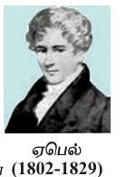

## 3.1 அறிமுகம் (Introduction)

இயற்கணித சமன்பாடுகளின் தீர்வைக் காண்பது கணிதத்தின் மிகப் பழமையான சவால்களில் ஒன்றாகும். அதிலும் குறிப்பாக பல்லுறுப்புக் கோவை சமன்பாடுகளின் மூலங்களைக் கண்டறிய முயல்வதுதான் எனலாம். ஏறத்தாழ கி.மு (பொ.ஆ.மு) 2000 ஆண்டு கால கட்டத்தைச் சார்ந்த சுமேரியர்கள் மற்றும் பாபிலோனியர்களில் ஆரம்பித்து, உலக நாடுகளின் பல்வேறு பகுதிகளான எகிப்து, கிரேக்கம், இந்தியா, சீன மற்றும் அரபு நாடுகளைச் சார்ந்த கணிதவியலாளர்கள் மற்றும் தத்துவ அறிஞர்கள் அனைவரும் பல்லுறுப்புக் கோவை சமன்பாடுகளுக்குத் தீர்வு காண விழைந்தனர்.

பண்டைய காலத்தில் கணிதவியலாளர்கள் கணக்குகளையும் அதன் தீர்வு முறைகளையும் முழுவதும் வார்த்தைகளால் வடித்தனர். பொது வழிமுறைகளைத் தவிர்த்து குறிப்பிட்ட தீர்வு அமையும் கணக்குகளில் ஆர்வம் செலுத்தினர். குறை எண்களைக் கொண்டுள்ள இருபடிச் சமன்பாடுகளுக்கான தீர்வினை பிரம்மகுப்தர்தான் முதல்முறையாகக் கண்டறிந்தார். பல்லுறுப்புக் கோவைகளை ஆராய்ந்த கணிதவியலாளர்களில் சிலர் யூக்லிட், டையோபான்டஸ், பிரம்மகுப்தர், உமர்கய்யாம், ஃபிபனோசி, டெஸ்கார்டே மற்றும் ரூபினி ஆகியோராவர்.

ஐந்தாம்படி சமன்பாடுகளின் தீர்வு காண இயற்கணித முறையில் சூத்திரமுறை ஏதுமில்லை என்பதை நிரூபிக்க புரிந்து கொள்ள சிரமப்படும் வகையில் மிக நீண்ட வாதங்களை முன்வைத்து நிரூபித்தார். இறுதியாக 1823 ஆண்டில் நார்வேஜியன் கணிதவியலாளரான ஏபெல் அதனை எளிய முறையில் நிரூபித்தார்.

ஒரு உற்பத்தி நிறுவனம் தன் தயாரிப்புகளை செவ்வக வடிவான பெட்டிகளில் அடைக்க விரும்புகின்றது. அந்த நிறுவனம் அகலத்தை விட ஆறு மடங்காக நீளம் அமையுமாறும், அடிமான நீளம் மற்றும் அகலத்தின் கூட்டுச் சராசரியாக உயரம் அமையுமாறும் பெட்டிகள் தயாரிக்கப்பட திட்டமிடுகின்றது. எனவே அந்த நிறுவனம் வரையறுக்கப்பட்ட கனஅளவு கொண்ட பெட்டியின் பல்வேறு பக்க அளவுகளின் சாத்தியக் கூறுகள் பற்றி அறிய விரும்புகின்றது.

அடிமானத்தின் அகலம் $$x$$ எனவும், நீளம் $$x+6$$ எனவும் மற்றும் உயரம் $$x+3$$ எனவும் கணக்கிடப்பட்டால் பெட்டியின் கன அளவு

$$
x(x+3)(x+6)
$$

என அமையும்.

கன அளவு 2618 ச.அடியாகக் கொண்டால்

$$
x(x+3)(x+6)=2618
$$

அதாவது,

$$
x^3+9x^2+18x=2618
$$

என அமையும்.

இச்சமன்பாட்டினைத் தீர்க்கும் வகையில் $x$-ன் மதிப்பு அமைந்தால் தேவையான அளவுகளுடன் பெட்டி அமையும்.

ஒரு வட்டமும் ஒரு நேர்க்கோடும் இரு புள்ளிகளுக்கு மேல் வெட்டிக் கொள்ளாது என நாம் அறிவோம். இதனை எங்ஙனம் நிரூபிப்பது? இத்தகைய கூற்றுகளை நிரூபிக்க கணிதச் சமன்பாடுகள் உதவுகின்றன.

$$x-y$$ தளத்தில் ஆதிபுள்ளியை மையமாகவும் $$r$$ ஐ ஆரமாகவும் உள்ள வட்டத்தின் சமன்பாடு

$$
x^2+y^2=r^2
$$

என அமையும்.

மேலும் இதே தளத்தில் அமைந்த ஒரு நேர்க்கோட்டின் சமன்பாடு

$$
ax+by+c=0
$$

என அறிவோம்.

இவ்வட்டமும் நேர்க்கோடும் வெட்டிக் கொள்ளும் புள்ளிகள் இரு சமன்பாடுகளையும் நிறைவு செய்யும். வேறு வகையில் சொல்வதென்றால்,

$$
x^2+y^2=r^2
$$

மற்றும்

$$
ax+by+c=0
$$

ஆகிய உடன்நிகழ் சமன்பாடுகளின் தீர்வுகளே வெட்டிக் கொள்ளும் புள்ளிகளைத் தரும்.

மேற்கண்ட சமன்பாடுகளின் தீர்விலிருந்துதான் அவை ஒன்றையொன்று தொடுகிறதா, இரு புள்ளிகளில் மட்டும் வெட்டுகின்றதா அல்லது வெட்டிக் கொள்வதே இல்லையா என நாம் தீர்மானிக்க இயலும்.

பண்டைய காலத்தில் குறிப்பிடப்பட்ட சில வடிவ உருவமைப்பு கணக்குகளில் கவராயமும், வரைகோலும் (அலகுகள் குறிப்பிடாத நேர் முனை) மட்டுமே பயன்படுத்தி வடிவத்தை உருவமைக்கும் கணக்குகள் உண்டு. சான்றாக, ஒரு சீரான அறுகோணம் மற்றும் 17 பக்கம் கொண்ட பலகோணமும் இத்தகைய முறையில் உருவமைக்கலாம். ஆனால் ஒரு எழுகோணத்தையோ அல்லது 18 பக்கம் கொண்ட பலகோணத்தையோ இவ்வாறு உருவாக்க இயலாது.

குறிப்பாக கீழ்க்காணும் மூன்று பிரபலமான கணக்குகளில் கவராயம் மற்றும் வரைகோல் ஆகிய இரண்டை மட்டும் பயன்படுத்தி உருவாக்க இயலாது.

- ஒரு கோணத்தை முக்கூறாக்குதல் (கொடுக்கப்பட்ட கோணத்தை மூன்று சமகோணங்களாகப் பிரித்தல்)

- வட்டத்தை சதுரமாக்கல் (கொடுக்கப்பட்ட வட்டத்தின் பரப்பளவுக்குச் சம பரப்பளவுள்ள ஒரு சதுரத்தினை உருவாக்குதல்)

- கன சதுரத்தை இரட்டிப்பாக்கல் (கொடுக்கப்பட்ட கனசதுரத்தின் கனஅளவுக்கு இரு மடங்கு இணையான ஒரு கனசதுரத்தினை உருவாக்குதல்)

இத்தகைய பண்டைய கணக்குகளுக்கான தீர்வுகள் இவற்றை பல்லுறுப்புக் கோவைக் கணக்குகளாக மாற்றிய பிறகே கண்டறிய இயன்றது; உண்மையில் இத்தகைய வடிவமைப்புகளை உருவாக்க இயலாது. ஒரு செயலைச் செய்ய இயலுமா அல்லது இயலாதா என நிரூபிக்க கணிதம் துணை புரிகின்றது.

நடைமுறை வாழ்வியல் பிரச்சினைகளுக்குத் தீர்வு காண வேண்டும் எனில், அவற்றினை கணிதவியலாளர்கள் கணக்காக மாற்றி, அறிந்த கணித முறைகளைப் பயன்படுத்தி கணிதத் தீர்வு எட்டியவுடன் மீண்டும் நடைமுறை வாழ்க்கைக்கு ஏற்ற வகையில் தீர்வினைத் தருவர். இத்தகைய மாற்றங்களுக்கு உட்படும் பல்வேறு வாழ்வியல் பிரச்சினைகள் கணிதத்தில் சமன்பாடுகளாகின்றன.

ஒரு பெட்டியின் அளவுகளைப் பற்றித் தீர்மானிக்கும்போதும், குறிப்பிட்ட வடிவியல் முடிவுகளை நிரூபிக்கும்போதும், சில வடிவமைப்புகளை உருவாக்க இயலாது என நிரூபிக்கும்போதும் அவை கணித சமன்பாடுகளாகின்றன.

இந்த அத்தியாயத்தில் சமன்பாடுகளின் சில கோட்பாடுகளைப் பற்றியும் குறிப்பாக பல்லுறுப்புக் கோவைச் சமன்பாடுகளைப் பற்றியும் அவற்றின் தீர்வுகளைப் பற்றியும் கற்போம்.

மேலும் பல்லுறுப்புக் கோவைகளின் சில பண்புகளைப் பற்றியும், கொடுக்கப்பட்டுள்ள மூலங்களிலிருந்து பல்லுறுப்புக் கோவைச் சமன்பாடுகளாக உருவாக்குதல், அடிப்படை இயற்கணித தேற்றம் அறிதல், பல்லுறுப்புக் கோவைகளின் மூலங்களில் மிகை மற்றும் குறை மூலங்களின் எண்ணிக்கை காணல் முதலியன கற்போம்.

இவற்றின் வாயிலாக குறிப்பிட்ட சில வகை பல்லுறுப்புச் சமன்பாடுகளின் தீர்வுத் தன்மையைக் காண்பது நமது இலக்காகும். சில பல்லுறுப்புக் கோவைகளாக மாற்ற இயலாத சமன்பாடுகளுக்கான தீர்வினை பல்லுறுப்பு சமன்பாடுகளின் வாயிலாக கண்டறிய உதவும் சில வழிமுறைகளைப் பற்றியும் கற்போம்.