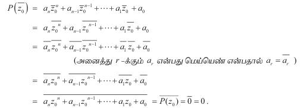

### 3.4 பல்லுறுப்புக் கோவைச் சமன்பாடுகளின் கெழுக்களின் பண்புகள் மற்றும் மூலங்களின் பண்புகள்

*(Nature of Roots and Nature of Coefficients of Polynomial Equations)*

#### 3.4.1 கற்பனை மூலங்கள் (Imaginary Roots)

மெய்யென் கெழுக்களுடைய ஒரு இருபடி சமன்பாட்டிற்கு $$\alpha + i\beta$$ என்பது ஒரு மூலம் எனில், $$\alpha - i\beta$$ என்பது ஒரு மூலமாகும். இப்பாடப்பகுதியில் உயர்படி பல்லுறுப்புக் கோவைகளுக்கும் இது பொருந்தும் என்பதை நிரூபிப்போம்.

இனி சமன்பாட்டியிலுள்ள மிக முக்கியத்துவம் வாய்ந்த தேற்றங்களில் ஒன்றை நிரூபிப்போம்.

**தேற்றம் 3.2 இணைக் கலப்பெண் மூலத் தேற்றம் (Complex Conjugate Root Theorem)**

மெய்யென் கெழுக்களுடைய ஒரு பல்லுறுப்புக் கோவை சமன்பாட்டிற்கு $$z_0$$ ஒரு கலப்பெண் மூலம் எனில், அதன் இணைக் கலப்பெண் அதாவது, $$\overline{z_0}$$ -ம் மூலமாக இருக்கும்.

**நிரூபணம்**

$$P(x) = a_n x^n + a_{n-1} x^{n-1} + \cdots + a_1 x + a_0 = 0$$

என்பது மெய்யெண் கெழுக்களுடைய ஒரு பல்லுறுப்புக் கோவைச் சமன்பாடு என்க. இப்பல்லுறுப்புக் கோவை சமன்பாட்டிற்கு $$z_0$$ என்பது ஒரு மூலம் என்க. எனவே, $$P(z_0) = 0$$ ஆகும். இனி

அதாவது $$P(\overline{z_0}) = 0$$; இதிலிருந்து எப்போதெல்லாம் $$z_0$$ மூலமாக இருக்கிறதோ, அப்போதெல்லாம் அதன் இணைக் கலப்பெண் $$\overline{z_0}$$ மூலமாக இருக்கும் என்பது தெளிவாகிறது.

எவரேனும் 2 ஒரு கலப்பெண்ணாகுமா என வினவினால், "ஆம்" எனும் விடையளிக்க சில மாணவர்கள் தயங்குவார்கள். ஒவ்வொரு முழு எண்ணும் ஒரு விகிதமுறு எண் என்பதால் ஒவ்வொரு மெய் எண்ணும் ஒரு கலப்பெண் ஆகும். எனவே மெய் எண் இல்லாத ஒரு கலப்பெண்ணை அதாவது $$\beta \neq 0$$ எனும்படி உள்ள $$\alpha + i\beta$$ எனும் அமைப்பில் உள்ள எண்களைக் குறிப்பிட "மெய்யற்ற கலப்பெண்" எனத் தெளிவாக குறிப்பிடுவோம். சில நூலாசிரியர்கள் இத்தகைய எண்ணைக் கற்பனை எண் எனக் குறிப்பிடுவதுண்டு.

> **குறிப்புரை 1:**
>
> $$z_0 = \alpha + i\beta$$ என்க. இங்கு $$\beta \neq 0$$ ஆகும். எனவே $$\overline{z_0} = \alpha - i\beta$$ ஆகும். $$P(x) = 0$$ எனும் மெய்யெண் கெழுக்கள் உடைய பல்லுறுப்புக் கோவை சமன்பாட்டின் ஒரு மூலம் $$\alpha + i\beta$$ எனில், இணைக் கலப்பெண் மூலத்தேற்றத்தின்படி $$\alpha - i\beta$$ என்பதும் $$P(x) = 0$$ -ன் ஒரு மூலமாகும். வழக்கமாக மேற்கண்ட வாக்கியத்தினை 'கலப்பெண் மூலங்கள் ஜோடி மூலங்களாகத்தான் அமையும்' என்பர். ஆனால் உண்மையில் பல்லுறுப்புக் கோவையின் கெழுக்கள் மெய்யெண்களாக இருப்பின், மெய்யற்ற கலப்பெண் மூலங்கள் இணைக்கலப்பெண் ஜோடி மூலங்களாக அமையும் எனப் பொருள் கொள்ள வேண்டும்.

> **குறிப்புரை 2:**
>
> இதிலிருந்து எந்தவொரு ஒற்றை எண்படி மெய்யெண் கெழுக்களுடைய பல்லுறுப்புக் கோவை சமன்பாட்டிற்கும் குறைந்தபட்சம் ஒரு மெய்யெண் மூலம் இருக்கும்; உண்மையில் மெய்யெண் கெழுக்களுடைய ஒற்றையெண்படி பல்லுறுப்புக் கோவை சமன்பாட்டின் மெய்யெண் மூலங்களின் எண்ணிக்கை ஒற்றைப்படை எண்ணாகத்தான் இருக்கும். அதேபோன்று மெய்யெண் கெழுக்களுடைய இரட்டையெண்படி பல்லுறுப்புக் கோவை சமன்பாட்டின் மெய்யெண் மூலங்களின் எண்ணிக்கை இரட்டைப்படை எண்ணாகத்தான் இருக்கும்.

**எடுத்துக்காட்டு 3.8**

$$2 - \sqrt{3}i$$ -ஐ மூலமாகக் கொண்ட குறைந்தபட்ச படியுடன் மெய்யெண் கெழுக்களுடைய தலைஒற்றைப் பல்லுறுப்புக் கோவைச் சமன்பாட்டை காண்க.

**தீர்வு**

மெய்யெண் கெழுக்களுடைய தேவையான பல்லுறுப்புக் கோவைச் சமன்பாட்டின் ஒரு மூலம் $$2 - \sqrt{3}i$$ என்பதால், $$2 + \sqrt{3}i$$ என்பதும் ஒரு மூலமாகும். எனவே, மூலங்களின் கூடுதல் 4 மற்றும் மூலங்களின் பெருக்கல்தொகை 7 ஆகும். ஆகையால் $$x^2 - 4x + 7 = 0$$ என்பது ஒரு மெய்யெண் கெழுக்களுடைய தேவைப்படும் தலைஒற்றைப் பல்லுறுப்புக் கோவைச் சமன்பாடாகும்.

### 3.4.2 விகிதமுறா எண் மூலங்கள் (Irrational Roots)

$$ax^2 + bx + c = 0$$ எனும் இருபடிச் சமன்பாட்டின் கெழுக்கள் விகிதமுறு எண்களாகத்தான் இருக்கவேண்டும் எனும் வரம்புக்கு உட்படுத்தினால் சில ஆர்வமூட்டும் முடிவுகளைப் பெறலாம். $$a, b$$ மற்றும் $$c$$ என விகிதமுறு எண்களுடைய ஒரு இருபடிச் சமன்பாடு $$ax^2 + bx + c = 0$$ என்க. வழக்கம்போல் $$\Delta = b^2 - 4ac$$ எனவும் $$r_1$$ மற்றும் $$r_2$$ ஆகியன மூலங்களாகவும் கொள்க. இச்சமயத்தில் $$\Delta = 0$$ எனில் $$r_1 = r_2$$ ஆகும். இந்த மூலம் மெய்யெண்ணாக மட்டுமல்ல, உண்மையில் இது ஒரு விகிதமுறு எண்ணாகும்.

$$\Delta$$ ஒரு மிகை எண் எனில் $$\mathbb{R}$$ -ல் $$\sqrt{\Delta}$$ எவ்வித ஐயத்திற்கும் இடமின்றி இருக்கும். மேலும் இரு வேறுபட்ட மெய்யெண் மதிப்புகளைப் பெறலாம்.

ஆனால் $$\sqrt{\Delta}$$ என்பது $$a, b$$ மற்றும் $$c$$ -ன் $$\Delta$$ -ன் குறிப்பிட்ட சில மதிப்புகளுக்கு மட்டுமே விகிதமுறு எண்ணாக அமையும். பிற மதிப்புகளுக்கு விகிதமுறா எண்ணாக அமையும்.

$$\sqrt{\Delta}$$ என்பது ஒரு விகிதமுறு எண் எனில் $$r_1$$ மற்றும் $$r_2$$ ஆகிய இரண்டுமே விகிதமுறு மதிப்பாக அமையும்.

$$\sqrt{\Delta}$$ என்பது ஒரு விகிதமுறா எண் எனில் $$r_1$$ மற்றும் $$r_2$$ ஆகிய இரண்டுமே விகிதமுறா மதிப்பாக அமையும்.

இத்தருணத்தில் $$\Delta > 0$$ எனில் எச்சமயங்களில், $$\sqrt{\Delta}$$ என்பது விகிதமுறு மதிப்பாகவே அன்றி விகிதமுறா மதிப்பாகவே அமையும் என ஒரு வினா நம்முன் எழுகிறது அன்றே? இதற்கு விடை காண வேண்டுமாயின், கெழுக்கள் விகிதமுறு எண்களாக இருப்பதால் $$\Delta$$ என்பதும் விகிதமுறு எண்ணாகத்தான் இருக்கும் என்பது கவனிக்கத் தக்கது. எனவே $$(m,n)$$ என்பது $$m$$ மற்றும் $$n$$ -ன் மீப்பெரு பொது வகுத்தி என்பதைக் குறிக்கும். $$(m,n) = 1$$ எனுமாறு $$m$$ மற்றும் $$n$$ என சில மிகை முழுக்களுக்கு $$\Delta = \frac{m}{n}$$ அமையும். இப்போது $$\sqrt{\Delta}$$ விகிதமுறு எண்ணாக இருந்தால் $$m$$ மற்றும் $$n$$ முழுவர்க்கங்களாக இருக்க வேண்டும். இதன் மறுதலையும் உண்மை என அறியலாம். மேலும் $$\sqrt{\Delta}$$ விகிதமுறா எண்ணாக இருந்தால் $$m$$ மற்றும் $$n$$ முழு வர்க்கமல்லாமல் இருக்க வேண்டும் என அறியலாம். இதன் மறுதலையும் உண்மையாகும்.

$$p$$ மற்றும் $$q$$ என்பவை விகிதமுறு எண்களாகவும் $$\sqrt{q}$$ என்பது விகிதமுறா எண்ணாகவும் அமைந்த $$p + \sqrt{q}$$ எனும் விகிதமுறா எண் வகை நமக்கு முன்னே பரிச்சயமானதாகும். இத்தகைய எண்களை முருடு என அழைக்கிறோம். கலப்பெண் மூலங்களைப் போன்றே, ஒரு பல்லுறுப்புக் கோவையின் மூலம் $$p + \sqrt{q}$$ எனில் $$p - \sqrt{q}$$ என்பது அதே பல்லுறுப்புக் கோவைக்கு அனைத்து கெழுக்களும் விகிதமுறு எண்களாக இருக்கும் பட்சத்தில், ஒரு மூலமாக அமையும். கலப்பெண் மூலங்களை நிரூபிக்கப் பயன்படுத்திய அதே வழிமுறையை இங்கு பயன்படுத்தி இக்கூற்று எந்தவொரு படி பல்லுறுப்புக் கோவை சமன்பாட்டிற்கும் பொருந்தும் என நிரூபிக்க இயலும் என்றாலும் இருபடி பல்லுறுப்புக் கோவைக்கு மட்டும் தேற்றம் 3.3 வாயிலாக நிரூபிப்போம்.

தேற்றத்தை நிரூபிக்கும் முன்னர் நாம் பின்வரும் கருத்துக்களை நினைவுகூட வேண்டியது அவசியமாகும். $$a$$ மற்றும் $$b$$ என்பன விகிதமுறு எண்களாகவும் $$c$$ என்பது ஒரு விகிதமுறா எண்ணாகவும் அமைந்த $$a + bc$$ என்பது ஒரு விகிதமுறு எண் அமையவேண்டுமானால் உறுதியாக $$b$$ என்பது பூச்சியமாகத்தான் இருக்க வேண்டும். மேலும் $$a + bc = 0$$ எனில் $$a$$ மற்றும் $$b$$ இரண்டுமே பூச்சியமாகத்தான் இருக்க வேண்டும்.

**தேற்றம் 3.3**

$$p$$ மற்றும் $$q$$ என்பவை விகிதமுறு எண்களாகவும் $$\sqrt{q}$$ என்பது விகிதமுறா எண்ணாகவும் கொள்க.

அனைத்து கெழுக்களும் விகிதமுறு எண்களாக இருக்கும் ஓர் இருபடிச் சமன்பாட்டின் ஒரு மூலம் $$p + \sqrt{q}$$ எனில் $$p - \sqrt{q}$$ என்பதும் அதே இருபடிச் சமன்பாட்டின் மூலமாக அமையும்.

**நிரூபணம்**

இருபடிச் சமன்பாட்டினை ஓர் தலைஒற்றை பல்லுறுப்புக் கோவையாகக் கருதி இத்தேற்றத்தை நிறுவுவோம். இதே போன்று, பிற பல்லுறுப்புக் கோவைகளுக்கும் நிறுவலாம்.

$$p$$ மற்றும் $$q$$ என்பவை விகிதமுறு எண்களாகவும் $$\sqrt{q}$$ என்பது விகிதமுறா எண்ணாகவும் கொள்க.

$$x^2 + bx + c = 0$$ எனும் சமன்பாட்டிற்கு $$p + \sqrt{q}$$ என்பது ஒரு மூலம் என்க. இங்கு $$b$$ மற்றும் $$c$$ விகிதமுறு எண்களாகும்.

$$\alpha$$ என்பது மற்றொரு மூலம் என்க. மூலங்களின் கூட்டுத்தொகையைக் கணக்கிடும்போது,

$$
\alpha + p + \sqrt{q} = -b
$$

எனவே $$\alpha + \sqrt{q} = -b - p \in \mathbb{Q}$$. மேலும், $$-b - p$$ என்பதை $$s$$ என்க. எனவே, $$\alpha + \sqrt{q} = s$$ ஆகும்.

இதிலிருந்து

$$
\alpha = s - \sqrt{q}
$$

ஆகும்.

மூலங்களின் பெருக்குத்தொகையைக் கணக்கிடும்போது,

$$
(s - \sqrt{q})(p + \sqrt{q}) = c
$$

எனவே $$(sp - q) + (s - p)\sqrt{q} = c \in \mathbb{Q}$$. எனவே, $$s - p = 0$$. இதிலிருந்து, $$s = p$$ ஆகும். ஆகையால்,

$$
\alpha = p - \sqrt{q}
$$

எனவே மற்ற மூலம் $$p - \sqrt{q}$$ ஆகும்.

> **குறிப்புரை:**
>
> தேற்றம் 3.3-ன் கூற்று காண எளியதாகத் தோன்றினாலும் புரிந்து கொள்வது கடினம். மேற்கண்ட தேற்றத்தின் கூற்றினைச் சுருக்கி "விகிதமுறு கெழுக்களைக் கொண்ட ஒரு பல்லுறுப்புக் கோவை சமன்பாட்டின் விகிதமுறா மூலங்கள் ஜோடியாகத்தான் நிகழும்" என்பது தவறு. ஏனெனில், $$x^3 - 2$$ எனும் சமன்பாட்டிற்கு ஒரே ஒரு விகிதமுறா எண் மூலம், அதாவது $$\sqrt[3]{2}$$ உள்ளது. நிச்சயமாகவே மற்ற இரு மூலங்களும் மெய்யற்ற கலப்பெண் எண்களாக அமைகின்றது. (அவை யாவை?)

**எடுத்துக்காட்டு 3.9**

$$2 - \sqrt{3}$$ -ஐ மூலமாகக் கொண்ட குறைந்தபட்ச படியுடன் விகிதமுறு கெழுக்களுடைய பல்லுறுப்புக் கோவைச் சமன்பாட்டைக் காண்க.

**தீர்வு**

$$2 - \sqrt{3}$$ என்பது ஒரு மூலம் என்பதாலும் மற்றும் கெழுக்கள் விகிதமுறு எண்களாக இருப்பதாலும், $$2 + \sqrt{3}$$ என்பதும் ஒரு மூலமாகும்.

$$
x^2 - (\text{மூலங்களின் கூடுதல்})x + \text{மூலங்களின் பெருக்கல்தொகை} = 0
$$

என்பது நமக்குத் தேவையான பல்லுறுப்புக் கோவை சமன்பாடாகும். எனவே,

$$
x^2 - 4x + 1 = 0
$$

என்பது நமக்குத் தேவையானப் பல்லுறுப்புக் கோவை சமன்பாடாகும்.

> **குறிப்பு:**
>
> இங்கு வினாவில் "விகிதமுறு கெழுக்கள்" எனும் சொற்றொடர் அத்தியாவசியமானது. இல்லையெனில், $$x - (2 - \sqrt{3}) = 0$$ என்பது $$2 - \sqrt{3}$$ -ஐ மூலமாகக் கொண்ட பல்லுறுப்புக் கோவைச் சமன்பாடாக உள்ளது. ஆனால் இதற்கு $$2 + \sqrt{3}$$ மூலமல்ல. கீழ்க்காணும் தேற்றம் நிரூபணம் இன்றி தரப்பட்டுள்ளது.

**தேற்றம் 3.4**

$$p$$ மற்றும் $$q$$ ஆகியவை விகிதமுறு எண்களாகவும் $$\sqrt{p}$$ மற்றும் $$\sqrt{q}$$ ஆகியவை விகிதமுறா எண்களாகவும் அமைகிறது என்க. மேலும் $$\sqrt{p}$$ மற்றும் $$\sqrt{q}$$ ஆகிய இவற்றுள் ஒன்று மற்றொன்றின் விகிதமுறு மடங்காக இன்றி அமைகிறது என்க. $$\sqrt{p} + \sqrt{q}$$ என்பது விகிதமுறு எண்களை கெழுக்களாகக் கொண்ட ஒரு பல்லுறுப்புக் கோவைச் சமன்பாட்டின் மூலம் எனில், $$\sqrt{p} - \sqrt{q}$$, $$-\sqrt{p} + \sqrt{q}$$ மற்றும் $$-\sqrt{p} - \sqrt{q}$$ ஆகியவையும் அதே பல்லுறுப்புக் கோவை சமன்பாட்டின் மூலங்களாக அமையும்.

**எடுத்துக்காட்டு 3.10**

$$\sqrt{\frac{2}{3}}$$ -ஐ ஒரு மூலமாகவும் முழுக்களை கெழுக்களாகவும் கொண்ட ஒரு பல்லுறுப்புக் கோவைச் சமன்பாட்டைக் காண்க.

**தீர்வு**

$$\sqrt{\frac{2}{3}}$$ என்பது ஒரு மூலம் என்பதால் $$x - \sqrt{\frac{2}{3}}$$ என்பது ஒரு காரணியாகும். வெளிப்புறமுள்ள வர்க்கமூலத்தை நீக்க $$x + \sqrt{\frac{2}{3}}$$ என்பதை மற்றொரு காரணியாக எடுத்துக்கொண்டு இவை இரண்டையும் பெருக்க,

$$
\left(x - \sqrt{\frac{2}{3}}\right)\left(x + \sqrt{\frac{2}{3}}\right) = x^2 - \frac{2}{3}
$$

எனப்பெறுகிறோம்.

இருப்பினும் நாம் இன்னும் இலக்கை அடையவில்லை. எனவே, $$x^2 + \frac{2}{3}$$ என்பதை மற்றொரு காரணியாகக் கொண்டு இரண்டையும் பெருக்கினால்

$$
\left(x^2 - \frac{2}{3}\right)\left(x^2 + \frac{2}{3}\right) = x^4 - \frac{4}{9}
$$

எனக் கிடைக்கிறது. எனவே, தேவையான பண்புகளுடைய பல்லுறுப்புக் கோவைச் சமன்பாடு

$$
9x^4 - 4 = 0
$$

ஆகும்.

### 3.4.3 விகிதமுறு மூலங்கள் (Rational Roots)

ஒரு இருபடிச் சமன்பாட்டின் கெழுக்கள் அனைத்தும் முழுக்கள் எனில் $$\Delta$$ -ம் ஒரு முழு எண், மேலும் அது மிகை எண் எனில் $$\sqrt{\Delta}$$ ஒரு விகிதமுறு எண்ணாக அமைய $$\Delta$$ ஒரு முழு வர்க்கமாக இருக்க வேண்டும். இதன் மறுதலையும் உண்மை. வேறுவகையில் கூறுவதென்றால் முழு எண்களைக் கெழுக்களாக கொண்ட $$ax^2 + bx + c = 0$$ என்ற சமன்பாட்டில் மூலங்கள் விகிதமுறு எண்கள் எனில் $$ax^2 + bx + c = 0$$ ஒரு முழுவர்க்கமாகும். மறுதலையாக $$\Delta$$ ஒரு முழு வர்க்கம் எனில் மூலங்கள் விகிதமுறு எண்களாகும்.

விகிதமுறு எண்களை கெழுக்களாக உள்ள பல்லுறுப்புக் கோவைச் சமன்பாடுகள் நாம் ஆராய்ந்த அனைத்தும் முழு எண்களை கெழுக்களாக உள்ள பல்லுறுப்புக் கோவைச் சமன்பாடுகளுக்கும் பொருந்தும். உண்மையில் விகிதமுறு எண்களை கெழுக்களாகக் கொண்டுள்ள பல்லுறுப்புக் கோவை சமன்பாடுகளை, கெழுக்களின் விகிதங்களின் பொதுவான மடங்கால் பெருக்கினால் முழுக்களை கெழுக்களாகக் கொண்ட பல்லுறுப்புக் கோவைச் சமன்பாடுகளாக அதே மூலங்களுடன் அமையும்.

உறுதியாகவே இத்தருணத்தை மிகுந்த கவனத்துடன் கையாள வேண்டும். உதாரணமாக, $$\frac{1}{2}$$ ஐ மூலமாகக் கொண்ட விகிதமுறு எண்களை கெழுக்களாகக் கொண்ட ஒரு படி உள்ள ஒற்றை பல்லுறுப்புக் கோவைச் சமன்பாடு அமைந்தாலும் $$\frac{1}{2}$$ ஐ மூலமாகக் கொண்ட முழு எண்களை கெழுக்களாகக் கொண்ட எந்த படியுள்ள ஒற்றை பல்லுறுப்புக் கோவை இல்லை.

**எடுத்துக்காட்டு 3.11**

$$2x^2 - 6x + 7 = 0$$ என்ற சமன்பாட்டிற்கு $$x$$ -ன் எந்த மெய்யெண் மதிப்பும் தீர்வைத் தராது எனக் காட்டுக.

**தீர்வு**

$$
\Delta = b^2 - 4ac = (-6)^2 - 4(2)(7) = 36 - 56 = -20 < 0
$$

எனவே மூலங்கள் கற்பனை எண்களாகும்.

**எடுத்துக்காட்டு 3.12**

$$x^2 + 2(k + 2)x + 9k = 0$$ என்ற சமன்பாட்டின் மூலங்கள் சமம் எனில், $$k$$ மதிப்பு காண்க.

**தீர்வு**

இங்கு மூலங்கள் சமம் என்பதால் $$\Delta = 0$$ ஆகும்.

$$
\Delta = [2(k+2)]^2 - 4(1)(9k) = 0
$$

$$
4(k+2)^2 = 36k
$$

$$
(k+2)^2 = 9k
$$

$$
k^2 + 4k + 4 = 9k
$$

$$
k^2 - 5k + 4 = 0
$$

$$
(k-1)(k-4) = 0
$$

$$
k = 1 \quad \text{அல்லது} \quad k = 4
$$

**எடுத்துக்காட்டு 3.13**

$$p, q, r$$ ஆகியவை விகிதமுறு எண்கள் எனில்

$$
x^2 - 2px + p^2 - q^2 + 2qr - r^2 = 0
$$

என்ற சமன்பாட்டின் மூலங்கள் விகிதமுறு எண்களாகும் என நிரூபிக்க.

**தீர்வு**

மூலங்கள் விகிதமுறு எண்களாக இருக்க வேண்டுமெனில், $$\Delta$$ முழு வர்க்கமாக இருக்க வேண்டும்.

$$
\Delta = b^2 - 4ac = (-2p)^2 - 4(1)(p^2 - q^2 + 2qr - r^2)
$$

$$
= 4p^2 - 4(p^2 - q^2 + 2qr - r^2)
$$

$$
= 4p^2 - 4p^2 + 4q^2 - 8qr + 4r^2
$$

$$
= 4(q^2 - 2qr + r^2)
$$

$$
= 4(q - r)^2 = [2(q-r)]^2
$$

இது ஒரு முழு வர்க்கமாகும். எனவே, மூலங்கள் விகிதமுறு எண்களாகும்.